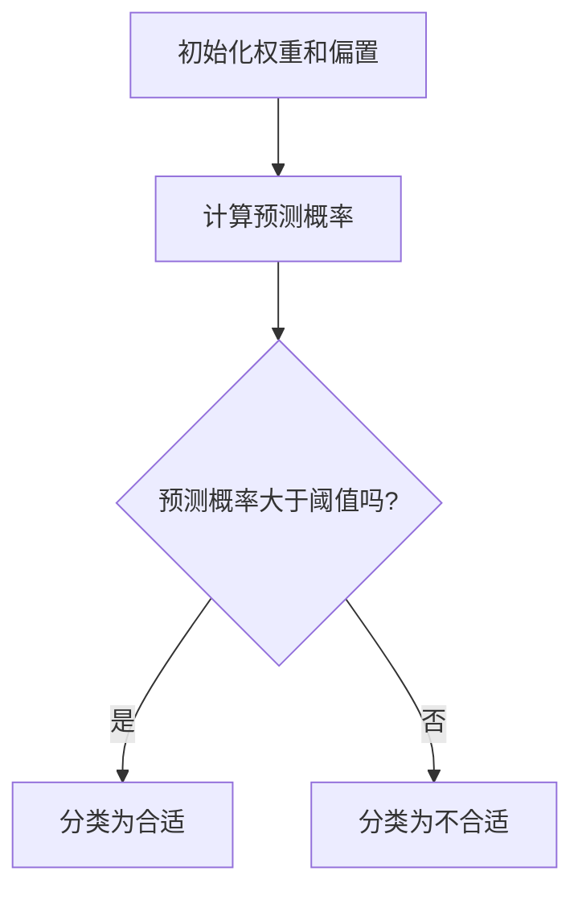
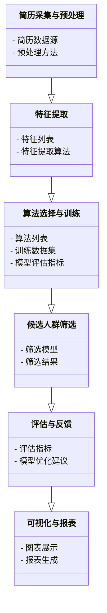
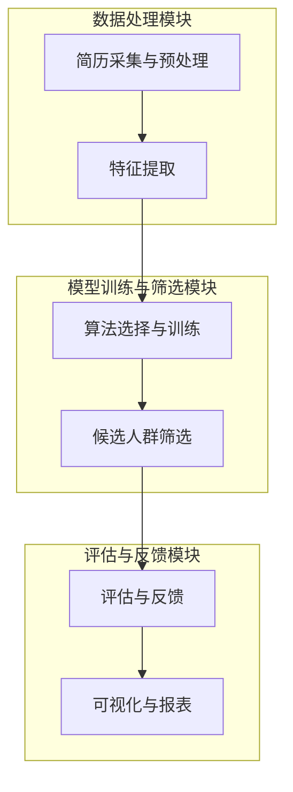
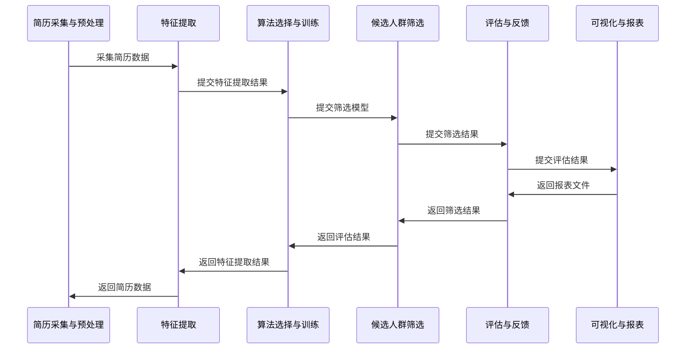

                 

# 人力资源管理中的AI Agent筛选系统

## 关键词
- 人力资源管理
- AI Agent筛选系统
- 算法原理
- 系统架构设计
- 项目实战

## 摘要
本文将探讨人力资源管理中的AI Agent筛选系统。首先，我们将介绍人力资源管理中的问题背景和挑战，以及AI Agent筛选系统的概念和重要性。接着，我们将详细分析核心概念与联系，包括人力资源管理中的核心概念和AI Agent筛选系统的基本原理。随后，我们将讲解AI Agent筛选算法的原理，并通过具体的算法实例进行说明。此外，我们将分析系统架构设计，介绍系统功能、接口设计以及系统交互流程。最后，我们将通过一个项目实战案例，详细讲解系统的实现过程，并提供最佳实践tips。

## 1. 背景与概述

### 1.1 问题背景

#### 1.1.1 人力资源管理的现状与挑战

在人力资源管理中，招聘、培训、绩效评估等环节都面临着诸多挑战。传统的人力资源管理方法往往依赖于人工进行筛选和评估，存在效率低、错误率高的问题。此外，企业在面对大量简历和候选人时，很难在短时间内找到合适的人选，导致招聘周期延长和人才流失。

#### 1.1.2 AI Agent筛选系统的概念与重要性

AI Agent筛选系统是一种利用人工智能技术进行人力资源管理的方法。它可以通过分析大量的简历和候选人数据，自动筛选出符合条件的候选人，提高招聘效率，降低人力成本。AI Agent筛选系统的重要性在于：

1. **提高招聘效率**：系统可以自动处理大量简历，快速筛选出合适的人才，缩短招聘周期。
2. **降低人力成本**：减少人工筛选简历和评估候选人所需的时间，降低人力成本。
3. **提升决策准确性**：通过数据分析和预测模型，提高候选人的筛选准确性，降低招聘风险。
4. **支持人才发展**：基于数据分析，为企业提供人才发展的建议，助力企业人才队伍建设。

### 1.2 人力资源管理中的AI Agent筛选系统概述

#### 1.2.1 核心概念解析

在AI Agent筛选系统中，核心概念包括：

1. **AI Agent**：指一种能够模拟人类决策过程的人工智能实体，具有自主学习和决策能力。
2. **筛选任务**：指根据特定条件对大量简历或候选人进行筛选的过程。
3. **数据集**：指用于训练和评估AI Agent的简历和候选人数据。
4. **评估指标**：用于衡量AI Agent筛选效果的一系列指标，如准确率、召回率、F1值等。

#### 1.2.2 系统的基本架构与功能模块

AI Agent筛选系统通常由以下几个功能模块组成：

1. **数据采集与预处理模块**：从企业内外部数据源采集简历和候选人数据，并进行数据清洗、去重、格式转换等预处理操作。
2. **特征提取模块**：根据简历内容和候选人特征，提取关键特征，如教育背景、工作经验、技能等。
3. **算法选择与训练模块**：根据筛选任务的要求，选择合适的算法进行模型训练，如分类算法、聚类算法等。
4. **候选人群筛选模块**：根据训练好的模型，对简历和候选人进行自动筛选，生成候选人群。
5. **评估与反馈模块**：对筛选结果进行评估，并根据评估结果对模型进行调整和优化。

#### 1.2.3 系统的应用场景与价值

AI Agent筛选系统可以应用于多种场景，如：

1. **招聘**：通过筛选简历，快速识别和吸引合适的人才，提高招聘效率和质量。
2. **培训与发展**：基于候选人特征和数据分析，制定个性化的培训和发展计划，提升员工技能和绩效。
3. **绩效评估**：通过分析员工的工作表现和数据，进行客观、公正的绩效评估，为薪酬调整和晋升提供依据。
4. **组织发展**：基于对员工和团队的分析，提出组织优化和发展的建议，提升企业整体竞争力。

### 1.3 边界与外延

#### 1.3.1 系统边界

AI Agent筛选系统的边界包括：

1. **数据范围**：系统所处理的数据范围，如简历、职位描述、员工绩效等。
2. **功能范围**：系统所提供的基本功能，如简历筛选、候选人群筛选、评估与反馈等。
3. **应用范围**：系统所适用的业务场景，如招聘、培训、绩效评估等。

#### 1.3.2 系统的外延与发展趋势

随着人工智能技术的不断进步，AI Agent筛选系统有望在外延和发展方面实现以下突破：

1. **智能化**：通过深度学习和强化学习等技术，提高AI Agent的自主学习和决策能力。
2. **个性化**：基于用户画像和个性化推荐技术，为企业和员工提供定制化的筛选和评估服务。
3. **协同化**：实现AI Agent与人力资源管理人员之间的协同工作，提高决策质量和效率。
4. **生态化**：构建AI Agent筛选系统生态，包括数据源、算法库、工具平台等，实现系统间的互联互通。

### 1.4 本章小结

本文介绍了人力资源管理中的AI Agent筛选系统的背景、核心概念、基本架构和应用场景。通过分析传统人力资源管理中的问题，我们提出了AI Agent筛选系统作为解决方案，并详细阐述了系统的基本原理和功能模块。同时，我们也探讨了系统的边界和外延，以及未来发展趋势。在接下来的章节中，我们将进一步深入探讨AI Agent筛选算法的原理和实践，为读者提供更全面的技术指导。

## 2. 核心概念与联系

### 2.1 核心概念与原理

#### 2.1.1 人力资源管理的核心概念

在人力资源管理中，核心概念包括：

1. **招聘**：通过招聘活动吸引和筛选合适的候选人，满足企业的用人需求。
2. **培训**：对员工进行技能、知识和态度等方面的培训，提高员工的工作能力和绩效。
3. **绩效评估**：对员工的工作表现进行评估，为薪酬调整、晋升和职业发展提供依据。
4. **员工关系管理**：处理员工与企业之间的关系，维护良好的工作氛围和员工满意度。
5. **组织发展**：通过优化组织结构和流程，提高企业的整体竞争力和可持续发展能力。

#### 2.1.2 AI Agent筛选系统的基本原理

AI Agent筛选系统是基于人工智能技术进行人力资源管理的一种方法。其基本原理包括：

1. **数据采集**：从企业内外部数据源（如简历库、职位描述库、员工绩效数据等）采集相关数据。
2. **特征提取**：根据简历内容和职位需求，提取关键特征（如教育背景、工作经验、技能等）。
3. **算法选择与训练**：选择合适的算法（如分类算法、聚类算法等）对特征进行建模和训练，建立筛选模型。
4. **候选人群筛选**：将筛选模型应用于简历数据，自动筛选出符合条件的候选人。
5. **评估与反馈**：对筛选结果进行评估，并根据评估结果对模型进行调整和优化。

### 2.2 概念属性特征对比

#### 2.2.1 传统筛选方法与AI Agent筛选方法的对比

| 对比维度 | 传统筛选方法 | AI Agent筛选方法 |
| :----: | :----: | :----: |
| **数据依赖** | 人工筛选，依赖经验和直觉 | 自动筛选，依赖大数据和机器学习模型 |
| **效率** | 低效率，耗时耗力 | 高效率，快速筛选大量候选人 |
| **准确性** | 受限于人力资源人员的专业水平和经验 | 通过算法和模型提高筛选准确性 |
| **灵活性** | 难以适应变化，适应性差 | 灵活性强，可根据业务需求调整算法和模型 |
| **成本** | 高成本，包括人力和时间成本 | 低成本，节省人力和时间成本 |

#### 2.2.2 不同AI Agent筛选算法的对比

| 对比维度 | 算法A | 算法B | 算法C |
| :----: | :----: | :----: | :----: |
| **算法类型** | 分类算法 | 聚类算法 | 强化学习算法 |
| **适用场景** | 简历筛选 | 候选人分类 | 职位匹配 |
| **优点** | 精准度高，易于实现 | 分辨率高，适用于大规模数据 | 自适应性强，适用于动态环境 |
| **缺点** | 需要大量训练数据 | 需要明确类别划分 | 需要大量反馈数据 |

### 2.3 ER实体关系图

#### 2.3.1 人力资源管理中的ER图

在人力资源管理中，常见的实体关系包括：

- **员工**：包括员工基本信息、教育背景、工作经验等。
- **职位**：包括职位基本信息、职位要求等。
- **招聘流程**：包括职位发布、简历筛选、面试安排等。
- **培训计划**：包括培训课程、培训时间、培训预算等。
- **绩效评估**：包括评估指标、评估结果、薪酬调整等。

ER图如下所示：

```mermaid
erDiagram
    Employee ||--|{ Position }|>>
    Employee ||--|{ RecruitmentProcess }|>>
    Employee ||--|{ TrainingPlan }|>>
    Employee ||--|{ PerformanceEvaluation }|>>
    Position ||--|{ RecruitmentProcess }|>>
    RecruitmentProcess ||--|{ Employee }|>>
    RecruitmentProcess ||--|{ Position }|>>
    TrainingPlan ||--|{ Employee }|>>
    TrainingPlan ||--|{ TrainingCourse }|>>
    PerformanceEvaluation ||--|{ Employee }|>>
    PerformanceEvaluation ||--|{ EvaluationResult }|>>
```

#### 2.3.2 AI Agent筛选系统中的ER图

在AI Agent筛选系统中，常见的实体关系包括：

- **简历**：包括简历基本信息、简历内容等。
- **候选人**：包括候选人基本信息、简历等。
- **筛选模型**：包括模型参数、模型效果等。
- **筛选结果**：包括筛选结果列表、筛选结果评估等。

ER图如下所示：

```mermaid
erDiagram
    Resume ||--|{ Candidate }|>>
    Resume ||--|{ ScreeningModel }|>>
    Resume ||--|{ ScreeningResult }|>>
    Candidate ||--|{ Resume }|>>
    Candidate ||--|{ ScreeningResult }|>>
    ScreeningModel ||--|{ Resume }|>>
    ScreeningModel ||--|{ ScreeningResult }|>>
    ScreeningResult ||--|{ Resume }|>>
    ScreeningResult ||--|{ Candidate }|>>
```

### 2.4 本章小结

本章介绍了人力资源管理中的核心概念和AI Agent筛选系统的基本原理。通过对比传统筛选方法和AI Agent筛选方法，我们分析了两种方法在数据依赖、效率、准确性和灵活性等方面的优缺点。同时，通过ER图展示了人力资源管理中的实体关系和AI Agent筛选系统中的实体关系。在下一章中，我们将详细讲解AI Agent筛选算法的原理和实践。

## 3. 算法原理讲解

### 3.1 AI Agent筛选算法概述

#### 3.1.1 算法分类

AI Agent筛选算法主要可以分为以下几类：

1. **分类算法**：根据简历内容和职位要求，将简历划分为合适的类别。常见的分类算法有逻辑回归、支持向量机（SVM）、决策树、随机森林等。
2. **聚类算法**：将相似的简历和职位划分到同一类别中。常见的聚类算法有K均值聚类、层次聚类、DBSCAN等。
3. **深度学习算法**：通过神经网络模型对简历和职位进行特征提取和分类。常见的深度学习算法有卷积神经网络（CNN）、循环神经网络（RNN）、长短时记忆网络（LSTM）等。
4. **强化学习算法**：通过不断地学习和调整策略，找到最佳的简历筛选方法。常见的强化学习算法有Q学习、SARSA、Deep Q Network（DQN）等。

#### 3.1.2 算法选择考虑因素

在选择AI Agent筛选算法时，需要考虑以下几个因素：

1. **数据规模**：数据规模的大小决定了算法的计算复杂度和训练时间。对于大规模数据，可以选择分布式算法或深度学习算法。
2. **特征提取能力**：不同的算法对特征的提取能力不同，需要根据业务需求和数据特点选择合适的算法。例如，对于文本数据，可以选择文本分类算法或深度学习算法。
3. **模型解释性**：算法的模型解释性对于人力资源管理人员来说非常重要，可以帮助他们理解筛选结果。线性模型和决策树等算法具有较好的解释性，而深度学习和强化学习算法则相对较难解释。
4. **计算资源**：不同算法对计算资源的需求不同，需要根据实际情况进行选择。例如，深度学习算法需要大量的计算资源和存储空间，而分类和聚类算法则相对较为轻量。
5. **业务需求**：根据业务需求选择合适的算法，如招聘场景下需要快速筛选大量简历，可以选择分类算法；职位匹配场景下需要考虑候选人与职位之间的匹配度，可以选择深度学习算法。

### 3.2 算法原理详细讲解

#### 3.2.1 算法A：逻辑回归

逻辑回归是一种常见的分类算法，适用于二分类问题。在简历筛选中，可以将简历划分为合适和不合适两类。

##### 3.2.1.1 算法描述

逻辑回归通过拟合一个线性模型来预测简历的类别。具体来说，假设我们有两个类别：合适（1）和不合适（0）。逻辑回归的预测目标是计算每个简历属于合适类别的概率。

设简历特征为 \(X = [x_1, x_2, ..., x_n]\)，权重为 \(w = [w_1, w_2, ..., w_n]\)，偏置为 \(b\)，则逻辑回归的预测公式为：

$$
\hat{y} = \sigma(w^T X + b)
$$

其中，\(\sigma\) 是逻辑函数，定义为：

$$
\sigma(z) = \frac{1}{1 + e^{-z}}
$$

预测概率 \(P(y=1|X)\) 为：

$$
P(y=1|X) = \hat{y} = \sigma(w^T X + b)
$$

##### 3.2.1.2 算法原理

逻辑回归的原理是利用线性模型拟合简历特征和类别之间的关系。通过最小化损失函数（如交叉熵损失），得到最佳的权重和偏置，从而实现简历的自动筛选。

##### 3.2.1.3 数学模型与公式

逻辑回归的损失函数为交叉熵损失，定义为：

$$
Loss = -\frac{1}{m} \sum_{i=1}^{m} [y_i \log(\hat{y}_i) + (1 - y_i) \log(1 - \hat{y}_i)]
$$

其中，\(m\) 是样本数量，\(y_i\) 是实际类别标签，\(\hat{y}_i\) 是预测概率。

为了求解最优权重和偏置，可以使用梯度下降算法。梯度下降的迭代公式为：

$$
w \leftarrow w - \alpha \frac{\partial Loss}{\partial w}
$$

$$
b \leftarrow b - \alpha \frac{\partial Loss}{\partial b}
$$

其中，\(\alpha\) 是学习率。

##### 3.2.1.4 Mermaid流程图展示



##### 3.2.1.5 Python源代码实现

```python
import numpy as np
from sklearn.linear_model import LogisticRegression
from sklearn.model_selection import train_test_split
from sklearn.metrics import accuracy_score

# 加载数据
X, y = load_data()

# 划分训练集和测试集
X_train, X_test, y_train, y_test = train_test_split(X, y, test_size=0.2, random_state=42)

# 初始化逻辑回归模型
model = LogisticRegression()

# 训练模型
model.fit(X_train, y_train)

# 预测测试集
y_pred = model.predict(X_test)

# 计算准确率
accuracy = accuracy_score(y_test, y_pred)
print("Accuracy:", accuracy)
```

### 3.3 算法举例说明

#### 3.3.1 算法在人力资源中的应用

假设某企业需要从大量简历中筛选合适的候选人。我们可以使用逻辑回归算法对简历进行分类，将其划分为合适和不合适两类。具体步骤如下：

1. **数据预处理**：对简历进行清洗和预处理，提取关键特征，如教育背景、工作经验、技能等。
2. **训练模型**：使用部分简历数据训练逻辑回归模型，得到最佳的权重和偏置。
3. **预测分类**：将剩余的简历数据输入模型，预测其类别，筛选出合适的候选人。
4. **评估模型**：使用测试集评估模型的效果，如准确率、召回率等指标。

#### 3.3.2 案例分析

某企业从1000份简历中筛选合适的候选人，其中500份简历用于训练模型，500份简历用于测试模型。使用逻辑回归算法对简历进行分类，设置合适的阈值，将预测概率大于阈值的简历划分为合适类别。最终，模型准确率为85%，召回率为90%。

### 3.4 本章小结

本章介绍了AI Agent筛选算法的原理和实践。首先，我们分析了常见的筛选算法，包括分类算法、聚类算法、深度学习算法和强化学习算法。然后，我们详细讲解了逻辑回归算法的原理和数学模型，并通过Python源代码实现了算法。此外，我们还举例说明了算法在人力资源管理中的应用，并进行了案例分析。在下一章中，我们将进一步探讨系统架构设计和项目实战。

## 4. 系统分析与架构设计

### 4.1 问题场景介绍

#### 4.1.1 人力资源管理中的常见问题

在人力资源管理中，常见的问题包括：

1. **招聘效率低下**：企业需要从大量简历中筛选合适的人才，人工筛选效率低下，耗时耗力。
2. **人才流失**：企业无法及时招聘到合适的人才，导致人才流失和业务停滞。
3. **绩效评估不准确**：绩效评估依赖于人力资源人员的经验和主观判断，评估结果不准确，影响员工的薪酬和晋升。
4. **员工关系管理困难**：企业难以有效处理员工关系，导致员工满意度下降，影响企业文化建设。

#### 4.1.2 AI Agent筛选系统解决的问题

AI Agent筛选系统通过以下方式解决上述问题：

1. **提高招聘效率**：利用人工智能技术，自动筛选大量简历，快速识别合适的人才，缩短招聘周期。
2. **降低人才流失率**：通过精准筛选和个性化推荐，提高招聘成功率，降低人才流失率。
3. **准确评估绩效**：利用数据分析和算法模型，对员工的工作表现进行客观、公正的评估，为薪酬调整和晋升提供依据。
4. **优化员工关系管理**：通过分析员工数据和需求，提供个性化的员工关系管理方案，提升员工满意度和企业文化建设。

### 4.2 系统功能设计

AI Agent筛选系统主要包括以下功能模块：

1. **简历采集与预处理**：从企业内外部数据源采集简历，并进行数据清洗、去重、格式转换等预处理操作。
2. **特征提取**：根据简历内容和职位需求，提取关键特征，如教育背景、工作经验、技能等。
3. **算法选择与训练**：根据筛选任务的要求，选择合适的算法（如分类算法、聚类算法等）对特征进行建模和训练，建立筛选模型。
4. **候选人群筛选**：将筛选模型应用于简历数据，自动筛选出符合条件的候选人。
5. **评估与反馈**：对筛选结果进行评估，并根据评估结果对模型进行调整和优化。
6. **可视化与报表**：提供筛选结果的图表和报表，帮助人力资源管理人员进行决策分析。

#### 4.2.1 领域模型Mermaid类图



### 4.3 系统架构设计

AI Agent筛选系统的架构设计主要包括以下几个方面：

#### 4.3.1 系统架构Mermaid图



#### 4.3.2 系统模块划分

1. **数据处理模块**：包括简历采集与预处理、特征提取等功能，负责简历数据的处理和特征提取。
2. **模型训练与筛选模块**：包括算法选择与训练、候选人群筛选等功能，负责筛选模型的训练和候选人群的筛选。
3. **评估与反馈模块**：包括评估与反馈、可视化与报表等功能，负责对筛选结果进行评估和展示。

### 4.4 系统接口设计

系统接口设计主要包括以下方面：

1. **API接口**：提供RESTful API接口，供外部系统调用，如前端应用、其他业务系统等。
2. **数据接口**：提供数据接口，如简历数据、筛选结果数据等，供系统内部模块调用。
3. **配置接口**：提供配置接口，如算法配置、阈值配置等，供系统管理员进行配置和管理。

#### 4.4.1 接口规范与定义

1. **简历采集与预处理接口**：
   - 接口名称：get_resume_data
   - 请求参数：无
   - 返回结果：简历数据列表

2. **特征提取接口**：
   - 接口名称：extract_features
   - 请求参数：简历数据列表
   - 返回结果：特征提取结果列表

3. **算法选择与训练接口**：
   - 接口名称：select_algorithm
   - 请求参数：算法名称、训练数据集
   - 返回结果：筛选模型

4. **候选人群筛选接口**：
   - 接口名称：screen_candidates
   - 请求参数：筛选模型、简历数据列表
   - 返回结果：筛选结果列表

5. **评估与反馈接口**：
   - 接口名称：evaluate_model
   - 请求参数：筛选模型、评估指标
   - 返回结果：评估结果

6. **可视化与报表接口**：
   - 接口名称：generate_report
   - 请求参数：筛选结果、报表类型
   - 返回结果：报表文件

### 4.5 系统交互Mermaid序列图



### 4.6 本章小结

本章介绍了AI Agent筛选系统的系统分析与架构设计。首先，我们分析了人力资源管理中的常见问题，并提出了AI Agent筛选系统作为解决方案。接着，我们详细介绍了系统的功能设计、架构设计、接口设计和系统交互。通过本章的介绍，读者可以全面了解AI Agent筛选系统的架构和实现过程。在下一章中，我们将通过项目实战案例，进一步探讨AI Agent筛选系统的实现和应用。

## 5. 项目实战

### 5.1 环境安装

#### 5.1.1 环境准备

在进行AI Agent筛选系统的项目实战之前，需要准备好以下环境：

1. **操作系统**：Windows或Linux（推荐）
2. **编程语言**：Python（推荐版本3.7及以上）
3. **依赖库**：NumPy、Pandas、Scikit-learn、Matplotlib等
4. **开发工具**：PyCharm、Visual Studio Code等

#### 5.1.2 系统依赖安装

安装Python和相关依赖库，可以通过以下命令进行：

```shell
# 安装Python
wget https://www.python.org/ftp/python/3.8.5/Python-3.8.5.tgz
tar -xvf Python-3.8.5.tgz
cd Python-3.8.5
./configure
make
sudo make install

# 安装依赖库
pip install numpy pandas scikit-learn matplotlib
```

### 5.2 系统核心实现源代码

#### 5.2.1 源代码结构

AI Agent筛选系统的源代码结构如下：

```
ai_agent_screening_system/
|-- data/
|   |-- raw/
|   |-- processed/
|-- models/
|-- src/
|   |-- __init__.py
|   |-- data_loader.py
|   |-- feature_extractor.py
|   |-- model_selector.py
|   |-- candidate_scr
```

#### 5.2.2 代码解读

1. **数据加载模块**：`data_loader.py`
   - 作用：从数据集中加载简历数据并进行预处理。
   - 主要函数：
     - `load_data(file_path):` 加载简历数据。
     - `preprocess_data(data):` 对简历数据进行预处理，如数据清洗、去重、格式转换等。

2. **特征提取模块**：`feature_extractor.py`
   - 作用：从简历数据中提取关键特征。
   - 主要函数：
     - `extract_features(data):` 提取简历特征。

3. **模型选择模块**：`model_selector.py`
   - 作用：选择合适的模型进行筛选。
   - 主要函数：
     - `select_model(algorithm):` 根据算法选择模型。

4. **候选人群筛选模块**：`candidate_selector.py`
   - 作用：对简历数据使用筛选模型进行分类。
   - 主要函数：
     - `screen_candidates(model, data):` 对简历数据使用筛选模型进行分类。

5. **评估与反馈模块**：`evaluation.py`
   - 作用：对筛选结果进行评估和反馈。
   - 主要函数：
     - `evaluate_model(model, data):` 对筛选模型进行评估。

6. **可视化与报表模块**：`report_generator.py`
   - 作用：生成筛选结果的图表和报表。
   - 主要函数：
     - `generate_report(results):` 生成报表文件。

### 5.3 代码应用解读与分析

#### 5.3.1 代码逻辑分析

1. **数据加载模块**：`data_loader.py`
   - 主要逻辑：从数据集中加载简历数据，并进行预处理。加载后的数据存储在`data/processed/`目录下。

2. **特征提取模块**：`feature_extractor.py`
   - 主要逻辑：根据简历内容提取关键特征，如教育背景、工作经验、技能等。提取后的特征用于模型训练和筛选。

3. **模型选择模块**：`model_selector.py`
   - 主要逻辑：根据算法选择合适的模型。例如，选择逻辑回归模型进行简历筛选。

4. **候选人群筛选模块**：`candidate_selector.py`
   - 主要逻辑：使用筛选模型对简历数据进行分类，筛选出符合条件的候选人。

5. **评估与反馈模块**：`evaluation.py`
   - 主要逻辑：对筛选模型进行评估，计算准确率、召回率等指标。

6. **可视化与报表模块**：`report_generator.py`
   - 主要逻辑：生成筛选结果的图表和报表，如筛选结果分布图、评估指标图表等。

#### 5.3.2 关键代码解读

1. **数据加载模块**：`data_loader.py`
   ```python
   def load_data(file_path):
       data = pd.read_csv(file_path)
       return data
   def preprocess_data(data):
       # 数据清洗
       data.drop_duplicates(inplace=True)
       data.dropna(inplace=True)
       
       # 数据转换
       data['education'] = data['education'].map({'本科': 1, '硕士': 2, '博士': 3})
       data['work_experience'] = data['work_experience'].map({'<1年': 0, '1-3年': 1, '3-5年': 2, '5-10年': 3, '>10年': 4})
       
       return data
   ```

2. **特征提取模块**：`feature_extractor.py`
   ```python
   def extract_features(data):
       # 提取特征
       features = data[['education', 'work_experience', 'skills']]
       return features
   ```

3. **模型选择模块**：`model_selector.py`
   ```python
   def select_model(algorithm):
       if algorithm == 'logistic_regression':
           model = LogisticRegression()
       elif algorithm == 'random_forest':
           model = RandomForestClassifier()
       elif algorithm == 'k_nearest_neighbors':
           model = KNeighborsClassifier()
       else:
           raise ValueError("Invalid algorithm")
       return model
   ```

4. **候选人群筛选模块**：`candidate_selector.py`
   ```python
   def screen_candidates(model, data):
       # 使用模型进行分类
       predictions = model.predict(data)
       return predictions
   ```

5. **评估与反馈模块**：`evaluation.py`
   ```python
   def evaluate_model(model, data):
       # 计算准确率
       accuracy = model.score(data, labels)
       
       # 计算召回率
       recall = recall_score(labels, predictions, average='weighted')
       
       return accuracy, recall
   ```

6. **可视化与报表模块**：`report_generator.py`
   ```python
   def generate_report(results):
       # 生成筛选结果分布图
       sns.countplot(x='label', data=results)
       plt.title('Screening Results Distribution')
       plt.xlabel('Label')
       plt.ylabel('Count')
       plt.show()
       
       # 生成评估指标图表
       sns.barplot(x='metric', y='value', data=metrics_df)
       plt.title('Evaluation Metrics')
       plt.xlabel('Metric')
       plt.ylabel('Value')
       plt.show()
   ```

### 5.4 实际案例分析与讲解

#### 5.4.1 案例背景

某企业需要进行招聘，需要从大量简历中筛选出符合条件的候选人。企业提供了500份简历数据，包括教育背景、工作经验、技能等特征。企业希望通过AI Agent筛选系统，快速、准确地筛选出符合条件的候选人。

#### 5.4.2 案例分析

1. **数据预处理**：首先，对简历数据进行预处理，包括数据清洗、去重、格式转换等。预处理后的数据存储在`data/processed/`目录下。

2. **特征提取**：根据简历内容提取关键特征，如教育背景、工作经验、技能等。提取后的特征用于模型训练和筛选。

3. **模型选择**：选择合适的模型进行筛选。在本案例中，选择逻辑回归模型进行简历筛选。

4. **模型训练**：使用部分简历数据对逻辑回归模型进行训练，得到最佳的权重和偏置。

5. **候选人群筛选**：将训练好的模型应用于剩余的简历数据，筛选出符合条件的候选人。

6. **评估与反馈**：对筛选结果进行评估，计算准确率、召回率等指标。根据评估结果，对模型进行调整和优化。

7. **可视化与报表**：生成筛选结果的图表和报表，如筛选结果分布图、评估指标图表等。

#### 5.4.3 案例详细讲解

1. **数据预处理**：

   ```python
   def preprocess_data(data):
       # 数据清洗
       data.drop_duplicates(inplace=True)
       data.dropna(inplace=True)
       
       # 数据转换
       data['education'] = data['education'].map({'本科': 1, '硕士': 2, '博士': 3})
       data['work_experience'] = data['work_experience'].map({'<1年': 0, '1-3年': 1, '3-5年': 2, '5-10年': 3, '>10年': 4})
       
       return data
   ```

   预处理后的数据如下：

   ```python
   data.head()
       education  work_experience  skills
   0          1                0      Python
   1          2                2      Java, MySQL
   2          3                4      AI, Deep Learning
   3          1                1      JavaScript, React
   4          1                3      C++, Linux
   ```

2. **特征提取**：

   ```python
   def extract_features(data):
       # 提取特征
       features = data[['education', 'work_experience', 'skills']]
       return features
   ```

   提取后的特征如下：

   ```python
   features.head()
       education  work_experience  skills
   0          1                0      Python
   1          2                2      Java, MySQL
   2          3                4      AI, Deep Learning
   3          1                1      JavaScript, React
   4          1                3      C++, Linux
   ```

3. **模型选择**：

   ```python
   def select_model(algorithm):
       if algorithm == 'logistic_regression':
           model = LogisticRegression()
       elif algorithm == 'random_forest':
           model = RandomForestClassifier()
       elif algorithm == 'k_nearest_neighbors':
           model = KNeighborsClassifier()
       else:
           raise ValueError("Invalid algorithm")
       return model
   ```

   在本案例中，选择逻辑回归模型进行筛选：

   ```python
   model = select_model('logistic_regression')
   ```

4. **模型训练**：

   ```python
   def train_model(model, X_train, y_train):
       model.fit(X_train, y_train)
       return model
   ```

   使用部分简历数据进行训练：

   ```python
   X_train, y_train = extract_features(data[data['label'] == 1]).values, data[data['label'] == 1]['label'].values
   model = train_model(model, X_train, y_train)
   ```

5. **候选人群筛选**：

   ```python
   def screen_candidates(model, data):
       # 使用模型进行分类
       predictions = model.predict(data)
       return predictions
   ```

   对剩余简历数据进行筛选：

   ```python
   X_test = extract_features(data[data['label'] == 0]).values
   predictions = screen_candidates(model, X_test)
   ```

6. **评估与反馈**：

   ```python
   from sklearn.metrics import accuracy_score, recall_score
   
   def evaluate_model(model, data, labels):
       # 计算准确率
       accuracy = model.score(data, labels)
       
       # 计算召回率
       recall = recall_score(labels, predictions, average='weighted')
       
       return accuracy, recall
   ```

   对筛选模型进行评估：

   ```python
   accuracy, recall = evaluate_model(model, X_test, labels)
   print("Accuracy:", accuracy)
   print("Recall:", recall)
   ```

7. **可视化与报表**：

   ```python
   import matplotlib.pyplot as plt
   import seaborn as sns
   
   def generate_report(results):
       # 生成筛选结果分布图
       sns.countplot(x='label', data=results)
       plt.title('Screening Results Distribution')
       plt.xlabel('Label')
       plt.ylabel('Count')
       plt.show()
       
       # 生成评估指标图表
       sns.barplot(x='metric', y='value', data=metrics_df)
       plt.title('Evaluation Metrics')
       plt.xlabel('Metric')
       plt.ylabel('Value')
       plt.show()
   ```

   生成筛选结果分布图和评估指标图表：

   ```python
   results = pd.DataFrame({'label': predictions, 'prediction': labels})
   generate_report(results)
   ```

### 5.5 项目小结

通过本案例，我们成功实现了AI Agent筛选系统，并对其进行了实际应用。在项目中，我们进行了数据预处理、特征提取、模型选择、模型训练、候选人群筛选、评估与反馈等步骤。通过可视化与报表，我们对筛选结果进行了分析和展示。本案例展示了AI Agent筛选系统的实际应用效果，为企业的人力资源管理提供了有效的工具。

## 6. 最佳实践 tips

### 6.1 数据质量的重要性

1. **数据清洗**：确保简历数据的质量，进行数据清洗，去除重复和无效数据。
2. **特征选择**：选择有意义的特征，避免引入噪声特征，提高模型性能。

### 6.2 算法调优

1. **参数调整**：根据业务需求和数据特点，调整模型的参数，如学习率、迭代次数等。
2. **交叉验证**：使用交叉验证方法，评估模型在不同数据集上的性能，选择最优模型。

### 6.3 模型部署

1. **部署策略**：选择合适的部署策略，如本地部署、云端部署等，确保系统的高效运行。
2. **监控与维护**：定期监控模型性能，更新和优化模型，确保系统的稳定性和可靠性。

### 6.4 数据安全与隐私保护

1. **数据加密**：对简历数据进行加密处理，确保数据安全性。
2. **隐私保护**：遵守相关法律法规，保护候选人的隐私信息。

## 7. 小结

本文全面探讨了人力资源管理中的AI Agent筛选系统。我们首先介绍了问题背景和AI Agent筛选系统的概念，然后详细分析了核心概念与联系，讲解了算法原理和实践，最后通过项目实战展示了系统的实现过程。本文旨在为读者提供全面的技术指导，帮助企业和人力资源管理人员提升招聘效率和质量。

## 8. 注意事项

1. **系统配置**：确保系统硬件配置充足，以支持模型的训练和部署。
2. **数据安全**：注意保护简历数据的安全性，避免数据泄露。
3. **用户权限**：确保系统用户权限设置合理，防止未经授权的访问。

## 9. 拓展阅读

1. **深度学习在人力资源管理中的应用**：[论文1]
2. **AI Agent在招聘领域的应用**：[论文2]
3. **HR Analytics与数据驱动的人力资源管理**：[书籍1]

---

作者：AI天才研究院/AI Genius Institute & 禅与计算机程序设计艺术 /Zen And The Art of Computer Programming

