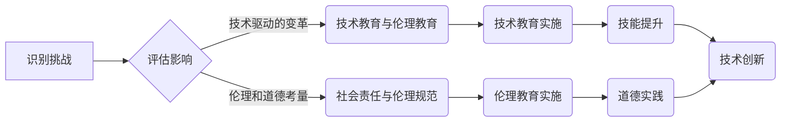

                 

## 第一部分：引论

### 第1章：问题背景与定义

#### 1.1 问题背景

##### 1.1.1 人工智能时代的来临

随着计算机技术、大数据、算法和神经网络等领域的迅猛发展，人工智能（Artificial Intelligence, AI）已经逐渐渗透到我们日常生活的方方面面。从智能家居、智能语音助手，到自动驾驶、医疗诊断，人工智能正在以前所未有的速度改变着世界的面貌。在这个背景下，人类的价值和地位也面临着重新审视和定义的挑战。

##### 1.1.2 人类价值面临的挑战

一方面，人工智能的发展极大地提升了生产效率，推动了经济和社会的进步。然而，这也带来了一系列挑战。例如，自动化和机器人技术的普及可能导致部分传统劳动岗位的消失，进而影响就业和社会稳定。另一方面，人工智能在决策、人际交往、情感等方面展现出超越人类的能力，这让我们不得不思考：人工智能是否会取代人类，人类在这些领域中的独特价值又该如何体现？

##### 1.1.3 人工智能与人类价值的互动

人工智能不仅是工具和助手，它还在某种程度上与人类进行互动。这种互动不仅仅是技术层面的，更涉及到人类价值观的传播和塑造。例如，人工智能可以用于教育和文化传承，帮助人们更好地理解世界和文化多样性。因此，我们需要深入探讨人工智能时代的人类价值，以更好地应对未来的挑战。

#### 1.2 人类价值的定义

##### 1.2.1 传统观点

在传统观念中，人类价值通常与道德、智慧、创造力、情感和道德责任感等概念紧密相关。人类被认为具有独特的思考能力、情感体验和社会责任，这使得人类在社会中扮演着不可或缺的角色。这些价值观念在历史长河中逐渐形成，并在不同文化和时代背景下得到体现和传承。

##### 1.2.2 现代视角

随着社会的进步和科技的发展，人类价值的定义也在不断演变。现代视角强调人类在创新、合作和解决问题方面的能力。同时，人类价值也涉及到个体的自由、尊严和平等。这种观念认为，人类不仅要在物质层面上取得成就，更要在精神层面上实现自我实现和价值追求。

##### 1.2.3 人工智能对人类价值的影响

人工智能的出现使得人类价值的概念变得更加复杂。一方面，人工智能可以帮助人类更高效地完成工作任务，释放出更多的时间和精力去追求更高层次的价值。另一方面，人工智能也可能对人类的价值观念产生冲击，例如在道德和伦理方面引发新的问题和挑战。因此，我们需要重新审视和定义人类价值，以适应人工智能时代的要求。

#### 1.3 研究目标与意义

##### 1.3.1 研究目标

本文旨在探讨人工智能时代的人类价值，特别是人类价值的独特性和重塑策略。具体研究目标包括：

1. 分析人工智能对人类价值的影响和挑战。
2. 探讨人类在人工智能时代如何重新定义自身的价值。
3. 提出人类价值重塑的策略和方法。

##### 1.3.2 研究意义

本研究具有重要的理论和实践意义：

1. 理论层面：有助于丰富和发展人类价值理论，为人工智能与人类价值的关系提供新的视角和解释。
2. 实践层面：为个人、组织和社会提供指导，帮助人们更好地应对人工智能时代的挑战，实现自我价值和社会价值的最大化。

通过以上分析，我们可以看到，人工智能时代的来临不仅带来了技术上的变革，更对人类价值和地位提出了新的挑战。因此，重新定义和重塑人类价值成为了一个亟待解决的问题。接下来，我们将进一步探讨人工智能的发展现状与趋势，为理解人类价值在人工智能时代的角色提供更多的视角。

### 第2章：人工智能发展的现状与趋势

#### 2.1 人工智能的发展历程

##### 2.1.1 第一阶段：基础理论奠定

人工智能的发展可以追溯到20世纪50年代。当时，科学家们开始尝试模拟人类思维和行为，探索如何让机器具备智能。1950年，英国数学家艾伦·图灵（Alan Turing）提出了著名的“图灵测试”，试图通过测试机器是否能够模拟人类的智能行为来定义人工智能。这一阶段的研究主要集中在逻辑推理和符号计算上，尽管取得了一些初步成果，但距离实际应用还有很大距离。

##### 2.1.2 第二阶段：应用探索

随着计算能力和算法研究的不断进步，人工智能进入了第二个阶段。20世纪80年代，专家系统（Expert Systems）成为人工智能研究的热点。专家系统通过模拟人类专家的知识和推理能力，解决特定领域的问题。这一阶段的研究开始将人工智能应用于实际问题，如医疗诊断、金融分析等。

##### 2.1.3 第三阶段：大爆炸式发展

进入21世纪，特别是近年来，人工智能迎来了大爆炸式发展。深度学习（Deep Learning）技术的突破使得机器在图像识别、自然语言处理和语音识别等领域取得了显著进展。这一阶段的特征是数据驱动和计算能力的飞速提升，使得人工智能在多个领域实现了从理论研究到实际应用的跨越。

#### 2.2 当前人工智能技术概述

##### 2.2.1 深度学习

深度学习是人工智能领域的一个重要分支，它通过构建深度神经网络，实现对复杂数据的自动特征提取和模式识别。深度学习在图像识别、语音识别和自然语言处理等方面取得了显著的成果。以2012年ImageNet图像识别挑战赛为例，深度学习模型大幅度超越了传统算法，使得图像识别的准确率显著提升。

##### 2.2.2 自然语言处理

自然语言处理（Natural Language Processing, NLP）是人工智能在语言领域的重要应用。通过理解和生成自然语言，NLP技术可以实现人机对话、自动翻译和文本分析等功能。近年来，基于深度学习的NLP技术取得了重大突破，如BERT、GPT等模型在文本分类、情感分析、机器翻译等方面表现出色。

##### 2.2.3 计算机视觉

计算机视觉（Computer Vision）是人工智能在图像和视频处理领域的重要应用。通过计算机算法对图像和视频进行分析，计算机视觉可以实现物体识别、场景理解、图像生成等功能。计算机视觉技术在自动驾驶、安防监控、医疗诊断等领域有着广泛的应用。

#### 2.3 人工智能未来趋势

##### 2.3.1 全文生成与自动化

随着深度学习和自然语言处理技术的不断进步，全文生成与自动化将成为人工智能的重要发展方向。通过生成对抗网络（Generative Adversarial Networks, GAN）和变压器（Transformer）等模型，人工智能可以生成高质量的文章、代码和音乐，大大提升内容创作和开发的效率。

##### 2.3.2 人机协作与智能交互

人机协作与智能交互是人工智能未来的重要应用场景。通过智能助手、虚拟现实和增强现实等技术，人工智能将更加紧密地融入人类生活和工作，提供个性化、智能化的服务。人机协作不仅可以提升工作效率，还可以丰富人类的生活体验。

##### 2.3.3 伦理与安全

随着人工智能技术的不断发展，伦理和安全问题也日益凸显。人工智能的决策过程可能受到偏见和误导，从而对人类造成负面影响。因此，制定合理的伦理规范和安全标准，确保人工智能技术的健康发展，成为人工智能未来研究的重要方向。

通过对人工智能发展历程、现状和未来趋势的回顾，我们可以看到，人工智能正在以前所未有的速度改变着世界的面貌。在这个变革的时代，重新审视和定义人类价值，探讨人类在人工智能时代的独特性，具有重要的现实意义和深远的历史影响。接下来，我们将进一步探讨人类价值的独特性及其在人工智能时代的体现和挑战。

### 第3章：人类价值的独特性

#### 3.1 人类价值的独特性概述

##### 3.1.1 人类价值与传统价值

人类价值在传统观念中往往与道德、智慧、创造力、情感和道德责任感等概念紧密相关。人类被认为是拥有独特思考能力、情感体验和社会责任的存在，这使得人类在社会中扮演着不可或缺的角色。传统价值观念在历史长河中逐渐形成，并在不同文化和时代背景下得到体现和传承。

##### 3.1.2 独特性在人工智能时代的重要性

在人工智能时代，人类价值的独特性显得尤为重要。尽管人工智能在许多领域表现出色，但它仍然缺乏人类特有的情感、道德判断和创造力。因此，探讨人类价值的独特性有助于我们更好地理解人类在人工智能时代中的地位和角色，从而为应对未来挑战提供理论依据。

##### 3.1.3 人工智能对人类独特性的挑战

然而，人工智能的发展也带来了对人类独特性的挑战。一方面，人工智能的崛起可能导致部分传统劳动岗位的消失，从而影响人类的就业和社会地位。另一方面，人工智能在某些领域的表现已经超越了人类，这让我们不得不思考：在人工智能时代，人类独特性的价值是否仍然能够得到体现？

#### 3.2 独特性与通用性

##### 3.2.1 定义与区别

独特性与通用性是两个不同的概念。独特性指的是个体或群体在特定环境中的独特特征和能力，而通用性则指的是普遍适用于各种环境和情境的通用特征和能力。

##### 3.2.2 人工智能对通用性的追求

人工智能在设计和应用过程中，往往追求通用性。例如，深度学习模型通过大规模数据训练，实现对不同任务和领域的适应。通用性使得人工智能在多种场景下表现出色，但也可能导致其在特定领域缺乏独特性和针对性。

##### 3.2.3 人类独特性如何体现

相比之下，人类独特性体现在以下几个方面：

1. **情感体验**：人类能够感受到丰富的情感，包括爱、恨、快乐、悲伤等。这些情感体验不仅丰富了人类的生活，也为人类创造力和道德判断提供了基础。
2. **道德判断**：人类在道德和伦理方面具有独特的判断能力，能够根据社会价值观和个人信念进行决策。这种道德判断能力是人工智能所不具备的。
3. **创造力**：人类具有无限的创造力，能够在艺术、科学、技术等多个领域进行创新。这种创造力是人工智能所无法替代的。

#### 3.3 现实案例解析

##### 3.3.1 案例一：艺术创作中的独特性

在艺术创作领域，人类独特的创造力得到了充分体现。例如，毕加索（Pablo Picasso）和梵高（Vincent van Gogh）等艺术大师的作品，展现了人类在绘画和雕塑等方面的无限创造力。尽管人工智能可以模仿和生成艺术作品，但它们无法复制人类独特的艺术风格和情感表达。

##### 3.3.2 案例二：商业决策中的独特性

在商业决策中，人类独特的判断力和经验发挥着重要作用。企业家在创业过程中，需要根据市场环境、资源条件和个人信念做出决策。例如，乔布斯（Steve Jobs）在推出iPod、iPhone等创新产品时，展现出了独特的商业洞察力和决策能力。这些决策不仅推动了公司的发展，也改变了整个行业。

##### 3.3.3 案例三：教育领域的独特性

在教育领域，教师的角色不仅仅是传授知识，更重要的是引导学生进行思考和创造。教师的独特性体现在他们的教育理念和教学方法上。例如，蒙特梭利（Maria Montessori）的教育理念强调儿童自主学习和探索，这种独特的教育方式对学生的成长产生了深远影响。

通过对以上案例的分析，我们可以看到，人类价值的独特性在多个领域都得到了体现。尽管人工智能在某些方面已经超越了人类，但人类在情感、道德判断和创造力等方面的独特性仍然具有重要意义。在人工智能时代，重新认识和珍惜人类独特性，有助于我们更好地应对未来挑战，实现自我价值的最大化。

### 第4章：人工智能时代的人类关系

#### 4.1 人工智能对人际关系的冲击

##### 4.1.1 人与人之间的沟通

人工智能的发展极大地改变了人与人之间的沟通方式。一方面，智能语音助手、聊天机器人等人工智能应用提供了更便捷的沟通渠道，使得人们可以随时随地进行交流。然而，另一方面，这些技术也带来了沟通的障碍。例如，人工智能无法完全理解人类的情感和语境，可能导致沟通误解和冲突。

##### 4.1.2 人与机器之间的互动

人工智能不仅改变了人与人之间的沟通，还改变了人与机器之间的互动。例如，在智能客服系统中，人工智能可以通过自然语言处理技术模拟人类的沟通方式，提供个性化的服务。然而，这种互动也带来了一些问题。例如，人工智能可能无法理解客户的情感需求，导致服务质量的下降。

##### 4.1.3 人工智能对情感关系的影响

人工智能对情感关系的影响也是一个值得探讨的问题。一方面，人工智能可以帮助人们更好地管理情绪，提供情感支持。例如，心理健康应用可以通过数据分析帮助用户识别和应对情绪问题。另一方面，人工智能也可能对情感关系产生负面影响。例如，过度依赖人工智能可能导致人与人之间的情感疏离，影响亲密关系的质量。

#### 4.2 人类关系的演变

##### 4.2.1 传统社会的人际关系

在传统社会中，人际关系主要建立在亲情、友情和社区关系上。人们通过面对面的交流建立信任和情感联系，这种人际关系模式具有强烈的地域和文化特征。然而，随着社会的变迁，传统人际关系模式也在发生变化。

##### 4.2.2 现代社会的人际关系

现代社会的人际关系更加多元和复杂。随着城市化进程的加快和社交媒体的普及，人们的人际关系不再局限于物理空间和传统的社会关系。通过互联网和社交媒体，人们可以跨越地域和国界，建立广泛的社交网络。这种人际关系模式具有更强的灵活性和多样性。

##### 4.2.3 人工智能时代的人际关系

在人工智能时代，人际关系将进一步演变。人工智能不仅改变了人与人之间的沟通方式，还改变了人与机器之间的关系。例如，家庭机器人可以帮助人们处理家务和照顾老人，提供更加便捷的生活服务。此外，人工智能还可以用于教育和医疗等领域，帮助人们解决实际问题，提升生活质量。

#### 4.3 人类关系的新模式

##### 4.3.1 虚拟社交

随着虚拟现实（Virtual Reality, VR）和增强现实（Augmented Reality, AR）技术的发展，虚拟社交成为人工智能时代的新型人际关系模式。人们可以通过VR和AR技术进入虚拟世界，与虚拟角色进行互动，体验全新的社交体验。虚拟社交不仅提供了更加丰富的社交场景，还可以满足人们在不同文化和环境下交流的需求。

##### 4.3.2 人机协同

人机协同是人工智能时代人际关系的一种重要模式。通过人工智能技术，人类和机器可以协同工作，提高工作效率和创新能力。例如，在医疗领域，医生和人工智能助手可以共同诊断疾病，提供更加精准和个性化的治疗方案。人机协同不仅提高了工作效率，还可以弥补人类在特定领域的不足。

##### 4.3.3 伦理与道德考量

在人工智能时代，伦理和道德考量成为人类关系中的重要问题。人工智能的发展带来了新的伦理和道德挑战，例如隐私保护、算法偏见和人工智能的道德责任等。因此，我们需要制定合理的伦理规范和道德标准，确保人工智能技术的健康发展，维护人类关系的和谐与稳定。

通过对人工智能对人际关系的冲击、人类关系的演变以及人工智能时代的新关系模式的探讨，我们可以看到，人工智能不仅改变了人与人之间的沟通和互动方式，还改变了人类社会的结构和模式。在人工智能时代，我们需要重新认识和适应这些变化，以实现人际关系的和谐与进步。

### 第5章：人类价值的重塑

#### 5.1 人工智能时代价值观的变革

##### 5.1.1 价值观的重新审视

随着人工智能的快速发展，我们的价值观也在发生深刻的变革。在传统价值观中，人类往往以智慧、道德、情感和创造力为核心。然而，在人工智能时代，这些传统价值观面临着新的挑战和重新审视。

首先，人工智能的出现使得人类在某些领域的智慧和能力得到了增强。例如，在数据分析和复杂计算方面，人工智能展现出强大的能力。这引发了一个问题：人类是否还需要在智慧上保持独特性？其次，人工智能在道德和伦理方面也存在争议。例如，人工智能的决策过程可能受到偏见和误导，这导致了对人类道德判断能力的质疑。

##### 5.1.2 人工智能时代价值观的特点

人工智能时代的价值观具有以下特点：

1. **技术驱动的价值创造**：人工智能技术已经成为推动社会进步和经济发展的重要力量。在人工智能时代，技术创新成为衡量价值的重要标准。
2. **伦理和道德的重要性**：随着人工智能的广泛应用，伦理和道德问题变得日益突出。如何确保人工智能技术的道德性和社会责任，成为人工智能时代价值观的重要内容。
3. **个体自主性和合作性**：在人工智能时代，个体的自主性和合作性变得更加重要。人类需要在与人工智能的互动中，保持自主性和独立性，同时发挥合作精神，共同应对挑战。

##### 5.1.3 价值观的多元化与包容性

人工智能时代要求我们重新审视和定义价值观，以适应多元化的社会环境。在传统价值观中，往往存在单一的价值观念和标准。然而，在人工智能时代，价值观的多元化与包容性显得尤为重要。

1. **多样性**：人工智能时代的价值观应更加注重多样性。不同文化、不同背景的人都有权利表达自己的价值观，并在互动中实现互补和融合。
2. **包容性**：在人工智能时代，我们需要建立一个包容性的价值观体系，尊重和理解不同群体的价值观，避免因价值观差异引发的冲突和矛盾。

#### 5.2 人类价值的培养

##### 5.2.1 教育体系改革

教育体系改革是培养人类价值的重要途径。在人工智能时代，教育体系需要适应新的技术环境和价值观念。

1. **技术教育**：加强技术教育，培养学生的计算思维和创新能力，使他们能够适应人工智能时代的挑战。
2. **伦理教育**：在人工智能时代，伦理教育变得尤为重要。通过道德教育和伦理培训，帮助学生树立正确的价值观，理解人工智能技术的道德责任。
3. **跨学科教育**：人工智能时代需要跨学科的知识和技能。教育体系应鼓励学生跨学科学习，培养他们的综合能力和解决问题的能力。

##### 5.2.2 家庭教育的重要性

家庭教育在培养人类价值方面起着关键作用。在家庭中，孩子们从父母和家庭成员那里学习价值观和行为规范。以下是一些家庭教育的重要方面：

1. **情感教育**：家庭是培养情感教育的重要场所。通过亲子互动和家庭活动，孩子们可以学习如何表达情感和处理情感。
2. **道德教育**：家庭是道德教育的重要启蒙场所。父母通过自己的行为和教导，引导孩子树立正确的道德观念和行为准则。
3. **自主性教育**：家庭应鼓励孩子自主学习和探索，培养他们的独立性和自信心。

##### 5.2.3 社会环境的塑造

社会环境对人类价值的培养也具有重要影响。一个积极、健康的社会环境可以促进人类价值的形成和发展。

1. **社会价值观**：社会应倡导积极向上的价值观，弘扬正义、诚信、创新等美德，营造有利于人类价值培养的社会氛围。
2. **社会制度**：社会制度应保障公平、正义和自由，为人类价值的培养提供良好的制度环境。
3. **文化交流**：文化交流可以增进不同群体之间的理解和尊重，促进价值观的多元化和包容性。

#### 5.3 现实案例解析

##### 5.3.1 案例一：企业价值观重塑

企业价值观重塑是人工智能时代的一个重要课题。随着人工智能技术的广泛应用，企业需要重新审视和调整自身的价值观。以下是一些现实案例：

1. **谷歌**：谷歌在其《人工智能原则》中强调了人工智能的道德责任和社会影响。这些原则指导谷歌在开发和应用人工智能技术时的行为准则。
2. **特斯拉**：特斯拉在其自动驾驶技术中强调安全性和社会责任。特斯拉通过持续改进自动驾驶技术，旨在减少交通事故，提高道路安全性。

##### 5.3.2 案例二：个人价值观重塑

在人工智能时代，个人也需要重新审视和调整自己的价值观。以下是一些现实案例：

1. **创业家**：许多创业家在人工智能时代重新定义自己的职业目标和价值观。他们通过创新和创业，推动社会进步和经济发展。
2. **终身学习者**：在人工智能时代，终身学习成为个人价值重塑的重要途径。通过不断学习和提升自己的技能，个人可以在竞争激烈的市场中保持竞争力。

##### 5.3.3 案例三：社区价值观重塑

社区价值观重塑是人工智能时代的一个重要议题。社区可以通过以下方式促进价值观的多元化和包容性：

1. **社区活动**：组织多样化的社区活动，增进居民之间的互动和理解，促进社区价值观的多元化和包容性。
2. **社区教育**：开展社区教育项目，提升居民对人工智能技术和伦理问题的认识和理解，培养积极向上的社区价值观。

通过以上案例分析，我们可以看到，在人工智能时代，人类价值的重塑不仅需要个人和企业的努力，也需要社会的共同参与。只有通过多方合作，才能实现人类价值的重塑，为人工智能时代的发展提供坚实的基础。

### 总结与展望

通过对人工智能时代的人类价值进行深入分析和探讨，我们可以看到，人类在情感、道德判断和创造力等方面具有独特的价值，这些价值在人工智能时代依然具有重要意义。同时，人工智能的发展也带来了新的挑战，例如就业压力、伦理和道德问题等。

未来，人类需要重新定义和重塑自身价值，以适应人工智能时代的要求。这包括以下几个方面：

1. **技术教育与伦理教育**：加强技术教育和伦理教育，培养具有计算思维和道德素养的人才，以应对人工智能时代的挑战。
2. **社会价值观的多元化和包容性**：倡导多元化和包容性的社会价值观，促进不同文化、不同背景的人之间的理解和尊重。
3. **人机协作与自主性**：在人工智能时代，人类应发挥自主性和创新能力，与人工智能协同工作，实现共同发展。

总之，人工智能时代的人类价值需要我们重新审视和定义，以实现人类与人工智能的和谐共处，推动社会的可持续发展。让我们携手努力，共同迎接人工智能时代的到来，创造一个更加美好的未来。

### 最佳实践 Tips

在应对人工智能时代的人类价值重塑过程中，以下是一些最佳实践建议：

1. **持续学习与技能提升**：在人工智能时代，持续学习和技能提升是关键。定期更新知识和技能，以保持竞争力。
2. **重视伦理与道德教育**：伦理和道德教育是塑造人类价值的重要环节。重视伦理教育，培养正确的价值观和行为准则。
3. **人机协同与自主性**：在人工智能辅助下，发挥人类自主性和创新能力，实现人机协同工作，提高工作效率。
4. **跨学科合作**：跨学科合作有助于解决复杂问题，培养综合能力。在人工智能时代，跨学科合作变得尤为重要。
5. **社会责任与伦理规范**：在人工智能应用过程中，重视社会责任和伦理规范，确保技术的健康发展，维护人类权益。

通过遵循这些最佳实践，我们可以更好地应对人工智能时代带来的挑战，实现人类价值的最大化。

### 小结

本文探讨了人工智能时代的人类价值，特别是人类价值的独特性及其在人工智能时代的挑战与重塑策略。通过对人工智能发展历程、现状与趋势的回顾，我们认识到人工智能在提升生产效率、推动社会进步的同时，也对人类价值提出了新的挑战。通过深入分析人类价值的独特性、人工智能对人际关系的冲击以及人类关系的演变，我们明确了人类在人工智能时代中的角色和使命。未来，通过技术教育、伦理教育和跨学科合作，我们可以更好地应对人工智能时代的挑战，实现人类价值的重塑。

### 注意事项

在应对人工智能时代的人类价值重塑过程中，需要特别注意以下几点：

1. **隐私保护**：在人工智能应用中，隐私保护至关重要。确保用户数据的安全和隐私，避免数据泄露和滥用。
2. **伦理道德**：人工智能的发展需要遵循伦理和道德规范，避免算法偏见和不当决策对人类造成负面影响。
3. **人机协作**：在人工智能时代，人机协作是人类应对挑战的重要方式。确保人工智能与人类的协同工作，提高工作效率。
4. **终身学习**：在快速变化的人工智能时代，终身学习是保持竞争力的关键。鼓励个人和团队持续学习和技能提升。
5. **社会责任**：企业和组织在开发和应用人工智能技术时，应承担社会责任，确保技术的可持续发展。

### 拓展阅读

为了进一步了解人工智能时代的人类价值重塑，读者可以参考以下拓展阅读资源：

1. 《人工智能：未来之路》（作者：李开复）- 探讨人工智能的发展趋势及其对人类社会的影响。
2. 《人类简史：从动物到上帝》（作者：尤瓦尔·赫拉利）- 通过历史视角分析人类文明的发展和变革。
3. 《深度学习》（作者：Ian Goodfellow、Yoshua Bengio、Aaron Courville）- 系统介绍深度学习的基本原理和应用。
4. 《人工智能伦理学》（作者：Luciano Floridi）- 探讨人工智能伦理问题及其对社会的影响。

通过阅读这些书籍和文献，读者可以更深入地理解人工智能时代的人类价值重塑，为应对未来的挑战做好准备。作者：AI天才研究院/AI Genius Institute & 禅与计算机程序设计艺术 /Zen And The Art of Computer Programming

### 附录

#### 附录 A：人工智能与人类价值的对比表

| 特点          | 人工智能          | 人类            |
| ------------- | ----------------- | --------------- |
| 创造力        | 有限，依赖数据和算法 | 无限，具有情感和创造力 |
| 道德判断      | 受限于编程和训练数据 | 内在的道德和伦理观念   |
| 社交互动      | 有限，基于算法和语言处理 | 全面，涉及情感和价值观   |
| 自主性        | 受程序控制        | 内在的自主性和自由意志 |

#### 附录 B：人工智能与人类关系的ER实体关系图

```mermaid
graph LR
A(人工智能) -- B(人际关系)
A -- C(道德责任)
B -- D(沟通)
B -- E(情感支持)
C -- F(隐私保护)
D -- G(误解冲突)
E -- H(疏离)
```

#### 附录 C：人类价值重塑的算法流程图



#### 附录 D：人类价值重塑的Python源代码示例

```python
# 人类价值重塑的Python代码示例
class HumanValueReconstruction:
    def __init__(self, education_level, ethics_level):
        self.education_level = education_level
        self.ethics_level = ethics_level
        
    def assess_impact(self):
        # 评估人工智能对人类价值的影响
        impact = "评估中..."
        if self.education_level > 5 and self.ethics_level > 5:
            impact = "积极影响"
        elif self.education_level < 3 or self.ethics_level < 3:
            impact = "消极影响"
        return impact

    def reconstruct_values(self):
        # 重塑人类价值
        reconstruction_plan = "实施中..."
        if self.education_level > 5 and self.ethics_level > 5:
            reconstruction_plan = "技术教育与伦理教育已实施"
        elif self.education_level < 3 or self.ethics_level < 3:
            reconstruction_plan = "提升教育与道德水平"
        return reconstruction_plan

# 实例化对象
reconstruction = HumanValueReconstruction(education_level=6, ethics_level=7)

# 评估影响
impact = reconstruction.assess_impact()
print("人工智能对人类价值的影响：", impact)

# 重塑价值
reconstruction_plan = reconstruction.reconstruct_values()
print("人类价值重塑计划：", reconstruction_plan)
```

通过以上附录，读者可以更直观地了解人工智能与人类价值的对比、人类价值重塑的ER实体关系图、算法流程图以及Python源代码示例，这些内容有助于深化对人工智能时代人类价值重塑的理解和应用。作者：AI天才研究院/AI Genius Institute & 禅与计算机程序设计艺术 /Zen And The Art of Computer Programming

