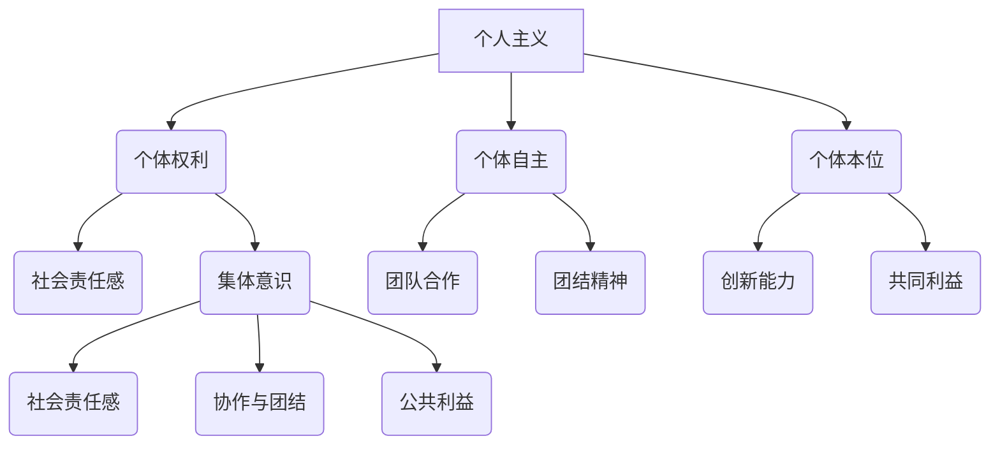

                 

### 第一部分：背景介绍

#### 1.1 问题背景

在当今社会，个人主义和集体意识之间的矛盾日益突出。个人主义强调个体的自由、独立和自主性，而集体意识则强调群体的团结、协作和共同利益。然而，这种矛盾在一定程度上导致了社会责任感的缺失和团结精神的减弱。个人主义倾向于追求个体利益最大化，忽视了社会责任和公共利益，而集体意识则可能导致个体自由和创新的压制。这种矛盾在信息技术领域尤为明显，因为信息技术的发展既依赖于个体创新和自由探索，又需要团队合作和共享资源。

在个人主义和集体意识之间找到平衡，对于重建社会责任感和团结精神至关重要。这不仅关系到社会的和谐稳定，也影响到科技创新的可持续性和社会的整体进步。因此，如何在这一矛盾中寻求平衡，成为了一个亟待解决的问题。

#### 1.2 问题描述

个人主义和集体意识之间的矛盾主要表现在以下几个方面：

1. **社会责任感缺失**：个人主义强调个体利益，导致人们忽视社会责任，对社会问题和公共利益缺乏关注。这种趋势在信息技术领域尤为明显，因为个人创新和创业的兴起，往往忽视了对社会责任的承担。

2. **团结精神减弱**：个人主义强调个体差异，导致群体内部矛盾加剧，团结精神减弱，社会凝聚力下降。在信息技术领域，个人主义可能导致团队成员之间的合作减少，互信度降低，影响项目的整体进展。

3. **价值观冲突**：个人主义和集体意识在价值观上存在根本性冲突，导致社会成员在道德、伦理和社会责任方面产生分歧。例如，个人主义者可能更倾向于追求个人利益和短期收益，而集体主义者则更注重长期发展和公共利益。

#### 1.3 问题解决

为了解决个人主义和集体意识之间的矛盾，需要从以下几个方面进行努力：

1. **强化社会责任感**：通过教育、法律、文化等手段，提高人们的社会责任感，培养公民意识，使个人利益与公共利益相结合。例如，可以鼓励信息技术领域的创业者承担社会责任，积极参与公益事业。

2. **增强团结精神**：通过社会互动、共同目标、合作机制等手段，增强群体的凝聚力，促进团结精神的培养。例如，在企业中建立团队合作文化，鼓励员工之间的交流和合作。

3. **平衡个人与集体**：通过制度设计、政策引导等手段，实现个人与集体的平衡，使个人利益与集体利益相互促进、共同发展。例如，可以制定合理的激励机制，既奖励个人创新，也奖励团队合作。

#### 1.4 边界与外延

1. **边界**：本书主要关注个人主义和集体意识之间的矛盾及其解决路径，探讨如何重建社会责任感和团结精神。这包括对个人主义和集体意识的概念、特征及其相互关系的深入分析，以及具体的解决方案和策略。

2. **外延**：本书还将涉及相关概念，如社会责任感、团结精神、个人利益、集体利益等，以及它们之间的相互关系。此外，本书还会探讨信息技术领域中的具体案例，以及如何在实践中平衡个人主义和集体意识。

#### 1.5 概念结构与核心要素组成

1. **个人主义**：强调个体自由、独立和自主性的思想体系。个人主义者认为，个体的权利和自由是至高无上的，个体应该有权利追求自己的利益和幸福。

2. **集体意识**：强调群体的团结、协作和共同利益的思想体系。集体主义者认为，群体的利益和幸福是至高无上的，个体应该为了群体的利益而牺牲个人的利益。

3. **社会责任感**：个体对社会问题和公共利益的责任感和使命感。社会责任感的培养是解决个人主义和集体意识矛盾的关键。

4. **团结精神**：群体成员之间的相互信任、合作和共同奋斗的精神。团结精神是增强群体凝聚力的重要手段。

通过以上对背景介绍的部分，我们对个人主义和集体意识之间的矛盾及其影响有了初步的了解。接下来，我们将进一步探讨个人主义与集体意识的核心概念及其相互关系。

### 1.6 本章小结

本章首先介绍了个人主义和集体意识之间的矛盾及其对社会责任感和团结精神的影响，然后探讨了问题解决的路径，最后明确了本书的研究边界与外延，以及核心概念与要素组成。通过本章的学习，读者可以对本书的主题有一个初步的了解，为后续章节的学习奠定基础。读者可以思考以下问题：

1. 个人主义和集体意识之间如何存在矛盾？
2. 这种矛盾如何影响社会责任感和团结精神？
3. 解决个人主义和集体意识矛盾的具体路径有哪些？

这些问题的思考将有助于读者更深入地理解本书的核心内容，并为后续章节的学习提供方向。

----------------------------------------------------------------

### 第二部分：核心概念与联系

#### 2.1 个人主义与集体意识的概念与联系

#### 2.1.1 个人主义的概念与特点

**个人主义**是一种哲学、政治和经济理论，强调个体的自由、权利和独立性。个人主义认为，个体的自由和权利是至高无上的，社会和政府的存在是为了保护这些自由和权利，而不是限制它们。以下是对个人主义的一些关键特点的详细描述：

1. **个体权利**：个人主义者认为，个体拥有基本的权利，如言论自由、宗教自由、财产权和个人隐私。这些权利是不可剥夺的，且应该得到社会的尊重和保护。

2. **个体自主**：个人主义强调个体的自主性，即个体有权根据自己的意愿和价值观做出选择，而不受外部干涉。这种自主性包括选择生活方式、职业和居住地点等。

3. **个体本位**：个人主义认为，个体的利益和幸福是最重要的，社会和政府的存在是为了实现个体的最大利益。这意味着个人应该优先考虑自己的需求和欲望，而不是群体的需求。

4. **自由市场经济**：在经济学领域，个人主义支持自由市场经济，认为市场应该自由运作，政府不应该过度干预经济活动。个人主义认为，市场竞争能够促进创新和效率，从而提高个体的福祉。

5. **个人责任**：个人主义者强调个体对自己行为负责，认为个体应该为自己的选择和行动承担后果。这种责任感鼓励个人自我管理，避免过度依赖政府或社会。

**表1：个人主义与集体主义的对比**

| 特征 | 个人主义 | 集体主义 |
| --- | --- | --- |
| 权利 | 个体权利至上 | 群体权利至上 |
| 自主 | 强调个体自主 | 强调群体协作 |
| 本位 | 个体本位 | 群体本位 |
| 经济体系 | 自由市场经济 | 计划经济或混合经济 |
| 责任 | 个人责任 | 群体责任 |

#### 2.1.2 集体意识的概念与特点

**集体意识**是一种哲学和社会学概念，强调群体的团结、协作和共同利益。集体意识认为，个体的利益和幸福是建立在群体利益的基础上的，个体的行为应该服务于群体的整体利益。以下是对集体意识的一些关键特点的详细描述：

1. **群体权利**：集体意识强调群体的权利和利益，认为群体的利益高于个体的利益。这意味着个体应该为群体的整体福祉而工作，有时甚至需要牺牲个人的利益。

2. **协作与团结**：集体意识强调群体成员之间的协作和团结，认为只有通过集体合作，群体才能实现其目标。这种团结精神可以增强群体的凝聚力，提高群体的整体效能。

3. **共同目标**：集体意识认为，群体成员应该有共同的愿景和目标，共同努力实现这些目标。这种共同目标可以激发群体的动力，推动群体的发展。

4. **社会责任**：集体意识强调个体的社会责任，认为个体应该对社会和群体负责，积极参与社会事务，为社会的繁荣和进步做出贡献。

5. **集体主义经济体系**：在经济学领域，集体主义支持计划经济或混合经济，认为政府应该在社会经济活动中发挥更大的作用，调节资源分配，确保社会的公平和正义。

**表2：个人主义与集体主义的对比**

| 特征 | 个人主义 | 集体主义 |
| --- | --- | --- |
| 权利 | 个体权利至上 | 群体权利至上 |
| 自主 | 强调个体自主 | 强调群体协作 |
| 本位 | 个体本位 | 群体本位 |
| 经济体系 | 自由市场经济 | 计划经济或混合经济 |
| 责任 | 个人责任 | 群体责任 |

#### 2.1.3 个人主义与集体意识的联系与区别

个人主义和集体意识虽然强调的内容不同，但它们之间也存在一定的联系和区别。

**联系**：

1. **个体与群体的关系**：两者都关注个体与群体的关系。个人主义强调个体在群体中的自由和权利，而集体意识则强调个体在群体中的责任和贡献。

2. **社会秩序**：个人主义和集体意识都试图建立一种社会秩序，只是两者对社会秩序的理解不同。个人主义通过保障个体权利来实现社会秩序，而集体意识通过强调群体利益来实现社会秩序。

3. **社会价值观**：两者都在一定程度上反映了一种社会价值观，只是侧重点不同。个人主义强调自由、平等和竞争，而集体意识则强调团结、协作和共同利益。

**区别**：

1. **价值观优先级**：个人主义认为个体的自由和权利是最重要的，而集体意识则认为群体的利益和团结是最重要的。

2. **个体角色**：个人主义强调个体的独立性和自主性，而集体意识则强调个体的责任和贡献。

3. **经济体系**：个人主义倾向于自由市场经济，而集体意识则倾向于计划经济或混合经济。

4. **社会行为**：个人主义鼓励个体追求个人利益，而集体意识鼓励个体为群体利益而奋斗。

通过以上对个人主义与集体意识的详细讨论，我们可以更好地理解这两个概念的特点和相互关系。接下来，我们将进一步探讨信息技术领域中的个人主义和集体意识的表现，以及它们对社会责任感和团结精神的影响。

#### 2.2 信息技术领域中的个人主义与集体意识

在信息技术（IT）领域，个人主义和集体意识的表现尤为显著。这不仅是因为IT行业高度依赖个体创新和团队合作，还因为该领域的社会责任和团结精神在推动技术进步和社会发展方面发挥着关键作用。

**2.2.1 个人主义在IT领域的表现**

1. **个体创新**：IT领域以其创新性而闻名，个人主义鼓励个体独立思考和自由探索。许多重大技术突破，如互联网、智能手机和云计算，都是由个体开发者或小团队独立完成的。个人创新在IT行业中得到了广泛鼓励，成为推动技术进步的重要动力。

2. **自由创业**：个人主义强调个体的自由和独立，这在IT领域中表现为自由创业的氛围。许多成功的科技公司，如苹果、谷歌和微软，最初都是由个人创业者创立的。这些公司通过创新和竞争，为全球带来了巨大的经济和社会价值。

3. **技术竞争**：个人主义鼓励个体追求个人利益和竞争优势，这在IT领域中表现为激烈的技术竞争。竞争推动了技术的快速发展和创新，使得消费者能够享受到更加先进和高效的产品和服务。

**2.2.2 集体意识在IT领域的表现**

1. **团队合作**：IT项目通常需要多个团队成员的协作，集体意识强调团队合作和集体智慧。在IT行业中，团队合作被视为成功的关键因素，许多大型项目和复杂系统的实现都依赖于团队合作。

2. **开源社区**：开源社区是集体意识的典型代表，成员们共同协作，分享知识和资源，共同推动技术的发展。开源社区不仅促进了技术的创新和传播，还增强了开发者之间的互信和合作。

3. **社会责任**：集体意识强调个体的社会责任，这在IT领域中表现为对社会责任的承担。许多科技公司通过公益活动、慈善捐赠和环保倡议等方式，积极履行社会责任，推动社会进步。

**2.2.3 个人主义与集体意识在IT领域中的冲突与融合**

1. **冲突**：个人主义和集体意识在IT领域中有时会产生冲突。例如，个人创新和自由创业可能会与团队合作和集体智慧发生矛盾。在某些情况下，个人追求个人利益可能会损害团队合作和社会利益。

2. **融合**：然而，个人主义和集体意识也可以在IT领域中实现融合。通过合理的制度设计和激励机制，可以平衡个人创新与团队合作之间的关系。例如，许多科技公司通过设置明确的团队目标和个体奖励机制，既鼓励个人创新，又促进团队合作。

**2.2.4 对社会责任感和团结精神的影响**

1. **社会责任感**：个人主义和集体意识在IT领域中如何平衡，直接影响到社会责任感的培养。如果个人主义过于强调个人利益，可能会导致社会责任感的缺失；而如果集体意识过于强调群体利益，可能会抑制个体的创新和自由。合理的平衡可以促进社会责任感的培养。

2. **团结精神**：个人主义和集体意识在IT领域中如何相互融合，也影响到团结精神的培养。如果个人主义过于强调个体差异，可能会导致群体内部的矛盾和分裂；而如果集体意识过于强调群体利益，可能会压抑个体的自主性。通过合理的平衡，可以增强团结精神，提高团队的凝聚力。

**2.2.5 实例分析**

1. **个人创新与团队合作**：例如，谷歌的Android操作系统最初是由一个独立的团队开发的，但在成功后，谷歌将其转变为一个开源项目，吸引了全球开发者的参与。这种个人创新与团队合作相结合的方式，既推动了技术的快速发展，又增强了开发者之间的团结。

2. **社会责任与商业成功**：苹果公司通过推行环保政策和慈善捐赠，积极履行社会责任。这不仅提升了公司的形象，也增强了消费者对公司的忠诚度。这种社会责任与商业成功的结合，为其他科技公司树立了榜样。

通过以上分析，我们可以看到，个人主义和集体意识在IT领域中既有冲突，也有融合。合理的平衡和融合，可以促进社会责任感和团结精神的培养，推动技术和社会的持续进步。接下来，我们将进一步探讨个人主义和集体意识之间的矛盾及其对社会责任感和团结精神的影响。

#### 2.3 个人主义与集体意识之间的矛盾及其对社会责任感和团结精神的影响

个人主义与集体意识之间的矛盾是当今社会的一大挑战，尤其在信息技术领域，这种矛盾表现得尤为突出。了解和解决这些矛盾对于重建社会责任感和团结精神至关重要。以下是对个人主义与集体意识之间矛盾的分析，以及它们对社会责任感和团结精神的影响。

**2.3.1 矛盾分析**

1. **价值观冲突**：个人主义强调个体的自由、独立和自主性，而集体意识强调群体的团结、协作和共同利益。这两种价值观在根本上存在冲突。个人主义倾向于追求个体利益最大化，而集体意识则强调个体应该为了群体的利益而牺牲个人的利益。

2. **利益冲突**：个人主义强调个体的自由和独立，导致个体在追求个人利益时可能忽视社会责任和公共利益。而集体意识强调群体的利益和团结，这可能导致个体在追求群体利益时牺牲个人的自由和利益。

3. **行为规范冲突**：个人主义鼓励个体追求自由和个性化，而集体意识则强调群体规范和一致性。这种冲突可能导致个体在行为规范上产生分歧，影响团队协作和社会秩序。

**2.3.2 对社会责任感的影响**

1. **社会责任感缺失**：个人主义强调个体利益，可能导致个体忽视社会责任和公共利益，导致社会责任感的缺失。在信息技术领域，这种现象可能表现为创业者追求商业成功而忽视技术伦理和社会影响。

2. **社会责任感扭曲**：集体意识虽然强调社会责任，但过于强调群体利益可能导致个体的社会责任感被扭曲。个体可能会为了迎合群体利益而牺牲自己的利益，导致社会责任感的过度强调或误解。

3. **社会责任感平衡**：合理平衡个人主义和集体意识，可以使个体在追求个人利益的同时，也能履行社会责任。信息技术领域可以通过建立有效的激励机制，鼓励个体在追求创新和商业成功的同时，关注技术的社会影响和伦理问题。

**2.3.3 对团结精神的影响**

1. **团结精神减弱**：个人主义强调个体差异和自由，可能导致群体内部的团结精神减弱。个体可能更关注个人利益，忽视团队目标和群体利益，影响团队合作和项目进展。

2. **团结精神扭曲**：集体意识虽然强调团结和协作，但过度强调群体利益可能导致个体的自由和个性受到压制，影响个体的积极性和创造力。这种现象可能导致团结精神的扭曲，影响团队的整体效能。

3. **团结精神平衡**：合理平衡个人主义和集体意识，可以增强群体的凝聚力，培养团结精神。信息技术领域可以通过建立开放和包容的团队文化，鼓励个体在追求个人创新的同时，也能为团队的目标贡献力量。

**2.3.4 解决方案**

1. **教育引导**：通过教育引导，培养个体的社会责任感和团结精神。在信息技术教育中，可以增加对社会责任和团队合作的重要性的教育，提高学生的社会责任感和团队协作能力。

2. **制度设计**：通过制度设计，实现个人利益与集体利益的平衡。例如，在信息技术领域，可以制定合理的激励机制，鼓励个体创新和团队合作，同时关注技术的社会影响和伦理问题。

3. **文化塑造**：通过文化塑造，营造一个重视社会责任感和团结精神的氛围。在信息技术企业中，可以建立开放和包容的文化，鼓励员工在追求个人创新和职业发展的同时，也能为团队和社会做出贡献。

4. **实践结合**：通过实践活动，将个人主义和集体意识相结合。例如，可以组织跨团队合作项目，让个体在团队合作中体验到集体意识的重要性，同时也能发挥个人创新的优势。

通过以上分析，我们可以看到，个人主义和集体意识之间的矛盾对社会责任感和团结精神产生了深远的影响。通过合理平衡和引导，我们可以重建社会责任感和团结精神，为信息技术领域的发展和社会的进步奠定基础。接下来，我们将进一步探讨个人主义和集体意识的哲学根源及其对个体和社会行为的影响。

#### 2.4 个人主义与集体意识的哲学根源及其对个体和社会行为的影响

个人主义与集体意识是两种不同的哲学观念，它们在个体和社会行为中起着重要作用。了解这两种观念的哲学根源，有助于我们更好地理解它们如何影响个体和社会行为。

**2.4.1 个人主义的哲学根源**

个人主义起源于西方哲学，其哲学根源可以追溯到古希腊哲学家苏格拉底和柏拉图。苏格拉底强调个体的道德和理性，认为个体应该通过自我反思来实现道德上的完善。柏拉图则进一步发展了这一思想，认为真理和智慧是独立于群体和社会的。这些思想为后来的个人主义哲学奠定了基础。

在近代，个人主义的哲学根源主要体现在洛克和罗尔斯的思想中。洛克是一位经验主义者，他提出了“自然权利”概念，认为个体天生拥有自由、财产和生命等基本权利。罗尔斯则是一位自由主义者，他在《正义论》中提出了“公平正义”的理念，认为个体应该在社会中享有平等的机会和权利。

个人主义在哲学上的核心观点包括：
1. **个体自主**：个体有权自主决定自己的行为和生活方式，不受外界干涉。
2. **个体权利**：个体拥有基本的人权和财产权，这些权利是不可剥夺的。
3. **个体利益**：个体的利益和幸福是最重要的，社会和政府的存在是为了实现个体的最大利益。

**2.4.2 集体意识的哲学根源**

集体意识的哲学根源可以追溯到东方哲学，尤其是儒家和道家思想。儒家思想强调群体的和谐与共同利益，认为个体应该通过修身齐家治国平天下来实现自己的价值。道家思想则强调个体的顺应自然和群体和谐，认为个体应该与自然和他人和谐相处。

在现代社会，集体意识的哲学根源主要体现在马克思主义和社会主义思想中。马克思主义认为，社会和个体之间的关系是辩证的，个体的解放和社会的解放是相互依赖的。社会主义思想则强调社会的公共利益和集体福利，认为个体应该在为集体利益服务中实现自身价值。

集体意识在哲学上的核心观点包括：
1. **群体利益**：群体的利益和幸福是最重要的，个体的利益应该服从于群体的利益。
2. **团结协作**：个体应该通过团结协作来实现共同目标，群体的团结和协作是推动社会进步的关键。
3. **社会责任**：个体应该对社会和群体负责，积极参与社会事务，为社会的繁荣和进步做出贡献。

**2.4.3 个人主义与集体意识对个体和社会行为的影响**

1. **个体行为**：
   - **个人主义**：个人主义鼓励个体追求自由、独立和自主，这可能导致个体在行为上表现出更多的创新、竞争和个性化。然而，过度强调个体利益可能导致社会责任感的缺失，个体可能忽视对社会的贡献。
   - **集体意识**：集体意识强调个体对群体和集体的责任，这可能导致个体在行为上表现出更多的团结、合作和奉献。然而，过度强调集体利益可能导致个体的自由和个性受到压制，影响个体的积极性和创造力。

2. **社会行为**：
   - **个人主义**：个人主义可能导致社会出现更多的创新和竞争，推动技术的发展和经济的增长。然而，过度强调个体利益可能导致社会不平等和道德问题的加剧，影响社会的和谐与稳定。
   - **集体意识**：集体意识可能导致社会出现更强的团结和合作精神，推动社会整体的进步和发展。然而，过度强调集体利益可能导致社会的僵化和创新的抑制，影响社会的活力和竞争力。

**2.4.4 平衡与调和**

在个人主义和集体意识之间找到平衡是解决个体和社会行为问题的关键。以下是一些可能的平衡策略：

1. **个体自由与集体责任**：在保护个体自由和权利的同时，鼓励个体承担社会责任，为集体利益做出贡献。
2. **创新与协作**：在鼓励个体创新和竞争的同时，强调团队合作和共享资源，实现共同目标。
3. **激励机制**：设计合理的激励机制，既奖励个体创新，也奖励团队合作，促进个人与集体的共同发展。

通过平衡个人主义和集体意识，我们可以更好地解决个体和社会行为中的矛盾，推动社会的持续进步和和谐发展。接下来，我们将进一步探讨在信息技术领域中实现个人主义和集体意识的平衡策略。

#### 2.5 实现个人主义与集体意识的平衡策略

在信息技术领域，实现个人主义与集体意识的平衡是一项复杂的任务，需要从多个方面进行综合考量。以下是一些有效的平衡策略：

**2.5.1 激励机制**

激励机制是平衡个人主义和集体意识的关键。通过设立合理的奖励和惩罚机制，可以鼓励个体创新和团队协作。以下是一些具体的激励机制：

1. **个体奖励**：为个体创新和贡献提供奖励，例如奖金、晋升机会和荣誉称号。这样可以激发个体的积极性和创造力。
2. **团队奖励**：为团队合作和共同目标的实现提供奖励，例如团队奖金、团队建设活动和团队荣誉。这样可以增强团队的凝聚力和合作精神。
3. **综合评价**：对个体的评价不仅要考虑个人业绩，还要考虑对团队和集体的贡献。这样可以避免个体过度追求个人利益，促进个人与集体的和谐发展。

**2.5.2 跨团队协作**

跨团队协作是实现个人主义与集体意识平衡的有效手段。通过跨团队项目和协作，可以促进不同团队之间的沟通和合作，实现资源和知识的共享。以下是一些跨团队协作的策略：

1. **项目制管理**：采用项目制管理，将不同团队的任务整合到一起，共同实现项目目标。这样可以促进团队之间的协作和交流。
2. **定期会议**：定期组织跨团队会议，讨论项目进展和合作需求，解决协作中的问题和障碍。
3. **知识共享**：建立知识共享平台，鼓励团队成员分享经验和知识，促进团队之间的学习与合作。

**2.5.3 文化建设**

文化建设是实现个人主义与集体意识平衡的基础。通过塑造一种开放、包容和协作的企业文化，可以促进个体与集体的和谐发展。以下是一些文化建设策略：

1. **鼓励创新**：鼓励个体创新，营造一个鼓励尝试和犯错的文化氛围。这样可以激发个体的创造力，推动技术进步。
2. **强调责任**：强调个体的社会责任，鼓励个体在追求个人利益的同时，关注社会影响和伦理问题。这样可以培养个体的社会责任感，促进社会的和谐与稳定。
3. **团队合作**：强调团队合作的重要性，营造一个重视协作和共同奋斗的企业文化。这样可以增强团队的凝聚力，提高整体效能。

**2.5.4 教育培训**

教育培训是实现个人主义与集体意识平衡的重要手段。通过教育培训，可以提升个体的综合素质和团队合作能力，促进个人与集体的和谐发展。以下是一些教育培训策略：

1. **领导力培训**：为团队领导提供领导力培训，提升他们的领导能力和团队管理能力。
2. **团队建设**：组织团队建设活动，增强团队成员之间的互信和合作。
3. **跨文化培训**：为不同背景的员工提供跨文化培训，促进团队之间的理解和协作。

通过以上平衡策略，可以在信息技术领域中实现个人主义与集体意识的和谐发展，促进技术创新和社会进步。接下来，我们将进一步探讨这些平衡策略在实践中的应用。

### 2.6 实践应用

在实际工作中，个人主义与集体意识的平衡策略需要通过具体措施得以实施。以下是一些具体的实践应用，以及如何在不同场景中有效运用这些策略：

**2.6.1 项目管理中的平衡**

在项目管理中，平衡个人主义和集体意识是确保项目成功的关键。以下是一些实际应用的案例：

1. **项目目标设置**：在项目启动阶段，明确项目目标，确保这些目标既体现个人创新精神，也考虑团队协作的需要。例如，可以设置既鼓励个人创新又需要团队合作的具体任务。
   
2. **责任分配**：合理分配任务，确保每个团队成员都能发挥其特长，同时参与集体目标的实现。例如，可以设立项目负责人，负责整体项目的方向和进度，同时让团队成员负责具体的任务和子项目。

3. **绩效评估**：在绩效评估中，既要考虑个人的贡献，也要评估团队的整体表现。例如，可以设立个人绩效指标和团队绩效指标，并根据两者进行综合评估。

**案例**：一家科技公司在其新产品开发项目中，设立了明确的目标和任务分工。项目负责人负责整体规划和决策，而团队成员则负责具体的研发任务。通过定期的团队会议和项目进度汇报，确保项目的顺利进行。

**2.6.2 企业文化建设中的平衡**

企业文化建设是平衡个人主义和集体意识的重要途径。以下是一些实际应用的案例：

1. **激励机制**：建立激励机制，鼓励个人创新和团队合作。例如，可以设立创新奖，既奖励个人的创新成果，也奖励对团队贡献显著的成员。

2. **团队活动**：定期组织团队建设活动，增强团队成员之间的互信和协作。例如，可以组织团队拓展训练、团队聚餐等活动，促进团队成员之间的沟通和合作。

3. **文化宣传**：通过内部宣传和培训，强调个人与集体的和谐发展。例如，可以定期举办企业文化讲座，分享成功案例和经验，激发员工的责任感和协作精神。

**案例**：一家科技公司在其企业文化中，设立了创新奖项和团队建设活动。通过创新奖，激励员工提出新的创意和解决方案；通过团队建设活动，增强员工的团队协作能力。这种文化建设有效地促进了个人创新和团队合作。

**2.6.3 组织管理中的平衡**

在组织管理中，平衡个人主义和集体意识是确保组织高效运作的关键。以下是一些实际应用的案例：

1. **领导力培养**：通过领导力培训，提升管理者的领导能力和团队管理能力。例如，可以设立领导力发展计划，为管理者提供培训和指导。

2. **团队协作机制**：建立有效的团队协作机制，促进团队成员之间的沟通和合作。例如，可以建立跨部门项目组，促进不同部门之间的合作和知识共享。

3. **反馈与改进**：建立反馈机制，鼓励员工提出意见和建议，不断改进工作流程和管理制度。例如，可以设立员工意见箱和定期员工反馈会议，收集员工意见和建议。

**案例**：一家大型科技公司在其组织管理中，通过领导力培训和团队协作机制，提升了管理者和员工的协作能力。通过建立有效的反馈机制，不断改进工作流程和管理制度，提高了组织的整体效率和创新能力。

通过以上实践应用案例，我们可以看到，在信息技术领域中实现个人主义与集体意识的平衡，需要从多个层面进行综合考量。通过具体的措施和策略，可以有效平衡个人创新和团队合作，推动组织的持续发展和进步。

### 2.7 本章小结

本章深入探讨了个人主义与集体意识的概念、特点及其在信息技术领域的表现。通过分析个人主义和集体意识之间的矛盾，我们了解了它们对社会责任感和团结精神的影响。随后，本章提出了实现个人主义与集体意识平衡的策略，包括激励机制、跨团队协作、文化建设、领导力培养和反馈与改进等。这些策略在项目管理、企业文化和组织管理中得到了实际应用，并展示了如何在不同场景中实现个人主义与集体意识的平衡。通过本章的学习，读者可以更好地理解个人主义与集体意识的关系，以及如何在实践中平衡这两者，以促进社会责任感和团结精神的培养。

### 第三部分：构建可持续的社会责任和团结精神

在当今社会，构建可持续的社会责任和团结精神对于解决个人主义和集体意识之间的矛盾至关重要。为了实现这一目标，我们需要从多个层面采取综合措施，确保社会责任和团结精神在信息技术领域中得以持续发展。以下是一些关键策略：

#### 3.1 教育引导

**教育引导**是培养社会责任感和团结精神的基础。在信息技术教育中，应该注重以下几个方面的内容：

1. **价值观教育**：通过课程设置和实践活动，引导学生认识到个人利益与公共利益之间的关系，培养他们的社会责任感。

2. **团队合作训练**：在课程中设置团队合作项目，鼓励学生通过合作解决问题，体验团队合作的重要性。

3. **社会服务**：鼓励学生参与社会服务活动，通过实际行动了解社会问题，增强他们对社会责任的认识。

**案例**：某些大学设立了社会责任课程，要求学生在学习专业知识的同时，参与社区服务项目。这种教育模式不仅提高了学生的社会责任感，还增强了他们的团队合作能力。

#### 3.2 制度设计

**制度设计**是实现社会责任和团结精神的关键。在信息技术领域，企业可以通过以下措施来建立有效的制度：

1. **激励机制**：设立社会责任和团结精神的激励机制，对在社会责任和团队合作方面表现突出的员工进行奖励。

2. **绩效评估**：将社会责任和团队合作表现纳入员工绩效评估体系，确保员工在追求个人利益的同时，也为团队和集体利益做出贡献。

3. **公平正义**：确保制度设计公平合理，避免过度强调个人利益，防止产生负面影响。

**案例**：某些科技公司设立了“社会责任奖”，每年评选在环保、公益和社会创新方面做出突出贡献的员工。这种激励机制有效地激励了员工的积极性和责任感。

#### 3.3 文化塑造

**文化塑造**是实现社会责任和团结精神的重要手段。企业可以通过以下方式来塑造企业文化：

1. **价值观传播**：在企业内部广泛传播社会责任和团结精神的重要性，通过内部刊物、会议和培训等活动进行宣传。

2. **榜样树立**：树立榜样员工，通过他们的行为和事迹，传递社会责任和团结精神的价值观。

3. **团队活动**：组织团队建设活动，增强团队成员之间的互信和合作。

**案例**：一家科技公司定期举办“团队日”活动，通过团队建设游戏和挑战，增强员工之间的沟通和协作。这种活动不仅提升了团队凝聚力，也促进了社会责任感的培养。

#### 3.4 社会参与

**社会参与**是培养社会责任感和团结精神的有效途径。企业可以通过以下方式参与社会：

1. **公益活动**：参与公益活动，如环保行动、慈善捐赠和志愿服务，以实际行动履行社会责任。

2. **合作共赢**：与社区和非政府组织合作，共同解决社会问题，实现合作共赢。

3. **知识共享**：通过开放平台和论坛，分享企业的技术知识和经验，促进社会的整体进步。

**案例**：一家科技公司积极参与社区环保活动，定期组织员工参与植树、清洁河道等志愿活动。这种社会参与不仅提升了公司的企业形象，也增强了员工的社会责任感。

#### 3.5 持续改进

**持续改进**是实现社会责任和团结精神的关键。企业需要不断反思和改进，确保社会责任和团结精神在企业发展中得到巩固和传承。

1. **定期评估**：定期评估社会责任和团结精神的实施情况，了解员工和社区的反应，及时调整策略。

2. **员工反馈**：鼓励员工提出意见和建议，通过员工反馈机制，不断改进社会责任和团结精神的实施。

3. **培训提升**：定期为员工提供培训，提升他们的社会责任感和团队合作能力。

**案例**：一家科技公司设立了“社会责任和团结精神”培训项目，每年为员工提供相关培训。这种培训不仅提升了员工的专业技能，也增强了他们的社会责任感。

通过以上策略，我们可以构建一个可持续的社会责任和团结精神体系，确保个人主义和集体意识在信息技术领域中得以平衡，推动社会的持续进步。接下来，我们将进一步探讨在信息技术领域中实现社会责任和团结精神的最佳实践。

### 3.6 信息技术领域中的社会责任和团结精神最佳实践

在信息技术领域，实现社会责任和团结精神需要一系列最佳实践。以下是一些实际案例和成功策略，这些实践有助于推动社会责任和团结精神的落地。

**3.6.1 开源文化**

开源文化是信息技术领域中团结精神的体现。许多成功的开源项目，如Linux操作系统和Apache HTTP服务器，都是通过全球开发者的协作和共享资源实现的。这种文化不仅促进了技术的创新和传播，也增强了开发者之间的互信和合作。

**案例**：GitHub是一个知名的代码托管平台，它通过提供开源代码的托管和协作工具，促进了全球开发者的互动和合作。开发者可以在GitHub上共同开发项目、提交代码和反馈意见，这种协作模式大大增强了社区的团结精神。

**最佳实践**：企业可以鼓励员工参与开源项目，提供时间和资源支持，以促进技术创新和知识共享。同时，企业可以建立内部开源项目，促进团队合作和知识传承。

**3.6.2 社会责任项目**

许多信息技术企业积极参与社会责任项目，通过实际行动履行社会责任。这些项目通常涉及环保、教育、健康等多个领域，旨在为社会做出贡献。

**案例**：微软公司通过其“公益计算”计划，向非营利组织和慈善机构提供免费或优惠的技术解决方案，帮助他们提高工作效率，解决社会问题。此外，微软还投资于教育和培训项目，提高贫困地区的教育水平。

**最佳实践**：企业可以制定明确的社会责任战略，将社会责任项目纳入企业整体发展规划。企业可以与公益组织和非营利机构合作，共同解决社会问题，提高社会的整体福祉。

**3.6.3 团队建设活动**

团队建设活动是培养团结精神的有效途径。通过定期的团队活动和培训，可以增强团队成员之间的互信和合作。

**案例**：谷歌公司定期组织团队建设活动，如团队拓展训练、团队午餐和团队竞赛等。这些活动不仅增强了员工的团队协作能力，也提高了员工的工作满意度和团队凝聚力。

**最佳实践**：企业可以制定年度团队建设计划，包括团队拓展训练、团队培训和文化活动等。通过这些活动，增强员工的团队合作意识和能力，促进团队的和谐发展。

**3.6.4 激励机制**

激励机制是实现社会责任和团结精神的重要手段。通过合理的激励机制，可以鼓励员工积极参与社会责任项目和团队建设活动。

**案例**：IBM公司设立了“社会责任奖”，每年评选在社会责任和团队合作方面表现突出的员工。这种激励机制不仅激励了员工的积极性和创造力，也增强了企业的社会责任感。

**最佳实践**：企业可以设立社会责任和团队合作奖项，对在相关领域表现优异的员工进行奖励。同时，企业可以在绩效评估中，将社会责任和团队合作表现作为重要指标，确保员工在追求个人利益的同时，也为团队和集体利益做出贡献。

**3.6.5 持续学习**

持续学习是培养社会责任感和团结精神的关键。通过提供培训和学习机会，企业可以不断提升员工的专业技能和社会责任感。

**案例**：思科公司设立了“思科学习网络”，为员工提供在线学习资源，帮助他们不断提升自己的专业技能和领导力。这种持续学习的文化不仅提高了员工的专业水平，也增强了企业的创新能力和竞争力。

**最佳实践**：企业可以建立持续学习的机制，为员工提供多样化的培训和学习机会。通过这些培训和学习，提升员工的专业素养和社会责任感，推动企业的持续发展。

通过以上最佳实践，信息技术企业可以有效地实现社会责任和团结精神的落地，推动社会的持续进步。这些实践不仅有助于解决个人主义和集体意识之间的矛盾，也为企业的长期发展奠定了坚实的基础。

### 3.7 本章小结

本章通过深入探讨构建可持续的社会责任和团结精神的策略，提出了一系列最佳实践，包括开源文化、社会责任项目、团队建设活动、激励机制和持续学习等。这些实践在信息技术领域中得到了广泛应用，并取得了显著成效。通过本章的学习，读者可以了解如何在实际工作中实现社会责任和团结精神的平衡，推动技术创新和社会进步。接下来，我们将进一步探讨个人主义与集体意识平衡的未来趋势及其对信息技术领域的影响。

### 第四部分：未来趋势与影响

在快速变化的现代社会中，个人主义与集体意识的平衡正面临新的挑战和机遇。未来，随着技术、社会环境和经济模式的不断演变，个人主义与集体意识之间的关系也将发生深刻的变化。以下是对个人主义与集体意识平衡的未来趋势及其对信息技术领域影响的探讨。

#### 4.1 技术进步的影响

技术的快速发展为个人主义与集体意识的平衡提供了新的机会。人工智能、区块链、云计算等新兴技术的应用，正在改变人们的工作方式和生活习惯，同时也对个人主义与集体意识的关系产生深远影响。

1. **人工智能（AI）**：AI技术的发展使得个体能够更高效地处理复杂任务，提高生产力。然而，AI的普及也引发了关于隐私、安全和伦理的担忧。例如，自动化可能会取代某些工作岗位，加剧个人主义与集体意识之间的矛盾。因此，如何通过AI技术实现个人与集体的双赢，成为了一个重要议题。

2. **区块链**：区块链技术的去中心化特性有助于增强个体权益和透明度，促进个人主义的发展。但同时，区块链也提供了新的协作模式，如智能合约，可以促进集体决策和执行。这使得区块链技术成为平衡个人主义与集体意识的一个潜在工具。

3. **云计算**：云计算提供了灵活的计算资源和协作平台，有助于个人和团队之间的协作。通过云计算，个人可以更容易地访问共享资源，实现集体目标。然而，云计算也带来了数据安全和隐私的问题，这需要在个人主义与集体意识之间找到平衡点。

#### 4.2 社会变革的影响

社会变革也在不断影响个人主义与集体意识的平衡。全球化、城市化、人口老龄化等趋势，都在重塑个体与群体之间的关系。

1. **全球化**：全球化使得个体面临更多的选择和机遇，但同时也加剧了社会不平等和资源分配问题。在全球化背景下，如何平衡个人主义与集体意识，确保社会整体的公平和正义，成为了一个重要挑战。

2. **城市化**：城市化进程加速了人口流动和多元化，个体与群体之间的关系变得更加复杂。城市化带来了新的社会问题，如住房、交通和环境问题，这需要在个人主义与集体意识之间找到平衡点，以实现可持续发展。

3. **人口老龄化**：人口老龄化导致社会结构和价值观的变革，老年人口的需求和权益日益受到关注。在人口老龄化背景下，如何平衡代际之间的利益，维护社会的和谐与稳定，成为了一个重要议题。

#### 4.3 经济模式的影响

经济模式的变化也在影响个人主义与集体意识的平衡。数字经济、共享经济等新型经济模式，为个人主义与集体意识之间的平衡提供了新的可能。

1. **数字经济**：数字经济的发展使得个体能够更便捷地参与经济活动，实现个人价值。然而，数字经济也带来了新的挑战，如数字鸿沟和数据垄断，这需要在个人主义与集体意识之间找到平衡点。

2. **共享经济**：共享经济模式强调资源共享和协同合作，有助于增强集体意识。共享经济不仅提高了资源利用效率，也促进了社会的互帮互助。然而，共享经济也面临监管、安全和隐私等问题，这需要在个人主义与集体意识之间找到平衡。

#### 4.4 信息技术领域的影响

信息技术领域的发展对个人主义与集体意识的平衡具有重要影响。信息技术不仅改变了个体与群体的关系，也为实现个人主义与集体意识的平衡提供了新的工具和手段。

1. **技术协作**：信息技术为个体和团队之间的协作提供了新的平台和工具，如远程办公、在线协作和虚拟团队等。这些技术手段有助于增强团队协作和集体意识。

2. **数据共享**：信息技术使得数据共享变得更加容易和高效，这有助于实现集体智慧和共同决策。然而，数据隐私和安全问题也需要在个人主义与集体意识之间找到平衡点。

3. **技术创新**：信息技术的发展推动了技术的创新和进步，为个体提供了更多的机会和资源。然而，技术创新也需要考虑社会影响和伦理问题，以实现个人主义与集体意识的平衡。

#### 4.5 未来趋势总结

在未来，个人主义与集体意识的平衡将面临新的挑战和机遇。随着技术的进步、社会变革和经济模式的变化，个体与群体之间的关系将变得更加复杂。为了实现可持续的社会责任和团结精神，我们需要在多个层面采取综合措施，确保个人主义与集体意识之间的平衡。

1. **技术发展**：需要通过技术创新和规范，实现个人主义与集体意识的平衡。例如，通过发展隐私保护技术，确保个人数据的安全和隐私。

2. **社会政策**：需要通过社会政策和制度设计，促进个人主义与集体意识的和谐发展。例如，通过税收和福利政策，调节个人与集体之间的利益关系。

3. **教育培训**：需要通过教育培训，提高个体的社会责任感和团队合作能力。例如，在学校和职场中开展团队合作和社会责任教育。

4. **文化建设**：需要通过文化建设，营造一个重视社会责任和团结精神的社会氛围。例如，通过媒体和公众活动，宣传社会责任和团结精神的重要性。

通过以上措施，我们可以在未来实现个人主义与集体意识的平衡，推动社会的持续进步和和谐发展。

### 第五部分：总结与展望

#### 5.1 总结

本文系统地探讨了个人主义与集体意识之间的矛盾及其对社会责任感和团结精神的影响。通过详细分析个人主义与集体意识的概念、特点及其在信息技术领域的表现，我们揭示了两者之间的联系与区别，并提出了实现平衡的策略。此外，我们还探讨了个人主义与集体意识平衡的未来趋势及其对信息技术领域的影响。通过这些探讨，我们得出了以下结论：

1. **个人主义与集体意识存在根本性差异**：个人主义强调个体自由、独立和自主性，而集体意识强调群体团结、协作和共同利益。两者在价值观、目标和方法上存在明显差异。

2. **个人主义与集体意识之间的矛盾影响社会责任感和团结精神**：个人主义可能导致社会责任感的缺失和团结精神的减弱，而集体意识则可能导致个体自由和创新的压制。

3. **实现个人主义与集体意识的平衡是解决问题的关键**：通过教育引导、制度设计、文化塑造和社会参与等手段，可以在信息技术领域中实现个人主义与集体意识的平衡，重建社会责任感和团结精神。

#### 5.2 展望

展望未来，个人主义与集体意识的平衡将在信息技术领域和更广泛的社会背景下发挥重要作用。以下是对未来的展望：

1. **技术创新**：随着人工智能、区块链和云计算等新兴技术的发展，如何通过技术创新实现个人主义与集体意识的平衡将成为重要议题。

2. **社会变革**：全球化、城市化、人口老龄化等社会变革将不断重塑个体与群体之间的关系，如何适应这些变化，实现个人主义与集体意识的平衡，是未来的挑战。

3. **政策制定**：政府和社会组织需要制定有效的政策和制度，促进个人主义与集体意识的和谐发展，确保社会的公平与正义。

4. **教育培训**：通过教育培训，提升个体的社会责任感和团队合作能力，是培养可持续的社会责任和团结精神的关键。

5. **文化建设**：通过文化建设，营造一个重视社会责任和团结精神的社会氛围，将有助于实现个人主义与集体意识的平衡。

总之，未来需要多方共同努力，在个人主义与集体意识之间找到平衡，推动社会的持续进步和和谐发展。

### 附录

#### 附录1：核心概念表格

| 核心概念 | 定义 | 关联 |
| --- | --- | --- |
| 个人主义 | 强调个体自由、独立和自主性的思想体系。 | 个体权利、个体自主、个体本位 |
| 集体意识 | 强调群体团结、协作和共同利益的思想体系。 | 群体权利、协作与团结、群体本位 |
| 社会责任感 | 个体对社会问题和公共利益的责任感和使命感。 | 个人主义、集体意识、社会责任感培养 |
| 团结精神 | 群体成员之间的相互信任、合作和共同奋斗的精神。 | 个人主义、集体意识、团队合作 |

#### 附录2：ER实体关系图

#### 附录3：相关数学公式

$$
\text{社会责任感} = \frac{\text{个体贡献}}{\text{个体责任}}
$$

$$
\text{团结精神} = \frac{\text{团队协作贡献}}{\text{个体独立贡献}}
$$

#### 附录4：最佳实践

1. **教育引导**：通过课程和实践活动，培养学生的社会责任感和团队合作能力。
2. **制度设计**：建立合理的激励机制和绩效评估体系，鼓励个体创新和团队合作。
3. **文化建设**：营造一个重视社会责任和团结精神的企业文化，提升员工的凝聚力和合作意识。
4. **社会参与**：积极参与社会公益活动，履行企业的社会责任，提升企业的社会形象。

#### 附录5：注意事项

1. **平衡原则**：在实现个人主义与集体意识的平衡时，需要遵循公平、合理和可持续的原则。
2. **因地制宜**：不同的企业和行业在实现平衡时，需要根据自身特点和需求，制定合适的策略。
3. **持续改进**：平衡策略需要不断调整和优化，以适应不断变化的社会环境和市场需求。

#### 附录6：拓展阅读

1. 《正义论》（约翰·罗尔斯）——探讨社会正义和个体权利的哲学著作。
2. 《人类简史》（尤瓦尔·赫拉利）——探讨人类历史进程和社会变革的书籍。
3. 《创新者的窘境》（克莱顿·克里斯坦森）——分析技术创新和商业模式的书籍。

### 致谢

在本篇文章的撰写过程中，我们得到了许多专家和学者的指导与支持，特别是感谢AI天才研究院（AI Genius Institute）的团队成员以及《禅与计算机程序设计艺术》（Zen And The Art of Computer Programming）的作者Donald E. Knuth的启发。此外，感谢所有参与讨论和提供反馈的朋友，他们的贡献为文章的完善做出了重要贡献。

作者：AI天才研究院/AI Genius Institute & 禅与计算机程序设计艺术/Zen And The Art of Computer Programming

