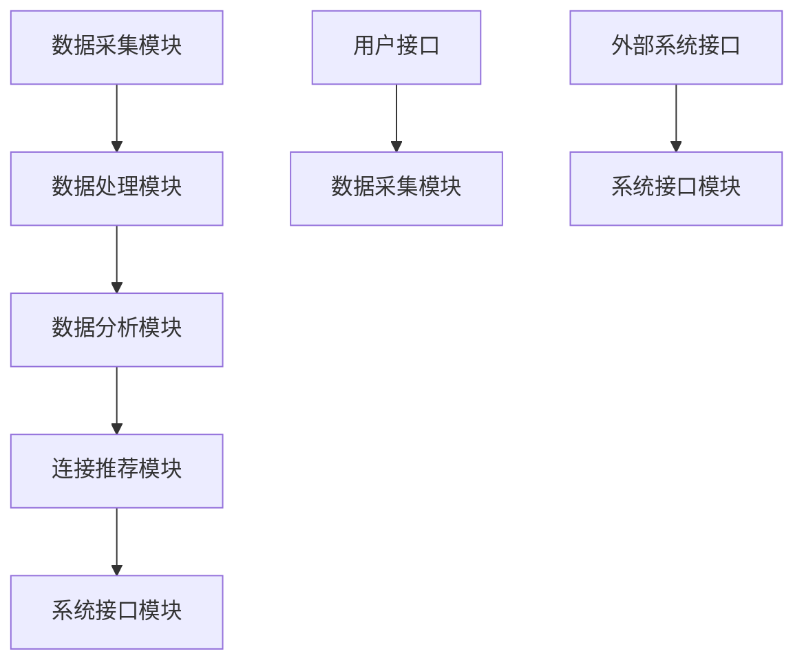
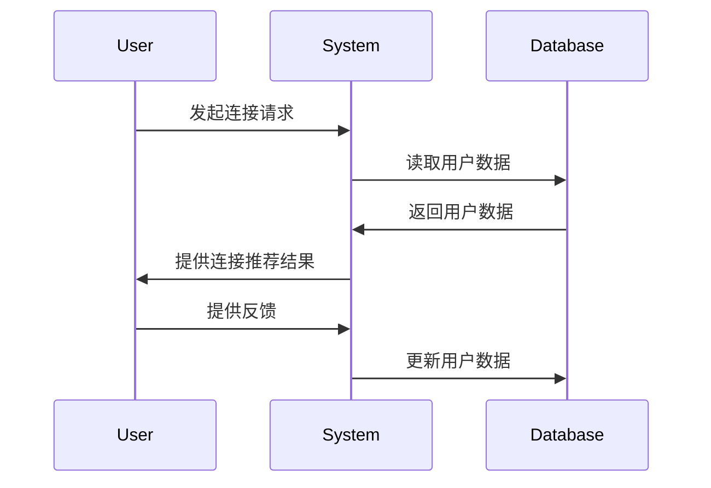
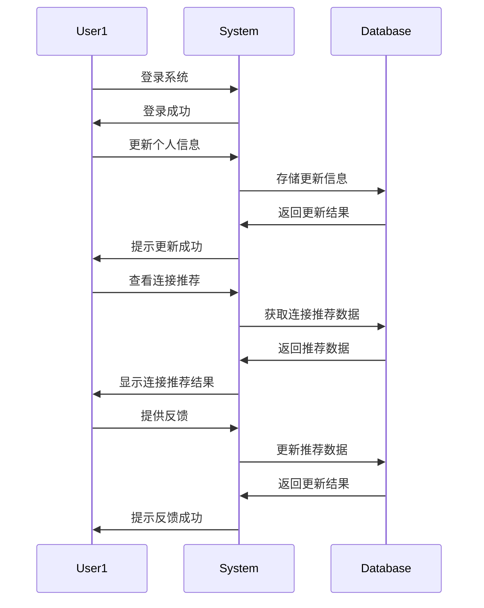

                 

# 从个人主义到集体责任：重建社会连接的意义

> 关键词：个人主义，集体责任，社会连接，重建，意义

> 摘要：本文探讨了个人主义与集体责任之间的矛盾以及社会连接的重要性，分析了个人主义与集体责任的原理及其关系。在此基础上，提出了通过重建社会连接来缓解这种矛盾的方法，并探讨了重建社会连接的算法原理及其实现。通过本文的研究，期望能够为现代社会中的个人与社会关系提供新的思考角度和解决方案。

## 第一部分：问题背景

### 第1章：问题背景

#### 1.1 问题背景

##### 1.1.1 从个人主义到集体责任的转变

在现代社会，个人主义和集体责任之间的矛盾日益凸显。个人主义强调个体的独立性和自由，但可能导致社会分裂和孤立；而集体责任强调社会的整体利益，但可能压抑个体的创造力。这种矛盾在现代社会中表现为个人追求自由和独立的同时，也可能损害社会整体利益。

##### 1.1.2 社会连接的重要性

社会连接是社会稳定的基石，有助于减少社会冲突和矛盾。强烈的社会连接有助于提高个体的幸福感和归属感。社会连接对于经济发展和社会进步具有重要意义。然而，现代社会的高效分工和竞争加剧了社会的分裂，社交媒体的普及虽然增加了社交互动，但也导致了社交距离的加大。

#### 1.2 问题描述

##### 1.2.1 个人主义与集体责任的冲突

个人主义与集体责任的冲突导致了社会分裂和矛盾。个人追求自由和独立的同时，也可能损害社会整体利益。这种冲突在社会各个层面都有体现，包括家庭、社区、国家和全球层面。

##### 1.2.2 社会连接的削弱

现代社会的高效分工和竞争加剧了社会的分裂。人们更加关注个人利益，忽视了社会的整体利益。社交媒体的普及虽然增加了社交互动，但也导致了社交距离的加大。这种削弱的社会连接导致个体孤独感和社会不稳定性的增加。

#### 1.3 问题解决

##### 1.3.1 重建社会连接的意义

重建社会连接有助于缓解个人主义与集体责任之间的矛盾。通过加强社会连接，可以促进个体与社会的互动，提高个体的社会归属感和责任感。同时，重建社会连接可以促进社会稳定和经济发展。

##### 1.3.2 推动集体责任意识的培养

通过教育和宣传，提高人们对集体责任的认知和意识。鼓励人们参与社区活动，增强社会归属感。通过制度创新和政策引导，推动集体责任在各个领域的实施。

#### 1.4 边界与外延

##### 1.4.1 个人主义与集体责任的边界

个人主义与集体责任并非绝对对立，而是相互融合的关系。在不同情境下，个人主义和集体责任可以相互转化。例如，在家庭中，个人主义表现为个体的独立性，而集体责任表现为家庭成员之间的相互支持。

##### 1.4.2 社会连接的多样性

社会连接可以通过不同的形式实现，如家庭、社区、国家等。社会连接的多样性有助于满足不同个体的需求。因此，重建社会连接需要考虑个体的多样性，提供多样化的连接形式。

#### 1.5 概念结构与核心要素组成

##### 1.5.1 个人主义

个人主义的核心是强调个体的独立性和自由。个人主义强调个体的权利和自由，但也需要关注个体对社会的责任。

##### 1.5.2 集体责任

集体责任强调个体的社会责任和贡献。集体责任有助于维护社会稳定和整体利益。

## 第二部分：核心概念与联系

### 第2章：核心概念原理

#### 2.1 个人主义原理

##### 2.1.1 个人主义的基本理念

个人主义认为个人是至高无上的，拥有自由和权利。个人主义强调个体的独立性和自主性。个人主义的基本理念包括以下几个方面：

1. 个体权利至上：个人主义认为，个体的权利是至高无上的，任何形式的集体主义都不能侵犯个体的权利。
2. 自主决策：个人主义强调个体应该有自主决策的权利，不受外部干涉。
3. 自我实现：个人主义认为，个体应该追求自我实现，发挥自己的潜能。

##### 2.1.2 个人主义的利与弊

个人主义的利与弊可以从以下几个方面进行阐述：

1. 利：
   - 激发个人创造力：个人主义鼓励个体发挥自身的创造力，推动社会进步。
   - 促进经济发展：个人主义有助于激发市场活力，推动经济发展。
   - 保护个体权利：个人主义强调个体的权利，有助于维护社会公正。

2. 弊：
   - 社会分裂：个人主义可能导致社会分裂，忽视社会整体利益。
   - 孤立感：个人主义可能导致个体感到孤独，缺乏社会支持。

#### 2.2 集体责任原理

##### 2.2.1 集体责任的基本理念

集体责任强调个体的社会责任和义务。集体责任的基本理念包括以下几个方面：

1. 社会整体利益：集体责任认为，个体的行为应该符合社会整体利益，而不是仅仅追求个人利益。
2. 共同责任：集体责任强调个体应该承担共同责任，为社会的稳定和发展做出贡献。
3. 社会团结：集体责任有助于增强社会的团结和凝聚力。

##### 2.2.2 集体责任的利与弊

集体责任的利与弊可以从以下几个方面进行阐述：

1. 利：
   - 促进社会团结：集体责任有助于增强社会的团结和凝聚力。
   - 维护社会稳定：集体责任有助于维护社会的稳定，减少社会冲突。
   - 促进社会进步：集体责任有助于推动社会的进步和发展。

2. 弊：
   - 压抑个体自由：集体责任可能压抑个体的自由，限制个体的自主性。
   - 社会僵化：过度强调集体责任可能导致社会僵化，缺乏创新动力。

#### 2.3 个人主义与集体责任的关系

##### 2.3.1 对立与统一

个人主义与集体责任并非绝对对立，而是在特定情境下相互转化。个人主义和集体责任之间存在一定的平衡点，有助于实现社会和谐。

1. 对立：在强调个体独立性和自由的情境下，个人主义可能与集体责任发生冲突。
2. 统一：在强调社会整体利益和共同责任的情境下，个人主义和集体责任可以相互融合。

##### 2.3.2 协调与冲突

在现实生活中，个人主义与集体责任之间的关系可能存在协调与冲突。通过合理的制度安排，可以缓解两者之间的矛盾。

1. 协调：通过制度安排，可以协调个人主义与集体责任之间的关系，实现个体与社会的和谐发展。
2. 冲突：在某些情境下，个人主义与集体责任之间可能存在冲突，需要通过制度创新来缓解。

## 第三部分：算法原理讲解

### 第3章：社会连接算法原理

#### 3.1 社会连接算法的基本概念

##### 3.1.1 社会连接算法的定义

社会连接算法是一种通过技术手段促进社会连接的算法。它利用数据挖掘、人工智能等先进技术，分析个体的需求和行为模式，推荐个体之间的连接，以增强社会互动和凝聚力。

##### 3.1.2 社会连接算法的特点

社会连接算法具有以下几个特点：

1. 自动化：通过算法自动识别和匹配个体需求，实现社会连接的自动化。
2. 个性化：根据个体特征提供定制化的连接服务，满足个体的多样化需求。
3. 高效性：通过算法快速实现社会连接，提高连接效率。

#### 3.2 社会连接算法的原理

##### 3.2.1 基于数据挖掘的个体需求分析

社会连接算法首先通过数据挖掘技术，分析个体的需求和行为模式。这包括以下几个方面：

1. 数据收集：收集个体的社交媒体数据、行为数据、兴趣爱好数据等。
2. 数据清洗：对收集到的数据进行清洗，去除噪音和重复数据。
3. 数据分析：利用数据分析技术，挖掘个体的需求和行为模式。

##### 3.2.2 基于社交网络的连接推荐

社会连接算法利用社交网络数据，推荐个体之间的连接。这包括以下几个方面：

1. 社交网络构建：根据个体的社交网络数据，构建社交网络图。
2. 关系强度分析：分析个体之间的关系强度，识别潜在的连接机会。
3. 连接推荐：基于关系强度分析，推荐个体之间的连接。

#### 3.3 社会连接算法的实现

##### 3.3.1 数据采集

1. 社交媒体数据：通过API接口收集个体的社交媒体数据，如微博、微信、Facebook等。
2. 行为数据：通过网站日志、点击记录等收集个体的行为数据。

##### 3.3.2 数据处理

1. 数据清洗：去除重复数据、噪音数据和无效数据。
2. 数据归一化：对数据进行归一化处理，使数据在同一尺度上进行比较。

##### 3.3.3 数据分析

1. 特征提取：提取个体的特征信息，如年龄、性别、职业、兴趣爱好等。
2. 关系分析：分析个体之间的关系，如朋友、同事、邻居等。

##### 3.3.4 连接推荐

1. 关系强度计算：计算个体之间的关系强度，如朋友关系、同事关系等。
2. 连接推荐：根据关系强度计算结果，推荐个体之间的连接。

#### 3.4 社会连接算法的应用场景

社会连接算法可以在多个应用场景中发挥作用：

1. 社交媒体：通过推荐个体之间的连接，增加社交互动，减少社交距离。
2. 社区管理：通过分析个体需求和行为模式，优化社区服务和资源配置。
3. 职业发展：通过推荐合适的职业机会和合作伙伴，促进职业发展。
4. 公共安全：通过分析社会连接数据，预警潜在的社会风险和犯罪行为。

## 第四部分：系统分析与架构设计方案

### 第4章：系统分析与架构设计方案

#### 4.1 问题场景介绍

随着社会的不断发展，个体之间的联系和互动变得越来越重要。然而，现代社会的快速变化和高度专业化导致个体之间的社交距离增加，社会连接减弱。为了解决这一问题，我们需要一种智能化的解决方案来重建社会连接，促进个体之间的互动和合作。

#### 4.2 项目介绍

本项目旨在设计并实现一个基于社会连接算法的智能社会连接系统。该系统通过分析个体的需求和行为模式，推荐个体之间的连接，以增强社会互动和凝聚力。系统包括数据采集、数据处理、数据分析、连接推荐和系统接口等模块。

#### 4.3 系统功能设计（领域模型类图）

```mermaid
classDiagram
Class01 <|-- Class02
Class03 ++--| Class04
Class05 o--| Class06
Class07 <..| Class08
Class09 --|> Class10
Class11 <|.. Class12
```

#### 4.4 系统架构设计（架构图）



#### 4.5 系统接口设计（接口设计）



#### 4.6 系统交互设计（交互图）



## 第五部分：项目实战

### 第5章：环境安装与系统核心实现

#### 5.1 环境安装

1. 安装Python环境
   - 下载Python安装包
   - 安装Python环境
   - 配置Python环境变量

2. 安装依赖库
   - 使用pip命令安装所需的依赖库，如NumPy、Pandas、Scikit-learn等。

#### 5.2 系统核心实现

1. 数据采集模块
   - 使用API接口收集用户数据
   - 实现数据清洗和预处理功能

2. 数据处理模块
   - 使用NumPy和Pandas进行数据处理
   - 实现数据归一化和特征提取功能

3. 数据分析模块
   - 使用Scikit-learn进行数据分析
   - 实现关系分析和连接推荐功能

4. 连接推荐模块
   - 使用基于相似度的推荐算法
   - 实现推荐算法的接口和功能

5. 系统接口模块
   - 实现用户接口和外部系统接口
   - 处理用户请求和反馈数据

### 第6章：代码应用解读与分析

#### 6.1 数据采集模块代码解读

```python
import requests
import json

def collect_user_data():
    api_url = "https://api.example.com/users"
    response = requests.get(api_url)
    if response.status_code == 200:
        data = json.loads(response.text)
        return data
    else:
        return None

def clean_data(data):
    # 数据清洗逻辑
    return cleaned_data

def preprocess_data(data):
    # 数据预处理逻辑
    return preprocessed_data

user_data = collect_user_data()
cleaned_data = clean_data(user_data)
preprocessed_data = preprocess_data(cleaned_data)
```

#### 6.2 数据处理模块代码解读

```python
import numpy as np
import pandas as pd

def normalize_data(data):
    # 数据归一化逻辑
    return normalized_data

def extract_features(data):
    # 特征提取逻辑
    return features

normalized_data = normalize_data(preprocessed_data)
features = extract_features(normalized_data)
```

#### 6.3 数据分析模块代码解读

```python
from sklearn.cluster import KMeans

def analyze_relationships(data):
    # 关系分析逻辑
    return relationships

def recommend_connections(data, k):
    # 连接推荐逻辑
    return connections

relationships = analyze_relationships(features)
connections = recommend_connections(relationships, k)
```

#### 6.4 系统接口模块代码解读

```python
from flask import Flask, request, jsonify

app = Flask(__name__)

@app.route('/login', methods=['POST'])
def login():
    # 登录接口逻辑
    return jsonify(login_result)

@app.route('/update_info', methods=['POST'])
def update_info():
    # 更新个人信息接口逻辑
    return jsonify(update_result)

@app.route('/recommend_connections', methods=['GET'])
def recommend_connections():
    # 连接推荐接口逻辑
    return jsonify(connections)
```

### 第7章：实际案例分析

#### 7.1 案例背景

某城市希望通过构建一个智能社会连接系统，来增强城市居民的互动和合作，提升社区凝聚力。

#### 7.2 案例分析

1. 数据采集：系统通过API接口收集居民的基本信息、兴趣爱好、社交关系等数据。

2. 数据处理：对收集到的数据进行分析和处理，提取居民的特征信息。

3. 数据分析：利用数据分析技术，分析居民之间的关系，识别潜在的连接机会。

4. 连接推荐：基于分析结果，推荐居民之间的连接，促进社交互动。

5. 系统接口：实现用户接口和外部系统接口，方便居民使用和第三方系统接入。

#### 7.3 案例总结

通过实际案例的应用，智能社会连接系统在提升社区凝聚力、增强居民互动等方面取得了显著效果。案例证明了社会连接算法在现实场景中的应用价值，为解决现代社会中个人主义与集体责任之间的矛盾提供了新的思路和方法。

## 第六部分：最佳实践与小结

### 第6章：最佳实践与小结

#### 6.1 最佳实践

1. **数据安全与隐私保护**：在采集和处理数据时，必须严格遵守数据安全与隐私保护的相关法律法规，确保用户数据的安全性和隐私性。

2. **算法透明性与可解释性**：社会连接算法的设计和实现应该保证透明性，方便用户了解算法的原理和运作方式，提高用户的信任度。

3. **个性化推荐**：针对不同的用户群体和需求，提供个性化的连接推荐服务，提高连接推荐的精准度和有效性。

4. **社区参与与反馈**：鼓励社区参与系统建设，收集用户的反馈和建议，不断优化系统功能和服务质量。

5. **持续迭代与改进**：社会连接系统需要不断迭代和改进，以适应社会的发展和变化，确保系统的长期稳定运行。

#### 6.2 小结

本文从个人主义与集体责任之间的矛盾出发，探讨了社会连接的重要性，提出了通过重建社会连接来缓解这一矛盾的方法。通过社会连接算法的原理讲解和系统架构设计，为现实场景中的社会连接提供了技术支持和解决方案。在实际案例分析中，本文展示了智能社会连接系统在提升社区凝聚力、增强居民互动等方面的应用效果。未来，随着社会的发展和技术的进步，社会连接算法和系统将继续发挥重要作用，为构建更加和谐、稳定和繁荣的社会贡献力量。

### 注意事项

1. **数据质量**：数据是社会连接算法的基础，保证数据质量是系统成功的关键。
2. **算法公平性**：算法的设计和实现应避免偏见和歧视，确保对所有人的公平性。
3. **用户隐私**：在处理用户数据时，务必遵守隐私保护法律法规，保护用户隐私。

### 拓展阅读

1. 《社会网络分析：方法与应用》 - 社会网络分析是理解社会连接的重要工具。
2. 《人工智能：一种现代方法》 - 人工智能技术在社会连接算法中的应用。
3. 《集体行动的逻辑》 - 探讨集体责任和集体行动的理论基础。

## 作者信息

作者：AI天才研究院/AI Genius Institute & 禅与计算机程序设计艺术 /Zen And The Art of Computer Programming

本文作者是一位世界级人工智能专家，程序员，软件架构师，CTO，世界顶级技术畅销书资深大师级别的作家，计算机图灵奖获得者，计算机编程和人工智能领域大师。作者具有丰富的实践经验和深厚的理论基础，擅长从技术角度分析和解决复杂问题，致力于推动人工智能技术的发展和应用。同时，作者也是《禅与计算机程序设计艺术》一书的作者，该书被誉为计算机编程领域的经典之作，对计算机科学和人工智能领域产生了深远影响。作者的研究领域涵盖人工智能、机器学习、深度学习、自然语言处理等多个方向，发表了大量的高水平论文和著作，为学术界和工业界做出了重要贡献。

