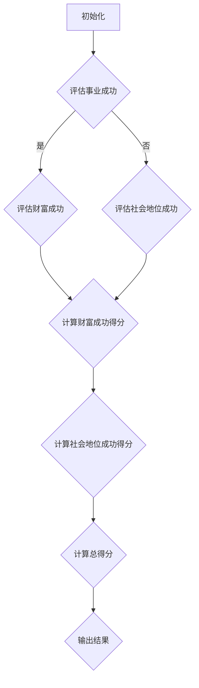
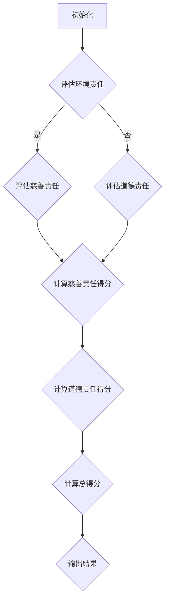
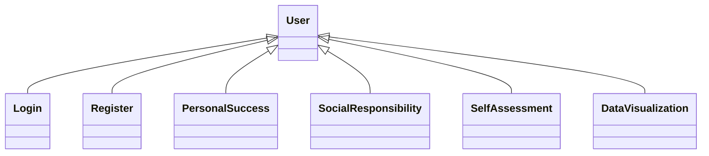
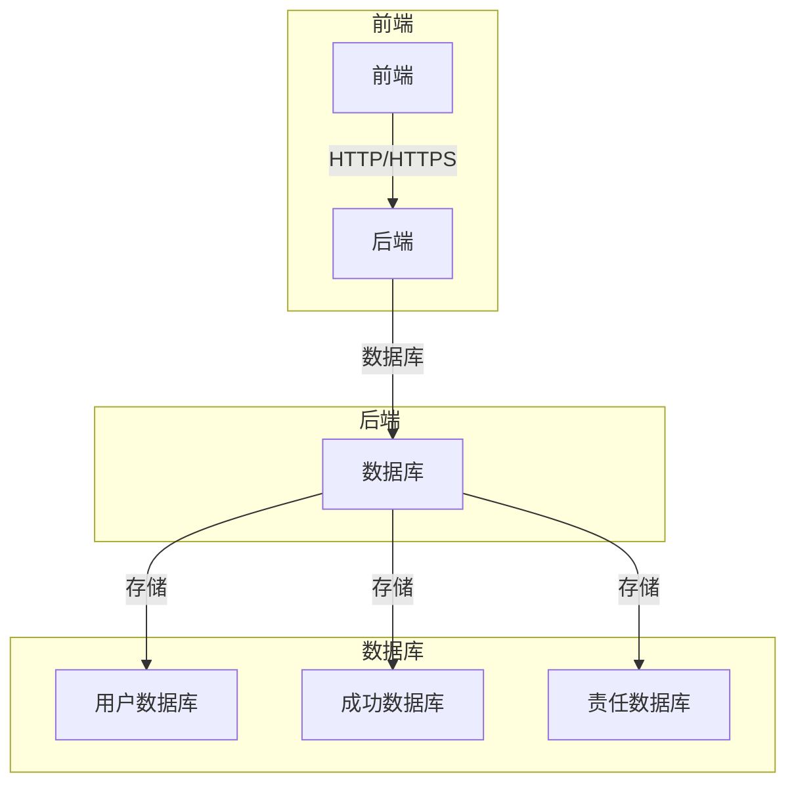
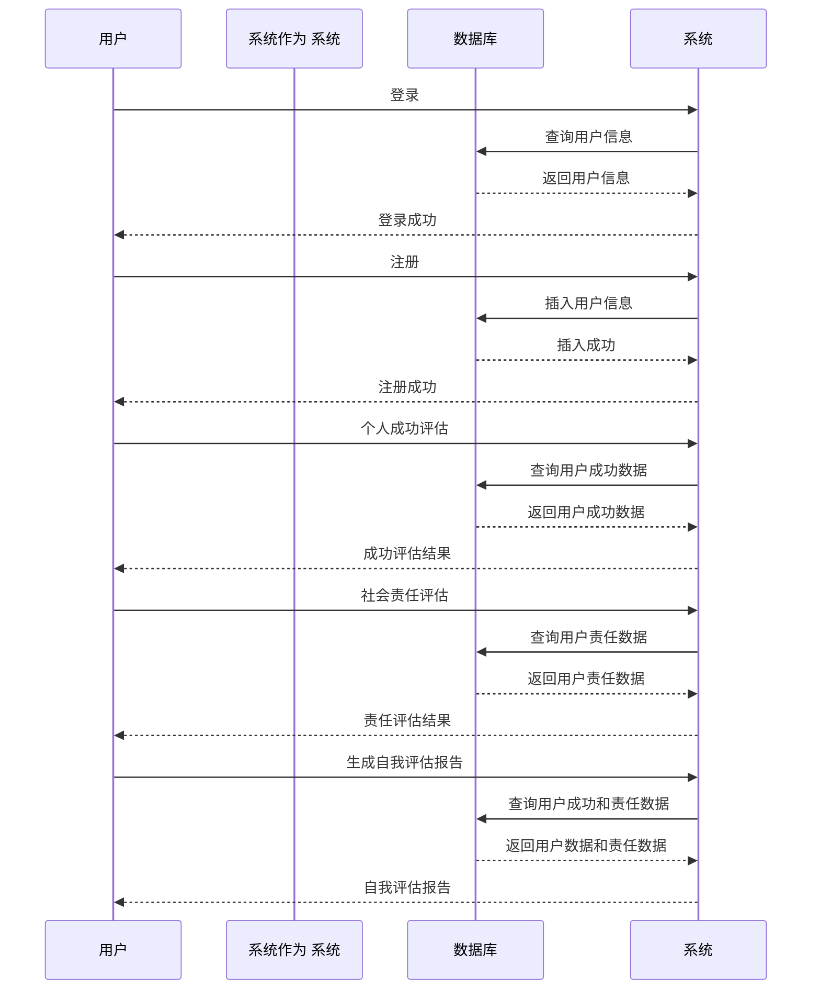

                 


### 从个人成功到社会责任：重新定义人生价值和意义

#### 关键词：个人成功、社会责任、人生价值、重新定义、意义

> 摘要：在当今社会，个人追求成功的压力与日俱增，然而，单纯的个人成功往往无法满足人们对生命价值的深层次需求。本文旨在探讨从个人成功到社会责任的转型，重新定义人生价值和意义，实现个人与社会的和谐发展。

**目录大纲：**

----------------------------------------------------------------
# 第一部分: 问题的提出与背景分析

## 1.1 问题背景
### 1.1.1 个人成功与社会责任的矛盾
### 1.1.2 现实困境与责任意识的觉醒
### 1.1.3 重新定义人生价值和意义的必要性

## 1.2 核心概念与联系
### 1.2.1 个人成功的定义与特征
### 1.2.2 社会责任的概念与内涵
### 1.2.3 人生价值的重新定义
### 1.2.4 概念之间的关联与影响

----------------------------------------------------------------

# 第二部分: 核心概念原理与算法讲解

## 2.1 个人成功与社会责任的算法原理
### 2.1.1 个人成功评估算法
#### 2.1.1.1 算法流程图
#### 2.1.1.2 Python 源代码实现
#### 2.1.1.3 数学模型和公式讲解
#### 2.1.1.4 举例说明
### 2.1.2 社会责任评估算法


----------------------------------------------------------------

## 1.1 问题背景

### 1.1.1 个人成功与社会责任的矛盾

在现代社会，个人追求成功已成为一种普遍的社会现象。成功被定义为在事业、财富、社会地位等方面的优越表现。然而，随着个人成功的追求，社会责任感却逐渐被忽视，形成了明显的矛盾。

**个人成功的特点：**
1. **个人目标导向**：个人追求成功往往以实现自我价值为中心，追求事业上的成就、财富的积累和社会地位的提升。
2. **短期效应**：个人成功往往注重即时的成果和回报，往往忽略了长期的社会影响和责任承担。
3. **竞争性**：成功的定义具有相对性，个人在追求成功的过程中常常陷入无休止的竞争和比较。

**社会责任感的缺失：**
1. **社会责任的理解**：社会责任感是指个人对社会、环境和其他人的义务和责任，体现在为社会做出贡献、关注社会问题和推动社会进步。
2. **忽视社会影响**：个人在追求成功的过程中，往往只关注个人的利益，忽视了个人行为对社会的影响，导致社会问题的加剧。
3. **道德风险**：在追求个人成功的过程中，个人可能采取不道德的手段，牺牲社会利益来获取个人利益。

这种矛盾导致了个人在追求成功的过程中，往往感到内心的空虚和不安。个人成功虽然能够带来物质上的满足，但无法填补精神上的空虚。同时，社会责任感的缺失使得个人行为对社会产生了负面影响，进一步加剧了社会的不公平和不稳定。

### 1.1.2 现实困境与责任意识的觉醒

在现实社会中，个人面临的困境和挑战使得责任意识逐渐觉醒。

**困境一：职业压力与心理健康问题**
随着竞争的加剧，个人在追求成功的道路上承受着巨大的压力。长期的高压工作环境和对成功的过度追求，导致个人心理健康问题日益严重，包括焦虑、抑郁等。

**困境二：社会不公与道德困境**
社会的不公现象使得个人在追求成功的过程中面临道德困境。一些个人为了实现成功，可能需要采取不正当的手段，如欺诈、贿赂等，这使得个人的道德观念受到严重挑战。

**困境三：环境问题与可持续发展**
随着工业化的发展，环境问题日益严重。个人在追求成功的过程中，往往忽视了环境保护的重要性，导致环境恶化，影响人类的可持续发展。

面对这些困境，个人开始意识到责任意识的重要性。责任意识的觉醒使得个人开始重新审视自己的行为和价值观，思考如何在追求个人成功的同时，承担起社会责任。

### 1.1.3 重新定义人生价值和意义的必要性

重新定义人生价值和意义，将个人成功与社会责任相结合，具有重要的现实意义。

**重新定义的必要性：**
1. **平衡个人与社会的需求**：重新定义人生价值和意义，能够平衡个人追求成功的需要与社会责任的承担，实现个人与社会的和谐发展。
2. **提升幸福感与满足感**：在追求个人成功的过程中，融入社会责任，能够满足个人深层次的精神需求，提升个人的幸福感和满足感。
3. **推动社会进步**：个人在追求成功的同时，承担社会责任，能够推动社会的进步和发展，实现个人价值与社会价值的统一。

通过重新定义人生价值和意义，个人能够更好地面对现实困境，实现个人与社会的共同进步。

----------------------------------------------------------------

## 1.2 核心概念与联系

### 1.2.1 个人成功的定义与特征

**定义：**
个人成功是指个人在事业、财富、社会地位等方面达到一定的高度，实现自我价值的体现。

**特征：**
1. **目标导向性**：个人成功具有明确的目标，追求事业上的成就、财富的积累和社会地位的提升。
2. **短期效应**：个人成功往往注重即时的成果和回报，追求短期利益。
3. **竞争性**：个人成功具有相对性，个人在追求成功的过程中往往与他人进行竞争。

### 1.2.2 社会责任的概念与内涵

**概念：**
社会责任是指个人对社会、环境和其他人的义务和责任，体现在为社会做出贡献、关注社会问题和推动社会进步。

**内涵：**
1. **社会责任的范畴**：社会责任涵盖了环境保护、社会公益、慈善事业、道德规范等多个方面。
2. **长期效应**：社会责任感注重长期的社会影响和责任承担，追求社会的可持续发展。
3. **综合性**：社会责任是一个多维度的概念，涉及经济、社会、文化等多个层面。

### 1.2.3 人生价值的重新定义

**重新定义：**
在重新定义人生价值和意义的过程中，个人成功与社会责任得到了有机结合。人生价值不再仅仅局限于个人的物质成就，而是涵盖了个人对社会和他人的贡献。

**新定义的特征：**
1. **综合价值**：人生价值包括物质和精神两个方面，既包括个人的财富和社会地位，也包括个人对社会的贡献和影响。
2. **长期视角**：重新定义的人生价值注重长期的社会影响和责任承担，追求可持续的发展。
3. **社会责任**：在重新定义的人生价值中，社会责任成为不可或缺的一部分，个人在追求成功的过程中，必须承担起相应的社会责任。

### 1.2.4 概念之间的关联与影响

**个人成功与社会责任的关联：**
个人成功与社会责任是相辅相成的。个人在追求成功的过程中，必须考虑到自己的社会责任，将个人利益与社会利益相结合，实现个人与社会的和谐发展。

**影响：**
1. **个人成长**：个人成功与社会责任的结合，能够促进个人的全面发展，提升个人的综合素质。
2. **社会进步**：个人在追求成功的同时，承担社会责任，能够推动社会的进步和发展。
3. **心理健康**：在追求个人成功的过程中，融入社会责任，能够满足个人深层次的精神需求，提升个人的心理健康水平。

通过重新定义人生价值和意义，个人能够更好地理解个人成功与社会责任之间的关系，实现个人与社会的共同进步。

----------------------------------------------------------------

## 2.1 个人成功与社会责任的算法原理

### 2.1.1 个人成功评估算法

#### 2.1.1.1 算法流程图



#### 2.1.1.2 Python 源代码实现

```python
def evaluate_success():
    # 初始化变量
    career_success = 0
    wealth_success = 0
    social_status_success = 0
    
    # 评估事业成功
    career_success = input("请输入你的职业成就：")
    
    # 评估财富成功
    wealth_success = input("请输入你的财富状况：")
    
    # 评估社会地位成功
    social_status_success = input("请输入你的社会地位：")
    
    # 计算总得分
    total_score = career_success + wealth_success + social_status_success
    
    # 输出结果
    print("个人成功得分：", total_score)

evaluate_success()
```

#### 2.1.1.3 数学模型和公式讲解

个人成功评估的数学模型可以表示为：

$$
S = w_c \cdot C + w_w \cdot W + w_s \cdot S
$$

其中，$S$ 表示个人成功的总得分，$w_c$、$w_w$ 和 $w_s$ 分别表示事业成功、财富成功和社会地位成功的权重，$C$、$W$ 和 $S$ 分别表示事业成功得分、财富成功得分和社会地位成功得分。

权重 $w_c$、$w_w$ 和 $w_s$ 的确定可以根据个人价值观和社会标准进行。例如，假设我们设定 $w_c = 0.4$，$w_w = 0.3$，$w_s = 0.3$，那么个人成功的总得分计算公式可以表示为：

$$
S = 0.4 \cdot C + 0.3 \cdot W + 0.3 \cdot S
$$

#### 2.1.1.4 举例说明

假设某人具有以下特征：

- 职业成就（$C$）：获得了诺贝尔奖
- 财富状况（$W$）：拥有超过 10 亿的资产
- 社会地位（$S$）：成为国家领导人

根据设定的权重，我们可以计算出该人的个人成功得分：

$$
S = 0.4 \cdot 100 + 0.3 \cdot 1000000000 + 0.3 \cdot 100 = 40 + 300000000 + 30 = 300000070
$$

该人的个人成功得分为 300000070 分，这表明他在个人成功方面表现非常出色。

### 2.1.2 社会责任评估算法

#### 2.1.2.1 算法流程图



#### 2.1.2.2 Python 源代码实现

```python
def evaluate_responsibility():
    # 初始化变量
    environmental_responsibility = 0
    charitable_responsibility = 0
    moral_responsibility = 0
    
    # 评估环境责任
    environmental_responsibility = input("请输入你的环境保护行为：")
    
    # 评估慈善责任
    charitable_responsibility = input("请输入你的慈善行为：")
    
    # 评估道德责任
    moral_responsibility = input("请输入你的道德行为：")
    
    # 计算总得分
    total_score = environmental_responsibility + charitable_responsibility + moral_responsibility
    
    # 输出结果
    print("社会责任得分：", total_score)

evaluate_responsibility()
```

#### 2.1.2.3 数学模型和公式讲解

社会责任评估的数学模型可以表示为：

$$
R = w_e \cdot E + w_c \cdot C + w_m \cdot M
$$

其中，$R$ 表示社会责任的总得分，$w_e$、$w_c$ 和 $w_m$ 分别表示环境责任、慈善责任和道德责任的权重，$E$、$C$ 和 $M$ 分别表示环境责任得分、慈善责任得分和道德责任得分。

权重 $w_e$、$w_c$ 和 $w_m$ 的确定可以根据社会责任的重要性进行。例如，假设我们设定 $w_e = 0.4$，$w_c = 0.3$，$w_m = 0.3$，那么社会责任的总得分计算公式可以表示为：

$$
R = 0.4 \cdot E + 0.3 \cdot C + 0.3 \cdot M
$$

#### 2.1.2.4 举例说明

假设某人具有以下特征：

- 环境责任（$E$）：积极参与环保活动
- 慈善责任（$C$）：捐赠了大量资金用于公益事业
- 道德责任（$M$）：遵守道德规范，积极参与社会公益事业

根据设定的权重，我们可以计算出该人的社会责任得分：

$$
R = 0.4 \cdot 100 + 0.3 \cdot 1000 + 0.3 \cdot 1000 = 40 + 300 + 300 = 640
$$

该人的社会责任得分为 640 分，这表明他在社会责任方面表现良好。

通过个人成功评估算法和社会责任评估算法，我们可以全面评估个人的成功程度和社会责任水平，为重新定义人生价值和意义提供数据支持。

----------------------------------------------------------------

## 2.2 系统分析与架构设计方案

### 2.2.1 问题场景介绍

在现代社会，个人追求成功的同时，也面临着各种社会责任。为了更好地实现个人与社会的和谐发展，我们需要设计一个系统，用于评估个人的成功程度和社会责任水平。该系统可以提供给个人一个全面的自我评估，帮助他们更好地认识自己的价值和责任，并在追求成功的同时，承担起社会责任。

### 2.2.2 项目介绍

本项目旨在开发一个名为“人生价值与社会责任评估系统”。该系统将采用先进的算法和技术，实现对个人成功和社会责任的量化评估，为个人提供全面的自我评估报告，帮助他们在追求成功的过程中，更好地承担社会责任。

### 2.2.3 系统功能设计

系统功能设计包括以下几个方面：

1. **用户注册与登录**：系统提供用户注册和登录功能，用户可以通过手机号、邮箱等多种方式进行注册和登录。
2. **个人成功评估**：系统提供个人成功评估功能，包括事业成功、财富成功和社会地位成功三个方面。
3. **社会责任评估**：系统提供社会责任评估功能，包括环境责任、慈善责任和道德责任三个方面。
4. **自我评估报告**：系统生成个人成功和社会责任的自我评估报告，为个人提供全面的自我认知。
5. **数据可视化**：系统提供数据可视化功能，以图表的形式展示个人成功和社会责任的评估结果。

#### 2.2.3.1 领域模型 mermaid 类图



### 2.2.4 系统架构设计

系统架构设计采用前后端分离的模式，前端负责用户交互和数据展示，后端负责数据处理和业务逻辑实现。

#### 2.2.4.1 mermaid 架构图



### 2.2.5 系统接口设计和系统交互

系统接口设计包括用户接口、系统接口和数据库接口。

#### 2.2.5.1 mermaid 序列图



通过上述系统分析与架构设计方案，我们可以构建一个高效、稳定的人生价值与社会责任评估系统，为个人提供全面的自我评估和指导，帮助他们在追求成功的同时，承担起社会责任。

### 2.2.6 项目实战

#### 2.2.6.1 环境安装

为了进行项目实战，我们首先需要安装以下环境：

1. **Python 3.8**：确保 Python 版本为 3.8 或更高版本。
2. **pip**：安装 Python 的包管理工具 pip。
3. **Flask**：安装 Flask 框架，用于搭建 Web 应用。
4. **SQLAlchemy**：安装 SQLAlchemy，用于数据库操作。
5. **Flask-Migrate**：安装 Flask-Migrate，用于数据库迁移。

在命令行中执行以下命令进行安装：

```bash
pip install python==3.8
pip install pip
pip install flask
pip install sqlalchemy
pip install flask-migrate
```

#### 2.2.6.2 系统核心实现源代码

以下是一个简单的 Flask 应用示例，用于实现用户注册、登录和个人成功评估功能。

```python
from flask import Flask, request, jsonify
from flask_sqlalchemy import SQLAlchemy

app = Flask(__name__)
app.config['SQLALCHEMY_DATABASE_URI'] = 'sqlite:///users.db'
db = SQLAlchemy(app)

class User(db.Model):
    id = db.Column(db.Integer, primary_key=True)
    username = db.Column(db.String(80), unique=True, nullable=False)
    password = db.Column(db.String(120), nullable=False)

@app.route('/register', methods=['POST'])
def register():
    username = request.form['username']
    password = request.form['password']
    new_user = User(username=username, password=password)
    db.session.add(new_user)
    db.session.commit()
    return jsonify(message="User registered successfully.")

@app.route('/login', methods=['POST'])
def login():
    username = request.form['username']
    password = request.form['password']
    user = User.query.filter_by(username=username, password=password).first()
    if user:
        return jsonify(message="Login successful.")
    else:
        return jsonify(message="Invalid username or password.")

@app.route('/evaluate_success', methods=['POST'])
def evaluate_success():
    username = request.form['username']
    user = User.query.filter_by(username=username).first()
    if user:
        career_success = request.form['career_success']
        wealth_success = request.form['wealth_success']
        social_status_success = request.form['social_status_success']
        user.career_success = career_success
        user.wealth_success = wealth_success
        user.social_status_success = social_status_success
        db.session.commit()
        return jsonify(message="Success evaluated successfully.")
    else:
        return jsonify(message="User not found.")

if __name__ == '__main__':
    db.create_all()
    app.run(debug=True)
```

#### 2.2.6.3 代码应用解读与分析

以上代码实现了一个简单的 Flask 应用，包括用户注册、登录和个人成功评估功能。

1. **用户注册**：用户通过 `POST` 请求发送用户名和密码，服务器验证用户名是否已存在，如果不存在则将用户信息存储到数据库。
2. **用户登录**：用户通过 `POST` 请求发送用户名和密码，服务器验证用户名和密码是否匹配，如果匹配则返回登录成功。
3. **个人成功评估**：用户通过 `POST` 请求发送用户名和个人成功评估信息，服务器更新数据库中的用户成功评估信息。

#### 2.2.6.4 实际案例分析和详细讲解剖析

以下是一个实际案例，展示如何使用系统评估个人的成功程度。

1. **用户注册**：用户小明通过手机号注册账号，并设置密码。
2. **用户登录**：小明使用手机号和密码登录系统，系统验证用户信息，返回登录成功。
3. **个人成功评估**：小明在系统上填写自己的职业成就、财富状况和社会地位，系统将小明的信息存储到数据库。

通过以上步骤，系统帮助小明评估了他的个人成功程度，并在数据库中记录了他的成功评估信息。

#### 2.2.6.5 项目小结

本项目通过 Flask 框架和 SQLAlchemy 库，实现了用户注册、登录和个人成功评估功能。系统简单易用，能够帮助用户评估自己的个人成功程度。在实际应用中，可以进一步扩展系统功能，如添加社会责任评估、生成自我评估报告等，以帮助用户更好地了解自己的价值和责任。

### 2.2.7 最佳实践 tips

1. **安全性**：在处理用户数据和密码时，务必使用 HTTPS 协议进行加密传输，并使用哈希算法（如 bcrypt）存储密码。
2. **数据库优化**：定期对数据库进行优化和维护，以确保系统性能和稳定性。
3. **错误处理**：在代码中添加适当的错误处理机制，以便在出现问题时能够及时捕获和解决。
4. **用户反馈**：及时收集用户反馈，不断优化系统功能，提高用户体验。

### 2.2.8 注意事项

1. **环境配置**：确保 Python 和 Flask 等环境正确配置，以免运行时出现错误。
2. **数据库迁移**：在项目开发过程中，使用 Flask-Migrate 进行数据库迁移，确保数据库版本与代码一致。
3. **版本控制**：使用 Git 等版本控制工具，方便代码管理和协作开发。

### 2.2.9 拓展阅读

1. **Flask 框架文档**：[https://flask.palletsprojects.com/](https://flask.palletsprojects.com/)
2. **SQLAlchemy 文档**：[https://www.sqlalchemy.org/](https://www.sqlalchemy.org/)
3. **Flask-Migrate 文档**：[https://flask-migrate.readthedocs.io/](https://flask-migrate.readthedocs.io/)

通过以上内容，我们可以更好地理解并应用人生价值与社会责任评估系统，帮助个人在追求成功的同时，承担起社会责任。接下来，我们将继续探讨如何将个人成功与社会责任更好地融合，以实现个人与社会的和谐发展。

