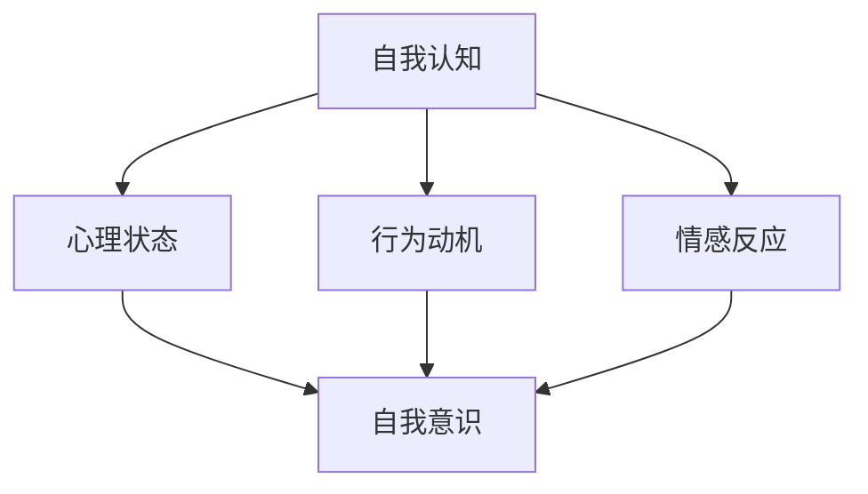
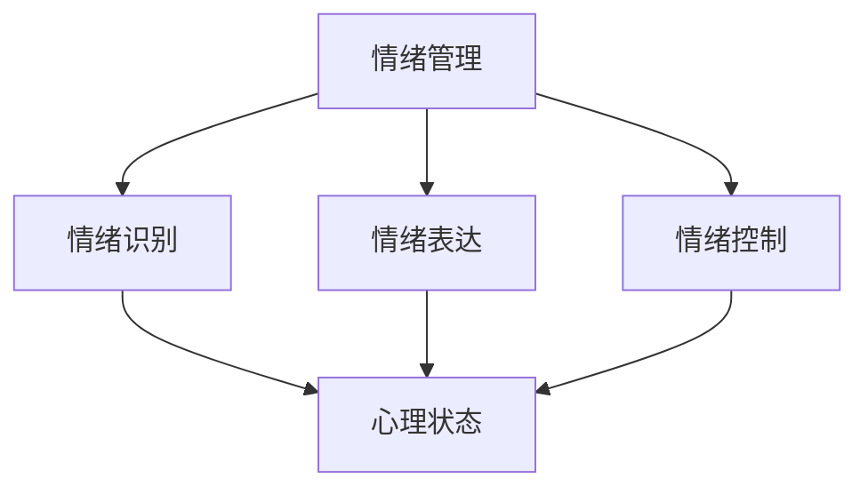
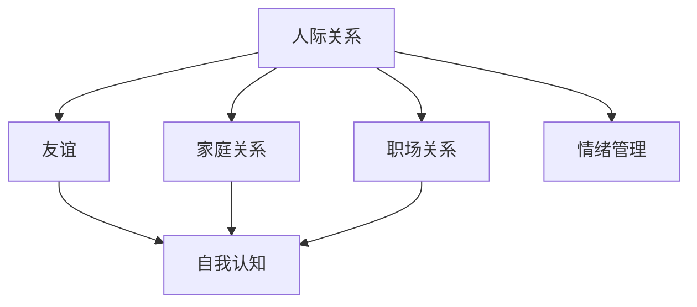
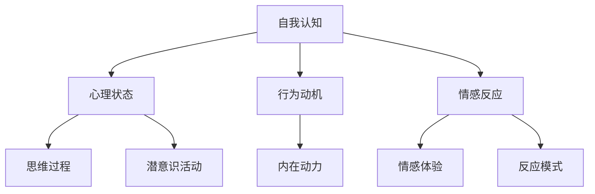

                 

### 引言

在现代社会的快速发展中，人们不断追求物质财富和社会地位，对外在成功的追逐几乎成为生活的全部。无论是职场中的业绩攀升，还是社交圈中的光鲜亮丽，外在追求似乎成为衡量一个人成功与否的标准。然而，随着生活节奏的加快和压力的增大，许多人开始感受到内心的空虚和焦虑。这使得一个重要的问题浮出水面：为什么我们在追求外在成功的同时，内心的精神需求却未能得到满足？

本文旨在探讨现代人在追求外在成功的同时，如何转向内在成长，通过精神成长来提升生活质量。我们将通过以下几个步骤进行深入分析：

1. **问题背景**：首先，我们将分析现代社会中对外在追求的现象，并探讨这种追求背后的原因和影响。
2. **内在成长的核心概念**：接下来，我们将介绍内在成长的核心概念，包括自我认知、情绪管理和人际关系。
3. **内在成长与外在追求的关联**：我们将探讨外在追求与内在成长之间的关系，以及如何平衡二者。
4. **精神成长的障碍与挑战**：我们将分析精神成长过程中可能遇到的心理障碍、生活压力和社会文化影响。
5. **精神成长的方法与途径**：然后，我们将讨论实现精神成长的具体方法和途径，包括自我探索、心理咨询与治疗、阅读与实践等。
6. **精神成长的最佳实践**：最后，我们将通过成功案例分享和最佳实践技巧，为读者提供实用的建议。

通过这篇文章，我们希望能够引导读者认识到内在成长的重要性，并提供一些实用的方法和策略，帮助他们在现代社会中实现精神上的满足和成长。

### 1.1 问题背景

现代社会中，对外在成功的追求已经成为一种普遍现象。无论是在职场中，还是在日常生活中，人们往往将外在的物质财富和社会地位视为衡量个人成功与否的标准。这种现象背后的原因多种多样。

首先，现代社会的高度竞争性使得个人在社会中的地位很大程度上取决于外在的表现。职场中的晋升、薪资和职位成为了许多人的奋斗目标，而社交媒体上的点赞数和关注人数则成为衡量个人影响力的标志。这种社会压力驱使着人们不断努力提升自己在外在世界中的表现，以获得认可和尊重。

其次，传统文化观念的影响也是一个重要因素。在很多文化中，成功被定义为拥有高薪工作、豪华住所和稳定的社交关系。这种观念在家庭教育和社会交往中根深蒂固，使得个人在成长过程中不可避免地受到这种价值观的影响。

然而，这种对外在成功的追求往往带来了一系列负面影响。首先，过度关注外在表现容易导致内心的空虚和焦虑。尽管外在成就不断攀升，但许多人发现，这些成就并不能真正带来内心的满足感。相反，随着追求的深入，他们可能会感受到更大的心理压力和负担。

其次，对外在成功的追求也容易让人忽视内在的成长需求。情绪管理、人际关系和自我认知等精神层面的成长往往被忽视，导致个人在面对生活中的挑战时显得力不从心。这种内在的空虚和无力感使得人们更加依赖外在的成功来弥补内心的不足，从而陷入一种恶性循环。

此外，现代社会的生活节奏加快，工作压力增大，导致人们很少有时间和精力去关注自己的精神需求。工作、学习和社交几乎占据了生活的全部，使得个人很难找到时间去进行自我反思和内在成长。这种生活方式的弊端在长期积累下，可能会对个人的心理健康产生严重的影响。

因此，如何在现代社会中实现外在成功与内在成长的双赢，成为了一个迫切需要解决的问题。我们需要意识到，外在的成功并不能替代内在的成长，只有通过精神上的满足和成长，才能真正实现个人幸福和生活质量的提升。

### 1.1.1 现代社会的外在追求现象

现代社会对外在成功的追求体现在多个方面，其中最为突出的莫过于职场竞争和社交网络的流行。在职场中，人们追求的不仅是薪资待遇的提高，更渴望通过职位晋升和公司知名度来证明自己的价值。这种现象在高科技公司和创业公司尤为明显，因为这类企业往往给予员工更多的机会和资源，使得职场成功显得更具吸引力和挑战性。

首先，职场上对外在成功的追求表现为对高薪职位的追求。许多职场人士将高薪视为成功的重要标志，认为只有通过获取更高的薪资，才能在社会上获得更多的尊重和认可。因此，他们在工作中不断追求更高的业绩和更多的责任，以期获得晋升机会。然而，这种追求往往忽视了个人内在的成长需求，导致长时间的工作压力和身心疲惫。

其次，职场竞争的激烈也加剧了对外在成功的追求。在竞争激烈的职场环境中，每个人都在努力提升自己的能力和业绩，以在同事和上司面前脱颖而出。这种竞争不仅体现在业绩考核上，还包括项目承担、团队合作和领导力等方面的表现。为了在这种竞争中保持优势，许多职场人士不惜牺牲个人时间和家庭生活，全身心地投入到工作中。

另一方面，社交网络的流行也进一步推动了对外在成功的追求。在社交媒体上，人们通过发布各种状态、照片和动态来展示自己的生活方式、工作成就和社交圈层。这种展示不仅是为了获得他人的认可和赞赏，更是为了在社会地位上获得一定的优势。因此，许多人会在社交网络上花费大量时间和精力，精心设计和呈现自己的“完美生活”。

具体例子包括：某人在朋友圈发布一张豪华餐厅的晚餐照片，附上“感恩生活，一切都在变好”；另一个人在社交媒体上分享自己参与某高端论坛的照片，并配上关于行业趋势的见解。这些行为背后，往往隐藏着对外在成功的渴望和对社会认可的追求。

然而，这种追求外在成功的现象背后，往往隐藏着内心的焦虑和不安。尽管外在的成就不断增加，但许多人发现，这些成就并不能真正带来内心的满足感。相反，随着追求的深入，他们可能会感受到更大的心理压力和负担。这种心理负担不仅影响了个人的心理健康，还可能导致他们在人际关系和自我认知方面出现问题。

### 1.1.2 内在成长的重要性

内在成长是个人精神世界的重要基石，它不仅仅关乎个人的心理健康，更是决定一个人能否在纷繁复杂的社会环境中保持内在平衡和持久幸福的关键。首先，内在成长对心理健康具有深远的影响。通过自我认知、情绪管理和人际关系等方面的提升，个人能够更好地应对生活中的压力和挑战，减少焦虑和抑郁情绪，提高心理健康水平。

其次，内在成长有助于提升个人的生活质量。外在的成功虽然能带来一时的满足，但只有内在的充实和成长才能带来长期的幸福。内在成长使个人能够更加真实地面对自己，找到内心的宁静和满足，从而在日常生活中体验到更多的快乐和意义。

此外，内在成长还能够促进个人的社会适应能力。在复杂多变的社会环境中，拥有良好内在成长能力的人能够更加从容地处理人际关系，更好地应对各种社会挑战，从而在社会中建立稳固的支持网络。

总之，内在成长不仅是个人心理健康的保障，也是提升生活质量和适应社会环境的关键。通过不断地自我探索和成长，个人能够更好地实现自我价值，获得更深层次的幸福感。

### 1.1.3 精神成长的意义与价值

精神成长在个人发展过程中具有极其重要的意义和价值。首先，精神成长有助于提升个人的心理健康水平。通过自我认知和情绪管理，个人能够更好地理解自己的内心世界，减少焦虑和抑郁情绪，提高心理韧性，从而保持心理健康。

其次，精神成长对于提升生活质量具有重要意义。在物质条件日益丰富的现代社会，人们开始意识到内在的充实和满足才是真正持久的幸福感来源。精神成长使个人能够找到内心的平静和快乐，从而在日常生活中体验到更多的幸福感。

此外，精神成长能够增强个人的社会适应能力。在复杂多变的社会环境中，拥有良好精神成长能力的人能够更好地处理人际关系，应对各种社会挑战，建立稳固的支持网络，从而在社会中更好地立足。

最后，精神成长有助于实现个人的长期目标和理想。通过自我认知和持续成长，个人能够更加清晰地认识到自己的优势和潜力，制定并实现有意义的人生目标，实现自我价值。

总的来说，精神成长不仅有助于提升心理健康和生活质量，还能够增强社会适应能力和实现长期目标，是个人发展中不可或缺的重要组成部分。

### 1.2 内在成长的核心概念

内在成长是一个复杂而多维度的过程，它涉及多个核心概念，包括自我认知、情绪管理、人际关系等。这些概念共同构成了内在成长的基础，帮助我们更好地理解并实现个人精神层面的提升。

#### 1.2.1 自我认知

自我认知是内在成长的基础，它涉及到对自身思维、情感和行为模式的深刻理解。通过自我认知，个人能够更加清晰地认识到自己的优点和不足，从而有针对性地进行改进。自我认知的途径包括内省、反思和自我反思等。例如，通过记录日记，个人可以反思自己的行为和情感反应，从而更好地了解自己的内在世界。

核心概念与联系：

- **定义**：自我认知是指个人对自身心理状态、行为动机和情感反应的理解和反思。
- **价值**：自我认知有助于提升个人自我意识和心理韧性，减少自我认知偏差，从而更好地应对生活中的挑战。
- **与其他概念的联系**：自我认知与情绪管理密切相关，因为只有了解自己的情绪，才能更好地进行情绪管理。同时，自我认知也是人际关系管理的重要基础，通过了解自己，个人可以更好地理解和应对他人的行为。

ER实体关系图架构：

#### 1.2.2 情绪管理

情绪管理是内在成长的重要组成部分，它涉及到对情绪的识别、表达和控制。情绪管理不仅有助于提升个人心理健康，还能够改善人际关系和工作表现。常见的情绪管理方法包括深呼吸法、正念冥想和情绪释放技巧等。

核心概念与联系：

- **定义**：情绪管理是指个人对情绪反应的认识和调节，包括情绪的识别、表达和控制。
- **价值**：情绪管理有助于减少情绪波动，提升心理韧性，从而更好地应对生活中的压力和挑战。
- **与其他概念的联系**：情绪管理需要建立在自我认知的基础上，因为只有了解自己的情绪，才能进行有效的管理。同时，情绪管理也是人际关系管理的重要一环，通过情绪管理，个人可以更好地处理与他人的关系。

ER实体关系图架构：

#### 1.2.3 人际关系

人际关系是内在成长的重要组成部分，它涉及到个人与他人之间的互动和沟通。良好的人际关系有助于提升个人幸福感和社会支持感，从而促进内在成长。人际关系管理包括建立良好的人际关系、处理人际冲突和维护人际关系等。

核心概念与联系：

- **定义**：人际关系是指个人与他人之间的互动和沟通，包括友谊、家庭关系和职场关系等。
- **价值**：良好的人际关系有助于提升个人幸福感，提供情感支持和实际帮助，从而促进内在成长。
- **与其他概念的联系**：人际关系管理需要建立在自我认知和情绪管理的基础上，因为只有了解自己和他人，才能建立良好的人际关系。同时，人际关系也是情绪管理的重要组成部分，通过处理人际关系中的情绪问题，个人可以更好地控制自己的情绪。

ER实体关系图架构：

通过以上对内在成长核心概念的介绍，我们可以看到，自我认知、情绪管理和人际关系相互关联，共同构成了内在成长的基础。只有通过不断探索和提升这些核心概念，个人才能真正实现内在的成长和提升。

### 1.3 内在成长与外在追求的关联

内在成长和外在追求之间存在一定的关联，但二者往往存在矛盾。首先，内在成长关注的是个人的精神层面，包括自我认知、情绪管理和人际关系等方面，而外在追求则更多关注物质财富和社会地位。内在成长侧重于提升个人内在的满足感和幸福感，而外在追求则侧重于在他人眼中的成功和认可。

#### 1.3.1 外在追求与内在成长的矛盾

外在追求与内在成长之间的矛盾主要体现在以下几个方面：

1. **价值观的冲突**：外在追求往往以物质财富和社会地位为核心，而内在成长则强调精神层面的满足和自我实现。这种价值观的冲突可能导致个人在追求外在成功的过程中，忽视内在的成长需求，从而产生内心的空虚和焦虑。

2. **时间与精力的分配**：外在追求通常需要大量的时间和精力，特别是对于职场人士来说，长时间的工作和频繁的社交活动可能会挤压个人进行自我反思和内在成长的时间。这种时间与精力的分配问题使得内在成长难以得到有效的推进。

3. **心理压力的积累**：外在追求往往会带来巨大的心理压力，特别是在竞争激烈的职场和社交环境中，个人可能会因为追求外在成功而承受过大的心理负担。这种心理压力不仅影响个人的心理健康，还可能对内在成长产生负面影响。

#### 1.3.2 如何平衡外在追求与内在成长

为了平衡外在追求与内在成长，个人可以采取以下策略：

1. **明确目标**：首先，个人需要明确自己的目标，区分外在追求和内在成长的重要性。通过设定清晰的目标，个人可以更加有针对性地分配时间和精力，避免将过多精力投入到无谓的外在追求中。

2. **时间管理**：合理的时间管理是平衡外在追求与内在成长的关键。个人可以通过制定详细的时间表和任务清单，合理安排工作和生活，确保有足够的时间进行自我反思和内在成长。

3. **培养自我认知和情绪管理能力**：通过自我认知和情绪管理，个人可以更好地理解自己的需求和情绪，从而更加从容地应对外在追求带来的压力。这种内在的平衡有助于减少焦虑和压力，提升个人心理健康。

4. **积极参与心理咨询与治疗**：心理咨询与治疗可以帮助个人解决内在成长过程中遇到的问题，如情绪障碍和人际关系问题等。通过专业的指导和支持，个人可以更好地实现内在成长。

5. **持续学习和实践**：内在成长是一个持续的过程，需要个人不断地学习和实践。通过阅读、参加培训课程和进行自我探索，个人可以不断提升自我认知和情绪管理能力，从而更好地平衡外在追求与内在成长。

#### 1.3.3 实现二者的有机结合

实现外在追求与内在成长的有机结合，需要个人在以下几个方面进行努力：

1. **自我接纳**：首先，个人需要接纳自己的不完美，理解外在追求和内在成长之间的矛盾是正常的。通过自我接纳，个人可以减少对外在成功的过度追求，从而更多地关注内在成长。

2. **平衡心态**：在追求外在成功的过程中，个人需要保持平衡的心态。不仅要关注外在成就，还要关注内在的成长需求。通过平衡心态，个人可以更好地实现二者的有机结合。

3. **实践具体策略**：通过实践具体策略，如时间管理、情绪管理和自我认知等，个人可以更好地平衡外在追求与内在成长。这些策略不仅有助于提升个人心理健康，还能够提高外在追求的效果。

4. **建立支持系统**：建立一个支持系统，包括家人、朋友和专业人士等，可以帮助个人在追求外在成功和内在成长的过程中获得支持和指导。这种支持系统有助于个人更好地应对挑战，实现二者的有机结合。

通过以上的策略和实践，个人可以更好地平衡外在追求与内在成长，实现精神层面的满足和物质层面的成功。这样的有机结合不仅有助于提升个人生活质量，还能够为社会的和谐发展做出贡献。

### 1.4 精神成长的障碍与挑战

在追求精神成长的过程中，个人往往会遇到各种障碍和挑战。这些障碍不仅会影响个人的心理健康，还可能阻碍精神成长的进程。以下是精神成长过程中常见的几种障碍和挑战。

#### 1.4.1 心理障碍

心理障碍是精神成长过程中最常见的障碍之一。常见的心理障碍包括焦虑、抑郁和自卑等。

- **焦虑**：焦虑是一种普遍的心理现象，它可能导致个人在面对挑战时产生过度担忧和紧张情绪。长期焦虑会对个人的心理健康产生负面影响，阻碍精神成长的进程。

- **抑郁**：抑郁是一种情绪障碍，表现为长期的悲伤、绝望和无望感。抑郁症不仅影响个人的情绪状态，还会影响其日常生活和工作表现，从而阻碍精神成长。

- **自卑**：自卑感是一种自我否定和自我评价偏低的心理状态。自卑感使人缺乏自信，难以面对生活中的挑战，从而阻碍精神成长。

克服这些心理障碍需要个人通过自我认知和情绪管理来提升心理韧性。例如，通过正念冥想和认知行为疗法等方法，个人可以学会更好地应对焦虑和抑郁情绪，增强自我信心。

#### 1.4.2 生活压力

生活压力也是精神成长过程中的一大障碍。现代社会的生活节奏加快，工作压力大，人际关系复杂，这些因素都会增加个人的心理压力。

- **工作压力**：职场竞争激烈，许多人为了追求外在成功，不得不加班加点工作，长期承受巨大的工作压力。这种压力不仅会影响个人的心理健康，还可能导致身体疾病。

- **人际关系**：人际关系复杂，包括家庭、朋友和同事等，都可能给个人带来压力。在处理人际关系时，个人可能会因为沟通不畅或冲突而感到焦虑和沮丧。

为了克服生活压力，个人需要学会时间管理和情绪管理。通过合理安排时间，提高工作效率，个人可以减轻工作压力。同时，通过情绪管理技巧，如深呼吸和正念冥想，个人可以缓解因人际关系引发的焦虑和压力。

#### 1.4.3 社会文化影响

社会文化影响也是精神成长过程中不可忽视的障碍。不同的社会文化背景会对个人的价值观、行为方式和思维方式产生深远的影响。

- **传统观念**：在很多文化中，传统观念仍然根深蒂固，如对性别角色的刻板印象、对成功的定义等。这些传统观念可能阻碍个人实现自我认知和内在成长。

- **社会压力**：现代社会对个人成功和幸福的期望较高，这种压力可能导致个人过度追求外在成功，忽视内在成长需求。社会压力还可能影响个人的心理健康，导致焦虑和抑郁情绪。

为了克服社会文化影响，个人需要培养批判性思维，学会识别和挑战不合理的观念和期望。同时，通过自我探索和反思，个人可以更好地理解自己的价值观和需求，从而实现真正的内在成长。

总的来说，精神成长过程中面临的障碍和挑战是多方面的。通过自我认知、情绪管理和社会适应能力的提升，个人可以克服这些障碍，实现精神成长的目标。同时，社会和文化环境也需要不断改善，为个人的精神成长提供更好的支持和条件。

### 1.5 精神成长的方法与途径

实现精神成长是一个复杂且持续的过程，需要个人采取多种方法和途径。以下是几种常见且有效的方法，帮助个人在精神成长的道路上取得进展。

#### 1.5.1 自我探索

自我探索是精神成长的基础，它涉及对自身心理状态、行为动机和情感反应的深入了解。通过自我探索，个人可以更好地认识自己，发现自己的优点和不足，从而制定出有针对性的成长计划。

- **方法**：
  1. **内省**：通过内省，个人可以反思自己的行为和情感反应，深入思考自己的内心世界。这种内省可以是日常的反思，也可以是通过写日记或进行冥想来进行。
  2. **记录与分析**：记录自己的日常生活、情感变化和思考过程，然后进行分析，可以帮助个人发现内在的规律和模式。
  3. **反馈**：通过与朋友、家人或心理咨询师交流，获取他人的反馈，可以帮助个人从不同的角度看待自己，发现自己的盲点和不足。

- **实例**：例如，一个职场人士在写日记时，发现自己经常因为工作任务繁重而感到焦虑。通过分析，他意识到自己的时间管理能力有待提高。于是，他开始学习时间管理技巧，并在工作中进行实践，逐渐改善了焦虑情绪。

#### 1.5.2 心理咨询与治疗

心理咨询与治疗是帮助个人解决心理障碍和提升心理健康的重要途径。通过专业的心理咨询师，个人可以深入了解自己的问题，获得有效的解决方案。

- **方法**：
  1. **认知行为疗法**：这是一种通过改变不合理的思维模式和行为来改善心理问题的方法。通过认知行为疗法，个人可以学会更加积极和现实地看待问题，从而减轻焦虑和抑郁情绪。
  2. **情感焦点疗法**：这种疗法强调理解个人的情感需求和情感反应，通过情感焦点疗法，个人可以学会更好地处理和表达自己的情感。
  3. **心理动力学疗法**：这种疗法侧重于探索个人的潜意识问题和心理冲突，通过心理动力学疗法，个人可以深入了解自己的心理结构，从而实现更深层次的成长。

- **实例**：一个长期感到自卑的职场人士，通过认知行为疗法，学会了如何识别和挑战自己的负面思维模式。在心理咨询师的帮助下，他逐渐建立起自信心，并在工作中取得了显著的成绩。

#### 1.5.3 阅读与实践

阅读与实践是精神成长的重要途径，通过阅读专业书籍和进行实践，个人可以获取新的知识和技能，从而促进内在成长。

- **方法**：
  1. **阅读专业书籍**：通过阅读心理学、哲学和自我成长等领域的书籍，个人可以获取丰富的理论知识，了解不同的精神成长方法。
  2. **参加培训课程**：参加各种培训课程，如心理学、领导力和个人成长等，可以帮助个人提升相关技能，从而更好地应对生活中的挑战。
  3. **实践**：将学到的知识和技能应用到实际生活中，通过实践来验证和提升自己的能力。

- **实例**：一个职场人士在阅读了《正面管教》一书后，开始尝试将书中的理念应用到家庭教育中。通过实践，他发现家庭氛围明显改善，孩子的行为也变得更加积极和合作。

总的来说，自我探索、心理咨询与治疗、阅读与实践是精神成长的重要方法和途径。通过这些方法，个人可以不断提升自我认知、情绪管理和人际关系能力，实现内在成长的目标。同时，这些方法也需要持续地实践和调整，以适应个人成长的不同阶段和需求。

### 1.6 精神成长的最佳实践

实现精神成长并非一蹴而就，需要通过最佳实践来指导我们的行动。以下是一些具体的方法、技巧和策略，帮助我们在精神成长的道路上更加顺利地前行。

#### 1.6.1 成功案例分享

成功案例分享是学习精神成长的最佳实践的有效途径之一。通过了解他人的经验和教训，我们可以避免走弯路，更快地实现自己的成长目标。

- **案例一**：某职场人士在高压的工作环境中，通过每日进行冥想和写日记，成功减轻了心理压力，提高了工作效率。他的经验是：设定固定的冥想时间，通过深呼吸和正念冥想，让自己保持内心的平静。
- **案例二**：一位企业家通过阅读心理学和哲学书籍，提升了自己的情绪管理和人际关系处理能力，从而在商业领域取得了巨大的成功。他的建议是：定期阅读专业书籍，并结合实际生活进行反思和应用。
- **案例三**：一位长期感到自卑的职场人士，通过参加心理咨询和进行自我探索，逐渐建立了自信心，并在工作中取得了显著的成就。她的心得是：勇敢面对自己的问题，寻求专业帮助，不断进行自我反思。

#### 1.6.2 实践技巧与策略

在实践中，我们可以采取一系列技巧和策略，以促进精神成长。

- **技巧一**：建立每日反思习惯。通过每天花10-15分钟反思自己的行为、情绪和思考，我们可以更好地了解自己，发现潜在的问题并加以改进。
- **技巧二**：设定明确的目标。通过设定具体、可衡量的目标，我们可以更有方向地行动，并在实现目标的过程中获得成就感。
- **技巧三**：保持学习态度。无论是通过阅读书籍、参加培训课程还是在线学习，持续学习可以帮助我们不断提升自己的知识和技能，从而在精神成长中保持竞争力。

- **策略一**：时间管理。通过合理规划时间和任务，我们可以减少因忙碌而忽视精神成长的可能性，从而有更多时间进行自我反思和实践。
- **策略二**：建立支持系统。与家人、朋友或专业人士建立良好的支持关系，可以帮助我们在面对挑战时获得帮助和鼓励，从而更好地实现精神成长。
- **策略三**：平衡工作与生活。通过合理安排工作和休闲时间，我们可以确保自己在追求外在成功的同时，不忽视内在成长的需求。

#### 1.6.3 精神成长的误区与纠正

在追求精神成长的过程中，我们可能会陷入一些误区，影响成长效果。以下是一些常见的误区及其纠正方法：

- **误区一**：追求快速见效。许多人在追求精神成长时，期望能够迅速看到成效，但精神成长是一个长期的过程。纠正方法：保持耐心，理解精神成长需要时间和努力，设定长期目标，并持续努力。
- **误区二**：过度自我批评。有些人对自己要求过高，导致过度自我批评，从而产生负面情绪。纠正方法：学会自我接纳，认识到每个人都有优点和不足，对自己保持宽容和鼓励。
- **误区三**：忽视情绪管理。在精神成长过程中，情绪管理至关重要，但许多人忽视这一点。纠正方法：学习和实践情绪管理技巧，如深呼吸、正念冥想等，学会有效地应对情绪波动。

通过以上最佳实践的方法、技巧和策略，我们可以更好地实现精神成长的目标，提升自己的心理健康和生活质量。记住，精神成长是一个持续的过程，需要我们不断地努力和自我提升。

### 1.7 本章小结

本文通过系统分析和详细探讨，揭示了现代人在追求外在成功的同时，转向内在成长的重要性和必要性。我们首先介绍了现代社会中对外在追求的现象，并分析了这种现象背后的原因和影响。接着，我们深入探讨了内在成长的核心概念，包括自我认知、情绪管理和人际关系，并阐述了这些概念在精神成长中的重要性。此外，我们还分析了内在成长与外在追求之间的矛盾，并提出了平衡二者的策略和方法。

在讨论精神成长的障碍与挑战时，我们指出心理障碍、生活压力和社会文化影响是阻碍精神成长的主要因素，并提出了克服这些障碍的具体方法。随后，我们介绍了精神成长的方法与途径，包括自我探索、心理咨询与治疗、阅读与实践等，为读者提供了实用的成长策略。

最后，通过成功案例分享和实践技巧，我们为读者提供了实现精神成长的最佳实践建议。我们强调，精神成长是一个持续的过程，需要个人的耐心和努力。通过不断的自我提升和实践，个人可以实现内心的满足和长期的幸福感。

总之，本文旨在引导读者认识到内在成长的重要性，并提供具体的方法和策略，帮助他们在现代社会中实现精神上的满足和成长。希望读者能够从中受益，开启自己的精神成长之旅。

### 第2章 自我认知

自我认知是内在成长的基础，它涉及到对自身心理状态、行为动机和情感反应的深入理解。自我认知不仅帮助我们识别自身的优点和不足，还能提升自我意识和心理韧性，从而更好地应对生活中的挑战。在本章中，我们将深入探讨自我认知的重要性、基本概念、途径与方法，以及自我认知的挑战和克服方法。

#### 2.1 自我认知的重要性

自我认知在个人成长和发展中具有极其重要的地位。首先，自我认知有助于提升自我意识。通过深入了解自己的心理状态和行为模式，个人能够更加清晰地认识到自己的内在需求和欲望，从而更好地规划自己的人生目标。其次，自我认知能够增强心理韧性。当个人面对压力和挑战时，通过自我认知，他们能够更好地理解和应对自己的情绪，从而减少焦虑和抑郁情绪。此外，自我认知也是情绪管理和人际关系管理的重要基础。只有了解自己的情绪和行为，个人才能更好地控制自己的情绪，处理与他人的关系。

#### 2.1.1 自我认知的基本概念

自我认知是指个人对自身心理状态、行为动机和情感反应的认识和理解。它不仅涉及到对自身内在心理过程的反思，还包括对自身外在行为和情绪反应的观察和分析。

- **定义**：自我认知是指个体通过反思和观察，对自身的心理状态、行为动机和情感反应进行理解和分析的能力。
- **核心要素**：
  - **心理状态**：包括思维过程、情绪状态和潜意识活动。
  - **行为动机**：涉及个体行为的内在动力和动机来源。
  - **情感反应**：个体对外界刺激产生的情感体验和反应。

自我认知的基本概念框架可以用以下ER实体关系图表示：

#### 2.1.2 自我认知的价值

自我认知的价值在于它能够为个人的成长和发展提供明确的指导和方向。以下是自我认知的一些具体价值：

- **提升自我意识**：自我认知帮助个人了解自己的内在心理状态和情感反应，从而提升自我意识。这种自我意识的提升有助于个人更加清晰地认识到自己的优势和不足，从而更好地发挥自身潜力。
- **促进心理健康**：通过自我认知，个人能够更好地理解和管理自己的情绪，减少焦虑和抑郁情绪，从而提升心理健康水平。
- **增强人际关系**：自我认知帮助个人更好地理解和应对他人的行为和情绪，从而改善人际关系。通过自我认知，个人可以更加敏锐地察觉他人的需求，从而建立更加和谐的人际关系。
- **实现目标**：自我认知为个人提供了明确的目标和方向，帮助个人更加专注地追求自己的梦想和目标。通过自我认知，个人可以设定具体、可实现的目标，并制定有效的行动计划。

#### 2.1.3 自我认知与精神成长的关系

自我认知是精神成长的核心要素之一。它不仅有助于个人的心理发展和情绪调节，还直接影响个人的精神成长进程。

- **自我认知与心理发展**：自我认知是心理发展的基础。通过自我认知，个人能够不断反思和调整自己的心理状态和行为模式，从而促进心理健康和情绪稳定。这种心理发展有助于个人在面临生活挑战时保持内在的平衡和稳定性。
- **自我认知与情绪调节**：自我认知帮助个人更好地理解和控制自己的情绪。通过自我认知，个人可以识别和表达自己的情感，从而减少情绪波动，提高情绪调节能力。这种情绪调节能力是精神成长的重要组成部分，有助于个人在压力和困难面前保持冷静和理智。
- **自我认知与精神成长**：自我认知是精神成长的基石。通过自我认知，个人能够深入了解自己的内在世界，找到内心的平静和满足，从而实现更深层次的精神成长。自我认知有助于个人识别自己的需求和目标，从而制定出更加有意义和有价值的成长计划。

总的来说，自我认知不仅对个人心理健康和情绪调节具有重要意义，更是实现精神成长的关键要素。通过提升自我认知，个人可以更好地理解自己，提升内在的满足感和幸福感，从而实现全面的精神成长。

### 2.2 自我认知的途径与方法

自我认知是一个复杂且持续的过程，需要通过多种途径和方法来深入理解和提升。以下是几种常见的自我认知途径和方法：

#### 2.2.1 内省

内省是一种通过反思和自我观察来深入了解自己的方法。通过内省，个人可以对自己的思维、情感和行为进行深入分析，从而发现内心的真实需求和问题。

- **方法**：
  1. **定期反思**：每天或每周花一些时间反思自己的行为和情绪反应，思考自己的感受和原因。
  2. **写日记**：通过写日记记录自己的思考、感受和经历，可以帮助个人更好地理解自己。
  3. **自我提问**：在反思过程中，提出一些深入的问题，如“我为什么会有这样的情绪反应？”或“我在这个情境下想要什么？”

- **实例**：一个职场人士在每天晚上写日记，记录自己当天的行为和情绪变化。通过这种内省，他逐渐意识到自己容易在工作压力下感到焦虑，并开始寻找缓解压力的方法。

#### 2.2.2 反馈

反馈是另一种有效的自我认知途径，通过他人的观察和评价，个人可以更客观地了解自己。

- **方法**：
  1. **寻求他人反馈**：与朋友、家人或同事交流，了解他们对你的看法和评价。
  2. **反馈会议**：定期参加反馈会议，从上司、同事或下属那里获取关于工作表现和人际关系方面的反馈。
  3. **自我反馈**：在特定情境下，自己记录和评价自己的行为和反应，进行比较和分析。

- **实例**：一位职场女性通过定期与导师进行反馈会议，了解了自己在团队中的表现和不足，并获得了改进的建议。这种反馈帮助她提升了工作效率和团队合作能力。

#### 2.2.3 记录与分析

记录与分析是通过记录日常生活和情绪变化，然后进行分析来深入了解自己的方法。

- **方法**：
  1. **情绪日志**：记录每天的情绪变化，分析情绪波动的原因。
  2. **行为日志**：记录日常行为和习惯，分析行为模式及其对情绪和生活的影响。
  3. **数据分析**：通过数据分析工具，如Excel或统计软件，对记录的数据进行定量分析，找到规律和趋势。

- **实例**：一个学生通过记录一周的情绪日志，发现了自己在考试前容易焦虑的原因。通过分析，她决定在考试前进行深呼吸和放松训练，以缓解焦虑情绪。

#### 2.2.4 自我提问

自我提问是通过提出深入的问题来引导自我探索的方法。

- **方法**：
  1. **开放性问题**：提出开放式问题，如“我的人生目标是什么？”或“我为什么会对这个情境感到焦虑？”
  2. **反思性问题**：通过反思性问题，如“我在这个情境下学到了什么？”或“这个经历对我有什么意义？”来引导自我反思。
  3. **目标导向问题**：提出与目标相关的问题，如“如何实现这个目标？”或“我需要做哪些准备？”

- **实例**：一位职场人士在面临职业瓶颈时，通过自我提问找到了问题的根源，并制定了具体的行动计划，从而成功提升了职业发展。

通过以上几种方法，个人可以更全面地了解自己，提升自我认知能力，从而在精神成长的道路上取得更好的进展。这些方法不仅有助于识别问题和挑战，还能为个人的成长提供有效的指导和支持。

### 2.3 自我认知的挑战

在自我认知的过程中，个人往往会遇到各种挑战和困难，这些挑战不仅会影响自我认知的深度和广度，还可能阻碍精神成长。以下是自我认知过程中常见的挑战及其克服方法。

#### 2.3.1 自我认知的困难

自我认知的困难主要包括以下几个方面：

- **自我防御机制**：自我防御机制是个人在面对不舒适或威胁时的一种心理反应。常见的自我防御机制包括否认、压抑、投射和合理化等。这些机制虽然能够暂时缓解焦虑和压力，但会阻碍真实的自我认知。
- **情绪干扰**：情绪是影响自我认知的重要因素。强烈的情绪，如焦虑、愤怒和悲伤等，可能会干扰个人的思考过程，使个人难以客观地观察和分析自己的心理状态。
- **环境干扰**：外部环境的干扰，如他人的评价、社会的期望等，也可能影响自我认知。这些外部因素可能会使个人产生偏见，从而难以真实地了解自己。

**克服方法**：
- **认知行为疗法**：通过认知行为疗法，个人可以学会识别和改变自我防御机制，从而更真实地面对自己的内心。这种方法可以帮助个人建立更健康的思考模式。
- **正念冥想**：正念冥想可以帮助个人培养专注力和情绪调节能力，从而减少情绪干扰。通过正念冥想，个人可以更加冷静和客观地观察自己的内心世界。
- **自我接纳**：自我接纳是克服自我防御机制的重要一步。通过接纳自己的不完美，个人可以减少自我防御，从而更容易地进行自我认知。

#### 2.3.2 自我认知的误区

在自我认知的过程中，个人还可能陷入一些误区，这些误区会影响自我认知的准确性和有效性。

- **过度自我批评**：一些人可能会对自己过于苛刻，经常自我批评。这种过度自我批评不仅会影响个人的自尊心，还可能导致焦虑和抑郁情绪。
- **片面认知**：片面认知是指个人只看到自己的优点或缺点，而忽视其他方面。这种片面认知会使个人难以全面了解自己，从而阻碍精神成长。
- **自我认知停滞**：一些人可能会在自我认知上停滞不前，认为自己的认知已经足够，不需要再进行深入的探索。这种认知停滞会导致个人难以发现新的问题和挑战。

**克服方法**：
- **正面肯定**：通过正面肯定，个人可以提升自尊心，减少自我批评。正面肯定可以通过自我对话、写日记等方式进行。
- **多角度思考**：通过多角度思考，个人可以更全面地了解自己。在反思和自我分析时，可以尝试从不同的角度和立场来审视自己的行为和情绪。
- **持续学习**：自我认知是一个持续的过程，个人需要保持开放和求知的态度。通过不断学习和实践，个人可以不断提升自我认知的能力和深度。

总的来说，自我认知过程中遇到的挑战和误区是正常的，关键在于个人如何面对和克服这些挑战。通过有效的认知行为疗法、正念冥想和持续学习，个人可以克服自我认知的困难，实现更深层次的自我认知和成长。

### 2.4 成长路径与策略

在自我认知的过程中，制定清晰的目标和行动策略至关重要。这不仅有助于我们明确前进的方向，还能激发内在的动力，推动自我成长。以下是设定自我成长目标、制定行动计划以及持续自我改进的具体步骤和方法。

#### 2.4.1 自我成长的目标设定

设定自我成长目标是精神成长的第一步，一个明确的目标能够为我们提供方向和动力。以下是设定目标的基本步骤：

- **步骤一：明确目标类型**：首先，需要明确自己设定的目标是短期目标、长期目标，还是终身目标。短期目标通常是一年内可以实现的，长期目标可能需要几年甚至更长时间，而终身目标是个人一生的追求。
- **步骤二：具体化目标**：将目标具体化，使其具有明确的内容和可量化的标准。例如，如果目标是提升情绪管理能力，可以具体化为“每周进行三次正念冥想，每次30分钟”。
- **步骤三：设定时间表**：为每个目标设定一个明确的时间表，确保目标在合理的时间范围内可以实现。例如，如果目标是学习一门新技能，可以设定为“六个月内完成”。
- **步骤四：制定评估标准**：为每个目标设定评估标准，以便在实现目标的过程中进行监控和调整。例如，可以通过“情绪日志”来记录冥想对情绪管理的影响。

**实例**：一个职场人士设定了一个短期目标——提高演讲技巧。他具体化为“每个月参加一次公开演讲，每次演讲前进行至少三次模拟练习”，并设定了六个月的时间表，通过记录演讲反馈来评估目标实现情况。

#### 2.4.2 行动计划的制定

制定行动计划是将目标转化为具体行动的关键步骤。以下是制定行动计划的基本步骤：

- **步骤一：分解目标**：将大目标分解为若干个小目标，每个小目标都是一个具体的行动步骤。例如，如果目标是提升情绪管理能力，可以分解为“学习正念冥想方法”、“每周进行三次冥想”和“记录冥想体验”等。
- **步骤二：确定资源**：确定实现每个行动步骤所需的资源，包括时间、资金、人力和工具等。例如，学习正念冥想方法可能需要购买相关书籍或参加线上课程。
- **步骤三：安排时间**：将每个行动步骤安排在具体的时间段内，确保有足够的时间来执行。例如，可以将每周三次冥想安排在每天的早晨，每次30分钟。
- **步骤四：制定应急预案**：考虑到可能出现的困难和挑战，制定应急预案以应对意外情况。例如，如果工作繁忙导致无法按计划进行冥想，可以调整时间或增加冥想次数。

**实例**：一个职场人士制定了提升演讲技巧的行动计划，包括以下步骤：
1. **分解目标**：确定提升演讲技巧的具体步骤，如“学习演讲技巧”、“模拟练习”和“获取反馈”。
2. **确定资源**：购买演讲技巧书籍和报名参加在线演讲课程。
3. **安排时间**：每周安排两个晚上用于学习演讲技巧，每天早晨进行演讲模拟练习。
4. **制定应急预案**：如果遇到工作繁忙的情况，可以调整学习时间，确保每月至少参加一次公开演讲。

#### 2.4.3 持续的自我改进

持续的自我改进是实现长期目标的关键，它需要我们在行动过程中不断地反思和调整。以下是持续自我改进的方法：

- **步骤一：定期反思**：定期反思自己的行动和成果，识别成功经验和不足之处。例如，每周进行一次反思会议，回顾上周的行动和情绪变化，分析哪些方法有效，哪些需要改进。
- **步骤二：调整行动计划**：根据反思结果，调整行动计划。如果某个行动步骤效果不佳，可以重新设定目标或改变方法。例如，如果发现每天早晨冥想效果不好，可以尝试在晚上进行冥想。
- **步骤三：寻求反馈**：向他人或专业人士寻求反馈，了解自己的行动和成果在他人眼中的表现。例如，向同事或导师请教演讲技巧，获取改进建议。
- **步骤四：持续学习**：通过学习和实践，不断提升自己的知识和技能。例如，参加培训课程、阅读专业书籍和观看相关视频，保持学习的热情和动力。

**实例**：一个职场人士在实现提升演讲技巧的过程中，通过以下方法进行持续自我改进：
1. **定期反思**：每周进行一次反思，总结演讲中的优点和不足。
2. **调整行动计划**：根据反馈调整演讲内容和表达方式。
3. **寻求反馈**：定期向同事和导师请教演讲技巧，获取改进建议。
4. **持续学习**：参加演讲培训课程，阅读相关书籍，观看优秀演讲视频。

通过设定清晰的目标、制定详细的行动计划以及持续的自我改进，个人可以有效地实现自我成长的目标，提升自我认知和内在幸福感。持续的自我改进不仅帮助我们在精神成长的道路上不断前行，还能为我们的生活带来持久的积极变化。

### 2.5 本章小结

自我认知是内在成长的重要基石，它不仅帮助我们更好地理解自己，还直接影响我们的心理健康和人际关系。通过本章的探讨，我们了解到自我认知的基本概念、重要价值及其与精神成长的关系。此外，我们还学习了自我认知的多种途径与方法，如内省、反馈、记录与分析以及自我提问，以及如何应对自我认知过程中可能遇到的挑战。

在成长路径与策略部分，我们详细介绍了如何设定自我成长目标、制定行动计划以及持续自我改进的方法。这些策略不仅提供了实现自我认知和内在成长的清晰路径，还帮助我们在实际生活中更好地应对挑战和压力。

总之，自我认知是精神成长不可或缺的一部分，通过不断提升自我认知，我们可以更好地实现个人目标和提升生活质量。希望读者能够通过本章的内容，开始自己的自我认知之旅，开启内在成长的新篇章。在接下来的章节中，我们将继续探讨情绪管理和人际关系等核心概念，帮助读者在精神成长的道路上更进一步。

### 第3章 情绪管理

情绪管理是内在成长过程中至关重要的一环，它不仅影响个人的心理健康，还直接关系到人际关系和工作效率。在情绪管理的探讨中，我们首先要了解情绪的基本概念、情绪管理的重要性及其方法。本章将详细介绍情绪管理的基本概念、常见的情绪问题、情绪管理的实践技巧，并通过成功案例分享，帮助读者更好地理解和实践情绪管理。

#### 3.1 情绪管理的基本概念

情绪管理是指个人对情绪的识别、表达和控制能力。情绪是人类对环境和情境的生理和心理反应，包括喜、怒、哀、乐等多种类型。情绪管理不仅涉及识别和理解自己的情绪，还包括有效地表达和控制情绪，使其不影响个人日常生活和社交活动。

- **情绪的类型**：情绪可分为基础情绪和复杂情绪。基础情绪包括快乐、愤怒、悲伤、恐惧和惊讶等，它们是人类最基本的心理体验。复杂情绪则是由基础情绪组合而成的，如焦虑、羞愧、挫败感和嫉妒等。
- **情绪管理的定义**：情绪管理是指个人通过自我认知和自我控制，识别、理解和调节情绪的过程。情绪管理的目的是使情绪在适当的时间和适当的程度上表达出来，从而减少情绪对个人生活和工作的影响。
- **情绪管理的价值**：情绪管理有助于提升个人心理健康，减少心理压力，增强心理韧性，从而更好地应对生活中的挑战。此外，良好的情绪管理能力还有助于改善人际关系和工作表现，提高团队合作效率。

#### 3.1.1 情绪的类型与特点

了解情绪的类型和特点是进行情绪管理的基础。以下是几种常见的情绪类型及其特点：

- **快乐**：快乐是一种积极的情绪体验，通常与满足、成功和喜悦相关。快乐能够提升个人的自信心和幸福感，有助于促进心理健康。
- **愤怒**：愤怒是一种强烈的情绪，通常与挫败、不公平或威胁相关。愤怒如果得不到有效管理，可能会导致攻击性行为和人际关系紧张。
- **悲伤**：悲伤是一种自然的情绪反应，通常与失去、失败和挫折相关。悲伤虽然是一种痛苦的情绪，但它有助于个人接受现实，从而更好地应对生活中的挑战。
- **恐惧**：恐惧是一种防御性情绪，通常与危险、不确定性或威胁相关。适度的恐惧有助于提高个人的警觉性和应对能力，但过度的恐惧可能导致焦虑和逃避行为。
- **惊讶**：惊讶是一种突然而来的情绪，通常与意外的情境或事件相关。惊讶可以激发好奇心和探索欲望，但过度的惊讶可能导致心理压力和焦虑。

#### 3.1.2 情绪管理的重要性

情绪管理的重要性体现在以下几个方面：

- **提升心理健康**：良好的情绪管理能力有助于减少心理压力，降低焦虑和抑郁情绪，提升个人的心理健康水平。
- **改善人际关系**：情绪管理能力强的个人能够更好地理解和管理自己的情绪，从而在人际交往中更加和谐，减少冲突和误解。
- **提高工作效率**：情绪稳定的个人能够更集中注意力，提高工作效率，减少工作中的失误和错误。
- **增强心理韧性**：通过情绪管理，个人能够更好地应对生活中的挑战和压力，增强心理韧性，从而在逆境中保持积极态度和良好表现。

#### 3.1.3 情绪管理的方法

情绪管理的方法多种多样，以下介绍几种常见的情绪管理技巧：

- **深呼吸法**：深呼吸是一种简单而有效的情绪管理技巧。通过缓慢、深长的呼吸，个人可以降低心跳速度，减少紧张和焦虑情绪。
- **正念冥想**：正念冥想是一种通过专注呼吸和身体感觉来达到心理平静的方法。通过正念冥想，个人可以更好地认识和理解自己的情绪，从而进行有效管理。
- **情绪释放技巧**：情绪释放技巧包括哭泣、写日记、运动和发泄等。通过这些方法，个人可以释放内心的压力和负面情绪，从而恢复心理平衡。
- **认知重构**：认知重构是一种通过改变不合理思维模式来管理情绪的方法。通过认知重构，个人可以识别和挑战自己的负面思维，从而减少情绪波动。

#### 3.2 常见的情绪问题

在日常生活中，个人可能会遇到各种情绪问题，以下介绍几种常见的情绪问题及其应对方法：

- **情绪波动**：情绪波动是指个人情绪在短时间内频繁变化，从快乐到悲伤，从愤怒到平静。情绪波动可能导致个人在社交场合和工作中出现不稳定的表现。应对情绪波动的方法包括深呼吸、正念冥想和情绪日记等。
- **抑郁情绪**：抑郁情绪是一种长期、严重的情绪低落状态，通常伴随着失眠、食欲不振和失去兴趣等症状。应对抑郁情绪的方法包括心理咨询、药物治疗和自我关怀等。
- **恐惧情绪**：恐惧情绪是一种过度或不必要的担忧和害怕。常见的恐惧包括社交恐惧、公开演讲恐惧和黑暗恐惧等。应对恐惧情绪的方法包括认知行为疗法、暴露疗法和正念冥想等。

#### 3.3 情绪管理的实践技巧

以下介绍几种实用的情绪管理实践技巧，帮助个人更好地控制和管理情绪：

- **深呼吸法**：深呼吸是一种简单而有效的情绪管理技巧。通过缓慢、深长的呼吸，个人可以降低心跳速度，减少紧张和焦虑情绪。具体方法包括腹式呼吸、4-7-8呼吸法和深呼吸冥想等。
  - **腹式呼吸**：将一只手放在腹部，另一只手放在胸部，通过鼻子吸气，感受腹部上升，然后通过嘴巴缓缓呼气，感受腹部下降。
  - **4-7-8呼吸法**：吸气4秒，屏住呼吸7秒，然后呼气8秒。重复这一过程，可以帮助缓解紧张和焦虑。
  - **深呼吸冥想**：在安静的环境中，选择舒适的姿势，专注于呼吸，通过深呼吸来放松身心。

- **正念冥想**：正念冥想是一种通过专注呼吸和身体感觉来达到心理平静的方法。通过正念冥想，个人可以更好地认识和理解自己的情绪，从而进行有效管理。具体方法包括坐姿冥想、行走冥想和正念呼吸等。
  - **坐姿冥想**：选择一个安静的地方，坐在舒适的姿势中，闭上眼睛，专注于呼吸，当思绪飘散时，轻轻将注意力拉回到呼吸上。
  - **行走冥想**：在户外或室内走动，专注于每一步的感觉，感受脚与地面的接触，专注于呼吸和身体的感觉。
  - **正念呼吸**：专注于呼吸的感觉，感受空气进出鼻孔，感受胸腹的起伏。

- **情绪释放技巧**：情绪释放技巧包括哭泣、写日记、运动和发泄等。通过这些方法，个人可以释放内心的压力和负面情绪，从而恢复心理平衡。
  - **哭泣**：哭泣是一种自然的情绪释放方式，通过哭泣可以释放积压的情绪，减轻内心的负担。
  - **写日记**：通过写日记，个人可以记录自己的情绪变化和感受，从而更好地理解自己的情绪。
  - **运动**：通过运动，如跑步、游泳或瑜伽，可以释放内心的紧张和压力，提升情绪状态。
  - **发泄**：通过敲打枕头、大声喊叫或进行剧烈运动等方式，可以释放内心的负面情绪。

通过以上情绪管理实践技巧，个人可以更好地控制和管理自己的情绪，提升心理健康和生活质量。在接下来的内容中，我们将通过成功案例分享，进一步探讨情绪管理的实际效果和应用。

### 3.2 常见的情绪问题

情绪问题在日常生活中非常常见，这些问题不仅会影响个人的心理健康，还可能对人际关系和工作表现产生负面影响。以下是几种常见的情绪问题及其具体表现和应对方法：

#### 3.2.1 情绪波动

情绪波动是指个人在短时间内情绪频繁变化，从快乐到悲伤，从愤怒到平静。这种情绪波动可能导致个人在社交场合和工作中表现出不稳定的行为，例如：

- **具体表现**：
  - 情绪转换迅速，从平静到激动或愤怒。
  - 表现出不可预测的行为，如突然发脾气或情绪低落。
  - 工作效率降低，因为情绪波动影响了专注力和决策能力。

- **应对方法**：
  - **深呼吸法**：在情绪波动时，通过深呼吸来降低情绪反应，缓解紧张和焦虑。
  - **正念冥想**：通过专注呼吸和身体感觉，使情绪回归平静，减少情绪波动。
  - **情绪日记**：记录情绪变化的原因和过程，帮助自己更好地理解情绪波动，并寻找应对策略。

#### 3.2.2 抑郁情绪

抑郁情绪是一种长期、严重的情绪低落状态，通常伴随着失眠、食欲不振和失去兴趣等症状。抑郁情绪可能导致个人在日常生活中失去活力，影响生活质量。以下是抑郁情绪的具体表现和应对方法：

- **具体表现**：
  - 持续的悲伤、绝望和无望感。
  - 失去对日常活动的兴趣，如工作、爱好和社交活动。
  - 睡眠障碍，如失眠或过度睡眠。
  - 食欲变化，如食欲不振或暴饮暴食。
  - 疲劳和缺乏动力。

- **应对方法**：
  - **心理咨询**：通过专业的心理咨询师，帮助个人理解和应对抑郁情绪，提供情感支持和治疗方法。
  - **药物治疗**：在医生的建议下，使用抗抑郁药物来缓解抑郁症状。
  - **自我关怀**：通过健康的生活方式，如规律的作息、均衡饮食和适量运动，来提升心理健康。
  - **社交支持**：与家人、朋友和社区建立良好的社交关系，获取情感支持和陪伴。

#### 3.2.3 恐惧情绪

恐惧情绪是一种过度或不必要的担忧和害怕。恐惧情绪可能影响个人的日常生活和工作表现，例如：

- **具体表现**：
  - 持续的担忧和害怕，如对公开演讲、社交场合或特定情境的恐惧。
  - 具体恐惧症，如广场恐惧症、黑暗恐惧症或动物恐惧症。
  - 避免某些情境或活动，以避免恐惧感的出现。
  - 焦虑和紧张感，特别是在恐惧情境接近时。

- **应对方法**：
  - **认知行为疗法**：通过改变不合理思维和行为模式，减少恐惧情绪，提升应对能力。
  - **暴露疗法**：逐渐面对和暴露在恐惧情境中，通过逐渐适应来减少恐惧感。
  - **正念冥想**：通过专注呼吸和身体感觉，提升自我意识，从而更好地管理恐惧情绪。
  - **情绪释放技巧**：通过哭泣、写日记或运动等方式，释放内心的恐惧和紧张情绪。

通过了解常见的情绪问题及其应对方法，个人可以更好地管理自己的情绪，提升心理健康和生活质量。情绪管理不仅有助于应对日常生活中的挑战，还能促进个人的全面成长和发展。

### 3.3 情绪管理的实践技巧

在情绪管理中，实践技巧起着至关重要的作用。以下介绍几种实用的情绪管理实践技巧，包括深呼吸法、正念冥想和情绪释放技巧等，帮助读者更好地控制和调节情绪。

#### 3.3.1 深呼吸法

深呼吸法是一种简单而有效的情绪管理技巧，通过深呼吸可以降低心跳速度，减少紧张和焦虑情绪。

- **步骤**：
  1. **找到舒适的姿势**：坐在椅子上或躺在床上，保持身体放松。
  2. **专注于呼吸**：闭上眼睛，用鼻子吸气，感受空气进入肺部，腹部逐渐膨胀。
  3. **呼气**：缓慢地通过嘴巴呼气，感受腹部收缩。
  4. **重复过程**：重复深呼吸，每次持续3-5分钟。

- **效果**：深呼吸法有助于放松身心，减少焦虑和压力，提升情绪稳定性。

#### 3.3.2 正念冥想

正念冥想是一种通过专注呼吸和身体感觉来达到心理平静的方法。通过正念冥想，个人可以更好地认识和理解自己的情绪，从而进行有效管理。

- **步骤**：
  1. **选择舒适的环境**：找一个安静、舒适的地方。
  2. **坐姿或躺姿**：选择一个舒适的姿势，保持身体放松。
  3. **专注于呼吸**：闭上眼睛，专注于呼吸的感觉，感受空气进出鼻孔和胸腹的起伏。
  4. **思绪飘散时回归呼吸**：当思绪飘散时，轻轻将注意力拉回到呼吸上。

- **效果**：正念冥想有助于提升专注力，减少焦虑和压力，提升情绪稳定性。

#### 3.3.3 情绪释放技巧

情绪释放技巧包括哭泣、写日记、运动和发泄等。通过这些方法，个人可以释放内心的压力和负面情绪，从而恢复心理平衡。

- **哭泣**：哭泣是一种自然的情绪释放方式，通过哭泣可以释放积压的情绪，减轻内心的负担。
- **写日记**：通过写日记，个人可以记录自己的情绪变化和感受，从而更好地理解自己的情绪。
- **运动**：通过运动，如跑步、游泳或瑜伽，可以释放内心的紧张和压力，提升情绪状态。
- **发泄**：通过敲打枕头、大声喊叫或进行剧烈运动等方式，可以释放内心的负面情绪。

- **效果**：情绪释放技巧有助于减轻心理压力，提升情绪稳定性，增强心理韧性。

#### 3.3.4 实践技巧的整合应用

为了更有效地管理情绪，可以将以上技巧进行整合应用。例如，在感到焦虑或紧张时，可以首先尝试深呼吸法来平静情绪，然后进行正念冥想来深入理解自己的情绪，最后通过情绪释放技巧来彻底释放负面情绪。

- **实例**：某职场人士在面临重大工作压力时，首先通过深呼吸法来缓解紧张情绪，然后进行正念冥想来放松身心，最后通过跑步来释放压力，从而有效管理自己的情绪。

通过这些情绪管理实践技巧，个人可以更好地控制和调节自己的情绪，提升心理健康和生活质量。在日常生活中，持续练习和应用这些技巧，可以帮助我们在面对各种情绪挑战时更加从容和自信。

### 3.4 情绪管理的成功案例分享

情绪管理不仅是一种理论，更是一种可以通过实践获得成效的方法。以下是一些成功案例，通过这些案例，我们可以看到情绪管理在个人生活中的实际效果和应用。

#### 案例一：通过深呼吸法缓解工作压力

**背景**：李先生是一位资深项目经理，经常面临紧张的工作压力。他的工作要求高度集中和持续的高效表现，导致他经常感到焦虑和疲惫。

**方法**：李先生开始尝试使用深呼吸法来缓解工作压力。每天工作间隙，他会找一个安静的地方，闭上眼睛，进行缓慢而深长的呼吸。他发现这种简单的呼吸练习能迅速平复他的紧张情绪，使他的心情变得更加平和。

**结果**：通过持续的深呼吸练习，李先生的工作效率显著提升，焦虑感减少，心理健康水平得到了明显改善。他的团队也感受到他的变化，工作氛围更加和谐。

#### 案例二：通过正念冥想增强心理韧性

**背景**：张女士是一位全职母亲，同时也是一名兼职教师。她每天需要处理家务、照顾孩子和教学任务，经常感到身心俱疲。

**方法**：张女士开始每天早上进行正念冥想，专注于呼吸和身体感觉。她选择在安静的卧室进行冥想，每天早晨花费10分钟时间，通过深呼吸和放松身体，让心灵得到平静。

**结果**：经过一段时间的正念冥想，张女士的心理韧性显著增强，能够更好地应对日常生活中的各种挑战。她的情绪更加稳定，家庭和工作的关系也得到了改善。

#### 案例三：通过情绪释放技巧改善人际关系

**背景**：王女士是一位公司高管，她在工作中经常遇到复杂的沟通和人际关系问题，导致她感到很大的压力和焦虑。

**方法**：王女士开始尝试情绪释放技巧，包括哭泣、写日记和运动。每当她感到情绪积压时，她会选择找一个安全的环境，通过哭泣释放情绪，或者通过写日记记录自己的感受。她还定期进行跑步和瑜伽，通过运动来释放压力。

**结果**：通过这些情绪释放技巧，王女士的情绪稳定性得到了显著提升，她能够更加冷静和理性地处理工作中的问题，人际关系也得到了改善。

这些成功案例展示了情绪管理在实际生活中的应用效果。通过深呼吸法、正念冥想和情绪释放技巧，个人可以显著提升情绪稳定性，改善心理健康，从而更好地应对生活中的各种挑战。

### 3.5 本章小结

情绪管理是内在成长的重要组成部分，它不仅直接影响个人的心理健康，还关系到人际关系和工作效率。通过本章的探讨，我们了解了情绪管理的基本概念、重要性以及多种实践技巧，包括深呼吸法、正念冥想和情绪释放技巧等。此外，我们还通过成功案例分享了情绪管理在实际生活中的应用效果。

情绪管理不仅是理论上的理解，更需要通过实践来获得成效。通过持续练习和应用情绪管理技巧，个人可以显著提升情绪稳定性，改善心理健康，从而更好地应对生活中的各种挑战。希望读者能够通过本章的内容，开始自己的情绪管理实践，开启内在成长的新篇章。

### 第4章 人际关系

人际关系是人类生活中不可或缺的一部分，它不仅影响个人的心理健康，还直接关系到工作效率和生活质量。在现代社会中，人际关系的管理和建立尤为重要。本章将深入探讨人际关系的重要性、管理方法、自我认知在人际关系中的应用，以及人际关系中的常见误区和纠正方法，帮助读者更好地理解人际关系，提升人际交往能力。

#### 4.1 人际关系的重要性

人际关系的重要性体现在多个方面。首先，良好的人际关系对心理健康具有积极影响。通过建立和维护良好的人际关系，个人可以获得情感支持和社会认同，从而减少孤独感和焦虑情绪。其次，人际关系对工作效率也有重要影响。在职场中，良好的人际关系有助于团队合作，提高工作效率，减少冲突和误解。此外，人际关系还对个人的生活质量和幸福感产生深远影响。拥有稳定的人际关系网，可以帮助个人在面临困难时获得帮助，提升生活满意度。

#### 4.1.1 人际关系的定义与特点

人际关系是指个人与个人之间的相互作用和联系。它不仅包括亲密关系，如家庭关系和友谊，还包括社会关系，如职场关系和社区关系。以下是人际关系的一些主要特点：

- **相互性**：人际关系是双向的，双方都需要投入努力来维持和发展关系。
- **动态性**：人际关系是不断变化的，它受到个人情绪、行为和环境的影响。
- **复杂性**：人际关系涉及到多种因素，如文化背景、个人价值观和情感需求，因此具有复杂性。
- **互动性**：人际关系是通过个人之间的互动和沟通来建立和发展的。

#### 4.1.2 人际关系对精神成长的影响

人际关系对精神成长具有深远的影响。通过良好的人际关系，个人可以获取情感支持，提升自信心和自我价值感。以下是人际关系对精神成长的几个具体影响：

- **情感支持**：在困难和挫折面前，良好的人际关系可以提供情感支持，帮助个人度过难关。这种支持有助于缓解心理压力，提升心理健康。
- **自我认知**：通过与他人的互动，个人可以更好地了解自己，发现自己的优点和不足。这种自我认知有助于个人在精神成长过程中不断进行自我提升和改进。
- **社会认同**：在良好的人际关系中，个人可以获得社会认同，从而增强自我价值感和归属感。这种社会认同是精神成长的重要动力。
- **社交技能**：良好的人际关系需要良好的社交技能，如沟通能力、同理心和冲突处理能力。这些技能的不断提升有助于个人在精神成长中更好地适应社会环境。

#### 4.1.3 人际关系与心理健康

人际关系与心理健康密切相关。以下是人际关系对心理健康的影响：

- **减少孤独感**：通过建立和维护良好的人际关系，个人可以减少孤独感，提升社交支持感。孤独感被认为是心理健康问题的一个重要因素，减少孤独感有助于提升心理健康。
- **缓解压力**：在面临压力和挑战时，良好的人际关系可以提供情感支持和实际帮助，从而缓解压力。这种缓解作用有助于减轻焦虑和抑郁情绪，提升心理健康。
- **提高幸福感**：良好的人际关系可以提升个人的生活满意度，从而增加幸福感。研究表明，人际关系是影响幸福感的重要因素之一。
- **改善心理健康状况**：长期良好的人际关系有助于改善心理健康状况，减少心理问题的发生。例如，研究发现，拥有亲密伴侣的人心理健康水平较高。

总之，人际关系对精神成长和心理健康具有深远的影响。通过建立和维护良好的人际关系，个人不仅可以提升心理健康水平，还能在精神成长中取得更好的进展。接下来，我们将进一步探讨人际关系的管理方法，帮助读者提升人际交往能力。

### 4.2 人际关系的管理

在日常生活中，良好的人际关系对于个人的精神成长和心理健康至关重要。要建立和维护良好的人际关系，我们需要掌握一些有效的管理方法，包括建立良好的人际关系、处理人际冲突和维护人际关系。

#### 4.2.1 建立良好的人际关系

建立良好的人际关系是人际关系管理的第一步，以下是一些关键方法：

- **积极沟通**：沟通是建立良好人际关系的基础。通过积极倾听和表达，个人可以更好地理解他人的需求和感受，从而建立信任和共鸣。具体方法包括：
  - **倾听**：在沟通中，要全神贯注地倾听对方的发言，不要急于打断或评判。通过倾听，可以表现出对他人的尊重和理解。
  - **表达**：清晰、准确地表达自己的想法和感受，避免使用模糊或含糊的语言。表达时要注意语气和语调，确保传递出积极的情感。

- **建立信任**：信任是人际关系中的关键要素。建立信任需要时间和努力，以下是一些建立信任的方法：
  - **诚实**：诚实是建立信任的基础。在人际交往中，要诚实对待他人，避免说谎或隐瞒真相。
  - **一致性**：保持言行一致，避免前后矛盾。一致性可以增强他人的信任感。
  - **责任感**：对自己的行为负责，履行承诺。通过履行承诺，可以提升他人的信任。

- **展示同理心**：同理心是指理解和感受他人的情感和需求。展示同理心可以帮助我们更好地理解他人，从而建立更深层次的人际关系。具体方法包括：
  - **观察**：通过观察他人的言行和表情，了解他们的需求和情感。
  - **回应**：在交流中，对对方的情感和需求给予回应，表现出对他人的关注和理解。

- **主动参与**：积极参与他人的生活和工作，提供支持和帮助。通过主动参与，可以加强双方的联系，建立更紧密的人际关系。

#### 4.2.2 处理人际冲突

在人际关系中，冲突是不可避免的。有效的冲突处理方法有助于维护良好的人际关系，以下是一些常用的处理方法：

- **冷静分析**：在冲突发生时，首先要保持冷静，不要被情绪左右。通过冷静分析，可以更客观地了解冲突的原因和本质。
- **有效沟通**：在处理冲突时，要进行有效沟通，确保双方都能充分表达自己的观点和感受。具体方法包括：
  - **表达**：清晰、准确地表达自己的观点和感受，避免使用攻击性的语言。
  - **倾听**：倾听对方的观点和感受，理解对方的立场和需求。
  - **寻求共同点**：在沟通中，尝试寻找双方的共同点，从而达成共识。

- **妥协与求同存异**：在冲突中，双方可能无法完全达成一致，这时可以采取妥协或求同存异的方法。通过妥协，可以找到双方都可以接受的解决方案。

- **第三方调解**：当双方无法自行解决冲突时，可以寻求第三方的帮助，如调解人或心理咨询师。第三方可以提供中立的观点和解决方案，帮助双方缓解冲突。

#### 4.2.3 维护人际关系

维护人际关系是一个持续的过程，以下是一些维护人际关系的方法：

- **定期沟通**：通过定期沟通，可以保持关系的紧密和稳定。可以设置定期的见面或通话时间，分享彼此的生活和工作。
- **表达感激**：对他人的帮助和支持表示感谢，通过表达感激，可以增强双方的亲密感和信任。
- **持续关注**：持续关注他人的生活和工作，了解他们的需求和挑战，提供支持和帮助。
- **共同活动**：参与共同的活动和兴趣，可以加深彼此的了解和互动，增强关系的稳定性。

- **解决分歧**：在人际关系中，难免会出现分歧和矛盾。及时解决分歧，可以避免问题的积累和恶化。通过有效的沟通和协商，可以找到解决问题的方法。

通过以上方法，个人可以更好地建立和维护良好的人际关系，提升人际交往能力，从而在精神成长和心理健康方面取得更好的进展。接下来，我们将探讨人际关系中的自我认知，帮助读者更好地理解和管理自己与他人的关系。

### 4.3 人际关系中的自我认知

在人际关系中，自我认知起着至关重要的作用。通过深入了解自己，个人可以更好地理解自己的行为动机、情感反应和需求，从而在人际交往中更加得心应手。自我认知不仅是建立和维护良好人际关系的基础，也是提升人际交往能力的关键。

#### 4.3.1 自我认知与人际关系的关联

自我认知与人际关系之间的关联体现在多个方面：

- **行为一致性**：自我认知有助于个人了解自己的行为模式，从而在人际交往中保持一致性。这种一致性可以增强信任和尊重，从而促进良好的人际关系。
- **情绪理解**：自我认知帮助个人理解和管理自己的情绪。通过了解自己的情绪反应，个人可以更好地应对人际冲突，减少负面情绪的爆发。
- **需求识别**：自我认知使个人能够识别自己的需求和期望，从而在人际交往中明确自己的立场和边界，避免因需求冲突而导致的矛盾。
- **同理心培养**：自我认知有助于培养同理心，使个人更好地理解他人的情感和需求。这种同理心是建立亲密关系和团队合作的重要基础。

#### 4.3.2 自我认知在人际关系中的应用

在人际关系中，自我认知的应用主要体现在以下几个方面：

- **自我反思**：通过自我反思，个人可以回顾自己的言行和情绪反应，识别其中的问题和不足，从而进行改进。例如，在一段争吵之后，通过反思可以理解自己的情绪触发点和反应模式，避免类似的冲突再次发生。
- **角色定位**：自我认知帮助个人明确自己在不同关系中的角色定位。例如，在工作中，个人可能需要扮演领导角色，而在家庭中则可能需要扮演家庭成员的角色。通过自我认知，个人可以更好地适应不同的角色，提高人际关系的管理能力。
- **需求沟通**：自我认知使个人能够清晰地表达自己的需求，同时更好地理解他人的需求。这种需求沟通不仅有助于满足双方的期望，还能增强关系的稳定性。
- **情绪管理**：自我认知帮助个人识别和管理自己的情绪。在人际冲突中，通过情绪管理技巧，如深呼吸和正念冥想，个人可以更好地控制自己的情绪，从而减少冲突和误解。

#### 4.3.3 自我认知的误区与纠正

在人际关系中，自我认知可能存在一些误区，以下是一些常见的误区及其纠正方法：

- **过度自我批评**：一些人可能对自己要求过高，导致过度自我批评。这种误区会使个人产生负面情绪，影响人际关系。纠正方法是通过正面肯定来提升自尊心，减少自我批评。
- **片面认知**：有些人可能只看到自己的优点或缺点，而忽视其他方面。这种片面认知会阻碍自我成长和人际关系的发展。纠正方法是多角度思考，通过与他人交流来获得不同的观点和反馈。
- **自我中心**：一些人可能在人际关系中过于关注自己的需求，忽视他人的感受和需求。这种自我中心会导致人际关系紧张和冲突。纠正方法是培养同理心，关注他人的需求和情感。

通过以上方法，个人可以在人际关系中更好地应用自我认知，提升人际交往能力，建立和谐的人际关系。接下来，我们将通过成功案例分享，进一步探讨如何在实际生活中应用自我认知来改善人际关系。

### 4.4 成功案例分享

在人际关系管理中，成功案例的分享不仅能够为读者提供具体的实践经验和策略，还能激励他们在自己的生活中尝试和应用。以下是一些实际案例，通过这些案例，我们可以看到如何通过有效的自我认知和人际关系管理技巧来改善人际关系。

#### 案例一：通过自我认知提升团队协作

**背景**：李女士是一位项目经理，负责一个跨部门的项目。然而，她在团队协作中经常遇到沟通障碍和意见分歧，导致项目进展不顺利。

**方法**：李女士决定通过自我认知来提升团队协作。她首先进行了自我反思，识别出自己在沟通中的问题，如缺乏耐心和容易急躁。接着，她开始学习情绪管理技巧，如深呼吸和正念冥想，以帮助自己更好地控制情绪。

**结果**：通过自我认知和情绪管理技巧的应用，李女士在团队协作中变得更加耐心和冷静。她开始主动倾听团队成员的意见，并在沟通中保持尊重和理解。这些改变不仅提升了团队的协作效率，还增强了团队成员之间的信任和合作精神。

#### 案例二：通过同理心改善家庭关系

**背景**：张先生是一位全职父亲，他发现自己在家庭关系中经常因为琐事与妻子发生争吵，导致家庭氛围紧张。

**方法**：张先生决定通过同理心来改善家庭关系。他开始关注妻子的需求和情感，试图理解她在不同情境下的感受。为了更好地应用同理心，他每天晚上都会花时间与妻子进行深入的交流，倾听她的心声。

**结果**：通过同理心的应用，张先生能够更好地理解妻子的需求和情感，从而减少争吵和家庭冲突。他的改变不仅改善了夫妻关系，还提升了家庭的幸福感，孩子也感受到了家庭氛围的改善，变得更加开朗和自信。

#### 案例三：通过积极沟通解决职场冲突

**背景**：王女士是一位公司高管，她在工作中经常遇到与同事之间的冲突，导致工作效率下降。

**方法**：王女士决定通过积极沟通来解决职场冲突。她学会了如何有效地表达自己的观点和感受，同时倾听同事的意见。在处理冲突时，她还会使用妥协和求同存异的方法，寻找双方都能接受的解决方案。

**结果**：通过积极沟通和冲突处理技巧的应用，王女士成功地解决了多次职场冲突。她的领导风格得到了同事的认可和尊重，团队的合作氛围也得到了显著改善。

这些成功案例展示了通过自我认知和人际关系管理技巧来改善人际关系的实际效果。通过具体实践，读者可以学习到如何在日常生活中应用这些技巧，提升人际交往能力，建立和谐的人际关系。

### 4.5 本章小结

人际关系对个人的精神成长和心理健康具有重要影响。通过本章的探讨，我们了解了人际关系的重要性、管理方法以及自我认知在人际关系中的应用。我们分析了自我认知与人际关系的关联，介绍了建立良好人际关系、处理人际冲突和维护人际关系的具体方法。

通过成功案例的分享，我们看到了如何在实际生活中应用自我认知和人际关系管理技巧来改善人际关系，提升生活质量。希望读者能够结合本章的内容，在自己的生活中实践和应用这些方法，建立和维护和谐的人际关系，实现精神成长和心理健康的目标。在接下来的章节中，我们将继续探讨内在成长的其他方面，帮助读者在精神成长的道路上取得更多的进展。

### 第5章 内在成长路径与策略

内在成长是一个复杂且长期的过程，它涉及到自我认知、情绪管理和人际关系等多个方面。为了实现内在成长，我们需要制定明确的目标和行动策略，通过有效的规划和持续的努力，逐步实现精神成长的目标。本章将详细介绍内在成长目标的设定、行动计划的制定以及持续自我改进的方法和策略。

#### 5.1 内在成长的目标设定

设定明确的成长目标是内在成长的第一步，它为我们的努力提供了方向和动力。以下是设定成长目标的基本步骤：

- **步骤一：明确目标类型**：首先，我们需要明确自己的目标是长期目标、短期目标，还是阶段性目标。长期目标通常是个人一生追求的目标，如实现自我价值、提升生活质量等。短期目标则是一年内可以完成的具体目标，如学习一门新技能、改善情绪状态等。阶段性目标则是在长期目标和短期目标之间，为特定阶段设定的目标，如半年内提升某项专业技能。
- **步骤二：具体化目标**：将目标具体化，使其具有明确的内容和可量化的标准。例如，如果目标是学习一门新技能，可以具体化为“在六个月内完成某项课程学习，并通过相关考试”。这种具体化的目标能够帮助我们更清晰地了解自己的努力方向，并便于评估目标的实现情况。
- **步骤三：设定时间表**：为每个目标设定一个明确的时间表，确保目标在合理的时间范围内可以实现。例如，如果目标是学习一门新技能，可以设定为“每个月完成一个学习模块，并在六个月内完成全部课程”。这样，我们可以将大目标分解为若干个小目标，确保每一步都在计划中进行。
- **步骤四：制定评估标准**：为每个目标设定评估标准，以便在实现目标的过程中进行监控和调整。例如，可以通过“完成的学习模块数量”和“考试成绩”来评估学习目标的实现情况。

**实例**：一个职场人士设定了一个长期目标——提升情绪管理能力。他将这一目标具体化为“在接下来的三年内，通过参加心理学课程和阅读相关书籍，掌握情绪管理的核心技巧，并能够有效地应用到工作中”。为了实现这一目标，他制定了详细的时间表，每个月阅读一本相关书籍，每季度参加一次心理学课程，并通过自我反思和反馈来评估自己的进步。

#### 5.2 行动计划的制定

行动计划是将成长目标转化为具体行动的关键步骤，通过制定详细的行动计划，我们可以确保目标的实现。以下是制定行动计划的基本步骤：

- **步骤一：分解目标**：将大目标分解为若干个小目标，每个小目标都是一个具体的行动步骤。例如，如果目标是提升情绪管理能力，可以分解为“学习情绪管理技巧”、“实践情绪管理方法”和“反馈与调整”等。
- **步骤二：确定资源**：确定实现每个行动步骤所需的资源，包括时间、资金、人力和工具等。例如，学习情绪管理技巧可能需要购买相关书籍或参加线上课程。
- **步骤三：安排时间**：将每个行动步骤安排在具体的时间段内，确保有足够的时间来执行。例如，可以将每周三次情绪管理实践安排在每天的早晨，每次30分钟。
- **步骤四：制定应急预案**：考虑到可能出现的困难和挑战，制定应急预案以应对意外情况。例如，如果遇到工作繁忙的情况，可以调整学习时间或增加学习次数。

**实例**：一个职场人士制定了提升情绪管理能力的行动计划，包括以下步骤：
1. **分解目标**：确定提升情绪管理能力的具体步骤，如“学习情绪管理技巧”、“实践情绪管理方法”和“反馈与调整”。
2. **确定资源**：购买相关书籍和参加线上课程。
3. **安排时间**：每周安排两个晚上用于学习情绪管理技巧，每天早晨进行情绪管理实践。
4. **制定应急预案**：如果遇到工作繁忙的情况，可以调整学习时间，确保每月至少参加一次线上课程。

#### 5.3 持续的自我改进

持续的自我改进是实现长期目标的关键，它需要我们在行动过程中不断地反思和调整。以下是持续自我改进的方法和策略：

- **步骤一：定期反思**：定期反思自己的行动和成果，识别成功经验和不足之处。例如，每周进行一次反思会议，回顾上周的行动和情绪变化，分析哪些方法有效，哪些需要改进。
- **步骤二：调整行动计划**：根据反思结果，调整行动计划。如果某个行动步骤效果不佳，可以重新设定目标或改变方法。例如，如果发现每天早晨冥想效果不好，可以尝试在晚上进行冥想。
- **步骤三：寻求反馈**：向他人或专业人士寻求反馈，了解自己的行动和成果在他人眼中的表现。例如，向同事或导师请教情绪管理技巧，获取改进建议。
- **步骤四：持续学习**：通过不断学习和实践，提升自己的知识和技能。例如，参加培训课程、阅读专业书籍和观看相关视频，保持学习的热情和动力。

**实例**：一个职场人士在实现提升情绪管理能力的长期目标过程中，通过以下方法进行持续自我改进：
1. **定期反思**：每周进行一次反思，总结情绪管理实践中的成功经验和不足之处。
2. **调整行动计划**：根据反馈和反思结果，调整情绪管理实践的时间和方法。
3. **寻求反馈**：定期向同事和导师请教情绪管理技巧，获取改进建议。
4. **持续学习**：参加心理学课程，阅读相关书籍，观看专业视频，不断提升自己的情绪管理能力。

通过设定清晰的目标、制定详细的行动计划以及持续的自我改进，个人可以有效地实现内在成长的目标，提升自我认知和内在幸福感。持续的自我改进不仅帮助我们在精神成长的道路上不断前行，还能为我们的生活带来持久的积极变化。

### 5.4 持续自我改进的障碍与克服策略

在实现内在成长的过程中，持续自我改进会遇到各种障碍，这些障碍可能来源于内在心理因素或外部环境。以下是几种常见的障碍及其克服策略：

#### 5.4.1 疲劳和动力不足

**障碍**：在持续自我改进的过程中，个人可能会感到疲劳和缺乏动力，这可能导致行动中断或效率降低。

**克服策略**：
- **设定小目标**：将大目标分解为若干个小目标，每个小目标都是容易实现的。这样可以避免因目标过大而产生的压力和疲劳。
- **奖励机制**：为每完成一个小目标设定奖励，例如看一场电影或享受一次美食。这种奖励可以激发个人的积极性。
- **休息与放松**：合理安排休息时间，进行适当的放松活动，如散步、冥想或瑜伽，以恢复体力和精神。

#### 5.4.2 缺乏自我激励

**障碍**：一些人在自我改进过程中可能会感到缺乏内在激励，导致行动拖延或放弃。

**克服策略**：
- **明确目标意义**：重新审视目标，思考实现目标对自己的意义和价值，这可以帮助个人找到内在的动力。
- **寻求外部激励**：与他人分享自己的目标和进展，获取他人的鼓励和支持。这种外部激励可以增强自我激励。
- **建立成就感**：通过记录和庆祝自己的进步，建立成就感。例如，在日记中记录每周的进步，并在每月底回顾这些成就。

#### 5.4.3 时间管理不当

**障碍**：由于工作、家庭和社交活动等多方面因素的干扰，个人可能难以合理安排时间进行自我改进。

**克服策略**：
- **优先级排序**：将任务按照重要性和紧急性进行排序，确保有足够的时间来处理最重要的任务。
- **时间块**：将时间划分为若干个时间块，为每个时间块安排特定的活动。例如，将每天的早晨设定为自我反思和阅读时间。
- **减少干扰**：在工作或学习时，尽量减少干扰因素，如关闭手机通知或安排安静的学习环境。

#### 5.4.4 遇到挫折和失败

**障碍**：在自我改进的过程中，个人可能会遇到挫折和失败，这可能导致自信心的下降和行动的停止。

**克服策略**：
- **反思失败**：分析失败的原因，并从中学习经验教训。通过反思，可以找到改进的方法，避免再次犯同样的错误。
- **设定容错机制**：为自我改进设定容错机制，允许自己在实现目标的过程中犯错误。这种容错机制可以减轻失败带来的心理压力。
- **保持积极态度**：面对挫折和失败时，保持积极的态度和乐观的心态。通过积极的心态，个人可以更快地从失败中恢复，并继续前进。

通过以上策略，个人可以克服在持续自我改进过程中遇到的障碍，保持行动的动力和持续的努力，从而实现内在成长的目标。

### 5.5 持续学习与自我提升

持续学习和自我提升是实现内在成长的重要途径。在现代社会中，知识更新速度加快，技能要求不断提升，因此，个人需要不断学习和适应新的环境和要求。以下是持续学习与自我提升的一些方法和策略：

#### 5.5.1 制定学习计划

制定学习计划是持续学习的重要步骤。以下是制定学习计划的基本步骤：

- **步骤一：确定学习目标**：明确自己需要学习和提升的领域和技能，例如技术技能、语言能力或管理能力等。
- **步骤二：选择学习资源**：根据学习目标，选择合适的教材、课程、书籍、视频或其他学习资源。
- **步骤三：安排学习时间**：合理规划时间，确保有足够的时间进行学习。可以将学习时间安排在每天固定的时间段，例如早晨或晚上。
- **步骤四：制定评估标准**：为每个学习目标设定评估标准，以便在完成学习后进行自我评估和调整。

**实例**：一个职场人士决定提升自己的领导力技能。他设定了一个六个月的学习目标，并选择了相关的领导力课程和书籍。他将每天晚上安排为学习时间，并每周进行一次自我评估，记录学习进展和效果。

#### 5.5.2 主动探索新知识

主动探索新知识是持续学习的重要方法。以下是几种探索新知识的方法：

- **方法一：参加培训课程**：参加专业培训课程，如在线课程、工作坊或研讨会，可以帮助个人快速掌握新知识和技能。
- **方法二：阅读专业书籍**：阅读专业书籍是获取新知识的重要途径。通过阅读，可以了解行业的前沿动态和最佳实践。
- **方法三：参加线上论坛和讨论组**：加入相关的线上论坛和讨论组，可以与行业专家和其他学习者进行交流和讨论，分享经验和见解。
- **方法四：参加实践活动**：通过参与实践活动，如项目、比赛或志愿服务等，可以将理论知识应用到实际中，提升实践能力。

#### 5.5.3 反思与总结

反思与总结是持续学习的重要环节。通过反思和总结，个人可以不断改进学习方法，提高学习效果。以下是反思与总结的方法：

- **方法一：写学习日志**：记录学习过程中的体验、心得和收获。通过写日志，可以更好地理解和消化所学知识，并发现自己的不足。
- **方法二：定期复习**：定期复习所学内容，巩固记忆，避免遗忘。可以通过复习笔记、做题或与他人讨论等方式进行复习。
- **方法三：与他人分享**：与他人分享学习成果，不仅可以加深对知识的理解，还可以获得他人的反馈和建议，帮助自己不断提升。

通过持续学习和自我提升，个人可以不断拓展自己的知识面和技能，提升竞争力，实现内在成长的目标。持续学习和自我提升不仅有助于个人职业发展，还能提升生活质量和幸福感。

### 5.6 内在成长的阶段性评估与调整

在内在成长的过程中，阶段性评估与调整是确保成长目标实现的重要环节。通过定期评估和调整，个人可以及时了解自己的成长进展，发现存在的问题，并采取相应措施进行改进。以下是进行阶段性评估与调整的具体步骤和方法：

#### 5.6.1 评估成长进展

为了准确评估成长进展，需要设定明确的评估标准和评估方法。以下是评估成长进展的几个步骤：

- **步骤一：回顾目标**：首先，回顾设定的成长目标，明确目标的具体内容、实现标准和时间节点。
- **步骤二：自我评估**：根据自己的实际表现，评估目标的实现程度。可以通过记录日志、回顾学习笔记和反思会议等方式进行自我评估。
- **步骤三：收集反馈**：向他人或专业人士寻求反馈，了解他们在自己成长过程中的观察和评价。这种外部反馈可以帮助个人从不同角度看待自己的成长进展。

**实例**：一个职场人士在完成了一年的情绪管理学习计划后，回顾了自己的目标，并通过自我评估和同事反馈来评估自己的情绪管理能力。他发现自己在情绪识别和控制方面有了显著提升，但在应对复杂情绪时仍需进一步练习。

#### 5.6.2 分析成长中的问题

在评估过程中，可能会发现一些问题或不足之处。分析这些问题是调整和改进成长计划的关键。以下是分析问题的几个步骤：

- **步骤一：识别问题**：通过自我评估和外部反馈，识别成长过程中存在的问题。例如，可能发现情绪管理能力在特定情境下仍有不足。
- **步骤二：原因分析**：分析问题产生的原因，可能包括方法不当、资源不足或环境因素等。
- **步骤三：记录问题**：将识别的问题和原因记录下来，以便后续分析和解决。

**实例**：上述职场人士在分析情绪管理中的问题时，发现自己在面对突发事件时容易情绪失控。通过原因分析，他发现这是由于缺乏应对突发事件的情绪管理技巧和经验导致的。

#### 5.6.3 制定改进计划

针对评估中发现的问题，制定具体的改进计划是进一步成长的关键。以下是制定改进计划的几个步骤：

- **步骤一：设定改进目标**：根据问题分析的结果，设定具体的改进目标。例如，设定提高应对突发事件情绪管理技巧的目标。
- **步骤二：制定改进措施**：针对每个改进目标，制定具体的改进措施和方法。例如，可以通过参加相关培训课程或进行实践练习来提升情绪管理技巧。
- **步骤三：安排时间表**：为每个改进措施设定具体的时间表，确保在合理时间内实现目标。例如，安排每周参加一次情绪管理培训或每天进行情绪管理练习。

**实例**：上述职场人士针对自己情绪管理中的问题，制定了以下改进计划：
1. **设定改进目标**：在三个月内，提升应对突发事件的情绪管理技巧。
2. **制定改进措施**：报名参加情绪管理培训课程，每周进行一次实践练习。
3. **安排时间表**：将每周一晚上的时间用于参加培训课程，每天晚上进行情绪管理练习。

通过阶段性评估与调整，个人可以确保内在成长计划的持续性和有效性，从而不断提升自我认知和内在幸福感。定期进行评估和调整不仅有助于发现和解决问题，还能为个人提供明确的前进方向和动力。

### 5.7 本章小结

内在成长是一个复杂且长期的过程，它需要我们制定明确的目标和行动策略，通过持续的自我改进和学习，逐步实现精神成长的目标。本章介绍了内在成长目标的设定、行动计划的制定、持续自我改进的方法和策略，以及阶段性评估与调整的重要性。

通过设定具体、可量化的成长目标，制定详细的行动计划，以及持续的学习和反思，个人可以更好地实现内在成长的目标。阶段性评估与调整不仅帮助我们了解自己的成长进展，还能及时发现问题并采取改进措施，确保成长计划的持续性和有效性。

希望读者能够结合本章的内容，制定自己的内在成长计划，通过持续的努力和自我提升，实现精神层面的满足和成长。在接下来的章节中，我们将继续探讨内在成长的其他方面，帮助读者在精神成长的道路上取得更多的进展。

### 结语：精神成长的终极意义与未来展望

内在成长，作为现代人精神追求的终极目标，不仅关乎个人的心理健康和幸福感，更深远地影响着整个社会的和谐与发展。通过自我认知、情绪管理和人际关系的不断优化，个人不仅能够提升自身的心理韧性和适应能力，还能在复杂多变的社会环境中保持内心的平静和力量。

精神成长的终极意义在于，它帮助个人实现自我价值，找到内心的平衡与满足，从而在追求外在成功的同时，不失去内在的成长。这种平衡不仅提升了个人的生活质量，也为社会的和谐发展提供了坚实的基础。

未来，随着社会进步和科技的发展，精神成长的重要性将日益凸显。人们将更加重视内在的满足和自我实现，精神需求将成为生活品质的重要指标。教育、医疗、文化等领域也将更加注重精神成长，提供更加全面和个性化的支持。

我们呼吁每个人积极投身于精神成长之旅，通过自我探索、学习和实践，不断提升自己的内在能力和幸福感。同时，我们也期待社会各界的共同努力，为精神成长提供更加丰富和多样的资源和环境。

精神成长，不仅是个人的使命，也是社会的责任。让我们携手共进，开启内在成长的新篇章，共同创造一个更加美好和和谐的世界。在精神成长的道路上，每一个进步和收获都是我们共同前进的动力。

### 作者信息

作者：AI天才研究院/AI Genius Institute & 禅与计算机程序设计艺术 /Zen And The Art of Computer Programming

联系邮箱：[info@aigeniusinstitute.com](mailto:info@aigeniusinstitute.com)

微信公众号：AI天才研究院

个人主页：[www.aigeniusinstitute.com](http://www.aigeniusinstitute.com)

本文由AI天才研究院撰写，旨在引导读者了解和实现内在成长，提升个人心理健康和生活质量。同时，本文还结合了禅与计算机程序设计艺术的独特视角，为读者提供一种全新的思考方式和实践方法。希望通过本文，读者能够开启自己的精神成长之旅，实现全面的发展和幸福。如需进一步交流和咨询，欢迎联系作者或关注相关平台。

