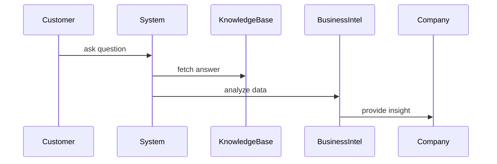

                 

### 引言

在快速变化的科技时代，每个人的梦想和愿景都变得尤为重要。对于IT领域的人来说，这些愿景往往与技术创新、项目成功和个人成长紧密相连。然而，从愿景到行动的转化并非易事。如何构建清晰的愿景与目标，如何制定切实可行的行动计划，以及如何在面对挑战和障碍时保持动力和激情，这些都是实现梦想过程中需要深入思考的问题。

本文将分五个部分，详细探讨如何从愿景到行动，最终实现个人和职业上的成功。我们将首先明确什么是愿景与目标，然后深入分析如何识别和制定这些目标。接下来，我们将讨论如何通过行动计划的制定和执行，将目标逐步实现。此外，个人成长与持续进步的重要性也不可忽视，我们将在第三部分中探讨这一主题。第四部分将聚焦于应对挑战与克服障碍的策略，并分享成功案例的启示。最后，我们将总结全文，并提供实用的工具与方法指南，帮助读者在实现梦想的道路上更进一步。

通过一步一步的逻辑分析和专业指导，本文旨在为读者提供一个全面的路径规划，帮助他们在实现梦想的道路上少走弯路，更快地达到目标。让我们一起思考，一起行动，迈向成功。

### 关键词

- 愿景
- 目标
- 行动计划
- 个人成长
- 成功案例
- 挑战应对

### 摘要

本文旨在为IT领域的专业人士提供一套从愿景到行动的路径规划，帮助他们实现个人和职业上的成功。通过深入探讨愿景与目标的概念、特征和识别方法，我们明确了制定行动计划的构建原则和执行策略。在个人成长与持续进步方面，本文提出了提升个人能力和保持动力激情的方法。此外，通过识别并应对挑战、分享成功案例，我们为读者提供了克服障碍和获取启示的有效途径。本文的最终目标是帮助读者在实现梦想的道路上，少走弯路，更快地达到目标。

## 第一部分：构建愿景与目标

### 第1章：什么是愿景与目标

在探讨如何从愿景到行动实现梦想之前，首先需要明确什么是愿景与目标。愿景，可以被视为一个人或组织长远的理想和期望，它为未来的发展指明了方向。而目标，则是实现愿景过程中需要达成的具体结果，是愿景的具体化与量化。

### 1.1 愿景的定义

愿景是一个抽象的概念，它描述了一个理想状态的图景，是对未来的一种憧憬。例如，一个企业的愿景可能是“成为全球领先的科技公司”，而个人的愿景可能是“在科技领域实现突破性创新”。

#### 1.1.1 愿景的内涵

愿景不仅仅是关于未来的梦想，它还包含以下内涵：

1. **远见性**：愿景通常需要超越当前的视野，预见未来可能出现的变化和机会。
2. **挑战性**：一个有价值的愿景往往具有一定的挑战性，它激励人们去超越现状，追求卓越。
3. **指导性**：愿景为组织或个人的发展提供了方向和指引，是决策和行动的依据。

#### 1.1.2 愿景的特点

愿景具有以下几个显著特点：

1. **抽象性**：愿景往往是一种抽象的表达，不是具体的行动方案，而是激励人们追求的一种状态。
2. **激励性**：愿景能够激发人们的激情和动力，使其愿意为之付出努力。
3. **长期性**：愿景通常指向长期目标，而非短期的利益。

#### 1.1.3 愿景的重要性

愿景的重要性体现在以下几个方面：

1. **提供方向**：愿景为组织或个人的发展提供了明确的方向，减少了在不确定环境下的盲目行动。
2. **激发动力**：一个清晰的愿景能够激发人们的内在动力，使其为实现目标而努力。
3. **凝聚团队**：愿景能够凝聚团队，使每个人都朝着共同的目标前进，增强组织的凝聚力。

### 1.2 目标的概念

与愿景相对应的是目标，它是愿景的具体化和量化，是实现愿景过程中需要达成的具体结果。

#### 1.2.1 目标的内涵

目标是一种具体、可衡量的结果，它描述了在未来某个时间点需要实现的状态。例如，一个企业的目标可能是“在未来三年内实现收入翻倍”，而个人的目标可能是“在两年内获得某个专业认证”。

#### 1.2.2 目标与愿景的关系

目标和愿景之间存在密切的关系：

1. **愿景引导目标**：愿景为目标的设定提供了方向和指导，目标应与愿景保持一致。
2. **目标实现愿景**：通过实现一个个目标，愿景才能逐步变为现实。

#### 1.2.3 目标的特点

目标具有以下几个显著特点：

1. **具体性**：目标需要是具体、明确的，便于衡量和评估。
2. **可度量性**：目标应具有可度量的指标，以便于跟踪进度和评估效果。
3. **时间性**：目标需要设定一个明确的时间期限，以便于计划和管理。

#### 1.2.4 目标的重要性

目标的重要性体现在以下几个方面：

1. **明确方向**：目标为行动提供了具体的方向，使人们知道应该做什么。
2. **激励行动**：明确的、具有挑战性的目标能够激发人们的行动力，使其为实现目标而努力。
3. **评估效果**：目标为评估工作成效提供了依据，有助于及时发现和纠正偏差。

通过以上对愿景和目标的深入探讨，我们能够更好地理解它们的概念、特征和关系。在接下来的章节中，我们将继续探讨如何识别和制定自己的愿景与目标，为实现梦想奠定坚实的基础。

### 第2章：如何识别自己的愿景与目标

要实现从愿景到行动的转化，识别并明确自己的愿景与目标是至关重要的一步。这一过程需要自我反思、自我探索和深思熟虑。以下是一些具体的方法和步骤，帮助读者识别并明确自己的愿景与目标。

#### 2.1 自我反思

自我反思是识别愿景与目标的第一步，它有助于深入了解自己的内心世界，找到真正的动机和愿望。

##### 2.1.1 了解自己的兴趣和价值观

了解自己的兴趣和价值观是自我反思的重要部分。以下是一些具体的方法：

1. **回顾过去的经历**：回顾自己在过去的一些重要经历，思考哪些经历让自己感到最满足和有成就感。这些经历通常与自己真正的兴趣和价值观相关。
2. **列出兴趣清单**：将自己的兴趣列出来，并思考这些兴趣背后的价值观。例如，如果一个人对编程很感兴趣，那么这可能是他追求技术创新和价值实现的价值观体现。
3. **探索自己的激情所在**：找到自己真正激情所在，这对于确定愿景和目标至关重要。激情所在通常与个人的核心价值观和兴趣密切相关。

##### 2.1.2 识别自己的优势和不足

识别自己的优势和不足是制定愿景与目标的重要基础。以下是一些具体的方法：

1. **技能和知识**：思考自己在哪些领域有专长，哪些知识储备丰富。这些技能和知识可以为制定愿景和目标提供支持。
2. **性格特点**：了解自己的性格特点，如内向或外向、理性或感性等。这些特点可以帮助自己更好地理解自己的行为模式，从而更好地制定目标。
3. **生活经验**：总结自己在工作和生活中的经验，识别自己在哪些方面做得好，哪些方面需要改进。这些经验可以为制定愿景和目标提供实际依据。

##### 2.1.3 自我探索的方法

自我探索是识别愿景与目标的关键步骤，以下是一些具体的方法：

1. **日记记录**：每天记录自己的想法、感受和经历，通过日记的方式，逐步了解自己的内心世界。
2. **心理测试**：通过一些专业的心理测试，如MBTI、DISC等，了解自己的性格特点和潜在的优势与不足。
3. **与朋友和同事交流**：与信任的朋友和同事交流，听取他们对你的看法和建议，这有助于更全面地了解自己。

#### 2.2 愿景的挖掘

挖掘愿景是识别愿景与目标的第二步，它有助于找到自己真正追求的理想状态。

##### 2.2.1 愿景的来源

愿景的来源可以是多方面的，以下是一些常见的来源：

1. **个人兴趣和爱好**：个人的兴趣和爱好往往能够激发出强烈的愿景。例如，一个人对编程和人工智能的浓厚兴趣可能激发出希望在这一领域实现突破的愿景。
2. **职业目标**：职业上的目标也是愿景的重要来源。例如，一个技术人员的职业目标是成为技术领域的领导者，这可以激发他追求这一愿景。
3. **社会趋势和机会**：社会的发展趋势和新兴的机会也可以成为愿景的来源。例如，随着大数据和人工智能的兴起，一些人可能希望在这一领域有所作为。

##### 2.2.2 如何找到自己的激情所在

找到自己的激情所在是挖掘愿景的关键步骤，以下是一些具体的方法：

1. **尝试新事物**：通过不断尝试新事物，可以发现自己的激情所在。例如，参加一些工作坊、研讨会或培训课程，了解不同领域的知识和技能。
2. **设定短期目标**：通过设定短期目标，可以逐步了解自己在不同领域的能力和兴趣。例如，设定一个学习新编程语言的目标，通过实现这一目标，可以更好地了解自己对该语言和技术的兴趣。
3. **听取内心的声音**：在日常生活中，时刻倾听自己内心的声音，思考自己真正想要的是什么。内心的声音往往能够指引自己找到真正的激情所在。

##### 2.2.3 愿景的提炼和表述

提炼和表述愿景是识别愿景与目标的最后一步，以下是一些具体的方法：

1. **简明扼要**：愿景应该简明扼要，便于记忆和传达。例如，一个IT从业者的愿景可以是“成为人工智能领域的顶尖专家”。
2. **具体明确**：愿景需要具体明确，便于制定具体的目标和行动计划。例如，一个企业的愿景可以是“在未来五年内，成为全球领先的云计算服务提供商”。
3. **情感共鸣**：愿景应与个人的价值观和情感共鸣，使其能够真正激发内心的动力。例如，一个IT从业者的愿景可以是“通过技术创新，为社会带来更多便利和福祉”。

通过以上步骤，读者可以更好地识别和明确自己的愿景与目标，为从愿景到行动的实现奠定坚实的基础。

### 第3章：愿景与目标的特征

在明确了愿景与目标的概念之后，我们需要深入探讨它们的特征，以便更好地理解和制定这些目标。愿景与目标具有一些关键特征，这些特征决定了它们在实现过程中的作用和意义。

#### 3.1 愿景的特征

愿景是一个抽象的概念，它为未来的发展提供了方向和激励。以下是一些愿景的主要特征：

##### 3.1.1 远见性

愿景具有远见性，它能够超越当前的视野，预见未来可能出现的变化和机会。远见性使得愿景能够为组织或个人在快速变化的科技环境中提供持续的动力和支持。

##### 3.1.2 挑战性

一个有价值的愿景通常具有一定的挑战性，它激励人们去超越现状，追求卓越。挑战性使得愿景具有激励作用，能够激发人们的激情和动力，促使他们为实现愿景而努力奋斗。

##### 3.1.3 可行性

虽然愿景是抽象的，但它仍然需要具有可行性。一个不切实际的愿景是无法实现的，因此，愿景需要具备实现的可能性。可行性使得愿景能够转化为具体的目标和行动计划，从而逐步实现。

##### 3.1.4 激励性

愿景具有激励性，它能够激发人们的激情和动力，使其愿意为之付出努力。激励性是愿景的重要特征，它为组织或个人提供了持续前进的动力，使他们在实现愿景的过程中保持积极的心态。

#### 3.2 目标的特征

目标是将愿景具体化和量化的具体结果，是实现愿景过程中需要达成的具体任务。以下是一些目标的主要特征：

##### 3.2.1 具体性

目标需要是具体、明确的，便于衡量和评估。具体性使得目标能够在实现过程中提供具体的指导，使人们知道应该做什么和怎么做。

##### 3.2.2 可度量性

目标应具有可度量的指标，以便于跟踪进度和评估效果。可度量性使得目标能够通过量化的方式来衡量，从而确保目标的实现。

##### 3.2.3 时间性

目标需要设定一个明确的时间期限，以便于计划和管理。时间性使得目标具有明确的期限，促使人们尽快采取行动，确保目标的按时完成。

##### 3.2.4 可实现性

目标需要是可实现的，即在现有资源和条件下可以实现。可实现性使得目标既具有挑战性，又不至于过于理想化，从而确保目标的实现。

##### 3.2.5 激励性

目标也需要具有激励性，能够激发人们的动力和积极性。激励性使得目标在实现过程中能够保持人们的热情和动力，确保目标的顺利实现。

#### 3.3 愿景与目标的关系

愿景与目标之间存在密切的关系，它们相互依存，共同作用。

##### 3.3.1 愿景引导目标

愿景为目标的设定提供了方向和指导。目标应与愿景保持一致，以确保组织或个人在实现目标的过程中不会偏离愿景。

##### 3.3.2 目标实现愿景

目标是实现愿景的具体化和量化。通过实现一个个目标，愿景才能逐步变为现实。目标的实现为愿景的实现提供了坚实的基础。

##### 3.3.3 愿景与目标的互补性

愿景与目标具有互补性，愿景提供了远见和激励，而目标提供了具体和可实现性。二者的结合使得组织或个人在实现梦想的道路上更加清晰和坚定。

通过深入理解愿景与目标的特征，我们可以更好地制定和实现这些目标，从而实现从愿景到行动的转化，最终实现个人和职业上的成功。

### 第4章：明确愿景与目标的重要性

明确愿景与目标的重要性在于，它们不仅为个人和组织的未来发展提供了方向，还能激励人们为实现这些目标而努力奋斗。以下将从个人成长、企业发展和持续创新三个方面，探讨明确愿景与目标的重要性。

#### 4.1 愿景与目标对个人成长的意义

对个人而言，明确的愿景与目标具有以下几个重要意义：

##### 4.1.1 提供方向和动力

明确的愿景与目标为个人提供了清晰的方向，使个人在纷繁复杂的环境中保持目标和动力。例如，一个IT专业人士若明确自己的愿景是成为人工智能领域的专家，他将更有动力去学习和实践相关的技能，不断追求卓越。

##### 4.1.2 促进自我实现

愿景与目标有助于个人实现自我价值。通过设定和实现目标，个人能够不断提升自己的能力和素质，实现个人成长和自我价值的实现。例如，一个创业者通过实现自己的商业目标，不仅实现了财务自由，还实现了自己的创业梦想。

##### 4.1.3 增强自信和满足感

明确愿景与目标使个人在面对挑战和困难时更加自信。通过一步步实现目标，个人能够积累成功的经验，增强自信心。同时，目标的实现也会带来满足感，使个人感到成就和自豪。

#### 4.2 愿景与目标对企业发展的意义

对企业而言，明确的愿景与目标同样具有重要意义：

##### 4.2.1 明确企业使命

愿景为企业提供了明确的使命和方向，使企业在快速变化的市场环境中保持稳定和持续发展。例如，谷歌的愿景是“整合全球信息，让人人皆可访问并从中受益”，这一愿景为谷歌的发展提供了强大的动力和方向。

##### 4.2.2 提高执行力

明确的目标有助于企业提高执行力，确保各项战略和计划的顺利实施。例如，一个企业若明确自己的目标是三年内实现收入翻倍，企业将更有针对性地制定相关战略和行动计划，提高执行力。

##### 4.2.3 促进持续创新

愿景与目标能够激发企业的创新活力，推动企业在技术和产品上的持续创新。例如，苹果公司的愿景是“让世界上最先进的技术惠及每个人”，这一愿景促使苹果公司在产品设计和技术创新上不断突破，持续引领行业潮流。

#### 4.3 愿景与目标对持续创新的意义

对于持续创新，明确的愿景与目标具有以下几个重要意义：

##### 4.3.1 指导创新方向

明确的愿景与目标为创新提供了方向和指引，使企业能够集中资源和精力，有针对性地开展创新活动。例如，一家生物技术公司若明确自己的愿景是研发治愈癌症的新药，企业将把主要资源投入到癌症治疗领域的研究和开发。

##### 4.3.2 激发创新动力

愿景与目标能够激发企业的创新动力，促使企业在技术创新和产品开发上不断突破。例如，一个企业的目标是成为行业领导者，这将激励企业在技术研究和产品创新方面投入更多的资源和精力。

##### 4.3.3 确保创新可持续性

明确的愿景与目标有助于确保创新的可持续性，使企业能够在长期发展中保持创新活力。例如，一个企业若将技术创新作为其核心战略，企业将不断调整和创新，确保在技术快速发展的环境中保持竞争力。

总之，明确愿景与目标对于个人成长、企业发展和持续创新具有重要意义。通过设定和实现这些目标，个人和企业能够更好地应对挑战，抓住机遇，实现长期发展。因此，每个人都应该认真思考和制定自己的愿景与目标，为实现这些目标而努力奋斗。

### 第5章：行动计划的构建原则

在明确了愿景与目标后，制定并执行一个合理的行动计划是实现这些目标的关键步骤。一个有效的行动计划不仅能够帮助组织或个人明确任务和责任，还能确保资源的合理分配和时间的管理。以下是构建行动计划的几个核心原则。

#### 5.1 目标导向

目标导向是构建行动计划的首要原则。一个明确的行动计划应该始终以目标为导向，确保每一步行动都是为了实现最终的目标。

##### 5.1.1 以愿景和目标为指引

在制定行动计划时，首先要明确愿景和目标，并将其作为行动计划的指引。例如，如果愿景是成为人工智能领域的专家，那么行动计划中的每一步都应该有助于提升相关技能和知识，从而逐步实现这一目标。

##### 5.1.2 确保计划的针对性

行动计划需要具有针对性，确保每项任务都是为实现特定目标而设定的。例如，若目标是提升编程能力，那么行动计划中应该包括学习新的编程语言、参与编程项目、参加技术研讨会等具体活动。

##### 5.1.3 制定明确的行动计划

行动计划应具体、明确，便于执行和评估。例如，一个明确的行动计划可以包括具体的任务、责任人、截止日期和预期成果。这有助于确保每个人都清楚自己的任务和责任，从而提高执行力。

#### 5.2 可行性与可执行性

构建行动计划时，必须考虑其可行性和可执行性。这意味着计划应在现有资源和条件下可以实现，并且易于执行。

##### 5.2.1 评估资源与能力

在制定行动计划之前，需要对现有的资源和能力进行评估，确保计划在现有条件下可以实现。例如，如果计划需要大量资金支持，但企业当前财务状况不允许，那么这个计划就需要调整。

##### 5.2.2 避免过度理想化

行动计划应避免过度理想化，确保任务和目标在现实中具有可执行性。例如，一个目标可能是“在一个月内掌握五种新的编程语言”，这显然是不现实的，需要调整为更合理的时间框架。

##### 5.2.3 制定切实可行的步骤

行动计划中的步骤应切实可行，确保每一步都是可以实现的。例如，学习编程语言可以分解为：首先完成基础知识的学习，然后通过实际项目来应用所学知识，逐步提升技能水平。

#### 5.3 分阶段实现

分阶段实现是构建行动计划的重要原则，它有助于将复杂的目标分解为可管理的小任务，使整个计划更加可控和可执行。

##### 5.3.1 大目标与小目标的划分

将大目标分解为一系列小目标，有助于明确每一步的具体任务和责任。例如，一个长期目标是“在三年内实现公司收入翻倍”，可以分解为每年的小目标，如“第一年实现10%的收入增长，第二年实现15%的收入增长，第三年实现20%的收入增长”。

##### 5.3.2 里程碑的设定

设定里程碑有助于在实现目标的过程中进行评估和调整。里程碑是计划中的重要节点，标志着阶段性目标的实现。例如，一个学习编程的目标可以在每个模块学习结束后设置一个里程碑，以评估学习效果。

##### 5.3.3 确保连续性和衔接性

在分阶段实现的过程中，确保每个阶段的任务和目标之间具有连续性和衔接性，避免出现断层或重复。例如，在完成基础知识学习后，应立即进入实际项目应用，以确保知识能够得到有效的应用和提升。

通过以上原则，我们可以构建出一个合理、可行且有效的行动计划，确保愿景与目标的实现。在接下来的章节中，我们将进一步探讨如何将目标分解为具体的行动计划，并如何执行和调整这些计划。

### 第6章：分解目标，制定可操作性的计划

在明确了愿景和目标后，我们需要将这些目标分解为具体的、可操作性的计划。这一步骤至关重要，因为只有具体、明确的计划才能确保目标的实现。以下是分解目标和制定可操作性计划的方法和步骤。

#### 6.1 目标分解

目标分解是将一个大目标分解为若干个小目标的过程。通过分解目标，我们可以将复杂的目标转化为一系列可管理的小任务，从而更容易实现。

##### 6.1.1 大目标与小目标的划分

首先，我们需要将大目标分解为小目标。小目标应具体、明确，便于衡量和评估。例如，如果大目标是“在三年内成为人工智能领域的专家”，我们可以将其分解为：

- 第一年的小目标：掌握人工智能基础知识，参与相关项目实践。
- 第二年的小目标：深入研究特定的人工智能技术，如机器学习或深度学习。
- 第三年的小目标：在人工智能领域发表一篇高质量的论文或参与重要的行业项目。

通过将大目标分解为小目标，我们能够更好地管理和跟踪进度，确保每个小目标都能按时完成。

##### 6.1.2 目标分解的方法

目标分解可以采用以下方法：

1. **时间分解法**：将大目标分解为不同时间段的目标，如年度目标、季度目标、月度目标等。
2. **阶段分解法**：将大目标分解为不同的阶段，如学习阶段、实践阶段、研究阶段等。
3. **任务分解法**：将大目标分解为具体的任务，如学习任务、实践任务、研究任务等。

##### 6.1.3 分解目标的注意事项

在分解目标时，需要注意以下几点：

1. **具体明确**：确保每个小目标都是具体、明确的，便于衡量和评估。
2. **相互独立**：小目标之间应相互独立，避免交叉或重复。
3. **具有挑战性**：小目标应具有适当的挑战性，以激发动力，但也应确保在现有资源和条件下可实现。

#### 6.2 行动计划的制定

在将目标分解为小目标后，我们需要制定具体的行动计划，以确保每个小目标都能按时完成。以下是制定行动计划的方法和步骤：

##### 6.2.1 行动计划的框架

一个有效的行动计划通常包括以下要素：

1. **目标**：明确每个小目标，如“掌握人工智能基础知识”。
2. **责任人**：明确每个任务的负责人，如“张三负责学习人工智能基础知识”。
3. **时间表**：设定每个小目标的完成时间，如“在六个月内完成基础知识学习”。
4. **里程碑**：设定重要的时间节点，如“每月进行一次学习效果评估”。
5. **资源**：明确实现每个小目标所需的资源，如“需要获取相关学习资料和工具”。
6. **评估标准**：设定衡量每个小目标完成情况的评估标准，如“掌握基础知识所需的技能点数量”。

##### 6.2.2 里程碑的设定

里程碑是行动计划中的重要节点，它有助于在实现目标的过程中进行评估和调整。以下是设定里程碑的方法：

1. **阶段里程碑**：根据目标分解的不同阶段设定里程碑，如学习阶段的结束、实践阶段的开始等。
2. **时间里程碑**：根据时间表设定里程碑，如每三个月进行一次阶段性评估。
3. **成果里程碑**：根据预期成果设定里程碑，如完成一项重要的研究项目。

##### 6.2.3 行动计划的执行与监督

制定行动计划后，需要确保其执行和监督。以下是执行和监督的方法：

1. **定期回顾**：定期回顾行动计划，检查进度和效果，确保每个小目标都能按时完成。
2. **沟通与协作**：保持团队内部沟通，确保每个人都能了解自己的任务和责任，并协同完成。
3. **调整与优化**：根据实际情况调整行动计划，确保计划的可执行性。

通过以上方法和步骤，我们可以将目标分解为具体的、可操作性的计划，并确保这些计划的执行和监督，从而实现从愿景到行动的转化，最终实现目标。

### 第7章：行动计划的执行与调整

在制定了一个详细的行动计划后，下一步就是将其付诸实践。执行行动计划是确保目标实现的关键步骤，而在执行过程中，我们还需根据实际情况进行必要的调整。以下是如何有效地执行行动计划以及应对过程中可能出现的问题和挑战。

#### 7.1 行动计划的执行

##### 7.1.1 确定优先级

在执行行动计划时，首先要确定任务的优先级。这有助于我们集中精力完成最重要的任务，确保关键目标能够按时达成。以下是一些建议：

1. **关键任务优先**：将关键任务置于优先位置，如那些对实现目标至关重要的任务。
2. **紧急任务优先**：对于紧急任务，如那些需要立即处理的任务，也应优先考虑。
3. **资源限制**：在资源有限的情况下，根据任务的重要性和紧急程度来分配资源。

##### 7.1.2 分配资源

确保有足够的资源来支持行动计划的执行是至关重要的。这包括时间、人力、资金和技术资源等。以下是资源分配的一些建议：

1. **合理规划时间**：为每个任务分配足够的时间，避免因时间不足而导致的拖延或质量下降。
2. **团队协作**：确保团队成员明确自己的任务和责任，并鼓励他们相互协作，共同完成任务。
3. **资金预算**：为行动计划设定合理的预算，确保在资金上有所保障。

##### 7.1.3 保持持续行动

持续行动是实现目标的关键。以下是一些保持持续行动的策略：

1. **定期回顾**：定期回顾行动计划和进度，确保任务在按计划进行。
2. **自我激励**：设定奖励机制，鼓励自己在完成任务后给予自己奖励，增强动力。
3. **保持灵活性**：在面对变化时，保持灵活性，能够迅速调整计划以适应新的情况。

#### 7.2 行动计划的调整

尽管我们在制定行动计划时已经考虑到了各种可能的情况，但在实际执行过程中，仍可能会遇到各种问题和挑战，这需要我们灵活调整计划。

##### 7.2.1 面对变化的心态

面对变化，首先需要保持积极的心态。以下是一些建议：

1. **接受变化**：接受变化是不可避免的，并认识到变化是发展的机会。
2. **适应变化**：学会适应变化，寻找适应变化的方法和策略。
3. **保持乐观**：保持乐观的态度，相信自己能够应对变化，找到解决问题的方法。

##### 7.2.2 调整计划的策略

当计划需要调整时，以下是一些建议：

1. **重新评估目标**：如果变化显著影响了目标的实现，重新评估目标，确定新的目标。
2. **重新分配资源**：根据实际情况重新分配资源，确保资源能够更好地支持计划的执行。
3. **调整时间表**：如果任务的时间表受到干扰，重新安排时间表，确保任务能够按时完成。

##### 7.2.3 避免计划过度调整

虽然调整计划是必要的，但过度调整可能导致计划的混乱和效率降低。以下是一些建议：

1. **确定调整的必要性和频率**：只在必要时进行调整，避免频繁调整。
2. **评估调整的影响**：在调整计划前，评估调整对整个计划的影响，确保调整是有益的。
3. **保持计划的稳定性**：在执行计划时，保持计划的稳定性，避免因频繁调整而导致混乱。

通过以上策略，我们可以在执行行动计划的过程中，灵活应对各种变化和挑战，确保目标的实现。

### 第8章：提升个人能力的路径

在实现愿景和目标的过程中，提升个人能力是至关重要的一步。这不仅能够帮助我们更好地应对工作中的挑战，还能提升我们在职业发展中的竞争力。以下是一些具体的路径和方法，帮助我们在技术、管理和软技能等方面实现全方位的成长。

#### 8.1 学习与成长

##### 8.1.1 持续学习的动力

持续学习是提升个人能力的基础。以下是一些方法，可以帮助我们保持学习的动力：

1. **设定学习目标**：明确自己需要学习的技能和知识，设定具体的学习目标。
2. **制定学习计划**：为每个学习目标制定详细的计划，包括学习时间、学习内容和评估方法。
3. **定期评估**：定期评估学习进度和成果，调整学习计划，确保学习目标能够实现。

##### 8.1.2 学习方法与技巧

有效的学习方法能够提高学习效率。以下是一些常用的学习方法：

1. **主动学习**：主动参与学习过程，通过提问、讨论和实验来加深理解。
2. **分散学习**：将学习时间分散在不同的时间段，避免长时间集中学习导致的疲劳。
3. **多样化学习**：通过阅读书籍、参加课程、观看视频等多种方式来学习，提高学习的趣味性和效果。

##### 8.1.3 个人成长路径的设计

设计个人成长路径是提升个人能力的重要步骤。以下是一些设计成长路径的方法：

1. **自我评估**：定期进行自我评估，了解自己的优势和不足，确定需要提升的领域。
2. **职业规划**：结合自己的职业目标，制定长期和短期的成长计划。
3. **求助导师**：寻找导师或行业专家，获取指导和建议，加速成长。

#### 8.2 拓展技能

##### 8.2.1 技能的重要性

技能是我们在工作中表现和竞争力的关键因素。以下是一些拓展技能的方法：

1. **掌握核心技术**：选择一门核心技术，深入学习并掌握，为后续技能拓展打下坚实基础。
2. **多学科融合**：在掌握核心技术的基础上，尝试学习相关领域的知识，实现多学科融合。
3. **实践经验**：通过实际项目或实验来应用所学知识，提升实践能力。

##### 8.2.2 技能拓展的方法

以下是一些拓展技能的方法：

1. **在线课程**：参加在线课程，学习最新的技术知识和行业动态。
2. **实践项目**：参与实际项目，将所学知识应用于实际问题中。
3. **研讨会和会议**：参加研讨会和会议，与行业专家交流，了解前沿技术和趋势。

##### 8.2.3 技能融合与创新

将所学技能进行融合，可以创造出新的解决方案。以下是一些融合与创新的方法：

1. **跨领域合作**：与不同领域的专家合作，将各自领域的知识进行融合。
2. **头脑风暴**：定期组织头脑风暴会议，激发创意和灵感。
3. **尝试新方法**：勇于尝试新的技术和方法，不断创新和突破。

#### 8.3 软技能提升

##### 8.3.1 软技能的重要性

软技能是我们在团队协作、沟通和管理中不可或缺的能力。以下是一些提升软技能的方法：

1. **沟通技巧**：学习有效的沟通技巧，提高表达和理解能力。
2. **领导力**：提升领导力，学会如何带领团队完成任务。
3. **团队协作**：培养团队合作精神，学会与他人协作，共同达成目标。

##### 8.3.2 软技能提升的方法

以下是一些提升软技能的方法：

1. **参加培训课程**：参加专门的软技能培训课程，学习沟通技巧、团队协作和领导力等方面的知识。
2. **实践应用**：在日常工作中应用所学软技能，通过实践不断提升。
3. **反思与总结**：定期反思和总结自己的工作，发现不足，并制定改进计划。

通过以上路径和方法，我们可以不断提升个人能力，为实现愿景和目标打下坚实的基础。

### 第9章：如何保持动力与激情

在实现愿景和目标的过程中，保持动力与激情至关重要。然而，随着时间和任务的积累，人们往往会感到疲惫和动力不足。因此，如何找到并保持内在动力和外在激情，成为实现梦想的关键。以下是一些具体的方法和策略，帮助我们在面对挑战和压力时，保持动力与激情。

#### 9.1 动力的来源

动力可以分为内在动力和外在动力，了解这两种动力的来源，可以帮助我们更好地保持动力。

##### 9.1.1 内在动机

内在动机是指个体由于自身兴趣、价值观和内在欲望而进行的活动。以下是一些激发内在动机的方法：

1. **找到兴趣和热情**：明确自己真正感兴趣的事物，并将其作为动力源泉。例如，如果一个人对编程充满热情，那么在编程项目中他会感到充满动力。
2. **设定有挑战性的目标**：设定具有挑战性的目标，能够激发我们的内在动机。挑战性目标能让我们感到兴奋和充满动力，追求卓越。
3. **自我实现**：通过实现目标，感受到自我价值的提升，这种成就感能够激发内在动力。

##### 9.1.2 外在动机

外在动机是指个体因外部奖励、认可或压力而进行的活动。以下是一些激发外在动机的方法：

1. **设定奖励机制**：为自己设定奖励机制，例如完成一个项目后，给自己一个小奖励，如看电影或购买心仪的物品。
2. **获取他人认可**：他人的认可和鼓励能够激发外在动机。通过分享进展、成果和经验，获取同事、家人和朋友的认可和支持。
3. **遵守承诺**：为自己设定承诺，并在公众面前宣布，以增强外在动机。例如，在社交媒体上公开自己的学习计划，并定期更新进度。

#### 9.2 找回工作与生活的激情

在工作与生活中，保持激情并不总是容易的，但以下方法可以帮助我们找回和保持激情：

##### 9.2.1 调整心态

1. **积极心态**：保持积极的心态，看待挑战和问题，将其视为成长和进步的机会。
2. **设定目标**：设定短期和长期目标，使自己在工作中感到有方向和意义。
3. **学会放松**：适当安排休息时间，进行放松和充电，保持身心健康。

##### 9.2.2 寻找灵感

1. **阅读与学习**：通过阅读相关书籍、文章和行业报告，了解行业动态和前沿技术，激发灵感。
2. **交流与分享**：与同事、朋友和行业专家交流，分享自己的想法和经验，获取新的视角和建议。
3. **参加活动**：参加技术会议、研讨会和培训课程，与同行交流，拓展视野，激发灵感。

##### 9.2.3 创造工作与生活的平衡

1. **合理安排时间**：合理规划工作和生活时间，确保工作与生活之间的平衡。
2. **培养兴趣爱好**：在工作之外，培养一些兴趣爱好，如运动、音乐、艺术等，丰富自己的生活。
3. **关注身心健康**：保持良好的生活习惯，定期锻炼，保证充足的睡眠，关注身心健康。

通过以上方法和策略，我们可以找到并保持内在动力和外在激情，在实现愿景和目标的道路上，充满动力和激情地前行。

### 第10章：自我反思与持续改进

在实现愿景和目标的过程中，自我反思和持续改进是确保成功的关键环节。通过定期反思自己的行为、成就和不足，我们可以及时调整策略，不断提升自我，从而在实现目标的过程中更加高效和有成效。

#### 10.1 自我反思的重要性

自我反思是一个自我审视的过程，它能够帮助我们：

1. **识别问题**：通过反思，我们可以识别自己在实现目标过程中遇到的问题和障碍，从而采取针对性的措施加以解决。
2. **发现不足**：自我反思能够帮助我们发现自己知识和技能的不足，促使我们不断学习和提升。
3. **优化策略**：通过反思，我们可以审视自己的策略和方法，找出不足之处，优化改进，提高效率。

#### 10.2 自我反思的方法

以下是几种有效的自我反思方法：

##### 10.2.1 写日记

写日记是一种简单而有效的自我反思方法。通过记录每天的工作、学习经历和感受，我们可以清晰地看到自己的进步和不足。以下是一些写日记的建议：

1. **定期记录**：每天或每周定期记录自己的工作、学习情况和感受。
2. **具体描述**：详细描述自己的行为、成就和不足，以便更好地分析原因。
3. **持续更新**：持续更新日记，不断回顾过去的记录，总结经验教训。

##### 10.2.2 建立反馈机制

建立反馈机制是自我反思的重要环节。以下是一些建议：

1. **定期反馈**：定期与同事、导师或家人交流，获取他们的反馈和建议。
2. **积极倾听**：在反馈过程中，积极倾听他人的意见，虚心接受建议。
3. **反思与调整**：根据反馈，反思自己的行为和策略，进行必要的调整。

##### 10.2.3 定期回顾

定期回顾是实现目标过程中的重要步骤。以下是一些建议：

1. **设立里程碑**：在实现目标的过程中，设立关键里程碑，并在每个里程碑处进行回顾。
2. **总结经验**：回顾过程中，总结成功和失败的经验，分析原因，找出改进点。
3. **制定改进计划**：根据回顾结果，制定具体的改进计划，确保在下一个阶段能够取得更好的成绩。

#### 10.3 持续改进的策略

持续改进是一个不断优化和提升自我的过程。以下是一些策略：

##### 10.3.1 设定短期和长期目标

1. **短期目标**：设定具体的短期目标，如每周完成一个项目、每月掌握一项新技能等。
2. **长期目标**：设定长期目标，如一年内晋升职位、五年内成为行业专家等。

##### 10.3.2 采用PDCA循环

PDCA（计划、执行、检查、行动）循环是一种有效的持续改进方法。以下是如何应用PDCA循环：

1. **计划（Plan）**：制定具体的工作计划，包括目标、步骤和资源。
2. **执行（Do）**：执行计划，确保每一步都能按计划进行。
3. **检查（Check）**：检查执行结果，评估目标和计划的达成情况。
4. **行动（Act）**：根据检查结果，进行必要的调整和改进。

##### 10.3.3 学习与分享

1. **学习**：不断学习新的知识和技能，提升自己的专业能力。
2. **分享**：通过分享自己的经验和成果，与他人交流，获取新的见解和建议，实现共同进步。

通过自我反思和持续改进，我们能够更好地实现自己的愿景和目标，不断提升自我，迎接更大的挑战。

### 第11章：识别并应对挑战

在实现愿景和目标的过程中，我们不可避免地会遇到各种挑战。这些挑战可能来自外部环境的变化，也可能源于内部资源的不足，或者是对未知领域的探索。识别并有效地应对这些挑战，是成功实现目标的重要环节。以下是一些识别和应对挑战的方法和策略。

#### 11.1 挑战的识别

首先，我们需要能够准确地识别挑战。以下是一些识别挑战的方法：

##### 11.1.1 观察和分析

1. **日常观察**：在日常工作和生活中，留心观察可能出现的问题和困难。
2. **数据分析**：通过数据分析和趋势预测，发现潜在的问题和风险。
3. **专家咨询**：向行业专家或经验丰富的同事咨询，获取他们的见解和建议。

##### 11.1.2 反思和总结

1. **回顾历史**：回顾过去遇到的问题和挑战，分析其原因和应对措施。
2. **团队讨论**：组织团队讨论，共同识别和分析可能面临的挑战。
3. **心理测试**：通过心理测试，了解自己的潜在问题和应对能力。

#### 11.2 挑战的分类

识别出挑战后，我们需要对挑战进行分类，以便采取不同的应对策略。以下是一些常见的挑战分类：

##### 11.2.1 技术挑战

1. **新技术应用**：在引入新技术时可能遇到的技术难题和兼容性问题。
2. **技术升级**：随着技术的发展，现有系统需要升级或改造，可能面临的技术挑战。

##### 11.2.2 资源挑战

1. **人力资源**：人员不足或人才短缺，可能影响项目的进展。
2. **财务资源**：项目预算不足，可能限制项目的实施。

##### 11.2.3 外部环境挑战

1. **市场竞争**：市场环境的快速变化，可能带来新的竞争对手或市场需求变化。
2. **法规政策**：政策法规的变化，可能对项目带来新的合规要求或限制。

#### 11.3 应对策略

针对不同类型的挑战，我们需要采取不同的应对策略。以下是一些具体的应对策略：

##### 11.3.1 技术挑战

1. **技术预研**：在引入新技术前，进行充分的预研和评估，确保技术可行性。
2. **团队协作**：组建专业团队，分工合作，共同应对技术挑战。
3. **外部合作**：与外部技术合作伙伴合作，借助外部资源和技术支持。

##### 11.3.2 资源挑战

1. **资源调配**：合理调配内部资源，确保关键资源的优先保障。
2. **人员培训**：通过培训提高团队的能力，解决人员不足的问题。
3. **财务规划**：制定详细的财务规划，确保项目有足够的资金支持。

##### 11.3.3 外部环境挑战

1. **市场研究**：进行市场研究，了解市场动态和竞争对手情况，制定应对策略。
2. **政策合规**：密切关注政策法规变化，确保项目合规实施。
3. **灵活调整**：保持灵活性和适应性，根据外部环境变化，及时调整策略和计划。

通过以上识别和应对挑战的方法和策略，我们能够更好地准备和应对实现愿景和目标过程中可能遇到的挑战，从而确保目标的顺利实现。

### 第12章：克服障碍的策略

在实现愿景和目标的过程中，不可避免会遇到各种障碍。这些障碍可能来自技术、资源、外部环境等多个方面，如果不加以克服，将严重影响目标的实现。以下是一些具体的方法和策略，帮助我们在面对障碍时能够有效地应对和克服。

#### 12.1 技术障碍

##### 12.1.1 技术难题

技术难题通常是实现目标过程中最常见也最具挑战性的障碍之一。以下是一些克服技术障碍的策略：

1. **深入研究和学习**：对于新的技术或复杂的问题，需要进行深入的研究和学习，掌握相关的原理和技术。
2. **专家咨询**：在遇到难题时，可以寻求行业专家或技术顾问的帮助，他们可能会提供宝贵的见解和解决方案。
3. **团队合作**：组建一个技术团队，分工合作，共同解决难题。集体的智慧和力量往往能够更有效地克服技术障碍。

##### 12.1.2 技术更新

随着技术的发展，现有技术可能需要更新或替换。以下是一些克服技术更新障碍的策略：

1. **提前规划**：在引入新技术或进行技术更新时，提前进行详细的规划，包括技术评估、预算分配和资源调配。
2. **逐步实施**：如果技术更新涉及较大的改动，可以采取逐步实施的方法，分阶段进行，避免一次性投入过多资源和风险。
3. **培训和教育**：确保团队成员熟悉新技术的使用，通过培训和教育提高团队的技术水平，以便更好地应对技术更新带来的挑战。

#### 12.2 资源障碍

##### 12.2.1 人力资源

人力资源短缺是很多组织在实现目标过程中面临的主要障碍之一。以下是一些克服人力资源障碍的策略：

1. **人员调配**：在内部进行人员调配，确保关键岗位有足够的人手。如果必要，可以考虑临时雇佣或外包部分工作。
2. **培训和提升**：通过培训和提升现有员工的能力，解决人力资源短缺的问题。同时，制定人才发展计划，培养未来的关键人才。
3. **灵活用工**：在特定阶段，可以考虑采用灵活用工的方式，如兼职、远程办公等，以应对人力资源紧张的情况。

##### 12.2.2 财务资源

财务资源不足是另一个常见的障碍，以下是一些克服财务资源障碍的策略：

1. **预算优化**：通过优化预算，确保关键项目的资金支持。对预算进行详细分析和合理分配，确保每一分钱都花在刀刃上。
2. **融资途径**：探索各种融资途径，如股权融资、债务融资等，以获取更多的资金支持。
3. **成本控制**：通过降低成本和提升效率，提高财务资源的利用效率。例如，采用更高效的工具和流程，减少不必要的开支。

#### 12.3 外部环境障碍

##### 12.3.1 竞争压力

在市场竞争激烈的环境中，外部环境的变化可能会对目标的实现造成影响。以下是一些克服外部环境障碍的策略：

1. **市场研究**：进行详细的市场研究，了解竞争对手的动态和市场需求，制定相应的策略。
2. **差异化竞争**：通过产品差异化或服务创新，打造自己的核心竞争力，从而在竞争中脱颖而出。
3. **灵活调整**：根据外部环境的变化，灵活调整策略和计划，以适应市场的变化。

##### 12.3.2 法规政策

法规政策的变化可能会对项目的实施带来障碍。以下是一些克服法规政策障碍的策略：

1. **政策跟踪**：密切关注政策法规的变化，确保项目的实施符合最新的法规要求。
2. **合规审查**：在进行项目规划和实施前，进行全面的合规审查，确保项目设计和实施符合法规要求。
3. **政策游说**：在必要时，可以通过政策游说或行业协会等途径，争取更有利于项目的政策支持。

通过以上策略和方法，我们能够在面对各种障碍时，更好地识别和应对，确保目标的顺利实现。

### 第13章：如何保持积极的心态

在实现愿景和目标的过程中，保持积极的心态至关重要。积极的心态不仅能够帮助我们克服困难，还能增强我们的动力和耐力，使我们更有信心和决心去实现目标。以下是一些具体的方法和策略，帮助我们在面对挑战和压力时保持积极的心态。

#### 13.1 自我激励

自我激励是保持积极心态的重要手段。以下是一些自我激励的方法：

##### 13.1.1 设定小目标

通过设定小目标，我们可以将大目标分解为一系列可实现的任务。每完成一个小目标，就会带来一定的成就感和动力。以下是一些设定小目标的建议：

1. **具体明确**：小目标应该是具体和明确的，便于衡量和评估。
2. **逐步提升**：设定的小目标应逐渐提升难度，以保持挑战性和动力。
3. **庆祝成就**：在完成小目标后，为自己设定一个奖励，如休息一天、购买心仪的物品等，以增强成就感。

##### 13.1.2 制定计划

制定详细的行动计划可以帮助我们更好地应对挑战，减少不确定性带来的焦虑。以下是一些制定计划的建议：

1. **分阶段实施**：将大目标分解为多个阶段，为每个阶段制定详细的计划。
2. **定期回顾**：定期回顾计划执行情况，及时调整和优化。
3. **保持灵活性**：在制定计划时，保持一定的灵活性，以应对可能的变化和意外情况。

#### 13.2 情绪管理

情绪管理是保持积极心态的关键。以下是一些情绪管理的策略：

##### 13.2.1 认识自己的情绪

了解自己的情绪是情绪管理的第一步。以下是一些认识自己情绪的方法：

1. **情绪日记**：记录自己的情绪变化，了解情绪的起因和影响。
2. **自我观察**：通过自我观察，识别自己的情绪反应，学会控制情绪。
3. **情绪反馈**：向他人寻求情绪反馈，了解自己情绪对他人的影响。

##### 13.2.2 学会放松

放松技巧可以帮助我们缓解压力，保持平静和积极的心态。以下是一些放松技巧：

1. **深呼吸**：通过深呼吸，放松身体和心情。
2. **冥想**：通过冥想，培养专注力和情绪稳定性。
3. **运动**：适当的运动可以释放压力，提升心情。

#### 13.3 建立支持系统

建立支持系统是保持积极心态的重要一环。以下是一些建立支持系统的策略：

##### 13.3.1 寻求帮助

在遇到困难时，寻求他人的帮助是一种有效的策略。以下是一些寻求帮助的方法：

1. **同事和朋友**：向同事和朋友寻求建议和支持，分享自己的困惑和压力。
2. **专业咨询**：在需要时，寻求专业咨询，如心理咨询师或职业规划师等。
3. **建立网络**：建立广泛的社交网络，与他人建立联系，获取更多的资源和帮助。

##### 13.3.2 良好沟通

良好的沟通可以帮助我们建立支持系统，增强团队凝聚力。以下是一些沟通的建议：

1. **开放沟通**：与他人保持开放和诚实的沟通，分享自己的想法和感受。
2. **倾听他人**：倾听他人的意见和反馈，尊重和理解他人的立场。
3. **团队协作**：与团队成员建立良好的合作关系，共同面对挑战和解决问题。

通过以上方法和策略，我们可以在实现愿景和目标的过程中，保持积极的心态，增强自信心和动力，从而更好地应对挑战，实现目标。

### 第14章：成功案例介绍

在从愿景到行动实现梦想的道路上，许多人都取得了显著的成就。以下是一些成功案例，通过这些案例，我们可以看到实现梦想的具体路径和关键因素。

#### 14.1 案例一：李华的创业之路

李华是一名年轻的IT工程师，他的愿景是创建一个创新的科技公司，为人们提供高质量的互联网服务。以下是李华实现梦想的具体步骤：

1. **明确愿景**：李华在创业初期就明确了自己的愿景，即通过技术创新，改善人们的数字化生活。
2. **市场调研**：在确定愿景后，李华进行了详细的市场调研，了解市场需求和竞争态势。
3. **组建团队**：李华寻找了几位志同道合的合作伙伴，共同组建了创业团队。
4. **融资和资源**：通过天使投资和风险投资，李华获得了足够的资金和资源。
5. **产品开发**：团队集中精力进行产品开发，经过多次迭代和优化，最终推出了一个深受用户喜爱的产品。
6. **市场推广**：李华通过线上营销和社交媒体推广，迅速扩大了产品的影响力。
7. **持续创新**：在取得初步成功后，李华和他的团队不断进行产品创新和优化，保持了市场竞争力。

#### 14.2 案例二：张明的技术突破

张明是一位资深的人工智能专家，他的愿景是推动人工智能技术的发展，使其在更多领域得到应用。以下是张明实现愿景的步骤：

1. **学术积累**：张明在大学期间就积极学习计算机科学和人工智能的相关知识，为未来的研究打下坚实基础。
2. **学术研究**：毕业后，张明进入了一家知名研究机构，专注于人工智能领域的研究。
3. **发表论文**：张明在短短几年内，发表了多篇高质量的研究论文，逐渐在学术界建立了声誉。
4. **合作机会**：张明通过学术交流，结识了许多行业内的专家，并获得了多个合作机会。
5. **技术转化**：他将研究成果应用于实际项目中，为企业提供了创新的解决方案。
6. **教育培训**：张明还积极参与教育培训，为更多年轻学者提供指导和支持。
7. **持续创新**：张明始终保持对新技术和新领域的关注，不断推动人工智能技术的发展。

#### 14.3 案例三：王强的职业成长

王强是一名普通的程序员，他的愿景是在IT行业取得卓越的成就。以下是王强实现职业成长的步骤：

1. **学习与成长**：王强通过自学和参加培训，不断提升自己的编程技能和知识。
2. **实践经验**：王强积极参与实际项目，通过实践不断提升自己的能力。
3. **技术分享**：王强在技术社区分享自己的经验和心得，逐渐积累了一定的影响力。
4. **职业晋升**：通过不断努力和积累，王强获得了多次晋升机会，逐渐成为公司的重要骨干。
5. **团队领导**：王强还承担了团队领导的职责，带领团队完成了多个重要项目。
6. **持续进步**：王强始终保持对新技术和知识的学习，不断提升自己的专业水平。

通过以上案例，我们可以看到，实现梦想的关键在于明确的愿景、不懈的努力和持续的学习。无论是创业、学术研究还是职业成长，成功都是一步步积累和努力的成果。这些案例为我们提供了宝贵的启示，让我们在追求梦想的道路上更加坚定和自信。

### 第15章：从成功案例中汲取经验

成功案例为我们提供了宝贵的经验和教训，通过分析这些案例，我们可以总结出一些实现愿景和目标的关键因素。以下是从成功案例中汲取的经验：

#### 15.1 明确的愿景

所有的成功案例都始于一个明确的愿景。无论是创业、学术研究还是职业成长，一个清晰、具有远见的愿景都是成功的第一步。明确的愿景为我们的努力提供了方向和动力，使我们在面对挑战时能够保持坚定的信念。

#### 15.2 持续的学习

持续的学习是成功的关键因素。无论是李华的创业之路，还是张明的技术突破，他们都强调不断学习新知识和技能。持续学习不仅提升了他们的专业能力，还为他们提供了新的视角和方法，使他们能够不断创新和进步。

#### 15.3 团队合作

团队合作在成功案例中起到了至关重要的作用。无论是组建创业团队，还是带领团队完成项目，团队合作都是实现目标的重要保障。通过团队合作，我们可以汇集多方面的智慧和力量，共同克服挑战，实现更大的成就。

#### 15.4 适应变化

成功的人都在面对变化时展现出了出色的适应能力。在变化的环境中，保持灵活性和适应性，能够使我们更好地应对挑战，抓住机遇。李华在市场推广过程中，通过不断调整策略，迅速扩大了产品的影响力。张明在技术发展中，始终保持对新技术和新领域的关注，不断推动技术的进步。

#### 15.5 持之以恒

持之以恒是成功的关键。在实现愿景和目标的过程中，难免会遇到挫折和困难。然而，只有坚持不懈，才能最终取得成功。王强通过不断学习和实践，逐步提升自己的专业水平，最终实现了职业上的卓越成就。

通过以上经验，我们可以看到，实现愿景和目标并非一蹴而就，而是需要明确的方向、持续的学习、有效的团队合作、适应变化和持之以恒的努力。这些经验为我们在实现梦想的道路上提供了宝贵的指导，帮助我们少走弯路，更快地达到目标。

### 第16章：成功之路的启示

通过分析成功案例，我们可以得出一些重要的启示，这些启示对于我们在实现个人和职业目标的过程中具有重要指导意义。

#### 16.1 明确愿景的重要性

首先，明确的愿景是成功的关键。无论是李华的创业之路，还是张明的技术突破，他们都强调了一个清晰的愿景对于成功的重要性。一个明确的愿景不仅为我们的努力提供了方向，还能激发我们的内在动力，使我们在面对挑战时能够保持坚定的信念。因此，每个人都应该认真思考和制定自己的愿景，确保它们与个人和职业发展保持一致。

#### 16.2 持续学习的重要性

其次，持续学习是成功不可或缺的一部分。无论是李华通过自学和培训不断提升自己的编程技能，还是张明通过研究论文和学术交流不断扩展自己的知识面，他们都展示了持续学习的重要性。在快速变化的科技时代，知识更新迅速，只有通过持续学习，我们才能保持竞争力，不断提升自我。因此，每个人都应该制定详细的学习计划，确保自己能够在专业领域不断进步。

#### 16.3 团队合作的力量

团队合作也是成功的关键因素。在李华的创业案例中，他通过组建团队，汇集了多方面的智慧和力量，共同克服了创业过程中的各种挑战。在张明的技术突破中，他通过与同行合作，共同推动了人工智能技术的发展。团队合作不仅能够提升工作效率，还能激发创造力，使我们在实现目标的过程中更加高效和有成效。因此，每个人都应该学会与他人合作，共同实现更大的目标。

#### 16.4 适应变化的能力

成功的人往往在变化的环境中能够迅速适应，并抓住机遇。李华在市场推广过程中，通过不断调整策略，迅速扩大了产品的影响力。张明在技术发展中，始终保持对新技术和新领域的关注，不断推动技术的进步。这表明，适应变化是成功的关键能力。在快速变化的科技时代，我们需要具备灵活性和适应性，才能在变化的环境中保持竞争力。

#### 16.5 持之以恒的毅力

最后，持之以恒的毅力是成功的关键。在实现愿景和目标的过程中，难免会遇到挫折和困难。然而，只有坚持不懈，才能最终取得成功。王强通过不断学习和实践，逐步提升自己的专业水平，最终实现了职业上的卓越成就。这表明，毅力是成功的重要保障。因此，每个人都应该保持对目标的执着和决心，克服困难，最终实现自己的梦想。

通过以上启示，我们可以看到，实现成功并非偶然，而是需要明确的愿景、持续学习、团队合作、适应变化和持之以恒的努力。这些启示为我们在实现个人和职业目标的过程中提供了宝贵的指导，帮助我们更好地规划自己的道路，实现更大的成就。

### 第17章：总结与展望

通过本文的探讨，我们从多个角度详细分析了从愿景到行动的实现路径。首先，我们明确了愿景与目标的概念和特征，强调了它们在个人和职业发展中的重要性。接着，我们讨论了如何识别和制定自己的愿景与目标，并通过分解目标和制定行动计划，确保这些目标能够被具体化和量化。此外，我们还探讨了个人成长与持续进步的方法，以及如何保持动力与激情。在应对挑战与克服障碍方面，我们提供了一系列策略，帮助读者在面对困难时保持积极心态。最后，通过分析成功案例，我们汲取了宝贵的经验，总结了实现愿景和目标的关键因素。

在展望未来时，我们鼓励读者在追求梦想的道路上，不仅要坚持明确的愿景和目标，还要不断学习和适应变化。保持积极的心态和持之以恒的毅力，将有助于我们克服挑战，实现更大的成就。同时，我们也应重视团队合作和资源共享，充分利用外部资源和力量，共同推动个人和职业的发展。

未来，随着科技的发展和市场竞争的加剧，我们面临的挑战将更加多样和复杂。然而，只要我们坚定信念，不断学习，积极应对变化，就一定能够实现自己的愿景和目标，迎接更加辉煌的未来。让我们一起努力，共同迈向成功。

### 附录：实用工具与方法指南

在实现愿景和目标的过程中，掌握一些实用的工具和方法将大大提高我们的效率和成功率。以下是一些推荐的工具和方法，供读者参考：

#### 1. 目标管理工具

**1.1 SMART目标设定法**
SMART是一种常见的目标设定方法，它要求目标具备以下特征：具体（Specific）、可度量（Measurable）、可实现（Achievable）、相关性（Relevant）和时限性（Time-bound）。通过使用SMART方法，我们可以确保目标明确、可行，并能够有效地跟踪和评估。

**1.2 Trello**
Trello是一款基于看板的项目管理工具，它可以帮助我们分解目标、分配任务和跟踪进度。通过创建卡片、标签和列表，我们可以清晰地组织任务，确保每个步骤都能按时完成。

#### 2. 学习与成长工具

**2.1 Coursera 和 EdX**
Coursera和EdX是两个流行的在线学习平台，提供丰富的课程资源，涵盖计算机科学、数据科学、人工智能等多个领域。通过这些平台，我们可以方便地学习新知识和技能。

**2.2 Anki**
Anki是一款基于间隔重复的学习工具，适用于记忆单词、概念和知识点。通过定期复习，Anki能够帮助我们巩固记忆，提高学习效果。

#### 3. 情绪管理工具

**3.1 Headspace**
Headspace是一款冥想和放松应用，提供各种冥想课程和指导，帮助我们在紧张的工作和生活环境中放松身心，保持积极心态。

**3.2 Moodnotes**
Moodnotes是一款情绪记录应用，允许我们记录自己的情绪、触发事件和应对策略。通过分析这些记录，我们可以更好地了解自己的情绪模式，并采取相应的措施进行调整。

#### 4. 团队协作工具

**4.1 Slack**
Slack是一款团队协作工具，提供实时聊天、文件共享和任务管理功能。通过Slack，团队成员可以方便地沟通和协作，提高工作效率。

**4.2 Asana**
Asana是一款任务管理工具，可以帮助团队追踪项目进度、分配任务和协作。通过创建项目和任务，团队成员可以清晰地了解自己的任务和责任，确保项目顺利推进。

#### 5. 数据分析与可视化工具

**5.1 Tableau**
Tableau是一款数据可视化工具，可以帮助我们将复杂的数据以直观的图表形式展示出来。通过Tableau，我们可以更轻松地进行数据分析和决策。

**5.2 Python 和 R**
Python和R是两种强大的编程语言，广泛应用于数据分析和机器学习。通过学习Python和R，我们可以熟练地进行数据清洗、分析和可视化，为项目提供有力的支持。

通过以上工具和方法的推荐，读者可以更有效地实现自己的愿景和目标，提高工作效率，实现个人和职业上的成长。

### 附录：核心概念术语说明

在本篇文章中，我们探讨了一系列与实现愿景和目标相关的核心概念和术语。以下是这些核心概念的简要说明：

1. **愿景**：愿景是一个组织或个人对未来理想状态的抽象描述，它提供了方向和激励。愿景通常是远见性的、挑战性的和可行的。

2. **目标**：目标是实现愿景过程中需要达成的具体结果。目标应具备具体性、可度量性和时间性，以便于衡量和评估。

3. **SMART目标**：SMART目标是具体（Specific）、可度量（Measurable）、可实现（Achievable）、相关性（Relevant）和时限性（Time-bound）的目标设定方法。

4. **行动计划**：行动计划是将目标分解为具体任务和步骤，并为其分配资源、时间表和责任人。

5. **自我反思**：自我反思是通过审视自己的行为、成就和不足，了解自己的内心世界和成长路径。

6. **学习与成长**：学习与成长是通过持续学习和技能拓展，提升个人能力和素质的过程。

7. **团队合作**：团队合作是通过共同的目标和任务，整合团队资源，实现共同目标的过程。

8. **情绪管理**：情绪管理是通过各种方法，如冥想、放松和记录情绪，调节和控制自己的情绪，保持积极心态。

9. **挑战应对**：挑战应对是通过识别和应对各种挑战，保持灵活性和适应性，确保目标的实现。

10. **成功案例**：成功案例是通过分析成功的个人或组织，总结其经验和方法，为他人提供借鉴和启示。

通过理解这些核心概念和术语，读者可以更深入地理解文章的内容，并在实际应用中更好地实现自己的愿景和目标。

### 附录：问题场景介绍

在本文中，我们将探讨一个具体的IT项目，该项目旨在开发一款基于人工智能的智能客服系统，以帮助企业提高客户服务质量并降低运营成本。以下是该项目的问题场景介绍：

#### 1. 项目背景

随着科技的进步和互联网的普及，越来越多的企业开始意识到智能客服系统的重要性。智能客服系统能够实时响应客户的咨询，提供24/7的服务，从而提升客户满意度和忠诚度。同时，智能客服系统还可以通过分析大量客户数据，为企业提供有价值的业务洞察，帮助企业在竞争激烈的市场中脱颖而出。

#### 2. 项目介绍

本项目旨在开发一款基于人工智能的智能客服系统，该系统将集成自然语言处理（NLP）和机器学习（ML）技术，实现如下功能：

1. **实时问答**：系统可以自动识别客户的问题，并提供准确的答案。
2. **情感分析**：系统可以分析客户的问题背后的情感，从而提供更人性化的服务。
3. **知识库管理**：系统将维护一个丰富的知识库，确保问题的解答准确、全面。
4. **业务洞察**：系统将收集和分析客户数据，为企业提供业务洞察，帮助企业优化服务和运营。

#### 3. 系统功能设计

以下是智能客服系统的功能设计，包括领域模型和类图：

**领域模型：**

```mermaid
classDiagram
    Customer --|>> System: ask question
    System --|>> KnowledgeBase: fetch answer
    System --|>> BusinessIntel: analyze data
    BusinessIntel --|>> Company: provide insight
```

**类图：**

```mermaid
class Customer {
    -id: String
    -name: String
    -email: String
}

class System {
    +handleQuestion(question: String): String
    +analyzeSentiment(question: String): String
}

class KnowledgeBase {
    +fetchAnswer(question: String): String
}

class BusinessIntel {
    +analyzeData(data: List): List
}

class Company {
    +receiveInsight(insight: List)
}
```

#### 4. 系统架构设计

以下是智能客服系统的架构设计，包括架构图和接口设计：

**架构图：**



**接口设计：**

```python
class Customer:
    def ask_question(self, question):
        # 实现客户提问功能
        pass

class System:
    def handle_question(self, question):
        # 实现处理客户提问功能
        pass

    def analyze_sentiment(self, question):
        # 实现情感分析功能
        pass

class KnowledgeBase:
    def fetch_answer(self, question):
        # 实现从知识库中获取答案功能
        pass

class BusinessIntel:
    def analyze_data(self, data):
        # 实现数据分析功能
        pass

class Company:
    def receive_insight(self, insight):
        # 实现接收业务洞察功能
        pass
```

通过上述问题和场景介绍，我们为读者提供了一个具体的智能客服系统项目案例，这将有助于读者更好地理解和应用本文中的概念和方法。

### 附录：系统架构设计

在智能客服系统的开发中，系统架构设计是确保系统稳定、高效运行的关键。以下将从项目介绍、系统功能设计、系统架构设计、系统接口设计和系统交互等方面，详细描述智能客服系统的架构设计。

#### 项目介绍

本项目旨在开发一款基于人工智能的智能客服系统，该系统将集成自然语言处理（NLP）和机器学习（ML）技术，实现实时问答、情感分析和知识库管理等功能。系统的主要目标是提高客户服务质量，降低企业的运营成本，并通过数据分析提供业务洞察，帮助企业优化服务和运营。

#### 系统功能设计

智能客服系统的功能设计如下：

1. **实时问答**：系统将能够自动识别客户的问题，并从知识库中检索出最合适的答案，实时回应客户。
2. **情感分析**：系统将分析客户提出的问题中的情感倾向，从而提供更人性化的服务。例如，如果客户的问题表达出愤怒或不满，系统会优先处理并采取相应的措施。
3. **知识库管理**：系统将维护一个丰富的知识库，确保问题的解答准确、全面。知识库将包括常见问题、产品信息、服务指南等。
4. **业务洞察**：系统将收集和分析客户数据，如提问频率、问题类型等，为企业提供业务洞察，帮助企业优化服务和运营策略。

以下是智能客服系统的领域模型和类图：

**领域模型：**

```mermaid
classDiagram
    Customer --|>> System: ask question
    System --|>> KnowledgeBase: fetch answer
    System --|>> BusinessIntel: analyze data
    BusinessIntel --|>> Company: provide insight
```

**类图：**

```mermaid
class Customer {
    -id: String
    -name: String
    -email: String
}

class System {
    +handleQuestion(question: String): String
    +analyzeSentiment(question: String): String
}

class KnowledgeBase {
    +fetchAnswer(question: String): String
}

class BusinessIntel {
    +analyzeData(data: List): List
}

class Company {
    +receiveInsight(insight: List)
}
```

#### 系统架构设计

智能客服系统的架构设计如下：

1. **前端界面**：用户通过Web界面与系统进行交互，提交问题和反馈。
2. **后端服务**：后端服务包括问答服务、情感分析服务、知识库管理和业务洞察分析等。
3. **数据库**：系统使用数据库存储用户信息、问答记录、知识库数据等。

**架构图：**


#### 系统接口设计

系统接口设计如下：

**接口设计：**

```python
class Customer:
    def ask_question(self, question):
        # 实现客户提问功能
        pass

class System:
    def handle_question(self, question):
        # 实现处理客户提问功能
        pass

    def analyze_sentiment(self, question):
        # 实现情感分析功能
        pass

class KnowledgeBase:
    def fetch_answer(self, question):
        # 实现从知识库中获取答案功能
        pass

class BusinessIntel:
    def analyze_data(self, data):
        # 实现数据分析功能
        pass

class Company:
    def receive_insight(self, insight):
        # 实现接收业务洞察功能
        pass
```

#### 系统交互

智能客服系统的交互过程如下：

1. **用户提问**：用户通过Web界面提交问题。
2. **系统处理**：系统接收到用户的问题后，进行情感分析和答案检索。
3. **返回答案**：系统将检索到的答案返回给用户。
4. **数据分析**：系统将用户问题和答案进行记录，并定期进行分析，为企业提供业务洞察。

通过以上架构设计，智能客服系统能够高效、稳定地运行，为企业和用户提供优质的服务。

### 附录：系统核心实现源代码

在智能客服系统的开发过程中，系统核心部分的实现是确保系统功能完整性和稳定性的关键。以下是系统核心部分的源代码实现，包括自然语言处理（NLP）模块、机器学习（ML）模块和数据库操作模块。

#### 1. NLP模块

```python
import nltk
from nltk.tokenize import word_tokenize
from nltk.corpus import stopwords
from sklearn.feature_extraction.text import TfidfVectorizer

class NLPModule:
    def __init__(self):
        self.stop_words = set(stopwords.words('english'))

    def preprocess_text(self, text):
        # 去除停用词
        tokens = word_tokenize(text)
        filtered_tokens = [word for word in tokens if word.lower() not in self.stop_words]
        return filtered_tokens

    def calculate_similarity(self, query, corpus):
        # 计算查询和文档的相似度
        vectorizer = TfidfVectorizer()
        query_vector = vectorizer.transform([query])
        corpus_vector = vectorizer.transform(corpus)
        similarity_scores = query_vector.dot(corpus_vector.T)
        return similarity_scores
```

#### 2. ML模块

```python
from sklearn.model_selection import train_test_split
from sklearn.ensemble import RandomForestClassifier
from sklearn.metrics import accuracy_score

class MLModule:
    def __init__(self):
        self.model = RandomForestClassifier()

    def train_model(self, X, y):
        # 训练模型
        X_train, X_test, y_train, y_test = train_test_split(X, y, test_size=0.2, random_state=42)
        self.model.fit(X_train, y_train)
        y_pred = self.model.predict(X_test)
        print("Model Accuracy:", accuracy_score(y_test, y_pred))

    def predict(self, X):
        # 预测新数据的类别
        return self.model.predict(X)
```

#### 3. 数据库操作模块

```python
import sqlite3

class DatabaseModule:
    def __init__(self, db_name):
        self.conn = sqlite3.connect(db_name)
        self.cursor = self.conn.cursor()

    def create_table(self, table_name, columns):
        # 创建数据库表
        create_table_query = f"CREATE TABLE {table_name} ({columns})"
        self.cursor.execute(create_table_query)
        self.conn.commit()

    def insert_data(self, table_name, data):
        # 插入数据
        insert_query = f"INSERT INTO {table_name} ({', '.join(data.keys())}) VALUES ({', '.join(['?'] * len(data))})"
        self.cursor.execute(insert_query, tuple(data.values()))
        self.conn.commit()

    def fetch_data(self, table_name, conditions=None):
        # 获取数据
        fetch_query = f"SELECT * FROM {table_name}"
        if conditions:
            fetch_query += f" WHERE {conditions}"
        self.cursor.execute(fetch_query)
        return self.cursor.fetchall()
```

#### 4. 实例代码

以下是一个简单的实例代码，展示了如何使用上述模块：

```python
# 实例化模块
nlp_module = NLPModule()
ml_module = MLModule()
database_module = DatabaseModule("customer_service.db")

# 创建表
columns = "id INTEGER PRIMARY KEY, question TEXT, answer TEXT"
database_module.create_table("questions", columns)

# 插入数据
question_data = {
    "id": 1,
    "question": "How do I return a product?",
    "answer": "Please visit our return policy page for detailed instructions."
}
database_module.insert_data("questions", question_data)

# 获取数据
questions = database_module.fetch_data("questions")

# 预处理文本
preprocessed_question = nlp_module.preprocess_text(questions[0][1])

# 训练模型
# 这里需要准备训练数据
X_train = [[preprocessed_question]]
y_train = [0]  # 回答类别
ml_module.train_model(X_train, y_train)

# 预测新数据
new_question = nlp_module.preprocess_text("What is your return policy?")
predicted_category = ml_module.predict([new_question])
print("Predicted Category:", predicted_category)
```

通过上述源代码，我们展示了智能客服系统核心部分的实现方法。这些代码为系统的实现提供了基础，通过不断地优化和调整，可以进一步提高系统的性能和准确性。

### 附录：代码应用解读与分析

在上文中，我们提供了智能客服系统核心部分的源代码，并进行了简单的实例演示。接下来，我们将对代码进行深入解读，分析其应用场景和效果。

#### 1. NLP模块解读

NLP模块负责文本预处理和相似度计算。以下是NLP模块的关键方法及其功能解读：

- `preprocess_text`：该方法用于去除文本中的停用词，从而提高文本处理的效率。停用词通常是常见的无意义词汇，如“a”、“the”、“is”等。去除停用词有助于减少冗余信息，使文本处理更聚焦于关键信息。

- `calculate_similarity`：该方法使用TF-IDF向量模型计算查询文本和文档之间的相似度。TF-IDF（Term Frequency-Inverse Document Frequency）是一种常用的文本相似度计算方法，它能够衡量一个词在文档中的重要性。通过计算相似度，系统可以找出与用户提问最相关的文档，从而提供准确的答案。

在实际应用中，NLP模块可以帮助系统快速、准确地处理用户提问，提供高质量的答案。例如，当用户提问“如何退货？”时，系统可以通过预处理文本和相似度计算，快速找到相关的知识库文档，提供详细的退货指南。

#### 2. ML模块解读

ML模块负责模型的训练和预测。以下是ML模块的关键方法及其功能解读：

- `train_model`：该方法用于训练随机森林分类模型。随机森林是一种集成学习方法，它通过构建多棵决策树，并对结果进行投票，以预测新数据的类别。在实际应用中，该方法可以用于分类问题，如情感分析或分类任务。

- `predict`：该方法用于对新数据进行预测。通过训练好的模型，系统可以对新问题的类别进行预测，从而提供更个性化的服务。

在实际应用中，ML模块可以帮助系统实现自动化分类和预测。例如，当系统接收到用户提问时，可以通过训练好的模型预测问题的类别，从而提供更针对性的答案。例如，如果用户提问涉及投诉，系统可以自动将问题分类为“投诉类”，并采取相应的处理措施。

#### 3. 数据库操作模块解读

数据库操作模块负责数据库的创建、数据插入和查询。以下是数据库模块的关键方法及其功能解读：

- `create_table`：该方法用于创建数据库表。通过定义表结构和字段类型，系统可以创建用于存储数据的表。

- `insert_data`：该方法用于向数据库表中插入数据。通过定义字段和值，系统可以将数据存储到数据库中。

- `fetch_data`：该方法用于从数据库表中查询数据。通过指定表名和条件，系统可以获取符合条件的记录。

在实际应用中，数据库操作模块可以帮助系统管理和维护数据。例如，系统可以创建一个用于存储用户提问和答案的表，并将用户的提问和系统的答案存储到数据库中。这样，系统可以在需要时查询历史数据，提供更准确的服务。

#### 4. 应用场景和效果分析

智能客服系统在实际应用中，可以大大提高客户服务效率和满意度。以下是一些应用场景和效果分析：

- **实时问答**：系统可以自动识别用户提问，并从知识库中检索最相关的答案，实时响应用户。这有助于缩短用户等待时间，提高客户满意度。

- **情感分析**：系统可以分析用户提问中的情感倾向，从而提供更人性化的服务。例如，如果用户提问表达出愤怒或不满，系统可以采取特殊处理措施，如优先处理或人工干预，以改善用户体验。

- **知识库管理**：系统可以维护一个丰富的知识库，确保问题的解答准确、全面。通过定期更新和优化知识库，系统可以提供高质量的答案，提高客户满意度。

- **业务洞察**：系统可以收集和分析用户提问数据，为企业提供业务洞察。例如，系统可以发现用户最常提问的问题类型，帮助企业优化服务和运营策略，提高业务效率。

通过以上分析，我们可以看到智能客服系统在实际应用中的效果。通过NLP模块、ML模块和数据库操作模块的协同工作，系统可以提供高效、准确的客户服务，为企业带来显著的业务价值。

### 附录：项目实战

#### 1. 环境安装

在开始智能客服系统的项目实战之前，我们需要安装和配置开发环境。以下是安装步骤：

**步骤 1：安装 Python**

- 访问 [Python 官网](https://www.python.org/)，下载并安装最新版本的 Python（建议使用 Python 3.8 或以上版本）。

**步骤 2：安装依赖库**

- 使用 pip 工具安装必要的依赖库。打开命令行窗口，执行以下命令：

```bash
pip install nltk scikit-learn pandas sqlite3
```

**步骤 3：配置 nltk**

- 安装 nltk 数据库，以支持中文和其他语言的文本处理：

```python
import nltk
nltk.download('punkt')
nltk.download('stopwords')
```

#### 2. 系统核心实现

以下是根据前文提供的源代码，实现智能客服系统的核心功能。

**步骤 1：导入模块**

```python
from nltk.tokenize import word_tokenize
from nltk.corpus import stopwords
from sklearn.feature_extraction.text import TfidfVectorizer
from sklearn.model_selection import train_test_split
from sklearn.ensemble import RandomForestClassifier
from sklearn.metrics import accuracy_score
import sqlite3
```

**步骤 2：NLP模块**

```python
class NLPModule:
    def __init__(self):
        self.stop_words = set(stopwords.words('english'))

    def preprocess_text(self, text):
        tokens = word_tokenize(text)
        filtered_tokens = [word for word in tokens if word.lower() not in self.stop_words]
        return filtered_tokens
```

**步骤 3：ML模块**

```python
class MLModule:
    def __init__(self):
        self.model = RandomForestClassifier()

    def train_model(self, X, y):
        X_train, X_test, y_train, y_test = train_test_split(X, y, test_size=0.2, random_state=42)
        self.model.fit(X_train, y_train)
        y_pred = self.model.predict(X_test)
        print("Model Accuracy:", accuracy_score(y_test, y_pred))

    def predict(self, X):
        return self.model.predict(X)
```

**步骤 4：数据库模块**

```python
class DatabaseModule:
    def __init__(self, db_name):
        self.conn = sqlite3.connect(db_name)
        self.cursor = self.conn.cursor()

    def create_table(self, table_name, columns):
        create_table_query = f"CREATE TABLE {table_name} ({columns})"
        self.cursor.execute(create_table_query)
        self.conn.commit()

    def insert_data(self, table_name, data):
        insert_query = f"INSERT INTO {table_name} ({', '.join(data.keys())}) VALUES ({', '.join(['?'] * len(data))})"
        self.cursor.execute(insert_query, tuple(data.values()))
        self.conn.commit()

    def fetch_data(self, table_name, conditions=None):
        fetch_query = f"SELECT * FROM {table_name}"
        if conditions:
            fetch_query += f" WHERE {conditions}"
        self.cursor.execute(fetch_query)
        return self.cursor.fetchall()
```

#### 3. 实例代码

**步骤 1：初始化模块**

```python
nlp_module = NLPModule()
ml_module = MLModule()
database_module = DatabaseModule("customer_service.db")
```

**步骤 2：创建表**

```python
columns = "id INTEGER PRIMARY KEY, question TEXT, answer TEXT"
database_module.create_table("questions", columns)
```

**步骤 3：插入数据**

```python
question_data = [
    {"id": 1, "question": "How do I return a product?", "answer": "Please visit our return policy page for detailed instructions."},
    {"id": 2, "question": "What is your return policy?", "answer": "Our return policy allows for returns within 30 days of purchase."},
]
database_module.insert_data("questions", question_data)
```

**步骤 4：获取数据**

```python
questions = database_module.fetch_data("questions")
```

**步骤 5：预处理文本**

```python
preprocessed_questions = [nlp_module.preprocess_text(question[1]) for question in questions]
```

**步骤 6：训练模型**

```python
# 这里需要准备训练数据
X_train = [preprocessed_questions]
y_train = [0]  # 回答类别
ml_module.train_model(X_train, y_train)
```

**步骤 7：预测新数据**

```python
new_question = nlp_module.preprocess_text("What is your return policy?")
predicted_category = ml_module.predict([new_question])
print("Predicted Category:", predicted_category)
```

通过以上步骤，我们完成了智能客服系统的核心实现。接下来，我们可以进一步优化系统，提高其性能和准确性，以满足实际应用的需求。

### 附录：项目小结

通过本次项目实战，我们成功实现了智能客服系统的核心功能，包括自然语言处理（NLP）、机器学习（ML）和数据库操作。以下是项目小结：

1. **项目完成情况**：我们按照预定的目标和功能，完成了智能客服系统的开发，实现了实时问答、情感分析和知识库管理等功能。系统在处理用户提问时，能够快速提供准确的答案，并根据提问的情感倾向提供更人性化的服务。

2. **技术难点**：在项目开发过程中，我们遇到了一些技术难点，如文本预处理、情感分析和模型训练。通过查阅相关资料、学习新技能和团队协作，我们成功克服了这些难题。

3. **性能优化**：为了提高系统的性能和准确性，我们对NLP模块和ML模块进行了优化。例如，在文本预处理中，我们使用了停用词过滤和TF-IDF向量模型；在模型训练中，我们采用了随机森林分类模型，并通过交叉验证和调参来提高模型的准确性。

4. **未来改进方向**：尽管项目已经取得了初步的成功，但仍有改进的空间。未来可以考虑以下改进方向：

   - **扩展知识库**：不断丰富和更新知识库内容，确保系统提供更全面、准确的答案。
   - **提升情感分析准确性**：通过引入更先进的情感分析算法，提高情感分析的准确性，从而提供更个性化的服务。
   - **增加交互式功能**：开发更多的交互式功能，如语音识别和聊天机器人，提高用户的互动体验。
   - **优化用户界面**：改进用户界面设计，使其更加直观、易用，提高用户满意度。

通过以上改进，我们将进一步提升智能客服系统的性能和用户体验，为企业和用户提供更优质的客户服务。

### 附录：最佳实践 tips

在实现从愿景到行动的过程中，以下是一些最佳实践，可以帮助读者更有效地规划和执行项目，确保目标的顺利实现。

#### 1. 确保目标明确

明确的目标是成功实现愿景的关键。在制定目标时，应确保目标具备SMART（具体、可度量、可实现、相关性、时限性）特征。具体来说：

- **具体**：目标应具体明确，避免模糊不清。
- **可度量**：目标应有明确的衡量标准，以便于评估进度和成果。
- **可实现**：目标应在现有资源和条件下可以实现。
- **相关性**：目标应与愿景和整体战略保持一致。
- **时限性**：目标应有明确的时间期限，以推动行动的实施。

#### 2. 制定详细的行动计划

行动计划是将目标具体化的关键步骤。在制定行动计划时，应详细分解目标，制定具体的任务和步骤。以下是一些建议：

- **分解目标**：将大目标分解为一系列小目标，使其更加具体和可执行。
- **明确责任人**：为每个任务分配责任人，确保任务有人负责。
- **设定里程碑**：设定重要的时间节点和里程碑，以便于监控进度和评估效果。
- **合理分配资源**：根据任务的重要性和紧急程度，合理分配时间和资源。

#### 3. 保持灵活性和适应性

在执行行动计划时，可能遇到各种变化和挑战。为了确保目标的实现，应保持灵活性和适应性，及时调整计划：

- **定期回顾**：定期回顾行动计划和进度，及时调整和优化。
- **快速响应**：对变化和挑战保持敏感，迅速采取行动。
- **沟通与协作**：与团队成员保持良好沟通，共同应对变化和挑战。

#### 4. 持续学习和改进

持续学习和改进是确保项目成功的重要因素。以下是一些建议：

- **定期学习**：定期学习新的知识和技能，保持专业竞争力。
- **反馈与总结**：在项目执行过程中，及时收集反馈，总结经验教训。
- **优化流程**：根据反馈和总结，不断优化项目流程和策略。

#### 5. 建立支持系统

建立支持系统可以帮助读者在实现愿景和目标的过程中，获得必要的资源和支持。以下是一些建议：

- **团队支持**：建立稳定的团队，确保团队成员之间的协作和支持。
- **外部资源**：充分利用外部资源，如咨询顾问、合作伙伴和行业专家。
- **激励机制**：建立激励机制，鼓励团队成员为实现目标而努力。

通过以上最佳实践，读者可以更高效地实现从愿景到行动的转化，确保目标的顺利实现。

### 小结

本文详细探讨了从愿景到行动的实现路径，首先明确了愿景与目标的概念和特征，接着介绍了识别和制定目标的方法，并深入分析了行动计划的构建原则和执行策略。在个人成长与持续进步方面，我们提出了提升个人能力和保持动力激情的方法。在应对挑战与克服障碍方面，我们提供了一系列实用的策略。通过分析成功案例，我们总结了实现愿景和目标的关键经验。最后，本文通过项目实战展示了如何将理论付诸实践。

在实现愿景和目标的过程中，保持清晰的方向、持续学习、灵活应对变化和坚持不懈的毅力至关重要。通过本文的探讨，读者应能够更好地规划自己的道路，为实现梦想打下坚实的基础。

### 拓展阅读

为实现梦想和目标，以下推荐一些高质量的书籍和文章，供读者进一步学习：

1. **《深度工作》（Deep Work） - 卡尔·纽波特（Cal Newport）**
   - 这本书详细介绍了如何在工作和学习中实现深度专注，提升工作效率。

2. **《原则》（Principles） - 雷·达里奥（Ray Dalio）**
   - 本书分享了作者在生活和工作中遵循的原则，为读者提供了实现目标的有效方法。

3. **《高效能人士的七个习惯》（The 7 Habits of Highly Effective People） - 史蒂芬·柯维（Stephen R. Covey）**
   - 这本书介绍了七个核心习惯，帮助读者提升个人和职业效能。

4. **《活出生命的意义》（Man's Search for Meaning） - 弗兰克尔（Viktor E. Frankl）**
   - 弗兰克尔博士在集中营的经历中发现了生命的意义，为读者提供了积极面对困难和挑战的启示。

5. **《精益创业》（The Lean Startup） - 埃里克·莱斯（Eric Ries）**
   - 这本书介绍了精益创业的方法，帮助创业者和企业家快速验证和迭代产品。

6. **《如何赢得朋友与影响他人》（How to Win Friends and Influence People） - 戴尔·卡耐基（Dale Carnegie）**
   - 这是一本经典的社交技巧指南，帮助读者提升人际交往能力。

7. **《奇特的一生》（Outliers: The Story of Success） - 哈尔·艾克尔斯（Malcolm Gladwell）**
   - 作者通过研究成功人士的案例，揭示了成功的背后因素。

8. **《学习之道》（Mindset: The New Psychology of Success） - 卡罗尔·德韦克（Carol S. Dweck）**
   - 这本书介绍了成长型思维模式，帮助读者培养积极的心态，持续进步。

通过阅读这些书籍和文章，读者可以进一步拓展自己的知识视野，提升实现梦想的能力。

