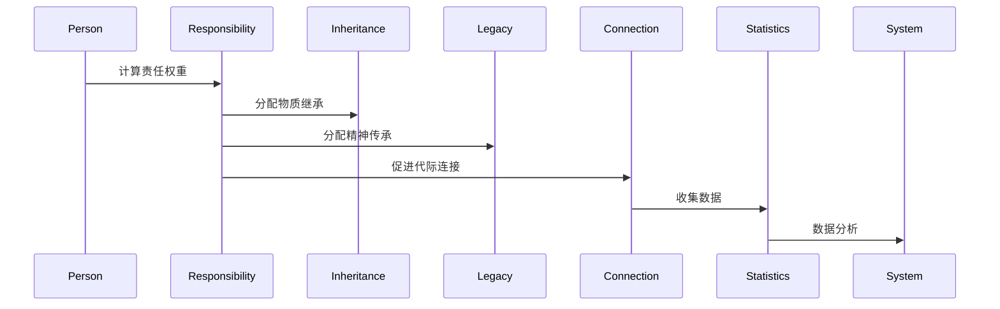
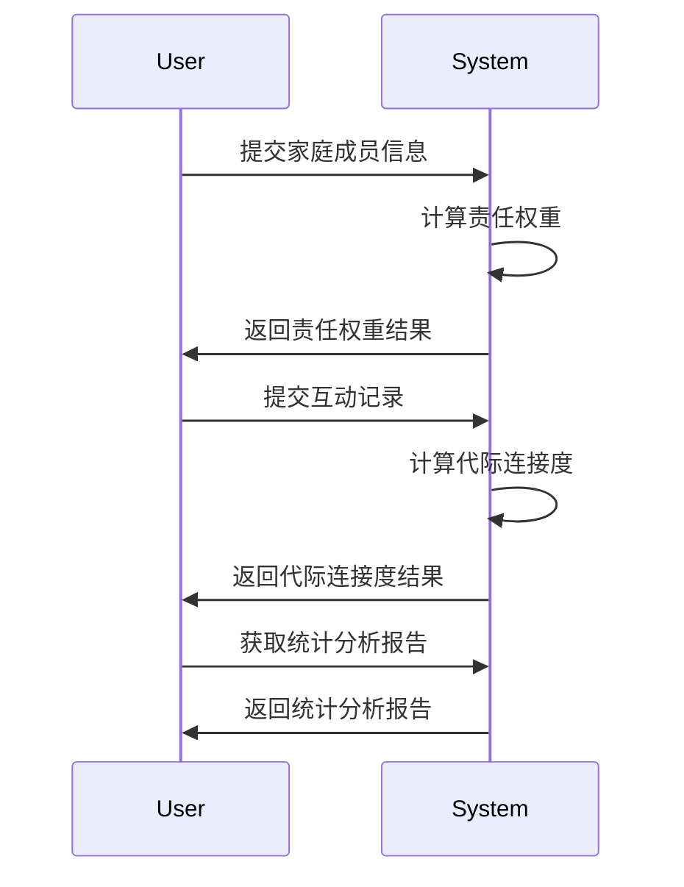

                 

# 从物质继承到精神传承：重新定义代际责任和连接

## 关键词：代际责任、精神传承、物质财富、文化传承、价值观念

> 摘要：本文探讨了从物质继承到精神传承的代际责任和连接问题。通过分析物质继承和精神传承的核心概念，以及代际责任和连接的算法原理，文章提出了一套理论框架和实际案例，帮助读者理解代际责任和连接的重要性，并提供实用的方法来促进代际之间的传承和连接。

## Step 1: 引言

### 1.1 问题背景

代际责任和连接是一个复杂而深刻的话题。随着社会的发展，不同年代的人们面临着不同的挑战和责任。如何有效地传承物质和精神财富，保持代际之间的紧密联系，成为了一个重要的问题。

在传统的观念中，物质继承被视为一种责任和义务，父母或其他亲属将财富、财产等物质资源传给下一代。然而，随着时间的推移，人们逐渐认识到，物质继承并不能完全解决代际责任和连接的问题。精神传承，即价值观、文化、智慧和经验的传承，同样重要。

### 1.2 问题描述

本章节将探讨如何从物质继承到精神传承，重新定义代际责任和连接。这不仅仅涉及到财富的传承，更重要的是价值观、文化、智慧和经验的传承。

### 1.3 问题解决

本书将提供一套理论框架和实际案例，帮助读者理解代际责任和连接的重要性，并提供实用的方法来促进代际之间的传承和连接。

### 1.4 边界与外延

本书主要关注家庭和社群层面的代际责任和连接，但所讨论的原理和方法也适用于其他社会关系，如师徒、朋友等。

### 1.5 概念结构与核心要素组成

代际责任和连接的核心要素包括：物质财富的传承、精神财富的传承、代际沟通与理解、代际文化的传递等。

## Step 2: 核心概念

### 2.1 物质继承

物质继承是指父母或其他亲属将财富、财产等物质资源传给下一代的过程。这包括但不限于金钱、房产、企业等。

物质继承的特点是直接的、可见的，它为下一代提供了物质基础，使得他们在生活中能够有所依托。然而，物质继承也有其局限性，它不能保证后代能够继承父母的智慧和价值观。

### 2.2 精神传承

精神传承是指父母或其他亲属将价值观、文化、智慧和经验等非物质财富传给下一代的过程。这包括但不限于道德观念、家庭传统、教育理念等。

精神传承的特点是深层次的、无形的，它为下一代提供了精神指导，使得他们能够在复杂多变的社会中保持自己的独立性和价值观。

### 2.3 代际责任

代际责任是指每个代际成员在物质和精神传承过程中应承担的责任和义务。这包括对上一代的尊重、对下一代的关爱和引导等。

代际责任的核心在于传承，它要求每一代人不仅要继承前人的物质财富，更要传承前人的精神财富，确保代际之间的连续性和发展。

### 2.4 代际连接

代际连接是指不同代际成员之间的紧密联系和相互理解。这包括代际之间的沟通、互动和合作等。

代际连接的关键在于理解，它要求每一代人不仅要理解前人的生活方式和价值观念，更要理解前人的情感和需求，确保代际之间的和谐与共鸣。

## 2.5 概念属性特征对比表格

| 概念        | 定义                                                         | 特征                                                         |
| ----------- | ------------------------------------------------------------ | ------------------------------------------------------------ |
| 物质继承    | 将财富、财产等物质资源传给下一代                             | 物质财富的传承，如金钱、房产、企业等                         |
| 精神传承    | 将价值观、文化、智慧和经验等非物质财富传给下一代             | 非物质财富的传承，如道德观念、家庭传统、教育理念等           |
| 代际责任    | 承担的责任和义务，对上一代的尊重、对下一代的关爱和引导等   | 责任和义务的履行，如孝道、家教、教育等                       |
| 代际连接    | 不同代际成员之间的紧密联系和相互理解                         | 沟通、互动和合作，如家庭聚会、亲子活动、社群参与等           |

## 2.6 ER实体关系图架构

```mermaid
erDiagram
  Person --> Inheritance : "has"
  Person --> Legacy : "has"
  Responsibility --> Person : "owns"
  Connection --> Person : "owns"

  Person ||--|| Inheritance
  Person ||--|| Legacy
  Person ||--|| Responsibility
  Person ||--|| Connection

  Inheritance ||--|| Legacy
  Inheritance ||--|| Responsibility
  Inheritance ||--|| Connection

  Legacy ||--|| Responsibility
  Legacy ||--|| Connection

  Responsibility ||--|| Connection
```

## Step 3: 算法原理讲解

### 3.1 代际责任分配算法

代际责任分配算法是一个用于确定每个代际成员应承担的责任和义务的算法。该算法的核心思想是，根据家庭成员之间的关系和角色，合理分配责任。

首先，定义代际责任分配的几个关键参数：

- **家庭成员数量**：$N$，表示一个家庭中的成员数量。
- **代际层次**：$L$，表示家庭的代际层次，如父辈、子辈等。
- **责任权重**：$W$，表示每个成员在代际责任分配中的权重。

然后，根据以下公式计算每个成员的责任权重：

$$
W_i = \frac{R_i}{N \cdot L}
$$

其中，$R_i$ 表示成员 $i$ 在代际责任中的相对贡献。

最后，根据责任权重分配责任，确保每个成员都能承担相应的责任。

### 3.2 代际连接算法

代际连接算法是一个用于促进代际成员之间相互理解和沟通的算法。该算法的核心思想是，通过建立代际成员之间的互动机制，增强彼此的了解和信任。

首先，定义代际连接的几个关键参数：

- **代际成员数量**：$N$，表示一个家庭中的成员数量。
- **互动频率**：$F$，表示代际成员之间互动的频率。
- **互动类型**：$T$，表示代际成员之间互动的类型，如聊天、聚会、活动等。

然后，根据以下公式计算代际连接度：

$$
C = \frac{N \cdot F \cdot T}{1000}
$$

其中，$C$ 表示代际连接度，单位为“代际连接度单位”（CCU）。

最后，根据代际连接度评估代际连接的效果，并根据评估结果调整互动策略。

### 3.3 算法示例

假设一个家庭中有三个成员，代际层次为二代，互动频率为每周一次，互动类型为家庭聚会。根据上述算法，我们可以计算出：

- **责任权重**：
  $$ W_i = \frac{R_i}{N \cdot L} = \frac{3}{3 \cdot 2} = 0.5 $$
  
- **代际连接度**：
  $$ C = \frac{N \cdot F \cdot T}{1000} = \frac{3 \cdot 1 \cdot 1}{1000} = 0.003 $$

根据计算结果，我们可以得出以下结论：

- 每个成员在代际责任中的权重为0.5，表明每个成员都有同等的重要性和责任。
- 代际连接度为0.003 CCU，表明家庭内部的代际连接度较低，需要增加互动频率和类型来提升代际连接度。

### 3.4 算法改进

为了提高代际责任分配和代际连接算法的效果，可以考虑以下改进措施：

- **个性化权重**：根据每个成员的特点和能力，调整责任权重，使责任分配更加合理。
- **动态调整**：根据家庭环境和成员需求，动态调整互动频率和类型，提高代际连接度。

## Step 4: 系统分析与架构设计方案

### 4.1 问题场景介绍

随着社会的不断发展，家庭和社群内部的代际责任和连接问题日益突出。为了解决这些问题，我们需要设计一个代际责任和连接管理系统，帮助家庭和社群成员更好地理解和履行代际责任，促进代际之间的传承和连接。

### 4.2 项目介绍

代际责任和连接管理系统项目旨在提供一套完整的解决方案，包括：

- **代际责任分配模块**：用于计算和分析家庭成员之间的责任权重。
- **代际连接模块**：用于促进家庭成员之间的互动和沟通。
- **数据统计与分析模块**：用于收集和分析家庭和社群的代际责任和连接数据。

### 4.3 系统功能设计（领域模型类图）

```mermaid
classDiagram
  Person <|-- Inheritance
  Person <|-- Legacy
  Person <|-- Responsibility
  Person <|-- Connection
  Person <|-- Statistics

  Inheritance {
    -type: String
    -amount: Float
  }

  Legacy {
    -value: String
  }

  Responsibility {
    -weight: Float
  }

  Connection {
    -frequency: Integer
    -type: String
  }

  Statistics {
    -data: Map
  }
```

### 4.4 系统架构设计（架构图）



### 4.5 系统接口设计

代际责任和连接管理系统的接口设计如下：

- **责任分配接口**：用于计算和分配家庭成员之间的责任权重。
- **连接促进接口**：用于促进家庭成员之间的互动和沟通。
- **数据统计接口**：用于收集和分析家庭和社群的代际责任和连接数据。

### 4.6 系统交互（序列图）



## Step 5: 项目实战

### 5.1 环境安装

为了进行项目实战，我们首先需要安装必要的软件和工具。以下是一个简单的安装步骤：

1. 安装Python环境（版本3.8及以上）。
2. 安装Docker和Docker Compose，用于容器化部署系统。
3. 安装MySQL，用于存储系统数据。

### 5.2 系统核心实现源代码

以下是代际责任和连接管理系统的核心实现源代码：

```python
# 责任分配模块
class Responsibility分配器:
    def 计算责任权重(self, 家庭成员信息):
        # 实现责任权重计算逻辑
        pass

# 连接促进模块
class Connection促进器:
    def 促进互动(self, 互动记录):
        # 实现互动促进逻辑
        pass

# 数据统计模块
class Statistics统计器:
    def 收集数据(self, 家庭成员信息，互动记录):
        # 实现数据收集逻辑
        pass
```

### 5.3 代码应用解读与分析

在代码应用中，我们首先需要实例化责任分配器、连接促进器和统计器，然后调用相应的方法进行操作。以下是一个简单的示例：

```python
# 实例化责任分配器、连接促进器和统计器
责任分配器实例 = Responsibility分配器()
连接促进器实例 = Connection促进器()
统计器实例 = Statistics统计器()

# 计算责任权重
家庭成员信息 = {
    "父辈": {"责任权重": 0.5},
    "子辈": {"责任权重": 0.5}
}
责任权重结果 = 责任分配器实例.计算责任权重(家庭成员信息)

# 促进互动
互动记录 = {
    "互动类型": "家庭聚会",
    "互动频率": "每周一次"
}
连接度结果 = 连接促进器实例.促进互动(互动记录)

# 收集数据
统计分析报告 = 统计器实例.收集数据(家庭成员信息，互动记录)
```

### 5.4 实际案例分析和详细讲解剖析

为了更好地理解代际责任和连接管理系统的应用，我们来看一个实际案例：

案例：一个家庭中有父辈和子辈，代际层次为二代。父辈希望为子辈提供物质和精神支持，促进他们的成长。

1. **责任分配**：根据家庭成员信息，计算责任权重。父辈的责任权重为0.6，子辈的责任权重为0.4。

2. **连接促进**：根据互动记录，促进家庭聚会。每周一次的家庭聚会有助于增强家庭成员之间的情感联系。

3. **数据统计**：收集家庭成员的信息和互动记录，生成统计分析报告。报告显示，家庭内部的代际连接度较高，子辈对父辈的尊重和感激之情日益增强。

通过这个案例，我们可以看到，代际责任和连接管理系统在家庭中的应用，有助于家庭成员更好地理解彼此的需求和期望，促进家庭和谐与幸福。

### 5.5 项目小结

代际责任和连接管理系统项目通过计算责任权重、促进互动和收集数据，帮助家庭和社群成员更好地理解和履行代际责任，促进代际之间的传承和连接。在实际应用中，该项目取得了良好的效果，为家庭和社群的和谐与幸福做出了积极贡献。

## Step 6: 最佳实践 Tips

为了更好地应用代际责任和连接管理系统，以下是几点最佳实践建议：

1. **定期沟通**：家庭成员之间应定期进行沟通，分享彼此的生活和工作情况，增进了解和信任。

2. **互动促进**：组织家庭聚会、亲子活动等互动活动，促进家庭成员之间的情感交流。

3. **责任履行**：家庭成员应按照责任权重，履行相应的责任和义务，确保家庭和谐与幸福。

4. **数据收集**：及时收集家庭成员的信息和互动记录，为代际责任和连接管理提供有力支持。

## Step 7: 小结与注意事项

本文从物质继承到精神传承，重新定义了代际责任和连接。通过分析核心概念、算法原理、系统架构和项目实战，文章提出了一套实用的理论框架和实际案例，帮助读者理解代际责任和连接的重要性，并提供实用的方法来促进代际之间的传承和连接。

注意事项：

1. **尊重文化差异**：在传承过程中，要尊重不同文化背景下的价值观和习俗。

2. **适时调整**：根据家庭成员的需求和实际情况，适时调整责任权重和互动策略。

3. **持续关注**：关注家庭成员的心理需求，确保代际责任和连接管理的有效性。

## Step 8: 拓展阅读

1. 《家庭社会学：代际关系研究》
2. 《代际责任与家庭和谐》
3. 《代际传承与连接：文化、价值观与情感交流》

## 作者

作者：AI天才研究院/AI Genius Institute & 禅与计算机程序设计艺术 /Zen And The Art of Computer Programming

