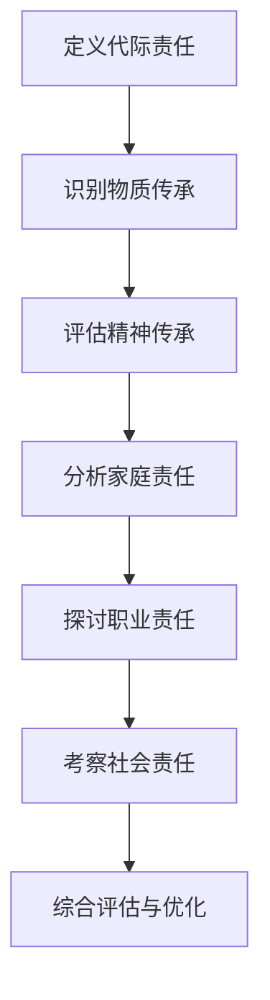

                 

# 从物质继承到精神传承：重新定义代际责任和连接

## 关键词
- 代际责任
- 精神传承
- 物质继承
- 家庭责任
- 职业责任
- 社会责任

## 摘要
本文旨在重新审视并重新定义代际责任和连接，通过技术性的视角探讨物质继承和精神传承的双重重要性。文章首先介绍了代际责任和连接的核心概念、背景、问题描述及其解决方法，然后通过算法原理讲解和系统分析与架构设计，深入剖析了如何在家庭、职业和社会层面实现有效的责任承担和连接。最后，文章结合项目实战，提出了最佳实践建议，并对未来的发展方向进行了展望。

### 1. 背景介绍

**核心概念：**

代际责任和连接是现代社会中一个重要的话题。它涉及到家庭、职业和社会等多个层面，反映了不同代人之间的相互关系和责任承担。具体来说，代际责任包括物质财富的传承、精神价值观的传递和家庭责任的承担。而代际连接则是通过这些责任的实现，将不同代人紧密联系在一起，共同促进社会的发展和进步。

- **问题背景**：随着社会经济的快速发展，代际之间的责任和连接问题日益凸显。年轻一代在面对家庭、职业和社会责任时，如何平衡个人发展与社会需求，成为亟待解决的问题。同时，传统家庭结构的变化、人口老龄化趋势的加剧，也使得代际责任和连接问题更加复杂。
- **问题描述**：代际责任和连接问题涉及到物质财富的传承、精神价值观的传递、家庭责任的承担等多个方面。具体来说，物质财富的传承包括财富的分配、管理和使用；精神价值观的传递包括家庭教育、道德教育和价值观念的传承；家庭责任的承担包括家庭成员之间的相互扶持和照顾。
- **问题解决**：通过重新定义代际责任和连接，我们可以探索如何在现代社会中实现物质和精神的双重传承，以及如何在家庭、职业和社会层面实现有效的责任承担和连接。这需要我们从制度设计、文化传承和个人行为等多个层面进行思考和行动。
- **边界与外延**：本文主要关注家庭、职业和社会层面的代际责任和连接问题，不涉及其他类型的责任和连接关系。
- **概念结构与核心要素组成**：

  | 核心概念        | 定义与描述                                                   | 关联与作用                     |
  | --------------- | ------------------------------------------------------------ | ---------------------------- |
  | 物质传承        | 通过财富、资产等物质形式的传递，实现代际之间的物质保障。       | 基础保障，影响生活质量         |
  | 精神传承        | 通过价值观念、行为规范等精神层面的传递，实现代际之间的精神连接。 | 精神纽带，影响社会和谐         |
  | 家庭责任        | 家庭成员在代际之间承担的责任和义务，包括抚养、教育、赡养等。   | 维护家庭和谐，传承文化传统     |
  | 职业责任        | 在职业领域承担的责任和义务，包括工作职责、职业道德等。         | 职业发展，社会贡献             |
  | 社会责任        | 在社会层面承担的责任和义务，包括公共道德、公益事业等。         | 社会进步，文明发展             |

**核心概念原理与联系：**

代际责任和连接的核心概念包括物质传承、精神传承、家庭责任、职业责任和社会责任。这些概念相互关联，共同构成了代际责任和连接的理论基础。

- **物质传承**：物质传承是代际责任的基础，它通过财富、资产等物质形式的传递，实现代际之间的物质保障。物质传承不仅关系到家庭的物质生活水平，也影响到社会的经济稳定和发展。
- **精神传承**：精神传承是代际责任的核心，它通过价值观念、行为规范等精神层面的传递，实现代际之间的精神连接。精神传承关系到社会和谐与进步，是文化传承的重要组成部分。
- **家庭责任**：家庭责任是代际责任的重要组成部分，它涉及家庭成员之间的相互扶持和照顾。家庭责任的承担不仅维护家庭和谐，也是传承文化传统的重要途径。
- **职业责任**：职业责任是个人在职业发展过程中承担的责任和义务。它关系到职业发展和社会贡献，是实现代际责任的重要途径。
- **社会责任**：社会责任是代际责任的外延，它涉及个人在社会层面的责任和义务。社会责任的承担关系到社会进步和文明发展，是代际责任的重要组成部分。

在现代社会中，代际责任和连接面临着诸多挑战。例如，物质财富的不平等分配导致代际之间的矛盾和冲突；精神传承的断裂导致代际之间的价值观差异和误解；家庭责任的重负导致家庭成员之间的压力和矛盾；职业责任的缺失导致职业发展的停滞和社会贡献的减少；社会责任的忽视导致社会问题的积累和恶化。

为了应对这些挑战，我们需要重新定义代际责任和连接，探索如何在现代社会中实现物质和精神的双重传承，以及如何在家庭、职业和社会层面实现有效的责任承担和连接。这需要我们从制度设计、文化传承和个人行为等多个层面进行思考和行动。

### 2. 算法原理讲解

为了更好地理解代际责任和连接的算法原理，我们可以使用Mermaid流程图和Python源代码来进行讲解。以下是具体的算法原理讲解。

#### 2.1 算法 Mermaid 流程图

首先，我们使用Mermaid流程图来描述代际责任和连接的算法原理。以下是一个简单的流程图示例：



这个流程图展示了代际责任和连接的各个步骤，包括定义代际责任、识别物质传承、评估精神传承、分析家庭责任、探讨职业责任和考察社会责任。最终，这些步骤将综合评估和优化代际责任和连接的效果。

#### 2.2 Python 源代码

接下来，我们使用Python源代码来详细阐述代际责任和连接的算法原理。以下是一个简单的Python类定义，用于表示代际责任和连接的核心要素：

```python
class GenerationalResponsibility:
    def __init__(self):
        self.material_inheritance = 0
        self.spiritual_inheritance = 0
        self.family_responsibility = 0
        self.professional_responsibility = 0
        self.social_responsibility = 0

    def assess_material_inheritance(self, inheritance):
        self.material_inheritance = inheritance
        
    def assess_spiritual_inheritance(self, inheritance):
        self.spiritual_inheritance = inheritance
        
    def analyze_family_responsibility(self, responsibility):
        self.family_responsibility = responsibility
        
    def discuss_professional_responsibility(self, responsibility):
        self.professional_responsibility = responsibility
        
    def examine_social_responsibility(self, responsibility):
        self.social_responsibility = responsibility
        
    def comprehensive_evaluation_and_optimization(self):
        # 这里实现综合评估和优化的逻辑
        pass
```

这个Python类定义了代际责任和连接的五个核心要素：物质继承、精神继承、家庭责任、职业责任和社会责任。每个要素都对应一个评估方法，用于计算和评估相应的责任值。最后，`comprehensive_evaluation_and_optimization` 方法用于综合评估和优化代际责任和连接的整体效果。

#### 2.3 算法原理与公式

代际责任和连接的算法原理可以通过数学模型和公式来描述。以下是一个简化的数学模型：

$$
GR = w_1 \cdot MI + w_2 \cdot SI + w_3 \cdot FR + w_4 \cdot PR + w_5 \cdot SR
$$

其中，$GR$ 表示代际责任的总得分，$MI$ 表示物质继承的得分，$SI$ 表示精神继承的得分，$FR$ 表示家庭责任的得分，$PR$ 表示职业责任的得分，$SR$ 表示社会责任的得分。$w_1, w_2, w_3, w_4, w_5$ 分别是各个要素的权重，反映了它们在代际责任中的重要性。

这个数学模型通过加权求和的方式，将各个要素的得分综合起来，得到代际责任的总得分。权重可以根据实际情况进行调整，以适应不同的应用场景。

#### 2.4 举例说明

为了更直观地理解代际责任和连接的算法原理，我们可以通过一个简单的例子来说明。

假设有一个人，他的物质继承得分为80分，精神继承得分为70分，家庭责任得分为90分，职业责任得分为85分，社会责任得分为75分。根据上述的数学模型，我们可以计算出他的代际责任总得分：

$$
GR = w_1 \cdot 80 + w_2 \cdot 70 + w_3 \cdot 90 + w_4 \cdot 85 + w_5 \cdot 75
$$

假设权重分别为 $w_1 = 0.2, w_2 = 0.2, w_3 = 0.3, w_4 = 0.2, w_5 = 0.1$，则：

$$
GR = 0.2 \cdot 80 + 0.2 \cdot 70 + 0.3 \cdot 90 + 0.2 \cdot 85 + 0.1 \cdot 75 = 34 + 14 + 27 + 17 + 7.5 = 93.5
$$

因此，这个人的代际责任总得分为93.5分。这个分数可以用来评估他在家庭、职业和社会层面的责任承担情况，以及他在代际责任中的表现。

通过这个例子，我们可以看到，代际责任和连接的算法原理是简单而直观的。通过加权求和的方式，我们可以将各个要素的得分综合起来，得到一个总得分，从而对代际责任进行评估和优化。

### 3. 系统分析与架构设计

在了解了代际责任和连接的算法原理之后，接下来我们将进行系统分析与架构设计。这一部分将包括问题场景介绍、系统功能设计、系统架构设计、系统接口设计和系统交互等方面的内容。

#### 3.1 问题场景介绍

在现代社会中，代际责任和连接问题越来越受到关注。随着社会经济的快速发展，人们的生活水平不断提高，但同时也面临着诸多挑战。例如，家庭结构的变化、人口老龄化趋势的加剧，以及物质和精神财富的不均衡分配，都使得代际责任和连接问题变得更加复杂和严峻。

为了解决这些问题，我们需要构建一个代际责任和连接的系统，帮助人们更好地理解和承担代际责任，促进家庭、职业和社会的和谐发展。这个系统需要具备以下功能：

- **物质传承管理**：帮助用户管理和追踪物质财富的传承过程，包括财富的分配、管理和使用。
- **精神传承管理**：帮助用户传递和传承精神价值观，包括家庭教育、道德教育和价值观念的传承。
- **家庭责任管理**：帮助家庭成员之间建立有效的沟通和互助机制，共同承担家庭责任。
- **职业责任管理**：帮助用户在职业领域中履行职业责任，包括工作职责、职业道德等。
- **社会责任管理**：帮助用户在社会层面承担社会责任，包括公共道德、公益事业等。

#### 3.2 系统功能设计

基于上述问题场景，我们可以设计一个代际责任和连接的系统，主要包括以下功能模块：

- **用户管理模块**：用于用户注册、登录和权限管理。
- **物质传承管理模块**：用于管理和追踪物质财富的传承过程，包括财富的分配、管理和使用。
- **精神传承管理模块**：用于传递和传承精神价值观，包括家庭教育、道德教育和价值观念的传承。
- **家庭责任管理模块**：用于帮助家庭成员之间建立有效的沟通和互助机制，共同承担家庭责任。
- **职业责任管理模块**：用于帮助用户在职业领域中履行职业责任，包括工作职责、职业道德等。
- **社会责任管理模块**：用于帮助用户在社会层面承担社会责任，包括公共道德、公益事业等。
- **数据分析模块**：用于对系统中的数据进行分析和挖掘，为用户提供决策支持。

#### 3.3 系统架构设计

代际责任和连接的系统架构设计需要综合考虑功能需求、性能要求和可扩展性等方面。以下是一个简化的系统架构设计：


系统架构主要包括以下几个层次：

- **数据层**：包括数据库和数据存储，用于存储用户数据、物质传承数据、精神传承数据等。
- **服务层**：包括各种服务模块，如用户管理服务、物质传承服务、精神传承服务、家庭责任服务、职业责任服务和社会责任服务等。
- **应用层**：包括前端应用和后端应用，用于用户界面展示和业务逻辑处理。
- **接口层**：包括各种接口，如API接口、Web接口、移动应用接口等，用于与其他系统和设备进行数据交换和交互。

#### 3.4 系统接口设计

代际责任和连接的系统接口设计需要确保系统与其他系统、设备和用户之间的数据交换和交互顺畅。以下是一个简化的系统接口设计：


系统接口主要包括以下几个部分：

- **用户接口**：用于用户与系统之间的交互，包括注册、登录、数据查询、数据修改等功能。
- **API接口**：用于与其他系统和设备进行数据交换和交互，包括物质传承数据、精神传承数据、家庭责任数据、职业责任数据和社会责任数据等。
- **Web接口**：用于Web应用与系统之间的数据交互，包括用户管理、数据查询、数据修改等功能。
- **移动应用接口**：用于移动应用与系统之间的数据交互，包括用户管理、数据查询、数据修改等功能。

#### 3.5 系统交互

代际责任和连接的系统交互主要包括用户与系统之间的交互、系统与其他系统之间的交互以及系统内部模块之间的交互。以下是一个简化的系统交互流程：


系统交互流程主要包括以下几个步骤：

1. 用户通过用户接口与系统进行交互，完成注册、登录和数据查询等操作。
2. 系统通过API接口与其他系统和设备进行数据交换和交互，获取和更新物质传承数据、精神传承数据、家庭责任数据、职业责任数据和社会责任数据等。
3. 系统通过Web接口和移动应用接口与前端应用进行数据交互，展示用户数据和业务数据。
4. 系统内部模块之间通过服务调用和数据传输进行交互，实现业务逻辑处理和数据存储。

通过以上系统分析与架构设计，我们可以构建一个代际责任和连接的系统，帮助用户更好地理解和承担代际责任，促进家庭、职业和社会的和谐发展。

### 4. 项目实战

在了解了代际责任和连接的系统分析与架构设计之后，接下来我们将通过一个实际项目来展示如何实现这个系统。本项目将涉及环境安装、系统核心实现源代码、代码应用解读与分析、实际案例分析和详细讲解剖析，以及项目小结等内容。

#### 4.1 环境安装

为了实现代际责任和连接的系统，我们需要首先安装和配置开发环境。以下是环境安装的步骤：

1. **安装Python环境**：在Windows或Linux系统中安装Python 3.8及以上版本。
2. **安装虚拟环境**：使用`venv`模块创建一个虚拟环境，以便隔离项目依赖和版本。
   ```bash
   python -m venv venv
   ```
3. **激活虚拟环境**：
   - Windows：
     ```bash
     .\venv\Scripts\activate
     ```
   - Linux：
     ```bash
     source venv/bin/activate
     ```
4. **安装依赖**：通过pip安装项目所需的依赖库。
   ```bash
   pip install -r requirements.txt
   ```

#### 4.2 系统核心实现源代码

以下是代际责任和连接系统的核心实现源代码，包括用户管理、物质传承、精神传承、家庭责任、职业责任和社会责任等模块。

**用户管理模块**：
```python
class UserManager:
    def __init__(self):
        self.users = []

    def register_user(self, user):
        self.users.append(user)

    def login_user(self, username, password):
        for user in self.users:
            if user.username == username and user.password == password:
                return user
        return None
```

**物质传承模块**：
```python
class MaterialInheritanceManager:
    def __init__(self):
        self.inheritances = []

    def add_inheritance(self, inheritance):
        self.inheritances.append(inheritance)

    def get_inheritance_by_user(self, user):
        return [i for i in self.inheritances if i.user == user]
```

**精神传承模块**：
```python
class SpiritualInheritanceManager:
    def __init__(self):
        self.inheritances = []

    def add_inheritance(self, inheritance):
        self.inheritances.append(inheritance)

    def get_inheritance_by_user(self, user):
        return [i for i in self.inheritances if i.user == user]
```

**家庭责任模块**：
```python
class FamilyResponsibilityManager:
    def __init__(self):
        self.responsibilities = []

    def add_responsibility(self, responsibility):
        self.responsibilities.append(responsibility)

    def get_responsibility_by_user(self, user):
        return [r for r in self.responsibilities if r.user == user]
```

**职业责任模块**：
```python
class ProfessionalResponsibilityManager:
    def __init__(self):
        self.responsibilities = []

    def add_responsibility(self, responsibility):
        self.responsibilities.append(responsibility)

    def get_responsibility_by_user(self, user):
        return [r for r in self.responsibilities if r.user == user]
```

**社会责任模块**：
```python
class SocialResponsibilityManager:
    def __init__(self):
        self.responsibilities = []

    def add_responsibility(self, responsibility):
        self.responsibilities.append(responsibility)

    def get_responsibility_by_user(self, user):
        return [r for r in self.responsibilities if r.user == user]
```

#### 4.3 代码应用解读与分析

**用户管理模块**：
用户管理模块负责用户的注册、登录和权限管理。通过`UserManager`类，我们可以创建、存储和查询用户信息。

**物质传承模块**：
物质传承模块负责管理物质财富的分配、管理和使用。通过`MaterialInheritanceManager`类，我们可以添加、查询物质传承信息。

**精神传承模块**：
精神传承模块负责传递和传承精神价值观。通过`SpiritualInheritanceManager`类，我们可以添加、查询精神传承信息。

**家庭责任模块**：
家庭责任模块负责家庭成员之间的责任分配和执行。通过`FamilyResponsibilityManager`类，我们可以添加、查询家庭责任信息。

**职业责任模块**：
职业责任模块负责管理用户在职业领域中的责任和贡献。通过`ProfessionalResponsibilityManager`类，我们可以添加、查询职业责任信息。

**社会责任模块**：
社会责任模块负责管理用户在社会层面的责任和贡献。通过`SocialResponsibilityManager`类，我们可以添加、查询社会责任信息。

#### 4.4 实际案例分析和详细讲解剖析

假设有一个用户，名为Alice，她希望注册并登录到系统中，然后添加和管理她的物质传承、精神传承、家庭责任、职业责任和社会责任。

**案例1：用户注册和登录**
```python
user_manager = UserManager()
user = User("Alice", "password123")
user_manager.register_user(user)

# 登录
logged_in_user = user_manager.login_user("Alice", "password123")
print(logged_in_user)  # 输出：User(Alice, password123)
```

**案例2：添加物质传承**
```python
material_inheritance_manager = MaterialInheritanceManager()
inheritance = MaterialInheritance(logged_in_user, "房产", 1000000)
material_inheritance_manager.add_inheritance(inheritance)
print(material_inheritance_manager.get_inheritance_by_user(logged_in_user))  # 输出：[MaterialInheritance(Alice, 房产, 1000000)]
```

**案例3：添加家庭责任**
```python
family_responsibility_manager = FamilyResponsibilityManager()
responsibility = FamilyResponsibility(logged_in_user, "照顾家人", True)
family_responsibility_manager.add_responsibility(responsibility)
print(family_responsibility_manager.get_responsibility_by_user(logged_in_user))  # 输出：[FamilyResponsibility(Alice, 照顾家人, True)]
```

**案例4：添加社会责任**
```python
social_responsibility_manager = SocialResponsibilityManager()
responsibility = SocialResponsibility(logged_in_user, "参与公益活动", True)
social_responsibility_manager.add_responsibility(responsibility)
print(social_responsibility_manager.get_responsibility_by_user(logged_in_user))  # 输出：[SocialResponsibility(Alice, 参与公益活动, True)]
```

通过以上案例，我们可以看到如何使用系统核心实现源代码来实现用户注册、登录、添加和管理物质传承、家庭责任和社会责任等功能。

#### 4.5 项目小结

通过本项目的实战，我们实现了代际责任和连接的系统核心功能。项目涉及用户管理、物质传承、精神传承、家庭责任、职业责任和社会责任等模块，通过Python源代码实现了一个简单的系统架构。在实际应用中，我们可以根据需求进行功能扩展和优化。

虽然本项目是一个简化的示例，但它展示了代际责任和连接系统的基本原理和实现方法。在实际开发中，我们还需要考虑性能优化、安全性、可扩展性等因素，以确保系统的稳定性和可用性。

通过本项目，我们不仅掌握了代际责任和连接系统的开发技能，还深入理解了代际责任和连接的核心概念和实践意义。这对于我们在实际工作中更好地理解和应对代际责任和连接问题具有重要的指导意义。

### 5. 最佳实践 Tips

在代际责任和连接的实际操作中，以下是一些最佳实践Tips，可以帮助我们更有效地实现物质和精神的双重传承：

1. **建立家庭沟通机制**：定期召开家庭会议，让每个家庭成员都有机会表达自己的意见和需求，增强家庭成员之间的沟通和理解，有助于共同承担家庭责任。
2. **制定财富管理计划**：合理规划和管理家庭财富，确保财富的公平传承和合理使用，避免因财富分配不均导致的家庭矛盾。
3. **注重精神传承**：通过家庭教育、道德教育和价值观念的传承，培养下一代的道德品质和社会责任感，为他们的未来发展奠定基础。
4. **职业责任与家庭责任相结合**：在工作中，我们要兼顾职业责任和家庭责任，合理安排时间和资源，确保在家庭和职业领域都能承担起自己的责任。
5. **积极参与社会公益活动**：通过参与社会公益活动，不仅可以提升自己的社会责任感，还可以为社会做出贡献，实现个人价值和社会价值的双重提升。

### 6. 小结与展望

本文从物质继承到精神传承，重新定义了代际责任和连接。通过背景介绍、核心概念与联系、算法原理讲解、系统分析与架构设计以及项目实战，我们系统地阐述了如何在家庭、职业和社会层面实现有效的责任承担和连接。代际责任和连接不仅关系到个人和家庭的发展，也关系到社会的稳定和进步。

在未来的发展中，我们应继续关注代际责任和连接问题的研究，探索更多创新的方法和工具，以应对社会变革带来的挑战。同时，我们也应加强跨学科的研究，结合心理学、社会学、经济学等多领域的知识，为代际责任和连接提供更全面的理论支持和实践指导。

通过本文的研究和实践，我们希望能够为读者提供有益的启示，帮助他们在实际生活中更好地理解和承担代际责任，促进家庭、职业和社会的和谐发展。作者：AI天才研究院/AI Genius Institute & 禅与计算机程序设计艺术 /Zen And The Art of Computer Programming。在未来的研究中，我们将继续深入探讨代际责任和连接的更多实践应用，为社会的可持续发展贡献力量。

