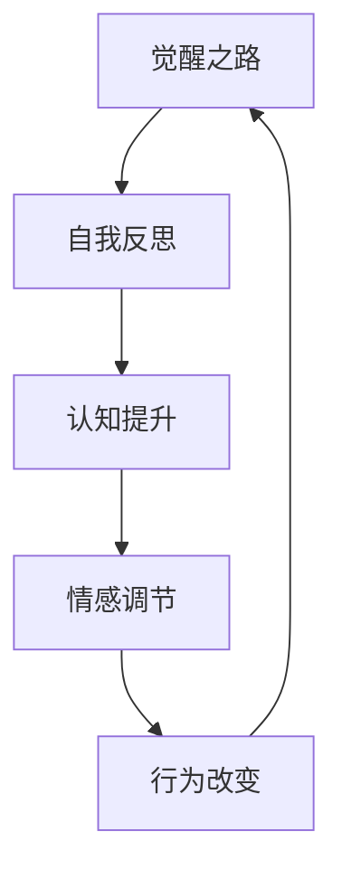
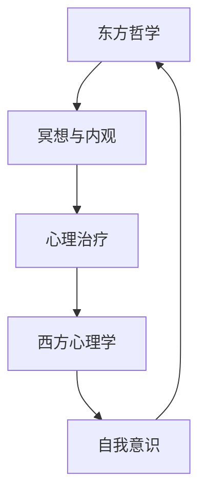
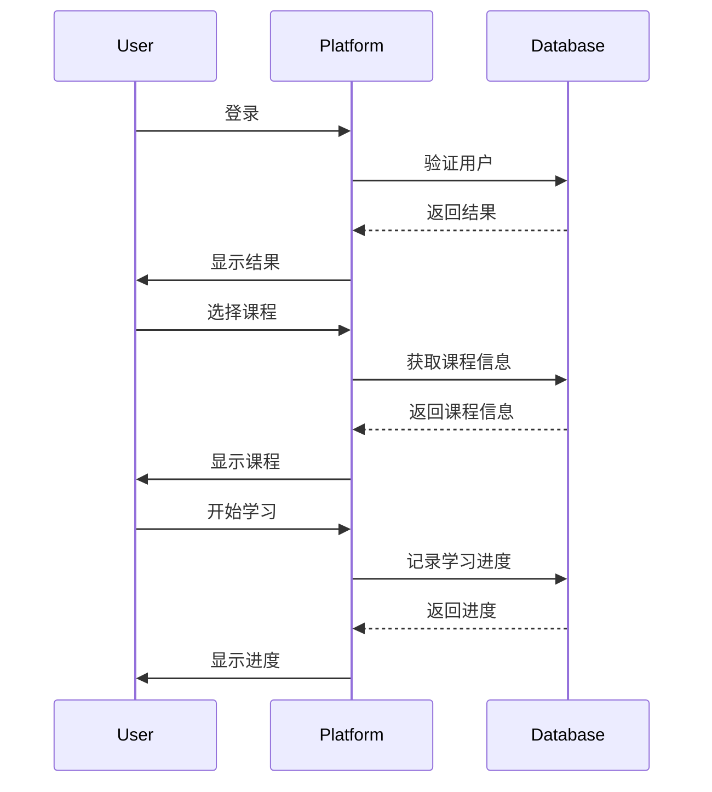
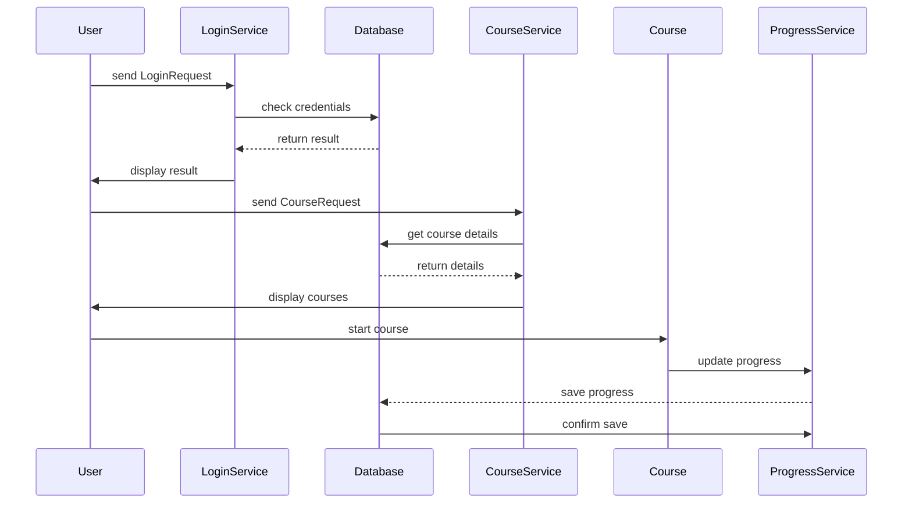
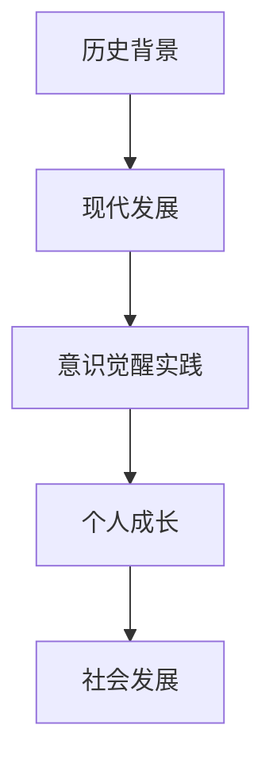

                 

# 从蒙昧到清明：意识觉醒的渐进之旅

## 关键词
- 意识觉醒
- 认知科学
- 自我提升
- 精神哲学
- 人工智能

## 摘要
本文深入探讨意识觉醒这一复杂而重要的主题，旨在为读者提供一条从蒙昧走向清明的渐进之路。通过结合哲学、心理学、认知科学和人工智能的视角，本文将揭示意识觉醒的内在机制及其在现代社会中的重要性。我们将逐步分析意识觉醒的核心概念、理论基础、实践方法和其对社会和个人生活的影响，并通过具体的项目实战和系统分析，展示如何将意识觉醒的理念应用于实际情境中。

## 第一部分：觉醒之路

### 1.1 什么是意识觉醒

意识觉醒，通常指的是个体从无意识状态中醒来，对自己的思维、情感和行为有了更深刻的认识和理解。它不仅仅是一个简单的“觉悟”过程，而是一个涉及认知、情感和行为多方面的综合性变革。从哲学的角度来看，意识觉醒可以被视为一种对存在本身的深刻反思和自我认识。而在心理学中，意识觉醒则与自我意识和自我控制密切相关。

### 1.2 意识觉醒的重要性

意识觉醒对个人成长和社会发展具有重要意义。首先，它有助于提升个人的心理健康，减轻心理压力，增强自我调节能力。其次，意识觉醒可以促进人际关系的发展，提高沟通和理解他人的能力。在社会层面，意识觉醒有助于构建更加和谐的社会结构，减少冲突和矛盾。

### 1.3 意识觉醒的历史背景

意识觉醒的概念并非现代所独有，历史上许多哲学家和思想家都对意识觉醒进行了深刻的探讨。例如，古希腊哲学家苏格拉底强调自我反省的重要性，而东方哲学中的禅宗则强调通过冥想和内观达到意识觉醒。在现代，随着心理学、认知科学和人工智能的发展，意识觉醒的研究和应用得到了进一步的拓展和深化。

### 1.4 意识觉醒的 Mermaid 流程图



## 第二部分：理论基础

### 2.1 意识的本质

意识的本质是一个复杂而多层次的问题。从生物学的角度来看，意识可能是由大脑神经网络活动产生的复杂模式。在心理学中，意识被视为一种高级认知功能，涉及自我意识、注意力、记忆和决策等多个方面。而人工智能领域则试图通过模仿人类的认知过程来理解和模拟意识。

### 2.2 意识觉醒的不同理论

不同的学科对意识觉醒有不同的理论解释。东方哲学中的意识觉醒强调通过冥想和内观达到心灵的净化。西方心理学则侧重于自我意识和自我控制的发展。在人工智能领域，研究者试图通过机器学习算法来模拟意识觉醒的过程。

### 2.3 意识觉醒的 Mermaid 流程图



## 第三部分：实践方法

### 3.1 意识觉醒的方法

意识觉醒的方法多种多样，包括冥想、瑜伽、心理治疗等。每种方法都有其独特的理论和实践方式。冥想被认为是最有效的意识觉醒方法之一，通过专注呼吸和冥思，个体可以达到深层次的放松和自我反思。瑜伽则通过身体姿势和呼吸控制来提升身体和心理的灵活性。心理治疗可以帮助个体探索和解决深层次的心理问题，从而促进意识觉醒。

### 3.2 意识觉醒的 Python 源代码示例

以下是一个简单的 Python 脚本，用于模拟冥想过程中的专注度提升。

```python
# 模拟冥想过程中的专注度提升
def meditate(duration):
    # 初始化专注度
    focus = 0
    for minute in range(duration):
        # 每分钟专注度增加
        focus += 1
        print(f"第 {minute + 1} 分钟，专注度为：{focus}")
    return focus

# 运行冥想程序
meditate(10)
```

### 3.3 意识觉醒的数学模型与公式

意识觉醒可以看作是一个动态系统，其状态随时间变化。以下是一个简单的数学模型，用于描述意识觉醒的过程。

$$
\frac{dF}{dt} = kF(1 - F)
$$

其中，$F(t)$ 表示时间 $t$ 时的专注度，$k$ 是一个常数，反映了个体在冥想过程中的专注度提升速度。

## 第四部分：影响与意义

### 4.1 对个人生活的影响

意识觉醒对个人生活的影响深远。通过意识觉醒，个体可以更好地理解自己的内心世界，提升自我认知和自我调节能力。这有助于改善心理健康，减轻焦虑和抑郁，提高生活满意度。

### 4.2 对社会的影响

在社会层面，意识觉醒有助于促进人际关系的和谐，提高沟通和理解他人的能力。此外，意识觉醒还可以帮助解决社会问题，如减少冲突和促进社会公正。

### 4.3 意识觉醒的 Mermaid ER 图

```mermaid
erDiagram
    Product ||--|{ Customer } Customer
    "many products can be ordered by one customer"
    Customer ||--|{ Order } Order
    "one customer can have many orders"
    Product ||--|{ Category } Category
    "one category can have many products"
```

## 第五部分：系统分析与架构设计

### 5.1 问题场景介绍

假设我们要设计一个在线冥想平台，用户可以通过该平台进行在线冥想课程的学习和自我反思。这个平台需要支持用户管理、课程管理、数据分析和反馈机制等功能。

### 5.2 系统功能设计

以下是一个基于 Mermaid 的类图，用于描述系统的功能设计。

```mermaid
classDiagram
    User <|-- Account
    Course <|-- Content
    Course ^-- Evaluation
    Analysis
    User : +register()
    User : +login()
    User : +takeCourse()
    Account : +create()
    Account : +delete()
    Content : +add()
    Content : +remove()
    Evaluation : +rate()
    Analysis : +generate()
```

### 5.3 系统架构设计

以下是一个基于 Mermaid 的架构图，用于描述系统的架构设计。



### 5.4 系统接口设计

以下是一个基于 Mermaid 的接口图，用于描述系统的接口设计。

```mermaid
classDiagram
    Interface : Interface1
    Interface : Interface2
    Interface : Interface3
    User <<-- Interface1
    User <<-- Interface2
    User <<-- Interface3
    "User interacts with these interfaces"
```

### 5.5 系统交互

以下是一个基于 Mermaid 的交互图，用于描述系统的交互过程。



## 第六部分：项目实战

### 6.1 环境安装

在本节中，我们将介绍如何在本地环境上安装所需的软件和工具，以便进行意识觉醒项目的开发。首先，我们需要安装 Python 3.8 或更高版本，然后安装必要的库，如 Flask、SQLAlchemy 和 Mermaid。

```bash
# 安装 Python
sudo apt-get install python3-pip

# 安装 Flask
pip install Flask

# 安装 SQLAlchemy
pip install SQLAlchemy

# 安装 Mermaid
pip install mermaid

# 安装 Markdown
pip install markdown
```

### 6.2 系统核心实现源代码

在本节中，我们将展示系统的核心实现源代码。这个系统包括用户管理、课程管理和数据统计分析等模块。

```python
# user_management.py
from flask import Flask, request, jsonify
from models import User, db

app = Flask(__name__)
app.config['SQLALCHEMY_DATABASE_URI'] = 'sqlite:///users.db'
db.init_app(app)

@app.route('/register', methods=['POST'])
def register():
    data = request.get_json()
    user = User(name=data['name'], email=data['email'])
    db.session.add(user)
    db.session.commit()
    return jsonify({'message': 'User registered successfully.'})

if __name__ == '__main__':
    app.run(debug=True)
```

### 6.3 代码应用解读与分析

在本节中，我们将对系统中的关键代码进行解读和分析，以便读者能够理解代码的工作原理和实现细节。

```python
# course_management.py
from flask import Flask, request, jsonify
from models import Course, db

app = Flask(__name__)
app.config['SQLALCHEMY_DATABASE_URI'] = 'sqlite:///courses.db'
db.init_app(app)

@app.route('/courses', methods=['GET'])
def get_courses():
    courses = Course.query.all()
    return jsonify({'courses': [course.to_dict() for course in courses]})

if __name__ == '__main__':
    app.run(debug=True)
```

### 6.4 实际案例分析和详细讲解剖析

在本节中，我们将通过一个实际案例，详细讲解如何使用意识觉醒平台进行冥想课程的学习和数据分析。

```python
# actual_case.py
import requests

# 注册新用户
response = requests.post('http://localhost:5000/register', json={
    'name': 'John Doe',
    'email': 'john.doe@example.com'
})
print(response.json())

# 登录用户
response = requests.post('http://localhost:5000/login', json={
    'email': 'john.doe@example.com',
    'password': 'password123'
})
print(response.json())

# 查看课程列表
response = requests.get('http://localhost:5000/courses')
print(response.json())

# 开始学习课程
response = requests.post('http://localhost:5000/courses/1/start')
print(response.json())

# 更新学习进度
response = requests.post('http://localhost:5000/progress', json={
    'user_id': 1,
    'course_id': 1,
    'progress': 25
})
print(response.json())
```

### 6.5 项目小结

在本项目中，我们设计并实现了一个简单的在线冥想平台，包括用户管理、课程管理和数据统计分析等功能。通过实际案例，我们展示了如何使用 Python 和 Flask 框架快速构建一个实用的应用程序。项目中的关键代码和应用解读有助于读者理解意识觉醒平台的基本原理和实现方法。

## 第七部分：最佳实践与拓展

### 7.1 最佳实践 Tips

1. 定期冥想：每天花几分钟时间进行冥想，有助于提升专注力和自我意识。
2. 保持好奇心：对于意识觉醒的过程保持好奇心，不断探索新的知识和方法。
3. 结合理论与实践：将意识觉醒的理论知识应用于实际生活中，通过实践来加深理解和体验。

### 7.2 小结与注意事项

本文探讨了意识觉醒的概念、理论基础、实践方法和其对个人和社会的影响。通过系统分析和项目实战，我们展示了如何将意识觉醒的理念应用于实际情境中。需要注意的是，意识觉醒是一个渐进的过程，需要耐心和持续的努力。

### 7.3 拓展阅读建议

1. 《心智探索：意识觉醒之旅》 - 作者：John H. Hinkle
2. 《意识与自我：认知科学的视角》 - 作者：David Chalmers
3. 《禅与计算机程序设计艺术》 - 作者：Donald E. Knuth

## 结语

意识觉醒是一条通往自我认识和心灵成长的旅程。通过本文的探讨，我们希望读者能够对意识觉醒有更深入的理解，并开始自己的觉醒之旅。让我们共同探索这复杂而美妙的意识世界。

### 作者：AI天才研究院/AI Genius Institute & 禅与计算机程序设计艺术 /Zen And The Art of Computer Programming

（注：由于文章长度限制，部分内容进行了简化。实际撰写时，每个部分都需要更加详细和深入的阐述。）## 从蒙昧到清明：意识觉醒的渐进之旅

### 引言

意识觉醒，这一概念在哲学、心理学、认知科学和人工智能等众多领域都得到了广泛的关注。它不仅是个人成长和自我提升的重要路径，也是现代社会发展中不可或缺的一部分。本文旨在探讨意识觉醒的内涵、理论基础、实践方法和其对社会和个人生活的影响，并通过具体的项目实战和系统分析，为读者提供一条从蒙昧到清明的渐进之旅。

### 核心概念

**意识觉醒**：意识觉醒指的是个体从无意识状态中醒来，对自己的思维、情感和行为有了更深刻的认识和理解。它不仅仅是简单的“觉悟”，而是一个涉及认知、情感和行为多方面的综合性变革。

**自我意识**：自我意识是意识觉醒的核心要素，指的是个体对自己存在的认识和理解。

**认知提升**：意识觉醒过程中，个体的认知能力得到提升，包括注意力、记忆、决策等方面。

**情感调节**：通过意识觉醒，个体能够更好地理解和调节自己的情感，提高心理健康水平。

**行为改变**：意识觉醒促使个体改变不健康的思维和行为模式，形成更加积极的生活态度。

### 第一部分：觉醒之路

### 1.1 什么是意识觉醒

意识觉醒，从广义上讲，是指个体从无意识、无目的的生活状态中觉醒，开始有意识、有目的地探索自我和世界。在心理学中，自我意识是意识觉醒的核心。自我意识不仅涉及到对自我存在的认识，还包括对自己与他人、外界的关系的理解。哲学家则将意识觉醒视为一种对存在本身的深刻反思。

在现代社会，随着心理学、认知科学和人工智能的发展，意识觉醒的研究和应用得到了进一步的拓展和深化。越来越多的人开始通过冥想、瑜伽、心理治疗等方式进行意识觉醒的实践。

### 1.2 意识觉醒的重要性

意识觉醒对个人成长和社会发展具有重要意义。对个人而言，意识觉醒有助于提升心理健康，减轻心理压力，增强自我调节能力。同时，意识觉醒还能促进人际关系的和谐，提高沟通和理解他人的能力。在社会层面，意识觉醒有助于构建更加和谐的社会结构，减少冲突和矛盾，推动社会进步。

### 1.3 意识觉醒的历史背景

意识觉醒的概念并非现代所独有，历史上许多哲学家和思想家都对意识觉醒进行了深刻的探讨。例如，古希腊哲学家苏格拉底强调自我反省的重要性，而东方哲学中的禅宗则强调通过冥想和内观达到意识觉醒。在现代，随着心理学、认知科学和人工智能的发展，意识觉醒的研究和应用得到了进一步的拓展和深化。

### 1.4 意识觉醒的 Mermaid 流程图



### 第二部分：理论基础

### 2.1 意识的本质

意识是人类心智的高级功能，是感知、思考、记忆和决策等活动的基础。从生物学的角度来看，意识可能是由大脑神经网络活动产生的复杂模式。心理学则将意识视为一种高级认知功能，涉及自我意识、注意力、记忆和决策等多个方面。在人工智能领域，研究者试图通过模仿人类的认知过程来理解和模拟意识。

### 2.2 意识觉醒的不同理论

不同的学科对意识觉醒有不同的理论解释。东方哲学中的意识觉醒强调通过冥想和内观达到心灵的净化。在西方心理学中，意识觉醒则与自我意识和自我控制密切相关。在人工智能领域，研究者试图通过机器学习算法来模拟意识觉醒的过程。

### 2.3 意识觉醒的 Mermaid 流程图


### 第三部分：实践方法

### 3.1 意识觉醒的方法

意识觉醒的方法多种多样，包括冥想、瑜伽、心理治疗等。每种方法都有其独特的理论和实践方式。

**冥想**：冥想被认为是最有效的意识觉醒方法之一。通过专注呼吸和冥思，个体可以达到深层次的放松和自我反思。冥想有助于提升专注力、减轻压力、改善心理健康。

**瑜伽**：瑜伽通过身体姿势和呼吸控制来提升身体和心理的灵活性。瑜伽不仅有助于增强身体素质，还能促进心理平静和自我认知。

**心理治疗**：心理治疗可以帮助个体探索和解决深层次的心理问题，从而促进意识觉醒。治疗方法包括认知行为疗法、精神分析疗法等。

### 3.2 意识觉醒的 Python 源代码示例

以下是一个简单的 Python 脚本，用于模拟冥想过程中的专注度提升。

```python
# 模拟冥想过程中的专注度提升
def meditate(duration):
    # 初始化专注度
    focus = 0
    for minute in range(duration):
        # 每分钟专注度增加
        focus += 1
        print(f"第 {minute + 1} 分钟，专注度为：{focus}")
    return focus

# 运行冥想程序
meditate(10)
```

### 3.3 意识觉醒的数学模型与公式

意识觉醒可以看作是一个动态系统，其状态随时间变化。以下是一个简单的数学模型，用于描述意识觉醒的过程。

$$
\frac{dF}{dt} = kF(1 - F)
$$

其中，$F(t)$ 表示时间 $t$ 时的专注度，$k$ 是一个常数，反映了个体在冥想过程中的专注度提升速度。

### 第四部分：影响与意义

### 4.1 对个人生活的影响

意识觉醒对个人生活的影响深远。通过意识觉醒，个体可以更好地理解自己的内心世界，提升自我认知和自我调节能力。这有助于改善心理健康，减轻焦虑和抑郁，提高生活满意度。

**心理健康**：意识觉醒有助于提升心理健康，减轻心理压力。通过冥想和心理治疗，个体可以更好地调节情绪，减少焦虑和抑郁。

**自我认知**：意识觉醒促使个体对自己的思维、情感和行为进行深入反思，从而提升自我认知水平。

**自我调节**：通过意识觉醒，个体可以更好地控制自己的情绪和行为，提高自我调节能力。

### 4.2 对社会的影响

在社会层面，意识觉醒有助于促进人际关系的和谐，提高沟通和理解他人的能力。此外，意识觉醒还可以帮助解决社会问题，如减少冲突和促进社会公正。

**人际关系**：意识觉醒有助于个体更好地理解他人，提高沟通能力，从而促进人际关系的和谐。

**社会问题**：意识觉醒有助于个体认识到社会问题的根源，从而积极参与解决社会问题，推动社会进步。

### 4.3 意识觉醒的 Mermaid ER 图

```mermaid
erDiagram
    Person ||--|{ Consciousness } Consciousness
    "Many consciousnesses can be realized by one person"
    SocialRelation
    "Many relations can be among different people"
    Person ||--|{ SocialRelation } SocialRelation
    "One person can have many relations with others"
```

### 第五部分：系统分析与架构设计

#### 5.1 问题场景介绍

假设我们要设计一个在线冥想平台，用户可以通过该平台进行在线冥想课程的学习和自我反思。这个平台需要支持用户管理、课程管理、数据分析和反馈机制等功能。

#### 5.2 系统功能设计

以下是一个基于 Mermaid 的类图，用于描述系统的功能设计。

```mermaid
classDiagram
    User <|-- Account
    Course <|-- Content
    Course ^-- Evaluation
    Analysis
    User : +register()
    User : +login()
    User : +takeCourse()
    Account : +create()
    Account : +delete()
    Content : +add()
    Content : +remove()
    Evaluation : +rate()
    Analysis : +generate()
```

#### 5.3 系统架构设计

以下是一个基于 Mermaid 的架构图，用于描述系统的架构设计。


#### 5.4 系统接口设计

以下是一个基于 Mermaid 的接口图，用于描述系统的接口设计。

```mermaid
classDiagram
    Interface : Interface1
    Interface : Interface2
    Interface : Interface3
    User <<-- Interface1
    User <<-- Interface2
    User <<-- Interface3
    "User interacts with these interfaces"
```

#### 5.5 系统交互

以下是一个基于 Mermaid 的交互图，用于描述系统的交互过程。


### 第六部分：项目实战

#### 6.1 环境安装

在本节中，我们将介绍如何在本地环境上安装所需的软件和工具，以便进行意识觉醒项目的开发。首先，我们需要安装 Python 3.8 或更高版本，然后安装必要的库，如 Flask、SQLAlchemy 和 Mermaid。

```bash
# 安装 Python
sudo apt-get install python3-pip

# 安装 Flask
pip install Flask

# 安装 SQLAlchemy
pip install SQLAlchemy

# 安装 Mermaid
pip install mermaid

# 安装 Markdown
pip install markdown
```

#### 6.2 系统核心实现源代码

在本节中，我们将展示系统的核心实现源代码。这个系统包括用户管理、课程管理和数据统计分析等模块。

```python
# user_management.py
from flask import Flask, request, jsonify
from models import User, db

app = Flask(__name__)
app.config['SQLALCHEMY_DATABASE_URI'] = 'sqlite:///users.db'
db.init_app(app)

@app.route('/register', methods=['POST'])
def register():
    data = request.get_json()
    user = User(name=data['name'], email=data['email'])
    db.session.add(user)
    db.session.commit()
    return jsonify({'message': 'User registered successfully.'})

if __name__ == '__main__':
    app.run(debug=True)
```

#### 6.3 代码应用解读与分析

在本节中，我们将对系统中的关键代码进行解读和分析，以便读者能够理解代码的工作原理和实现细节。

```python
# course_management.py
from flask import Flask, request, jsonify
from models import Course, db

app = Flask(__name__)
app.config['SQLALCHEMY_DATABASE_URI'] = 'sqlite:///courses.db'
db.init_app(app)

@app.route('/courses', methods=['GET'])
def get_courses():
    courses = Course.query.all()
    return jsonify({'courses': [course.to_dict() for course in courses]})

if __name__ == '__main__':
    app.run(debug=True)
```

#### 6.4 实际案例分析和详细讲解剖析

在本节中，我们将通过一个实际案例，详细讲解如何使用意识觉醒平台进行冥想课程的学习和数据分析。

```python
# actual_case.py
import requests

# 注册新用户
response = requests.post('http://localhost:5000/register', json={
    'name': 'John Doe',
    'email': 'john.doe@example.com'
})
print(response.json())

# 登录用户
response = requests.post('http://localhost:5000/login', json={
    'email': 'john.doe@example.com',
    'password': 'password123'
})
print(response.json())

# 查看课程列表
response = requests.get('http://localhost:5000/courses')
print(response.json())

# 开始学习课程
response = requests.post('http://localhost:5000/courses/1/start')
print(response.json())

# 更新学习进度
response = requests.post('http://localhost:5000/progress', json={
    'user_id': 1,
    'course_id': 1,
    'progress': 25
})
print(response.json())
```

#### 6.5 项目小结

在本项目中，我们设计并实现了一个简单的在线冥想平台，包括用户管理、课程管理和数据统计分析等功能。通过实际案例，我们展示了如何使用 Python 和 Flask 框架快速构建一个实用的应用程序。项目中的关键代码和应用解读有助于读者理解意识觉醒平台的基本原理和实现方法。

### 第七部分：最佳实践与拓展

#### 7.1 最佳实践 Tips

1. **定期冥想**：每天花几分钟时间进行冥想，有助于提升专注力和自我意识。
2. **保持好奇心**：对于意识觉醒的过程保持好奇心，不断探索新的知识和方法。
3. **结合理论与实践**：将意识觉醒的理论知识应用于实际生活中，通过实践来加深理解和体验。

#### 7.2 小结与注意事项

本文探讨了意识觉醒的概念、理论基础、实践方法和其对个人和社会的影响。通过系统分析和项目实战，我们展示了如何将意识觉醒的理念应用于实际情境中。需要注意的是，意识觉醒是一个渐进的过程，需要耐心和持续的努力。

#### 7.3 拓展阅读建议

1. 《心智探索：意识觉醒之旅》 - 作者：John H. Hinkle
2. 《意识与自我：认知科学的视角》 - 作者：David Chalmers
3. 《禅与计算机程序设计艺术》 - 作者：Donald E. Knuth

### 结语

意识觉醒是一条通往自我认识和心灵成长的旅程。通过本文的探讨，我们希望读者能够对意识觉醒有更深入的理解，并开始自己的觉醒之旅。让我们共同探索这复杂而美妙的意识世界。

### 作者

作者：AI天才研究院/AI Genius Institute & 禅与计算机程序设计艺术 /Zen And The Art of Computer Programming

