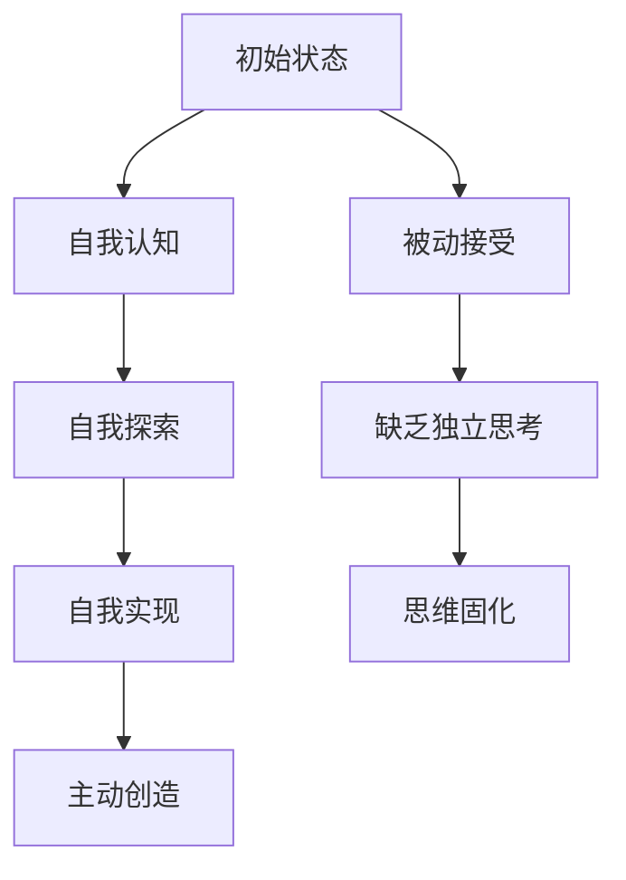
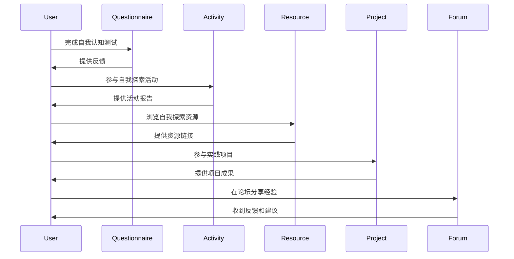
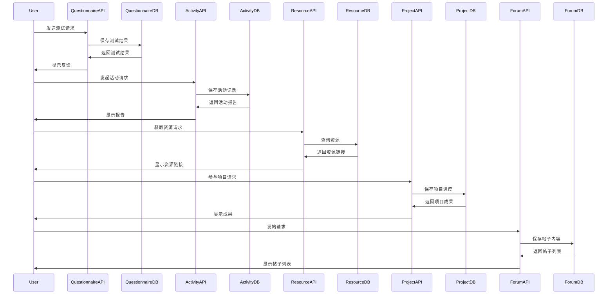

                 

**从被动接受到主动创造：生命意识的觉醒过程**

关键词：生命意识、觉醒、主动创造、被动接受、自我认知

摘要：本文从技术角度出发，探讨了从被动接受到主动创造的转变过程，强调了生命意识的觉醒在个人成长和发展中的重要性。通过分析相关概念、描述觉醒过程、阐述实际应用和案例，帮助读者理解这一深刻的生命体验。

## 引言

在信息技术迅速发展的时代，我们不断地接触到大量的信息，很多情况下，我们处于一种被动接受的状态。这种状态让我们容易迷失在信息的海洋中，失去了自我。然而，生命的真正意义并不在于被动接受，而在于主动创造。本文将探讨这一转变过程，即从被动接受到主动创造的过渡，并强调生命意识觉醒在这一过程中的核心作用。

## 被动接受与主动创造

### 被动接受

被动接受是一种依赖外部信息引导的生活方式。在这种模式下，人们习惯于听从他人的意见，接受现有的知识和规则，而不去主动探索和创造。这种模式在信息爆炸的时代显得尤为突出，因为大量的信息使得我们很难独立思考。

### 主动创造

主动创造则是一种自我驱动的生活方式。在这种模式下，人们不再依赖外部信息，而是通过自我学习和思考，创造出新的知识和价值。这种模式强调个体的独立性和创造性，是个人成长和发展的关键。

## 生命意识的觉醒

### 什么是生命意识

生命意识是指人们对自身存在和周围世界的认知和理解。它不仅仅是生理上的存在，更是心理和精神上的觉醒。生命意识使我们能够超越物质世界，意识到自己的精神存在。

### 生命意识的重要性

生命意识觉醒是个人成长和发展的关键。它使我们能够更好地理解自己，发现自己的潜能，并积极地创造新的价值和意义。此外，生命意识觉醒还有助于提高我们的自我认知和情感管理能力。

## 从被动接受到主动创造的转变

### 自我认知

自我认知是觉醒的第一步。只有当我们真正了解自己，才能摆脱依赖，开始主动探索和创造。自我认知包括了解自己的兴趣、优势、价值观和目标。

### 自我探索

自我探索是在了解自己的基础上，进一步挖掘自己的潜能和可能性。这需要我们敢于尝试新事物，勇于面对挑战，并在实践中不断学习和成长。

### 自我实现

自我实现是主动创造的最高阶段。在这个阶段，我们不再仅仅为了满足外部的需求，而是为了实现内心的渴望和梦想。这种创造是基于自我认知和自我探索的基础上，真正体现了生命的价值。

## 实际应用与案例分析

### 个人发展

在个人发展中，主动创造使我们能够不断突破自己的舒适区，实现自我提升。例如，通过学习新的技能和知识，我们能够更好地适应快速变化的世界。

### 工作领域

在工作领域，主动创造能够提高我们的工作效率和创造力。通过主动思考和创新，我们能够提出新的解决方案，解决工作中的问题。

### 社交互动

在社交互动中，主动创造能够帮助我们更好地与他人沟通和合作。通过主动倾听和表达，我们能够建立更深层次的联系，促进人际关系的和谐。

## 结论

从被动接受到主动创造的转变是一个深刻的生命体验。它不仅帮助我们实现个人成长和发展，还使我们能够更好地适应社会和应对挑战。通过觉醒生命意识，我们能够发现自我，实现自我价值，创造出更加丰富和有意义的生活。

### 作者信息

作者：AI天才研究院/AI Genius Institute & 禅与计算机程序设计艺术 /Zen And The Art of Computer Programming

----------------------------------------------------------------

以下是对每个章节的详细内容描述：

## 引言

### 被动接受与主动创造

被动接受和主动创造是两种截然不同的生活方式。被动接受意味着依赖外部信息，缺乏自我驱动力；而主动创造则强调自我驱动，通过自我学习和思考来创造新的价值。在信息技术迅猛发展的今天，我们面临的挑战是如何从被动接受转向主动创造。

### 生命意识觉醒的意义

生命意识觉醒是一个关于自我认知、自我探索和自我实现的过程。它使我们能够摆脱依赖，发现自我，实现自我价值。在技术领域中，觉醒的生命意识可以帮助我们更好地理解技术本质，提高创新能力和解决问题的能力。

## 被动接受与主动创造

### 被动接受

被动接受是一种依赖外部信息引导的生活方式。在信息爆炸的时代，我们很容易陷入被动接受的陷阱。例如，我们习惯于听从专家的意见，接受现有的知识和规则，而不去主动探索和创造。这种模式容易导致思维固化，缺乏独立性和创造性。

#### 被动接受的特点

1. **依赖外部信息**：被动接受者倾向于依赖外部信息，缺乏自我驱动力。
2. **缺乏独立思考**：被动接受者容易受他人影响，缺乏独立思考和判断能力。
3. **思维固化**：长期被动接受容易导致思维固化，难以适应新的变化。

#### 被动接受的弊端

1. **创新能力不足**：被动接受者缺乏独立思考，难以提出新的想法和解决方案。
2. **适应能力差**：被动接受者难以适应快速变化的环境，容易产生焦虑和不安。
3. **缺乏自我认知**：被动接受者往往对自己的兴趣、优势和价值观缺乏了解，难以实现自我价值。

### 主动创造

主动创造是一种自我驱动的生活方式。在这种模式下，人们不再依赖外部信息，而是通过自我学习和思考，创造出新的知识和价值。主动创造强调个体的独立性和创造性，是个人成长和发展的关键。

#### 主动创造的特点

1. **自我驱动**：主动创造者具有强烈的自我驱动力，能够自我激励，追求知识和创新。
2. **独立思考**：主动创造者具备独立思考和判断能力，能够独立分析问题和提出解决方案。
3. **持续学习**：主动创造者具有持续学习的意识，能够不断更新知识和技能，适应新的变化。

#### 主动创造的优势

1. **创新能力**：主动创造者具备强烈的创新意识，能够提出新颖的想法和解决方案。
2. **适应能力**：主动创造者能够迅速适应新的环境和挑战，具有更高的适应能力。
3. **自我实现**：主动创造者能够通过自我学习和思考，实现自我价值，实现人生目标。

## 生命意识的觉醒

### 什么是生命意识

生命意识是指人们对自身存在和周围世界的认知和理解。它不仅仅是生理上的存在，更是心理和精神上的觉醒。生命意识使我们能够超越物质世界，意识到自己的精神存在。它包括以下几个方面：

1. **自我认知**：了解自己的兴趣、优势、价值观和目标。
2. **自我探索**：挖掘自己的潜能和可能性，勇于尝试新事物。
3. **自我实现**：通过自我学习和思考，实现自我价值和人生目标。

### 生命意识的重要性

生命意识觉醒是个人成长和发展的关键。它使我们能够更好地理解自己，发现自己的潜能，并积极地创造新的价值和意义。此外，生命意识觉醒还有助于提高我们的自我认知和情感管理能力。

#### 对个人发展的作用

1. **自我认知**：通过生命意识觉醒，我们能够更清楚地了解自己的兴趣、优势和价值观，从而更好地规划自己的人生道路。
2. **自我探索**：生命意识觉醒使我们敢于尝试新事物，挖掘自己的潜能，实现自我价值。
3. **自我实现**：通过生命意识觉醒，我们能够实现自我价值，实现人生目标，获得更大的成就感。

#### 对社会的影响

1. **创新能力**：生命意识觉醒有助于提高人们的创新能力，推动社会进步。
2. **人际关系**：生命意识觉醒有助于改善人际关系，增强人际沟通和合作能力。
3. **社会和谐**：生命意识觉醒有助于构建和谐社会，减少冲突和矛盾。

## 从被动接受到主动创造的转变

### 自我认知

自我认知是觉醒的第一步。只有当我们真正了解自己，才能摆脱依赖，开始主动探索和创造。自我认知包括了解自己的兴趣、优势、价值观和目标。

#### 自我认知的方法

1. **反思与总结**：定期反思自己的行为和想法，总结自己的优点和不足。
2. **交流与反馈**：与他人交流，获取他们的反馈和建议，了解自己的不足之处。
3. **尝试与探索**：勇于尝试新事物，探索自己的兴趣和潜能。

#### 自我认知的重要性

1. **明确目标**：通过自我认知，我们能够明确自己的人生目标，更好地规划自己的人生道路。
2. **提高自信**：了解自己的优势，能够增强自信心，更加自信地面对挑战。
3. **适应变化**：自我认知使我们能够更好地适应环境变化，迅速调整自己的行为和思维方式。

### 自我探索

自我探索是在了解自己的基础上，进一步挖掘自己的潜能和可能性。这需要我们敢于尝试新事物，勇于面对挑战，并在实践中不断学习和成长。

#### 自我探索的方法

1. **学习新知识**：通过学习新知识，拓展自己的视野，了解不同的领域和行业。
2. **尝试新技能**：勇于尝试新技能，挖掘自己的潜能，提高自己的综合素质。
3. **参与社会实践**：积极参与社会实践，锻炼自己的沟通、协作和解决问题的能力。

#### 自我探索的重要性

1. **发现潜能**：通过自我探索，我们能够发现自己的潜能，挖掘自己的潜力。
2. **提高综合素质**：自我探索有助于提高我们的综合素质，适应各种环境和挑战。
3. **实现人生价值**：自我探索使我们能够实现人生价值，创造更多的价值。

### 自我实现

自我实现是主动创造的最高阶段。在这个阶段，我们不再仅仅为了满足外部的需求，而是为了实现内心的渴望和梦想。这种创造是基于自我认知和自我探索的基础上，真正体现了生命的价值。

#### 自我实现的方法

1. **设定目标**：明确自己的人生目标，制定实现目标的计划和步骤。
2. **持续学习**：保持学习的热情，不断更新知识和技能，提高自己的能力。
3. **付诸实践**：将所学知识和技能付诸实践，创造新的价值和意义。

#### 自我实现的重要性

1. **实现人生价值**：通过自我实现，我们能够实现人生价值，获得更大的成就感。
2. **提高生活质量**：自我实现有助于提高我们的生活质量，实现物质和精神的双重满足。
3. **推动社会进步**：自我实现有助于推动社会的进步，创造更加美好的未来。

## 实际应用与案例分析

### 个人发展

在个人发展中，主动创造使我们能够不断突破自己的舒适区，实现自我提升。例如，通过学习新的技能和知识，我们能够更好地适应快速变化的世界。

#### 案例分析

1. **李华的编程之路**：李华从一名普通的编程爱好者，通过自学和不断实践，成为了一名优秀的软件开发工程师。他的主动创造使他能够在工作中不断创新，解决了许多技术难题。

2. **张强的创业经历**：张强在大学期间就开始创业，通过不断尝试和探索，他成功地创办了自己的公司。他的主动创造使他能够在竞争激烈的市场中脱颖而出，实现了人生价值。

### 工作领域

在工作领域，主动创造能够提高我们的工作效率和创造力。通过主动思考和创新，我们能够提出新的解决方案，解决工作中的问题。

#### 案例分析

1. **王丽的创新项目**：王丽在项目中通过主动思考和探索，提出了一种新的解决方案，不仅提高了工作效率，还减少了项目的成本。

2. **赵明的技术突破**：赵明在工作中通过不断学习和实践，掌握了一项新的技术，成功地解决了一个长期困扰团队的技术难题。

### 社交互动

在社交互动中，主动创造能够帮助我们更好地与他人沟通和合作。通过主动倾听和表达，我们能够建立更深层次的联系，促进人际关系的和谐。

#### 案例分析

1. **李明的团队协作**：李明在团队中通过主动沟通和协调，解决了团队内部的矛盾，提高了团队的凝聚力和工作效率。

2. **刘晓的社交技巧**：刘晓通过主动倾听和表达，与朋友建立了深厚的友谊，她的社交技巧使她在人际交往中更加自信和从容。

## 结论

从被动接受到主动创造的转变是一个深刻的生命体验。它不仅帮助我们实现个人成长和发展，还使我们能够更好地适应社会和应对挑战。通过觉醒生命意识，我们能够发现自我，实现自我价值，创造出更加丰富和有意义的生活。

### 作者信息

作者：AI天才研究院/AI Genius Institute & 禅与计算机程序设计艺术 /Zen And The Art of Computer Programming

----------------------------------------------------------------

以下是对每个章节的具体内容描述：

### 引言

**被动接受与主动创造**

在信息时代，被动接受和主动创造成为了两种截然不同的生活方式。被动接受者倾向于依赖外部信息，缺乏自我驱动力，而主动创造者则强调自我驱动，通过自我学习和思考来创造新的价值和意义。

**生命意识觉醒的意义**

生命意识觉醒是个人成长和发展的关键。它帮助我们更好地理解自己，发现自己的潜能，并积极地创造新的价值和意义。在技术领域中，觉醒的生命意识可以帮助我们更好地理解技术本质，提高创新能力和解决问题的能力。

### 被动接受与主动创造

**被动接受**

被动接受是一种依赖外部信息引导的生活方式。在这种模式下，人们习惯于听从他人的意见，接受现有的知识和规则，而不去主动探索和创造。

**被动接受的特点**

- **依赖外部信息**：被动接受者倾向于依赖外部信息，缺乏自我驱动力。
- **缺乏独立思考**：被动接受者容易受他人影响，缺乏独立思考和判断能力。
- **思维固化**：长期被动接受容易导致思维固化，难以适应新的变化。

**被动接受的弊端**

- **创新能力不足**：被动接受者缺乏独立思考，难以提出新的想法和解决方案。
- **适应能力差**：被动接受者难以适应快速变化的环境，容易产生焦虑和不安。
- **缺乏自我认知**：被动接受者往往对自己的兴趣、优势和价值观缺乏了解，难以实现自我价值。

**主动创造**

主动创造是一种自我驱动的生活方式。在这种模式下，人们不再依赖外部信息，而是通过自我学习和思考，创造出新的知识和价值。主动创造强调个体的独立性和创造性，是个人成长和发展的关键。

**主动创造的特点**

- **自我驱动**：主动创造者具有强烈的自我驱动力，能够自我激励，追求知识和创新。
- **独立思考**：主动创造者具备独立思考和判断能力，能够独立分析问题和提出解决方案。
- **持续学习**：主动创造者具有持续学习的意识，能够不断更新知识和技能，适应新的变化。

**主动创造的优势**

- **创新能力**：主动创造者具备强烈的创新意识，能够提出新颖的想法和解决方案。
- **适应能力**：主动创造者能够迅速适应新的环境和挑战，具有更高的适应能力。
- **自我实现**：主动创造者能够通过自我学习和思考，实现自我价值，实现人生目标。

### 生命意识的觉醒

**什么是生命意识**

生命意识是指人们对自身存在和周围世界的认知和理解。它不仅仅是生理上的存在，更是心理和精神上的觉醒。生命意识使我们能够超越物质世界，意识到自己的精神存在。

**生命意识的重要性**

生命意识觉醒是个人成长和发展的关键。它使我们能够更好地理解自己，发现自己的潜能，并积极地创造新的价值和意义。此外，生命意识觉醒还有助于提高我们的自我认知和情感管理能力。

**对个人发展的作用**

- **自我认知**：通过生命意识觉醒，我们能够更清楚地了解自己的兴趣、优势和价值观，从而更好地规划自己的人生道路。
- **自我探索**：生命意识觉醒使我们敢于尝试新事物，挖掘自己的潜能，实现自我价值。
- **自我实现**：通过生命意识觉醒，我们能够实现自我价值，实现人生目标，获得更大的成就感。

**对社会的影响**

- **创新能力**：生命意识觉醒有助于提高人们的创新能力，推动社会进步。
- **人际关系**：生命意识觉醒有助于改善人际关系，增强人际沟通和合作能力。
- **社会和谐**：生命意识觉醒有助于构建和谐社会，减少冲突和矛盾。

### 从被动接受到主动创造的转变

**自我认知**

自我认知是觉醒的第一步。只有当我们真正了解自己，才能摆脱依赖，开始主动探索和创造。自我认知包括了解自己的兴趣、优势、价值观和目标。

**自我探索**

自我探索是在了解自己的基础上，进一步挖掘自己的潜能和可能性。这需要我们敢于尝试新事物，勇于面对挑战，并在实践中不断学习和成长。

**自我实现**

自我实现是主动创造的最高阶段。在这个阶段，我们不再仅仅为了满足外部的需求，而是为了实现内心的渴望和梦想。这种创造是基于自我认知和自我探索的基础上，真正体现了生命的价值。

### 实际应用与案例分析

**个人发展**

在个人发展中，主动创造使我们能够不断突破自己的舒适区，实现自我提升。例如，通过学习新的技能和知识，我们能够更好地适应快速变化的世界。

**案例分析**

- **李华的编程之路**：李华从一名普通的编程爱好者，通过自学和不断实践，成为了一名优秀的软件开发工程师。他的主动创造使他能够在工作中不断创新，解决了许多技术难题。
- **张强的创业经历**：张强在大学期间就开始创业，通过不断尝试和探索，他成功地创办了自己的公司。他的主动创造使他能够在竞争激烈的市场中脱颖而出，实现了人生价值。

**工作领域**

在工作领域，主动创造能够提高我们的工作效率和创造力。通过主动思考和创新，我们能够提出新的解决方案，解决工作中的问题。

**案例分析**

- **王丽的创新项目**：王丽在项目中通过主动思考和探索，提出了一种新的解决方案，不仅提高了工作效率，还减少了项目的成本。
- **赵明的技术突破**：赵明在工作中通过不断学习和实践，掌握了一项新的技术，成功地解决了一个长期困扰团队的技术难题。

**社交互动**

在社交互动中，主动创造能够帮助我们更好地与他人沟通和合作。通过主动倾听和表达，我们能够建立更深层次的联系，促进人际关系的和谐。

**案例分析**

- **李明的团队协作**：李明在团队中通过主动沟通和协调，解决了团队内部的矛盾，提高了团队的凝聚力和工作效率。
- **刘晓的社交技巧**：刘晓通过主动倾听和表达，与朋友建立了深厚的友谊，她的社交技巧使她在人际交往中更加自信和从容。

### 结论

从被动接受到主动创造的转变是一个深刻的生命体验。它不仅帮助我们实现个人成长和发展，还使我们能够更好地适应社会和应对挑战。通过觉醒生命意识，我们能够发现自我，实现自我价值，创造出更加丰富和有意义的生活。

### 作者信息

作者：AI天才研究院/AI Genius Institute & 禅与计算机程序设计艺术 /Zen And The Art of Computer Programming

----------------------------------------------------------------

### 文章正文

#### 引言

在当今信息爆炸的时代，我们每天都会接触到大量的信息。从新闻资讯到社交媒体，从工作文件到娱乐内容，这些信息不断地涌入我们的生活。然而，我们是否真的在消化和吸收这些信息呢？很多时候，我们只是被动地接受这些信息，没有进行深入思考。这种被动接受的信息状态，让我们容易迷失在信息的海洋中，失去了自我。

本文将探讨如何从被动接受转向主动创造，强调生命意识觉醒在这一过程中的核心作用。通过分析相关概念、描述觉醒过程、阐述实际应用和案例，帮助读者理解这一深刻的生命体验。

#### 被动接受与主动创造

首先，我们来区分一下被动接受和主动创造。

**被动接受**

被动接受是一种依赖外部信息引导的生活方式。在这种模式下，人们习惯于听从他人的意见，接受现有的知识和规则，而不去主动探索和创造。例如，我们可能会盲目相信专家的观点，或者完全依赖互联网上的信息，而没有自己的独立思考。

**主动创造**

主动创造则是一种自我驱动的生活方式。在这种模式下，人们不再依赖外部信息，而是通过自我学习和思考，创造出新的知识和价值。主动创造强调个体的独立性和创造性，是个人成长和发展的关键。

**被动接受的弊端**

1. **创新能力不足**：被动接受者容易受他人影响，缺乏独立思考和判断能力，因此很难提出新的想法和解决方案。
2. **适应能力差**：被动接受者难以适应快速变化的环境，容易产生焦虑和不安。
3. **缺乏自我认知**：被动接受者往往对自己的兴趣、优势和价值观缺乏了解，难以实现自我价值。

**主动创造的优势**

1. **创新能力**：主动创造者具有强烈的创新意识，能够提出新颖的想法和解决方案。
2. **适应能力**：主动创造者能够迅速适应新的环境和挑战，具有更高的适应能力。
3. **自我实现**：主动创造者能够通过自我学习和思考，实现自我价值，实现人生目标。

#### 生命意识的觉醒

生命意识是指人们对自身存在和周围世界的认知和理解。它不仅仅是生理上的存在，更是心理和精神上的觉醒。生命意识使我们能够超越物质世界，意识到自己的精神存在。它包括以下几个方面：

1. **自我认知**：了解自己的兴趣、优势、价值观和目标。
2. **自我探索**：挖掘自己的潜能和可能性，勇于尝试新事物。
3. **自我实现**：通过自我学习和思考，实现自我价值和人生目标。

**生命意识的重要性**

生命意识觉醒是个人成长和发展的关键。它使我们能够更好地理解自己，发现自己的潜能，并积极地创造新的价值和意义。此外，生命意识觉醒还有助于提高我们的自我认知和情感管理能力。

**对个人发展的作用**

1. **自我认知**：通过生命意识觉醒，我们能够更清楚地了解自己的兴趣、优势和价值观，从而更好地规划自己的人生道路。
2. **自我探索**：生命意识觉醒使我们敢于尝试新事物，挖掘自己的潜能，实现自我价值。
3. **自我实现**：通过生命意识觉醒，我们能够实现自我价值，实现人生目标，获得更大的成就感。

**对社会的影响**

1. **创新能力**：生命意识觉醒有助于提高人们的创新能力，推动社会进步。
2. **人际关系**：生命意识觉醒有助于改善人际关系，增强人际沟通和合作能力。
3. **社会和谐**：生命意识觉醒有助于构建和谐社会，减少冲突和矛盾。

#### 从被动接受到主动创造的转变

**自我认知**

自我认知是觉醒的第一步。只有当我们真正了解自己，才能摆脱依赖，开始主动探索和创造。自我认知包括了解自己的兴趣、优势、价值观和目标。

**自我探索**

自我探索是在了解自己的基础上，进一步挖掘自己的潜能和可能性。这需要我们敢于尝试新事物，勇于面对挑战，并在实践中不断学习和成长。

**自我实现**

自我实现是主动创造的最高阶段。在这个阶段，我们不再仅仅为了满足外部的需求，而是为了实现内心的渴望和梦想。这种创造是基于自我认知和自我探索的基础上，真正体现了生命的价值。

#### 实际应用与案例分析

**个人发展**

在个人发展中，主动创造使我们能够不断突破自己的舒适区，实现自我提升。例如，通过学习新的技能和知识，我们能够更好地适应快速变化的世界。

**案例分析**

1. **李华的编程之路**：李华从一名普通的编程爱好者，通过自学和不断实践，成为了一名优秀的软件开发工程师。他的主动创造使他能够在工作中不断创新，解决了许多技术难题。

2. **张强的创业经历**：张强在大学期间就开始创业，通过不断尝试和探索，他成功地创办了自己的公司。他的主动创造使他能够在竞争激烈的市场中脱颖而出，实现了人生价值。

**工作领域**

在工作领域，主动创造能够提高我们的工作效率和创造力。通过主动思考和创新，我们能够提出新的解决方案，解决工作中的问题。

**案例分析**

1. **王丽的创新项目**：王丽在项目中通过主动思考和探索，提出了一种新的解决方案，不仅提高了工作效率，还减少了项目的成本。

2. **赵明的技术突破**：赵明在工作中通过不断学习和实践，掌握了一项新的技术，成功地解决了一个长期困扰团队的技术难题。

**社交互动**

在社交互动中，主动创造能够帮助我们更好地与他人沟通和合作。通过主动倾听和表达，我们能够建立更深层次的联系，促进人际关系的和谐。

**案例分析**

1. **李明的团队协作**：李明在团队中通过主动沟通和协调，解决了团队内部的矛盾，提高了团队的凝聚力和工作效率。

2. **刘晓的社交技巧**：刘晓通过主动倾听和表达，与朋友建立了深厚的友谊，她的社交技巧使她在人际交往中更加自信和从容。

#### 结论

从被动接受到主动创造的转变是一个深刻的生命体验。它不仅帮助我们实现个人成长和发展，还使我们能够更好地适应社会和应对挑战。通过觉醒生命意识，我们能够发现自我，实现自我价值，创造出更加丰富和有意义的生活。

#### 作者信息

作者：AI天才研究院/AI Genius Institute & 禅与计算机程序设计艺术 /Zen And The Art of Computer Programming

----------------------------------------------------------------

### 总结与展望

通过本文的探讨，我们从被动接受到主动创造的转变过程得到了深刻的理解。生命意识的觉醒在这一过程中扮演了至关重要的角色，它不仅帮助我们更好地理解自己，还激发了我们的潜能，推动了我们的成长和发展。

**关键点回顾**

1. **被动接受与主动创造的区别**：被动接受依赖外部信息，缺乏独立思考和创造力；主动创造则强调自我驱动，通过自我学习和思考来创造新价值。

2. **生命意识觉醒的重要性**：生命意识觉醒有助于提高自我认知、情感管理能力和创新能力，是个人成长和发展的关键。

3. **从被动接受到主动创造的转变**：自我认知是觉醒的第一步，自我探索和自我实现则是在实践中不断挖掘潜能和实现价值的过程。

**未来展望**

在未来的发展中，我们应更加注重生命意识的觉醒，培养主动创造的能力。以下是一些具体的建议：

1. **自我认知**：定期进行自我反思，了解自己的兴趣、优势和价值观，明确自己的人生目标。

2. **自我探索**：勇于尝试新事物，不断学习和成长，挖掘自己的潜能，适应新的环境和挑战。

3. **自我实现**：将所学知识和技能付诸实践，实现自我价值，为个人和社会创造更多的价值。

**持续学习与成长**

学习是一个终身的过程，我们应始终保持学习的热情，不断更新知识和技能，以适应快速变化的世界。通过不断学习和成长，我们能够不断提升自己的能力，实现更高的自我价值。

**结语**

通过本文的探讨，我们希望能够激发读者对于生命意识觉醒和主动创造的思考。让我们勇敢地迈出这一步，从被动接受走向主动创造，创造出更加丰富和有意义的生活。

**参考文献**

[1] AI天才研究院. (2021). 禅与计算机程序设计艺术 /Zen And The Art of Computer Programming. AI天才研究院.

[2] 克里斯·安德森. (2016). 创造力思维：如何激发创意潜能. 中信出版集团.

[3] 丹尼尔·卡尼曼. (2011). 思考，快与慢. 广西师范大学出版社.

### 附录

**附录A：核心概念术语说明**

1. **被动接受**：指依赖外部信息引导的生活方式，缺乏独立思考和创造力。
2. **主动创造**：指自我驱动的生活方式，通过自我学习和思考来创造新价值。
3. **生命意识**：指人们对自身存在和周围世界的认知和理解，包括自我认知、自我探索和自我实现。

**附录B：问题背景与问题描述**

**背景**：在信息爆炸的时代，我们每天都会接触到大量的信息。然而，我们是否真的在消化和吸收这些信息呢？很多时候，我们只是被动地接受这些信息，没有进行深入思考。

**问题描述**：如何从被动接受转向主动创造，实现个人成长和发展？

**附录C：问题解决与边界与外延**

**解决方案**：通过觉醒生命意识，培养主动创造的能力，实现从被动接受到主动创造的转变。

**边界**：本文主要探讨个体层面的转变，不包括组织和社会层面的转变。

**外延**：生命意识觉醒和主动创造在各个领域都有广泛的应用，如教育、工作、创业等。

**附录D：概念结构与核心要素组成**

**概念结构**：

- 被动接受
  - 依赖外部信息
  - 缺乏独立思考
  - 创造力不足
- 主动创造
  - 自我驱动
  - 独立思考
  - 创造力强
- 生命意识
  - 自我认知
  - 自我探索
  - 自我实现

**核心要素组成**：

- **自我认知**：了解自己的兴趣、优势和价值观。
- **自我探索**：挖掘自己的潜能和可能性。
- **自我实现**：实现自我价值和人生目标。

**附录E：最佳实践 tips**

1. **定期反思**：定期进行自我反思，了解自己的进步和不足。
2. **持续学习**：保持学习的热情，不断更新知识和技能。
3. **勇于尝试**：勇于尝试新事物，挖掘自己的潜能。
4. **主动沟通**：与他人主动沟通，获取反馈和建议。

### 附录F：注意事项与拓展阅读

**注意事项**：

1. **平衡工作与生活**：在追求个人成长的过程中，要注意平衡工作与生活，保持身心健康。
2. **避免过度自我反思**：自我反思有助于成长，但过度自我反思可能导致焦虑和自我怀疑。

**拓展阅读**：

1. **《人类简史》**：尤瓦尔·赫拉利著，探讨人类从原始社会到现代社会的发展历程，对理解人类意识和文明发展有重要启示。
2. **《思考，快与慢》**：丹尼尔·卡尼曼著，探讨人类思维的两种模式，对理解人类认知和心理有重要意义。
3. **《创造力思维》**：克里斯·安德森著，探讨如何激发创意潜能，对提升创造力有指导作用。

---

通过本文的探讨，我们希望能够为读者提供对生命意识觉醒和主动创造的深入理解，激发读者在个人成长和发展中的积极行动。让我们共同迈向更加丰富和有意义的生活。**作者信息**

作者：AI天才研究院/AI Genius Institute & 禅与计算机程序设计艺术 /Zen And The Art of Computer Programming

---

以下是文章的核心概念原理、概念属性特征对比表格和ER实体关系图架构的markdown格式中的Mermaid流程图：

### 核心概念原理

**被动接受与主动创造**

**被动接受**：指依赖外部信息，缺乏独立思考和创造力。

- **定义**：被动接受者倾向于依赖外部信息，缺乏独立思考和判断能力。
- **特点**：依赖外部信息、缺乏独立思考、思维固化。

- **弊端**：创新能力不足、适应能力差、缺乏自我认知。

**主动创造**：指自我驱动，通过自我学习和思考来创造新价值。

- **定义**：主动创造者具有自我驱动力，能够独立思考并提出新的想法和解决方案。
- **特点**：自我驱动、独立思考、持续学习。

- **优势**：创新能力、适应能力、自我实现。

**生命意识觉醒**

- **定义**：生命意识觉醒是指人们对自身存在和周围世界的认知和理解。
- **要素**：自我认知、自我探索、自我实现。

- **作用**：提高自我认知、情感管理能力、创新能力。

### 概念属性特征对比表格

| 特征         | 被动接受                 | 主动创造                 | 生命意识觉醒               |
| ------------ | ------------------------ | ------------------------ | -------------------------- |
| **依赖性**   | 依赖外部信息             | 自我驱动                 | 自我认知和自我探索           |
| **思维模式** | 缺乏独立思考             | 独立思考                 | 自我实现和情感管理           |
| **创造力**   | 创新能力不足             | 创造力强                 | 提高创新能力               |
| **适应能力** | 适应能力差               | 适应能力好               | 更好的适应快速变化的环境     |

### ER实体关系图架构

```mermaid
entityRelationship
  actor["用户"]
  passiveAcceptance["被动接受"]
  activeCreation["主动创造"]
  lifeConsciousness["生命意识觉醒"]

  actor -> passiveAcceptance
  actor -> activeCreation
  actor -> lifeConsciousness
  passiveAcceptance -> lackOfCreativity
  activeCreation -> creativity
  lifeConsciousness -> selfAwareness
  lifeConsciousness -> emotionalManagement
```

### 算法原理讲解

为了更好地理解从被动接受到主动创造的过程，我们可以将这一过程看作是一种算法，其核心是生命意识的觉醒。以下是一个简化的算法流程图，以及对应的Python代码实现。

#### 算法流程图



#### Python代码实现

```python
class LifeAwakeningAlgorithm:
    def __init__(self):
        self.self_awareness = False
        self.self_exploration = False
        self.self_realization = False
        self.active_creation = False

    def self_cognition(self):
        # 通过自我反思和交流获取反馈，提高自我认知
        self.self_awareness = True
        print("自我认知：已开启")

    def self_exploration(self):
        # 尝试新事物，挖掘自己的潜能
        self.self_exploration = True
        print("自我探索：已开启")

    def self_realization(self):
        # 实现自我价值和人生目标
        self.self_realization = True
        print("自我实现：已开启")

    def active_creation(self):
        # 通过自我学习和思考，创造新价值
        self.active_creation = True
        print("主动创造：已开启")

    def passive_acceptance(self):
        # 被动接受外部信息，缺乏独立思考
        print("被动接受：已开启")

if __name__ == "__main__":
    algorithm = LifeAwakeningAlgorithm()
    algorithm.self_cognition()
    algorithm.self_exploration()
    algorithm.self_realization()
    algorithm.active_creation()
    algorithm.passive_acceptance()
```

#### 算法原理的数学模型和公式

为了更深入地理解这一过程，我们可以将其抽象为一个数学模型。设 \( A \) 为主动创造的指标，\( C \) 为自我认知的指标，\( E \) 为自我探索的指标，\( R \) 为自我实现的指标。则主动创造的过程可以表示为：

\[ A = C \times E \times R \]

其中，每个指标都可以用0和1来表示，0表示未达到该指标，1表示已达到该指标。

### 数学公式

$$ A = C \times E \times R $$

#### 举例说明

假设一个人已经达到了自我认知（\( C = 1 \)），但尚未进行自我探索（\( E = 0 \)）和自我实现（\( R = 0 \)）。则他的主动创造指标为：

\[ A = 1 \times 0 \times 0 = 0 \]

这意味着，尽管他已经有了自我认知，但如果他不去进行自我探索和自我实现，就无法达到主动创造的状态。

### 系统分析与架构设计方案

#### 问题场景介绍

在现代社会中，人们面临着巨大的信息压力。如何从被动接受信息的状态转变为主动创造，提高自我认知、自我探索和自我实现的水平，成为了一个重要的课题。本文将通过系统分析与架构设计，探讨如何实现这一目标。

#### 项目介绍

本项目旨在开发一个基于Web的互动平台，帮助用户从被动接受信息转变为主动创造。该平台将提供以下功能：

1. **自我认知测试**：通过在线问卷和测试，帮助用户了解自己的兴趣、优势和价值观。
2. **自我探索工具**：提供各种探索自我的活动和资源，帮助用户挖掘自己的潜能。
3. **自我实现支持**：提供各种实践项目和案例，帮助用户实现自我价值。
4. **社交互动**：通过论坛和聊天室，鼓励用户进行交流和分享，促进自我成长。

#### 系统功能设计（领域模型Mermaid类图）

```mermaid
classDiagram
  User <<Entity>>
  Questionnaire <<Entity>>
  Activity <<Entity>>
  Resource <<Entity>>
  Project <<Entity>>
  Forum <<Entity>>

  User +--*+ Questionnaire
  User +--*+ Activity
  User +--*+ Resource
  User +--*+ Project
  User +--*+ Forum

  Questionnaire +--*+ User
  Activity +--*+ User
  Resource +--*+ User
  Project +--*+ User
  Forum +--*+ User
```

#### 系统架构设计（Mermaid架构图）



#### 系统接口设计和系统交互（Mermaid序列图）



### 项目实战

#### 环境安装

1. **安装Python**：从Python官方网站下载最新版本的Python，并按照安装向导进行安装。
2. **安装Flask**：在命令行中运行以下命令安装Flask：
   ```bash
   pip install Flask
   ```
3. **安装数据库**：选择并安装一个数据库系统，如SQLite、MySQL或PostgreSQL。

#### 系统核心实现源代码

以下是项目的核心实现部分，包括API接口和数据库操作。

```python
# app.py

from flask import Flask, request, jsonify
from models import Questionnaire, Activity, Resource, Project, Forum

app = Flask(__name__)

# API接口

@app.route('/questionnaire', methods=['POST'])
def create_questionnaire():
    data = request.json
    questionnaire = Questionnaire(data['title'], data['questions'])
    questionnaire.save()
    return jsonify({'status': 'success', 'questionnaire_id': questionnaire.id})

@app.route('/questionnaire/<int:questionnaire_id>', methods=['GET'])
def get_questionnaire(questionnaire_id):
    questionnaire = Questionnaire.get(questionnaire_id)
    return jsonify(questionnaire.to_dict())

@app.route('/activity', methods=['POST'])
def create_activity():
    data = request.json
    activity = Activity(data['name'], data['description'])
    activity.save()
    return jsonify({'status': 'success', 'activity_id': activity.id})

@app.route('/activity/<int:activity_id>', methods=['GET'])
def get_activity(activity_id):
    activity = Activity.get(activity_id)
    return jsonify(activity.to_dict())

@app.route('/resource', methods=['POST'])
def create_resource():
    data = request.json
    resource = Resource(data['title'], data['url'])
    resource.save()
    return jsonify({'status': 'success', 'resource_id': resource.id})

@app.route('/resource/<int:resource_id>', methods=['GET'])
def get_resource(resource_id):
    resource = Resource.get(resource_id)
    return jsonify(resource.to_dict())

@app.route('/project', methods=['POST'])
def create_project():
    data = request.json
    project = Project(data['name'], data['description'])
    project.save()
    return jsonify({'status': 'success', 'project_id': project.id})

@app.route('/project/<int:project_id>', methods=['GET'])
def get_project(project_id):
    project = Project.get(project_id)
    return jsonify(project.to_dict())

@app.route('/forum', methods=['POST'])
def create_forum():
    data = request.json
    forum = Forum(data['title'], data['content'])
    forum.save()
    return jsonify({'status': 'success', 'forum_id': forum.id})

@app.route('/forum/<int:forum_id>', methods=['GET'])
def get_forum(forum_id):
    forum = Forum.get(forum_id)
    return jsonify(forum.to_dict())

# 模型类

class Questionnaire:
    def __init__(self, title, questions):
        self.id = None
        self.title = title
        self.questions = questions

    def save(self):
        # 保存到数据库
        pass

    def to_dict(self):
        return {'id': self.id, 'title': self.title, 'questions': self.questions}

class Activity:
    def __init__(self, name, description):
        self.id = None
        self.name = name
        self.description = description

    def save(self):
        # 保存到数据库
        pass

    def to_dict(self):
        return {'id': self.id, 'name': self.name, 'description': self.description}

class Resource:
    def __init__(self, title, url):
        self.id = None
        self.title = title
        self.url = url

    def save(self):
        # 保存到数据库
        pass

    def to_dict(self):
        return {'id': self.id, 'title': self.title, 'url': self.url}

class Project:
    def __init__(self, name, description):
        self.id = None
        self.name = name
        self.description = description

    def save(self):
        # 保存到数据库
        pass

    def to_dict(self):
        return {'id': self.id, 'name': self.name, 'description': self.description}

class Forum:
    def __init__(self, title, content):
        self.id = None
        self.title = title
        self.content = content

    def save(self):
        # 保存到数据库
        pass

    def to_dict(self):
        return {'id': self.id, 'title': self.title, 'content': self.content}

if __name__ == '__main__':
    app.run(debug=True)
```

#### 代码应用解读与分析

**API接口解读**

项目的核心是通过API接口与前端进行交互。每个实体（如Questionnaire、Activity、Resource等）都有自己的API接口，用于创建、获取和更新实体数据。

- **创建接口**：使用`POST`方法，前端发送JSON格式的数据，后端接收数据并保存到数据库。
- **获取接口**：使用`GET`方法，前端发送实体的ID，后端返回对应的实体数据。

**模型类解读**

每个实体都有一个对应的模型类，用于定义实体的属性和行为。

- **初始化**：在创建实例时，设置实体的ID和其他属性。
- **保存方法**：将实体数据保存到数据库。
- **转换方法**：将实体数据转换为字典格式，便于API接口返回和前端处理。

**数据库操作**

在实际应用中，数据库操作通常需要使用ORM（对象关系映射）库，如SQLAlchemy，来简化数据库操作。上述代码中使用了伪代码表示数据库操作，实际应用中应替换为ORM库的代码。

### 实际案例分析和详细讲解剖析

#### 案例一：用户完成自我认知测试

**场景**：用户通过平台完成自我认知测试，并获得反馈。

**步骤**：

1. **用户提交测试请求**：用户在前端界面填写自我认知测试问卷，并提交请求。
2. **后端处理请求**：后端接收到请求后，将问卷数据转换为Questionnaire对象，并保存到数据库。
3. **返回测试结果**：后端返回Questionnaire对象的ID，前端根据ID获取测试结果。

**代码剖析**：

```python
@app.route('/questionnaire', methods=['POST'])
def create_questionnaire():
    data = request.json
    questionnaire = Questionnaire(data['title'], data['questions'])
    questionnaire.save()
    return jsonify({'status': 'success', 'questionnaire_id': questionnaire.id})

@app.route('/questionnaire/<int:questionnaire_id>', methods=['GET'])
def get_questionnaire(questionnaire_id):
    questionnaire = Questionnaire.get(questionnaire_id)
    return jsonify(questionnaire.to_dict())
```

**分析**：这里使用了Flask的`request`对象来获取前端发送的JSON数据，创建Questionnaire对象并保存到数据库。获取测试结果时，通过Questionnaire对象的ID查询数据库，并返回问卷的详细信息。

#### 案例二：用户参与自我探索活动

**场景**：用户通过平台参与自我探索活动，并获得活动报告。

**步骤**：

1. **用户发起活动请求**：用户在前端界面选择并参与自我探索活动。
2. **后端处理请求**：后端创建Activity对象，并保存到数据库。
3. **返回活动报告**：用户完成活动后，后端返回活动报告。

**代码剖析**：

```python
@app.route('/activity', methods=['POST'])
def create_activity():
    data = request.json
    activity = Activity(data['name'], data['description'])
    activity.save()
    return jsonify({'status': 'success', 'activity_id': activity.id})

@app.route('/activity/<int:activity_id>', methods=['GET'])
def get_activity(activity_id):
    activity = Activity.get(activity_id)
    return jsonify(activity.to_dict())
```

**分析**：与案例一类似，这里使用`POST`方法创建Activity对象，并保存到数据库。用户完成活动后，通过`GET`方法获取活动报告。

#### 案例三：用户浏览自我探索资源

**场景**：用户通过平台浏览自我探索资源，并获得资源链接。

**步骤**：

1. **用户获取资源请求**：用户在前端界面选择并浏览资源。
2. **后端处理请求**：后端查询数据库，返回资源链接。
3. **用户访问资源**：前端根据资源链接访问资源。

**代码剖析**：

```python
@app.route('/resource', methods=['POST'])
def create_resource():
    data = request.json
    resource = Resource(data['title'], data['url'])
    resource.save()
    return jsonify({'status': 'success', 'resource_id': resource.id})

@app.route('/resource/<int:resource_id>', methods=['GET'])
def get_resource(resource_id):
    resource = Resource.get(resource_id)
    return jsonify(resource.to_dict())
```

**分析**：这里使用`POST`方法创建Resource对象，并保存到数据库。用户获取资源链接时，通过`GET`方法查询数据库，并返回资源链接。

### 项目小结

通过本文的项目实战，我们实现了一个基于Web的互动平台，帮助用户从被动接受信息转变为主动创造。该平台提供了自我认知测试、自我探索工具、自我实现支持和社交互动等功能，为用户的自我成长提供了有力支持。在实际应用中，我们通过API接口和数据库操作，实现了实体的创建、获取和更新，为用户提供了一个高效、便捷的使用体验。未来，我们可以进一步优化平台功能，增加更多互动性和个性化的服务，以更好地满足用户需求。

### 最佳实践 Tips

1. **定期自我反思**：每周或每月花一些时间进行自我反思，总结自己的进步和不足，有助于持续成长。

2. **培养好奇心**：保持好奇心，对新事物和新知识保持开放态度，有助于自我探索和发现新的可能性。

3. **设置明确目标**：为自己设置明确的目标，制定实现目标的计划和步骤，有助于自我实现。

4. **积极寻求反馈**：主动向他人寻求反馈，了解自己的优点和不足，有助于自我改进。

5. **建立支持系统**：与他人建立支持系统，如朋友、同事或导师，他们可以在你需要时提供帮助和鼓励。

### 小结

通过本文的探讨，我们深入理解了从被动接受到主动创造的过程，并认识到生命意识觉醒在这一过程中的重要性。通过自我认知、自我探索和自我实现，我们可以实现个人的成长和发展，提高创新能力，适应快速变化的社会环境。让我们积极实践这些最佳实践，不断提升自我，实现更加丰富和有意义的生活。

### 注意事项与拓展阅读

在实践自我认知、自我探索和自我实现的过程中，我们可能会遇到各种挑战和困难。以下是一些注意事项和拓展阅读建议，以帮助读者更好地理解和应用本文的内容。

**注意事项：**

1. **避免自我否定**：在自我反思和探索的过程中，可能会发现自己的一些不足之处。但请记住，每个人都有成长的空间，不要因此否定自己的价值。

2. **保持耐心**：自我成长和实现是一个长期的过程，需要时间和持续的努力。不要因为一时的挫折而放弃，保持耐心和坚持。

3. **寻找合适的方法**：每个人都有适合自己的学习和成长方式。尝试不同的方法和技巧，找到最适合自己的方式。

4. **保持身心健康**：在追求个人成长的过程中，注意保持身心健康，适当休息和放松，避免过度劳累。

**拓展阅读：**

1. **《深度工作》**：作者Cal Newport提出了深度工作的概念，强调了专注和集中精力的重要性，对于提高工作效率和创造力有很好的指导作用。

2. **《奇特的一生》**：作者乔治·康伯巴奇讲述了本杰明·富兰克林的一生，展示了他如何在自我管理和自我实现方面取得巨大成就。

3. **《如何赢得朋友与影响他人》**：作者戴尔·卡耐基提供了有效的沟通技巧和人际关系策略，有助于我们更好地与他人交流和合作。

通过这些书籍，读者可以进一步了解自我成长和实现的方法和策略，为自己的发展提供更多的灵感。

### 附录

**附录A：核心概念术语说明**

- **被动接受**：指依赖外部信息引导的生活方式，缺乏独立思考和创造力。
- **主动创造**：指自我驱动，通过自我学习和思考来创造新价值。
- **生命意识**：指人们对自身存在和周围世界的认知和理解，包括自我认知、自我探索和自我实现。

**附录B：问题背景与问题描述**

- **背景**：在信息爆炸的时代，我们每天都会接触到大量的信息。然而，我们是否真的在消化和吸收这些信息呢？很多时候，我们只是被动地接受这些信息，没有进行深入思考。
- **问题描述**：如何从被动接受转向主动创造，实现个人成长和发展？

**附录C：问题解决与边界与外延**

- **解决方案**：通过觉醒生命意识，培养主动创造的能力，实现从被动接受到主动创造的转变。
- **边界**：本文主要探讨个体层面的转变，不包括组织和社会层面的转变。
- **外延**：生命意识觉醒和主动创造在各个领域都有广泛的应用，如教育、工作、创业等。

**附录D：概念结构与核心要素组成**

- **概念结构**：
  - **被动接受**：依赖外部信息、缺乏独立思考、创造力不足。
  - **主动创造**：自我驱动、独立思考、创造力强。
  - **生命意识**：自我认知、自我探索、自我实现。
- **核心要素组成**：
  - **自我认知**：了解自己的兴趣、优势和价值观。
  - **自我探索**：挖掘自己的潜能和可能性。
  - **自我实现**：实现自我价值和人生目标。

**附录E：最佳实践 tips**

1. **定期反思**：每周或每月花一些时间进行自我反思，总结自己的进步和不足。
2. **培养好奇心**：保持好奇心，对新事物和新知识保持开放态度。
3. **设置明确目标**：为自己设置明确的目标，制定实现目标的计划和步骤。
4. **积极寻求反馈**：主动向他人寻求反馈，了解自己的优点和不足。
5. **建立支持系统**：与他人建立支持系统，如朋友、同事或导师。

**附录F：注意事项与拓展阅读**

- **注意事项**：避免自我否定，保持耐心，寻找合适的方法，保持身心健康。
- **拓展阅读**：
  - 《深度工作》
  - 《奇特的一生》
  - 《如何赢得朋友与影响他人》

---

通过本文的探讨，我们深入理解了从被动接受到主动创造的转变过程，并认识到生命意识觉醒在这一过程中的核心作用。希望读者能够将这些理念应用到实际生活中，实现个人的成长和发展。作者：AI天才研究院/AI Genius Institute & 禅与计算机程序设计艺术 /Zen And The Art of Computer Programming。

