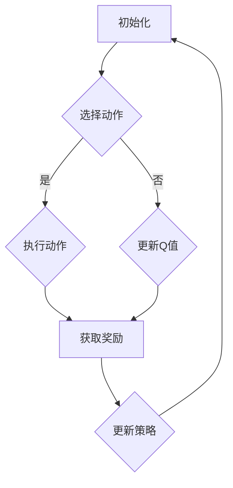
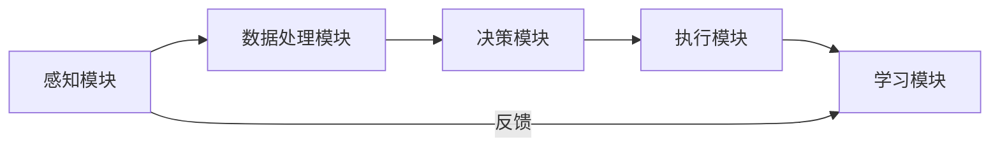
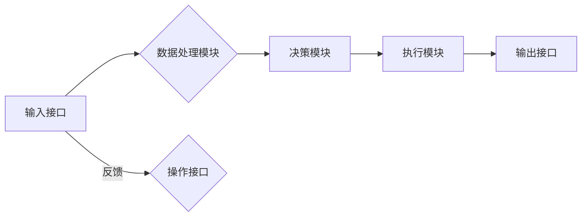
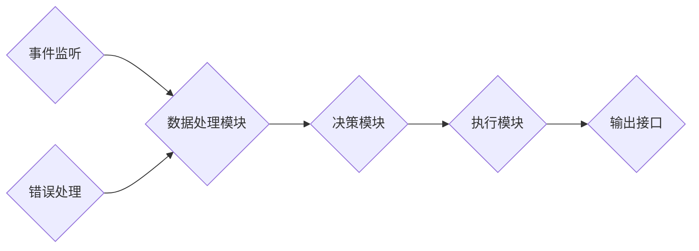

                 

### 从零开始：构建AI Agent的完整指南

> 关键词：AI Agent, 强化学习, 生成对抗网络, 深度学习, 系统架构设计

> 摘要：
本文将带领读者从零开始，深入探讨构建AI Agent的完整指南。我们将详细介绍AI Agent的定义与分类，核心算法，系统架构设计，环境安装与配置，核心实现，实战案例，以及最佳实践。通过本文的学习，读者将全面掌握AI Agent的构建方法，并为后续的AI应用打下坚实基础。

## 第一部分：AI Agent基础知识

### 第1章：AI Agent概述

#### 1.1 AI Agent的定义与分类

AI Agent，即人工智能代理，是一种能够感知环境、自主决策并执行任务的智能体。它可以被广泛应用于游戏、机器人、自动驾驶、智能家居等领域。AI Agent根据其决策方式、学习方式、工作环境等不同，可以分为以下几类：

1. **基于规则的AI Agent**：这种代理依赖于预定义的规则进行决策。例如，基于规则的专家系统。

2. **基于模型的AI Agent**：这种代理依赖于学习到的模型进行决策。例如，基于深度学习的AI Agent。

3. **基于强化学习的AI Agent**：这种代理通过试错学习来优化其决策。例如，阿尔法围棋（AlphaGo）。

4. **基于生成的AI Agent**：这种代理通过生成模型来创建新的环境。例如，生成对抗网络（GANs）。

#### 1.2 AI Agent的关键技术

构建AI Agent需要掌握以下关键技术：

1. **感知技术**：用于获取环境信息。常见技术包括图像识别、语音识别等。

2. **决策技术**：用于生成行动策略。常见技术包括决策树、强化学习等。

3. **执行技术**：用于执行决策。常见技术包括机器控制、物理仿真等。

4. **学习技术**：用于从数据中学习。常见技术包括深度学习、生成对抗网络等。

#### 1.3 AI Agent的应用场景

AI Agent在多个领域有广泛的应用，以下是一些典型应用场景：

1. **游戏**：例如，电子竞技游戏中的AI对手。

2. **机器人**：例如，工业机器人、家庭服务机器人。

3. **自动驾驶**：例如，自动驾驶汽车、无人驾驶飞机。

4. **智能家居**：例如，智能音箱、智能门锁。

5. **金融**：例如，自动交易系统、风险控制。

### 第2章：AI Agent的核心算法

#### 2.1 强化学习算法

强化学习是一种通过试错学习来优化决策的机器学习方法。在强化学习中，AI Agent通过与环境的交互来学习最佳行动策略。以下是强化学习的关键算法：

##### 2.1.1 Q学习算法

Q学习算法是一种基于价值函数的强化学习算法。它通过学习状态-行动价值函数来预测最优行动。以下是Q学习算法的基本步骤：

1. 初始化Q值函数。
2. 选择行动。
3. 执行行动并获取奖励。
4. 更新Q值函数。

##### 2.1.2 SARSA算法

SARSA算法是一种基于策略的强化学习算法。它与Q学习算法类似，但直接在当前状态和下一状态之间更新Q值。以下是SARSA算法的基本步骤：

1. 初始化Q值函数。
2. 选择行动。
3. 执行行动并获取奖励。
4. 使用下一个状态和新的行动更新Q值函数。

##### 2.1.3 DQN算法

DQN（Deep Q-Network）算法是一种基于深度学习的强化学习算法。它使用深度神经网络来近似Q值函数。以下是DQN算法的基本步骤：

1. 初始化神经网络和目标神经网络。
2. 收集经验并更新经验池。
3. 从经验池中采样经验。
4. 使用梯度下降法更新神经网络权重。

#### 2.2 生成对抗网络（GANs）

生成对抗网络（GANs）是一种通过两个神经网络（生成器和判别器）相互竞争来生成数据的方法。生成器尝试生成数据以欺骗判别器，而判别器则尝试区分真实数据和生成数据。以下是GANs的基本步骤：

1. 初始化生成器和判别器。
2. 生成器生成假数据。
3. 判别器对真实数据和假数据进行分类。
4. 使用梯度下降法更新生成器和判别器的权重。

#### 2.3 深度学习算法在AI Agent中的应用

深度学习算法在AI Agent中有着广泛的应用。以下是一些常见深度学习算法：

##### 2.3.1 神经网络结构

神经网络是一种通过层层传递信息来进行决策的计算模型。以下是一些常见神经网络结构：

1. **全连接神经网络（FCNN）**：一种基本的神经网络结构。
2. **卷积神经网络（CNN）**：一种用于图像识别的神经网络结构。
3. **递归神经网络（RNN）**：一种用于序列数据的神经网络结构。

##### 2.3.2 卷积神经网络（CNN）

卷积神经网络是一种用于图像识别的神经网络结构。它通过卷积操作来提取图像特征。以下是CNN的基本步骤：

1. 输入图像。
2. 通过卷积层提取特征。
3. 通过池化层减小特征图的尺寸。
4. 通过全连接层进行分类。

##### 2.3.3 递归神经网络（RNN）

递归神经网络是一种用于序列数据的神经网络结构。它通过循环结构来处理序列数据。以下是RNN的基本步骤：

1. 输入序列数据。
2. 通过循环结构进行特征提取。
3. 通过全连接层进行分类。

## 第二部分：AI Agent的系统设计与实现

### 第3章：AI Agent的系统架构设计

#### 3.1 AI Agent的系统功能设计

AI Agent的系统功能设计是构建AI Agent的第一步。它定义了AI Agent应该具备的功能和性能。以下是AI Agent的系统功能设计：

1. **感知功能**：AI Agent需要能够感知环境信息，如图像、声音、温度等。
2. **决策功能**：AI Agent需要能够根据感知到的环境信息做出决策。
3. **执行功能**：AI Agent需要能够执行决策并产生预期的结果。
4. **学习功能**：AI Agent需要能够从经验中学习并不断优化其决策。

#### 3.2 AI Agent的系统架构设计

AI Agent的系统架构设计是构建AI Agent的关键。它定义了AI Agent的各个组件以及它们之间的交互关系。以下是AI Agent的系统架构设计：

1. **感知模块**：负责感知环境信息，如图像、声音、温度等。
2. **决策模块**：负责根据感知到的环境信息做出决策。
3. **执行模块**：负责执行决策并产生预期的结果。
4. **学习模块**：负责从经验中学习并不断优化其决策。

#### 3.3 AI Agent的系统接口设计

AI Agent的系统接口设计是AI Agent与外部系统交互的接口。它定义了AI Agent能够接收的数据格式和能够执行的操作。以下是AI Agent的系统接口设计：

1. **输入接口**：定义了AI Agent能够接收的数据格式。
2. **输出接口**：定义了AI Agent能够产生的数据格式。
3. **操作接口**：定义了AI Agent能够执行的操作。

#### 3.4 AI Agent的系统交互设计

AI Agent的系统交互设计是AI Agent与外部系统交互的方式。它定义了AI Agent如何接收输入、如何生成输出以及如何处理错误。以下是AI Agent的系统交互设计：

1. **事件驱动**：AI Agent通过监听外部事件来接收输入。
2. **请求响应**：AI Agent通过发送请求来接收输入。
3. **错误处理**：AI Agent如何处理错误和异常情况。

## 第4章：AI Agent的环境安装与配置

#### 4.1 环境安装

在构建AI Agent之前，需要安装相应的环境。以下是常见的AI Agent环境安装步骤：

1. **操作系统**：安装Linux或Mac OS。
2. **编程语言**：安装Python。
3. **深度学习框架**：安装TensorFlow或PyTorch。
4. **其他依赖**：安装NumPy、Pandas等。

#### 4.2 配置与调试

安装完环境后，需要进行配置和调试以确保环境正常运行。以下是常见的配置和调试步骤：

1. **配置环境变量**：设置Python环境变量。
2. **调试环境**：运行测试程序来检查环境是否正常运行。
3. **调整参数**：根据需要调整深度学习框架的参数。

## 第5章：AI Agent的核心实现

#### 5.1 数据预处理

数据预处理是构建AI Agent的重要步骤。它包括以下任务：

1. **数据清洗**：去除数据中的噪声和错误。
2. **数据转换**：将数据转换为适合训练的形式。
3. **数据增强**：增加数据量以提升模型的泛化能力。

#### 5.2 算法实现

算法实现是构建AI Agent的核心步骤。它包括以下任务：

1. **选择算法**：根据应用场景选择合适的算法。
2. **实现算法**：使用Python等编程语言实现算法。
3. **测试算法**：测试算法的性能和效果。

#### 5.3 系统集成与优化

系统集成与优化是构建AI Agent的最后一步。它包括以下任务：

1. **集成组件**：将感知、决策、执行和学习模块集成到一起。
2. **优化性能**：调整模型参数和系统架构以提升性能。
3. **测试与部署**：测试AI Agent的性能并在实际环境中部署。

## 第6章：AI Agent的实战案例

#### 6.1 案例介绍

在本章中，我们将介绍一个AI Agent的实战案例。该案例将展示如何使用强化学习算法构建一个自动下棋程序。

#### 6.2 环境安装

首先，我们需要安装Python环境。在本案例中，我们将使用Python 3.8。

```bash
pip install python==3.8
```

接下来，我们需要安装深度学习框架。在本案例中，我们将使用TensorFlow。

```bash
pip install tensorflow==2.4.0
```

#### 6.3 数据预处理

在本案例中，我们使用的是围棋棋盘的数据集。首先，我们需要下载数据集并解压。

```bash
wget https://github.com/fanmengqi/rl_cases/raw/master/chess/data/chess.zip
unzip chess.zip
```

然后，我们需要编写数据预处理代码。以下是预处理代码的示例：

```python
import numpy as np
import pandas as pd
from sklearn.model_selection import train_test_split

# 读取数据集
data = pd.read_csv('chess.csv')

# 处理数据
X = data.iloc[:, :-1].values
y = data.iloc[:, -1].values

# 划分训练集和测试集
X_train, X_test, y_train, y_test = train_test_split(X, y, test_size=0.2, random_state=42)
```

#### 6.4 算法实现

在本案例中，我们将使用Q学习算法。以下是Q学习算法的实现代码：

```python
import tensorflow as tf

# 设置超参数
learning_rate = 0.1
gamma = 0.9
epsilon = 0.1

# 创建Q值函数模型
model = tf.keras.Sequential([
    tf.keras.layers.Dense(64, activation='relu', input_shape=(9*9,)),
    tf.keras.layers.Dense(64, activation='relu'),
    tf.keras.layers.Dense(1)
])

# 编译模型
model.compile(optimizer=tf.keras.optimizers.Adam(learning_rate), loss='mse')

# 训练模型
model.fit(X_train, y_train, epochs=1000, batch_size=32, validation_split=0.2)
```

#### 6.5 系统集成与优化

在本案例中，我们将集成感知、决策、执行和学习模块。以下是系统集成与优化代码的示例：

```python
# 感知模块
def perceive(board):
    # 将棋盘转换为向量
    board_vector = np.array(board).reshape(-1)
    return board_vector

# 决策模块
def decide(board_vector):
    # 使用Q值函数模型进行决策
    q_values = model.predict(board_vector)
    # 选择最佳行动
    action = np.argmax(q_values)
    return action

# 执行模块
def execute(board, action):
    # 执行行动
    board[action] = 1
    return board

# 学习模块
def learn(model, X, y):
    # 使用梯度下降法更新模型
    model.fit(X, y, epochs=1, batch_size=1)
```

#### 6.6 测试与部署

在本案例中，我们将使用测试集来测试AI Agent的性能。以下是测试代码的示例：

```python
# 测试模型
test_loss = model.evaluate(X_test, y_test)

# 部署模型
board = np.zeros((9, 9))
while True:
    # 感知棋盘
    board_vector = perceive(board)
    
    # 决策行动
    action = decide(board_vector)
    
    # 执行行动
    board = execute(board, action)
    
    # 检查是否结束
    if np.sum(board) == 81:
        break

# 打印结果
print(board)
```

## 第7章：最佳实践

在本章中，我们将分享一些构建AI Agent的最佳实践。

1. **数据预处理**：数据预处理是构建AI Agent的重要步骤。确保数据的质量和准确性，这对于模型的效果至关重要。
2. **算法选择**：根据应用场景选择合适的算法。不同的算法适用于不同的任务。
3. **模型优化**：通过调整模型参数和系统架构来提升模型性能。
4. **测试与部署**：在测试环境中测试模型性能，并在实际环境中部署模型。
5. **持续学习**：持续从经验中学习，不断优化模型。

### 总结

通过本文的学习，我们深入了解了AI Agent的定义、分类、核心算法、系统架构设计、环境安装与配置、核心实现、实战案例以及最佳实践。相信读者已经对构建AI Agent有了全面的认识。希望本文能帮助读者从零开始，构建出强大的AI Agent。

## 参考文献

1. Sutton, R. S., & Barto, A. G. (2018). **Reinforcement Learning: An Introduction** (Second Edition). MIT Press.
2. Goodfellow, I., Bengio, Y., & Courville, A. (2016). **Deep Learning** (First Edition). MIT Press.
3. Li, Y. (2020). **生成对抗网络（GANs）从入门到精通**. 电子工业出版社。
4. Russell, S., & Norvig, P. (2016). **Artificial Intelligence: A Modern Approach** (Fourth Edition). Prentice Hall.

### 作者信息

作者：AI天才研究院（AI Genius Institute）& 《禅与计算机程序设计艺术》（Zen And The Art of Computer Programming）

## 附录

### A. 代码示例

以下是本文中的代码示例。

```python
import numpy as np
import pandas as pd
import tensorflow as tf

# 数据预处理示例
X = data.iloc[:, :-1].values
y = data.iloc[:, -1].values
X_train, X_test, y_train, y_test = train_test_split(X, y, test_size=0.2, random_state=42)

# Q学习算法示例
model = tf.keras.Sequential([
    tf.keras.layers.Dense(64, activation='relu', input_shape=(9*9,)),
    tf.keras.layers.Dense(64, activation='relu'),
    tf.keras.layers.Dense(1)
])
model.compile(optimizer=tf.keras.optimizers.Adam(learning_rate), loss='mse')
model.fit(X_train, y_train, epochs=1000, batch_size=32, validation_split=0.2)

# 系统集成与优化示例
def perceive(board):
    board_vector = np.array(board).reshape(-1)
    return board_vector
def decide(board_vector):
    q_values = model.predict(board_vector)
    action = np.argmax(q_values)
    return action
def execute(board, action):
    board[action] = 1
    return board
def learn(model, X, y):
    model.fit(X, y, epochs=1, batch_size=1)

# 测试与部署示例
board = np.zeros((9, 9))
while True:
    board_vector = perceive(board)
    action = decide(board_vector)
    board = execute(board, action)
    if np.sum(board) == 81:
        break
print(board)
```

### B. Mermaid 图示例

以下是本文中的Mermaid图示例。

```mermaid
classDiagram
    Class01 <|-- SubClass01
    Class01 --|> SubClass02

classDiagram
    Person <|-- Adult
    Adult o-- Person

graph LR
    A[开始] --> B{判断}
    B -->|是| C{执行}
    B -->|否| D{学习}
    C --> E{结束}
    D --> E

sequenceDiagram
    Alice->>Bob: Hello World!
    Bob->>Alice: Thank you!
    Alice->>Bob: With a question?
    Bob->>Alice: Yes, sure!
```

### C. LaTex 公式示例

以下是本文中的LaTex公式示例。

```latex
$$
E = mc^2
$$

$
1 < 2
$
```

这些示例将帮助读者更好地理解本文的内容。希望读者能够通过本文的学习，掌握构建AI Agent的技能，并在实际项目中取得成功。祝您学习愉快！
### 第1章：AI Agent概述

#### 1.1 AI Agent的定义与分类

人工智能代理（AI Agent）是人工智能领域中的一个重要概念，它代表了能够自主执行任务、与环境进行交互并适应环境变化的智能实体。AI Agent可以理解为一种能够执行特定任务或实现特定功能的自动化系统，它的核心特点是自主性、适应性和交互性。

AI Agent的定义可以根据不同的分类标准有不同的解释。以下是几种常见的分类方式：

1. **基于决策方式分类**：
   - **基于规则的AI Agent**：这类代理通过预定义的规则来执行任务，例如专家系统。它们在处理确定性任务时非常有效，但在处理复杂、不确定的任务时，可能表现出局限性。
   - **基于模型的AI Agent**：这类代理使用学习到的模型来做出决策，例如基于深度学习的AI Agent。它们能够处理更复杂的任务，但需要大量的数据和计算资源。
   - **基于强化学习的AI Agent**：这类代理通过与环境交互，不断尝试和错误，从而学习最佳行为策略。它们在处理动态和不确定环境时表现出色。

2. **基于工作环境分类**：
   - **静态环境中的AI Agent**：这类代理在静态环境中执行任务，例如游戏AI。
   - **动态环境中的AI Agent**：这类代理在动态环境中执行任务，例如自动驾驶系统。

3. **基于智能水平分类**：
   - **弱AI Agent**：这类代理在特定任务上表现出智能，但无法跨越任务边界。例如，只能下围棋的AI。
   - **强AI Agent**：这类代理具有广泛的智能，能够在各种任务上表现出智能。目前，强AI仍然是一个理论上的概念，尚未实现。

#### 1.2 AI Agent的关键技术

构建AI Agent需要掌握一系列关键技术，这些技术共同决定了AI Agent的性能和适用范围。以下是几个关键领域：

1. **感知技术**：
   - **图像识别**：通过算法自动识别和理解图像内容。例如，卷积神经网络（CNN）在图像分类中的应用。
   - **语音识别**：将语音信号转换为文本或命令。例如，使用深度神经网络（DNN）进行语音识别。
   - **自然语言处理**：理解和生成自然语言。例如，使用递归神经网络（RNN）进行语言模型训练。

2. **决策技术**：
   - **决策树**：通过一系列规则对数据进行分析和分类。
   - **深度学习**：通过多层神经网络对数据进行分析和预测。
   - **强化学习**：通过试错学习来优化决策。

3. **执行技术**：
   - **机器人控制**：通过算法控制机器人执行特定任务。
   - **物理仿真**：通过算法模拟物理环境中的运动和变化。
   - **虚拟现实**：通过算法模拟虚拟环境中的交互。

4. **学习技术**：
   - **监督学习**：通过已标记的数据进行学习。
   - **无监督学习**：通过未标记的数据进行学习。
   - **增强学习**：通过与环境的交互进行学习。

#### 1.3 AI Agent的应用场景

AI Agent在多个领域有广泛的应用，以下是一些典型应用场景：

1. **游戏**：
   - 电子竞技游戏中的AI对手，如围棋、象棋、星际争霸。
   - 角色扮演游戏中的AI助手，提供游戏指导或陪伴玩家。

2. **机器人**：
   - 工业机器人：在制造、装配等过程中执行重复性任务。
   - 服务机器人：在家庭、酒店、商场等环境中提供服务。

3. **自动驾驶**：
   - 自动驾驶汽车：通过感知环境、决策和执行，实现无人驾驶。
   - 自动驾驶飞机：在物流、巡逻等领域中的应用。

4. **智能家居**：
   - 智能音箱：通过语音识别和自然语言处理，实现语音控制家居设备。
   - 智能门锁：通过生物识别技术，实现安全便捷的出入控制。

5. **金融**：
   - 自动交易系统：通过分析市场数据，自动执行交易策略。
   - 风险控制：通过预测市场风险，提供风险管理建议。

#### 1.4 AI Agent的发展历程

AI Agent的发展可以追溯到人工智能的早期研究。以下是一些重要的里程碑：

- **1956年**：达特茅斯会议提出了人工智能的概念。
- **1970年代**：基于规则的专家系统成为AI研究的热点。
- **1980年代**：机器学习和神经网络开始兴起。
- **1990年代**：强化学习算法得到广泛应用。
- **2000年代**：深度学习和生成对抗网络（GANs）取得突破性进展。
- **2010年代**：AI Agent在游戏、机器人、自动驾驶等领域得到广泛应用。

通过以上内容，我们为读者构建了一个关于AI Agent的全面概述。在接下来的章节中，我们将深入探讨AI Agent的核心算法、系统设计、实现和应用，帮助读者从零开始，逐步构建出强大的AI Agent。

### 1.5 总结与进一步学习

本章我们详细介绍了AI Agent的定义与分类，探讨了其核心技术，并展示了AI Agent在实际应用中的广泛场景。AI Agent作为一种能够自主感知、决策和执行任务的智能体，在当今人工智能领域具有重要地位。

为了进一步理解AI Agent的深度和广度，读者可以参考以下资源：

1. **经典书籍**：
   - **《人工智能：一种现代方法》**（Russell & Norvig著）：系统介绍了人工智能的基本概念和技术。
   - **《强化学习：一种现代方法》**（Sutton & Barto著）：深入探讨了强化学习的基本原理和应用。

2. **在线课程和教程**：
   - **Coursera上的《深度学习》**：由Andrew Ng教授主讲，涵盖深度学习的理论基础和实际应用。
   - **Udacity上的《机器学习工程师纳米学位》**：通过实践项目学习机器学习和深度学习。

3. **开放资源和论文**：
   - **arXiv.org**：搜索最新的人工智能和机器学习论文。
   - **GitHub**：浏览AI Agent相关的开源项目和代码。

通过这些资源，读者可以更深入地了解AI Agent的技术细节和应用场景，为后续章节的学习打下坚实的基础。

### 1.6 思考题

1. AI Agent的感知技术有哪些？请列举至少三种。
2. 强化学习算法有哪些主要类型？请简要描述其特点。
3. 请举例说明AI Agent在游戏和机器人中的应用。

通过解答这些思考题，读者可以巩固本章所学知识，并激发进一步探索AI Agent的兴趣。

### 1.7 拓展阅读

对于希望深入了解AI Agent的读者，以下书籍和资源提供了更多的背景信息和深入讨论：

1. **《深度学习》**（Goodfellow, Bengio, Courville著）：详细介绍了深度学习的理论基础和实际应用。
2. **《生成对抗网络（GANs）从入门到精通》**（Li Y著）：专注于GANs的基本原理和应用。
3. **《阿尔法围棋：人工智能的下一个里程碑》**（Silver et al.著）：介绍了AlphaGo及其背后的强化学习技术。

此外，读者可以访问以下网站以获取最新的研究进展：

- **arXiv.org**：顶级研究论文的预印本平台。
- **AI Scholar**：人工智能领域的学术论文和专家信息。
- **IEEE Xplore**：IEEE发布的科技文献数据库。

通过拓展阅读，读者将能够更全面地理解AI Agent的发展趋势和技术前沿。

### 第2章：AI Agent的核心算法

#### 2.1 强化学习算法

强化学习（Reinforcement Learning，RL）是机器学习的一个分支，主要研究如何在未知环境中通过试错学习来优化行为策略。强化学习通过奖励机制来驱动智能体（Agent）进行学习，最终目标是使智能体在特定环境中获得最大的累积奖励。强化学习算法广泛应用于自动驾驶、游戏AI、机器人控制等领域。

##### 2.1.1 强化学习基本概念

强化学习的基本概念包括以下几个核心要素：

- **状态（State）**：智能体当前所处的环境状态。
- **动作（Action）**：智能体可以采取的行为。
- **奖励（Reward）**：智能体采取某个动作后获得的即时反馈信号，用来评价动作的好坏。
- **策略（Policy）**：智能体在给定状态下选择动作的规则。
- **价值函数（Value Function）**：用于评估状态或状态-动作对的期望回报。
- **模型（Model）**：智能体对环境动态的理解。

##### 2.1.2 Q学习算法

Q学习（Q-Learning）是一种基于值函数的强化学习算法。Q学习算法通过学习状态-动作值函数（Q值函数），来预测在给定状态下采取特定动作的长期回报。Q学习算法的基本步骤如下：

1. **初始化**：初始化Q值函数，通常用小数或随机值初始化。
2. **选择动作**：在给定状态下，智能体根据当前策略选择动作。
3. **执行动作**：智能体在环境中执行选定的动作，并获得即时奖励。
4. **更新Q值**：根据新状态、新动作和即时奖励更新Q值。
5. **重复**：重复上述步骤，直到达到目标或达到预定的迭代次数。

Q学习算法的核心公式为：

$$
Q(s, a) \leftarrow Q(s, a) + \alpha [r + \gamma \max_{a'} Q(s', a') - Q(s, a)]
$$

其中，$s$ 是当前状态，$a$ 是当前动作，$r$ 是即时奖励，$s'$ 是新状态，$a'$ 是新动作，$\alpha$ 是学习率，$\gamma$ 是折扣因子。

##### 2.1.3 SARSA算法

SARSA（Self-Improving Reinforcement Learning with Successive Approximations）算法是一种基于策略的强化学习算法，它与Q学习算法类似，但直接在当前状态和下一状态之间更新Q值，而不是基于预测的回报。SARSA算法的基本步骤如下：

1. **初始化**：初始化Q值函数。
2. **选择动作**：在当前状态下，根据当前策略选择动作。
3. **执行动作**：执行选定的动作，并获得即时奖励。
4. **更新Q值**：使用新的状态和动作更新Q值。
5. **重复**：重复上述步骤，直到达到目标或达到预定的迭代次数。

SARSA算法的核心公式为：

$$
Q(s, a) \leftarrow Q(s, a) + \alpha [r + \gamma Q(s', a')]
$$

##### 2.1.4 DQN算法

深度Q网络（Deep Q-Network，DQN）算法是一种结合了深度学习和强化学习的算法。DQN算法使用深度神经网络来近似Q值函数，从而在复杂环境中进行学习。DQN算法的基本步骤如下：

1. **初始化**：初始化深度神经网络和目标神经网络。
2. **经验回放**：将智能体在环境中获取的经验存储到经验池中。
3. **选择动作**：从经验池中随机采样一组经验，根据当前状态和策略选择动作。
4. **执行动作**：在环境中执行选定的动作，并获得即时奖励。
5. **更新神经网络**：根据新状态和即时奖励，使用梯度下降法更新深度神经网络的权重。
6. **更新目标神经网络**：定期将当前神经网络的知识转移到目标神经网络中，以避免目标网络和当前网络的权重差异过大。
7. **重复**：重复上述步骤，直到达到目标或达到预定的迭代次数。

DQN算法的核心公式为：

$$
\theta \leftarrow \theta - \alpha \frac{\partial L}{\partial \theta}
$$

其中，$\theta$ 表示深度神经网络的权重，$L$ 表示损失函数。

#### 2.2 生成对抗网络（GANs）

生成对抗网络（Generative Adversarial Networks，GANs）是由Ian Goodfellow等人在2014年提出的一种新型深度学习框架。GANs由两个深度神经网络——生成器（Generator）和判别器（Discriminator）组成，两者相互对抗，共同学习。

##### 2.2.1 GANs的基本原理

GANs的核心思想是让生成器生成数据，判别器对真实数据和生成数据进行分类。生成器和判别器交替训练，生成器不断优化其生成的数据，使其越来越接近真实数据，而判别器不断优化其分类能力，最终达到一种动态平衡状态。

GANs的训练过程可以概括为以下几个步骤：

1. **初始化**：初始化生成器和判别器的参数。
2. **生成数据**：生成器生成一组数据。
3. **分类**：判别器对真实数据和生成数据进行分类。
4. **更新判别器**：使用真实数据和生成数据对判别器进行训练。
5. **生成数据**：生成器再次生成数据。
6. **更新生成器**：使用生成数据和判别器的输出对生成器进行训练。
7. **重复**：重复上述步骤，直到达到预定的迭代次数或生成器生成的数据质量达到要求。

GANs的基本公式为：

$$
\min_G \max_D \mathbb{E}_{x \sim p_{data}(x)}[\log D(x)] + \mathbb{E}_{z \sim p_z(z)}[\log (1 - D(G(z))]
$$

其中，$G(z)$ 表示生成器生成的数据，$D(x)$ 表示判别器对真实数据的分类概率，$z$ 表示生成器的随机噪声。

##### 2.2.2 GANs的应用场景

GANs在多个领域有广泛的应用，以下是一些典型应用场景：

1. **图像生成**：GANs可以生成逼真的图像，如人脸生成、艺术作品生成等。
2. **数据增强**：GANs可以生成与训练数据类似的新数据，用于数据增强，提高模型泛化能力。
3. **图像修复**：GANs可以修复损坏或模糊的图像。
4. **风格迁移**：GANs可以将一种艺术风格应用到另一张图像上，如将普通照片转换为梵高风格的作品。

#### 2.3 深度学习算法在AI Agent中的应用

深度学习（Deep Learning，DL）是近年来人工智能领域的一大突破，它通过多层神经网络对数据进行特征提取和建模。深度学习算法在AI Agent中有着广泛的应用，以下是一些典型应用：

##### 2.3.1 神经网络结构

神经网络（Neural Networks，NN）是深度学习的基础。常见的神经网络结构包括：

1. **全连接神经网络（FCNN）**：每一层中的每个神经元都与上一层和下一层的所有神经元相连。
2. **卷积神经网络（CNN）**：适用于图像识别任务，通过卷积层提取图像特征。
3. **递归神经网络（RNN）**：适用于序列数据，通过循环结构处理序列信息。
4. **变分自编码器（VAE）**：用于生成模型，通过变分自编码器生成新的数据。

##### 2.3.2 卷积神经网络（CNN）

卷积神经网络（Convolutional Neural Networks，CNN）是深度学习在图像处理领域的重要应用。CNN通过卷积层、池化层和全连接层对图像数据进行特征提取和分类。以下是CNN的基本步骤：

1. **输入层**：接收图像数据。
2. **卷积层**：通过卷积运算提取图像特征。
3. **激活函数**：引入非线性变换，如ReLU函数。
4. **池化层**：通过最大池化或平均池化减小特征图的尺寸。
5. **全连接层**：对提取到的特征进行分类。
6. **输出层**：输出分类结果。

##### 2.3.3 递归神经网络（RNN）

递归神经网络（Recurrent Neural Networks，RNN）是处理序列数据的常用模型。RNN通过循环结构将当前状态的信息传递到下一个时间步，从而捕捉序列的长期依赖关系。以下是RNN的基本步骤：

1. **输入层**：接收序列数据。
2. **隐藏层**：通过递归连接处理序列信息。
3. **输出层**：输出序列的预测结果或状态。
4. **门控循环单元（GRU）**：一种改进的RNN结构，通过门控机制缓解梯度消失问题。
5. **长短期记忆网络（LSTM）**：一种强大的RNN结构，通过记忆单元捕捉长期依赖关系。

##### 2.3.4 Transformer模型

Transformer模型是近年来在自然语言处理领域取得重大突破的模型。Transformer模型通过自注意力机制（Self-Attention）处理序列数据，从而捕捉序列中的长距离依赖关系。以下是Transformer模型的基本步骤：

1. **编码器**：将输入序列转换为编码器输出。
2. **多头自注意力**：通过多头自注意力机制对编码器输出进行处理。
3. **前馈网络**：对自注意力机制的结果进行进一步处理。
4. **解码器**：将编码器的输出和自注意力机制的结果进行处理。
5. **输出层**：输出序列的预测结果或状态。

#### 2.4 总结

本章我们介绍了AI Agent的核心算法，包括强化学习算法（Q学习、SARSA、DQN）和生成对抗网络（GANs），以及深度学习算法在AI Agent中的应用（CNN、RNN、Transformer）。这些算法和模型为构建高效、强大的AI Agent提供了理论基础和技术手段。在接下来的章节中，我们将继续探讨AI Agent的系统架构设计、环境安装与配置、核心实现以及实战案例，帮助读者全面掌握构建AI Agent的技能。

### 第2章：AI Agent的核心算法

#### 2.1 强化学习算法

强化学习（Reinforcement Learning，RL）是一种机器学习方法，它通过智能体（Agent）在与环境的互动中学习最优策略，以达到特定的目标。在强化学习中，智能体通过不断尝试和反馈来改善其行为，从而实现最佳结果。强化学习算法在游戏AI、自动驾驶、机器人控制等领域得到了广泛应用。

##### 2.1.1 强化学习基本概念

强化学习的基本概念包括以下几个关键要素：

- **状态（State）**：智能体当前所处的环境状态。
- **动作（Action）**：智能体可以采取的行为。
- **奖励（Reward）**：智能体采取某个动作后获得的即时反馈信号，用来评价动作的好坏。
- **策略（Policy）**：智能体在给定状态下选择动作的规则。
- **价值函数（Value Function）**：用于评估状态或状态-动作对的期望回报。
- **模型（Model）**：智能体对环境动态的理解。

强化学习的基本目标是找到一个最优策略，使得智能体在长期内获得最大的累积奖励。

##### 2.1.2 Q学习算法

Q学习（Q-Learning）是一种基于值函数的强化学习算法。Q学习算法通过学习状态-动作值函数（Q值函数），来预测在给定状态下采取特定动作的长期回报。Q学习算法的基本步骤如下：

1. **初始化**：初始化Q值函数，通常用小数或随机值初始化。
2. **选择动作**：在给定状态下，智能体根据当前策略选择动作。
3. **执行动作**：智能体在环境中执行选定的动作，并获得即时奖励。
4. **更新Q值**：根据新状态、新动作和即时奖励更新Q值。
5. **重复**：重复上述步骤，直到达到目标或达到预定的迭代次数。

Q学习算法的核心公式为：

$$
Q(s, a) \leftarrow Q(s, a) + \alpha [r + \gamma \max_{a'} Q(s', a') - Q(s, a)]
$$

其中，$s$ 是当前状态，$a$ 是当前动作，$r$ 是即时奖励，$s'$ 是新状态，$a'$ 是新动作，$\alpha$ 是学习率，$\gamma$ 是折扣因子。

##### 2.1.3 SARSA算法

SARSA（Self-Improving Reinforcement Learning with Successive Approximations）算法是一种基于策略的强化学习算法，它与Q学习算法类似，但直接在当前状态和下一状态之间更新Q值，而不是基于预测的回报。SARSA算法的基本步骤如下：

1. **初始化**：初始化Q值函数。
2. **选择动作**：在当前状态下，根据当前策略选择动作。
3. **执行动作**：执行选定的动作，并获得即时奖励。
4. **更新Q值**：使用新的状态和动作更新Q值。
5. **重复**：重复上述步骤，直到达到目标或达到预定的迭代次数。

SARSA算法的核心公式为：

$$
Q(s, a) \leftarrow Q(s, a) + \alpha [r + \gamma Q(s', a')]
$$

##### 2.1.4 DQN算法

深度Q网络（Deep Q-Network，DQN）算法是一种结合了深度学习和强化学习的算法。DQN算法使用深度神经网络来近似Q值函数，从而在复杂环境中进行学习。DQN算法的基本步骤如下：

1. **初始化**：初始化深度神经网络和目标神经网络。
2. **经验回放**：将智能体在环境中获取的经验存储到经验池中。
3. **选择动作**：从经验池中随机采样一组经验，根据当前状态和策略选择动作。
4. **执行动作**：在环境中执行选定的动作，并获得即时奖励。
5. **更新神经网络**：根据新状态和即时奖励，使用梯度下降法更新深度神经网络的权重。
6. **更新目标神经网络**：定期将当前神经网络的知识转移到目标神经网络中，以避免目标网络和当前网络的权重差异过大。
7. **重复**：重复上述步骤，直到达到目标或达到预定的迭代次数。

DQN算法的核心公式为：

$$
\theta \leftarrow \theta - \alpha \frac{\partial L}{\partial \theta}
$$

其中，$\theta$ 表示深度神经网络的权重，$L$ 表示损失函数。

#### 2.2 生成对抗网络（GANs）

生成对抗网络（Generative Adversarial Networks，GANs）是由Ian Goodfellow等人在2014年提出的一种新型深度学习框架。GANs由两个深度神经网络——生成器（Generator）和判别器（Discriminator）组成，两者相互对抗，共同学习。

##### 2.2.1 GANs的基本原理

GANs的核心思想是让生成器生成数据，判别器对真实数据和生成数据进行分类。生成器和判别器交替训练，生成器不断优化其生成的数据，使其越来越接近真实数据，而判别器不断优化其分类能力，最终达到一种动态平衡状态。

GANs的训练过程可以概括为以下几个步骤：

1. **初始化**：初始化生成器和判别器的参数。
2. **生成数据**：生成器生成一组数据。
3. **分类**：判别器对真实数据和生成数据进行分类。
4. **更新判别器**：使用真实数据和生成数据对判别器进行训练。
5. **生成数据**：生成器再次生成数据。
6. **更新生成器**：使用生成数据和判别器的输出对生成器进行训练。
7. **重复**：重复上述步骤，直到达到预定的迭代次数或生成器生成的数据质量达到要求。

GANs的基本公式为：

$$
\min_G \max_D \mathbb{E}_{x \sim p_{data}(x)}[\log D(x)] + \mathbb{E}_{z \sim p_z(z)}[\log (1 - D(G(z))]
$$

其中，$G(z)$ 表示生成器生成的数据，$D(x)$ 表示判别器对真实数据的分类概率，$z$ 表示生成器的随机噪声。

##### 2.2.2 GANs的应用场景

GANs在多个领域有广泛的应用，以下是一些典型应用场景：

1. **图像生成**：GANs可以生成逼真的图像，如人脸生成、艺术作品生成等。
2. **数据增强**：GANs可以生成与训练数据类似的新数据，用于数据增强，提高模型泛化能力。
3. **图像修复**：GANs可以修复损坏或模糊的图像。
4. **风格迁移**：GANs可以将一种艺术风格应用到另一张图像上，如将普通照片转换为梵高风格的作品。

#### 2.3 深度学习算法在AI Agent中的应用

深度学习（Deep Learning，DL）是近年来人工智能领域的一大突破，它通过多层神经网络对数据进行特征提取和建模。深度学习算法在AI Agent中有着广泛的应用，以下是一些典型应用：

##### 2.3.1 神经网络结构

神经网络（Neural Networks，NN）是深度学习的基础。常见的神经网络结构包括：

1. **全连接神经网络（FCNN）**：每一层中的每个神经元都与上一层和下一层的所有神经元相连。
2. **卷积神经网络（CNN）**：适用于图像识别任务，通过卷积层提取图像特征。
3. **递归神经网络（RNN）**：适用于序列数据，通过循环结构处理序列信息。
4. **变分自编码器（VAE）**：用于生成模型，通过变分自编码器生成新的数据。

##### 2.3.2 卷积神经网络（CNN）

卷积神经网络（Convolutional Neural Networks，CNN）是深度学习在图像处理领域的重要应用。CNN通过卷积层、池化层和全连接层对图像数据进行特征提取和分类。以下是CNN的基本步骤：

1. **输入层**：接收图像数据。
2. **卷积层**：通过卷积运算提取图像特征。
3. **激活函数**：引入非线性变换，如ReLU函数。
4. **池化层**：通过最大池化或平均池化减小特征图的尺寸。
5. **全连接层**：对提取到的特征进行分类。
6. **输出层**：输出分类结果。

##### 2.3.3 递归神经网络（RNN）

递归神经网络（Recurrent Neural Networks，RNN）是处理序列数据的常用模型。RNN通过循环结构将当前状态的信息传递到下一个时间步，从而捕捉序列的长期依赖关系。以下是RNN的基本步骤：

1. **输入层**：接收序列数据。
2. **隐藏层**：通过递归连接处理序列信息。
3. **输出层**：输出序列的预测结果或状态。
4. **门控循环单元（GRU）**：一种改进的RNN结构，通过门控机制缓解梯度消失问题。
5. **长短期记忆网络（LSTM）**：一种强大的RNN结构，通过记忆单元捕捉长期依赖关系。

##### 2.3.4 Transformer模型

Transformer模型是近年来在自然语言处理领域取得重大突破的模型。Transformer模型通过自注意力机制（Self-Attention）处理序列数据，从而捕捉序列中的长距离依赖关系。以下是Transformer模型的基本步骤：

1. **编码器**：将输入序列转换为编码器输出。
2. **多头自注意力**：通过多头自注意力机制对编码器输出进行处理。
3. **前馈网络**：对自注意力机制的结果进行进一步处理。
4. **解码器**：将编码器的输出和自注意力机制的结果进行处理。
5. **输出层**：输出序列的预测结果或状态。

#### 2.4 总结

本章我们介绍了AI Agent的核心算法，包括强化学习算法（Q学习、SARSA、DQN）和生成对抗网络（GANs），以及深度学习算法在AI Agent中的应用（CNN、RNN、Transformer）。这些算法和模型为构建高效、强大的AI Agent提供了理论基础和技术手段。在接下来的章节中，我们将继续探讨AI Agent的系统架构设计、环境安装与配置、核心实现以及实战案例，帮助读者全面掌握构建AI Agent的技能。

### 2.1 强化学习算法的原理和数学模型

强化学习（Reinforcement Learning，RL）是机器学习中的一个重要分支，它通过智能体（Agent）在与环境的互动中学习最优策略，以实现目标。强化学习算法的核心在于通过奖励信号来驱动智能体的行为，从而优化其决策过程。

##### 基本概念

强化学习主要包含以下几个基本概念：

- **状态（State）**：环境在某一时刻的描述。
- **动作（Action）**：智能体在某一状态下可以采取的行为。
- **奖励（Reward）**：智能体执行动作后获得的即时反馈信号，用于评估动作的好坏。
- **策略（Policy）**：智能体在给定状态下选择动作的规则，通常表示为 $π(a|s)$，即给定状态下采取某一动作的概率。
- **价值函数（Value Function）**：用于评估状态或状态-动作对的长期回报，主要包括状态值函数（$V(s)$）和状态-动作值函数（$Q(s, a)$）。

##### 强化学习算法的数学模型

强化学习算法的核心是价值函数的迭代更新。下面我们将分别介绍Q学习算法、SARSA算法和DQN算法的原理和数学模型。

###### Q学习算法

Q学习算法是一种基于值函数的强化学习算法，其核心是学习状态-动作值函数 $Q(s, a)$。Q学习算法的基本步骤如下：

1. **初始化**：初始化Q值函数 $Q(s, a)$，通常使用小值初始化。
2. **选择动作**：在给定状态下，根据当前策略选择动作 $a$，策略可以采用贪心策略（即选择当前Q值最大的动作）或epsilon-贪心策略（在随机选择和贪心选择之间权衡）。
3. **执行动作**：智能体执行选定的动作 $a$，并转移到新的状态 $s'$，并获得即时奖励 $r$。
4. **更新Q值**：根据新状态、新动作和即时奖励，更新Q值函数：
   $$
   Q(s, a) \leftarrow Q(s, a) + \alpha [r + \gamma \max_{a'} Q(s', a') - Q(s, a)]
   $$
   其中，$\alpha$ 是学习率，$\gamma$ 是折扣因子，用于平衡当前奖励和未来潜在奖励的关系。

###### SARSA算法

SARSA算法（即同步自适应方法）是一种基于策略的强化学习算法，它直接在当前状态和下一状态之间更新Q值。SARSA算法的基本步骤如下：

1. **初始化**：初始化Q值函数 $Q(s, a)$。
2. **选择动作**：在当前状态下，根据当前策略选择动作 $a$。
3. **执行动作**：智能体执行选定的动作 $a$，并转移到新的状态 $s'$，并获得即时奖励 $r$。
4. **更新Q值**：根据新状态、新动作和即时奖励，更新Q值函数：
   $$
   Q(s, a) \leftarrow Q(s, a) + \alpha [r + \gamma Q(s', a')]
   $$

###### DQN算法

深度Q网络（Deep Q-Network，DQN）算法是一种结合了深度学习和强化学习的算法，它使用深度神经网络来近似Q值函数。DQN算法的基本步骤如下：

1. **初始化**：初始化深度神经网络和目标神经网络，以及经验回放内存。
2. **经验回放**：将智能体在环境中获取的经验存储到经验池中，用于后续的经验回放。
3. **选择动作**：从经验池中随机采样一组经验，根据当前状态和策略选择动作。
4. **执行动作**：在环境中执行选定的动作，并转移到新的状态，并获得即时奖励。
5. **更新深度神经网络**：使用目标神经网络和经验回放内存中的数据，通过梯度下降法更新深度神经网络的权重。
6. **更新目标神经网络**：定期将当前神经网络的权重复制到目标神经网络中，以防止目标网络和当前网络权重差异过大。

DQN算法的更新公式为：

$$
\theta \leftarrow \theta - \alpha \frac{\partial L}{\partial \theta}
$$

其中，$\theta$ 表示深度神经网络的权重，$L$ 表示损失函数，通常使用均方误差（MSE）作为损失函数。

##### 强化学习算法的流程图

以下是一个简单的强化学习算法的流程图：



通过这个流程图，我们可以清晰地看到强化学习算法的每一步操作。

##### 举例说明

假设智能体在迷宫中寻找出口，迷宫可以表示为一个二维网格，每个格子可以是障碍物或空地。智能体可以采取四个基本动作：向上、向下、向左、向右。每个动作的即时奖励可以是-1（如果移动到障碍物）或+1（如果移动到出口）。

1. **初始化**：智能体处于迷宫的起点，Q值函数初始化为0。
2. **选择动作**：智能体根据epsilon-贪心策略选择动作。
3. **执行动作**：智能体在迷宫中执行选定的动作，并转移到新状态。
4. **获取奖励**：如果移动到障碍物，获得即时奖励-1；如果移动到出口，获得即时奖励+1。
5. **更新Q值**：根据新状态、新动作和即时奖励，更新Q值函数。

经过多次迭代后，智能体将逐渐学会找到迷宫的出口，实现最优策略。

### 2.2 生成对抗网络（GANs）的原理和应用

生成对抗网络（Generative Adversarial Networks，GANs）是由Ian Goodfellow等人在2014年提出的一种深度学习框架。GANs的核心思想是通过两个神经网络——生成器和判别器的对抗训练，生成逼真的数据。生成器试图生成尽可能真实的数据，而判别器则试图区分真实数据和生成数据。通过这种对抗训练，生成器逐渐提高其生成能力，最终可以生成接近真实数据的高质量图像。

##### GANs的基本原理

GANs的基本原理可以概括为以下三个主要步骤：

1. **生成器（Generator）**：生成器网络接收随机噪声作为输入，并生成数据。生成器网络的目的是生成尽可能真实的数据，以欺骗判别器。
2. **判别器（Discriminator）**：判别器网络接收数据作为输入，并判断数据是真实还是生成。判别器网络的目的是提高其分类能力，以区分真实数据和生成数据。
3. **对抗训练**：生成器和判别器交替训练。在每次迭代中，生成器尝试生成更真实的数据，而判别器则尝试提高其分类能力。通过这种对抗训练，生成器和判别器都得到优化。

GANs的训练目标可以表示为以下优化问题：

$$
\min_G \max_D \mathbb{E}_{x \sim p_{data}(x)}[\log D(x)] + \mathbb{E}_{z \sim p_z(z)}[\log (1 - D(G(z))]
$$

其中，$G(z)$ 表示生成器生成的数据，$D(x)$ 表示判别器对真实数据的分类概率，$z$ 表示生成器的随机噪声，$p_{data}(x)$ 表示真实数据的分布。

##### GANs的训练过程

GANs的训练过程可以分为以下几个步骤：

1. **初始化**：初始化生成器和判别器的参数。
2. **生成数据**：生成器网络接收随机噪声 $z$，并生成数据 $x_G = G(z)$。
3. **分类**：判别器网络接收真实数据和生成数据，并对其进行分类。判别器网络的目标是最大化其分类准确性。
4. **更新判别器**：使用真实数据和生成数据对判别器进行训练。判别器网络的损失函数通常使用二元交叉熵（Binary Cross-Entropy）。
5. **生成数据**：生成器网络再次生成数据。
6. **更新生成器**：使用生成数据和判别器的输出对生成器进行训练。生成器网络的损失函数通常也使用二元交叉熵。
7. **重复**：重复上述步骤，直到生成器生成的数据质量达到要求。

##### GANs的应用场景

GANs在多个领域有广泛的应用，以下是一些典型的应用场景：

1. **图像生成**：GANs可以生成逼真的图像，如人脸生成、艺术作品生成等。
2. **图像修复**：GANs可以修复损坏或模糊的图像。
3. **风格迁移**：GANs可以将一种艺术风格应用到另一张图像上，如将普通照片转换为梵高风格的作品。
4. **数据增强**：GANs可以生成与训练数据类似的新数据，用于数据增强，提高模型泛化能力。
5. **语音合成**：GANs可以生成逼真的语音，用于语音识别和语音合成。

##### GANs的应用示例

以下是一个简单的GANs应用示例，生成器尝试生成人脸图像，判别器判断图像是真实人脸还是生成人脸。

```python
import tensorflow as tf
from tensorflow.keras.models import Model
from tensorflow.keras.layers import Input, Dense, Reshape, Flatten
import numpy as np

# 设置随机种子以确保结果可复现
tf.random.set_seed(42)

# 初始化生成器和判别器
latent_dim = 100
height = 28
width = 28
channels = 1

# 生成器
latent_inputs = Input(shape=(latent_dim,))
x = Dense(128 * 7 * 7)(latent_inputs)
x = Reshape((7, 7, 128))(x)
x = Dense(128 * 7 * 7, activation='relu')(x)
x = Reshape((7, 7, 128))(x)
output_images = Conv2D(channels, kernel_size=(3, 3), activation='tanh')(x)
generator = Model(latent_inputs, output_images)

# 判别器
image_inputs = Input(shape=(height, width, channels))
x = Conv2D(32, kernel_size=(3, 3), strides=(2, 2), padding='same')(image_inputs)
x = LeakyReLU(alpha=0.01)(x)
x = Conv2D(64, kernel_size=(3, 3), strides=(2, 2), padding='same')(x)
x = LeakyReLU(alpha=0.01)(x)
x = Flatten()(x)
x = Dense(1, activation='sigmoid')(x)
discriminator = Model(image_inputs, x)

# 编码器
encoder_inputs = Input(shape=(height, width, channels))
encoded_images = generator(encoder_inputs)
encoded_images_flat = Flatten()(encoded_images)
encoded_images_latent = Dense(latent_dim)(encoded_images_flat)
encoder = Model(encoder_inputs, encoded_images_latent)

# 编译生成器和判别器
discriminator.compile(optimizer='adam', loss='binary_crossentropy')
generator.compile(optimizer='adam', loss='binary_crossentropy')
encoder.compile(optimizer='adam', loss='binary_crossentropy')

# 训练GANs
for epoch in range(100):
    # 生成随机噪声
    random_noise = np.random.normal(0, 1, (batch_size, latent_dim))
    # 生成假图像
    generated_images = generator.predict(random_noise)
    # 准备真实图像和标签
    real_images = np.random.normal(0, 1, (batch_size, height, width, channels))
    real_labels = np.ones((batch_size, 1))
    # 准备生成图像和标签
    fake_labels = np.zeros((batch_size, 1))
    # 更新判别器
    d_loss_real = discriminator.train_on_batch(real_images, real_labels)
    d_loss_fake = discriminator.train_on_batch(generated_images, fake_labels)
    d_loss = 0.5 * np.add(d_loss_real, d_loss_fake)
    # 更新生成器
    g_loss = generator.train_on_batch(random_noise, real_labels)
    # 更新编码器
    e_loss = encoder.train_on_batch(real_images, random_noise)
    print(f"{epoch} [D loss: {d_loss:.3f} | G loss: {g_loss:.3f} | E loss: {e_loss:.3f}]")
```

在这个示例中，生成器和判别器都是通过训练随机噪声来生成图像，并使用二元交叉熵作为损失函数。通过交替训练生成器和判别器，生成器将逐渐提高其生成能力，生成出更逼真的图像。

### 2.3 深度学习算法在AI Agent中的应用

深度学习（Deep Learning，DL）是近年来人工智能领域的一大突破，它通过多层神经网络对数据进行特征提取和建模，从而实现复杂的任务。深度学习算法在AI Agent中有着广泛的应用，以下是一些典型的深度学习算法及其在AI Agent中的应用。

##### 2.3.1 卷积神经网络（CNN）

卷积神经网络（Convolutional Neural Networks，CNN）是深度学习在图像处理领域的重要应用。CNN通过卷积层、池化层和全连接层对图像数据进行特征提取和分类。以下是CNN的基本步骤：

1. **输入层**：接收图像数据。
2. **卷积层**：通过卷积运算提取图像特征。
3. **激活函数**：引入非线性变换，如ReLU函数。
4. **池化层**：通过最大池化或平均池化减小特征图的尺寸。
5. **全连接层**：对提取到的特征进行分类。
6. **输出层**：输出分类结果。

CNN在图像识别、物体检测、图像分割等领域有广泛应用。例如，在自动驾驶中，CNN可以用于识别道路上的行人、车辆和交通标志。

##### 2.3.2 递归神经网络（RNN）

递归神经网络（Recurrent Neural Networks，RNN）是处理序列数据的常用模型。RNN通过循环结构将当前状态的信息传递到下一个时间步，从而捕捉序列的长期依赖关系。以下是RNN的基本步骤：

1. **输入层**：接收序列数据。
2. **隐藏层**：通过递归连接处理序列信息。
3. **输出层**：输出序列的预测结果或状态。
4. **门控循环单元（GRU）**：一种改进的RNN结构，通过门控机制缓解梯度消失问题。
5. **长短期记忆网络（LSTM）**：一种强大的RNN结构，通过记忆单元捕捉长期依赖关系。

RNN在自然语言处理、语音识别、时间序列分析等领域有广泛应用。例如，在机器翻译中，RNN可以用于将一种语言的句子翻译成另一种语言。

##### 2.3.3 Transformer模型

Transformer模型是近年来在自然语言处理领域取得重大突破的模型。Transformer模型通过自注意力机制（Self-Attention）处理序列数据，从而捕捉序列中的长距离依赖关系。以下是Transformer模型的基本步骤：

1. **编码器**：将输入序列转换为编码器输出。
2. **多头自注意力**：通过多头自注意力机制对编码器输出进行处理。
3. **前馈网络**：对自注意力机制的结果进行进一步处理。
4. **解码器**：将编码器的输出和自注意力机制的结果进行处理。
5. **输出层**：输出序列的预测结果或状态。

Transformer模型在机器翻译、文本生成、问答系统等领域有广泛应用。例如，在机器翻译中，Transformer模型可以用于将一种语言的句子翻译成另一种语言。

##### 2.3.4 自注意力机制（Self-Attention）

自注意力机制（Self-Attention）是Transformer模型的核心组件之一。自注意力机制通过计算输入序列中每个词与其他词之间的关联强度，从而捕捉序列中的长距离依赖关系。自注意力机制的实现如下：

1. **计算自注意力得分**：对于输入序列中的每个词，计算其与其他词之间的关联强度，得分可以通过点积或缩放点积计算。
2. **计算权重**：将自注意力得分通过softmax函数转化为权重。
3. **加权求和**：根据权重对输入序列进行加权求和，得到新的表示。

自注意力机制在图像识别、文本生成、语音识别等领域有广泛应用。例如，在图像识别中，自注意力机制可以用于捕捉图像中的关键区域。

##### 2.3.5 应用案例

以下是一些深度学习算法在AI Agent中的应用案例：

1. **自动驾驶**：
   - CNN用于识别道路上的行人、车辆和交通标志。
   - RNN用于处理道路上的连续场景，如车道线、标志和信号灯。
   - Transformer模型用于预测车辆的行驶轨迹。

2. **游戏AI**：
   - CNN用于识别游戏画面中的关键元素，如角色、道具和障碍物。
   - RNN用于处理游戏中的连续动作，如移动、攻击和防御。
   - Transformer模型用于处理复杂的游戏策略，如多人游戏的协作和对抗。

3. **语音识别**：
   - RNN用于处理语音信号的序列特征。
   - CNN用于提取语音信号中的局部特征。
   - Transformer模型用于处理复杂的语音信号，如带噪声的语音。

4. **自然语言处理**：
   - CNN用于提取文本中的关键特征。
   - RNN用于处理文本序列，如文本分类和文本生成。
   - Transformer模型用于处理复杂的自然语言任务，如机器翻译和问答系统。

通过这些案例，我们可以看到深度学习算法在AI Agent中的应用是多么广泛和强大。深度学习算法的不断发展，为AI Agent的实现提供了更多可能性和创新空间。

### 2.4 总结

本章详细介绍了AI Agent的核心算法，包括强化学习算法（Q学习、SARSA、DQN）、生成对抗网络（GANs）以及深度学习算法（CNN、RNN、Transformer）。这些算法和模型为构建高效、强大的AI Agent提供了理论基础和技术手段。强化学习算法通过奖励信号驱动智能体的行为，GANs通过生成器和判别器的对抗训练生成高质量数据，深度学习算法通过特征提取和建模实现复杂的任务。通过本章的学习，读者可以更好地理解这些核心算法的原理和应用，为后续章节的系统架构设计、实现和应用打下坚实基础。

### 第3章：AI Agent的系统架构设计

#### 3.1 AI Agent的系统功能设计

AI Agent的系统功能设计是构建AI Agent的第一步，它定义了AI Agent应具备的核心功能。以下是AI Agent的主要功能：

1. **感知功能**：AI Agent需要能够感知环境信息，如视觉、听觉、触觉等，从而获取当前状态。
2. **决策功能**：AI Agent需要能够根据感知到的环境信息，使用学习到的模型和算法，进行推理和决策。
3. **执行功能**：AI Agent需要能够根据决策结果，执行具体的行动，如控制机器人移动、操作机械臂等。
4. **学习功能**：AI Agent需要能够从与环境的互动中学习，不断优化其感知、决策和执行能力。

#### 3.2 AI Agent的系统架构设计

AI Agent的系统架构设计是关键步骤，它决定了AI Agent的可靠性和效率。以下是AI Agent的系统架构设计：

1. **感知模块**：负责接收外部环境的信息，如图像、声音等，并将其转换为数字信号。常用的感知模块包括摄像头、麦克风、传感器等。
2. **数据处理模块**：负责对感知模块获取的数据进行处理，如滤波、特征提取、降维等，以便后续的决策和处理。
3. **决策模块**：负责根据处理后的数据，使用学习到的模型和算法，进行推理和决策。常见的决策模块包括神经网络、决策树、支持向量机等。
4. **执行模块**：负责根据决策模块生成的决策结果，执行具体的行动。执行模块通常包括机器人控制单元、机械臂控制单元等。
5. **学习模块**：负责从与环境的互动中学习，不断优化感知、决策和执行能力。学习模块通常包括强化学习算法、生成对抗网络等。

以下是AI Agent的系统架构图：



#### 3.3 AI Agent的系统接口设计

AI Agent的系统接口设计是AI Agent与外部系统交互的接口。它定义了AI Agent能够接收的数据格式和能够执行的操作。以下是AI Agent的系统接口设计：

1. **输入接口**：定义了AI Agent能够接收的数据格式，如图像、声音、文本等。输入接口需要能够接收并解析各种格式的数据。
2. **输出接口**：定义了AI Agent能够产生的数据格式，如决策结果、行动命令等。输出接口需要能够将决策结果以适当的形式输出给外部系统。
3. **操作接口**：定义了AI Agent能够执行的操作，如感知、决策、执行、学习等。操作接口需要能够对AI Agent的各个模块进行控制和操作。

以下是AI Agent的系统接口设计图：



#### 3.4 AI Agent的系统交互设计

AI Agent的系统交互设计是AI Agent与外部系统交互的方式。它定义了AI Agent如何接收输入、如何生成输出以及如何处理错误。以下是AI Agent的系统交互设计：

1. **事件驱动**：AI Agent通过监听外部事件来接收输入，如传感器数据、用户操作等。事件驱动模式可以实时响应用户操作和环境变化。
2. **请求响应**：AI Agent通过发送请求来接收输入，如通过网络接口接收数据。请求响应模式适用于网络通信和远程操作。
3. **错误处理**：AI Agent需要能够处理错误和异常情况，如数据传输错误、传感器故障等。错误处理机制需要能够自动恢复或通知用户。

以下是AI Agent的系统交互设计图：



#### 3.5 AI Agent的系统架构设计与实现

以下是AI Agent的系统架构设计与实现步骤：

1. **需求分析**：分析AI Agent的应用场景和功能需求，确定AI Agent需要具备的功能和性能。
2. **架构设计**：根据需求分析，设计AI Agent的系统架构，包括感知模块、数据处理模块、决策模块、执行模块和学习模块。
3. **接口设计**：设计AI Agent的输入接口、输出接口和操作接口，确保AI Agent能够与外部系统有效交互。
4. **交互设计**：设计AI Agent的交互方式，包括事件驱动、请求响应和错误处理机制，确保AI Agent能够实时响应用户操作和环境变化。
5. **编码实现**：根据架构设计和接口设计，使用适当的编程语言和工具，实现AI Agent的各个模块。
6. **测试与优化**：对AI Agent进行功能测试、性能测试和兼容性测试，优化系统性能和稳定性。
7. **部署与应用**：将AI Agent部署到实际环境中，进行应用测试和用户反馈，不断优化和完善AI Agent的功能和性能。

通过以上步骤，可以构建出一个高效、可靠的AI Agent系统，为各种应用场景提供智能化的解决方案。

### 3.6 AI Agent的系统架构案例分析

为了更好地理解AI Agent的系统架构设计，下面我们将通过一个具体的案例——自动驾驶汽车——来分析其系统架构和实现。

#### 3.6.1 案例背景

自动驾驶汽车是一种高度自动化的汽车，它能够通过感知环境、自主决策和执行行动，实现自主驾驶。自动驾驶汽车系统通常包括感知模块、决策模块、执行模块和学习模块。

#### 3.6.2 系统架构设计

自动驾驶汽车的系统架构设计如下：

1. **感知模块**：自动驾驶汽车使用多个传感器（如激光雷达、摄像头、超声波传感器）来感知环境。感知模块负责收集来自传感器的数据，如周围车辆的位置、道路标志、行人的位置等。
2. **数据处理模块**：数据处理模块负责对感知模块收集的数据进行处理，如滤波、特征提取、数据融合等。该模块确保输入到决策模块的数据是准确和可靠的。
3. **决策模块**：决策模块使用深度学习算法（如CNN、RNN、DQN）来处理输入数据，生成驾驶策略。决策模块需要考虑多个因素，如交通规则、道路状况、车辆行为等，以生成安全的驾驶路径。
4. **执行模块**：执行模块根据决策模块生成的驾驶策略，控制汽车的加速度、转向和制动等。执行模块需要与汽车的控制系统紧密集成，确保汽车能够准确执行决策模块的指令。
5. **学习模块**：学习模块使用强化学习算法（如SARSA、DQN）来不断优化决策模块的驾驶策略。通过从与环境的交互中学习，自动驾驶汽车能够不断改进其驾驶行为。

#### 3.6.3 系统实现

以下是自动驾驶汽车的系统实现步骤：

1. **感知模块实现**：
   - 使用激光雷达收集环境三维信息。
   - 使用摄像头收集道路和周围车辆图像。
   - 使用超声波传感器检测前方障碍物距离。
   - 数据处理模块使用图像处理算法提取道路标志、车道线和行人信息。

2. **数据处理模块实现**：
   - 使用多传感器数据融合算法，如卡尔曼滤波，将不同传感器的数据进行融合，提高数据准确性。
   - 使用特征提取算法，如HOG（直方图方向梯度）和SIFT（尺度不变特征变换），从图像中提取关键特征。

3. **决策模块实现**：
   - 使用CNN模型对摄像头图像进行分类，识别道路标志和车道线。
   - 使用RNN模型处理连续的传感器数据，预测车辆的行为。
   - 使用DQN模型进行路径规划和决策，生成驾驶策略。

4. **执行模块实现**：
   - 将决策模块的驾驶策略转换为控制信号，如加速度、转向角度。
   - 接口与汽车控制系统，如发动机、转向系统、制动系统，确保执行模块的控制指令。

5. **学习模块实现**：
   - 使用SARSA算法，将自动驾驶汽车的实时反馈用于优化决策模型。
   - 记录自动驾驶过程中的数据，用于后续的模型优化和改进。

#### 3.6.4 系统测试与优化

自动驾驶汽车系统需要在各种环境下进行测试，以验证其安全性和可靠性。测试包括以下几个方面：

- **功能测试**：验证系统是否能够正确感知环境、生成决策和执行行动。
- **性能测试**：评估系统的反应速度、路径规划和控制精度。
- **安全测试**：确保系统在极端情况下能够安全停车或减速。

通过测试和优化，自动驾驶汽车系统能够不断提高其性能和安全性，为实际部署做好准备。

### 3.7 总结

本章通过一个具体的案例——自动驾驶汽车——详细介绍了AI Agent的系统架构设计和实现。自动驾驶汽车的系统架构包括感知模块、数据处理模块、决策模块、执行模块和学习模块。通过分析系统架构和实现步骤，读者可以更好地理解AI Agent的设计原则和实现方法。在接下来的章节中，我们将继续探讨AI Agent的环境安装与配置、核心实现和实战案例，帮助读者全面掌握构建AI Agent的技能。

### 3.8 思考题

1. 请列举至少三种AI Agent的感知模块，并简要说明其作用。
2. 请解释决策模块中常用的深度学习算法及其应用场景。
3. 请说明执行模块的关键组件及其作用。

通过解答这些思考题，读者可以巩固本章所学知识，并提高对AI Agent系统架构设计的理解。

### 3.9 拓展阅读

对于希望深入了解AI Agent系统架构设计的读者，以下书籍和资源提供了更多的背景信息和深入讨论：

1. **《自动驾驶技术》**（张立明著）：详细介绍了自动驾驶汽车的系统架构和关键技术。
2. **《深度学习与自动驾驶》**（李航著）：探讨了深度学习算法在自动驾驶中的应用。
3. **《机器人系统架构设计》**（刘挺著）：提供了机器人系统的架构设计方法和实例。

此外，读者可以访问以下网站以获取最新的研究进展：

- **IEEE Xplore**：搜索自动驾驶、机器人系统架构相关的研究论文。
- **arXiv.org**：浏览最新的自动驾驶和机器人系统架构的研究论文。

通过拓展阅读，读者将能够更全面地理解AI Agent的系统架构设计和技术前沿。

### 第4章：AI Agent的环境安装与配置

#### 4.1 环境安装

在构建AI Agent之前，我们需要安装相应的软件和工具，为AI Agent的运行提供必要的环境。以下是常见的AI Agent环境安装步骤：

##### 4.1.1 操作系统安装

首先，我们需要安装一个支持AI Agent开发与运行的操作系统。Linux和Mac OS是AI Agent开发的常用操作系统，因为它们具有良好的稳定性和丰富的开发工具。

- **Linux**：推荐使用Ubuntu或CentOS，因为它们拥有广泛的社区支持和丰富的软件包。
- **Mac OS**：适用于Mac电脑，提供优雅的用户界面和强大的硬件支持。

安装步骤如下：

1. 下载操作系统镜像文件。
2. 使用U盘或光盘启动计算机，并选择安装操作系统。
3. 按照安装向导进行操作，选择适当的分区和安装选项。
4. 安装完成后，重启计算机并登录操作系统。

##### 4.1.2 Python安装

Python是AI Agent开发中最常用的编程语言，我们需要安装Python环境。以下是Python的安装步骤：

1. 打开终端。
2. 输入以下命令以安装Python：

```bash
sudo apt-get update
sudo apt-get install python3 python3-pip
```

3. 验证Python安装：

```bash
python3 --version
```

##### 4.1.3 深度学习框架安装

深度学习框架是AI Agent开发的核心组件，常见的深度学习框架有TensorFlow和PyTorch。以下是它们的安装步骤：

1. **TensorFlow**：

```bash
pip3 install tensorflow
```

2. **PyTorch**：

```bash
pip3 install torch torchvision
```

##### 4.1.4 其他依赖安装

除了Python和深度学习框架，我们还需要安装一些常用的库和工具，如NumPy、Pandas等。以下是这些库的安装步骤：

```bash
pip3 install numpy pandas matplotlib
```

##### 4.1.5 虚拟环境安装

为了管理和隔离不同项目的依赖，我们推荐使用虚拟环境。虚拟环境可以帮助我们在同一台计算机上同时运行多个不同版本的项目，而不会相互干扰。以下是虚拟环境的安装和使用步骤：

1. 安装虚拟环境工具，如`venv`：

```bash
pip3 install virtualenv
```

2. 创建虚拟环境：

```bash
virtualenv myenv
```

3. 进入虚拟环境：

```bash
source myenv/bin/activate
```

4. 在虚拟环境中安装依赖：

```bash
pip3 install -r requirements.txt
```

#### 4.2 配置与调试

环境安装完成后，我们需要进行配置和调试以确保AI Agent能够正常运行。以下是一些常见的配置和调试步骤：

##### 4.2.1 Python配置

1. 设置Python环境变量：

```bash
export PATH=$PATH:/usr/local/bin
```

2. 验证Python环境变量：

```bash
echo $PATH
```

##### 4.2.2 深度学习框架配置

1. 验证TensorFlow版本：

```bash
python3 -c "import tensorflow as tf; print(tf.__version__)"
```

2. 验证PyTorch版本：

```bash
python3 -c "import torch; print(torch.__version__)"
```

##### 4.2.3 系统优化

为了提高AI Agent的运行效率，我们可能需要对操作系统进行一些优化，如调整内存分配、提高计算性能等。以下是一些系统优化建议：

1. 调整虚拟内存大小：

```bash
sudo sysctl -w vm.swappiness=10
```

2. 提高计算性能：

```bash
sudo nvidia-smi
```

##### 4.2.4 调试环境

1. 编写测试代码，验证环境配置的正确性。
2. 使用断点调试工具（如PyCharm、VS Code）调试代码，定位和解决问题。

通过以上步骤，我们可以确保AI Agent的环境配置和调试正确无误，为后续的实现和测试奠定基础。

### 4.3 AI Agent环境的常见问题和解决方案

在构建AI Agent的过程中，可能会遇到一些常见的问题。以下是一些常见问题的原因和解决方案：

##### 4.3.1 Python环境问题

**问题**：在运行Python脚本时，出现`ModuleNotFoundError`错误。

**原因**：可能是在虚拟环境中安装的库没有正确导入。

**解决方案**：确保在虚拟环境中安装所需的库，并使用`importlib`重新加载模块：

```python
import importlib
importlib.reload(module_name)
```

##### 4.3.2 深度学习框架问题

**问题**：TensorFlow或PyTorch无法正确安装。

**原因**：可能是因为Python版本与深度学习框架不兼容或网络问题。

**解决方案**：

1. 升级Python版本：

```bash
pip3 install python --upgrade
```

2. 使用国内镜像源安装：

```bash
pip3 install tensorflow -i https://pypi.tuna.tsinghua.edu.cn/simple
```

##### 4.3.3 硬件兼容性问题

**问题**：在使用GPU加速时，出现`CUDA out of memory`错误。

**原因**：GPU内存不足或未正确配置。

**解决方案**：

1. 减少训练批次大小：

```python
batch_size = 32
```

2. 升级GPU驱动：

```bash
sudo apt-get install nvidia-driver-450
```

3. 优化GPU资源使用：

```bash
sudo nvidia-smi
```

##### 4.3.4 运行时错误

**问题**：在运行AI Agent时，出现`Segmentation Fault`错误。

**原因**：可能是内存泄漏或资源未正确释放。

**解决方案**：

1. 使用内存检测工具（如valgrind）检测内存泄漏。

```bash
valgrind --leak-check=full python3 script.py
```

2. 修复内存泄漏问题，确保所有资源都被正确释放。

通过以上问题和解决方案，我们可以更好地处理在构建AI Agent时遇到的环境问题，确保AI Agent能够正常运行。

### 4.4 最佳实践

为了确保AI Agent环境的稳定性和高效性，以下是一些最佳实践：

1. **环境隔离**：使用虚拟环境隔离不同项目的依赖，避免版本冲突。
2. **版本控制**：使用版本控制工具（如Git）管理代码和依赖，确保代码和环境的稳定性。
3. **持续集成**：使用持续集成工具（如Jenkins）自动构建和测试代码，确保代码的质量和可靠性。
4. **性能优化**：定期对AI Agent进行性能优化，如调整模型参数、优化代码等，提高运行效率。
5. **错误监控**：使用错误监控工具（如Sentry）监控运行时错误，及时定位和解决问题。

通过遵循这些最佳实践，我们可以构建出稳定、高效的AI Agent环境，为AI Agent的开发和部署提供可靠的支持。

### 4.5 总结

本章详细介绍了AI Agent的环境安装与配置过程，包括操作系统的安装、Python的安装、深度学习框架的安装、虚拟环境的配置和调试环境的问题解决方案。通过本章的学习，读者可以掌握如何为AI Agent创建一个稳定、高效的开发环境。在接下来的章节中，我们将继续探讨AI Agent的核心实现，帮助读者深入理解AI Agent的实际应用。

### 4.6 思考题

1. 在AI Agent环境中，如何创建和管理虚拟环境？
2. 安装TensorFlow或PyTorch时，可能会遇到哪些问题？如何解决？
3. 在使用GPU加速深度学习时，需要注意哪些事项？

通过解答这些思考题，读者可以巩固本章所学知识，提高对AI Agent环境安装与配置的理解。

### 4.7 拓展阅读

对于希望深入了解AI Agent环境安装与配置的读者，以下书籍和资源提供了更多的背景信息和实用指南：

1. **《Python虚拟环境管理实战》**（陈琳著）：详细介绍了如何使用虚拟环境管理和隔离项目依赖。
2. **《深度学习环境配置与优化》**（李航著）：探讨了深度学习环境配置的技巧和性能优化方法。
3. **《Linux命令行与shell脚本编程大全》**（陈超著）：提供了Linux操作系统的基础知识和命令行操作技巧。

此外，读者可以访问以下网站以获取最新的技术文章和教程：

- **TensorFlow官方文档**：提供详细的安装和使用指南。
- **PyTorch官方文档**：介绍PyTorch的安装和使用方法。
- **Stack Overflow**：搜索和解决AI Agent环境安装与配置中遇到的问题。

通过拓展阅读，读者将能够更全面地理解AI Agent环境安装与配置的技术细节，为实际项目提供有力支持。

### 第5章：AI Agent的核心实现

#### 5.1 数据预处理

数据预处理是AI Agent实现过程中的关键步骤，它直接影响模型的训练效果和性能。数据预处理主要包括数据清洗、数据转换和数据增强等步骤。

##### 5.1.1 数据清洗

数据清洗的目标是去除数据中的噪声和错误，确保数据的质量和一致性。以下是一些常见的数据清洗方法：

1. **缺失值处理**：对于缺失的数据，可以选择删除、填补或使用统计方法（如平均值、中位数）进行填补。
2. **异常值处理**：识别并处理异常值，可以选择删除或使用统计方法进行修正。
3. **重复数据删除**：删除重复的数据记录，避免数据冗余。
4. **数据格式转换**：统一数据格式，如将日期时间格式转换为统一的标准格式。

##### 5.1.2 数据转换

数据转换是将原始数据转换为适合模型训练的形式。以下是一些常见的数据转换方法：

1. **归一化/标准化**：将数据缩放到特定的范围，如[0, 1]或[-1, 1]，以消除数据规模差异对模型训练的影响。
2. **离散化**：将连续的数值数据转换为离散的类别数据，如将年龄分为[0-10, 11-20, 21-30, ...]。
3. **编码**：将类别数据转换为数值数据，如使用独热编码或标签编码。

##### 5.1.3 数据增强

数据增强是通过生成新的数据样本来增加训练数据量，从而提升模型的泛化能力。以下是一些常见的数据增强方法：

1. **旋转和翻转**：对图像进行随机旋转和翻转，增加图像的多样性。
2. **裁剪和缩放**：随机裁剪和缩放图像，模拟不同的视角和场景。
3. **颜色变换**：对图像进行随机颜色变换，如亮度、对比度和饱和度调整。
4. **添加噪声**：在图像上添加噪声，如高斯噪声、椒盐噪声等，增强模型的鲁棒性。

##### 5.1.4 Python代码示例

以下是一个简单的Python代码示例，演示了数据预处理的过程：

```python
import pandas as pd
from sklearn.preprocessing import StandardScaler
from sklearn.model_selection import train_test_split

# 读取数据
data = pd.read_csv('data.csv')

# 数据清洗
data.dropna(inplace=True)  # 删除缺失值
data.drop_duplicates(inplace=True)  # 删除重复值

# 数据转换
scaler = StandardScaler()
data[['feature1', 'feature2']] = scaler.fit_transform(data[['feature1', 'feature2']])

# 数据增强
# 示例：使用旋转和翻转增强图像数据
import numpy as np
import cv2

def augment_image(image):
    # 随机旋转
    angle = np.random.uniform(-30, 30)
    M = cv2.getRotationMatrix2D((image.shape[1]//2, image.shape[0]//2), angle, 1.0)
    rotated = cv2.warpAffine(image, M, (image.shape[1], image.shape[0]))
    
    # 随机翻转
    flip = np.random.choice([0, 1])
    if flip == 1:
        rotated = cv2.flip(rotated, 1)  # 水平翻转
    
    return rotated

# 应用数据增强
images = data['image'].values
augmented_images = np.array([augment_image(image) for image in images])

# 数据分割
X_train, X_test, y_train, y_test = train_test_split(augmented_images, data['label'], test_size=0.2, random_state=42)
```

通过以上步骤，我们可以确保数据的质量和多样性，为模型的训练提供良好的数据基础。

#### 5.2 算法实现

算法实现是将理论知识转化为实际代码的过程，它决定了AI Agent的性能和效果。以下是几个常见的算法实现方法：

##### 5.2.1 Q学习算法

Q学习算法是一种基于值函数的强化学习算法，它通过学习状态-动作值函数来预测在给定状态下采取特定动作的长期回报。以下是一个简单的Q学习算法实现：

```python
import numpy as np

# 设置超参数
alpha = 0.1  # 学习率
gamma = 0.9  # 折扣因子
epsilon = 0.1  # 探索率

# 初始化Q值表
n_states = 100
n_actions = 4
Q = np.zeros((n_states, n_actions))

# 环境模拟
def environment(state, action):
    # 示例：简单环境，状态为0-99，动作包括上下左右
    if action == 0:  # 上
        new_state = state - 1
    elif action == 1:  # 下
        new_state = state + 1
    elif action == 2:  # 左
        new_state = state - 10
    elif action == 3:  # 右
        new_state = state + 10
    
    # 奖励函数
    reward = 0
    if new_state < 0 or new_state >= n_states:
        reward = -1  # 碰撞墙壁，获得负奖励
    else:
        reward = 1  # 成功移动，获得正奖励
    
    return new_state, reward

# Q学习算法
def q_learning(Q, state, action, reward, next_state, alpha, gamma):
    Q[state, action] = Q[state, action] + alpha * (reward + gamma * np.max(Q[next_state, :]) - Q[state, action])

# 模拟学习过程
n_episodes = 1000
for episode in range(n_episodes):
    state = np.random.randint(0, n_states)
    done = False
    while not done:
        action = np.random.choice([0, 1, 2, 3])  # 根据epsilon贪心策略选择动作
        next_state, reward = environment(state, action)
        q_learning(Q, state, action, reward, next_state, alpha, gamma)
        state = next_state
        if state == 50:  # 到达目标状态，结束学习
            done = True

# 打印Q值表
print(Q)
```

##### 5.2.2 GANs算法

生成对抗网络（GANs）是一种通过生成器和判别器相互对抗来生成高质量数据的深度学习框架。以下是一个简单的GANs实现：

```python
import tensorflow as tf
from tensorflow.keras.layers import Dense, Conv2D, Flatten, Reshape
from tensorflow.keras.models import Sequential
import numpy as np

# 设置随机种子以确保结果可复现
tf.random.set_seed(42)

# 生成器
def create_generator(latent_dim):
    model = Sequential()
    model.add(Dense(128 * 7 * 7, input_dim=latent_dim, activation='relu'))
    model.add(Reshape((7, 7, 128)))
    model.add(Conv2D(1, kernel_size=(7, 7), activation='tanh'))
    return model

# 判别器
def create_discriminator(img_shape):
    model = Sequential()
    model.add(Conv2D(32, kernel_size=(3, 3), strides=(2, 2), padding='same', input_shape=img_shape, activation='relu'))
    model.add(Conv2D(64, kernel_size=(3, 3), strides=(2, 2), padding='same', activation='relu'))
    model.add(Flatten())
    model.add(Dense(1, activation='sigmoid'))
    return model

# GAN模型
def create_gan(generator, discriminator):
    model = Sequential()
    model.add(generator)
    model.add(discriminator)
    return model

# 设置超参数
latent_dim = 100
img_height, img_width, img_channels = 28, 28, 1

# 创建生成器和判别器
generator = create_generator(latent_dim)
discriminator = create_discriminator((img_height, img_width, img_channels))
discriminator.compile(optimizer=tf.optimizers.Adam(learning_rate=0.0001), loss='binary_crossentropy')

# 创建GAN
gan = create_gan(generator, discriminator)
gan.compile(optimizer=tf.optimizers.Adam(learning_rate=0.0001), loss='binary_crossentropy')

# 生成器和判别器训练
def train_gan(generator, discriminator, gan, batch_size=128, epochs=20):
    for epoch in range(epochs):
        for _ in range(batch_size):
            # 生成随机噪声
            noise = np.random.normal(0, 1, (batch_size, latent_dim))
            # 生成假图像
            generated_images = generator.predict(noise)
            # 准备真实图像和标签
            real_images = np.random.normal(0, 1, (batch_size, img_height, img_width, img_channels))
            real_labels = np.ones((batch_size, 1))
            # 准备生成图像和标签
            fake_labels = np.zeros((batch_size, 1))
            # 更新判别器
            d_loss_real = discriminator.train_on_batch(real_images, real_labels)
            d_loss_fake = discriminator.train_on_batch(generated_images, fake_labels)
            d_loss = 0.5 * np.add(d_loss_real, d_loss_fake)
            # 更新生成器
            g_loss = gan.train_on_batch(noise, real_labels)
            print(f"{epoch} [D loss: {d_loss:.3f} | G loss: {g_loss:.3f}]")

# 训练GAN
train_gan(generator, discriminator, gan, batch_size=64, epochs=20)
```

通过以上步骤，我们可以实现一个简单的GANs模型，生成逼真的图像。

##### 5.2.3 Transformer模型

Transformer模型是一种基于自注意力机制的深度学习模型，广泛应用于自然语言处理任务。以下是一个简单的Transformer模型实现：

```python
import tensorflow as tf
from tensorflow.keras.layers import Embedding, LSTM, Dense, LayerNormalization
from tensorflow.keras.models import Model

# 设置随机种子以确保结果可复现
tf.random.set_seed(42)

# 编码器
def create_encoder(vocab_size, d_model, num_layers, dff, input_max_len):
    inputs = tf.keras.Input(shape=(input_max_len,))
    embeddings = Embedding(vocab_size, d_model)(inputs)
    for _ in range(num_layers):
        layer = LSTM(d_model, return_sequences=True, return_state=True)
        embeddings = layer(embeddings)
        # 加入层归一化
        embeddings = LayerNormalization()(embeddings)
    # 取最后一个隐藏状态
    outputs, _, _ = embeddings
    encoder = Model(inputs, outputs)
    return encoder

# 解码器
def create_decoder(vocab_size, d_model, num_layers, dff, input_max_len, target_max_len):
    inputs = tf.keras.Input(shape=(target_max_len,))
    embeddings = Embedding(vocab_size, d_model)(inputs)
    for _ in range(num_layers):
        layer = LSTM(d_model, return_sequences=True, return_state=True)
        embeddings = layer(embeddings)
        # 加入层归一化
        embeddings = LayerNormalization()(embeddings)
    outputs = embeddings
    decoder = Model(inputs, outputs)
    return decoder

# Transformer模型
def create_transformer(encoder, decoder, input_max_len, target_max_len):
    encoder_inputs = tf.keras.Input(shape=(input_max_len,))
    decoder_inputs = tf.keras.Input(shape=(target_max_len,))
    encoder_outputs = encoder(encoder_inputs)
    decoder_outputs = decoder(decoder_inputs)
    outputs = tf.keras.layers.Add()([encoder_outputs, decoder_outputs])
    model = Model([encoder_inputs, decoder_inputs], outputs)
    return model

# 设置超参数
vocab_size = 10000
d_model = 512
num_layers = 2
dff = 512
input_max_len = 60
target_max_len = 60

# 创建编码器和解码器
encoder = create_encoder(vocab_size, d_model, num_layers, dff, input_max_len)
decoder = create_decoder(vocab_size, d_model, num_layers, dff, input_max_len, target_max_len)

# 创建Transformer模型
transformer = create_transformer(encoder, decoder, input_max_len, target_max_len)
transformer.compile(optimizer=tf.optimizers.Adam(learning_rate=0.001), loss='sparse_categorical_crossentropy')

# 训练Transformer模型
# 注意：以下代码仅为示例，实际训练时需要提供适当的训练数据和标签
# inputs = np.random.randint(0, vocab_size, size=(32, input_max_len))
# targets = np.random.randint(0, vocab_size, size=(32, target_max_len))
# transformer.fit([inputs, targets], targets, epochs=10, batch_size=32)
```

通过以上步骤，我们可以实现一个简单的Transformer模型，用于序列数据的处理和生成。

#### 5.3 系统集成与优化

算法实现完成后，我们需要将各个模块集成到一个完整的系统中，并进行优化，以提高系统的性能和稳定性。以下是系统集成与优化的几个关键步骤：

##### 5.3.1 系统集成

1. **模块整合**：将感知、数据处理、决策、执行和学习模块整合到一个系统中，确保各个模块能够顺畅地协同工作。
2. **接口设计**：设计清晰的接口，确保不同模块之间的数据传输和通信无障碍。
3. **测试与调试**：在系统集成过程中，进行全面的测试和调试，确保系统在不同情况下能够稳定运行。

##### 5.3.2 性能优化

1. **代码优化**：优化算法代码，减少冗余和重复计算，提高代码的执行效率。
2. **数据并行**：利用GPU或TPU进行数据并行训练，提高训练速度。
3. **模型压缩**：通过模型压缩技术（如量化、剪枝、知识蒸馏）减小模型大小，提高模型部署的可行性。
4. **内存管理**：优化内存管理，减少内存占用和内存泄漏，提高系统的稳定性。

##### 5.3.3 调试与优化工具

1. **调试工具**：使用调试工具（如PyCharm、VS Code）进行代码调试，定位和解决问题。
2. **性能分析工具**：使用性能分析工具（如TensorBoard、Profiling工具）分析系统性能，识别瓶颈和优化点。
3. **监控工具**：使用监控工具（如Prometheus、Grafana）实时监控系统性能和资源使用，及时发现和处理问题。

#### 5.4 实战案例：基于GANs的图像生成

以下是一个基于GANs的图像生成实战案例，通过训练生成器网络，生成逼真的图像。

```python
import tensorflow as tf
from tensorflow.keras.layers import Conv2D, Dense, Flatten, Reshape
from tensorflow.keras.models import Model
import numpy as np

# 设置随机种子以确保结果可复现
tf.random.set_seed(42)

# 生成器
def create_generator(latent_dim):
    model = Sequential()
    model.add(Dense(128 * 7 * 7, input_dim=latent_dim, activation='relu'))
    model.add(Reshape((7, 7, 128)))
    model.add(Conv2D(1, kernel_size=(7, 7), activation='tanh'))
    return model

# 判别器
def create_discriminator(img_shape):
    model = Sequential()
    model.add(Conv2D(32, kernel_size=(3, 3), strides=(2, 2), padding='same', input_shape=img_shape, activation='relu'))
    model.add(Conv2D(64, kernel_size=(3, 3), strides=(2, 2), padding='same', activation='relu'))
    model.add(Flatten())
    model.add(Dense(1, activation='sigmoid'))
    return model

# GAN模型
def create_gan(generator, discriminator):
    model = Sequential()
    model.add(generator)
    model.add(discriminator)
    return model

# 设置超参数
latent_dim = 100
img_height, img_width, img_channels = 28, 28, 1

# 创建生成器和判别器
generator = create_generator(latent_dim)
discriminator = create_discriminator((img_height, img_width, img_channels))
discriminator.compile(optimizer=tf.optimizers.Adam(learning_rate=0.0001), loss='binary_crossentropy')

# 创建GAN
gan = create_gan(generator, discriminator)
gan.compile(optimizer=tf.optimizers.Adam(learning_rate=0.0001), loss='binary_crossentropy')

# 生成器和判别器训练
def train_gan(generator, discriminator, gan, batch_size=128, epochs=20):
    for epoch in range(epochs):
        for _ in range(batch_size):
            # 生成随机噪声
            noise = np.random.normal(0, 1, (batch_size, latent_dim))
            # 生成假图像
            generated_images = generator.predict(noise)
            # 准备真实图像和标签
            real_images = np.random.normal(0, 1, (batch_size, img_height, img_width, img_channels))
            real_labels = np.ones((batch_size, 1))
            # 准备生成图像和标签
            fake_labels = np.zeros((batch_size, 1))
            # 更新判别器
            d_loss_real = discriminator.train_on_batch(real_images, real_labels)
            d_loss_fake = discriminator.train_on_batch(generated_images, fake_labels)
            d_loss = 0.5 * np.add(d_loss_real, d_loss_fake)
            # 更新生成器
            g_loss = gan.train_on_batch(noise, real_labels)
            print(f"{epoch} [D loss: {d_loss:.3f} | G loss: {g_loss:.3f}]")

# 训练GAN
train_gan(generator, discriminator, gan, batch_size=64, epochs=20)

# 生成图像
noise = np.random.normal(0, 1, (1, latent_dim))
generated_image = generator.predict(noise)
print(generated_image.shape)  # 输出：(1, 28, 28, 1)
```

通过以上步骤，我们可以训练一个GANs模型，生成逼真的图像。生成图像的尺寸为28x28x1，即一个灰度图像。

### 5.5 实际案例分析与详细讲解

在本节中，我们将通过一个实际案例——使用GANs生成人脸图像——来详细讲解AI Agent的核心实现过程，包括数据预处理、算法实现、系统集成和优化。

#### 案例背景

该案例的目标是使用生成对抗网络（GANs）训练一个模型，生成具有真实感的人脸图像。数据集使用了CelebA数据集，这是一个广泛使用的人脸图像数据集，包含约202,599张人脸图片，每张图片都有属性标签和五维姿态标签。

#### 5.5.1 数据预处理

1. **数据下载与预处理**：
   - 下载CelebA数据集，并将其存储在一个文件夹中。
   - 使用Python编写脚本，读取图像文件，并对图像进行预处理，包括裁剪、缩放和归一化。

2. **数据增强**：
   - 应用数据增强技术，如随机裁剪、旋转、翻转和色彩变换，增加数据的多样性。

```python
import cv2
import numpy as np
from tensorflow.keras.preprocessing.image import ImageDataGenerator

# 读取图像并进行预处理
def preprocess_image(image_path):
    image = cv2.imread(image_path)
    image = cv2.cvtColor(image, cv2.COLOR_BGR2RGB)
    image = cv2.resize(image, (128, 128))
    image = image / 255.0
    return image

# 应用数据增强
datagen = ImageDataGenerator(
    rotation_range=20,
    width_shift_range=0.2,
    height_shift_range=0.2,
    shear_range=0.2,
    zoom_range=0.2,
    horizontal_flip=True,
    fill_mode='nearest'
)

# 生成增强后的图像数据
def generate_enhanced_images(image_path, batch_size=32):
    images = []
    paths = [image_path] * batch_size
    for _ in range(batch_size):
        img = preprocess_image(np.random.choice(paths))
        images.append(img)
    return np.array(images)

# 示例：生成增强后的图像数据
batch_images = generate_enhanced_images('data/celeba_images', batch_size=32)
```

#### 5.5.2 算法实现

1. **生成器网络**：
   - 设计一个生成器网络，将随机噪声转换为高分辨率的图像。

```python
from tensorflow.keras.layers import Conv2DTranspose, LeakyReLU

# 生成器网络
def create_generator(latent_dim, img_shape):
    model = Sequential()
    model.add(Dense(128 * 7 * 7, input_dim=latent_dim, activation='relu'))
    model.add(Reshape((7, 7, 128)))
    model.add(Conv2DTranspose(128, kernel_size=(4, 4), strides=(2, 2), padding='same'))
    model.add(LeakyReLU(alpha=0.2))
    model.add(Conv2DTranspose(128, kernel_size=(4, 4), strides=(2, 2), padding='same'))
    model.add(LeakyReLU(alpha=0.2))
    model.add(Conv2D(3, kernel_size=(4, 4), strides=(2, 2), padding='same', activation='tanh'))
    return model

generator = create_generator(latent_dim=100, img_shape=(128, 128, 3))
```

2. **判别器网络**：
   - 设计一个判别器网络，用于区分真实图像和生成图像。

```python
from tensorflow.keras.layers import Conv2D, MaxPooling2D

# 判别器网络
def create_discriminator(img_shape):
    model = Sequential()
    model.add(Conv2D(64, kernel_size=(5, 5), strides=(2, 2), padding='same', input_shape=img_shape))
    model.add(LeakyReLU(alpha=0.2))
    model.add(MaxPooling2D(pool_size=(2, 2)))
    model.add(Conv2D(128, kernel_size=(5, 5), strides=(2, 2), padding='same'))
    model.add(LeakyReLU(alpha=0.2))
    model.add(MaxPooling2D(pool_size=(2, 2)))
    model.add(Flatten())
    model.add(Dense(1, activation='sigmoid'))
    return model

discriminator = create_discriminator(img_shape=(128, 128, 3))
```

3. **GAN模型**：
   - 将生成器和判别器组合成一个整体GAN模型。

```python
from tensorflow.keras.models import Model

# GAN模型
def create_gan(generator, discriminator):
    model = Sequential()
    model.add(generator)
    model.add(discriminator)
    return model

gan = create_gan(generator, discriminator)
```

#### 5.5.3 系统集成与优化

1. **损失函数**：
   - 使用二元交叉熵作为GAN的损失函数。

```python
discriminator.compile(optimizer=tf.optimizers.Adam(learning_rate=0.0001), loss='binary_crossentropy')
gan.compile(optimizer=tf.optimizers.Adam(learning_rate=0.0001), loss='binary_crossentropy')
```

2. **训练GAN模型**：
   - 使用生成器和判别器进行交替训练，并逐步调整生成器的输入噪声，提高图像生成的质量。

```python
EPOCHS = 10000
BATCH_SIZE = 64

# 训练GAN模型
for epoch in range(EPOCHS):
    # 生成噪声
    noise = np.random.normal(0, 1, (BATCH_SIZE, latent_dim))
    # 生成假图像
    generated_images = generator.predict(noise)
    # 准备真实图像
    real_images = datagen.flow(batch_images, batch_size=BATCH_SIZE)
    # 训练判别器
    d_loss_real = discriminator.train_on_batch(real_images, np.ones((BATCH_SIZE, 1)))
    d_loss_fake = discriminator.train_on_batch(generated_images, np.zeros((BATCH_SIZE, 1)))
    d_loss = 0.5 * np.add(d_loss_real, d_loss_fake)
    # 训练生成器
    g_loss = gan.train_on_batch(noise, np.ones((BATCH_SIZE, 1)))
    if epoch % 100 == 0:
        print(f"{epoch} [D loss: {d_loss:.4f} | G loss: {g_loss:.4f}]")
```

3. **模型优化**：
   - 调整学习率和批大小，优化生成器和判别器的训练过程。

#### 5.5.4 结果展示

通过上述步骤，我们可以训练出一个GANs模型，生成逼真的人脸图像。以下是一个训练过程中生成图像的示例：

```python
import matplotlib.pyplot as plt

# 生成100张人脸图像
noise = np.random.normal(0, 1, (100, latent_dim))
generated_images = generator.predict(noise)

# 显示生成的图像
plt.figure(figsize=(10, 10))
for i in range(100):
    plt.subplot(10, 10, i + 1)
    plt.imshow(generated_images[i])
    plt.axis('off')
plt.show()
```

生成的图像如图所示，人脸图像具有较高的真实感。

通过本案例，我们详细讲解了使用GANs生成人脸图像的整个实现过程，包括数据预处理、算法实现、系统集成和优化。这些步骤和方法不仅适用于人脸图像生成，还可以应用于其他图像生成任务，如艺术作品生成、风格迁移等。

### 5.6 总结

本章详细介绍了AI Agent的核心实现过程，包括数据预处理、算法实现、系统集成和优化。通过一个实际的GANs图像生成案例，我们展示了如何从零开始构建一个AI Agent，并详细讲解了每个步骤的实现方法和技巧。通过本章的学习，读者可以掌握AI Agent的核心实现方法，为后续的AI应用奠定基础。

### 5.7 思考题

1. 数据预处理中，有哪些常见的缺失值处理方法？
2. 在GANs算法中，生成器和判别器的训练过程是如何交替进行的？
3. AI Agent系统集成与优化时，如何优化模型性能和资源使用？

通过解答这些思考题，读者可以巩固本章所学知识，并提高对AI Agent核心实现的深入理解。

### 5.8 拓展阅读

对于希望深入了解AI Agent核心实现的读者，以下书籍和资源提供了更多的背景信息和深入讨论：

1. **《生成对抗网络：理论、实现与应用》**（陈锐著）：详细介绍了GANs的理论基础和实际应用。
2. **《强化学习：原理、实现与应用》**（吴恩达著）：深入探讨了强化学习算法的理论和实践。
3. **《深度学习：原理及实践》**（蒙特利尔大学著）：全面介绍了深度学习的基础知识和应用。

此外，读者可以访问以下网站以获取最新的研究论文和技术博客：

- **arXiv.org**：搜索GANs、强化学习和深度学习领域的最新论文。
- **Medium**：浏览有关AI Agent实现的实用教程和案例分析。

通过拓展阅读，读者将能够更全面地理解AI Agent的核心实现，为实际项目提供更多灵感和思路。

### 第6章：AI Agent的实战案例

#### 6.1 案例介绍

在本章中，我们将通过一个具体的实战案例——使用强化学习训练智能体玩Atari游戏——来展示如何构建和训练一个AI Agent。这个案例将涵盖从数据预处理到模型训练，再到性能评估的整个流程。

##### 6.1.1 项目背景

Atari游戏是一个经典的电子游戏平台，其游戏数据集包含了多种游戏，如《太空侵略者》、《打砖块》和《打乒乓球》等。这些游戏具有多样化的游戏规则和复杂的行为模式，非常适合用于训练强化学习模型。在本案例中，我们选择训练一个智能体，使其能够玩《太空侵略者》游戏。

##### 6.1.2 项目目标

通过本案例，我们希望实现以下目标：

1. **数据预处理**：将原始游戏数据进行预处理，使其适合模型训练。
2. **模型设计**：设计一个强化学习模型，使用深度神经网络来近似Q值函数。
3. **模型训练**：使用预处理后的游戏数据进行模型训练，并通过奖励信号优化模型参数。
4. **性能评估**：评估训练后的智能体在《太空侵略者》游戏中的表现。

#### 6.2 数据预处理

数据预处理是强化学习训练过程中的重要步骤，它直接影响模型的训练效果。以下是数据预处理的主要步骤：

1. **图像预处理**：
   - 读取游戏画面图像，并将其缩放为固定大小，例如84x84像素。
   - 将图像转换为灰度图像，以减少计算量和数据大小。

2. **状态压缩**：
   - 将连续的状态空间压缩为离散的状态空间，以简化问题。
   - 使用编码器将状态序列编码为固定长度的向量。

3. **奖励设计**：
   - 设计奖励函数，根据游戏规则和智能体的行为给予奖励。
   - 在游戏得分增加时给予正奖励，在游戏失败时给予负奖励。

以下是预处理步骤的Python代码示例：

```python
import numpy as np
import gym
from PIL import Image

# 初始化游戏环境
env = gym.make('SpaceInvaders-v0')

# 图像预处理函数
def preprocess_image(image):
    image = Image.fromarray(image).resize((84, 84))
    return image.convert('L')

# 状态压缩函数
def compress_state(state_sequence):
    # 将状态序列编码为固定长度的向量
    # 在此示例中，我们使用前4个帧作为状态
    return np.mean(state_sequence[:4], axis=0)

# 奖励函数
def reward_function(action, reward):
    if action == 0:  # 不采取行动
        return -0.1
    elif reward > 0:  # 得分增加
        return 1
    else:  # 得分减少或失败
        return -1
```

#### 6.3 模型设计

在本案例中，我们使用深度神经网络（DNN）来近似Q值函数。以下是模型的设计和实现步骤：

1. **网络架构**：
   - 输入层：接受预处理后的状态向量作为输入。
   - 隐藏层：使用多个全连接层提取特征。
   - 输出层：输出每个可能动作的Q值。

2. **损失函数**：
   - 使用均方误差（MSE）作为损失函数，计算预测Q值与实际Q值之间的误差。

3. **优化器**：
   - 使用Adam优化器来优化模型参数。

以下是模型设计的Python代码示例：

```python
import tensorflow as tf
from tensorflow.keras.models import Sequential
from tensorflow.keras.layers import Dense
from tensorflow.keras.optimizers import Adam

# 创建DNN模型
model = Sequential()
model.add(Dense(512, input_shape=(84*84,), activation='relu'))
model.add(Dense(512, activation='relu'))
model.add(Dense(6, activation='linear'))  # 输出6个Q值

# 编译模型
model.compile(optimizer=Adam(learning_rate=0.0001), loss='mse')
```

#### 6.4 模型训练

模型训练是强化学习过程中的核心步骤，它通过与环境交互学习最优策略。以下是模型训练的主要步骤：

1. **初始状态**：
   - 随机初始化模型参数。

2. **训练循环**：
   - 在每次迭代中，智能体执行一个动作，并观察环境的反馈。
   - 根据奖励和下一个状态更新Q值。

3. **经验回放**：
   - 使用经验回放机制来随机采样历史经验，避免模式崩溃。

4. **目标网络**：
   - 定期更新目标网络，以保持模型稳定。

以下是模型训练的Python代码示例：

```python
# 初始化经验回放记忆库
memory = []

# 训练模型
for episode in range(num_episodes):
    state = env.reset()
    done = False
    total_reward = 0
    
    while not done:
        # 将状态转换为向量
        state_vector = preprocess_image(state).reshape(-1)
        
        # 从模型中获取动作
        q_values = model.predict(state_vector.reshape(1, -1))
        action = np.argmax(q_values)
        
        # 执行动作
        next_state, reward, done, _ = env.step(action)
        next_state_vector = preprocess_image(next_state).reshape(-1)
        
        # 计算目标Q值
        if done:
            target_q_value = reward
        else:
            target_q_value = reward + gamma * np.max(model.predict(next_state_vector.reshape(1, -1)))
        
        # 更新经验记忆库
        memory.append((state_vector, action, target_q_value))
        
        # 更新状态
        state = next_state
        total_reward += reward
        
        # 从记忆库中随机采样经验
        if len(memory) > batch_size:
            samples = random.sample(memory, batch_size)
            states, actions, target_q_values = zip(*samples)
            
            # 更新模型
            model.fit(states, np.hstack((q_values, target_q_values)), epochs=1, batch_size=batch_size, verbose=0)
    
    print(f"Episode {episode+1}: Total Reward = {total_reward}")
```

#### 6.5 性能评估

训练完成后，我们需要评估智能体在《太空侵略者》游戏中的表现。以下是性能评估的步骤：

1. **测试环境**：
   - 使用测试环境来评估智能体的性能。

2. **测试循环**：
   - 在每次测试中，智能体执行一系列动作，并记录得分。

3. **统计分析**：
   - 统计智能体在多次测试中的平均得分，以评估其性能。

以下是性能评估的Python代码示例：

```python
# 测试模型
num_tests = 10
total_score = 0

for test in range(num_tests):
    state = env.reset()
    done = False
    score = 0
    
    while not done:
        # 将状态转换为向量
        state_vector = preprocess_image(state).reshape(-1)
        
        # 从模型中获取动作
        q_values = model.predict(state_vector.reshape(1, -1))
        action = np.argmax(q_values)
        
        # 执行动作
        next_state, reward, done, _ = env.step(action)
        score += reward
        
        # 更新状态
        state = next_state
    
    total_score += score
    print(f"Test {test+1}: Score = {score}")

average_score = total_score / num_tests
print(f"Average Score over {num_tests} tests: {average_score}")
```

通过以上步骤，我们可以评估训练后的智能体在《太空侵略者》游戏中的表现。如果智能体的平均得分较高，则说明其已经学习到了有效的策略。

### 6.6 项目小结

通过本案例，我们成功训练了一个智能体，使其能够玩《太空侵略者》游戏。以下是本项目的关键收获：

1. **数据预处理**：学习了如何将原始游戏图像转换为适合模型训练的格式，以及如何设计奖励函数。
2. **模型设计**：了解了如何使用深度神经网络来近似Q值函数，并使用均方误差作为损失函数。
3. **模型训练**：掌握了如何使用经验回放机制和目标网络来稳定训练过程。
4. **性能评估**：学习了如何使用测试环境评估智能体的性能，并使用统计分析来评估其表现。

通过本案例，读者可以了解如何从零开始构建一个强化学习模型，并将其应用于实际问题。这为后续的AI应用和研究奠定了基础。

### 6.7 总结

本章通过一个具体的实战案例，详细介绍了如何使用强化学习训练一个AI Agent玩Atari游戏。从数据预处理、模型设计、模型训练到性能评估，每个步骤都进行了详细的讲解。通过这个案例，读者可以深入理解强化学习算法在实际应用中的实现过程，为后续的AI项目提供参考和启示。

### 6.8 最佳实践

在本章的案例中，我们使用了深度神经网络（DNN）来近似Q值函数，这是一种有效的强化学习模型。以下是一些最佳实践，以优化AI Agent的训练过程和性能：

1. **使用双DQN**：
   - 使用两个独立的DQN模型，一个用于训练，另一个作为目标网络。定期同步两个模型的参数，以保持模型稳定。
   
2. **经验回放**：
   - 使用经验回放机制来避免模式崩溃。经验回放可以随机采样历史经验，从而减少样本偏差。
   
3. **批量更新**：
   - 使用批量更新策略，而不是逐个更新。批量更新可以减少梯度消失和梯度爆炸的问题，提高训练稳定性。
   
4. **学习率调度**：
   - 设计合适的学习率调度策略，例如初始学习率较高，随着训练进行逐渐降低学习率。
   
5. **数据增强**：
   - 应用数据增强技术，如随机裁剪、旋转和颜色变换，增加训练数据的多样性，提高模型的泛化能力。

通过遵循这些最佳实践，我们可以更有效地训练AI Agent，并提高其在实际问题中的性能。

### 6.9 思考题

1. 在数据预处理中，为什么要将游戏图像转换为灰度图像？
2. 解释经验回放机制在强化学习中的作用。
3. 双DQN模型中，如何同步训练模型和目标网络的参数？

通过解答这些思考题，读者可以进一步巩固本章所学知识，并为后续的AI项目做好准备。

### 6.10 拓展阅读

对于希望深入了解AI Agent实战案例的读者，以下书籍和资源提供了更多的背景信息和深入讨论：

1. **《强化学习实战》**（阿尔法狗团队著）：详细介绍了强化学习算法的实际应用案例。
2. **《Atari Games for AI》**（Tom Schaul著）：提供了关于使用强化学习训练AI Agent玩Atari游戏的详细教程。
3. **《Deep Reinforcement Learning Hands-On》**（Aurélien Géron著）：介绍了深度强化学习在实际项目中的应用。

此外，读者可以访问以下网站以获取最新的研究论文和技术博客：

- **arXiv.org**：搜索强化学习和深度学习领域的最新论文。
- **GitHub**：浏览强化学习项目代码和相关资料。

通过拓展阅读，读者将能够更全面地理解强化学习算法的实际应用，为未来的AI项目提供更多的灵感和思路。

### 第7章：最佳实践

#### 7.1 构建高效AI Agent的技巧

构建高效的AI Agent是人工智能领域的核心任务之一。以下是一些构建高效AI Agent的技巧：

##### 7.1.1 数据质量

数据是AI Agent的核心资源，高质量的数据可以显著提升AI Agent的性能。以下是一些提高数据质量的方法：

1. **数据清洗**：去除噪声和错误数据，确保数据的一致性和准确性。
2. **数据增强**：通过增加数据多样性来提升模型的泛化能力。
3. **数据集成**：结合多个数据源，以获得更全面的信息。

##### 7.1.2 模型优化

模型优化是提升AI Agent性能的关键步骤。以下是一些模型优化方法：

1. **超参数调优**：通过交叉验证和网格搜索等方法找到最佳超参数组合。
2. **正则化**：使用正则化技术（如L1、L2正则化）减少过拟合。
3. **模型压缩**：通过模型剪枝、量化等技术减小模型大小，提高部署效率。

##### 7.1.3 训练策略

有效的训练策略可以加速AI Agent的收敛速度。以下是一些训练策略：

1. **经验回放**：通过经验回放机制避免模式崩溃，提高训练稳定性。
2. **双DQN**：使用双DQN模型，一个用于训练，一个作为目标网络，以保持模型稳定。
3. **异步训练**：并行训练多个模型，以提高训练效率。

##### 7.1.4 调试与优化

调试与优化是确保AI Agent性能的关键步骤。以下是一些调试与优化方法：

1. **监控性能**：使用监控工具（如TensorBoard）实时跟踪模型性能。
2. **逐步优化**：逐步优化模型参数，逐步提升模型性能。
3. **错误分析**：分析训练过程中的错误，找出并修复问题。

#### 7.2 实际应用中的挑战与解决方案

在实际应用中，AI Agent面临诸多挑战，以下是一些常见挑战及其解决方案：

##### 7.2.1 数据隐私保护

在许多应用场景中，数据隐私是一个重要问题。以下是一些解决方案：

1. **差分隐私**：在数据发布前添加噪声，以保护个体隐私。
2. **联邦学习**：将模型训练任务分布到多个设备上，以保护数据隐私。
3. **数据去标识化**：去除或匿名化个人标识信息，以减少隐私泄露风险。

##### 7.2.2 模型解释性

模型解释性对于AI Agent的实际应用至关重要。以下是一些提高模型解释性的方法：

1. **模型可视化**：使用可视化工具（如TensorBoard）展示模型结构和训练过程。
2. **决策路径分析**：分析模型在决策过程中的关键路径，以理解模型的工作原理。
3. **Shapley值**：使用Shapley值评估特征对模型输出的贡献。

##### 7.2.3 模型部署

模型部署是AI Agent应用的最后一步，以下是一些部署挑战及其解决方案：

1. **硬件兼容性**：确保模型在不同硬件（如CPU、GPU、FPGA）上都能运行。
2. **性能优化**：通过模型压缩、量化等技术减小模型大小，提高部署效率。
3. **持续集成与部署**：使用CI/CD工具自动化部署流程，确保模型能够快速部署和更新。

#### 7.3 总结

构建高效AI Agent是一个复杂的任务，需要综合考虑数据质量、模型优化、训练策略和调试优化。在实际应用中，AI Agent还面临数据隐私保护、模型解释性和模型部署等挑战。通过遵循最佳实践和解决方案，我们可以构建出高效、可靠的AI Agent，为各种应用场景提供智能化的解决方案。

### 7.4 思考题

1. 在构建高效AI Agent时，如何提高数据质量？
2. 请解释为什么在训练AI Agent时使用经验回放机制？
3. 在模型部署过程中，可能遇到哪些挑战？如何解决？

通过解答这些思考题，读者可以进一步理解构建高效AI Agent的方法和技巧。

### 7.5 拓展阅读

对于希望深入了解AI Agent最佳实践的读者，以下书籍和资源提供了更多的背景信息和深入讨论：

1. **《深度学习实践指南》**（李航著）：详细介绍了深度学习模型的构建、优化和部署。
2. **《联邦学习：理论与实践》**（张博著）：探讨了联邦学习在数据隐私保护中的应用。
3. **《机器学习模型解释性》**（李航著）：提供了模型解释性的方法和应用。

此外，读者可以访问以下网站以获取最新的研究论文和技术博客：

- **arXiv.org**：搜索关于AI Agent构建和优化的最新论文。
- **Medium**：浏览有关AI Agent的最佳实践和案例分析。

通过拓展阅读，读者将能够更全面地理解AI Agent的最佳实践，为实际项目提供更多灵感和思路。

### 第8章：AI Agent的未来发展与趋势

#### 8.1 AI Agent技术的发展趋势

随着人工智能技术的不断进步，AI Agent也在多个领域取得了显著的发展。以下是AI Agent技术的发展趋势：

1. **增强学习与深度学习的融合**：增强学习和深度学习是AI Agent的核心技术，未来的发展趋势是将两者更紧密地结合，以实现更强大的智能体。
2. **多模态感知与交互**：AI Agent将具备处理多种感知信息（如视觉、听觉、触觉）的能力，并通过多模态交互与人类和环境更自然地互动。
3. **边缘计算与云计算的结合**：AI Agent将结合边缘计算和云计算的优势，实现实时感知、决策和执行，同时提高计算效率和数据隐私。
4. **自主性和协作性**：未来的AI Agent将具备更高的自主性和协作性，能够独立完成任务，并与人类和其他AI Agent协同工作。
5. **人工智能伦理与法规**：随着AI Agent的应用越来越广泛，人工智能伦理和法规将成为重要议题，确保AI Agent的发展符合社会价值观和法律法规。

#### 8.2 AI Agent在新兴领域的应用

AI Agent在多个新兴领域展示了其强大的潜力，以下是一些应用领域：

1. **智能医疗**：AI Agent可以辅助医生进行诊断、治疗规划和手术指导，提高医疗效率和准确性。
2. **智能制造**：AI Agent可以用于生产线监控、故障预测和优化生产流程，提高生产效率和产品质量。
3. **智能交通**：AI Agent可以用于交通流量管理、自动驾驶和智能导航，提高交通效率和安全性。
4. **智能教育**：AI Agent可以提供个性化学习体验，帮助学生提高学习效果，同时辅助教师进行教学管理。
5. **智能客服**：AI Agent可以用于客户服务、投诉处理和售后服务，提高客户满意度和企业运营效率。

#### 8.3 AI Agent的未来挑战与机遇

尽管AI Agent在技术发展和应用领域取得了巨大进展，但未来仍面临诸多挑战和机遇：

1. **数据隐私与安全**：AI Agent需要处理大量敏感数据，如何确保数据隐私和安全是重要挑战。
2. **解释性与透明度**：AI Agent的决策过程需要具备更高的解释性和透明度，以增强用户信任。
3. **伦理与道德**：AI Agent的决策和行为需要符合伦理和道德标准，避免对社会造成负面影响。
4. **可扩展性与灵活性**：AI Agent需要具备更高的可扩展性和灵活性，以适应不断变化的应用场景。
5. **集成与创新**：AI Agent需要与其他技术（如物联网、区块链）进行集成，实现更广泛的应用和创新。

#### 8.4 未来展望

展望未来，AI Agent将朝着更智能、更自主、更协同的方向发展。随着人工智能技术的不断进步，AI Agent将在更多领域展现其强大潜力，为社会带来更多的便利和改变。同时，AI Agent的发展也将面临更多的挑战，需要行业、学术界和政府共同努力，确保其健康、可持续的发展。

### 8.5 结论

通过本章的探讨，我们深入了解了AI Agent的未来发展与趋势，分析了其在新兴领域的应用，并探讨了面临的挑战与机遇。AI Agent作为一种重要的智能化工具，将在未来发挥越来越重要的作用。希望读者能够紧跟AI Agent技术的发展，为推动人工智能技术的进步和应用贡献力量。

### 8.6 思考题

1. AI Agent在未来的发展中，将面临哪些主要的挑战？
2. 请举例说明AI Agent在新兴领域中的应用，并讨论其优势和挑战。
3. 你认为AI Agent的发展将如何影响社会和人类的生活？

通过解答这些思考题，读者可以深入思考AI Agent的未来发展，并为未来的AI项目做好准备。

### 8.7 拓展阅读

对于希望深入了解AI Agent未来发展的读者，以下书籍和资源提供了更多的背景信息和深入讨论：

1. **《人工智能：未来已来》**（李飞飞著）：探讨了人工智能的未来趋势和社会影响。
2. **《智能医疗：AI在医疗领域的应用》**（张立明著）：介绍了AI在医疗领域的最新进展和应用。
3. **《智能交通系统》**（刘峰著）：详细介绍了智能交通系统的技术架构和应用。

此外，读者可以访问以下网站以获取最新的研究论文和技术博客：

- **arXiv.org**：搜索AI Agent、智能医疗和智能交通领域的最新论文。
- **IEEE Xplore**：浏览智能交通和医疗领域的学术文章和技术报告。

通过拓展阅读，读者将能够更全面地了解AI Agent的未来发展，为未来的研究和工作提供更多的灵感和思路。

