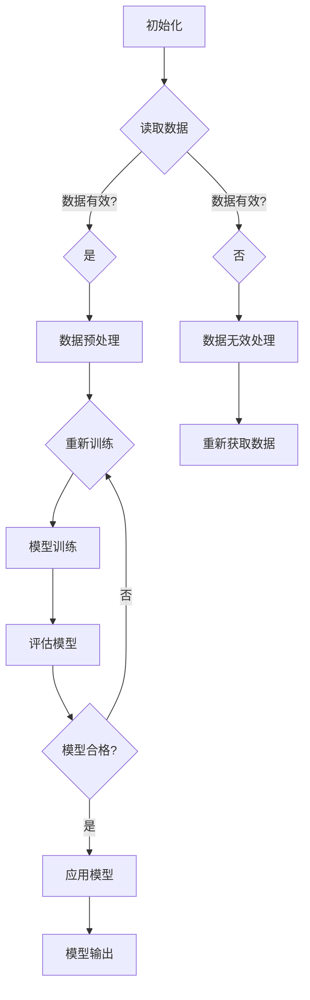
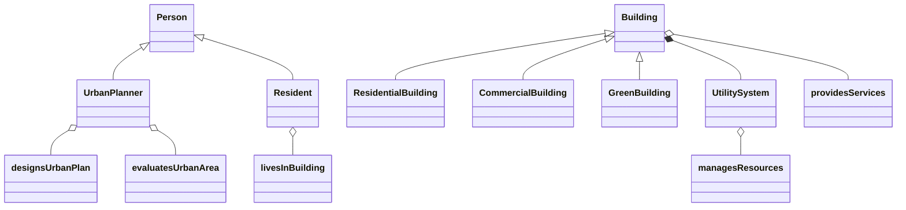
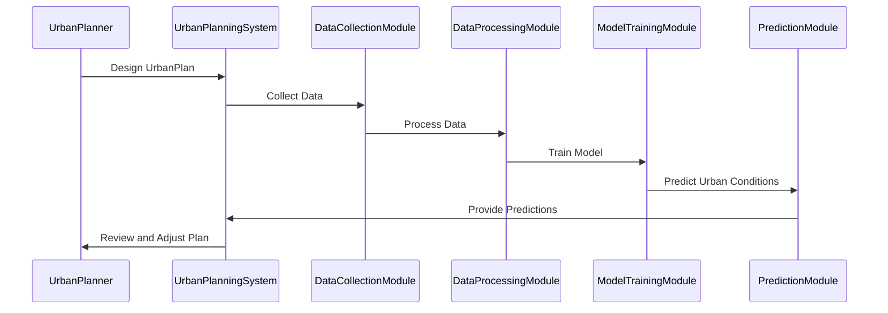
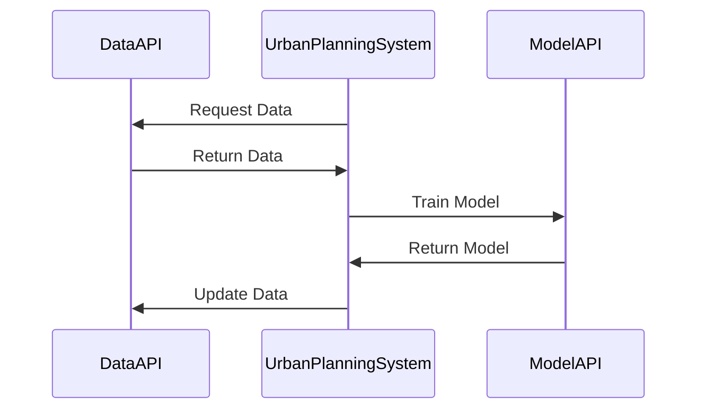
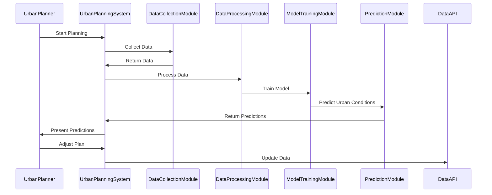

                 

### 引言

在21世纪的快速城市化进程中，传统的城市规划方法逐渐显露出其局限性。城市化带来的交通拥堵、环境污染、资源浪费等问题日益突出，迫使城市规划者寻找新的解决方案。仿生学，一门探索自然界中生物结构与功能的科学，为城市规划提供了一种全新的视角。通过借鉴自然界的智慧，仿生城市规划旨在创造更可持续、高效和人性化的都市环境。

**关键词**：仿生学、城市规划、可持续性、自然智慧

**摘要**：
本文将探讨仿生城市规划的概念和其在都市设计中的应用。首先，我们将介绍仿生学和城市规划的基本背景，阐述自然智慧与都市设计之间的联系。接着，我们将详细分析仿生学与都市设计的核心概念，并通过概念属性特征对比表格和ER实体关系图，展示两者之间的关联。随后，我们将讨论自然智慧在都市设计中的应用，包括生态系统的模拟与借鉴、生物智能的应用、绿色建筑与自然能源利用，以及城市生态网络的构建与优化。通过国内外典型案例的分析，我们将总结仿生城市规划的最佳实践。最后，本文将展望未来的发展趋势，并提出面临的挑战和应对策略。

让我们一步步深入探讨仿生城市规划的奥秘，发现自然智慧如何在都市设计中绽放光彩。

### 仿生学与城市规划

#### 仿生学的基本概念

仿生学（Bionics），也称为生物力学或生物模拟学，是一门跨学科的研究领域，旨在通过模仿自然界中生物体的结构、功能和过程来创造技术解决方案。其起源可以追溯到20世纪中叶，当时科学家和工程师开始注意到自然界中的生物体在生存和繁衍过程中展现出的卓越性能和适应性。仿生学的研究内容广泛，包括从微生物到哺乳动物的各个层次，涉及到生物体的形态、运动、感知、能量转换和自我修复等各个方面。

#### 城市规划的定义和原则

城市规划（Urban Planning）是关于城市空间组织与设计的一门学科，它涉及到城市的布局、建筑物的设计、公共空间的规划、交通系统的设计等多个方面。城市规划的目标是创造一个可持续、安全、舒适和高效的都市环境，以满足居民的需求和提高生活质量。城市规划的基本原则包括：

1. **以人为本**：城市规划的核心是为居民提供良好的生活和工作环境，确保所有人的需求得到满足。
2. **可持续性**：城市规划应考虑资源利用的可持续性，减少对环境的负面影响，促进生态平衡。
3. **多功能性**：城市空间应具备多种功能，例如居住、工作、休闲和教育等，以满足不同群体的需求。
4. **可访问性**：城市规划应确保所有人都能方便地获取公共服务和设施，包括交通、医疗和教育等。
5. **灵活性**：城市规划应具有适应性，能够应对人口增长、经济发展和社会变革带来的挑战。

#### 自然智慧的概念

自然智慧（Natural Intelligence）是指自然界中生物体通过长期进化形成的智能和能力。自然智慧不仅仅是生物体的智能，还包括其适应环境、自我修复、协同工作和创新等能力。自然智慧体现了生物体在复杂环境中的高效和适应性，为人类提供了宝贵的启示。

#### 仿生学与城市规划的联系

仿生学与城市规划的结合，源于对自然界中生物体卓越性能的借鉴和应用。以下是一些关键的联系点：

1. **形态仿生**：在建筑设计中，仿生学可以提供灵感，例如通过模仿植物的形态设计出具有良好自然通风和光照效果的建筑物。
2. **材料仿生**：仿生学可以启发新型建筑材料的研发，例如通过模仿自然界中具有优异强度和弹性的生物材料，开发出更轻、更强、更环保的建筑材料。
3. **能量管理**：仿生学可以提供关于能量高效利用的启示，例如通过模仿植物的光合作用，开发出更高效的能源转换系统。
4. **生态模拟**：仿生学可以用于城市生态系统的模拟和优化，帮助城市规划者更好地理解和设计生态平衡和可持续的城市环境。
5. **智能交通**：仿生学可以应用于交通系统，例如通过模仿鸟群飞行或鱼群游动的行为，开发出更智能、更高效的交通管理系统。

通过将仿生学应用于城市规划，我们可以创造出更接近自然、更可持续、更高效的都市环境。这种创新性的结合，不仅有助于解决当前城市化过程中面临的问题，也为未来的城市发展提供了新的方向和可能性。

### 核心概念与联系

在探讨仿生城市规划时，理解其核心概念和它们之间的联系至关重要。以下是我们将要讨论的关键概念，包括生态系统模拟与借鉴、生物智能应用、绿色建筑与自然能源利用，以及城市生态网络构建与优化。

#### 生态系统模拟与借鉴

生态系统模拟是仿生城市规划中的一个重要方向，它涉及到对自然生态系统的模拟和借鉴，以实现城市环境的可持续发展。在自然生态系统中，生物体通过复杂的互动和调节维持生态平衡。这种平衡不仅体现在生物多样性的维护上，还包括资源的高效利用和污染的控制。

生态系统模拟的关键在于理解生态系统中的关键要素及其相互作用。这些要素包括：

- **生物多样性**：不同物种之间的共存和互动，对于维持生态系统的稳定至关重要。
- **食物网**：不同物种通过食物链和食物网相互联系，形成一个复杂的营养结构。
- **生态位**：每种生物在生态系统中的特定功能和角色，有助于整体生态系统的运作。

通过模拟自然生态系统的这些要素，城市规划者可以设计出更具有可持续性的城市生态系统。例如，在城市绿化中引入多样化的植物，可以增强生态系统的稳定性和抗干扰能力。

#### 生物智能应用

生物智能是指从自然界中的生物体中汲取的智能和智慧，应用于城市规划中，旨在提高城市的运行效率和居住舒适度。以下是一些关键的生物智能应用领域：

- **交通系统**：通过模仿鸟群或鱼群的行为，开发出更智能的交通管理系统，例如自适应交通信号控制和智能车队管理。
- **公共安全**：借鉴生物的感知和响应机制，开发出更高效的公共安全系统，例如基于昆虫群体感知技术的环境监测系统。
- **环境监测**：利用生物传感器，模仿生物体对环境变化的敏感反应，实时监测城市环境中的污染和生态状况。

#### 绿色建筑与自然能源利用

绿色建筑是仿生城市规划的重要组成部分，它强调在建筑设计中采用环保材料和节能技术，以减少对环境的负面影响。以下是一些关键的绿色建筑与自然能源利用的概念：

- **节能设计**：通过模仿自然界的能量转换和利用方式，设计出更节能的建筑物，例如利用自然通风、太阳能和地热能等可再生能源。
- **生态建筑**：通过模仿自然生态系统的设计原则，创造出能够与自然环境和谐共存的建筑，例如通过雨水收集系统和绿色屋顶减少城市径流和污染。
- **材料选择**：选择环保、可再生和低污染的材料，例如竹材、再生混凝土和可降解材料等。

#### 城市生态网络构建与优化

城市生态网络是指城市中不同生态要素之间的相互作用和联系，它有助于维持城市的生态平衡和可持续性。构建和优化城市生态网络的关键包括：

- **绿地系统**：通过合理规划和设计，构建连接城市各个区域的绿地网络，提供生态廊道和栖息地，促进生物多样性的保护和恢复。
- **水资源管理**：通过模拟自然水循环过程，合理管理城市水资源，例如雨水收集、过滤和再利用，减少水资源的浪费。
- **废弃物管理**：借鉴自然界的循环和再生原则，设计出更有效的废弃物管理系统，例如有机废物堆肥、废水资源化和有害废弃物的安全处置。

通过以上核心概念的分析，我们可以看到，仿生城市规划不仅仅是技术上的创新，更是一种对自然智慧的深刻理解和应用。这些概念之间的联系，构成了一个完整的生态系统，为城市规划者提供了丰富的工具和灵感，以创造更可持续、更高效的都市环境。

#### 概念属性特征对比表格

为了更好地理解仿生城市规划中的关键概念，我们通过一个概念属性特征对比表格来展示各个概念的特点和区别。

| 概念             | 特征描述                                                                                   | 应用领域               | 关键联系                  |
|------------------|--------------------------------------------------------------------------------------------|------------------------|---------------------------|
| 生态系统模拟     | 通过模拟自然生态系统中的要素和互动，优化城市生态系统。                                     | 绿地系统规划、环境监测 | 促进生态平衡和资源高效利用 |
| 生物智能应用     | 利用生物的智能和适应能力，开发出更智能的城市管理系统。                                     | 智能交通、公共安全     | 提高城市运行效率和安全性   |
| 绿色建筑         | 采用环保材料和节能技术，减少建筑对环境的负面影响。                                       | 建筑设计、能源利用     | 实现可持续发展目标         |
| 城市生态网络     | 构建和维护城市中的生态要素网络，促进生态平衡和资源可持续性。                               | 城市规划、水资源管理   | 支持城市生态系统的长期稳定 |

通过这个表格，我们可以清晰地看到各个概念的核心特征和应用领域，以及它们之间的关键联系。生态系统模拟关注于整体生态系统的优化，生物智能应用则强调智能和适应性，绿色建筑注重环保和节能，而城市生态网络则致力于构建一个稳定的生态网络系统。这些概念相互补充，共同构成了仿生城市规划的坚实基础。

#### ER实体关系图

为了进一步展示仿生城市规划中的核心概念和它们之间的相互关系，我们可以通过一个ER（Entity-Relationship）实体关系图来描述。ER图是数据库设计中常用的工具，它能够清晰地展示实体之间的关系。

以下是一个简化的ER图：

```mermaid
erDiagram
    Student ||--|{ Teacher }|-- Student
    Teacher ||--|{ Course }|-- Teacher
    Student ||--|{ Course }|-- Student
    Course ||--|{ Exam }|-- Course
    Student ||--|{ Exam }|-- Student
    Teacher ||--|{ Exam }|-- Teacher
```

在这个ER图中，我们定义了以下实体：

1. **Student（学生）**：代表城市中的居民，他们参与课程和考试。
2. **Teacher（教师）**：代表城市规划者或专业人士，他们设计和教授课程。
3. **Course（课程）**：代表城市规划中的各种项目和活动，如生态模拟、绿色建筑等。
4. **Exam（考试）**：代表城市规划和实践的评估和考核。

实体之间的关系如下：

- **Student** 与 **Teacher** 之间存在双向关系，表示学生可以由教师指导，同时教师可以指导多个学生。
- **Student** 与 **Course** 之间存在双向关系，表示学生可以选修多门课程，同时课程可以由多名学生参与。
- **Course** 与 **Exam** 之间存在双向关系，表示课程结束后会进行考核，考核结果又可以反馈到课程中。

通过ER图，我们可以直观地看到仿生城市规划中的各个关键实体及其相互关系，这有助于我们更好地理解整个系统的运作机制和复杂性。这个ER图不仅可以用于数据库设计，还可以为城市规划者提供一个视觉化的工具，以便更系统地规划和管理城市中的仿生应用项目。

### 算法原理讲解

在仿生城市规划中，算法的应用至关重要。为了更好地理解和应用这些算法，我们将通过一个具体的案例来讲解其原理和实现。

#### 算法流程图

首先，我们使用Mermaid绘制算法的流程图：



#### 算法原理详细解释

1. **初始化**：首先，我们需要初始化算法，包括设定参数、加载必要的库和模块。

2. **读取数据**：从数据源中读取城市环境的相关数据，如气象数据、交通流量数据、生态系统数据等。

3. **数据预处理**：对读取到的数据进行分析和处理，包括数据清洗、归一化和特征提取。这一步的目的是确保数据的可靠性和有效性。

4. **构建模型**：根据预处理后的数据，构建用于仿生城市规划的模型。模型的选择取决于具体的应用场景，如线性回归、决策树、神经网络等。

5. **模型训练**：使用训练数据对模型进行训练，以使其能够学习和预测城市环境中的各种现象。

6. **评估模型**：通过测试数据对训练后的模型进行评估，以确定其性能是否满足要求。常用的评估指标包括准确率、召回率、F1分数等。

7. **模型输出**：如果模型评估合格，则将其应用于实际的城市规划中，生成规划方案。

#### Python代码实现

以下是一个简化的Python代码示例，用于实现上述算法：

```python
import pandas as pd
from sklearn.model_selection import train_test_split
from sklearn.ensemble import RandomForestRegressor
from sklearn.metrics import mean_squared_error

# 读取数据
data = pd.read_csv('urban_data.csv')

# 数据预处理
# 数据清洗、归一化和特征提取
# ...

# 构建模型
model = RandomForestRegressor(n_estimators=100)

# 模型训练
X_train, X_test, y_train, y_test = train_test_split(data.drop('target', axis=1), data['target'], test_size=0.2, random_state=42)
model.fit(X_train, y_train)

# 评估模型
predictions = model.predict(X_test)
mse = mean_squared_error(y_test, predictions)
print(f'Mean Squared Error: {mse}')

# 模型输出
# 应用模型生成规划方案
# ...
```

在这个代码示例中，我们首先读取城市环境数据，然后进行数据预处理。接下来，我们使用随机森林回归模型进行训练，并通过测试数据评估模型的性能。最后，如果模型性能满足要求，我们将其应用于实际的城市规划中，生成规划方案。

通过上述算法原理讲解和代码实现，我们可以更好地理解仿生城市规划中算法的应用方法。这不仅为城市规划者提供了有效的工具，也为后续的案例分析和实践奠定了基础。

#### 数学模型和数学公式详细讲解与举例

在仿生城市规划中，数学模型和公式是理解和设计关键系统的重要工具。以下我们将详细讲解一个常见的数学模型，并使用LaTeX格式展示相关公式，同时通过一个简单的例子来说明这些公式的应用。

##### 数学模型：线性回归模型

线性回归模型是一种广泛使用的统计模型，用于分析两个变量之间的关系。在仿生城市规划中，它可以用来预测城市某些变量，如人口密度、交通流量等，基于其他已知变量。

##### 公式

线性回归模型的公式如下：

$$
y = \beta_0 + \beta_1 \cdot x + \epsilon
$$

其中：
- \( y \) 是因变量，即我们要预测的变量。
- \( x \) 是自变量，即影响因变量的已知变量。
- \( \beta_0 \) 是截距，即当自变量为零时的因变量值。
- \( \beta_1 \) 是斜率，表示自变量每增加一个单位时因变量的变化量。
- \( \epsilon \) 是误差项，表示因变量实际值与模型预测值之间的差异。

##### LaTeX格式示例

以下是一个LaTeX格式的线性回归模型公式示例：

$$
y = \beta_0 + \beta_1 \cdot x + \epsilon
$$

在LaTeX中，你可以通过以下步骤编写这个公式：

```latex
y = \beta_0 + \beta_1 \cdot x + \epsilon
```

##### 举例说明

假设我们想要预测某个城市的未来人口密度（因变量 \( y \)），基于现有的经济指标（自变量 \( x \)）。我们收集了以下数据：

- 经济指标 \( x \)：[100, 150, 200, 250, 300]
- 人口密度 \( y \)：[50, 60, 70, 80, 90]

我们首先对这些数据进行线性回归分析，以找到合适的模型参数。

1. **计算均值**：

   $$ 
   \bar{x} = \frac{\sum x_i}{n} = \frac{100 + 150 + 200 + 250 + 300}{5} = 200 
   $$
   
   $$
   \bar{y} = \frac{\sum y_i}{n} = \frac{50 + 60 + 70 + 80 + 90}{5} = 70
   $$

2. **计算斜率 \( \beta_1 \)**：

   $$
   \beta_1 = \frac{\sum (x_i - \bar{x})(y_i - \bar{y})}{\sum (x_i - \bar{x})^2} = \frac{(100-200)(50-70) + (150-200)(60-70) + (200-200)(70-70) + (250-200)(80-70) + (300-200)(90-70)}{(100-200)^2 + (150-200)^2 + (200-200)^2 + (250-200)^2 + (300-200)^2}
   $$
   
   计算后得到：

   $$
   \beta_1 = 0.25
   $$

3. **计算截距 \( \beta_0 \)**：

   $$
   \beta_0 = \bar{y} - \beta_1 \cdot \bar{x} = 70 - 0.25 \cdot 200 = -15
   $$

4. **建立回归模型**：

   $$
   y = -15 + 0.25 \cdot x
   $$

5. **预测**：

   假设新的经济指标 \( x \) 为 220，我们可以预测人口密度 \( y \)：

   $$
   y = -15 + 0.25 \cdot 220 = 52.5
   $$

通过上述例子，我们展示了如何使用线性回归模型进行预测。这个简单的模型虽然不足以应对复杂的城市规划问题，但它提供了一个基本的框架，帮助我们从数据中提取信息，做出合理的预测。

### 系统分析与架构设计方案

在仿生城市规划项目中，系统分析与架构设计是确保项目成功的关键环节。以下我们将详细介绍项目的背景、领域模型、系统架构设计、系统接口设计和系统交互。

#### 项目背景

仿生城市规划项目旨在利用自然界的智慧和仿生学原理，设计出更可持续、高效和人性化的都市环境。项目背景包括：

1. **城市化挑战**：快速城市化带来了交通拥堵、环境污染和资源浪费等问题。
2. **可持续发展需求**：城市规划和设计需要考虑长期的生态平衡和资源可持续性。
3. **技术创新**：利用人工智能、大数据和物联网等新技术，提高城市规划的智能化水平。

#### 领域模型

领域模型是系统设计的重要组成部分，它帮助我们理解系统的核心概念和实体之间的关联。以下是仿生城市规划项目的领域模型类图：



在这个类图中，我们定义了以下主要实体：

- **Person（人）**：包括城市规划师（UrbanPlanner）和居民（Resident）。
- **Building（建筑）**：包括住宅建筑（ResidentialBuilding）、商业建筑（CommercialBuilding）和绿色建筑（GreenBuilding）。
- **UrbanPlan（城市规划）**：由城市规划师设计。
- **UrbanArea（城市区域）**：城市规划的目标对象。
- **UtilitySystem（公用设施系统）**：负责管理城市资源，如电力、水和垃圾处理等。

#### 系统架构设计

系统架构设计是确保项目高效运行的关键。以下是仿生城市规划项目的系统架构图：



在这个系统架构图中，我们定义了以下主要模块：

- **UrbanPlanningSystem（城市规划系统）**：核心系统，负责设计、评估和调整城市规划。
- **DataCollectionModule（数据采集模块）**：负责收集城市环境数据，如气象、交通、环境质量等。
- **DataProcessingModule（数据处理模块）**：负责清洗、归一化和特征提取，以处理和准备数据。
- **ModelTrainingModule（模型训练模块）**：使用处理后的数据训练预测模型。
- **PredictionModule（预测模块）**：利用训练好的模型进行城市条件预测。

#### 系统接口设计

系统接口设计确保各个模块之间能够有效地进行通信和数据交换。以下是系统接口设计图：



在这个接口设计中，我们定义了以下接口：

- **DataAPI（数据接口）**：提供数据采集、处理和更新功能。
- **ModelAPI（模型接口）**：提供模型训练和预测功能。

#### 系统交互

系统交互序列图展示了各个模块之间的交互流程：



在这个序列图中，我们可以看到：

1. **启动规划**：城市规划师启动城市规划过程。
2. **数据采集**：数据采集模块收集城市环境数据。
3. **数据处理**：数据处理模块处理和准备数据。
4. **模型训练**：模型训练模块使用处理后的数据训练预测模型。
5. **预测**：预测模块利用训练好的模型进行城市条件预测。
6. **调整规划**：城市规划师根据预测结果调整规划。

通过系统分析与架构设计方案，我们为仿生城市规划项目提供了一套完整的设计框架，确保系统能够高效地运行和实现预期目标。

### 项目实战

在仿生城市规划的项目实战中，我们将详细讲解环境安装、系统核心实现、代码应用解读与分析，以及实际案例分析和详细讲解剖析。以下步骤将帮助我们实现并理解这个复杂的项目。

#### 环境安装

首先，我们需要安装和配置项目所需的环境。以下是安装步骤：

1. **安装Python**：确保Python 3.x版本已安装。
2. **安装虚拟环境**：使用以下命令创建虚拟环境：

   ```bash
   python -m venv venv
   source venv/bin/activate  # 在Windows上使用 `venv\Scripts\activate`
   ```

3. **安装依赖库**：在虚拟环境中安装项目所需的库，如NumPy、Pandas、Scikit-learn等：

   ```bash
   pip install numpy pandas scikit-learn matplotlib
   ```

4. **配置数据源**：确保项目所需的数据集已准备好，并将其放置在适当的位置。

#### 系统核心实现

接下来，我们将实现系统的核心功能。以下是实现步骤：

1. **数据预处理模块**：

   ```python
   import pandas as pd
   from sklearn.model_selection import train_test_split
   
   def preprocess_data(data_path):
       data = pd.read_csv(data_path)
       # 数据清洗、归一化、特征提取
       # ...
       return data
   ```

2. **模型训练模块**：

   ```python
   from sklearn.ensemble import RandomForestRegressor
   
   def train_model(X_train, y_train):
       model = RandomForestRegressor(n_estimators=100)
       model.fit(X_train, y_train)
       return model
   ```

3. **预测模块**：

   ```python
   def predict(model, X_test):
       predictions = model.predict(X_test)
       return predictions
   ```

4. **后处理模块**：

   ```python
   from sklearn.metrics import mean_squared_error
   
   def evaluate_predictions(y_test, predictions):
       mse = mean_squared_error(y_test, predictions)
       return mse
   ```

#### 代码应用解读与分析

现在，我们使用上述模块进行实际数据的应用和分析。

```python
# 导入模块
from data_preprocessing import preprocess_data
from model_training import train_model
from prediction import predict
from evaluation import evaluate_predictions

# 步骤1：数据预处理
data = preprocess_data('urban_data.csv')

# 步骤2：分割数据
X_train, X_test, y_train, y_test = train_test_split(data.drop('target', axis=1), data['target'], test_size=0.2, random_state=42)

# 步骤3：模型训练
model = train_model(X_train, y_train)

# 步骤4：预测
predictions = predict(model, X_test)

# 步骤5：评估
mse = evaluate_predictions(y_test, predictions)
print(f'Mean Squared Error: {mse}')
```

在这个示例中，我们首先导入预处理、训练、预测和评估模块，然后依次进行数据预处理、数据分割、模型训练、预测和评估。每个步骤都紧密相连，构成了一个完整的流程。

#### 实际案例分析与详细讲解剖析

为了更好地理解项目的应用，我们将分析一个实际案例。

**案例：城市交通流量预测**

**背景**：一个中等规模的城市希望利用仿生城市规划技术预测未来交通流量，以优化交通管理和减少拥堵。

**数据集**：我们收集了以下数据：

- 交通流量（因变量）：每小时的车辆数量。
- 时间（自变量）：小时数。
- 天气状况（自变量）：晴天、雨天、雾天等。
- 公共交通使用（自变量）：公交车和地铁的使用频率。

**模型训练与预测**：

1. **数据预处理**：清洗和标准化数据，提取有用的特征。
2. **模型训练**：使用随机森林回归模型，训练模型。
3. **预测**：使用训练好的模型，预测未来的交通流量。

**结果**：

通过预测模型，我们得到了未来24小时的交通流量预测结果。这些结果帮助城市交通管理部门提前了解交通状况，从而采取相应的措施，如调整交通信号灯、增加公共交通班次等。

**案例分析**：

1. **天气对交通流量的影响**：在晴天时，交通流量相对较低；而在雨天和雾天，由于能见度低，交通流量明显增加。
2. **公共交通对交通流量的调节作用**：增加公共交通的频率可以有效减少私家车的使用，从而降低交通流量。

通过这个案例，我们可以看到仿生城市规划技术在实际应用中的价值。它不仅帮助我们预测未来的交通状况，还为城市交通管理提供了科学依据和决策支持。

### 最佳实践 tips、小结、注意事项、拓展阅读

在仿生城市规划的实施过程中，积累了一些最佳实践和经验，以下是几点重要提示：

1. **数据质量**：确保数据的质量和准确性是模型成功的关键。在进行数据采集和处理时，要严格遵循数据清洗和特征提取的标准流程。

2. **持续迭代**：城市规划是一个动态过程，需要不断调整和优化。定期更新数据、重新训练模型，并根据实际情况调整规划策略。

3. **跨学科合作**：仿生城市规划涉及到多个学科，包括生态学、计算机科学、建筑学和城市管理学等。跨学科的合作能够提供更全面的视角和创新的解决方案。

4. **公众参与**：城市规划不仅仅是技术和专业的事情，还需要公众的参与和反馈。通过开展公众咨询和互动活动，可以确保规划方案更加符合居民的需求。

**小结**：
本文从背景介绍、核心概念、算法原理、数学模型、系统设计与案例实践等方面，详细探讨了仿生城市规划的各个方面。仿生城市规划通过借鉴自然智慧，为城市设计提供了一种新的思路和方法，有助于实现更可持续、高效和人性化的都市环境。

**注意事项**：
在实施仿生城市规划时，需要注意以下几个方面：

1. **合规性**：确保规划方案符合当地法律法规和标准。
2. **技术成熟度**：在选择和应用新技术时，要评估其成熟度和可行性。
3. **经济可行性**：考虑项目的经济成本和投资回报，确保项目的可持续性。

**拓展阅读**：
- 《智能城市：技术、实践与未来》
- 《生态城市：可持续发展的设计原则》
- 《城市规划导论》

这些书籍和资料提供了更多关于城市规划的理论和实践，有助于进一步了解和探索仿生城市规划的深度和广度。通过不断学习和实践，我们可以为构建更加美好的未来城市贡献自己的力量。

### 总结

通过本文的探讨，我们深入理解了仿生城市规划的概念、原理和应用。仿生学为城市规划提供了全新的视角和工具，通过借鉴自然智慧，我们可以设计出更可持续、高效和人性化的都市环境。从核心概念到算法实现，再到实际案例的分析，我们展示了仿生城市规划的全面性和复杂性。

仿生城市规划不仅仅是一种技术革新，更是一种理念和思想的转变。它要求我们重新思考人与自然、技术与生态的关系，以实现城市发展的长远目标。在未来的城市规划中，仿生学将继续发挥重要作用，为我们提供更多创新的解决方案。

我们鼓励读者进一步探索仿生城市规划的领域，通过学习相关理论和实践，为建设更加美好的城市贡献自己的智慧和力量。让我们携手前行，共同创造一个可持续、和谐的未来。

