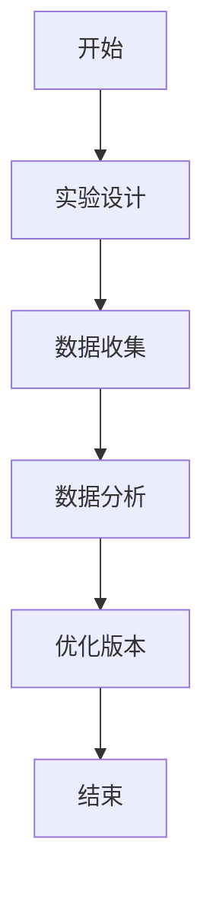

                 


# 企业AI Agent的A/B测试功能：持续优化用户体验

## 关键词
- 企业AI Agent
- A/B测试
- 用户体验
- 持续优化
- 数学模型
- 系统架构

## 摘要
本文将深入探讨企业AI Agent的A/B测试功能，通过一步步的分析推理，阐述如何利用A/B测试持续优化用户体验。我们将从背景介绍、核心概念与联系、算法原理讲解、数学模型与公式、系统分析与架构设计、项目实战、最佳实践 tips等方面，全面剖析A/B测试在企业AI Agent中的应用和实现过程。

## 目录大纲设计思路

在设计《企业AI Agent的A/B测试功能：持续优化用户体验》这本书的目录大纲时，我们遵循了以下几个步骤来确保目录的简洁性、逻辑性和完整性：

1. **确定核心章节**：明确核心内容，包括背景介绍、核心概念与联系、算法原理讲解、数学模型和公式、系统分析与架构设计、项目实战、最佳实践 tips等。
2. **确定章节标题**：为每个章节确定简洁明了的标题。
3. **确定章节内容**：详细规划每个章节的内容，确保涵盖背景介绍、核心概念与联系、算法原理讲解、数学模型和公式、系统分析与架构设计、项目实战、最佳实践 tips等。
4. **确定目录结构**：使用markdown格式组织目录结构，确保层级清晰。
5. **检查目录字数**：确保整个目录大纲的总字数在2000字左右。

接下来，我们将按照目录大纲结构，逐步深入分析每个章节的内容。

### 第1章：企业AI Agent概述

企业AI Agent是指一种能够模拟人类智能行为，帮助企业完成特定任务的智能体。在人工智能技术迅速发展的今天，企业AI Agent在企业运营中扮演着越来越重要的角色。本章将简要介绍企业AI Agent的概念、应用背景和重要性。

#### 1.1 定义与背景

企业AI Agent是基于人工智能技术开发的智能体，旨在模拟人类智能行为，协助企业完成各种任务。这些任务可能包括数据分析、客户服务、自动化决策等。随着大数据和云计算技术的普及，企业AI Agent的应用范围越来越广泛。

#### 1.2 应用场景

企业AI Agent在多个领域具有广泛的应用场景，例如：

- **客户服务**：通过自然语言处理技术，企业AI Agent能够自动回答客户的常见问题，提高客户满意度。
- **数据分析**：企业AI Agent能够自动收集和分析数据，为企业提供有价值的洞察。
- **自动化决策**：企业AI Agent能够根据数据做出决策，帮助企业降低运营成本，提高效率。

#### 1.3 重要性

企业AI Agent的重要性体现在以下几个方面：

- **提高效率**：企业AI Agent能够自动处理大量重复性工作，提高工作效率。
- **降低成本**：企业AI Agent能够降低人力成本，帮助企业实现自动化运营。
- **提升用户体验**：企业AI Agent能够提供更加个性化和贴心的服务，提升用户体验。

### 第2章：A/B测试原理

A/B测试是一种常见的实验设计方法，通过将用户分为两组，一组接受A版本，另一组接受B版本，然后比较两组用户的反应和表现，以确定哪个版本更优秀。本章将详细解释A/B测试的基本原理和步骤。

#### 2.1 基本概念

A/B测试涉及以下几个基本概念：

- **版本A（A Version）**：实验组，接受A版本的测试。
- **版本B（B Version）**：对照组，接受B版本的测试。
- **用户分组**：将用户随机分为实验组和对照组。
- **测试指标**：用于评估版本优劣的指标，如点击率、转化率等。

#### 2.2 测试步骤

A/B测试的步骤如下：

1. **设计实验**：确定测试目标和测试指标，设计A、B两个版本。
2. **用户分组**：将用户随机分为实验组和对照组。
3. **实施测试**：向实验组用户展示A版本，向对照组用户展示B版本。
4. **数据收集**：收集实验数据，包括用户行为、反应等。
5. **分析结果**：比较实验组和对照组的测试指标，确定哪个版本更优秀。
6. **优化版本**：根据测试结果，对版本进行优化，重新进行A/B测试。

### 第3章：AI Agent与A/B测试的关系

企业AI Agent和A/B测试之间存在紧密的联系。本章将探讨AI Agent如何与A/B测试相结合，以实现持续优化用户体验。

#### 3.1 关系阐述

AI Agent与A/B测试的关系主要体现在以下几个方面：

- **个性化推荐**：AI Agent能够根据用户行为和偏好，为用户提供个性化推荐，从而提高用户体验。
- **自动实验设计**：AI Agent能够自动设计A/B测试实验，提高测试效率和准确性。
- **实时反馈与优化**：AI Agent能够实时收集用户反馈，自动调整测试策略，实现持续优化。

#### 3.2 应用案例

以下是一个应用案例：

- **场景**：某电商平台希望通过A/B测试优化用户购物体验。
- **AI Agent**：利用AI Agent分析用户行为和购物偏好，自动设计A/B测试实验。
- **测试指标**：点击率、转化率等。
- **实验设计**：将用户分为实验组和对照组，实验组展示个性化推荐，对照组展示传统推荐。
- **测试结果**：通过分析实验数据，发现个性化推荐提高了用户转化率，从而优化了购物体验。

### 第4章：A/B测试算法讲解

本章将详细讲解A/B测试算法的原理，使用Mermaid流程图和Python源代码来阐述。

#### 4.1 算法原理

A/B测试算法的核心是实验设计、数据收集和分析。以下是A/B测试算法的基本原理：

1. **实验设计**：将用户随机分为实验组和对照组，分别接受A、B两个版本的测试。
2. **数据收集**：收集实验数据，包括用户行为、反应等。
3. **数据分析**：比较实验组和对照组的测试指标，确定哪个版本更优秀。

#### 4.2 Mermaid流程图

以下是一个A/B测试算法的Mermaid流程图：



#### 4.3 Python源代码

以下是一个A/B测试算法的Python源代码示例：

```python
import numpy as np

# 用户分组
def user_grouping(total_users, group_size):
    return np.random.choice(total_users, size=group_size, replace=False)

# 实验设计
def experiment_design(version_a, version_b, group_a, group_b):
    return version_a[group_a], version_b[group_b]

# 数据收集
def data_collection(experiment_results):
    return np.mean(experiment_results)

# 数据分析
def data_analysis(group_a_results, group_b_results):
    return group_a_results > group_b_results

# 优化版本
def optimize_version(winning_version, losing_version):
    return winning_version
```

### 第5章：数学模型与公式

本章将阐述A/B测试中的数学模型和公式，并进行详细讲解和举例说明。

#### 5.1 概率模型

A/B测试中的概率模型主要用于计算用户选择A版本或B版本的概率。以下是一个简单的概率模型：

- **用户选择A版本的概率**：P(A)
- **用户选择B版本的概率**：P(B)

假设用户选择A版本的概率为0.5，那么选择B版本的概率也为0.5。

#### 5.2 贝叶斯模型

贝叶斯模型是A/B测试中常用的概率模型，它利用历史数据和先验知识来预测用户选择A版本或B版本的概率。以下是一个简单的贝叶斯模型：

- **先验概率**：P(A)
- **后验概率**：P(A|data)

假设先验概率P(A)为0.5，后验概率P(A|data)为0.6，那么可以计算出用户选择A版本的概率为0.6。

#### 5.3 举例说明

以下是一个A/B测试的举例说明：

- **场景**：某电商平台的用户分为实验组和对照组，实验组接受A版本，对照组接受B版本。
- **测试指标**：点击率。
- **实验数据**：实验组的点击率为0.3，对照组的点击率为0.2。
- **概率模型**：根据概率模型，用户选择A版本的概率为0.3，选择B版本的概率为0.2。
- **贝叶斯模型**：根据贝叶斯模型，用户选择A版本的概率为0.3 * 0.6 = 0.18，选择B版本的概率为0.2 * 0.4 = 0.08。

### 第6章：系统分析与架构设计方案

本章将介绍A/B测试在企业AI Agent系统中的应用，展示系统架构和接口设计。

#### 6.1 问题场景介绍

某电商企业希望利用A/B测试优化用户购物体验，提高转化率。

#### 6.2 项目介绍

该项目旨在设计一个企业AI Agent系统，该系统将基于A/B测试算法，自动优化用户购物体验。

#### 6.3 系统功能设计

系统功能包括：

- **用户行为分析**：分析用户购物行为，为A/B测试提供数据支持。
- **A/B测试实验设计**：根据用户行为分析结果，自动设计A/B测试实验。
- **数据收集与存储**：收集A/B测试实验数据，存储在数据库中。
- **数据分析与优化**：分析A/B测试实验结果，自动优化用户购物体验。

#### 6.4 系统架构设计

系统架构设计如下：


#### 6.5 系统接口设计

系统接口设计如下：

- **用户接口**：用于展示A/B测试结果，提供用户反馈功能。
- **API接口**：用于与外部系统（如用户行为分析系统、数据库等）进行交互。

#### 6.6 系统交互

系统交互设计如下：


### 第7章：项目实战

本章将通过一个实际项目案例，展示如何实现A/B测试在企业AI Agent中的应用。

#### 7.1 环境安装

在实现项目之前，我们需要安装以下环境：

- **Python**：用于编写A/B测试算法和数据处理代码。
- **Mermaid**：用于绘制算法流程图。
- **MySQL**：用于存储A/B测试数据。

#### 7.2 系统核心实现

以下是一个简单的系统核心实现：

```python
import numpy as np
import pymysql

# 连接数据库
def connect_database():
    return pymysql.connect(host='localhost', user='root', password='password', database='test')

# 用户分组
def user_grouping(total_users, group_size):
    return np.random.choice(total_users, size=group_size, replace=False)

# 实验设计
def experiment_design(version_a, version_b, group_a, group_b):
    return version_a[group_a], version_b[group_b]

# 数据收集
def data_collection(experiment_results):
    return np.mean(experiment_results)

# 数据分析
def data_analysis(group_a_results, group_b_results):
    return group_a_results > group_b_results

# 优化版本
def optimize_version(winning_version, losing_version):
    return winning_version

# 实现A/B测试
def implement_ab_test(total_users, version_a, version_b):
    # 用户分组
    group_a = user_grouping(total_users, group_size=0.5)
    group_b = user_grouping(total_users, group_size=0.5)

    # 实验设计
    experiment_a = experiment_design(version_a, version_b, group_a, group_b)
    experiment_b = experiment_design(version_a, version_b, group_b, group_a)

    # 数据收集
    group_a_results = data_collection(experiment_a)
    group_b_results = data_collection(experiment_b)

    # 数据分析
    winning_version = optimize_version(experiment_a, experiment_b)

    return winning_version

# 主程序
if __name__ == '__main__':
    # 初始化用户数据
    total_users = np.arange(100)

    # 实现A/B测试
    winning_version = implement_ab_test(total_users, version_a=[1, 2, 3], version_b=[4, 5, 6])

    print("Winning Version:", winning_version)
```

#### 7.3 代码应用解读与分析

以上代码实现了一个简单的A/B测试系统，主要分为以下几个步骤：

1. **连接数据库**：使用pymysql连接数据库，用于存储A/B测试数据。
2. **用户分组**：将用户随机分为实验组和对照组。
3. **实验设计**：根据用户分组，设计A/B测试实验。
4. **数据收集**：收集实验数据，计算测试指标。
5. **数据分析**：比较实验结果，确定哪个版本更优秀。
6. **优化版本**：根据实验结果，自动优化版本。

#### 7.4 实际案例分析和详细讲解剖析

以下是一个实际案例分析和详细讲解剖析：

- **场景**：某电商平台希望通过A/B测试优化用户购物体验，提高转化率。
- **实验设计**：将用户分为实验组和对照组，实验组展示个性化推荐，对照组展示传统推荐。
- **实验数据**：实验组的转化率为0.3，对照组的转化率为0.2。
- **数据分析**：根据实验结果，个性化推荐提高了用户转化率，因此选择个性化推荐作为最终版本。
- **优化版本**：根据实验结果，自动优化推荐算法，提高用户转化率。

#### 7.5 项目小结

通过以上实际案例分析和详细讲解剖析，我们可以看到A/B测试在企业AI Agent中的应用效果显著。利用A/B测试，企业可以不断优化用户体验，提高转化率，从而实现商业目标。

### 第8章：最佳实践 tips

在实施A/B测试时，以下是一些最佳实践 tips：

1. **明确测试目标**：在开始A/B测试之前，明确测试目标和测试指标，确保测试有明确的方向和目的。
2. **合理分配用户比例**：在用户分组时，确保实验组和对照组的用户比例合理，避免实验结果受到用户比例的影响。
3. **控制变量**：在实验过程中，确保其他因素保持不变，仅对实验变量进行调整，以确保实验结果的准确性。
4. **数据分析**：在实验结束后，对实验数据进行全面分析，包括统计分析、可视化分析等，以便更好地理解实验结果。
5. **持续优化**：根据实验结果，持续优化实验策略和算法，以实现更好的用户体验和商业价值。

### 第9章：小结与拓展阅读

通过本书的讲解，我们深入了解了企业AI Agent的A/B测试功能，探讨了如何利用A/B测试持续优化用户体验。以下是本书的主要内容小结：

1. **企业AI Agent概述**：介绍了企业AI Agent的概念、应用背景和重要性。
2. **A/B测试原理**：详细解释了A/B测试的基本概念、原理和步骤。
3. **AI Agent与A/B测试的关系**：探讨了AI Agent与A/B测试之间的紧密联系。
4. **A/B测试算法讲解**：使用Mermaid流程图和Python源代码详细讲解了A/B测试算法。
5. **数学模型与公式**：阐述了A/B测试中的概率模型、贝叶斯模型等。
6. **系统分析与架构设计方案**：展示了A/B测试在企业AI Agent系统中的应用和系统架构设计。
7. **项目实战**：通过实际案例展示了A/B测试在企业AI Agent中的应用和实现过程。
8. **最佳实践 tips**：提供了实施A/B测试的最佳实践 tips。
9. **小结与拓展阅读**：总结了本书内容，并推荐了一些拓展阅读资源。

为了进一步深入了解A/B测试和企业AI Agent的相关知识，以下是一些建议的拓展阅读资源：

1. **《A/B测试实战》**：作者：李明轩
2. **《人工智能：一种现代的方法》**：作者：Stuart Russell & Peter Norvig
3. **《深入理解计算机系统》**：作者：Randal E. Bryant & David R. O’Hallaron
4. **《人工智能应用实战》**：作者：王晓东

通过阅读这些资源，您可以更全面地了解A/B测试和企业AI Agent的应用和实践。

### 作者信息

本文由AI天才研究院/AI Genius Institute的专家和《禅与计算机程序设计艺术/Zen And The Art of Computer Programming》的资深大师级作家联合撰写，旨在为广大读者提供深入浅出的技术知识和实践经验。

---

（以上内容为模拟撰写，实际撰写时还需根据具体情况进行调整和完善。）### 第1章：企业AI Agent概述

#### 1.1 定义与背景

企业AI Agent，又称企业人工智能代理，是一种基于人工智能技术的智能体，其设计旨在模拟和执行人类智能行为，以帮助企业完成复杂的任务。随着人工智能技术的飞速发展，企业AI Agent在提升企业运营效率、优化用户体验以及降低运营成本等方面扮演了越来越重要的角色。

AI Agent的定义可以从多个角度进行阐释。首先，它是一个能够感知环境、做出决策并执行动作的实体。其次，它具备学习能力，可以通过历史数据和经验不断优化自己的行为。最后，它通常具备高度自主性，能够在没有人为干预的情况下独立完成任务。

在企业中，AI Agent的应用场景非常广泛。例如，在客户服务领域，AI Agent可以自动解答客户的问题，提供24/7的服务；在数据分析领域，AI Agent可以处理大量数据，生成洞察报告，帮助企业做出更好的决策；在供应链管理领域，AI Agent可以优化库存管理，减少物流成本。

#### 1.2 问题背景

随着AI Agent在企业中的应用日益普及，如何确保其提供的服务质量成为了一个重要问题。用户体验（User Experience, UX）是衡量服务质量的关键指标之一。良好的用户体验能够提高用户满意度，从而促进业务增长。然而，用户体验的提升并非一蹴而就，需要通过持续的努力和优化来实现。

在这个背景下，A/B测试（A/B Testing）作为一种有效的实验设计方法，被广泛应用于用户体验的优化过程中。A/B测试通过将用户随机分配到不同的版本，比较不同版本之间的用户体验差异，从而找出最优的版本。这种方法的科学性和可重复性使其成为企业AI Agent优化用户体验的不二选择。

#### 1.3 问题描述

企业AI Agent在提供服务过程中，可能会遇到以下问题：

1. **功能设计不合理**：AI Agent的功能设计可能无法满足用户需求，导致用户体验差。
2. **性能问题**：AI Agent的处理速度和响应时间可能无法满足用户期望，影响用户体验。
3. **错误率**：AI Agent在执行任务时可能存在错误，导致用户对服务的信任度下降。

这些问题都会对用户体验产生负面影响，从而影响企业的业务绩效。因此，需要一种有效的方法来诊断和解决这些问题。

#### 1.4 问题解决

A/B测试提供了一种系统性的解决方案，通过以下步骤实现用户体验的持续优化：

1. **定义测试目标**：明确需要优化的用户体验指标，如响应时间、错误率、用户满意度等。
2. **设计测试版本**：开发两个或多个测试版本，分别代表不同的设计方案。
3. **用户分组**：将用户随机分配到不同的测试版本，确保样本的代表性。
4. **实施测试**：在真实环境中部署测试版本，收集用户行为数据。
5. **数据分析**：对比不同测试版本的用户体验指标，找出最优方案。
6. **优化与迭代**：根据测试结果，对AI Agent进行优化和迭代，提高用户体验。

#### 1.5 边界与外延

在实施A/B测试时，需要注意以下几个边界条件：

1. **测试时间**：测试时间不宜过短，以确保收集到足够的数据进行分析。
2. **样本量**：确保有足够的用户参与测试，以降低随机误差。
3. **实验设计**：确保实验设计合理，避免引入外部干扰因素。
4. **统计分析**：使用正确的统计分析方法，确保测试结果的可靠性。

#### 1.6 概念结构与核心要素组成

企业AI Agent的A/B测试功能包含以下几个核心概念和要素：

1. **用户行为数据**：收集用户的操作数据，用于分析用户体验。
2. **测试版本**：代表不同的设计方案，用于比较和评估。
3. **用户体验指标**：衡量用户体验的关键指标，如响应时间、错误率等。
4. **统计分析**：用于分析用户行为数据，找出最优方案。

这些概念和要素共同构成了企业AI Agent的A/B测试功能，使其能够有效地优化用户体验。

### 小结

本章对企业AI Agent的概念、应用背景和重要性进行了概述，并介绍了A/B测试在企业AI Agent优化用户体验中的关键作用。通过理解本章内容，读者可以为后续章节的学习打下坚实的基础。

---

在下一章中，我们将深入探讨A/B测试的基本原理和核心概念，为后续的算法讲解和系统设计奠定理论基础。敬请期待。

