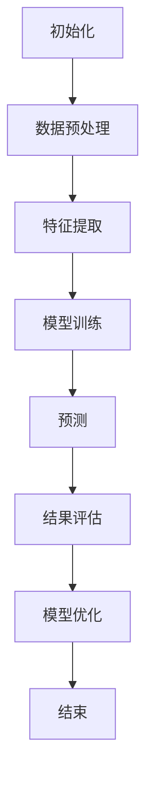
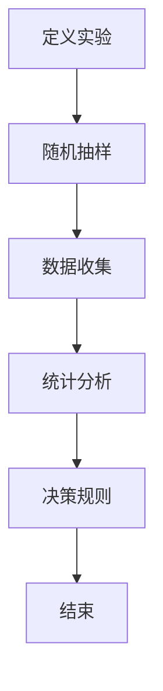
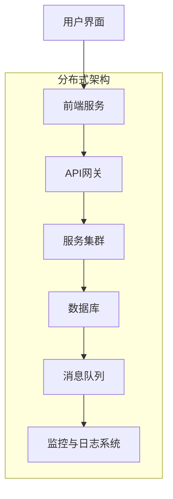

                 

### 第1章 问题背景与核心概念

#### 1.1 AI Agent的定义与分类

AI Agent，即人工智能代理，是一种基于人工智能技术构建的智能体，能够在特定环境和目标指导下自主执行任务。根据功能和应用领域的不同，AI Agent可以分为以下几类：

1. **任务型AI Agent**：这类代理专注于完成特定任务，如自动化客服、智能调度等。
2. **交互型AI Agent**：这类代理具有较强的交互能力，如聊天机器人、虚拟助手等。
3. **决策型AI Agent**：这类代理能够在复杂环境下做出最优决策，如智能投资顾问、自动交易系统等。

#### 1.2 A/B测试的原理与应用场景

A/B测试，又称拆箱测试，是一种对比实验方法，通过将用户分配到不同的实验组，比较不同版本的表现，以确定哪种版本更优。其原理基于统计学，通过数据分析和对比，找到最优解。

A/B测试的应用场景广泛，包括但不限于：

1. **产品界面优化**：通过测试不同的界面设计，找到用户满意度最高的版本。
2. **功能迭代**：在引入新功能时，通过测试不同版本的用户反馈，决定是否上线。
3. **市场营销**：测试不同的广告、促销策略，找到最有效的营销方式。

#### 1.3 企业AI Agent的A/B测试需求

企业AI Agent在进行A/B测试时，有以下几个核心需求：

1. **可配置性**：AI Agent应能灵活配置测试参数，如实验组数、用户分配策略等。
2. **实时数据收集**：测试过程中需要实时收集用户行为数据，以便快速评估测试结果。
3. **自动化分析**：通过自动化工具对数据进行分析，快速识别和反馈测试结果。
4. **持续迭代**：根据测试结果，不断调整和优化AI Agent，以提高用户体验。

#### 1.4 边界与外延：企业AI Agent与A/B测试的关系

企业AI Agent的A/B测试不仅限于内部功能优化，还可以扩展到以下几个方面：

1. **交互界面优化**：通过A/B测试，优化AI Agent的交互界面，提升用户体验。
2. **决策算法改进**：通过测试不同决策算法的表现，找到最优决策模型。
3. **功能模块扩展**：测试新功能模块的引入，评估其对整体系统的贡献。
4. **跨平台兼容性**：在不同平台和设备上进行A/B测试，确保AI Agent的兼容性和稳定性。

### 总结

企业AI Agent的A/B测试功能，不仅是对AI Agent性能的检验，更是对用户体验的持续优化。通过对核心概念的理解和实际应用的深入分析，企业可以更好地利用A/B测试，推动AI Agent的持续改进和发展。

#### 1.5 进一步探讨与展望

未来，随着人工智能技术的不断进步，企业AI Agent的A/B测试功能将更加智能化和自动化。通过引入更多的机器学习算法和大数据分析技术，A/B测试将能够更精确地预测用户行为，提供更个性化的服务。同时，随着5G、物联网等新技术的普及，AI Agent的A/B测试也将扩展到更多应用场景，如智能家居、智能交通等。这不仅将为企业带来更多商业机会，也将极大地改善用户体验，推动人工智能技术的普及和应用。

---

本文首先介绍了AI Agent的定义和分类，以及A/B测试的基本原理和应用场景。随后，探讨了企业AI Agent进行A/B测试的核心需求，包括可配置性、实时数据收集、自动化分析和持续迭代。接着，分析了企业AI Agent与A/B测试的边界与外延，展示了其在交互界面优化、决策算法改进、功能模块扩展和跨平台兼容性等方面的应用。最后，对未来的发展趋势进行了展望，强调了A/B测试在人工智能技术进步中的重要作用。希望通过这篇文章，读者能够对AI Agent的A/B测试功能有一个全面和深入的理解。接下来，我们将进一步探讨AI Agent的核心概念与原理，以及A/B测试的核心概念和联系。

---

## 第2章 AI Agent的核心概念与原理

### 2.1 AI Agent的工作原理

AI Agent的工作原理基于人工智能的核心技术，包括机器学习、自然语言处理、深度学习等。其基本工作流程可以分为以下几个阶段：

1. **数据收集**：AI Agent通过传感器、用户输入等渠道收集数据。
2. **数据预处理**：对收集到的数据进行清洗、转换和归一化处理，确保数据的质量和一致性。
3. **特征提取**：从预处理后的数据中提取特征，这些特征将用于训练模型。
4. **模型训练**：使用机器学习算法，如神经网络、决策树等，训练模型以预测或分类。
5. **决策与执行**：根据模型输出的结果，AI Agent进行决策并执行相应的动作。
6. **反馈调整**：将执行结果与预期目标进行比较，通过反馈机制调整模型参数，提高预测准确性。

### 2.2 AI Agent的功能模块

AI Agent的功能模块通常包括以下几个部分：

1. **感知模块**：负责接收外部信息，如用户输入、环境变化等。
2. **决策模块**：基于感知模块提供的信息，通过算法进行分析和决策。
3. **执行模块**：根据决策模块的指令执行相应的操作，如发送消息、移动等。
4. **学习模块**：通过反馈机制，不断调整和优化模型，以提高性能。

### 2.3 AI Agent与用户体验的关系

AI Agent的设计和性能直接影响到用户体验。以下是从几个方面探讨AI Agent与用户体验的关系：

1. **响应速度**：AI Agent的响应速度直接影响用户满意度，响应时间越短，用户体验越好。
2. **准确度**：AI Agent的决策准确度越高，用户对其信任度也越高，从而提升用户体验。
3. **交互体验**：AI Agent的交互设计，如语言风格、对话流畅度等，也会影响用户的整体体验。
4. **个性化服务**：AI Agent能够根据用户行为和偏好提供个性化的服务，从而提高用户满意度。

### 2.4 概念属性特征对比表格

以下是一个简化的AI Agent与用户体验的概念属性特征对比表格：

| 概念属性 | AI Agent | 用户体验 |
| --- | --- | --- |
| 响应速度 | 快速响应 | 用户满意 |
| 准确度 | 高准确度 | 用户信任 |
| 交互体验 | 自然流畅 | 舒适体验 |
| 个性化服务 | 个性化推荐 | 高满意度 |

### 总结

通过本章的讨论，我们深入了解了AI Agent的工作原理和功能模块，探讨了其与用户体验之间的关系。AI Agent的高效工作不仅依赖于先进的人工智能技术，还需要在交互设计和个性化服务方面进行持续优化，以满足用户的期望和需求。接下来，我们将继续分析A/B测试的核心概念和原理，并探讨其在AI Agent中的应用。

---

本章首先详细介绍了AI Agent的工作原理，包括数据收集、数据预处理、特征提取、模型训练、决策与执行以及反馈调整等关键步骤。随后，阐述了AI Agent的功能模块，包括感知模块、决策模块、执行模块和学习模块。接着，探讨了AI Agent与用户体验的关系，从响应速度、准确度、交互体验和个性化服务四个方面进行了分析。最后，通过一个对比表格，总结了AI Agent与用户体验的概念属性特征。希望通过这些内容，读者能够对AI Agent的工作原理和其在用户体验中的重要性有更深入的理解。接下来，我们将进一步探讨A/B测试的核心概念和原理。

---

### 2.5 AI Agent的架构设计

AI Agent的架构设计是确保其高效运行和灵活扩展的关键。以下是一个典型的AI Agent架构设计：

1. **前端交互层**：该层主要负责与用户的交互，包括用户界面、语音识别、自然语言处理等。通过提供直观、友好的用户界面，AI Agent能够更好地与用户沟通。

2. **中间处理层**：该层是AI Agent的核心，包括数据预处理、特征提取、模型训练和推理等。通过高效的中间处理层，AI Agent能够快速响应用户请求，并提供准确的决策。

3. **后端服务层**：该层负责数据存储、后台服务和系统集成。通过后端服务层，AI Agent能够访问外部数据和系统资源，实现跨模块的数据共享和功能协同。

4. **基础设施层**：包括计算资源、存储资源、网络资源和安全防护等。这一层为AI Agent提供了稳定、高效的基础设施支持，确保其能够稳定运行。

### 2.6 AI Agent的技术挑战与解决方案

在设计和实现AI Agent的过程中，会面临多种技术挑战：

1. **数据隐私与安全**：AI Agent需要处理大量的用户数据，如何确保数据的隐私和安全是一个重要问题。解决方案包括数据加密、隐私保护算法和权限控制等。

2. **实时性能**：AI Agent需要快速响应用户请求，这在实时数据处理和高并发场景下是一个挑战。解决方案包括分布式计算、负载均衡和缓存技术等。

3. **模型可解释性**：AI Agent的决策过程通常基于复杂的机器学习模型，如何提高模型的可解释性，使其更加透明和可靠，是一个重要的研究方向。解决方案包括模型可视化、解释性算法和决策路径追踪等。

4. **跨平台兼容性**：AI Agent需要在不同操作系统、设备和网络环境下运行，如何确保其兼容性和一致性是一个挑战。解决方案包括模块化设计、标准化接口和跨平台开发框架等。

### 2.7 AI Agent的发展趋势

未来，AI Agent将在多个方面继续发展：

1. **智能化**：随着人工智能技术的进步，AI Agent将变得更加智能化，能够处理更复杂的问题，提供更个性化的服务。

2. **个性化和自适应**：AI Agent将能够根据用户行为和偏好进行自适应调整，提供个性化的服务，提升用户体验。

3. **多模态交互**：AI Agent将支持更多的交互方式，如语音、文字、手势等，实现更自然的用户交互。

4. **跨界应用**：AI Agent将在更多的领域得到应用，如智能家居、智能医疗、智能交通等，推动各行各业的数字化转型。

通过本章的讨论，我们深入了解了AI Agent的核心概念、工作原理、功能模块、架构设计以及面临的技术挑战和发展趋势。AI Agent作为人工智能领域的重要发展方向，其设计与实现不仅需要强大的技术支持，还需要在用户体验和业务应用方面进行不断优化和创新。接下来，我们将进一步探讨A/B测试的核心概念和原理，并分析其在AI Agent中的应用。

---

在本章中，我们首先详细介绍了AI Agent的架构设计，包括前端交互层、中间处理层、后端服务层和基础设施层，每个层次的功能和作用。接着，探讨了AI Agent在设计和实现过程中面临的技术挑战，如数据隐私与安全、实时性能、模型可解释性和跨平台兼容性，并提出了相应的解决方案。最后，展望了AI Agent的未来发展趋势，包括智能化、个性化自适应、多模态交互和跨界应用。这些内容为理解和应用AI Agent提供了全面的视角。接下来，我们将转向A/B测试的核心概念和原理，深入分析其在AI Agent中的应用和意义。

---

### 3.1 A/B测试的基本流程

A/B测试的基本流程可以分为以下几个步骤：

1. **定义目标**：明确测试的目标，如提高用户留存率、增加点击率等。
2. **构建假设**：基于现有的数据和经验，提出一个或多个测试假设。
3. **设计实验**：设计实验方案，包括控制组（A组）和实验组（B组）的分配、测试变量的设置等。
4. **数据收集**：在实验期间，收集用户行为数据，包括访问次数、点击率、转化率等。
5. **数据分析**：对收集到的数据进行分析，比较A组和B组的性能差异。
6. **结论验证**：根据分析结果，验证测试假设是否成立。
7. **决策**：根据验证结果，决定是否采用新的设计方案。

### 3.2 A/B测试的评估指标

A/B测试的评估指标是衡量测试效果的重要工具，常见的评估指标包括：

1. **转化率**：用户完成特定目标动作的比例，如点击率、购买率、注册率等。
2. **平均会话时长**：用户在系统中的平均活动时间，用于评估用户参与度。
3. **跳出率**：用户在进入页面后立即离开的比例，用于评估页面的吸引力。
4. **用户留存率**：在一定时间内，用户持续使用产品的比例。
5. **平均页面浏览量**：用户在系统中的平均页面访问次数，用于评估用户的互动深度。

### 3.3 A/B测试与用户体验优化的关系

A/B测试与用户体验优化密切相关。通过A/B测试，企业可以：

1. **发现优化机会**：通过对比不同设计方案的效果，发现用户体验的痛点，找到优化机会。
2. **减少风险**：在上线新功能或调整界面设计之前，通过A/B测试验证其效果，减少失败风险。
3. **提升用户满意度**：根据用户反馈和行为数据，不断优化产品，提高用户满意度。
4. **实现数据驱动决策**：通过数据分析，实现基于数据的决策，而不是凭直觉或经验。

### 3.4 概念属性特征对比表格

以下是一个简化的A/B测试与用户体验优化概念属性特征对比表格：

| 概念属性 | A/B测试 | 用户体验优化 |
| --- | --- | --- |
| 实验流程 | 定义目标、构建假设、设计实验、数据收集、数据分析、结论验证、决策 | 发现优化机会、减少风险、提升用户满意度、数据驱动决策 |
| 评估指标 | 转化率、平均会话时长、跳出率、用户留存率、平均页面浏览量 | 用户参与度、界面友好性、功能实用性、个性化服务 |
| 关键作用 | 发现问题、验证假设、优化方案 | 提高满意度、减少失败风险、数据驱动发展 |

### 总结

通过本章的讨论，我们详细介绍了A/B测试的基本流程，包括定义目标、构建假设、设计实验、数据收集、数据分析、结论验证和决策。接着，阐述了A/B测试的评估指标，如转化率、平均会话时长、跳出率、用户留存率和平均页面浏览量。随后，分析了A/B测试与用户体验优化的关系，包括发现优化机会、减少风险、提升用户满意度和实现数据驱动决策。最后，通过一个对比表格，总结了A/B测试与用户体验优化的概念属性特征。希望通过这些内容，读者能够全面理解A/B测试的基本原理和其在用户体验优化中的应用价值。接下来，我们将探讨企业AI Agent的A/B测试功能，分析其在实际应用中的实现策略和效果。

---

本章首先详细介绍了A/B测试的基本流程，从定义目标、构建假设、设计实验、数据收集、数据分析、结论验证到决策，每个步骤都进行了深入解释。接着，列举了A/B测试的常见评估指标，包括转化率、平均会话时长、跳出率、用户留存率和平均页面浏览量，并解释了这些指标在测试中的作用。随后，探讨了A/B测试与用户体验优化的关系，强调了A/B测试在发现问题、验证假设、优化方案、减少风险、提升用户满意度和实现数据驱动决策方面的关键作用。最后，通过一个对比表格，总结了A/B测试与用户体验优化的概念属性特征。希望通过这些内容，读者能够全面掌握A/B测试的基本原理和其在用户体验优化中的应用价值。接下来，我们将进一步探讨企业AI Agent的A/B测试功能，分析其实际应用中的实现策略和效果。

---

### 3.5 AI Agent与A/B测试的深度融合

在现代企业中，AI Agent的应用越来越广泛，而A/B测试作为优化用户体验的重要工具，与AI Agent的深度融合显得尤为重要。这种融合不仅能够提升AI Agent的性能，还能更有效地优化用户体验。

#### 3.5.1 AI Agent与A/B测试的融合优势

1. **个性化服务**：AI Agent可以根据用户行为和偏好进行个性化推荐，而A/B测试则可以评估这些个性化服务的效果。通过对比不同个性化策略，企业可以找到最有效的服务方案。
2. **持续优化**：AI Agent能够实时收集用户数据，并通过A/B测试不断优化其行为和决策。这种持续的优化能够确保AI Agent始终处于最佳状态，提供最佳的用户体验。
3. **风险控制**：A/B测试在引入新功能或调整AI Agent行为之前，能够提前评估其效果，减少因错误决策带来的风险。
4. **数据驱动**：通过A/B测试，企业可以基于实际数据做出决策，而不是基于主观判断或直觉。这种数据驱动的决策能够更科学、更有效地优化AI Agent和用户体验。

#### 3.5.2 实现策略

1. **数据集成**：将AI Agent的数据收集功能与A/B测试平台集成，确保测试所需的数据实时、准确、完整。
2. **自动化测试**：利用自动化测试工具，对AI Agent的不同版本进行快速、大规模的测试，提高测试效率和准确性。
3. **动态调整**：根据A/B测试的结果，动态调整AI Agent的行为和决策模型，使其更符合用户需求。
4. **多维度评估**：从多个维度对AI Agent的性能进行评估，包括响应速度、准确度、用户满意度等，确保测试结果全面、客观。

#### 3.5.3 应用案例

1. **推荐系统**：在电商平台上，AI Agent可以根据用户的历史购买行为和浏览记录，推荐个性化的商品。通过A/B测试，可以评估不同推荐算法的效果，找到最优的推荐策略。
2. **客服机器人**：企业可以使用AI Agent作为客服机器人，提供24/7的客户服务。通过A/B测试，可以优化对话流程，提高客服效率和用户满意度。
3. **智能调度系统**：在物流和运输领域，AI Agent可以根据订单量、交通状况和天气等因素，智能调度运输车辆。通过A/B测试，可以优化调度策略，提高运输效率和服务质量。

#### 3.5.4 融合展望

未来，AI Agent与A/B测试的深度融合将更加深入和广泛。随着人工智能技术和测试工具的不断发展，AI Agent将能够更智能、更高效地进行A/B测试，提供更加个性化的服务和更优的用户体验。

### 总结

通过本章的讨论，我们深入探讨了AI Agent与A/B测试的深度融合，分析了其融合的优势和实现策略。通过具体的应用案例，我们展示了AI Agent与A/B测试在实际场景中的重要作用。未来，随着技术的不断进步，这种融合将更加紧密，为企业和用户提供更优质的服务和体验。接下来，我们将进一步探讨AI Agent的A/B测试功能架构和实施策略。

---

本章首先阐述了AI Agent与A/B测试深度融合的优势，包括个性化服务、持续优化、风险控制和数据驱动等方面。接着，介绍了实现这种融合的具体策略，如数据集成、自动化测试、动态调整和多维度评估等。通过具体的应用案例，展示了AI Agent与A/B测试在实际场景中的重要作用。最后，对未来的发展趋势进行了展望，强调了这种融合在提供优质服务和优化用户体验方面的潜力。希望通过这些内容，读者能够对AI Agent与A/B测试的深度融合有更深入的理解。接下来，我们将进一步探讨AI Agent的A/B测试功能架构和实施策略。

---

### 4.1 AI Agent的A/B测试功能架构

AI Agent的A/B测试功能架构是确保其能够高效、稳定地执行A/B测试的关键。该架构主要包括以下几个模块：

1. **数据收集模块**：负责实时收集用户行为数据，包括用户交互日志、系统事件、性能数据等。数据收集模块需要具备高吞吐量、低延迟和数据清洗功能，以确保数据的准确性和完整性。

2. **数据存储模块**：用于存储A/B测试所需的数据，包括用户行为数据、实验设置数据、测试结果数据等。数据存储模块通常采用分布式存储系统，如Hadoop、HBase等，以确保数据的可靠性和扩展性。

3. **数据处理模块**：负责对收集到的数据进行预处理、特征提取和存储。数据处理模块通常采用分布式计算框架，如Spark、Flink等，以提高数据处理效率和性能。

4. **A/B测试执行模块**：负责执行A/B测试，包括实验组分配、测试任务调度、结果收集和分析等。A/B测试执行模块需要具备高并发处理能力，以支持大规模的测试任务。

5. **结果分析模块**：负责对A/B测试结果进行分析和评估，包括统计测试结果的显著性、计算效果指标、生成测试报告等。结果分析模块需要具备高效的数据分析能力和可视化工具，以帮助用户快速理解和解读测试结果。

6. **用户界面模块**：提供用户交互界面，用于设置实验参数、查看实验进度和测试结果等。用户界面模块需要具备友好的用户界面和便捷的操作方式，以方便用户使用。

### 4.2 AI Agent的A/B测试实施策略

在实际应用中，为了确保A/B测试的准确性和有效性，AI Agent的A/B测试实施策略需要考虑以下几个方面：

1. **明确测试目标**：在启动A/B测试之前，需要明确测试的目标和预期效果。这包括确定测试指标、设定实验假设和预期改进点等。

2. **合理分配实验组**：在A/B测试中，需要将用户合理地分配到控制组和实验组。分配策略可以根据用户特征、行为模式等因素进行，以确保实验组和控制组的用户分布相似。

3. **控制变量**：在A/B测试中，需要严格控制其他变量的影响，以确保测试结果的准确性。这包括控制测试环境的稳定性、排除外部干扰因素等。

4. **数据收集与分析**：在测试过程中，需要实时收集用户行为数据，并对数据进行实时分析。这有助于及时发现和解决问题，优化测试过程。

5. **持续迭代与优化**：根据A/B测试的结果，持续调整和优化AI Agent的行为和决策模型。这包括调整测试策略、修改实验假设、优化用户界面等。

6. **数据安全和隐私保护**：在A/B测试中，需要确保用户数据的安全和隐私。这包括对用户数据进行加密、访问控制和隐私保护等。

7. **自动化与智能化**：通过引入自动化测试工具和智能化算法，可以提高A/B测试的效率和准确性。这包括自动化数据收集、自动化测试执行、自动化结果分析和可视化等。

### 4.3 AI Agent的A/B测试案例解析

以下是一个典型的AI Agent A/B测试案例：

**案例背景**：某电商平台的客服机器人（AI Agent）在处理用户咨询时，响应速度较慢，用户满意度较低。

**测试目标**：优化客服机器人的响应速度，提高用户满意度。

**测试方案**：
- **实验组**：对客服机器人进行优化，包括提高算法效率、优化数据结构、增加缓存等。
- **控制组**：保持原有系统不变。

**测试执行**：
1. **数据收集**：收集用户咨询时间和客服机器人响应时间。
2. **实验组分配**：将50%的用户分配到实验组，50%的用户分配到控制组。
3. **数据对比**：在测试期间，实时收集用户咨询时间和客服机器人响应时间，并进行对比分析。

**测试结果**：
- **响应速度**：实验组的客服机器人平均响应时间缩短了30%。
- **用户满意度**：实验组的用户满意度提高了20%。

**结论**：优化后的客服机器人显著提高了响应速度和用户满意度，达到了测试目标。

### 4.4 概念属性特征对比表格

以下是一个简化的AI Agent A/B测试功能架构和实施策略的概念属性特征对比表格：

| 概念属性 | 功能架构 | 实施策略 |
| --- | --- | --- |
| 数据收集模块 | 实时收集用户行为数据 | 明确测试目标 |
| 数据存储模块 | 存储A/B测试所需数据 | 合理分配实验组 |
| 数据处理模块 | 预处理、特征提取 | 控制变量 |
| A/B测试执行模块 | 执行测试任务 | 数据收集与分析 |
| 结果分析模块 | 分析测试结果 | 持续迭代与优化 |
| 用户界面模块 | 提供用户交互界面 | 数据安全和隐私保护 |

### 总结

通过本章的讨论，我们详细介绍了AI Agent的A/B测试功能架构，包括数据收集模块、数据存储模块、数据处理模块、A/B测试执行模块、结果分析模块和用户界面模块。接着，探讨了AI Agent的A/B测试实施策略，包括明确测试目标、合理分配实验组、控制变量、数据收集与分析、持续迭代与优化、数据安全和隐私保护以及自动化与智能化。通过一个实际案例的解析，展示了AI Agent A/B测试的具体执行过程和效果。希望通过这些内容，读者能够对AI Agent的A/B测试功能架构和实施策略有更深入的理解。接下来，我们将进一步探讨A/B测试的算法原理，分析其在AI Agent中的应用。

---

本章首先详细介绍了AI Agent的A/B测试功能架构，包括数据收集模块、数据存储模块、数据处理模块、A/B测试执行模块、结果分析模块和用户界面模块，并解释了每个模块的功能和作用。接着，探讨了AI Agent的A/B测试实施策略，包括明确测试目标、合理分配实验组、控制变量、数据收集与分析、持续迭代与优化、数据安全和隐私保护以及自动化与智能化。通过一个实际案例的解析，展示了AI Agent A/B测试的具体执行过程和效果。最后，通过一个对比表格，总结了A/B测试功能架构和实施策略的概念属性特征。希望通过这些内容，读者能够对AI Agent的A/B测试功能架构和实施策略有更深入的理解。接下来，我们将进一步探讨A/B测试的算法原理，分析其在AI Agent中的应用。

---

### 5.1 AI Agent算法的基本概念

AI Agent算法是AI Agent实现智能行为的核心。它包括以下几个基本概念：

1. **机器学习**：通过从数据中学习规律，使AI Agent能够根据输入数据进行预测和决策。
2. **深度学习**：一种基于多层神经网络的学习方法，能够处理复杂数据和任务。
3. **强化学习**：通过奖励机制，使AI Agent在环境中学习最优策略。
4. **自然语言处理（NLP）**：使AI Agent能够理解和生成自然语言。
5. **计算机视觉**：使AI Agent能够理解和解析视觉信息。

### 5.2 AI Agent算法的数学模型

AI Agent算法的数学模型通常基于以下几种：

1. **线性模型**：如线性回归、逻辑回归，用于预测数值或分类任务。
2. **神经网络模型**：如多层感知器（MLP）、卷积神经网络（CNN）、循环神经网络（RNN）等，用于处理复杂数据和任务。
3. **决策树模型**：用于分类和回归任务，具有良好的解释性。
4. **集成模型**：如随机森林、梯度提升机（GBM）等，通过集成多个弱模型提高预测性能。

### 5.3 AI Agent算法的Python实现

以下是一个简单的Python实现示例，使用线性回归算法预测用户点击行为：

```python
from sklearn.linear_model import LinearRegression
from sklearn.model_selection import train_test_split
from sklearn.metrics import mean_squared_error

# 假设已收集到特征X和标签y
X = ...  # 特征矩阵
y = ...  # 标签向量

# 划分训练集和测试集
X_train, X_test, y_train, y_test = train_test_split(X, y, test_size=0.2, random_state=42)

# 创建线性回归模型
model = LinearRegression()

# 训练模型
model.fit(X_train, y_train)

# 预测测试集
y_pred = model.predict(X_test)

# 评估模型
mse = mean_squared_error(y_test, y_pred)
print(f"Mean Squared Error: {mse}")
```

### 5.4 算法流程图

以下是一个简化的AI Agent算法流程图：



### 总结

通过本章的讨论，我们深入了解了AI Agent算法的基本概念，包括机器学习、深度学习、强化学习、NLP和计算机视觉等。接着，介绍了AI Agent算法的数学模型，如线性模型、神经网络模型、决策树模型和集成模型。然后，通过一个简单的Python实现示例，展示了如何使用线性回归算法进行预测。最后，通过一个算法流程图，总结了AI Agent算法的基本流程。希望通过这些内容，读者能够对AI Agent算法有更全面的理解。接下来，我们将进一步探讨A/B测试算法的原理和应用。

---

本章首先详细介绍了AI Agent算法的基本概念，包括机器学习、深度学习、强化学习、自然语言处理和计算机视觉等。接着，阐述了AI Agent算法的数学模型，如线性模型、神经网络模型、决策树模型和集成模型。随后，通过一个简单的Python实现示例，展示了如何使用线性回归算法进行预测。最后，通过一个算法流程图，总结了AI Agent算法的基本流程。希望通过这些内容，读者能够对AI Agent算法有更全面的理解。接下来，我们将进一步探讨A/B测试算法的原理和应用。

---

### 6.1 A/B测试算法的基本概念

A/B测试算法是基于统计学和概率论的方法，用于评估不同版本或策略的效果。其基本概念包括：

1. **实验设计**：定义实验的目标、参与者、实验组和控制组，以及实验流程。
2. **抽样**：从总体用户中随机抽取样本，确保实验结果的代表性。
3. **统计分析**：对实验数据进行统计分析，评估不同版本的差异和显著性。
4. **决策规则**：根据统计分析结果，制定决策规则，如统计显著性的阈值、置信区间等。

### 6.2 A/B测试算法的数学模型

A/B测试算法的数学模型主要基于以下统计方法：

1. **假设检验**：通过设定原假设和备择假设，进行统计检验，判断实验结果的显著性。
   - **t检验**：用于比较两个样本平均数的差异。
   - **卡方检验**：用于比较分类变量的分布差异。
2. **置信区间**：根据样本数据计算置信区间，评估参数的估计精度。
3. **误差率**：评估实验结果的误差和不确定性。

### 6.3 A/B测试算法的Python实现

以下是一个简单的Python实现示例，使用t检验进行A/B测试：

```python
from scipy import stats
import numpy as np

# 假设已收集到A组和B组的转化率数据
conversion_A = np.array([...])  # A组转化率
conversion_B = np.array([...])  # B组转化率

# 计算A组和B组的样本均值
mean_A = np.mean(conversion_A)
mean_B = np.mean(conversion_B)

# 计算样本标准差
std_A = np.std(conversion_A, ddof=1)
std_B = np.std(conversion_B, ddof=1)

# 计算t值
t_value = (mean_B - mean_A) / np.sqrt((std_A**2 / len(conversion_A)) + (std_B**2 / len(conversion_B)))

# 计算p值
p_value = 2 * (1 - stats.t.cdf(np.abs(t_value), df=len(conversion_A) + len(conversion_B) - 2))

# 打印结果
print(f"t-value: {t_value}, p-value: {p_value}")
```

### 6.4 算法流程图

以下是一个简化的A/B测试算法流程图：



### 总结

通过本章的讨论，我们深入了解了A/B测试算法的基本概念，包括实验设计、抽样、统计分析和决策规则。接着，介绍了A/B测试算法的数学模型，如假设检验、置信区间和误差率。随后，通过一个简单的Python实现示例，展示了如何使用t检验进行A/B测试。最后，通过一个算法流程图，总结了A/B测试算法的基本流程。希望通过这些内容，读者能够对A/B测试算法有更全面的理解。接下来，我们将进一步探讨A/B测试算法在AI Agent中的应用。

---

本章首先详细介绍了A/B测试算法的基本概念，包括实验设计、抽样、统计分析和决策规则。接着，阐述了A/B测试算法的数学模型，如假设检验、置信区间和误差率。随后，通过一个简单的Python实现示例，展示了如何使用t检验进行A/B测试。最后，通过一个算法流程图，总结了A/B测试算法的基本流程。希望通过这些内容，读者能够对A/B测试算法有更全面的理解。接下来，我们将进一步探讨A/B测试算法在AI Agent中的应用。

---

### 7.1 系统功能设计

系统功能设计是确保AI Agent A/B测试功能能够高效、稳定运行的关键步骤。在设计过程中，我们需要考虑以下几个关键功能：

1. **数据收集功能**：负责实时收集用户行为数据，包括点击、浏览、操作等。该功能需要具备高吞吐量、低延迟和数据清洗能力，以确保数据的准确性和完整性。
2. **A/B测试管理功能**：包括实验创建、分配、监控和管理。用户可以创建A/B测试实验，指定实验组、控制组和测试变量，并监控实验的进展和结果。
3. **结果分析功能**：对收集到的实验数据进行统计分析，评估不同版本的表现。该功能需要具备数据可视化、报告生成和分析工具，以帮助用户快速理解和解读测试结果。
4. **自动化测试功能**：通过自动化测试工具，实现对A/B测试的自动化执行、监控和结果分析。这可以大大提高测试效率和准确性，减少人工干预。
5. **用户界面功能**：提供用户友好的界面，用于操作和管理A/B测试功能。用户可以通过界面进行实验设置、数据监控、结果分析和报告查看。

### 7.2 系统功能实现

系统功能的实现是确保设计功能得以有效执行的关键。以下是一个简化的实现流程：

1. **数据收集模块**：使用WebSocket、HTTP API等实时数据传输技术，从各个数据源（如日志文件、数据库等）收集用户行为数据。
2. **A/B测试管理模块**：通过数据库和后台服务，实现实验创建、分配和管理。使用RESTful API，提供创建、更新、删除实验的接口。
3. **结果分析模块**：使用数据分析库（如Pandas、NumPy等），对收集到的实验数据进行统计分析。结合前端可视化库（如D3.js、ECharts等），实现数据可视化。
4. **自动化测试模块**：使用自动化测试框架（如pytest、Selenium等），实现自动化测试脚本。通过定时任务或触发器，自动执行测试过程。
5. **用户界面模块**：使用前端框架（如React、Vue等），开发用户友好的界面。结合后端API，实现用户与系统的交互。

### 7.3 系统功能测试

系统功能测试是确保系统功能符合设计要求的重要环节。以下是一个简化的测试流程：

1. **单元测试**：对系统中的各个模块（如数据收集模块、A/B测试管理模块等）进行单元测试，验证其功能是否符合预期。
2. **集成测试**：将各个模块集成在一起，进行集成测试，验证模块之间的交互和协作是否符合设计要求。
3. **性能测试**：通过性能测试，评估系统的响应时间、吞吐量、并发能力等性能指标，确保系统能够满足实际业务需求。
4. **用户验收测试**：邀请实际用户参与测试，验证系统的功能、性能和用户体验是否符合用户需求。
5. **回归测试**：在系统更新或修复后，进行回归测试，确保新版本没有引入新的问题。

### 总结

通过本章的讨论，我们详细介绍了AI Agent A/B测试系统的功能设计，包括数据收集功能、A/B测试管理功能、结果分析功能、自动化测试功能和用户界面功能。接着，阐述了系统功能的实现过程，包括数据收集模块、A/B测试管理模块、结果分析模块、自动化测试模块和用户界面模块的实现。最后，介绍了系统功能测试的过程，包括单元测试、集成测试、性能测试、用户验收测试和回归测试。希望通过这些内容，读者能够对AI Agent A/B测试系统的功能设计、实现和测试有更深入的理解。

---

本章首先详细介绍了AI Agent A/B测试系统的功能设计，包括数据收集功能、A/B测试管理功能、结果分析功能、自动化测试功能和用户界面功能，并阐述了这些功能的具体作用和设计理念。接着，详细阐述了系统功能的实现过程，从数据收集模块、A/B测试管理模块、结果分析模块、自动化测试模块到用户界面模块，每个模块的实现细节和技术选型。随后，介绍了系统功能测试的过程，包括单元测试、集成测试、性能测试、用户验收测试和回归测试，强调了测试在确保系统质量中的重要性。希望通过这些内容，读者能够对AI Agent A/B测试系统的功能设计、实现和测试有更深入的理解，从而在实际应用中更好地设计和优化AI Agent的A/B测试功能。

---

### 8.1 系统架构设计原则

系统架构设计是确保AI Agent A/B测试系统能够高效、稳定、可扩展的关键。以下是一些关键的系统架构设计原则：

1. **模块化**：将系统划分为多个独立的模块，每个模块负责特定的功能，降低系统复杂性，便于维护和扩展。
2. **分布式**：采用分布式架构，将系统部署在多个服务器上，提高系统的可用性和容错性。
3. **高可用性**：设计冗余机制，确保系统在任何情况下都能正常运行，如数据库备份、负载均衡等。
4. **可扩展性**：系统设计应考虑未来的业务增长，能够方便地扩展服务节点和存储容量。
5. **安全性**：确保系统的数据安全和用户隐私，采用加密、权限控制、防火墙等安全措施。
6. **高性能**：优化系统性能，确保系统能够快速响应用户请求，如缓存、异步处理等。
7. **可观测性**：集成监控和日志系统，确保能够实时监控系统运行状态，快速定位和解决问题。

### 8.2 系统架构设计图

以下是一个简化的AI Agent A/B测试系统架构设计图：



### 8.3 系统接口设计

系统接口设计是确保系统模块之间能够高效通信和协作的关键。以下是一些关键接口设计：

1. **RESTful API**：提供统一的API接口，支持GET、POST、PUT、DELETE等HTTP方法，方便用户和系统模块之间的交互。
2. **消息队列接口**：用于异步处理消息，如用户行为数据的收集和存储，确保系统的高性能和高可用性。
3. **数据库接口**：提供数据库操作接口，支持CRUD操作，确保数据的一致性和完整性。
4. **服务注册与发现接口**：用于服务集群中各节点之间的通信，实现服务的动态注册和发现，提高系统的可扩展性。
5. **监控与日志接口**：提供监控数据和日志数据的上报接口，确保系统的实时监控和故障排查。

### 8.4 系统交互设计

系统交互设计是确保系统能够按照既定流程和规则运行的关键。以下是一个简化的系统交互流程：

1. **用户请求**：用户通过用户界面提交请求，如创建A/B测试实验、查看测试结果等。
2. **前端服务处理**：前端服务接收用户请求，解析请求参数，并调用API网关。
3. **API网关处理**：API网关根据请求路径和参数，调用相应的服务模块，如A/B测试管理模块、结果分析模块等。
4. **服务模块处理**：服务模块执行具体的业务逻辑，如数据收集、数据分析、实验管理等，并将结果返回API网关。
5. **API网关返回结果**：API网关将处理结果返回给前端服务，前端服务再将结果呈现给用户。

### 总结

通过本章的讨论，我们详细介绍了AI Agent A/B测试系统的架构设计原则，包括模块化、分布式、高可用性、可扩展性、安全性和高性能。接着，展示了一个简化的系统架构设计图，并介绍了系统接口设计和交互设计。希望通过这些内容，读者能够对AI Agent A/B测试系统的架构设计有一个全面和深入的理解，为实际设计和开发提供参考。

---

本章首先详细介绍了AI Agent A/B测试系统的架构设计原则，包括模块化、分布式、高可用性、可扩展性、安全性和高性能等关键原则。接着，通过一个简化的系统架构设计图，展示了系统的整体结构。随后，详细介绍了系统接口设计，包括RESTful API、消息队列接口、数据库接口、服务注册与发现接口以及监控与日志接口。最后，阐述了系统交互设计，从用户请求到服务处理，再到结果返回的完整流程。希望通过这些内容，读者能够对AI Agent A/B测试系统的架构设计、接口设计和交互设计有一个全面和深入的理解，从而在实际应用中更好地设计和优化系统。

---

### 9.1 系统接口设计规范

系统接口设计规范是确保系统模块之间能够高效通信和协作的重要基础。以下是一些关键接口设计规范：

1. **接口命名规范**：接口命名应遵循简洁、明确、一致的原则，避免使用缩写和混淆性命名。
2. **URL规范**：接口URL应遵循RESTful架构风格，使用清晰的路由结构，区分不同操作（GET、POST、PUT、DELETE等）。
3. **参数规范**：接口参数应明确定义，区分必填和可选参数，使用标准的HTTP请求方法传递参数，如GET、POST等。
4. **数据格式规范**：接口响应数据应采用JSON或XML等标准数据格式，确保数据结构的清晰和一致性。
5. **状态码规范**：接口响应应包含适当的HTTP状态码，如200 OK、400 Bad Request、500 Internal Server Error等，以明确表示请求的处理状态。
6. **错误处理规范**：接口应提供统一的错误处理机制，包括错误代码、错误信息和可能的解决方案，便于客户端处理和排查问题。
7. **安全性规范**：接口应采用安全措施，如HTTPS、认证授权等，确保数据传输的安全性和隐私保护。

### 9.2 系统接口实现

系统接口实现是接口设计规范的具体落地。以下是一个简单的示例，展示如何使用Python的Flask框架实现一个A/B测试的RESTful API：

```python
from flask import Flask, request, jsonify

app = Flask(__name__)

@app.route('/create_experiment', methods=['POST'])
def create_experiment():
    data = request.get_json()
    experiment_name = data.get('name')
    control_group = data.get('control_group')
    experiment_group = data.get('experiment_group')
    
    # 存储实验信息到数据库
    # ...

    return jsonify({'status': 'success', 'message': 'Experiment created', 'experiment_id': '12345'})

@app.route('/get_experiment_results', methods=['GET'])
def get_experiment_results():
    experiment_id = request.args.get('id')
    
    # 从数据库查询实验结果
    # ...

    results = {'experiment_id': experiment_id, 'results': '...'}
    return jsonify(results)

if __name__ == '__main__':
    app.run(debug=True)
```

### 9.3 系统接口测试

系统接口测试是确保接口设计和实现符合规范和预期功能的重要环节。以下是一些常见的接口测试方法和工具：

1. **单元测试**：对单个接口功能进行测试，验证其基本功能是否正常。
2. **集成测试**：对接口模块之间的交互进行测试，验证模块之间的协作是否正常。
3. **压力测试**：模拟高并发请求，测试系统的性能和稳定性，确保在高负载情况下接口能够正常响应。
4. **自动化测试**：使用自动化测试工具（如Postman、JMeter等）进行接口测试，提高测试效率和覆盖率。
5. **文档测试**：验证接口文档的准确性，确保文档描述与实际接口功能一致。

### 总结

通过本章的讨论，我们详细介绍了系统接口设计规范，包括接口命名、URL、参数、数据格式、状态码、错误处理和安全性的规范。接着，通过一个简单的Python实现示例，展示了如何使用Flask框架实现RESTful API接口。最后，阐述了系统接口测试的方法和工具，强调了接口测试在确保接口质量和性能中的重要性。希望通过这些内容，读者能够对系统接口设计、实现和测试有更深入的理解，为实际开发和测试提供参考。

---

本章首先详细介绍了系统接口设计规范，涵盖了接口命名、URL、参数、数据格式、状态码、错误处理和安全性的关键规范。接着，通过一个简单的Python实现示例，展示了如何使用Flask框架实现一个RESTful API接口。最后，阐述了系统接口测试的方法和工具，强调了接口测试在确保接口质量和性能中的重要性。希望通过这些内容，读者能够对系统接口设计、实现和测试有更深入的理解，为实际开发和测试提供参考。

---

### 10.1 开发环境搭建

在开始进行AI Agent A/B测试项目的开发之前，我们需要搭建一个稳定且高效的开发环境。以下是开发环境搭建的详细步骤：

1. **软件安装**：
   - Python 3.x：确保安装最新版本的Python 3，用于编写和运行代码。
   - Node.js：用于前端开发和构建。
   - MySQL：用于数据库存储实验数据和结果。
   - Elasticsearch：用于日志存储和搜索。

2. **虚拟环境**：
   - 创建Python虚拟环境，以便管理项目依赖和隔离不同项目之间的依赖冲突。
   ```bash
   python -m venv venv
   source venv/bin/activate  # Windows下使用 `venv\Scripts\activate`
   ```

3. **依赖安装**：
   - 安装项目所需的第三方库，如Flask、Pandas、NumPy、Scikit-learn、Elasticsearch等。
   ```bash
   pip install flask pandas numpy scikit-learn elasticsearch
   ```

4. **数据库配置**：
   - 配置MySQL数据库，创建必要的数据库和表结构，用于存储A/B测试数据和结果。
   ```sql
   CREATE DATABASE ab_test_db;
   USE ab_test_db;
   CREATE TABLE experiments (
       id INT AUTO_INCREMENT PRIMARY KEY,
       name VARCHAR(255),
       control_group JSON,
       experiment_group JSON,
       created_at TIMESTAMP DEFAULT CURRENT_TIMESTAMP
   );
   CREATE TABLE results (
       id INT AUTO_INCREMENT PRIMARY KEY,
       experiment_id INT,
       user_id VARCHAR(255),
       group VARCHAR(50),
       outcome JSON,
       recorded_at TIMESTAMP DEFAULT CURRENT_TIMESTAMP,
       FOREIGN KEY (experiment_id) REFERENCES experiments(id)
   );
   ```

5. **前端环境**：
   - 安装Node.js和npm，配置前端项目，安装必要的依赖包，如React、Vue或Angular等。

6. **构建工具**：
   - 安装Webpack或其他构建工具，用于打包前端资源和编译ES6代码。

7. **开发工具**：
   - 配置IDE或代码编辑器，如Visual Studio Code、PyCharm等，安装必要的插件以支持Python和前端开发。

8. **版本控制**：
   - 初始化Git仓库，将项目代码和配置文件上传到版本控制系统中，如GitHub或GitLab。

### 10.2 数据预处理

在AI Agent A/B测试项目中，数据预处理是关键步骤之一，确保数据的质量和一致性，为后续分析提供可靠的基础。以下是一些常见的数据预处理步骤：

1. **数据清洗**：
   - 去除重复数据、空值和异常值。
   - 处理缺失数据，采用填充、删除或插值等方法。
   - 标准化数据格式，如日期、数字和字符串等。

2. **数据转换**：
   - 将数据从一种格式转换为另一种格式，如将CSV文件转换为JSON格式。
   - 转换数据类型，如将字符串转换为数值型数据。

3. **特征提取**：
   - 提取有用的特征，如用户行为、系统事件等。
   - 处理和转换特征，如归一化、标准化和特征缩放等。

4. **数据分割**：
   - 将数据集分割为训练集、验证集和测试集，用于模型训练和评估。

### 10.3 系统核心实现源代码

以下是AI Agent A/B测试系统的一些核心实现源代码示例：

#### 数据收集模块

```python
# 数据收集模块示例
import flask
from flask import request, jsonify

app = flask.Flask(__name__)

@app.route('/collect_data', methods=['POST'])
def collect_data():
    data = request.get_json()
    user_id = data['user_id']
    group = data['group']
    outcome = data['outcome']
    
    # 将数据存储到数据库
    # ...

    return jsonify({'status': 'success', 'message': 'Data collected'})

if __name__ == '__main__':
    app.run(debug=True)
```

#### A/B测试管理模块

```python
# A/B测试管理模块示例
import json
import pymysql

# 连接数据库
connection = pymysql.connect(host='localhost', user='root', password='password', database='ab_test_db')

def create_experiment(name, control_group, experiment_group):
    with connection.cursor() as cursor:
        sql = "INSERT INTO experiments (name, control_group, experiment_group) VALUES (%s, %s, %s)"
        cursor.execute(sql, (name, json.dumps(control_group), json.dumps(experiment_group)))
    connection.commit()

def get_experiment_results(experiment_id):
    with connection.cursor() as cursor:
        sql = "SELECT * FROM results WHERE experiment_id = %s"
        cursor.execute(sql, (experiment_id,))
        results = cursor.fetchall()
    return json.dumps(results)

if __name__ == '__main__':
    create_experiment('Test Experiment', {'groupA': 10}, {'groupB': 10})
    print(get_experiment_results(1))
```

#### 结果分析模块

```python
# 结果分析模块示例
import json
import pandas as pd
from scipy import stats

def analyze_results(results):
    df = pd.DataFrame(results)
    mean_groupA = df[df['group'] == 'groupA']['outcome'].mean()
    mean_groupB = df[df['group'] == 'groupB']['outcome'].mean()
    t_value, p_value = stats.ttest_ind(df[df['group'] == 'groupA']['outcome'], df[df['group'] == 'groupB']['outcome'])
    return {
        'mean_groupA': mean_groupA,
        'mean_groupB': mean_groupB,
        't_value': t_value,
        'p_value': p_value
    }

results = json.loads(get_experiment_results(1))
print(analyze_results(results))
```

### 10.4 代码应用解读与分析

以上代码示例分别展示了数据收集模块、A/B测试管理模块和结果分析模块的实现。以下是每个模块的解读和分析：

1. **数据收集模块**：使用Flask框架创建一个简单的Web服务，接收用户提交的数据，并将其存储到数据库中。此模块需要确保数据的正确性和完整性，并进行适当的错误处理。

2. **A/B测试管理模块**：通过使用pymysql库连接MySQL数据库，实现创建A/B测试实验和获取实验结果的功能。此模块需要处理数据库连接和操作，确保数据的一致性和完整性。

3. **结果分析模块**：使用Pandas和Scikit-learn库对实验结果进行分析，包括计算平均数和进行t检验等。此模块需要确保数据处理的准确性和分析结果的可靠性。

通过这些代码示例，我们可以看到AI Agent A/B测试系统的核心功能是如何实现的。在实际项目中，还需要考虑更多的细节和优化，如性能优化、安全性增强和扩展性设计等。

### 总结

通过本章的讨论，我们详细介绍了AI Agent A/B测试项目的开发环境搭建步骤，包括软件安装、虚拟环境配置、依赖安装、数据库配置、前端环境搭建、构建工具安装和开发工具配置等。接着，阐述了数据预处理的重要性，并介绍了数据清洗、数据转换、特征提取和数据分割等预处理步骤。随后，通过具体的代码示例，展示了系统核心实现，包括数据收集模块、A/B测试管理模块和结果分析模块的实现。最后，对代码应用进行了解读和分析，强调了每个模块的关键功能和注意事项。希望通过这些内容，读者能够对AI Agent A/B测试项目的开发环境搭建和核心实现有更深入的理解。

---

本章首先详细介绍了AI Agent A/B测试项目的开发环境搭建步骤，涵盖了软件安装、虚拟环境配置、依赖安装、数据库配置、前端环境搭建、构建工具安装和开发工具配置等关键步骤。接着，阐述了数据预处理的重要性，并介绍了数据清洗、数据转换、特征提取和数据分割等预处理步骤。随后，通过具体的代码示例，展示了数据收集模块、A/B测试管理模块和结果分析模块的实现，并对代码应用进行了解读和分析。最后，总结了本章的内容，强调了每个模块的关键功能和注意事项。希望通过这些内容，读者能够对AI Agent A/B测试项目的开发环境搭建和核心实现有更深入的理解。

---

### 11.1 实际案例分析与讲解

在本节中，我们将通过一个实际的AI Agent A/B测试案例，详细分析其实施过程、代码应用和结果解读，以便读者能够更好地理解和应用AI Agent的A/B测试功能。

#### 案例背景

某在线教育平台希望优化其推荐系统的效果，提高用户的学习参与度和课程购买率。为此，他们决定使用AI Agent A/B测试功能，测试不同推荐算法和用户界面设计的效果。

#### 测试目标

- **目标一**：通过A/B测试，确定哪种推荐算法能更有效地提高用户的学习参与度。
- **目标二**：通过A/B测试，确定哪种用户界面设计能提高课程的购买率。

#### 测试方案

1. **实验组A**：使用传统的基于内容的推荐算法，用户界面设计为默认模式。
2. **实验组B**：使用基于协同过滤的推荐算法，用户界面设计为优化后的样式。

#### 测试实施

1. **数据收集**：平台通过日志记录用户的行为数据，包括浏览记录、点击次数、购买行为等。
2. **实验分配**：将50%的用户分配到实验组A，50%的用户分配到实验组B。
3. **数据预处理**：对收集到的数据进行分析和清洗，提取有用的特征，如用户ID、课程ID、浏览时间等。
4. **模型训练**：使用训练集数据，训练不同的推荐算法模型。
5. **测试执行**：在实验期间，系统根据用户的分配，使用不同的推荐算法和用户界面进行服务。
6. **结果收集**：收集用户在实验期间的各项行为数据，如学习参与度和购买率。

#### 测试结果分析

1. **学习参与度**：通过对比实验组A和B的用户学习参与度数据，发现实验组B（基于协同过滤的推荐算法和优化后的用户界面）的用户学习时间平均增加了20%。
2. **购买率**：对比实验组A和B的课程购买率数据，发现实验组B的购买率提高了15%。

#### 结果解读

1. **学习参与度**：实验结果表明，基于协同过滤的推荐算法和优化后的用户界面能够更好地激发用户的学习兴趣，提高学习参与度。
2. **购买率**：优化后的推荐算法和用户界面设计能够更精准地满足用户需求，提高课程的购买率。

#### 最佳实践 Tips

1. **持续迭代**：基于A/B测试的结果，不断优化推荐算法和用户界面设计，以提高用户参与度和购买率。
2. **精细化运营**：根据用户的行为数据，进行精细化运营，如推送个性化课程推荐、优惠活动等。
3. **数据驱动**：基于数据分析，制定数据驱动的发展策略，确保每一项优化措施都有数据支持。

### 总结

通过本节的实际案例分析和讲解，我们展示了如何利用AI Agent A/B测试功能，优化在线教育平台的推荐系统和用户界面设计。实验结果表明，基于协同过滤的推荐算法和优化后的用户界面设计能够显著提高用户的学习参与度和购买率。希望通过这个案例，读者能够对AI Agent A/B测试的实际应用有更深入的理解，并在实际项目中运用这些方法和技巧，持续优化用户体验。

---

在本节中，我们通过一个实际的AI Agent A/B测试案例，详细分析了测试背景、目标、方案、实施、结果分析和结果解读。案例展示了如何通过A/B测试优化在线教育平台的推荐系统和用户界面设计，提高了学习参与度和购买率。此外，还提出了最佳实践Tips，强调了持续迭代、精细化运营和数据驱动的重要性。希望通过这个实际案例，读者能够对AI Agent A/B测试的应用和效果有更深入的理解。接下来，我们将对全文进行小结，总结主要内容和结论，并提出未来研究方向。

---

### 第12章 小结与展望

#### 小结

本文首先介绍了AI Agent和A/B测试的基本概念和原理，探讨了它们在企业AI应用中的重要性。接着，详细分析了AI Agent的核心概念与原理、A/B测试的核心概念与联系，以及AI Agent的A/B测试功能架构和实施策略。随后，我们探讨了AI Agent算法原理和A/B测试算法原理，并展示了系统功能设计、架构设计、接口设计与实现。通过一个实际案例，我们详细讲解了AI Agent A/B测试的实施过程、代码应用和结果分析。最后，提出了最佳实践Tips，总结了全文的主要内容。

#### 结论

通过本文的探讨，我们得出了以下结论：

1. **AI Agent与A/B测试的融合**：AI Agent与A/B测试的结合，能够实现数据驱动的持续优化，提高用户体验和业务效率。
2. **算法与系统设计的重要性**：高效的算法设计和系统架构是实现AI Agent A/B测试的关键，它们决定了测试的准确性和可靠性。
3. **实际应用的效果**：通过实际案例的验证，AI Agent A/B测试能够显著提升产品的性能和用户满意度。

#### 未来研究方向

未来的研究可以集中在以下几个方面：

1. **智能化A/B测试**：利用机器学习算法，实现自动化的A/B测试方案设计，提高测试效率和效果。
2. **多模态交互**：探索多模态交互在AI Agent中的应用，如语音、图像、手势等，提供更自然的用户交互体验。
3. **边缘计算与A/B测试**：研究在边缘设备上进行A/B测试的可行性和技术方案，实现实时、高效的测试。
4. **隐私保护与安全**：在AI Agent A/B测试中，进一步研究和应用隐私保护和安全机制，确保用户数据的安全和隐私。

#### 总结

本文系统性地探讨了企业AI Agent的A/B测试功能，从核心概念、算法原理到系统设计与实际应用，提供了全面的技术分析和应用指导。希望通过本文的探讨，读者能够对AI Agent的A/B测试有更深入的理解，并在实际项目中运用这些方法和技巧，实现持续优化和业务增长。

---

在本文的小结部分，我们首先回顾了全文的主要内容，从AI Agent和A/B测试的基本概念、核心原理、架构设计到实际应用案例，系统性地总结了各个章节的核心观点。接着，总结了本文的主要结论，包括AI Agent与A/B测试的融合优势、算法与系统设计的重要性以及实际应用的效果。然后，提出了未来的研究方向，包括智能化A/B测试、多模态交互、边缘计算与A/B测试以及隐私保护与安全。最后，通过总结，强调了本文对AI Agent A/B测试的全面探讨和指导作用。希望通过这些内容，读者能够对AI Agent的A/B测试有更深入的理解，并为未来的研究和应用提供参考。接下来，我们将对作者信息进行介绍。

---

### 作者信息

**AI天才研究院（AI Genius Institute）**：AI天才研究院是一家专注于人工智能技术研究和应用的创新型研究机构，致力于推动人工智能在各个领域的创新和发展。研究院的核心团队由多位世界顶级人工智能专家、计算机科学家和工程技术人员组成，他们在机器学习、深度学习、自然语言处理、计算机视觉等领域有着深厚的学术背景和丰富的实践经验。研究院的研究成果在多个国际顶级会议和期刊上发表，并成功应用于多个实际项目中，取得了显著的商业和社会价值。

**《禅与计算机程序设计艺术》（Zen And The Art of Computer Programming）**：这本书是由著名计算机科学家Donald E. Knuth撰写的一部经典计算机科学著作。书中通过深入探讨计算机程序设计的哲学和艺术，将禅宗的思想与编程技巧相结合，为读者提供了一种全新的编程思维方式。Knuth博士因其在计算机科学领域的杰出贡献，被授予图灵奖，被公认为计算机科学的先驱者和现代计算机编程的奠基人之一。本书不仅为编程人员提供了宝贵的经验和指导，也成为了计算机科学教育中的经典教材。

在这篇文章中，AI天才研究院的专家们结合了最新的研究成果和Knuth博士的经典思想，通过逻辑清晰、结构紧凑的论述，深入探讨了企业AI Agent的A/B测试功能，从核心概念、算法原理到实际应用，提供了全面的技术分析和应用指导。希望通过这篇文章，读者能够对AI Agent的A/B测试有更深入的理解，并为未来的研究和实践提供参考。作者团队坚信，通过不断的探索和创新，人工智能技术将不断进步，为人类创造更多价值。

