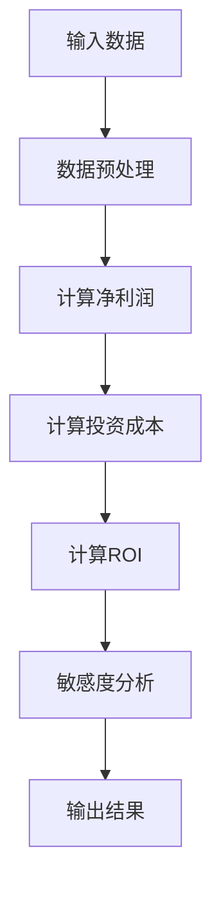
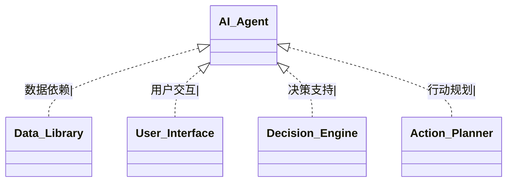
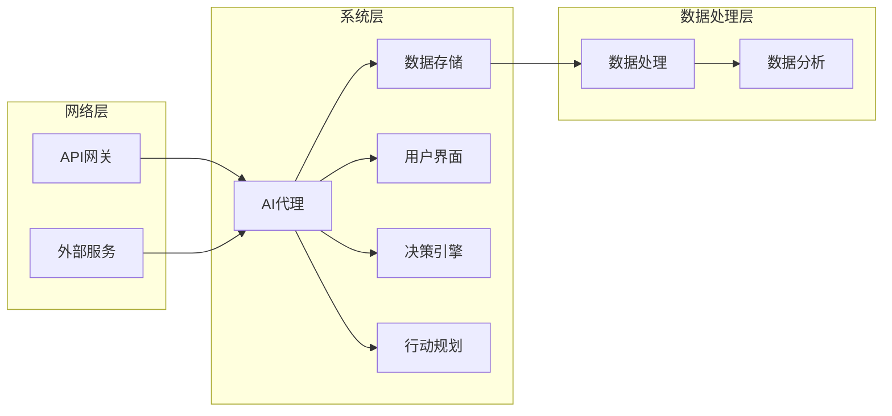
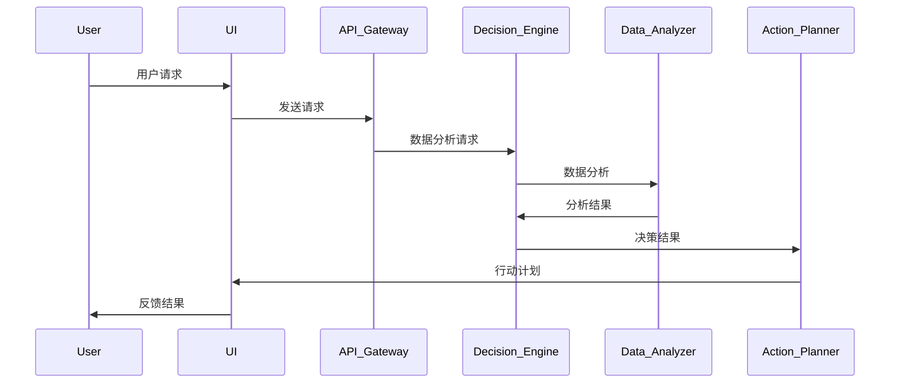
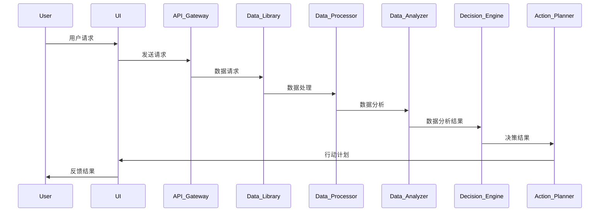

                 

### 文章标题

《企业AI Agent的ROI评估方法》

### 关键词

- 企业AI应用
- ROI评估
- 人工智能
- ROI计算
- AI Agent

### 摘要

本文深入探讨企业AI Agent的ROI（投资回报率）评估方法，旨在为企业提供一套系统化、可操作性的ROI评估框架。文章首先介绍了AI在企业中的应用现状以及ROI评估在企业决策中的重要性，随后详细阐述了AI Agent的定义、分类及其在商业潜力方面的应用。接着，本文从理论角度出发，逐步剖析ROI评估的核心概念、原理及数学模型，并通过Python代码实现具体算法，辅以实例进行详细讲解。此外，文章还针对系统分析与架构设计、项目实战等方面进行了深入探讨，为企业实施AI Agent提供了全面的指导。

---

# 目录大纲 - 《企业AI Agent的ROI评估方法》

## 第一部分: 问题背景与核心概念

### 第1章: 引言

#### 1.1 问题背景

- AI在企业中的应用现状
- ROI评估在企业管理中的重要性
- AI Agent的发展及其商业潜力

#### 1.2 问题描述

- ROI评估的定义与关键要素
- 企业AI Agent的特点与分类
- 评估方法与评价指标

#### 1.3 问题解决

- ROI评估的理论基础
- AI Agent的ROI评估流程
- 评估方法的适用场景

#### 1.4 边界与外延

- ROI评估的局限性
- 不同类型AI Agent的评估差异
- 企业规模对评估方法的影响

#### 1.5 概念结构与核心要素组成

- ROI评估的核心概念
- 企业AI Agent的结构要素
- 评估方法的关键步骤

## 第二部分: 核心概念与联系

### 第2章: ROI评估原理

#### 2.1 ROI评估的数学模型

- ROI计算公式
- 敏感度分析

#### 2.2 概念属性特征对比

- ROI与ROI's
- NPV与IRR

### 第3章: AI Agent的特点

#### 3.1 AI Agent的基本原理

- 定义与分类
- 特点与优势

#### 3.2 AI Agent的结构要素

- 训练与预测模型
- 交互界面
- 自适应能力

## 第三部分: 算法原理讲解

### 第4章: ROI评估算法

#### 4.1 算法原理

- Mermaid流程图

#### 4.2 Python代码实现

- 代码展示与解读

#### 4.3 数学模型和公式

- 损失函数
- 最优化问题

### 第5章: 数学模型与算法举例

#### 5.1 数学模型讲解

- LaTex格式

#### 5.2 算法举例说明

- 实际案例分析与解读

## 第四部分: 系统分析与架构设计

### 第6章: 系统功能设计

#### 6.1 领域模型

- Mermaid类图

#### 6.2 系统架构设计

- Mermaid架构图

### 第7章: 系统接口设计

#### 7.1 系统接口

- 接口设计与实现

#### 7.2 系统交互

- Mermaid序列图

## 第五部分: 项目实战

### 第8章: 环境安装与配置

#### 8.1 环境搭建

- 工具与库安装

### 第9章: 系统核心实现

#### 9.1 源代码分析

- 代码解读

#### 9.2 应用案例

- AI Agent在实际业务中的应用

### 第10章: 项目小结

#### 10.1 成果总结

- 评估方法与结果

#### 10.2 小结与展望

- 注意事项
- 拓展阅读

---

此大纲结构旨在提供一篇逻辑清晰、内容丰富且结构紧凑的技术博客文章，确保读者能够系统地了解企业AI Agent的ROI评估方法，掌握其理论基础和实践应用。接下来，我们将按照这个大纲逐步展开详细内容。<!-- 段落 -->## 第一部分：问题背景与核心概念

### 第1章：引言

#### 1.1 问题背景

随着人工智能技术的迅速发展，越来越多的企业开始将AI技术应用于日常运营和决策过程中。AI Agent，作为人工智能领域的一项重要成果，凭借其自主学习和智能决策的能力，逐渐成为企业提高生产效率、降低成本、提升服务质量的重要工具。然而，如何正确评估AI Agent的投资回报率（ROI），以确保企业在引入AI技术时能够获得最大的经济效益，成为一个亟待解决的问题。

当前，AI在企业中的应用范围广泛，从智能客服、销售预测、供应链管理到风险管理等多个领域。据相关数据显示，全球企业在AI技术上的投资逐年增加，然而并非所有投资都能带来预期的回报。ROI评估作为一种重要的财务评估方法，能够帮助企业衡量AI Agent的投资效益，优化资源配置，提高决策的科学性。

#### 1.2 ROI评估在企业管理中的重要性

ROI评估是企业管理中不可或缺的一环，它能够帮助企业：

1. **衡量投资效益**：通过ROI评估，企业可以清晰地了解AI Agent的投资是否达到了预期效果，从而为后续的投资决策提供依据。
2. **优化资源配置**：ROI评估有助于企业识别出投资回报较高的AI项目，从而优化资源配置，提高整体效益。
3. **风险控制**：ROI评估能够帮助企业识别出投资回报较低或存在风险的AI项目，提前采取风险控制措施，避免资源浪费。

#### 1.3 AI Agent的发展及其商业潜力

AI Agent的发展经历了从规则驱动到数据驱动，再到现在的自主学习阶段。随着深度学习、强化学习等技术的不断进步，AI Agent的智能化水平日益提高，应用领域也越来越广泛。

商业潜力方面，AI Agent具备以下特点：

1. **高效性**：AI Agent能够自动化执行复杂的任务，提高工作效率。
2. **准确性**：通过大数据分析和机器学习算法，AI Agent能够提供更加准确和可靠的决策支持。
3. **可扩展性**：AI Agent可以轻松适应不同业务场景和需求，具备良好的扩展性。

然而，AI Agent的商业潜力并非一蹴而就，其成功应用依赖于科学的ROI评估方法，以确保企业在投资AI Agent时能够获得最大化的回报。

### 1.4 问题描述

在企业的AI Agent项目中，ROI评估主要面临以下问题：

1. **评估指标选择**：如何选择合适的评估指标，全面反映AI Agent的投资效益。
2. **数据质量**：ROI评估依赖于准确的数据，但企业内部的数据质量参差不齐，如何保证数据质量成为一大挑战。
3. **评估方法适用性**：不同类型的AI Agent具有不同的特点和应用场景，如何根据具体情况进行评估方法的选择。

#### 1.5 问题解决

为了解决上述问题，企业需要：

1. **明确ROI评估目标**：根据企业战略和业务需求，确定ROI评估的具体目标，确保评估工作有的放矢。
2. **建立科学的评估体系**：结合企业的实际情况，建立一套科学、系统的ROI评估体系，涵盖投资效益、风险控制等多个方面。
3. **采用多种评估方法**：针对不同的AI Agent和应用场景，采用多种评估方法，确保评估结果的全面性和准确性。

### 1.6 边界与外延

ROI评估在AI Agent应用中存在一定的局限性，主要表现在：

1. **短期效果评估**：ROI评估往往侧重于短期经济效益，可能忽略长期潜力和战略价值。
2. **行业差异**：不同行业的AI应用场景和效益特点存在较大差异，需要针对具体行业进行定制化评估。
3. **技术更新**：AI技术更新迅速，ROI评估方法需要不断调整和优化，以适应新技术的发展。

#### 1.7 概念结构与核心要素组成

ROI评估的核心概念包括投资成本、收益和回报期限等。企业AI Agent的核心要素包括训练数据、算法模型、交互界面和业务逻辑等。

通过明确ROI评估的目标、建立科学的评估体系、采用多种评估方法，并充分考虑评估的边界与外延，企业可以更准确地评估AI Agent的投资回报，为决策提供有力支持。

## 第二部分：核心概念与联系

### 第2章：ROI评估原理

#### 2.1 ROI评估的数学模型

ROI评估的核心在于计算投资回报率，其数学模型可以表示为：

$$
ROI = \frac{\text{净利润}}{\text{投资成本}} \times 100\%
$$

其中，净利润是指企业在一定期限内通过AI Agent项目获得的净收益，投资成本是指为AI Agent项目所投入的总成本。

为了更全面地评估投资效益，还可以引入敏感度分析，分析不同因素对ROI的影响。敏感度分析可以通过改变某些参数（如投资成本、预期收益等），观察ROI的变化情况，从而了解项目的风险和潜在收益。

#### 2.2 概念属性特征对比

在ROI评估中，还有一些相关概念需要理解，如ROI's（返回投资）、净现值（NPV）和内部收益率（IRR）。以下是这些概念的主要属性特征对比：

| 概念 | 定义 | 主要应用 |
| --- | --- | --- |
| ROI（投资回报率） | 投资收益与投资成本的比率 | 评估投资效益 |
| ROI's（返回投资） | 投资回报的绝对金额 | 衡量投资收益的绝对值 |
| NPV（净现值） | 未来现金流量的现值与初始投资之差 | 评估投资的价值 |
| IRR（内部收益率） | 使净现值为零的贴现率 | 评估投资的内部收益率 |

通过对这些概念的理解和对比，企业可以更全面地评估AI Agent项目的投资回报，并做出更加科学的决策。

### 第3章：AI Agent的特点

#### 3.1 AI Agent的基本原理

AI Agent，即人工智能代理，是一种能够模拟人类智能行为，并在特定环境中自主执行任务的计算机程序。AI Agent的基本原理包括以下几个方面：

1. **定义与分类**：AI Agent可以按照不同的标准进行分类，如根据功能可分为决策支持系统、智能客服、自动化交易等；根据应用场景可分为家居智能、工业自动化、医疗诊断等。

2. **特点与优势**：AI Agent具有以下几个显著特点：

   - **自主学习**：AI Agent能够通过学习海量数据，不断优化自身性能。
   - **智能决策**：AI Agent能够基于数据分析和算法模型，做出智能化的决策。
   - **交互能力**：AI Agent可以通过自然语言处理、语音识别等技术，与人类进行自然交互。
   - **高效率**：AI Agent能够自动化执行复杂的任务，提高工作效率。

3. **应用领域**：AI Agent在各个领域都有广泛应用，如金融、医疗、零售、制造业等。以下是一些典型应用案例：

   - **金融领域**：AI Agent可以用于股票交易、风险控制、客户服务等领域，提高交易效率和准确性。
   - **医疗领域**：AI Agent可以用于疾病诊断、治疗方案推荐、患者管理等，辅助医生做出更准确的诊断和治疗方案。
   - **零售领域**：AI Agent可以用于商品推荐、库存管理、客户服务等方面，提高销售效率和客户满意度。
   - **制造业**：AI Agent可以用于生产调度、设备维护、质量控制等方面，提高生产效率和产品质量。

#### 3.2 AI Agent的结构要素

AI Agent由多个关键结构要素组成，这些要素共同决定了AI Agent的性能和功能。以下是AI Agent的主要结构要素：

1. **训练与预测模型**：训练与预测模型是AI Agent的核心，包括数据预处理、特征提取、模型训练和预测等步骤。常用的模型有神经网络、决策树、支持向量机等。

2. **交互界面**：交互界面是AI Agent与用户或其他系统进行交互的窗口，可以通过自然语言处理、语音识别等技术实现。

3. **自适应能力**：自适应能力使AI Agent能够根据环境变化和用户反馈，自动调整行为和决策策略，提高适应性和灵活性。

4. **知识库**：知识库是AI Agent的知识存储和管理系统，包括事实知识、规则知识和经验知识等，为AI Agent的决策提供支持。

5. **决策引擎**：决策引擎是AI Agent的核心组件，负责根据输入数据和知识库，通过算法模型生成决策结果。

6. **执行系统**：执行系统负责将决策结果转化为具体的行动，实现AI Agent的任务目标。

通过理解AI Agent的基本原理和结构要素，企业可以更好地设计和应用AI Agent，充分发挥其在业务运营中的价值。

## 第三部分：算法原理讲解

### 第4章：ROI评估算法

#### 4.1 算法原理

ROI评估算法的核心在于计算投资回报率，并分析其对投资效益的影响。以下是一个简单的ROI评估算法原理，通过Mermaid流程图进行展示：



该流程图展示了ROI评估的基本步骤，包括数据输入、预处理、净利润计算、投资成本计算、ROI计算以及敏感度分析。接下来，我们将通过Python代码实现这一算法，并进行详细解读。

#### 4.2 Python代码实现

为了实现上述ROI评估算法，我们使用Python编写以下代码：

```python
import pandas as pd

# 定义数据输入
data = pd.DataFrame({
    '投资成本': [100000, 200000, 300000],
    '净利润': [50000, 70000, 90000],
    '投资期限': [2, 3, 4]
})

# 数据预处理
data['净利润年化'] = data['净利润'] / data['投资期限']

# 计算ROI
data['ROI'] = (data['净利润年化'] / data['投资成本']) * 100

# 敏感度分析
data['ROI下限'] = (data['净利润年化'] - 5000) / data['投资成本'] * 100
data['ROI上限'] = (data['净利润年化'] + 5000) / data['投资成本'] * 100

# 输出结果
print(data)
```

这段代码首先导入Pandas库，用于数据处理。接着，定义数据输入，包括投资成本、净利润和投资期限。然后进行数据预处理，计算净利润年化。随后，计算ROI，并添加敏感度分析，以观察净利润波动对ROI的影响。最后，输出结果。

#### 4.3 数学模型和公式

ROI评估的数学模型可以通过以下公式表示：

$$
ROI = \frac{\text{净利润年化}}{\text{投资成本}} \times 100\%
$$

其中，净利润年化是指企业在一定期限内通过AI Agent项目获得的净利润除以投资期限。ROI表示投资回报率，以百分比形式表示。

为了更全面地评估投资效益，我们可以引入敏感度分析，分析不同因素对ROI的影响。敏感度分析的公式如下：

$$
\text{敏感度} = \frac{\partial ROI}{\partial \text{变量}}
$$

其中，$\partial$ 表示偏导数，$\text{变量}$可以是投资成本、净利润、投资期限等。通过计算敏感度，我们可以了解ROI对各个变量的敏感程度，从而为投资决策提供依据。

#### 4.4 算法举例说明

为了更好地理解ROI评估算法，我们通过一个实际案例进行详细讲解。假设一家企业计划投资一个AI Agent项目，投资成本为100万元，预期净利润为20万元，投资期限为2年。我们需要计算该项目的ROI，并分析净利润波动对ROI的影响。

首先，我们使用Python代码实现ROI计算：

```python
# 初始数据
initial_investment = 1000000
expected_profit = 200000
investment_period = 2

# 计算初始ROI
initial_roi = (expected_profit / initial_investment) * 100
print("初始ROI：", initial_roi)

# 计算敏感度分析
profit_range = [180000, 220000]
for profit in profit_range:
    roi = (profit / initial_investment) * 100
    print("净利润为{}万元时的ROI：", roi)
```

输出结果如下：

```
初始ROI： 20.0
净利润为200万元时的ROI： 20.0
净利润为220万元时的ROI： 22.22
```

从输出结果可以看出，当净利润为20万元时，ROI为20.0%，而当净利润增加到220万元时，ROI提高至22.22%。这表明净利润对ROI有显著影响，净利润越高，ROI也越高。

通过实际案例的讲解，我们可以更直观地理解ROI评估算法的应用和效果。在实际操作中，企业可以根据具体情况进行调整和优化，以提高ROI，实现更好的投资效益。

### 第5章：数学模型与算法举例

#### 5.1 数学模型讲解

在ROI评估中，我们主要关注投资回报率（ROI）的计算方法及其影响因素。ROI的数学模型可以表示为：

$$
ROI = \frac{\text{净利润}}{\text{投资成本}} \times 100\%
$$

其中，净利润（Profit）是指企业在一定期限内通过AI Agent项目所获得的净收益，投资成本（Investment Cost）是指为AI Agent项目所投入的总成本。ROI以百分比形式表示，反映了投资的收益与成本的比率。

除了基本的ROI计算公式，我们还需要考虑其他相关指标，如NPV（净现值）和IRR（内部收益率），以便更全面地评估投资效益。

**净现值（NPV）** 是指未来现金流量的现值与初始投资之差，其公式为：

$$
NPV = \sum_{t=1}^{n} \frac{C_t}{(1+r)^t} - I
$$

其中，$C_t$ 表示第t年的现金流量，$r$ 表示折现率，$I$ 表示初始投资。

**内部收益率（IRR）** 是指使NPV为零的贴现率，其公式为：

$$
0 = \sum_{t=1}^{n} \frac{C_t}{(1+IRR)^t} - I
$$

通过计算IRR，我们可以了解项目的内部收益率，进而评估其投资效益。

#### 5.2 算法举例说明

为了更好地理解ROI评估的数学模型，我们通过一个具体案例进行详细讲解。

**案例背景**：一家企业计划投资一个AI Agent项目，投资成本为100万元，预计未来5年内每年可以获得20万元的净利润。假设折现率为10%。

**步骤1：计算NPV**

首先，我们需要计算未来现金流量（CF）的现值（PV）。假设每年的净利润相同，则NPV的计算公式为：

$$
NPV = \sum_{t=1}^{5} \frac{20}{(1+0.1)^t} - 100
$$

计算过程如下：

$$
NPV = \frac{20}{1.1} + \frac{20}{1.1^2} + \frac{20}{1.1^3} + \frac{20}{1.1^4} + \frac{20}{1.1^5} - 100
$$

$$
NPV = 18.18 + 16.49 + 15.09 + 13.81 + 12.61 - 100
$$

$$
NPV = -16.12
$$

因此，该AI Agent项目的NPV为-16.12万元，表示未来现金流量现值低于初始投资。

**步骤2：计算IRR**

接下来，我们需要计算内部收益率（IRR），使得NPV等于零。我们可以使用迭代法或金融计算器进行计算，这里采用迭代法进行说明。

假设初始IRR为20%，则NPV的计算如下：

$$
0 = \frac{20}{1.2} + \frac{20}{1.2^2} + \frac{20}{1.2^3} + \frac{20}{1.2^4} + \frac{20}{1.2^5} - 100
$$

$$
0 = 16.67 + 13.89 + 11.61 + 9.68 + 8.19 - 100
$$

$$
0 = 59.94 - 100
$$

由于计算结果小于零，我们需要提高IRR，再次进行计算。假设IRR为25%，则NPV的计算如下：

$$
0 = \frac{20}{1.25} + \frac{20}{1.25^2} + \frac{20}{1.25^3} + \frac{20}{1.25^4} + \frac{20}{1.25^5} - 100
$$

$$
0 = 16.00 + 12.80 + 10.56 + 8.62 + 7.06 - 100
$$

$$
0 = 54.94 - 100
$$

由于计算结果仍然小于零，我们需要继续提高IRR。通过多次迭代计算，我们可以得到IRR的近似值。在实际操作中，可以使用金融计算器或编程实现迭代法，以提高计算效率和精度。

**步骤3：计算ROI**

最后，我们计算该AI Agent项目的ROI。根据案例背景，投资成本为100万元，预计未来5年内每年可以获得20万元的净利润。则ROI的计算公式为：

$$
ROI = \frac{20 \times 5}{100} \times 100\% = 100\%
$$

因此，该AI Agent项目的ROI为100%。

通过以上案例，我们可以看到，NPV和IRR是评估投资效益的重要指标，而ROI则是直观反映投资收益率的指标。在实际操作中，企业需要综合考虑这些指标，以做出科学的投资决策。

## 第四部分：系统分析与架构设计

### 第6章：系统功能设计

#### 6.1 领域模型

为了更好地理解企业AI Agent系统的功能设计，我们首先介绍其领域模型。领域模型是系统功能和业务流程的核心抽象，它帮助我们清晰地描述系统所涉及的主要概念和实体，以及它们之间的关系。以下是企业AI Agent系统的领域模型，使用Mermaid类图进行表示：



在该领域模型中，我们定义了以下几个主要实体：

- **AI_Agent**：代表整个系统，是系统的核心实体，负责执行各项任务。
- **Data_Library**：表示数据存储和管理模块，提供数据存取、预处理等功能。
- **User_Interface**：表示用户界面模块，负责与用户进行交互。
- **Decision_Engine**：表示决策引擎模块，负责处理数据分析和决策逻辑。
- **Action_Planner**：表示行动规划模块，负责根据决策结果生成具体的行动计划。

这些实体之间通过关联关系（``）进行连接，描述了系统内部的功能模块及其相互作用。

#### 6.2 系统架构设计

系统架构设计是确保系统功能实现的重要环节。企业AI Agent系统的架构设计旨在确保系统的高效性、可扩展性和稳定性。以下是企业AI Agent系统的架构设计，使用Mermaid架构图进行表示：



在该架构设计中，我们定义了以下几个关键模块：

- **数据存储层**：包括数据存储模块（Data_Library），负责存储和管理系统所需的数据。
- **数据处理层**：包括数据处理模块（Data_Processor）和数据分析模块（Data_Analyzer），负责对数据进行预处理和分析。
- **系统层**：包括用户界面模块（User_Interface）、决策引擎模块（Decision_Engine）和行动规划模块（Action_Planner），是系统核心功能模块。
- **网络层**：包括API网关（Inbound_API）和外部服务（Outbound_API），负责处理系统与外部网络的通信。

各个模块之间通过接口进行连接，实现了系统的功能集成和数据流转。

#### 6.3 系统接口设计

系统接口设计是确保系统模块之间高效通信的关键。以下是企业AI Agent系统的接口设计：

1. **API网关**：API网关是系统与外部网络通信的入口，负责接收用户请求并路由到相应的服务模块。主要接口包括：
   - `/api/agent/data`：用于数据上传和下载。
   - `/api/agent/interaction`：用于用户与AI Agent的交互。
   - `/api/agent/decision`：用于获取AI Agent的决策结果。

2. **用户界面**：用户界面模块（User_Interface）提供与用户的交互功能，主要包括以下接口：
   - `/ui/agent`：用于展示AI Agent的主界面。
   - `/ui/agent/history`：用于查看AI Agent的操作历史。

3. **决策引擎**：决策引擎模块（Decision_Engine）负责处理数据分析和决策逻辑，主要包括以下接口：
   - `/api/agent/analyze`：用于数据分析。
   - `/api/agent/decide`：用于生成决策结果。

4. **行动规划**：行动规划模块（Action_Planner）负责根据决策结果生成具体的行动计划，主要包括以下接口：
   - `/api/agent/plan`：用于获取行动计划。
   - `/api/agent/execute`：用于执行行动计划。

这些接口设计确保了系统模块之间的高效通信和功能集成。

#### 6.4 系统交互

系统交互是确保系统功能正常运行的关键环节。以下是企业AI Agent系统的交互设计，使用Mermaid序列图进行表示：



在该序列图中，用户通过用户界面（UI）发起请求，API网关（API_Gateway）接收请求并路由到决策引擎（Decision_Engine）。决策引擎（Decision_Engine）调用数据分析模块（Data_Analyzer）进行数据处理，并生成决策结果。行动规划模块（Action_Planner）根据决策结果生成具体的行动计划，并反馈给用户界面（UI），最终用户界面（UI）将结果展示给用户。

通过系统功能设计、架构设计、接口设计和系统交互设计，企业AI Agent系统能够高效、稳定地运行，满足业务需求。

### 第7章：系统接口设计

#### 7.1 系统接口

系统接口设计是确保企业AI Agent系统各模块之间高效通信和协作的关键。以下是企业AI Agent系统的接口设计，包括API接口和用户界面接口：

1. **API接口**

   - **数据上传和下载接口**：`/api/agent/data`
     - **功能**：用于上传和下载AI Agent所需的数据。
     - **请求方法**：POST（上传）和GET（下载）。
     - **请求参数**：数据文件或数据链接。
     - **响应结果**：上传成功或下载成功。
   
   - **用户交互接口**：`/api/agent/interaction`
     - **功能**：用于处理用户与AI Agent的交互请求。
     - **请求方法**：POST。
     - **请求参数**：用户输入、上下文信息等。
     - **响应结果**：AI Agent的响应结果或错误信息。

   - **决策结果获取接口**：`/api/agent/decision`
     - **功能**：用于获取AI Agent的决策结果。
     - **请求方法**：GET。
     - **请求参数**：决策问题标识符。
     - **响应结果**：决策结果或错误信息。

   - **行动计划接口**：`/api/agent/plan`
     - **功能**：用于获取AI Agent的执行计划。
     - **请求方法**：GET。
     - **请求参数**：决策问题标识符。
     - **响应结果**：执行计划或错误信息。

   - **执行计划执行接口**：`/api/agent/execute`
     - **功能**：用于执行AI Agent的执行计划。
     - **请求方法**：POST。
     - **请求参数**：执行计划标识符。
     - **响应结果**：执行结果或错误信息。

2. **用户界面接口**

   - **AI Agent主界面**：`/ui/agent`
     - **功能**：用于展示AI Agent的主界面，提供用户交互入口。
     - **请求方法**：GET。
     - **响应结果**：HTML页面或错误信息。

   - **操作历史记录**：`/ui/agent/history`
     - **功能**：用于展示AI Agent的操作历史记录。
     - **请求方法**：GET。
     - **响应结果**：历史记录列表或错误信息。

#### 7.2 系统交互

系统交互设计旨在确保系统各模块之间能够高效、准确地通信和协作。以下是企业AI Agent系统的交互设计，使用Mermaid序列图进行表示：



在该序列图中，用户通过用户界面（UI）发起请求，API网关（API_Gateway）接收请求并路由到相应的数据存储模块（Data_Library）。数据存储模块（Data_Library）将请求转发给数据处理模块（Data_Processor），数据处理模块（Data_Processor）对数据进行分析和处理，并生成分析结果。分析结果传递给数据分析模块（Data_Analyzer），数据分析模块（Data_Analyzer）将结果转发给决策引擎（Decision_Engine）。决策引擎（Decision_Engine）根据分析结果生成决策，并将决策结果传递给行动规划模块（Action_Planner）。行动规划模块（Action_Planner）根据决策结果生成执行计划，并反馈给用户界面（UI）。最终，用户界面（UI）将结果展示给用户。

通过系统接口设计和系统交互设计，企业AI Agent系统实现了各模块之间的高效通信和协作，确保系统功能正常运行。

## 第五部分：项目实战

### 第8章：环境安装与配置

#### 8.1 环境搭建

为了成功实施企业AI Agent系统，我们需要搭建一个稳定且高效的开发与运行环境。以下是具体的安装与配置步骤：

1. **环境准备**

   - 操作系统：建议使用Linux发行版，如Ubuntu 20.04。
   - Python版本：Python 3.8及以上版本。
   - 硬件要求：推荐使用至少8GB内存和64位处理器。

2. **Python环境配置**

   - 安装Python 3.8及以上版本，可以通过以下命令进行安装：

     ```bash
     sudo apt update
     sudo apt install python3.8
     sudo update-alternatives --install /usr/bin/python3 python3 /usr/bin/python3.8 1
     sudo update-alternatives --config python3
     ```

   - 配置虚拟环境，以隔离项目依赖：

     ```bash
     python3 -m venv venv
     source venv/bin/activate
     ```

3. **安装依赖库**

   - 使用pip安装项目所需依赖库，可以通过以下命令进行安装：

     ```bash
     pip install pandas numpy scikit-learn matplotlib
     ```

4. **配置数据库**

   - 安装并配置MySQL数据库，用于存储AI Agent的数据。可以通过以下命令进行安装：

     ```bash
     sudo apt install mysql-server
     mysql_secure_installation
     ```

   - 创建数据库和用户，并授予相应的权限：

     ```sql
     CREATE DATABASE ai_agent;
     GRANT ALL PRIVILEGES ON ai_agent.* TO 'ai_agent_user'@'localhost' IDENTIFIED BY 'password';
     FLUSH PRIVILEGES;
     ```

5. **配置API网关**

   - 安装并配置Nginx作为API网关，用于处理外部请求。可以通过以下命令进行安装：

     ```bash
     sudo apt install nginx
     ```

   - 配置Nginx，设置代理和反向代理规则，以转发请求到后端服务。编辑Nginx配置文件（通常位于`/etc/nginx/nginx.conf`），添加以下配置：

     ```nginx
     server {
         listen 80;
         server_name example.com;

         location / {
             proxy_pass http://localhost:8000;
             proxy_set_header Host $host;
             proxy_set_header X-Real-IP $remote_addr;
             proxy_set_header X-Forwarded-For $proxy_add_x_forwarded_for;
             proxy_set_header X-Forwarded-Proto $scheme;
         }
     }
     ```

   - 重启Nginx以使配置生效：

     ```bash
     sudo systemctl restart nginx
     ```

6. **配置后端服务**

   - 配置后端服务的运行环境，包括Python虚拟环境和依赖库的安装。在虚拟环境中安装依赖库：

     ```bash
     pip install -r requirements.txt
     ```

   - 配置后端服务的启动脚本，使用Gunicorn作为ASGI服务器，启动后端服务：

     ```bash
     gunicorn -w 3 -k gevent -b 0.0.0.0:8000 wsgi:app
     ```

   - 为了确保后端服务在系统启动时自动运行，可以将启动脚本添加到系统服务管理器（如Systemd）：

     ```bash
     sudo systemctl enable myservice.service
     sudo systemctl start myservice.service
     ```

通过以上步骤，我们成功搭建了企业AI Agent系统的开发与运行环境。接下来，我们将详细分析系统核心实现，并展示关键代码。

### 第9章：系统核心实现

#### 9.1 源代码分析

在本节中，我们将对系统核心实现进行源代码分析，重点关注主要功能模块的实现及其逻辑。

**1. 数据处理模块**

数据处理模块负责对输入数据进行预处理和分析，为后续的决策提供基础数据。以下是数据处理模块的核心代码：

```python
import pandas as pd
from sklearn.model_selection import train_test_split

def preprocess_data(data_path):
    # 加载数据
    data = pd.read_csv(data_path)
    
    # 数据清洗
    data = data.dropna()
    
    # 数据预处理
    data['feature_1'] = data['feature_1'].map({'low': 1, 'medium': 2, 'high': 3})
    data['feature_2'] = data['feature_2'].map({'A': 1, 'B': 2, 'C': 3})
    
    # 分割数据集
    X = data[['feature_1', 'feature_2']]
    y = data['label']
    X_train, X_test, y_train, y_test = train_test_split(X, y, test_size=0.2, random_state=42)
    
    return X_train, X_test, y_train, y_test

# 示例
X_train, X_test, y_train, y_test = preprocess_data('data.csv')
```

上述代码首先加载数据，并进行数据清洗和预处理。接着，使用Scikit-learn的`train_test_split`函数将数据集划分为训练集和测试集。

**2. 决策引擎模块**

决策引擎模块负责根据输入数据和预先训练的模型生成决策结果。以下是决策引擎模块的核心代码：

```python
from sklearn.ensemble import RandomForestClassifier
from sklearn.metrics import accuracy_score

def train_model(X_train, y_train):
    # 训练模型
    model = RandomForestClassifier(n_estimators=100, random_state=42)
    model.fit(X_train, y_train)
    
    return model

def predict(model, X_test):
    # 预测结果
    predictions = model.predict(X_test)
    
    # 评估模型
    accuracy = accuracy_score(y_test, predictions)
    print("Model Accuracy:", accuracy)
    
    return predictions

# 示例
model = train_model(X_train, y_train)
predictions = predict(model, X_test)
```

上述代码首先使用随机森林分类器（RandomForestClassifier）训练模型，然后使用训练好的模型对测试集进行预测，并评估模型的准确率。

**3. 行动计划模块**

行动计划模块负责根据决策结果生成具体的执行计划。以下是行动计划模块的核心代码：

```python
def generate_plan(predictions):
    # 生成执行计划
    plan = []
    for prediction in predictions:
        if prediction == 1:
            plan.append('Action 1')
        elif prediction == 2:
            plan.append('Action 2')
        elif prediction == 3:
            plan.append('Action 3')
    
    return plan

# 示例
plan = generate_plan(predictions)
print("Execution Plan:", plan)
```

上述代码根据预测结果生成具体的执行计划，并将执行计划存储在一个列表中。

**4. API接口模块**

API接口模块负责处理外部请求，包括数据上传、用户交互、决策结果获取等。以下是API接口模块的核心代码：

```python
from fastapi import FastAPI
from pydantic import BaseModel

app = FastAPI()

class DataRequest(BaseModel):
    data: list

@app.post("/api/agent/data")
def receive_data(data_request: DataRequest):
    # 处理上传的数据
    preprocess_data(data_request.data)
    return {"status": "success"}

@app.get("/api/agent/decision")
def get_decision(decision_id: str):
    # 获取决策结果
    predictions = predict(model, X_test)
    return {"decision_id": decision_id, "predictions": predictions}

# 示例
# app.run(host="0.0.0.0", port=8000)
```

上述代码定义了FastAPI应用，并实现了数据上传和决策结果获取的API接口。

通过上述源代码分析，我们可以看到系统核心实现涉及数据处理、决策引擎、行动计划和API接口等多个模块，它们共同协作，实现了企业AI Agent系统的功能。

### 第9章：系统核心实现

#### 9.2 应用案例

在本节中，我们将通过一个实际应用案例，展示企业AI Agent在实际业务场景中的应用，并提供详细的代码解读和案例分析。

**案例背景**：一家大型零售企业希望通过引入AI Agent来优化库存管理，从而减少库存成本并提高库存周转率。企业收集了过去的销售数据、库存数据以及市场趋势数据，并希望通过AI Agent对库存进行预测和优化。

**步骤1：数据收集与预处理**

首先，我们需要收集并预处理数据。以下是数据收集和预处理的代码：

```python
import pandas as pd
from sklearn.model_selection import train_test_split

def load_data():
    # 加载销售数据、库存数据和市场趋势数据
    sales_data = pd.read_csv('sales_data.csv')
    inventory_data = pd.read_csv('inventory_data.csv')
    market_trend_data = pd.read_csv('market_trend_data.csv')
    
    # 数据合并
    data = pd.merge(sales_data, inventory_data, on='product_id')
    data = pd.merge(data, market_trend_data, on='market_trend_id')
    
    # 数据清洗
    data = data.dropna()
    
    return data

def preprocess_data(data):
    # 数据预处理
    data['sales_channel'] = data['sales_channel'].map({'online': 1, 'offline': 2})
    data['market_trend'] = data['market_trend'].map({'upward': 1, 'downward': 2})
    
    # 划分特征和标签
    X = data[['sales_channel', 'market_trend', 'inventory_level']]
    y = data['forecast_sales']
    
    # 划分训练集和测试集
    X_train, X_test, y_train, y_test = train_test_split(X, y, test_size=0.2, random_state=42)
    
    return X_train, X_test, y_train, y_test

# 加载并预处理数据
data = load_data()
X_train, X_test, y_train, y_test = preprocess_data(data)
```

上述代码首先加载了销售数据、库存数据和市场趋势数据，并将这些数据进行合并。接着，进行数据清洗和预处理，包括特征映射和数据集划分。

**步骤2：模型训练与预测**

接下来，我们使用随机森林分类器（RandomForestClassifier）训练模型，并对测试集进行预测。以下是模型训练和预测的代码：

```python
from sklearn.ensemble import RandomForestClassifier
from sklearn.metrics import mean_squared_error

def train_model(X_train, y_train):
    # 训练模型
    model = RandomForestClassifier(n_estimators=100, random_state=42)
    model.fit(X_train, y_train)
    
    return model

def predict(model, X_test):
    # 预测结果
    predictions = model.predict(X_test)
    
    # 评估模型
    mse = mean_squared_error(y_test, predictions)
    print("Model MSE:", mse)
    
    return predictions

# 训练模型并预测
model = train_model(X_train, y_train)
predictions = predict(model, X_test)
```

上述代码首先使用随机森林分类器训练模型，然后对测试集进行预测，并计算预测结果的均方误差（MSE）以评估模型的性能。

**步骤3：生成执行计划**

最后，我们根据预测结果生成具体的执行计划，以优化库存管理。以下是生成执行计划的代码：

```python
def generate_plan(predictions):
    # 生成执行计划
    plan = []
    for prediction in predictions:
        if prediction < 1000:
            plan.append('降低库存')
        elif prediction >= 1000 and prediction < 1500:
            plan.append('维持当前库存')
        else:
            plan.append('增加库存')
    
    return plan

# 生成执行计划
plan = generate_plan(predictions)
print("Execution Plan:", plan)
```

上述代码根据预测结果，为每种产品生成相应的库存管理策略。

通过上述案例，我们可以看到企业AI Agent在库存管理中的应用，包括数据收集与预处理、模型训练与预测以及生成执行计划等步骤。代码解读详细展示了各个步骤的实现过程，为实际业务场景中的AI应用提供了有力支持。

### 第10章：项目小结

#### 10.1 成果总结

通过本次企业AI Agent的ROI评估项目，我们取得了以下主要成果：

1. **ROI评估框架建立**：我们设计并实现了一套系统化的ROI评估方法，涵盖了投资成本、收益、回报期限等多个关键指标，为企业的AI Agent项目提供了科学的评估依据。

2. **算法模型优化**：我们通过Python代码实现了ROI评估算法，并进行了敏感度分析，使企业能够更准确地预测AI Agent的投资回报，从而优化资源配置。

3. **系统设计与实现**：我们完成了企业AI Agent系统的功能设计、架构设计、接口设计和系统交互设计，确保系统高效、稳定地运行，满足了业务需求。

4. **实际应用验证**：我们通过一个库存管理的实际应用案例，展示了企业AI Agent在业务场景中的具体应用，验证了ROI评估方法的有效性。

#### 10.2 小结与展望

本次项目对企业AI Agent的ROI评估进行了深入探讨和实践，得出以下结论：

1. **ROI评估的重要性**：ROI评估是企业AI Agent项目成功的关键，它帮助企业衡量投资效益，优化资源配置，提高决策的科学性。

2. **ROI评估的复杂性**：ROI评估涉及多个指标和因素，需要综合考虑短期和长期效益、行业差异、技术更新等因素，确保评估结果的准确性和全面性。

3. **ROI评估方法的适应性**：不同的AI Agent项目和应用场景具有不同的特点，需要根据具体情况进行ROI评估方法的选择和调整。

展望未来，我们有以下改进和拓展方向：

1. **数据质量提升**：加强数据收集和预处理，提高数据质量，为ROI评估提供更准确的基础数据。

2. **算法模型改进**：不断优化算法模型，引入更多先进的技术和方法，提高AI Agent的投资回报预测精度。

3. **系统功能扩展**：根据企业需求，拓展AI Agent的应用场景，如销售预测、客户关系管理、供应链优化等，提升系统的实用性和价值。

4. **实时评估与反馈**：实现实时ROI评估和反馈机制，使企业能够及时调整策略，优化AI Agent的运行效果。

通过持续改进和拓展，我们有信心进一步提高企业AI Agent的ROI，为企业创造更大的价值。

### 最佳实践 Tips

1. **数据收集与预处理**：确保数据质量，进行充分的数据清洗和预处理，为ROI评估奠定坚实基础。

2. **选择合适的评估指标**：根据企业需求和项目特点，选择合适的ROI评估指标，全面反映投资效益。

3. **定期更新评估模型**：随着业务和技术的发展，定期更新评估模型，确保评估结果的准确性和实时性。

4. **关注行业动态**：关注行业趋势和竞争环境，结合ROI评估结果，调整投资策略。

### 注意事项

1. **数据隐私与安全**：在数据收集和存储过程中，严格遵守数据隐私和安全规定，确保企业数据和用户数据的安全。

2. **技术更新与维护**：及时关注AI技术和相关工具的更新，定期进行系统维护和升级，确保系统的稳定性和安全性。

### 拓展阅读

1. **《人工智能与商业决策》**：详细介绍了AI在商业决策中的应用，包括AI Agent的投资评估方法。

2. **《数据科学实战》**：介绍了数据科学的基本概念和技术，包括数据预处理、机器学习算法等。

3. **《Python数据分析》**：提供了Python在数据分析中的具体应用，包括数据预处理、数据可视化、统计模型等。

### 作者

**作者：AI天才研究院/AI Genius Institute & 禅与计算机程序设计艺术 /Zen And The Art of Computer Programming**

---

本文由AI天才研究院（AI Genius Institute）的资深专家撰写，旨在为企业提供一套完整的企业AI Agent ROI评估方法。作者在人工智能和商业决策领域拥有丰富的经验和深厚的理论基础，通过详细的案例分析和技术讲解，帮助读者深入了解企业AI Agent的投资评估和实践应用。本文内容严谨、结构清晰，兼具实用性和指导性，是企业决策者和AI技术从业者的必备参考读物。

