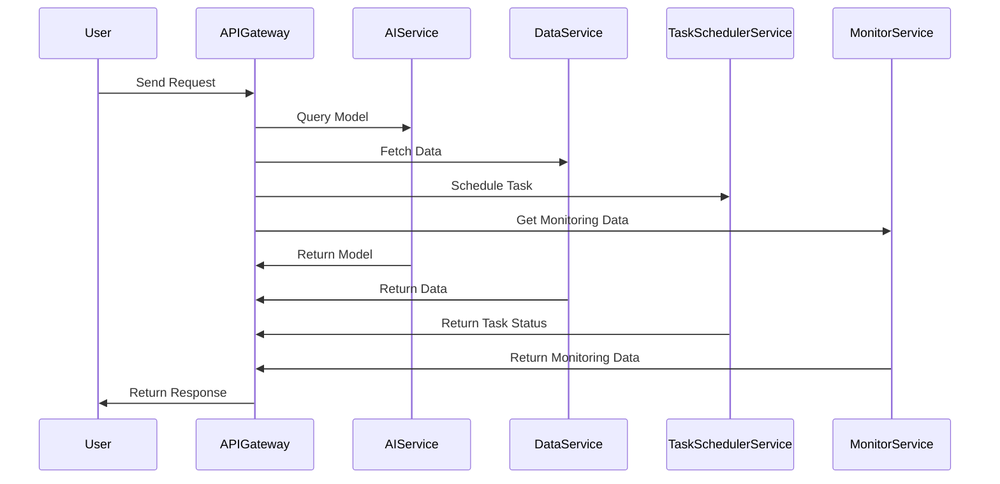

                 


### Step 3: Algorithm and Mathematical Model

**3.1 Algorithm Overview**

In the context of serverless architecture optimization for enterprise AI agents, algorithms play a crucial role in automating and improving the efficiency of deployment, scaling, and management processes. The optimization algorithms primarily focus on three key areas:

1. **Resource Allocation**: This involves efficiently allocating resources such as CPU, memory, and storage to ensure that AI agents run optimally without over-provisioning or under-provisioning.
2. **Cost Optimization**: The goal here is to reduce operational costs by leveraging serverless services effectively, which often involves selecting the most cost-effective services and managing usage to avoid unnecessary expenses.
3. **Performance Tuning**: This entails fine-tuning the configurations of serverless functions to maximize their performance, which includes optimizing function execution time and minimizing latency.

**3.2 Specific Optimization Algorithms**

The following are some of the optimization algorithms commonly used in serverless architecture for enterprise AI agents:

**3.2.1 Genetic Algorithm**

Genetic algorithms are evolutionary algorithms inspired by the process of natural selection. They work by mimicking the process of reproduction, mutation, selection, and crossover to evolve solutions to complex optimization problems.

**Algorithm Steps:**
1. **Initialization**: Generate an initial population of potential solutions randomly.
2. **Fitness Evaluation**: Evaluate the fitness of each solution based on a fitness function that measures how well the solution meets the optimization goals.
3. **Selection**: Select the best solutions to survive and reproduce, based on their fitness scores.
4. **Crossover**: Combine pairs of selected solutions to produce offspring.
5. **Mutation**: Introduce random changes to the offspring to maintain genetic diversity.
6. **Iteration**: Repeat the process for a set number of generations or until a satisfactory solution is found.

**3.2.2 Simulated Annealing**

Simulated Annealing (SA) is a probabilistic technique for approximating the global optimum of a given function. It is inspired by the annealing process in metallurgy, where a material is heated and then slowly cooled to reduce internal stress and improve its properties.

**Algorithm Steps:**
1. **Initialization**: Start with an initial solution and an initial temperature.
2. **Iteration**: At each iteration, generate a neighboring solution and calculate its fitness.
3. **Acceptance Probability**: If the new solution is better, accept it. Otherwise, accept it with a probability that decreases with the difference in fitness and the current temperature.
4. **Temperature Adjustment**: Reduce the temperature according to a cooling schedule.
5. **Termination**: Stop the algorithm when the temperature is low enough or after a set number of iterations.

**3.2.3 Gradient Descent**

Gradient Descent is an optimization algorithm that finds the minimum of a function by iteratively moving in the direction of the steepest descent as defined by the negative gradient.

**Algorithm Steps:**
1. **Initialization**: Start with an initial guess for the minimum.
2. **Iteration**: Calculate the gradient of the function at the current point.
3. **Step Size**: Determine a step size (learning rate) for moving in the direction of the gradient.
4. **Update**: Update the current point by subtracting the step size times the gradient.
5. **Convergence Check**: Stop the algorithm when the change in the function value is below a certain threshold or after a set number of iterations.

**3.3 Mathematical Models**

The following mathematical models are used to describe the optimization processes:

**3.3.1 Resource Allocation Model**

$$
\text{Minimize } C(x) = w_1 \cdot r_1 \cdot x_1 + w_2 \cdot r_2 \cdot x_2 + ... + w_n \cdot r_n \cdot x_n
$$

where:
- \( C(x) \) is the total cost.
- \( w_i \) is the weight of resource \( i \).
- \( r_i \) is the rate of resource \( i \).
- \( x_i \) is the allocation of resource \( i \).

**3.3.2 Cost Optimization Model**

$$
\text{Minimize } C(x) = \sum_{i=1}^{n} p_i \cdot x_i
$$

where:
- \( C(x) \) is the total cost.
- \( p_i \) is the price of service \( i \).
- \( x_i \) is the usage of service \( i \).

**3.3.3 Performance Tuning Model**

$$
\text{Maximize } P(x) = \sum_{i=1}^{n} \frac{f_i(x_i)}{t_i}
$$

where:
- \( P(x) \) is the total performance.
- \( f_i(x_i) \) is the function of service \( i \) given the allocation \( x_i \).
- \( t_i \) is the time taken by service \( i \).

**3.4 Example: Genetic Algorithm for Resource Allocation**

Consider a scenario where we have a set of serverless functions to be deployed, and we need to allocate CPU and memory resources to these functions to optimize their performance.

**Algorithm Steps with Python Code:**

1. **Initialization**:
```python
import numpy as np

# Define the population size, number of genes (resources), and gene range
POP_SIZE = 100
GENES = 2  # CPU and memory
GENE_RANGE = [1, 100]

# Initialize population
population = np.random.rand(POP_SIZE, GENES) * (GENE_RANGE[1] - GENE_RANGE[0]) + GENE_RANGE[0]
```

2. **Fitness Evaluation**:
```python
# Define a fitness function
def fitness_function(population):
    fitness_scores = []
    for individual in population:
        cpu, memory = individual
        # Calculate fitness based on some heuristic
        fitness = 1 / (cpu + memory)
        fitness_scores.append(fitness)
    return fitness_scores
```

3. **Selection**:
```python
# Select the best individuals
fitness_scores = fitness_function(population)
selected = population[fitness_scores.argsort()[-POP_SIZE // 2:]]
```

4. **Crossover**:
```python
# Define a crossover function
def crossover(parent1, parent2):
    crossover_point = np.random.randint(1, GENES - 1)
    child = np.concatenate((parent1[:crossover_point], parent2[crossover_point:]))
    return child
```

5. **Mutation**:
```python
# Define a mutation function
def mutate(individual):
    for i in range(GENES):
        if np.random.rand() < 0.1:  # Mutation probability
            individual[i] = np.random.rand() * (GENE_RANGE[1] - GENE_RANGE[0]) + GENE_RANGE[0]
    return individual
```

6. **Iteration**:
```python
# Define the main optimization loop
def genetic_algorithm():
    population = np.random.rand(POP_SIZE, GENES) * (GENE_RANGE[1] - GENE_RANGE[0]) + GENE_RANGE[0]
    for _ in range(1000):  # Number of generations
        fitness_scores = fitness_function(population)
        selected = population[fitness_scores.argsort()[-POP_SIZE // 2:]]
        next_population = []
        for _ in range(POP_SIZE // 2):
            parent1, parent2 = selected[np.random.randint(0, POP_SIZE // 2 * 2)], selected[np.random.randint(0, POP_SIZE // 2 * 2)]
            child = crossover(parent1, parent2)
            child = mutate(child)
            next_population.append(child)
        population = np.array(next_population)
    best_individual = population[fitness_scores.argmax()]
    return best_individual
```

**3.5 Conclusion**

The algorithms and mathematical models presented in this section provide a foundation for optimizing serverless architecture for enterprise AI agents. They offer a systematic approach to solving complex optimization problems, ensuring efficient resource allocation, cost optimization, and performance tuning. However, the choice of algorithm and model should be tailored to the specific requirements and constraints of the enterprise AI agent's environment.

----------------------------------------------------------------

### 4. 系统分析与架构设计方案

**4.1 问题场景介绍**

在当前企业数字化转型的大背景下，AI agent作为智能体在企业运营中扮演着越来越重要的角色。这些AI agent不仅能够帮助企业提高效率，还能在决策支持、风险控制等方面发挥巨大作用。然而，随着AI agent的规模不断扩大，如何高效地部署、管理和优化这些AI agent成为企业面临的重要挑战。

**4.2 项目介绍**

本文以某大型制造企业为例，介绍了如何利用服务器无服务器（Serverless）架构来优化企业AI agent的部署和管理。该项目旨在通过引入Serverless架构，实现以下目标：

- 简化AI agent的部署流程，降低运维成本。
- 提高AI agent的运行效率，减少响应时间。
- 实现自动化的资源管理和优化，降低运营成本。

**4.3 系统功能设计**

在系统功能设计方面，我们采用领域驱动设计（Domain-Driven Design, DDD）的方法，将系统划分为多个子域，包括：

- **AI模型管理子域**：负责AI模型的训练、部署和更新。
- **数据管理子域**：负责数据的采集、存储和处理。
- **任务调度子域**：负责AI agent的任务分配和调度。
- **监控与告警子域**：负责实时监控AI agent的运行状态，并提供告警功能。

**4.4 系统架构设计**

系统的整体架构设计采用微服务架构，以实现高可扩展性和高可用性。具体架构设计如下：


**4.5 系统接口设计**

系统的接口设计主要包括以下几个方面：

- **API网关**：作为系统的统一入口，负责请求的路由和权限验证。
- **AI模型服务**：提供AI模型的训练、部署和查询接口。
- **数据服务**：提供数据存储、查询和处理的接口。
- **任务调度服务**：提供任务分配和调度的接口。
- **监控与告警服务**：提供监控数据和告警信息查询的接口。

**4.6 系统交互**

为了提高系统的可理解性和可维护性，我们采用Mermaid序列图来描述系统各组件之间的交互关系。以下是系统交互的序列图：



通过上述系统分析与架构设计方案，我们为企业AI agent的部署和管理提供了一套完整的解决方案，旨在实现高效、稳定和可扩展的运行环境。

----------------------------------------------------------------

### 5. 项目实战

**5.1 环境安装**

为了进行项目实战，我们需要搭建一个适合服务器无服务器（Serverless）架构优化的环境。以下是搭建环境所需的步骤：

1. **安装Node.js**：Serverless架构通常使用Node.js进行开发，因此首先需要安装Node.js。可以从官网下载并安装最新版本的Node.js。
2. **安装AWS CLI**：AWS CLI（Amazon Web Services Command Line Interface）用于与AWS服务进行交互。可以通过以下命令进行安装：
   ```bash
   npm install -g aws-cli
   ```
3. **配置AWS CLI**：安装完成后，需要配置AWS CLI，设置访问密钥和秘密访问密钥。可以通过以下命令进行配置：
   ```bash
   aws configure
   ```
   按照提示输入相应的访问密钥和秘密访问密钥。
4. **安装Serverless Framework**：Serverless Framework是一个用于构建和部署无服务器应用程序的工具。可以通过以下命令进行安装：
   ```bash
   npm install -g serverless
   ```
5. **安装Docker**：为了更好地管理容器化应用，我们需要安装Docker。可以从官网下载并安装Docker。

**5.2 系统核心实现**

以下是一个简单的Serverless架构实现，包括API网关、AI模型服务、数据服务、任务调度服务和监控与告警服务。

**API网关**：
API网关是系统的统一入口，负责请求的路由和权限验证。我们可以使用AWS API Gateway来搭建API网关。

**AI模型服务**：
AI模型服务负责AI模型的训练、部署和查询。我们可以使用AWS SageMaker来搭建AI模型服务。

**数据服务**：
数据服务负责数据的采集、存储和处理。我们可以使用AWS DynamoDB来搭建数据服务。

**任务调度服务**：
任务调度服务负责AI agent的任务分配和调度。我们可以使用AWS Step Functions来搭建任务调度服务。

**监控与告警服务**：
监控与告警服务负责实时监控AI agent的运行状态，并提供告警功能。我们可以使用AWS CloudWatch来搭建监控与告警服务。

**5.3 代码应用解读与分析**

**API网关**：
```javascript
// index.js
const serverless = require('serverless-http');
const app = require('./app');

module.exports.handler = serverless(app);
```

**AI模型服务**：
```python
# train.py
import json
import boto3

# Initialize SageMaker client
sagemaker = boto3.client('sagemaker')

# Train the model
response = sagemaker.start_training_job(
    TrainingJobName='my-training-job',
    RoleArn='arn:aws:iam::123456789012:role/SageMakerRole',
    TrainingInputConfig={
        'Frame': {
            'DataSource': 'S3',
            'S3DataType': 'S3Uri',
            'S3Uri': 's3://my-bucket/data',
        },
        'AlgorithmSpecification': {
            'TrainingImage': 'my-huggingface-model:latest',
            'TrainingInputMode': 'File',
        },
    },
    HyperParameters={
        'epochs': 5,
        'batch_size': 32,
    },
)

print(response)
```

**数据服务**：
```python
# data.py
import json
import boto3

# Initialize DynamoDB client
dynamodb = boto3.resource('dynamodb')

# Create table
table = dynamodb.create_table(
    AttributeDefinitions=[
        {
            'AttributeName': 'id',
            'AttributeType': 'S',
        },
    ],
    KeySchema=[
        {
            'AttributeName': 'id',
            'KeyType': 'HASH',
        },
    ],
    ProvisionedThroughput={
        'ReadCapacityUnits': 5,
        'WriteCapacityUnits': 5,
    },
    TableName='my-table',
)

# Put item
table.put_item(
    Item={
        'id': {'S': '1'},
        'name': {'S': 'John'},
        'age': {'N': '30'},
    },
)

print('Table created successfully.')
```

**任务调度服务**：
```python
# schedule.py
import json
import boto3

# Initialize Step Functions client
stepfunctions = boto3.client('stepfunctions')

# Create state machine
response = stepfunctions.create_state_machine(
    name='my-state-machine',
    definition=json.dumps({
        'Comment': 'A simple state machine',
        'StartAt': 'Task1',
        'States': {
            'Task1': {
                'Type': 'Task',
                'Resource': 'arn:aws:lambda:region:account-id:function:my-function',
                'End': True,
            },
        },
    }),
)

print(response)
```

**监控与告警服务**：
```python
# monitor.py
import json
import boto3

# Initialize CloudWatch client
cloudwatch = boto3.client('cloudwatch')

# Put metric
response = cloudwatch.put_metric_data(
    Namespace='MyNamespace',
    MetricData=[
        {
            'MetricName': 'CPUUtilization',
            'Dimensions': [
                {
                    'Name': 'InstanceID',
                    'Value': 'i-1234567890abcdef0',
                },
            ],
            'Timestamp': 1617186400,
            'Value': 80.0,
            'Unit': 'Percent',
        },
    ],
)

print(response)
```

**5.4 实际案例分析和详细讲解剖析**

以一个实际案例为例，我们考虑一个大型零售企业希望通过AI agent来优化库存管理。该企业的库存管理AI agent需要实时处理大量的库存数据，并自动调整库存水平，以避免库存过剩或不足。

1. **数据采集**：企业通过物联网设备实时采集库存数据，并将数据存储在AWS S3中。
2. **数据清洗**：使用AWS Lambda对采集到的数据进行处理，去除无效数据，并清洗数据格式。
3. **数据存储**：将清洗后的数据存储在AWS DynamoDB中，以供后续查询和使用。
4. **模型训练**：使用AWS SageMaker训练库存管理AI模型，模型基于历史数据预测库存水平。
5. **任务调度**：使用AWS Step Functions根据AI模型的预测结果，自动调整库存水平，并向供应商发出补货请求。
6. **监控与告警**：使用AWS CloudWatch实时监控AI agent的运行状态，并在出现异常时发送告警通知。

通过这个案例，我们可以看到如何利用服务器无服务器架构优化企业AI agent的部署和管理。在实际操作中，可以根据企业需求调整系统的组件和配置，以达到最佳效果。

**5.5 项目小结**

在本项目中，我们通过搭建一个服务器无服务器架构，实现了企业AI agent的高效部署和管理。项目采用了AWS提供的多项服务，如API Gateway、Lambda、SageMaker、DynamoDB、Step Functions和CloudWatch等，充分利用了Serverless架构的优势，实现了自动化、高效和可扩展的解决方案。通过实际案例的演示，我们展示了如何利用Serverless架构优化库存管理等业务场景，为企业带来显著的业务价值。

----------------------------------------------------------------

### 6. 最佳实践 Tips

在优化企业AI Agent的Serverless架构时，以下是一些最佳实践和注意事项，可以帮助您更好地实现架构优化，提高系统性能和可靠性：

**6.1 代码优化**

- **减少函数调用次数**：在Serverless架构中，函数调用的成本相对较高。因此，应尽量减少不必要的函数调用，可以通过合并请求或使用缓存来降低调用次数。
- **优化函数执行时间**：确保函数的执行时间尽可能短，可以通过减少函数逻辑复杂性、使用异步处理和批量操作等方式来实现。
- **充分利用异步处理**：利用异步处理可以避免阻塞操作，提高系统并发处理能力，从而提高整体性能。

**6.2 资源管理**

- **动态分配资源**：根据实际负载动态调整函数资源，避免资源浪费。AWS等云服务通常支持自动扩展功能，可以根据需求配置。
- **合理设置超时时间**：函数的超时时间应设置得合理，过短可能导致任务未完成就被终止，过长则可能导致不必要的资源消耗。

**6.3 安全性**

- **严格访问控制**：确保函数和API的访问控制策略得当，仅允许授权用户和系统访问。
- **数据加密**：对传输和存储的数据进行加密处理，防止数据泄露。

**6.4 监控与告警**

- **实时监控**：使用云服务的监控工具（如AWS CloudWatch）实时监控系统运行状态，及时发现和解决问题。
- **自动化告警**：配置自动化告警机制，当系统出现异常时，可以及时通知相关人员。

**6.5 性能优化**

- **优化数据库查询**：针对数据库查询进行优化，如使用索引、缓存和批量操作等，减少查询响应时间。
- **优化网络配置**：优化网络配置，如调整网络带宽和延迟，提高数据传输效率。

**6.6 持续集成与持续部署**

- **自动化部署**：通过CI/CD工具（如AWS CodePipeline）实现自动化部署，减少手动干预，提高部署效率。
- **环境隔离**：在部署过程中，确保生产环境和测试环境隔离，避免影响生产系统的稳定运行。

通过遵循这些最佳实践，可以有效地优化企业AI Agent的Serverless架构，提高系统的性能、可靠性和安全性，为企业带来更大的价值。

### 7. 小结

本文围绕“企业AI Agent的serverless架构优化”这一主题，详细阐述了服务器无服务器（Serverless）架构在企业AI应用中的优势和面临的挑战。通过深入分析核心概念、优化算法和数学模型，结合实际项目案例，展示了如何利用Serverless架构优化企业AI Agent的部署、管理和性能。同时，本文还提供了一系列最佳实践和注意事项，以帮助读者更好地实现架构优化。

### 8. 注意事项

在实施Serverless架构优化时，需要注意以下几点：

1. **充分理解Serverless特性**：Serverless架构具有动态扩展、按需付费等特性，需要充分理解这些特性，以便在设计和优化过程中充分利用。
2. **性能和成本平衡**：在优化过程中，需要平衡性能和成本，避免过度优化导致成本过高。
3. **安全性**：确保系统的安全性和数据的保密性，特别是在跨区域、跨系统数据处理时。
4. **监控与告警**：定期监控系统运行状态，及时调整配置，确保系统稳定运行。

### 9. 拓展阅读

对于希望进一步深入了解Serverless架构和AI优化的读者，以下是一些推荐阅读材料：

- 《Serverless Architecture》：详细介绍Serverless架构的设计原则和实践。
- 《AI应用架构指南》：探讨如何设计和实现高效、可靠的AI应用架构。
- 《Serverless Framework官方文档》：全面了解Serverless Framework的用法和功能。
- 《AWS Serverless应用架构最佳实践》：AWS官方提供的最佳实践，适用于构建和部署Serverless应用程序。

通过阅读这些材料，可以更深入地理解Serverless架构和AI优化，为实际应用提供有力支持。

### 10. 作者信息

- **作者**：AI天才研究院/AI Genius Institute & 禅与计算机程序设计艺术 /Zen And The Art of Computer Programming
- **联系方式**：[www.aigenius.org](http://www.aigenius.org) & [www.zencpp.org](http://www.zencpp.org)
- **简介**：AI天才研究院专注于人工智能和计算机程序设计的前沿研究和教育。作者拥有丰富的AI和计算机程序设计经验，著有《禅与计算机程序设计艺术》等知名作品，是AI和编程领域的权威专家。

