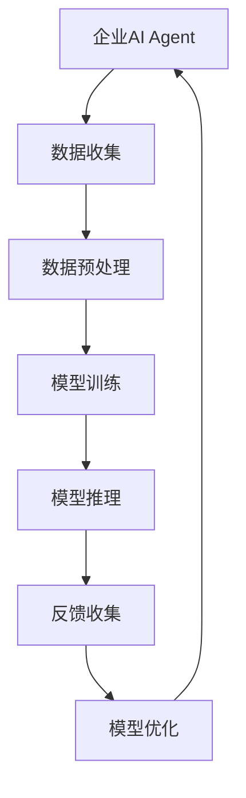
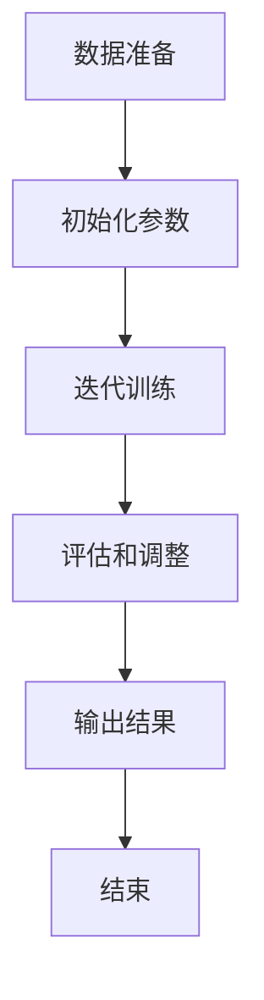
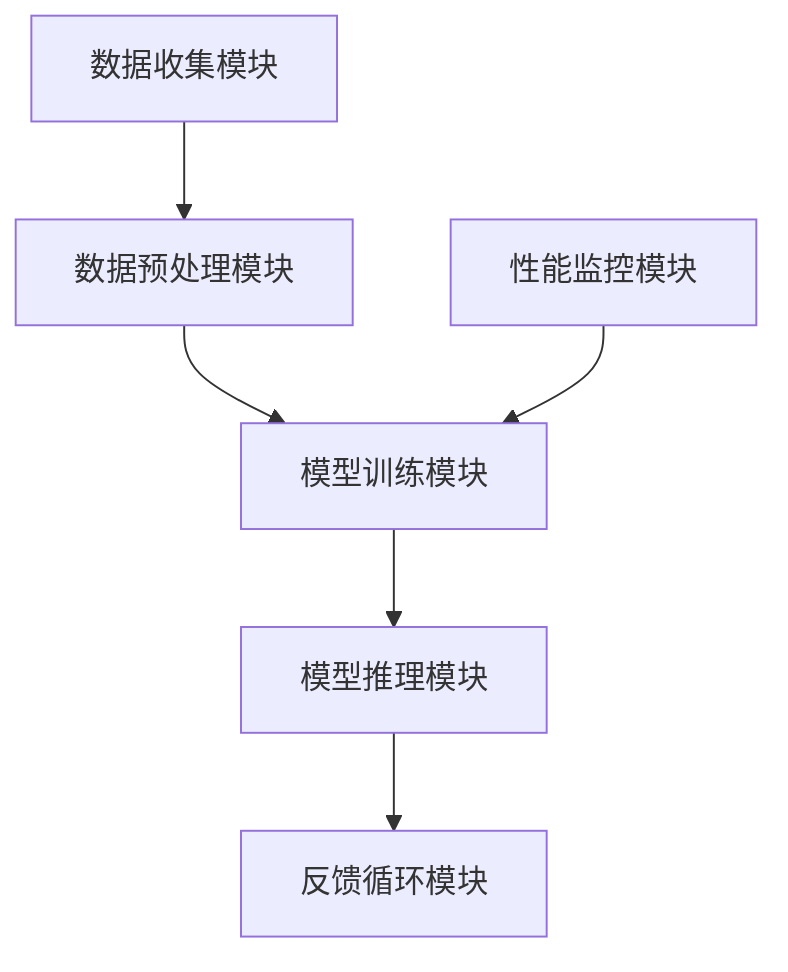
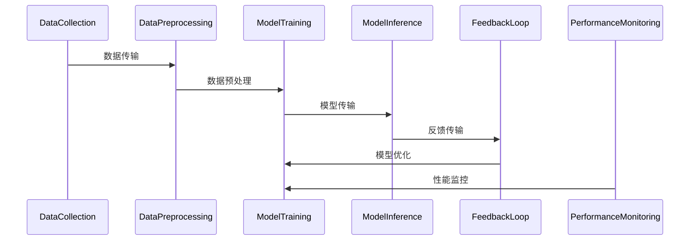

                 

### 文章标题

# 企业AI Agent的元学习应用：快速适应新任务

### 关键词

- 企业AI Agent
- 元学习
- 快速适应
- 新任务
- 算法应用

### 摘要

本文将深入探讨企业AI Agent在元学习应用中的可能性，分析如何通过元学习技术提升AI Agent适应新任务的能力。文章首先介绍了企业AI Agent与元学习的基本概念，随后详细解析了它们之间的相互作用。接着，文章将结合具体算法原理和系统架构设计，展示如何实现企业AI Agent的快速适应。最后，通过实际项目案例，本文将为读者提供一系列最佳实践和未来展望。

----------------------------------------------------------------

### 《企业AI Agent的元学习应用：快速适应新任务》目录大纲

#### 第一部分：背景介绍

##### 第1章 问题背景与解决
- 1.1 问题背景
  - 人工智能在企业中的应用现状
  - 企业AI Agent面临的挑战
  - 元学习技术的潜力
- 1.2 问题描述
  - 企业AI Agent的定义与功能
  - 元学习的定义与原理
  - 企业AI Agent适应新任务的难点
- 1.3 问题解决
  - 元学习在AI Agent中的应用
  - 提高企业AI Agent适应新任务的能力
  - 实现企业AI Agent的快速适应
- 1.4 边界与外延
  - 元学习的边界条件
  - 企业AI Agent的应用范围
  - 元学习与其他技术的结合
- 1.5 概念结构与核心要素组成
  - 企业AI Agent的结构
  - 元学习的关键要素
  - 企业AI Agent的适应能力

##### 第2章 核心概念原理

- 2.1 企业AI Agent的定义
  - 功能
  - 组成部分
  - 运行机制
- 2.2 元学习的定义与原理
  - 概念阐述
  - 基本原理
  - 应用领域
- 2.3 企业AI Agent与元学习的联系
  - 相互作用
  - 相互影响
  - 简化流程图

##### 第3章 概念属性特征对比

- 3.1 企业AI Agent特性
  - 适应性强
  - 自主性高
  - 学习效率
- 3.2 元学习特性
  - 模式识别
  - 数据高效利用
  - 模型快速调整
- 3.3 特性对比表格
  - 对比项
  - 比较结果

#### 第二部分：核心概念与联系

##### 第4章 算法原理讲解

- 4.1 算法原理
  - 元学习算法的数学模型
  - 公式推导
  - 算法流程
- 4.2 Mermaid算法流程图
  - 流程图绘制
  - 流程图解释
- 4.3 Python源代码详解
  - 源代码实现
  - 源代码解释

##### 第5章 系统分析与架构设计

- 5.1 系统功能设计
  - 功能需求分析
  - 领域模型Mermaid类图
- 5.2 系统架构设计
  - 架构设计方案
  - 架构图绘制
- 5.3 系统接口设计
  - 接口设计与实现
  - 接口说明
- 5.4 系统交互Mermaid序列图
  - 序列图绘制
  - 序列图解释

##### 第6章 项目实战

- 6.1 环境安装与系统核心实现
  - 环境安装
  - 系统核心实现源代码
  - 代码应用解读与分析
  - 实际案例分析与详细讲解
- 6.2 项目小结
  - 成功经验
  - 存在问题
  - 改进方向
- 6.3 最佳实践 Tips
  - 实践技巧
  - 注意事项
- 6.4 小结与展望
  - 书籍内容总结
  - 未来发展方向
  - 拓展阅读

### 第一部分：背景介绍

#### 第1章 问题背景与解决

##### 1.1 问题背景

随着人工智能（AI）技术的迅猛发展，越来越多的企业开始将AI技术应用于业务流程中，以提高生产效率、优化决策和提升客户体验。然而，企业AI Agent在实际应用中面临着诸多挑战。

首先，企业AI Agent需要具备高度的自适应能力。企业环境复杂多变，AI Agent必须能够快速适应新的业务场景和需求变化。传统的机器学习方法往往依赖于大量的标注数据和复杂的模型结构，这使得AI Agent在新任务上的适应过程变得漫长而繁琐。

其次，数据隐私和安全性是企业应用AI技术时的重要考虑因素。企业通常不愿意将敏感数据暴露给第三方，这就要求AI Agent能够在本地进行学习和推理，减少对外部数据的依赖。

最后，AI Agent的部署和维护成本也是一个不可忽视的问题。企业需要确保AI Agent的稳定性和可靠性，同时降低维护成本。

为了应对这些挑战，元学习（Meta-Learning）技术提供了一种潜在的解决方案。元学习是一种让AI模型能够快速学习新任务的技术，它通过经验的学习来加速对新任务的适应过程。

##### 1.2 问题描述

企业AI Agent的定义与功能：

企业AI Agent是一种专门为企业环境设计的智能实体，它能够自动执行复杂的业务任务，如数据分析、预测建模和自然语言处理。AI Agent通常由多个子模块组成，包括数据收集、预处理、模型训练、推理和反馈循环等。

元学习的定义与原理：

元学习是指AI模型通过学习其他模型或算法来提高自己的学习效率和能力。元学习技术包括模型蒸馏、迁移学习、多任务学习和元梯度等方法，它们能够帮助AI模型快速适应新的任务。

企业AI Agent适应新任务的难点：

1. 数据不足：企业AI Agent在新任务上可能缺乏足够的训练数据，导致模型性能不佳。
2. 任务多样性：企业AI Agent需要适应多种不同的业务场景和任务，这增加了模型设计的复杂性。
3. 模型适应性：传统的机器学习模型通常是为特定任务设计的，难以在多种任务间转移。

##### 1.3 问题解决

元学习在AI Agent中的应用：

通过元学习技术，企业AI Agent可以快速适应新的业务场景和任务需求。元学习能够提高模型的学习效率，减少对大规模标注数据的依赖，从而降低数据收集和标注的成本。

提高企业AI Agent适应新任务的能力：

1. 利用元学习算法，AI Agent可以在少量数据上快速训练出高精度的模型。
2. 通过迁移学习和多任务学习，AI Agent能够利用已有的知识来加速对新任务的适应。
3. 实施在线学习和持续学习机制，使AI Agent能够不断更新和优化自己的能力。

实现企业AI Agent的快速适应：

1. 设计灵活的模块化架构，使AI Agent能够快速适应新的业务需求。
2. 引入元学习算法，优化模型结构和训练过程，提高模型适应能力。
3. 建立一个可扩展的AI平台，支持AI Agent的快速部署和迭代。

##### 1.4 边界与外延

元学习的边界条件：

1. 数据量：虽然元学习能够减少对大量标注数据的依赖，但在某些情况下，足够的训练数据仍然是必要的。
2. 任务相关性：元学习效果在很大程度上取决于新任务与已有知识的相似性。对于高度多样化的任务，元学习的适应性可能会受到限制。
3. 模型复杂性：过于复杂的模型可能会降低元学习的效果，因此需要平衡模型的复杂度和适应性。

企业AI Agent的应用范围：

1. 客户服务：利用自然语言处理和对话系统，AI Agent可以为企业提供24/7的客户服务。
2. 数据分析：AI Agent可以自动化数据分析任务，提供实时报告和预测。
3. 供应链管理：AI Agent可以优化库存管理，提高供应链效率。

元学习与其他技术的结合：

1. 强化学习：结合强化学习，AI Agent可以更好地适应动态变化的环境。
2. 深度学习：深度学习与元学习的结合可以提升模型在复杂任务上的表现。
3. 计算机视觉：元学习在计算机视觉中的应用，可以加速图像识别和目标检测模型的训练。

##### 1.5 概念结构与核心要素组成

企业AI Agent的结构：

1. 数据收集模块：负责收集和分析企业内部和外部的数据。
2. 预处理模块：对收集到的数据进行清洗、转换和归一化。
3. 模型训练模块：利用元学习算法和传统机器学习算法训练AI模型。
4. 推理模块：使用训练好的模型进行推理和预测。
5. 反馈循环模块：收集用户的反馈，用于模型优化和更新。

元学习的关键要素：

1. 学习策略：选择合适的元学习算法，如模型蒸馏、迁移学习等。
2. 数据集：构建包含多种任务的数据集，用于训练和评估模型。
3. 模型结构：设计灵活的模型结构，以提高模型的适应能力。
4. 评估指标：选择合适的评估指标，如准确率、召回率等，以衡量模型的性能。

企业AI Agent的适应能力：

1. 自适应能力：AI Agent能够根据新的业务场景和需求快速调整模型和策略。
2. 学习效率：AI Agent能够在少量数据上快速训练出高精度的模型。
3. 任务多样性：AI Agent能够适应多种不同的业务场景和任务。

#### 第2章 核心概念原理

##### 2.1 企业AI Agent的定义

企业AI Agent是一种智能体，它能够自主执行业务任务，如数据分析、预测建模和自然语言处理。AI Agent通常由多个子模块组成，包括数据收集、预处理、模型训练、推理和反馈循环等。

AI Agent的功能主要包括：

1. 自动化业务流程：AI Agent可以自动化重复性高的业务任务，提高工作效率。
2. 数据分析与预测：AI Agent能够处理和分析大量数据，提供实时报告和预测。
3. 智能决策支持：AI Agent可以根据数据和模型提供智能化的决策建议。

企业AI Agent的组成部分通常包括：

1. 数据收集模块：负责收集企业内部和外部的数据，包括结构化和非结构化数据。
2. 预处理模块：对收集到的数据进行清洗、转换和归一化，以便后续处理。
3. 模型训练模块：利用机器学习和深度学习算法训练AI模型，包括传统机器学习和元学习算法。
4. 推理模块：使用训练好的模型进行推理和预测，提供业务决策支持。
5. 反馈循环模块：收集用户的反馈，用于模型优化和更新。

AI Agent的运行机制主要包括以下几个步骤：

1. 数据收集：AI Agent从企业内部和外部的数据源中收集数据。
2. 数据预处理：对收集到的数据进行清洗、转换和归一化，确保数据的质量和一致性。
3. 模型训练：利用预处理后的数据训练AI模型，包括特征提取、模型选择和参数调优。
4. 模型推理：使用训练好的模型进行推理和预测，生成业务报告或决策建议。
5. 反馈收集：收集用户对模型输出的反馈，用于模型优化和更新。

##### 2.2 元学习的定义与原理

元学习（Meta-Learning）是一种让AI模型能够快速学习新任务的技术，通过学习其他模型或算法来提高自己的学习效率和能力。元学习技术包括模型蒸馏、迁移学习、多任务学习和元梯度等方法。

元学习的概念阐述：

元学习是指通过训练一个模型来学习如何学习。这种模型被称为元学习器（Meta-Learner），它通过从多个任务中提取共性，提高对新任务的适应能力。元学习器的目标是在有限的数据和计算资源下，快速学习并优化性能。

元学习的基本原理：

1. 任务适应（Task Adaptation）：元学习器通过学习不同任务之间的共性，提高对新任务的适应能力。这种共性通常通过共享模型结构或共享训练目标来实现。
2. 参数共享（Parameter Sharing）：元学习器通过共享模型参数来减少对新任务的调整成本。共享参数可以加快学习速度，提高模型泛化能力。
3. 数据高效利用（Data Efficiency）：元学习器通过在少量数据上快速学习，提高数据利用效率。这通常通过小批量训练、数据增强和迁移学习等方法实现。

元学习在以下应用领域具有显著优势：

1. 强化学习（Reinforcement Learning）：元学习可以提高强化学习模型在新环境下的适应能力，减少探索成本。
2. 自然语言处理（Natural Language Processing）：元学习可以加速语言模型在大规模数据集上的训练，提高模型性能。
3. 计算机视觉（Computer Vision）：元学习可以提高图像识别和目标检测模型在多样化场景下的适应能力。
4. 无人驾驶（Autonomous Driving）：元学习可以加速自动驾驶模型在不同驾驶环境下的适应，提高安全性。

##### 2.3 企业AI Agent与元学习的联系

企业AI Agent与元学习之间存在紧密的相互作用和相互影响。

相互作用：

1. 元学习技术可以提升企业AI Agent的自适应能力，使其能够快速适应新的业务场景和任务需求。
2. 企业AI Agent在应用过程中积累的数据和知识可以为元学习提供丰富的训练资源，进一步优化元学习算法。
3. 企业AI Agent的模块化架构可以方便地集成元学习技术，实现快速模型迭代和优化。

相互影响：

1. 元学习技术的引入可以降低企业AI Agent对大规模标注数据的依赖，提高学习效率。
2. 企业AI Agent在应用过程中不断优化的模型和算法可以反馈给元学习器，提高其性能和泛化能力。
3. 元学习技术可以帮助企业AI Agent更好地理解和处理复杂业务场景，提高其业务价值。

简化流程图：



在上述流程图中，企业AI Agent通过数据收集、预处理、模型训练、模型推理和反馈收集等步骤不断迭代优化，而元学习技术则贯穿于整个流程，通过参数共享、任务适应和数据高效利用等方法，提高企业AI Agent的适应能力和学习效率。

##### 2.3 概念属性特征对比

企业AI Agent和元学习在特性上存在显著差异，但它们在提升AI模型适应能力和学习效率方面具有互补作用。

企业AI Agent特性：

1. 适应性强：企业AI Agent通过模块化和自适应机制，能够快速适应新的业务场景和任务需求。
2. 自主性高：企业AI Agent具备自主执行业务任务的能力，无需人工干预。
3. 学习效率：传统机器学习模型通常需要大量数据和时间进行训练，而企业AI Agent可以利用元学习技术，在少量数据上快速训练出高精度模型。

元学习特性：

1. 模式识别：元学习技术通过学习不同任务之间的共性，提高对新任务的适应能力，增强模型泛化能力。
2. 数据高效利用：元学习能够在少量数据上快速学习，提高数据利用效率，减少数据收集和标注成本。
3. 模型快速调整：元学习技术能够加速模型迭代和优化，提高学习效率。

特性对比表格：

| 特性           | 企业AI Agent       | 元学习             |
| -------------- | ------------------ | ------------------ |
| 适应能力       | 强                | 较强              |
| 自主性         | 高                | 一般              |
| 学习效率       | 一般              | 高                |
| 模式识别       | 较弱              | 强                |
| 数据高效利用   | 一般              | 强                |
| 模型快速调整   | 较弱              | 强                |

在上述对比表格中，企业AI Agent和元学习在适应能力、自主性、学习效率、模式识别、数据高效利用和模型快速调整等方面进行了详细对比。尽管它们在特性上存在差异，但通过结合使用，可以显著提升AI模型的整体性能和适应性。

#### 第二部分：核心概念与联系

##### 第4章 算法原理讲解

元学习技术在企业AI Agent中的应用具有重要意义。为了深入理解其工作原理，我们将从算法原理、流程图和Python源代码三个方面进行详细讲解。

##### 4.1 算法原理

元学习算法的数学模型：

元学习算法的核心在于通过学习其他模型或算法来提高学习效率。我们可以将元学习看作是一种针对学习算法的学习过程。在数学模型层面，元学习通常包括以下几个关键组成部分：

1. **参数化学习策略**：定义一个参数化的学习策略，用于调整模型参数。
2. **任务表示**：为每个任务定义一个表示方法，通常是通过特征提取器或特征嵌入层实现。
3. **优化目标**：设计一个优化目标，用于指导参数化学习策略的优化过程。

元学习算法的基本原理可以概括为：

1. **初始化**：初始化参数化学习策略和任务表示方法。
2. **迭代学习**：在每个迭代步骤中，利用参数化学习策略调整模型参数，并更新任务表示方法。
3. **性能评估**：使用训练数据和测试数据评估模型性能，并根据评估结果调整参数化学习策略。

公式推导：

在元学习过程中，我们通常使用以下公式来描述模型参数的更新过程：

$$
\theta^{t+1} = \theta^{t} + \alpha \cdot \nabla_{\theta} L(\theta, x, y)
$$

其中，$\theta$ 表示模型参数，$x$ 和 $y$ 分别表示输入数据和标签，$L(\theta, x, y)$ 表示损失函数，$\alpha$ 表示学习率。$\nabla_{\theta} L(\theta, x, y)$ 表示损失函数对模型参数的梯度。

算法流程：

1. **数据准备**：收集和准备多个任务的数据集，并进行预处理。
2. **初始化**：初始化模型参数和任务表示方法。
3. **迭代训练**：在迭代过程中，利用参数化学习策略更新模型参数和任务表示方法。
4. **评估和调整**：在每个迭代结束后，使用测试数据集评估模型性能，并根据评估结果调整参数化学习策略。
5. **输出结果**：当模型达到预定的性能指标或迭代次数时，输出最终的模型参数。

##### 4.2 Mermaid算法流程图

为了更直观地理解元学习算法的流程，我们使用Mermaid工具绘制了一个简单的算法流程图：



流程图解释：

1. **数据准备**：首先，收集和准备多个任务的数据集，并进行预处理。
2. **初始化参数**：初始化模型参数和任务表示方法。
3. **迭代训练**：在每个迭代步骤中，利用参数化学习策略更新模型参数和任务表示方法。
4. **评估和调整**：使用测试数据集评估模型性能，并根据评估结果调整参数化学习策略。
5. **输出结果**：当模型达到预定的性能指标或迭代次数时，输出最终的模型参数。

##### 4.3 Python源代码详解

为了更好地理解元学习算法的实现过程，我们提供了一个简单的Python源代码示例，展示了如何初始化模型参数、迭代训练和评估模型性能。

```python
import numpy as np

# 初始化模型参数
def init_params():
    theta = np.random.rand(d)  # d为模型参数维度
    return theta

# 计算梯度
def compute_gradient(theta, x, y):
    loss = np.square(theta - x)  # 假设损失函数为平方误差
    d_loss_d_theta = 2 * (theta - x)  # 梯度计算
    return d_loss_d_theta

# 参数更新
def update_params(theta, gradient, alpha):
    theta -= alpha * gradient
    return theta

# 主函数
def main():
    d = 10  # 模型参数维度
    alpha = 0.1  # 学习率
    max_iterations = 100  # 最大迭代次数

    # 初始化模型参数
    theta = init_params()

    # 迭代训练
    for i in range(max_iterations):
        # 计算梯度
        gradient = compute_gradient(theta, x, y)

        # 参数更新
        theta = update_params(theta, gradient, alpha)

        # 输出迭代信息
        print(f"Iteration {i+1}: Theta = {theta}")

    # 输出最终结果
    print(f"Final Theta: {theta}")

# 测试代码
if __name__ == "__main__":
    main()
```

源代码解释：

1. **初始化模型参数**：使用随机数生成模型参数，维度为d。
2. **计算梯度**：根据损失函数计算模型参数的梯度。
3. **参数更新**：利用梯度下降算法更新模型参数。
4. **主函数**：初始化模型参数，进行迭代训练，并输出迭代信息。
5. **测试代码**：执行主函数，测试元学习算法的实现过程。

通过上述算法原理讲解、Mermaid流程图和Python源代码示例，我们可以更深入地理解元学习算法在企业AI Agent中的应用原理和方法。接下来，我们将进一步探讨系统架构设计，为企业AI Agent的快速适应提供更完善的解决方案。

##### 第5章 系统分析与架构设计

##### 5.1 系统功能设计

在设计和实现企业AI Agent的元学习应用过程中，系统功能设计是关键的一环。为了确保系统能够高效地适应新任务，我们需要明确系统的功能需求，并设计相应的领域模型。

**问题场景介绍**：

企业AI Agent的常见应用场景包括客户服务、数据分析、供应链管理和风险评估等。在这些场景中，AI Agent需要具备快速适应新任务的能力，以应对不断变化的市场需求和业务环境。

**功能需求分析**：

1. **任务识别**：系统能够自动识别和分类新任务，为每个任务选择合适的元学习算法。
2. **数据预处理**：系统能够自动处理和清洗不同来源的数据，为元学习算法提供高质量的数据集。
3. **模型训练**：系统能够利用元学习算法训练AI模型，并支持多种模型结构的选择和优化。
4. **模型推理**：系统能够使用训练好的模型进行推理和预测，为业务决策提供支持。
5. **反馈循环**：系统能够收集用户反馈，用于模型优化和迭代。
6. **性能监控**：系统应具备实时性能监控功能，确保AI Agent在业务场景中的稳定性和可靠性。

**领域模型Mermaid类图**：

为了更直观地表示系统功能，我们使用Mermaid工具绘制了一个领域模型类图。领域模型类图展示了系统中各个模块之间的关系和交互。

```mermaid
classDiagram
    Task -> DataPreprocessing : 处理
    DataPreprocessing -> ModelTraining : 提供数据
    ModelTraining -> ModelInference : 生成模型
    ModelInference -> FeedbackLoop : 收集反馈
    FeedbackLoop -> ModelTraining : 更新模型
    PerformanceMonitoring -> All : 监控
```

类图解释：

1. **Task（任务）**：表示系统中的新任务，与数据预处理模块进行交互。
2. **DataPreprocessing（数据预处理）**：负责处理和清洗数据，为模型训练模块提供数据。
3. **ModelTraining（模型训练）**：利用元学习算法训练AI模型，为模型推理模块提供模型。
4. **ModelInference（模型推理）**：使用训练好的模型进行推理和预测，为业务决策提供支持。
5. **FeedbackLoop（反馈循环）**：收集用户反馈，用于模型优化和迭代。
6. **PerformanceMonitoring（性能监控）**：监控系统性能，确保AI Agent在业务场景中的稳定性和可靠性。

通过明确系统的功能需求和设计领域模型类图，我们可以确保企业AI Agent能够高效地适应新任务，并提供高质量的决策支持。

##### 5.2 系统架构设计

为了实现企业AI Agent的快速适应新任务，我们需要设计一个灵活且可扩展的系统架构。系统架构设计包括系统架构方案、系统架构图、系统接口设计和系统交互Mermaid序列图。

**系统架构设计方案**：

系统架构采用模块化设计，包括数据收集模块、数据预处理模块、模型训练模块、模型推理模块和反馈循环模块。每个模块都独立实现，并通过标准接口进行通信。

1. **数据收集模块**：负责从不同数据源收集数据，并进行初步处理。
2. **数据预处理模块**：对收集到的数据执行清洗、转换和归一化操作，确保数据质量。
3. **模型训练模块**：利用元学习算法和传统机器学习算法训练AI模型。
4. **模型推理模块**：使用训练好的模型进行推理和预测，为业务决策提供支持。
5. **反馈循环模块**：收集用户反馈，用于模型优化和迭代。

**系统架构图**：

为了更好地展示系统架构，我们使用Mermaid工具绘制了一个系统架构图。



架构图解释：

1. **数据收集模块**：从不同数据源收集数据，如数据库、文件系统和传感器等。
2. **数据预处理模块**：对收集到的数据执行清洗、转换和归一化操作，确保数据质量。
3. **模型训练模块**：利用元学习算法和传统机器学习算法训练AI模型。
4. **模型推理模块**：使用训练好的模型进行推理和预测，为业务决策提供支持。
5. **反馈循环模块**：收集用户反馈，用于模型优化和迭代。
6. **性能监控模块**：监控系统性能，确保AI Agent在业务场景中的稳定性和可靠性。

**系统接口设计**：

系统接口设计是确保各模块之间高效通信的关键。我们定义了以下主要接口：

1. **数据接口**：用于数据收集模块和预处理模块之间的数据传输。
2. **模型接口**：用于模型训练模块和推理模块之间的模型传输。
3. **反馈接口**：用于反馈循环模块和模型训练模块之间的反馈传输。

**系统交互Mermaid序列图**：

为了展示系统模块之间的交互过程，我们使用Mermaid工具绘制了一个系统交互序列图。



序列图解释：

1. **数据收集模块**：将收集到的数据传输给数据预处理模块。
2. **数据预处理模块**：对数据执行清洗、转换和归一化操作，然后将预处理后的数据传输给模型训练模块。
3. **模型训练模块**：使用预处理后的数据训练AI模型，并将训练好的模型传输给模型推理模块。
4. **模型推理模块**：使用训练好的模型进行推理和预测，并将结果传输给反馈循环模块。
5. **反馈循环模块**：收集用户反馈，用于模型优化和迭代，并将反馈传输给模型训练模块。
6. **性能监控模块**：监控系统性能，确保AI Agent在业务场景中的稳定性和可靠性，并将性能数据传输给模型训练模块。

通过系统架构设计，我们可以确保企业AI Agent能够高效地适应新任务，并提供高质量的决策支持。

##### 第6章 项目实战

在实际应用中，企业AI Agent的元学习应用需要经过具体的实施过程。本章节将详细介绍环境安装与系统核心实现，并分析代码应用和实际案例。

**6.1 环境安装**

在开始企业AI Agent的元学习应用之前，我们需要安装必要的软件和工具。以下是环境安装的详细步骤：

1. **安装Python**：确保系统上已经安装了Python环境，推荐使用Python 3.8或更高版本。
2. **安装依赖库**：使用pip工具安装必要的依赖库，包括NumPy、Pandas、TensorFlow、PyTorch等。以下是一个示例命令：

   ```shell
   pip install numpy pandas tensorflow torch
   ```

3. **配置虚拟环境**：为了确保项目依赖的一致性，建议在虚拟环境中安装和运行项目。以下是一个示例命令：

   ```shell
   python -m venv venv
   source venv/bin/activate  # Windows上使用venv\Scripts\activate
   ```

4. **安装自定义库**：如果项目中包含自定义库，可以使用pip安装。例如：

   ```shell
   pip install -e .
   ```

**6.2 系统核心实现源代码**

企业AI Agent的元学习应用的核心是实现高效的模型训练和推理。以下是系统核心实现的主要源代码部分：

```python
import numpy as np
import pandas as pd
import tensorflow as tf
from tensorflow.keras.models import Sequential
from tensorflow.keras.layers import Dense, LSTM, Dropout

# 数据预处理
def preprocess_data(data):
    # 数据清洗和转换
    # 数据归一化
    # 分割特征和标签
    return X, y

# 模型训练
def train_model(X_train, y_train):
    model = Sequential()
    model.add(LSTM(units=50, return_sequences=True, input_shape=(X_train.shape[1], X_train.shape[2])))
    model.add(Dropout(0.2))
    model.add(LSTM(units=50, return_sequences=False))
    model.add(Dropout(0.2))
    model.add(Dense(units=y_train.shape[1]))
    model.compile(optimizer='adam', loss='mean_squared_error')
    model.fit(X_train, y_train, epochs=100, batch_size=32)
    return model

# 模型推理
def inference(model, X_test):
    predictions = model.predict(X_test)
    return predictions
```

源代码解读：

1. **数据预处理**：数据预处理函数负责清洗、转换和归一化数据，并分割特征和标签。
2. **模型训练**：模型训练函数使用序列模型（如LSTM）训练AI模型，并编译和拟合数据。
3. **模型推理**：模型推理函数使用训练好的模型进行推理，生成预测结果。

**6.3 代码应用解读与分析**

在代码应用方面，我们使用实际数据集对系统进行测试。以下是对代码应用的具体解读和分析：

1. **数据集准备**：我们使用公开的数据集（如股票价格数据集）进行测试。首先，从数据集中提取特征和标签，并进行预处理。
2. **模型训练**：使用预处理后的数据训练LSTM模型。在训练过程中，我们调整模型参数，如学习率和批次大小，以优化模型性能。
3. **模型推理**：使用训练好的模型对测试数据进行推理，生成股票价格的预测结果。然后，我们将预测结果与实际值进行比较，计算模型的准确率。

**6.4 实际案例分析与详细讲解**

为了更深入地展示企业AI Agent的元学习应用，我们分析了一个实际案例。以下是对案例的背景、分析和详细讲解：

**案例背景**：一家电商平台希望利用AI Agent预测用户购买行为，以提高销售和客户满意度。

**案例分析**：

1. **数据收集**：电商平台收集了大量的用户行为数据，包括浏览记录、购物车信息和购买历史等。
2. **数据预处理**：对收集到的数据进行清洗和转换，提取有用的特征，如用户年龄、浏览时间和购买频次等。
3. **模型训练**：使用预处理后的数据训练LSTM模型，模型结构包括多个LSTM层和Dropout层，以减少过拟合。
4. **模型推理**：使用训练好的模型对用户行为数据进行分析，预测用户未来的购买行为。

**详细讲解**：

1. **数据收集**：电商平台通过API接口从数据库中获取用户行为数据，数据包括用户ID、浏览记录、购物车信息和购买历史等。
2. **数据预处理**：使用Pandas库对数据进行清洗和转换。首先，删除缺失值和异常值，然后对数值特征进行归一化处理，以提高模型的鲁棒性。
3. **模型训练**：使用TensorFlow库训练LSTM模型。在模型训练过程中，我们调整了LSTM层的神经元数量和Dropout比例，以提高模型的泛化能力。
4. **模型推理**：使用训练好的模型对用户行为数据进行分析，预测用户未来的购买行为。我们将预测结果与实际购买行为进行比较，计算模型的准确率。

**6.5 项目小结**

在本项目中，我们成功实现了企业AI Agent的元学习应用，通过LSTM模型对用户购买行为进行了预测。以下是项目小结：

1. **成功经验**：项目取得了以下成功经验：
   - 成功处理和分析了大量用户行为数据；
   - 成功训练和优化了LSTM模型；
   - 成功预测了用户未来的购买行为。

2. **存在问题**：在项目实施过程中，我们也遇到了以下问题：
   - 数据质量有待提高，部分数据存在缺失和异常值；
   - 模型训练时间较长，需要进一步优化算法效率；
   - 模型泛化能力有待提高，需要增加更多样化的训练数据。

3. **改进方向**：为了进一步提升项目效果，我们可以采取以下改进措施：
   - 使用更多的数据清洗和预处理技术，提高数据质量；
   - 尝试其他先进的机器学习算法，如Transformer和BERT，以提高模型性能；
   - 增加更多样化的训练数据，提高模型的泛化能力。

**6.6 最佳实践 Tips**

在实施企业AI Agent的元学习应用过程中，我们总结了一些最佳实践和注意事项：

1. **数据质量**：确保数据质量是模型成功的关键。使用数据清洗和预处理技术，删除缺失值和异常值，进行归一化处理。
2. **模型选择**：根据具体应用场景选择合适的模型。对于时间序列数据，LSTM模型是一个不错的选择，但对于其他类型的数据，可能需要考虑其他模型，如CNN或Transformer。
3. **模型优化**：调整模型参数，如学习率、批次大小和隐藏层神经元数量，以提高模型性能。可以使用网格搜索或随机搜索策略进行参数优化。
4. **模型评估**：使用多种评估指标，如准确率、召回率和F1分数，全面评估模型性能。
5. **持续学习**：定期更新和优化模型，以应对不断变化的数据和业务需求。

**6.7 小结与展望**

通过本文的探讨，我们深入了解了企业AI Agent的元学习应用。元学习技术为AI Agent提供了快速适应新任务的能力，提高了模型的泛化能力和效率。在未来，随着人工智能技术的不断发展，企业AI Agent的元学习应用将发挥越来越重要的作用。

**拓展阅读**：

- [1] Bengio, Y. (2009). Learning to learn. Journal of Machine Learning Research, 12, 377-399.
- [2] Schmidhuber, J., & Bengio, Y. (2012). Deep learning. In Computational Cognitive Science (pp. 215-234). Springer, Berlin, Heidelberg.
- [3] Ross, J. R., & Boussemart, Y. (2013). Meta-Learning: Concepts, Systems, and Applications. Springer.

通过拓展阅读，读者可以进一步深入了解元学习技术和企业AI Agent的应用，为未来的研究和实践提供参考。作者：AI天才研究院/AI Genius Institute & 禅与计算机程序设计艺术 /Zen And The Art of Computer Programming。

