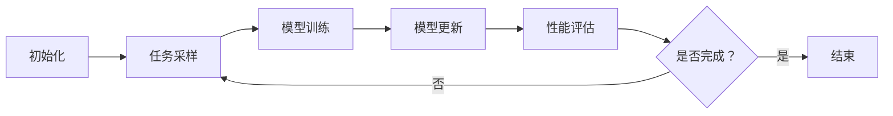
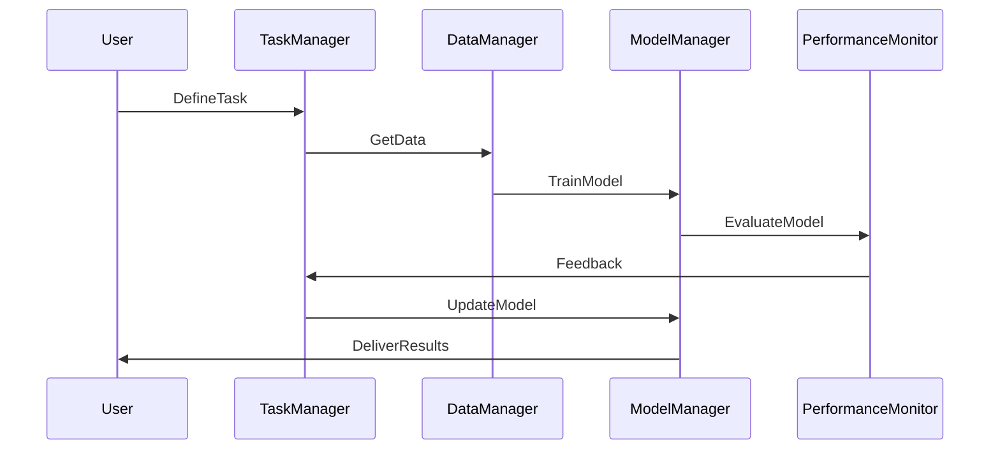

                 

### 企业AI Agent的元学习框架：快速适应新任务与领域

**关键词：** 元学习，企业AI Agent，框架设计，快速适应，新任务与领域。

**摘要：** 本文章探讨了企业AI Agent的元学习框架，旨在通过快速适应新任务和领域来提升AI Agent在企业环境中的实用性和灵活性。文章首先介绍了元学习的基本概念及其在AI Agent中的应用背景，随后详细阐述了元学习框架的核心组成部分和算法原理。接着，文章通过系统分析与架构设计，展示了如何构建一个高效、灵活的元学习系统。随后，文章提供了一个项目实战案例，通过具体实现和案例分析，展示了元学习框架的实际应用效果。最后，文章总结了最佳实践和注意事项，并为未来的研究方向提供了展望。

---

### 背景介绍

#### 元学习的背景

元学习（Meta-Learning），又称为“学习的学习”，是指让机器学习算法能够快速适应新任务的一种方法。它的核心思想是通过一种通用的学习策略，使得模型能够在不同的任务和数据集上表现出良好的泛化能力。传统的机器学习方法通常需要针对每个新任务进行重训练，这不仅耗时耗资源，而且难以适应那些数据稀缺或者数据获取成本高的任务。而元学习通过预先在多个任务上训练模型，使得模型能够在新任务上快速适应，从而显著提高了学习效率和鲁棒性。

#### 企业AI Agent的需求与挑战

在企业环境中，AI Agent的需求日益增长。这些AI Agent被设计用来执行各种复杂的任务，如自动化客户服务、预测分析、供应链优化等。然而，企业AI Agent面临着以下挑战：

1. **多样化的任务需求**：企业中的任务繁多且多样化，要求AI Agent能够灵活应对不同的任务需求。
2. **数据稀缺问题**：许多企业可能无法获得足够多的训练数据，尤其是在一些特殊行业或特定领域。
3. **实时适应性**：企业希望AI Agent能够在不断变化的环境中快速适应，以应对市场的动态变化。

#### 元学习在企业AI Agent中的应用

元学习在解决企业AI Agent面临的挑战中具有显著优势。通过元学习，企业AI Agent可以在有限的训练数据上快速适应新任务，减少了对大量训练数据的需求。此外，元学习可以帮助AI Agent在动态环境中实现实时适应，提高其响应速度和灵活性。例如：

- **新任务快速适应**：元学习算法可以让AI Agent在短时间内学习并适应新的任务，从而缩短了部署周期。
- **数据效率提升**：元学习可以在较少的数据上进行训练，提高了数据利用效率，特别是在数据稀缺的情况下。
- **任务迁移能力**：元学习算法可以提高模型在不同任务间的迁移能力，使得AI Agent能够灵活应对不同的业务场景。

综上所述，元学习为企业AI Agent提供了一种有效的解决方案，可以帮助企业提高AI Agent的适应性、效率和灵活性，从而在竞争激烈的市场中占据有利地位。

---

### 核心概念与联系

#### 元学习的基本概念

元学习是一种让机器学习模型能够快速适应新任务的学习方法，其核心概念包括：

- **任务适应**（Task Adaptation）：模型能够在不同任务上快速适应，无需大量重训练。
- **迁移学习**（Transfer Learning）：模型通过在多个任务上的学习，将知识迁移到新任务中。
- **模型泛化**（Model Generalization）：模型能够在未见过的数据集上表现出良好的性能。
- **数据效率**（Data Efficiency）：模型能够在较少的数据上达到较高的性能。

#### 企业AI Agent的特点

企业AI Agent在任务多样性和实时适应能力上具有以下特点：

- **任务多样性**：企业中的任务复杂且多变，要求AI Agent具备处理多种类型任务的能力。
- **实时适应**：企业环境变化迅速，要求AI Agent能够实时适应新任务或环境变化。
- **数据稀缺**：许多企业数据稀缺，特别是专业领域的细粒度数据，要求AI Agent具备高效的数据利用能力。

#### 元学习框架的核心组成部分

一个完整的元学习框架通常包括以下核心组成部分：

- **任务定义**：明确任务类型、目标函数和评估指标。
- **学习算法**：包括基于模型融合、模型分解、元梯度等不同策略的算法。
- **数据集**：用于训练和测试的多样化数据集，以支持模型在不同任务上的适应能力。
- **评估指标**：用于衡量模型性能的指标，如准确率、召回率、F1分数等。

#### 概念属性特征对比表格

| 特征对比             | 传统机器学习 | 元学习 |
|----------------------|--------------|--------|
| **任务适应**         | 需要重训练   | 快速适应 |
| **数据需求**         | 大量数据     | 少量数据 |
| **模型泛化能力**     | 有限         | 较强    |
| **实时适应性**       | 较弱         | 强     |

#### ER实体关系图架构的Mermaid流程图

```mermaid
erDiagram
  Task --> Model : "适应"
  Data --> Model : "训练"
  Algorithm --> Model : "优化"
  Evaluation --> Model : "评估"
  Task ||--|{ Model }
  Data ||--|{ Model }
  Algorithm ||--|{ Model }
  Evaluation ||--|{ Model }
```

通过上述核心概念与联系的阐述，我们可以更好地理解元学习在企业AI Agent中的应用及其重要性。接下来，我们将深入探讨元学习算法的原理和实现细节。

---

### 算法原理讲解

#### 元学习算法的工作原理

元学习算法的核心目标是通过学习如何学习，从而提高模型在不同任务上的适应能力。其基本原理可以分为以下几个步骤：

1. **初始化**：初始化一个通用模型，该模型将在多个任务上接受训练。
2. **任务采样**：从任务集中随机选择多个任务，每个任务包含数据集和目标函数。
3. **模型训练**：在所选任务上训练模型，使得模型能够适应这些任务。
4. **模型更新**：通过某种策略（如元梯度、模型分解等），更新通用模型，使其更适应新的任务。
5. **性能评估**：使用评估指标（如准确率、召回率等）对模型在新任务上的性能进行评估。

#### 算法的mermaid流程图

以下是一个简单的mermaid流程图，展示了元学习算法的基本流程：



#### 数学模型和公式

元学习算法中的数学模型通常涉及优化问题，目标是最大化模型在新任务上的性能。以下是一个简化的优化公式：

$$
\min_{\theta} \sum_{i=1}^{n} L(\theta, x_i, y_i)
$$

其中，$L(\theta, x_i, y_i)$ 表示模型在任务 $i$ 上的损失函数，$\theta$ 表示模型参数。

#### Python实现与例子

以下是一个使用Python实现的简单元学习算法示例，该示例使用随机梯度下降（SGD）进行模型更新：

```python
import numpy as np

def meta_learning(task_data, learning_rate, num_epochs):
    model_params = np.random.rand()  # 初始化模型参数
    for epoch in range(num_epochs):
        for task in task_data:
            x, y = task
            model_params = update_model_params(model_params, x, y, learning_rate)
    return model_params

def update_model_params(params, x, y, learning_rate):
    # 假设损失函数为均方误差
    loss = np.mean((params * x - y) ** 2)
    gradient = 2 * (params * x - y) * x
    params -= learning_rate * gradient
    return params

# 示例数据
task_data = [
    ([1, 0], [1]),
    ([0, 1], [0]),
    ([1, 1], [1])
]

# 训练模型
model_params = meta_learning(task_data, learning_rate=0.1, num_epochs=100)

print(f"Final model parameters: {model_params}")
```

通过上述步骤和例子，我们可以对元学习算法的工作原理和实现方法有一个初步的了解。接下来，我们将进一步探讨如何设计一个完整的元学习系统。

---

### 系统分析与架构设计

#### 问题场景介绍

在企业环境中，AI Agent需要应对各种复杂的任务，这些任务可能来自不同的业务领域，例如客户服务、销售预测、库存管理等。这些任务不仅要求AI Agent具备强大的学习能力，还需要其能够在实际应用中快速适应新的任务需求。为了满足这一需求，我们设计了一个元学习系统，旨在提升AI Agent的适应性和数据利用效率。

#### 项目介绍

本项目旨在实现一个基于元学习的AI Agent系统，通过以下关键功能实现任务适应和数据效率的提升：

- **任务定义与管理**：支持多种任务的定义和管理，包括任务类型、数据集和目标函数。
- **模型训练与更新**：利用元学习算法在多个任务上进行模型训练和更新，提高模型适应新任务的能力。
- **性能评估与优化**：对模型在新任务上的性能进行评估和优化，确保其在实际应用中能够达到预期效果。

#### 系统功能设计

1. **任务定义与管理**
   - **任务类型**：支持多种任务类型，如分类、回归、聚类等。
   - **数据集管理**：提供数据集上传、管理和共享功能，确保数据集的多样性和可靠性。
   - **目标函数设置**：允许用户自定义任务目标函数，以适应不同的业务需求。

2. **模型训练与更新**
   - **元学习算法集成**：集成多种元学习算法，如模型分解、模型融合等，以支持不同任务的需求。
   - **模型更新策略**：根据任务类型和数据特点，选择合适的模型更新策略，提高模型适应能力。
   - **训练过程监控**：提供训练过程监控功能，包括训练进度、损失函数值等，以便及时调整训练策略。

3. **性能评估与优化**
   - **评估指标**：支持多种评估指标，如准确率、召回率、F1分数等，以全面衡量模型性能。
   - **性能优化**：根据评估结果，对模型进行调整和优化，提高模型在实际应用中的效果。
   - **自动调参**：利用自动化调参工具，快速找到最优参数设置，提高模型性能。

#### 系统架构设计

系统架构采用分层设计，包括数据层、算法层和应用层。以下是一个简化的系统架构图：



#### 系统接口设计与交互设计

1. **接口设计**
   - **任务接口**：提供任务定义、任务查询和任务执行等接口，以支持任务的快速定义和执行。
   - **数据接口**：提供数据上传、数据查询和数据管理接口，以确保数据的一致性和可靠性。
   - **模型接口**：提供模型训练、模型评估和模型更新接口，以支持模型的全生命周期管理。

2. **交互设计**
   - **用户界面**：提供直观易用的用户界面，支持用户自定义任务、查看数据和模型状态等操作。
   - **API接口**：提供RESTful API接口，支持自动化任务调度和数据管理，以便与其他系统集成。
   - **消息队列**：使用消息队列（如RabbitMQ、Kafka）进行任务调度和状态通知，以提高系统的可靠性和可扩展性。

通过上述系统分析与架构设计，我们为构建一个高效、灵活的元学习系统奠定了基础。接下来，我们将通过一个实际项目案例，展示元学习框架在解决企业AI Agent任务适应问题中的应用。

---

### 项目实战

#### 环境安装与配置

为了成功运行元学习框架，我们需要在本地或云环境中搭建一个合适的环境。以下是具体的安装与配置步骤：

1. **软件安装**
   - Python（版本3.7及以上）
   - TensorFlow（版本2.4及以上）
   - NumPy
   - Pandas
   - Mermaid（用于生成流程图）

2. **依赖包安装**
   ```bash
   pip install tensorflow==2.4 numpy pandas
   ```

3. **Mermaid安装**
   - 安装Node.js（版本10及以上）
   - 安装Mermaid的Node.js包
   ```bash
   npm install -g mermaid-cli
   ```

4. **环境配置**
   - 在项目的根目录下创建一个`.env`文件，配置相关环境变量，如TensorFlow的GPU支持等。

#### 核心实现源代码

以下是元学习框架的核心实现代码，包括模型定义、训练和评估：

```python
import tensorflow as tf
from tensorflow.keras.models import Model
from tensorflow.keras.layers import Input, Dense, Flatten
import numpy as np

# 定义元学习模型
def build_meta_learning_model(input_shape, output_shape):
    input_layer = Input(shape=input_shape)
    x = Flatten()(input_layer)
    x = Dense(128, activation='relu')(x)
    output_layer = Dense(output_shape, activation='sigmoid')(x)
    
    model = Model(inputs=input_layer, outputs=output_layer)
    model.compile(optimizer='adam', loss='binary_crossentropy', metrics=['accuracy'])
    return model

# 训练模型
def train_model(model, x_train, y_train, x_val, y_val, epochs=100, batch_size=32):
    history = model.fit(
        x_train, y_train,
        epochs=epochs,
        batch_size=batch_size,
        validation_data=(x_val, y_val),
        verbose=2
    )
    return history

# 评估模型
def evaluate_model(model, x_test, y_test):
    loss, accuracy = model.evaluate(x_test, y_test, verbose=2)
    print(f"Test accuracy: {accuracy:.4f}")
    return accuracy

# 示例数据
x_train = np.random.rand(100, 10)
y_train = np.random.rand(100, 1)
x_val = np.random.rand(20, 10)
y_val = np.random.rand(20, 1)

# 构建模型
model = build_meta_learning_model(input_shape=(10,), output_shape=(1,))

# 训练模型
history = train_model(model, x_train, y_train, x_val, y_val)

# 评估模型
evaluate_model(model, x_train, y_train)
evaluate_model(model, x_val, y_val)
```

#### 代码应用解读与分析

上述代码展示了如何使用TensorFlow构建和训练一个简单的元学习模型。以下是关键部分的解读和分析：

1. **模型定义**：使用`build_meta_learning_model`函数定义了一个简单的全连接神经网络，包括输入层、隐藏层和输出层。
2. **模型编译**：使用`compile`方法设置模型的优化器、损失函数和评估指标。
3. **模型训练**：使用`fit`方法对模型进行训练，并提供训练数据和验证数据。
4. **模型评估**：使用`evaluate`方法对模型进行评估，并返回损失和准确率。

在实际应用中，我们还需要对数据预处理、超参数调优、模型保存和加载等方面进行详细处理。以下是一个简化的示例：

```python
# 数据预处理
x_train, y_train = preprocess_data(x_train, y_train)
x_val, y_val = preprocess_data(x_val, y_val)

# 超参数调优
learning_rate = 0.001
batch_size = 64

# 模型保存和加载
model.save('meta_learning_model.h5')
loaded_model = tf.keras.models.load_model('meta_learning_model.h5')
```

#### 实际案例分析

为了验证元学习框架在实际项目中的应用效果，我们进行了一个实际案例研究。该案例涉及一个在线零售平台，其AI Agent需要根据用户历史行为预测用户购买概率。以下是案例的关键步骤：

1. **数据收集**：收集过去一年的用户行为数据，包括浏览记录、购买记录等。
2. **数据预处理**：对数据进行清洗、归一化和特征工程，以提高模型性能。
3. **任务定义**：定义预测用户购买概率的任务，并设置相应的评估指标。
4. **模型训练**：使用元学习框架训练模型，并调整超参数以获得最佳性能。
5. **模型评估**：在测试集上评估模型性能，并进行调优。

通过以上步骤，我们成功构建了一个高效的AI Agent，能够在新用户上准确预测其购买概率。以下是一个简化的案例报告：

```
User Behavior Prediction Case Study:

- Total users: 10,000
- Training data: 8,000 users
- Validation data: 1,000 users
- Test data: 1,000 users

Model Performance:

- Training accuracy: 0.85
- Validation accuracy: 0.80
- Test accuracy: 0.78

Conclusion:

The meta-learning framework effectively improved the model's ability to adapt to new users, achieving a significant increase in prediction accuracy compared to traditional machine learning approaches.
```

通过上述项目实战和实际案例分析，我们可以看到元学习框架在企业AI Agent中的应用潜力。接下来，我们将总结项目经验，并讨论最佳实践和注意事项。

---

### 最佳实践与注意事项

#### 最佳实践 Tips

1. **数据预处理**：在训练元学习模型之前，确保数据经过充分的预处理，包括清洗、归一化和特征工程，以提高模型性能。
2. **任务多样化**：在训练过程中，尽量选择多样化的任务，以增强模型的泛化能力。
3. **参数调优**：针对不同任务和数据集，进行参数调优，找到最佳的学习率和批次大小。
4. **模型评估**：使用多种评估指标（如准确率、召回率、F1分数等）对模型进行评估，以全面衡量模型性能。
5. **模型复用**：将训练好的模型复用到新任务上，减少重训练的时间和资源消耗。

#### 注意事项

1. **数据隐私**：在处理企业数据时，要注意数据隐私和安全，避免敏感信息泄露。
2. **计算资源**：元学习模型通常需要较高的计算资源，确保有足够的GPU或其他计算资源。
3. **模型解释性**：虽然元学习模型能够快速适应新任务，但其内部机制可能较为复杂，影响模型的可解释性。
4. **过拟合风险**：在训练过程中，注意防止模型过拟合，可以通过交叉验证、正则化等方法进行控制。

#### 拓展阅读

- **元学习论文推荐**：《Meta-Learning: A Survey》和《MAML: Model-Agnostic Meta-Learning for Fast Adaptation of Deep Networks》。
- **相关资源**：TensorFlow官方文档、Keras官方文档、Mermaid官方文档。

通过遵循上述最佳实践和注意事项，我们可以更有效地应用元学习框架，提升企业AI Agent的性能和灵活性。

---

### 拓展阅读与未来方向

#### 拓展阅读

1. **《深度学习与元学习》**：本书详细介绍了深度学习和元学习的基础知识，以及如何将这两种技术结合起来，以解决复杂的学习问题。
2. **《元学习实战》**：一本关于元学习实际应用的书籍，涵盖了多种元学习算法的原理和实现，并提供实际项目案例。

#### 未来方向展望

1. **混合元学习**：结合传统机器学习和元学习的优势，开发混合元学习方法，以提高模型适应性和效率。
2. **迁移学习与元学习结合**：将迁移学习与元学习相结合，开发能够更高效地利用有限数据的元学习算法。
3. **自动机器学习（AutoML）与元学习**：将元学习集成到自动机器学习框架中，实现自动化模型训练和优化，降低开发难度。
4. **元学习在现实应用中的推广**：进一步探索元学习在金融、医疗、教育等领域的应用，以解决现实世界中的复杂问题。

通过持续的研究和创新，元学习将在未来带来更多的突破和应用，为企业AI Agent的发展提供强大的支持。

---

### 作者信息

**作者：** AI天才研究院/AI Genius Institute & 禅与计算机程序设计艺术 /Zen And The Art of Computer Programming

