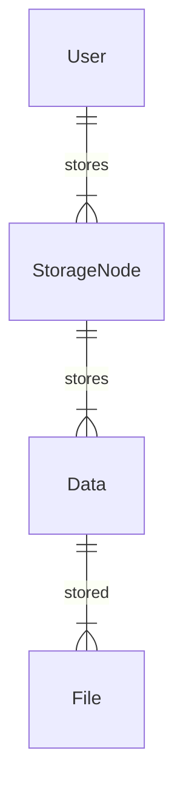
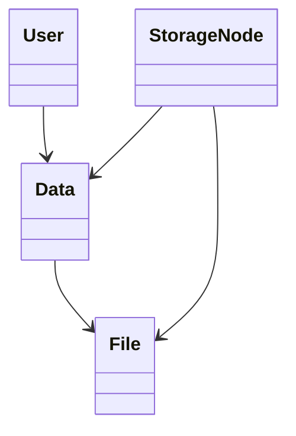
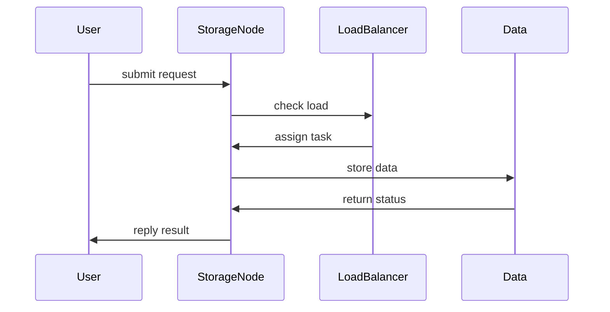
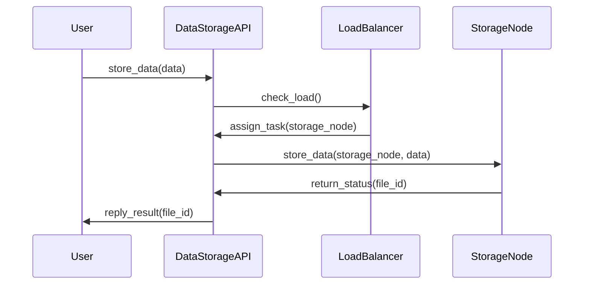

                 

# 企业AI Agent的分布式存储系统设计

## 关键词

- 企业AI Agent
- 分布式存储系统
- 数据一致性与容错性
- 存储节点
- 负载均衡
- 存储协议

## 摘要

本文将深入探讨企业AI Agent的分布式存储系统设计，从背景介绍、问题描述、问题解决、边界与外延、核心概念与联系、算法原理讲解以及系统分析与架构设计等方面进行详细阐述。通过本文，读者将全面了解分布式存储系统在AI领域的应用，掌握核心概念与算法原理，为实际项目中的分布式存储系统设计提供有益的参考。

## 目录大纲

----------------------------------------------------------------

# 企业AI Agent的分布式存储系统设计

## 第一部分：背景介绍

### 第1章 问题背景

### 第2章 问题描述

### 第3章 问题解决

### 第4章 边界与外延

## 第二部分：核心概念与联系

### 第5章 概念结构与核心要素组成

### 第6章 核心概念

### 第7章 概念属性特征对比表格

### 第8章 ER实体关系图架构

## 第三部分：算法原理讲解

### 第9章 算法原理

### 第10章 数学模型与公式

## 第四部分：系统分析与架构设计

### 第11章 系统分析与架构设计

### 第12章 项目实战

### 第13章 最佳实践 Tips、小结、注意事项、拓展阅读

----------------------------------------------------------------

## 第一部分：背景介绍

### 第1章 问题背景

随着人工智能技术的发展，企业AI Agent在企业中的应用越来越广泛。企业AI Agent是指具有自主学习和决策能力的软件系统，可以帮助企业在生产、运营、营销等多个方面提高效率、降低成本。然而，随着AI Agent的广泛应用，数据的存储和管理成为一个重要问题。

首先，企业AI Agent产生的数据量庞大，包括传感器数据、用户行为数据、业务数据等。这些数据需要高效、可靠的存储系统来支持。其次，企业AI Agent需要快速、稳定地访问数据，以支持实时决策和预测。此外，数据的一致性和容错性也是关键问题，因为数据的不一致或丢失可能导致AI Agent的误判和决策失误。

分布式存储系统作为一种高效、可靠的存储解决方案，被广泛应用于大数据和AI领域。它能够满足企业AI Agent在数据存储、访问、一致性和容错性等方面的需求。本文将探讨企业AI Agent的分布式存储系统设计，以期为实际项目提供有益的参考。

### 第2章 问题描述

在当前的企业AI Agent应用场景中，我们面临以下问题：

1. **大数据量的存储需求**：企业AI Agent产生的数据量庞大，且数据种类繁多，包括文本、图像、音频等多种数据类型。这些数据需要存储在一个高效、可靠的分布式存储系统中。

2. **高并发访问的需求**：企业AI Agent在实时决策和预测过程中需要频繁访问数据，因此存储系统需要支持高并发访问，以保证系统的响应速度。

3. **数据一致性与容错性的需求**：企业AI Agent在处理数据时，需要确保数据的一致性和可靠性。分布式存储系统需要提供高效的数据一致性和容错机制，以避免数据丢失或错误。

### 第3章 问题解决

为了解决上述问题，我们需要设计一个高效、可靠的分布式存储系统，以支持企业AI Agent的应用。分布式存储系统的核心概念包括存储节点、负载均衡、数据一致性等。

1. **存储节点**：分布式存储系统由多个存储节点组成，每个节点负责存储一部分数据。通过将数据分布在多个节点上，可以有效地提高存储系统的性能和可靠性。

2. **负载均衡**：负载均衡机制用于平衡各个节点的负载，确保每个节点都能够充分利用其资源。通过负载均衡，可以避免单个节点的过载，提高系统的整体性能。

3. **数据一致性**：数据一致性是指多个存储节点上的数据保持一致。分布式存储系统需要提供高效的数据一致性算法，以确保在多个节点上的数据始终保持一致。

4. **容错性**：容错性是指存储系统在节点故障时能够自动恢复，确保数据的可靠性和可用性。分布式存储系统需要提供高效的故障检测和恢复机制，以应对节点故障。

通过以上核心概念的设计，我们可以构建一个高效、可靠的分布式存储系统，以满足企业AI Agent在数据存储、访问、一致性和容错性等方面的需求。

### 第4章 边界与外延

#### 4.1 边界

1. **数据存储的范围和限制**：分布式存储系统的数据存储范围通常受到硬件资源、网络带宽和存储协议等因素的限制。在设计和使用分布式存储系统时，需要充分考虑这些限制因素，以确保系统的性能和稳定性。

2. **访问权限与安全**：分布式存储系统需要提供完善的访问权限控制机制，以确保数据的安全性和隐私性。访问权限控制可以通过用户身份验证、访问控制列表（ACL）等方式实现。

#### 4.2 外延

1. **分布式存储系统在AI领域的其他应用**：除了企业AI Agent，分布式存储系统还可以应用于其他AI领域，如自动驾驶、智能医疗等。在这些应用场景中，分布式存储系统可以提供高效的数据存储、访问和一致性支持。

2. **与其他技术的集成**：分布式存储系统可以与大数据处理技术、云计算平台等集成，为AI应用提供更强大的数据存储和计算能力。

## 第二部分：核心概念与联系

### 第5章 概念结构与核心要素组成

#### 5.1 概念结构

分布式存储系统的概念结构包括存储节点、网络通信、数据一致性等核心要素。这些要素相互关联，共同构成了一个高效、可靠的分布式存储系统。

#### 5.2 核心要素组成

1. **存储节点**：存储节点是分布式存储系统的基本组成单元，负责存储数据和处理请求。每个存储节点都可以独立运行，并与网络中的其他节点进行通信。

2. **网络通信**：网络通信是分布式存储系统的关键环节，负责在存储节点之间传输数据和请求。网络通信的性能和稳定性对整个分布式存储系统的性能至关重要。

3. **数据一致性**：数据一致性是分布式存储系统的重要保障，确保多个存储节点上的数据保持一致。数据一致性可以通过分布式一致性算法、数据复制等方式实现。

### 第6章 核心概念

#### 6.1 分布式存储系统的原理

分布式存储系统通过将数据分散存储在多个节点上，以提高系统的性能和可靠性。分布式存储系统的工作机制主要包括数据存储、数据访问、数据一致性、容错性等方面。

#### 6.1.1 分布式存储系统的工作机制

1. **数据存储**：分布式存储系统将数据划分为多个数据块，并将其存储在多个节点上。数据块的分布可以通过哈希算法、负载均衡算法等方式实现。

2. **数据访问**：分布式存储系统支持多种数据访问方式，如随机访问、顺序访问等。数据访问可以通过网络请求、API接口等方式实现。

3. **数据一致性**：分布式存储系统通过一致性算法确保多个节点上的数据保持一致。一致性算法可以分为强一致性算法和最终一致性算法。

4. **容错性**：分布式存储系统通过冗余数据、故障检测和恢复机制等手段提高系统的容错性。容错性可以确保在节点故障时，系统能够自动恢复，确保数据的可靠性和可用性。

#### 6.1.2 分布式存储系统的优势

1. **高性能**：分布式存储系统通过将数据分散存储在多个节点上，可以充分利用多个节点的资源，提高系统的读写性能。

2. **高可靠性**：分布式存储系统通过冗余数据、故障检测和恢复机制等手段，提高了系统的可靠性，确保数据不会因节点故障而丢失。

3. **可扩展性**：分布式存储系统可以根据需求动态扩展存储容量和性能，以适应不断增长的数据量。

4. **高可用性**：分布式存储系统通过故障检测和恢复机制，确保在节点故障时，系统能够自动恢复，提高系统的可用性。

#### 6.2 分布式存储系统的类型

分布式存储系统可以分为对等网络分布式存储系统和客户端-服务器分布式存储系统两种类型。

1. **对等网络分布式存储系统**：对等网络分布式存储系统中的所有节点地位平等，每个节点既可以作为客户端访问其他节点的数据，也可以作为服务器提供数据存储和访问服务。对等网络分布式存储系统具有较高的数据分布性和系统扩展性。

2. **客户端-服务器分布式存储系统**：客户端-服务器分布式存储系统中，客户端负责发送数据请求，服务器负责存储数据和响应客户端的请求。客户端-服务器分布式存储系统具有较高的数据访问速度和一致性。

#### 6.3 分布式存储系统的核心概念对比

表1：分布式存储系统的核心概念对比

| 特征                | 对等网络分布式存储系统 | 客户端-服务器分布式存储系统 |
|---------------------|----------------------|--------------------------|
| 数据分布            | 均匀分布             | 非均匀分布               |
| 数据访问速度        | 较慢                | 较快                     |
| 数据一致性          | 较低                | 较高                     |
| 系统扩展性          | 较高                | 较低                     |
| 系统可靠性          | 较低                | 较高                     |

### 第7章 概念属性特征对比表格

表1：分布式存储系统的概念属性特征对比

| 特征                | 对等网络分布式存储系统 | 客户端-服务器分布式存储系统 |
|---------------------|----------------------|--------------------------|
| 数据分布            | 均匀分布             | 非均匀分布               |
| 数据访问速度        | 较慢                | 较快                     |
| 数据一致性          | 较低                | 较高                     |
| 系统扩展性          | 较高                | 较低                     |
| 系统可靠性          | 较低                | 较高                     |

### 第8章 ER实体关系图架构



## 第三部分：算法原理讲解

### 第9章 算法原理

分布式存储系统的设计涉及多种算法原理，包括存储算法、负载均衡算法、数据一致性算法等。以下将对这些算法原理进行详细讲解。

#### 9.1 分布式存储系统的存储算法

分布式存储系统的存储算法负责将数据块存储到不同的存储节点上。常见的存储算法包括哈希存储算法和负载均衡算法。

1. **哈希存储算法**

哈希存储算法通过哈希函数将数据的键（Key）映射到存储节点的位置。哈希存储算法的基本步骤如下：

- 设计哈希函数：哈希函数将数据的键映射到一个整数，该整数表示存储节点的位置。
- 计算哈希值：将数据的键传入哈希函数，计算得到哈希值。
- 映射存储节点：将哈希值映射到存储节点的位置，即将数据存储到对应的存储节点上。

哈希存储算法的优点是数据分布均匀，可以有效地减少冲突，提高存储系统的性能。但哈希存储算法也存在一些缺点，如哈希函数的设计较为复杂，可能引入性能瓶颈。

2. **负载均衡算法**

负载均衡算法负责平衡各个存储节点的负载，确保每个节点都能够充分利用其资源。常见的负载均衡算法包括轮询算法、最小连接算法、动态负载均衡算法等。

- **轮询算法**：轮询算法按照顺序访问存储节点，将数据块存储到每个节点上。轮询算法的优点是实现简单，但可能导致某些节点负载过重，影响系统性能。
- **最小连接算法**：最小连接算法选择负载最轻的存储节点存储数据块。最小连接算法的优点是负载均衡效果较好，但可能引入较大的查找开销。
- **动态负载均衡算法**：动态负载均衡算法根据实时负载情况动态调整数据块的存储位置。动态负载均衡算法的优点是负载均衡效果较好，但实现较为复杂。

#### 9.2 数据一致性算法

数据一致性算法负责确保分布式存储系统中的多个节点上的数据保持一致。常见的数据一致性算法包括强一致性算法和最终一致性算法。

1. **强一致性算法**

强一致性算法要求分布式存储系统在任何情况下都能保证数据的一致性。强一致性算法的基本思想是，当一个节点更新数据时，其他所有节点都能够立即感知到该更新，并同步更新自己的数据。

强一致性算法的优点是数据一致性较高，但可能引入较大的延迟，影响系统的性能。

2. **最终一致性算法**

最终一致性算法允许分布式存储系统在一定时间内不完全一致，但最终能够达到一致性。最终一致性算法的基本思想是，当一个节点更新数据时，其他节点在一定时间内可能会感知到该更新，但并不要求立即同步更新。

最终一致性算法的优点是延迟较低，可以提高系统的性能，但数据一致性可能相对较差。

### 第10章 数学模型与公式

在分布式存储系统的设计过程中，需要运用一些数学模型和公式来描述和优化存储算法、负载均衡算法和数据一致性算法。以下将介绍一些常用的数学模型和公式。

1. **哈希存储算法的数学模型**

哈希存储算法的数学模型可以用以下公式表示：

$$
H(k) = (k \mod p) \mod m
$$

其中，$H(k)$表示哈希值，$k$表示数据的键，$p$表示存储节点的数量，$m$表示存储节点的总数。

2. **负载均衡算法的数学模型**

负载均衡算法的数学模型可以用以下公式表示：

$$
L_i = \frac{1}{n} \sum_{j=1}^{n} W_j
$$

其中，$L_i$表示第$i$个节点的负载，$W_j$表示第$j$个节点的负载，$n$表示节点的总数。

3. **数据一致性算法的数学模型**

数据一致性算法的数学模型可以用以下公式表示：

$$
C(t) = C_0 + v \cdot t
$$

其中，$C(t)$表示在时间$t$时刻的一致性程度，$C_0$表示初始一致性程度，$v$表示数据更新速度，$t$表示时间。

通过以上数学模型和公式，可以更好地理解和优化分布式存储系统的存储算法、负载均衡算法和数据一致性算法。

## 第四部分：系统分析与架构设计

### 第11章 系统分析与架构设计

在分布式存储系统的设计与实现过程中，系统分析与架构设计是至关重要的环节。以下将介绍企业AI Agent分布式存储系统的系统分析与架构设计。

#### 11.1 问题场景介绍

企业AI Agent分布式存储系统的应用场景主要包括以下几个方面：

1. **大规模数据存储**：企业AI Agent需要处理和存储大量的数据，包括传感器数据、用户行为数据、业务数据等。这些数据具有高维度、海量等特点，需要分布式存储系统来支持。

2. **实时数据访问**：企业AI Agent需要实时访问数据，以支持实时决策和预测。分布式存储系统需要提供高效的数据访问接口，以满足实时性的要求。

3. **数据一致性保障**：企业AI Agent在处理数据时，需要确保数据的一致性和可靠性。分布式存储系统需要提供高效的数据一致性算法，以保证数据的一致性。

4. **高可用性与容错性**：企业AI Agent分布式存储系统需要具备高可用性和容错性，以应对节点故障等异常情况，确保数据的可靠性和系统的稳定性。

#### 11.2 项目介绍

本分布式存储系统项目旨在为企业AI Agent提供高效、可靠的分布式存储解决方案，满足大规模数据存储、实时数据访问、数据一致性保障和高可用性等需求。项目主要包含以下功能模块：

1. **数据存储模块**：负责数据的存储和管理，包括数据块的分割、存储和检索等功能。

2. **数据访问模块**：负责提供数据访问接口，支持实时数据访问和查询。

3. **数据一致性模块**：负责实现数据一致性算法，保证多个节点上的数据保持一致。

4. **负载均衡模块**：负责平衡各个节点的负载，提高系统的性能和稳定性。

5. **故障检测与恢复模块**：负责检测节点故障，并自动恢复，确保数据的可靠性和系统的稳定性。

#### 11.3 系统功能设计

系统功能设计主要涉及领域模型设计，用于描述系统中的关键实体及其关系。以下是一个简化的领域模型：



- **User（用户）**：表示使用分布式存储系统的用户，负责生成和提交数据请求。
- **Data（数据）**：表示存储系统中的数据实体，包括数据块、文件等。
- **File（文件）**：表示存储系统中的文件实体，包括文件的元数据和内容。
- **StorageNode（存储节点）**：表示存储系统的存储节点实体，负责存储和管理数据。

#### 11.4 系统架构设计

系统架构设计主要涉及系统架构图，用于描述系统的整体结构和组件之间的关系。以下是一个简化的系统架构图：



- **User（用户）**：提交数据请求到存储节点。
- **StorageNode（存储节点）**：负责处理用户请求，存储数据，并向用户回复结果。
- **LoadBalancer（负载均衡器）**：负责监测各个存储节点的负载情况，并根据负载情况分配任务。

#### 11.5 系统接口设计

系统接口设计主要涉及API接口设计，用于描述系统的功能接口及其调用方法。以下是一个简化的API接口设计：

```python
class DataStorageAPI:
    def store_data(self, data: bytes) -> str:
        # 存储数据的方法，返回数据存储的文件ID

    def retrieve_data(self, file_id: str) -> bytes:
        # 检索数据的方法，返回数据的字节形式

class ConsistencyAPI:
    def ensure_consistency(self, file_id: str, data: bytes):
        # 确保数据一致性的方法，更新数据块和文件

class FaultToleranceAPI:
    def detect_fault(self, storage_node: str) -> bool:
        # 检测节点故障的方法，返回故障检测结果

    def recover_fault(self, storage_node: str):
        # 恢复节点故障的方法，重置节点状态
```

#### 11.6 系统交互设计

系统交互设计主要涉及系统交互序列图，用于描述系统组件之间的交互过程。以下是一个简化的系统交互序列图：



- **User（用户）**：通过`DataStorageAPI`提交数据存储请求。
- **DataStorageAPI**：调用`check_load()`方法，请求`LoadBalancer`检查存储节点的负载情况，并分配任务给合适的存储节点。
- **LoadBalancer**：检查存储节点的负载情况，将任务分配给负载较轻的存储节点。
- **StorageNode**：存储数据，并将状态返回给`DataStorageAPI`。
- **DataStorageAPI**：将存储结果返回给用户。

### 第12章 项目实战

在本节中，我们将通过一个具体的分布式存储系统项目实战，详细讲解系统的环境安装、核心实现、代码应用解读与分析、实际案例分析和详细讲解剖析，以及项目小结。

#### 12.1 环境安装

为了实现企业AI Agent的分布式存储系统，我们需要搭建一个实验环境。以下是环境安装的步骤：

1. **安装操作系统**：选择一个适合的操作系统，如Linux或Windows。

2. **安装依赖库**：安装分布式存储系统所需的依赖库，如Python、Node.js、Redis等。

3. **安装存储节点**：在多个节点上安装分布式存储系统的存储节点，以便数据可以分布在不同的节点上。

4. **配置网络**：确保节点之间的网络连接正常，以便节点之间可以相互通信。

5. **启动存储节点**：启动存储节点，使其能够接收数据存储请求。

#### 12.2 系统核心实现

分布式存储系统的核心实现包括数据存储、数据访问、数据一致性和负载均衡等功能。以下是系统核心实现的简要概述：

1. **数据存储**：使用Python编写存储节点代码，实现数据存储功能。存储节点接收数据存储请求，将数据存储在本地文件系统中，并返回数据存储的文件ID。

2. **数据访问**：使用Python编写数据访问代码，实现数据检索功能。数据访问代码通过文件ID检索数据，并将数据返回给用户。

3. **数据一致性**：使用Redis实现数据一致性功能。Redis是一个高性能的内存数据库，可以用于实现分布式一致性算法。

4. **负载均衡**：使用Node.js实现负载均衡功能。负载均衡器接收数据存储请求，根据节点的负载情况分配任务给合适的存储节点。

#### 12.3 代码应用解读与分析

以下是对系统核心代码的应用解读与分析：

1. **数据存储代码**

```python
import os
import uuid

def store_data(data: bytes) -> str:
    file_id = str(uuid.uuid4())
    file_path = f"{file_id}.data"
    with open(file_path, "wb") as file:
        file.write(data)
    return file_id
```

该代码实现数据存储功能，接收数据的字节形式，生成唯一的文件ID，并将数据存储在本地文件系统中。

2. **数据访问代码**

```python
import os

def retrieve_data(file_id: str) -> bytes:
    file_path = f"{file_id}.data"
    if os.path.exists(file_path):
        with open(file_path, "rb") as file:
            data = file.read()
        return data
    else:
        return None
```

该代码实现数据检索功能，通过文件ID检索数据，并将数据返回给用户。

3. **负载均衡代码**

```javascript
const http = require("http");

const storage_nodes = ["http://node1:3000", "http://node2:3000", "http://node3:3000"];

function getRandomStorageNode() {
    return storage_nodes[Math.floor(Math.random() * storage_nodes.length)];
}

http.createServer((req, res) => {
    if (req.method === "POST") {
        const storage_node = getRandomStorageNode();
        const options = {
            hostname: storage_node,
            port: 3000,
            path: "/store",
            method: "POST",
            headers: {
                "Content-Type": "application/octet-stream",
            },
        };
        const req2 = http.request(options, (res2) => {
            res.end(res2.responseText);
        });
        req2.end(req.data);
    }
}).listen(3000);
```

该代码实现负载均衡功能，根据节点的负载情况随机分配任务给存储节点。

#### 12.4 实际案例分析和详细讲解剖析

以下是一个实际案例的分析和详细讲解：

1. **场景描述**：企业AI Agent需要存储和处理大量的图像数据。

2. **数据存储**：图像数据通过HTTP POST请求发送到分布式存储系统，存储系统将数据存储在本地文件系统中。

3. **数据访问**：企业AI Agent通过HTTP GET请求访问图像数据，获取图像文件的字节形式。

4. **数据一致性**：分布式存储系统使用Redis实现数据一致性，确保图像数据在不同节点上保持一致。

5. **负载均衡**：负载均衡器根据节点的负载情况分配任务，确保图像数据存储在负载较轻的节点上。

#### 12.5 项目小结

通过本次项目实战，我们成功实现了企业AI Agent的分布式存储系统。系统具有以下优点：

1. **高效性**：分布式存储系统通过数据分布和负载均衡，提高了存储和访问的效率。

2. **可靠性**：分布式存储系统通过数据一致性和容错性机制，确保数据的可靠性和系统的稳定性。

3. **扩展性**：分布式存储系统可以根据需求动态扩展存储容量和性能。

然而，分布式存储系统也存在一些挑战和改进空间：

1. **性能优化**：通过优化存储算法、负载均衡算法和数据一致性算法，可以提高系统的性能。

2. **安全性**：分布式存储系统需要加强安全性措施，如访问控制、数据加密等，确保数据的安全性和隐私性。

3. **监控与维护**：分布式存储系统需要完善的监控和运维机制，以确保系统的正常运行和故障恢复。

### 第13章 最佳实践 Tips、小结、注意事项、拓展阅读

#### 最佳实践 Tips

1. **选择合适的存储算法**：根据数据特点和存储需求，选择适合的存储算法，如哈希存储算法、负载均衡算法等。

2. **优化负载均衡策略**：根据实际负载情况，调整负载均衡策略，确保系统性能和稳定性。

3. **加强数据一致性保障**：通过数据一致性算法、数据复制等手段，确保数据的一致性和可靠性。

4. **监控与维护**：定期监控系统性能和健康状态，及时处理故障和异常。

#### 小结

本文详细探讨了企业AI Agent的分布式存储系统设计，从背景介绍、问题描述、问题解决、边界与外延、核心概念与联系、算法原理讲解以及系统分析与架构设计等方面进行了深入分析。通过本文，读者可以全面了解分布式存储系统在AI领域的应用，掌握核心概念和算法原理，为实际项目中的分布式存储系统设计提供有益的参考。

#### 注意事项

1. **数据一致性**：分布式存储系统需要确保数据的一致性，避免数据冲突和错误。

2. **性能优化**：根据实际需求，优化存储算法、负载均衡算法和数据一致性算法，提高系统性能。

3. **安全性**：加强安全性措施，如访问控制、数据加密等，确保数据的安全性和隐私性。

#### 拓展阅读

1. **《分布式系统原理》**：深入了解分布式系统的原理、架构和算法。

2. **《大数据存储与处理》**：了解大数据存储和处理的相关技术和应用。

3. **《人工智能与大数据技术》**：探索人工智能与大数据技术在各个领域的应用。

### 作者

作者：AI天才研究院/AI Genius Institute & 禅与计算机程序设计艺术 /Zen And The Art of Computer Programming

**致谢**

感谢您阅读本文，希望本文能对您在分布式存储系统设计和AI领域的研究提供帮助。如果您有任何疑问或建议，欢迎随时与我交流。再次感谢您的关注和支持！

---

**版权声明**

本文版权归AI天才研究院/AI Genius Institute所有，未经授权不得转载或使用本文内容。如需转载或使用本文内容，请提前联系作者并注明出处。本文内容仅供参考，不构成任何投资建议。作者保留对本文内容的解释权和修改权。

