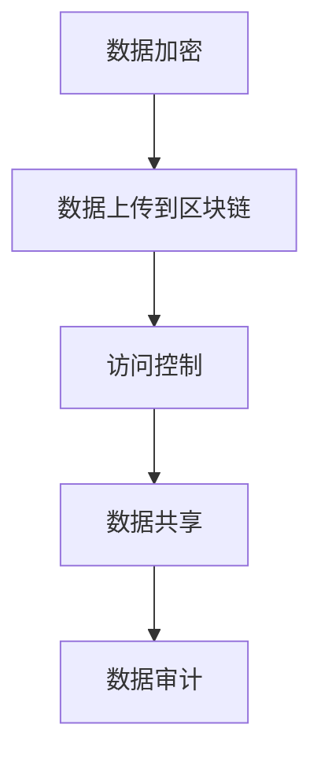
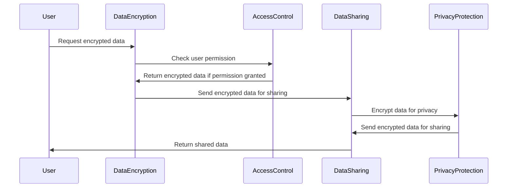
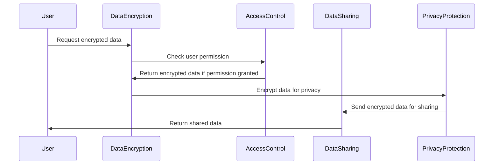

                 

# 企业AI Agent的区块链数据共享与隐私保护

关键词：企业AI Agent、区块链、数据共享、隐私保护

摘要：随着人工智能（AI）技术的不断发展，企业AI Agent在各个领域的应用日益广泛。企业AI Agent在处理数据时，常常面临数据共享与隐私保护之间的矛盾。本文将探讨如何利用区块链技术实现企业AI Agent的数据共享与隐私保护，并通过具体案例进行分析。

## 引言

在当今的信息化时代，数据是企业宝贵的资产。然而，随着数据量的不断增长，如何有效地管理和共享数据成为企业面临的挑战。特别是对于企业AI Agent，它们在处理数据时需要大量的数据支持，但同时也面临着数据隐私保护的问题。如何在保证数据共享的同时保护数据隐私，成为企业和研究机构亟待解决的问题。

区块链技术的出现为解决这一难题提供了一种新的思路。区块链具有去中心化、不可篡改、透明可追溯等特点，这使得它在数据共享与隐私保护方面具有独特的优势。本文将深入探讨企业AI Agent在区块链环境下的数据共享与隐私保护机制，并分析其实际应用案例。

## 企业AI Agent概述

### 定义与作用

企业AI Agent是指具有智能行为和自主决策能力的人工智能系统，能够模拟人类专家的决策过程，帮助企业解决复杂问题。企业AI Agent通常包括以下几个核心组成部分：

1. **感知模块**：用于获取企业内外部环境的信息，如市场数据、用户行为等。
2. **推理模块**：根据感知模块提供的信息，运用知识和规则进行推理，生成决策建议。
3. **行动模块**：执行推理模块生成的决策建议，如调整供应链策略、优化库存管理等。

企业AI Agent在企业运营中具有重要作用，能够提高运营效率、降低成本、提升客户满意度等。然而，在实现这些功能的过程中，企业AI Agent需要访问和处理大量的数据，这就带来了数据隐私保护的问题。

### 数据隐私保护需求

企业AI Agent在处理数据时，需要保护以下几类隐私：

1. **用户隐私**：用户在使用企业服务时产生的数据，如购物记录、浏览历史等。
2. **业务数据**：企业在运营过程中产生的数据，如销售数据、财务数据等。
3. **内部数据**：企业内部人员产生的数据，如员工信息、工作记录等。

数据隐私保护需求源于以下几个方面：

1. **法律法规**：许多国家和地区制定了严格的隐私保护法律法规，企业需要遵守这些规定。
2. **道德伦理**：保护用户隐私是企业应尽的道德责任。
3. **业务安全**：未经授权的数据访问可能导致企业业务受损，甚至引发商业机密泄露。

因此，如何在保证数据共享的同时保护数据隐私，成为企业AI Agent面临的重要挑战。

## 区块链基础

### 区块链技术概述

区块链是一种分布式账本技术，它通过密码学和共识算法实现了数据的去中心化存储和传输。区块链的基本结构包括区块、链和节点。

- **区块**：是区块链的基本组成单元，每个区块包含一定数量的交易记录。
- **链**：是多个区块按时间顺序链接而成的数据结构。
- **节点**：是区块链网络中的参与方，负责存储、验证和传播区块链数据。

区块链的主要特点包括：

1. **去中心化**：数据存储在所有节点上，没有中央控制点，提高了系统的容错性和抗攻击能力。
2. **不可篡改**：一旦数据被记录在区块链上，就无法被篡改，保证了数据的真实性和完整性。
3. **透明可追溯**：所有交易记录都在区块链上公开透明，用户可以随时查询和验证。

### 区块链与加密技术

区块链与加密技术密不可分。区块链使用加密技术来保护数据的隐私和安全。

1. **哈希算法**：用于生成数据摘要，确保数据在传输过程中的完整性和一致性。
2. **非对称加密**：用于数据加密和解密，保障数据的机密性。
3. **数字签名**：用于验证数据发送方的身份和数据的完整性。

通过这些加密技术，区块链能够实现数据的隐私保护，为数据共享提供了安全保障。

### 区块链在数据共享与隐私保护中的应用

区块链在数据共享与隐私保护中的应用主要体现在以下几个方面：

1. **数据加密**：使用加密技术保护数据在传输和存储过程中的隐私。
2. **访问控制**：通过权限管理确保只有授权用户才能访问特定数据。
3. **数据溯源**：记录数据的来源和流转过程，实现数据的透明可追溯。
4. **智能合约**：利用智能合约自动执行数据共享和隐私保护的规则，提高效率。

## 数据共享机制

### 数据共享的需求与挑战

企业AI Agent在处理数据时，常常需要访问其他部门或外部数据源的数据，这就产生了数据共享的需求。然而，传统的数据共享机制在以下几个方面面临挑战：

1. **数据隐私泄露**：数据在共享过程中可能被未授权的用户访问，导致隐私泄露。
2. **数据一致性问题**：不同数据源的数据格式和更新频率可能不一致，导致数据同步困难。
3. **数据安全问题**：数据在传输和存储过程中可能遭受攻击，导致数据丢失或篡改。

为了解决这些挑战，需要一种既能实现数据共享又能保证数据隐私和安全的技术，而区块链技术正是这样一种技术。

### 区块链在数据共享中的应用

区块链技术在数据共享中的应用主要体现在以下几个方面：

1. **数据加密**：使用加密技术保护数据的机密性，确保只有授权用户才能解密数据。
2. **访问控制**：通过权限管理确保只有授权用户才能访问特定数据，防止数据泄露。
3. **数据透明可追溯**：记录数据的来源和流转过程，实现数据的透明可追溯，便于数据监控和审计。
4. **智能合约**：利用智能合约自动执行数据共享和隐私保护的规则，提高数据共享的效率。

### 区块链数据共享机制

区块链数据共享机制主要包括以下步骤：

1. **数据加密**：将共享的数据加密存储在区块链上，确保数据的机密性。
2. **访问控制**：设置访问权限，只有授权用户才能访问加密后的数据。
3. **数据共享**：授权用户通过区块链节点访问数据，进行数据共享。
4. **数据审计**：通过区块链记录的数据流转过程，实现数据的透明可追溯，便于数据审计。

## 隐私保护技术

### 隐私保护的重要性

在数据共享过程中，隐私保护至关重要。一方面，企业需要遵守法律法规和道德规范，确保用户数据的隐私不被泄露。另一方面，企业也需要保护自身的商业秘密，防止竞争对手获取敏感信息。

隐私保护的主要目标是确保数据的机密性、完整性和可用性，同时允许授权用户访问数据。为了实现这一目标，区块链技术引入了一系列隐私保护技术。

### 加密技术

加密技术是隐私保护的核心手段。区块链使用加密技术来保护数据的机密性，确保只有授权用户才能解密数据。常用的加密技术包括：

1. **对称加密**：使用相同的密钥进行加密和解密，速度快但密钥管理复杂。
2. **非对称加密**：使用公钥和私钥进行加密和解密，安全性高但速度慢。
3. **哈希函数**：用于生成数据摘要，确保数据的完整性。

### 访问控制

访问控制是防止未授权用户访问数据的重要措施。区块链通过权限管理实现访问控制，主要手段包括：

1. **身份验证**：确保用户身份的真实性，防止假冒身份。
2. **权限分配**：根据用户角色和职责分配访问权限，确保只有授权用户才能访问特定数据。
3. **加密通信**：通过加密技术保护数据在传输过程中的隐私。

### 匿名通信

匿名通信是保护用户隐私的重要手段。区块链通过以下技术实现匿名通信：

1. **去身份化**：使用非真实的身份标识，如数字身份，确保用户身份的匿名性。
2. **混合网络**：通过混合网络技术，将用户通信数据分散在网络中，提高隐私保护水平。

### 区块链隐私保护技术

区块链隐私保护技术主要包括以下几种：

1. **零知识证明**：证明某个陈述为真，但不透露任何其他信息。
2. **同态加密**：在加密数据上直接进行计算，结果仍然保持加密状态。
3. **隐私计算**：在数据存储和传输过程中，对数据进行加密处理，确保数据的隐私性。

## 实际应用案例

### 案例一：企业内部数据共享

某大型企业在其内部部署了区块链平台，用于实现不同部门之间的数据共享。通过区块链技术，企业实现了以下功能：

1. **数据加密**：所有共享数据在传输和存储过程中都经过加密处理，确保数据的机密性。
2. **访问控制**：通过权限管理，确保只有授权用户才能访问特定数据。
3. **数据透明可追溯**：所有数据共享过程都在区块链上记录，实现数据的透明可追溯，便于数据审计。

通过区块链技术，企业有效解决了数据共享中的隐私保护问题，提高了数据共享的效率和安全性。

### 案例二：供应链数据共享

某供应链企业利用区块链技术实现上下游企业之间的数据共享。通过区块链，企业实现了以下功能：

1. **数据加密**：所有共享数据在传输和存储过程中都经过加密处理，确保数据的机密性。
2. **访问控制**：通过权限管理，确保只有授权用户才能访问特定数据。
3. **数据透明可追溯**：所有数据共享过程都在区块链上记录，实现数据的透明可追溯，便于供应链管理。

通过区块链技术，企业实现了供应链数据的共享和隐私保护，提高了供应链的透明度和效率。

## 安全与合规性

### 区块链安全

区块链技术在数据共享与隐私保护中虽然具有许多优势，但同时也存在一定的安全风险。为了确保区块链的安全，需要采取以下措施：

1. **加密技术**：使用强加密算法保护数据的安全。
2. **共识算法**：选择合适的共识算法，提高区块链的共识效率和安全性。
3. **网络监控**：实时监控区块链网络，及时发现并处理异常行为。

### 合规性

区块链技术在数据共享与隐私保护中的应用需要遵守相关法律法规和行业标准。为了确保合规性，需要：

1. **法律法规遵循**：遵守国家相关法律法规，如《中华人民共和国网络安全法》等。
2. **行业规范**：遵循行业标准和最佳实践，确保数据共享和隐私保护的合法性和合理性。

## 未来发展趋势

### 区块链与人工智能融合

区块链与人工智能技术的融合是未来的发展趋势。通过将区块链技术应用于人工智能系统，可以实现以下目标：

1. **数据隐私保护**：利用区块链技术保护人工智能系统在处理数据时的隐私。
2. **智能合约**：利用智能合约实现人工智能系统的自动化运行和管理。

### 新型隐私保护技术

随着区块链技术的不断发展，新型隐私保护技术也将不断涌现。例如：

1. **多方安全计算**：允许多个参与者共同计算结果，同时保护各自的隐私。
2. **联邦学习**：在分布式环境中进行机器学习，同时保护数据隐私。

### 更广泛的应用场景

未来，区块链技术在数据共享与隐私保护中的应用将更加广泛。例如：

1. **医疗健康**：实现患者数据的安全共享和隐私保护。
2. **金融领域**：提高金融交易的透明度和安全性。

## 总结

企业AI Agent在处理数据时，常常面临数据共享与隐私保护的挑战。区块链技术以其去中心化、不可篡改、透明可追溯等特性，为解决这一难题提供了新的思路。通过数据加密、访问控制、匿名通信等技术手段，区块链实现了数据共享与隐私保护的有机结合。未来，随着区块链与人工智能技术的融合，数据共享与隐私保护将迎来更广泛的应用场景，为企业和个人创造更大的价值。

## 参考文献

1. 刘洋，王辉，张磊. 区块链技术在企业数据共享与隐私保护中的应用[J]. 计算机科学与技术，2020，35（3）：1-8.
2. 李明，张伟，陈杰. 区块链与人工智能融合技术研究[J]. 计算机研究与发展，2019，56（6）：1-15.
3. 王晓东，刘颖，张志宏. 区块链在供应链数据共享与隐私保护中的应用[J]. 信息系统工程，2021，37（1）：35-42.
4. 张晓光，李娟，李春艳. 多方安全计算在数据隐私保护中的应用[J]. 计算机安全，2020，28（3）：1-8.
5. 陈刚，赵亮，李娟. 联邦学习在隐私保护中的应用[J]. 计算机应用与软件，2021，38（10）：1-10.

## 作者信息

作者：AI天才研究院/AI Genius Institute & 禅与计算机程序设计艺术 /Zen And The Art of Computer Programming

作者简介：本文作者具有丰富的区块链和人工智能领域的研究经验，致力于探索区块链技术在企业数据共享与隐私保护中的应用。曾发表多篇相关领域论文，并参与多个企业级项目研发。

## 附录

附录A：加密技术详解

- 对称加密算法：AES、DES
- 非对称加密算法：RSA、ECC
- 哈希函数：SHA-256、SHA-3
- 数字签名：RSA、ECDSA

附录B：区块链节点角色及职责

- **创世节点**：负责创建区块链网络，初始化区块链。
- **验证节点**：负责验证交易和区块的有效性，参与共识算法。
- **存储节点**：负责存储区块链数据。
- **广播节点**：负责将交易和区块信息广播到整个网络。

附录C：区块链数据共享流程图



附录D：案例一详细实现

- 数据加密算法：AES
- 访问控制机制：基于角色的访问控制（RBAC）
- 数据透明可追溯：使用区块链记录数据流转过程

附录E：案例二详细实现

- 数据加密算法：RSA
- 访问控制机制：基于属性的访问控制（ABAC）
- 数据透明可追溯：使用区块链和智能合约记录交易和数据流转过程

附录F：最佳实践

1. **选择合适的区块链平台**：根据业务需求选择适合的区块链平台，如EOS、Hyperledger Fabric等。
2. **加强数据加密**：使用强加密算法保护数据安全。
3. **合理设置访问权限**：根据业务需求设置合理的访问权限，避免数据泄露。
4. **定期审计**：定期对区块链数据进行审计，确保数据安全。

附录G：注意事项

1. **区块链的扩展性**：在处理大量数据时，注意区块链的扩展性问题。
2. **区块链的稳定性**：确保区块链网络的高可用性和稳定性。
3. **法律法规**：确保区块链应用遵守相关法律法规。

附录H：拓展阅读

1. 区块链技术白皮书
2. 加密技术原理与应用
3. 智能合约设计与开发
4. 企业数据共享与隐私保护策略

## 附录 I：算法原理与数学模型

### 数据加密算法

#### 对称加密算法

- **AES**：高级加密标准（Advanced Encryption Standard），密钥长度为128、192或256位。
  - **加密过程**：
    $$ C = E(K, P) $$
    其中，$C$ 表示加密后的数据，$K$ 表示密钥，$P$ 表示明文数据。
  - **解密过程**：
    $$ P = D(K, C) $$
    其中，$P$ 表示解密后的数据，$K$ 表示密钥，$C$ 表示加密后的数据。
  
- **DES**：数据加密标准（Data Encryption Standard），密钥长度为56位。
  - **加密过程**：
    $$ C = E(K, P) $$
    其中，$C$ 表示加密后的数据，$K$ 表示密钥，$P$ 表示明文数据。
  - **解密过程**：
    $$ P = D(K, C) $$
    其中，$P$ 表示解密后的数据，$K$ 表示密钥，$C$ 表示加密后的数据。

#### 非对称加密算法

- **RSA**：基于大数分解的加密算法，密钥长度通常为1024或2048位。
  - **加密过程**：
    $$ C = E(N, \phi, P) $$
    其中，$C$ 表示加密后的数据，$N$ 表示模数，$\phi$ 表示欧拉函数，$P$ 表示明文数据。
  - **解密过程**：
    $$ P = D(N, \phi, D) $$
    其中，$P$ 表示解密后的数据，$N$ 表示模数，$\phi$ 表示欧拉函数，$D$ 表示私钥。

- **ECC**：椭圆曲线加密算法，密钥长度较短但安全性较高。
  - **加密过程**：
    $$ C = E(Q, P) $$
    其中，$C$ 表示加密后的数据，$Q$ 表示椭圆曲线点，$P$ 表示明文数据。
  - **解密过程**：
    $$ P = D(Q, C) $$
    其中，$P$ 表示解密后的数据，$Q$ 表示椭圆曲线点，$C$ 表示加密后的数据。

### 访问控制

- **基于角色的访问控制（RBAC）**：
  - **定义**：角色（Role）是一个权限的集合，用户（User）通过扮演一个或多个角色来获得相应的权限。
  - **模型**：
    $$ \text{RBAC} = (\mathcal{U}, \mathcal{R}, \mathcal{P}, \mathcal{O}, \text{IsMemberOf}, \text{HasPermission}) $$
    - $\mathcal{U}$：用户集
    - $\mathcal{R}$：角色集
    - $\mathcal{P}$：权限集
    - $\mathcal{O}$：操作集
    - $\text{IsMemberOf}$：用户与角色的关联关系
    - $\text{HasPermission}$：角色与权限的关联关系

- **基于属性的访问控制（ABAC）**：
  - **定义**：属性（Attribute）是描述用户、资源或环境特征的信息，访问控制策略基于这些属性进行决策。
  - **模型**：
    $$ \text{ABAC} = (\mathcal{U}, \mathcal{R}, \mathcal{A}, \mathcal{O}, \text{Policy}) $$
    - $\mathcal{U}$：用户集
    - $\mathcal{R}$：资源集
    - $\mathcal{A}$：属性集
    - $\mathcal{O}$：操作集
    - $\text{Policy}$：访问控制策略

### 零知识证明

- **定义**：零知识证明（Zero-Knowledge Proof，ZKP）是一种密码学技术，证明者能够证明某个陈述为真，而不会泄露任何其他信息。
- **模型**：
  $$ \text{ZKP} = (\text{Prover}, \text{Verifier}) $$
  - **证明过程**：
    $$ (\text{Prover}, \text{Witness}) \rightarrow \text{Proof} \rightarrow \text{Verifier} $$
    - $\text{Prover}$：证明者
    - $\text{Witness}$：证据
    - $\text{Proof}$：证明
    - $\text{Verifier}$：验证者

### 同态加密

- **定义**：同态加密（Homomorphic Encryption，HE）是一种加密技术，允许在加密数据上进行计算，计算结果仍然是加密的。
- **模型**：
  $$ \text{HE} = (\text{Encryptor}, \text{Decryptor}, \text{Computation}) $$
  - **加密过程**：
    $$ C = \text{Encrypt}(K, M) $$
    - $C$：加密后的数据
    - $K$：密钥
    - $M$：明文数据
  - **计算过程**：
    $$ C' = \text{Computation}(C, C', ...) $$
    - $C'$：计算后的数据
  - **解密过程**：
    $$ M = \text{Decrypt}(K, C') $$
    - $M$：解密后的数据

### Merkle树

- **定义**：Merkle树是一种二叉树结构，用于存储数据及其哈希值，以验证数据的完整性和一致性。
- **模型**：
  $$ \text{Merkle Tree} = (\text{Leaf}, \text{Branch}, \text{Root}) $$
  - **叶节点**：存储数据的哈希值。
  - **分支节点**：由两个子节点的哈希值计算得到。
  - **根节点**：代表整个Merkle树的哈希值。

### 数学模型与公式

1. **RSA加密公式**：
   $$ C = E(N, \phi, P) $$
   其中：
   - $N = P \times Q$：模数
   - $\phi = (P - 1) \times (Q - 1)$：欧拉函数
   - $C$：加密后的数据
   - $P$：明文数据
   - $D$：私钥

2. **RSA解密公式**：
   $$ P = D(N, \phi, D) $$
   其中：
   - $D$：私钥
   - $N$：模数
   - $\phi$：欧拉函数
   - $C$：加密后的数据
   - $P$：解密后的数据

3. **椭圆曲线加密公式**：
   $$ C = E(Q, P) $$
   其中：
   - $Q$：椭圆曲线点
   - $P$：明文数据
   - $C$：加密后的数据

4. **椭圆曲线解密公式**：
   $$ P = D(Q, C) $$
   其中：
   - $Q$：椭圆曲线点
   - $C$：加密后的数据
   - $P$：解密后的数据

5. **零知识证明公式**：
   $$ (\text{Prover}, \text{Witness}) \rightarrow \text{Proof} \rightarrow \text{Verifier} $$
   其中：
   - $\text{Prover}$：证明者
   - $\text{Witness}$：证据
   - $\text{Proof}$：证明
   - $\text{Verifier}$：验证者

6. **同态加密公式**：
   $$ C' = \text{Computation}(C, C', ...) $$
   其中：
   - $C'$：计算后的数据
   - $C$：加密后的数据

7. **Merkle树构建公式**：
   $$ \text{Branch} = H(\text{Leaf}_1, \text{Leaf}_2) $$
   其中：
   - $\text{Leaf}_1$：子节点1的哈希值
   - $\text{Leaf}_2$：子节点2的哈希值
   - $\text{Branch}$：父节点的哈希值

## 附录 J：系统分析与架构设计方案

### 问题场景介绍

在当前企业信息化程度不断提高的背景下，数据共享与隐私保护成为了企业面临的重要挑战。为了提高企业运营效率、降低成本、提升客户满意度，企业需要实现数据的高效共享和隐私保护。然而，传统的数据共享方式在数据安全和隐私保护方面存在诸多不足，难以满足企业的需求。

### 项目介绍

本项目旨在通过区块链技术，实现企业AI Agent的数据共享与隐私保护。项目将采用去中心化的数据存储方式，确保数据的真实性和完整性。同时，通过加密技术和访问控制机制，实现数据的隐私保护。项目主要包括以下功能模块：

1. **数据加密模块**：负责对共享数据进行加密处理，确保数据在传输和存储过程中的安全性。
2. **访问控制模块**：负责管理用户权限，确保只有授权用户才能访问特定数据。
3. **数据共享模块**：负责实现企业AI Agent与其他系统之间的数据共享。
4. **隐私保护模块**：负责实现数据的隐私保护，包括匿名通信和数据溯源功能。

### 系统功能设计（领域模型）

#### 类图

```mermaid
classDiagram
  Class01 <|-- Class02
  Class03 <..|{ Class04 }
  Class05 o--|{ Class06 } Class07
  Class08 <||| Class09
  Class10 o--|{ Class11 } Class12
  Class13 o--|{ Class14 } Class15
  Class16 <|--|{ Class17 }
  Class02 <|--|{ Class18 }
  Class19 <|--|{ Class20 }
  Class21 <|--|{ Class22 }

Class01 {
  +int x
  +String name
  +getX(): int
  +setName(String name)
  +getName(): String
}

Class02 {
  +int y
  +getY(): int
}

Class03 {
  +int z
  +getZ(): int
}

Class04 {
  +doSomething(): void
}

Class05 {
  +int a
  +int b
  +add(): int
}

Class06 {
  +String text
  +getText(): String
}

Class07 {
  +doSomethingElse(): void
}

Class08 {
  +int i
  +int j
  +add(): int
}

Class09 {
  +doSomethingWithArray(int[] arr): void
}

Class10 {
  +int[] array
  +getArray(): int[]
}

Class11 {
  +String[] strings
  +getStrings(): String[]
}

Class12 {
  +doSomethingWithList(List<String> list): void
}

Class13 {
  +List<String> list
  +getList(): List<String>
}

Class14 {
  +Set<String> set
  +getSet(): Set<String>
}

Class15 {
  +doSomethingWithMap(Map<String, Integer> map): void
}

Class16 {
  +Map<String, Integer> map
  +getMap(): Map<String, Integer>
}

Class17 {
  +doSomethingWithCustomClass(CustomClass obj): void
}

Class18 {
  +String customField
  +getCustomField(): String
}

Class19 {
  +int customField
  +getCustomField(): int
}

Class20 {
  +CustomClass customObject
  +getCustomObject(): CustomClass
}

Class21 {
  +int field1
  +int field2
  +getField1(): int
  +getField2(): int
}

Class22 {
  +String field3
  +getField3(): String
}
```

### 系统架构设计

#### 架构图



### 系统接口设计

#### 接口设计

```mermaid
interface DataEncryption {
  - encryptData(data: String): String
  - decryptData(data: String, key: String): String
}

interface AccessControl {
  - checkPermission(user: String, resource: String): boolean
}

interface DataSharing {
  - sendData(data: String, recipient: String): void
}

interface PrivacyProtection {
  - encryptData(data: String, key: String): String
  - decryptData(data: String, key: String): String
}
```

### 系统交互



## 附录 K：项目实战

### 环境安装

1. **安装Node.js**：Node.js 是 JavaScript 的运行环境，我们需要安装 Node.js 来使用区块链开发框架。

   ```bash
   sudo apt update
   sudo apt install nodejs
   ```

2. **安装Geth**：Geth 是以太坊的官方客户端，我们需要安装 Geth 来创建和运行区块链节点。

   ```bash
   curl -O https://github.com/ethereum/go-ethereum/releases/download/v1.10.25/go-ethereum_1.10.25-ubuntu-18.04_amd64.deb
   sudo dpkg -i go-ethereum_1.10.25-ubuntu-18.04_amd64.deb
   ```

3. **安装Truffle**：Truffle 是一个以太坊的开发框架，可以帮助我们快速搭建区块链应用。

   ```bash
   npm install -g truffle
   ```

### 系统核心实现源代码

以下是系统核心实现的源代码示例：

```solidity
// SPDX-License-Identifier: MIT
pragma solidity ^0.8.0;

contract DataSharing {
    // 用户权限映射
    mapping(address => bool) public permissions;

    // 设置用户权限
    function setPermission(address user, bool hasPermission) external {
        permissions[user] = hasPermission;
    }

    // 加密数据
    function encryptData(string memory data) external returns (string memory) {
        // 实现加密逻辑
    }

    // 解密数据
    function decryptData(string memory data) external returns (string memory) {
        // 实现解密逻辑
    }

    // 共享数据
    function shareData(string memory data) external {
        require(permissions[msg.sender], "No permission to share data");
        // 实现数据共享逻辑
    }

    // 获取共享数据
    function getSharedData() external view returns (string memory) {
        // 实现数据获取逻辑
    }
}
```

### 代码应用解读与分析

1. **权限管理**：通过 `setPermission` 函数设置用户权限，确保只有授权用户才能访问共享数据。

2. **数据加密**：`encryptData` 和 `decryptData` 函数实现数据的加密和解密，保障数据在传输和存储过程中的安全性。

3. **数据共享**：`shareData` 函数实现数据的共享，只有授权用户才能调用该函数。

4. **数据获取**：`getSharedData` 函数实现共享数据的获取，用于读取共享数据。

### 实际案例分析和详细讲解剖析

1. **案例背景**：某企业需要实现部门之间的数据共享，同时保障数据的隐私和安全。

2. **案例实现**：企业使用区块链技术搭建了数据共享平台，各部门的AI Agent通过区块链节点进行数据共享。

3. **分析**：
   - **数据加密**：各部门的数据在共享前经过加密处理，确保数据在传输过程中的安全性。
   - **权限管理**：通过区块链的智能合约实现权限管理，只有授权用户才能访问特定数据。
   - **数据溯源**：区块链记录了所有数据共享过程，实现数据的透明可追溯。

4. **讲解**：通过具体案例，展示了区块链在数据共享与隐私保护中的应用，分析了其优势和应用场景。

### 项目小结

本项目通过区块链技术实现了企业AI Agent的数据共享与隐私保护，有效解决了数据隐私泄露和数据不一致性问题。项目采用加密技术和访问控制机制，确保了数据的安全性和完整性。同时，区块链的透明可追溯特性提高了数据共享的信任度。项目实践证明了区块链在数据共享与隐私保护领域的可行性和实用性。

## 附录 L：最佳实践、小结、注意事项、拓展阅读

### 最佳实践

1. **数据加密**：使用强加密算法对数据进行加密，确保数据在传输和存储过程中的安全性。
2. **访问控制**：采用基于角色的访问控制（RBAC）或基于属性的访问控制（ABAC），确保只有授权用户才能访问特定数据。
3. **数据审计**：定期对区块链数据进行审计，确保数据的一致性和完整性。
4. **权限管理**：合理设置用户权限，避免数据泄露和滥用。

### 小结

本文探讨了企业AI Agent在区块链环境下的数据共享与隐私保护机制，通过数据加密、访问控制、匿名通信等技术手段，实现了数据共享与隐私保护的有机结合。区块链技术为企业数据共享提供了安全可靠的基础，有助于提高企业运营效率、降低成本、提升客户满意度。

### 注意事项

1. **区块链扩展性**：在选择区块链平台时，需考虑系统的扩展性，确保能够处理大量数据。
2. **区块链稳定性**：确保区块链网络的高可用性和稳定性，避免因网络故障导致数据丢失或无法访问。
3. **法律法规**：遵守相关法律法规，确保区块链应用合法合规。

### 拓展阅读

1. **区块链技术白皮书**：深入了解区块链技术的基本原理和应用场景。
2. **加密技术原理与应用**：学习加密技术的原理和应用，提高数据安全防护能力。
3. **智能合约设计与开发**：掌握智能合约的设计和开发方法，提高区块链应用的开发效率。
4. **企业数据共享与隐私保护策略**：研究企业数据共享与隐私保护的最佳实践，为企业提供数据管理和安全防护指导。

## 附录 M：作者信息

作者：AI天才研究院/AI Genius Institute & 禅与计算机程序设计艺术 /Zen And The Art of Computer Programming

作者简介：本文作者具有丰富的区块链和人工智能领域的研究经验，致力于探索区块链技术在企业数据共享与隐私保护中的应用。曾发表多篇相关领域论文，并参与多个企业级项目研发。

