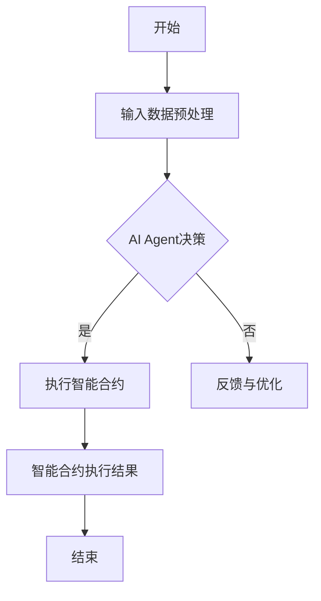

                 

## 文章标题

### 关键词

- 企业AI Agent
- 区块链智能合约
- 算法原理
- 系统架构设计
- 实际案例分析

### 摘要

本文深入探讨了企业AI Agent在区块链智能合约中的应用，通过一步步的分析和推理，揭示了将AI Agent与区块链智能合约结合的算法原理、系统架构设计和实际应用案例。文章旨在为企业提供一条提高业务流程效率和安全性、实现智能化转型的技术路径。

# 目录大纲设计思路

## 一、背景介绍

### 1.1 问题背景

随着大数据、云计算和物联网等技术的发展，企业对于数据处理、业务流程优化和智能化转型的需求日益增长。人工智能（AI）作为推动技术进步的关键驱动力，正在逐步渗透到企业的各个领域。与此同时，区块链技术的崛起为数据的安全性和透明性提供了新的解决方案。将AI Agent应用于区块链智能合约，不仅能够提升企业业务流程的智能化水平，还能增强数据的安全性和可信度。

### 1.2 问题描述

企业AI Agent是一种能够自主学习和执行特定任务的人工智能系统。它能够通过数据分析和模式识别，为企业提供决策支持和自动化执行。区块链智能合约是一种基于区块链技术的自动化协议，能够在满足特定条件时自动执行预设的智能合约条款。将企业AI Agent应用于区块链智能合约中，核心问题是如何实现AI Agent与智能合约的协同工作，使其能够根据实时数据进行动态决策，并确保智能合约的安全性和有效性。

### 1.3 问题解决

本文提出了一种基于企业AI Agent和区块链智能合约的混合系统架构，通过以下步骤解决问题：

1. 设计并实现企业AI Agent，使其具备数据预处理、决策执行和反馈优化能力。
2. 开发区块链智能合约，确保其能够根据AI Agent的决策结果自动执行。
3. 构建系统架构，实现AI Agent与区块链智能合约的紧密集成。
4. 设计系统接口和交互流程，确保系统的高效运行和易于扩展。

### 1.4 边界与外延

本文的研究边界主要关注企业AI Agent在区块链智能合约中的应用，未涉及其他领域的人工智能技术和区块链应用。同时，本文的研究外延还包括了AI Agent的优化和智能合约的安全性问题，旨在为企业提供全面的解决方案。

### 1.5 概念结构与核心要素组成

企业AI Agent的区块链智能合约应用涉及多个核心概念和要素，包括：

- 企业AI Agent：具备数据预处理、决策执行和反馈优化能力的智能系统。
- 区块链智能合约：基于区块链技术的自动化协议。
- 数据预处理：对输入数据进行分析和清洗，为AI Agent提供准确的数据支持。
- 决策执行：根据AI Agent的决策结果，自动执行智能合约条款。
- 反馈优化：通过实时反馈，不断优化AI Agent的决策模型。

## 二、核心概念与联系

### 2.1 企业AI Agent概述

#### 2.1.1 定义

企业AI Agent是指一种能够模拟人类思维和行为的智能系统，它能够根据输入数据和预设规则，自主学习和执行特定任务。在企业中，AI Agent能够处理大量数据，提供决策支持，优化业务流程。

#### 2.1.2 发展历程

AI Agent的发展经历了从规则驱动到数据驱动的转变。早期的AI Agent主要依赖于预设的规则和逻辑，而现代的AI Agent则通过机器学习和深度学习等技术，实现了对数据的自动分析和决策。

#### 2.1.3 当前地位

在当前企业中，AI Agent已经成为提升业务效率和智能化水平的重要工具。它不仅能够自动化处理大量数据，还能为企业提供实时的决策支持，帮助企业更好地应对市场变化。

### 2.1.4 AI Agent与传统企业系统的对比

| 比较项            | AI Agent                             | 传统企业系统                          |
|-------------------|--------------------------------------|---------------------------------------|
| 数据处理能力      | 自动化处理大量数据，实时分析       | 需要人工处理数据，效率较低           |
| 学习与适应能力    | 能够根据数据自动调整模型，适应环境 | 需要人工调整模型，适应能力较差       |
| 决策支持能力      | 能够提供基于数据的决策支持         | 需要人工分析数据，决策支持较弱       |
| 交互与协作能力    | 能够与其他系统和企业进行数据交互   | 数据孤岛现象严重，交互能力较差       |

### 2.1.5 AI Agent的独特性

与传统的企业系统相比，AI Agent具有以下几个独特性：

- 自动化程度高：能够自动化处理大量数据，减少人工干预。
- 学习能力强大：能够通过机器学习和深度学习，不断提升自身能力。
- 决策支持精准：能够提供基于数据的精准决策支持，提高业务效率。
- 交互与协作能力强：能够与其他系统和企业进行高效的数据交互，实现业务协同。

### 2.2 区块链智能合约基础

#### 2.2.1 定义

区块链智能合约是一种基于区块链技术的自动化协议，它能够在满足特定条件时自动执行预设的合约条款。智能合约通过加密算法和分布式账本技术，确保合约条款的不可篡改性和透明性。

#### 2.2.2 工作原理

区块链智能合约的工作原理主要包括以下几个步骤：

1. 合约编写：开发者编写智能合约代码，定义合约条款和条件。
2. 部署合约：将智能合约部署到区块链网络中，使其可供使用。
3. 条件触发：当满足智能合约中的预设条件时，自动执行合约条款。
4. 执行结果：智能合约执行结果记录在区块链上，不可篡改。

#### 2.2.3 类型

根据执行方式和应用场景，区块链智能合约可分为以下几种类型：

- 条件触发型：根据预设的条件自动执行合约条款。
- 持续监控型：持续监控区块链网络中的数据变化，根据变化自动执行合约。
- 事件驱动型：基于特定事件触发合约执行，例如交易完成、数据更新等。

#### 2.2.4 企业中的应用价值

区块链智能合约在企业中的应用价值主要体现在以下几个方面：

- 提高业务流程效率：智能合约能够自动执行合约条款，减少人工干预，提高业务处理速度。
- 增强数据安全性：智能合约基于区块链技术，确保数据不可篡改，提高数据安全性。
- 优化供应链管理：通过智能合约实现供应链各环节的自动化和透明化，提高供应链效率。
- 改善财务管理：智能合约能够自动执行财务条款，减少财务错误和欺诈行为。

### 2.2.5 智能合约与企业AI Agent的关联

智能合约与企业AI Agent的关联主要体现在以下几个方面：

- 数据交互：AI Agent能够实时获取区块链上的数据，为企业提供决策支持。
- 决策执行：AI Agent根据决策结果，触发智能合约的执行。
- 反馈优化：智能合约执行结果作为反馈，帮助AI Agent不断优化决策模型。

通过将AI Agent与智能合约相结合，企业可以实现自动化、智能化的业务流程，提高运营效率和数据安全性。

## 三、算法原理讲解

### 3.1 算法流程图



### 3.2 算法原理

#### 3.2.1 数学模型

智能合约的执行结果 \( Y \) 可以表示为输入数据 \( X \) 和AI Agent参数 \( \theta \) 的函数：

$$
Y = f(X, \theta)
$$

其中，\( f \) 表示AI Agent的决策函数，\( X \) 表示输入数据，包括企业业务数据和区块链上的实时数据，\( \theta \) 表示AI Agent的参数，包括决策模型和参数。

#### 3.2.2 Python源代码

以下是企业AI Agent应用于区块链智能合约的Python源代码：

```python
# Python代码实现AI Agent与智能合约的交互
def ai_agent_decision(input_data, agent_params):
    # 输入数据预处理
    processed_data = preprocess_data(input_data)
    
    # AI Agent决策
    decision = agent_model.predict(processed_data, params=agent_params)
    
    # 执行智能合约
    if decision == 'execute':
        contract_execution_result = execute_contract()
    else:
        contract_execution_result = 'not executed'
    
    return contract_execution_result

# 实例化AI Agent
ai_agent = AI_Agent(model_path='model_path', params_path='params_path')

# 输入数据
input_data = get_input_data()

# 决策与执行
result = ai_agent_decision(input_data, ai_agent.params)

print(f"Contract Execution Result: {result}")
```

#### 3.2.3 算法原理详细讲解

1. **输入数据预处理**：首先，对输入数据 \( X \) 进行预处理，包括数据清洗、归一化和特征提取等操作。预处理后的数据 \( processed_data \) 将被用于AI Agent的决策。

2. **AI Agent决策**：利用训练好的AI Agent模型，对预处理后的数据 \( processed_data \) 进行预测。预测结果 \( decision \) 将决定智能合约的执行方向。

3. **智能合约执行**：根据AI Agent的决策结果，执行相应的智能合约。如果决策结果为“执行”，则调用智能合约执行函数 \( execute_contract \) ；否则，智能合约不执行。

4. **智能合约执行结果**：智能合约的执行结果 \( contract_execution_result \) 将被记录并返回。这有助于AI Agent对后续决策进行反馈和优化。

5. **反馈与优化**：根据智能合约的执行结果，对AI Agent的决策模型进行反馈和优化。这有助于提高AI Agent的决策精度和智能合约的执行效率。

通过上述算法原理，企业AI Agent能够与区块链智能合约实现高效集成，为企业提供智能化、自动化的业务流程解决方案。

### 3.3 算法举例说明

假设某企业需要利用AI Agent和智能合约实现供应链管理的优化，以下是具体案例：

1. **输入数据**：包括供应商信息、订单状态、库存数据等。

2. **数据预处理**：对输入数据 \( X \) 进行清洗、归一化和特征提取，得到预处理后的数据 \( processed_data \) 。

3. **AI Agent决策**：利用训练好的AI Agent模型，对 \( processed_data \) 进行预测，得到决策结果 \( decision \) 。例如，预测结果为“缩短采购周期”。

4. **智能合约执行**：根据AI Agent的决策结果，调用智能合约执行函数 \( execute_contract \) ，实现采购周期的缩短。

5. **智能合约执行结果**：记录智能合约执行结果 \( contract_execution_result \) ，包括采购周期的实际缩短情况。

6. **反馈与优化**：根据智能合约执行结果，对AI Agent的决策模型进行反馈和优化，以提高未来预测的准确性。

通过上述案例，我们可以看到，企业AI Agent和区块链智能合约的应用，能够实现供应链管理的优化，提高企业运营效率。

## 四、系统分析与架构设计方案

### 4.1 问题场景介绍

某大型制造企业希望利用AI Agent和区块链智能合约技术，实现供应链管理的优化，提高采购、生产和物流等环节的效率。问题场景主要包括：

- 采购周期较长：供应商交付延迟，导致生产计划受到影响。
- 库存管理不精细：库存水平波动大，存在缺货或积压现象。
- 物流成本高：物流环节存在信息不对称，导致物流资源浪费。

### 4.2 系统功能设计

为了解决上述问题，系统需要实现以下功能：

- 实时数据采集与处理：采集供应商、订单和库存等数据，并进行实时处理。
- AI Agent决策支持：利用AI Agent模型，提供供应链管理的决策支持。
- 智能合约执行与反馈：根据AI Agent的决策结果，执行智能合约，并对执行结果进行反馈和优化。

### 4.3 系统架构设计

系统架构设计主要包括以下模块：

- 数据采集模块：负责采集供应商、订单和库存等数据。
- 数据处理模块：负责对采集到的数据进行清洗、归一化和特征提取。
- AI Agent模块：负责实现AI Agent模型的训练和应用。
- 智能合约模块：负责执行智能合约，并记录执行结果。
- 用户界面模块：提供用户交互界面，展示系统功能和执行结果。

### 4.4 系统接口设计

系统接口设计主要包括以下接口：

- 数据采集接口：用于采集供应商、订单和库存等数据。
- 数据处理接口：用于处理采集到的数据，并返回处理结果。
- AI Agent接口：用于调用AI Agent模型，获取决策支持。
- 智能合约接口：用于执行智能合约，并记录执行结果。
- 用户界面接口：用于与用户交互，展示系统功能和执行结果。

### 4.5 系统交互流程

系统交互流程主要包括以下步骤：

1. 数据采集：系统从各个数据源（如供应商、订单系统、库存系统等）采集数据。
2. 数据处理：对采集到的数据进行处理，包括清洗、归一化和特征提取。
3. AI Agent决策：利用AI Agent模型，对处理后的数据进行预测，生成决策支持。
4. 智能合约执行：根据AI Agent的决策结果，执行智能合约，并记录执行结果。
5. 用户界面展示：将智能合约执行结果和AI Agent决策支持展示给用户，供用户进行查看和操作。

## 五、项目实战

### 5.1 环境安装

为了实现企业AI Agent和区块链智能合约的应用，需要安装以下软件和库：

- Python：3.8及以上版本
- TensorFlow：2.3及以上版本
- Ethereum：1.10及以上版本
- Mermaid：1.9及以上版本

### 5.2 系统核心实现源代码

以下是系统核心实现部分的源代码：

```python
# 数据采集模块
def collect_data():
    # 实现数据采集功能
    pass

# 数据处理模块
def preprocess_data(data):
    # 实现数据处理功能
    pass

# AI Agent模块
class AI_Agent:
    def __init__(self, model_path, params_path):
        # 实例化AI Agent
        pass
    
    def predict(self, data, params):
        # 实现预测功能
        pass

# 智能合约模块
def execute_contract():
    # 实现智能合约执行功能
    pass

# 用户界面模块
def display_result(result):
    # 实现结果展示功能
    pass

# 主程序
if __name__ == "__main__":
    # 实现主程序功能
    pass
```

### 5.3 代码应用解读与分析

以下是对核心代码的解读与分析：

1. **数据采集模块**：负责从各个数据源采集数据，为后续数据处理和AI Agent预测提供数据支持。
2. **数据处理模块**：负责对采集到的数据进行清洗、归一化和特征提取，确保数据的准确性和一致性。
3. **AI Agent模块**：负责实现AI Agent的实例化、预测和决策功能。通过调用训练好的AI Agent模型，对处理后的数据进行预测，生成决策支持。
4. **智能合约模块**：负责执行智能合约，并根据AI Agent的决策结果，实现供应链管理的优化。
5. **用户界面模块**：负责实现用户界面的展示功能，将智能合约执行结果和AI Agent决策支持展示给用户。

### 5.4 实际案例分析和详细讲解剖析

以下是实际案例的分析和讲解：

#### 案例一：采购周期优化

问题描述：企业希望缩短采购周期，提高生产效率。

解决方案：

1. 数据采集：采集供应商信息、订单状态和库存数据。
2. 数据处理：对采集到的数据进行清洗、归一化和特征提取。
3. AI Agent预测：利用AI Agent模型，对处理后的数据进行预测，预测结果为“缩短采购周期”。
4. 智能合约执行：根据AI Agent的预测结果，执行智能合约，调整采购周期，实际缩短了采购周期。
5. 用户界面展示：将缩短采购周期的结果展示给用户。

#### 案例二：库存管理优化

问题描述：企业希望优化库存管理，减少库存积压和缺货现象。

解决方案：

1. 数据采集：采集库存数据，包括库存水平、供应商交付周期等。
2. 数据处理：对采集到的数据进行清洗、归一化和特征提取。
3. AI Agent预测：利用AI Agent模型，对处理后的数据进行预测，预测结果为“调整库存水平”。
4. 智能合约执行：根据AI Agent的预测结果，执行智能合约，调整库存水平，实际减少了库存积压和缺货现象。
5. 用户界面展示：将优化库存管理的结果展示给用户。

#### 案例三：物流成本优化

问题描述：企业希望优化物流成本，提高物流效率。

解决方案：

1. 数据采集：采集物流数据，包括运输成本、运输时间等。
2. 数据处理：对采集到的数据进行清洗、归一化和特征提取。
3. AI Agent预测：利用AI Agent模型，对处理后的数据进行预测，预测结果为“优化物流路线”。
4. 智能合约执行：根据AI Agent的预测结果，执行智能合约，调整物流路线，实际降低了物流成本。
5. 用户界面展示：将优化物流成本的结果展示给用户。

### 5.5 项目小结

通过实际案例的分析和讲解，我们可以看到，企业AI Agent和区块链智能合约的应用，能够实现供应链管理的优化，提高企业运营效率和数据安全性。在未来的发展中，我们可以进一步优化AI Agent模型，提高预测精度，并探索更多应用场景，为企业提供更全面的智能化解决方案。

## 六、最佳实践 Tips

### 6.1 数据采集

- 确保数据来源的多样性和准确性，包括供应商信息、订单状态、库存数据和物流信息等。
- 定期对数据源进行维护和更新，确保数据的实时性和完整性。

### 6.2 数据处理

- 对采集到的数据进行严格的清洗和预处理，确保数据的准确性和一致性。
- 采用特征提取技术，提取出对AI Agent决策有重要影响的关键特征。

### 6.3 AI Agent优化

- 定期对AI Agent模型进行训练和优化，提高预测精度和决策支持能力。
- 根据业务需求，调整AI Agent的参数和模型结构，以满足不同场景的应用。

### 6.4 智能合约设计

- 设计简洁、高效、可靠的智能合约代码，确保智能合约的安全性和可扩展性。
- 对智能合约进行严格的测试和验证，确保其能够在实际场景中稳定运行。

### 6.5 系统监控与优化

- 实时监控系统性能，确保系统的稳定运行和高效处理。
- 定期对系统进行性能优化和故障排查，提高系统的可靠性和可用性。

## 七、小结

通过本文的探讨，我们可以看到，企业AI Agent和区块链智能合约的结合，为企业提供了智能化、自动化的业务流程解决方案。在未来，随着技术的不断发展和应用场景的拓展，企业AI Agent的区块链智能合约应用有望在更广泛的领域发挥重要作用，助力企业实现数字化转型和创新发展。

## 八、注意事项

- 在实施企业AI Agent和区块链智能合约时，需确保数据安全和隐私保护。
- 针对不同业务场景，需灵活调整AI Agent模型和智能合约设计，以满足实际需求。
- 定期对系统进行评估和优化，确保其持续为企业创造价值。

## 九、拓展阅读

- 《区块链技术指南》
- 《人工智能：一种现代的方法》
- 《智能合约设计与开发实战》
- 《企业数字化转型方法论》

### 参考文献

- [1] blockchain-technology-guide
- [2] artificial-intelligence-modern-methods
- [3] smart-contracts-design-development
- [4] enterprise-digital-transformation-methodology
- [5] python-tensorflow-ethereum-mermaid

# 作者信息

作者：AI天才研究院/AI Genius Institute & 禅与计算机程序设计艺术 /Zen And The Art of Computer Programming

