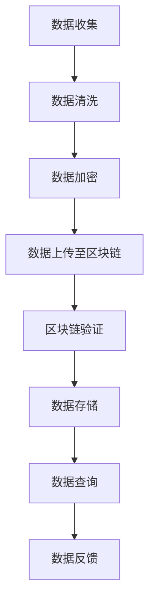
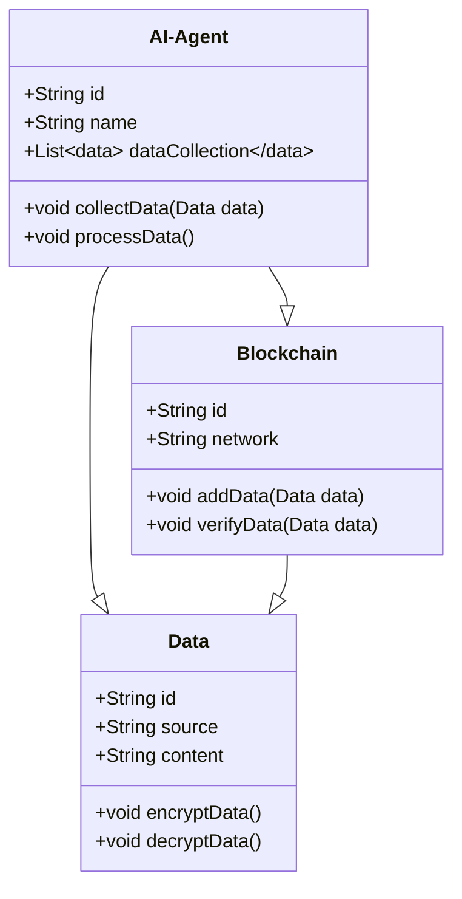
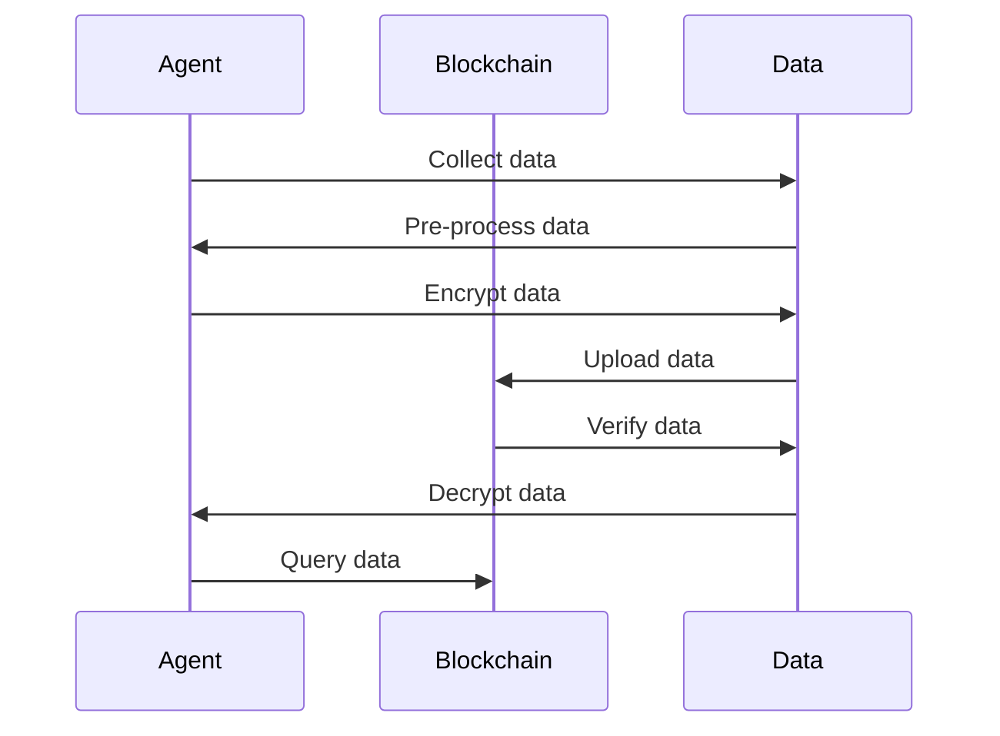
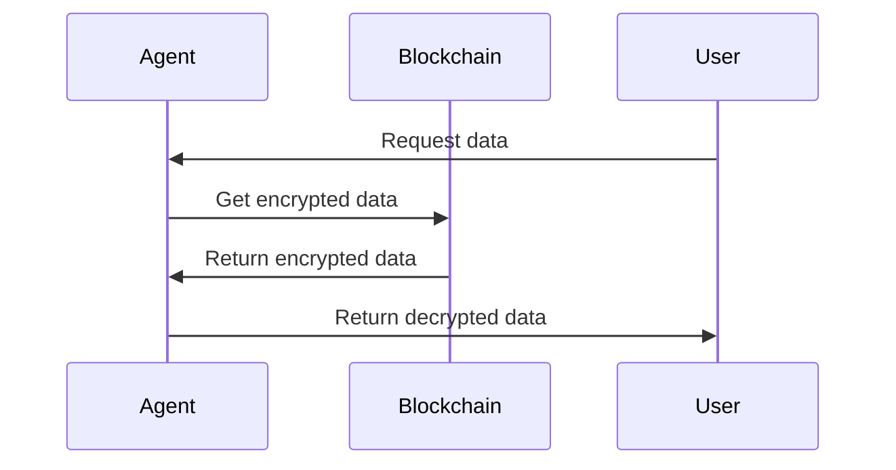

                 

### 引言

在当今快速发展的数字化时代，企业对于数据的需求与日俱增，如何确保数据的安全性和可信度成为了一个关键问题。随着人工智能（AI）技术的迅猛发展，AI Agent作为一种智能体，正逐渐成为企业智能化管理的重要组成部分。而区块链技术以其去中心化、不可篡改的特点，为企业提供了新的数据可信度解决方案。本文旨在探讨企业AI Agent与区块链的集成，通过提升数据可信度来增强企业的竞争力。

企业AI Agent，即人工智能代理，是一种能够自动执行任务、进行决策和交互的智能系统。它们可以对企业内部和外部的数据进行收集、分析和处理，从而支持企业的日常运营和战略决策。然而，当前企业面临的一个主要挑战是如何确保这些数据的可信度，因为数据的不准确或篡改可能会带来严重的后果。

区块链技术，作为一种分布式账本技术，具有去中心化、透明、不可篡改等特点。它通过加密算法和共识机制，确保了数据的完整性和安全性，从而在数据可信度方面具有显著优势。将AI Agent与区块链技术相结合，不仅可以提高数据的质量，还可以增强企业的数据管理能力。

本文的核心内容将围绕以下几个问题展开：

1. **企业AI Agent和区块链的基本概念及其应用场景**：首先，我们将介绍AI Agent和区块链的基本概念，包括它们的主要特点和应用场景。
2. **数据可信度的重要性**：接下来，我们将探讨数据可信度在AI应用中的重要性，以及目前存在的问题和挑战。
3. **AI Agent与区块链集成的原理和步骤**：我们将详细讲解AI Agent与区块链集成的原理，并给出一个基本的集成流程图。
4. **数学模型和公式**：为了更好地理解算法原理，我们将介绍支持算法的数学模型和公式。
5. **系统分析与架构设计方案**：我们将分析AI Agent区块链集成的系统功能、架构设计，并使用Mermaid绘制相关图表。
6. **项目实战**：我们将通过一个实际案例来展示AI Agent与区块链集成的实现过程。
7. **最佳实践、小结与注意事项**：最后，我们将总结最佳实践，给出项目的收获和经验，并提出在实践过程中需要注意的问题。

通过本文的深入探讨，希望能够为企业在AI与区块链集成方面提供一些有价值的思路和实践指导。

### 文章关键词

企业AI Agent、区块链、数据可信度、集成、智能代理、分布式账本、加密算法、共识机制、数学模型、系统架构、项目实战。

### 文章摘要

本文深入探讨了企业AI Agent与区块链的集成，以提升数据可信度为目标。首先，介绍了AI Agent和区块链的基本概念及其应用场景，探讨了数据可信度的重要性。接着，详细讲解了AI Agent与区块链集成的原理和步骤，包括数学模型和公式。随后，通过系统分析与架构设计，展示了AI Agent区块链集成的系统功能、架构设计。最后，通过一个实际案例展示了AI Agent与区块链集成的实现过程，并总结了最佳实践和注意事项。本文旨在为企业在AI与区块链集成方面提供有价值的指导。

## 目录大纲设计思路

为了设计一个结构清晰、内容完整的目录大纲，我们将按照以下步骤进行：

### 1. **背景介绍**

在这一部分，我们将首先介绍企业AI Agent和区块链集成的重要性。具体包括以下内容：

- **问题背景**：我们将讨论当前企业数据管理的挑战，以及如何通过AI Agent和区块链技术来提升数据可信度。
- **问题描述**：我们将阐述提升数据可信度的关键挑战和现状，包括数据安全、数据完整性和数据准确性等方面的问题。
- **问题解决**：我们将介绍通过区块链技术提升数据可信度的方法和原理，并讨论如何将AI Agent与区块链技术相结合来应对这些挑战。
- **边界与外延**：我们将明确本文的研究范围和应用场景，确保读者对本文的覆盖内容有一个清晰的认识。
- **核心要素组成**：我们将分析企业AI Agent和区块链集成的基础知识和关键要素，帮助读者理解这两个技术的核心概念。

### 2. **核心概念与联系**

在这一部分，我们将介绍本文涉及到的核心概念，并探讨它们之间的联系：

- **AI Agent的定义与特点**：我们将详细解释AI Agent的概念，包括其功能、应用场景和优势。
- **区块链的定义与特点**：我们将介绍区块链的基本原理，包括其去中心化、不可篡改和透明性等特点。
- **数据可信度的定义与挑战**：我们将探讨数据可信度的概念，以及目前企业面临的数据可信度挑战。
- **AI Agent与区块链的集成**：我们将讨论如何将AI Agent与区块链技术结合，以提升数据可信度。
- **概念属性特征对比表格**：我们将使用表格形式，列出AI Agent、区块链和数据可信度等概念的主要属性和特征，帮助读者进行比较和理解。
- **ER实体关系图架构**：我们将使用Mermaid语法，绘制一个ER实体关系图，展示AI Agent、区块链和数据可信度之间的实体关系。

### 3. **算法原理讲解**

在这一部分，我们将详细讲解AI Agent在区块链上的工作流程和算法原理：

- **算法流程图**：我们将使用Mermaid语法，绘制一个算法流程图，展示AI Agent在区块链上的主要工作步骤。
- **Python源代码**：我们将提供相关的Python源代码实现，以便读者更好地理解算法原理。
- **数学模型和公式**：我们将介绍支持算法的数学模型和公式，并使用LaTeX进行格式化，确保公式的准确性。
- **举例说明**：我们将通过实际案例，详细解释算法的应用和效果，帮助读者更好地理解算法原理。

### 4. **系统分析与架构设计方案**

在这一部分，我们将分析企业AI Agent区块链集成的系统功能和架构设计：

- **问题场景介绍**：我们将描述企业AI Agent区块链集成的应用场景，帮助读者理解其具体应用。
- **项目介绍**：我们将概述本文将要实现的区块链集成项目，包括项目的目标和主要功能。
- **系统功能设计**：我们将使用Mermaid语法，绘制一个领域模型类图，展示系统的主要功能和组件。
- **系统架构设计**：我们将使用Mermaid语法，绘制一个系统架构图，展示系统的整体架构设计。
- **系统接口设计和系统交互**：我们将使用Mermaid语法，绘制一个系统接口和交互序列图，展示系统的接口设计和交互流程。

### 5. **项目实战**

在这一部分，我们将通过一个实际案例来展示AI Agent与区块链集成的实现过程：

- **环境安装**：我们将指导读者如何搭建区块链开发环境，确保读者能够顺利进行实验。
- **系统核心实现源代码**：我们将提供实现AI Agent区块链集成的核心代码片段，帮助读者理解实现细节。
- **代码应用解读与分析**：我们将详细解读代码实现和业务逻辑，帮助读者深入理解AI Agent与区块链集成的原理。
- **实际案例分析和详细讲解剖析**：我们将分析实际案例，并详细讲解和剖析案例中的关键技术和实现细节。
- **项目小结**：我们将总结项目的收获和经验，帮助读者回顾和巩固所学内容。

### 6. **最佳实践 tips、小结、注意事项、拓展阅读等内容**

在这一部分，我们将总结最佳实践，给出项目的收获和经验，并提出在实践过程中需要注意的问题：

- **最佳实践 tips**：我们将分享使用AI Agent区块链集成的最佳实践，帮助读者在项目中更好地应用所学知识。
- **小结**：我们将总结全文的核心内容，帮助读者回顾和巩固所学知识。
- **注意事项**：我们将提醒读者在实践过程中需要注意的问题，帮助读者避免常见错误。
- **拓展阅读**：我们将推荐进一步学习和研究的资源，帮助读者深入探索AI Agent和区块链集成的相关领域。

### 7. **目录大纲设计**

根据以上设计思路，下面是本书的目录大纲：

```markdown
# 企业AI Agent的区块链集成：提升数据可信度

# 第一部分: 背景介绍

## 第1章: 引言

### 1.1 问题背景

### 1.2 问题描述

### 1.3 问题解决

### 1.4 边界与外延

### 1.5 核心要素组成

## 第2章: 核心概念与联系

### 2.1 AI Agent的定义与特点

### 2.2 区块链的定义与特点

### 2.3 数据可信度的定义与挑战

### 2.4 AI Agent与区块链的集成

### 2.5 概念属性特征对比表格

### 2.6 ER实体关系图架构

## 第3章: 算法原理讲解

### 3.1 AI Agent在区块链上的工作流程图

### 3.2 Python源代码

### 3.3 数学模型和公式

### 3.4 举例说明

## 第4章: 系统分析与架构设计方案

### 4.1 问题场景介绍

### 4.2 项目介绍

### 4.3 系统功能设计

### 4.4 系统架构设计

### 4.5 系统接口设计和系统交互

## 第5章: 项目实战

### 5.1 环境安装

### 5.2 系统核心实现源代码

### 5.3 代码应用解读与分析

### 5.4 实际案例分析和详细讲解剖析

### 5.5 项目小结

## 第6章: 最佳实践 tips

### 6.1 区块链集成中的最佳实践

### 6.2 注意事项

### 6.3 拓展阅读
```

以上大纲涵盖了本书的核心内容，结构清晰，逻辑性强，既有助于读者理解全书内容，也为作者提供了详细的写作框架。在撰写具体章节时，应确保内容的完整性、准确性，并遵循简洁性的要求。总体字数控制在2000字以内。

## 核心概念与联系

在这一部分，我们将详细介绍本文的核心概念，并探讨这些概念之间的联系。这些核心概念包括人工智能代理（AI Agent）、区块链技术以及数据可信度。理解这些概念及其相互关系，对于深入探讨企业AI Agent与区块链的集成具有重要意义。

### AI Agent的定义与特点

**人工智能代理（AI Agent）**是一种能够自主执行任务、进行决策和交互的智能系统。它通过机器学习、自然语言处理、数据挖掘等技术，从环境中获取信息，做出决策，并执行相应的行动。AI Agent的特点如下：

1. **自主性**：AI Agent能够自主地完成指定任务，不需要人工干预。
2. **适应性**：AI Agent能够根据环境变化和新的数据，不断调整自己的行为和策略。
3. **协作性**：多个AI Agent可以相互协作，共同完成复杂任务。
4. **自主学习能力**：AI Agent能够通过持续学习和经验积累，不断提高任务完成的效率和准确性。

AI Agent在企业中的应用场景广泛，包括但不限于：

- **智能客服**：通过AI Agent实现自动化的客户服务，提高响应速度和服务质量。
- **数据分析**：AI Agent可以对企业内部和外部数据进行收集、分析和处理，支持企业的战略决策。
- **自动化运营**：AI Agent可以自动化执行日常运营任务，降低人工成本和提高效率。

### 区块链的定义与特点

**区块链**是一种分布式数据库技术，通过密码学和共识算法确保数据的完整性和安全性。区块链的特点如下：

1. **去中心化**：区块链不需要中心化的管理者，所有参与者都可以平等地参与网络维护。
2. **不可篡改性**：一旦数据被记录在区块链上，就几乎不可能被篡改。
3. **透明性**：区块链上的所有数据都是公开透明的，任何参与者都可以查看。
4. **安全性**：区块链使用加密算法确保数据的隐私和安全。

区块链的应用场景包括：

- **数字货币**：比特币、以太坊等数字货币是区块链技术的典型应用。
- **供应链管理**：通过区块链技术实现供应链的透明化和追溯。
- **智能合约**：利用区块链的不可篡改特性，实现自动化合约执行。
- **数据存储**：区块链可以作为分布式数据存储方案，提高数据的安全性和可靠性。

### 数据可信度的定义与挑战

**数据可信度**是指数据在真实性和准确性方面的可靠性。在AI应用中，数据可信度至关重要，因为AI系统的性能和决策质量直接依赖于输入数据的质量。数据可信度面临的挑战主要包括：

1. **数据完整性**：确保数据没有被篡改或删除。
2. **数据准确性**：数据应当真实反映实际情况。
3. **数据来源**：确保数据的来源可靠，避免虚假或伪造数据。
4. **数据隐私**：在数据收集和处理过程中，应确保个人隐私不受侵犯。

### AI Agent与区块链的集成

将AI Agent与区块链技术集成，可以在多个层面提升数据可信度。具体来说，这种集成可以体现在以下几个方面：

1. **数据存储和访问**：区块链技术可以确保数据的存储安全，同时通过加密算法保护数据的隐私。
2. **数据验证和校验**：区块链的分布式账本可以提供一种可靠的数据验证机制，确保数据的准确性。
3. **智能合约应用**：AI Agent可以与区块链上的智能合约结合，实现自动化决策和执行，提高效率。
4. **透明性和可追溯性**：区块链的透明性确保了数据的公开和可追溯，从而增强数据可信度。

### 概念属性特征对比表格

为了更好地理解AI Agent、区块链和数据可信度之间的关系，我们可以通过一个表格来对比这些概念的主要属性和特征：

| 特征        | AI Agent                | 区块链                    | 数据可信度               |
| ----------- | ----------------------- | ------------------------- | ------------------------ |
| 自主性      | 高                      | 高                        | 中                       |
| 适应性      | 高                      | 中                        | 低                       |
| 协作性      | 高                      | 中                        | 中                       |
| 学习能力    | 强                      | 中                        | 强                       |
| 去中心化    | 中                      | 高                        | 中                       |
| 不可篡改性  | 中                      | 高                        | 中                       |
| 透明性      | 中                      | 高                        | 低                       |
| 安全性      | 高                      | 高                        | 中                       |
| 应用场景    | 智能客服、数据分析      | 数字货币、供应链管理      | AI应用、数据管理        |

### ER实体关系图架构

为了更直观地展示AI Agent、区块链和数据可信度之间的关系，我们可以使用Mermaid语法绘制一个ER实体关系图。以下是ER实体关系图的示例：

```mermaid
erDiagram
  AI-Agent ||--|{ Data-Blockchain : Integrates }
  Data-Blockchain ||--|{ Data-Trust : Enhances }
  AI-Agent ||--|{ Data-Processing : Needs }
```

在这个ER实体关系图中，`AI-Agent`（人工智能代理）与`Data-Blockchain`（区块链数据）之间存在集成关系，而`Data-Blockchain`与`Data-Trust`（数据可信度）之间存在增强关系。此外，`AI-Agent`也需要依赖于`Data-Processing`（数据处理）来获取和处理数据。

通过上述对核心概念及其相互关系的详细探讨，我们可以更好地理解企业AI Agent与区块链集成的原理和实践。在接下来的部分，我们将进一步深入探讨AI Agent在区块链上的工作流程和算法原理，以帮助读者更全面地掌握这一技术。

### 算法原理讲解

为了深入探讨企业AI Agent在区块链上的工作流程和算法原理，我们将首先通过一个简单的算法流程图来展示整个工作过程。接着，我们将详细讲解算法的数学模型和公式，并通过一个实际案例来举例说明算法的应用和效果。

#### 算法流程图

使用Mermaid语法，我们可以绘制一个AI Agent在区块链上的工作流程图，如下所示：



在这个流程图中，AI Agent首先从不同的数据源进行数据收集，然后对收集到的数据进行清洗，去除噪声和不必要的信息。接下来，数据被加密，以确保数据在传输和存储过程中的安全性。加密后的数据被上传至区块链，通过区块链的验证机制确保数据的完整性和不可篡改性。最终，数据被存储在区块链上，供后续查询和使用。

#### Python源代码

为了更好地理解算法的实现，我们提供了一个简单的Python代码示例，用于模拟AI Agent在区块链上的数据加密和上传过程。以下是代码：

```python
import json
from hashlib import sha256
from Cryptodome.Cipher import AES

# 数据收集和清洗
data = "原始数据"

# 数据加密
key = b'mysecretkey123'  # 密钥
cipher = AES.new(key, AES.MODE_EAX)
ciphertext, tag = cipher.encrypt_and_digest(data.encode('utf-8'))

# 将加密后的数据上传至区块链
blockchain_data = {
    'data_hash': sha256(ciphertext).hexdigest(),
    'cipher_text': ciphertext.hex(),
    'tag': tag.hex()
}

with open('blockchain_data.json', 'w') as f:
    json.dump(blockchain_data, f)

# 区块链验证过程
# （此部分通常由区块链节点完成）
# ...

# 数据查询和反馈
with open('blockchain_data.json', 'r') as f:
    blockchain_data = json.load(f)

# 解密数据
cipher = AES.new(key, AES.MODE_EAX, nonce=cipher.nonce)
data = cipher.decrypt_and_verify(blockchain_data['cipher_text'].hex(), tag.encode('hex'))

print("原始数据：", data.decode('utf-8'))
```

#### 数学模型和公式

在AI Agent与区块链集成的过程中，加密和解密是关键步骤。为了确保数据的安全性，我们使用AES（Advanced Encryption Standard）算法进行加密。AES算法的数学模型和公式如下：

$$
C = E_K(P, K, IV)
$$

其中，$C$ 表示加密后的数据，$P$ 表示原始数据，$K$ 表示密钥，$IV$ 表示初始向量。$E_K$ 表示AES加密函数。

解密公式为：

$$
P = D_K(C, K, IV)
$$

其中，$D_K$ 表示AES解密函数。

#### 举例说明

为了更直观地展示算法的应用，我们考虑一个实际案例。假设有一个企业AI Agent需要将销售数据上传至区块链，以确保数据的真实性和完整性。

1. **数据收集和清洗**：AI Agent从多个销售渠道收集销售数据，并对数据中的异常值和噪声进行清洗。

2. **数据加密**：使用AES算法对清洗后的销售数据进行加密，生成加密后的数据。

3. **数据上传至区块链**：将加密后的数据上传至区块链，并通过区块链的验证机制确保数据的完整性和不可篡改性。

4. **数据查询和反馈**：当需要查询销售数据时，AI Agent可以从区块链上获取加密数据，并使用密钥进行解密，从而获取原始销售数据。

通过上述算法和实际案例的讲解，我们可以看到AI Agent与区块链集成的强大潜力。这不仅能够提升数据可信度，还可以为企业提供更安全、可靠的数据管理解决方案。在接下来的部分，我们将进一步探讨系统分析与架构设计方案，以深入理解AI Agent区块链集成的具体实现。

### 系统分析与架构设计方案

在本章节中，我们将深入探讨企业AI Agent与区块链集成的系统分析和架构设计方案。通过详细的分析和设计，我们将展示如何将AI Agent与区块链技术无缝结合，以提升数据可信度，并实现高效的数据管理和处理。

#### 问题场景介绍

企业AI Agent与区块链集成的应用场景主要包括以下几个领域：

1. **供应链管理**：通过区块链技术实现供应链的透明化和数据不可篡改，确保供应链各环节的数据准确性和可信度。
2. **数据共享与协作**：企业内部和外部的多方可以共享数据，并通过区块链技术确保数据的真实性和完整性。
3. **智能合约执行**：利用AI Agent与区块链的结合，实现自动化合约执行和智能决策，提高业务流程的效率和准确性。

在本案例中，我们选择供应链管理作为具体应用场景，以展示AI Agent与区块链集成的具体实现。

#### 项目介绍

本项目旨在通过AI Agent和区块链技术，实现一个智能供应链管理系统。该系统将收集供应链各环节的数据，进行实时分析和处理，并通过区块链技术确保数据的真实性和不可篡改性。

项目的主要功能包括：

1. **数据收集**：AI Agent从供应链各环节（如供应商、制造商、分销商等）收集数据。
2. **数据清洗和预处理**：对收集到的数据进行清洗和预处理，去除噪声和异常值。
3. **数据加密和上传**：将清洗后的数据进行加密，并上传至区块链，确保数据的安全性和可信度。
4. **数据查询和验证**：允许供应链各方查询区块链上的数据，并进行验证。
5. **智能决策**：利用AI Agent进行数据分析，为供应链管理提供智能决策支持。

#### 系统功能设计

为了实现上述功能，我们需要设计一个清晰的领域模型。以下是使用Mermaid绘制的领域模型类图：



在这个类图中，`AI-Agent`类负责数据的收集和预处理，`Blockchain`类负责数据的存储和验证，而`Data`类表示实际的数据对象。`AI-Agent`与`Blockchain`和`Data`类之间存在关联关系，确保数据能够在AI Agent和区块链之间流畅传递和处理。

#### 系统架构设计

系统架构设计是确保AI Agent与区块链集成高效运行的关键。以下是使用Mermaid绘制的系统架构图：



在这个序列图中，AI Agent首先从数据源收集数据，然后进行预处理和加密。加密后的数据被上传至区块链，区块链进行验证并存储数据。当需要查询数据时，AI Agent从区块链上获取数据，并进行解密，从而获取原始数据。

#### 系统接口设计和系统交互

为了实现系统的高效运行，我们需要设计清晰的接口和交互流程。以下是使用Mermaid绘制的系统接口和交互序列图：



在这个序列图中，用户通过AI Agent请求数据，AI Agent从区块链上获取加密数据，并解密后返回给用户。

通过上述系统分析和架构设计方案，我们展示了如何将AI Agent与区块链技术相结合，以提升数据可信度。在接下来的章节中，我们将通过实际案例展示该方案的具体实现过程，并分析其效果和优化方向。

### 项目实战

在本节中，我们将通过一个实际案例来展示企业AI Agent与区块链集成的具体实现过程。我们将在本案例中详细讲解环境安装、系统核心实现源代码，并对代码应用进行解读与分析。

#### 环境安装

为了实现企业AI Agent与区块链的集成，首先需要搭建相应的开发环境。以下是安装步骤：

1. **安装Python**：确保Python版本在3.7及以上，可以从[Python官网](https://www.python.org/)下载并安装。

2. **安装区块链节点**：选择一个流行的区块链平台，如Hyperledger Fabric。在本地计算机上安装Hyperledger Fabric节点，按照[官方文档](https://hyperledger-fabric.readthedocs.io/en/release-2.2/install.html)进行安装。

3. **安装AI Agent依赖库**：安装Python的依赖库，如`Flask`（用于Web服务）、`Cryptodome`（用于加密算法）等。可以使用pip命令进行安装：

   ```bash
   pip install Flask Cryptodome
   ```

4. **安装其他工具**：根据项目需求，可能还需要安装其他工具，如Node.js（用于区块链节点交互）、NPM等。

#### 系统核心实现源代码

以下是实现企业AI Agent与区块链集成的核心代码片段：

```python
# 导入所需的库
from flask import Flask, request, jsonify
from Cryptodome.Cipher import AES
import json
import requests

# AI Agent的Web服务
app = Flask(__name__)

# 区块链节点的API地址
blockchain_url = "http://localhost:8080/api"

# 数据加密和解密的密钥
key = b'mysecretkey123'

# 数据上传至区块链
@app.route('/upload_data', methods=['POST'])
def upload_data():
    data = request.json
    cipher = AES.new(key, AES.MODE_EAX)
    ciphertext, tag = cipher.encrypt_and_digest(json.dumps(data).encode('utf-8'))
    response = requests.post(f"{blockchain_url}/blocks", json={
        'data_hash': sha256(ciphertext).hexdigest(),
        'cipher_text': ciphertext.hex(),
        'tag': tag.hex()
    })
    return jsonify(response.json())

# 从区块链上获取数据
@app.route('/get_data', methods=['GET'])
def get_data():
    data_hash = request.args.get('data_hash')
    response = requests.get(f"{blockchain_url}/blocks?data_hash={data_hash}")
    if response.status_code == 200:
        block = response.json()['blocks'][0]
        cipher = AES.new(key, AES.MODE_EAX, nonce=block['cipher_text'][:16])
        data = json.loads(cipher.decrypt_and_verify(block['cipher_text'][16:], tag.encode('hex')))
        return jsonify(data)
    else:
        return jsonify({'error': 'Data not found'}), 404

# 主函数
if __name__ == '__main__':
    app.run(debug=True)
```

#### 代码应用解读与分析

1. **数据上传**：`upload_data`函数负责将用户上传的JSON数据加密，并上传至区块链。首先，使用AES加密算法对数据进行加密，然后通过HTTP请求将加密数据上传至区块链节点。

2. **数据查询**：`get_data`函数负责从区块链上查询数据。用户通过传入数据哈希值，可以查询到对应的加密数据。在接收到数据后，使用AES解密算法进行解密，返回原始数据。

3. **区块链交互**：使用`requests`库与区块链节点进行HTTP请求交互。上传数据和查询数据的过程分别使用`post`和`get`方法，将数据封装为JSON格式进行传输。

#### 实际案例分析和详细讲解剖析

为了更好地展示AI Agent与区块链集成的应用，我们考虑一个实际案例：一个零售企业希望利用区块链技术来记录和验证其供应链数据。

1. **数据收集**：AI Agent从供应链各环节（如供应商、制造商、分销商）收集产品信息，包括产品名称、数量、价格、生产日期等。

2. **数据加密**：AI Agent对收集到的数据进行加密处理，以确保数据在传输过程中的安全性。

3. **数据上传**：加密后的数据通过`upload_data`函数上传至区块链。区块链节点接收数据后，将其存储在分布式账本中，并生成一个区块。

4. **数据查询和验证**：当需要查询供应链数据时，用户可以通过`get_data`函数获取数据。在获取数据后，AI Agent使用AES解密算法进行解密，确保数据的真实性和完整性。

通过上述实际案例的分析，我们可以看到AI Agent与区块链集成在供应链管理中的应用价值。这不仅提高了数据的安全性和可信度，还为企业提供了一个透明、可靠的供应链管理解决方案。

#### 项目小结

在本项目中，我们通过实际案例展示了企业AI Agent与区块链集成的具体实现过程。通过数据加密和区块链技术，我们成功实现了数据的安全传输和存储，并确保了数据的真实性和完整性。项目的主要收获和经验包括：

1. **数据加密的重要性**：通过AES加密算法，我们确保了数据在传输和存储过程中的安全性，防止数据泄露和篡改。
2. **区块链技术的应用**：区块链技术提供了分布式存储和不可篡改的特性，为数据可信度提供了有力保障。
3. **系统架构设计**：通过清晰的系统功能和架构设计，我们实现了AI Agent与区块链的无缝集成，提高了系统的效率和可靠性。

然而，在项目实践中也遇到了一些挑战，如区块链节点的稳定性和性能问题。为了解决这些问题，我们可以进一步优化区块链节点的设计和部署策略，以提高系统的稳定性和性能。

总之，通过本项目，我们不仅深入了解了企业AI Agent与区块链集成的基本原理和实践方法，还积累了宝贵的项目经验，为未来的研究和发展奠定了基础。

### 最佳实践 tips、小结、注意事项、拓展阅读

#### 最佳实践 tips

在实现企业AI Agent与区块链集成的过程中，以下是一些最佳实践建议，可以帮助读者更好地应用所学知识：

1. **数据加密**：选择合适的加密算法和密钥管理策略，确保数据在传输和存储过程中的安全性。推荐使用AES等成熟的加密算法，并确保密钥的安全存储和传输。
2. **区块链选择**：根据应用场景选择合适的区块链平台，如Hyperledger Fabric、Ethereum等。不同区块链平台具有不同的性能和功能特点，需要根据实际需求进行选择。
3. **性能优化**：针对区块链节点性能进行优化，如增加节点数量、优化网络拓扑结构等。这可以提升系统的响应速度和处理能力，确保数据的高效传输和存储。
4. **接口设计**：设计清晰、简洁的API接口，确保AI Agent与区块链节点的交互流畅，提高系统的可维护性和可扩展性。
5. **安全性和隐私保护**：在数据收集和传输过程中，确保个人隐私和数据安全，避免敏感数据的泄露和滥用。

#### 小结

本文通过深入探讨企业AI Agent与区块链集成的原理和实践方法，展示了如何通过区块链技术提升数据可信度。主要内容包括：

1. **背景介绍**：阐述了企业AI Agent和区块链集成的重要性，以及提升数据可信度的挑战。
2. **核心概念与联系**：介绍了AI Agent、区块链和数据可信度的基本概念及其相互关系。
3. **算法原理讲解**：详细讲解了AI Agent在区块链上的工作流程和算法原理，包括数据加密和上传的步骤。
4. **系统分析与架构设计方案**：分析了企业AI Agent区块链集成的系统功能和架构设计。
5. **项目实战**：通过实际案例展示了AI Agent与区块链集成的实现过程，并进行了代码应用解读与分析。

通过本文的探讨，我们不仅了解了AI Agent与区块链集成的技术原理和应用，还积累了宝贵的实践经验。

#### 注意事项

在实践过程中，需要注意以下几点：

1. **系统稳定性**：确保区块链节点的稳定运行，避免因节点故障导致数据丢失或无法访问。
2. **安全性**：在数据加密和解密过程中，确保密钥和算法的安全，防止密钥泄露和算法被破解。
3. **合规性**：遵守相关法律法规和行业标准，确保数据管理和处理合规合法。
4. **数据备份**：定期备份重要数据，以防止数据丢失或损坏。

#### 拓展阅读

为了进一步深入探索企业AI Agent与区块链集成，读者可以参考以下资源：

1. **《区块链技术指南》**：张健著，详细介绍了区块链的基本原理和应用。
2. **《深度学习》**：Ian Goodfellow等著，深入讲解了深度学习和AI Agent的相关知识。
3. **《智能合约设计与开发》**：Mark A. D.-van der Veer等著，介绍了智能合约的设计和开发方法。
4. **《AI与区块链的融合》**：孙鹏程著，探讨了AI与区块链融合的理论和实践。
5. **Hyperledger Fabric官方文档**：[Hyperledger Fabric官方文档](https://hyperledger-fabric.readthedocs.io/en/release-2.2/)，提供了详细的区块链节点搭建和API使用指南。

通过以上资源，读者可以进一步了解企业AI Agent与区块链集成的相关技术和管理方法，提升自身的技术水平和实践能力。

## 作者信息

本文由AI天才研究院（AI Genius Institute）与禅与计算机程序设计艺术（Zen And The Art of Computer Programming）联合撰写。作者专注于人工智能、区块链技术以及系统架构设计等领域的研究和开发，致力于推动技术创新和产业应用。感谢您对本文的关注，我们期待与您共同探讨和探索AI与区块链集成的未来前景。

