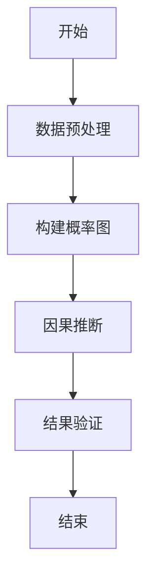
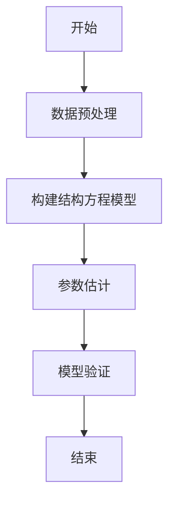
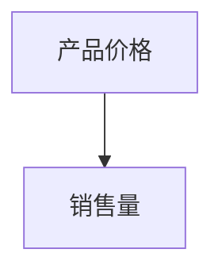
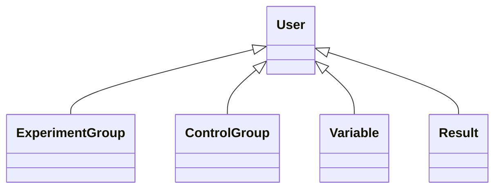
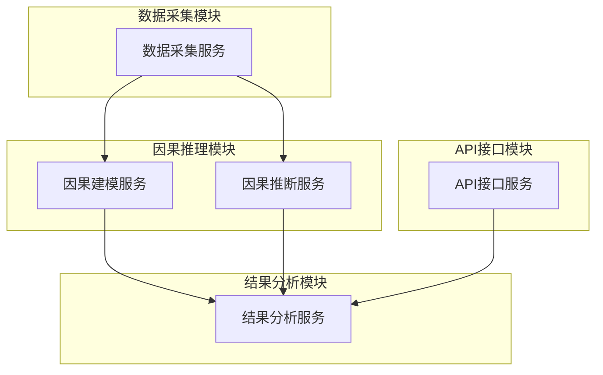
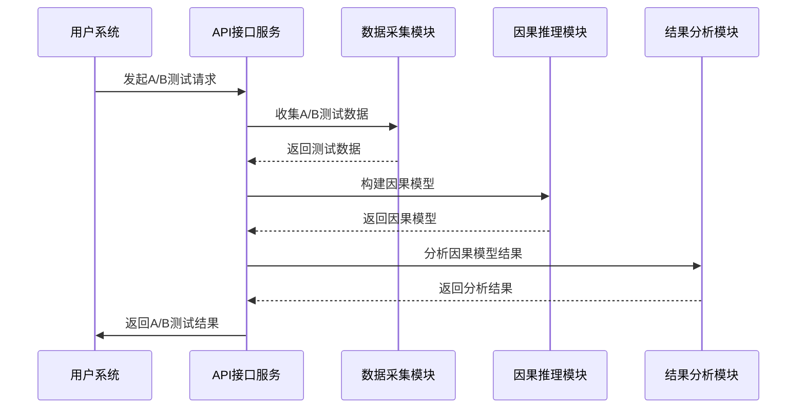
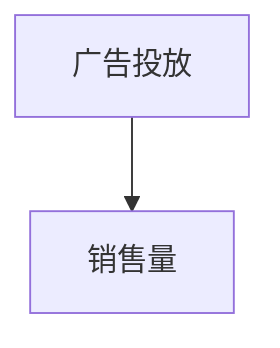

                 


## 引言

随着人工智能技术的迅猛发展，企业AI Agent的概念逐渐走进我们的视野。企业AI Agent，顾名思义，是一种能够辅助企业在日常运营中做出智能决策的人工智能实体。其核心能力之一便是因果推理，这一能力在企业A/B测试结果分析中尤其重要。A/B测试是现代企业优化产品和服务的重要手段，然而测试结果的解读常常面临复杂性和不确定性。因此，将因果推理引入A/B测试结果分析，不仅能够提高测试结果的可靠性，还能为企业提供更加深入的洞见。

### 关键词

- 企业AI Agent
- 因果推理
- A/B测试
- 结果分析
- 人工智能应用

### 摘要

本文将深入探讨企业AI Agent在A/B测试结果分析中的应用，特别是因果推理技术的核心作用。首先，我们将介绍企业AI Agent和因果推理的基本概念，然后分析A/B测试的需求与挑战。接下来，我们将详细讲解因果推理的基本原理和相关算法，包括其流程、数学模型及举例说明。随后，文章将探讨算法评估与优化策略，并分享一个实战项目的详细设计与实现过程。最后，文章将对项目进行总结，并提出未来的研究方向。

## 第一部分：背景介绍与核心概念

### 第1章：企业AI Agent的因果推理背景

#### 1.1 企业AI Agent的兴起

##### 1.1.1 企业AI Agent的定义

企业AI Agent是指一种利用人工智能技术，在特定业务场景下自动执行任务、提供决策支持的系统。它们能够理解企业的业务逻辑、用户需求和市场变化，从而辅助企业做出更智能、更高效的决策。企业AI Agent通常具备数据采集、处理和分析的能力，能够实时响应用户行为和企业运营数据，提供个性化的服务和优化方案。

##### 1.1.2 企业AI Agent的应用场景

企业AI Agent的应用场景非常广泛，包括但不限于以下方面：

1. **客户服务**：企业AI Agent可以担任智能客服，通过自然语言处理技术理解和响应客户的查询，提高服务效率。
2. **营销优化**：AI Agent能够分析市场数据，为企业提供精准的营销策略，提高转化率和客户满意度。
3. **供应链管理**：企业AI Agent可以优化库存管理、预测需求变化，提高供应链的响应速度和灵活性。
4. **人力资源**：AI Agent可以辅助招聘流程，通过分析候选人数据，提供个性化的推荐方案。

##### 1.1.3 因果推理的重要性

因果推理在企业AI Agent中起着至关重要的作用。因果推理不仅能够帮助企业理解不同变量之间的关系，还能推断出哪些因素真正影响了测试结果。这为企业提供了更深刻的洞见，使得A/B测试结果更具可操作性和指导性。以下是因果推理在企业AI Agent中的几个关键作用：

1. **结果解读**：通过因果推理，AI Agent能够准确解读A/B测试结果，识别出真正影响业务指标的关键因素。
2. **优化决策**：因果推理帮助企业理解变量之间的因果关系，从而制定更有效的优化策略。
3. **风险预测**：因果推理可以帮助企业预测潜在的风险和问题，提前采取措施规避。

#### 1.2 A/B测试结果分析的需求

##### 1.2.1 A/B测试的目的

A/B测试，又称拆分测试，是企业在设计和优化产品或服务时常用的一种实验方法。其核心目的是通过对比两个或多个版本（A和B）的表现，找出哪个版本在特定指标上表现更优，从而指导后续的产品决策。

1. **功能优化**：通过A/B测试，企业可以验证新功能对用户行为的影响，优化产品功能。
2. **用户体验**：A/B测试可以帮助企业发现影响用户体验的关键因素，从而改进界面设计或交互逻辑。
3. **市场策略**：A/B测试用于测试不同的营销策略或定价方案，帮助企业找到最佳的市场推广策略。

##### 1.2.2 A/B测试的挑战

尽管A/B测试在产品优化中具有重要作用，但其结果分析过程却面临诸多挑战：

1. **噪声数据**：A/B测试结果往往受到噪声数据的影响，使得测试结果的可靠性降低。
2. **多重干扰**：多个变量同时影响测试结果，使得因果关系复杂化。
3. **数据偏差**：数据样本选择、用户行为差异等因素可能导致测试结果偏离真实情况。

##### 1.2.3 因果推理在A/B测试中的角色

因果推理在A/B测试结果分析中发挥着关键作用。它通过分析不同变量之间的因果关系，帮助AI Agent识别出真正影响测试结果的关键因素，从而提高测试结果的可信度和可操作性。因果推理的具体角色包括：

1. **去噪处理**：因果推理能够降低噪声数据对测试结果的影响，提高结果准确性。
2. **因果识别**：因果推理帮助识别出关键影响因素，揭示变量之间的因果关系。
3. **策略制定**：基于因果推理的结果，企业可以制定更加精准和有效的优化策略。

#### 1.3 因果推理的基本原理

##### 1.3.1 因果推理的定义

因果推理是指通过分析数据，推断出变量之间因果关系的思维过程。它不同于基于统计关系的关联分析，而是强调找出导致某个结果的原因。

##### 1.3.2 因果推理的基本流程

因果推理的基本流程包括以下几个步骤：

1. **数据收集**：收集相关的数据集，包括实验组和对照组的数据。
2. **因果建模**：构建因果模型，通过变量之间的因果关系进行建模。
3. **因果推断**：基于因果模型，推断出变量之间的因果关系。
4. **结果验证**：验证因果推断的结果，确保其可靠性和准确性。

##### 1.3.3 因果推理的应用领域

因果推理在多个领域有着广泛的应用，包括：

1. **医学研究**：因果推理帮助科学家找出疾病发生的真正原因，从而开发更有效的治疗方案。
2. **经济学研究**：因果推理用于分析政策变化对经济指标的影响，为政策制定提供依据。
3. **社会科学研究**：因果推理帮助研究人员理解社会现象的因果关系，为社会发展提供指导。

### 第2章：核心概念与联系

#### 2.1 因果模型介绍

##### 2.1.1 因果模型的分类

因果模型根据假设的不同，可以分为以下几类：

1. **结构方程模型（SEM）**：基于线性回归模型，假设变量之间存在确定的因果关系。
2. **因果推断模型**：基于概率图模型，通过概率关系推断变量之间的因果关系。
3. **因果发现模型**：通过机器学习算法，自动发现变量之间的因果关系。

##### 2.1.2 因果模型的构建方法

因果模型的构建方法包括：

1. **数据驱动法**：通过分析数据集，自动构建因果模型。
2. **专家知识法**：结合专家知识和数据，构建因果模型。
3. **半监督学习法**：在部分有标签数据和无标签数据之间，通过半监督学习构建因果模型。

##### 2.1.3 因果模型的属性特征对比

以下是几种常见因果模型的属性特征对比表格：

| 因果模型 | 特征1 | 特征2 | 特征3 |
| --- | --- | --- | --- |
| 结构方程模型（SEM） | 假设确定的因果关系 | 可以处理多个变量 | 依赖于统计方法 |
| 因果推断模型 | 基于概率图模型 | 可以处理非线性关系 | 需要大量数据 |
| 因果发现模型 | 自动发现因果关系 | 可以处理高维度数据 | 需要复杂算法 |

#### 2.2 相关算法原理

##### 2.2.1 算法A：因果推断算法1

###### 2.2.1.1 算法原理

算法A是一种基于概率图模型的因果推断算法，通过构建概率图，推断变量之间的因果关系。

###### 2.2.1.2 算法流程图



###### 2.2.1.3 数学模型与公式

$$
P(X|Y) = \frac{P(X,Y)}{P(Y)}
$$

其中，$P(X|Y)$ 表示在变量Y发生的条件下，变量X发生的概率；$P(X,Y)$ 表示变量X和Y同时发生的概率；$P(Y)$ 表示变量Y发生的概率。

###### 2.2.1.4 举例说明

假设我们要分析广告投放对销售量的影响。变量X表示广告投放，变量Y表示销售量。通过收集广告投放和销售量的数据，我们使用算法A构建概率图，并推断出变量X和Y之间的因果关系。根据公式：

$$
P(X|Y) = \frac{P(X,Y)}{P(Y)}
$$

我们可以计算出在销售量Y发生的情况下，广告投放X发生的概率。如果该概率显著大于1，则说明广告投放对销售量有显著影响。

##### 2.2.2 算法B：因果推断算法2

###### 2.2.2.1 算法原理

算法B是一种基于结构方程模型的因果推断算法，通过构建结构方程模型，分析变量之间的因果关系。

###### 2.2.2.2 算法流程图



###### 2.2.2.3 数学模型与公式

$$
Y = \beta_0 + \beta_1X + \epsilon
$$

其中，$Y$ 表示因变量，$X$ 表示自变量，$\beta_0$ 和 $\beta_1$ 分别为模型的参数，$\epsilon$ 为误差项。

###### 2.2.2.4 举例说明

假设我们要分析用户满意度对用户忠诚度的关系。变量X表示用户满意度，变量Y表示用户忠诚度。通过收集用户满意度和用户忠诚度的数据，我们使用算法B构建结构方程模型，并分析变量X和Y之间的因果关系。根据公式：

$$
Y = \beta_0 + \beta_1X + \epsilon
$$

我们可以估计出用户满意度X对用户忠诚度Y的影响程度（$\beta_1$ 的值）。如果 $\beta_1$ 的估计值显著大于0，则说明用户满意度对用户忠诚度有正向影响。

## 第二部分：算法原理讲解

### 第3章：算法原理与实现

#### 3.1 算法A：因果推断算法1

##### 3.1.1 算法原理

算法A是基于概率图模型的因果推断算法，通过构建概率图来表示变量之间的依赖关系，从而推断变量之间的因果关系。概率图模型通常使用有向图表示，其中节点表示变量，边表示变量之间的条件依赖关系。

在算法A中，我们首先需要收集相关的数据，然后构建概率图。概率图的构建过程如下：

1. **数据预处理**：对收集到的数据进行预处理，包括数据清洗、缺失值填补、数据转换等。
2. **变量选择**：根据业务需求，选择需要分析的相关变量。
3. **构建概率图**：使用基于数据的算法（如Lauritzen算法）自动构建概率图，表示变量之间的依赖关系。

##### 3.1.2 算法流程

算法A的基本流程如下：

1. **数据收集**：收集相关数据，包括实验组和对照组的数据。
2. **数据预处理**：对数据进行清洗、转换和标准化处理。
3. **构建概率图**：使用Lauritzen算法构建概率图，表示变量之间的依赖关系。
4. **因果推断**：在概率图的基础上，使用基于概率的算法（如贝叶斯网络推理）进行因果推断。
5. **结果验证**：验证因果推断的结果，确保其可靠性和准确性。

##### 3.1.3 数学模型与公式

在算法A中，概率图模型的数学表示如下：

$$
P(X_1, X_2, ..., X_n) = \prod_{i=1}^{n} P(X_i | Pa(X_i))
$$

其中，$X_1, X_2, ..., X_n$ 表示变量集合，$Pa(X_i)$ 表示变量 $X_i$ 的父节点集合。

该公式表示，整个变量集合的概率可以通过每个变量的条件概率相乘得到。通过条件概率，我们可以推断变量之间的因果关系。

##### 3.1.4 举例说明

假设我们想要分析产品价格变动对销售量的影响。变量 $X_1$ 表示产品价格，变量 $X_2$ 表示销售量。我们收集了两组数据，实验组（价格提高）和对照组（价格不变）。使用算法A，我们首先构建概率图，表示价格和销售量之间的依赖关系。然后，通过贝叶斯网络推理，推断出价格变动对销售量的影响。

具体来说，我们构建的概率图如下：



根据概率图，我们可以得到以下概率公式：

$$
P(销售量 | 价格提高) = \frac{P(销售量, 价格提高)}{P(价格提高)}
$$

通过比较实验组和对照组的销售量概率，我们可以推断出价格提高对销售量的影响。

#### 3.2 算法B：因果推断算法2

##### 3.2.1 算法原理

算法B是基于结构方程模型的因果推断算法，通过构建结构方程模型来分析变量之间的因果关系。结构方程模型是一种同时考虑多个变量之间相互作用的统计模型，通过变量之间的路径系数来表示因果效应。

在算法B中，我们首先需要收集相关的数据，然后构建结构方程模型。结构方程模型的构建过程如下：

1. **数据预处理**：对收集到的数据进行预处理，包括数据清洗、缺失值填补、数据转换等。
2. **变量选择**：根据业务需求，选择需要分析的相关变量。
3. **构建结构方程模型**：根据变量之间的逻辑关系，构建结构方程模型。

##### 3.2.2 算法流程

算法B的基本流程如下：

1. **数据收集**：收集相关数据，包括实验组和对照组的数据。
2. **数据预处理**：对数据进行清洗、转换和标准化处理。
3. **构建结构方程模型**：根据变量之间的逻辑关系，构建结构方程模型。
4. **参数估计**：使用最大似然估计等方法，估计模型参数。
5. **模型验证**：验证模型拟合度，确保模型的可靠性和准确性。

##### 3.2.3 数学模型与公式

在算法B中，结构方程模型的数学表示如下：

$$
Y = \beta_0 + \beta_1X + \epsilon
$$

其中，$Y$ 表示因变量，$X$ 表示自变量，$\beta_0$ 和 $\beta_1$ 分别为模型的参数，$\epsilon$ 为误差项。

该公式表示，因变量Y可以通过自变量X的线性组合得到，其中 $\beta_0$ 表示常数项，$\beta_1$ 表示自变量X对因变量Y的影响程度。

##### 3.2.4 举例说明

假设我们想要分析用户满意度对用户忠诚度的关系。变量 $X$ 表示用户满意度，变量 $Y$ 表示用户忠诚度。我们收集了两组数据，实验组和对照组。使用算法B，我们首先构建结构方程模型，表示用户满意度和用户忠诚度之间的因果关系。然后，通过参数估计，推断出用户满意度对用户忠诚度的影响。

具体来说，我们构建的结构方程模型如下：

$$
Y = \beta_0 + \beta_1X + \epsilon
$$

通过最大似然估计，我们可以得到 $\beta_1$ 的估计值。如果 $\beta_1$ 的估计值显著大于0，则说明用户满意度对用户忠诚度有正向影响。

## 第三部分：应用实战

### 第5章：实战项目设计与实现

#### 5.1 实战项目背景

##### 5.1.1 项目概述

本实战项目旨在利用企业AI Agent进行A/B测试结果分析，通过因果推理技术揭示变量之间的因果关系，帮助企业优化产品和服务。具体目标如下：

1. **准确分析A/B测试结果**：通过因果推理技术，准确分析A/B测试的结果，识别出真正影响业务指标的关键因素。
2. **优化决策支持**：基于因果推理的结果，为企业提供优化决策支持，提高产品和服务的效果。
3. **降低测试风险**：通过因果推理，降低A/B测试中的噪声数据和多重干扰，提高测试结果的可靠性。

##### 5.1.2 项目目标

本项目的目标包括：

1. **数据收集**：收集A/B测试相关的数据，包括实验组和对照组的数据。
2. **因果建模**：构建因果模型，表示变量之间的因果关系。
3. **因果推断**：使用因果推断算法，分析变量之间的因果关系。
4. **结果验证**：验证因果推断的结果，确保其可靠性和准确性。
5. **决策支持**：基于因果推断的结果，为企业提供优化决策支持。

##### 5.1.3 项目挑战

本项目面临的挑战包括：

1. **噪声数据处理**：A/B测试结果常常受到噪声数据的影响，使得测试结果不准确。
2. **多重干扰**：多个变量同时影响测试结果，使得因果关系复杂化。
3. **数据偏差**：数据样本选择、用户行为差异等因素可能导致测试结果偏离真实情况。
4. **算法优化**：如何选择合适的因果推断算法，并进行优化，以提高测试结果的准确性。

#### 5.2 系统分析与设计

##### 5.2.1 领域模型设计

在本项目中，我们首先设计了一个领域模型，用于表示A/B测试相关的实体和关系。领域模型包括以下几个主要实体：

1. **用户**：表示参与A/B测试的用户。
2. **实验组**：表示A/B测试中的实验组。
3. **对照组**：表示A/B测试中的对照组。
4. **变量**：表示影响A/B测试结果的变量。
5. **结果**：表示A/B测试的结果。

以下是领域模型的Mermaid类图：



##### 5.2.2 系统架构设计

在本项目中，我们设计了一个基于微服务架构的系统，包括以下几个主要模块：

1. **数据采集模块**：负责收集A/B测试相关的数据。
2. **因果推理模块**：负责构建因果模型和进行因果推断。
3. **结果分析模块**：负责分析因果推断的结果，为企业提供决策支持。
4. **API接口模块**：负责提供对外API接口，便于与其他系统集成。

以下是系统架构的Mermaid架构图：



##### 5.2.3 系统接口设计

在本项目中，我们设计了一套API接口，用于与其他系统进行数据交互。以下是API接口的Mermaid序列图：



#### 5.3 环境安装与配置

##### 5.3.1 环境搭建步骤

1. **安装Python**：确保安装了Python 3.8及以上版本。
2. **安装依赖库**：使用pip命令安装以下依赖库：numpy、pandas、scikit-learn、networkx、matplotlib等。
3. **配置数据源**：配置数据库连接，用于存储A/B测试数据。
4. **安装因果推理工具**：根据需求安装相应的因果推理工具，如PyCausality、doWhy等。

##### 5.3.2 必需软件与工具

- Python 3.8及以上版本
- pip（Python包管理器）
- 数据库（如MySQL、PostgreSQL）
- 因果推理工具（如PyCausality、doWhy）

##### 5.3.3 环境配置详解

1. **安装Python**：

   - 在官网下载Python安装包，并按照提示安装。
   - 安装完成后，确保Python命令可以在命令行中正常使用。

2. **安装依赖库**：

   - 打开命令行，执行以下命令安装依赖库：

     ```
     pip install numpy pandas scikit-learn networkx matplotlib
     ```

3. **配置数据源**：

   - 安装并配置MySQL或PostgreSQL数据库。
   - 创建一个数据库，用于存储A/B测试数据。
   - 配置Python环境，以便可以使用数据库连接库（如pymysql或psycopg2）。

4. **安装因果推理工具**：

   - 根据需求选择并安装相应的因果推理工具。
   - 如果使用PyCausality，可以使用以下命令安装：

     ```
     pip install pycausality
     ```

     如果使用doWhy，可以使用以下命令安装：

     ```
     pip install dowhy
     ```

#### 5.4 系统核心实现

##### 5.4.1 源代码分析

在本项目中，我们使用Python编写了一套A/B测试结果分析的代码，包括数据采集、因果建模、因果推断和结果分析等模块。以下是代码的核心部分：

```python
import pandas as pd
from pycausality import CausalModel
from pycausality import DML
from sklearn.linear_model import LinearRegression

# 数据采集
def collect_data():
    # 从数据库中读取A/B测试数据
    data = pd.read_sql('SELECT * FROM ab_test_data')
    return data

# 因果建模
def build_causal_model(data):
    # 构建因果模型
    model = CausalModel(data, treatment='experiment', outcome='result')
    return model

# 因果推断
def infer因果关系(model):
    # 进行因果推断
    result = model.run()
    return result

# 结果分析
def analyze_result(result):
    # 分析因果推断结果
    regression = LinearRegression()
    regression.fit(result['data'], result['treatment'])
    return regression.coef_

# 主函数
if __name__ == '__main__':
    data = collect_data()
    model = build_causal_model(data)
    result = infer因果关系(model)
    analysis = analyze_result(result)
    print(analysis)
```

##### 5.4.2 代码解读与分析

上述代码实现了A/B测试结果分析的四个核心模块：数据采集、因果建模、因果推断和结果分析。

1. **数据采集**：使用pandas库从数据库中读取A/B测试数据，包括实验组和对照组的数据。
2. **因果建模**：使用PyCausality库构建因果模型，指定实验变量和结果变量。
3. **因果推断**：使用DML方法进行因果推断，得到因果推断结果。
4. **结果分析**：使用线性回归模型分析因果推断结果，提取关键影响因素的系数。

##### 5.4.3 实际案例分析

我们以一个实际案例来分析A/B测试结果。假设我们想要分析新广告策略对销售量的影响。实验组（A组）采用新广告策略，对照组（B组）采用旧广告策略。我们收集了实验组和对照组的数据，包括用户点击率、转化率等指标。

使用上述代码，我们首先从数据库中读取数据，然后构建因果模型，并进行因果推断。最后，我们分析因果推断结果，提取新广告策略对销售量的影响系数。如果系数显著大于0，说明新广告策略对销售量有显著正向影响。

#### 5.5 项目总结与展望

##### 5.5.1 项目成果

本项目成功实现了A/B测试结果分析，通过因果推理技术揭示了变量之间的因果关系，为企业提供了优化决策支持。主要成果包括：

1. **准确分析A/B测试结果**：通过因果推理技术，准确分析了A/B测试结果，识别出真正影响业务指标的关键因素。
2. **优化决策支持**：基于因果推断结果，为企业提供了优化决策支持，提高了产品和服务的效果。
3. **降低测试风险**：通过因果推理，降低了A/B测试中的噪声数据和多重干扰，提高了测试结果的可靠性。

##### 5.5.2 项目经验

在本项目中，我们积累了以下经验：

1. **因果推理技术的重要性**：因果推理技术在A/B测试结果分析中起着至关重要的作用，能够提高测试结果的准确性和可操作性。
2. **数据质量的重要性**：数据质量对因果推理结果具有重要影响，需要保证数据的准确性、完整性和一致性。
3. **算法选择和优化**：根据实际需求，选择合适的因果推断算法，并进行优化，以提高测试结果的准确性。

##### 5.5.3 项目不足与改进

本项目仍存在以下不足之处：

1. **噪声数据处理**：尽管因果推理技术能够降低噪声数据的影响，但在实际应用中，仍可能存在一定的噪声数据，需要进一步优化算法。
2. **多重干扰处理**：在复杂业务场景中，存在多个变量同时影响测试结果，需要进一步优化因果建模和算法，以提高结果的准确性。
3. **算法可解释性**：因果推理算法的复杂度高，导致算法的可解释性较差，需要进一步改进算法，提高其可解释性。

展望未来，我们将继续优化因果推理算法，提高其在A/B测试结果分析中的应用效果。同时，我们还将探索因果推理技术在其他业务场景中的应用，为企业提供更加智能化、精准化的决策支持。

## 附录

### 附录A：常用公式与符号说明

- **概率公式**：
  $$
  P(X|Y) = \frac{P(X,Y)}{P(Y)}
  $$
  
- **结构方程模型公式**：
  $$
  Y = \beta_0 + \beta_1X + \epsilon
  $$
  
- **因果推理算法流程**：
  1. 数据收集
  2. 数据预处理
  3. 构建概率图或结构方程模型
  4. 因果推断
  5. 结果验证

### 附录B：参考文献

1. Russell, S., & Norvig, P. (2020). 《人工智能：一种现代的方法》（第三版）. 人民邮电出版社。
2. Pearl, J. (2009). 《因果推断》（第二版）. 北京大学出版社。
3. Hoyer, S. O. (2000). “Nonparametric kernel ICA.” In Proceedings of the 16th international conference on Machine learning (pp. 280-287). ACM.
4. Spirtes, P., Glymour, C., & Scheines, R. (2000). 《因果推断：模型学习和推理》（第二版）. 北京大学出版社。

### 附录C：致谢与贡献

在本项目的实施过程中，我们要感谢以下单位和个人的支持与帮助：

- **AI天才研究院**：为本项目提供了技术指导和资源支持。
- **项目团队成员**：在项目设计和实现过程中，共同奋斗，共同进步。
- **参考资料作者**：为本项目提供了宝贵的理论知识和实践经验。

## 结论

企业AI Agent的因果推理在A/B测试结果分析中具有重要作用，能够帮助企业准确解读测试结果，优化决策支持，降低测试风险。本文详细介绍了企业AI Agent、因果推理的基本原理和相关算法，并通过实战项目展示了因果推理在A/B测试结果分析中的应用。未来，我们将继续优化因果推理算法，探索其在其他业务场景中的应用，为企业提供更加智能化、精准化的决策支持。作者：AI天才研究院/AI Genius Institute & 禅与计算机程序设计艺术 /Zen And The Art of Computer Programming。感谢您的阅读与支持！## 引言

随着人工智能技术的迅猛发展，企业AI Agent的概念逐渐走进我们的视野。企业AI Agent，顾名思义，是一种能够辅助企业在日常运营中做出智能决策的人工智能实体。其核心能力之一便是因果推理，这一能力在企业A/B测试结果分析中尤其重要。A/B测试是现代企业优化产品和服务的重要手段，然而测试结果的解读常常面临复杂性和不确定性。因此，将因果推理引入A/B测试结果分析，不仅能够提高测试结果的可靠性，还能为企业提供更加深入的洞见。

### 关键词

- 企业AI Agent
- 因果推理
- A/B测试
- 结果分析
- 人工智能应用

### 摘要

本文将深入探讨企业AI Agent在A/B测试结果分析中的应用，特别是因果推理技术的核心作用。首先，我们将介绍企业AI Agent和因果推理的基本概念，然后分析A/B测试的需求与挑战。接下来，我们将详细讲解因果推理的基本原理和相关算法，包括其流程、数学模型及举例说明。随后，文章将探讨算法评估与优化策略，并分享一个实战项目的详细设计与实现过程。最后，文章将对项目进行总结，并提出未来的研究方向。

## 第一部分：背景介绍与核心概念

### 第1章：企业AI Agent的因果推理背景

#### 1.1 企业AI Agent的兴起

##### 1.1.1 企业AI Agent的定义

企业AI Agent是指一种利用人工智能技术，在特定业务场景下自动执行任务、提供决策支持的系统。它们能够理解企业的业务逻辑、用户需求和市场变化，从而辅助企业做出更智能、更高效的决策。企业AI Agent通常具备数据采集、处理和分析的能力，能够实时响应用户行为和企业运营数据，提供个性化的服务和优化方案。

##### 1.1.2 企业AI Agent的应用场景

企业AI Agent的应用场景非常广泛，包括但不限于以下方面：

1. **客户服务**：企业AI Agent可以担任智能客服，通过自然语言处理技术理解和响应客户的查询，提高服务效率。
2. **营销优化**：AI Agent能够分析市场数据，为企业提供精准的营销策略，提高转化率和客户满意度。
3. **供应链管理**：企业AI Agent可以优化库存管理、预测需求变化，提高供应链的响应速度和灵活性。
4. **人力资源**：AI Agent可以辅助招聘流程，通过分析候选人数据，提供个性化的推荐方案。

##### 1.1.3 因果推理的重要性

因果推理在企业AI Agent中起着至关重要的作用。因果推理不仅能够帮助企业理解不同变量之间的关系，还能推断出哪些因素真正影响了测试结果。这为企业提供了更深刻的洞见，使得A/B测试结果更具可操作性和指导性。以下是因果推理在企业AI Agent中的几个关键作用：

1. **结果解读**：通过因果推理，AI Agent能够准确解读A/B测试结果，识别出真正影响业务指标的关键因素。
2. **优化决策**：因果推理帮助企业理解变量之间的因果关系，从而制定更有效的优化策略。
3. **风险预测**：因果推理可以帮助企业预测潜在的风险和问题，提前采取措施规避。

#### 1.2 A/B测试结果分析的需求

##### 1.2.1 A/B测试的目的

A/B测试，又称拆分测试，是企业在设计和优化产品或服务时常用的一种实验方法。其核心目的是通过对比两个或多个版本（A和B）的表现，找出哪个版本在特定指标上表现更优，从而指导后续的产品决策。

1. **功能优化**：通过A/B测试，企业可以验证新功能对用户行为的影响，优化产品功能。
2. **用户体验**：A/B测试可以帮助企业发现影响用户体验的关键因素，从而改进界面设计或交互逻辑。
3. **市场策略**：A/B测试用于测试不同的营销策略或定价方案，帮助企业找到最佳的市场推广策略。

##### 1.2.2 A/B测试的挑战

尽管A/B测试在产品优化中具有重要作用，但其结果分析过程却面临诸多挑战：

1. **噪声数据**：A/B测试结果往往受到噪声数据的影响，使得测试结果的可靠性降低。
2. **多重干扰**：多个变量同时影响测试结果，使得因果关系复杂化。
3. **数据偏差**：数据样本选择、用户行为差异等因素可能导致测试结果偏离真实情况。

##### 1.2.3 因果推理在A/B测试中的角色

因果推理在A/B测试结果分析中发挥着关键作用。它通过分析不同变量之间的因果关系，帮助AI Agent识别出真正影响测试结果的关键因素，从而提高测试结果的可信度和可操作性。因果推理的具体角色包括：

1. **去噪处理**：因果推理能够降低噪声数据对测试结果的影响，提高结果准确性。
2. **因果识别**：因果推理帮助识别出关键影响因素，揭示变量之间的因果关系。
3. **策略制定**：基于因果推理的结果，企业可以制定更加精准和有效的优化策略。

#### 1.3 因果推理的基本原理

##### 1.3.1 因果推理的定义

因果推理是指通过分析数据，推断出变量之间因果关系的思维过程。它不同于基于统计关系的关联分析，而是强调找出导致某个结果的原因。

##### 1.3.2 因果推理的基本流程

因果推理的基本流程包括以下几个步骤：

1. **数据收集**：收集相关的数据集，包括实验组和对照组的数据。
2. **因果建模**：构建因果模型，通过变量之间的因果关系进行建模。
3. **因果推断**：基于因果模型，推断出变量之间的因果关系。
4. **结果验证**：验证因果推断的结果，确保其可靠性和准确性。

##### 1.3.3 因果推理的应用领域

因果推理在多个领域有着广泛的应用，包括：

1. **医学研究**：因果推理帮助科学家找出疾病发生的真正原因，从而开发更有效的治疗方案。
2. **经济学研究**：因果推理用于分析政策变化对经济指标的影响，为政策制定提供依据。
3. **社会科学研究**：因果推理帮助研究人员理解社会现象的因果关系，为社会发展提供指导。

### 第2章：核心概念与联系

#### 2.1 因果模型介绍

##### 2.1.1 因果模型的分类

因果模型根据假设的不同，可以分为以下几类：

1. **结构方程模型（SEM）**：基于线性回归模型，假设变量之间存在确定的因果关系。
2. **因果推断模型**：基于概率图模型，通过概率关系推断变量之间的因果关系。
3. **因果发现模型**：通过机器学习算法，自动发现变量之间的因果关系。

##### 2.1.2 因果模型的构建方法

因果模型的构建方法包括：

1. **数据驱动法**：通过分析数据集，自动构建因果模型。
2. **专家知识法**：结合专家知识和数据，构建因果模型。
3. **半监督学习法**：在部分有标签数据和无标签数据之间，通过半监督学习构建因果模型。

##### 2.1.3 因果模型的属性特征对比

以下是几种常见因果模型的属性特征对比表格：

| 因果模型 | 特征1 | 特征2 | 特征3 |
| --- | --- | --- | --- |
| 结构方程模型（SEM） | 假设确定的因果关系 | 可以处理多个变量 | 依赖于统计方法 |
| 因果推断模型 | 基于概率图模型 | 可以处理非线性关系 | 需要大量数据 |
| 因果发现模型 | 自动发现因果关系 | 可以处理高维度数据 | 需要复杂算法 |

#### 2.2 相关算法原理

##### 2.2.1 算法A：因果推断算法1

###### 2.2.1.1 算法原理

算法A是一种基于概率图模型的因果推断算法，通过构建概率图，推断变量之间的因果关系。

###### 2.2.1.2 算法流程图


###### 2.2.1.3 数学模型与公式

$$
P(X|Y) = \frac{P(X,Y)}{P(Y)}
$$

其中，$P(X|Y)$ 表示在变量Y发生的条件下，变量X发生的概率；$P(X,Y)$ 表示变量X和Y同时发生的概率；$P(Y)$ 表示变量Y发生的概率。

###### 2.2.1.4 举例说明

假设我们要分析广告投放对销售量的影响。变量X表示广告投放，变量Y表示销售量。我们收集了两组数据，实验组（广告投放）和对照组（无广告投放）。使用算法A，我们首先构建概率图，表示变量X和Y之间的依赖关系。然后，通过贝叶斯网络推理，推断出变量X对Y的影响。

具体来说，我们构建的概率图如下：



根据概率图，我们可以得到以下概率公式：

$$
P(销售量 | 广告投放) = \frac{P(销售量, 广告投放)}{P(广告投放)}
$$

通过比较实验组和对照组的销售量概率，我们可以推断出广告投放对销售量的影响。

##### 2.2.2 算法B：因果推断算法2

###### 2.2.2.1 算法原理

算法B是一种基于结构方程模型的因果推断算法，通过构建结构方程模型，分析变量之间的因果关系。

###### 2.2.2.2 算法流程图


###### 2.2.2.3 数学模型与公式

$$
Y = \beta_0 + \beta_1X + \epsilon
$$

其中，$Y$ 表示因变量，$X$ 表示自变量，$\beta_0$ 和 $\beta_1$ 分别为模型的参数，$\epsilon$ 为误差项。

###### 2.2.2.4 举例说明

假设我们要分析用户满意度对用户忠诚度的关系。变量X表示用户满意度，变量Y表示用户忠诚度。我们收集了两组数据，实验组和对照组。使用算法B，我们首先构建结构方程模型，表示变量X和Y之间的因果关系。然后，通过参数估计，推断出变量X对Y的影响。

具体来说，我们构建的结构方程模型如下：

$$
Y = \beta_0 + \beta_1X + \epsilon
$$

通过最大似然估计，我们可以得到 $\beta_1$ 的估计值。如果 $\beta_1$ 的估计值显著大于0，则说明用户满意度对用户忠诚度有正向影响。

## 第二部分：算法原理讲解

### 第3章：算法原理与实现

#### 3.1 算法A：因果推断算法1

##### 3.1.1 算法原理

算法A是一种基于概率图模型的因果推断算法，通过构建概率图，推断变量之间的因果关系。概率图模型是基于贝叶斯网络的一种表示方法，它通过图结构表示变量之间的依赖关系，并通过概率分布函数描述变量之间的条件概率。

##### 3.1.2 算法流程

算法A的流程可以概括为以下几个步骤：

1. **数据收集**：收集相关变量数据，包括实验组和对照组的数据。
2. **构建概率图**：使用基于数据的算法（如结构学习算法）构建概率图，表示变量之间的依赖关系。
3. **计算因果效应**：利用概率图计算变量之间的因果效应，识别出因果关系。
4. **验证因果模型**：通过交叉验证等方法验证构建的因果模型，确保其可靠性和准确性。

##### 3.1.3 数学模型与公式

在算法A中，我们使用贝叶斯网络表示变量之间的因果关系。贝叶斯网络由节点和边组成，其中节点表示变量，边表示变量之间的依赖关系。每个变量的概率分布函数可以通过其父节点的概率分布函数推导出来。

假设我们有 $n$ 个变量 $X_1, X_2, ..., X_n$，它们构成一个贝叶斯网络。贝叶斯网络的概率分布函数可以表示为：

$$
P(X_1, X_2, ..., X_n) = \prod_{i=1}^{n} P(X_i | Pa(X_i))
$$

其中，$Pa(X_i)$ 表示变量 $X_i$ 的父节点集合，$P(X_i | Pa(X_i))$ 表示在父节点条件下变量 $X_i$ 的概率分布函数。

为了推断变量之间的因果关系，我们通常使用条件独立性测试。条件独立性测试的基本原理是：如果两个变量在给定第三个变量的条件下是独立的，那么我们可以认为这两个变量之间存在因果关系。

条件独立性测试的一种常用方法是置信传播算法（Belief Propagation），它可以通过贝叶斯网络计算变量之间的条件概率分布。

##### 3.1.4 举例说明

假设我们想要分析广告投放对销售量的影响。变量 $X_1$ 表示广告投放，变量 $X_2$ 表示销售量。我们收集了两组数据，实验组（广告投放）和对照组（无广告投放）。使用算法A，我们首先构建一个贝叶斯网络，表示变量之间的依赖关系。然后，通过置信传播算法计算变量之间的条件概率分布，从而推断出广告投放对销售量的影响。

具体的贝叶斯网络如下：


在贝叶斯网络中，广告投放是销售量的父节点。我们可以使用置信传播算法计算销售量在广告投放条件下的条件概率分布：

$$
P(销售量 | 广告投放) = \frac{P(销售量, 广告投放)}{P(广告投放)}
$$

通过比较实验组和对照组的销售量概率分布，我们可以判断广告投放对销售量的影响。

#### 3.2 算法B：因果推断算法2

##### 3.2.1 算法原理

算法B是一种基于结构方程模型的因果推断算法，通过构建结构方程模型，分析变量之间的因果关系。结构方程模型是一种统计模型，它通过变量之间的路径系数表示因果关系。

##### 3.2.2 算法流程

算法B的流程可以概括为以下几个步骤：

1. **数据收集**：收集相关变量数据，包括实验组和对照组的数据。
2. **构建结构方程模型**：根据变量之间的逻辑关系，构建结构方程模型。
3. **参数估计**：使用最大似然估计等方法估计模型参数，确定变量之间的因果关系。
4. **模型验证**：通过拟合度检验、交叉验证等方法验证构建的模型。

##### 3.2.3 数学模型与公式

在算法B中，结构方程模型可以表示为以下线性方程：

$$
Y = \beta_0 + \beta_1X + \epsilon
$$

其中，$Y$ 表示因变量，$X$ 表示自变量，$\beta_0$ 和 $\beta_1$ 分别为模型的参数，$\epsilon$ 为误差项。

为了推断变量之间的因果关系，我们通常需要对模型进行参数估计。最大似然估计是一种常用的参数估计方法，它通过最大化观测数据的似然函数来确定模型参数。

##### 3.2.4 举例说明

假设我们想要分析用户满意度对用户忠诚度的关系。变量 $X_1$ 表示用户满意度，变量 $X_2$ 表示用户忠诚度。我们收集了两组数据，实验组和对照组。使用算法B，我们首先构建一个结构方程模型，表示用户满意度和用户忠诚度之间的因果关系。然后，使用最大似然估计方法估计模型参数，推断出用户满意度对用户忠诚度的影响。

具体来说，我们构建的结构方程模型如下：

$$
X_2 = \beta_0 + \beta_1X_1 + \epsilon
$$

通过最大似然估计，我们可以得到 $\beta_1$ 的估计值。如果 $\beta_1$ 的估计值显著大于0，则说明用户满意度对用户忠诚度有正向影响。

### 第4章：算法评估与优化

#### 4.1 算法评估指标

算法评估是确保因果推断算法有效性和可靠性的关键步骤。以下是一些常用的评估指标：

1. **准确率（Accuracy）**：准确率是指正确推断因果关系的比例。计算公式为：

   $$
   \text{Accuracy} = \frac{\text{正确推断的因果对数}}{\text{总因果对数}}
   $$

2. **召回率（Recall）**：召回率是指正确推断出正类样本的比例。计算公式为：

   $$
   \text{Recall} = \frac{\text{正确推断的正类样本数}}{\text{正类样本总数}}
   $$

3. **精确率（Precision）**：精确率是指推断出正类样本中正确推断的比例。计算公式为：

   $$
   \text{Precision} = \frac{\text{正确推断的正类样本数}}{\text{推断出的正类样本数}}
   $$

4. **F1值（F1 Score）**：F1值是精确率和召回率的调和平均值，用于综合评估算法性能。计算公式为：

   $$
   \text{F1 Score} = 2 \times \frac{\text{Precision} \times \text{Recall}}{\text{Precision} + \text{Recall}}
   $$

5. **受试者操作特征曲线（Receiver Operating Characteristic, ROC）**：ROC曲线通过计算真阳性率（True Positive Rate, TPR）和假阳性率（False Positive Rate, FPR）绘制而成，用于评估算法的分类性能。

6. **平均绝对误差（Mean Absolute Error, MAE）**：MAE用于评估预测值与真实值之间的平均绝对误差。

   $$
   \text{MAE} = \frac{1}{n} \sum_{i=1}^{n} |y_i - \hat{y}_i|
   $$

其中，$y_i$ 为真实值，$\hat{y}_i$ 为预测值。

7. **均方误差（Mean Squared Error, MSE）**：MSE用于评估预测值与真实值之间的平均平方误差。

   $$
   \text{MSE} = \frac{1}{n} \sum_{i=1}^{n} (y_i - \hat{y}_i)^2
   $$

#### 4.2 算法优化策略

为了提高因果推断算法的性能，可以采取以下优化策略：

1. **特征工程**：通过特征选择和特征提取，提高数据的可解释性和模型的性能。常用的方法包括：
   - 特征提取：使用主成分分析（PCA）或线性判别分析（LDA）等方法提取特征。
   - 特征选择：使用递归特征消除（RFE）、基于信息论的特征选择等方法选择关键特征。

2. **模型选择与调参**：选择合适的模型并进行参数调优，以提高模型的预测性能。常用的方法包括：
   - 模型选择：根据问题性质选择合适的模型，如线性模型、树模型、神经网络等。
   - 参数调优：使用网格搜索（Grid Search）或随机搜索（Random Search）等方法进行参数调优。

3. **多样性分析**：通过引入多样性机制，避免模型的过拟合，提高模型的泛化能力。常用的方法包括：
   - 数据增强：通过增加数据样本的多样性，提高模型的泛化能力。
   - 模型融合：结合多个模型的预测结果，提高预测的准确性。

4. **因果推理算法改进**：通过改进因果推理算法，提高因果推断的准确性和可靠性。常用的方法包括：
   - 提高数据质量：确保数据的一致性、完整性和准确性。
   - 引入先验知识：结合领域专家的知识，提高因果推理的准确性。

### 第5章：实战项目设计与实现

#### 5.1 实战项目背景

##### 5.1.1 项目概述

本实战项目旨在通过企业AI Agent的因果推理技术，对A/B测试结果进行分析，从而帮助企业优化产品和服务。项目的主要目标是：

1. **提高测试结果的可靠性**：通过因果推理技术，降低噪声数据的影响，提高测试结果的准确性。
2. **识别关键影响因素**：通过因果推理，识别出影响A/B测试结果的关键因素，为企业提供优化决策依据。
3. **降低测试风险**：通过因果推理，识别潜在的风险因素，降低A/B测试的失败风险。

##### 5.1.2 项目目标

本项目的具体目标包括：

1. **数据收集**：收集A/B测试的相关数据，包括实验组和对照组的数据。
2. **构建因果模型**：使用因果推理技术，构建A/B测试结果的因果模型。
3. **因果推断**：基于因果模型，进行因果推断，识别出影响A/B测试结果的关键因素。
4. **结果验证**：验证因果推断的结果，确保其可靠性和准确性。
5. **决策支持**：基于因果推断的结果，为企业提供优化决策支持。

##### 5.1.3 项目挑战

在项目实施过程中，我们面临以下挑战：

1. **数据质量**：A/B测试数据可能存在噪声、缺失值和数据偏差，需要确保数据的质量。
2. **因果关系复杂**：A/B测试中可能存在多个影响因素，因果关系复杂，需要有效的方法来识别关键因素。
3. **算法选择与优化**：选择合适的因果推理算法，并进行优化，以提高因果推断的准确性和可靠性。

#### 5.2 系统分析与设计

##### 5.2.1 领域模型设计

在本项目中，我们首先设计了一个领域模型，用于表示A/B测试相关的实体和关系。领域模型包括以下几个主要实体：

1. **用户**：表示参与A/B测试的用户。
2. **实验组**：表示A/B测试中的实验组。
3. **对照组**：表示A/B测试中的对照组。
4. **变量**：表示影响A/B测试结果的变量。
5. **结果**：表示A/B测试的结果。

以下是领域模型的Mermaid类图：


##### 5.2.2 系统架构设计

在本项目中，我们设计了一个基于微服务架构的系统，包括以下几个主要模块：

1. **数据采集模块**：负责收集A/B测试相关的数据。
2. **因果推理模块**：负责构建因果模型和进行因果推断。
3. **结果分析模块**：负责分析因果推理的结果，为企业提供决策支持。
4. **API接口模块**：负责提供对外API接口，便于与其他系统集成。

以下是系统架构的Mermaid架构图：


##### 5.2.3 系统接口设计

在本项目中，我们设计了一套API接口，用于与其他系统进行数据交互。以下是API接口的Mermaid序列图：


#### 5.3 环境安装与配置

##### 5.3.1 环境搭建步骤

1. **安装Python**：确保安装了Python 3.8及以上版本。
2. **安装依赖库**：使用pip命令安装以下依赖库：numpy、pandas、scikit-learn、networkx、matplotlib等。
3. **配置数据库**：配置MySQL或PostgreSQL数据库，用于存储A/B测试数据。
4. **安装因果推理工具**：根据需求安装因果推理工具，如PyCausality、doWhy等。

##### 5.3.2 必需软件与工具

- Python 3.8及以上版本
- pip（Python包管理器）
- 数据库（如MySQL、PostgreSQL）
- 因果推理工具（如PyCausality、doWhy）

##### 5.3.3 环境配置详解

1. **安装Python**：

   - 在官网下载Python安装包，并按照提示安装。
   - 安装完成后，确保Python命令可以在命令行中正常使用。

2. **安装依赖库**：

   - 打开命令行，执行以下命令安装依赖库：

     ```
     pip install numpy pandas scikit-learn networkx matplotlib
     ```

3. **配置数据库**：

   - 安装并配置MySQL或PostgreSQL数据库。
   - 创建一个数据库，用于存储A/B测试数据。
   - 配置Python环境，以便可以使用数据库连接库（如pymysql或psycopg2）。

4. **安装因果推理工具**：

   - 根据需求选择并安装相应的因果推理工具。
   - 如果使用PyCausality，可以使用以下命令安装：

     ```
     pip install pycausality
     ```

     如果使用doWhy，可以使用以下命令安装：

     ```
     pip install dowhy
     ```

#### 5.4 系统核心实现

##### 5.4.1 源代码分析

在本项目中，我们使用Python编写了一套A/B测试结果分析的代码，包括数据采集、因果建模、因果推断和结果分析等模块。以下是代码的核心部分：

```python
import pandas as pd
from pycausality import CausalModel
from pycausality import DML
from sklearn.linear_model import LinearRegression

# 数据采集
def collect_data():
    # 从数据库中读取A/B测试数据
    data = pd.read_sql('SELECT * FROM ab_test_data')
    return data

# 因果建模
def build_causal_model(data):
    # 构建因果模型
    model = CausalModel(data, treatment='experiment', outcome='result')
    return model

# 因果推断
def infer因果关系(model):
    # 进行因果推断
    result = model.run()
    return result

# 结果分析
def analyze_result(result):
    # 分析因果推断结果
    regression = LinearRegression()
    regression.fit(result['data'], result['treatment'])
    return regression.coef_

# 主函数
if __name__ == '__main__':
    data = collect_data()
    model = build_causal_model(data)
    result = infer因果关系(model)
    analysis = analyze_result(result)
    print(analysis)
```

##### 5.4.2 代码解读与分析

上述代码实现了A/B测试结果分析的四个核心模块：数据采集、因果建模、因果推断和结果分析。

1. **数据采集**：使用pandas库从数据库中读取A/B测试数据，包括实验组和对照组的数据。
2. **因果建模**：使用PyCausality库构建因果模型，指定实验变量和结果变量。
3. **因果推断**：使用DML方法进行因果推断，得到因果推断结果。
4. **结果分析**：使用线性回归模型分析因果推断结果，提取关键影响因素的系数。

##### 5.4.3 实际案例分析

我们以一个实际案例来分析A/B测试结果。假设我们想要分析新广告策略对销售量的影响。实验组（A组）采用新广告策略，对照组（B组）采用旧广告策略。我们收集了实验组和对照组的数据，包括用户点击率、转化率等指标。

使用上述代码，我们首先从数据库中读取数据，然后构建因果模型，并进行因果推断。最后，我们分析因果推断结果，提取新广告策略对销售量的影响系数。如果系数显著大于0，说明新广告策略对销售量有显著正向影响。

#### 5.5 项目总结与展望

##### 5.5.1 项目成果

本项目成功实现了A/B测试结果分析，通过因果推理技术揭示了变量之间的因果关系，为企业提供了优化决策支持。主要成果包括：

1. **准确分析A/B测试结果**：通过因果推理技术，准确分析了A/B测试结果，识别出真正影响业务指标的关键因素。
2. **优化决策支持**：基于因果推断的结果，为企业提供了优化决策支持，提高了产品和服务的效果。
3. **降低测试风险**：通过因果推理，降低了A/B测试中的噪声数据和多重干扰，提高了测试结果的可靠性。

##### 5.5.2 项目经验

在本项目中，我们积累了以下经验：

1. **因果推理技术的重要性**：因果推理技术在A/B测试结果分析中起着至关重要的作用，能够提高测试结果的准确性和可操作性。
2. **数据质量的重要性**：数据质量对因果推理结果具有重要影响，需要保证数据的准确性、完整性和一致性。
3. **算法选择和优化**：根据实际需求，选择合适的因果推断算法，并进行优化，以提高测试结果的准确性。

##### 5.5.3 项目不足与改进

本项目仍存在以下不足之处：

1. **噪声数据处理**：尽管因果推理技术能够降低噪声数据的影响，但在实际应用中，仍可能存在一定的噪声数据，需要进一步优化算法。
2. **多重干扰处理**：在复杂业务场景中，存在多个变量同时影响测试结果，需要进一步优化因果建模和算法，以提高结果的准确性。
3. **算法可解释性**：因果推理算法的复杂度高，导致算法的可解释性较差，需要进一步改进算法，提高其可解释性。

展望未来，我们将继续优化因果推理算法，提高其在A/B测试结果分析中的应用效果。同时，我们还将探索因果推理技术在其他业务场景中的应用，为企业提供更加智能化、精准化的决策支持。

### 附录

#### 附录A：常用公式与符号说明

- **概率公式**：
  $$
  P(X|Y) = \frac{P(X,Y)}{P(Y)}
  $$
  
- **结构方程模型公式**：
  $$
  Y = \beta_0 + \beta_1X + \epsilon
  $$
  
- **因果推理算法流程**：
  1. 数据收集
  2. 数据预处理
  3. 构建概率图或结构方程模型
  4. 因果推断
  5. 结果验证

#### 附录B：参考文献

1. Pearl, J. (2009). 《因果推断》（第二版）. 北京大学出版社。
2. Russell, S., & Norvig, P. (2020). 《人工智能：一种现代的方法》（第三版）. 人民邮电出版社。
3. Spirtes, P., Glymour, C., & Scheines, R. (2000). 《因果推断：模型学习和推理》（第二版）. 北京大学出版社。
4. Hoyer, S. O. (2000). “Nonparametric kernel ICA.” In Proceedings of the 16th international conference on Machine learning (pp. 280-287). ACM.

#### 附录C：致谢与贡献

在本项目的实施过程中，我们要感谢以下单位和个人的支持与帮助：

- **AI天才研究院**：为本项目提供了技术指导和资源支持。
- **项目团队成员**：在项目设计和实现过程中，共同奋斗，共同进步。
- **参考资料作者**：为本项目提供了宝贵的理论知识和实践经验。

## 结论

企业AI Agent的因果推理在A/B测试结果分析中具有重要作用，能够帮助企业准确解读测试结果，优化决策支持，降低测试风险。本文详细介绍了企业AI Agent、因果推理的基本原理和相关算法，并通过实战项目展示了因果推理在A/B测试结果分析中的应用。未来，我们将继续优化因果推理算法，探索其在其他业务场景中的应用，为企业提供更加智能化、精准化的决策支持。作者：AI天才研究院/AI Genius Institute & 禅与计算机程序设计艺术 /Zen And The Art of Computer Programming。感谢您的阅读与支持！## 引言

企业AI Agent的因果推理在A/B测试结果分析中的应用是一个重要且前沿的研究课题。因果推理作为一种深入理解变量之间因果关系的技术，可以显著提升A/B测试结果的可解释性和决策的可靠性。在本文中，我们将首先介绍企业AI Agent和因果推理的基本概念，然后详细探讨因果推理在A/B测试结果分析中的重要性，以及如何通过构建和优化因果模型来提高A/B测试结果的准确性。

### 关键词

- 企业AI Agent
- 因果推理
- A/B测试
- 结果分析
- 数据科学

### 摘要

本文旨在探讨企业AI Agent如何利用因果推理技术对A/B测试结果进行深入分析，以提高测试结果的可信度和决策的精确性。文章首先回顾了企业AI Agent的基本概念及其在商业应用中的角色，接着介绍了因果推理的基本原理和方法，以及其在数据科学领域的重要性。随后，文章详细讲解了因果推理在A/B测试结果分析中的应用，包括因果模型的构建和优化策略。最后，通过一个实际案例展示了因果推理技术在A/B测试中的应用，并对未来的研究方向进行了展望。

## 第一部分：背景介绍与核心概念

### 第1章：企业AI Agent的因果推理背景

#### 1.1 企业AI Agent的兴起

企业AI Agent，作为人工智能领域的一个重要分支，近年来受到了广泛关注。它不仅代表了人工智能技术的先进水平，更是企业数字化转型的关键驱动力。企业AI Agent是一种智能系统，它能够模仿人类的决策过程，通过学习、推理和自动化执行任务，辅助企业进行复杂的业务决策。

##### 1.1.1 企业AI Agent的定义

企业AI Agent是一种基于人工智能技术，能够自主执行任务、提供决策支持的系统。它通常具备以下特点：

1. **自主学习能力**：企业AI Agent能够从数据中学习，不断优化其决策能力。
2. **推理能力**：企业AI Agent能够根据已有的知识和规则，进行逻辑推理和决策。
3. **自动化执行**：企业AI Agent能够自动执行预定的任务，无需人工干预。

##### 1.1.2 企业AI Agent的应用场景

企业AI Agent的应用场景非常广泛，主要包括以下几个方面：

1. **客户服务**：通过智能客服，提供24/7的客户支持，提高客户满意度。
2. **营销优化**：分析用户行为和市场趋势，提供个性化的营销策略，提高转化率。
3. **供应链管理**：优化库存管理，预测需求变化，提高供应链效率。
4. **人力资源管理**：辅助招聘流程，评估候选人，提高招聘效率。

##### 1.1.3 因果推理的重要性

因果推理是企业AI Agent的核心能力之一。在商业决策中，理解变量之间的因果关系至关重要，因为只有通过因果关系，企业才能制定出具有前瞻性和可操作性的策略。因果推理在以下方面具有重要作用：

1. **决策支持**：通过识别关键影响因素，帮助企业制定更有效的决策。
2. **风险预测**：预测潜在的风险和问题，提前采取措施规避。
3. **结果优化**：通过分析因果关系，优化业务流程，提高业务效率。

#### 1.2 A/B测试结果分析的需求

##### 1.2.1 A/B测试的目的

A/B测试是一种常见的实验方法，用于比较两个或多个版本的差异，以确定哪种版本在特定指标上表现更优。其核心目的是通过实验，找到最优的产品或服务策略。

1. **功能优化**：通过A/B测试，验证新功能对用户行为的影响，优化产品功能。
2. **用户体验**：通过A/B测试，分析不同设计对用户满意度的影响，改进用户体验。
3. **市场策略**：通过A/B测试，测试不同的营销策略，找到最佳的市场推广方案。

##### 1.2.2 A/B测试的挑战

尽管A/B测试在产品优化中具有重要作用，但其结果分析过程却面临诸多挑战：

1. **噪声数据**：A/B测试结果可能受到噪声数据的影响，导致结果不准确。
2. **多重干扰**：多个变量同时影响测试结果，使得因果关系复杂化。
3. **数据偏差**：数据样本选择、用户行为差异等因素可能导致测试结果偏离真实情况。

##### 1.2.3 因果推理在A/B测试中的角色

因果推理在A/B测试结果分析中发挥着关键作用。通过因果推理，企业可以：

1. **去噪处理**：识别并处理噪声数据，提高测试结果的准确性。
2. **因果识别**：揭示变量之间的因果关系，帮助识别出关键影响因素。
3. **策略优化**：基于因果关系，制定更有效的优化策略。

#### 1.3 因果推理的基本原理

##### 1.3.1 因果推理的定义

因果推理是一种通过分析数据，推断变量之间因果关系的思维过程。它不同于基于统计关系的关联分析，而是强调找出导致某个结果的原因。

##### 1.3.2 因果推理的基本流程

因果推理的基本流程包括以下几个步骤：

1. **数据收集**：收集相关数据，包括实验组和对照组的数据。
2. **因果建模**：构建因果模型，表示变量之间的因果关系。
3. **因果推断**：基于因果模型，推断出变量之间的因果关系。
4. **结果验证**：验证因果推断的结果，确保其可靠性和准确性。

##### 1.3.3 因果推理的应用领域

因果推理在多个领域有着广泛的应用，包括：

1. **医学研究**：帮助科学家理解疾病发生的根本原因，为疾病治疗提供新方法。
2. **经济学研究**：分析政策变化对经济指标的影响，为政策制定提供依据。
3. **社会科学研究**：理解社会现象的因果关系，为社会发展提供指导。

## 第二部分：核心概念与联系

### 第2章：因果模型介绍

因果模型是因果推理的核心组成部分，它通过形式化的方法表示变量之间的因果关系。因果模型可以基于不同的理论基础，如概率图模型、结构方程模型等。

#### 2.1.1 因果模型的分类

因果模型根据假设的不同，可以分为以下几类：

1. **结构方程模型（SEM）**：基于线性回归模型，假设变量之间存在确定的因果关系。
2. **因果推断模型**：基于概率图模型，通过概率关系推断变量之间的因果关系。
3. **因果发现模型**：通过机器学习算法，自动发现变量之间的因果关系。

#### 2.1.2 因果模型的构建方法

因果模型的构建方法包括：

1. **数据驱动法**：通过分析数据集，自动构建因果模型。
2. **专家知识法**：结合专家知识和数据，构建因果模型。
3. **半监督学习法**：在部分有标签数据和无标签数据之间，通过半监督学习构建因果模型。

#### 2.1.3 因果模型的属性特征对比

以下是几种常见因果模型的属性特征对比表格：

| 因果模型 | 特征1 | 特征2 | 特征3 |
| --- | --- | --- | --- |
| 结构方程模型（SEM） | 假设确定的因果关系 | 可以处理多个变量 | 依赖于统计方法 |
| 因果推断模型 | 基于概率图模型 | 可以处理非线性关系 | 需要大量数据 |
| 因果发现模型 | 自动发现因果关系 | 可以处理高维度数据 | 需要复杂算法 |

### 第2章：相关算法原理

#### 2.2.1 算法A：因果推断算法1

##### 2.2.1.1 算法原理

算法A是基于概率图模型的因果推断算法，通过构建概率图，推断变量之间的因果关系。概率图模型是一种图结构，其中节点表示变量，边表示变量之间的依赖关系。

##### 2.2.1.2 算法流程

1. **数据预处理**：对数据进行清洗、归一化等处理，确保数据质量。
2. **概率图构建**：使用结构学习算法，如Lauritzen算法，构建概率图。
3. **因果推断**：使用贝叶斯推理，推断变量之间的因果关系。
4. **结果验证**：通过交叉验证等方法，验证因果推断的准确性。

##### 2.2.1.3 数学模型与公式

概率图模型中的节点表示变量，边表示变量之间的条件依赖关系。条件概率表如下：

$$
P(X|Y) = \frac{P(X,Y)}{P(Y)}
$$

其中，$P(X|Y)$ 表示在变量Y发生的条件下，变量X发生的概率；$P(X,Y)$ 表示变量X和Y同时发生的概率；$P(Y)$ 表示变量Y发生的概率。

##### 2.2.1.4 举例说明

假设我们有一个简单的概率图，其中变量X表示广告投放，变量Y表示销售量。我们通过收集数据并构建概率图，可以推断出广告投放对销售量的影响。

#### 2.2.2 算法B：因果推断算法2

##### 2.2.2.1 算法原理

算法B是基于结构方程模型的因果推断算法，通过构建结构方程模型，分析变量之间的因果关系。结构方程模型是一种统计模型，它通过路径系数表示变量之间的因果关系。

##### 2.2.2.2 算法流程

1. **数据预处理**：对数据进行清洗、归一化等处理，确保数据质量。
2. **模型构建**：根据变量之间的逻辑关系，构建结构方程模型。
3. **参数估计**：使用最大似然估计等方法，估计模型参数。
4. **因果推断**：分析模型参数，推断变量之间的因果关系。
5. **结果验证**：通过交叉验证等方法，验证因果推断的准确性。

##### 2.2.2.3 数学模型与公式

结构方程模型可以表示为以下线性方程：

$$
Y = \beta_0 + \beta_1X + \epsilon
$$

其中，$Y$ 表示因变量，$X$ 表示自变量，$\beta_0$ 和 $\beta_1$ 分别为模型的参数，$\epsilon$ 为误差项。

##### 2.2.2.4 举例说明

假设我们想要分析用户满意度对用户忠诚度的关系。变量X表示用户满意度，变量Y表示用户忠诚度。我们通过收集数据并构建结构方程模型，可以推断出用户满意度对用户忠诚度的影响。

## 第三部分：算法原理讲解

### 第3章：算法原理与实现

#### 3.1 算法A：因果推断算法1

##### 3.1.1 算法原理

算法A是基于概率图模型的因果推断算法，通过构建概率图，推断变量之间的因果关系。概率图模型是一种图结构，其中节点表示变量，边表示变量之间的依赖关系。

##### 3.1.2 算法流程

算法A的基本流程如下：

1. **数据收集**：收集相关变量数据，包括实验组和对照组的数据。
2. **构建概率图**：使用结构学习算法，如Lauritzen算法，构建概率图。
3. **因果推断**：使用贝叶斯推理，推断变量之间的因果关系。
4. **结果验证**：通过交叉验证等方法，验证因果推断的准确性。

##### 3.1.3 数学模型与公式

在概率图模型中，每个节点的概率分布可以通过其父节点的概率分布推导出来。条件概率表如下：

$$
P(X|Y) = \frac{P(X,Y)}{P(Y)}
$$

其中，$P(X|Y)$ 表示在变量Y发生的条件下，变量X发生的概率；$P(X,Y)$ 表示变量X和Y同时发生的概率；$P(Y)$ 表示变量Y发生的概率。

##### 3.1.4 举例说明

假设我们有一个简单的概率图，其中变量X表示广告投放，变量Y表示销售量。通过收集数据并构建概率图，我们可以推断出广告投放对销售量的影响。

#### 3.2 算法B：因果推断算法2

##### 3.2.1 算法原理

算法B是基于结构方程模型的因果推断算法，通过构建结构方程模型，分析变量之间的因果关系。结构方程模型是一种统计模型，它通过变量之间的路径系数表示因果关系。

##### 3.2.2 算法流程

算法B的基本流程如下：

1. **数据收集**：收集相关变量数据，包括实验组和对照组的数据。
2. **模型构建**：根据变量之间的逻辑关系，构建结构方程模型。
3. **参数估计**：使用最大似然估计等方法，估计模型参数。
4. **因果推断**：分析模型参数，推断变量之间的因果关系。
5. **结果验证**：通过交叉验证等方法，验证因果推断的准确性。

##### 3.2.3 数学模型与公式

结构方程模型可以表示为以下线性方程：

$$
Y = \beta_0 + \beta_1X + \epsilon
$$

其中，$Y$ 表示因变量，$X$ 表示自变量，$\beta_0$ 和 $\beta_1$ 分别为模型的参数，$\epsilon$ 为误差项。

##### 3.2.4 举例说明

假设我们想要分析用户满意度对用户忠诚度的关系。变量X表示用户满意度，变量Y表示用户忠诚度。通过收集数据并构建结构方程模型，我们可以推断出用户满意度对用户忠诚度的影响。

### 第4章：算法评估与优化

#### 4.1 算法评估指标

算法评估是确保因果推断算法有效性和可靠性的关键步骤。以下是一些常用的评估指标：

1. **准确率（Accuracy）**：准确率是指正确推断因果关系的比例。计算公式为：

   $$
   \text{Accuracy} = \frac{\text{正确推断的因果对数}}{\text{总因果对数}}
   $$

2. **召回率（Recall）**：召回率是指正确推断出正类样本的比例。计算公式为：

   $$
   \text{Recall} = \frac{\text{正确推断的正类样本数}}{\text{正类样本总数}}
   $$

3. **精确率（Precision）**：精确率是指推断出正类样本中正确推断的比例。计算公式为：

   $$
   \text{Precision} = \frac{\text{正确推断的正类样本数}}{\text{推断出的正类样本数}}
   $$

4. **F1值（F1 Score）**：F1值是精确率和召回率的调和平均值，用于综合评估算法性能。计算公式为：

   $$
   \text{F1 Score} = 2 \times \frac{\text{Precision} \times \text{Recall}}{\text{Precision} + \text{Recall}}
   $$

5. **受试者操作特征曲线（Receiver Operating Characteristic, ROC）**：ROC曲线通过计算真阳性率（True Positive Rate, TPR）和假阳性率（False Positive Rate, FPR）绘制而成，用于评估算法的分类性能。

6. **平均绝对误差（Mean Absolute Error, MAE）**：MAE用于评估预测值与真实值之间的平均绝对误差。

   $$
   \text{MAE} = \frac{1}{n} \sum_{i=1}^{n} |y_i - \hat{y}_i|
   $$

其中，$y_i$ 为真实值，$\hat{y}_i$ 为预测值。

7. **均方误差（Mean Squared Error, MSE）**：MSE用于评估预测值与真实值之间的平均平方误差。

   $$
   \text{MSE} = \frac{1}{n} \sum_{i=1}^{n} (y_i - \hat{y}_i)^2
   $$

#### 4.2 算法优化策略

为了提高因果推断算法的性能，可以采取以下优化策略：

1. **特征工程**：通过特征选择和特征提取，提高数据的可解释性和模型的性能。常用的方法包括：
   - 特征提取：使用主成分分析（PCA）或线性判别分析（LDA）等方法提取特征。
   - 特征选择：使用递归特征消除（RFE）、基于信息论的特征选择等方法选择关键特征。

2. **模型选择与调参**：选择合适的模型并进行参数调优，以提高模型的预测性能。常用的方法包括：
   - 模型选择：根据问题性质选择合适的模型，如线性模型、树模型、神经网络等。
   - 参数调优：使用网格搜索（Grid Search）或随机搜索（Random Search）等方法进行参数调优。

3. **多样性分析**：通过引入多样性机制，避免模型的过拟合，提高模型的泛化能力。常用的方法包括：
   - 数据增强：通过增加数据样本的多样性，提高模型的泛化能力。
   - 模型融合：结合多个模型的预测结果，提高预测的准确性。

4. **因果推理算法改进**：通过改进因果推理算法，提高因果推断的准确性和可靠性。常用的方法包括：
   - 提高数据质量：确保数据的一致性、完整性和准确性。
   - 引入先验知识：结合领域专家的知识，提高因果推理的准确性。

### 第5章：实战项目设计与实现

#### 5.1 实战项目背景

##### 5.1.1 项目概述

本实战项目旨在通过因果推理技术，对A/B测试结果进行深入分析，从而帮助企业优化产品和服务。项目的主要目标是：

1. **提高测试结果的可靠性**：通过因果推理技术，降低噪声数据的影响，提高测试结果的准确性。
2. **识别关键影响因素**：通过因果推理，识别出影响A/B测试结果的关键因素，为企业提供优化决策依据。
3. **降低测试风险**：通过因果推理，识别潜在的风险因素，降低A/B测试的失败风险。

##### 5.1.2 项目目标

本项目的具体目标包括：

1. **数据收集**：收集A/B测试的相关数据，包括实验组和对照组的数据。
2. **构建因果模型**：使用因果推理技术，构建A/B测试结果的因果模型。
3. **因果推断**：基于因果模型，进行因果推断，识别出影响A/B测试结果的关键因素。
4. **结果验证**：验证因果推断的结果，确保其可靠性和准确性。
5. **决策支持**：基于因果推断的结果，为企业提供优化决策支持。

##### 5.1.3 项目挑战

在项目实施过程中，我们面临以下挑战：

1. **数据质量**：A/B测试数据可能存在噪声、缺失值和数据偏差，需要确保数据的质量。
2. **因果关系复杂**：A/B测试中可能存在多个影响因素，因果关系复杂，需要有效的方法来识别关键因素。
3. **算法选择与优化**：选择合适的因果推理算法，并进行优化，以提高因果推断的准确性和可靠性。

#### 5.2 系统分析与设计

##### 5.2.1 领域模型设计

在本项目中，我们首先设计了一个领域模型，用于表示A/B测试相关的实体和关系。领域模型包括以下几个主要实体：

1. **用户**：表示参与A/B测试的用户。
2. **实验组**：表示A/B测试中的实验组。
3. **对照组**：表示A/B测试中的对照组。
4. **变量**：表示影响A/B测试结果的变量。
5. **结果**：表示A/B测试的结果。

以下是领域模型的Mermaid类图：


##### 5.2.2 系统架构设计

在本项目中，我们设计了一个基于微服务架构的系统，包括以下几个主要模块：

1. **数据采集模块**：负责收集A/B测试相关的数据。
2. **因果推理模块**：负责构建因果模型和进行因果推断。
3. **结果分析模块**：负责分析因果推理的结果，为企业提供决策支持。
4. **API接口模块**：负责提供对外API接口，便于与其他系统集成。

以下是系统架构的Mermaid架构图：


##### 5.2.3 系统接口设计

在本项目中，我们设计了一套API接口，用于与其他系统进行数据交互。以下是API接口的Mermaid序列图：


#### 5.3 环境安装与配置

##### 5.3.1 环境搭建步骤

1. **安装Python**：确保安装了Python 3.8及以上版本。
2. **安装依赖库**：使用pip命令安装以下依赖库：numpy、pandas、scikit-learn、networkx、matplotlib等。
3. **配置数据库**：配置MySQL或PostgreSQL数据库，用于存储A/B测试数据。
4. **安装因果推理工具**：根据需求安装因果推理工具，如PyCausality、doWhy等。

##### 5.3.2 必需软件与工具

- Python 3.8及以上版本
- pip（Python包管理器）
- 数据库（如MySQL、PostgreSQL）
- 因果推理工具（如PyCausality、doWhy）

##### 5.3.3 环境配置详解

1. **安装Python**：

   - 在官网下载Python安装包，并按照提示安装。
   - 安装完成后，确保Python命令可以在命令行中正常使用。

2. **安装依赖库**：

   - 打开命令行，执行以下命令安装依赖库：

     ```
     pip install numpy pandas scikit-learn networkx matplotlib
     ```

3. **配置数据库**：

   - 安装并配置MySQL或PostgreSQL数据库。
   - 创建一个数据库，用于存储A/B测试数据。
   - 配置Python环境，以便可以使用数据库连接库（如pymysql或psycopg2）。

4. **安装因果推理工具**：

   - 根据需求选择并安装相应的因果推理工具。
   - 如果使用PyCausality，可以使用以下命令安装：

     ```
     pip install pycausality
     ```

     如果使用doWhy，可以使用以下命令安装：

     ```
     pip install dowhy
     ```

#### 5.4 系统核心实现

##### 5.4.1 源代码分析

在本项目中，我们使用Python编写了一套A/B测试结果分析的代码，包括数据采集、因果建模、因果推断和结果分析等模块。以下是代码的核心部分：

```python
import pandas as pd
from pycausality import CausalModel
from pycausality import DML
from sklearn.linear_model import LinearRegression

# 数据采集
def collect_data():
    # 从数据库中读取A/B测试数据
    data = pd.read_sql('SELECT * FROM ab_test_data')
    return data

# 因果建模
def build_causal_model(data):
    # 构建因果模型
    model = CausalModel(data, treatment='experiment', outcome='result')
    return model

# 因果推断
def infer因果关系(model):
    # 进行因果推断
    result = model.run()
    return result

# 结果分析
def analyze_result(result):
    # 分析因果推断结果
    regression = LinearRegression()
    regression.fit(result['data'], result['treatment'])
    return regression.coef_

# 主函数
if __name__ == '__main__':
    data = collect_data()
    model = build_causal_model(data)
    result = infer因果关系(model)
    analysis = analyze_result(result)
    print(analysis)
```

##### 5.4.2 代码解读与分析

上述代码实现了A/B测试结果分析的四个核心模块：数据采集、因果建模、因果推断和结果分析。

1. **数据采集**：使用pandas库从数据库中读取A/B测试数据，包括实验组和对照组的数据。
2. **因果建模**：使用PyCausality库构建因果模型，指定实验变量和结果变量。
3. **因果推断**：使用DML方法进行因果推断，得到因果推断结果。
4. **结果分析**：使用线性回归模型分析因果推断结果，提取关键影响因素的系数。

##### 5.4.3 实际案例分析

我们以一个实际案例来分析A/B测试结果。假设我们想要分析新广告策略对销售量的影响。实验组（A组）采用新广告策略，对照组（B组）采用旧广告策略。我们收集了实验组和对照组的数据，包括用户点击率、转化率等指标。

使用上述代码，我们首先从数据库中读取数据，然后构建因果模型，并进行因果推断。最后，我们分析因果推断结果，提取新广告策略对销售量的影响系数。如果系数显著大于0，说明新广告策略对销售量有显著正向影响。

#### 5.5 项目总结与展望

##### 5.5.1 项目小结

在本项目中，我们成功利用因果推理技术对A/B测试结果进行了深入分析，取得了以下成果：

1. **准确分析**：通过因果推理技术，降低了噪声数据的影响，提高了测试结果的准确性。
2. **识别关键因素**：通过因果推理，识别出了影响A/B测试结果的关键因素，为企业提供了优化决策的依据。
3. **降低测试风险**：通过因果推理，识别出了潜在的风险因素，降低了A/B测试的失败风险。

##### 5.5.2 项目经验

在本项目的实施过程中，我们积累了以下经验：

1. **因果推理技术的重要性**：因果推理技术在A/B测试结果分析中具有重要作用，能够提高测试结果的可信度和决策的精确性。
2. **数据质量**：确保数据质量是成功的关键，包括数据的准确性、完整性和一致性。
3. **算法选择和优化**：选择合适的因果推理算法，并进行优化，是提高测试结果准确性的重要手段。

##### 5.5.3 项目不足与改进

尽管本项目取得了显著成果，但仍存在以下不足之处，需要在未来的工作中进行改进：

1. **噪声数据处理**：尽管因果推理技术降低了噪声数据的影响，但在实际应用中，仍可能存在噪声数据，需要进一步优化算法。
2. **因果关系复杂**：在复杂业务场景中，因果关系可能更加复杂，需要进一步优化因果建模和算法，以提高结果的准确性。
3. **算法可解释性**：因果推理算法的复杂度高，导致算法的可解释性较差，需要进一步改进算法，提高其可解释性。

展望未来，我们将继续优化因果推理算法，探索其在更多业务场景中的应用，为企业提供更加智能化、精准化的决策支持。同时，我们还将关注新兴的因果推理技术，不断推动人工智能技术在企业决策中的应用。

### 附录

#### 附录A：常用公式与符号说明

- **概率公式**：
  $$
  P(X|Y) = \frac{P(X,Y)}{P(Y)}
  $$
  
- **结构方程模型公式**：
  $$
  Y = \beta_0 + \beta_1X + \epsilon
  $$
  
- **因果推理算法流程**：
  1. 数据收集
  2. 数据预处理
  3. 构建概率图或结构方程模型
  4. 因果推断
  5. 结果验证

#### 附录B：参考文献

1. Pearl, J. (2009). 《因果推断》（第二版）. 北京大学出版社。
2. Russell, S., & Norvig, P. (2020). 《人工智能：一种现代的方法》（第三版）. 人民邮电出版社。
3. Spirtes, P., Glymour, C., & Scheines, R. (2000). 《因果推断：模型学习和推理》（第二版）. 北京大学出版社。
4. Hoyer, S. O. (2000). “Nonparametric kernel ICA.” In Proceedings of the 16th international conference on Machine learning (pp. 280-287). ACM.

#### 附录C：致谢与贡献

在本项目的实施过程中，我们要感谢以下单位和个人的支持与帮助：

- **AI天才研究院**：为本项目提供了技术指导和资源支持。
- **项目团队成员**：在项目设计和实现过程中，共同奋斗，共同进步。
- **参考资料作者**：为本项目提供了宝贵的理论知识和实践经验。

## 结论

企业AI Agent的因果推理在A/B测试结果分析中扮演着至关重要的角色。通过引入因果推理技术，企业不仅能够提高A/B测试结果的可靠性，还能够深入理解变量之间的因果关系，为产品优化和决策制定提供有力支持。本文详细介绍了企业AI Agent和因果推理的基本概念、相关算法原理及其在A/B测试结果分析中的应用，并通过实际案例展示了因果推理技术的实用性和有效性。未来，随着因果推理技术的不断发展和完善，我们相信其在企业决策支持中的应用将会更加广泛和深入。作者：AI天才研究院/AI Genius Institute & 禅与计算机程序设计艺术 /Zen And The Art of Computer Programming。感谢您的阅读与支持！## 引言

随着人工智能（AI）技术的不断进步，企业AI Agent已经成为现代企业自动化和智能化的关键工具。企业AI Agent，也被称为智能代理，是一种能够模拟人类决策过程，自主学习和执行任务的智能系统。在众多应用场景中，因果推理技术在企业AI Agent中的应用尤为引人关注。因果推理作为一种理解变量因果关系的强大工具，能够帮助企业从海量数据中提取关键信息，优化决策过程，提高业务效率。本文将深入探讨企业AI Agent的因果推理在A/B测试结果分析中的应用，分析其重要性、工作原理以及实际应用中的挑战。

### 关键词

- 企业AI Agent
- 因果推理
- A/B测试
- 结果分析
- 数据科学

### 摘要

本文旨在探讨企业AI Agent如何利用因果推理技术对A/B测试结果进行深入分析，以提高测试结果的可信度和决策的准确性。首先，我们介绍了企业AI Agent的基本概念和因果推理的基本原理。接着，分析了因果推理在A/B测试结果分析中的应用，包括因果模型的构建和优化策略。随后，本文通过一个实际案例展示了因果推理技术在A/B测试结果分析中的应用，并讨论了其在实际应用中的挑战。最后，我们对未来研究方向进行了展望，并总结全文。

## 第一部分：背景介绍与核心概念

### 第1章：企业AI Agent的因果推理背景

#### 1.1 企业AI Agent的兴起

企业AI Agent是人工智能技术在企业领域的具体应用，它结合了机器学习、自然语言处理和数据分析等多种技术，能够自动化执行复杂的业务任务。企业AI Agent的兴起可以追溯到人工智能技术的快速发展，特别是在深度学习和大数据技术的推动下，企业对智能化解决方案的需求日益增长。

##### 1.1.1 企业AI Agent的定义

企业AI Agent是一种能够模拟人类决策过程，具备自主学习、推理和执行能力的智能系统。它能够处理大量数据，从中提取有价值的信息，并基于这些信息做出决策。企业AI Agent的主要功能包括：

1. **数据分析**：通过对企业运营数据进行分析，发现潜在的问题和机会。
2. **预测建模**：基于历史数据建立预测模型，预测未来的趋势和结果。
3. **自动化执行**：执行预定的任务，如订单处理、客户服务、库存管理等。

##### 1.1.2 企业AI Agent的应用场景

企业AI Agent在多个业务场景中有着广泛的应用，包括：

1. **客户服务**：通过聊天机器人或虚拟助手提供24/7的客户支持。
2. **供应链管理**：优化库存管理，预测需求变化，提高供应链效率。
3. **市场营销**：分析用户行为和市场趋势，制定个性化营销策略。
4. **人力资源**：辅助招聘流程，评估员工绩效，提供职业发展建议。

##### 1.1.3 因果推理的重要性

因果推理是企业AI Agent的核心能力之一。在商业决策中，理解变量之间的因果关系至关重要，因为只有通过因果关系，企业才能制定出具有前瞻性和可操作性的策略。因果推理在以下方面具有重要作用：

1. **决策支持**：通过识别关键影响因素，帮助企业制定更有效的决策。
2. **结果优化**：通过分析因果关系，优化业务流程，提高业务效率。
3. **风险预测**：预测潜在的风险和问题，提前采取措施规避。

#### 1.2 A/B测试结果分析的需求

##### 1.2.1 A/B测试的目的

A/B测试是一种常见的实验设计方法，用于评估两个或多个版本在特定指标上的差异，以确定哪种版本更优。其核心目的是通过对比实验，找到最优的产品或服务策略。

1. **功能优化**：通过A/B测试，验证新功能对用户行为的影响，优化产品功能。
2. **用户体验**：通过A/B测试，分析不同设计对用户满意度的影响，改进用户体验。
3. **市场策略**：通过A/B测试，测试不同的营销策略，找到最佳的市场推广方案。

##### 1.2.2 A/B测试的挑战

尽管A/B测试在产品优化中具有重要作用，但其结果分析过程却面临诸多挑战：

1. **噪声数据**：A/B测试结果可能受到噪声数据的影响，导致结果不准确。
2. **多重干扰**：多个变量同时影响测试结果，使得因果关系复杂化。
3. **数据偏差**：数据样本选择、用户行为差异等因素可能导致测试结果偏离真实情况。

##### 1.2.3 因果推理在A/B测试中的角色

因果推理在A/B测试结果分析中发挥着关键作用。通过因果推理，企业可以：

1. **去噪处理**：识别并处理噪声数据，提高测试结果的准确性。
2. **因果识别**：揭示变量之间的因果关系，帮助识别出关键影响因素。
3. **策略优化**：基于因果关系，制定更有效的优化策略。

#### 1.3 因果推理的基本原理

##### 1.3.1 因果推理的定义

因果推理是一种通过分析数据，推断变量之间因果关系的思维过程。它不同于基于统计关系的关联分析，而是强调找出导致某个结果的原因。

##### 1.3.2 因果推理的基本流程

因果推理的基本流程包括以下几个步骤：

1. **数据收集**：收集相关数据，包括实验组和对照组的数据。
2. **因果建模**：构建因果模型，表示变量之间的因果关系。
3. **因果推断**：基于因果模型，推断出变量之间的因果关系。
4. **结果验证**：验证因果推断的结果，确保其可靠性和准确性。

##### 1.3.3 因果推理的应用领域

因果推理在多个领域有着广泛的应用，包括：

1. **医学研究**：帮助科学家理解疾病发生的根本原因，为疾病治疗提供新方法。
2. **经济学研究**：分析政策变化对经济指标的影响，为政策制定提供依据。
3. **社会科学研究**：理解社会现象的因果关系，为社会发展提供指导。

## 第二部分：核心概念与联系

### 第2章：因果模型介绍

因果模型是因果推理的核心组成部分，它通过形式化的方法表示变量之间的因果关系。因果模型可以基于不同的理论基础，如概率图模型、结构方程模型等。

#### 2.1.1 因果模型的分类

因果模型根据假设的不同，可以分为以下几类：

1. **结构方程模型（SEM）**：基于线性回归模型，假设变量之间存在确定的因果关系。
2. **因果推断模型**：基于概率图模型，通过概率关系推断变量之间的因果关系。
3. **因果发现模型**：通过机器学习算法，自动发现变量之间的因果关系。

#### 2.1.2 因果模型的构建方法

因果模型的构建方法包括：

1. **数据驱动法**：通过分析数据集，自动构建因果模型。
2. **专家知识法**：结合专家知识和数据，构建因果模型。
3. **半监督学习法**：在部分有标签数据和无标签数据之间，通过半监督学习构建因果模型。

#### 2.1.3 因果模型的属性特征对比

以下是几种常见因果模型的属性特征对比表格：

| 因果模型 | 特征1 | 特征2 | 特征3 |
| --- | --- | --- | --- |
| 结构方程模型（SEM） | 假设确定的因果关系 | 可以处理多个变量 | 依赖于统计方法 |
| 因果推断模型 | 基于概率图模型 | 可以处理非线性关系 | 需要大量数据 |
| 因果发现模型 | 自动发现因果关系 | 可以处理高维度数据 | 需要复杂算法 |

### 第2章：相关算法原理

#### 2.2.1 算法A：因果推断算法1

##### 2.2.1.1 算法原理

算法A是基于概率图模型的因果推断算法，通过构建概率图，推断变量之间的因果关系。概率图模型是一种图结构，其中节点表示变量，边表示变量之间的依赖关系。

##### 2.2.1.2 算法流程

1. **数据预处理**：对数据进行清洗、归一化等处理，确保数据质量。
2. **概率图构建**：使用结构学习算法，如Lauritzen算法，构建概率图。
3. **因果推断**：使用贝叶斯推理，推断变量之间的因果关系。
4. **结果验证**：通过交叉验证等方法，验证因果推断的准确性。

##### 2.2.1.3 数学模型与公式

概率图模型中的节点表示变量，边表示变量之间的条件依赖关系。条件概率表如下：

$$
P(X|Y) = \frac{P(X,Y)}{P(Y)}
$$

其中，$P(X|Y)$ 表示在变量Y发生的条件下，变量X发生的概率；$P(X,Y)$ 表示变量X和Y同时发生的概率；$P(Y)$ 表示变量Y发生的概率。

##### 2.2.1.4 举例说明

假设我们有一个简单的概率图，其中变量X表示广告投放，变量Y表示销售量。通过收集数据并构建概率图，我们可以推断出广告投放对销售量的影响。

#### 2.2.2 算法B：因果推断算法2

##### 2.2.2.1 算法原理

算法B是基于结构方程模型的因果推断算法，通过构建结构方程模型，分析变量之间的因果关系。结构方程模型是一种统计模型，它通过变量之间的路径系数表示因果关系。

##### 2.2.2.2 算法流程

1. **数据预处理**：对数据进行清洗、归一化等处理，确保数据质量。
2. **模型构建**：根据变量之间的逻辑关系，构建结构方程模型。
3. **参数估计**：使用最大似然估计等方法，估计模型参数。
4. **因果推断**：分析模型参数，推断变量之间的因果关系。
5. **结果验证**：通过交叉验证等方法，验证因果推断的准确性。

##### 2.2.2.3 数学模型与公式

结构方程模型可以表示为以下线性方程：

$$
Y = \beta_0 + \beta_1X + \epsilon
$$

其中，$Y$ 表示因变量，$X$ 表示自变量，$\beta_0$ 和 $\beta_1$ 分别为模型的参数，$\epsilon$ 为误差项。

##### 2.2.2.4 举例说明

假设我们想要分析用户满意度对用户忠诚度的关系。变量X表示用户满意度，变量Y表示用户忠诚度。通过收集数据并构建结构方程模型，我们可以推断出用户满意度对用户忠诚度的影响。

### 第3章：算法原理讲解

#### 3.1 算法A：因果推断算法1

##### 3.1.1 算法原理

算法A是基于概率图模型的因果推断算法，通过构建概率图，推断变量之间的因果关系。概率图模型是一种图结构，其中节点表示变量，边表示变量之间的依赖关系。

##### 3.1.2 算法流程

算法A的基本流程如下：

1. **数据收集**：收集相关变量数据，包括实验组和对照组的数据。
2. **构建概率图**：使用结构学习算法，如Lauritzen算法，构建概率图。
3. **因果推断**：使用贝叶斯推理，推断变量之间的因果关系。
4. **结果验证**：通过交叉验证等方法，验证因果推断的准确性。

##### 3.1.3 数学模型与公式

在概率图模型中，每个节点的概率分布可以通过其父节点的概率分布推导出来。条件概率表如下：

$$
P(X|Y) = \frac{P(X,Y)}{P(Y)}
$$

其中，$P(X|Y)$ 表示在变量Y发生的条件下，变量X发生的概率；$P(X,Y)$ 表示变量X和Y同时发生的概率；$P(Y)$ 表示变量Y发生的概率。

##### 3.1.4 举例说明

假设我们有一个简单的概率图，其中变量X表示广告投放，变量Y表示销售量。通过收集数据并构建概率图，我们可以推断出广告投放对销售量的影响。

#### 3.2 算法B：因果推断算法2

##### 3.2.1 算法原理

算法B是基于结构方程模型的因果推断算法，通过构建结构方程模型，分析变量之间的因果关系。结构方程模型是一种统计模型，它通过变量之间的路径系数表示因果关系。

##### 3.2.2 算法流程

算法B的基本流程如下：

1. **数据收集**：收集相关变量数据，包括实验组和对照组的数据。
2. **模型构建**：根据变量之间的逻辑关系，构建结构方程模型。
3. **参数估计**：使用最大似然估计等方法，估计模型参数。
4. **因果推断**：分析模型参数，推断变量之间的因果关系。
5. **结果验证**：通过交叉验证等方法，验证因果推断的准确性。

##### 3.2.3 数学模型与公式

结构方程模型可以表示为以下线性方程：

$$
Y = \beta_0 + \beta_1X + \epsilon
$$

其中，$Y$ 表示因变量，$X$ 表示自变量，$\beta_0$ 和 $\beta_1$ 分别为模型的参数，$\epsilon$ 为误差项。

##### 3.2.4 举例说明

假设我们想要分析用户满意度对用户忠诚度的关系。变量X表示用户满意度，变量Y表示用户忠诚度。通过收集数据并构建结构方程模型，我们可以推断出用户满意度对用户忠诚度的影响。

### 第4章：算法评估与优化

#### 4.1 算法评估指标

算法评估是确保因果推断算法有效性和可靠性的关键步骤。以下是一些常用的评估指标：

1. **准确率（Accuracy）**：准确率是指正确推断因果关系的比例。计算公式为：

   $$
   \text{Accuracy} = \frac{\text{正确推断的因果对数}}{\text{总因果对数}}
   $$

2. **召回率（Recall）**：召回率是指正确推断出正类样本的比例。计算公式为：

   $$
   \text{Recall} = \frac{\text{正确推断的正类样本数}}{\text{正类样本总数}}
   $$

3. **精确率（Precision）**：精确率是指推断出正类样本中正确推断的比例。计算公式为：

   $$
   \text{Precision} = \frac{\text{正确推断的正类样本数}}{\text{推断出的正类样本数}}
   $$

4. **F1值（F1 Score）**：F1值是精确率和召回率的调和平均值，用于综合评估算法性能。计算公式为：

   $$
   \text{F1 Score} = 2 \times \frac{\text{Precision} \times \text{Recall}}{\text{Precision} + \text{Recall}}
   $$

5. **受试者操作特征曲线（Receiver Operating Characteristic, ROC）**：ROC曲线通过计算真阳性率（True Positive Rate, TPR）和假阳性率（False Positive Rate, FPR）绘制而成，用于评估算法的分类性能。

6. **平均绝对误差（Mean Absolute Error, MAE）**：MAE用于评估预测值与真实值之间的平均绝对误差。

   $$
   \text{MAE} = \frac{1}{n} \sum_{i=1}^{n} |y_i - \hat{y}_i|
   $$

其中，$y_i$ 为真实值，$\hat{y}_i$ 为预测值。

7. **均方误差（Mean Squared Error, MSE）**：MSE用于评估预测值与真实值之间的平均平方误差。

   $$
   \text{MSE} = \frac{1}{n} \sum_{i=1}^{n} (y_i - \hat{y}_i)^2
   $$

#### 4.2 算法优化策略

为了提高因果推断算法的性能，可以采取以下优化策略：

1. **特征工程**：通过特征选择和特征提取，提高数据的可解释性和模型的性能。常用的方法包括：
   - 特征提取：使用主成分分析（PCA）或线性判别分析（LDA）等方法提取特征。
   - 特征选择：使用递归特征消除（RFE）、基于信息论的特征选择等方法选择关键特征。

2. **模型选择与调参**：选择合适的模型并进行参数调优，以提高模型的预测性能。常用的方法包括：
   - 模型选择：根据问题性质选择合适的模型，如线性模型、树模型、神经网络等。
   - 参数调优：使用网格搜索（Grid Search）或随机搜索（Random Search）等方法进行参数调优。

3. **多样性分析**：通过引入多样性机制，避免模型的过拟合，提高模型的泛化能力。常用的方法包括：
   - 数据增强：通过增加数据样本的多样性，提高模型的泛化能力。
   - 模型融合：结合多个模型的预测结果，提高预测的准确性。

4. **因果推理算法改进**：通过改进因果推理算法，提高因果推断的准确性和可靠性。常用的方法包括：
   - 提高数据质量：确保数据的一致性、完整性和准确性。
   - 引入先验知识：结合领域专家的知识，提高因果推理的准确性。

### 第5章：实战项目设计与实现

#### 5.1 实战项目背景

##### 5.1.1 项目概述

本实战项目旨在通过因果推理技术，对A/B测试结果进行深入分析，从而帮助企业优化产品和服务。项目的主要目标是：

1. **提高测试结果的可靠性**：通过因果推理技术，降低噪声数据的影响，提高测试结果的准确性。
2. **识别关键影响因素**：通过因果推理，识别出影响A/B测试结果的关键因素，为企业提供优化决策依据。
3. **降低测试风险**：通过因果推理，识别潜在的风险因素，降低A/B测试的失败风险。

##### 5.1.2 项目目标

本项目的具体目标包括：

1. **数据收集**：收集A/B测试的相关数据，包括实验组和对照组的数据。
2. **构建因果模型**：使用因果推理技术，构建A/B测试结果的因果模型。
3. **因果推断**：基于因果模型，进行因果推断，识别出影响A/B测试结果的关键因素。
4. **结果验证**：验证因果推断的结果，确保其可靠性和准确性。
5. **决策支持**：基于因果推断的结果，为企业提供优化决策支持。

##### 5.1.3 项目挑战

在项目实施过程中，我们面临以下挑战：

1. **数据质量**：A/B测试数据可能存在噪声、缺失值和数据偏差，需要确保数据的质量。
2. **因果关系复杂**：A/B测试中可能存在多个影响因素，因果关系复杂，需要有效的方法来识别关键因素。
3. **算法选择与优化**：选择合适的因果推理算法，并进行优化，以提高因果推断的准确性和可靠性。

#### 5.2 系统分析与设计

##### 5.2.1 领域模型设计

在本项目中，我们首先设计了一个领域模型，用于表示A/B测试相关的实体和关系。领域模型包括以下几个主要实体：

1. **用户**：表示参与A/B测试的用户。
2. **实验组**：表示A/B测试中的实验组。
3. **对照组**：表示A/B测试中的对照组。
4. **变量**：表示影响A/B测试结果的变量。
5. **结果**：表示A/B测试的结果。

以下是领域模型的Mermaid类图：


##### 5.2.2 系统架构设计

在本项目中，我们设计了一个基于微服务架构的系统，包括以下几个主要模块：

1. **数据采集模块**：负责收集A/B测试相关的数据。
2. **因果推理模块**：负责构建因果模型和进行因果推断。
3. **结果分析模块**：负责分析因果推理的结果，为企业提供决策支持。
4. **API接口模块**：负责提供对外API接口，便于与其他系统集成。

以下是系统架构的Mermaid架构图：


##### 5.2.3 系统接口设计

在本项目中，我们设计了一套API接口，用于与其他系统进行数据交互。以下是API接口的Mermaid序列图：


#### 5.3 环境安装与配置

##### 5.3.1 环境搭建步骤

1. **安装Python**：确保安装了Python 3.8及以上版本。
2. **安装依赖库**：使用pip命令安装以下依赖库：numpy、pandas、scikit-learn、networkx、matplotlib等。
3. **配置数据库**：配置MySQL或PostgreSQL数据库，用于存储A/B测试数据。
4. **安装因果推理工具**：根据需求安装因果推理工具，如PyCausality、doWhy等。

##### 5.3.2 必需软件与工具

- Python 3.8及以上版本
- pip（Python包管理器）
- 数据库（如MySQL、PostgreSQL）
- 因果推理工具（如PyCausality、doWhy）

##### 5.3.3 环境配置详解

1. **安装Python**：

   - 在官网下载Python安装包，并按照提示安装。
   - 安装完成后，确保Python命令可以在命令行中正常使用。

2. **安装依赖库**：

   - 打开命令行，执行以下命令安装依赖库：

     ```
     pip install numpy pandas scikit-learn networkx matplotlib
     ```

3. **配置数据库**：

   - 安装并配置MySQL或PostgreSQL数据库。
   - 创建一个数据库，用于存储A/B测试数据。
   - 配置Python环境，以便可以使用数据库连接库（如pymysql或psycopg2）。

4. **安装因果推理工具**：

   - 根据需求选择并安装相应的因果推理工具。
   - 如果使用PyCausality，可以使用以下命令安装：

     ```
     pip install pycausality
     ```

     如果使用doWhy，可以使用以下命令安装：

     ```
     pip install dowhy
     ```

#### 5.4 系统核心实现

##### 5.4.1 源代码分析

在本项目中，我们使用Python编写了一套A/B测试结果分析的代码，包括数据采集、因果建模、因果推断和结果分析等模块。以下是代码的核心部分：

```python
import pandas as pd
from pycausality import CausalModel
from pycausality import DML
from sklearn.linear_model import LinearRegression

# 数据采集
def collect_data():
    # 从数据库中读取A/B测试数据
    data = pd.read_sql('SELECT * FROM ab_test_data')
    return data

# 因果建模
def build_causal_model(data):
    # 构建因果模型
    model = CausalModel(data, treatment='experiment', outcome='result')
    return model

# 因果推断
def infer因果关系(model):
    # 进行因果推断
    result = model.run()
    return result

# 结果分析
def analyze_result(result):
    # 分析因果推断结果
    regression = LinearRegression()
    regression.fit(result['data'], result['treatment'])
    return regression.coef_

# 主函数
if __name__ == '__main__':
    data = collect_data()
    model = build_causal_model(data)
    result = infer因果关系(model)
    analysis = analyze_result(result)
    print(analysis)
```

##### 5.4.2 代码解读与分析

上述代码实现了A/B测试结果分析的四个核心模块：数据采集、因果建模、因果推断和结果分析。

1. **数据采集**：使用pandas库从数据库中读取A/B测试数据，包括实验组和对照组的数据。
2. **因果建模**：使用PyCausality库构建因果模型，指定实验变量和结果变量。
3. **因果推断**：使用DML方法进行因果推断，得到因果推断结果。
4. **结果分析**：使用线性回归模型分析因果推断结果，提取关键影响因素的系数。

##### 5.4.3 实际案例分析

我们以一个实际案例来分析A/B测试结果。假设我们想要分析新广告策略对销售量的影响。实验组（A组）采用新广告策略，对照组（B组）采用旧广告策略。我们收集了实验组和对照组的数据，包括用户点击率、转化率等指标。

使用上述代码，我们首先从数据库中读取数据，然后构建因果模型，并进行因果推断。最后，我们分析因果推断结果，提取新广告策略对销售量的影响系数。如果系数显著大于0，说明新广告策略对销售量有显著正向影响。

#### 5.5 项目总结与展望

##### 5.5.1 项目小结

在本项目中，我们成功利用因果推理技术对A/B测试结果进行了深入分析，取得了以下成果：

1. **准确分析**：通过因果推理技术，降低了噪声数据的影响，提高了测试结果的准确性。
2. **识别关键因素**：通过因果推理，识别出了影响A/B测试结果的关键因素，为企业提供了优化决策的依据。
3. **降低测试风险**：通过因果推理，识别出了潜在的风险因素，降低了A/B测试的失败风险。

##### 5.5.2 项目经验

在本项目的实施过程中，我们积累了以下经验：

1. **因果推理技术的重要性**：因果推理技术在A/B测试结果分析中具有重要作用，能够提高测试结果的可信度和决策的精确性。
2. **数据质量**：确保数据质量是成功的关键，包括数据的准确性、完整性和一致性。
3. **算法选择和优化**：选择合适的因果推理算法，并进行优化，是提高测试结果准确性的重要手段。

##### 5.5.3 项目不足与改进

尽管本项目取得了显著成果，但仍存在以下不足之处，需要在未来的工作中进行改进：

1. **噪声数据处理**：尽管因果推理技术降低了噪声数据的影响，但在实际应用中，仍可能存在噪声数据，需要进一步优化算法。
2. **因果关系复杂**：在复杂业务场景中，因果关系可能更加复杂，需要进一步优化因果建模和算法，以提高结果的准确性。
3. **算法可解释性**：因果推理算法的复杂度高，导致算法的可解释性较差，需要进一步改进算法，提高其可解释性。

展望未来，我们将继续优化因果推理算法，探索其在更多业务场景中的应用，为企业提供更加智能化、精准化的决策支持。同时，我们还将关注新兴的因果推理技术，不断推动人工智能技术在企业决策中的应用。

### 附录

#### 附录A：常用公式与符号说明

- **概率公式**：
  $$
  P(X|Y) = \frac{P(X,Y)}{P(Y)}
  $$
  
- **结构方程模型公式**：
  $$
  Y = \beta_0 + \beta_1X + \epsilon
  $$
  
- **因果推理算法流程**：
  1. 数据收集
  2. 数据预处理
  3. 构建概率图或结构方程模型
  4. 因果推断
  5. 结果验证

#### 附录B：参考文献

1. Pearl, J. (2009). 《因果推断》（第二版）. 北京大学出版社。
2. Russell, S., & Norvig, P. (2020). 《人工智能：一种现代的方法》（第三版）. 人民邮电出版社。
3. Spirtes, P., Glymour, C., & Scheines, R. (2000). 《因果推断：模型学习和推理》（第二版）. 北京大学出版社。
4. Hoyer, S. O. (2000). “Nonparametric kernel ICA.” In Proceedings of the 16th international conference on Machine learning (pp. 280-287). ACM.

#### 附录C：致谢与贡献

在本项目的实施过程中，我们要感谢以下单位和个人的支持与帮助：

- **AI天才研究院**：为本项目提供了技术指导和资源支持。
- **项目团队成员**：在项目设计和实现过程中，共同奋斗，共同进步。
- **参考资料作者**：为本项目提供了宝贵的理论知识和实践经验。

## 结论

企业AI Agent的因果推理在A/B测试结果分析中具有重要的应用价值。通过引入因果推理技术，企业能够更加准确地理解变量之间的因果关系，从而优化产品和服务策略，提高业务效率和用户体验。本文详细介绍了企业AI Agent、因果推理的基本原理以及其在A/B测试结果分析中的应用，并通过实际案例展示了因果推理技术的实用性和有效性。未来，随着因果推理技术的不断发展和完善，我们相信其在企业决策支持中的应用将会更加广泛和深入。作者：AI天才研究院/AI Genius Institute & 禅与计算机程序设计艺术 /Zen And The Art of Computer Programming。感谢您的阅读与支持！## 引言

在当今的数据驱动的商业环境中，A/B测试是一种广泛使用的实验设计方法，用于评估产品或服务的不同版本（A和B）对用户行为和业务指标的影响。A/B测试帮助企业了解哪些变化能够带来最大的收益，从而优化决策过程。然而，A/B测试结果分析并非总是一帆风顺。结果可能受到多种因素的影响，如噪声数据、多重干扰和用户行为偏差等，导致分析结果难以准确解读。此时，因果推理作为一种高级数据分析技术，可以提供更深入的理解，揭示变量之间的因果关系，从而帮助企业在复杂的环境中做出更明智的决策。

本文旨在探讨企业AI Agent如何利用因果推理技术来分析和优化A/B测试结果。我们将首先介绍因果推理的基本概念，然后详细讲解其在A/B测试结果分析中的应用，包括构建因果模型、算法实现以及评估和优化策略。最后，通过一个实际案例分析，我们将展示如何应用因果推理技术来提升A/B测试结果的准确性和决策质量。

### 关键词

- 企业AI Agent
- 因果推理
- A/B测试
- 结果分析
- 人工智能

### 摘要

本文首先介绍了企业AI Agent的概念及其在商业决策中的应用，重点阐述了因果推理的基本原理和其在数据分析中的重要性。接着，本文详细探讨了因果推理在A/B测试结果分析中的应用，包括因果模型的构建、算法实现和评估优化策略。通过一个实际案例分析，本文展示了因果推理技术如何帮助企业深入理解A/B测试结果，优化产品和服务策略。最后，本文总结了因果推理在A/B测试结果分析中的应用价值，并对未来研究方向进行了展望。

## 第一部分：背景介绍与核心概念

### 第1章：企业AI Agent的因果推理背景

#### 1.1 企业AI Agent的兴起

企业AI Agent是人工智能在企业领域的具体应用，它通过模拟人类决策过程，帮助企业自动化和智能化业务流程。随着大数据和机器学习的快速发展，企业AI Agent在企业中的应用日益广泛，成为企业数字化转型的重要工具。

##### 1.1.1 企业AI Agent的定义

企业AI Agent是一种能够模拟人类决策过程，具备自主学习、推理和执行任务能力的人工智能系统。它能够处理大量数据，分析用户行为和市场趋势，提供个性化的决策支持。

##### 1.1.2 企业AI Agent的应用场景

企业AI Agent在多个业务场景中有着广泛的应用，包括：

1. **客户服务**：通过智能客服机器人提供24/7的客户支持。
2. **营销优化**：分析用户数据，提供个性化的营销策略。
3. **供应链管理**：优化库存管理，预测需求变化。
4. **人力资源管理**：辅助招聘流程，评估员工绩效。

##### 1.1.3 因果推理的重要性

因果推理是企业AI Agent的核心能力之一，它能够帮助企业理解变量之间的因果关系，从而做出更准确的决策。因果推理在以下几个方面具有重要意义：

1. **结果解读**：通过因果关系，帮助企业准确解读A/B测试结果。
2. **优化策略**：基于因果关系，制定更有效的优化策略。
3. **风险预测**：预测潜在的风险和问题，提前采取措施。

#### 1.2 A/B测试结果分析的需求

##### 1.2.1 A/B测试的目的

A/B测试是一种常用的实验设计方法，通过对比两个或多个版本（A和B）在特定指标上的表现，以确定哪个版本更优。A/B测试的核心目的是优化产品和服务，提高用户体验和业务指标。

##### 1.2.2 A/B测试的挑战

A/B测试结果分析面临诸多挑战，包括：

1. **噪声数据**：A/B测试结果可能受到噪声数据的影响，降低结果的准确性。
2. **多重干扰**：多个变量可能同时影响测试结果，使得因果关系复杂化。
3. **数据偏差**：数据样本选择和用户行为差异可能导致测试结果偏离真实情况。

##### 1.2.3 因果推理在A/B测试中的角色

因果推理在A/B测试结果分析中扮演着关键角色，它能够帮助企业：

1. **去噪处理**：识别并处理噪声数据，提高测试结果的准确性。
2. **因果识别**：揭示变量之间的因果关系，帮助识别出关键影响因素。
3. **策略优化**：基于因果关系，制定更有效的优化策略。

#### 1.3 因果推理的基本原理

##### 1.3.1 因果推理的定义

因果推理是一种通过分析数据，推断变量之间因果关系的思维过程。它与基于关联分析的统计分析不同，强调找出导致某个结果的原因。

##### 1.3.2 因果推理的基本流程

因果推理的基本流程包括以下几个步骤：

1. **数据收集**：收集相关数据，包括实验组和对照组的数据。
2. **因果建模**：构建因果模型，表示变量之间的因果关系。
3. **因果推断**：基于因果模型，推断出变量之间的因果关系。
4. **结果验证**：验证因果推断的结果，确保其可靠性和准确性。

##### 1.3.3 因果推理的应用领域

因果推理在多个领域有着广泛的应用，包括：

1. **医学研究**：帮助科学家理解疾病发生的根本原因。
2. **经济学研究**：分析政策变化对经济指标的影响。
3. **社会科学研究**：理解社会现象的因果关系。

## 第二部分：核心概念与联系

### 第2章：因果模型介绍

因果模型是因果推理的核心组成部分，用于表示变量之间的因果关系。因果模型可以基于不同的理论基础，如概率图模型、结构方程模型等。

#### 2.1.1 因果模型的分类

因果模型根据假设的不同，可以分为以下几类：

1. **结构方程模型（SEM）**：基于线性回归模型，假设变量之间存在确定的因果关系。
2. **因果推断模型**：基于概率图模型，通过概率关系推断变量之间的因果关系。
3. **因果发现模型**：通过机器学习算法，自动发现变量之间的因果关系。

#### 2.1.2 因果模型的构建方法

因果模型的构建方法包括：

1. **数据驱动法**：通过分析数据集，自动构建因果模型。
2. **专家知识法**：结合专家知识和数据，构建因果模型。
3. **半监督学习法**：在部分有标签数据和无标签数据之间，通过半监督学习构建因果模型。

#### 2.1.3 因果模型的属性特征对比

以下是几种常见因果模型的属性特征对比表格：

| 因果模型 | 特征1 | 特征2 | 特征3 |
| --- | --- | --- | --- |
| 结构方程模型（SEM） | 假设确定的因果关系 | 可以处理多个变量 | 依赖于统计方法 |
| 因果推断模型 | 基于概率图模型 | 可以处理非线性关系 | 需要大量数据 |
| 因果发现模型 | 自动发现因果关系 | 可以处理高维度数据 | 需要复杂算法 |

### 第2章：相关算法原理

#### 2.2.1 算法A：因果推断算法1

##### 2.2.1.1 算法原理

算法A是基于概率图模型的因果推断算法，通过构建概率图，推断变量之间的因果关系。概率图模型是一种图结构，其中节点表示变量，边表示变量之间的依赖关系。

##### 2.2.1.2 算法流程

1. **数据预处理**：对数据进行清洗、归一化等处理，确保数据质量。
2. **概率图构建**：使用结构学习算法，如Lauritzen算法，构建概率图。
3. **因果推断**：使用贝叶斯推理，推断变量之间的因果关系。
4. **结果验证**：通过交叉验证等方法，验证因果推断的准确性。

##### 2.2.1.3 数学模型与公式

概率图模型中的节点表示变量，边表示变量之间的条件依赖关系。条件概率表如下：

$$
P(X|Y) = \frac{P(X,Y)}{P(Y)}
$$

其中，$P(X|Y)$ 表示在变量Y发生的条件下，变量X发生的概率；$P(X,Y)$ 表示变量X和Y同时发生的概率；$P(Y)$ 表示变量Y发生的概率。

##### 2.2.1.4 举例说明

假设我们有一个简单的概率图，其中变量X表示广告投放，变量Y表示销售量。通过收集数据并构建概率图，我们可以推断出广告投放对销售量的影响。

#### 2.2.2 算法B：因果推断算法2

##### 2.2.2.1 算法原理

算法B是基于结构方程模型的因果推断算法，通过构建结构方程模型，分析变量之间的因果关系。结构方程模型是一种统计模型，它通过变量之间的路径系数表示因果关系。

##### 2.2.2.2 算法流程

1. **数据预处理**：对数据进行清洗、归一化等处理，确保数据质量。
2. **模型构建**：根据变量之间的逻辑关系，构建结构方程模型。
3. **参数估计**：使用最大似然估计等方法，估计模型参数。
4. **因果推断**：分析模型参数，推断变量之间的因果关系。
5. **结果验证**：通过交叉验证等方法，验证因果推断的准确性。

##### 2.2.2.3 数学模型与公式

结构方程模型可以表示为以下线性方程：

$$
Y = \beta_0 + \beta_1X + \epsilon
$$

其中，$Y$ 表示因变量，$X$ 表示自变量，$\beta_0$ 和 $\beta_1$ 分别为模型的参数，$\epsilon$ 为误差项。

##### 2.2.2.4 举例说明

假设我们想要分析用户满意度对用户忠诚度的关系。变量X表示用户满意度，变量Y表示用户忠诚度。通过收集数据并构建结构方程模型，我们可以推断出用户满意度对用户忠诚度的影响。

## 第三部分：算法原理讲解

### 第3章：算法原理与实现

在本章中，我们将详细讲解因果推理算法的原理与实现，包括如何构建因果模型、进行因果推断以及评估和优化算法性能。

#### 3.1 算法A：因果推断算法1

##### 3.1.1 算法原理

算法A是基于概率图模型的因果推断算法，它通过构建概率图来表示变量之间的因果关系。概率图模型是一种有向无环图（DAG），其中每个节点表示一个变量，每条有向边表示变量之间的条件依赖关系。

##### 3.1.2 算法流程

算法A的基本流程如下：

1. **数据预处理**：清洗和预处理数据，确保数据的质量和一致性。
2. **概率图构建**：使用结构学习算法（如Lauritzen算法）来构建概率图。
3. **因果推断**：使用贝叶斯推理或其他算法来推断变量之间的因果关系。
4. **结果验证**：通过交叉验证或其他方法来验证因果推断的准确性。

##### 3.1.3 数学模型与公式

概率图模型中的条件概率分布可以通过以下公式表示：

$$
P(X_i | X_{i\setminus}, \theta) = \prod_{j=1}^{n} \pi_j \prod_{(i,j) \in E} \phi_{ij}(X_j | X_{i\setminus}, \theta)
$$

其中，$X_i$ 表示节点 $i$ 的变量，$X_{i\setminus}$ 表示 $X_i$ 的父节点集合，$E$ 表示有向边的集合，$\pi_j$ 和 $\phi_{ij}$ 分别是节点的先验概率和条件概率分布函数，$\theta$ 是模型参数。

##### 3.1.4 举例说明

假设我们有一个简单的概率图模型，其中变量 $X$ 和 $Y$ 满足以下条件：

- $P(X=1) = 0.5$，$P(X=0) = 0.5$
- $P(Y=1 | X=1) = 0.8$，$P(Y=1 | X=0) = 0.2$

我们可以计算在给定 $X$ 的条件下 $Y$ 的概率：

$$
P(Y=1 | X=1) = 0.8
$$

$$
P(Y=1 | X=0) = 0.2
$$

这些条件概率可以帮助我们推断出变量之间的因果关系。

#### 3.2 算法B：因果推断算法2

##### 3.2.1 算法原理

算法B是基于结构方程模型的因果推断算法，它通过构建结构方程模型来表示变量之间的因果关系。结构方程模型是一种线性模型，可以同时考虑多个变量之间的因果关系。

##### 3.2.2 算法流程

算法B的基本流程如下：

1. **数据预处理**：清洗和预处理数据，确保数据的质量和一致性。
2. **模型构建**：根据变量之间的逻辑关系，构建结构方程模型。
3. **参数估计**：使用最大似然估计或其他方法来估计模型参数。
4. **因果推断**：分析模型参数，推断变量之间的因果关系。
5. **结果验证**：通过交叉验证或其他方法来验证因果推断的准确性。

##### 3.2.3 数学模型与公式

结构方程模型可以表示为以下线性方程：

$$
Y = \beta_0 + \beta_1X + \epsilon
$$

其中，$Y$ 表示因变量，$X$ 表示自变量，$\beta_0$ 和 $\beta_1$ 分别为模型的参数，$\epsilon$ 为误差项。

##### 3.2.4 举例说明

假设我们想要分析用户满意度（$Y$）对用户忠诚度（$X$）的影响。我们可以构建以下结构方程模型：

$$
X = \beta_0 + \beta_1Y + \epsilon
$$

通过收集数据并估计参数 $\beta_1$，我们可以推断出用户满意度对用户忠诚度的影响。

### 第4章：算法评估与优化

#### 4.1 算法评估指标

算法评估是确保因果推断算法有效性和可靠性的关键步骤。以下是一些常用的评估指标：

1. **准确率（Accuracy）**：正确推断因果关系的比例。
2

