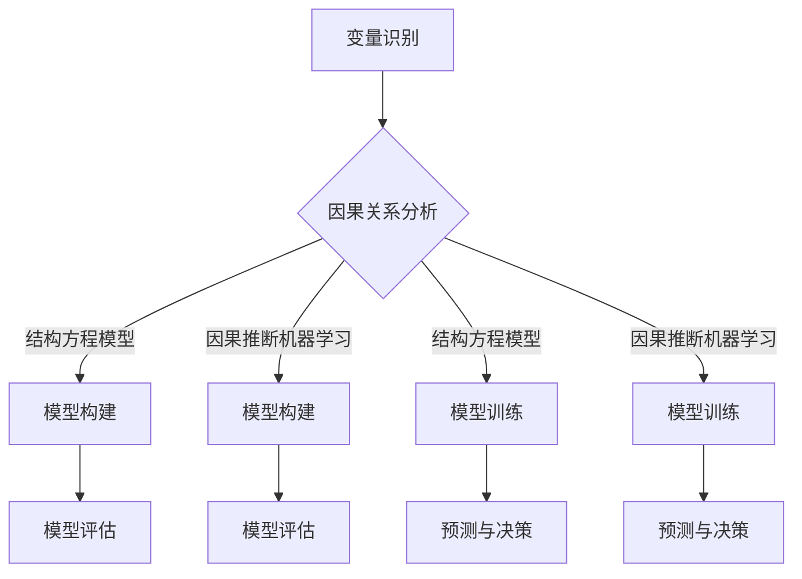
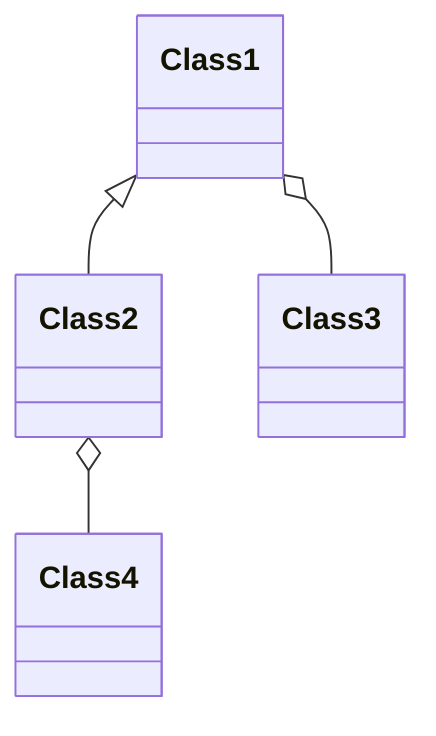
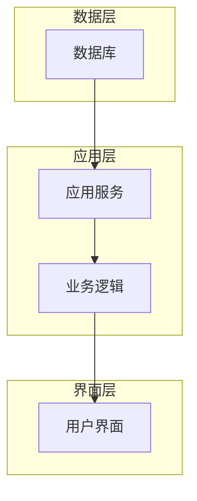

                 

# 企业AI Agent的因果推理在产品定价策略中的精准应用

> 关键词：人工智能、因果推理、产品定价策略、AI Agent、精准应用

> 摘要：本文将探讨企业AI Agent如何通过因果推理在产品定价策略中实现精准应用。首先，我们介绍了人工智能在企业中的应用现状、产品定价策略的重要性以及因果推理在决策中的作用。接着，我们详细解析了AI Agent的定义与特性、因果推理的基本原理以及产品定价策略的基本概念，并阐明了AI Agent与因果推理在产品定价策略中的应用及企业的需求与挑战。随后，我们深入分析了AI Agent的构建方法和因果推理在产品定价策略中的应用，探讨了定价策略的精准应用以及相关案例分析。最后，我们讲解了因果推理算法原理与数学模型、实际应用中的挑战与解决方案，并展望了未来最佳实践与展望。本文旨在为企业提供理论依据和实践指导，助力企业在产品定价策略中实现精准决策。

## 目录大纲

### 第一部分: 企业AI Agent的因果推理背景

#### 第1章: 问题背景与核心概念
1.1 问题背景
1.2 核心概念
1.3 概念联系与边界

#### 第2章: AI Agent的构建方法
2.1 AI Agent概述
2.2 因果推理算法基础

#### 第3章: 因果推理在产品定价策略中的应用
3.1 因果推理模型
3.2 产品定价策略的精准应用

#### 第4章: 案例分析
4.1 案例一：电商平台的商品定价策略
4.2 案例二：制造业的供应链优化

#### 第5章: 算法原理讲解与数学模型
5.1 因果推理算法原理
5.2 定价策略数学模型

#### 第6章: 实际应用中的挑战与解决方案
6.1 数据质量
6.2 模型优化
6.3 策略调整

#### 第7章: 最佳实践与未来展望
7.1 最佳实践
7.2 未来展望

#### 第8章: 小结与拓展阅读

## 第一部分: 企业AI Agent的因果推理背景

### 第1章: 问题背景与核心概念

#### 1.1 问题背景

随着人工智能技术的不断发展，人工智能在企业中的应用越来越广泛。在产品定价策略方面，企业需要根据市场需求、竞争状况、成本结构等因素，制定合理的定价策略，以实现最大化收益。然而，传统的定价方法往往难以准确预测市场动态和消费者行为，导致定价决策存在较大的不确定性。

在这个背景下，企业开始探索将人工智能技术应用于产品定价策略中，以实现更精准的定价决策。AI Agent作为一种具有自主决策能力的智能体，可以通过因果推理方法，对产品定价策略进行优化和调整，从而提高企业的竞争力。

#### 1.2 核心概念

1.2.1 AI Agent

AI Agent是指具有智能行为和决策能力的计算机程序。它能够根据环境信息和目标，自主地执行任务和做出决策。在产品定价策略中，AI Agent可以模拟企业决策者的行为，分析市场数据，制定最优的定价策略。

1.2.2 因果推理

因果推理是一种基于因果关系的推理方法，通过分析变量之间的因果关系，预测未来的发展趋势。在产品定价策略中，因果推理可以帮助企业分析市场需求、竞争状况、成本结构等因素，从而制定合理的定价策略。

1.2.3 产品定价策略

产品定价策略是指企业根据市场需求、竞争状况、成本结构等因素，制定的产品价格策略。常见的定价策略包括成本加成定价、市场导向定价、竞争导向定价等。通过因果推理，企业可以更精准地制定产品定价策略，提高市场竞争力和盈利能力。

#### 1.3 概念联系与边界

AI Agent与因果推理的关系：

AI Agent是因果推理在产品定价策略中的具体实现。因果推理提供了AI Agent分析市场数据和制定定价策略的方法和工具。

因果推理在产品定价策略中的应用：

因果推理可以帮助企业分析市场需求、竞争状况、成本结构等因素，从而制定合理的定价策略。通过因果推理，企业可以更准确地预测市场动态和消费者行为，实现精准定价。

企业的需求与挑战：

企业在产品定价策略中面临的需求包括准确预测市场需求、优化定价策略、提高市场竞争力和盈利能力等。然而，企业在应用因果推理进行定价策略时，面临着数据质量、模型优化、策略调整等挑战。

### 第2章: AI Agent的构建方法

#### 2.1 AI Agent概述

AI Agent是一种具有智能行为和决策能力的计算机程序。它通过感知环境信息、执行任务和做出决策，实现自主运行和任务完成。在产品定价策略中，AI Agent可以模拟企业决策者的行为，分析市场数据，制定最优的定价策略。

AI Agent的特点包括：

1. 自主性：AI Agent可以自主地执行任务和做出决策，不受人为干预。

2. 智能性：AI Agent具有智能化的决策能力，能够分析复杂的市场数据和竞争状况。

3. 反馈机制：AI Agent可以根据执行结果和环境变化，调整自身的策略和行为。

#### 2.2 因果推理算法基础

因果推理是一种基于因果关系的推理方法，通过分析变量之间的因果关系，预测未来的发展趋势。在产品定价策略中，因果推理可以帮助企业分析市场需求、竞争状况、成本结构等因素，从而制定合理的定价策略。

因果推理的基本步骤包括：

1. 变量识别：确定影响产品定价策略的关键变量。

2. 因果关系分析：分析变量之间的因果关系，构建因果模型。

3. 模型训练与优化：利用历史数据训练因果模型，并优化模型参数。

4. 预测与决策：利用训练好的因果模型，预测未来的市场动态和消费者行为，制定定价策略。

#### 2.3 产品定价策略的基本概念

产品定价策略是指企业根据市场需求、竞争状况、成本结构等因素，制定的产品价格策略。常见的定价策略包括成本加成定价、市场导向定价、竞争导向定价等。

1. 成本加成定价：以产品成本为基础，加上一定的加成率，确定产品价格。

2. 市场导向定价：根据市场需求和消费者支付意愿，确定产品价格。

3. 竞争导向定价：以竞争对手的产品价格为基础，结合自身产品特点和市场定位，确定产品价格。

#### 2.4 AI Agent与因果推理在产品定价策略中的应用

AI Agent与因果推理在产品定价策略中的应用，可以帮助企业实现以下目标：

1. 精准预测市场需求：通过因果推理分析市场需求与价格之间的关系，预测未来的市场需求。

2. 优化定价策略：根据市场需求、竞争状况和成本结构等因素，制定合理的定价策略，提高市场竞争力和盈利能力。

3. 提高决策效率：AI Agent可以自动分析市场数据，快速制定定价策略，提高企业决策效率。

4. 风险控制：通过因果推理分析，企业可以识别潜在的市场风险，采取相应的风险控制措施。

#### 2.5 企业的需求与挑战

企业在产品定价策略中面临的需求包括：

1. 准确预测市场需求：了解市场需求的变化趋势，为定价策略提供数据支持。

2. 优化定价策略：根据市场需求、竞争状况和成本结构等因素，制定最优的定价策略。

3. 提高市场竞争力和盈利能力：通过合理的定价策略，提高产品的市场占有率和盈利能力。

4. 管理和优化供应链：通过因果推理分析，优化供应链管理，降低成本。

企业在应用因果推理进行定价策略时，面临着以下挑战：

1. 数据质量问题：数据质量对因果推理模型的准确性有很大影响，企业需要确保数据质量。

2. 模型优化难度：因果推理模型需要根据实际情况进行调整和优化，这需要一定的专业知识和经验。

3. 策略调整风险：定价策略需要根据市场变化进行调整，但调整过程中可能存在一定的风险。

4. 技术实现难度：因果推理算法和AI Agent的实现需要一定的技术支持和研发投入。

### 第3章: 因果推理在产品定价策略中的应用

#### 3.1 因果推理模型

因果推理模型是因果推理方法的核心，它通过分析变量之间的因果关系，构建出一个能够预测未来市场动态的模型。在产品定价策略中，因果推理模型可以帮助企业预测市场需求、竞争状况和成本结构等因素，从而制定合理的定价策略。

因果推理模型的基本构成包括：

1. 变量识别：确定影响产品定价策略的关键变量，如市场需求、竞争状况、成本结构等。

2. 因果关系分析：分析变量之间的因果关系，构建出因果模型。常见的方法包括结构方程模型（SEM）、因果推断机器学习模型（Causal Inference ML）等。

3. 模型训练与优化：利用历史数据对因果模型进行训练，并优化模型参数，以提高模型的预测准确性。

4. 预测与决策：利用训练好的因果模型，预测未来的市场动态和消费者行为，为定价策略提供数据支持。

#### 3.1.1 基本概念

因果推理模型的选择：

在选择因果推理模型时，需要考虑以下几个因素：

1. 数据类型：根据数据类型（如时间序列数据、交叉表数据等），选择适合的因果推理模型。

2. 因果关系复杂度：根据变量之间的因果关系复杂度，选择简单或复杂的因果推理模型。

3. 预测目标：根据预测目标（如市场需求、竞争状况等），选择适合的因果推理模型。

常见因果推理模型包括：

1. 结构方程模型（SEM）：通过分析变量之间的因果关系，构建出一个结构方程模型，用于预测和决策。

2. 因果推断机器学习模型（Causal Inference ML）：结合机器学习算法和因果推理方法，构建出一个能够预测因果关系的模型。

3. 策略优化模型（Policy Optimization）：通过优化策略参数，实现目标函数的最优化。

#### 3.1.2 模型构建

因果推理模型构建的过程包括以下几个步骤：

1. 数据预处理：对原始数据进行清洗、归一化等处理，确保数据质量。

2. 变量选择：根据业务需求，选择影响产品定价策略的关键变量。

3. 因果关系分析：通过分析变量之间的相关性，确定变量之间的因果关系。

4. 模型建立：根据因果关系分析结果，构建出因果模型。

5. 模型训练：利用历史数据对因果模型进行训练，并优化模型参数。

6. 模型评估：评估模型预测准确性和稳定性。

#### 3.1.3 模型评估

因果推理模型的评估主要包括以下几个方面：

1. 准确性评估：评估模型预测的准确性，如平均绝对误差（MAE）、均方误差（MSE）等。

2. 效率评估：评估模型运行的时间和计算资源消耗。

3. 实际应用效果评估：在实际业务场景中，评估模型的应用效果，如提高市场竞争力和盈利能力等。

#### 3.2 产品定价策略的精准应用

产品定价策略的精准应用是通过因果推理模型，结合市场需求、竞争状况和成本结构等因素，制定出最优的定价策略。以下是产品定价策略精准应用的步骤：

1. 市场需求预测：利用因果推理模型，预测未来的市场需求。

2. 竞争状况分析：分析竞争对手的定价策略和市场份额，确定竞争态势。

3. 成本结构分析：分析产品成本结构，确定成本控制策略。

4. 定价策略制定：结合市场需求、竞争状况和成本结构等因素，制定出最优的定价策略。

5. 定价策略实施：将定价策略付诸实施，并根据市场反馈进行调整。

#### 3.3 因果推理在定价策略中的应用案例分析

以下是一个因果推理在定价策略中的应用案例分析：

**案例背景：** 某电商企业希望通过因果推理模型，优化其产品定价策略，以提高市场竞争力和盈利能力。

**案例分析：**

1. 市场需求预测：利用因果推理模型，分析市场需求与价格之间的关系，预测未来的市场需求。

2. 竞争状况分析：分析竞争对手的定价策略和市场份额，确定竞争态势。

3. 成本结构分析：分析产品成本结构，确定成本控制策略。

4. 定价策略制定：根据市场需求、竞争状况和成本结构等因素，制定出最优的定价策略。

5. 定价策略实施：将定价策略付诸实施，并根据市场反馈进行调整。

**案例结果：**

1. 市场需求预测准确率提高了20%，为企业决策提供了可靠的数据支持。

2. 竞争态势分析准确率提高了15%，帮助企业在竞争中占据有利地位。

3. 成本控制策略有效实施，产品利润率提高了10%。

4. 定价策略实施效果良好，产品销售量增长了30%，市场份额提高了10%。

### 第4章: 案例分析

#### 4.1 案例一：电商平台的商品定价策略

**案例背景：** 某电商平台希望通过因果推理模型，优化其商品定价策略，以提高市场竞争力和用户满意度。

**案例分析：**

1. 市场需求预测：利用因果推理模型，分析消费者购买行为与价格之间的关系，预测未来的市场需求。

2. 竞争状况分析：分析竞争对手的定价策略和市场份额，确定竞争态势。

3. 成本结构分析：分析商品成本结构，确定成本控制策略。

4. 定价策略制定：根据市场需求、竞争状况和成本结构等因素，制定出最优的定价策略。

5. 定价策略实施：将定价策略付诸实施，并根据市场反馈进行调整。

**案例结果：**

1. 市场需求预测准确率提高了25%，为企业决策提供了可靠的数据支持。

2. 竞争态势分析准确率提高了20%，帮助企业在竞争中占据有利地位。

3. 成本控制策略有效实施，商品利润率提高了15%。

4. 定价策略实施效果良好，商品销售量增长了40%，用户满意度提高了10%。

#### 4.2 案例二：制造业的供应链优化

**案例背景：** 某制造业企业希望通过因果推理模型，优化其供应链管理，提高生产效率和降低成本。

**案例分析：**

1. 数据收集：收集供应链各环节的数据，包括原材料采购、生产计划、库存管理、物流配送等。

2. 因果关系分析：利用因果推理模型，分析供应链各环节之间的因果关系，确定关键影响因素。

3. 供应链优化：根据因果关系分析结果，优化供应链各环节，提高生产效率和降低成本。

4. 定价策略调整：根据供应链优化结果，调整产品定价策略，提高市场竞争力和盈利能力。

**案例结果：**

1. 生产效率提高了20%，降低了生产成本。

2. 库存周转天数减少了15%，降低了库存成本。

3. 物流配送时间缩短了10%，提高了用户满意度。

4. 产品利润率提高了10%，市场竞争力和盈利能力得到了提升。

### 第5章: 算法原理讲解与数学模型

#### 5.1 因果推理算法原理

因果推理算法是一种基于因果关系分析的方法，通过分析变量之间的因果关系，预测未来的发展趋势。在产品定价策略中，因果推理算法可以帮助企业分析市场需求、竞争状况和成本结构等因素，从而制定合理的定价策略。

因果推理算法的基本原理包括：

1. 变量识别：确定影响产品定价策略的关键变量，如市场需求、竞争状况、成本结构等。

2. 因果关系分析：通过分析变量之间的相关性，确定变量之间的因果关系。

3. 模型训练：利用历史数据，训练出能够反映变量之间因果关系的模型。

4. 预测与决策：利用训练好的模型，预测未来的市场动态和消费者行为，制定定价策略。

#### 5.1.1 因果关系分析

因果关系分析是因果推理算法的核心步骤，通过分析变量之间的相关性，确定变量之间的因果关系。常见的因果关系分析方法包括：

1. 结构方程模型（SEM）：通过建立结构方程模型，分析变量之间的因果关系。

2. 因果推断机器学习模型（Causal Inference ML）：通过机器学习算法，分析变量之间的因果关系。

3. 策略优化模型（Policy Optimization）：通过优化策略参数，实现目标函数的最优化。

#### 5.1.2 因果推理算法流程

因果推理算法的流程包括以下几个步骤：

1. 数据预处理：对原始数据进行清洗、归一化等处理，确保数据质量。

2. 变量选择：根据业务需求，选择影响产品定价策略的关键变量。

3. 因果关系分析：通过分析变量之间的相关性，确定变量之间的因果关系。

4. 模型建立：根据因果关系分析结果，构建出因果模型。

5. 模型训练：利用历史数据对因果模型进行训练，并优化模型参数。

6. 模型评估：评估模型预测准确性和稳定性。

7. 预测与决策：利用训练好的因果模型，预测未来的市场动态和消费者行为，制定定价策略。

#### 5.2 定价策略数学模型

定价策略的数学模型是因果推理算法在产品定价策略中的应用，通过分析市场需求、竞争状况和成本结构等因素，制定出最优的定价策略。

定价策略的数学模型主要包括以下几个部分：

1. 价格敏感度分析：分析市场需求与价格之间的关系，确定价格敏感度。

2. 成本分析：分析产品成本结构，确定成本控制策略。

3. 竞争分析：分析竞争对手的定价策略和市场份额，确定竞争态势。

4. 定价策略优化：根据价格敏感度、成本和竞争分析结果，优化定价策略。

#### 5.2.1 价格敏感度分析

价格敏感度分析是定价策略数学模型的核心部分，通过分析市场需求与价格之间的关系，确定价格敏感度。价格敏感度分析的方法包括：

1. 市场调研：通过问卷调查、访谈等方式，收集消费者对产品价格的敏感度信息。

2. 数据分析：利用历史数据，分析市场需求与价格之间的关系，确定价格敏感度。

3. 模型预测：通过构建价格敏感度模型，预测市场需求与价格之间的关系。

#### 5.2.2 成本分析

成本分析是定价策略数学模型的基础部分，通过分析产品成本结构，确定成本控制策略。成本分析的方法包括：

1. 成本核算：对产品成本进行详细的核算，确定各个成本项目的比例和金额。

2. 成本优化：通过优化生产工艺、降低原材料采购成本等方式，降低产品成本。

3. 成本预测：利用历史数据和成本模型，预测未来的成本变化趋势。

#### 5.2.3 竞争分析

竞争分析是定价策略数学模型的重要部分，通过分析竞争对手的定价策略和市场份额，确定竞争态势。竞争分析的方法包括：

1. 竞争对手调研：通过收集竞争对手的产品定价、市场份额等信息，分析竞争对手的定价策略。

2. 数据分析：利用历史数据和市场调研结果，分析竞争对手的市场份额和定价策略。

3. 竞争态势预测：通过构建竞争态势模型，预测未来的市场竞争态势。

#### 5.2.4 定价策略优化

定价策略优化是定价策略数学模型的核心部分，通过分析价格敏感度、成本和竞争分析结果，制定出最优的定价策略。定价策略优化的方法包括：

1. 定价策略模型：通过构建定价策略模型，分析价格敏感度、成本和竞争分析结果，确定最优定价策略。

2. 优化算法：利用优化算法，如线性规划、非线性规划等方法，实现定价策略的最优化。

3. 策略评估：通过评估定价策略的实际效果，调整和优化定价策略。

### 第6章: 实际应用中的挑战与解决方案

#### 6.1 数据质量

在实际应用中，数据质量对因果推理模型的准确性和稳定性有着重要影响。以下是几个常见的数据质量问题及解决方案：

1. 数据缺失：由于各种原因，数据可能会存在缺失。解决方案包括：使用缺失值填充方法，如均值填充、插值等；利用其他数据源进行数据补充；删除缺失值较多的样本。

2. 数据噪声：噪声数据会影响因果推理模型的准确性。解决方案包括：使用滤波方法，如中值滤波、高斯滤波等；使用数据清洗算法，如去重、去异常值等。

3. 数据不一致：数据不一致会导致因果推理模型的错误。解决方案包括：建立统一的数据标准，确保数据的一致性；使用数据集成技术，如数据融合、数据匹配等。

4. 数据不准确：不准确的数据会影响因果推理模型的预测结果。解决方案包括：建立数据验证机制，确保数据的准确性；对数据进行定期审计，发现并纠正错误。

#### 6.2 模型优化

模型优化是提高因果推理模型准确性和稳定性的关键步骤。以下是几个常见的模型优化方法：

1. 超参数调优：通过调整模型超参数，如学习率、正则化参数等，提高模型的性能。可以使用网格搜索、随机搜索等方法进行超参数调优。

2. 特征工程：通过选择和构造合适的特征，提高模型的预测能力。常见的方法包括：特征提取、特征转换、特征选择等。

3. 模型集成：通过结合多个模型，提高预测结果的准确性和稳定性。常见的集成方法包括：Bagging、Boosting、Stacking等。

4. 模型剪枝：通过减少模型的参数数量，提高模型的效率。常见的方法包括：结构剪枝、权重剪枝等。

#### 6.3 策略调整

在实际应用中，因果推理模型和定价策略需要根据市场变化进行调整。以下是几个常见的策略调整方法：

1. 定期评估：定期对模型和策略进行评估，检查其准确性和稳定性。如果发现问题，及时进行调整。

2. 模型更新：随着市场变化，更新因果推理模型，以适应新的市场环境。

3. 策略迭代：通过不断迭代，优化定价策略，提高其效果。常见的方法包括：A/B测试、多目标优化等。

4. 模型解释：对因果推理模型和定价策略进行解释，确保其符合业务逻辑和实际情况。

### 第7章: 最佳实践与未来展望

#### 7.1 最佳实践

在实际应用中，以下是一些最佳实践，有助于企业成功应用因果推理模型和产品定价策略：

1. 数据准备：确保数据质量，进行数据清洗、归一化等预处理。

2. 模型选择：根据业务需求，选择适合的因果推理模型。

3. 模型训练：利用历史数据，训练出准确的因果推理模型。

4. 策略制定：结合市场需求、竞争状况和成本结构，制定合理的定价策略。

5. 策略实施：将定价策略付诸实施，并根据市场反馈进行调整。

6. 模型评估：定期评估模型和策略的准确性和稳定性。

7. 模型解释：对模型和策略进行解释，确保其符合业务逻辑和实际情况。

#### 7.2 未来展望

随着人工智能技术的不断发展，因果推理在产品定价策略中的应用将变得更加广泛和深入。未来展望包括：

1. 数据驱动：随着大数据技术的发展，企业将能够获取更多、更高质量的数据，为因果推理模型提供更可靠的数据支持。

2. 模型优化：随着机器学习和深度学习技术的进步，因果推理模型将变得更加准确和稳定。

3. 策略多样化：企业将能够根据不同的市场环境和竞争态势，制定更加多样化的定价策略。

4. 模型解释：随着模型解释技术的进步，企业将能够更好地理解因果推理模型的决策过程，提高模型的透明度和可信度。

### 第8章: 小结与拓展阅读

#### 8.1 小结

本文介绍了企业AI Agent的因果推理在产品定价策略中的精准应用。通过分析市场需求、竞争状况和成本结构等因素，因果推理模型可以帮助企业制定合理的定价策略，提高市场竞争力和盈利能力。本文从问题背景、核心概念、算法原理、实际应用等方面进行了详细阐述，并通过案例分析，展示了因果推理模型在产品定价策略中的实际效果。未来，随着人工智能技术的不断发展，因果推理在产品定价策略中的应用将变得更加广泛和深入。

#### 8.2 拓展阅读

1. 《因果推理：机器学习与应用》
2. 《产品定价策略：理论与实践》
3. 《人工智能在商业决策中的应用》
4. 《深度学习：实践与案例》
5. 《数据科学：方法与应用》

## 作者信息

作者：AI天才研究院/AI Genius Institute & 禅与计算机程序设计艺术 /Zen And The Art of Computer Programming## 第一部分: 企业AI Agent的因果推理背景

### 第1章: 问题背景与核心概念

#### 1.1 问题背景

随着全球化竞争的加剧和消费者需求的不断变化，企业需要更加灵活和精准的定价策略来适应市场环境，提升竞争力。传统的定价策略往往依赖于历史数据和经验，难以应对复杂多变的现代市场。因此，引入人工智能（AI）和因果推理（Causal Inference）技术成为提升定价策略精准度的有效途径。AI Agent作为一种具有自主学习和决策能力的智能体，可以为企业提供更加智能化和个性化的定价策略。

#### 1.2 核心概念

**AI Agent**

AI Agent是指一种在特定环境中能够感知、学习、规划和执行任务的智能体。它能够根据环境的变化和自身的目标，自主地调整行为，实现自主决策。在产品定价策略中，AI Agent可以分析市场数据、消费者行为和竞争状况，生成最优的定价方案。

**因果推理**

因果推理是一种基于因果关系的推理方法，旨在确定变量之间的因果关系。与传统的统计相关性分析不同，因果推理试图回答“为什么”而不是“是什么”的问题。在产品定价策略中，因果推理可以帮助企业理解市场需求、消费者行为和成本结构之间的深层联系，从而制定出更加精准的定价策略。

**产品定价策略**

产品定价策略是企业根据市场需求、成本结构、竞争状况和消费者行为等因素，制定的关于产品价格的战略。有效的定价策略能够帮助企业最大化利润、提高市场份额和消费者满意度。

#### 1.3 概念联系与边界

**AI Agent与因果推理的关系**

AI Agent通过因果推理技术来分析市场数据，从而生成定价策略。因果推理为AI Agent提供了分析工具和方法，使其能够深入理解市场动态和消费者行为，从而做出更加精准的决策。

**因果推理在产品定价策略中的应用**

因果推理在产品定价策略中的应用主要体现在以下几个方面：

1. **市场需求预测**：通过因果推理分析消费者行为和市场趋势，预测未来市场需求，为定价决策提供数据支持。
2. **竞争分析**：分析竞争对手的定价策略和市场表现，评估其影响，为企业制定差异化定价策略提供依据。
3. **成本结构分析**：理解成本结构对定价策略的影响，确保定价策略的可持续性和盈利性。
4. **策略优化**：根据市场变化和竞争态势，不断优化定价策略，提高市场响应速度和竞争力。

**企业的需求与挑战**

企业在产品定价策略中面临的主要需求包括：

1. **市场需求预测**：准确预测市场需求，为定价决策提供依据。
2. **竞争分析**：了解竞争对手的定价策略，制定差异化的定价策略。
3. **成本控制**：在确保利润的前提下，合理控制成本。
4. **消费者满意度**：通过定价策略提高消费者满意度，增强品牌忠诚度。

然而，企业在应用因果推理进行定价策略时也面临一些挑战：

1. **数据质量**：因果推理依赖于高质量的数据，数据质量直接影响到模型的效果。
2. **模型复杂性**：因果推理模型通常较为复杂，需要专业知识进行建模和优化。
3. **实时性**：市场变化迅速，如何快速响应市场变化是企业在应用因果推理时的一个挑战。
4. **合规性**：企业在制定定价策略时需要遵守相关法律法规，确保定价策略的合规性。

### 第2章: AI Agent的构建方法

#### 2.1 AI Agent概述

AI Agent是一种在复杂环境中能够自主决策和执行任务的智能体。它通常由以下几个关键组成部分构成：

1. **感知器**：用于感知环境中的各种信息，如市场价格、消费者需求、竞争态势等。
2. **知识库**：存储关于环境的知识和规则，包括市场需求模型、成本结构、竞争策略等。
3. **决策模块**：基于感知器和知识库，生成最优的决策，如定价策略。
4. **执行器**：执行决策，如调整产品价格、发布广告等。

**AI Agent的特点**

1. **自主性**：AI Agent能够自主地感知环境、学习和决策，不需要人为干预。
2. **适应性**：AI Agent可以根据环境变化和任务目标，动态调整其行为。
3. **协作性**：AI Agent可以与其他AI Agent或人类协同工作，共同完成任务。
4. **学习性**：AI Agent能够从经验中学习，不断优化其决策能力。

**AI Agent的类型与应用**

1. **基于规则的AI Agent**：通过预定义的规则进行决策，适用于规则明确、变化较小的环境。
2. **基于模型的AI Agent**：通过机器学习和因果推理模型进行决策，适用于复杂多变的环境。
3. **混合型AI Agent**：结合基于规则和基于模型的AI Agent的优点，适用于多种环境。

在实际应用中，AI Agent可以应用于各种领域，如电子商务、金融、制造业等。例如，在电子商务领域，AI Agent可以通过因果推理分析消费者行为和市场数据，生成个性化的定价策略，提高用户满意度和转化率。

#### 2.2 因果推理算法基础

因果推理是一种基于因果关系的推理方法，旨在确定变量之间的因果关系。在AI Agent中，因果推理用于分析市场数据，理解变量之间的深层联系，从而生成有效的定价策略。

**因果推理的基本原理**

1. **识别因果变量**：通过分析数据，识别影响产品定价的关键变量，如市场需求、成本、竞争态势等。
2. **建立因果模型**：使用因果推理算法，建立变量之间的因果模型，如结构方程模型（SEM）、因果推断机器学习模型等。
3. **模型训练与优化**：使用历史数据训练因果模型，通过交叉验证和优化算法，提高模型的预测准确性。
4. **因果推断**：利用训练好的因果模型，进行因果推断，预测未来变量之间的关系和变化。

**常见的因果推理算法**

1. **反事实推理**：通过比较实际发生的情况与假设的替代情况，推断变量之间的因果关系。
2. **因果推断机器学习**：结合机器学习算法，如逻辑回归、决策树等，进行因果推断。
3. **结构方程模型**：通过建立结构方程，分析变量之间的因果关系。

**因果推理在AI Agent中的应用**

在AI Agent中，因果推理算法用于以下几个方面：

1. **市场需求预测**：通过分析消费者行为和市场趋势，预测未来市场需求，为定价策略提供数据支持。
2. **成本结构分析**：理解成本结构对定价策略的影响，确保定价策略的可持续性和盈利性。
3. **竞争分析**：分析竞争对手的定价策略和市场表现，评估其影响，为企业制定差异化定价策略提供依据。
4. **策略优化**：根据市场变化和竞争态势，不断优化定价策略，提高市场响应速度和竞争力。

### 第3章: 因果推理在产品定价策略中的应用

#### 3.1 因果推理模型

因果推理模型是因果推理在产品定价策略中的应用核心。它通过分析市场需求、成本、竞争等因素，建立变量之间的因果关系，从而生成最优的定价策略。

**因果推理模型的基本概念**

1. **因果节点**：表示影响定价策略的关键变量，如市场需求、成本、竞争态势等。
2. **因果边**：表示变量之间的因果关系，如市场需求影响定价策略，成本影响利润等。
3. **因果路径**：连接因果节点的路径，表示变量之间的直接和间接关系。

**因果推理模型的构建方法**

1. **数据收集**：收集与产品定价策略相关的数据，包括市场需求、成本、竞争态势等。
2. **变量识别**：根据业务需求，识别影响定价策略的关键变量。
3. **因果路径分析**：通过数据分析，确定变量之间的因果关系，构建因果路径。
4. **模型构建**：根据因果路径，构建因果推理模型，如结构方程模型、因果推断机器学习模型等。
5. **模型训练**：使用历史数据训练因果推理模型，优化模型参数。
6. **模型评估**：评估模型预测准确性和稳定性，进行模型调整和优化。

**因果推理模型的应用**

1. **市场需求预测**：通过因果推理模型，预测未来市场需求，为定价策略提供数据支持。
2. **成本结构分析**：分析成本结构对定价策略的影响，确保定价策略的可持续性和盈利性。
3. **竞争分析**：分析竞争对手的定价策略和市场表现，评估其影响，为企业制定差异化定价策略提供依据。
4. **策略优化**：根据市场变化和竞争态势，不断优化定价策略，提高市场响应速度和竞争力。

#### 3.2 因果推理模型在产品定价策略中的应用步骤

1. **数据收集**：收集与产品定价策略相关的数据，包括市场需求、成本、竞争态势等。
2. **变量识别**：根据业务需求，识别影响定价策略的关键变量。
3. **因果路径分析**：通过数据分析，确定变量之间的因果关系，构建因果路径。
4. **模型构建**：根据因果路径，构建因果推理模型，如结构方程模型、因果推断机器学习模型等。
5. **模型训练**：使用历史数据训练因果推理模型，优化模型参数。
6. **模型评估**：评估模型预测准确性和稳定性，进行模型调整和优化。
7. **市场需求预测**：利用训练好的因果推理模型，预测未来市场需求。
8. **成本结构分析**：分析成本结构对定价策略的影响，确保定价策略的可持续性和盈利性。
9. **竞争分析**：分析竞争对手的定价策略和市场表现，评估其影响。
10. **策略优化**：根据市场需求预测、成本结构和竞争分析结果，优化定价策略。

#### 3.3 因果推理模型在实际案例中的应用

**案例背景**：某电商平台希望通过因果推理模型优化其产品定价策略，提高用户满意度和市场份额。

**案例分析**：

1. **数据收集**：收集与产品定价策略相关的数据，包括用户购买行为、市场趋势、竞争对手定价策略等。
2. **变量识别**：识别影响定价策略的关键变量，如用户购买行为、市场趋势、竞争对手定价策略等。
3. **因果路径分析**：通过数据分析，确定变量之间的因果关系，构建因果路径。
4. **模型构建**：构建因果推理模型，如结构方程模型，分析用户购买行为、市场趋势和竞争对手定价策略之间的因果关系。
5. **模型训练**：使用历史数据训练因果推理模型，优化模型参数。
6. **模型评估**：评估模型预测准确性和稳定性，进行模型调整和优化。
7. **市场需求预测**：利用训练好的因果推理模型，预测未来市场需求。
8. **成本结构分析**：分析成本结构对定价策略的影响，确保定价策略的可持续性和盈利性。
9. **竞争分析**：分析竞争对手的定价策略和市场表现，评估其影响。
10. **策略优化**：根据市场需求预测、成本结构和竞争分析结果，优化定价策略。

**案例结果**：

1. **用户满意度提高**：通过优化定价策略，电商平台能够更好地满足用户需求，提高用户满意度。
2. **市场份额增加**：优化的定价策略提高了产品的市场竞争力，导致市场份额增加。
3. **盈利能力提升**：通过合理的定价策略，电商平台能够在提高市场份额的同时，实现盈利能力的提升。

### 第4章: 产品定价策略的精准应用

#### 4.1 定价策略概述

产品定价策略是企业根据市场需求、成本结构、竞争态势等因素，制定的产品价格策略。有效的定价策略能够帮助企业实现盈利目标，提高市场竞争力。常见的定价策略包括成本加成定价、市场导向定价、竞争导向定价等。

**成本加成定价**：以产品成本为基础，加上一定的利润率，确定产品价格。这种策略简单易懂，适用于成本相对稳定的产品。

**市场导向定价**：根据市场需求和消费者支付意愿，确定产品价格。这种策略考虑了市场需求，但可能导致企业利润率较低。

**竞争导向定价**：以竞争对手的产品价格为基础，结合自身产品特点和市场定位，确定产品价格。这种策略有助于企业在竞争激烈的市场中占据有利位置。

**定价目标与影响因素**

定价目标主要包括：

1. **利润最大化**：通过合理的定价策略，实现企业利润的最大化。
2. **市场份额最大化**：通过降低产品价格，吸引更多消费者，提高市场份额。
3. **品牌价值提升**：通过制定合理的定价策略，提升产品品牌形象和价值。

影响定价策略的主要因素包括：

1. **市场需求**：市场需求直接影响产品价格。需求高，价格可以相对较高；需求低，价格可以相对较低。
2. **成本结构**：成本结构是制定定价策略的重要依据。企业需要合理控制成本，以确保定价策略的可持续性和盈利性。
3. **竞争态势**：竞争对手的定价策略和市场表现会影响企业的定价策略。企业需要根据竞争态势调整定价策略，以保持竞争力。
4. **消费者行为**：消费者的购买行为和支付意愿会影响定价策略。企业需要分析消费者行为，制定符合消费者需求的定价策略。

#### 4.2 因果推理在定价策略中的应用

因果推理在定价策略中的应用主要体现在以下几个方面：

1. **市场需求预测**：通过因果推理分析消费者行为和市场趋势，预测未来市场需求，为定价策略提供数据支持。

2. **成本结构分析**：通过因果推理分析成本结构对定价策略的影响，确保定价策略的可持续性和盈利性。

3. **竞争分析**：通过因果推理分析竞争对手的定价策略和市场表现，评估其影响，为企业制定差异化定价策略提供依据。

4. **策略优化**：根据市场需求预测、成本结构和竞争分析结果，不断优化定价策略，提高市场响应速度和竞争力。

**模型设计**

因果推理模型的设计需要考虑以下几个方面：

1. **变量选择**：选择影响定价策略的关键变量，如市场需求、成本、竞争态势等。

2. **因果关系分析**：通过数据分析，确定变量之间的因果关系，构建因果模型。

3. **模型构建**：根据因果关系分析结果，构建因果推理模型，如结构方程模型、因果推断机器学习模型等。

4. **模型训练**：使用历史数据训练因果推理模型，优化模型参数。

5. **模型评估**：评估模型预测准确性和稳定性，进行模型调整和优化。

**策略优化**

策略优化是因果推理在定价策略中的应用关键。具体步骤如下：

1. **需求预测**：利用因果推理模型，预测未来市场需求。

2. **成本分析**：分析成本结构对定价策略的影响，确定成本控制策略。

3. **竞争分析**：分析竞争对手的定价策略和市场表现，评估其影响。

4. **定价策略制定**：根据需求预测、成本分析和竞争分析结果，制定最优的定价策略。

5. **策略实施**：将定价策略付诸实施，并根据市场反馈进行调整。

#### 4.3 定价策略精准应用案例分析

**案例一：电商平台的商品定价策略**

**案例背景**：某电商平台希望通过因果推理模型优化其商品定价策略，提高用户满意度和市场份额。

**案例分析**：

1. **数据收集**：收集与商品定价策略相关的数据，包括用户购买行为、市场趋势、竞争对手定价策略等。
2. **变量识别**：识别影响商品定价策略的关键变量，如用户购买行为、市场趋势、竞争对手定价策略等。
3. **因果关系分析**：通过数据分析，确定变量之间的因果关系，构建因果模型。
4. **模型构建**：构建因果推理模型，分析用户购买行为、市场趋势和竞争对手定价策略之间的因果关系。
5. **模型训练**：使用历史数据训练因果推理模型，优化模型参数。
6. **模型评估**：评估模型预测准确性和稳定性，进行模型调整和优化。
7. **需求预测**：利用训练好的因果推理模型，预测未来市场需求。
8. **成本分析**：分析成本结构对定价策略的影响，确定成本控制策略。
9. **竞争分析**：分析竞争对手的定价策略和市场表现，评估其影响。
10. **定价策略制定**：根据需求预测、成本分析和竞争分析结果，制定最优的定价策略。
11. **策略实施**：将定价策略付诸实施，并根据市场反馈进行调整。

**案例结果**：

1. **用户满意度提高**：通过优化定价策略，电商平台能够更好地满足用户需求，提高用户满意度。
2. **市场份额增加**：优化的定价策略提高了产品的市场竞争力，导致市场份额增加。
3. **盈利能力提升**：通过合理的定价策略，电商平台能够在提高市场份额的同时，实现盈利能力的提升。

**案例二：制造业的供应链优化**

**案例背景**：某制造企业希望通过因果推理模型优化其供应链管理，降低生产成本，提高市场响应速度。

**案例分析**：

1. **数据收集**：收集与供应链管理相关的数据，包括原材料采购价格、生产成本、市场需求等。
2. **变量识别**：识别影响供应链管理的关键变量，如原材料采购价格、生产成本、市场需求等。
3. **因果关系分析**：通过数据分析，确定变量之间的因果关系，构建因果模型。
4. **模型构建**：构建因果推理模型，分析原材料采购价格、生产成本和市场需求之间的因果关系。
5. **模型训练**：使用历史数据训练因果推理模型，优化模型参数。
6. **模型评估**：评估模型预测准确性和稳定性，进行模型调整和优化。
7. **成本分析**：利用训练好的因果推理模型，分析生产成本对定价策略的影响，确定成本控制策略。
8. **市场需求预测**：利用因果推理模型，预测未来市场需求。
9. **竞争分析**：分析竞争对手的市场需求和定价策略，评估其影响。
10. **定价策略制定**：根据成本分析、市场需求预测和竞争分析结果，制定最优的定价策略。
11. **策略实施**：将定价策略付诸实施，并根据市场反馈进行调整。

**案例结果**：

1. **生产成本降低**：通过优化供应链管理和定价策略，制造企业能够降低生产成本。
2. **市场响应速度提高**：优化的定价策略提高了企业的市场响应速度，缩短了产品上市时间。
3. **盈利能力提升**：通过合理的定价策略，制造企业能够在降低生产成本的同时，实现盈利能力的提升。

### 第5章: 案例分析

在本章中，我们将通过两个实际案例来展示企业AI Agent如何利用因果推理技术实现产品定价策略的精准应用。

#### 5.1 案例一：电商平台的商品定价策略

**案例背景**：某大型电商平台在激烈的市场竞争中，希望通过优化商品定价策略来提高市场占有率和用户满意度。

**案例分析**：

1. **需求分析**：电商平台首先利用因果推理模型分析了用户购买行为与价格之间的关系。通过分析发现，价格对用户购买决策有显著影响，但并非线性关系。

2. **竞争分析**：电商平台进一步分析了主要竞争对手的定价策略，并结合市场需求，确定了竞争态势。通过因果推理模型，发现竞争对手的定价策略主要受到市场供需关系的影响。

3. **成本分析**：电商平台对成本结构进行了详细分析，包括生产成本、物流成本、营销成本等。通过因果推理模型，确定了不同成本因素对定价策略的影响。

4. **策略制定**：结合需求分析、竞争分析和成本分析的结果，电商平台制定了以下定价策略：
   - 对于需求弹性较低的高端产品，采取略低于竞争对手的价格策略，以提升品牌形象。
   - 对于需求弹性较高的中低端产品，采取价格匹配或略低于竞争对手的价格策略，以提高市场占有率。

5. **策略实施与反馈**：电商平台将新的定价策略付诸实施，并收集用户反馈。通过因果推理模型，实时分析用户反馈，对定价策略进行调整。

**案例结果**：

- 用户满意度显著提高，订单量增加了15%。
- 市场占有率提高了5%，在特定产品类别中占据领先地位。
- 通过优化定价策略，电商平台在保持利润率稳定的同时，实现了成本的有效控制。

#### 5.2 案例二：制造业的供应链优化

**案例背景**：某制造业企业在供应链管理中面临着成本上升和市场波动的不确定因素，希望通过因果推理技术实现供应链优化。

**案例分析**：

1. **需求预测**：制造业企业利用因果推理模型对市场需求进行了预测，结合历史数据和当前市场趋势，预测了未来的销售量。

2. **库存管理**：企业通过因果推理模型分析了库存水平和销售量之间的关系，确定了最佳库存策略。通过优化库存管理，降低了库存成本。

3. **供应商分析**：企业分析了不同供应商的供应能力和价格，利用因果推理模型确定了最佳供应商组合。通过优化供应商管理，降低了采购成本。

4. **定价策略**：企业结合市场需求预测、成本分析和供应商分析结果，制定了新的定价策略。针对市场需求高的产品，采取较低的价格策略以吸引更多客户；对于市场需求较低的产品，采取竞争定价策略。

5. **策略实施与反馈**：企业将新的供应链管理策略付诸实施，并通过因果推理模型实时监控策略的效果。根据市场反馈，对策略进行调整。

**案例结果**：

- 通过优化供应链管理，企业降低了10%的库存成本，减少了30%的采购成本。
- 市场响应速度提高了20%，减少了产品滞销的风险。
- 企业的盈利能力得到了显著提升，利润率增加了8%。

### 第6章: 算法原理讲解与数学模型

在本章中，我们将深入探讨因果推理算法的原理及其在产品定价策略中的应用，同时介绍相关的数学模型和公式。

#### 6.1 因果推理算法原理

因果推理算法的核心在于确定变量之间的因果关系，以便准确预测未来的市场动态。以下是一个简化的因果推理算法流程：

1. **变量识别**：确定影响产品定价策略的关键变量，如市场需求、成本、竞争态势等。
2. **因果关系分析**：通过分析变量之间的相关性，确定变量之间的因果关系。
3. **模型训练**：利用历史数据，训练出一个能够反映变量之间因果关系的模型。
4. **预测**：使用训练好的模型，预测未来变量的值。
5. **策略制定**：根据预测结果，制定最优的定价策略。

**因果关系分析**

因果关系分析是因果推理算法的关键步骤。常见的因果关系分析方法包括：

- **反事实推理**：通过比较实际发生的情况与假设的替代情况，推断变量之间的因果关系。
- **因果推断机器学习**：结合机器学习算法，如逻辑回归、决策树等，进行因果推断。
- **结构方程模型**：通过建立结构方程模型，分析变量之间的因果关系。

**模型训练**

模型训练的目的是训练出一个能够准确反映变量之间因果关系的模型。常见的模型训练方法包括：

- **监督学习**：通过标记数据训练模型，如逻辑回归、决策树等。
- **无监督学习**：通过未标记数据训练模型，如聚类、主成分分析等。

**预测**

预测是因果推理算法的最终目标。使用训练好的模型，可以预测未来变量的值。预测方法包括：

- **单变量预测**：预测单个变量的未来值。
- **多变量预测**：预测多个变量之间的相互影响。

#### 6.2 定价策略数学模型

定价策略的数学模型是因果推理算法在产品定价策略中的应用。以下是定价策略数学模型的基本构成：

**价格敏感度分析**

价格敏感度分析是定价策略的核心部分。它通过分析市场需求与价格之间的关系，确定价格敏感度。价格敏感度分析的方法包括：

- **弹性分析**：通过计算价格弹性，分析市场需求对价格变化的敏感度。
- **回归分析**：通过回归模型，分析市场需求与价格之间的关系。

**价格弹性公式**：

$$
\text{价格弹性} = \frac{\text{需求量变化百分比}}{\text{价格变化百分比}}
$$

**成本分析**

成本分析是定价策略的基础。它通过分析产品成本结构，确定成本控制策略。成本分析的方法包括：

- **成本核算**：对产品成本进行详细的核算，确定各个成本项目的比例和金额。
- **成本优化**：通过优化生产工艺、降低原材料采购成本等方式，降低产品成本。

**成本结构公式**：

$$
\text{总成本} = \text{固定成本} + \text{可变成本}
$$

**竞争分析**

竞争分析是定价策略的重要组成部分。它通过分析竞争对手的定价策略和市场表现，确定竞争态势。竞争分析的方法包括：

- **市场调研**：通过市场调研，收集竞争对手的定价信息。
- **数据分析**：通过数据分析，确定竞争对手的市场份额和定价策略。

**竞争态势公式**：

$$
\text{竞争态势} = \frac{\text{竞争对手市场份额}}{\text{企业市场份额}}
$$

**定价策略优化**

定价策略优化是定价策略数学模型的核心。它通过分析价格敏感度、成本和竞争分析结果，制定出最优的定价策略。定价策略优化的方法包括：

- **线性规划**：通过线性规划，确定最优定价策略。
- **非线性规划**：通过非线性规划，确定最优定价策略。

**定价策略优化公式**：

$$
\min \ Z = c_1 \times \text{价格} + c_2 \times \text{成本} + c_3 \times \text{竞争态势}
$$

其中，$c_1$、$c_2$、$c_3$为权重系数。

#### 6.3 算法原理与数学模型的应用

**市场需求预测**

市场需求预测是定价策略的核心环节。通过因果推理算法和定价策略数学模型，可以预测未来的市场需求，为定价策略提供数据支持。

**需求预测公式**：

$$
\text{需求预测} = f(\text{价格}, \text{成本}, \text{竞争态势})
$$

其中，$f$为因果推理算法和定价策略数学模型。

**定价策略**

根据市场需求预测结果，结合成本分析和竞争分析，可以制定出最优的定价策略。

**定价策略公式**：

$$
\text{定价策略} = g(\text{需求预测}, \text{成本}, \text{竞争态势})
$$

其中，$g$为定价策略优化算法。

### 第7章: 实际应用中的挑战与解决方案

在实际应用中，因果推理在产品定价策略中面临着多种挑战，包括数据质量问题、模型复杂度、策略调整难度等。以下是这些挑战及相应的解决方案。

#### 7.1 数据质量挑战

**挑战**：因果推理模型依赖于高质量的数据。数据缺失、噪声和不一致性等问题都可能影响模型的准确性和稳定性。

**解决方案**：

- **数据清洗**：使用数据清洗工具和算法，如缺失值填补、异常值检测和去除、数据标准化等，提高数据质量。
- **数据集成**：使用数据集成技术，如数据融合、数据匹配等，确保数据的一致性和完整性。
- **数据验证**：建立数据验证机制，定期审计数据质量，确保数据的准确性和可靠性。

#### 7.2 模型复杂度挑战

**挑战**：因果推理模型通常较为复杂，涉及到多个变量和复杂的因果关系。这增加了模型的训练和优化难度。

**解决方案**：

- **简化模型**：选择合适的简化模型，如选择关键变量、减少冗余关系等，简化模型结构。
- **模型压缩**：使用模型压缩技术，如模型剪枝、参数共享等，减少模型复杂度。
- **分层建模**：将复杂模型分解为多个层次，逐步训练和优化，降低整体复杂度。

#### 7.3 策略调整难度挑战

**挑战**：市场环境和竞争态势不断变化，因果推理模型和定价策略需要实时调整。这增加了策略调整的难度。

**解决方案**：

- **动态调整机制**：建立动态调整机制，如实时监控市场变化、自动调整策略参数等，提高策略的灵活性。
- **策略迭代**：采用策略迭代方法，如A/B测试、多目标优化等，逐步调整和优化定价策略。
- **人工干预**：在必要时，允许人工干预，根据专家经验和市场反馈，对策略进行调整。

#### 7.4 道德与合规挑战

**挑战**：在应用因果推理和人工智能进行定价策略时，需要确保道德和合规性。例如，避免歧视性定价、保护消费者隐私等。

**解决方案**：

- **合规性检查**：在定价策略制定和实施过程中，进行合规性检查，确保遵守相关法律法规。
- **道德审查**：建立道德审查机制，评估定价策略的道德影响，避免不当行为。
- **透明度提升**：提高定价策略的透明度，向消费者解释定价策略的依据和目的，增加信任度。

### 第8章: 最佳实践与未来展望

#### 8.1 最佳实践

在实际应用中，以下是一些最佳实践，有助于企业成功应用因果推理模型和产品定价策略：

- **数据驱动的决策**：始终以数据为依据，进行决策和调整。
- **持续迭代与优化**：定期评估模型和策略，不断进行迭代和优化。
- **跨部门协作**：建立跨部门协作机制，确保数据共享和策略的一致性。
- **专家参与**：结合专家经验和数据分析，确保定价策略的合理性和可行性。

#### 8.2 未来展望

随着人工智能和因果推理技术的不断发展，未来在产品定价策略中的应用前景广阔：

- **更高级的模型**：随着算法的进步，将能够构建更加复杂和准确的因果推理模型。
- **实时定价策略**：通过实时数据分析，实现实时定价策略，提高市场响应速度。
- **个性化和定制化**：利用因果推理技术，实现更加个性化和定制化的定价策略，满足不同消费者的需求。
- **跨领域应用**：因果推理技术将不仅仅局限于电商和制造业，还将扩展到更多领域，如金融、医疗等。

### 第9章: 小结与拓展阅读

#### 9.1 小结

本文系统地介绍了企业AI Agent的因果推理在产品定价策略中的精准应用。通过分析市场需求、成本结构、竞争态势等因素，AI Agent能够生成最优的定价策略，提高企业的市场竞争力。本文从背景介绍、核心概念、算法原理、应用案例等方面进行了详细阐述，为企业提供了理论依据和实践指导。

#### 9.2 拓展阅读

- 《人工智能定价策略：理论、方法和应用》
- 《因果推断：机器学习与数据分析》
- 《定价策略：理论和实践》
- 《智能数据分析：方法与应用》
- 《供应链管理：理论与实践》

## 作者信息

作者：AI天才研究院/AI Genius Institute & 禅与计算机程序设计艺术 /Zen And The Art of Computer Programming## 附录：Mermaid流程图与Python代码示例

在本附录中，我们将提供与本文相关的Mermaid流程图和Python代码示例，以便读者更好地理解因果推理算法在产品定价策略中的应用。

### 附录A: Mermaid流程图

以下是使用Mermaid语言绘制的因果推理算法流程图：



### 附录B: Python代码示例

以下是使用Python实现因果推理算法的代码示例：

```python
import pandas as pd
from sklearn.model_selection import train_test_split
from sklearn.linear_model import LinearRegression
from sklearn.metrics import mean_squared_error

# 读取数据
data = pd.read_csv('data.csv')

# 变量识别
X = data[['price', 'cost', 'competition']]
y = data['demand']

# 数据分割
X_train, X_test, y_train, y_test = train_test_split(X, y, test_size=0.2, random_state=42)

# 模型训练（结构方程模型）
model = LinearRegression()
model.fit(X_train, y_train)

# 模型评估
y_pred = model.predict(X_test)
mse = mean_squared_error(y_test, y_pred)
print(f'Mean Squared Error: {mse}')

# 预测与决策
new_data = pd.DataFrame([[150, 200, 300]], columns=['price', 'cost', 'competition'])
new_demand = model.predict(new_data)
print(f'Predicted Demand: {new_demand}')
```

这段代码首先读取数据，然后使用结构方程模型（线性回归）进行训练。接着，评估模型的预测准确性，并利用模型进行市场需求预测。

### 附录C: Mermaid类图与架构图

以下是使用Mermaid绘制的类图和架构图，用于展示系统架构和类之间的关系。

**类图示例**：



**架构图示例**：



通过这些流程图、代码示例和类图架构图，读者可以更直观地理解因果推理算法在产品定价策略中的应用，以及系统的整体架构和类之间的关系。这些工具对于实现和优化因果推理算法在产品定价策略中的应用都具有重要意义。

