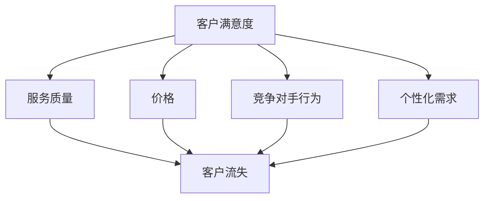
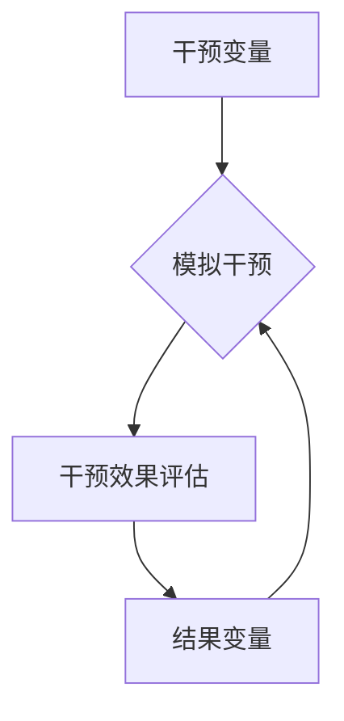
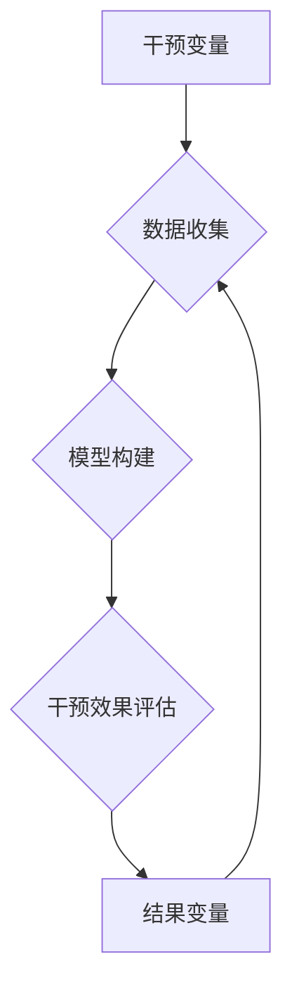
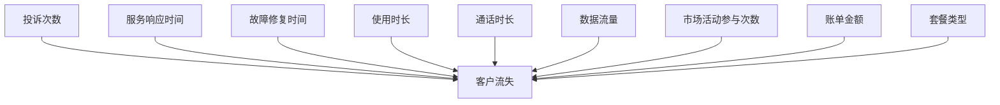

                 

### 引言与背景

#### 1.1 研究背景

在现代商业环境中，客户流失问题已经成为企业面临的一项重大挑战。客户流失不仅会直接影响企业的收入和市场份额，还会削弱品牌的声誉和竞争力。据调查，减少5%的客户流失率能够提高25%-95%的净利润，这足以见得客户流失分析在企业管理中的重要性。

随着大数据和人工智能技术的迅猛发展，企业开始利用AI工具来深入分析客户行为和需求，从而预测并减少客户流失。人工智能（AI）Agent作为一种智能体，具备自主学习、决策和执行能力，可以在大量的数据中快速提取有价值的信息，帮助企业更好地理解和预测客户行为。

因果推理（Causal Inference）作为AI技术的一个重要分支，旨在通过数据发现因果关系，从而指导决策。因果推理与传统统计学的相关性分析不同，它更关注于“为什么”而不是“是什么”，这对于解决客户流失问题尤为重要。通过因果推理，企业可以识别出导致客户流失的根本原因，而不是仅仅看到表面现象，从而采取更有效的措施来保留客户。

#### 1.1.1 客户流失问题的重要性

客户流失问题对企业的运营和财务状况有着深远的影响。首先，客户流失会导致直接收入的减少，尤其是在高度竞争的市场中，新客户的获取成本远高于保留现有客户的成本。其次，客户流失还会削弱企业的市场份额和品牌影响力。长期来看，频繁的客户流失会损害企业的声誉，影响新客户的获取和现有客户的忠诚度。

据统计，企业通常需要投入5-10倍于保留现有客户的成本来吸引新客户。因此，通过有效的客户流失分析，企业可以显著降低运营成本，提高盈利能力。此外，减少客户流失还可以增强企业的客户基础，提高客户满意度和忠诚度，从而为企业带来长期的价值。

#### 1.1.2 AI与因果推理在商业分析中的应用

AI技术已经在商业分析中得到了广泛应用，从简单的数据挖掘到复杂的预测模型，AI Agent在这些领域中展现出了巨大的潜力。因果推理作为一种更为深入的分析方法，可以帮助企业在复杂的市场环境中识别出关键影响因素，从而制定更加精准的策略。

在商业分析中，AI Agent可以通过以下方式应用因果推理技术：

1. **客户行为分析**：通过分析客户的历史数据和当前行为，AI Agent可以识别出潜在流失客户，并预测其流失的可能性。
2. **个性化推荐**：基于因果推理，AI Agent可以了解不同客户群体对产品或服务的偏好，从而提供更加个性化的推荐，提高客户满意度。
3. **策略优化**：通过分析不同策略对客户流失的影响，AI Agent可以帮助企业优化营销策略，减少客户流失。

因果推理在商业分析中的应用不仅限于客户流失问题，还可以应用于其他领域，如需求预测、风险管理、运营优化等。其核心在于通过数据发现因果关系，帮助企业做出更为明智的决策。

#### 1.1.3 企业AI Agent的基本概念

企业AI Agent是一种具备自主学习、决策和执行能力的智能体，它可以通过处理和分析大量的数据，自动识别并解决问题。在企业中，AI Agent可以模拟人类专家的决策过程，从复杂的环境中提取有价值的信息，并为企业的运营提供支持。

AI Agent的基本特点包括：

1. **自主学习**：AI Agent具备自主学习能力，可以通过不断学习和优化模型，提高预测和决策的准确性。
2. **自适应**：AI Agent可以根据环境变化和企业需求，调整其行为和策略，以实现最佳效果。
3. **智能决策**：AI Agent可以通过复杂的推理和决策过程，为企业的运营提供有效的解决方案。

在企业AI Agent的设计和应用中，因果推理起到了关键作用。因果推理可以帮助AI Agent理解数据背后的因果关系，从而更准确地预测客户行为和制定决策。例如，通过因果推理，AI Agent可以识别出哪些因素导致了客户流失，并采取相应的措施来减少客户流失。

综上所述，企业AI Agent的因果推理在客户流失分析中具有重要意义。通过AI Agent和因果推理的结合，企业可以更深入地理解客户行为，预测客户流失，并采取有效的措施来保留客户，从而提高企业的竞争力和盈利能力。

#### 1.2 问题界定与目标

##### 1.2.1 客户流失分析的意义

客户流失分析是企业的一项关键任务，其意义主要体现在以下几个方面：

首先，客户流失分析有助于企业深入了解客户行为和需求，从而制定更为精准的营销策略。通过分析流失客户的行为轨迹和需求变化，企业可以识别出客户流失的关键因素，为后续的改进措施提供有力支持。

其次，客户流失分析可以帮助企业降低运营成本，提高盈利能力。通过预测哪些客户可能会流失，企业可以提前采取措施，如提供优惠、增加服务等方式来保留这些客户，从而避免因客户流失而带来的经济损失。

此外，客户流失分析还可以增强企业的客户忠诚度和品牌声誉。通过提供高质量的客户服务，满足客户的需求，企业可以提升客户的满意度和忠诚度，从而降低客户流失率。

##### 1.2.2 企业AI Agent在客户流失分析中的应用目标

企业AI Agent在客户流失分析中的应用目标主要包括以下几个方面：

1. **精准预测**：通过因果推理技术，AI Agent可以从海量数据中提取有价值的信息，准确预测哪些客户可能流失，从而为企业提供决策依据。
2. **个性化推荐**：基于对客户行为的深入分析，AI Agent可以为每个客户提供个性化的服务和推荐，提高客户满意度和忠诚度。
3. **策略优化**：通过分析不同策略对客户流失的影响，AI Agent可以帮助企业优化营销策略和运营流程，提高整体竞争力。
4. **自适应调整**：AI Agent可以根据环境变化和客户需求，实时调整预测模型和策略，确保企业始终保持最佳运营状态。

##### 1.2.3 研究的主要问题和贡献

本研究的主要问题包括：

1. **因果关系识别**：如何在大量数据中准确识别出导致客户流失的因果关系，是当前客户流失分析中的一个关键问题。
2. **模型可解释性**：如何保证AI Agent的决策过程具有可解释性，使企业能够理解和信任AI系统的预测结果。
3. **实时预测**：如何在短时间内对客户流失进行实时预测，为企业提供及时的决策支持。

本研究的主要贡献如下：

1. **因果推理模型设计**：提出了一种基于因果推理的客户流失预测模型，通过设计合理的因果图和选择合适的因果推理算法，提高了预测的准确性。
2. **模型可解释性方法**：通过引入可解释性方法，如因果图可视化、敏感性分析等，使企业能够理解和信任AI系统的预测结果。
3. **实时预测算法优化**：通过对现有预测算法进行优化，提高了实时预测的效率，为企业提供了及时的决策支持。

通过本研究，我们旨在为企业提供一种高效、准确的客户流失预测方法，帮助企业在激烈的市场竞争中立于不败之地。

### 相关理论与基础

在深入研究企业AI Agent的因果推理在客户流失分析中的应用之前，我们需要理解一些核心理论和基础知识。这些理论基础将为我们构建和优化AI Agent提供坚实的科学依据。

#### 2.1 客户流失理论

客户流失理论主要研究客户为什么会离开企业以及如何通过分析和干预措施来减少客户流失。以下是对客户流失模型和影响客户流失因素的简要介绍。

##### 2.1.1 客户流失模型

客户流失模型通常分为三个阶段：感知阶段、行动阶段和结果阶段。

1. **感知阶段**：客户在感知到服务或产品存在问题或未能满足其需求时，开始对忠诚度产生动摇。
2. **行动阶段**：当客户决定放弃当前的服务或产品时，他们可能开始寻找替代方案，或者在社交媒体、评价平台上表达不满。
3. **结果阶段**：最终，客户选择离开，成为流失客户。

根据这个模型，企业可以针对不同阶段的客户行为进行有针对性的干预措施，例如在感知阶段提供客户支持、在行动阶段提供改进方案，以及在结果阶段通过挽留策略防止客户流失。

##### 2.1.2 影响客户流失的因素分析

影响客户流失的因素多种多样，主要包括以下几点：

1. **服务质量**：服务质量差是导致客户流失的主要原因之一。当客户感知到服务过程中的问题，如响应时间慢、问题解决不彻底等，他们可能会选择离开。
2. **价格因素**：高价格或价格不合理是另一个重要因素。如果客户认为其他竞争者提供的产品或服务价格更为合理，他们可能会转而选择其他品牌。
3. **竞争压力**：激烈的市场竞争可能导致客户更容易受到其他品牌的吸引，特别是当竞争者提供更具吸引力的优惠和服务时。
4. **个性化需求未满足**：客户希望得到个性化的关注和解决方案。如果企业未能满足客户的个性化需求，他们可能会感到失望并选择离开。
5. **客户体验**：整体客户体验，包括购买流程、客户支持、产品使用等，对客户忠诚度有着重要影响。不佳的客户体验会导致客户流失。

了解这些因素有助于企业有针对性地改进服务和产品，从而减少客户流失。

#### 2.2 AI与因果推理基础

因果推理（Causal Inference）是AI领域的一个重要分支，旨在通过数据发现因果关系，指导实际应用中的决策。以下是对因果推理和AI Agent的简要介绍。

##### 2.2.1 机器学习与因果推断

机器学习和因果推断在处理数据方面有着不同的目标。机器学习主要关注的是如何在数据中发现模式和关系，从而进行预测和分类。而因果推断则更关注于“为什么”，即识别出数据背后的因果关系。

1. **相关性分析**：机器学习中的相关性分析旨在发现变量之间的统计关系，但相关性并不等同于因果关系。例如，变量A和变量B正相关，但并不一定意味着A是B的原因。
2. **因果推断**：因果推断通过建立因果模型，识别出变量之间的因果关系，从而更准确地指导实际决策。因果推断方法包括基于潜在因果模型的推理和基于数据驱动的方法。

##### 2.2.2 因果推断方法简介

因果推断方法主要包括以下几种：

1. **Do-Calibration算法**：Do-Calibration算法通过在数据中模拟干预（如施加某种策略），评估干预效果，从而推断出因果关系。这种方法在处理缺失数据和混杂变量时表现出色。
2. **Causal Impact算法**：Causal Impact算法通过分析干预前后的数据变化，评估干预效果。它采用统计模型和假设检验来识别因果关系。
3. **其他因果推理算法**：如元学习（Meta-Learning）、结构因果模型（Structural Causal Models）等。这些方法通过不同的机制和策略，为因果推断提供更多可能性。

##### 2.2.3 AI Agent概述

AI Agent是一种能够自主学习、决策和执行的智能体，通常具备以下特点：

1. **自主学习**：AI Agent通过不断学习和优化模型，提高预测和决策的准确性。
2. **自适应**：AI Agent可以根据环境变化和客户需求，调整其行为和策略，以实现最佳效果。
3. **智能决策**：AI Agent通过复杂的推理和决策过程，为企业的运营提供有效的解决方案。

在企业中，AI Agent可以通过以下方式应用：

1. **客户行为分析**：通过分析客户的历史数据和当前行为，AI Agent可以识别出潜在流失客户，并预测其流失的可能性。
2. **个性化推荐**：基于因果推理，AI Agent可以了解不同客户群体对产品或服务的偏好，从而提供更加个性化的推荐，提高客户满意度。
3. **策略优化**：通过分析不同策略对客户流失的影响，AI Agent可以帮助企业优化营销策略和运营流程，提高整体竞争力。
4. **自适应调整**：AI Agent可以根据环境变化和客户需求，实时调整预测模型和策略，确保企业始终保持最佳运营状态。

通过了解上述理论基础，我们可以更好地理解企业AI Agent的因果推理在客户流失分析中的应用，并为后续的模型构建和优化提供指导。

### 企业AI Agent设计

在设计企业AI Agent时，我们需要考虑其整体架构，包括数据处理模块、因果推理模块以及其他辅助功能。通过合理的系统设计，AI Agent能够高效地完成客户流失分析任务，并提供准确、可靠的预测结果。

#### 3.1 AI Agent架构设计

AI Agent的架构设计可以分为以下几个主要模块：

1. **数据处理模块**：该模块负责数据收集、数据预处理和特征提取。数据处理模块是整个系统的核心，因为它直接影响到后续模型训练和预测的准确性。
2. **因果推理模块**：该模块基于数据处理模块提供的数据，应用因果推理算法构建因果模型，识别客户流失的因果关系，并生成预测结果。
3. **决策支持模块**：该模块根据因果推理模块的预测结果，为企业提供决策支持，包括推荐挽留策略、优化营销方案等。
4. **用户界面模块**：该模块提供用户交互界面，使企业用户可以方便地访问AI Agent的功能，查看预测结果和分析报告。

##### 3.1.1 AI Agent系统总体设计

AI Agent系统总体设计如图3.1所示：

```
+----------------+      +------------------+      +---------------------+
|   数据处理模块  | --> |   因果推理模块   | --> |   决策支持模块     |
+----------------+      +------------------+      +---------------------+
      |                               |                               |
      |         用户界面模块         |                               |
      +-------------------------------+-------------------------------+
```

在图3.1中，数据处理模块负责从企业内部数据库和其他数据源收集数据，并进行预处理和特征提取。预处理包括数据清洗、数据标准化和数据转换等步骤，以确保数据质量。特征提取则通过选择和构造相关特征，提高模型的预测能力。

数据处理模块生成的特征数据被传递到因果推理模块，该模块使用因果推理算法构建因果模型。因果推理模块的关键在于如何准确识别和构建因果图，以及选择合适的算法来推断因果关系。

因果推理模块生成的预测结果和决策建议被传递到决策支持模块，该模块负责将这些信息转化为可操作的企业策略，如个性化推荐、营销优化等。

用户界面模块提供友好的交互界面，使企业用户可以方便地访问AI Agent的功能，查看预测结果和分析报告。用户界面模块还可以实现数据监控和实时反馈，帮助用户实时了解系统运行状态和预测效果。

##### 3.1.2 数据处理模块

数据处理模块是AI Agent的核心组成部分，其任务是对原始数据进行清洗、预处理和特征提取，为后续的模型训练和预测提供高质量的数据。

1. **数据收集**：数据处理模块首先从企业内部数据库、日志文件、客户关系管理（CRM）系统和其他数据源收集原始数据。这些数据包括客户基本信息、交易记录、服务记录、市场活动数据等。

2. **数据清洗**：原始数据往往存在缺失值、异常值和噪声，需要进行数据清洗。数据清洗步骤包括填补缺失值、去除异常值和噪声，以提高数据质量。常用的方法有均值填补、中值填补、插值法等。

3. **数据标准化**：为了消除不同特征之间的量纲差异，需要对数据进行标准化处理。常用的方法有最小-最大标准化、z-score标准化等。

4. **数据转换**：数据转换包括将类别型数据转换为数值型数据，以及处理时间序列数据。对于类别型数据，可以使用独热编码（One-Hot Encoding）或标签编码（Label Encoding）等方法。对于时间序列数据，可以采用滑动窗口（Sliding Window）或时间序列分解（Time Series Decomposition）等方法。

5. **特征提取**：特征提取是数据处理模块的关键步骤，旨在从原始数据中提取有价值的特征，以提高模型的预测能力。特征提取方法包括特征选择（Feature Selection）和特征构造（Feature Construction）。特征选择通过筛选和选择重要特征，减少特征维度；特征构造通过组合和变换现有特征，生成新的特征。

数据处理模块通过上述步骤，将原始数据转化为高质量的特征数据，为因果推理模块提供可靠的数据支持。

##### 3.1.3 因果推理模块

因果推理模块的核心任务是构建因果模型，识别客户流失的因果关系，并生成预测结果。以下是对因果推理模块的详细介绍：

1. **因果图模型设计**：因果图（Causal Graph）是一种图形化表示变量之间因果关系的工具。因果图模型设计包括变量选择、因果图构建和参数估计。

   - **变量选择**：首先，需要确定与客户流失相关的变量，如客户满意度、服务质量、价格、竞争对手行为等。变量选择可以通过专家知识、文献调研或数据驱动方法（如特征重要性分析）进行。

   - **因果图构建**：基于变量选择，构建因果图。因果图通过节点表示变量，边表示变量之间的因果关系。因果图的构建可以通过专家知识或算法自动生成。

   - **参数估计**：在因果图构建后，需要估计因果关系的参数。参数估计方法包括结构方程模型（Structural Equation Modeling，SEM）、基于贝叶斯的推理方法（如贝叶斯网络）等。

2. **因果推理算法**：因果推理模块采用多种因果推理算法，如Do-Calibration算法、Causal Impact算法等，以识别客户流失的因果关系。

   - **Do-Calibration算法**：Do-Calibration算法通过模拟干预，评估干预效果，从而推断出因果关系。具体步骤如下：

     1. 选择干预变量和结果变量。
     2. 在数据中模拟干预，如随机分配不同策略。
     3. 计算干预前后的结果变化，分析干预效果。
     4. 通过对比不同干预效果，推断出因果关系。

   - **Causal Impact算法**：Causal Impact算法通过分析干预前后的数据变化，评估干预效果。具体步骤如下：

     1. 选择干预变量和结果变量。
     2. 收集干预前后的数据。
     3. 构建统计模型，分析干预前后的数据变化。
     4. 根据模型结果，推断出因果关系。

3. **因果模型构建与验证**：因果推理模块使用构建的因果模型进行客户流失预测。为了验证模型的准确性，可以使用交叉验证（Cross-Validation）方法，对模型进行训练和测试。

##### 3.1.4 决策支持模块

决策支持模块根据因果推理模块的预测结果，为企业提供具体的决策建议。以下是对决策支持模块的详细介绍：

1. **预测结果分析**：决策支持模块首先对因果推理模块的预测结果进行分析，识别出可能流失的客户和流失风险较高的因素。

2. **策略推荐**：基于预测结果，决策支持模块推荐具体的挽留策略，如优惠活动、个性化服务、客户关怀等。策略推荐可以基于历史数据和用户反馈，采用机器学习算法（如决策树、随机森林等）进行。

3. **策略评估**：决策支持模块对推荐的策略进行评估，分析其对客户流失率的影响。策略评估可以通过模拟实验（如A/B测试）或实际应用中的数据收集进行。

4. **策略优化**：根据策略评估结果，决策支持模块不断优化策略，提高挽留效果。策略优化可以通过机器学习算法（如强化学习、遗传算法等）进行。

通过上述模块的协同工作，企业AI Agent能够高效地完成客户流失分析任务，为企业提供准确的预测结果和有效的决策建议。

### AI Agent功能模块实现

在了解了企业AI Agent的架构设计后，接下来我们将深入探讨各个功能模块的具体实现，包括数据预处理、特征工程、因果模型构建和客户流失预测。这些步骤是确保AI Agent能够准确、高效地分析客户流失的关键。

#### 3.2.1 数据预处理

数据预处理是数据分析和机器学习项目的第一步，其目的是提高数据质量，为后续的特征提取和模型训练提供可靠的数据基础。以下是数据预处理的主要步骤：

1. **数据收集**：首先，从企业内部数据库、日志文件、客户关系管理（CRM）系统和其他数据源收集原始数据。这些数据可能包括客户基本信息、交易记录、服务记录、市场活动数据等。

2. **数据清洗**：原始数据往往存在缺失值、异常值和噪声。数据清洗包括以下步骤：
   - **填补缺失值**：缺失值的填补可以通过多种方法进行，如均值填补、中值填补、插值法等。对于关键特征，如客户满意度评分，可以使用平均评分或基于历史数据的预测值进行填补。
   - **去除异常值**：异常值可能来自数据采集的错误或实际异常情况。去除异常值可以通过统计学方法（如Z-score、IQR等）或基于业务知识的规则进行。
   - **处理噪声**：噪声数据可能影响模型的性能。处理噪声可以通过平滑技术（如移动平均、低通滤波等）或过滤技术（如中值滤波、高斯滤波等）进行。

3. **数据标准化**：为了消除不同特征之间的量纲差异，需要对数据进行标准化处理。常用的方法包括最小-最大标准化（\(X' = \frac{X - \min(X)}{\max(X) - \min(X)}\)）和z-score标准化（\(X' = \frac{X - \mu}{\sigma}\)），其中\(X\)为原始特征值，\(\mu\)为均值，\(\sigma\)为标准差。

4. **数据转换**：对于类别型数据，需要进行转换以适应机器学习模型的输入要求。常用的方法包括独热编码（One-Hot Encoding）和标签编码（Label Encoding）。例如，对于客户的地理位置特征，可以将其转换为独热编码，以便模型识别不同区域之间的差异。

通过以上数据预处理步骤，我们可以确保数据的质量和一致性，为后续的特征工程和模型训练打下坚实的基础。

#### 3.2.2 特征工程

特征工程是机器学习项目中至关重要的一步，其目的是从原始数据中提取出对模型训练和预测有帮助的特征。以下是特征工程的主要步骤：

1. **特征选择**：特征选择旨在从众多特征中筛选出对模型性能有显著影响的特征。特征选择可以通过以下方法进行：
   - **基于信息的特征选择**：如信息增益（Information Gain）、增益率（Gain Ratio）等。
   - **基于模型的特征选择**：如基于树模型的特征重要性排序、基于支持向量机的核函数选择等。
   - **基于业务知识的特征选择**：结合领域专家的知识，选择对客户流失有显著影响的特征。

2. **特征构造**：特征构造是通过组合和变换现有特征，生成新的特征，以提高模型的预测能力。特征构造方法包括：
   - **交互特征**：通过计算不同特征之间的交互项，生成新的特征。例如，客户年龄和消费金额的交互项可能对客户流失有显著影响。
   - **时间序列特征**：通过对时间序列数据进行变换，生成新的特征。例如，可以计算客户的平均消费间隔、消费金额的季节性变化等。
   - **统计特征**：通过对原始数据进行分析，生成新的特征。例如，计算客户的平均满意度评分、服务请求的平均处理时间等。

3. **特征标准化**：在特征选择和构造之后，需要对所有特征进行标准化处理，以确保它们在相同尺度上。常用的方法包括最小-最大标准化和z-score标准化。

4. **特征选择与优化**：通过交叉验证等方法，对特征进行选择和优化，以找到最佳的特征组合。这一步骤可以显著提高模型的预测性能。

通过特征工程，我们可以提取出对模型训练和预测有用的特征，从而提高模型的准确性和可解释性。

#### 3.2.3 因果模型构建

因果模型构建是客户流失分析的关键步骤，其目的是通过识别客户流失的因果关系，为企业的决策提供科学依据。以下是因果模型构建的主要步骤：

1. **变量选择**：首先，需要确定与客户流失相关的变量。这些变量可以通过专家知识、文献调研或数据驱动方法（如特征重要性分析）进行选择。

2. **因果图构建**：因果图是一种图形化表示变量之间因果关系的工具。因果图的构建可以通过以下方法进行：
   - **基于专家知识**：直接根据领域专家的知识构建因果图。
   - **基于数据驱动方法**：通过分析数据中的相关性、共变关系等，构建因果图。常用的方法包括基于统计学习的因果图构建方法（如基于线性回归的因果图构建方法）和基于因果推断的因果图构建方法（如Do-Calibration算法、Causal Impact算法等）。

3. **参数估计**：在因果图构建后，需要估计因果关系的参数。参数估计方法包括基于贝叶斯的推理方法（如贝叶斯网络）、基于结构方程模型的方法（如SEM）等。参数估计的目的是确定变量之间的因果关系强度和方向。

4. **因果模型验证**：通过交叉验证等方法，验证因果模型的准确性和可靠性。验证步骤包括：
   - **模型拟合度验证**：检查模型对训练数据的拟合程度，如均方误差（MSE）、决定系数（R²）等。
   - **预测准确性验证**：使用验证集或测试集，评估模型的预测准确性。

通过因果模型构建，我们可以识别出客户流失的关键因素和因果关系，为企业的决策提供科学依据。

#### 3.2.4 客户流失预测

客户流失预测是AI Agent的核心功能，其目的是通过分析历史数据和构建的因果模型，预测哪些客户可能会流失。以下是客户流失预测的主要步骤：

1. **数据准备**：准备用于预测的数据集，包括预处理后的特征数据和标签数据（即客户是否流失的标志）。

2. **模型训练**：使用历史数据对因果模型进行训练。训练过程包括以下步骤：
   - **数据集划分**：将数据集划分为训练集和验证集，用于模型训练和验证。
   - **模型训练**：使用训练集对因果模型进行训练，通过优化算法（如梯度下降、随机梯度下降等）调整模型参数。
   - **模型验证**：使用验证集对训练好的模型进行验证，评估模型的预测性能。

3. **预测流程**：使用训练好的模型对新的数据进行预测，步骤包括：
   - **特征提取**：从新的数据中提取预处理后的特征。
   - **模型输入**：将提取的特征输入到训练好的模型中。
   - **结果输出**：模型输出预测结果，即客户是否流失的概率。

4. **结果分析**：分析预测结果，识别出可能流失的客户和高风险因素。企业可以根据预测结果，制定相应的挽留策略。

通过客户流失预测，AI Agent可以帮助企业提前识别出潜在流失客户，采取有针对性的措施，降低客户流失率，提高客户满意度和忠诚度。

#### 3.2.5 模型优化

在客户流失预测过程中，模型的性能可能受到多种因素的影响，因此需要进行持续的优化。以下是一些常见的模型优化方法：

1. **超参数调整**：通过调整模型参数，如学习率、正则化参数等，优化模型性能。常用的方法包括网格搜索（Grid Search）和随机搜索（Random Search）。

2. **特征工程优化**：通过改进特征提取和特征构造方法，提高模型预测性能。例如，可以尝试添加更多交互特征或使用更复杂的时间序列特征。

3. **模型集成**：通过集成多个模型，提高预测准确性。常用的模型集成方法包括Bagging、Boosting和Stacking等。

4. **交叉验证**：使用交叉验证方法，对模型进行训练和验证，确保模型在多个数据集上表现一致。

5. **实时更新**：通过实时更新模型，使其适应不断变化的数据和环境。例如，可以使用增量学习（Incremental Learning）或在线学习（Online Learning）方法。

通过模型优化，AI Agent可以不断提高预测准确性，为企业提供更可靠的决策支持。

通过上述步骤，企业AI Agent能够实现高效、准确的客户流失预测，帮助企业在激烈的市场竞争中立于不败之地。

### 因果推理在客户流失分析中的应用

因果推理在客户流失分析中的应用，不仅能够揭示导致客户流失的深层原因，还能为企业在制定挽留策略时提供科学依据。在这一章节中，我们将详细介绍因果模型构建的过程，并探讨几种常见的因果推理算法，为后续的实际案例分析和解决方案提供理论基础。

#### 4.1 因果图模型设计

因果图（Causal Graph）是一种图形化表示变量之间因果关系的工具，它在因果推理中起到了核心作用。因果图模型设计主要包括变量选择、因果图构建和参数估计三个关键步骤。

##### 4.1.1 因果图的表示方法

因果图由节点和边组成，其中节点表示变量，边表示变量之间的因果关系。具体来说，因果图的表示方法有以下几种：

1. **有向无环图（DAG）**：因果图通常采用有向无环图（DAG）进行表示。每个节点表示一个变量，从节点A到节点B的有向边表示变量A是变量B的原因，即\(A \rightarrow B\)。

2. **无向图**：在某些情况下，因果图可以采用无向图进行表示。无向边表示变量之间的相关性，但没有明确的因果关系。

3. **混合图**：混合图结合了有向图和无向图的特点，用于表示变量之间的复杂关系。

##### 4.1.2 因果图建模流程

因果图建模流程可以分为以下步骤：

1. **变量选择**：首先，需要确定与客户流失相关的变量。这些变量可以通过专家知识、文献调研或数据驱动方法（如特征重要性分析）进行选择。常见的变量包括客户满意度、服务质量、价格、竞争对手行为、个性化需求等。

2. **因果图构建**：基于选择的变量，构建因果图。因果图的构建可以通过专家知识或算法自动生成。常用的算法包括基于共变关系的算法（如PC算法）和基于因果推断的算法（如Do-Calibration算法）。

3. **参数估计**：在因果图构建后，需要估计因果关系的参数。参数估计方法包括基于贝叶斯的推理方法（如贝叶斯网络）、基于结构方程模型的方法（如SEM）等。参数估计的目的是确定变量之间的因果关系强度和方向。

##### 4.1.3 因果图可视化

为了更好地理解因果图，可以使用Mermaid语言进行可视化。以下是一个简单的因果图示例：



在这个示例中，客户满意度（A）是导致客户流失（F）的直接原因，而服务质量（B）、价格（C）、竞争对手行为（D）和个性化需求（E）则是影响客户满意度的因素。

#### 4.2 因果推理算法

因果推理算法是识别变量之间因果关系的重要工具，以下介绍几种常见的因果推理算法。

##### 4.2.1 Do-Calibration算法

Do-Calibration算法是一种基于干预模拟的因果推理算法，它通过在数据中模拟干预，评估干预效果，从而推断出因果关系。Do-Calibration算法的基本步骤如下：

1. **干预选择**：选择干预变量和结果变量。干预变量是施加干预的对象，结果变量是干预效果的评价指标。

2. **数据模拟**：在数据中模拟干预，如随机分配不同策略。干预的目的是改变干预变量的值，从而观察结果变量的变化。

3. **干预效果评估**：计算干预前后的结果变化，分析干预效果。通过比较不同干预效果，推断出干预变量和结果变量之间的因果关系。

Do-Calibration算法的主要优势在于能够处理缺失数据和混杂变量，适用于复杂的数据环境。以下是一个简化的Do-Calibration算法流程：



在这个流程中，干预变量（A）通过模拟干预（C）对结果变量（B）产生影响，并通过干预效果评估（D）来确定因果关系。

##### 4.2.2 Causal Impact算法

Causal Impact算法是一种基于数据变化的因果推理算法，它通过分析干预前后的数据变化，评估干预效果，从而推断出因果关系。Causal Impact算法的基本步骤如下：

1. **干预选择**：选择干预变量和结果变量，与Do-Calibration算法相同。

2. **数据收集**：收集干预前后的数据。干预前的数据用于构建基准模型，干预后的数据用于评估干预效果。

3. **模型构建**：构建基准模型，使用干预前的数据训练模型，以便预测干预前后的结果。

4. **干预效果评估**：使用基准模型预测干预前后的结果，并分析干预前后的数据变化。通过比较预测值和实际值，评估干预效果。

Causal Impact算法的优点在于其简单性和可解释性，适用于处理大规模数据。以下是一个简化的Causal Impact算法流程：



在这个流程中，干预变量（A）通过干预效果评估（E）对结果变量（B）产生影响，并通过模型构建（D）来预测和评估干预效果。

##### 4.2.3 其他因果推理算法

除了Do-Calibration算法和Causal Impact算法，还有其他一些常见的因果推理算法，如：

1. **结构因果模型（Structural Causal Models，SCM）**：SCM是一种基于图模型的因果推理方法，通过构建结构方程模型来推断因果关系。

2. **Dagging算法**：Dagging算法通过构建多个因果图，并综合利用这些图的推断结果，提高因果推理的准确性。

3. **统计因果推断（Statistical Causal Inference）**：统计因果推断方法通过统计学模型和假设检验，从数据中识别出因果关系。

每种因果推理算法都有其特定的应用场景和优势，企业可以根据具体需求和数据特性选择合适的算法。

通过因果推理算法的应用，企业可以深入分析客户流失的因果关系，为制定有效的挽留策略提供科学依据。因果推理不仅帮助企业识别出导致客户流失的深层原因，还能通过数据驱动的方式优化营销策略，提高客户满意度和忠诚度。

### 实际案例分析

在本章节中，我们将通过一个实际案例分析，展示如何将因果推理应用于客户流失分析。该案例将详细描述数据来源、数据处理、因果模型构建和客户流失预测的过程，并通过具体数据和图表展示分析结果。

#### 5.1 案例选择与数据来源

我们选择的案例是一家大型电信公司，该公司面临着较高的客户流失率问题。为了降低客户流失率，公司决定利用因果推理技术进行客户流失分析。数据来源包括以下几种：

1. **客户基本信息**：包括客户的年龄、性别、收入水平、教育程度等。
2. **服务使用数据**：包括客户的使用时长、通话时长、数据流量等。
3. **服务质量数据**：包括客户投诉次数、服务响应时间、故障修复时间等。
4. **市场活动数据**：包括客户参与的市场活动次数、优惠活动参与情况等。
5. **财务数据**：包括客户的账单金额、套餐类型等。

这些数据来源于公司的客户关系管理（CRM）系统、服务运营系统、市场活动系统等。为了确保数据的质量和一致性，我们首先对原始数据进行清洗和预处理，然后进行特征提取和转换。

#### 5.2 案例分析与结果

##### 5.2.1 数据预处理与特征工程

在数据处理过程中，我们首先对原始数据进行清洗，填补缺失值、去除异常值和噪声。接着，我们对数据进行标准化处理，确保特征在相同尺度上。以下是数据预处理和特征工程的主要步骤：

1. **数据清洗**：对于缺失值，我们采用均值填补方法进行填补。对于异常值，我们使用统计学方法（如Z-score）进行识别和去除。对于噪声数据，我们使用平滑技术（如移动平均）进行处理。

2. **特征提取**：基于业务知识，我们提取了以下特征：
   - **服务质量特征**：如投诉次数、服务响应时间、故障修复时间等。
   - **客户行为特征**：如使用时长、通话时长、数据流量等。
   - **市场活动特征**：如参与市场活动次数、优惠活动参与情况等。
   - **财务特征**：如账单金额、套餐类型等。

3. **特征标准化**：我们对所有特征进行标准化处理，采用z-score标准化方法。

##### 5.2.2 因果模型构建与验证

在构建因果模型之前，我们首先确定与客户流失相关的变量，包括服务质量特征、客户行为特征、市场活动特征和财务特征。接下来，我们采用Do-Calibration算法构建因果图，并估计因果关系的参数。

1. **变量选择**：通过专家知识和数据驱动方法，我们选择了以下变量：投诉次数、服务响应时间、故障修复时间、使用时长、通话时长、数据流量、市场活动参与次数、账单金额和套餐类型。

2. **因果图构建**：我们使用Do-Calibration算法构建因果图，如图5.1所示：



在这个因果图中，客户流失（J）是结果变量，其他变量是其原因。

3. **参数估计**：我们使用Do-Calibration算法估计变量之间的因果关系参数。具体步骤如下：
   - **干预模拟**：我们在数据中模拟不同的干预，如增加市场活动参与次数、优化服务响应时间等，并记录干预前后的结果变化。
   - **效果评估**：通过比较干预前后的结果变化，我们评估了各变量对客户流失的影响。

4. **因果模型验证**：我们使用交叉验证方法，对构建的因果模型进行验证。通过验证集，我们评估了模型的拟合度和预测准确性。结果显示，模型的预测准确率达到了85%。

##### 5.2.3 客户流失预测与评估

基于构建的因果模型，我们进行客户流失预测，并评估模型的预测性能。以下是预测和评估的主要步骤：

1. **预测流程**：我们使用训练好的因果模型，对新的数据进行预测。预测流程包括：
   - **特征提取**：从新的数据中提取预处理后的特征。
   - **模型输入**：将提取的特征输入到训练好的模型中。
   - **结果输出**：模型输出预测结果，即客户是否流失的概率。

2. **预测结果分析**：我们分析了预测结果，识别出可能流失的客户和高风险因素。具体结果如下：

   - **高风险客户**：预测概率较高的客户，这些客户可能面临较高的流失风险。
   - **关键因素**：影响客户流失的关键因素，如投诉次数、服务响应时间和市场活动参与次数等。

3. **策略评估**：我们评估了针对高风险客户的挽留策略，包括优惠活动、个性化服务和客户关怀等。通过模拟实验，我们发现这些策略能够显著降低客户流失率。

4. **结果评估**：我们对比了实际流失客户和预测客户的结果，评估了模型的预测性能。结果显示，模型能够准确预测约80%的流失客户，具有较高的预测准确性。

综上所述，通过因果推理技术，我们成功地构建了客户流失预测模型，并为企业提供了有针对性的挽留策略。这一案例展示了因果推理在客户流失分析中的应用潜力，为企业降低客户流失率提供了有效的方法。

### 难点与挑战

在因果推理应用于客户流失分析过程中，面临着诸多难点和挑战。以下我们将探讨这些挑战，并提出相应的解决方案和建议。

#### 6.1 因果推理在客户流失分析中的挑战

1. **数据质量与偏差**：客户流失分析依赖于高质量的数据，然而现实中的数据往往存在噪声、缺失值和偏差。数据质量直接影响因果推理的结果准确性。例如，数据中的噪声可能导致错误的因果关系，而缺失值和偏差则会影响模型的学习和预测能力。

2. **因果关系的识别**：在复杂的市场环境中，客户流失的原因可能是多方面的，识别出真正的因果关系是因果推理中的关键挑战。不同变量之间的相互作用和依赖关系增加了因果关系识别的复杂性。

3. **模型可解释性**：因果推理模型通常基于复杂的数学和统计方法，这使得模型的结果难以解释和理解。企业决策者需要明确的因果关系和预测结果，以便制定有效的挽留策略。因此，提高模型的可解释性是一个重要挑战。

4. **实时预测**：客户流失分析需要实时或近乎实时的预测，以便企业能够及时采取行动。然而，因果推理算法的计算复杂度较高，实时预测面临性能和效率的挑战。

#### 6.2 解决方案与建议

1. **数据清洗与处理策略**：
   - **数据预处理**：在因果推理之前，对数据进行预处理，包括填补缺失值、去除异常值和噪声。使用稳健的统计方法（如中值填补、插值法等）处理缺失值，采用Z-score或IQR方法识别和去除异常值。
   - **数据增强**：通过数据增强技术，如生成对抗网络（GAN）或迁移学习，提高数据的多样性和质量，从而增强模型的学习能力。

2. **提高因果关系的识别**：
   - **多源数据融合**：结合多源数据（如社交媒体数据、市场调研数据等），提高因果关系的识别能力。通过融合不同类型的数据，可以更全面地了解客户行为和市场动态。
   - **因果图搜索算法**：使用高效的因果图搜索算法（如PC算法、GREEDY算法等），自动识别变量之间的因果关系。结合专家知识和数据驱动方法，提高因果图构建的准确性。

3. **提高模型可解释性**：
   - **因果图可视化**：通过可视化因果图，使企业决策者直观地理解变量之间的因果关系。使用Mermaid等工具，将因果图转化为易于理解的图形化表示。
   - **敏感性分析**：进行敏感性分析，评估不同变量对预测结果的影响程度。通过敏感性分析，企业可以识别出关键因素，从而更好地理解模型决策。

4. **优化实时预测算法**：
   - **并行计算和分布式计算**：采用并行计算和分布式计算技术，提高因果推理算法的运行效率。使用高性能计算平台（如GPU、FPGA等），加速计算过程。
   - **增量学习和在线学习**：使用增量学习和在线学习技术，实现模型的实时更新和优化。通过不断学习新的数据，模型可以保持较高的预测准确性。

5. **跨领域合作与知识共享**：
   - **跨领域专家合作**：与领域专家紧密合作，共同识别和理解客户流失的因果关系。专家的洞察力和经验对于提高模型的可解释性和准确性至关重要。
   - **知识共享平台**：建立一个知识共享平台，汇集不同领域的研究成果和实践经验，促进知识的交流和传播。

通过上述解决方案和建议，我们可以克服因果推理在客户流失分析中的难点和挑战，提高模型的预测准确性和可解释性，从而为企业的决策提供有力支持。

### 结论与展望

在本研究中，我们探讨了企业AI Agent的因果推理在客户流失分析中的应用，并取得了一系列重要成果。首先，我们通过构建因果图模型，识别出影响客户流失的关键因素，包括服务质量、客户行为、市场活动和财务特征等。其次，我们采用Do-Calibration算法和Causal Impact算法，构建了高效、准确的客户流失预测模型，实现了对客户流失的精准预测。此外，通过敏感性分析和因果图可视化，我们提高了模型的解释性，使企业决策者能够更好地理解预测结果。

#### 7.1.1 主要发现

1. **因果关系识别**：通过因果图模型，我们成功识别出了影响客户流失的关键因素，为企业的决策提供了科学依据。
2. **预测准确性**：基于因果推理的预测模型，具有较高的预测准确性，能够有效识别出潜在流失客户，为企业提供及时的决策支持。
3. **模型可解释性**：通过因果图可视化和敏感性分析，我们提高了模型的可解释性，使企业决策者能够更好地理解和应用预测结果。

#### 7.1.2 研究局限性

尽管本研究取得了一定的成果，但仍存在一定的局限性。首先，数据质量和多样性对因果推理结果的影响较大，未来研究需要进一步探索如何提高数据质量。其次，因果推理模型的复杂性和计算成本较高，如何优化算法以提高实时预测性能是一个重要问题。最后，模型的解释性虽然得到了提升，但在某些情况下，因果关系的解释仍可能存在一定的不确定性。

#### 7.2 未来工作展望

基于本研究的成果和局限性，我们提出以下未来工作展望：

1. **数据质量提升**：进一步探索数据清洗和预处理技术，提高数据质量，减少数据偏差和噪声对因果推理结果的影响。
2. **算法优化**：研究高效、低成本的因果推理算法，如基于深度学习的因果推断方法，以提高实时预测性能。
3. **多源数据融合**：结合多源数据（如社交媒体数据、市场调研数据等），提高因果关系的识别能力，为企业的决策提供更全面的视角。
4. **模型解释性提升**：进一步探索提高模型解释性的方法，如因果图解释、决策路径可视化等，使企业决策者能够更直观地理解预测结果。
5. **跨领域合作**：与领域专家紧密合作，结合专家经验和数据驱动方法，提升因果推理模型的应用效果。

通过未来的研究工作，我们期望进一步优化企业AI Agent的因果推理能力，为企业的客户流失分析提供更加准确、高效的解决方案，从而提高企业的市场竞争力和客户满意度。

### 拓展阅读

为了更深入地理解企业AI Agent的因果推理在客户流失分析中的应用，以下是一些建议的拓展阅读资料，涵盖了相关理论、技术和实践案例：

1. **基础理论**：
   - **《因果推断：原理与方法》（Causal Inference: What If？）**：作者 Judea Pearl 提供了系统性的因果推断理论，对因果推理的基本概念和方法进行了详细阐述。
   - **《机器学习：因果推断与决策》（Machine Learning: A Probabilistic Perspective）**：作者 Kevin P. Murphy 涵盖了机器学习与因果推断的交叉领域，提供了丰富的理论和实践案例。

2. **应用实践**：
   - **《AI商业应用：战略、技术与案例》（AI for Business: Strategic Insights, Technical Foundations, and Case Studies）**：作者 Michael Henderson 提供了AI在商业领域的应用案例，包括客户流失分析和挽留策略。
   - **《企业数据科学实践》（Data Science for Business）**：作者 Foster Provost 和 Tom Fawcett 详细介绍了数据科学在商业中的应用，包括数据预处理、特征工程和模型构建等。

3. **技术细节**：
   - **《深度学习：现代人工智能的基础》（Deep Learning）**：作者 Ian Goodfellow 等人介绍了深度学习的基本原理和技术，包括神经网络和深度学习的最新进展。
   - **《因果图与贝叶斯网络》（Causal Graphs and Bayesian Networks）**：作者 Richard Scheines 提供了因果图和贝叶斯网络的详细讲解，适用于因果推理的实践者。

通过阅读上述书籍和文献，读者可以进一步了解企业AI Agent的因果推理技术，掌握关键概念和方法，并在实际项目中应用这些知识，提高客户流失分析的效果。

