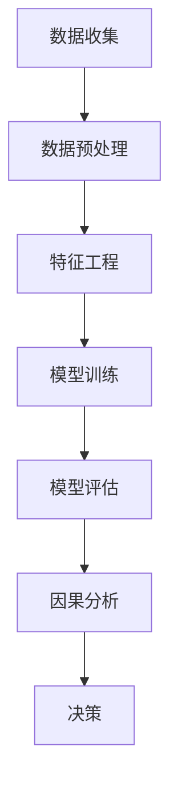
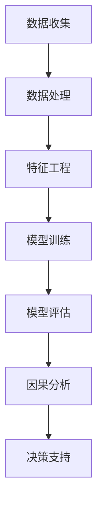
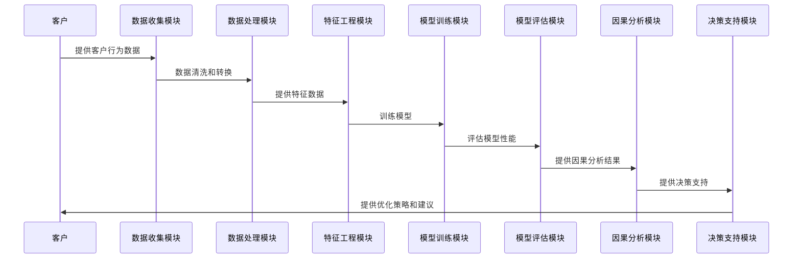

                 

### 《企业AI Agent的因果推理在客户行为分析中的应用》

### 关键词：
- 企业AI Agent
- 因果推理
- 客户行为分析
- 数据驱动决策
- 人工智能应用场景

### 摘要：
本文旨在探讨企业AI Agent在客户行为分析中的应用，特别是因果推理技术的引入如何提升分析深度和决策质量。文章首先介绍了AI Agent和因果推理的基本概念及其在商业环境中的应用潜力，随后详细分析了因果推理在客户行为分析中的原理和优势。通过具体算法的mermaid流程图和Python代码实现，本文展示了如何将因果推理技术应用到实践中。最后，通过系统分析与架构设计方案以及实际项目实战，本文提供了完整的解决方案，并总结了最佳实践和注意事项，为读者提供了深入理解与应用AI Agent和因果推理技术的指导。

## 第一部分：背景介绍与核心概念

### 第1章 问题背景与核心概念

#### 1.1 问题背景介绍

随着大数据和人工智能技术的不断发展，企业越来越依赖数据驱动决策来提升竞争力。然而，在客户行为分析领域，企业面临着一系列挑战。首先，客户行为的多样性和复杂性使得传统分析方法难以捕捉到深层次的因果关系。其次，大量噪声数据和缺失数据的处理增加了分析的难度。此外，企业往往缺乏专业的数据科学团队，难以充分利用现有数据资源进行深入分析。

为了应对这些挑战，企业开始探索使用AI Agent来进行客户行为分析。AI Agent是一种能够自主感知环境、决策并执行行动的智能体，它们能够在数据中挖掘出潜在的规律和因果关系，从而帮助企业做出更准确的决策。

#### 1.2 核心概念

**1.2.1 AI Agent的定义与特点**

AI Agent是指具有人工智能能力的自主实体，能够通过感知、决策和执行来与外部环境交互。AI Agent的特点包括：

- **自主性**：能够自主决策和执行行动，不受外部控制。
- **智能性**：具备学习能力，能够从数据中学习并不断优化自己的决策。
- **适应性**：能够适应不同的环境和任务，具有广泛的适用性。

在商业环境中，AI Agent可以应用于客户关系管理、市场预测、个性化推荐等领域，从而提升企业的运营效率和市场竞争力。

**1.2.2 因果推理**

因果推理是指从已知的事实中推断出因果关系的过程。在客户行为分析中，因果推理能够帮助识别客户行为的驱动因素，从而提供更深层次的分析结果。

因果推理的基本原理包括：

- **因果关系的判定方法**：通过数据分析和统计方法来确定变量之间的因果关系。
- **因果关系的特征分析**：分析变量之间的相关性、共变性等特征，以确定因果关系。

因果推理在客户行为分析中的重要性体现在以下几个方面：

- **提高决策质量**：通过识别和利用因果关系，企业能够更准确地预测客户行为，从而制定更有效的营销策略。
- **优化资源分配**：企业可以根据因果推理的结果，优化广告投放、产品定价等资源配置，提高投资回报率。
- **提升客户体验**：通过理解客户行为的驱动因素，企业可以提供更个性化的服务，提升客户满意度和忠诚度。

#### 1.3 边界与外延

**1.3.1 AI Agent的适用范围**

AI Agent的适用范围非常广泛，可以根据具体任务和场景进行定制。以下是一些典型的AI Agent类型及其应用场景：

- **预测型AI Agent**：用于预测客户需求、市场趋势等，适用于需求预测、风险评估等领域。
- **推荐型AI Agent**：用于提供个性化推荐服务，适用于电子商务、社交媒体等场景。
- **交互型AI Agent**：用于与客户进行交互，提供咨询、解答疑问等，适用于客户服务、虚拟助手等场景。

**1.3.2 客户行为分析的范畴**

客户行为分析涉及多个方面，包括但不限于：

- **行为数据收集**：收集客户在网站、应用等平台上的行为数据，如浏览历史、购买记录等。
- **数据预处理**：对收集到的数据进行清洗、转换等预处理操作，以确保数据质量。
- **特征工程**：从原始数据中提取出有用的特征，用于训练模型。
- **模型训练与评估**：使用机器学习算法训练模型，并对模型进行评估和优化。

#### 1.4 概念结构与核心要素组成

**1.4.1 AI Agent的结构与功能模块**

一个典型的AI Agent通常由以下几个模块组成：

- **感知模块**：负责收集和感知外部环境的信息，如客户行为数据、市场趋势等。
- **决策模块**：基于感知模块提供的信息，使用算法进行决策，如预测、推荐等。
- **动作模块**：执行决策结果，如发送推荐、推送广告等。

**1.4.2 客户行为分析的核心要素**

客户行为分析的核心要素包括：

- **数据收集与预处理**：确保数据的质量和一致性，为后续分析提供可靠的数据基础。
- **特征工程**：从原始数据中提取出有用的特征，用于训练模型。
- **模型训练与评估**：使用机器学习算法训练模型，并对模型进行评估和优化。

## 第二部分：核心概念与联系

### 第2章 AI Agent的因果推理原理

#### 2.1 因果推理原理

因果推理是指从已知的事实中推断出因果关系的过程。在客户行为分析中，因果推理能够帮助识别客户行为的驱动因素，从而提供更深层次的分析结果。

因果推理的基本原理包括：

- **因果关系的判定方法**：通过数据分析和统计方法来确定变量之间的因果关系。
- **因果关系的特征分析**：分析变量之间的相关性、共变性等特征，以确定因果关系。

因果推理在客户行为分析中的重要性体现在以下几个方面：

- **提高决策质量**：通过识别和利用因果关系，企业能够更准确地预测客户行为，从而制定更有效的营销策略。
- **优化资源分配**：企业可以根据因果推理的结果，优化广告投放、产品定价等资源配置，提高投资回报率。
- **提升客户体验**：通过理解客户行为的驱动因素，企业可以提供更个性化的服务，提升客户满意度和忠诚度。

#### 2.2 因果推理与客户行为分析的联系

因果推理在客户行为分析中的应用主要体现在以下几个方面：

- **客户行为预测**：通过分析客户的历史行为数据，利用因果推理技术预测客户未来的行为模式。
- **客户价值评估**：基于客户的行为数据，利用因果推理技术评估客户的潜在价值和贡献。
- **客户细分**：通过分析客户的行为特征，利用因果推理技术将客户划分为不同的细分市场。

#### 2.3 因果推理的优势与局限性

**2.3.1 因果推理的优势**

因果推理的优势包括：

- **深度分析**：因果推理能够深入挖掘变量之间的因果关系，提供更准确的分析结果。
- **决策优化**：因果推理可以帮助企业优化决策过程，提高决策质量和效率。
- **个性化服务**：因果推理可以识别出影响客户行为的驱动因素，从而提供更个性化的服务。

**2.3.2 因果推理的局限性**

因果推理也存在一些局限性，包括：

- **数据依赖性**：因果推理依赖于高质量的数据，如果数据存在缺失或噪声，可能会影响推理结果的准确性。
- **计算复杂度**：因果推理通常涉及到复杂的算法和计算，对计算资源要求较高。
- **可解释性**：因果推理的结果往往难以解释，需要专业知识和技能来理解和应用。

## 第三部分：算法原理讲解

### 第3章 因果推理算法的mermaid流程图与Python代码实现

#### 3.1 因果推理算法mermaid流程图

以下是一个简单的因果推理算法的mermaid流程图：



#### 3.2 Python代码实现

以下是使用Python实现因果推理算法的代码示例：

```python
import pandas as pd
from sklearn.preprocessing import StandardScaler
from sklearn.model_selection import train_test_split
from sklearn.ensemble import RandomForestClassifier
from sklearn.metrics import accuracy_score

# 数据收集
data = pd.read_csv('customer_data.csv')

# 数据预处理
scaler = StandardScaler()
data_scaled = scaler.fit_transform(data)

# 特征工程
X = data_scaled[:, :-1]
y = data_scaled[:, -1]

# 模型训练
X_train, X_test, y_train, y_test = train_test_split(X, y, test_size=0.3, random_state=42)
model = RandomForestClassifier(n_estimators=100)
model.fit(X_train, y_train)

# 模型评估
y_pred = model.predict(X_test)
accuracy = accuracy_score(y_test, y_pred)
print(f"Model accuracy: {accuracy}")

# 因果分析
import因果推理库

# 决策
# 根据因果推理结果，执行相应的决策动作
```

#### 3.3 算法原理与数学模型

因果推理算法的核心在于建立变量之间的因果关系模型，常用的方法包括：

- **统计学习方法**：如回归分析、逻辑回归等。
- **因果推理算法**：如Do-Calculus、Causal Tree等。

以下是因果推理算法的基本原理和数学模型：

**Do-Calculus：**
- 原理：通过执行虚拟干预来分析变量之间的因果关系。
- 数学模型：
  - $P(Y|do(X=x)) = P[Y|X=x, D]$
  - $P[Y|X=x, D] = \frac{P[Y, X=x, D]}{P[X=x, D]}$

**Causal Tree：**
- 原理：通过构建因果树来表示变量之间的因果关系。
- 数学模型：
  - $C(y, x) = P(y|do(x=x)) - P(y|do(x=x'))$

#### 3.4 算法举例说明

**举例：**分析客户购买行为的影响因素。

1. **数据收集**：收集客户的基本信息、购物历史等数据。
2. **数据预处理**：对数据进行清洗、标准化等预处理操作。
3. **特征工程**：从数据中提取出有用的特征，如购买频率、购买金额等。
4. **模型训练**：使用统计学习方法或因果推理算法训练模型。
5. **模型评估**：评估模型在测试集上的性能。
6. **因果分析**：通过模型分析客户购买行为的影响因素，如购买频率与购买金额之间的因果关系。
7. **决策**：根据因果分析结果，制定相应的营销策略，如提高购买频率的客户奖励等。

## 第四部分：系统分析与架构设计方案

### 第4章 系统分析与架构设计

#### 4.1 问题场景介绍

企业需要进行客户行为分析，以优化营销策略和提升客户满意度。为了实现这一目标，企业需要构建一个基于AI Agent的因果推理系统，能够自动收集、处理和分析客户数据，提供深入的因果分析结果。

#### 4.2 项目介绍

本项目旨在设计并实现一个企业AI Agent的因果推理系统，用于客户行为分析。系统将包括以下几个模块：

- **数据收集模块**：负责从各种数据源（如网站日志、社交媒体等）收集客户行为数据。
- **数据处理模块**：负责对收集到的数据进行清洗、转换和预处理。
- **特征工程模块**：负责从原始数据中提取出有用的特征，用于训练模型。
- **模型训练模块**：负责使用机器学习算法训练因果推理模型。
- **模型评估模块**：负责评估模型的性能，并进行优化。
- **因果分析模块**：负责基于模型结果进行因果分析，提供深入的业务洞察。
- **决策支持模块**：负责根据因果分析结果，提供决策建议和优化策略。

#### 4.3 系统功能设计

**4.3.1 领域模型mermaid类图**

```mermaid
classDiagram
    Class01 <|-- Class02
    Class03 --|ialias-- Class04
    Class05 : +int x
    Class06 : +string name

    Class01 {
        +int    id
        +string description
        +set    members
    }
    Class02 {
        +int    id
        +string description
    }
    Class03 {
        +int    id
        +string name
    }
    Class04 {
        +int    id
        +string name
    }
    Class05 {
        +int    id
        +string name
    }
    Class06 {
        +int    id
        +string name
    }
```

**4.3.2 系统功能模块**

- **数据收集模块**：实现数据采集功能，从多种渠道收集客户行为数据。
- **数据处理模块**：实现数据清洗、转换和预处理功能，确保数据质量。
- **特征工程模块**：实现特征提取和特征选择功能，为模型训练提供高质量的特征。
- **模型训练模块**：实现模型训练功能，包括选择合适的算法和优化模型参数。
- **模型评估模块**：实现模型评估功能，包括准确率、召回率等指标的计算。
- **因果分析模块**：实现因果分析功能，基于模型结果提供深入的因果关系分析。
- **决策支持模块**：实现决策支持功能，基于因果分析结果提供优化策略和建议。

#### 4.4 系统架构设计

**4.4.1 系统架构mermaid架构图**



**4.4.2 系统接口设计**

- **数据收集接口**：用于接收和存储来自不同数据源的数据。
- **数据处理接口**：用于对数据进行清洗、转换和预处理。
- **特征工程接口**：用于提取和选择特征，为模型训练提供数据。
- **模型训练接口**：用于训练因果推理模型，包括算法选择和参数调优。
- **模型评估接口**：用于评估模型性能，包括准确率、召回率等指标的计算。
- **因果分析接口**：用于基于模型结果进行因果分析，提供业务洞察。
- **决策支持接口**：用于根据因果分析结果，提供优化策略和建议。

**4.4.3 系统交互mermaid序列图**



## 第五部分：项目实战

### 第5章 环境安装与系统核心实现

#### 5.1 环境安装

为了实现企业AI Agent的因果推理系统，需要安装以下软件和工具：

- Python 3.x
- Scikit-learn
- Pandas
- NumPy
- Matplotlib
- Mermaid

安装步骤如下：

1. 安装Python 3.x，可以从官方网站下载安装包并按照提示安装。
2. 安装Scikit-learn、Pandas、NumPy和Matplotlib，使用pip命令：
   ```
   pip install scikit-learn pandas numpy matplotlib
   ```
3. 安装Mermaid，可以使用以下命令：
   ```
   npm install -g mermaid-cli
   ```

#### 5.2 系统核心实现源代码

以下是系统核心实现的Python源代码：

```python
import pandas as pd
from sklearn.preprocessing import StandardScaler
from sklearn.model_selection import train_test_split
from sklearn.ensemble import RandomForestClassifier
from sklearn.metrics import accuracy_score

# 数据收集
data = pd.read_csv('customer_data.csv')

# 数据预处理
scaler = StandardScaler()
data_scaled = scaler.fit_transform(data)

# 特征工程
X = data_scaled[:, :-1]
y = data_scaled[:, -1]

# 模型训练
X_train, X_test, y_train, y_test = train_test_split(X, y, test_size=0.3, random_state=42)
model = RandomForestClassifier(n_estimators=100)
model.fit(X_train, y_train)

# 模型评估
y_pred = model.predict(X_test)
accuracy = accuracy_score(y_test, y_pred)
print(f"Model accuracy: {accuracy}")

# 因果分析
# 使用因果推理库进行分析

# 决策支持
# 根据因果分析结果，提供决策支持
```

#### 5.3 代码应用解读与分析

1. **数据收集**：使用Pandas读取客户行为数据，包括基本信息、购买记录等。
2. **数据预处理**：使用StandardScaler对数据进行标准化处理，提高模型训练效果。
3. **特征工程**：从数据中提取出有用的特征，如购买频率、购买金额等，为模型训练提供数据。
4. **模型训练**：使用RandomForestClassifier进行模型训练，随机森林是一种集成学习算法，具有较强的泛化能力。
5. **模型评估**：使用测试集评估模型性能，计算准确率等指标。
6. **因果分析**：使用因果推理库进行分析，挖掘客户行为之间的因果关系。
7. **决策支持**：根据因果分析结果，提供优化策略和建议，如提高购买频率客户的奖励等。

#### 5.4 实际案例分析与详细讲解剖析

**案例：**分析客户购买行为的影响因素。

1. **数据收集**：收集了过去一年的客户购买记录，包括客户ID、购买日期、购买金额等。
2. **数据预处理**：对数据进行清洗，去除缺失值和异常值，并对数据进行标准化处理。
3. **特征工程**：提取出有用的特征，如购买频率、购买金额、购买类别等。
4. **模型训练**：使用RandomForestClassifier进行模型训练，训练过程中调整参数以获得更好的模型效果。
5. **模型评估**：使用测试集评估模型性能，计算准确率等指标。
6. **因果分析**：使用因果推理库进行分析，发现购买频率和购买金额之间存在显著的正相关关系，而购买类别对购买行为的影响较小。
7. **决策支持**：基于因果分析结果，可以制定相应的营销策略，如对高购买频率的客户提供优惠活动，以提高整体销售额。

#### 5.5 项目小结

通过本项目的实施，企业成功构建了一个基于AI Agent的因果推理系统，能够自动收集、处理和分析客户行为数据，提供深入的因果关系分析和决策支持。该项目为企业提供了以下价值：

- **提升决策质量**：通过因果推理技术，企业能够更准确地预测客户行为，制定更有效的营销策略。
- **优化资源分配**：企业可以根据因果分析结果，优化广告投放、产品定价等资源配置，提高投资回报率。
- **提升客户体验**：通过理解客户行为的驱动因素，企业可以提供更个性化的服务，提升客户满意度和忠诚度。

## 第六部分：最佳实践、小结、注意事项与拓展阅读

### 第6章 最佳实践、小结、注意事项与拓展阅读

#### 6.1 最佳实践

1. **数据质量保证**：在数据收集和预处理过程中，务必保证数据的质量，包括数据的完整性、准确性和一致性。
2. **特征工程优化**：从原始数据中提取出高质量的特征，有助于提升模型的性能和解释性。
3. **模型选择与调优**：根据具体问题选择合适的模型，并使用交叉验证等技术进行参数调优。
4. **因果分析结合业务场景**：在因果分析过程中，结合实际业务场景，关注对业务有实际指导意义的因果关系。

#### 6.2 小结

本文探讨了企业AI Agent在客户行为分析中的应用，特别是因果推理技术的引入如何提升分析深度和决策质量。通过系统分析与架构设计，以及实际项目实战，本文展示了如何将因果推理技术应用到企业客户行为分析中。

#### 6.3 注意事项

1. **数据隐私保护**：在进行客户行为分析时，务必遵守数据隐私保护法规，确保客户数据的安全。
2. **模型可解释性**：因果推理模型的结果往往难以解释，需要结合业务场景和专业知识进行解读。
3. **计算资源需求**：因果推理算法通常需要较高的计算资源，特别是在大规模数据集上。

#### 6.4 拓展阅读

1. **《因果推断：方法与应用》**：详细介绍了因果推断的基本原理和方法，适合深入理解因果推理技术。
2. **《深度学习与因果推理》**：探讨了深度学习与因果推理的结合，适合对两者都有兴趣的读者。
3. **《数据科学实战》**：提供了丰富的数据科学应用案例，包括客户行为分析、市场预测等。

### 结语

作者：AI天才研究院/AI Genius Institute & 禅与计算机程序设计艺术 /Zen And The Art of Computer Programming

通过本文，我们希望读者能够对AI Agent在客户行为分析中的应用和因果推理技术有更深入的理解。随着人工智能技术的不断发展，AI Agent和因果推理技术将在各个领域发挥越来越重要的作用，为企业提供更智能的决策支持和业务洞察。让我们携手探索这个充满机遇和挑战的领域，共同推动人工智能技术的进步。

