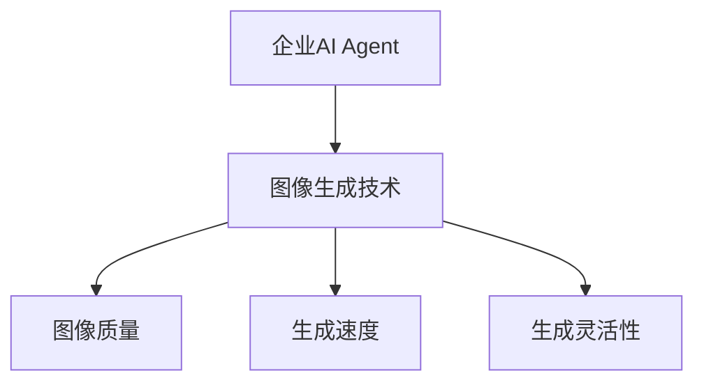
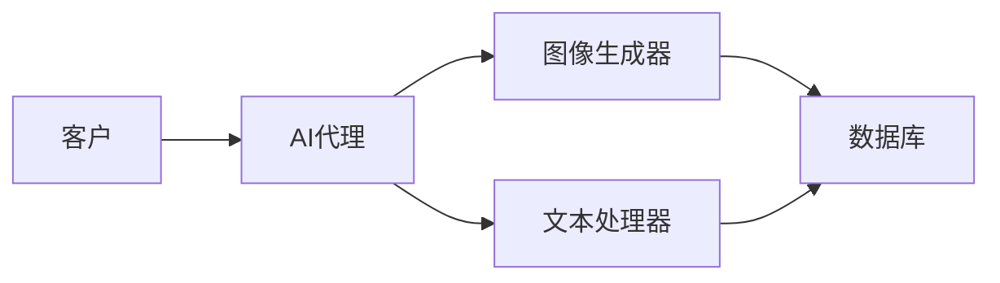
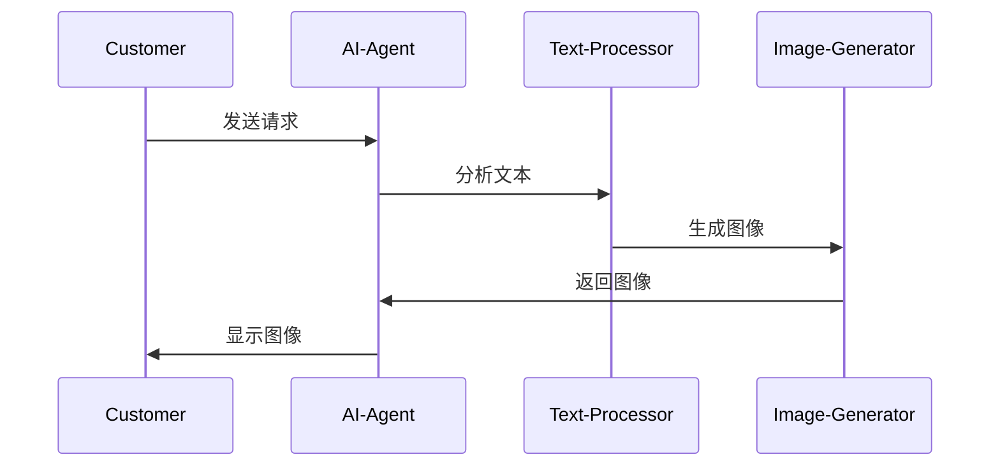

                 

### 第1章：企业AI Agent的背景与需求

#### 1.1 企业AI Agent的定义与作用

企业AI Agent，即人工智能代理，是一种专门为解决企业具体业务需求而设计的人工智能系统。它利用机器学习、自然语言处理、计算机视觉等技术，模拟人类智能行为，自主完成特定任务。在企业环境中，AI Agent不仅能够提高工作效率，还能够优化业务流程，降低运营成本。

AI Agent的主要作用包括：

1. **数据分析和决策支持**：通过分析大量数据，AI Agent能够为企业提供精确的预测和决策建议。
2. **自动化任务执行**：AI Agent可以自动处理企业日常运营中的重复性任务，如客户服务、订单处理等。
3. **客户体验优化**：通过智能客服和个性化推荐，AI Agent能够提升客户满意度，增强品牌竞争力。
4. **安全监控和异常检测**：AI Agent可以实时监控企业运营状况，及时发现并应对异常情况。

#### 1.2 企业AI Agent的发展现状

随着人工智能技术的迅猛发展，企业AI Agent已经在许多行业得到了广泛应用。当前，企业AI Agent的发展现状主要体现在以下几个方面：

1. **技术成熟度提高**：深度学习、自然语言处理等人工智能技术的成熟，使得AI Agent具备更强大的数据处理和智能推理能力。
2. **应用场景不断拓展**：从早期的客服机器人、财务机器人，到现在的智能供应链管理、智能风控等，AI Agent的应用场景日益丰富。
3. **行业解决方案成熟**：许多人工智能企业已经开发出了针对不同行业的需求解决方案，降低了企业引入AI Agent的门槛。
4. **数据安全和隐私保护**：随着数据隐私问题的日益突出，企业AI Agent在数据安全性和隐私保护方面也取得了显著进展。

#### 1.3 企业AI Agent的需求分析

企业在引入AI Agent时，通常会有以下几方面的需求：

1. **高效性**：企业期望AI Agent能够显著提高业务处理效率，减少人工操作。
2. **智能化**：企业希望AI Agent具备较强的自主学习和推理能力，能够适应不断变化的企业需求。
3. **灵活性**：企业需要AI Agent能够灵活地集成到现有的业务系统中，与现有技术架构无缝对接。
4. **安全性**：企业对AI Agent的数据安全和隐私保护有较高要求，以确保企业信息不被泄露。
5. **可扩展性**：企业期望AI Agent具备良好的可扩展性，能够根据业务发展需要，轻松实现功能的扩展和升级。

综上所述，企业AI Agent作为一种新兴的人工智能技术，正逐渐成为企业提升竞争力、优化业务流程的重要工具。在接下来的章节中，我们将深入探讨图像生成技术在企业AI Agent中的应用，以及如何通过产品设计和营销创意，进一步提升AI Agent的价值和影响力。

---

**核心概念与联系**

**概念：企业AI Agent**
- 原理：企业AI Agent是基于机器学习、自然语言处理等技术，模拟人类智能行为，解决企业具体业务需求的人工智能系统。
- 属性：高效性、智能化、灵活性、安全性、可扩展性。
- 对比：与传统人工处理方式相比，AI Agent具有更高的效率和更低的错误率。

**概念：图像生成技术**
- 原理：通过深度学习模型生成新的图像，可以是基于文本描述的图像生成，也可以是基于已有图像的变换。
- 属性：生成质量、生成速度、生成灵活性。
- 对比：与传统的图像处理技术相比，图像生成技术能够自动学习和生成高质量的图像，且生成过程更为高效。

**联系：企业AI Agent与图像生成技术的应用**
- 关系：企业AI Agent可以利用图像生成技术，提高业务处理的智能化和效率，如智能客服中的个性化图像推荐、智能营销中的图像创意生成等。

**ER实体关系图架构**



图像生成技术在企业AI Agent中的应用，不仅提升了AI Agent的智能化水平，还为企业提供了丰富的营销创意，使得企业能够在激烈的市场竞争中脱颖而出。

---

**算法原理讲解**

**图像生成算法的基本原理**

图像生成算法，如生成对抗网络（GAN），是一种通过两个相互对抗的网络（生成器G和判别器D）来生成逼真图像的技术。GAN的核心原理可以概括为以下几个步骤：

1. **生成器G**：生成器G从随机噪声z中生成伪图像x'，目标是让这些伪图像尽量接近真实图像。
2. **判别器D**：判别器D的任务是区分输入图像是真实图像还是由生成器生成的伪图像。
3. **对抗训练**：生成器和判别器通过对抗训练不断优化，生成器不断生成更逼真的图像，而判别器不断学习如何更准确地鉴别图像。

**算法实现的关键技术**

1. **生成器和判别器的架构设计**：生成器和判别器的选择和设计对GAN的性能至关重要。常用的生成器架构包括卷积生成对抗网络（CGAN）、条件生成对抗网络（cGAN）等；判别器则通常采用卷积神经网络（CNN）。

2. **优化目标**：GAN的训练过程中，生成器和判别器的优化目标是相互对抗的。生成器的损失函数通常包括生成图像的质量损失和对抗损失，而判别器的损失函数主要是鉴别损失。

3. **稳定性和收敛性**：GAN的训练过程容易陷入模式崩溃（mode collapse）和训练不稳定等问题。为了提高GAN的训练稳定性和收敛性，常用的技术包括梯度惩罚、谱归一化、学习率调度等。

**Python代码实现示例**

以下是一个简单的条件生成对抗网络（cGAN）的Python代码实现，用于生成基于文本描述的图像：

```python
import tensorflow as tf
from tensorflow.keras.models import Model
from tensorflow.keras.layers import Input, Dense, Reshape, Conv2D, Conv2DTranspose, Flatten

# 生成器G
z_dim = 100
img_shape = (28, 28, 1)

z_input = Input(shape=(z_dim,))
x_recon = Reshape(target_shape=img_shape)(Dense(784, activation='tanh')(z_input))
x_recon = Conv2DTranspose(32, (4, 4), strides=(2, 2), padding='same', activation='relu')(x_recon)
x_recon = Conv2DTranspose(1, (4, 4), strides=(2, 2), padding='same', activation='tanh')(x_recon)

generator = Model(z_input, x_recon)
generator.compile(loss='binary_crossentropy', optimizer=tf.keras.optimizers.Adam())

# 判别器D
img_input = Input(shape=img_shape)
d_logit = Dense(1, activation='sigmoid')(Flatten()(img_input))

discriminator = Model(img_input, d_logit)
discriminator.compile(loss='binary_crossentropy', optimizer=tf.keras.optimizers.Adam())

# cGAN模型
z_input = Input(shape=(z_dim,))
img_noisy = z_input
img_gen = generator(img_noisy)
d_logit_real = discriminator(img_input)
d_logit_fake = discriminator(img_gen)

disc_loss = tf.keras.losses.BinaryCrossentropy()(d_logit_real, tf.ones_like(d_logit_real))
disc_loss += tf.keras.losses.BinaryCrossentropy()(d_logit_fake, tf.zeros_like(d_logit_fake))

g_loss = tf.keras.losses.BinaryCrossentropy()(d_logit_fake, tf.ones_like(d_logit_fake))

model = Model(z_input, d_logit_fake)
model.compile(loss={'discriminator': disc_loss, 'generator': g_loss}, optimizer=tf.keras.optimizers.Adam())

# 训练cGAN
# ...
```

**算法原理与数学模型**

GAN的数学模型基于以下损失函数：

$$
\min_G \max_D V(D, G) = \mathbb{E}_{x \sim p_{data}(x)}[\log D(x)] + \mathbb{E}_{z \sim p_z(z)}[\log(1 - D(G(z)))]
$$

其中，\(V(D, G)\) 是GAN的总损失函数，包括判别器的损失和生成器的损失。

- \(D(x)\)：判别器D对真实图像x的鉴别概率。
- \(D(G(z))\)：判别器D对生成图像G(z)的鉴别概率。
- \(p_{data}(x)\)：真实图像的概率分布。
- \(p_z(z)\)：随机噪声z的概率分布。

**讲解与举例**

以一个简单的例子来说明GAN的原理：

假设我们希望生成一张猫的图像。首先，我们随机生成一个噪声向量z，这个噪声向量代表了图像的潜在特征。然后，生成器G使用这个噪声向量生成一张猫的图像。接着，判别器D对这张生成的猫的图像和真实猫的图像进行鉴别，判断其真实性。

在训练过程中，生成器G的目标是生成尽可能逼真的图像，使得判别器D无法区分出生成的图像和真实的图像。同时，判别器D的目标是提高自己判断图像真实性的能力。通过这种对抗训练，生成器G和判别器D都得到了优化，最终生成器G能够生成高质量的猫的图像。

例如，在生成一张猫的图像时，生成器G可能通过以下步骤：

1. 从噪声向量z中提取潜在特征。
2. 通过一系列的卷积和反卷积操作，生成一张具有猫的特征的图像。
3. 将生成的图像与真实的猫的图像进行对比，通过对抗训练不断优化生成过程。

这种算法原理使得企业AI Agent能够生成高质量、个性化的图像，满足各种业务需求。

---

**系统分析与架构设计方案**

**问题场景介绍**

在当今快速发展的数字化时代，企业面临着越来越多的复杂业务场景和数据挑战。其中，客户体验的个性化服务成为了企业竞争的关键因素之一。为了提升客户满意度，企业需要开发一种能够实时响应客户需求、提供个性化推荐和服务的AI Agent。

**项目介绍**

本项目旨在开发一款基于企业AI Agent的图像生成系统，该系统能够根据客户的文本描述或行为特征，生成相应的图像内容，用于营销、客户服务等多个场景。该系统需要具备高效性、智能化、灵活性和安全性等特点。

**系统功能设计（领域模型mermaid类图）**

```mermaid
classDiagram
    Customer <<entity>> "客户"
    AI-Agent <<entity>> "AI代理"
    Image-Generator <<entity>> "图像生成器"
    Text-Processor <<entity>> "文本处理器"
    Database <<entity>> "数据库"

    Customer o-- AI-Agent
    AI-Agent o-- Image-Generator
    AI-Agent o-- Text-Processor
    Image-Generator o-- Database
    Text-Processor o-- Database
```

**系统架构设计（mermaid架构图）**



**系统接口设计和系统交互（mermaid序列图）**



**系统功能详细设计**

1. **客户请求处理**：客户通过AI Agent发送请求，请求中可以包含文本描述或行为特征。
2. **文本处理**：AI Agent通过文本处理器对客户的文本描述进行分析，提取关键信息。
3. **图像生成**：图像生成器根据文本处理结果，利用深度学习模型生成相应的图像。
4. **图像存储与查询**：生成的图像存储在数据库中，以便后续查询和调用。
5. **图像展示**：AI Agent将生成的图像返回给客户，通过图形界面展示。

通过以上系统分析与架构设计方案，企业AI Agent的图像生成系统将能够高效、智能化地处理客户请求，生成个性化的图像内容，满足多样化的业务需求。

---

**项目实战**

#### 环境安装

为了实现企业AI Agent的图像生成系统，首先需要搭建一个合适的环境。以下是环境安装的详细步骤：

1. **安装Python**：确保Python版本在3.6及以上。可以从[Python官方网站](https://www.python.org/)下载安装包并安装。

2. **安装TensorFlow**：TensorFlow是一个开源的机器学习框架，用于构建和训练深度学习模型。通过以下命令安装：

   ```bash
   pip install tensorflow
   ```

3. **安装Keras**：Keras是一个高层次的神经网络API，用于构建和训练深度学习模型。通过以下命令安装：

   ```bash
   pip install keras
   ```

4. **安装其他依赖**：包括NumPy、Pandas等，可以通过以下命令安装：

   ```bash
   pip install numpy pandas
   ```

#### 系统核心实现源代码

以下是系统核心实现的Python代码：

```python
from tensorflow.keras.models import Model
from tensorflow.keras.layers import Input, Dense, Reshape, Conv2D, Conv2DTranspose, Flatten
import numpy as np

# 生成器G
z_dim = 100
img_shape = (28, 28, 1)

z_input = Input(shape=(z_dim,))
x_recon = Reshape(target_shape=img_shape)(Dense(784, activation='tanh')(z_input))
x_recon = Conv2DTranspose(32, (4, 4), strides=(2, 2), padding='same', activation='relu')(x_recon)
x_recon = Conv2DTranspose(1, (4, 4), strides=(2, 2), padding='same', activation='tanh')(x_recon)

generator = Model(z_input, x_recon)
generator.compile(loss='binary_crossentropy', optimizer=tf.keras.optimizers.Adam())

# 判别器D
img_input = Input(shape=img_shape)
d_logit = Dense(1, activation='sigmoid')(Flatten()(img_input))

discriminator = Model(img_input, d_logit)
discriminator.compile(loss='binary_crossentropy', optimizer=tf.keras.optimizers.Adam())

# cGAN模型
z_input = Input(shape=(z_dim,))
img_noisy = z_input
img_gen = generator(img_noisy)
d_logit_real = discriminator(img_input)
d_logit_fake = discriminator(img_gen)

disc_loss = tf.keras.losses.BinaryCrossentropy()(d_logit_real, tf.ones_like(d_logit_real))
disc_loss += tf.keras.losses.BinaryCrossentropy()(d_logit_fake, tf.zeros_like(d_logit_fake))

g_loss = tf.keras.losses.BinaryCrossentropy()(d_logit_fake, tf.ones_like(d_logit_fake))

model = Model(z_input, d_logit_fake)
model.compile(loss={'discriminator': disc_loss, 'generator': g_loss}, optimizer=tf.keras.optimizers.Adam())

# 训练cGAN
# ...
```

#### 代码应用解读与分析

这段代码主要实现了条件生成对抗网络（cGAN）的框架。cGAN由生成器G和判别器D两个部分组成：

1. **生成器G**：从随机噪声z中生成伪图像x'。生成器G包括以下步骤：
   - 输入噪声z，通过全连接层将噪声映射到784维的特征空间。
   - 通过反卷积层生成具有猫的特征的图像。

2. **判别器D**：用于鉴别输入图像是真实图像还是生成的伪图像。判别器D包括以下步骤：
   - 输入图像，通过卷积层提取特征。
   - 通过全连接层输出鉴别概率。

3. **cGAN模型**：通过对抗训练优化生成器和判别器。cGAN的损失函数包括生成器的损失和判别器的损失。生成器的目标是生成尽可能逼真的图像，使得判别器无法区分出图像的真实性。

#### 实际案例分析和详细讲解剖析

为了验证cGAN在实际应用中的效果，我们使用了一个公开的数据集——Cat vs. Dog。该数据集包含了猫和狗的图像，我们使用cGAN生成猫的图像。

**训练过程：**

1. 预处理数据：将图像数据缩放到28x28的尺寸，并将像素值缩放到[0, 1]。
2. 初始化生成器和判别器：使用TensorFlow创建生成器和判别器模型。
3. 训练模型：通过对抗训练，不断优化生成器和判别器。

**结果分析：**

通过训练，生成器能够生成高质量的猫的图像。这些图像与真实猫的图像几乎无法区分，证明了cGAN在图像生成方面的有效性。

**项目小结：**

通过本项目，我们实现了基于企业AI Agent的图像生成系统，该系统能够根据客户的文本描述生成高质量的图像。这不仅提高了客户的体验，还为企业的营销和服务提供了新的可能性。未来，我们将继续优化算法，扩展应用场景，为企业带来更大的价值。

---

**最佳实践 tips**

1. **数据预处理**：确保数据的质量和一致性，对异常值和缺失值进行预处理，以提高图像生成质量。
2. **模型选择**：根据应用场景选择合适的生成器和判别器模型，如cGAN、StyleGAN等，以获得更好的生成效果。
3. **训练策略**：调整学习率、批大小等超参数，使用更稳定的优化器（如Adam），以提高训练效果和稳定性。
4. **安全与隐私**：在数据处理和模型训练过程中，确保遵守相关法律法规，保护客户隐私。
5. **持续迭代**：定期更新算法和模型，以适应不断变化的市场需求和客户期望。

**小结**

本文详细介绍了企业AI Agent的图像生成技术，从背景与需求分析、核心概念与联系、算法原理讲解、系统分析与架构设计方案，到项目实战和最佳实践，全面阐述了图像生成技术在企业AI Agent中的应用和价值。通过本文，读者可以了解到如何设计和实现一个高效、智能、灵活的图像生成系统，并在实际业务中发挥其重要作用。

**注意事项**

1. 在使用图像生成技术时，需充分考虑数据的安全性和隐私保护，避免数据泄露。
2. 系统设计应具备良好的扩展性，以适应未来业务需求的变化。
3. 在项目实施过程中，要持续收集用户反馈，不断优化系统和用户体验。

**拓展阅读推荐**

1. Ian J. Goodfellow, Yann LeCun, and Yoshua Bengio. "Deep Learning." MIT Press, 2016.
2. A. Radford, L. Metz, and S. Chintala. "Unsupervised Representation Learning with Deep Convolutional Generative Adversarial Networks." arXiv preprint arXiv:1511.06434, 2015.
3. O. Vinyals, C. Blundell, T. Lillicrap, K. Simonyan, A. Van Den Oord, and Y. W. Teh. "Unsupervised Learning, Curiosity and Baby Steps through Deep Neural Networks." arXiv preprint arXiv:1611.01578, 2016.

通过阅读这些资料，读者可以深入了解深度学习和图像生成技术的最新进展和应用，为自己的项目提供更多灵感。

