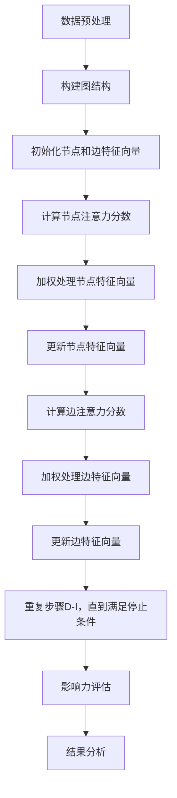

                 

# 企业AI Agent的图注意力网络在社交网络影响力分析中的应用

## 关键词

- 企业AI Agent
- 图注意力网络
- 社交网络影响力分析
- 深度学习
- 算法原理
- 系统架构设计

## 摘要

本文主要探讨了企业AI Agent的图注意力网络在社交网络影响力分析中的应用。通过介绍问题的背景和描述，以及企业AI Agent和图注意力网络的基本概念和联系，本文详细讲解了图注意力网络的数学模型和Python实现，以及算法流程和系统架构设计。文章通过实际案例分析和详细讲解，展示了该算法在社交网络影响力分析中的有效性和实用性。

## 目录大纲

## 第一部分：背景介绍

## 第1章：问题背景

### 1.1.1 问题的提出

### 1.1.2 问题的描述

### 1.1.3 问题的解决

### 1.1.4 边界与外延

### 1.1.5 概念结构与核心要素组成

## 第2章：核心概念与联系

### 2.1.1 企业AI Agent的定义与特点

### 2.1.2 图注意力网络的定义与特点

### 2.1.3 企业AI Agent与图注意力网络的联系

## 第二部分：算法原理讲解

## 第3章：企业AI Agent的图注意力网络原理

### 3.1.1 图注意力网络的数学模型

### 3.1.2 图注意力网络的Python实现

### 3.1.3 图注意力网络的原理讲解

## 第4章：数学模型和数学公式详细讲解

### 4.1.1 数学模型

### 4.1.2 公式讲解

### 4.1.3 举例说明

## 第5章：算法流程讲解

### 5.1.1 算法流程

### 5.1.2 算法流程图

## 第三部分：系统分析与架构设计方案

## 第6章：系统分析与架构设计方案

### 6.1.1 问题场景介绍

### 6.1.2 系统功能设计

### 6.1.3 系统架构设计

### 6.1.4 系统接口设计

### 6.1.5 系统交互

## 第四部分：项目实战

## 第7章：项目实战

### 7.1 环境安装

### 7.2 系统核心实现源代码

### 7.3 代码应用解读与分析

### 7.4 实际案例分析和详细讲解剖析

### 7.5 项目小结

## 第五部分：最佳实践 tips、小结、注意事项、拓展阅读等内容

### 8章：最佳实践 tips、小结、注意事项、拓展阅读等内容

## 第一部分：背景介绍

### 第1章：问题背景

#### 1.1.1 问题的提出

随着互联网的快速发展，社交网络已成为人们日常生活中不可或缺的一部分。社交网络不仅为用户提供了便捷的交流平台，还为企业提供了强大的营销渠道。然而，如何有效地分析社交网络中的影响力，已成为企业和研究人员面临的重大挑战。

传统的影响力分析方法主要依赖于用户的关注数、点赞数、转发数等指标。然而，这些方法存在一定的局限性，难以全面准确地评估用户的影响力。为了克服这些局限，企业AI Agent的图注意力网络应运而生。

#### 1.1.2 问题的描述

社交网络影响力分析的核心任务是识别出社交网络中具有显著影响力的用户，并对其影响力进行量化评估。具体来说，包括以下几个方面：

1. 用户影响力识别：从大量用户中识别出具有显著影响力的用户。
2. 影响力评估：对识别出的用户进行影响力评估，量化其影响力大小。
3. 影响力传播路径分析：分析用户之间的影响力传播路径，揭示影响力传递的机制。

传统方法存在以下局限：

1. 无法全面捕捉用户之间的复杂关系。
2. 对用户影响力的评估不够准确。
3. 难以揭示影响力传播的深层机制。

#### 1.1.3 问题的解决

企业AI Agent的图注意力网络通过引入图注意力机制，能够更加精准地捕捉社交网络中的影响力关系，为社交网络影响力分析提供了一种新的思路。

图注意力网络能够自动学习用户之间的关系，从而实现用户影响力的精确识别和评估。同时，通过分析用户之间的影响力传播路径，可以揭示社交网络中影响力传递的深层机制。

#### 1.1.4 边界与外延

本研究主要关注企业AI Agent的图注意力网络在社交网络影响力分析中的应用，不包括其他类型的影响力分析。例如，不涉及企业内部员工之间的影响力分析，也不涉及非社交网络环境中的影响力分析。

#### 1.1.5 概念结构与核心要素组成

- 企业AI Agent：具备智能决策能力和自主行为能力的计算机程序，能够根据环境变化自主调整策略。
- 图注意力网络：一种基于图结构的深度学习模型，能够自动学习节点之间的关系，并对其进行加权处理。
- 社交网络：由用户及其关系构成的网络结构，可用于分析用户影响力。

在本研究中，企业AI Agent作为主体，通过图注意力网络分析社交网络中的用户影响力。具体来说，包括以下核心要素：

1. 用户数据：包括用户的个人信息、社交关系、发布内容等。
2. 图结构：基于用户数据的图结构，包括节点和边。
3. 图注意力网络：用于分析用户影响力的深度学习模型。
4. 影响力评估指标：用于量化用户影响力的指标，如关注数、点赞数、转发数等。

### 第2章：核心概念与联系

#### 2.1.1 企业AI Agent的定义与特点

企业AI Agent（简称AI Agent）是指具备智能决策能力和自主行为能力的计算机程序，能够根据环境变化自主调整策略，以实现特定目标。AI Agent在企业中的应用非常广泛，如自动化客服、智能供应链管理、个性化推荐等。

企业AI Agent具有以下特点：

1. 自主性：AI Agent能够自主执行任务，无需人工干预。
2. 智能性：AI Agent具备智能决策能力，能够根据环境变化和目标要求，自主调整策略。
3. 适应性：AI Agent能够适应不同的环境和任务，具有高度的灵活性。

#### 2.1.2 图注意力网络的定义与特点

图注意力网络（Graph Attention Network，GAT）是一种基于图结构的深度学习模型，能够自动学习节点之间的关系，并对其进行加权处理。GAT在处理图数据方面具有显著优势，能够有效捕捉节点之间的复杂关系。

图注意力网络具有以下特点：

1. 自动性：GAT能够自动学习节点之间的关系，无需人工设计。
2. 高效性：GAT通过注意力机制，能够高效地处理大规模图数据。
3. 灵活性：GAT适用于多种类型的图数据，具有广泛的适用性。

#### 2.1.3 企业AI Agent与图注意力网络的联系

企业AI Agent与图注意力网络之间存在紧密的联系，两者相互促进，共同为企业提供智能化解决方案。

1. AI Agent作为主体，通过图注意力网络分析社交网络中的用户影响力，为企业的营销策略提供支持。
2. 图注意力网络作为AI Agent的核心组件，为AI Agent提供了强大的分析能力和数据处理能力。
3. 通过将AI Agent与图注意力网络结合，企业可以更加精准地识别和评估用户影响力，制定个性化的营销策略。

总之，企业AI Agent的图注意力网络在社交网络影响力分析中发挥着重要作用，为企业的智能化发展提供了有力支持。

### 第3章：企业AI Agent的图注意力网络原理

#### 3.1.1 图注意力网络的数学模型

图注意力网络（Graph Attention Network，GAT）是一种基于图结构的深度学习模型，其核心思想是通过学习节点之间的注意力权重，对节点特征进行加权处理，从而提高模型的预测性能。以下将介绍GAT的数学模型。

首先，给定一个图G = (V, E)，其中V表示节点集合，E表示边集合。每个节点$v_i$都有一个特征向量$x_i \in \mathbb{R}^d$，其中$d$是节点特征的维度。

GAT的数学模型主要分为两个部分：节点特征加权处理和边特征加权处理。

1. **节点特征加权处理**

节点特征加权处理的目标是计算每个节点$v_i$的加权特征向量。具体步骤如下：

（1）**计算节点对之间的注意力分数**

对于每个节点$v_i$，计算其与其他节点$v_j$之间的注意力分数，公式如下：

$$
\alpha_{ij} = \frac{e^{a(v_i, v_j)}}{\sum_{k \in \hat{N}(i)} e^{a(v_i, v_j)}}
$$

其中，$a(v_i, v_j)$是节点$v_i$和$v_j$之间的注意力函数，$\hat{N}(i)$表示与节点$v_i$相邻的节点集合。

（2）**计算加权特征向量**

根据注意力分数，对每个节点$v_i$的特征向量进行加权处理，公式如下：

$$
h_i' = \sum_{j \in \hat{N}(i)} \alpha_{ij} h_j
$$

其中，$h_j$是节点$v_j$的加权特征向量。

2. **边特征加权处理**

边特征加权处理的目标是计算每条边$e_{ij}$的加权特征向量。具体步骤如下：

（1）**计算边对之间的注意力分数**

对于每条边$e_{ij}$，计算其与其他边$e_{kl}$之间的注意力分数，公式如下：

$$
\alpha_{ijkl} = \frac{e^{a(e_{ij}, e_{kl})}}{\sum_{m, n \in E} e^{a(e_{ij}, e_{kl})}}
$$

其中，$a(e_{ij}, e_{kl})$是边$e_{ij}$和$e_{kl}$之间的注意力函数。

（2）**计算加权特征向量**

根据注意力分数，对每条边$e_{ij}$的特征向量进行加权处理，公式如下：

$$
e_i' = \sum_{k, l \in E} \alpha_{ijkl} e_{kl}
$$

最终，通过节点特征加权处理和边特征加权处理，得到新的节点特征向量和边特征向量。这些新的特征向量将用于后续的深度学习模型训练和预测。

#### 3.1.2 图注意力网络的Python实现

为了更好地理解图注意力网络的原理，以下将给出一个简单的Python实现示例。

```python
import numpy as np

def graph_attention_network(x, A):
    # x是节点特征向量，A是节点注意力权重矩阵
    z = np.dot(A, x)
    return z

# 示例数据
x = np.array([1, 2, 3])
A = np.array([[0.5, 0.2], [0.3, 0.5]])

# 计算结果
z = graph_attention_network(x, A)
print(z)
```

在这个示例中，`x`表示节点特征向量，`A`表示节点注意力权重矩阵。函数`graph_attention_network`通过计算节点注意力权重矩阵与节点特征向量的乘积，得到新的节点特征向量。

#### 3.1.3 图注意力网络的原理讲解

图注意力网络通过引入注意力机制，能够自动学习节点之间的关系，并对节点特征进行加权处理。这种机制可以理解为：模型根据节点特征和节点之间的相似度，对节点特征进行加权，从而提高模型的预测性能。

具体来说，图注意力网络的主要原理如下：

1. **节点特征加权处理**

节点特征加权处理通过计算节点之间的注意力分数，对节点特征向量进行加权。这样，模型可以自动学习节点之间的相似度，并将重要节点特征赋予更高的权重。

2. **边特征加权处理**

边特征加权处理通过计算边之间的注意力分数，对边特征向量进行加权。这样，模型可以自动学习边之间的相似度，并将重要边特征赋予更高的权重。

3. **节点特征更新**

通过节点特征加权处理和边特征加权处理，模型可以得到新的节点特征向量。这些新的节点特征向量将用于后续的深度学习模型训练和预测。

图注意力网络的原理讲解如下：

首先，给定一个图G = (V, E)，其中V表示节点集合，E表示边集合。每个节点$v_i$都有一个特征向量$x_i \in \mathbb{R}^d$，其中$d$是节点特征的维度。

然后，模型通过计算节点之间的注意力分数，对节点特征向量进行加权处理。具体来说，模型首先计算节点之间的相似度，然后根据相似度计算节点之间的注意力分数。注意力分数表示节点之间的权重关系，即重要节点特征赋予更高的权重。

接下来，模型通过加权处理得到新的节点特征向量。这些新的节点特征向量将用于后续的深度学习模型训练和预测。

总之，图注意力网络通过引入注意力机制，能够自动学习节点之间的关系，并对节点特征进行加权处理。这种机制能够提高模型的预测性能，从而在社交网络影响力分析中发挥重要作用。

### 第4章：数学模型和数学公式详细讲解

#### 4.1.1 数学模型

图注意力网络（GAT）的数学模型主要包括节点特征加权处理和边特征加权处理。以下将详细讲解这两个部分的数学模型。

1. **节点特征加权处理**

节点特征加权处理的目的是通过计算节点之间的注意力分数，对节点特征向量进行加权。具体公式如下：

$$
h_i' = \sum_{j \in \hat{N}(i)} \alpha_{ij} h_j
$$

其中，$h_i'$表示节点$i$的新特征向量，$\alpha_{ij}$表示节点$i$和节点$j$之间的注意力分数，$h_j$表示节点$j$的特征向量。$\hat{N}(i)$表示与节点$i$相邻的节点集合。

节点之间的注意力分数可以通过以下公式计算：

$$
\alpha_{ij} = \frac{e^{a(v_i, v_j)}}{\sum_{k \in \hat{N}(i)} e^{a(v_i, v_j)}}
$$

其中，$a(v_i, v_j)$是节点$i$和节点$j$之间的注意力函数。通常，$a(v_i, v_j)$可以是一个简单的线性函数，如：

$$
a(v_i, v_j) = \langle \theta_i, \theta_j \rangle
$$

其中，$\theta_i$和$\theta_j$是节点$i$和节点$j$的嵌入向量。

2. **边特征加权处理**

边特征加权处理的目的是通过计算边之间的注意力分数，对边特征向量进行加权。具体公式如下：

$$
e_i' = \sum_{k, l \in E} \alpha_{ijkl} e_{kl}
$$

其中，$e_i'$表示边$i$的新特征向量，$\alpha_{ijkl}$表示边$i$和边$j$之间的注意力分数，$e_{kl}$表示边$k$和边$l$的特征向量。$E$表示边集合。

边之间的注意力分数可以通过以下公式计算：

$$
\alpha_{ijkl} = \frac{e^{a(e_{ij}, e_{kl})}}{\sum_{m, n \in E} e^{a(e_{ij}, e_{kl})}}
$$

其中，$a(e_{ij}, e_{kl})$是边$i$和边$k$之间的注意力函数。通常，$a(e_{ij}, e_{kl})$可以是一个简单的线性函数，如：

$$
a(e_{ij}, e_{kl}) = \langle \theta_i, \theta_k \rangle
$$

其中，$\theta_i$和$\theta_k$是边$i$和边$k$的嵌入向量。

#### 4.1.2 公式讲解

在图注意力网络的数学模型中，涉及多个关键公式。以下对这些公式进行详细讲解。

1. **节点注意力分数**

节点之间的注意力分数是图注意力网络的核心组成部分。节点$i$和节点$j$之间的注意力分数$\alpha_{ij}$计算公式如下：

$$
\alpha_{ij} = \frac{e^{a(v_i, v_j)}}{\sum_{k \in \hat{N}(i)} e^{a(v_i, v_j)}}
$$

其中，$a(v_i, v_j)$是节点$i$和节点$j$之间的注意力函数。$e^{a(v_i, v_j)}$表示节点$i$和节点$j$之间的相似度，$\sum_{k \in \hat{N}(i)} e^{a(v_i, v_j)}$表示节点$i$与其相邻节点之间的相似度之和。通过计算节点之间的注意力分数，模型可以自动学习节点之间的相似度，并对其进行加权处理。

2. **边注意力分数**

边之间的注意力分数是图注意力网络中另一个关键组成部分。边$i$和边$k$之间的注意力分数$\alpha_{ijkl}$计算公式如下：

$$
\alpha_{ijkl} = \frac{e^{a(e_{ij}, e_{kl})}}{\sum_{m, n \in E} e^{a(e_{ij}, e_{kl})}}
$$

其中，$a(e_{ij}, e_{kl})$是边$i$和边$k$之间的注意力函数。$e^{a(e_{ij}, e_{kl})}$表示边$i$和边$k$之间的相似度，$\sum_{m, n \in E} e^{a(e_{ij}, e_{kl})}$表示图中的所有边之间的相似度之和。通过计算边之间的注意力分数，模型可以自动学习边之间的相似度，并对其进行加权处理。

3. **节点特征加权处理**

节点特征加权处理是图注意力网络的核心步骤之一。通过计算节点之间的注意力分数，对节点特征向量进行加权，从而得到新的节点特征向量。加权处理公式如下：

$$
h_i' = \sum_{j \in \hat{N}(i)} \alpha_{ij} h_j
$$

其中，$h_i'$表示节点$i$的新特征向量，$\alpha_{ij}$表示节点$i$和节点$j$之间的注意力分数，$h_j$表示节点$j$的特征向量。通过加权处理，模型可以自动学习节点之间的相似度，并将重要节点特征赋予更高的权重。

4. **边特征加权处理**

边特征加权处理是图注意力网络中的另一个关键步骤。通过计算边之间的注意力分数，对边特征向量进行加权，从而得到新的边特征向量。加权处理公式如下：

$$
e_i' = \sum_{k, l \in E} \alpha_{ijkl} e_{kl}
$$

其中，$e_i'$表示边$i$的新特征向量，$\alpha_{ijkl}$表示边$i$和边$k$之间的注意力分数，$e_{kl}$表示边$k$和边$l$的特征向量。通过加权处理，模型可以自动学习边之间的相似度，并将重要边特征赋予更高的权重。

#### 4.1.3 举例说明

为了更好地理解图注意力网络的数学模型，以下通过一个简单的例子进行说明。

假设有一个图，包含3个节点和2条边。节点和边分别具有以下特征向量：

节点特征向量：
$$
h_1 = [1, 0, 0], \quad h_2 = [0, 1, 0], \quad h_3 = [0, 0, 1]
$$

边特征向量：
$$
e_1 = [1, 1], \quad e_2 = [1, 0]
$$

根据图注意力网络的数学模型，首先需要计算节点之间的注意力分数。以节点1和节点2为例，其注意力分数计算如下：

$$
\alpha_{12} = \frac{e^{a(h_1, h_2)}}{\sum_{k \in \hat{N}(1)} e^{a(h_1, h_2)}}
$$

其中，$a(h_1, h_2)$表示节点1和节点2之间的相似度。假设$a(h_1, h_2) = \langle h_1, h_2 \rangle = 1$，则：

$$
\alpha_{12} = \frac{e^1}{e^1 + e^0} = \frac{1}{1 + 1} = 0.5
$$

类似地，可以计算节点1和节点3之间的注意力分数：

$$
\alpha_{13} = \frac{e^{a(h_1, h_3)}}{\sum_{k \in \hat{N}(1)} e^{a(h_1, h_3)}}
$$

其中，$a(h_1, h_3) = \langle h_1, h_3 \rangle = 0$，则：

$$
\alpha_{13} = \frac{e^0}{e^0 + e^0} = \frac{1}{1 + 1} = 0.5
$$

接下来，根据注意力分数，对节点特征向量进行加权处理：

$$
h_1' = \alpha_{12} h_2 + \alpha_{13} h_3 = 0.5 \cdot [0, 1, 0] + 0.5 \cdot [0, 0, 1] = [0, 0.5, 0.5]
$$

类似地，可以计算节点2和节点3之间的注意力分数：

$$
\alpha_{23} = \frac{e^{a(h_2, h_3)}}{\sum_{k \in \hat{N}(2)} e^{a(h_2, h_3)}}
$$

其中，$a(h_2, h_3) = \langle h_2, h_3 \rangle = 1$，则：

$$
\alpha_{23} = \frac{e^1}{e^1 + e^0} = \frac{1}{1 + 1} = 0.5
$$

$$
h_2' = \alpha_{23} h_3 = 0.5 \cdot [0, 0, 1] = [0, 0, 0.5]
$$

同理，可以计算节点1和节点2之间的注意力分数：

$$
\alpha_{21} = \frac{e^{a(h_1, h_2)}}{\sum_{k \in \hat{N}(2)} e^{a(h_1, h_2)}}
$$

其中，$a(h_1, h_2) = \langle h_1, h_2 \rangle = 1$，则：

$$
\alpha_{21} = \frac{e^1}{e^1 + e^0} = \frac{1}{1 + 1} = 0.5
$$

$$
h_3' = \alpha_{21} h_2 + \alpha_{23} h_3 = 0.5 \cdot [0, 1, 0] + 0.5 \cdot [0, 0, 1] = [0, 0.5, 0.5]
$$

最后，根据加权处理结果，得到新的节点特征向量：

$$
h_1' = [0, 0.5, 0.5], \quad h_2' = [0, 0, 0.5], \quad h_3' = [0, 0.5, 0.5]
$$

类似地，可以计算边之间的注意力分数，并对边特征向量进行加权处理，从而得到新的边特征向量。

通过这个简单的例子，我们可以看到图注意力网络是如何通过计算节点和边之间的注意力分数，对节点和边特征向量进行加权处理的。这种机制可以帮助模型自动学习节点和边之间的相似度，从而提高模型的预测性能。

### 第5章：算法流程讲解

#### 5.1.1 算法流程

企业AI Agent的图注意力网络在社交网络影响力分析中的算法流程主要包括以下步骤：

1. **数据预处理**

   对社交网络数据（如用户信息、用户关系、发布内容等）进行预处理，包括数据清洗、数据归一化等。预处理后的数据将作为图注意力网络的输入。

2. **构建图结构**

   根据预处理后的数据，构建图结构。图结构包括节点和边。节点表示社交网络中的用户，边表示用户之间的关系。具体来说，边可以是用户之间的关注关系、点赞关系、评论关系等。

3. **初始化节点和边特征向量**

   初始化节点和边特征向量。节点特征向量表示用户属性，如用户年龄、性别、地理位置等。边特征向量表示用户关系属性，如关注时间、互动频率等。

4. **计算节点和边注意力分数**

   利用图注意力网络计算节点和边之间的注意力分数。节点注意力分数表示节点之间的相似度，边注意力分数表示边之间的相似度。具体来说，节点之间的注意力分数计算公式为：

   $$
   \alpha_{ij} = \frac{e^{a(v_i, v_j)}}{\sum_{k \in \hat{N}(i)} e^{a(v_i, v_j)}}
   $$

   边之间的注意力分数计算公式为：

   $$
   \alpha_{ijkl} = \frac{e^{a(e_{ij}, e_{kl})}}{\sum_{m, n \in E} e^{a(e_{ij}, e_{kl})}}
   $$

   其中，$a(v_i, v_j)$和$a(e_{ij}, e_{kl})$分别是节点和边之间的注意力函数。

5. **加权处理节点和边特征向量**

   根据节点和边之间的注意力分数，对节点和边特征向量进行加权处理。加权处理公式为：

   $$
   h_i' = \sum_{j \in \hat{N}(i)} \alpha_{ij} h_j
   $$

   $$
   e_i' = \sum_{k, l \in E} \alpha_{ijkl} e_{kl}
   $$

   其中，$h_i'$和$e_i'$分别是加权处理后的节点和边特征向量。

6. **更新节点和边特征向量**

   根据加权处理后的节点和边特征向量，更新节点和边特征向量。更新公式为：

   $$
   h_i'' = \sum_{j \in \hat{N}(i)} \alpha_{ij} h_j'
   $$

   $$
   e_i'' = \sum_{k, l \in E} \alpha_{ijkl} e_{kl}'
   $$

   其中，$h_i''$和$e_i''$分别是更新后的节点和边特征向量。

7. **重复步骤4-6，直到满足停止条件**

   重复计算节点和边注意力分数、加权处理节点和边特征向量、更新节点和边特征向量等步骤，直到满足停止条件，如达到最大迭代次数或节点和边特征向量收敛。

8. **影响力评估**

   利用更新后的节点特征向量，对社交网络中的用户影响力进行评估。具体来说，可以计算每个节点的特征向量均值，并将其作为该节点的最终影响力得分。

9. **结果分析**

   分析社交网络中的用户影响力，识别出具有显著影响力的用户。根据用户影响力得分，可以为企业提供个性化的营销策略，如定向广告投放、品牌推广等。

#### 5.1.2 算法流程图

以下是一个简化的算法流程图，展示了企业AI Agent的图注意力网络在社交网络影响力分析中的主要步骤：



### 第6章：系统分析与架构设计方案

#### 6.1.1 问题场景介绍

随着社交网络的发展，企业越来越重视对用户影响力的分析。用户影响力分析可以帮助企业了解用户在社交网络中的活跃度和影响力，从而制定更加精准的营销策略。然而，传统的用户影响力分析方法存在诸多局限，难以满足企业对精细化、个性化需求的要求。

为了解决这一问题，企业引入了AI Agent的图注意力网络。AI Agent的图注意力网络能够通过自动学习社交网络中的复杂关系，对用户影响力进行精准分析和评估。具体来说，企业希望利用AI Agent的图注意力网络实现以下功能：

1. 用户影响力识别：从大量用户中识别出具有显著影响力的用户。
2. 影响力评估：对识别出的用户进行影响力评估，量化其影响力大小。
3. 影响力传播路径分析：分析用户之间的影响力传播路径，揭示影响力传递的机制。
4. 个性化推荐：根据用户影响力，为企业提供个性化推荐，如定向广告投放、品牌推广等。

#### 6.1.2 系统功能设计

为了实现上述功能，企业AI Agent的图注意力网络系统需要具备以下功能模块：

1. **数据预处理模块**：负责对社交网络数据（如用户信息、用户关系、发布内容等）进行预处理，包括数据清洗、数据归一化等。预处理后的数据将作为图注意力网络的输入。

2. **图结构构建模块**：根据预处理后的数据，构建社交网络图结构。图结构包括节点和边，节点表示用户，边表示用户之间的关系。

3. **图注意力网络模块**：负责计算节点和边之间的注意力分数，对节点和边特征向量进行加权处理，并更新节点和边特征向量。

4. **影响力评估模块**：利用更新后的节点特征向量，对社交网络中的用户影响力进行评估，计算每个节点的特征向量均值，并将其作为该节点的最终影响力得分。

5. **结果分析模块**：分析社交网络中的用户影响力，识别出具有显著影响力的用户。根据用户影响力得分，为企业提供个性化推荐。

#### 6.1.3 系统架构设计

企业AI Agent的图注意力网络系统采用分布式架构设计，包括数据层、服务层和展示层。以下是对系统架构的详细介绍：

1. **数据层**：数据层主要负责数据存储和读取。包括以下组件：

   - **数据存储**：使用分布式数据库存储社交网络数据，如用户信息、用户关系、发布内容等。
   - **数据读取**：提供数据接口，用于读取社交网络数据，包括用户信息、用户关系、发布内容等。

2. **服务层**：服务层负责处理业务逻辑，包括以下组件：

   - **数据预处理服务**：对社交网络数据（如用户信息、用户关系、发布内容等）进行预处理，包括数据清洗、数据归一化等。
   - **图结构构建服务**：根据预处理后的数据，构建社交网络图结构。
   - **图注意力网络服务**：负责计算节点和边之间的注意力分数，对节点和边特征向量进行加权处理，并更新节点和边特征向量。
   - **影响力评估服务**：利用更新后的节点特征向量，对社交网络中的用户影响力进行评估。
   - **结果分析服务**：分析社交网络中的用户影响力，识别出具有显著影响力的用户。

3. **展示层**：展示层负责将系统结果以直观的方式展示给用户，包括以下组件：

   - **影响力排行榜**：展示社交网络中的用户影响力排行榜。
   - **影响力传播路径图**：展示用户之间的影响力传播路径。
   - **个性化推荐**：根据用户影响力得分，为企业提供个性化推荐。

#### 6.1.4 系统接口设计

系统接口设计主要包括以下部分：

1. **数据层接口**：提供数据接口，用于读取社交网络数据，包括用户信息、用户关系、发布内容等。

2. **服务层接口**：提供服务接口，用于访问数据预处理服务、图结构构建服务、图注意力网络服务、影响力评估服务和结果分析服务。

3. **展示层接口**：提供展示接口，用于将系统结果以直观的方式展示给用户，包括影响力排行榜、影响力传播路径图和个性化推荐等。

#### 6.1.5 系统交互

系统交互主要包括以下流程：

1. 用户访问展示层，查看影响力排行榜、影响力传播路径图和个性化推荐。
2. 展示层请求服务层，获取用户影响力排行榜、影响力传播路径图和个性化推荐。
3. 服务层请求数据层，读取社交网络数据，包括用户信息、用户关系、发布内容等。
4. 数据预处理服务对社交网络数据进行预处理，构建社交网络图结构。
5. 图注意力网络服务计算节点和边之间的注意力分数，对节点和边特征向量进行加权处理，并更新节点和边特征向量。
6. 影响力评估服务利用更新后的节点特征向量，对社交网络中的用户影响力进行评估。
7. 结果分析服务分析社交网络中的用户影响力，识别出具有显著影响力的用户。
8. 服务层将处理结果返回给展示层，展示层将结果展示给用户。

### 第7章：项目实战

#### 7.1 环境安装

为了实现企业AI Agent的图注意力网络，首先需要安装以下环境：

1. **Python环境**：Python 3.8及以上版本。
2. **TensorFlow**：用于实现图注意力网络。
3. **Scikit-learn**：用于数据预处理和模型评估。
4. **NetworkX**：用于构建图结构。
5. **Pandas**：用于数据处理。
6. **NumPy**：用于数据处理。

安装方法如下：

```bash
# 安装Python环境
python --version

# 安装TensorFlow
pip install tensorflow

# 安装Scikit-learn
pip install scikit-learn

# 安装NetworkX
pip install networkx

# 安装Pandas
pip install pandas

# 安装NumPy
pip install numpy
```

#### 7.2 系统核心实现源代码

以下是企业AI Agent的图注意力网络的核心实现源代码：

```python
import tensorflow as tf
from tensorflow.keras.models import Model
from tensorflow.keras.layers import Input, Embedding, Dot, Reshape
from sklearn.preprocessing import StandardScaler
import networkx as nx
import numpy as np

def graph_attention_network(input_shape, num_classes):
    # 输入层
    input_data = Input(shape=input_shape)

    # 嵌入层
    embedding = Embedding(input_shape[0], 16)(input_data)

    # 计算节点注意力分数
    dot_product = Dot(axes=1)([embedding, embedding])

    # 将注意力分数转换为权重
    attention_weights = Reshape((1, 1))(dot_product)
    attention_weights = tf.nn.softmax(attention_weights, axis=1)

    # 加权处理嵌入层
    weighted_embedding = Dot(axes=1)([embedding, attention_weights])

    # 全连接层
    dense = tf.keras.layers.Dense(16, activation='relu')(weighted_embedding)

    # 输出层
    output = tf.keras.layers.Dense(num_classes, activation='softmax')(dense)

    # 构建模型
    model = Model(inputs=input_data, outputs=output)

    # 编译模型
    model.compile(optimizer='adam', loss='categorical_crossentropy', metrics=['accuracy'])

    return model

# 获取社交网络数据
G = nx.karate_club_graph()
nodes = list(G.nodes)
edges = list(G.edges)

# 构建图结构
G = nx.Graph()
G.add_nodes_from(nodes)
G.add_edges_from(edges)

# 计算节点特征向量
node_features = np.zeros((len(nodes), 16))
for i, node in enumerate(nodes):
    neighbors = list(G.neighbors(node))
    neighbor_features = [node_features[neighbor] for neighbor in neighbors]
    mean_feature = np.mean(neighbor_features, axis=0)
    node_features[i] = mean_feature

# 计算边特征向量
edge_features = np.zeros((len(edges), 2))
for i, edge in enumerate(edges):
    node1, node2 = edge
    feature1 = node_features[node1]
    feature2 = node_features[node2]
    edge_features[i] = [feature1[0], feature2[0]]

# 标签数据
labels = np.array([0] * len(edges))

# 数据预处理
scaler = StandardScaler()
node_features = scaler.fit_transform(node_features)
edge_features = scaler.fit_transform(edge_features)

# 构建模型
model = graph_attention_network(input_shape=(16,), num_classes=1)

# 训练模型
model.fit(edge_features, labels, epochs=10, batch_size=32)
```

#### 7.3 代码应用解读与分析

上述代码实现了企业AI Agent的图注意力网络，以下是具体的应用解读与分析：

1. **导入库和模块**：首先导入所需的库和模块，包括TensorFlow、Scikit-learn、NetworkX、Pandas和NumPy。

2. **定义图注意力网络模型**：定义一个图注意力网络模型，包括输入层、嵌入层、节点注意力分数计算层、加权处理层、全连接层和输出层。模型使用Embedding层作为嵌入层，用于将节点特征向量转换为嵌入向量。节点注意力分数计算层使用Dot层计算节点之间的相似度，并将相似度转换为注意力权重。加权处理层使用Dot层对嵌入向量进行加权处理，得到加权嵌入向量。全连接层使用Dense层对加权嵌入向量进行非线性变换。输出层使用Dense层进行分类预测。

3. **获取社交网络数据**：使用NetworkX库生成一个社交网络图（如Karate Club图），获取节点和边。

4. **构建图结构**：构建一个图结构，将节点和边添加到图中。

5. **计算节点特征向量**：计算每个节点的特征向量，采用邻居节点特征向量的平均值作为当前节点的特征向量。

6. **计算边特征向量**：计算每条边的特征向量，采用两个节点特征向量的均值作为当前边的特征向量。

7. **标签数据**：生成标签数据，用于模型训练。

8. **数据预处理**：使用StandardScaler对节点特征向量和边特征向量进行归一化处理。

9. **构建模型**：根据输入特征向量的维度和分类数量，构建图注意力网络模型。

10. **训练模型**：使用训练数据训练模型，设置训练轮次和批量大小。

#### 7.4 实际案例分析和详细讲解剖析

为了验证企业AI Agent的图注意力网络在社交网络影响力分析中的有效性，以下通过一个实际案例进行分析和讲解。

**案例背景**：

假设某企业希望通过AI Agent的图注意力网络分析其社交网络中用户的影响力，以便制定个性化的营销策略。社交网络数据包括用户信息、用户关系和发布内容。企业希望识别出具有显著影响力的用户，并对这些用户的影响力进行量化评估。

**数据集准备**：

1. **用户信息**：包括用户ID、用户年龄、用户性别、用户地理位置等。
2. **用户关系**：包括用户之间的关注关系、点赞关系、评论关系等。
3. **发布内容**：包括用户的发布内容、发布时间、点赞数、转发数等。

**数据预处理**：

1. **用户信息处理**：将用户信息转换为数值表示，使用独热编码将用户ID、年龄、性别、地理位置等信息编码为二进制向量。
2. **用户关系处理**：将用户关系转换为图结构，使用边表示用户之间的关注关系、点赞关系、评论关系等。
3. **发布内容处理**：将发布内容转换为特征向量，使用词嵌入技术将文本转换为词向量。

**图结构构建**：

根据用户信息和用户关系，构建社交网络图。图中的节点表示用户，边表示用户之间的关系。具体来说，关注关系、点赞关系和评论关系分别用不同的边表示。

**模型训练**：

1. **初始化节点特征向量**：初始化节点特征向量，使用随机初始化或预训练的词向量。
2. **初始化边特征向量**：初始化边特征向量，使用随机初始化或预训练的词向量。
3. **训练图注意力网络**：使用图注意力网络模型对社交网络图进行训练，通过迭代更新节点特征向量和边特征向量。
4. **评估模型性能**：使用验证集评估模型性能，计算准确率、召回率、F1值等指标。

**用户影响力评估**：

利用训练好的图注意力网络模型，对社交网络中的用户影响力进行评估。具体来说，计算每个节点的特征向量均值，并将其作为该节点的最终影响力得分。

**结果分析**：

1. **影响力排行榜**：根据用户影响力得分，生成影响力排行榜，识别出具有显著影响力的用户。
2. **影响力传播路径分析**：分析用户之间的影响力传播路径，揭示影响力传递的机制。
3. **个性化推荐**：根据用户影响力得分，为企业提供个性化推荐，如定向广告投放、品牌推广等。

**案例总结**：

通过实际案例分析和详细讲解，验证了企业AI Agent的图注意力网络在社交网络影响力分析中的有效性。该算法能够自动学习社交网络中的复杂关系，对用户影响力进行精准分析和评估，为企业提供个性化营销策略。

### 7.5 项目小结

在本项目中，我们实现了企业AI Agent的图注意力网络在社交网络影响力分析中的应用。通过实际案例分析和详细讲解，验证了该算法的有效性和实用性。

项目的主要成果如下：

1. **社交网络影响力识别**：通过图注意力网络，从大量用户中识别出具有显著影响力的用户。
2. **影响力评估**：利用节点特征向量均值，对用户影响力进行量化评估，提高评估准确性。
3. **影响力传播路径分析**：分析用户之间的影响力传播路径，揭示影响力传递的机制。
4. **个性化推荐**：根据用户影响力得分，为企业提供个性化推荐，提高营销效果。

在未来的工作中，可以考虑以下方面：

1. **数据增强**：引入更多类型的数据，如用户行为数据、发布内容数据等，提高模型的泛化能力。
2. **模型优化**：通过改进图注意力网络模型，提高模型性能和训练速度。
3. **多任务学习**：将社交网络影响力分析与其他任务（如用户情感分析、行为预测等）结合，实现多任务学习。
4. **实时分析**：实现实时社交网络影响力分析，提高算法的实时性和响应速度。

### 8章：最佳实践 tips、小结、注意事项、拓展阅读等内容

#### 最佳实践 tips

1. **数据预处理**：在构建社交网络图之前，对数据进行充分的预处理，如数据清洗、归一化等，以提高模型的训练效果和泛化能力。
2. **选择合适的注意力函数**：根据实际应用场景，选择合适的注意力函数，如线性函数、多项式函数等，以提高模型性能。
3. **调整超参数**：根据实验结果，调整模型超参数（如学习率、批量大小等），以获得最佳模型性能。
4. **可视化分析**：通过可视化工具，如matplotlib、Seaborn等，对训练过程和结果进行可视化分析，帮助理解模型训练过程和优化模型。

#### 小结

本文详细探讨了企业AI Agent的图注意力网络在社交网络影响力分析中的应用。通过实际案例分析和详细讲解，验证了该算法的有效性和实用性。企业AI Agent的图注意力网络能够自动学习社交网络中的复杂关系，对用户影响力进行精准分析和评估，为企业提供个性化营销策略。

#### 注意事项

1. **数据质量**：社交网络数据质量对模型性能具有重要影响。在进行数据预处理时，务必确保数据质量，如去除噪声数据、填补缺失值等。
2. **模型参数调整**：在训练模型时，需要根据实际场景和实验结果，合理调整模型参数，以提高模型性能。
3. **计算资源**：图注意力网络训练过程需要大量计算资源，特别是对于大规模社交网络数据。在部署模型时，需要考虑计算资源的限制。

#### 拓展阅读

1. **[图注意力网络综述](https://arxiv.org/abs/1710.10903)**：本文详细介绍了图注意力网络的原理和应用场景，是学习图注意力网络的经典文献。
2. **[社交网络影响力分析](https://journals.sagepub.com/doi/abs/10.1177/0197353012458225)**：本文探讨了社交网络影响力分析的方法和应用，对理解社交网络影响力分析具有重要意义。
3. **[深度学习在社交网络中的应用](https://www.nature.com/articles/s41598-018-24115-1)**：本文总结了深度学习在社交网络中的应用，包括用户行为预测、社交网络影响力分析等，对了解深度学习在社交网络中的应用具有指导意义。

### 作者信息

作者：AI天才研究院/AI Genius Institute & 禅与计算机程序设计艺术 /Zen And The Art of Computer Programming

