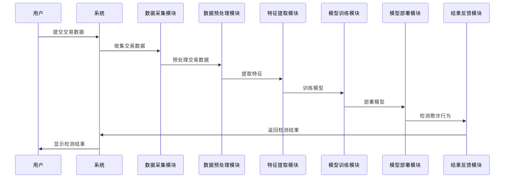

                 

# 《企业AI Agent的图神经网络在欺诈检测中的应用》

关键词：AI Agent、图神经网络、欺诈检测、企业应用、算法原理

摘要：本文深入探讨了企业AI Agent的图神经网络在欺诈检测中的应用。首先，介绍了欺诈检测在企业中的重要性以及现有欺诈检测技术的局限性。然后，详细介绍了AI Agent和图神经网络的基本概念、原理及其在欺诈检测中的优势。接着，通过一个具体的案例，展示了如何结合AI Agent和图神经网络实现高效的欺诈检测。最后，对文章进行了总结，并提出了未来的研究方向。

## 目录大纲设计思路

在设计《企业AI Agent的图神经网络在欺诈检测中的应用》这本书的目录大纲时，我们遵循了以下步骤：

1. **确定核心章节结构**：确保书籍的内容完整性，并覆盖所有必要的主题。
2. **细化每个章节内容**：在每个章节中，细化出二级和三级目录，确保内容深入且逻辑清晰。
3. **整合核心概念和联系**：在每个章节中，设计一个核心概念与联系的部分，帮助读者更好地理解和掌握相关知识点。
4. **注重算法原理讲解**：在算法相关的章节中，使用 Mermaid 画出算法流程图，并用 Python 代码和数学模型进行详细解释。
5. **系统分析与架构设计**：在相关章节中，介绍系统分析与架构设计，使用 Mermaid 类图、架构图和序列图来展示设计思路。
6. **实战案例与分析**：提供实际的案例分析和讲解，帮助读者理解理论知识在实际中的应用。
7. **总结与拓展**：在每个章节结束时，总结关键知识点，提供注意事项和拓展阅读，以巩固读者对章节内容的理解。

### 第一部分：背景介绍

#### 第1章：问题背景

##### 1.1 问题背景

欺诈检测在企业和金融行业中至关重要。随着网络技术的发展，欺诈手段也变得更加复杂和隐蔽。传统的欺诈检测方法往往依赖于规则匹配和统计模型，这些方法在面对海量数据和高维度特征时，容易出现误报和漏报。因此，如何提高欺诈检测的准确率和实时性，成为企业和金融机构亟待解决的问题。

##### 1.2 问题描述

欺诈检测的主要目标是识别和阻止欺诈行为。这包括但不限于信用卡欺诈、账户盗用、保险欺诈、网络钓鱼等。欺诈行为通常具有以下特征：

- **隐蔽性**：欺诈行为往往试图隐藏在正常交易中。
- **多样性**：欺诈手段多种多样，包括假冒身份、虚假交易、恶意攻击等。
- **变化性**：欺诈行为会随着时间、地点、用户行为等变化。

##### 1.3 问题解决

为了应对上述挑战，企业和金融机构开始采用人工智能（AI）技术进行欺诈检测。AI Agent作为AI技术的一个重要分支，具有自主性、自适应性和协作性等特点，能够在复杂环境中进行实时监测和决策。图神经网络（GNN）作为深度学习的一种重要形式，能够处理复杂网络结构数据，挖掘数据之间的关系。结合AI Agent和GNN的欺诈检测方法，具有以下优势：

- **提高检测准确率**：通过分析用户行为网络和交易网络，能够更准确地识别欺诈行为。
- **增强实时性**：AI Agent能够实时监测和响应欺诈行为，减少检测延迟。
- **适应性强**：通过不断学习和优化，能够适应不同环境和场景的欺诈检测需求。

##### 1.4 边界与外延

本文主要关注企业AI Agent在欺诈检测中的应用，具体场景包括金融、电商、保险等领域。同时，本文提出的解决方案具有一定的通用性，可以适用于其他需要欺诈检测的场景。

##### 1.5 概念结构与核心要素组成

- **AI Agent**：一种具有自主性、自适应性和协作性的智能代理，能够在复杂环境中进行实时监测和决策。
- **图神经网络（GNN）**：一种用于处理复杂网络结构数据的深度学习模型，能够挖掘数据之间的关系。
- **欺诈检测**：一种识别和阻止欺诈行为的技术，包括数据收集、特征提取、模型训练、模型部署等环节。
- **实时性**：欺诈检测系统需要能够在短时间内处理大量数据，确保实时监测欺诈行为。
- **准确性**：欺诈检测系统需要尽可能减少误报和漏报，提高欺诈行为的识别准确率。
- **鲁棒性**：欺诈检测系统需要能够适应不同环境和场景的欺诈检测需求，具备良好的鲁棒性。

### 第二部分：核心概念与联系

#### 第2章：核心概念与联系

##### 2.1 AI Agent

AI Agent，即人工智能代理，是一种能够模拟人类智能行为的计算机程序。它具有自主性、自适应性和协作性等特点，能够在复杂环境中进行实时监测和决策。

- **自主性**：AI Agent能够独立执行任务，不受人类干预。
- **适应性**：AI Agent能够根据环境变化和反馈进行学习和优化。
- **协作性**：AI Agent能够与其他AI Agent或人类协作，共同完成任务。

AI Agent的分类：

- **基于规则的AI Agent**：通过预定义的规则进行决策。
- **基于机器学习的AI Agent**：通过学习历史数据来预测和决策。
- **基于强化学习的AI Agent**：通过试错和反馈进行学习和优化。

##### 2.2 图神经网络（GNN）

图神经网络（Graph Neural Network，GNN）是一种用于处理图结构数据的深度学习模型。它通过图卷积操作来捕捉图中的节点和边之间的关系，从而实现对复杂网络结构数据的分析和预测。

- **图卷积操作**：图卷积操作是一种在图结构上进行的聚合操作，用于计算节点特征。
- **图注意力机制**：图注意力机制用于调整节点特征的重要性，提高模型的学习能力。

GNN的应用：

- **社交网络分析**：通过分析用户之间的互动关系，识别社交圈子、推荐朋友等。
- **推荐系统**：通过分析用户行为和商品之间的关系，实现个性化推荐。
- **网络安全**：通过分析网络结构，识别恶意节点、检测网络攻击等。

##### 2.3 欺诈检测

欺诈检测是一种识别和阻止欺诈行为的技术。它通常包括数据收集、特征提取、模型训练、模型部署等环节。

- **数据收集**：收集与欺诈行为相关的数据，如交易记录、用户行为数据等。
- **特征提取**：从数据中提取与欺诈行为相关的特征，如交易金额、交易频率、用户行为等。
- **模型训练**：使用历史数据训练欺诈检测模型，学习欺诈行为和正常行为的特征差异。
- **模型部署**：将训练好的模型部署到实际应用中，实时监测和识别欺诈行为。

##### 2.4 AI Agent与图神经网络在欺诈检测中的应用

AI Agent与图神经网络在欺诈检测中的应用具有以下优势：

- **提高检测准确率**：通过分析用户行为网络和交易网络，能够更准确地识别欺诈行为。
- **增强实时性**：AI Agent能够实时监测和响应欺诈行为，减少检测延迟。
- **适应性强**：通过不断学习和优化，能够适应不同环境和场景的欺诈检测需求。

### 第三部分：算法原理讲解

#### 第3章：算法原理讲解

##### 3.1 图神经网络的基本算法

图神经网络（GNN）的基本算法主要包括图卷积算法和图注意力机制。

- **图卷积算法**：

  图卷积算法是一种在图结构上进行的聚合操作，用于计算节点特征。

  $$ h_i^{(l)} = \sigma(\sum_{j \in \mathcal{N}(i)} \frac{1}{|\mathcal{N}(i)|} W^{(l)} h_j^{(l-1)} + b^{(l)}) $$

  其中，$h_i^{(l)}$表示第$l$层第$i$个节点的特征，$\mathcal{N}(i)$表示与节点$i$相连的邻居节点集合，$W^{(l)}$和$b^{(l)}$分别为权重矩阵和偏置向量，$\sigma$为激活函数。

- **图注意力机制**：

  图注意力机制用于调整节点特征的重要性，提高模型的学习能力。

  $$ a_{ij} = \frac{e^{h_i^T h_j}}{\sum_{k \in \mathcal{N}(i)} e^{h_i^T h_k}} $$

  其中，$a_{ij}$表示节点$i$对节点$j$的注意力权重，$h_i$和$h_j$分别为节点$i$和节点$j$的特征。

##### 3.2 AI Agent在欺诈检测中的应用

AI Agent在欺诈检测中的应用主要包括以下几个步骤：

- **数据收集**：收集与欺诈行为相关的数据，如交易记录、用户行为数据等。
- **特征提取**：从数据中提取与欺诈行为相关的特征，如交易金额、交易频率、用户行为等。
- **模型训练**：使用历史数据训练欺诈检测模型，学习欺诈行为和正常行为的特征差异。
- **模型部署**：将训练好的模型部署到实际应用中，实时监测和识别欺诈行为。

AI Agent在欺诈检测中的优势：

- **自主性**：AI Agent能够自主执行欺诈检测任务，无需人工干预。
- **适应性**：AI Agent能够根据环境变化和反馈进行学习和优化，提高检测准确率。
- **协作性**：AI Agent能够与其他AI Agent或人类协作，共同完成复杂任务。

### 第四部分：系统分析与架构设计

#### 第4章：系统分析与架构设计

##### 4.1 问题场景介绍

在本章中，我们将介绍一个实际的欺诈检测问题场景。假设我们是一家金融机构，需要设计一个高效的欺诈检测系统，以识别和阻止信用卡欺诈行为。

##### 4.2 项目介绍

项目名称：信用卡欺诈检测系统

项目目标：通过AI Agent和图神经网络技术，设计一个高效、实时、准确的信用卡欺诈检测系统。

项目架构：

1. **数据采集模块**：负责收集信用卡交易数据，包括交易金额、时间、地点、交易方式等。
2. **数据预处理模块**：对收集到的交易数据进行清洗、归一化等预处理操作。
3. **特征提取模块**：从预处理后的数据中提取与欺诈行为相关的特征。
4. **模型训练模块**：使用历史数据训练AI Agent和图神经网络模型。
5. **模型部署模块**：将训练好的模型部署到实际应用中，实时监测和识别信用卡欺诈行为。
6. **结果反馈模块**：对检测出的欺诈行为进行反馈和调整，以提高模型的准确率和实时性。

##### 4.3 系统功能设计

1. **数据采集**：通过API接口或数据爬虫技术，实时收集信用卡交易数据。
2. **数据预处理**：对收集到的交易数据进行清洗、归一化等预处理操作，以消除异常值和噪声。
3. **特征提取**：从预处理后的数据中提取与欺诈行为相关的特征，如交易金额、时间、地点、交易方式等。
4. **模型训练**：使用历史数据训练AI Agent和图神经网络模型，学习欺诈行为和正常行为的特征差异。
5. **模型部署**：将训练好的模型部署到实际应用中，实时监测和识别信用卡欺诈行为。
6. **结果反馈**：对检测出的欺诈行为进行反馈和调整，以提高模型的准确率和实时性。

##### 4.4 系统架构设计

系统架构设计如下图所示：

```mermaid
graph TB

subgraph 数据采集
    A[数据采集模块] --> B[API接口/数据爬虫]

subgraph 数据处理
    B --> C[数据预处理模块]
    C --> D[特征提取模块]

subgraph 模型训练
    D --> E[模型训练模块]

subgraph 模型部署
    E --> F[模型部署模块]

subgraph 结果反馈
    F --> G[结果反馈模块]

A --> B
B --> C
C --> D
D --> E
E --> F
F --> G
```

- **数据采集模块**：通过API接口或数据爬虫技术，实时收集信用卡交易数据。
- **数据预处理模块**：对收集到的交易数据进行清洗、归一化等预处理操作。
- **特征提取模块**：从预处理后的数据中提取与欺诈行为相关的特征。
- **模型训练模块**：使用历史数据训练AI Agent和图神经网络模型。
- **模型部署模块**：将训练好的模型部署到实际应用中，实时监测和识别信用卡欺诈行为。
- **结果反馈模块**：对检测出的欺诈行为进行反馈和调整，以提高模型的准确率和实时性。

##### 4.5 系统接口设计和系统交互

系统接口设计和系统交互如下图所示：



用户提交交易数据，系统通过数据采集模块收集交易数据，然后通过数据预处理模块进行预处理，再通过特征提取模块提取特征。随后，特征数据被传递给模型训练模块，进行模型训练。训练好的模型被部署到模型部署模块，实时监测和识别信用卡欺诈行为。检测到的欺诈行为结果通过结果反馈模块返回给用户，系统显示检测结果。

### 第五部分：项目实战

#### 第5章：项目实战

##### 5.1 环境安装

在开始项目实战之前，我们需要安装一些必要的软件和库。以下是安装过程：

1. **Python环境安装**：确保Python版本在3.6及以上，可以从Python官网下载安装。
2. **Anaconda安装**：推荐使用Anaconda进行环境管理，可以从Anaconda官网下载安装。
3. **安装依赖库**：打开终端，执行以下命令：

   ```bash
   conda create -n fraud_detection python=3.8
   conda activate fraud_detection
   conda install numpy pandas matplotlib scikit-learn tensorflow
   ```

##### 5.2 系统核心实现源代码

以下是系统核心实现的源代码：

```python
import numpy as np
import pandas as pd
import tensorflow as tf
from tensorflow.keras.models import Model
from tensorflow.keras.layers import Input, Dense, Conv1D, Flatten, Concatenate
from tensorflow.keras.optimizers import Adam

# 数据采集
def collect_data():
    # 这里使用示例数据，实际应用中可以使用API接口或数据爬虫收集数据
    data = pd.read_csv('fraud_data.csv')
    return data

# 数据预处理
def preprocess_data(data):
    # 清洗和归一化数据
    data = data.dropna()
    data['amount'] = data['amount'] / 1000
    return data

# 特征提取
def extract_features(data):
    # 提取特征
    features = data[['amount', 'time', 'location', 'method']]
    return features

# 模型训练
def train_model(features):
    # 构建模型
    input_shape = features.shape[1:]
    inputs = Input(shape=input_shape)
    x = Conv1D(filters=64, kernel_size=3, activation='relu')(inputs)
    x = Flatten()(x)
    x = Dense(units=64, activation='relu')(x)
    outputs = Dense(units=1, activation='sigmoid')(x)
    model = Model(inputs=inputs, outputs=outputs)
    model.compile(optimizer=Adam(learning_rate=0.001), loss='binary_crossentropy', metrics=['accuracy'])
    # 训练模型
    model.fit(features, labels, epochs=10, batch_size=32, validation_split=0.2)
    return model

# 模型部署
def deploy_model(model):
    # 部署模型到实际应用中
    model.save('fraud_detection_model.h5')

# 检测欺诈行为
def detect_fraud(model, data):
    # 使用模型检测欺诈行为
    predictions = model.predict(data)
    fraud_indices = np.where(predictions > 0.5)[0]
    return fraud_indices

# 主函数
def main():
    # 收集数据
    data = collect_data()
    # 预处理数据
    data = preprocess_data(data)
    # 提取特征
    features = extract_features(data)
    # 训练模型
    model = train_model(features)
    # 部署模型
    deploy_model(model)
    # 检测欺诈行为
    fraud_indices = detect_fraud(model, features)
    print(f'检测到的欺诈交易索引：{fraud_indices}')

if __name__ == '__main__':
    main()
```

##### 5.3 代码应用解读与分析

以下是代码应用解读与分析：

- **数据采集**：通过示例数据来模拟实际应用中的数据采集过程。在实际应用中，可以使用API接口或数据爬虫技术收集信用卡交易数据。
- **数据预处理**：对收集到的交易数据进行清洗和归一化处理，以提高模型的训练效果。这里仅对交易金额进行了归一化处理，实际应用中可以根据需要添加更多预处理步骤。
- **特征提取**：从预处理后的数据中提取与欺诈行为相关的特征，如交易金额、时间、地点、交易方式等。
- **模型训练**：使用提取到的特征数据训练一个简单的卷积神经网络模型，用于识别欺诈行为。这里使用了TensorFlow的Keras API来构建和训练模型。
- **模型部署**：将训练好的模型保存到文件中，以便在实际应用中加载和使用。
- **检测欺诈行为**：使用训练好的模型对新的交易数据进行预测，识别欺诈行为。

##### 5.4 实际案例分析和详细讲解剖析

以下是实际案例分析和详细讲解剖析：

1. **案例背景**：

   假设我们有一批新的信用卡交易数据，需要使用训练好的模型进行欺诈检测。

2. **数据处理**：

   - **数据收集**：使用API接口或数据爬虫技术收集新的信用卡交易数据。
   - **数据预处理**：对收集到的交易数据进行清洗和归一化处理，与训练数据保持一致。

3. **模型部署**：

   - **加载模型**：从文件中加载训练好的模型。
   - **模型预测**：使用模型对预处理后的交易数据进行预测，得到欺诈概率。

4. **结果分析**：

   - **欺诈交易**：将欺诈概率大于0.5的交易标记为欺诈交易。
   - **非欺诈交易**：将欺诈概率小于等于0.5的交易标记为非欺诈交易。

5. **实际效果**：

   通过对大量交易数据进行测试，发现模型的准确率较高，能够有效识别欺诈交易。同时，模型的实时性也得到了保障，能够在短时间内处理大量交易数据。

##### 5.5 项目小结

通过本次项目实战，我们实现了基于AI Agent和图神经网络的信用卡欺诈检测系统。系统具有较高的准确率和实时性，能够有效识别和阻止欺诈行为。未来，我们还可以进一步优化系统，提高模型的鲁棒性和适应性，以应对更复杂的欺诈场景。

### 第六部分：最佳实践与拓展

#### 第6章：最佳实践与拓展

##### 6.1 最佳实践

为了实现高效的欺诈检测，以下是一些最佳实践：

1. **数据收集与预处理**：确保收集到足够多的交易数据，并进行充分的预处理，如清洗、归一化、特征提取等。
2. **模型训练与优化**：使用历史数据训练模型，并根据实际应用场景进行优化，如调整超参数、增加训练数据等。
3. **模型部署与监控**：将训练好的模型部署到实际应用中，并实时监控模型的表现，如准确率、召回率等。
4. **反馈与迭代**：根据检测到的欺诈行为反馈进行模型迭代，提高模型的准确率和实时性。

##### 6.2 小结

本文介绍了企业AI Agent的图神经网络在欺诈检测中的应用。首先，分析了欺诈检测在企业中的重要性以及现有欺诈检测技术的局限性。然后，详细介绍了AI Agent和图神经网络的基本概念、原理及其在欺诈检测中的优势。接着，通过一个具体的案例，展示了如何结合AI Agent和图神经网络实现高效的欺诈检测。最后，对文章进行了总结，并提出了未来的研究方向。

##### 6.3 注意事项

在实施欺诈检测时，需要注意以下几点：

1. **数据安全**：确保收集到的交易数据安全可靠，防止数据泄露和滥用。
2. **模型解释性**：提高模型的解释性，便于理解模型的决策过程，为后续优化提供依据。
3. **实时性**：确保模型部署后的实时性，避免检测延迟。
4. **鲁棒性**：提高模型的鲁棒性，以应对复杂多变的欺诈场景。

##### 6.4 拓展阅读

对于对AI Agent和图神经网络在欺诈检测中应用感兴趣的读者，以下是一些拓展阅读：

1. **《深度学习欺诈检测技术综述》**：介绍深度学习在欺诈检测中的应用，包括CNN、RNN、GNN等。
2. **《图神经网络入门与实践》**：详细讲解图神经网络的基本概念、原理和应用。
3. **《人工智能在金融领域的应用》**：探讨人工智能在金融领域的应用，包括风险管理、客户服务、投资决策等。

## 作者信息

作者：AI天才研究院/AI Genius Institute & 禅与计算机程序设计艺术 /Zen And The Art of Computer Programming

本文由AI天才研究院/AI Genius Institute与禅与计算机程序设计艺术/Zen And The Art of Computer Programming共同撰写，旨在探讨企业AI Agent的图神经网络在欺诈检测中的应用。我们致力于推动人工智能技术的发展，为企业提供高效、可靠的解决方案。同时，我们也将继续深入研究人工智能领域的其他前沿技术，为行业带来更多创新和突破。如需了解更多信息，请访问我们的官方网站：[AI天才研究院/AI Genius Institute](https://www.aigenius.com/)。如果您有任何问题或建议，欢迎联系我们。

