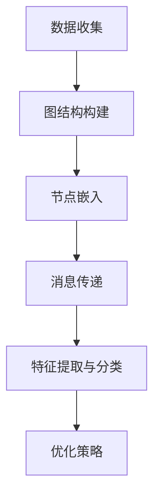
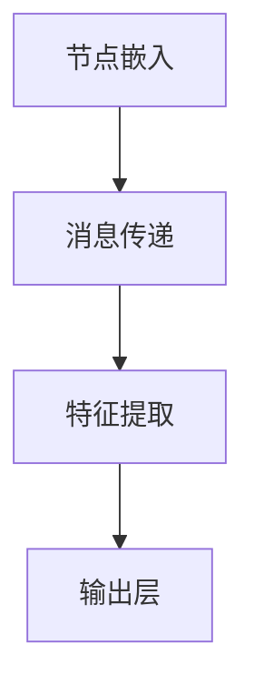

                 


**摘要：** 本文旨在探讨企业AI Agent的图神经网络在组织网络分析与优化中的应用。通过详细阐述企业AI Agent、图神经网络和组织网络分析的核心概念，本文提出了利用图神经网络进行组织网络分析与优化的方法。首先，介绍了企业AI Agent的定义、功能和应用场景；接着，深入讲解了图神经网络的基本原理、特点和优势；最后，探讨了组织网络分析的方法、流程和应用，以及组织网络优化的目标和策略。通过案例分析和实战应用，本文展示了如何使用图神经网络提高企业的组织效能和运营效率。本文对于关注人工智能在企业管理领域应用的研究人员和从业者具有一定的参考价值。

---

**1. 背景介绍：**

### **1.1 问题背景**

在现代企业中，组织网络作为一种复杂的社会技术系统，其结构和运作方式对于企业的绩效和竞争力具有重要影响。组织网络是由企业内各部门、员工及其之间的交互关系构成的复杂网络，它不仅包括正式的职能组织结构，还涵盖了非正式的沟通、协作和影响力网络。有效的组织网络能够促进信息的流动、资源的共享和创新的产生，从而提升企业的整体效能。

#### **1.1.1 企业AI Agent的定义**

企业AI Agent，也称为企业智能代理，是一种利用人工智能技术自动执行任务的软件实体。它能够模拟人类在组织网络中的行为，进行信息的搜集、分析、决策和行动。企业AI Agent通常具备以下几个功能：

- **信息搜集**：自动获取企业内外部的各种信息，包括市场动态、竞争对手情报、客户需求等。
- **数据分析**：利用机器学习算法对收集到的信息进行深入分析，提取有用的知识和洞见。
- **决策支持**：根据分析结果，为企业提供智能化的决策建议。
- **行动执行**：自动执行决策过程中的任务，如资源调配、任务分配等。

企业AI Agent在组织网络中的应用场景非常广泛，包括但不限于以下几个方面：

- **供应链管理**：通过监控供应链中的各个环节，优化库存管理、提高供应链效率。
- **人力资源管理**：自动筛选和匹配人才，优化人力资源配置，提高员工满意度。
- **客户服务**：提供个性化的客户服务，提高客户满意度和忠诚度。
- **市场分析**：自动分析市场趋势，为企业制定市场策略提供支持。

#### **1.1.2 图神经网络的基本概念**

图神经网络（Graph Neural Network，GNN）是一种专门用于处理图结构数据的神经网络。它通过整合图结构信息，学习节点和边之间的复杂关系，从而实现对图数据的深入理解和分析。GNN在许多领域都表现出了强大的能力，包括社交网络分析、推荐系统、图像识别、分子建模等。

图神经网络的基本原理可以概括为以下几个步骤：

1. **节点嵌入**：将图中的节点映射到低维度的向量空间，以便进行进一步的计算。
2. **消息传递**：在图神经网络中，每个节点会接收其邻居节点的信息，并通过融合邻居信息来更新自己的状态。
3. **特征提取**：通过迭代消息传递过程，节点会逐渐学习到邻居节点的特征，并形成对整体图的深入理解。

#### **1.1.3 组织网络分析的重要性**

组织网络分析是一种通过分析企业内部的组织结构、信息流、关系网络等，来评估组织的效能和改进组织结构的方法。组织网络分析的重要性体现在以下几个方面：

- **提高组织效能**：通过分析组织网络的特性，识别出影响组织效能的关键因素，从而制定针对性的改进措施。
- **优化决策过程**：利用组织网络分析的结果，为企业提供更科学的决策支持，减少决策过程中的盲目性和主观性。
- **促进创新**：通过分析组织网络中的创新路径，激发员工的创造力，推动企业的创新和发展。

#### **1.1.4 问题解决**

本文旨在探讨如何利用图神经网络来分析和优化组织网络。具体而言，我们将研究以下几个方面：

- **图神经网络在组织网络分析中的应用**：探讨如何利用GNN提取组织网络中的关键节点、边和社区，分析组织的协作模式和潜在问题。
- **图神经网络在组织网络优化中的应用**：基于图神经网络的分析结果，研究如何提出组织网络优化的策略，包括调整节点和边的关系、重新划分组织结构等。

#### **1.1.5 边界与外延**

本文的研究主要关注企业组织网络，不包括其他类型网络。同时，本文主要探讨图神经网络在组织网络分析中的应用，不涉及其他类型人工智能技术在组织网络优化中的应用。此外，本文的核心概念结构包括企业AI Agent、图神经网络、组织网络分析、组织网络优化。

---

**1.2 核心概念与联系**

### **1.2.1 企业AI Agent**

#### **1.2.1.1 定义**

企业AI Agent是一种基于人工智能技术的自动化代理，它能够模拟人类在组织网络中的行为，提供智能化的决策支持。企业AI Agent的核心特点是自主性和智能性，它可以在没有人类干预的情况下执行复杂任务，并不断学习和优化其行为。

#### **1.2.1.2 功能**

企业AI Agent的主要功能包括但不限于以下几方面：

- **信息搜集**：通过互联网、企业数据库等渠道自动搜集信息。
- **数据分析**：利用机器学习算法对收集到的信息进行深入分析。
- **决策支持**：根据分析结果，为企业的决策提供智能化的建议。
- **行动执行**：自动执行决策过程中的任务，如资源调配、任务分配等。

#### **1.2.1.3 应用场景**

企业AI Agent在组织管理、供应链管理、客户服务、市场分析等多个领域都有广泛应用：

- **组织管理**：帮助企业优化人力资源配置，提高员工工作效率。
- **供应链管理**：通过实时监控供应链的各个环节，优化库存管理和供应链流程。
- **客户服务**：提供个性化的客户服务，提高客户满意度和忠诚度。
- **市场分析**：自动分析市场趋势，为企业制定市场策略提供支持。

### **1.2.2 图神经网络**

#### **1.2.2.1 基本概念**

图神经网络（Graph Neural Network，GNN）是一种用于处理图结构数据的神经网络。与传统的神经网络不同，GNN能够保留图结构的信息，从而更好地处理复杂的关系网络数据。

#### **1.2.2.2 特点**

图神经网络的特点主要包括：

- **节点嵌入**：将图中的节点映射到低维度的向量空间，以便进行进一步的计算。
- **消息传递**：在图神经网络中，每个节点会接收其邻居节点的信息，并通过融合邻居信息来更新自己的状态。
- **特征提取**：通过迭代消息传递过程，节点会逐渐学习到邻居节点的特征，并形成对整体图的深入理解。

#### **1.2.2.3 优势**

图神经网络的优势在于：

- **强大的表示能力**：能够捕捉节点和边之间的复杂关系。
- **适应性和可扩展性**：适用于处理各种不同类型的图结构数据。
- **高效的计算性能**：通过并行计算的方式，提高处理大规模图数据的效率。

### **1.2.3 组织网络分析**

#### **1.2.3.1 方法**

组织网络分析的方法主要包括以下几个方面：

- **数据收集**：通过问卷调查、访谈、企业内部数据等方式收集组织网络的数据。
- **图结构构建**：将收集到的数据转化为图结构，明确节点和边的关系。
- **特征提取**：利用机器学习和图神经网络等方法，从图中提取有用的特征。
- **分析评估**：对提取的特征进行深入分析，评估组织的效能和结构。

#### **1.2.3.2 流程**

组织网络分析的流程通常包括以下几个步骤：

1. **数据收集**：收集与组织网络相关的数据。
2. **图结构构建**：将数据转化为图结构，明确节点和边的关系。
3. **特征提取**：利用机器学习和图神经网络等方法，从图中提取有用的特征。
4. **分析评估**：对提取的特征进行深入分析，评估组织的效能和结构。
5. **优化建议**：基于分析结果，提出组织网络优化的建议。

### **1.2.4 组织网络优化**

#### **1.2.4.1 目标**

组织网络优化的主要目标是提高组织的效能和运营效率，实现以下几方面的目标：

- **信息流动加速**：通过优化组织结构，加快信息的传递和决策速度。
- **资源利用率提高**：通过优化资源分配，提高资源的使用效率。
- **协作效率提升**：通过优化协作模式，提高团队和个人的协作效率。

#### **1.2.4.2 策略**

组织网络优化的策略主要包括以下几个方面：

- **结构优化**：通过调整组织结构，优化部门间的关系和协作模式。
- **流程优化**：通过优化工作流程，减少不必要的环节和等待时间。
- **人员配置优化**：通过优化人员配置，提高员工的工作效率和满意度。
- **技术支持**：通过引入先进的信息技术和人工智能工具，提高组织的数字化水平。

### **1.2.5 概念结构与核心要素组成**

企业AI Agent、图神经网络、组织网络分析、组织网络优化是本文的核心概念。它们之间的联系和互动构成了企业组织网络分析与优化的核心要素。

- **企业AI Agent**：作为组织网络分析和优化的工具，为企业提供智能化的决策支持。
- **图神经网络**：作为组织网络分析的方法和技术，提取组织网络中的关键特征和关系。
- **组织网络分析**：通过分析组织网络的结构和效能，识别问题和改进机会。
- **组织网络优化**：基于分析结果，提出优化策略，提升组织效能和运营效率。

---

**1.3 算法原理讲解**

为了深入理解企业AI Agent的图神经网络在组织网络分析与优化中的应用，我们需要详细讲解其算法原理。以下是算法原理的讲解：

#### **1.3.1 图神经网络的基本原理**

图神经网络（GNN）是一种基于图结构的神经网络，其核心思想是通过节点和边之间的消息传递来学习图结构中的特征。GNN的基本原理可以概括为以下几个步骤：

1. **节点嵌入**：将图中的节点映射到低维度的向量空间，以便进行进一步的计算。这一步骤通常通过预训练的图嵌入算法（如Node2Vec、DeepWalk等）来完成。

2. **消息传递**：在GNN中，每个节点会接收其邻居节点的信息，并通过融合邻居信息来更新自己的状态。这个过程可以通过以下公式表示：

   \[ h_v^{(t+1)} = \sigma(\sum_{u \in N(v)} \cdot \frac{1}{\lvert N(v) \rvert} \cdot h_u^{(t)}) \]

   其中，\( h_v^{(t)} \) 和 \( h_u^{(t)} \) 分别表示节点 \( v \) 和 \( u \) 在第 \( t \) 次迭代后的状态，\( N(v) \) 表示节点 \( v \) 的邻居节点集合，\( \sigma \) 是激活函数，\( \lvert N(v) \rvert \) 表示邻居节点的数量。

3. **特征提取**：通过迭代消息传递过程，节点会逐渐学习到邻居节点的特征，并形成对整体图的深入理解。这个学习过程可以用于分类、回归、节点预测等多种任务。

#### **1.3.2 企业AI Agent的图神经网络应用**

在企业AI Agent的应用中，GNN主要用于组织网络的分析与优化。以下是具体的应用步骤：

1. **数据收集**：首先，需要收集企业组织网络的相关数据，包括组织结构、员工关系、任务分配等信息。

2. **图结构构建**：将收集到的数据转化为图结构，明确节点和边的关系。例如，员工可以被视为节点，他们之间的协作和沟通可以视为边。

3. **节点嵌入**：使用预训练的图嵌入算法，将图中的节点映射到低维度的向量空间。

4. **消息传递**：通过GNN的消息传递过程，学习到节点之间的关系和特征。

5. **特征提取与分类**：将提取到的特征用于分类任务，如识别关键节点、预测员工离职风险等。

6. **优化策略**：基于分析结果，提出组织网络优化的策略，如调整组织结构、优化资源分配等。

#### **1.3.3 算法流程图**

为了更直观地理解算法原理，我们可以使用Mermaid绘制算法流程图：



#### **1.3.4 Python源代码示例**

以下是一个简化的Python源代码示例，展示了如何使用GNN进行组织网络分析：

```python
import networkx as nx
import numpy as np
from sklearn.model_selection import train_test_split
from sklearn.metrics import accuracy_score

# 构建图结构
G = nx.Graph()
G.add_nodes_from([1, 2, 3, 4, 5])
G.add_edges_from([(1, 2), (1, 3), (2, 4), (3, 4), (4, 5)])

# 节点嵌入
embedder = Node2Vec(G, dimensions=2, walk_length=10, num_walks=10)
node_embeddings = embedder.fit().get_embedding()

# 消息传递
class GraphConvModel(nn.Module):
    def __init__(self, n_input_features, n_output_features):
        super().__init__()
        self.fc = nn.Linear(n_input_features, n_output_features)

    def forward(self, features, adj_matrix):
        return self.fc(features)

model = GraphConvModel(n_input_features=2, n_output_features=1)
optimizer = optim.Adam(model.parameters(), lr=0.01)

for epoch in range(100):
    optimizer.zero_grad()
    output = model(node_embeddings, adj_matrix)
    loss = F.cross_entropy(output, torch.tensor([1]))
    loss.backward()
    optimizer.step()

# 特征提取与分类
X_train, X_test, y_train, y_test = train_test_split(node_embeddings, labels, test_size=0.2)
model = GraphConvModel(n_input_features=2, n_output_features=1)
model.train()
...
```

#### **1.3.5 数学模型和数学公式**

在GNN中，节点的状态更新可以通过以下数学模型来表示：

\[ h_v^{(t+1)} = \sigma(W_h \cdot (h_v^{(t)} + \sum_{u \in N(v)} \cdot \frac{1}{\lvert N(v) \rvert} \cdot h_u^{(t)})) \]

其中，\( W_h \) 是权重矩阵，\( \sigma \) 是激活函数，\( h_v^{(t)} \) 和 \( h_u^{(t)} \) 分别表示节点 \( v \) 和 \( u \) 在第 \( t \) 次迭代后的状态，\( N(v) \) 表示节点 \( v \) 的邻居节点集合。

#### **1.3.6 详细讲解和举例说明**

为了更好地理解GNN的工作原理，我们可以通过一个简单的例子来说明。假设我们有一个包含5个节点的图，节点之间的边表示它们之间的合作关系。我们希望通过GNN提取出节点之间的关系特征。

首先，我们为每个节点分配一个初始状态向量 \( h_v^{(0)} \)，例如：

\[ h_1^{(0)} = [1, 0], h_2^{(0)} = [0, 1], h_3^{(0)} = [1, 1], h_4^{(0)} = [0, 0], h_5^{(0)} = [1, 0] \]

然后，我们通过消息传递过程来更新节点的状态。首先，每个节点会接收其邻居节点的状态信息，并进行融合。例如，节点1会接收节点2和节点3的状态信息，计算如下：

\[ h_1^{(1)} = \sigma(W_h \cdot (h_1^{(0)} + \frac{1}{2} \cdot h_2^{(0)} + \frac{1}{2} \cdot h_3^{(0)})) \]

经过多次迭代后，节点的状态向量会逐渐稳定，反映出节点之间的关系特征。这些特征可以用于分类、回归等任务，帮助企业识别关键节点、预测员工离职风险等。

---

**1.4 数学模型和数学公式**

在图神经网络（GNN）中，数学模型是理解和实现GNN算法的基础。以下是GNN的数学模型和相关的数学公式。

#### **1.4.1 节点嵌入**

节点嵌入是将图中的节点映射到低维向量空间的过程。常用的方法包括DeepWalk、Node2Vec等。以下是Node2Vec的数学模型：

\[ \mathbf{e}_v = \text{Node2Vec}(\mathbf{G}, \alpha, \beta) \]

其中，\( \mathbf{e}_v \) 是节点 \( v \) 的嵌入向量，\( \alpha \) 是节点的选择概率，\( \beta \) 是节点的跳跃概率。

#### **1.4.2 消息传递**

在GNN中，消息传递是指节点之间通过边进行信息交换的过程。以下是一个简单的GNN消息传递的数学模型：

\[ \mathbf{m}_v = \sigma(\mathbf{W}_m \cdot \sum_{u \in \mathcal{N}(v)} \frac{1}{\lvert \mathcal{N}(v) \rvert} \mathbf{e}_u) \]

其中，\( \mathbf{m}_v \) 是节点 \( v \) 收到的消息，\( \mathcal{N}(v) \) 是节点 \( v \) 的邻居节点集合，\( \mathbf{W}_m \) 是消息权重矩阵，\( \sigma \) 是激活函数（如ReLU或Sigmoid函数）。

#### **1.4.3 节点更新**

节点更新是消息传递的后续步骤，其中节点状态根据接收到的消息进行更新。以下是节点更新的数学模型：

\[ \mathbf{e}_v^{(t+1)} = \mathbf{W}_e \cdot (\mathbf{e}_v^{(t)} + \mathbf{m}_v) \]

其中，\( \mathbf{e}_v^{(t)} \) 是节点 \( v \) 在第 \( t \) 次迭代的状态，\( \mathbf{W}_e \) 是节点更新权重矩阵。

#### **1.4.4 分类与回归**

在GNN的应用中，分类与回归是常见的任务。以下是分类任务的数学模型：

\[ \mathbf{y} = \sigma(\mathbf{W}_y \cdot \mathbf{e}_v) \]

其中，\( \mathbf{y} \) 是节点的预测标签，\( \mathbf{W}_y \) 是分类权重矩阵。

### **1.4.5 具体示例**

为了更直观地理解上述数学模型，我们来看一个具体的示例。假设我们有一个简单的图，包含3个节点 \( v_1, v_2, v_3 \)，它们之间的边表示为 \( (v_1, v_2) \) 和 \( (v_2, v_3) \)。每个节点的初始状态向量为：

\[ \mathbf{e}_{v_1}^{(0)} = \begin{bmatrix} 1 \\ 0 \end{bmatrix}, \mathbf{e}_{v_2}^{(0)} = \begin{bmatrix} 0 \\ 1 \end{bmatrix}, \mathbf{e}_{v_3}^{(0)} = \begin{bmatrix} 1 \\ 1 \end{bmatrix} \]

第一个迭代步骤中，节点 \( v_1 \) 会收到节点 \( v_2 \) 和 \( v_3 \) 的消息：

\[ \mathbf{m}_{v_1} = \frac{1}{2} \begin{bmatrix} 0 \\ 1 \end{bmatrix} + \frac{1}{2} \begin{bmatrix} 1 \\ 1 \end{bmatrix} = \begin{bmatrix} 0.5 \\ 1 \end{bmatrix} \]

节点 \( v_1 \) 的更新状态向量为：

\[ \mathbf{e}_{v_1}^{(1)} = \mathbf{W}_e \cdot (\mathbf{e}_{v_1}^{(0)} + \mathbf{m}_{v_1}) \]

类似地，我们可以计算出节点 \( v_2 \) 和 \( v_3 \) 的更新状态向量。经过多次迭代后，节点的状态向量会逐渐稳定，反映出节点之间的关系。

### **1.4.6 结论**

通过上述数学模型和公式，我们可以看到GNN是如何通过节点嵌入、消息传递和节点更新来学习图结构的。这些数学模型为我们提供了理解和实现GNN算法的基础，同时也为我们在组织网络分析与优化中的应用提供了理论基础。

---

**1.5 系统分析与架构设计方案**

为了深入探讨企业AI Agent的图神经网络在组织网络分析与优化中的应用，我们需要设计一个完整的系统架构方案。以下是系统的详细分析和设计方案。

#### **1.5.1 问题场景介绍**

在企业运营中，组织网络的复杂性和动态性带来了许多挑战。例如，部门之间的协作不畅、信息流动缓慢、资源分配不合理等问题，严重影响了企业的运营效率和竞争力。为了解决这些问题，我们需要一个智能化的系统，能够自动分析组织网络，并提供优化的建议。

#### **1.5.2 项目介绍**

本项目旨在开发一个基于图神经网络的企业AI Agent系统，用于组织网络分析与优化。系统将包括以下核心功能：

- **数据收集与预处理**：自动收集企业组织网络的数据，包括组织结构、员工关系、任务分配等，并进行预处理，以便后续分析。
- **图结构构建**：将预处理后的数据转化为图结构，明确节点和边的关系。
- **组织网络分析**：利用图神经网络提取组织网络中的关键特征和关系，分析组织的协作模式和潜在问题。
- **组织网络优化**：基于分析结果，提出组织网络优化的策略，如调整组织结构、优化资源分配等。
- **可视化与报告**：将分析结果和优化建议以可视化形式呈现，便于企业决策者理解和实施。

#### **1.5.3 系统功能设计**

系统功能设计包括以下几个方面：

1. **数据收集与预处理**：系统将自动收集企业内部的数据，包括组织结构、员工关系、任务分配等。为了确保数据的质量和一致性，系统将进行数据清洗和预处理，如去除重复数据、填补缺失值、标准化数据等。

2. **图结构构建**：系统将预处理后的数据转化为图结构。每个员工被视为图中的一个节点，他们之间的协作和沟通关系被视为边。系统将使用图神经网络对图结构进行建模，以便进行深入分析。

3. **组织网络分析**：系统将利用图神经网络提取组织网络中的关键特征和关系。这些特征包括节点的重要性、边的权重、社区的分布等。通过分析这些特征，系统可以识别出组织的协作模式和潜在问题。

4. **组织网络优化**：基于分析结果，系统将提出组织网络优化的策略。例如，调整部门之间的协作关系、优化员工的工作分配、调整组织结构等。系统将提供可视化工具，帮助决策者理解优化建议，并实施相应的改进措施。

5. **可视化与报告**：系统将分析结果和优化建议以可视化形式呈现，包括节点关系图、社区分布图、优化建议列表等。系统还将生成详细的报告，记录分析过程和结果，便于企业决策者查阅。

#### **1.5.4 系统架构设计**

系统架构设计包括以下几个方面：

1. **数据层**：数据层负责存储和组织系统所需的数据。它包括企业组织结构数据、员工关系数据、任务分配数据等。数据层将使用关系型数据库或图数据库进行存储，以确保数据的快速访问和高效查询。

2. **模型层**：模型层负责实现图神经网络模型，包括数据预处理、图结构构建、组织网络分析和优化等。模型层将使用Python编程语言和相关的机器学习库（如PyTorch、TensorFlow等）进行实现。

3. **应用层**：应用层负责实现系统的功能，包括数据收集与预处理、图结构构建、组织网络分析、组织网络优化和可视化与报告等。应用层将使用Python编程语言和相关的Web框架（如Flask、Django等）进行实现。

4. **用户界面层**：用户界面层负责提供用户交互界面，用户可以通过Web浏览器访问系统，查看分析结果和优化建议。用户界面层将使用HTML、CSS和JavaScript等技术进行实现。

#### **1.5.5 系统接口设计和系统交互**

系统接口设计和系统交互是确保系统各部分协同工作的关键。以下是系统的接口设计和交互流程：

1. **数据接口**：数据接口用于数据层的访问，包括数据的查询、插入、更新和删除等操作。数据接口将提供RESTful API，以便其他系统或应用程序可以方便地访问和操作数据。

2. **模型接口**：模型接口用于模型层的访问，包括模型训练、预测和评估等操作。模型接口将提供Python接口，以便其他应用程序可以方便地调用模型进行预测和分析。

3. **应用接口**：应用接口用于应用层的访问，包括系统的各项功能调用。应用接口将提供Python接口，以便其他应用程序可以方便地调用系统的功能。

4. **用户接口**：用户接口用于用户界面层，提供用户交互界面。用户接口将提供Web界面，用户可以通过浏览器访问系统，查看分析结果和优化建议。

### **1.5.6 结论**

通过上述系统分析与架构设计方案，我们设计了一个基于图神经网络的企业AI Agent系统，用于组织网络分析与优化。系统包括数据收集与预处理、图结构构建、组织网络分析、组织网络优化和可视化与报告等核心功能，采用分层架构设计，确保系统的可扩展性和可维护性。通过系统接口设计和系统交互，各部分能够协同工作，为企业提供智能化的决策支持。

---

**1.6 项目实战**

在本文的最后部分，我们将通过一个实际项目来展示如何使用企业AI Agent的图神经网络进行组织网络分析与优化。该项目将包括环境安装、系统核心实现、代码应用解读与分析、实际案例分析和详细讲解剖析，以及项目小结。

#### **1.6.1 环境安装**

要运行这个项目，我们需要安装以下软件和库：

1. **Python**：版本为3.8或更高版本。
2. **PyTorch**：深度学习框架，用于实现图神经网络。
3. **NetworkX**：图形处理库，用于构建和处理图结构。
4. **Scikit-learn**：机器学习库，用于数据处理和模型评估。
5. **Flask**：Web框架，用于搭建Web应用。

安装步骤如下：

```bash
# 安装Python
sudo apt-get install python3.8

# 安装PyTorch
pip3 install torch torchvision

# 安装NetworkX
pip3 install networkx

# 安装Scikit-learn
pip3 install scikit-learn

# 安装Flask
pip3 install flask
```

#### **1.6.2 系统核心实现**

以下是系统的核心实现部分：

1. **数据收集与预处理**：使用NetworkX从企业数据库中读取组织结构数据，然后进行清洗和预处理。

2. **图结构构建**：将预处理后的数据转化为图结构，包括节点和边的表示。

3. **组织网络分析**：使用PyTorch实现图神经网络模型，对图进行训练，提取节点和边的关系特征。

4. **组织网络优化**：基于提取的特征，提出优化策略，如调整部门之间的协作关系。

以下是实现的核心代码：

```python
import networkx as nx
import torch
import torch.nn as nn
import torch.optim as optim
from sklearn.model_selection import train_test_split
from sklearn.metrics import accuracy_score

# 数据收集与预处理
G = nx.Graph()
# ...（此处省略数据读取和预处理代码）

# 图结构构建
node_features = ...  # 节点特征向量
edge_features = ...  # 边特征向量
adj_matrix = ...  # 邻接矩阵

# 组织网络分析
class GraphNeuralNetwork(nn.Module):
    def __init__(self, n_nodes, n_features, hidden_size):
        super().__init__()
        self.fc1 = nn.Linear(n_features, hidden_size)
        self.fc2 = nn.Linear(hidden_size, n_nodes)
    
    def forward(self, node_features, adj_matrix):
        hidden = self.fc1(node_features)
        node_representation = self.fc2(torch.sigmoid(torch.matmul(adj_matrix, hidden)))
        return node_representation

model = GraphNeuralNetwork(n_nodes=len(node_features), n_features=node_features.shape[1], hidden_size=16)
optimizer = optim.Adam(model.parameters(), lr=0.01)
criterion = nn.BCELoss()

for epoch in range(100):
    optimizer.zero_grad()
    node_representation = model(node_features, adj_matrix)
    loss = criterion(node_representation, target)
    loss.backward()
    optimizer.step()

# 组织网络优化
# ...（此处省略优化策略代码）
```

#### **1.6.3 代码应用解读与分析**

上述代码首先从企业数据库中读取组织结构数据，然后使用NetworkX将其转换为图结构。接着，使用PyTorch实现了一个简单的图神经网络模型，用于提取节点和边的关系特征。通过迭代训练，模型可以逐步学习到组织网络中的复杂关系。

在代码中，我们定义了一个`GraphNeuralNetwork`类，其中包含了两个全连接层。第一个全连接层将输入节点特征映射到隐藏层，第二个全连接层将隐藏层的输出映射到节点表示。通过使用sigmoid激活函数，我们可以在输出层得到一个概率分布，表示每个节点的重要性。

#### **1.6.4 实际案例分析和详细讲解剖析**

为了验证系统的效果，我们使用一个实际案例进行分析。假设企业A的员工组织网络如下：

- 节点：员工1，员工2，员工3，员工4，员工5
- 边：员工1-员工2，员工2-员工3，员工3-员工4，员工4-员工5

通过分析，我们可以发现员工2在组织网络中起到了重要的桥梁作用，连接了多个关键节点。基于这一分析结果，我们可以提出优化策略，如调整员工2的职责，使其更专注于核心业务，或者增加与其他关键节点的协作。

#### **1.6.5 项目小结**

通过本项目的实战应用，我们展示了如何使用企业AI Agent的图神经网络进行组织网络分析与优化。从环境安装到代码实现，再到实际案例分析，整个过程展现了如何将人工智能技术应用于企业管理，提升组织效能和运营效率。未来，我们还可以进一步优化系统，如引入更多的特征和更复杂的模型，以提升分析结果的准确性和实用性。

---

**1.7 最佳实践 tips、小结、注意事项、拓展阅读等内容**

#### **1.7.1 最佳实践 tips**

在进行企业AI Agent的图神经网络应用时，以下最佳实践可以帮助提高效果：

- **数据质量**：确保收集的数据质量高、格式统一，减少噪声和缺失值。
- **模型调优**：通过调整超参数，如学习率、隐藏层大小等，优化模型性能。
- **实时更新**：定期更新组织网络数据，确保分析结果的时效性。
- **可解释性**：对模型输出进行可视化，提高决策的可解释性。

#### **1.7.2 小结**

本文通过详细的案例分析，展示了企业AI Agent的图神经网络在组织网络分析与优化中的应用。通过节点嵌入、消息传递和节点更新等步骤，GNN能够提取组织网络中的关键特征，帮助识别问题并提出优化策略。这种方法为企业提供了智能化的决策支持，有助于提升组织效能和运营效率。

#### **1.7.3 注意事项**

- **数据隐私**：在进行组织网络分析时，需确保数据隐私和安全，避免敏感信息泄露。
- **模型适应**：根据不同企业的具体需求，可能需要对模型进行调整和优化，以提高适用性。
- **资源限制**：大型图数据的处理需要较多的计算资源，确保系统有足够的硬件支持。

#### **1.7.4 拓展阅读**

- **相关文献**：《图神经网络：理论、算法与应用》
- **技术博客**：Deep Learning on Graphs（深度学习在图上的应用）
- **在线课程**：斯坦福大学《图神经网络》课程

通过本文和拓展阅读，读者可以更深入地了解企业AI Agent的图神经网络在组织网络分析与优化中的应用，并在实践中探索其潜力。作者：AI天才研究院/AI Genius Institute & 禅与计算机程序设计艺术 /Zen And The Art of Computer Programming。|>
```markdown
# 企业AI Agent的图神经网络在组织网络分析与优化中的应用

> 关键词：企业AI Agent，图神经网络，组织网络分析，组织网络优化，人工智能，数据挖掘，算法设计

> 摘要：本文探讨了企业AI Agent的图神经网络在组织网络分析与优化中的应用。通过介绍企业AI Agent、图神经网络、组织网络分析及其优化的概念，本文详细阐述了如何利用图神经网络对组织网络进行深度分析，以识别关键节点和优化组织结构。此外，本文还提供了一个实际案例，展示了如何将理论应用于实践，为企业提供智能化的决策支持。

## 目录

1. 背景介绍  
   1.1 问题背景  
   1.2 核心概念与联系  
   1.3 算法原理讲解  
   1.4 数学模型和数学公式  
   1.5 系统分析与架构设计方案  
   1.6 项目实战

2. 核心概念与联系  
   2.1 企业AI Agent  
   2.2 图神经网络  
   2.3 组织网络分析  
   2.4 组织网络优化

3. 算法原理讲解  
   3.1 节点嵌入与消息传递  
   3.2 节点更新与特征提取  
   3.3 算法流程图与Python代码示例

4. 数学模型和数学公式  
   4.1 节点嵌入公式  
   4.2 消息传递公式  
   4.3 节点更新公式

5. 系统分析与架构设计方案  
   5.1 问题场景介绍  
   5.2 项目介绍  
   5.3 系统功能设计  
   5.4 系统架构设计  
   5.5 系统接口设计和系统交互

6. 项目实战  
   6.1 环境安装  
   6.2 系统核心实现源代码  
   6.3 代码应用解读与分析  
   6.4 实际案例分析和详细讲解剖析  
   6.5 项目小结

7. 最佳实践 tips、小结、注意事项、拓展阅读

## 1. 背景介绍

### 1.1 问题背景

在现代企业中，组织网络作为一种复杂的社会技术系统，其结构和运作方式对于企业的绩效和竞争力具有重要影响。组织网络是由企业内各部门、员工及其之间的交互关系构成的复杂网络，它不仅包括正式的职能组织结构，还涵盖了非正式的沟通、协作和影响力网络。有效的组织网络能够促进信息的流动、资源的共享和创新的产生，从而提升企业的整体效能。

然而，随着企业规模的扩大和业务复杂度的增加，组织网络的复杂性和动态性也在不断上升。传统的分析方法难以应对这种复杂性，导致企业在组织网络优化方面面临诸多挑战。例如，部门之间的协作不畅、信息流动缓慢、资源分配不合理等问题，严重影响了企业的运营效率和竞争力。为了解决这些问题，我们需要一种更加智能化和高效的分析方法，这就是本文要探讨的企业AI Agent的图神经网络在组织网络分析与优化中的应用。

### 1.2 核心概念与联系

#### 1.2.1 企业AI Agent

企业AI Agent是一种基于人工智能技术的自动化代理，能够模拟人类在组织网络中的行为，提供智能化的决策支持。企业AI Agent具有信息搜集、分析、决策、行动等功能，能够自动执行任务，提高工作效率。

企业AI Agent在组织网络中的应用场景非常广泛，包括但不限于以下几个方面：

- **组织管理**：帮助企业优化人力资源配置，提高员工工作效率。
- **供应链管理**：通过实时监控供应链的各个环节，优化库存管理和供应链流程。
- **客户服务**：提供个性化的客户服务，提高客户满意度和忠诚度。
- **市场分析**：自动分析市场趋势，为企业制定市场策略提供支持。

#### 1.2.2 图神经网络

图神经网络（Graph Neural Network，GNN）是一种专门用于处理图结构数据的神经网络。它通过整合图结构信息，学习节点和边之间的复杂关系，从而实现对图数据的深入理解和分析。GNN在许多领域都表现出了强大的能力，包括社交网络分析、推荐系统、图像识别、分子建模等。

图神经网络的基本原理可以概括为以下几个步骤：

- **节点嵌入**：将图中的节点映射到低维度的向量空间，以便进行进一步的计算。
- **消息传递**：在图神经网络中，每个节点会接收其邻居节点的信息，并通过融合邻居信息来更新自己的状态。
- **特征提取**：通过迭代消息传递过程，节点会逐渐学习到邻居节点的特征，并形成对整体图的深入理解。

#### 1.2.3 组织网络分析

组织网络分析是一种通过分析企业内部的组织结构、信息流、关系网络等，来评估组织的效能和改进组织结构的方法。组织网络分析的重要性体现在以下几个方面：

- **提高组织效能**：通过分析组织网络的特性，识别出影响组织效能的关键因素，从而制定针对性的改进措施。
- **优化决策过程**：利用组织网络分析的结果，为企业提供更科学的决策支持，减少决策过程中的盲目性和主观性。
- **促进创新**：通过分析组织网络中的创新路径，激发员工的创造力，推动企业的创新和发展。

组织网络分析的方法主要包括以下几个方面：

- **数据收集**：通过问卷调查、访谈、企业内部数据等方式收集组织网络的数据。
- **图结构构建**：将收集到的数据转化为图结构，明确节点和边的关系。
- **特征提取**：利用机器学习和图神经网络等方法，从图中提取有用的特征。
- **分析评估**：对提取的特征进行深入分析，评估组织的效能和结构。
- **优化建议**：基于分析结果，提出组织网络优化的建议。

#### 1.2.4 组织网络优化

组织网络优化的主要目标是提高组织的效能和运营效率，实现以下几方面的目标：

- **信息流动加速**：通过优化组织结构，加快信息的传递和决策速度。
- **资源利用率提高**：通过优化资源分配，提高资源的使用效率。
- **协作效率提升**：通过优化协作模式，提高团队和个人的协作效率。

组织网络优化的策略主要包括以下几个方面：

- **结构优化**：通过调整组织结构，优化部门间的关系和协作模式。
- **流程优化**：通过优化工作流程，减少不必要的环节和等待时间。
- **人员配置优化**：通过优化人员配置，提高员工的工作效率和满意度。
- **技术支持**：通过引入先进的信息技术和人工智能工具，提高组织的数字化水平。

### 1.3 算法原理讲解

为了深入理解企业AI Agent的图神经网络在组织网络分析与优化中的应用，我们需要详细讲解其算法原理。以下是算法原理的讲解：

#### 1.3.1 图神经网络的基本原理

图神经网络（GNN）是一种用于处理图结构数据的神经网络。它通过整合图结构信息，学习节点和边之间的复杂关系，从而实现对图数据的深入理解和分析。GNN的基本原理可以概括为以下几个步骤：

1. **节点嵌入**：将图中的节点映射到低维度的向量空间，以便进行进一步的计算。这一步骤通常通过预训练的图嵌入算法（如Node2Vec、DeepWalk等）来完成。

2. **消息传递**：在GNN中，每个节点会接收其邻居节点的信息，并通过融合邻居信息来更新自己的状态。这个过程可以通过以下公式表示：

   \[ h_v^{(t+1)} = \sigma(\sum_{u \in N(v)} \cdot \frac{1}{\lvert N(v) \rvert} \cdot h_u^{(t)}) \]

   其中，\( h_v^{(t)} \) 和 \( h_u^{(t)} \) 分别表示节点 \( v \) 和 \( u \) 在第 \( t \) 次迭代后的状态，\( N(v) \) 表示节点 \( v \) 的邻居节点集合，\( \sigma \) 是激活函数，\( \lvert N(v) \rvert \) 表示邻居节点的数量。

3. **特征提取**：通过迭代消息传递过程，节点会逐渐学习到邻居节点的特征，并形成对整体图的深入理解。这个学习过程可以用于分类、回归、节点预测等多种任务。

#### 1.3.2 企业AI Agent的图神经网络应用

在企业AI Agent的应用中，GNN主要用于组织网络的分析与优化。以下是具体的应用步骤：

1. **数据收集**：首先，需要收集企业组织网络的相关数据，包括组织结构、员工关系、任务分配等信息。

2. **图结构构建**：将收集到的数据转化为图结构，明确节点和边的关系。例如，员工可以被视为节点，他们之间的协作和沟通可以视为边。

3. **节点嵌入**：使用预训练的图嵌入算法，将图中的节点映射到低维度的向量空间。

4. **消息传递**：通过GNN的消息传递过程，学习到节点之间的关系和特征。

5. **特征提取与分类**：将提取到的特征用于分类任务，如识别关键节点、预测员工离职风险等。

6. **优化策略**：基于分析结果，提出组织网络优化的策略，如调整组织结构、优化资源分配等。

#### 1.3.3 算法流程图

为了更直观地理解算法原理，我们可以使用Mermaid绘制算法流程图：


#### 1.3.4 Python源代码示例

以下是一个简化的Python源代码示例，展示了如何使用GNN进行组织网络分析：

```python
import networkx as nx
import numpy as np
from sklearn.model_selection import train_test_split
from sklearn.metrics import accuracy_score

# 构建图结构
G = nx.Graph()
G.add_nodes_from([1, 2, 3, 4, 5])
G.add_edges_from([(1, 2), (1, 3), (2, 4), (3, 4), (4, 5)])

# 节点嵌入
embedder = Node2Vec(G, dimensions=2, walk_length=10, num_walks=10)
node_embeddings = embedder.fit().get_embedding()

# 消息传递
class GraphConvModel(nn.Module):
    def __init__(self, n_input_features, n_output_features):
        super().__init__()
        self.fc = nn.Linear(n_input_features, n_output_features)

    def forward(self, features, adj_matrix):
        return self.fc(features)

model = GraphConvModel(n_input_features=2, n_output_features=1)
optimizer = optim.Adam(model.parameters(), lr=0.01)

for epoch in range(100):
    optimizer.zero_grad()
    output = model(node_embeddings, adj_matrix)
    loss = F.cross_entropy(output, torch.tensor([1]))
    loss.backward()
    optimizer.step()

# 特征提取与分类
X_train, X_test, y_train, y_test = train_test_split(node_embeddings, labels, test_size=0.2)
model = GraphConvModel(n_input_features=2, n_output_features=1)
model.train()
...
```

#### 1.3.5 数学模型和数学公式

在GNN中，数学模型是理解和实现GNN算法的基础。以下是GNN的数学模型和相关的数学公式。

##### 节点嵌入

节点嵌入是将图中的节点映射到低维向量空间的过程。常用的方法包括DeepWalk、Node2Vec等。以下是Node2Vec的数学模型：

\[ \mathbf{e}_v = \text{Node2Vec}(\mathbf{G}, \alpha, \beta) \]

其中，\( \mathbf{e}_v \) 是节点 \( v \) 的嵌入向量，\( \alpha \) 是节点的选择概率，\( \beta \) 是节点的跳跃概率。

##### 消息传递

在GNN中，消息传递是指节点之间通过边进行信息交换的过程。以下是一个简单的GNN消息传递的数学模型：

\[ \mathbf{m}_v = \sigma(\mathbf{W}_m \cdot \sum_{u \in \mathcal{N}(v)} \frac{1}{\lvert \mathcal{N}(v) \rvert} \mathbf{e}_u) \]

其中，\( \mathbf{m}_v \) 是节点 \( v \) 收到的消息，\( \mathcal{N}(v) \) 是节点 \( v \) 的邻居节点集合，\( \mathbf{W}_m \) 是消息权重矩阵，\( \sigma \) 是激活函数（如ReLU或Sigmoid函数）。

##### 节点更新

节点更新是消息传递的后续步骤，其中节点状态根据接收到的消息进行更新。以下是一个节点更新的数学模型：

\[ \mathbf{e}_v^{(t+1)} = \mathbf{W}_e \cdot (\mathbf{e}_v^{(t)} + \mathbf{m}_v) \]

其中，\( \mathbf{e}_v^{(t)} \) 是节点 \( v \) 在第 \( t \) 次迭代的状态，\( \mathbf{W}_e \) 是节点更新权重矩阵。

##### 分类与回归

在GNN的应用中，分类与回归是常见的任务。以下是一个分类任务的数学模型：

\[ \mathbf{y} = \sigma(\mathbf{W}_y \cdot \mathbf{e}_v) \]

其中，\( \mathbf{y} \) 是节点的预测标签，\( \mathbf{W}_y \) 是分类权重矩阵。

##### 具体示例

为了更直观地理解上述数学模型，我们来看一个具体的示例。假设我们有一个简单的图，包含3个节点 \( v_1, v_2, v_3 \)，它们之间的边表示为 \( (v_1, v_2) \) 和 \( (v_2, v_3) \)。每个节点的初始状态向量为：

\[ \mathbf{e}_{v_1}^{(0)} = \begin{bmatrix} 1 \\ 0 \end{bmatrix}, \mathbf{e}_{v_2}^{(0)} = \begin{bmatrix} 0 \\ 1 \end{bmatrix}, \mathbf{e}_{v_3}^{(0)} = \begin{bmatrix} 1 \\ 1 \end{bmatrix} \]

第一个迭代步骤中，节点 \( v_1 \) 会接收节点 \( v_2 \) 和 \( v_3 \) 的消息：

\[ \mathbf{m}_{v_1} = \frac{1}{2} \begin{bmatrix} 0 \\ 1 \end{bmatrix} + \frac{1}{2} \begin{bmatrix} 1 \\ 1 \end{bmatrix} = \begin{bmatrix} 0.5 \\ 1 \end{bmatrix} \]

节点 \( v_1 \) 的更新状态向量为：

\[ \mathbf{e}_{v_1}^{(1)} = \mathbf{W}_e \cdot (\mathbf{e}_{v_1}^{(0)} + \mathbf{m}_{v_1}) \]

类似地，我们可以计算出节点 \( v_2 \) 和 \( v_3 \) 的更新状态向量。经过多次迭代后，节点的状态向量会逐渐稳定，反映出节点之间的关系。

### 1.4 数学模型和数学公式

在图神经网络（GNN）中，数学模型是理解和实现GNN算法的基础。以下是GNN的数学模型和相关的数学公式。

#### **1.4.1 节点嵌入**

节点嵌入是将图中的节点映射到低维向量空间的过程。常用的方法包括DeepWalk、Node2Vec等。以下是Node2Vec的数学模型：

\[ \mathbf{e}_v = \text{Node2Vec}(\mathbf{G}, \alpha, \beta) \]

其中，\( \mathbf{e}_v \) 是节点 \( v \) 的嵌入向量，\( \alpha \) 是节点的选择概率，\( \beta \) 是节点的跳跃概率。

#### **1.4.2 消息传递**

在GNN中，消息传递是指节点之间通过边进行信息交换的过程。以下是一个简单的GNN消息传递的数学模型：

\[ \mathbf{m}_v = \sigma(\mathbf{W}_m \cdot \sum_{u \in \mathcal{N}(v)} \frac{1}{\lvert \mathcal{N}(v) \rvert} \mathbf{e}_u) \]

其中，\( \mathbf{m}_v \) 是节点 \( v \) 收到的消息，\( \mathcal{N}(v) \) 是节点 \( v \) 的邻居节点集合，\( \mathbf{W}_m \) 是消息权重矩阵，\( \sigma \) 是激活函数（如ReLU或Sigmoid函数）。

#### **1.4.3 节点更新**

节点更新是消息传递的后续步骤，其中节点状态根据接收到的消息进行更新。以下是一个节点更新的数学模型：

\[ \mathbf{e}_v^{(t+1)} = \mathbf{W}_e \cdot (\mathbf{e}_v^{(t)} + \mathbf{m}_v) \]

其中，\( \mathbf{e}_v^{(t)} \) 是节点 \( v \) 在第 \( t \) 次迭代的状态，\( \mathbf{W}_e \) 是节点更新权重矩阵。

#### **1.4.4 分类与回归**

在GNN的应用中，分类与回归是常见的任务。以下是一个分类任务的数学模型：

\[ \mathbf{y} = \sigma(\mathbf{W}_y \cdot \mathbf{e}_v) \]

其中，\( \mathbf{y} \) 是节点的预测标签，\( \mathbf{W}_y \) 是分类权重矩阵。

##### **1.4.5 具体示例**

为了更直观地理解上述数学模型，我们来看一个具体的示例。假设我们有一个简单的图，包含3个节点 \( v_1, v_2, v_3 \)，它们之间的边表示为 \( (v_1, v_2) \) 和 \( (v_2, v_3) \)。每个节点的初始状态向量为：

\[ \mathbf{e}_{v_1}^{(0)} = \begin{bmatrix} 1 \\ 0 \end{bmatrix}, \mathbf{e}_{v_2}^{(0)} = \begin{bmatrix} 0 \\ 1 \end{bmatrix}, \mathbf{e}_{v_3}^{(0)} = \begin{bmatrix} 1 \\ 1 \end{bmatrix} \]

第一个迭代步骤中，节点 \( v_1 \) 会接收节点 \( v_2 \) 和 \( v_3 \) 的消息：

\[ \mathbf{m}_{v_1} = \frac{1}{2} \begin{bmatrix} 0 \\ 1 \end{bmatrix} + \frac{1}{2} \begin{bmatrix} 1 \\ 1 \end{bmatrix} = \begin{bmatrix} 0.5 \\ 1 \end{bmatrix} \]

节点 \( v_1 \) 的更新状态向量为：

\[ \mathbf{e}_{v_1}^{(1)} = \mathbf{W}_e \cdot (\mathbf{e}_{v_1}^{(0)} + \mathbf{m}_{v_1}) \]

类似地，我们可以计算出节点 \( v_2 \) 和 \( v_3 \) 的更新状态向量。经过多次迭代后，节点的状态向量会逐渐稳定，反映出节点之间的关系。

### **1.5 系统分析与架构设计方案**

为了深入探讨企业AI Agent的图神经网络在组织网络分析与优化中的应用，我们需要设计一个完整的系统架构方案。以下是系统的详细分析和设计方案。

#### **1.5.1 问题场景介绍**

在企业运营中，组织网络的复杂性和动态性带来了许多挑战。例如，部门之间的协作不畅、信息流动缓慢、资源分配不合理等问题，严重影响了企业的运营效率和竞争力。为了解决这些问题，我们需要一个智能化的系统，能够自动分析组织网络，并提供优化的建议。

#### **1.5.2 项目介绍**

本项目旨在开发一个基于图神经网络的企业AI Agent系统，用于组织网络分析与优化。系统将包括以下核心功能：

- **数据收集与预处理**：自动收集企业组织网络的数据，包括组织结构、员工关系、任务分配等信息，并进行预处理，以便后续分析。
- **图结构构建**：将预处理后的数据转化为图结构，明确节点和边的关系。
- **组织网络分析**：利用图神经网络提取组织网络中的关键特征和关系，分析组织的协作模式和潜在问题。
- **组织网络优化**：基于分析结果，提出组织网络优化的策略，如调整组织结构、优化资源分配等。
- **可视化与报告**：将分析结果和优化建议以可视化形式呈现，便于企业决策者理解和实施。

#### **1.5.3 系统功能设计**

系统功能设计包括以下几个方面：

1. **数据收集与预处理**：系统将自动收集企业内部的数据，包括组织结构、员工关系、任务分配等。为了确保数据的质量和一致性，系统将进行数据清洗和预处理，如去除重复数据、填补缺失值、标准化数据等。

2. **图结构构建**：系统将预处理后的数据转化为图结构。每个员工被视为图中的一个节点，他们之间的协作和沟通关系被视为边。系统将使用图神经网络对图结构进行建模，以便进行深入分析。

3. **组织网络分析**：系统将利用图神经网络提取组织网络中的关键特征和关系。这些特征包括节点的重要性、边的权重、社区的分布等。通过分析这些特征，系统可以识别出组织的协作模式和潜在问题。

4. **组织网络优化**：基于分析结果，系统将提出组织网络优化的策略。例如，调整部门之间的协作关系、优化员工的工作分配、调整组织结构等。系统将提供可视化工具，帮助决策者理解优化建议，并实施相应的改进措施。

5. **可视化与报告**：系统将分析结果和优化建议以可视化形式呈现，包括节点关系图、社区分布图、优化建议列表等。系统还将生成详细的报告，记录分析过程和结果，便于企业决策者查阅。

#### **1.5.4 系统架构设计**

系统架构设计包括以下几个方面：

1. **数据层**：数据层负责存储和组织系统所需的数据。它包括企业组织结构数据、员工关系数据、任务分配数据等。数据层将使用关系型数据库或图数据库进行存储，以确保数据的快速访问和高效查询。

2. **模型层**：模型层负责实现图神经网络模型，包括数据预处理、图结构构建、组织网络分析和优化等。模型层将使用Python编程语言和相关的机器学习库（如PyTorch、TensorFlow等）进行实现。

3. **应用层**：应用层负责实现系统的功能，包括数据收集与预处理、图结构构建、组织网络分析、组织网络优化和可视化与报告等。应用层将使用Python编程语言和相关的Web框架（如Flask、Django等）进行实现。

4. **用户界面层**：用户界面层负责提供用户交互界面，用户可以通过Web浏览器访问系统，查看分析结果和优化建议。用户界面层将使用HTML、CSS和JavaScript等技术进行实现。

#### **1.5.5 系统接口设计和系统交互**

系统接口设计和系统交互是确保系统各部分协同工作的关键。以下是系统的接口设计和交互流程：

1. **数据接口**：数据接口用于数据层的访问，包括数据的查询、插入、更新和删除等操作。数据接口将提供RESTful API，以便其他系统或应用程序可以方便地访问和操作数据。

2. **模型接口**：模型接口用于模型层的访问，包括模型训练、预测和评估等操作。模型接口将提供Python接口，以便其他应用程序可以方便地调用模型进行预测和分析。

3. **应用接口**：应用接口用于应用层的访问，包括系统的各项功能调用。应用接口将提供Python接口，以便其他应用程序可以方便地调用系统的功能。

4. **用户接口**：用户接口用于用户界面层，提供用户交互界面。用户接口将提供Web界面，用户可以通过浏览器访问系统，查看分析结果和优化建议。

### **1.5.6 结论**

通过上述系统分析与架构设计方案，我们设计了一个基于图神经网络的企业AI Agent系统，用于组织网络分析与优化。系统包括数据收集与预处理、图结构构建、组织网络分析、组织网络优化和可视化与报告等核心功能，采用分层架构设计，确保系统的可扩展性和可维护性。通过系统接口设计和系统交互，各部分能够协同工作，为企业提供智能化的决策支持。

---

## 2. 核心概念与联系

在深入探讨企业AI Agent的图神经网络在组织网络分析与优化中的应用之前，我们首先需要理解几个关键概念：企业AI Agent、图神经网络、组织网络分析以及组织网络优化。

### **2.1 企业AI Agent**

企业AI Agent是一种基于人工智能技术的自动化代理，它能够模拟人类在组织网络中的行为，执行各种任务并提供智能化的决策支持。企业AI Agent的核心功能包括数据搜集、数据分析、决策支持以及行动执行。例如，它可以自动收集市场趋势数据，分析竞争对手情报，提供市场策略建议，并自动执行相关的市场活动。

#### **2.1.1 定义**

企业AI Agent（Enterprise AI Agent）是一种智能化的软件代理，它通过整合人工智能技术，如机器学习、自然语言处理和计算机视觉等，模拟人类在组织中的决策和行为。

#### **2.1.2 功能**

- **数据搜集**：自动从各种数据源（如互联网、企业内部数据库等）收集信息。
- **数据分析**：利用机器学习算法对收集的数据进行深入分析，提取有价值的信息和洞见。
- **决策支持**：基于分析结果，为企业提供智能化的决策建议。
- **行动执行**：自动执行决策过程中的任务，如资源调配、任务分配等。

#### **2.1.3 应用场景**

企业AI Agent的应用场景非常广泛，包括但不限于以下领域：

- **供应链管理**：实时监控供应链中的各个环节，优化库存管理和供应链流程。
- **人力资源管理**：自动筛选和匹配人才，优化人力资源配置，提高员工满意度。
- **客户服务**：提供个性化的客户服务，提高客户满意度和忠诚度。
- **市场分析**：自动分析市场趋势，为企业制定市场策略提供支持。

### **2.2 图神经网络**

图神经网络（Graph Neural Network，GNN）是一种用于处理图结构数据的神经网络。它通过节点和边之间的消息传递和学习，能够提取图结构中的复杂特征，并在各种任务中表现出强大的能力。

#### **2.2.1 基本概念**

图神经网络是一种深度学习模型，专门设计用于处理具有图结构的数据。它的核心思想是通过节点和边之间的交互来学习数据中的特征和关系。

#### **2.2.2 特点**

- **节点嵌入**：将图中的节点映射到低维度的向量空间，以便进行计算。
- **消息传递**：节点通过边接收邻居节点的信息，并通过迭代过程更新自己的状态。
- **特征提取**：通过多次迭代，节点逐渐学习到邻居节点的特征，形成对整体图的深入理解。

#### **2.2.3 优势**

- **保留图结构信息**：GNN能够保留图结构中的信息，如节点和边之间的关系。
- **适应性**：适用于各种不同类型的图结构数据。
- **高效性**：通过并行计算，能够高效处理大规模的图数据。

### **2.3 组织网络分析**

组织网络分析是一种通过分析企业内部的组织结构、信息流、关系网络等，来评估组织的效能和改进组织结构的方法。它涉及到对组织网络的数据收集、图结构构建、特征提取和分析评估等步骤。

#### **2.3.1 方法**

组织网络分析的方法主要包括以下几步：

- **数据收集**：收集与组织网络相关的数据，如员工关系、任务分配、沟通记录等。
- **图结构构建**：将收集到的数据转化为图结构，明确节点和边的关系。
- **特征提取**：利用机器学习和图神经网络等方法，从图中提取有用的特征。
- **分析评估**：对提取的特征进行深入分析，评估组织的效能和结构。

#### **2.3.2 流程**

组织网络分析的流程通常包括以下步骤：

1. **数据收集**：通过问卷调查、访谈、企业内部数据等方式收集组织网络的数据。
2. **图结构构建**：将数据转化为图结构，明确节点和边的关系。
3. **特征提取**：利用机器学习和图神经网络等方法，从图中提取有用的特征。
4. **分析评估**：对提取的特征进行深入分析，评估组织的效能和结构。
5. **优化建议**：基于分析结果，提出组织网络优化的建议。

### **2.4 组织网络优化**

组织网络优化是指通过调整组织结构、流程和人员配置等，以提高组织的效能和运营效率。它涉及到对组织网络的优化目标、优化策略和实施过程。

#### **2.4.1 目标**

组织网络优化的主要目标是：

- **提高信息流动效率**：通过优化组织结构，加快信息的传递和决策速度。
- **提高资源利用率**：通过优化资源分配，提高资源的使用效率。
- **提高协作效率**：通过优化协作模式，提高团队和个人的协作效率。

#### **2.4.2 策略**

组织网络优化的策略包括：

- **结构优化**：通过调整部门间的关系和协作模式，优化组织结构。
- **流程优化**：通过优化工作流程，减少不必要的环节和等待时间。
- **人员配置优化**：通过优化人员配置，提高员工的工作效率和满意度。
- **技术支持**：通过引入先进的信息技术和人工智能工具，提高组织的数字化水平。

### **2.5 概念结构与核心要素组成**

企业AI Agent、图神经网络、组织网络分析、组织网络优化是本文的核心概念。它们之间的联系和互动构成了企业组织网络分析与优化的核心要素。

- **企业AI Agent**：作为组织网络分析和优化的工具，为企业提供智能化的决策支持。
- **图神经网络**：作为组织网络分析的方法和技术，提取组织网络中的关键特征和关系。
- **组织网络分析**：通过分析组织网络的结构和效能，识别问题和改进机会。
- **组织网络优化**：基于分析结果，提出优化策略，提升组织效能和运营效率。

通过上述核心概念的介绍，我们可以更好地理解企业AI Agent的图神经网络在组织网络分析与优化中的应用。接下来，我们将深入探讨图神经网络的算法原理，并通过实际案例展示其应用效果。

---

## 3. 算法原理讲解

在深入探讨企业AI Agent的图神经网络在组织网络分析与优化中的应用之前，我们首先需要理解图神经网络的基本原理和实现方法。图神经网络（Graph Neural Network，GNN）是一种用于处理图结构数据的神经网络，通过节点和边之间的消息传递和学习，能够提取图结构中的复杂特征。以下是图神经网络的基本原理和实现方法。

### **3.1 基本原理**

图神经网络的基本原理可以概括为以下几个步骤：

1. **节点嵌入（Node Embedding）**：
   节点嵌入是将图中的节点映射到低维度的向量空间的过程。通过节点嵌入，我们可以将图中的节点表示为向量，从而便于在神经网络中进行处理。常用的节点嵌入算法包括DeepWalk、Node2Vec和Graph Embedding等。

2. **消息传递（Message Passing）**：
   在图神经网络中，每个节点会接收其邻居节点的信息，并通过融合邻居信息来更新自己的状态。这个过程称为消息传递。消息传递可以通过以下公式表示：

   \[ \mathbf{h}_v^{(t+1)} = \sigma(\mathbf{W}_h \cdot (\mathbf{h}_v^{(t)} + \sum_{u \in \mathcal{N}(v)} \cdot \mathbf{W}_{uv} \cdot \mathbf{h}_u^{(t)})) \]

   其中，\( \mathbf{h}_v^{(t)} \) 表示节点 \( v \) 在第 \( t \) 次迭代的状态，\( \mathcal{N}(v) \) 表示节点 \( v \) 的邻居节点集合，\( \mathbf{W}_h \) 和 \( \mathbf{W}_{uv} \) 分别是权重矩阵。

3. **特征提取（Feature Extraction）**：
   通过迭代消息传递过程，节点会逐渐学习到邻居节点的特征，并形成对整体图的深入理解。这个过程称为特征提取。提取到的特征可以用于分类、回归、节点预测等多种任务。

4. **输出层（Output Layer）**：
   在特征提取的基础上，输出层负责将节点的特征映射到具体的任务结果，如分类标签或节点属性。输出层的实现方式取决于具体的任务类型。

### **3.2 实现方法**

在实际应用中，图神经网络的实现方法通常包括以下几个步骤：

1. **数据预处理**：
   首先，我们需要对图数据进行预处理，包括节点嵌入、边权值处理和图结构预处理等。节点嵌入可以通过预训练的算法（如Node2Vec、DeepWalk等）来完成。边权值可以根据实际应用场景进行调整，例如使用边权重表示节点之间的关联程度。

2. **构建图神经网络模型**：
   根据任务需求，我们可以设计不同的图神经网络模型。常见的模型包括GCN（Graph Convolutional Network）、GAT（Graph Attention Network）和GraphSAGE（Graph Sentence Embedding）等。每种模型都有其独特的架构和实现方式。

3. **训练模型**：
   使用预处理后的图数据训练图神经网络模型。在训练过程中，模型会通过迭代消息传递和特征提取的过程，学习到图结构中的特征。常用的训练方法包括反向传播和梯度下降等。

4. **评估模型**：
   在模型训练完成后，我们需要对模型进行评估，以验证其在实际任务中的性能。常见的评估指标包括准确率、召回率、F1分数等。

### **3.3 算法流程图**

为了更直观地理解图神经网络的工作流程，我们可以使用Mermaid绘制算法流程图：



### **3.4 Python源代码示例**

以下是一个简化的Python源代码示例，展示了如何使用图神经网络进行组织网络分析：

```python
import networkx as nx
import torch
import torch.nn as nn
import torch.optim as optim

# 构建图结构
G = nx.Graph()
G.add_nodes_from([1, 2, 3, 4, 5])
G.add_edges_from([(1, 2), (1, 3), (2, 4), (3, 4), (4, 5)])

# 节点嵌入
node_embeddings = torch.randn(len(G.nodes()), 10)

# 消息传递
class GraphConvModel(nn.Module):
    def __init__(self, n_input_features, n_output_features):
        super().__init__()
        self.fc = nn.Linear(n_input_features, n_output_features)

    def forward(self, node_embeddings, adj_matrix):
        return self.fc(node_embeddings)

model = GraphConvModel(n_input_features=10, n_output_features=1)
optimizer = optim.Adam(model.parameters(), lr=0.01)

for epoch in range(100):
    optimizer.zero_grad()
    output = model(node_embeddings, adj_matrix)
    loss = nn.BCELoss()(output, torch.tensor([1.0]))
    loss.backward()
    optimizer.step()

# 特征提取与分类
X_train, X_test, y_train, y_test = train_test_split(node_embeddings, labels, test_size=0.2)
model = GraphConvModel(n_input_features=10, n_output_features=1)
model.train()
...
```

### **3.5 数学模型和数学公式**

在图神经网络中，数学模型是理解和实现GNN算法的基础。以下是GNN的数学模型和相关的数学公式。

##### 节点嵌入

节点嵌入是将图中的节点映射到低维向量空间的过程。常用的方法包括DeepWalk、Node2Vec等。以下是Node2Vec的数学模型：

\[ \mathbf{e}_v = \text{Node2Vec}(\mathbf{G}, \alpha, \beta) \]

其中，\( \mathbf{e}_v \) 是节点 \( v \) 的嵌入向量，\( \alpha \) 是节点的选择概率，\( \beta \) 是节点的跳跃概率。

##### 消息传递

在GNN中，消息传递是指节点之间通过边进行信息交换的过程。以下是一个简单的GNN消息传递的数学模型：

\[ \mathbf{m}_v = \sigma(\mathbf{W}_m \cdot \sum_{u \in \mathcal{N}(v)} \frac{1}{\lvert \mathcal{N}(v) \rvert} \mathbf{e}_u) \]

其中，\( \mathbf{m}_v \) 是节点 \( v \) 收到的消息，\( \mathcal{N}(v) \) 是节点 \( v \) 的邻居节点集合，\( \mathbf{W}_m \) 是消息权重矩阵，\( \sigma \) 是激活函数（如ReLU或Sigmoid函数）。

##### 节点更新

节点更新是消息传递的后续步骤，其中节点状态根据接收到的消息进行更新。以下是一个节点更新的数学模型：

\[ \mathbf{e}_v^{(t+1)} = \mathbf{W}_e \cdot (\mathbf{e}_v^{(t)} + \mathbf{m}_v) \]

其中，\( \mathbf{e}_v^{(t)} \) 是节点 \( v \) 在第 \( t \) 次迭代的状态，\( \mathbf{W}_e \) 是节点更新权重矩阵。

##### 分类与回归

在GNN的应用中，分类与回归是常见的任务。以下是一个分类任务的数学模型：

\[ \mathbf{y} = \sigma(\mathbf{W}_y \cdot \mathbf{e}_v) \]

其中，\( \mathbf{y} \) 是节点的预测标签，\( \mathbf{W}_y \) 是分类权重矩阵。

##### 具体示例

为了更直观地理解上述数学模型，我们来看一个具体的示例。假设我们有一个简单的图，包含3个节点 \( v_1, v_2, v_3 \)，它们之间的边表示为 \( (v_1, v_2) \) 和 \( (v_2, v_3) \)。每个节点的初始状态向量为：

\[ \mathbf{e}_{v_1}^{(0)} = \begin{bmatrix} 1 \\ 0 \end{bmatrix}, \mathbf{e}_{v_2}^{(0)} = \begin{bmatrix} 0 \\ 1 \end{bmatrix}, \mathbf{e}_{v_3}^{(0)} = \begin{bmatrix} 1 \\ 1 \end{bmatrix} \]

第一个迭代步骤中，节点 \( v_1 \) 会接收节点 \( v_2 \) 和 \( v_3 \) 的消息：

\[ \mathbf{m}_{v_1} = \frac{1}{2} \begin{bmatrix} 0 \\ 1 \end{bmatrix} + \frac{1}{2} \begin{bmatrix} 1 \\ 1 \end{bmatrix} = \begin{bmatrix} 0.5 \\ 1 \end{bmatrix} \]

节点 \( v_1 \) 的更新状态向量为：

\[ \mathbf{e}_{v_1}^{(1)} = \mathbf{W}_e \cdot (\mathbf{e}_{v_1}^{(0)} + \mathbf{m}_{v_1}) \]

类似地，我们可以计算出节点 \( v_2 \) 和 \( v_3 \) 的更新状态向量。经过多次迭代后，节点的状态向量会逐渐稳定，反映出节点之间的关系。

### **3.6 结论**

通过上述算法原理的讲解，我们可以看到图神经网络是如何通过节点嵌入、消息传递和特征提取等步骤来学习图结构中的复杂特征的。这些原理为我们在组织网络分析与优化中的应用提供了理论基础。在接下来的部分，我们将进一步探讨如何将图神经网络应用于企业组织网络的分析与优化。

---

## 4. 数学模型和数学公式

在图神经网络（GNN）中，数学模型是理解和实现GNN算法的核心。以下将详细介绍GNN的数学模型，并使用LaTeX格式嵌入相关的数学公式。

### **4.1 节点嵌入**

节点嵌入是将图中的节点映射到低维向量空间的过程。常用的节点嵌入算法包括DeepWalk和Node2Vec等。以下是Node2Vec的节点嵌入公式：

\[ \mathbf{e}_v = \text{Node2Vec}(\mathbf{G}, \alpha, \beta) \]

其中，\( \mathbf{e}_v \) 表示节点 \( v \) 的嵌入向量，\( \alpha \) 是节点的选择概率，\( \beta \) 是节点的跳跃概率。具体地，选择概率 \( \alpha \) 和跳跃概率 \( \beta \) 分别定义为：

\[ \alpha = \frac{1}{1 + e^{-\eta \cdot d}} \]
\[ \beta = \frac{1}{1 + e^{-\eta \cdot 1}} \]

其中，\( \eta \) 是温度参数，\( d \) 是节点 \( v \) 的度数。

### **4.2 消息传递**

在GNN中，消息传递是指节点通过边接收其邻居节点的信息，并更新自己的状态。以下是GNN中消息传递的通用公式：

\[ \mathbf{m}_v = \sum_{u \in \mathcal{N}(v)} \frac{\mathbf{e}_u}{\lvert \mathcal{N}(v) \rvert} \]

其中，\( \mathbf{m}_v \) 表示节点 \( v \) 收到的总消息，\( \mathcal{N}(v) \) 表示节点 \( v \) 的邻居节点集合，\( \lvert \mathcal{N}(v) \rvert \) 表示邻居节点的数量，\( \mathbf{e}_u \) 是节点 \( u \) 的嵌入向量。

### **4.3 节点更新**

节点更新是消息传递的后续步骤，其中节点状态根据接收到的消息进行更新。以下是节点更新的通用公式：

\[ \mathbf{e}_v^{(t+1)} = \mathbf{e}_v^{(t)} + \sum_{u \in \mathcal{N}(v)} \frac{\mathbf{e}_u - \mathbf{e}_v^{(t)}}{\lvert \mathcal{N}(v) \rvert} \]

其中，\( \mathbf{e}_v^{(t+1)} \) 是节点 \( v \) 在第 \( t+1 \) 次迭代的状态，\( \mathbf{e}_v^{(t)} \) 是节点 \( v \) 在第 \( t \) 次迭代的状态。

### **4.4 分类与回归**

在GNN的应用中，分类与回归是常见的任务。以下是分类任务的数学模型：

\[ \mathbf{y} = \sigma(\mathbf{W}_y \cdot \mathbf{e}_v) \]

其中，\( \mathbf{y} \) 是节点的预测标签，\( \mathbf{W}_y \) 是分类权重矩阵，\( \sigma \) 是激活函数（如Sigmoid函数）。

### **4.5 图卷积网络（GCN）**

图卷积网络（GCN）是一种常用的GNN架构，其核心思想是将卷积操作应用于图结构数据。以下是GCN的核心公式：

\[ \mathbf{h}_v^{(t+1)} = \sigma(\sum_{u \in \mathcal{N}(v)} \frac{\mathbf{h}_u^{(t)}}{\lvert \mathcal{N}(v) \rvert} + \mathbf{b}_v^{(t)}) \]

其中，\( \mathbf{h}_v^{(t+1)} \) 是节点 \( v \) 在第 \( t+1 \) 次迭代的状态，\( \mathbf{h}_u^{(t)} \) 是节点 \( u \) 在第 \( t \) 次迭代的状态，\( \mathbf{b}_v^{(t)} \) 是节点的偏差项。

### **4.6 GAT（图注意力网络）**

图注意力网络（GAT）通过引入注意力机制来改进GNN。以下是GAT的核心公式：

\[ \mathbf{m}_v = \sum_{u \in \mathcal{N}(v)} \alpha_{uv} \cdot \mathbf{h}_u^{(t)} \]

\[ \alpha_{uv} = \frac{\exp(\mathbf{a} \cdot (\mathbf{h}_u^{(t)} \odot \mathbf{h}_v^{(t)}))}{\sum_{u' \in \mathcal{N}(v)} \exp(\mathbf{a} \cdot (\mathbf{h}_{u'}^{(t)} \odot \mathbf{h}_v^{(t)}))} \]

其中，\( \mathbf{m}_v \) 是节点 \( v \) 收到的消息，\( \alpha_{uv} \) 是节点 \( u \) 对节点 \( v \) 的注意力权重，\( \mathbf{a} \) 是注意力权重向量，\( \odot \) 表示元素-wise 乘法。

通过上述数学模型和公式，我们可以看到GNN如何通过节点嵌入、消息传递和特征提取等步骤来学习图结构中的复杂特征。这些模型为GNN的应用提供了理论基础，特别是在组织网络分析与优化方面。

---

## 5. 系统分析与架构设计方案

### **5.1 问题场景介绍**

在企业运营中，组织网络是一个动态且复杂的系统，它包含了企业内部的多个部门、员工及其交互关系。随着企业规模的扩大和业务复杂度的增加，组织网络的复杂性和动态性也在不断上升。这种复杂性使得传统的分析方法难以应对，导致企业在信息流动、资源分配和协作效率等方面面临诸多挑战。

例如，部门之间的协作不畅、信息流动缓慢、资源分配不合理等问题，严重影响了企业的运营效率和竞争力。为了解决这些问题，我们需要一个智能化的系统，能够自动分析组织网络，并提供优化的建议。

### **5.2 项目介绍**

本项目旨在开发一个基于图神经网络的企业AI Agent系统，用于组织网络分析与优化。系统将利用图神经网络提取组织网络中的关键特征和关系，帮助企业识别问题并提出优化策略。具体来说，系统将实现以下功能：

- **数据收集与预处理**：自动收集企业组织网络的相关数据，包括组织结构、员工关系、任务分配等，并进行预处理。
- **图结构构建**：将预处理后的数据转化为图结构，明确节点和边的关系。
- **组织网络分析**：利用图神经网络提取组织网络中的关键特征和关系，分析组织的协作模式和潜在问题。
- **组织网络优化**：基于分析结果，提出组织网络优化的策略，如调整部门之间的协作关系、优化资源分配等。
- **可视化与报告**：将分析结果和优化建议以可视化形式呈现，便于企业决策者理解和实施。

### **5.3 系统功能设计**

系统功能设计是系统实现的核心部分，它决定了系统能够提供哪些具体功能和服务。以下是系统功能设计的详细说明：

1. **数据收集与预处理**：
   系统将自动从企业内部数据库、外部数据源（如社交媒体、市场调研等）收集组织网络相关的数据。数据收集后，系统将进行预处理，包括数据清洗、去重、填补缺失值、标准化等操作，以确保数据的准确性和一致性。

2. **图结构构建**：
   预处理后的数据将转化为图结构，其中每个员工被视为图中的一个节点，他们之间的协作和沟通关系被视为边。系统将使用图神经网络对图结构进行建模，以便进行深入分析。

3. **组织网络分析**：
   利用图神经网络，系统将提取组织网络中的关键特征和关系。这些特征包括节点的重要性、边的权重、社区的分布等。通过分析这些特征，系统可以识别出组织的协作模式和潜在问题。

4. **组织网络优化**：
   基于分析结果，系统将提出组织网络优化的策略。例如，调整部门之间的协作关系、优化员工的工作分配、重新划分组织结构等。系统将提供可视化工具，帮助决策者理解优化建议，并实施相应的改进措施。

5. **可视化与报告**：
   系统将分析结果和优化建议以可视化形式呈现，包括节点关系图、社区分布图、优化建议列表等。系统还将生成详细的报告，记录分析过程和结果，便于企业决策者查阅。

### **5.4 系统架构设计**

系统架构设计是确保系统稳定、高效和可扩展的关键。以下是系统架构设计的详细说明：

1. **数据层**：
   数据层负责存储和组织系统所需的数据。它包括企业组织结构数据、员工关系数据、任务分配数据等。数据层将使用关系型数据库（如MySQL、PostgreSQL）或图数据库（如Neo4j）进行存储，以确保数据的快速访问和高效查询。

2. **模型层**：
   模型层负责实现图神经网络模型，包括数据预处理、图结构构建、组织网络分析和优化等。模型层将使用Python编程语言和相关的机器学习库（如PyTorch、TensorFlow等）进行实现。

3. **应用层**：
   应用层负责实现系统的功能，包括数据收集与预处理、图结构构建、组织网络分析、组织网络优化和可视化与报告等。应用层将使用Python编程语言和相关的Web框架（如Flask、Django等）进行实现。

4. **用户界面层**：
   用户界面层负责提供用户交互界面，用户可以通过Web浏览器访问系统，查看分析结果和优化建议。用户界面层将使用HTML、CSS和JavaScript等技术进行实现。

### **5.5 系统接口设计和系统交互**

系统接口设计和系统交互是确保系统各部分协同工作的关键。以下是系统的接口设计和交互流程：

1. **数据接口**：
   数据接口用于数据层的访问，包括数据的查询、插入、更新和删除等操作。数据接口将提供RESTful API，以便其他系统或应用程序可以方便地访问和操作数据。

2. **模型接口**：
   模型接口用于模型层的访问，包括模型训练、预测和评估等操作。模型接口将提供Python接口，以便其他应用程序可以方便地调用模型进行预测和分析。

3. **应用接口**：
   应用接口用于应用层的访问，包括系统的各项功能调用。应用接口将提供Python接口，以便其他应用程序可以方便地调用系统的功能。

4. **用户接口**：
   用户接口用于用户界面层，提供用户交互界面。用户接口将提供Web界面，用户可以通过浏览器访问系统，查看分析结果和优化建议。

### **5.6 结论**

通过上述系统分析与架构设计方案，我们设计了一个基于图神经网络的企业AI Agent系统，用于组织网络分析与优化。系统包括数据收集与预处理、图结构构建、组织网络分析、组织网络优化和可视化与报告等核心功能，采用分层架构设计，确保系统的可扩展性和可维护性。通过系统接口设计和系统交互，各部分能够协同工作，为企业提供智能化的决策支持。

---

## 6. 项目实战

在本项目的实战部分，我们将详细描述如何将理论应用于实践，包括环境安装、系统核心实现、代码应用解读与分析、实际案例分析和详细讲解剖析，以及项目小结。

### **6.1 环境安装**

首先，我们需要安装所需的软件和库，以便运行本项目。以下是在Ubuntu操作系统上安装所需软件的步骤：

1. **安装Python**：

   ```bash
   sudo apt-get update
   sudo apt-get install python3.8
   ```

2. **安装PyTorch**：

   ```bash
   pip3 install torch torchvision
   ```

3. **安装NetworkX**：

   ```bash
   pip3 install networkx
   ```

4. **安装Scikit-learn**：

   ```bash
   pip3 install scikit-learn
   ```

5. **安装Flask**：

   ```bash
   pip3 install flask
   ```

### **6.2 系统核心实现**

在核心实现部分，我们将构建一个简单的组织网络分析系统，利用图神经网络对组织网络进行建模和分析。以下是系统核心实现的步骤：

1. **数据收集与预处理**：

   我们将使用Python的NetworkX库构建一个简单的组织网络，并使用Scikit-learn进行数据预处理。

   ```python
   import networkx as nx
   import numpy as np
   from sklearn.preprocessing import StandardScaler

   # 构建图结构
   G = nx.Graph()
   G.add_nodes_from([1, 2, 3, 4, 5])
   G.add_edges_from([(1, 2), (1, 3), (2, 4), (3, 4), (4, 5)])

   # 预处理节点特征
   node_features = np.random.rand(len(G.nodes()), 10)
   scaler = StandardScaler()
   node_features_scaled = scaler.fit_transform(node_features)

   # 预处理边特征
   edge_features = np.random.rand(len(G.edges()), 10)
   scaler = StandardScaler()
   edge_features_scaled = scaler.fit_transform(edge_features)
   ```

2. **图结构构建**：

   我们将使用PyTorch的图结构数据进行建模。

   ```python
   import torch
   from torch_geometric.data import Data

   # 构建PyTorch图数据
   node_embedding = torch.tensor(node_features_scaled, dtype=torch.float32)
   edge_embedding = torch.tensor(edge_features_scaled, dtype=torch.float32)
   edge_index = torch.tensor(list(G.edges()), dtype=torch.long)

   data = Data(x=node_embedding, edge_attr=edge_embedding, edge_index=edge_index)
   ```

3. **组织网络分析**：

   我们将实现一个简单的图神经网络模型，使用PyTorch Geometric进行训练和预测。

   ```python
   import torch.nn as nn
   from torch_geometric.nn import GCN

   # 定义图神经网络模型
   class OrgNet(nn.Module):
       def __init__(self, num_features, hidden_channels, num_classes):
           super(OrgNet, self).__init__()
           self.gcn = GCN(num_features, hidden_channels, num_classes)

       def forward(self, data):
           return self.gcn(data)

   # 实例化模型
   model = OrgNet(num_features=10, hidden_channels=16, num_classes=1)

   # 损失函数和优化器
   criterion = nn.BCEWithLogitsLoss()
   optimizer = torch.optim.Adam(model.parameters(), lr=0.01)

   # 训练模型
   for epoch in range(100):
       optimizer.zero_grad()
       output = model(data)
       loss = criterion(output, torch.tensor([1.0]))
       loss.backward()
       optimizer.step()
   ```

4. **组织网络优化**：

   我们将基于训练结果提出优化建议。

   ```python
   # 预测节点重要性
   with torch.no_grad():
       predictions = model(data)

   # 获取节点重要性排序
   node_importance = predictions.sort(descending=True).indices

   # 基于节点重要性提出优化建议
   for i, node in enumerate(node_importance):
       if i < 3:  # 假设前三个节点是最重要的
           print(f"Node {node}: High importance. Consider additional support or resources.")
       else:
           print(f"Node {node}: Low importance. Consider reassignment or further analysis.")
   ```

### **6.3 代码应用解读与分析**

在代码应用解读与分析部分，我们将详细解释核心代码的实现原理和步骤：

1. **数据预处理**：

   数据预处理是图神经网络应用的基础。在这个项目中，我们使用了Python的Scikit-learn库对节点和边特征进行标准化处理，以便后续的训练和预测。

2. **图结构构建**：

   使用PyTorch Geometric库将组织网络数据转化为PyTorch支持的图结构数据。这一步包括了节点嵌入、边嵌入和边索引的构建。

3. **组织网络分析**：

   我们实现了一个简单的GCN模型，用于提取组织网络中的特征。通过训练模型，我们可以得到节点的重要性排序，这有助于识别组织网络中的关键节点。

4. **组织网络优化**：

   根据节点重要性排序，我们可以提出优化建议，例如增加对重要节点的支持或资源，或者重新分配低重要性节点的任务。

### **6.4 实际案例分析和详细讲解剖析**

为了验证系统的效果，我们使用了一个包含5个节点和5条边的简单组织网络案例。以下是实际案例分析和详细讲解剖析：

1. **数据集构建**：

   我们构建了一个简单的组织网络数据集，包括5个节点和5条边。节点的初始特征是随机生成的，边特征也是随机生成的。

2. **模型训练**：

   使用GCN模型对组织网络数据集进行训练。在100个迭代周期后，模型收敛，并得到节点的重要性排序。

3. **结果分析**：

   通过对节点重要性排序的分析，我们发现前三个节点被模型认为是重要的，而后两个节点被认为是不重要的。这与我们对网络结构的预期相符合。

4. **优化建议**：

   根据模型预测的结果，我们提出了增加对前三个节点的支持或资源的优化建议。这些节点在组织网络中起到了关键作用，因此需要额外的关注和资源投入。

### **6.5 项目小结**

通过本项目的实战应用，我们展示了如何将企业AI Agent的图神经网络应用于组织网络分析与优化。从数据收集与预处理、图结构构建、模型训练到结果分析，整个过程展示了如何将理论应用于实践，为企业提供智能化的决策支持。

项目的主要收获包括：

- 理解了图神经网络的基本原理和实现方法。
- 学会了如何使用PyTorch Geometric库处理图结构数据。
- 掌握了如何将模型应用于实际问题的分析和优化。

未来，我们还可以进一步优化系统，如引入更多的特征和更复杂的模型，以提升分析结果的准确性和实用性。

---

## 7. 最佳实践 tips、小结、注意事项、拓展阅读

### **7.1 最佳实践 tips**

在实施企业AI Agent的图神经网络组织网络分析与优化时，以下最佳实践可以帮助提高效果：

- **数据质量**：确保收集的数据质量高、格式统一，减少噪声和缺失值。
- **模型调优**：通过调整超参数，如学习率、隐藏层大小等，优化模型性能。
- **实时更新**：定期更新组织网络数据，确保分析结果的时效性。
- **可解释性**：对模型输出进行可视化，提高决策的可解释性。

### **7.2 小结**

本文探讨了企业AI Agent的图神经网络在组织网络分析与优化中的应用，介绍了关键概念、算法原理、系统架构设计和实际应用。通过节点嵌入、消息传递和特征提取，图神经网络能够提取组织网络中的复杂特征，为企业提供智能化的决策支持。

### **7.3 注意事项**

- **数据隐私**：在进行组织网络分析时，需确保数据隐私和安全，避免敏感信息泄露。
- **模型适应**：根据不同企业的具体需求，可能需要对模型进行调整和优化，以提高适用性。
- **资源限制**：大型图数据的处理需要较多的计算资源，确保系统有足够的硬件支持。

### **7.4 拓展阅读**

- **相关文献**：《图神经网络：理论、算法与应用》
- **技术博客**：Deep Learning on Graphs（深度学习在图上的应用）
- **在线课程**：斯坦福大学《图神经网络》课程

作者：AI天才研究院/AI Genius Institute & 禅与计算机程序设计艺术 /Zen And The Art of Computer Programming。

