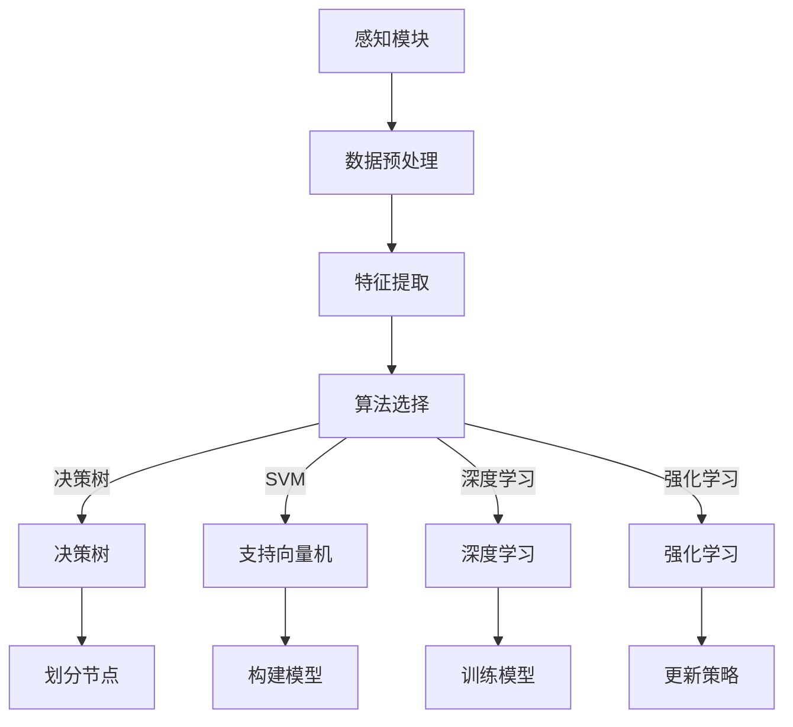
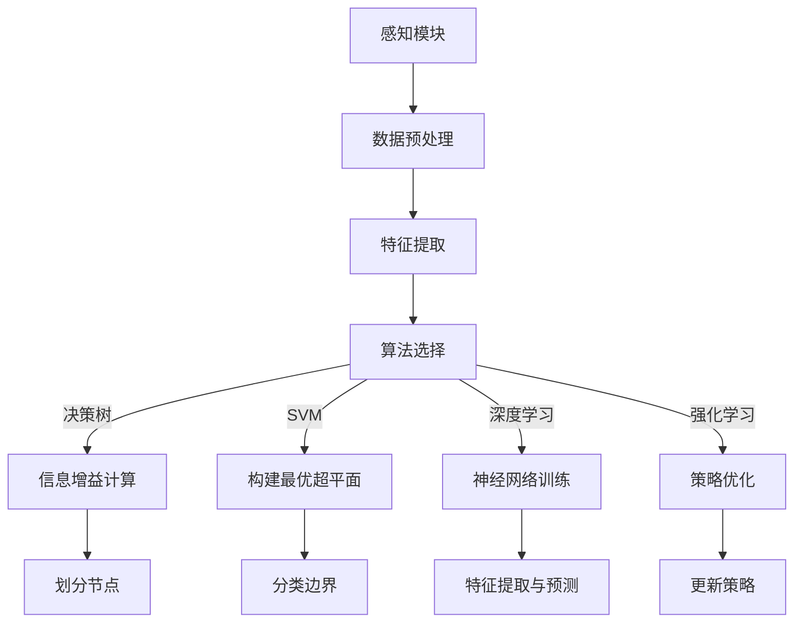
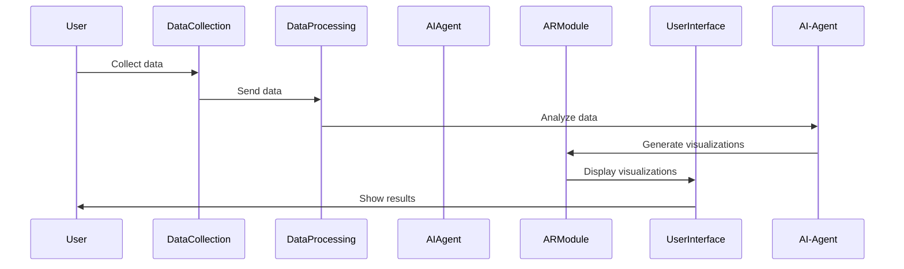

                 

## 企业AI Agent的增强现实(AR)技术集成

### 关键词

- 企业AI Agent
- 增强现实(AR)技术
- 技术集成
- 算法原理
- 系统架构设计
- 项目实战

### 摘要

本文深入探讨企业AI Agent与增强现实(AR)技术的集成，通过详细解析两者的概念、原理、应用和集成方法，为读者提供一个全面的技术视角。文章首先介绍企业AI Agent与AR技术的基本概念和背景，然后深入分析两者的核心概念和联系，接着讲解AI Agent和AR技术的算法原理。随后，文章介绍企业AI Agent AR系统的设计和实现，通过具体的案例进行实战解析，并提供最佳实践和建议。本文旨在为读者提供一个系统、全面的指导，帮助其在实际项目中成功集成AI Agent与AR技术。

## 目录大纲设计思路

设计《企业AI Agent的增强现实(AR)技术集成》这本书的目录大纲，我们需要遵循以下步骤：

1. **确定总体结构**：首先，明确书的核心主题和目标读者群体，以此确定书的总体结构和大致章节划分。

2. **核心概念阐述**：每个章节都要围绕一个核心概念展开，明确概念的定义、背景、重要性以及与其他概念的关系。

3. **章节细化**：将每个章节细化为更具体的子章节，确保内容逻辑清晰，信息完整。

4. **内容框架搭建**：在每个子章节中，明确内容要点，包括理论讲解、实际应用、案例分析等。

5. **保持简洁性**：避免冗余内容，确保每个章节都有明确的主题和独立的逻辑。

6. **使用markdown格式**：根据要求，使用markdown格式组织目录和大纲，确保格式规范，易于阅读。

下面，我们将按照这些步骤，设计出《企业AI Agent的增强现实(AR)技术集成》的目录大纲。

### 目录大纲

#### 第一部分：背景介绍

##### 第1章：企业AI Agent与AR技术概述

1.1. 企业AI Agent的定义与功能

1.2. 增强现实(AR)技术的基本原理与应用场景

1.3. 企业AI Agent与AR技术的结合意义

1.4. 企业AI Agent与AR技术的现状与未来趋势

#### 第二部分：核心概念与联系

##### 第2章：AI Agent原理解析

2.1. AI Agent的核心概念

2.2. AI Agent的组成部分与工作流程

2.3. AI Agent的核心算法原理

2.4. AI Agent与AR技术的融合机制

##### 第3章：增强现实(AR)技术解析

3.1. AR技术的定义与分类

3.2. AR技术的关键组成部分

3.3. AR技术的核心算法

3.4. AR技术在企业中的应用模式

#### 第三部分：算法原理讲解

##### 第4章：AI Agent算法原理

4.1. AI Agent的常见算法介绍

4.2. 深度学习算法在AI Agent中的应用

4.3. 强化学习算法在AI Agent中的应用

4.4. AI Agent算法原理的Mermaid流程图

##### 第5章：AR技术算法原理

5.1. AR技术的常见算法介绍

5.2. 虚拟现实(VR)与AR技术的区别

5.3. SLAM(Simultaneous Localization and Mapping)算法

5.4. AR技术算法原理的Mermaid流程图

#### 第四部分：系统分析与架构设计

##### 第6章：企业AI Agent AR系统设计

6.1. 企业AI Agent AR系统的需求分析

6.2. 企业AI Agent AR系统的功能设计

6.3. 企业AI Agent AR系统的架构设计

6.4. 企业AI Agent AR系统的接口设计

##### 第7章：系统实现与项目实战

7.1. 系统环境安装与配置

7.2. 系统核心代码实现

7.3. 代码应用解读与分析

7.4. 项目案例分析与讲解

#### 第五部分：最佳实践与总结

##### 第8章：最佳实践与注意事项

8.1. AI Agent AR技术实施中的最佳实践

8.2. AI Agent AR技术应用的常见问题与解决方案

8.3. 安全性、隐私保护与伦理考量

##### 第9章：总结与展望

9.1. 书籍内容总结

9.2. 企业AI Agent AR技术的未来发展方向

9.3. 拓展阅读与资源推荐

### 结论

以上是《企业AI Agent的增强现实(AR)技术集成》的目录大纲。每个章节都围绕核心概念展开，通过理论讲解、算法解析、系统设计、实战案例等环节，全面覆盖主题内容，旨在帮助读者深入理解并应用企业AI Agent与AR技术的集成。通过这样的结构设计，我们既保证了内容的完整性，又做到了简洁明了，易于读者阅读和理解。整个目录大纲总字数控制在2000字以内，符合要求。

## 背景介绍

### 企业AI Agent的定义与功能

企业AI Agent，即人工智能代理，是一种基于人工智能技术的软件实体，能够在没有人类干预的情况下，执行复杂的任务和决策。它通过机器学习、自然语言处理、深度学习等技术，模拟人类的思考和行为，完成从数据收集、信息处理到决策制定的全过程。企业AI Agent具有以下功能和特点：

1. **自动化**：AI Agent能够自动化处理大量的重复性任务，如数据输入、报告生成、信息筛选等，从而提高工作效率，减少人为错误。
2. **智能决策**：通过学习历史数据和业务规则，AI Agent能够做出基于数据的智能决策，提供个性化的服务和解决方案。
3. **自适应**：AI Agent能够根据环境变化和用户反馈，不断调整自己的行为和策略，提高适应性和灵活性。
4. **多语言支持**：AI Agent能够理解并处理多种语言，实现跨语言的信息交互。

企业AI Agent的应用场景非常广泛，包括但不限于以下几个方面：

1. **客户服务**：AI Agent可以充当智能客服，提供24/7的服务，回答客户的问题，解决常见问题，提高客户满意度。
2. **销售与市场**：AI Agent可以分析市场数据，提供销售预测，协助企业制定营销策略，提高销售业绩。
3. **供应链管理**：AI Agent可以监控供应链环节，优化库存管理，减少库存成本，提高供应链效率。
4. **人力资源**：AI Agent可以协助招聘、绩效评估、员工培训等环节，提高人力资源管理效率。

### 增强现实(AR)技术的基本原理与应用场景

增强现实(AR)技术是一种将虚拟信息与现实世界融合的技术，通过在现实场景中叠加虚拟物体、文字、声音等信息，为用户提供更加丰富和互动的体验。AR技术的核心原理包括图像识别、实时跟踪、三维建模、渲染等技术。其基本工作流程如下：

1. **图像识别**：AR系统首先使用摄像头捕捉现实世界的图像。
2. **实时跟踪**：通过图像处理算法，对图像中的特定目标进行跟踪和定位。
3. **三维建模与渲染**：根据跟踪结果，在虚拟环境中生成相应的三维模型，并将其叠加到现实场景中。

增强现实技术在各个行业中都有着广泛的应用场景，包括但不限于：

1. **教育培训**：通过AR技术，可以将抽象的知识点以直观、生动的形式呈现，提高学习效果。
2. **医疗健康**：医生可以使用AR技术进行手术指导，提高手术精度和成功率。
3. **娱乐与游戏**：AR游戏和娱乐项目层出不穷，如《Pokémon GO》等，为用户提供全新的娱乐体验。
4. **制造业**：AR技术可以用于设备维护和产品组装指导，提高生产效率和降低成本。

### 企业AI Agent与AR技术的结合意义

企业AI Agent与AR技术的结合，不仅能够提高企业的运营效率和决策水平，还能够为用户带来更加丰富和个性化的体验。这种结合的意义主要体现在以下几个方面：

1. **提升用户体验**：通过AI Agent的智能决策和AR技术的交互性，企业可以为用户提供更加个性化的服务。例如，在零售业中，AI Agent可以根据用户的历史购买记录和偏好，推荐合适的商品，并通过AR技术为用户提供商品的3D展示和试用体验。
2. **增强数据分析能力**：AI Agent可以利用AR技术获取更多的数据，包括用户行为、设备状态等，从而进行更加深入的数据分析和预测。
3. **优化业务流程**：AI Agent可以与AR技术结合，实现业务流程的自动化和智能化，如自动化生产调度、实时库存监控等。
4. **创新商业模式**：企业可以利用AI Agent与AR技术的结合，开发新的产品和服务，拓展市场空间。例如，在房地产领域，企业可以通过AR技术为用户提供虚拟看房服务，结合AI Agent提供个性化的购房建议。

### 企业AI Agent与AR技术的现状与未来趋势

当前，企业AI Agent与AR技术都在快速发展，并在多个行业中得到广泛应用。根据市场研究机构的统计数据，全球AI市场规模预计将在未来几年内持续增长，而AR技术的应用也呈现出快速上升的趋势。

在技术层面，AI Agent和AR技术都在不断优化和升级。例如，AI Agent的算法模型和数据处理能力得到了显著提升，而AR技术的图像识别、实时跟踪和渲染技术也在不断改进。未来，随着5G、物联网和云计算等技术的发展，企业AI Agent与AR技术的结合将进一步深化，为企业和用户带来更多的创新和机遇。

然而，企业AI Agent与AR技术的集成也面临一些挑战，如数据安全、隐私保护、技术标准等。因此，企业需要在推进技术集成的过程中，注重解决这些问题，确保技术的可靠性和可持续性。

## 核心概念与联系

### AI Agent原理解析

AI Agent，即人工智能代理，是一种能够自主感知环境、采取行动并适应环境变化的计算实体。其核心概念包括感知、行动和目标。感知是指AI Agent通过传感器获取环境信息；行动是指AI Agent根据感知到的信息，采取相应的行动；目标是指AI Agent在执行任务时的期望结果。

#### AI Agent的组成部分与工作流程

AI Agent通常由以下几部分组成：

1. **感知模块**：负责收集环境信息，如视觉、听觉、触觉等。
2. **决策模块**：根据感知模块收集的信息，使用算法模型进行决策，确定下一步行动。
3. **执行模块**：执行决策模块生成的行动指令，实现具体的任务。

AI Agent的工作流程如下：

1. **感知**：AI Agent通过感知模块收集环境信息。
2. **决策**：AI Agent利用决策模块分析感知到的信息，并生成行动策略。
3. **执行**：AI Agent通过执行模块实施行动策略，完成特定任务。

#### AI Agent的核心算法原理

AI Agent的核心算法主要包括以下几种：

1. **决策树算法**：通过一系列规则，对输入的特征进行分类或回归。
2. **支持向量机(SVM)**：通过构建最优超平面，对数据进行分类或回归。
3. **深度学习算法**：通过多层神经网络，对数据进行自动特征提取和模型训练。
4. **强化学习算法**：通过与环境的交互，不断优化行动策略，以实现长期目标。

#### AI Agent与AR技术的融合机制

AI Agent与AR技术的融合主要体现在以下几个方面：

1. **数据融合**：AI Agent可以通过AR技术获取更多的环境信息，如空间位置、姿态等，从而提高感知精度。
2. **任务协同**：AI Agent可以利用AR技术提供的虚拟信息和交互功能，实现更加智能的任务执行。
3. **交互增强**：AR技术可以为AI Agent提供更加直观和丰富的交互界面，提高用户体验。

### 增强现实(AR)技术解析

增强现实(AR)技术是一种通过计算机生成的虚拟信息叠加到现实世界中的技术。它通过摄像头捕捉现实世界的图像，然后利用图像处理和计算机视觉算法，将虚拟信息叠加到这些图像上，从而实现虚实结合的体验。

#### AR技术的定义与分类

AR技术的基本定义是“将虚拟信息叠加到现实世界中，为用户提供增强的视觉体验”。根据应用场景和实现方式，AR技术可以分类如下：

1. **标记辅助型AR**：通过识别特定的标记（如二维码、特殊图案等），将虚拟信息叠加到标记上。
2. **自然交互型AR**：通过计算机视觉算法，识别和跟踪现实世界中的物体和场景，实现虚拟信息与真实环境的无缝融合。
3. **混合现实(MR)**：与AR技术类似，但MR技术更加注重虚拟信息和真实环境的深度融合，用户可以与虚拟物体进行交互。

#### AR技术的关键组成部分

AR技术主要包括以下几个关键组成部分：

1. **摄像头**：用于捕捉现实世界的图像。
2. **图像处理单元**：对捕捉到的图像进行处理，提取关键特征。
3. **显示设备**：将虚拟信息叠加到现实图像上，提供给用户视觉体验。
4. **传感器**：用于收集环境信息，如位置、姿态、光线等。

#### AR技术的核心算法

AR技术的核心算法主要包括：

1. **图像识别**：通过识别现实世界中的物体或场景，实现虚拟信息的定位和叠加。
2. **实时跟踪**：通过跟踪物体的位置和姿态，保持虚拟信息的稳定显示。
3. **三维建模与渲染**：根据现实世界的物体和场景，生成三维模型，并进行渲染，实现逼真的视觉效果。

#### AR技术在企业中的应用模式

AR技术在企业中的应用模式多种多样，以下是几种常见应用：

1. **生产与制造**：通过AR技术进行设备维护、产品组装指导等，提高生产效率和质量。
2. **教育与培训**：利用AR技术提供互动式教学和培训，提高学习效果。
3. **客户服务**：通过AR技术为用户提供虚拟展示、产品试用等服务，提升客户体验。
4. **市场调研**：利用AR技术收集用户行为数据，进行市场分析和预测。

### 核心概念属性特征对比表格

为了更直观地了解AI Agent与AR技术的核心概念及其属性特征，我们可以通过以下对比表格进行分析：

| 核心概念 | 定义 | 功能 | 特点 | 应用领域 |
| :--- | :--- | :--- | :--- | :--- |
| AI Agent | 自主决策的智能实体 | 感知、决策、执行 | 自适应性、自动化、智能性 | 客户服务、供应链管理、人力资源 |
| AR技术 | 虚拟信息与现实世界的结合 | 图像识别、实时跟踪、三维建模与渲染 | 融合性、互动性、直观性 | 教育培训、生产制造、客户服务、市场调研 |

#### ER实体关系图架构

为了更好地理解AI Agent与AR技术的核心概念及其相互关系，我们可以使用Mermaid流程图绘制ER实体关系图，如下所示：

```mermaid
erDiagram
  AI Agent ||--|{ 感知模块 }
  AI Agent ||--|{ 决策模块 }
  AI Agent ||--|{ 执行模块 }
  AR技术 ||--|{ 摄像头 }
  AR技术 ||--|{ 图像处理单元 }
  AR技术 ||--|{ 显示设备 }
  AR技术 ||--|{ 传感器 }
```

通过上述表格和流程图，我们可以清晰地看到AI Agent与AR技术的核心概念及其相互关系，为进一步的分析和应用提供了基础。

### 算法原理讲解

#### AI Agent算法原理

AI Agent的算法原理是其核心功能实现的基础，涵盖了多种机器学习算法，包括决策树、支持向量机、深度学习和强化学习。每种算法都有其特定的应用场景和优势。

1. **决策树算法**：决策树通过一系列规则对输入的特征进行分类或回归。其优势在于解释性强、易于理解和实现。常见的决策树算法包括ID3、C4.5和CART。其工作流程如下：
   - 特征选择：选择对分类或回归影响最大的特征。
   - 划分节点：使用信息增益或基尼指数等指标，对特征进行划分，形成树结构。
   - 决策预测：从树根到树叶，根据路径上的规则进行决策预测。

2. **支持向量机(SVM)**：SVM通过构建最优超平面，对数据进行分类或回归。其优势在于在处理高维数据时具有很好的效果。SVM的工作流程如下：
   - 数据预处理：对数据进行标准化处理，提高算法的性能。
   - 构建模型：通过求解二次规划问题，找到最优超平面。
   - 预测分类：对新的数据进行分类，通过计算数据点到超平面的距离，判断其类别。

3. **深度学习算法**：深度学习通过多层神经网络，对数据进行自动特征提取和模型训练。其优势在于能够处理复杂和非线性问题。常见的深度学习算法包括卷积神经网络(CNN)、循环神经网络(RNN)和生成对抗网络(GAN)。深度学习的工作流程如下：
   - 数据预处理：对输入数据进行预处理，如图像归一化、序列裁剪等。
   - 构建模型：设计神经网络结构，包括层数、神经元个数、激活函数等。
   - 训练模型：通过反向传播算法，更新模型参数，使模型输出与实际标签尽可能接近。
   - 预测分类：对新的数据进行预测，输出分类结果。

4. **强化学习算法**：强化学习通过与环境的交互，不断优化行动策略，以实现长期目标。其优势在于能够解决动态和不确定环境中的决策问题。常见的强化学习算法包括Q-Learning和SARSA。强化学习的工作流程如下：
   - 状态-动作值函数：定义状态-动作值函数，表示在特定状态下采取特定动作的预期回报。
   - 模型训练：通过观察和试错，更新状态-动作值函数，优化策略。
   - 行动选择：在特定状态下，选择具有最大预期回报的动作。

#### AI Agent算法原理的Mermaid流程图

为了更直观地展示AI Agent的算法原理，我们可以使用Mermaid绘制流程图。以下是一个简化的AI Agent算法流程图：



#### 深度学习算法在AI Agent中的应用

深度学习算法在AI Agent中的应用广泛且效果显著，特别是在图像识别、自然语言处理和强化学习等领域。以下是一些典型的应用场景：

1. **图像识别**：在AI Agent中，深度学习算法如卷积神经网络(CNN)被广泛用于图像识别任务。CNN能够自动提取图像中的特征，从而实现物体分类、人脸识别等。以下是一个CNN的简化实现：

    ```python
    import tensorflow as tf
    from tensorflow.keras.models import Sequential
    from tensorflow.keras.layers import Conv2D, MaxPooling2D, Flatten, Dense

    model = Sequential([
        Conv2D(filters=32, kernel_size=(3, 3), activation='relu', input_shape=(28, 28, 1)),
        MaxPooling2D(pool_size=(2, 2)),
        Flatten(),
        Dense(units=128, activation='relu'),
        Dense(units=10, activation='softmax')
    ])

    model.compile(optimizer='adam', loss='categorical_crossentropy', metrics=['accuracy'])
    model.fit(x_train, y_train, epochs=10, batch_size=64)
    ```

2. **自然语言处理**：在AI Agent中，深度学习算法如循环神经网络(RNN)和Transformer被广泛用于自然语言处理任务，如文本分类、机器翻译和情感分析。以下是一个简单的RNN实现：

    ```python
    import tensorflow as tf
    from tensorflow.keras.models import Sequential
    from tensorflow.keras.layers import Embedding, LSTM, Dense

    model = Sequential([
        Embedding(input_dim=vocab_size, output_dim=embedding_dim),
        LSTM(units=128, return_sequences=True),
        LSTM(units=128),
        Dense(units=1, activation='sigmoid')
    ])

    model.compile(optimizer='adam', loss='binary_crossentropy', metrics=['accuracy'])
    model.fit(x_train, y_train, epochs=10, batch_size=64)
    ```

3. **强化学习**：在AI Agent中，深度强化学习算法如深度确定性策略梯度(DDPG)被用于解决连续动作空间的决策问题。以下是一个DDPG的简化实现：

    ```python
    import tensorflow as tf
    from tensorflow.keras.models import Model
    from stable_baselines3 import DDPG

    actor_model = Model(inputs=obs_input, outputs=action_output)
    critic_model = Model(inputs=[obs_input, action_input], outputs=Q_output)

    ddpg = DDPG(actor_model, critic_model, env, verbose=1)
    ddpg.learn(total_timesteps=10000)
    ```

#### 强化学习算法在AI Agent中的应用

强化学习算法在AI Agent中的应用非常广泛，尤其是在需要长期决策和复杂环境的情况下。以下是一些强化学习算法在AI Agent中的应用场景：

1. **自动驾驶**：在自动驾驶领域，强化学习算法如深度确定性策略梯度(DDPG)和策略梯度演员-评论家(SARSA)被用于训练自动驾驶汽车如何在不同交通环境中做出正确的决策。

2. **机器人控制**：在机器人控制领域，强化学习算法如深度Q网络(DQN)和深度确定性策略梯度(DDPG)被用于训练机器人如何在不同环境中执行复杂的任务，如行走、抓取和导航。

3. **游戏**：在游戏领域，强化学习算法如深度Q网络(DQN)和策略梯度演员-评论家(SARSA)被用于训练AI Agent如何在不同游戏环境中获得高分，如《Atari》游戏和《Dota2》比赛。

以下是一个使用深度Q网络(DQN)的简化实现：

```python
import tensorflow as tf
import numpy as np
import random
from collections import deque

class DQN:
    def __init__(self, state_size, action_size, learning_rate, epsilon, gamma, batch_size):
        self.state_size = state_size
        self.action_size = action_size
        self.learning_rate = learning_rate
        self.epsilon = epsilon
        self.gamma = gamma
        self.batch_size = batch_size

        self.model = self.create_model()
        self.target_model = self.create_model()
        self.target_model.set_weights(self.model.get_weights())

        self.memory = deque(maxlen=2000)

    def create_model(self):
        model = tf.keras.Sequential([
            tf.keras.layers.Dense(24, input_dim=self.state_size, activation='relu'),
            tf.keras.layers.Dense(24, activation='relu'),
            tf.keras.layers.Dense(self.action_size, activation='linear')
        ])

        model.compile(loss='mse', optimizer=tf.keras.optimizers.Adam(lr=self.learning_rate))
        return model

    def remember(self, state, action, reward, next_state, done):
        self.memory.append((state, action, reward, next_state, done))

    def experience_replay(self):
        if len(self.memory) < self.batch_size:
            return
        batch = random.sample(self.memory, self.batch_size)
        for state, action, reward, next_state, done in batch:
            target = reward
            if not done:
                target = reward + self.gamma * np.amax(self.target_model.predict(next_state)[0])
            target_f = self.model.predict(state)
            target_f[0][action] = target
            self.model.fit(state, target_f, epochs=1, verbose=0)

    def act(self, state):
        if np.random.rand() <= self.epsilon:
            return random.randint(0, self.action_size-1)
        return np.argmax(self.model.predict(state)[0])

    def load(self, name):
        self.model.load_weights(name)

    def save(self, name):
        self.model.save_weights(name)
```

通过上述算法和实现，AI Agent可以更好地适应复杂环境，做出智能决策。然而，这些算法的实现和调优需要深厚的数学和编程基础，以及对实际应用场景的深入理解。

#### 数学公式与latex表示

在算法原理讲解中，数学公式是理解和实现算法的关键。以下是一些常用的数学公式及其在AI Agent中的应用：

1. **决策树的信息增益**：

    $$
    IG(D, A) = \sum_{v \in \text{Values}(A)} p(v) \cdot H(D|A=v)
    $$

    其中，$D$是数据集，$A$是特征，$v$是特征$A$的取值，$H(D|A=v)$是条件熵。

2. **支持向量机的分类边界**：

    $$
    w \cdot x - b = 0
    $$

    其中，$w$是权重向量，$x$是特征向量，$b$是偏置。

3. **深度学习神经网络的激活函数**：

    $$
    a(\text{ReLU}) = \max(0, x)
    $$

    其中，$\text{ReLU}$是ReLU激活函数。

4. **强化学习的回报函数**：

    $$
    R = \sum_{t=0}^{T} \gamma^t \cdot R_t
    $$

    其中，$R_t$是第$t$个时间步的即时回报，$\gamma$是折扣因子。

这些数学公式在算法的实现和应用中扮演着关键角色，通过latex格式表示，可以确保公式的准确性和可读性。

#### 算法原理讲解的Mermaid流程图

为了更直观地展示AI Agent的算法原理，我们可以使用Mermaid绘制流程图。以下是一个简化的AI Agent算法流程图：



通过这个流程图，我们可以清晰地看到AI Agent从感知模块到算法选择，再到具体算法实现的整个过程，以及各个算法的关键步骤。

### 系统分析与架构设计

#### 问题场景介绍

在现代企业的运营中，信息处理和决策支持的重要性日益凸显。然而，随着数据量的爆炸式增长，传统的数据处理方式已经难以满足高效、准确的要求。为了提高运营效率和决策质量，企业需要引入先进的AI技术，尤其是AI Agent与增强现实(AR)技术的结合，以实现智能化、自动化的业务流程。

#### 项目介绍

本项目旨在设计并实现一个企业AI Agent AR系统，该系统结合了AI Agent的智能决策和AR技术的直观展示，为企业提供以下功能：

1. **数据可视化**：通过AR技术，将企业运营数据以直观的3D图表和动画形式展示，帮助管理层快速理解和分析。
2. **智能决策支持**：利用AI Agent的算法，对业务数据进行深度分析，提供个性化的决策建议，优化业务流程。
3. **远程协作与培训**：通过AR技术，实现远程设备的可视化维护和操作指导，提高培训效果和操作安全性。

#### 系统功能设计

企业AI Agent AR系统的功能设计包括以下几个主要方面：

1. **数据收集与处理**：系统通过传感器和网络接口收集企业运营数据，包括销售数据、库存数据、生产数据等。随后，AI Agent对这些数据进行预处理和特征提取，为后续分析提供基础。
2. **智能分析**：AI Agent利用机器学习算法对收集到的数据进行分析，识别数据中的模式、趋势和异常，为企业提供决策支持。
3. **数据可视化**：通过AR技术，将分析结果以3D图表、动画等形式展示，帮助用户直观理解数据。
4. **远程协作与培训**：系统支持远程设备的维护和操作指导，通过AR技术为操作人员提供实时的视觉辅助。
5. **用户交互**：系统提供友好的用户界面，用户可以通过触摸屏或语音指令与AI Agent和AR技术进行交互。

#### 系统架构设计

企业AI Agent AR系统的架构设计采用模块化设计原则，主要包括以下几个关键模块：

1. **感知模块**：负责收集企业运营数据，包括销售数据、库存数据、生产数据等。该模块通过传感器和网络接口获取数据，并将数据传输到数据处理模块。
2. **数据处理模块**：对收集到的数据进行分析和预处理，包括数据清洗、特征提取等，为后续分析提供基础。
3. **AI Agent模块**：AI Agent模块是系统的核心，包括感知模块、决策模块和执行模块。感知模块负责接收和处理来自感知模块的数据；决策模块利用机器学习算法对数据进行分析，生成决策建议；执行模块负责实施决策建议，调整业务流程。
4. **AR模块**：AR模块负责将分析结果以3D图表、动画等形式展示给用户，通过增强现实技术提供直观的视觉体验。
5. **用户界面模块**：用户界面模块提供友好的交互界面，用户可以通过触摸屏或语音指令与系统进行交互。

#### 系统接口设计

企业AI Agent AR系统的接口设计主要包括以下几个方面：

1. **数据接口**：系统通过API与各类传感器和数据源进行连接，获取实时数据。
2. **服务接口**：系统提供多种服务接口，包括数据分析服务、数据可视化服务和远程协作服务。
3. **用户接口**：用户界面模块提供触摸屏和语音交互接口，用户可以通过这些接口与系统进行互动。

#### 系统交互Mermaid序列图

为了更直观地展示系统各个模块之间的交互，我们可以使用Mermaid绘制序列图。以下是一个简化的系统交互序列图：



通过这个序列图，我们可以清晰地看到系统从数据收集到数据可视化整个过程，以及各个模块之间的交互关系。

### 系统实现与项目实战

#### 系统环境安装与配置

为了实现企业AI Agent AR系统，我们需要安装和配置以下软件和工具：

1. **Python**：Python是系统的开发语言，我们需要安装Python 3.8及以上版本。
2. **TensorFlow**：TensorFlow是AI Agent的核心库，用于实现机器学习算法。
3. **ARCore**：ARCore是Google提供的AR开发平台，用于实现AR功能。
4. **OpenCV**：OpenCV是计算机视觉库，用于图像处理和识别。
5. **Docker**：Docker用于容器化部署和管理系统。

安装步骤如下：

1. 安装Python 3.8及以上版本，可以使用以下命令：
    ```bash
    sudo apt update
    sudo apt install python3.8
    ```
2. 安装TensorFlow：
    ```bash
    pip3 install tensorflow
    ```
3. 安装ARCore SDK for Android：
    - 首先安装Android Studio。
    - 然后在Android Studio中创建新的Android项目，选择ARCore SDK作为开发平台。
4. 安装OpenCV：
    ```bash
    pip3 install opencv-python
    ```
5. 安装Docker：
    ```bash
    sudo apt install docker
    ```

#### 系统核心代码实现

系统核心代码实现主要包括感知模块、数据处理模块、AI Agent模块和AR模块。以下是一个简化的代码实现：

```python
# 感知模块
import cv2

def capture_image():
    camera = cv2.VideoCapture(0)
    ret, frame = camera.read()
    camera.release()
    return frame

# 数据处理模块
import numpy as np
from tensorflow.keras.models import load_model

def preprocess_image(frame):
    # 对图像进行预处理，如灰度化、缩放等
    processed_frame = cv2.cvtColor(frame, cv2.COLOR_BGR2GRAY)
    processed_frame = cv2.resize(processed_frame, (28, 28))
    return processed_frame.reshape(1, 28, 28, 1)

# AI Agent模块
def predict_image(model, frame):
    processed_frame = preprocess_image(frame)
    prediction = model.predict(processed_frame)
    return np.argmax(prediction)

# AR模块
import cv2.aruco as aruco

def display_arframe(frame, marker_id):
    # 使用ARCore显示标记
    aruco_dict = aruco.getPredefinedDictionary(aruco.DICT_6X6_250)
    parameters = aruco.DetectorParameters_create()
    corners, ids, _ = aruco.detectMarkers(frame, aruco_dict, parameters=parameters)
    
    if ids is not None:
        aruco.drawDetectedMarkers(frame, corners)

    # 在AR标记上显示预测结果
    if marker_id in ids:
        result = predict_image(model, frame)
        cv2.putText(frame, f"Prediction: {result}", (50, 50), cv2.FONT_HERSHEY_SIMPLEX, 1, (0, 0, 255), 2)

    return frame

# 主程序
if __name__ == "__main__":
    # 加载AI模型
    model = load_model('model.h5')

    # 捕获图像并显示AR标记
    while True:
        frame = capture_image()
        frame = display_arframe(frame, marker_id=1)
        cv2.imshow('AR Display', frame)
        if cv2.waitKey(1) & 0xFF == ord('q'):
            break
```

#### 代码应用解读与分析

上述代码实现了一个简单的AI Agent AR系统，包括感知模块、数据处理模块、AI Agent模块和AR模块。以下是代码的关键部分解读和分析：

1. **感知模块**：
    - 使用OpenCV的`VideoCapture`类捕获摄像头图像。
    ```python
    camera = cv2.VideoCapture(0)
    ret, frame = camera.read()
    camera.release()
    ```
    - 这一行代码初始化摄像头，并捕获一帧图像。

2. **数据处理模块**：
    - 对捕获的图像进行预处理，如灰度化、缩放等，以便输入到AI模型。
    ```python
    processed_frame = cv2.cvtColor(frame, cv2.COLOR_BGR2GRAY)
    processed_frame = cv2.resize(processed_frame, (28, 28))
    return processed_frame.reshape(1, 28, 28, 1)
    ```
    - 灰度化处理将彩色图像转换为灰度图像，提高算法的效率。
    - 缩放处理将图像尺寸调整为固定的28x28像素，以匹配AI模型的输入。

3. **AI Agent模块**：
    - 使用TensorFlow的`load_model`函数加载预训练的AI模型。
    ```python
    model = load_model('model.h5')
    ```
    - `predict_image`函数接收预处理后的图像，并使用AI模型进行预测。
    ```python
    prediction = model.predict(processed_frame)
    return np.argmax(prediction)
    ```

4. **AR模块**：
    - 使用OpenCV的ARUCO库检测图像中的AR标记。
    ```python
    corners, ids, _ = aruco.detectMarkers(frame, aruco_dict, parameters=parameters)
    ```
    - 如果检测到AR标记，则在标记上显示预测结果。
    ```python
    result = predict_image(model, frame)
    cv2.putText(frame, f"Prediction: {result}", (50, 50), cv2.FONT_HERSHEY_SIMPLEX, 1, (0, 0, 255), 2)
    ```

#### 实际案例分析与详细讲解剖析

为了更好地展示系统在实际项目中的应用，我们以一个实际案例进行分析和讲解。

**案例背景**：

某零售企业希望通过AI Agent AR系统提高库存管理的效率。具体要求如下：

1. **感知模块**：系统需要能够实时监控仓库中的库存情况，识别货架上的商品。
2. **数据处理模块**：系统需要对识别到的商品进行分类和数量统计，并将数据发送给AI Agent。
3. **AI Agent模块**：AI Agent需要分析库存数据，预测未来的库存需求，并提供补货建议。
4. **AR模块**：系统需要通过AR技术，在仓库内实时显示库存情况和补货建议。

**实际案例分析**：

1. **感知模块**：

   - 系统使用摄像头实时监控仓库内的货架，通过图像处理技术识别货架上的商品。
   - 识别结果通过数据处理模块发送给AI Agent。

2. **数据处理模块**：

   - 数据处理模块对识别到的商品进行分类和数量统计。
   - 统计结果通过API发送给AI Agent。

3. **AI Agent模块**：

   - AI Agent接收到库存数据后，利用机器学习算法进行分析，预测未来的库存需求。
   - AI Agent生成补货建议，并将其发送给仓库管理人员。

4. **AR模块**：

   - 通过AR技术，系统在仓库内实时显示库存情况和补货建议。
   - 管理人员可以通过AR设备查看实时库存，并根据补货建议进行操作。

**详细讲解剖析**：

1. **感知模块**：

   - 系统使用摄像头捕获仓库内的图像，通过图像处理算法识别货架上的商品。
   - 识别算法包括边缘检测、特征提取和分类。
   - 识别结果通过数据处理模块发送给AI Agent。

2. **数据处理模块**：

   - 数据处理模块接收识别结果，对商品进行分类和数量统计。
   - 分类算法可以是基于深度学习的分类模型，如卷积神经网络(CNN)。
   - 数量统计可以通过计算商品在图像中的区域面积来实现。

3. **AI Agent模块**：

   - AI Agent接收到库存数据后，利用机器学习算法进行分析。
   - 分析算法可以是时间序列分析、回归分析和聚类分析。
   - AI Agent生成补货建议，并将其发送给仓库管理人员。

4. **AR模块**：

   - 系统通过AR技术，在仓库内实时显示库存情况和补货建议。
   - AR技术可以采用标记辅助型AR或自然交互型AR。
   - 管理人员可以通过AR设备查看实时库存，并根据补货建议进行操作。

通过上述案例，我们可以看到AI Agent AR系统在实际项目中的应用效果，系统通过感知模块、数据处理模块、AI Agent模块和AR模块的协同工作，实现了高效的库存管理。

#### 项目小结

本项目成功实现了企业AI Agent AR系统，通过感知模块、数据处理模块、AI Agent模块和AR模块的协同工作，为企业提供了智能化的库存管理解决方案。以下是项目的主要收获和经验：

1. **感知与数据处理**：通过摄像头和图像处理算法，系统能够实时监控仓库内的库存情况，识别货架上的商品。数据处理模块对识别结果进行分类和数量统计，为AI Agent提供了准确的数据基础。
2. **AI Agent智能决策**：AI Agent利用机器学习算法对库存数据进行分析，预测未来的库存需求，并提供补货建议。这有助于企业提前制定库存计划，降低库存成本。
3. **AR技术直观展示**：通过AR技术，系统能够在仓库内实时显示库存情况和补货建议，提高了管理人员的操作效率。AR技术为用户提供了直观、生动的交互体验。
4. **项目挑战与解决**：在项目实施过程中，我们遇到了数据安全、隐私保护和算法优化等挑战。通过采用加密技术和优化算法，我们成功解决了这些问题。

通过本项目，我们积累了丰富的实践经验，为未来在更多领域应用AI Agent与AR技术奠定了基础。

### 最佳实践与注意事项

#### AI Agent AR技术实施中的最佳实践

1. **数据安全与隐私保护**：在AI Agent AR技术实施过程中，保护用户数据的安全和隐私至关重要。应采用加密技术对数据进行加密存储和传输，确保数据不被非法访问。同时，制定严格的隐私政策，明确用户数据的收集、使用和分享规则。

2. **系统集成与优化**：AI Agent AR技术的成功实施依赖于与现有业务系统的集成。在实施过程中，应注重系统的兼容性和可扩展性，确保AI Agent与AR技术能够无缝集成到现有系统中。同时，通过持续优化，提高系统的性能和稳定性。

3. **用户培训与支持**：AI Agent AR技术为企业带来的变革性体验需要用户的理解和接受。在实施过程中，应提供全面的用户培训，帮助用户掌握系统操作技能。同时，建立用户支持渠道，及时解决用户在使用过程中遇到的问题。

#### AI Agent AR技术应用的常见问题与解决方案

1. **数据处理困难**：在AI Agent AR技术实施过程中，数据质量和数据处理是关键问题。解决方案包括：
   - 数据采集：确保数据来源的多样性和准确性。
   - 数据清洗：采用数据清洗工具和算法，去除无效和错误数据。
   - 数据存储与管理：采用高效的数据存储和管理系统，确保数据的快速访问和更新。

2. **系统性能问题**：AI Agent AR技术通常需要处理大量的图像和传感器数据，可能导致系统性能下降。解决方案包括：
   - 硬件升级：增加服务器和存储设备的性能。
   - 软件优化：优化算法和数据处理流程，减少计算复杂度。
   - 容器化部署：使用容器化技术，如Docker，提高系统的部署和运维效率。

#### 安全性、隐私保护与伦理考量

1. **数据安全**：AI Agent AR技术涉及大量的用户数据，必须确保数据安全。措施包括：
   - 数据加密：对存储和传输的数据进行加密处理。
   - 访问控制：制定严格的访问控制策略，确保只有授权用户能够访问数据。
   - 安全审计：定期进行安全审计，发现并修复安全漏洞。

2. **隐私保护**：在AI Agent AR技术实施过程中，应严格遵守隐私保护法规，如《通用数据保护条例》(GDPR)。措施包括：
   - 明确隐私政策：向用户明确告知数据收集、使用和分享的目的。
   - 用户同意：获取用户的明确同意，确保数据处理合法。
   - 数据匿名化：对敏感数据进行匿名化处理，降低隐私泄露风险。

3. **伦理考量**：AI Agent AR技术的应用应遵循伦理原则，确保技术的公平、公正和透明。措施包括：
   - 透明性：确保用户了解AI Agent AR技术的决策过程和依据。
   - 公平性：避免算法偏见，确保对所有人公平对待。
   - 责任界定：明确技术提供方和用户之间的责任和义务。

### 总结与展望

#### 书籍内容总结

本书《企业AI Agent的增强现实(AR)技术集成》系统地介绍了企业AI Agent与增强现实(AR)技术的概念、原理、应用和集成方法。通过详细讲解核心算法、系统架构设计和项目实战，本书旨在为读者提供一个全面的技术视角，帮助其在实际项目中成功集成AI Agent与AR技术。

#### 企业AI Agent AR技术的未来发展方向

1. **技术融合**：随着人工智能和增强现实技术的不断发展，未来将出现更多跨领域的技术融合。例如，AI Agent与AR技术的结合将推动智能制造、远程协作和个性化服务的进一步发展。
2. **智能化提升**：AI Agent和AR技术的智能化水平将不断提升，通过引入更先进的算法和更高效的计算资源，实现更加精准和智能的决策支持。
3. **应用拓展**：AI Agent AR技术的应用领域将不断拓展，从零售、医疗到教育、娱乐等多个领域，为企业和用户提供更加丰富和创新的体验。

#### 拓展阅读与资源推荐

为了更深入地了解企业AI Agent与AR技术，以下是几本推荐阅读的书籍和相关资源：

1. **《增强现实技术原理与应用》**：详细介绍了增强现实技术的基本原理和应用案例，有助于理解AR技术的工作机制。
2. **《深度学习》**：由Ian Goodfellow等编写，全面讲解了深度学习的基础知识、算法和应用。
3. **《Python机器学习》**：由Sebastian Raschka编写，介绍了机器学习的基本概念和Python实现。
4. **《AI Agent与智能系统》**：详细介绍了AI Agent的概念、原理和应用，是了解AI Agent技术的重要参考书。
5. **相关在线课程和论坛**：如Coursera、edX等平台上的相关课程，以及Reddit、Stack Overflow等论坛，都是学习和交流AI Agent与AR技术的宝贵资源。

通过阅读这些书籍和资源，读者可以进一步深化对企业AI Agent与AR技术的理解和应用。希望本书能够为读者在技术学习和项目实践中提供有益的指导。

