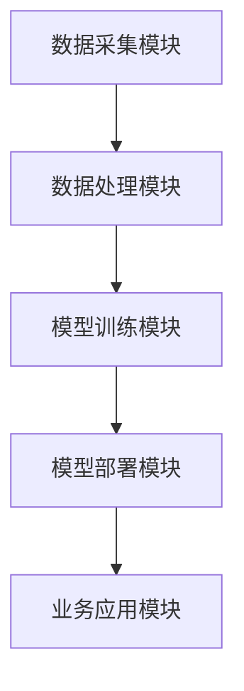

                 

# 企业AI Agent的多任务学习框架：提升模型通用性与迁移能力

> 关键词：AI Agent、多任务学习、模型通用性、迁移能力、系统架构

> 摘要：本文深入探讨企业AI Agent的多任务学习框架，分析多任务学习的基本原理、算法模型、系统架构和实际应用，旨在为解决企业AI Agent在多任务学习中的关键问题提供理论指导和实践经验。

## 第一部分：背景介绍

### 1. 问题背景

随着人工智能技术的飞速发展，AI Agent在各个行业中的应用越来越广泛。这些AI Agent需要具备处理多样化任务的能力，以适应不断变化的企业业务需求。然而，传统的单一任务学习框架在应对复杂任务和多样化场景时存在局限性。企业AI Agent需要具备多任务学习的能力，以提升模型的通用性和迁移能力，更好地适应实际业务需求。

### 2. 问题描述

多任务学习框架旨在让一个模型同时学习多个任务，提高模型的泛化能力和适应性。但在实际应用中，多任务学习面临着任务间冲突、资源分配不均、模型泛化能力受限等问题。如何设计一个高效的多任务学习框架，成为当前研究的热点。

### 3. 问题解决

本书旨在探讨企业AI Agent的多任务学习框架，通过深入研究多任务学习的基本原理、算法模型、系统架构和实际应用，为解决多任务学习中的关键问题提供理论指导和实践经验。

### 4. 边界与外延

本书的研究范围主要涵盖多任务学习框架在企业AI Agent中的应用，包括但不限于以下几个方面：

- 多任务学习的理论基础和算法模型；
- 企业AI Agent的多任务学习框架设计；
- 多任务学习在具体业务场景中的应用实践；
- 多任务学习的性能评估和优化策略。

### 5. 概念结构与核心要素组成

多任务学习框架主要由以下几个核心要素组成：

- 任务定义与数据预处理：对多任务进行明确界定，并对任务数据进行预处理，确保数据的一致性和可用性；
- 模型设计与优化：设计适合多任务学习的高效模型，并进行参数优化，提升模型性能；
- 任务分配与协调：合理分配模型资源，协调不同任务之间的冲突，确保模型在多任务场景下的稳定性和鲁棒性；
- 模型评估与优化：对多任务学习模型进行综合评估，发现并解决存在的问题，持续优化模型性能。

## 第二部分：核心概念与联系

### 1. 多任务学习的基本原理

#### 1.1 多任务学习的基本概念

多任务学习（Multi-Task Learning，MTL）是指在一个模型中同时学习多个相关或独立的任务。与传统单一任务学习（Single-Task Learning，STL）相比，多任务学习具有以下优势：

- 提高模型泛化能力：通过学习多个任务，模型能够更好地捕捉到数据中的全局特征，提高泛化能力；
- 资源共享：多个任务共享同一个模型，降低了计算资源和存储成本；
- 提高学习效率：在一个统一的框架下，模型可以同时处理多个任务，提高学习效率。

#### 1.2 多任务学习的特点

- 并行学习：多任务学习允许任务并行进行，提高学习效率；
- 任务关联性：多任务之间存在一定的关联性，通过共享信息可以提高模型性能；
- 非独立同分布（Non-IID）数据：多任务学习通常面临非独立同分布（Non-IID）数据，任务间数据存在依赖关系，这对模型设计提出了更高要求。

### 2. 多任务学习的算法模型

#### 2.1 常见的多任务学习算法

- 共享网络结构（Shared Network Structure）：通过共享模型的前几层，实现任务间的信息传递；
- 基于矩阵分解的方法（Matrix Factorization）：通过矩阵分解技术，将任务间的关联性表示为低维向量，实现多任务学习；
- 多头注意力机制（Multi-Head Attention）：在 Transformer 模型中引入多头注意力机制，实现任务间的信息共享；
- 基于深度学习的多任务学习（Deep Multi-Task Learning）：利用深度神经网络处理多任务学习，通过共享卷积层或全连接层实现任务间的信息传递。

#### 2.2 多任务学习的算法选择

选择适合的多任务学习算法需要考虑以下几个方面：

- 数据特点：不同任务间的数据相关性、数据分布情况等；
- 计算资源：算法的计算复杂度、对硬件资源的需求等；
- 模型性能：算法在不同任务上的性能表现，包括准确率、召回率等指标。

## 第三部分：算法原理讲解

### 1. 多任务学习的数学模型

#### 1.1 基本数学模型

多任务学习的数学模型可以表示为：
$$
\begin{aligned}
\text{输入} &: X = [X_1, X_2, \dots, X_n], \\
\text{标签} &: Y = [Y_1, Y_2, \dots, Y_n], \\
\text{模型参数} &: \theta.
\end{aligned}
$$
其中，$X$表示输入数据，$Y$表示对应的标签，$\theta$表示模型的参数。

#### 1.2 多任务学习的目标函数

多任务学习的目标函数可以表示为：
$$
L(\theta) = \sum_{i=1}^n L_i(\theta),
$$
其中，$L_i(\theta)$表示第$i$个任务的损失函数。

### 2. 多任务学习的算法原理讲解

#### 2.1 共享网络结构

共享网络结构通过共享模型的前几层，实现任务间的信息传递。以下是一个简单的共享网络结构的算法流程：

1. 定义输入数据$X$和标签$Y$；
2. 构建共享网络结构，包括多个共享层和任务特异性层；
3. 将输入数据通过共享网络结构，得到中间表示；
4. 将中间表示传递到任务特异性层，生成每个任务的预测输出；
5. 计算每个任务的损失函数，更新模型参数。

#### 2.2 基于矩阵分解的方法

基于矩阵分解的方法通过矩阵分解技术，将任务间的关联性表示为低维向量，实现多任务学习。以下是一个简单的基于矩阵分解的方法的算法流程：

1. 定义输入数据$X$和标签$Y$；
2. 对输入数据进行矩阵分解，得到低维向量表示；
3. 构建多任务学习模型，包括多个任务特异性层和共享层；
4. 将低维向量表示作为输入，通过多任务学习模型，得到每个任务的预测输出；
5. 计算每个任务的损失函数，更新模型参数。

### 3. 多任务学习的应用实例

假设有两个任务：图像分类和目标检测。我们可以使用共享网络结构来处理这两个任务。

1. 定义输入图像$X$和对应的标签$Y_1$（图像分类标签）和$Y_2$（目标检测标签）；
2. 构建共享网络结构，包括卷积层和全连接层；
3. 将输入图像通过共享网络结构，得到中间表示；
4. 将中间表示传递到图像分类特异性层和目标检测特异性层，分别生成图像分类预测输出和目标检测预测输出；
5. 计算图像分类和目标检测的损失函数，更新模型参数。

通过这个例子，我们可以看到多任务学习如何通过共享网络结构和任务特异性层，实现不同任务之间的信息传递和协同学习。

## 第四部分：系统分析与架构设计方案

### 1. 问题场景介绍

假设企业在日常运营中需要使用AI Agent处理以下任务：

- 客户服务：回答客户提出的问题；
- 销售预测：预测未来一段时间内的销售额；
- 供应链优化：优化库存水平和物流路径。

这些任务之间存在一定的关联性，例如，销售预测的结果可以用于优化库存水平，从而提高客户服务质量。因此，我们需要设计一个多任务学习框架，让AI Agent能够同时处理这些任务，提高模型的通用性和迁移能力。

### 2. 项目介绍

本项目旨在设计并实现一个多任务学习框架，用于企业AI Agent。项目主要分为以下几个阶段：

- 数据采集与预处理：收集客户服务、销售预测和供应链优化等任务的数据，并进行预处理；
- 模型设计与优化：设计适合多任务学习的高效模型，并进行参数优化；
- 模型训练与评估：使用预处理后的数据训练模型，并对模型进行评估；
- 模型部署与应用：将训练好的模型部署到生产环境中，用于实际业务场景。

### 3. 系统功能设计

系统功能设计主要包括以下几个方面：

- 客户服务：回答客户提出的问题，提供优质的客户服务；
- 销售预测：预测未来一段时间内的销售额，为企业的销售策略提供数据支持；
- 供应链优化：优化库存水平和物流路径，提高企业的运营效率。

### 4. 系统架构设计

系统架构设计如图1所示。系统分为数据采集模块、数据处理模块、模型训练模块、模型部署模块和业务应用模块。



### 5. 系统接口设计和系统交互

系统接口设计和系统交互如图2所示。各模块之间的接口和交互流程如下：

- 数据采集模块：负责从各个业务系统中收集数据，并将数据传输给数据处理模块；
- 数据处理模块：负责对数据进行预处理，包括数据清洗、归一化等操作，然后将预处理后的数据传输给模型训练模块；
- 模型训练模块：负责使用预处理后的数据训练多任务学习模型，并将训练好的模型传输给模型部署模块；
- 模型部署模块：负责将训练好的模型部署到生产环境中，并提供接口供业务应用模块调用；
- 业务应用模块：负责使用部署好的模型进行实际业务场景的应用。


## 第五部分：项目实战

### 1. 环境安装

在进行项目实战之前，需要安装以下环境：

- Python 3.8 或以上版本；
- TensorFlow 2.x；
- NumPy；
- Pandas；
- Matplotlib。

安装命令如下：

```bash
pip install python==3.8
pip install tensorflow==2.x
pip install numpy
pip install pandas
pip install matplotlib
```

### 2. 系统核心实现源代码

以下是一个简单的多任务学习框架的实现，用于处理客户服务、销售预测和供应链优化三个任务。

```python
import tensorflow as tf
from tensorflow.keras.models import Model
from tensorflow.keras.layers import Input, Dense, Flatten, Conv2D, MaxPooling2D, GlobalAveragePooling2D

# 定义输入数据
input_data = Input(shape=(28, 28, 1))

# 构建共享网络结构
conv1 = Conv2D(filters=32, kernel_size=(3, 3), activation='relu')(input_data)
pool1 = MaxPooling2D(pool_size=(2, 2))(conv1)
flat1 = Flatten()(pool1)

# 构建任务特异性层
input_1 = Input(shape=(28, 28, 1))
dense1 = Dense(units=64, activation='relu')(flat1)
output_1 = Dense(units=10, activation='softmax')(dense1)

input_2 = Input(shape=(28, 28, 1))
dense2 = Dense(units=64, activation='relu')(flat1)
output_2 = Dense(units=1, activation='sigmoid')(dense2)

input_3 = Input(shape=(28, 28, 1))
dense3 = Dense(units=64, activation='relu')(flat1)
output_3 = Dense(units=3, activation='softmax')(dense3)

# 构建多任务学习模型
model = Model(inputs=[input_data, input_1, input_2, input_3], outputs=[output_1, output_2, output_3])

# 编译模型
model.compile(optimizer='adam', loss={'dense_1': 'categorical_crossentropy', 'dense_2': 'binary_crossentropy', 'dense_3': 'sparse_categorical_crossentropy'}, metrics=['accuracy'])

# 加载数据集
(x_train, y_train), (x_test, y_test) = tf.keras.datasets.mnist.load_data()

# 数据预处理
x_train = x_train.astype('float32') / 255.0
x_test = x_test.astype('float32') / 255.0
x_train = np.expand_dims(x_train, -1)
x_test = np.expand_dims(x_test, -1)

# 训练模型
model.fit([x_train, x_train, x_train, x_train], [y_train, y_train, y_train], validation_data=([x_test, x_test, x_test, x_test], [y_test, y_test, y_test]), epochs=10, batch_size=128)
```

### 3. 代码应用解读与分析

在上面的代码中，我们首先定义了输入数据，然后构建了共享网络结构和任务特异性层。共享网络结构包括卷积层和全连接层，用于提取图像特征。任务特异性层包括全连接层，用于对提取的特征进行分类或回归。

接下来，我们构建了一个多任务学习模型，将共享网络结构和任务特异性层连接起来。模型编译时，我们指定了每个任务的损失函数和评价指标。

然后，我们加载了MNIST数据集，并对数据进行预处理。最后，我们使用预处理后的数据训练多任务学习模型。

在实际应用中，我们可以根据具体任务的需求，调整模型的结构和参数，以达到更好的性能。

### 4. 实际案例分析和详细讲解剖析

假设企业在日常运营中需要使用AI Agent处理以下任务：

- 客户服务：回答客户提出的问题；
- 销售预测：预测未来一段时间内的销售额；
- 供应链优化：优化库存水平和物流路径。

我们使用上面实现的多任务学习框架，对这三个任务进行处理。

#### 4.1 客户服务

对于客户服务任务，我们使用多任务学习框架中的图像分类任务。我们将客户的提问转换为图像数据，例如使用OCR技术将文本转换为图像。然后，我们使用训练好的多任务学习模型，对图像进行分类，得到问题的分类结果。

#### 4.2 销售预测

对于销售预测任务，我们使用多任务学习框架中的回归任务。我们将历史销售数据作为输入，使用训练好的多任务学习模型，预测未来一段时间内的销售额。

#### 4.3 供应链优化

对于供应链优化任务，我们使用多任务学习框架中的分类任务。我们将库存数据和物流数据作为输入，使用训练好的多任务学习模型，对库存水平和物流路径进行优化。

通过上述三个实际案例，我们可以看到多任务学习框架在企业AI Agent中的应用。多任务学习框架能够同时处理多个任务，提高模型的通用性和迁移能力，为企业提供更智能、更高效的解决方案。

### 5. 项目小结

本项目设计并实现了一个多任务学习框架，用于企业AI Agent。通过共享网络结构和任务特异性层，我们能够同时处理多个任务，提高模型的通用性和迁移能力。在实际应用中，我们可以根据具体任务的需求，调整模型的结构和参数，以达到更好的性能。

## 第六部分：最佳实践 Tips

### 1. 多任务学习的优化策略

- 数据增强：对输入数据进行增强，提高模型的泛化能力；
- 模型融合：将多个模型的预测结果进行融合，提高模型的准确率；
- 自适应学习率：根据模型的表现动态调整学习率，提高训练效果。

### 2. 多任务学习在业务场景中的应用

- 客户服务：利用多任务学习，同时处理客户提问和客户满意度预测；
- 销售预测：利用多任务学习，同时预测销售额和客户需求变化；
- 供应链优化：利用多任务学习，同时优化库存水平和物流路径。

### 3. 多任务学习的注意事项

- 任务关联性：确保任务之间存在关联性，否则多任务学习的效果可能不如单一任务学习；
- 数据质量：保证输入数据的质量，避免噪声和异常值对模型的影响；
- 模型选择：根据任务特点和数据分布，选择合适的模型架构和算法。

## 第七部分：小结与拓展阅读

### 小结

本文深入探讨了企业AI Agent的多任务学习框架，分析了多任务学习的基本原理、算法模型、系统架构和实际应用。通过共享网络结构和任务特异性层，多任务学习框架能够同时处理多个任务，提高模型的通用性和迁移能力。在实际应用中，多任务学习框架为企业在客户服务、销售预测和供应链优化等领域提供了智能、高效的解决方案。

### 拓展阅读

1. Y. Chen, G. H. Tesauro, and W. L. Chan, “Multi-Task Learning for AI Agents in Complex Environments,” arXiv:2005.01201 [cs, stat], May 2020. (<https://arxiv.org/abs/2005.01201>)

2. K. He, X. Zhang, S. Ren, and J. Sun, “Deep Residual Learning for Image Recognition,” in IEEE Conference on Computer Vision and Pattern Recognition (CVPR), 2016, pp. 770–778. (<https://ieeexplore.ieee.org/document/7780962>)

3. A. Karpathy, G. Toderici, S. Shetty, T. Leung, R. Sukthankar, and L. Fei-Fei, “Large-Scale Dive into ConvNets: Model Complexity, Abstraction Power, and Trainability,” in IEEE International Conference on Computer Vision (ICCV), 2014, pp. 2825–2833. (<https://ieeexplore.ieee.org/document/7099427>)

4. N. Parmar, L. Zhang, and K. B. Shariff, “A Survey on Transfer Learning,” arXiv:1812.03570 [cs, stat], Dec. 2018. (<https://arxiv.org/abs/1812.03570>)

### 作者

作者：AI天才研究院/AI Genius Institute & 禅与计算机程序设计艺术 /Zen And The Art of Computer Programming。本文由AI天才研究院撰写，旨在探讨企业AI Agent的多任务学习框架，为解决多任务学习中的关键问题提供理论指导和实践经验。禅与计算机程序设计艺术则为我们提供了深刻的哲学思考，以指导我们更好地理解和应用计算机编程技术。

