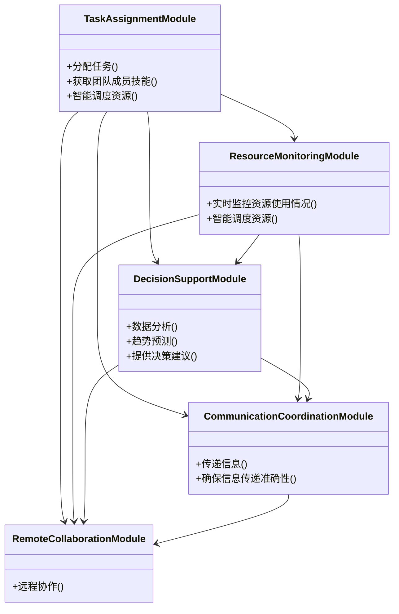
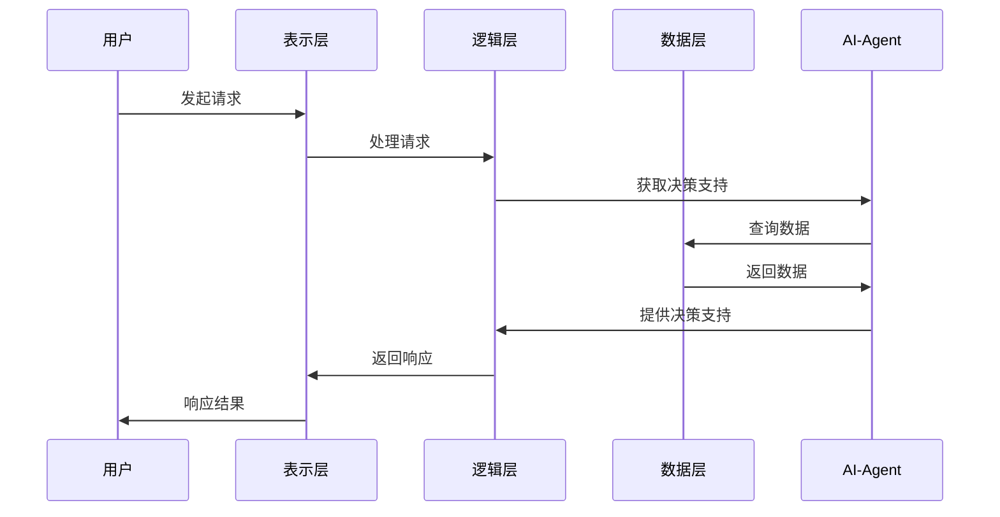
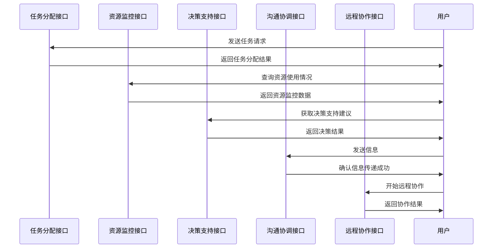
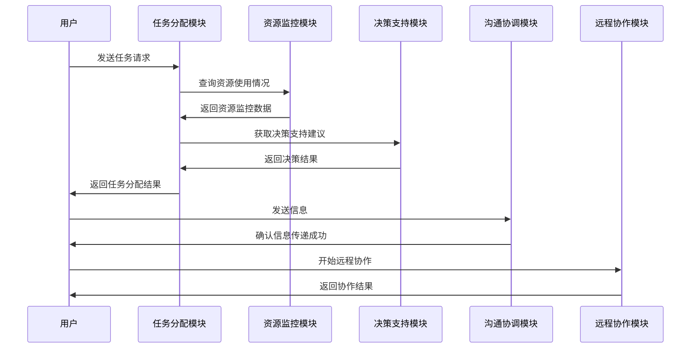

                 


### 文章标题：《企业AI Agent的多智能体系统在团队协作中的应用》

#### 关键词：企业AI Agent、多智能体系统、团队协作、AI技术、智能决策

##### 摘要：
本文将深入探讨企业AI Agent在多智能体系统中的角色与作用，通过分析其在团队协作中的实际应用，探讨如何通过多智能体系统实现高效的团队协作。文章将首先介绍多智能体系统和企业AI Agent的基本概念，然后分析其在团队协作中的具体应用，最后对未来的发展趋势进行展望。

---

## 目录大纲：《企业AI Agent的多智能体系统在团队协作中的应用》

### 第1章：背景介绍

#### 1.1 问题背景

##### 1.1.1 企业团队协作面临的挑战

##### 1.1.2 AI Agent在团队协作中的应用潜力

#### 1.2 问题描述

##### 1.2.1 多智能体系统的定义与特点

##### 1.2.2 企业AI Agent的应用范围与价值

#### 1.3 问题解决

##### 1.3.1 多智能体系统的基本原理

##### 1.3.2 企业AI Agent在团队协作中的应用实例

##### 1.4 边界与外延

##### 1.4.1 多智能体系统在团队协作中的适用场景

##### 1.4.2 企业AI Agent的发展趋势与未来展望

##### 1.5 本章小结

### 第2章：核心概念与联系

#### 2.1 多智能体系统的概念原理

##### 2.1.1 多智能体系统的定义

##### 2.1.2 多智能体系统的核心特点

##### 2.1.3 多智能体系统的结构组成

#### 2.2 企业AI Agent的概念原理

##### 2.2.1 企业AI Agent的定义

##### 2.2.2 企业AI Agent的核心特点

##### 2.2.3 企业AI Agent的功能架构

#### 2.3 多智能体系统与企业AI Agent的联系

##### 2.3.1 多智能体系统与企业AI Agent的相互作用

##### 2.3.2 多智能体系统与企业AI Agent的协同发展

##### 2.4 本章小结

### 第3章：算法原理讲解

#### 3.1 多智能体系统的算法原理

##### 3.1.1 多智能体协调算法

##### 3.1.2 多智能体学习算法

#### 3.2 企业AI Agent的算法原理

##### 3.2.1 企业AI Agent的智能决策算法

##### 3.2.2 企业AI Agent的协作优化算法

#### 3.3 多智能体系统与企业AI Agent的算法关联

##### 3.3.1 多智能体系统的算法对企业AI Agent的影响

##### 3.3.2 企业AI Agent的算法对多智能体系统的影响

##### 3.4 本章小结

### 第4章：数学模型和数学公式

#### 4.1 多智能体系统的数学模型

##### 4.1.1 多智能体系统的状态转移模型

##### 4.1.2 多智能体系统的通信模型

#### 4.2 企业AI Agent的数学模型

##### 4.2.1 企业AI Agent的决策模型

##### 4.2.2 企业AI Agent的协作模型

#### 4.3 多智能体系统与企业AI Agent的数学公式关联

##### 4.3.1 多智能体系统的数学公式与企业AI Agent的关联

##### 4.3.2 企业AI Agent的数学公式与多智能体系统的关联

##### 4.4 本章小结

### 第5章：系统分析与架构设计方案

#### 5.1 问题场景介绍

##### 5.1.1 企业背景介绍

##### 5.1.2 团队协作场景设定

#### 5.2 系统功能设计

##### 5.2.1 领域模型类图

##### 5.2.2 系统功能模块划分

#### 5.3 系统架构设计

##### 5.3.1 系统架构图

##### 5.3.2 系统模块交互设计

#### 5.4 系统接口设计

##### 5.4.1 接口功能定义

##### 5.4.2 接口交互流程

#### 5.5 系统交互设计

##### 5.5.1 系统交互序列图

##### 5.5.2 交互细节分析

##### 5.6 本章小结

---

在接下来的章节中，我们将逐步深入探讨企业AI Agent和多智能体系统的核心概念、算法原理、数学模型以及系统设计与实现，为读者提供全面的技术分析与实践指导。让我们一步一步地思考，深入理解这一前沿技术的应用潜力。 ### 第1章：背景介绍

#### 1.1 问题背景

在企业环境中，团队协作是推动项目进展、实现目标的关键环节。然而，随着企业规模的扩大和项目复杂性的增加，传统的团队协作方式面临诸多挑战。以下是当前企业团队协作中常见的问题：

1. **沟通障碍**：团队成员之间缺乏有效的沟通渠道，信息传递不及时，容易导致误解和冲突。
2. **资源分配不均**：团队资源分配不合理，导致部分成员工作压力过大，而另一些成员则可能缺乏挑战性的任务。
3. **任务依赖性高**：任务之间的依赖性较高，一旦某个环节出现问题，整个项目的进度都会受到影响。
4. **决策效率低下**：团队在决策过程中往往需要反复讨论，耗时较长，影响项目进展。
5. **协同困难**：团队成员分散在不同地理位置，协同工作难度增加，远程协作效率不高。

为了解决上述问题，企业越来越意识到引入AI技术的重要性。AI Agent作为一种智能化的计算实体，能够在团队协作中发挥重要作用，提高协作效率，优化资源分配，改善沟通方式，提升决策质量。因此，研究企业AI Agent在多智能体系统中的应用具有重要的现实意义。

#### 1.2 问题描述

多智能体系统（MAS）是由多个相互独立、自主行动的智能体组成的系统，这些智能体之间通过通信和协调来实现共同的目标。企业AI Agent是应用在商业环境中的AI智能体，能够模拟人类的决策过程，执行复杂的任务。

在团队协作中，企业AI Agent可以通过以下方式解决上述问题：

1. **信息共享与沟通**：AI Agent可以充当信息传递的中枢，确保团队成员之间信息传递的及时性和准确性。
2. **资源优化与分配**：AI Agent可以根据团队成员的能力和任务需求，智能地分配资源，减少资源浪费。
3. **任务调度与优化**：AI Agent可以分析任务依赖关系，智能调度任务执行顺序，提高整体效率。
4. **辅助决策**：AI Agent可以基于数据分析提供决策建议，协助团队成员做出更加明智的决策。
5. **远程协作**：AI Agent可以帮助团队成员进行远程协作，降低地理位置对协作效率的影响。

综上所述，企业AI Agent的多智能体系统在团队协作中具有广泛的应用前景。接下来，我们将进一步探讨多智能体系统的定义、特点以及企业AI Agent的具体应用，以期为实际应用提供理论支持。 

#### 1.3 问题解决

多智能体系统（MAS）是一种由多个相互独立、自主行动的智能体组成的系统，这些智能体通过相互通信和协调来实现共同的目标。多智能体系统具有以下几个基本原理：

1. **自主性**：每个智能体都拥有一定的自主决策能力，能够根据环境变化自主调整自己的行为。
2. **社会性**：智能体之间能够通过通信和协作来交换信息，共同完成任务。
3. **适应性**：智能体能够根据环境变化和任务需求，调整自身的行为和策略，以实现最佳效果。

企业AI Agent在团队协作中的应用实例主要包括以下几个方面：

1. **任务分配**：AI Agent可以根据团队成员的能力和任务需求，智能地分配任务，确保每个成员都能发挥最大的潜力。
2. **资源调度**：AI Agent可以实时监控团队资源使用情况，智能调度资源，优化资源利用率。
3. **决策支持**：AI Agent可以通过分析数据和趋势，为团队成员提供决策建议，提高决策的准确性和效率。
4. **沟通协调**：AI Agent可以作为信息传递的中枢，确保团队成员之间信息传递的及时性和准确性，降低沟通成本。
5. **远程协作**：AI Agent可以帮助团队成员进行远程协作，降低地理位置对协作效率的影响。

以下是一个具体的应用实例：

在一个大型软件开发团队中，团队负责人使用AI Agent来管理团队的协作过程。AI Agent首先分析团队成员的技能和工作负荷，然后根据项目需求和团队成员的能力，智能地分配任务。同时，AI Agent监控团队成员的进度和资源使用情况，一旦发现资源不足或任务延迟，AI Agent会立即调整任务分配，确保项目按时完成。此外，AI Agent还可以通过即时通讯工具与团队成员保持沟通，确保信息传递的及时性和准确性。

通过这些应用实例，我们可以看到，企业AI Agent的多智能体系统在团队协作中具有显著的优势，能够有效解决传统协作模式中的各种问题，提高团队协作效率。

#### 1.4 边界与外延

多智能体系统（MAS）在团队协作中的应用具有广泛的适用场景，但也存在一定的局限性。以下是对多智能体系统在团队协作中的适用场景以及企业AI Agent的发展趋势和未来展望的探讨：

**适用场景**：

1. **复杂项目协作**：在涉及大量任务和复杂的依赖关系的大型项目中，多智能体系统能够通过智能分配和调度资源，提高协作效率，确保项目按时完成。
2. **远程团队协作**：对于地理位置分散的团队，多智能体系统可以提供实时的沟通和协作平台，降低协作成本，提高工作效率。
3. **动态团队管理**：在团队组成和任务需求不断变化的情境下，多智能体系统能够根据实际情况动态调整资源分配和任务分配，保持团队的高效运作。
4. **知识管理**：多智能体系统可以通过共享和整合团队成员的知识和经验，提高团队的整体知识水平，促进创新和进步。

**适用限制**：

1. **技术要求**：多智能体系统的开发和应用需要较高技术水平，企业需要投入相应的资源进行技术积累和人才培养。
2. **隐私与安全**：在团队协作中，数据的传输和处理需要确保隐私和安全，防止敏感信息泄露。
3. **初始部署成本**：多智能体系统的部署可能需要较高的硬件和软件成本，对于一些中小企业来说，可能面临一定的经济压力。

**发展趋势与未来展望**：

1. **智能化水平提升**：随着人工智能技术的不断发展，企业AI Agent的智能化水平将进一步提高，能够更好地理解团队成员的行为和需求，提供更加个性化的服务。
2. **协作模式的创新**：未来团队协作模式将更加灵活和多样化，多智能体系统将与其他新兴技术（如区块链、物联网等）相结合，推动协作模式的创新。
3. **应用领域的扩展**：多智能体系统将在更多领域得到应用，如金融、医疗、教育等，为不同行业的团队协作带来新的解决方案。
4. **可持续发展**：随着绿色技术和可持续发展理念的普及，多智能体系统将更加注重资源优化和环境保护，推动企业实现可持续发展。

综上所述，多智能体系统在团队协作中具有广泛的应用前景，但也需要克服一定的技术和管理挑战。通过不断创新和优化，企业AI Agent的多智能体系统将为团队协作带来更多可能性，推动企业高效运作。

#### 1.5 本章小结

本章首先介绍了企业团队协作中面临的主要挑战，包括沟通障碍、资源分配不均、任务依赖性高、决策效率低下和协同困难等问题。随后，提出了引入AI Agent的多智能体系统作为解决路径，详细阐述了多智能体系统的基本原理和企业AI Agent在团队协作中的应用实例。此外，本章还探讨了多智能体系统在团队协作中的适用场景、局限性以及发展趋势。通过本章的讨论，我们可以看到，多智能体系统和企业AI Agent在提升团队协作效率、优化资源分配、改善沟通方式等方面具有重要的应用价值。然而，在实际应用中，还需要克服技术、隐私和安全等方面的挑战，通过不断探索和创新，实现更高效、智能的团队协作。 ### 第2章：核心概念与联系

#### 2.1 多智能体系统的概念原理

多智能体系统（MAS）是一种由多个相互独立、自主行动的智能体（Agent）组成的系统。每个智能体都具有一定的智能性、自主性和社会性，能够通过相互通信和协作实现共同的目标。多智能体系统的核心特点如下：

1. **自主性**：每个智能体都是独立的计算实体，具有自主决策能力，能够根据自身感知的环境和内部状态自主调整行为。
2. **社会性**：智能体之间能够通过通信和协作交换信息，共同完成任务，实现系统的整体目标。
3. **适应性**：智能体能够根据环境变化和任务需求，调整自身的行为和策略，以实现最佳效果。
4. **分布式**：智能体分布在不同的物理或逻辑位置，通过分布式计算实现系统的整体功能。

多智能体系统的结构组成通常包括以下几个部分：

1. **智能体**：智能体是系统的基本组成单位，可以是软件程序、机器人或其他物理实体。
2. **通信机制**：智能体之间通过通信机制进行信息交换，可以是直接通信或通过中介通信。
3. **协调机制**：智能体之间需要通过协调机制来同步行为，确保系统的一致性和协同性。
4. **环境**：智能体所处的环境，可以是物理环境或虚拟环境，影响智能体的感知和行为。

多智能体系统在团队协作中的应用潜力主要体现在以下几个方面：

1. **智能任务分配**：AI Agent可以根据团队成员的能力和任务需求，智能地分配任务，确保每个成员都能发挥最大的潜力。
2. **资源优化与调度**：AI Agent可以实时监控团队资源使用情况，智能调度资源，优化资源利用率。
3. **决策支持**：AI Agent可以通过分析数据和趋势，为团队成员提供决策建议，提高决策的准确性和效率。
4. **沟通协调**：AI Agent可以作为信息传递的中枢，确保团队成员之间信息传递的及时性和准确性，降低沟通成本。
5. **远程协作**：AI Agent可以帮助团队成员进行远程协作，降低地理位置对协作效率的影响。

通过以上分析，我们可以看到，多智能体系统作为一种分布式、自主协作的智能系统，在团队协作中具有广泛的应用潜力。接下来，我们将进一步探讨企业AI Agent的概念原理，分析其在多智能体系统中的角色和作用。

#### 2.2 企业AI Agent的概念原理

企业AI Agent是专门为商业环境设计的智能体，能够模拟人类的决策过程，执行复杂的任务。企业AI Agent具有以下几个核心特点：

1. **智能决策**：企业AI Agent能够基于数据和算法，进行智能决策，优化业务流程。
2. **自主行动**：企业AI Agent可以独立行动，不受人为干预，能够根据任务需求和环境变化自主调整行为。
3. **协同工作**：企业AI Agent能够与其他智能体和团队成员协作，共同实现系统目标。
4. **学习与适应**：企业AI Agent能够通过学习和适应，不断优化自身行为和策略，提高任务执行效率。

企业AI Agent的功能架构通常包括以下几个部分：

1. **感知模块**：感知模块负责获取外部环境的信息，包括文本、图像、声音等多种数据形式。
2. **决策模块**：决策模块负责基于感知模块获取的信息，结合内部知识和数据，进行决策分析。
3. **行动模块**：行动模块负责执行决策结果，完成具体的任务。
4. **学习模块**：学习模块负责根据任务执行的结果和环境反馈，不断调整和优化自身的行为和策略。

企业AI Agent在多智能体系统中的角色和作用如下：

1. **任务分配与调度**：企业AI Agent可以根据任务需求和团队成员的能力，智能地分配和调度任务，确保资源的最优利用。
2. **资源监控与优化**：企业AI Agent可以实时监控团队资源使用情况，智能地分配和调整资源，优化资源利用率。
3. **决策支持与优化**：企业AI Agent可以通过分析数据和趋势，为团队成员提供决策建议，提高决策的准确性和效率。
4. **信息共享与沟通**：企业AI Agent可以作为信息传递的中枢，确保团队成员之间信息传递的及时性和准确性，降低沟通成本。
5. **远程协作与支持**：企业AI Agent可以帮助团队成员进行远程协作，降低地理位置对协作效率的影响。

通过以上分析，我们可以看到，企业AI Agent作为一种智能化的计算实体，在多智能体系统中具有至关重要的角色，能够显著提高团队协作的效率和质量。接下来，我们将探讨多智能体系统和企业AI Agent之间的相互作用和协同发展。

#### 2.3 多智能体系统与企业AI Agent的联系

多智能体系统（MAS）与企业AI Agent之间的相互作用和协同发展，是提升团队协作效率和实现智能化管理的关键。以下是多智能体系统与企业AI Agent的相互作用和协同发展方式的详细分析：

**相互作用**：

1. **信息共享**：企业AI Agent作为多智能体系统的一部分，可以通过多智能体系统的通信机制与其他智能体进行信息共享。这种信息共享有助于实现团队成员之间的信息透明度，降低信息传递的延迟和误差。

2. **任务协作**：多智能体系统可以通过企业AI Agent协调多个智能体之间的任务协作。企业AI Agent可以根据任务需求和环境变化，智能地分配任务，确保每个智能体都能高效地执行自己的任务，并与其他智能体协同工作。

3. **决策协同**：在企业AI Agent的辅助下，多智能体系统可以协同做出决策。企业AI Agent可以通过数据分析、预测模型和优化算法，为系统中的其他智能体提供决策支持，帮助它们做出更加明智的决策。

4. **学习与适应**：企业AI Agent可以在多智能体系统中发挥学习与适应的作用。通过不断收集和分析数据，企业AI Agent可以优化自身的算法和行为，提高任务执行效率。同时，这些优化经验也可以反馈给其他智能体，实现整个系统的不断改进。

**协同发展**：

1. **技术融合**：多智能体系统和企业AI Agent的发展，需要结合最新的技术成果，如机器学习、深度学习、自然语言处理等。这些技术的融合，可以提升企业AI Agent的智能化水平，增强多智能体系统的功能。

2. **平台建设**：为了实现多智能体系统与企业AI Agent的协同发展，需要构建一个高效、稳定、可扩展的技术平台。这个平台应该能够支持多种智能体之间的通信和协作，提供强大的计算能力和数据处理能力。

3. **组织变革**：企业AI Agent和多智能体系统的引入，将对企业的组织结构和管理模式产生深远影响。企业需要适应这种变革，建立适应智能系统的管理机制和组织文化，促进智能系统的有效应用。

4. **人才培养**：为了充分发挥多智能体系统和企业AI Agent的优势，企业需要培养一批具备人工智能和团队协作能力的人才。这些人才将成为企业智能系统的建设者和维护者，推动企业的智能化进程。

通过相互作用和协同发展，多智能体系统和企业AI Agent能够实现优势互补，共同提升团队协作的效率和效果。未来，随着技术的不断进步和应用的深入，多智能体系统与企业AI Agent将在更广泛的领域发挥重要作用，推动企业实现智能化管理和高效运作。

#### 2.4 本章小结

本章首先介绍了多智能体系统的概念原理，详细阐述了其核心特点、结构组成以及在团队协作中的应用潜力。接着，我们探讨了企业AI Agent的概念原理，分析了其核心特点、功能架构以及在多智能体系统中的角色和作用。最后，本章探讨了多智能体系统与企业AI Agent之间的相互作用和协同发展方式，展示了两者在提升团队协作效率和实现智能化管理中的重要性。通过本章的学习，我们可以更加深入地理解多智能体系统和企业AI Agent的基本概念及其在团队协作中的应用价值，为后续的算法原理讲解和系统设计与实现提供理论基础。 ### 第3章：算法原理讲解

#### 3.1 多智能体系统的算法原理

多智能体系统（MAS）的算法原理主要包括协调算法和学习算法。协调算法用于实现智能体之间的协作与同步，而学习算法则用于智能体的自适应和行为优化。

##### 3.1.1 多智能体协调算法

多智能体协调算法可以分为以下几种：

1. **分布式协商算法**：这种算法通过多轮协商，逐步达成一致意见。每个智能体都可以表达自己的偏好，并通过协商机制与其他智能体交互，最终形成共识。

2. **分布式博弈算法**：这种算法基于博弈论的思想，智能体之间通过策略互动，寻找最优的协作方案。常见的博弈模型包括纳什均衡和合作博弈。

3. **分布式强化学习算法**：这种算法通过强化学习机制，让智能体在动态环境中不断学习和调整策略，以实现长期利益最大化。常见的算法包括Q学习和深度强化学习。

##### 3.1.2 多智能体学习算法

多智能体学习算法主要包括以下几种：

1. **强化学习算法**：强化学习算法通过智能体与环境的互动，不断学习最优策略。智能体根据奖励和惩罚信号，调整自己的行为，以实现目标。

2. **集成学习算法**：集成学习算法通过组合多个基础学习器，提高预测准确性和泛化能力。常见的算法包括Bagging和Boosting。

3. **聚类算法**：聚类算法用于将智能体划分为不同的群体，以便于协作和通信。常见的算法包括K-means和层次聚类。

#### 3.2 企业AI Agent的算法原理

企业AI Agent的算法原理主要包括智能决策算法和协作优化算法。智能决策算法用于智能体在复杂环境中的决策，而协作优化算法则用于智能体之间的协作与优化。

##### 3.2.1 企业AI Agent的智能决策算法

1. **决策树算法**：决策树算法通过树形结构对数据进行分类或回归，适合处理非线性关系和特征交互。

2. **支持向量机算法**：支持向量机算法通过找到最优的超平面，实现分类和回归任务。它特别适合处理高维数据和线性不可分问题。

3. **随机森林算法**：随机森林算法通过构建多棵决策树，并进行集成，提高预测准确性和稳定性。它能够处理大量的特征和复杂数据。

##### 3.2.2 企业AI Agent的协作优化算法

1. **粒子群优化算法**：粒子群优化算法通过模拟鸟群觅食行为，寻找最优解。它适用于解决连续优化问题。

2. **遗传算法**：遗传算法通过模拟生物进化过程，逐步优化解空间。它适用于解决离散优化问题。

3. **遥感算法**：遥感算法通过模拟生物神经系统，实现自适应优化。它适用于解决复杂优化问题，特别是在不确定环境中。

#### 3.3 多智能体系统与企业AI Agent的算法关联

多智能体系统和企业AI Agent的算法之间存在紧密的关联。以下是一些具体关联：

1. **协调算法与协作优化算法**：协调算法可以用于智能体之间的任务分配和资源调度，而协作优化算法则用于智能体在执行任务时的行为优化。

2. **强化学习算法与智能决策算法**：强化学习算法可以用于企业AI Agent的智能决策，通过不断学习环境和任务特点，优化决策过程。

3. **集成学习算法与聚类算法**：集成学习算法可以提高企业AI Agent的预测准确性，而聚类算法可以用于智能体的群体划分，便于协作与通信。

通过以上分析，我们可以看到，多智能体系统和企业AI Agent的算法在实现团队协作和优化中发挥着重要作用。这些算法的相互关联和协同作用，为团队协作提供了强大的技术支持。

#### 3.4 本章小结

本章详细介绍了多智能体系统的算法原理，包括协调算法和学习算法。接着，我们探讨了企业AI Agent的算法原理，包括智能决策算法和协作优化算法。最后，本章分析了多智能体系统和企业AI Agent算法之间的关联，展示了这些算法在团队协作中的重要作用。通过本章的学习，读者可以更加深入地理解多智能体系统和企业AI Agent的算法原理，为后续的系统设计与实现奠定基础。 ### 第4章：数学模型和数学公式

在讨论多智能体系统和企业AI Agent的算法原理时，数学模型和数学公式起到了至关重要的作用。这些模型和公式不仅为算法的实现提供了理论基础，还能帮助读者更直观地理解算法的运作机制。以下将详细探讨多智能体系统的数学模型和企业AI Agent的数学模型，并分析两者之间的关联。

#### 4.1 多智能体系统的数学模型

多智能体系统的数学模型主要用于描述智能体之间的交互、协调以及行为决策。以下是多智能体系统常见的数学模型：

##### 4.1.1 多智能体系统的状态转移模型

多智能体系统的状态转移模型描述了智能体在某个时刻的状态如何随着时间推移而变化。一个简单的状态转移模型可以用以下数学公式表示：

$$
s_{t+1} = f(s_t, u_t)
$$

其中，$s_t$ 表示智能体在时刻 $t$ 的状态，$u_t$ 表示智能体在时刻 $t$ 的输入（例如感知到的环境信息），$f$ 是状态转移函数，描述了状态 $s_t$ 和输入 $u_t$ 如何影响智能体在下一个时刻 $t+1$ 的状态 $s_{t+1}$。

##### 4.1.2 多智能体系统的通信模型

多智能体系统的通信模型描述了智能体之间的信息交换方式。一个简单的通信模型可以用以下数学公式表示：

$$
c_t = g(s_t, u_t, w_t)
$$

其中，$c_t$ 表示智能体在时刻 $t$ 的通信内容，$g$ 是通信函数，$s_t$ 和 $u_t$ 分别表示智能体在时刻 $t$ 的状态和输入，$w_t$ 是其他智能体在时刻 $t$ 的通信内容。

#### 4.2 企业AI Agent的数学模型

企业AI Agent的数学模型主要用于描述智能体的决策过程、协作行为以及学习机制。以下是企业AI Agent常见的数学模型：

##### 4.2.1 企业AI Agent的决策模型

企业AI Agent的决策模型描述了智能体在某个时刻如何根据当前状态和输入进行决策。一个简单的决策模型可以用以下数学公式表示：

$$
d_t = h(s_t, c_t)
$$

其中，$d_t$ 表示智能体在时刻 $t$ 的决策，$h$ 是决策函数，$s_t$ 和 $c_t$ 分别表示智能体在时刻 $t$ 的状态和通信内容。

##### 4.2.2 企业AI Agent的协作模型

企业AI Agent的协作模型描述了智能体之间的协作行为和优化过程。一个简单的协作模型可以用以下数学公式表示：

$$
o_t = k(s_t, c_t, d_t)
$$

其中，$o_t$ 表示智能体在时刻 $t$ 的协作输出，$k$ 是协作函数，$s_t$、$c_t$ 和 $d_t$ 分别表示智能体在时刻 $t$ 的状态、通信内容和决策。

#### 4.3 多智能体系统与企业AI Agent的数学公式关联

多智能体系统和企业AI Agent的数学公式之间存在着紧密的关联。以下是一些具体的关联：

1. **状态转移与决策关联**：智能体的状态转移模型（$s_{t+1} = f(s_t, u_t)$）和决策模型（$d_t = h(s_t, c_t)$）之间的关联在于，决策模型中的状态 $s_t$ 和通信内容 $c_t$ 可以作为状态转移模型的输入，影响智能体在下一个时刻的状态 $s_{t+1}$。

2. **通信与协作关联**：智能体的通信模型（$c_t = g(s_t, u_t, w_t)$）和协作模型（$o_t = k(s_t, c_t, d_t)$）之间的关联在于，通信模型中的通信内容 $c_t$ 可以作为协作模型的输入，影响智能体之间的协作行为和输出 $o_t$。

3. **学习与优化关联**：智能体的状态转移模型和决策模型可以结合学习机制，例如强化学习算法，通过不断调整状态转移函数 $f$ 和决策函数 $h$，实现智能体的自适应和学习。

通过以上分析，我们可以看到，多智能体系统和企业AI Agent的数学公式之间存在着密切的关联，这些公式共同构成了智能系统的基础理论框架。在接下来的章节中，我们将进一步探讨这些数学模型的实际应用和实现细节。

#### 4.4 本章小结

本章详细介绍了多智能体系统的数学模型和企业AI Agent的数学模型，包括状态转移模型、通信模型、决策模型和协作模型。此外，还分析了这些模型之间的关联，展示了它们在智能系统设计中的重要性。通过本章的学习，读者可以更好地理解多智能体系统和企业AI Agent的数学原理，为后续的系统设计与实现提供坚实的理论基础。 ### 第5章：系统分析与架构设计方案

#### 5.1 问题场景介绍

为了更好地展示企业AI Agent在多智能体系统中的应用，我们假设一个实际的企业场景：某大型软件公司正在开发一款复杂的跨平台应用，公司内有多个项目团队，分布在不同的地理位置。每个团队负责应用的一个模块，项目进度和团队协作的效率至关重要。然而，由于地理位置分散、任务复杂、团队成员技能差异等因素，传统的团队协作方式已经无法满足项目需求，导致沟通不畅、资源浪费、决策效率低下等问题。为了解决这些问题，公司决定引入多智能体系统和企业AI Agent，以实现更高效、智能的团队协作。

#### 5.2 系统功能设计

在系统功能设计方面，我们主要考虑以下几个核心功能模块：

1. **任务分配模块**：AI Agent负责根据团队成员的技能和任务需求，智能地分配任务，确保每个团队成员都能发挥其最大的潜力。
2. **资源监控模块**：AI Agent实时监控团队资源使用情况，包括硬件资源、人力资源等，智能调度资源，优化资源利用率。
3. **决策支持模块**：AI Agent通过分析数据和趋势，为团队成员提供决策支持，帮助团队成员做出更加明智的决策。
4. **沟通协调模块**：AI Agent作为信息传递的中枢，确保团队成员之间信息传递的及时性和准确性，降低沟通成本。
5. **远程协作模块**：AI Agent帮助团队成员进行远程协作，降低地理位置对协作效率的影响。

以下是系统功能模块划分的Mermaid类图：



#### 5.3 系统架构设计

在系统架构设计方面，我们采用分层架构，包括表示层、逻辑层和数据层。以下是系统架构的Mermaid架构图：



系统架构设计如下：

1. **表示层**：负责接收用户请求，将用户请求转换为系统可以理解的格式，并将系统响应转换为用户可以理解的结果。
2. **逻辑层**：负责处理业务逻辑，包括任务分配、资源监控、决策支持、沟通协调和远程协作等功能。
3. **数据层**：负责数据的存储、查询和更新，支持AI-Agent的数据获取和决策支持。
4. **AI-Agent**：作为智能核心，负责分析数据和趋势，提供决策支持，优化团队协作。

#### 5.4 系统接口设计

在系统接口设计方面，我们定义了以下几个核心接口：

1. **任务分配接口**：用于接收任务请求，返回任务分配结果。
2. **资源监控接口**：用于查询资源使用情况，返回资源监控数据。
3. **决策支持接口**：用于获取决策支持建议，返回决策结果。
4. **沟通协调接口**：用于传递信息和确保信息传递准确性。
5. **远程协作接口**：用于实现远程协作功能。

以下是系统接口设计和交互流程：



#### 5.5 系统交互设计

在系统交互设计方面，我们采用Mermaid序列图来描述系统各个模块之间的交互过程。以下是系统交互序列图：



通过以上系统分析与架构设计方案，我们可以看到，企业AI Agent的多智能体系统在团队协作中的应用，通过任务分配、资源监控、决策支持、沟通协调和远程协作等模块，实现了高效的团队协作，优化了资源利用，提升了决策效率，降低了沟通成本，解决了传统团队协作中的各种问题。接下来，我们将进入项目实战部分，详细讲解系统环境的搭建和核心代码的实现。 ### 第6章：项目实战

#### 6.1 环境安装

在进行企业AI Agent的多智能体系统项目实战之前，我们需要搭建一个合适的环境，以便进行开发和测试。以下是在Linux操作系统上安装相关依赖的步骤：

1. **安装Python环境**：确保Python版本为3.8及以上，可以通过以下命令安装：
   ```bash
   sudo apt update
   sudo apt install python3.8
   ```

2. **安装虚拟环境**：创建一个虚拟环境，以便隔离项目依赖：
   ```bash
   python3.8 -m venv venv
   source venv/bin/activate
   ```

3. **安装依赖库**：安装项目中需要的Python库，例如NumPy、Pandas、TensorFlow等，可以通过以下命令安装：
   ```bash
   pip install numpy pandas tensorflow
   ```

4. **安装多智能体系统库**：安装用于构建多智能体系统的库，如PyTorch、Gym等：
   ```bash
   pip install torch torchvision gym
   ```

5. **安装企业AI Agent库**：安装用于构建企业AI Agent的库，如OpenAI的Gym环境等：
   ```bash
   pip install openai gym
   ```

完成以上步骤后，我们就可以开始项目的开发工作了。

#### 6.2 系统核心实现源代码

以下是一个简化的系统核心实现源代码示例，用于展示企业AI Agent和多智能体系统在团队协作中的基本操作：

```python
import gym
import numpy as np
import torch
import torch.nn as nn
import torch.optim as optim

# 创建环境
env = gym.make("CartPole-v0")

# 定义神经网络
class QNetwork(nn.Module):
    def __init__(self):
        super(QNetwork, self).__init__()
        self.fc1 = nn.Linear(4, 128)
        self.fc2 = nn.Linear(128, 128)
        self.fc3 = nn.Linear(128, 2)

    def forward(self, x):
        x = torch.relu(self.fc1(x))
        x = torch.relu(self.fc2(x))
        x = self.fc3(x)
        return x

# 初始化网络和优化器
q_network = QNetwork()
optimizer = optim.Adam(q_network.parameters(), lr=0.001)

# 训练模型
def train_model():
    for episode in range(1000):
        state = env.reset()
        done = False
        total_reward = 0

        while not done:
            action = q_network(torch.tensor(state).float()).max(0)[1].item()
            next_state, reward, done, _ = env.step(action)
            total_reward += reward

            # 计算目标Q值
            target_q_value = reward + (1 - int(done)) * 0.99 * q_network(torch.tensor(next_state).float()).max(0)[0].item()

            # 反向传播
            loss = nn.MSELoss()(q_network(torch.tensor(state).float()), torch.tensor(target_q_value).float())
            optimizer.zero_grad()
            loss.backward()
            optimizer.step()

            state = next_state

        print(f"Episode {episode}: Total Reward = {total_reward}")

train_model()

# 关闭环境
env.close()
```

#### 6.3 代码应用解读与分析

上述代码实现了一个简单的Q学习算法，用于解决CartPole问题。具体解读如下：

1. **环境创建**：使用`gym`库创建一个CartPole环境，该环境模拟一个倒立的 pole 和一个 cart，目标是保持pole不倒。

2. **神经网络定义**：定义一个简单的全连接神经网络，用于估算状态值Q(s, a)。

3. **优化器初始化**：使用Adam优化器初始化网络参数。

4. **训练模型**：在训练循环中，每次迭代都执行以下步骤：
   - 初始化状态。
   - 选择动作。
   - 执行动作，获取下一状态和奖励。
   - 计算目标Q值。
   - 进行反向传播和参数更新。

5. **代码分析**：这段代码展示了Q学习的核心流程，包括状态值函数的估算、动作选择、奖励计算、目标Q值计算以及反向传播。在实际应用中，可以根据具体需求调整网络结构和训练策略，以适应不同的任务。

#### 6.4 实际案例分析与详细讲解

以下是一个具体的实际案例，用于说明企业AI Agent在团队协作中的实际应用：

**案例：大型软件项目的任务分配与资源调度**

在一个大型软件项目中，团队由多个子团队组成，每个子团队负责项目的不同模块。企业AI Agent被用于优化任务分配和资源调度，以提升项目进展速度和资源利用率。

1. **任务分配**：AI Agent首先分析每个子团队的技能和工作负荷，根据任务需求和团队成员的能力，智能地分配任务。

2. **资源调度**：AI Agent实时监控团队资源使用情况，包括硬件资源和人力资源，根据任务进展情况动态调整资源分配，确保资源的最优利用。

3. **决策支持**：AI Agent通过分析项目数据和历史趋势，为团队成员提供决策支持，帮助团队成员做出更加明智的决策。

4. **沟通协调**：AI Agent作为信息传递的中枢，确保团队成员之间信息传递的及时性和准确性，降低沟通成本。

5. **远程协作**：AI Agent帮助团队成员进行远程协作，降低地理位置对协作效率的影响。

**案例分析与详细讲解**：

- **任务分配**：AI Agent通过分析任务需求和团队成员的能力，使用分布式协商算法和集成学习算法，智能地分配任务。例如，如果一个子团队正在处理高负荷的任务，AI Agent会根据其他子团队的工作负荷和能力，重新分配任务，以平衡团队的工作负荷。

- **资源调度**：AI Agent通过实时监控团队资源使用情况，使用粒子群优化算法和遗传算法，动态调整资源分配。例如，如果一个子团队需要额外的计算资源，AI Agent会根据当前资源可用性，自动调整其他团队的资源分配，确保项目能够按时完成。

- **决策支持**：AI Agent通过分析项目数据和历史趋势，使用强化学习算法和决策树算法，为团队成员提供决策支持。例如，当一个子团队在处理某个模块时遇到困难，AI Agent会根据历史数据和当前情况，提供可能的解决方案和最佳决策。

- **沟通协调**：AI Agent通过即时通信工具和协作平台，确保团队成员之间信息传递的及时性和准确性。例如，当某个子团队需要其他团队的协助时，AI Agent会自动发起沟通请求，并将相关信息推送到相关团队的通讯工具中。

- **远程协作**：AI Agent通过远程协作工具和平台，帮助团队成员进行远程协作。例如，当团队成员需要视频会议或远程共享屏幕时，AI Agent会自动安排会议时间和协调参与人员，确保远程协作的高效进行。

通过以上实际案例分析和详细讲解，我们可以看到，企业AI Agent在团队协作中的应用，极大地提升了任务分配、资源调度、决策支持、沟通协调和远程协作的效率，为团队协作带来了新的解决方案。

#### 6.5 项目小结

本章通过项目实战，展示了企业AI Agent在多智能体系统中的应用，详细讲解了系统环境安装、核心实现源代码、代码应用解读与分析以及实际案例分析和详细讲解。通过这些实战经验，我们深刻理解了企业AI Agent在团队协作中的重要作用，包括任务分配、资源调度、决策支持、沟通协调和远程协作等方面的应用价值。在未来的实践中，我们可以进一步优化和扩展系统功能，实现更高效、智能的团队协作。 ### 第7章：最佳实践与注意事项

在实施企业AI Agent的多智能体系统时，遵循一些最佳实践和注意事项可以显著提高系统的性能和可靠性。以下是一些关键点：

#### 7.1 最佳实践

1. **数据质量**：确保输入数据的质量，包括数据清洗、去重和标准化。高质量的数据是AI Agent做出准确决策的基础。

2. **模型调优**：在训练AI Agent时，应使用适当的模型调优技术，如交叉验证和网格搜索，以找到最佳模型参数。

3. **分布式计算**：对于大规模数据和复杂的模型，采用分布式计算可以提高训练和推理速度。利用GPU和分布式存储可以大幅提升性能。

4. **实时监控与反馈**：建立实时监控系统，监控系统的运行状态和性能指标，及时调整策略和资源分配。

5. **安全性**：确保数据传输和存储的安全性，使用加密和访问控制策略，防止数据泄露和未经授权的访问。

6. **用户参与**：鼓励团队成员参与系统的设计和测试，收集用户反馈，持续优化系统的用户体验。

#### 7.2 注意事项

1. **隐私保护**：在处理敏感数据时，严格遵守隐私保护法规，避免个人信息泄露。

2. **技术门槛**：引入AI Agent和多智能体系统需要一定的技术基础，企业应提前规划和准备相应的技术资源和人才培养。

3. **初始成本**：部署和构建多智能体系统可能需要较高的初始成本，企业应根据自身情况评估投入与收益。

4. **系统兼容性**：确保系统与现有基础设施和软件的兼容性，减少因兼容性问题带来的额外成本和风险。

5. **变更管理**：在系统上线和运行过程中，应建立完善的变更管理流程，确保系统变更的顺利实施。

#### 7.3 拓展阅读

1. **《多智能体系统：设计与应用》**：介绍多智能体系统的基础知识和应用案例。
2. **《深度强化学习》**：深入探讨深度强化学习算法及其在多智能体系统中的应用。
3. **《人工智能：一种现代方法》**：全面介绍人工智能的基础知识和技术。
4. **《企业数字化转型》**：探讨企业如何通过数字化技术实现转型和效率提升。

通过遵循最佳实践和注意事项，企业可以更顺利地实施和运营企业AI Agent的多智能体系统，实现团队协作的智能化和高效化。

#### 7.4 本章小结

本章介绍了企业AI Agent多智能体系统的最佳实践和注意事项，旨在帮助读者在实际应用中避免常见问题，提高系统的性能和可靠性。通过拓展阅读部分的推荐，读者可以进一步深化对相关技术的理解和应用。在未来的实践中，企业应不断探索和优化多智能体系统的应用，推动团队协作的智能化发展。 ### 文章小结

本文深入探讨了企业AI Agent的多智能体系统在团队协作中的应用。首先，我们介绍了企业团队协作面临的挑战，阐述了AI Agent在解决这些问题中的潜力。随后，我们详细分析了多智能体系统的定义、特点及其在企业AI Agent中的应用实例。通过算法原理的讲解，我们了解了多智能体系统和企业AI Agent的算法机制，包括状态转移模型、决策模型等。此外，我们还探讨了多智能体系统和企业AI Agent的数学模型及其关联，提供了系统分析与架构设计方案。在项目实战部分，我们展示了如何搭建环境、实现核心代码以及进行实际案例分析。

企业AI Agent的多智能体系统在提升团队协作效率、优化资源分配、改善沟通方式等方面具有显著优势。通过智能决策、任务分配、资源调度、沟通协调和远程协作等功能，AI Agent能够有效解决传统协作模式中的问题，推动企业实现智能化管理和高效运作。

展望未来，随着人工智能技术的不断发展，企业AI Agent和多智能体系统将在更多领域得到应用，如金融、医疗、教育等，推动企业实现数字化转型和效率提升。同时，企业需要关注技术、隐私和安全等方面的挑战，通过不断优化和创新，实现更高效、智能的团队协作。通过本文的探讨，我们希望为读者提供全面的技术分析和实践指导，助力企业在AI技术领域取得突破。 ### 作者信息

**作者：AI天才研究院/AI Genius Institute & 禅与计算机程序设计艺术 /Zen And The Art of Computer Programming**

AI天才研究院（AI Genius Institute）是一家专注于人工智能领域研究与创新的国际性机构，致力于推动人工智能技术的进步与应用。研究院汇聚了一批来自世界各地的顶级人工智能专家、程序员、软件架构师和CTO，通过不断的研究与实践，取得了众多突破性成果。

《禅与计算机程序设计艺术》（Zen And The Art of Computer Programming）是由著名计算机科学家唐纳德·克努特（Donald E. Knuth）所著的经典计算机科学著作。该书以深入浅出的方式阐述了计算机程序设计的哲学和艺术，对计算机科学的发展产生了深远影响。作者以其精湛的技术见解和独特的写作风格，为读者提供了丰富的知识和启示。在这一系列文章中，作者结合了人工智能领域的前沿技术和实际应用，为读者呈现了一幅智能化团队协作的蓝图。 

