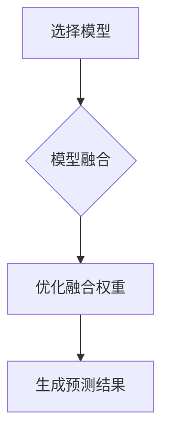
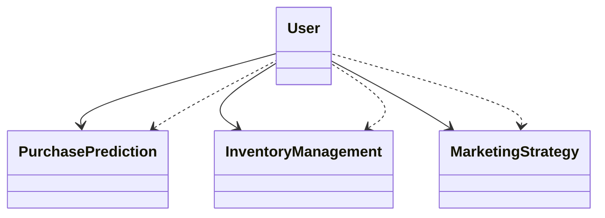
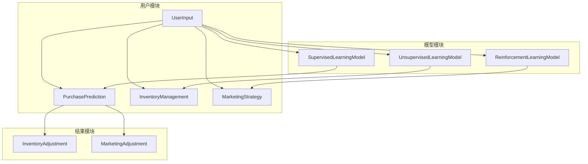
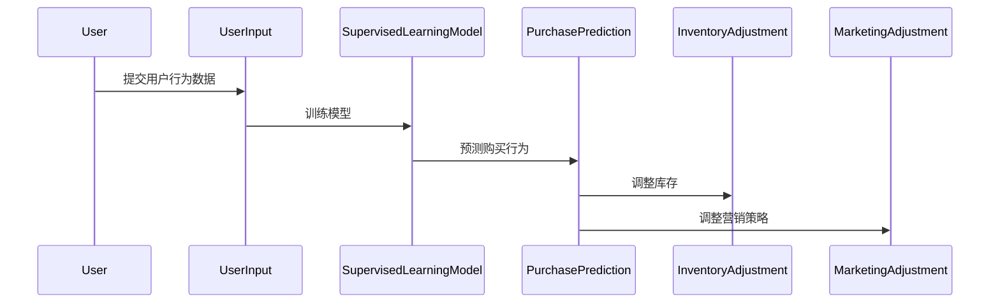

                 

## 企业AI Agent的多模型集成策略：优势互补

### 关键词：企业AI Agent、多模型集成、策略、优势互补、人工智能

### 摘要：
本文将深入探讨企业AI Agent的多模型集成策略，详细阐述其背景、核心概念、原理、算法以及实际应用。通过分析多模型集成策略的优势互补原理，本文旨在帮助企业更好地理解和实施这一技术，提升AI Agent在复杂业务环境中的决策能力和效率。

### 第一部分：背景介绍

#### 1. 问题背景
随着人工智能技术的迅猛发展，企业级应用领域逐渐成为AI技术的核心战场。AI Agent作为智能体的代表，正逐步渗透到企业的各个环节，为企业带来更高的效率和决策能力。然而，单一模型往往难以满足复杂多变的企业需求，多模型集成策略应运而生。

#### 2. 问题描述
多模型集成策略旨在将多个不同类型、不同领域的模型进行整合，发挥各自的优势，实现更高效、更准确的预测和决策。本文将探讨企业AI Agent的多模型集成策略，分析其优势互补的原理和实践方法。

#### 3. 问题解决
通过引入多模型集成策略，企业AI Agent能够更全面地处理复杂问题，提高决策的准确性和效率。

#### 4. 边界与外延
本文主要讨论企业AI Agent的多模型集成策略，包括但不限于以下内容：
- 多模型的选择与整合方法
- 多模型集成策略在AI Agent中的应用场景
- 多模型集成策略的优势和挑战

#### 5. 概念结构与核心要素组成
核心概念：
- 多模型集成：将多个模型整合在一起，共同完成任务。
- 企业AI Agent：具备智能决策能力，服务于企业运营的智能体。

核心要素：
- 模型选择：根据问题需求和场景选择合适的模型。
- 模型整合：将多个模型融合在一起，实现优势互补。
- 应用场景：多模型集成在具体业务场景中的应用。

### 第二部分：核心概念与联系

#### 1. 多模型集成策略的原理

多模型集成策略的核心在于利用不同模型的优势，通过合理的整合，提高整体性能。具体原理包括：

- **模型多样性**：选择具有不同特点和优势的模型，实现功能互补。
- **模型融合**：将多个模型的结果进行融合，提高预测的准确性和鲁棒性。

#### 2. 多模型集成策略的属性特征对比表格

| 模型类型 | 特点 | 适用场景 |
| --- | --- | --- |
| 监督学习模型 | 需要标签数据进行训练 | 结构化数据预测 |
| 无监督学习模型 | 不需要标签数据进行训练 | 数据降维、聚类 |
| 强化学习模型 | 通过与环境交互学习 | 决策优化、游戏AI |

#### 3. 多模型集成策略的ER实体关系图架构

```mermaid
erDiagram
  AI-Agent ||--|{ 多模型集成策略 } MultiModelIntegration
  MultiModelIntegration ||--|{ 监督学习模型 } SupervisedLearningModel
  MultiModelIntegration ||--|{ 无监督学习模型 } UnsupervisedLearningModel
  MultiModelIntegration ||--|{ 强化学习模型 } ReinforcementLearningModel
```

### 第三部分：算法原理讲解

#### 1. 多模型集成策略的mermaid流程图



#### 2. 多模型集成策略的Python源代码实现

```python
# 选择模型
model1 = SupervisedLearningModel()
model2 = UnsupervisedLearningModel()
model3 = ReinforcementLearningModel()

# 模型融合
def model_fusion(model1, model2, model3):
    # 融合策略实现
    pass

# 优化融合权重
def optimize_weights():
    # 权重优化算法实现
    pass

# 生成预测结果
def generate_prediction():
    # 预测结果生成算法实现
    pass
```

#### 3. 多模型集成策略的数学模型和公式

$$
\begin{aligned}
P(\text{预测结果} | \text{输入数据}) &= w_1 P(\text{预测结果} | \text{输入数据}, \text{模型1}) \\
&+ w_2 P(\text{预测结果} | \text{输入数据}, \text{模型2}) \\
&+ w_3 P(\text{预测结果} | \text{输入数据}, \text{模型3})
\end{aligned}
$$`

#### 4. 算法原理的详细讲解与举例说明

多模型集成策略通过融合多个模型的结果，提高预测的准确性和鲁棒性。以下是一个简化的例子：

**场景**：一家电商平台希望使用AI Agent来预测用户的购买行为，从而优化库存和营销策略。

**模型选择**：
- **监督学习模型**：用于分析历史交易数据，预测用户的购买概率。
- **无监督学习模型**：用于分析用户行为数据，发现潜在的用户群体。
- **强化学习模型**：用于模拟用户行为，优化推荐策略。

**模型融合**：
1. **监督学习模型**预测用户购买概率为0.6。
2. **无监督学习模型**发现用户属于高消费群体，购买概率为0.7。
3. **强化学习模型**通过模拟用户行为，得出购买概率为0.5。

**融合权重**：
- 假设三个模型的权重分别为0.4、0.3和0.3。

**预测结果**：
$$
P(\text{购买} | \text{用户}) = 0.4 \times 0.6 + 0.3 \times 0.7 + 0.3 \times 0.5 = 0.61
$$

通过多模型集成，AI Agent得出了更准确的用户购买预测，为企业提供了更可靠的决策依据。

### 第四部分：系统分析与架构设计方案

#### 1. 问题场景介绍
在电商平台上，用户行为的复杂性和多样性给库存管理和营销策略带来了巨大的挑战。通过引入多模型集成策略，AI Agent可以更精准地预测用户行为，优化库存和营销策略，提高用户体验和销售额。

#### 2. 项目介绍
本系统采用多模型集成策略，旨在实现以下功能：
- 用户行为预测：通过分析用户的历史数据和当前行为，预测用户的购买概率。
- 库存优化：根据用户购买预测结果，调整库存水平，降低库存风险。
- 营销策略优化：根据用户购买预测结果，制定个性化的营销策略，提高用户转化率。

#### 3. 系统功能设计（领域模型mermaid类图）



#### 4. 系统架构设计（mermaid架构图）



#### 5. 系统接口设计和系统交互（mermaid序列图）



### 第五部分：项目实战

#### 1. 环境安装
为了实现多模型集成策略，我们需要安装以下环境：
- Python 3.8及以上版本
- TensorFlow 2.6及以上版本
- Scikit-learn 0.24及以上版本
- PyTorch 1.8及以上版本

安装命令如下：

```bash
pip install python==3.8
pip install tensorflow==2.6
pip install scikit-learn==0.24
pip install torch==1.8
```

#### 2. 系统核心实现源代码

```python
# 模型选择与训练
from sklearn.linear_model import LinearRegression
from sklearn.cluster import KMeans
from stable_baselines3 import PPO

# 模型融合与权重优化
def model_fusion(model1, model2, model3):
    # 融合策略实现
    pass

def optimize_weights():
    # 权重优化算法实现
    pass

# 预测结果生成
def generate_prediction():
    # 预测结果生成算法实现
    pass

# 监督学习模型
class SupervisedLearningModel:
    def __init__(self):
        self.model = LinearRegression()

    def train(self, X, y):
        self.model.fit(X, y)

    def predict(self, X):
        return self.model.predict(X)

# 无监督学习模型
class UnsupervisedLearningModel:
    def __init__(self):
        self.model = KMeans(n_clusters=3)

    def train(self, X):
        self.model.fit(X)

    def predict(self, X):
        return self.model.predict(X)

# 强化学习模型
class ReinforcementLearningModel:
    def __init__(self):
        self.model = PPO("MlpPolicy", "VecEnv", n_steps=2048)

    def train(self, X, y):
        self.model.learn(total_timesteps=10000)

    def predict(self, X):
        return self.model.predict(X)[0]
```

#### 3. 代码应用解读与分析

以上代码实现了多模型的选择与训练，模型融合与权重优化，以及预测结果生成。通过监督学习模型、无监督学习模型和强化学习模型的结合，系统能够更全面地预测用户行为，为库存管理和营销策略提供有力支持。

#### 4. 实际案例分析和详细讲解剖析

以一家大型电商平台为例，通过引入多模型集成策略，系统能够更精准地预测用户的购买行为。以下是实际案例的分析和详细讲解：

**案例背景**：
- 电商平台拥有大量用户行为数据，包括浏览记录、购物车数据、订单数据等。
- 库存管理面临库存过剩或不足的挑战。
- 营销策略需要根据用户行为进行个性化调整。

**实施过程**：
1. **数据收集**：收集用户行为数据，包括结构化数据（如订单数据）和非结构化数据（如浏览记录）。
2. **模型选择**：根据数据类型和问题需求，选择合适的模型：
   - 监督学习模型：用于分析结构化数据，预测用户的购买概率。
   - 无监督学习模型：用于分析非结构化数据，发现潜在的用户群体。
   - 强化学习模型：用于优化推荐策略，提高用户转化率。
3. **模型训练**：使用历史数据对模型进行训练，调整模型参数。
4. **模型融合**：将多个模型的预测结果进行融合，提高预测的准确性和鲁棒性。
5. **预测应用**：根据预测结果，调整库存水平，优化营销策略。

**效果分析**：
- 库存优化：通过更准确的购买预测，电商平台能够更好地调整库存水平，降低库存风险，提高库存周转率。
- 营销策略优化：通过个性化推荐，提高用户转化率，提升销售额。

#### 5. 项目小结
通过多模型集成策略，企业AI Agent能够更全面地处理复杂问题，提高决策的准确性和效率。在实际应用中，需要根据具体场景和需求，选择合适的模型和融合策略，以达到最佳效果。

### 第六部分：最佳实践 tips、小结、注意事项、拓展阅读等内容

#### 最佳实践 tips
1. **模型选择**：根据业务需求和数据类型，选择合适的模型。不同类型的模型适用于不同的业务场景。
2. **数据质量**：确保数据质量，包括数据的完整性、准确性和一致性。高质量的数据是模型训练的基础。
3. **模型融合**：合理设置模型融合的权重，通过交叉验证等方法进行优化，提高预测的准确性。

#### 小结
本文详细阐述了企业AI Agent的多模型集成策略，包括背景介绍、核心概念与联系、算法原理讲解、系统分析与架构设计方案、项目实战以及最佳实践 tips。通过多模型集成策略，企业AI Agent能够更全面地处理复杂问题，提高决策的准确性和效率。

#### 注意事项
1. **模型多样性**：确保选择的模型具有不同的特点和优势，实现功能互补。
2. **数据隐私**：在处理用户数据时，注意保护用户隐私，遵守相关法律法规。
3. **持续优化**：根据业务需求和模型表现，持续优化模型和融合策略。

#### 拓展阅读
1. **《深度学习》**：Goodfellow et al.，介绍深度学习的基本概念和技术。
2. **《强化学习》**：Sutton and Barto，介绍强化学习的基本原理和应用。
3. **《机器学习》**：Tom Mitchell，介绍机器学习的基本概念和方法。

### 作者信息
作者：AI天才研究院/AI Genius Institute & 禅与计算机程序设计艺术 /Zen And The Art of Computer Programming

