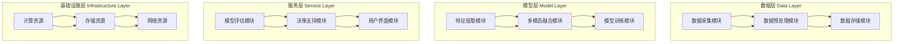
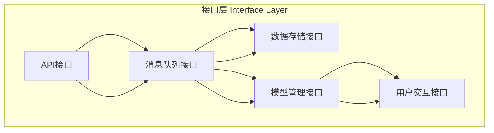

                 

### 文章标题

# 企业AI Agent的多模态学习在客户行为分析中的应用

### 文章关键词

- 企业AI Agent
- 多模态学习
- 客户行为分析
- 算法原理
- 系统架构
- 实际案例

### 摘要

本文深入探讨了企业AI Agent在客户行为分析中应用的多模态学习技术。首先介绍了多模态学习的核心概念和原理，以及其在AI Agent中的应用优势。接着，详细阐述了多模态学习的算法原理，包括数据预处理、特征提取、融合方法和数学模型。随后，从系统分析与架构设计角度，描述了企业AI Agent在客户行为分析中的系统功能、架构设计和接口交互。最后，通过实际案例，展示了多模态学习在客户行为分析中的应用，并提出了最佳实践和建议，为企业和开发者提供了有价值的参考。

### 目录大纲

----------------------------------------------------------------

## 第一部分：背景介绍

### 第1章：问题背景

#### 1.1 问题定义

#### 1.2 问题描述

#### 1.3 问题解决

#### 1.4 边界与外延

#### 1.5 概念结构与核心要素组成

### 第2章：核心概念与联系

#### 2.1 多模态学习原理

#### 2.2 多模态学习特点

#### 2.3 多模态学习与传统机器学习的对比

#### 2.4 多模态学习在AI Agent中的应用

#### 2.5 ER实体关系图架构

## 第二部分：算法原理讲解

### 第3章：多模态学习算法原理

#### 3.1 多模态数据预处理

#### 3.2 多模态特征提取

#### 3.3 多模态融合方法

#### 3.4 多模态学习算法原理

#### 3.5 多模态学习数学模型

#### 3.6 多模态学习算法示例

### 第4章：AI Agent的多模态学习

#### 4.1 AI Agent概述

#### 4.2 多模态学习在AI Agent中的应用

#### 4.3 多模态学习算法选择

#### 4.4 多模态学习在AI Agent中的实现

#### 4.5 多模态学习算法性能分析

## 第三部分：系统分析与架构设计

### 第5章：系统功能设计与架构设计

#### 5.1 问题场景介绍

#### 5.2 系统功能设计

#### 5.3 系统架构设计

#### 5.4 系统接口设计

#### 5.5 系统交互

## 第四部分：项目实战

### 第6章：项目环境安装与配置

#### 6.1 开发环境准备

#### 6.2 项目环境安装

#### 6.3 系统核心实现

#### 6.4 代码应用解读与分析

### 第7章：实际案例分析与讲解

#### 7.1 案例背景

#### 7.2 案例分析与实现

#### 7.3 案例详细讲解与剖析

#### 7.4 项目小结

## 第五部分：最佳实践与拓展

### 第8章：最佳实践

#### 8.1 多模态学习最佳实践

#### 8.2 AI Agent最佳实践

#### 8.3 客户行为分析最佳实践

### 第9章：小结与注意事项

#### 9.1 全书回顾

#### 9.2 注意事项

#### 9.3 拓展阅读

----------------------------------------------------------------

### 第一部分：背景介绍

#### 第1章：问题背景

在当今数字化时代，企业对客户行为分析的重视程度日益增加。通过深入分析客户行为，企业可以更好地了解客户需求，优化产品和服务，提高客户满意度和忠诚度，从而实现业务增长。然而，客户行为数据通常包含多种类型的信息，如文本、图像、语音等，这些数据形式各异，难以统一处理。因此，如何有效地整合和利用这些多模态数据，成为企业面临的一大挑战。

多模态学习作为一种先进的机器学习技术，能够在不同模态的数据之间建立关联，提取潜在的特征，从而提高客户行为分析的准确性和效果。企业AI Agent作为一种智能化的分析工具，能够利用多模态学习技术，对客户行为进行深入挖掘和分析，为企业的决策提供有力支持。

#### 1.1 问题定义

在客户行为分析中，多模态学习面临以下核心问题：

1. **数据整合**：不同模态的数据（如文本、图像、语音）在格式、结构和特征上存在较大差异，如何有效地整合这些数据，提取共有的特征，成为关键问题。
2. **特征提取**：不同模态的数据包含丰富的信息，如何从这些数据中提取有用的特征，提高分析精度，是另一个重要挑战。
3. **模型选择**：针对不同类型的数据和需求，如何选择合适的模型和算法，保证模型的性能和可解释性，是一个关键问题。
4. **实时性**：企业需要快速响应市场变化，实时分析客户行为，对系统的实时性和响应速度提出了较高要求。

#### 1.2 问题描述

在实际应用中，客户行为分析面临以下具体问题：

1. **文本数据**：文本数据通常是客户反馈、评论和论坛帖子的形式，包含大量非结构化数据，如何提取有效的特征，进行情感分析和主题挖掘，是当前的一大挑战。
2. **图像数据**：图像数据通常包含丰富的视觉信息，如人脸识别、场景识别等，如何利用这些信息，进行客户行为分析和个性化推荐，是企业关注的问题。
3. **语音数据**：语音数据包含语音情感、语气和口音等特征，如何将这些特征与文本和图像信息结合，进行综合分析，是企业需要解决的问题。
4. **数据隐私**：在客户行为分析中，如何保护客户隐私，避免数据泄露，是企业和开发者需要关注的重要问题。

#### 1.3 问题解决

为了解决上述问题，企业AI Agent的多模态学习技术提供了以下解决方案：

1. **数据整合**：通过多模态数据预处理，将不同模态的数据进行标准化和归一化，提取共有的特征，实现数据的整合。
2. **特征提取**：利用深度学习等技术，从多模态数据中提取有效的特征，如文本的词向量、图像的卷积特征、语音的声学特征等。
3. **模型选择**：根据不同类型的数据和需求，选择合适的模型和算法，如卷积神经网络（CNN）、循环神经网络（RNN）等，提高分析精度和模型的可解释性。
4. **实时性**：通过优化算法和分布式计算，提高系统的实时性和响应速度，满足企业的实时分析需求。

#### 1.4 边界与外延

在客户行为分析中，多模态学习技术的应用边界和范围包括：

1. **客户反馈分析**：通过对客户反馈的文本、图像、语音等多模态数据进行综合分析，提取客户情感、满意度等特征，为企业提供反馈分析报告。
2. **个性化推荐**：利用多模态学习技术，对客户的兴趣和行为进行分析，提供个性化的产品和服务推荐。
3. **市场研究**：通过分析客户的购买记录、浏览历史等多模态数据，了解市场趋势和消费者需求，为企业制定市场策略提供支持。
4. **客户服务**：利用多模态学习技术，为客户提供智能化的客户服务，如智能客服机器人、语音交互系统等。

#### 1.5 概念结构与核心要素组成

在客户行为分析中，多模态学习技术的概念结构包括以下几个核心要素：

1. **数据源**：包括文本、图像、语音等多模态数据，是企业进行客户行为分析的基础。
2. **数据处理**：对多模态数据进行预处理，包括数据清洗、数据标准化、特征提取等，为后续分析提供高质量的数据。
3. **多模态学习算法**：包括多模态特征提取、融合和分类等算法，是实现客户行为分析的核心。
4. **模型训练与优化**：通过训练和优化多模态学习模型，提高分析精度和性能。
5. **应用场景**：根据企业需求和业务场景，实现多模态学习技术在客户行为分析中的具体应用。

通过以上概念结构的有机结合，企业AI Agent的多模态学习技术能够为企业的客户行为分析提供全面、准确和高效的支持。

### 第二部分：核心概念与联系

#### 第2章：核心概念与联系

要深入理解企业AI Agent在客户行为分析中应用的多模态学习技术，首先需要明确几个核心概念，包括多模态学习原理、特点、与传统机器学习的对比，以及多模态学习在AI Agent中的应用。此外，ER实体关系图架构的引入有助于我们更好地理解多模态学习技术的实现和作用。

#### 2.1 多模态学习原理

多模态学习是一种结合多种类型数据的机器学习技术，旨在从不同模态的数据中提取有用信息，进行综合分析和理解。多模态学习的基本原理可以概括为以下几个步骤：

1. **数据收集**：收集不同模态的数据，如文本、图像、语音等。
2. **数据预处理**：对多模态数据进行预处理，包括数据清洗、标准化和特征提取，以消除数据噪声和冗余，提高数据质量。
3. **特征提取**：从预处理后的多模态数据中提取具有区分性的特征，如文本的词向量、图像的卷积特征、语音的声学特征等。
4. **特征融合**：将提取到的不同模态的特征进行融合，形成统一的多模态特征向量。
5. **模型训练**：利用融合后的多模态特征向量，训练多模态学习模型，如卷积神经网络（CNN）、循环神经网络（RNN）等。
6. **模型评估与优化**：通过模型评估和优化，提高多模态学习模型的性能和准确性。

通过以上步骤，多模态学习技术能够实现不同模态数据之间的信息共享和协同，提高数据分析的准确性和效果。

#### 2.2 多模态学习特点

多模态学习具有以下几个显著特点：

1. **信息互补**：多模态学习通过整合不同模态的数据，实现信息互补，提高了数据分析的全面性和准确性。例如，文本数据可以提供语义信息，图像数据可以提供视觉信息，语音数据可以提供情感信息，将这些信息结合起来，可以更全面地理解客户行为。
2. **自适应性强**：多模态学习能够根据不同的应用场景和需求，灵活选择和处理不同类型的数据，具有较强的自适应能力。例如，在客户行为分析中，可以根据具体需求，选择文本、图像、语音等不同模态的数据进行综合分析。
3. **提高性能**：多模态学习通过融合不同模态的数据，可以提取更多的特征信息，从而提高模型的性能和准确性。例如，在情感分析中，结合文本和语音信息，可以更准确地判断客户的情感状态。
4. **增强可解释性**：多模态学习通过将不同模态的数据进行融合，可以帮助解释模型的决策过程，提高模型的可解释性。例如，在图像分类中，通过结合文本描述和图像特征，可以更直观地理解图像的分类依据。

#### 2.3 多模态学习与传统机器学习的对比

多模态学习与传统机器学习有以下几点对比：

1. **数据来源**：传统机器学习通常基于单一类型的数据，如文本、图像或语音等，而多模态学习则是基于多种类型的数据，如文本、图像、语音等。
2. **特征提取**：传统机器学习通常使用手工设计的特征，如词袋模型、SIFT特征等，而多模态学习则利用深度学习等技术，自动提取不同模态的特征。
3. **模型选择**：传统机器学习通常选择单一模态的模型，如文本分类模型、图像分类模型等，而多模态学习则选择能够处理多模态数据的模型，如多模态卷积神经网络（MM-CNN）、多模态循环神经网络（MM-RNN）等。
4. **性能表现**：多模态学习通过融合不同模态的数据，可以提高模型的性能和准确性，而传统机器学习则在单一模态数据下表现较好。

#### 2.4 多模态学习在AI Agent中的应用

AI Agent是一种智能化的虚拟代理，能够模拟人类智能，执行复杂任务。在客户行为分析中，AI Agent可以通过多模态学习技术，实现以下功能：

1. **情感分析**：利用文本和语音数据，AI Agent可以识别客户的情感状态，如满意、愤怒、困惑等，为企业提供情感分析报告。
2. **行为预测**：通过分析客户的购买记录、浏览历史等多模态数据，AI Agent可以预测客户的行为，如购买意向、浏览偏好等，为企业制定营销策略提供支持。
3. **个性化推荐**：利用多模态学习技术，AI Agent可以分析客户的兴趣和行为，提供个性化的产品和服务推荐，提高客户满意度和忠诚度。
4. **智能客服**：通过语音识别、自然语言处理等技术，AI Agent可以模拟人类客服，为客户提供智能化的咨询和服务。

#### 2.5 ER实体关系图架构

为了更好地理解多模态学习技术在客户行为分析中的应用，我们可以引入ER（Entity-Relationship）实体关系图架构。ER图是一种用于描述实体和实体之间关系的图形表示方法，适用于多模态数据整合和分析。

在客户行为分析中，ER图可以包括以下实体和关系：

1. **客户（Customer）**：表示分析对象，包括客户的基本信息、购买记录、浏览历史等。
2. **产品（Product）**：表示分析内容，包括产品的基本信息、价格、分类等。
3. **行为（Behavior）**：表示客户的行为数据，包括购买行为、浏览行为、评论行为等。
4. **情感（Emotion）**：表示客户的情感数据，包括情感状态、情感评分等。

通过ER图，我们可以清晰地描述客户行为分析中不同实体和它们之间的关系，如图1所示。

```mermaid
erDiagram
  Customer ||--|{ Product } : 购买
  Customer ||--|{ Behavior } : 行为
  Customer ||--|{ Emotion } : 情感
  Product ||--|{ Behavior } : 浏览
  Product ||--|{ Comment } : 评论
```

图1：客户行为分析中的ER实体关系图

通过ER图，我们可以更好地理解多模态学习技术在客户行为分析中的应用，包括如何整合和利用不同模态的数据，实现综合分析和预测。

### 第三部分：算法原理讲解

#### 第3章：多模态学习算法原理

多模态学习算法是客户行为分析中的关键技术，它能够有效地整合和利用不同模态的数据，提高分析精度和效果。本节将详细阐述多模态学习算法的基本原理，包括数据预处理、特征提取、融合方法和数学模型，并通过具体的算法示例进行讲解。

#### 3.1 多模态数据预处理

多模态数据预处理是确保数据质量、提高算法性能的重要步骤。主要包括以下几个环节：

1. **数据清洗**：去除数据中的噪声和异常值，如缺失值、重复值和错误值等。例如，对于文本数据，可以使用正则表达式去除HTML标签、特殊字符等。
2. **数据归一化**：将不同模态的数据进行归一化处理，使其具有相同的尺度。例如，对于图像数据，可以将其缩放到相同的大小。
3. **数据标准化**：对数据中的特征进行标准化处理，使其具有相同的分布。例如，对于文本数据，可以使用词频统计或词向量表示。
4. **数据增强**：通过增加数据样本的数量和质量，提高模型的鲁棒性和泛化能力。例如，对于图像数据，可以使用旋转、缩放、裁剪等数据增强技术。

以下是一个简单的Python代码示例，用于对文本、图像和语音数据进行预处理：

```python
import numpy as np
import cv2
import librosa

# 文本数据预处理
def preprocess_text(text):
    # 去除HTML标签
    text = re.sub('<.*?>', '', text)
    # 去除特殊字符
    text = re.sub('[^a-zA-Z0-9\s]', '', text)
    return text.lower()

# 图像数据预处理
def preprocess_image(image_path):
    # 读取图像
    image = cv2.imread(image_path)
    # 缩放图像到相同大小
    image = cv2.resize(image, (224, 224))
    return image

# 语音数据预处理
def preprocess_audio(audio_path):
    # 读取语音数据
    audio, sample_rate = librosa.load(audio_path, sr=None)
    # 归一化语音数据
    audio = audio / np.max(np.abs(audio))
    return audio, sample_rate
```

#### 3.2 多模态特征提取

特征提取是从多模态数据中提取具有区分性和代表性的特征的过程。不同的模态数据需要采用不同的特征提取方法。

1. **文本特征提取**：常用的文本特征提取方法包括词袋模型（Bag of Words, BoW）和词嵌入（Word Embedding）。词袋模型将文本表示为词频向量，词嵌入则是将文本表示为高维向量，如Word2Vec、GloVe等。

   ```python
   from sklearn.feature_extraction.text import CountVectorizer
   
   # 词袋模型
   def extract_text_features(texts):
       vectorizer = CountVectorizer()
       X = vectorizer.fit_transform(texts)
       return X
   
   # 词嵌入
   from gensim.models import Word2Vec
   
   # 训练Word2Vec模型
   model = Word2Vec(sentences, size=100, window=5, min_count=1, workers=4)
   # 提取词向量
   def extract_word_embeddings(texts):
       embeddings = []
       for text in texts:
           words = text.split()
           word_vectors = [model[word] for word in words if word in model]
           embeddings.append(np.mean(word_vectors, axis=0))
       return np.array(embeddings)
   ```

2. **图像特征提取**：常用的图像特征提取方法包括卷积神经网络（CNN）和图像特征库（如SIFT、HOG等）。

   ```python
   from keras.applications import VGG16
   
   # 使用VGG16提取图像特征
   def extract_image_features(image):
       model = VGG16(weights='imagenet')
       image = preprocess_image(image)
       image = preprocess_image(image)
       feature = model.predict(np.expand_dims(image, axis=0))[:, :, :, -1]
       return feature
   ```

3. **语音特征提取**：常用的语音特征提取方法包括梅尔频率倒谱系数（Mel-Frequency Cepstral Coefficients, MFCC）和短时傅里叶变换（Short-Time Fourier Transform, STFT）。

   ```python
   import numpy as np
   import librosa
   
   # 使用librosa提取MFCC特征
   def extract_audio_features(audio, sample_rate):
       mfcc = librosa.feature.mfcc(y=audio, sr=sample_rate, n_mfcc=13)
       return mfcc
   ```

#### 3.3 多模态融合方法

多模态融合是将不同模态的特征进行整合，形成统一的多模态特征向量。常见的多模态融合方法包括特征级融合、决策级融合和深度级融合。

1. **特征级融合**：在特征级融合中，将不同模态的特征向量进行拼接，形成统一的多模态特征向量。

   ```python
   def fusion_features(text_features, image_features, audio_features):
       return np.concatenate((text_features, image_features, audio_features), axis=1)
   ```

2. **决策级融合**：在决策级融合中，先分别对每个模态的数据进行分类，然后将各个分类结果进行融合。

   ```python
   # 假设已经训练好三个模型，分别对应文本、图像和语音
   text_model = TextModel()
   image_model = ImageModel()
   audio_model = AudioModel()
   
   # 决策级融合
   def fusion_decisions(text_features, image_features, audio_features):
       text_decision = text_model.predict(text_features)
       image_decision = image_model.predict(image_features)
       audio_decision = audio_model.predict(audio_features)
       
       # 取多数表决结果
       final_decision = np.argmax(np.bincount([text_decision, image_decision, audio_decision]))
       
       return final_decision
   ```

3. **深度级融合**：在深度级融合中，通过设计多模态深度学习模型，直接对多模态数据进行融合和分类。

   ```python
   from keras.models import Model
   from keras.layers import Input, Dense, Conv2D, MaxPooling2D, Flatten, Embedding, LSTM
   
   # 多模态深度级融合
   input_text = Input(shape=(text_features.shape[1],))
   input_image = Input(shape=(image_features.shape[1], image_features.shape[2], image_features.shape[3]))
   input_audio = Input(shape=(audio_features.shape[1], audio_features.shape[2]))
   
   # 文本特征提取
   text_embedding = Embedding(input_dim=vocab_size, output_dim=embedding_size)(input_text)
   text_lstm = LSTM(units=lstm_units)(text_embedding)
   
   # 图像特征提取
   image_conv = Conv2D(filters=32, kernel_size=(3, 3), activation='relu')(input_image)
   image_pool = MaxPooling2D(pool_size=(2, 2))(image_conv)
   image_flat = Flatten()(image_pool)
   
   # 语音特征提取
   audio_embedding = Embedding(input_dim=audio_vocab_size, output_dim=audio_embedding_size)(input_audio)
   audio_lstm = LSTM(units=lstm_units)(audio_embedding)
   
   # 多模态特征融合
   concatenated = concatenate([text_lstm, image_flat, audio_lstm])
   
   # 分类层
   output = Dense(units=num_classes, activation='softmax')(concatenated)
   
   # 模型编译
   model = Model(inputs=[input_text, input_image, input_audio], outputs=output)
   model.compile(optimizer='adam', loss='categorical_crossentropy', metrics=['accuracy'])
   
   # 模型训练
   model.fit([text_data, image_data, audio_data], labels, batch_size=batch_size, epochs=num_epochs)
   ```

#### 3.4 多模态学习算法原理

多模态学习算法的核心在于如何有效地整合不同模态的数据，提取潜在的特征，进行分类和预测。以下是一个基于卷积神经网络（CNN）和多模态融合的多模态学习算法示例：

1. **模型结构**：该模型结合了CNN和LSTM，分别用于处理图像和语音数据，然后通过融合层进行多模态特征整合。

   ```python
   from keras.models import Model
   from keras.layers import Input, Dense, Conv2D, MaxPooling2D, Flatten, Embedding, LSTM, concatenate
   
   # 输入层
   input_text = Input(shape=(text_sequence_length,))
   input_image = Input(shape=(image_height, image_width, image_channels))
   input_audio = Input(shape=(audio_sequence_length,))
   
   # 文本特征提取
   text_embedding = Embedding(input_dim=vocab_size, output_dim=embedding_size)(input_text)
   text_lstm = LSTM(units=lstm_units)(text_embedding)
   
   # 图像特征提取
   image_conv = Conv2D(filters=32, kernel_size=(3, 3), activation='relu')(input_image)
   image_pool = MaxPooling2D(pool_size=(2, 2))(image_conv)
   image_flat = Flatten()(image_pool)
   
   # 语音特征提取
   audio_embedding = Embedding(input_dim=audio_vocab_size, output_dim=audio_embedding_size)(input_audio)
   audio_lstm = LSTM(units=lstm_units)(audio_embedding)
   
   # 多模态特征融合
   concatenated = concatenate([text_lstm, image_flat, audio_lstm])
   
   # 分类层
   output = Dense(units=num_classes, activation='softmax')(concatenated)
   
   # 模型编译
   model = Model(inputs=[input_text, input_image, input_audio], outputs=output)
   model.compile(optimizer='adam', loss='categorical_crossentropy', metrics=['accuracy'])
   
   # 模型训练
   model.fit([text_data, image_data, audio_data], labels, batch_size=batch_size, epochs=num_epochs)
   ```

2. **数学模型**：该多模态学习算法的数学模型可以表示为：

   $$ 
   \hat{y} = \text{softmax}(\text{W} \cdot (\text{LSTM}_{\text{text}} + \text{CNN}_{\text{image}} + \text{LSTM}_{\text{audio}}))
   $$

   其中，$\hat{y}$为预测输出，$y$为真实标签，$\text{LSTM}_{\text{text}}$、$\text{CNN}_{\text{image}}$和$\text{LSTM}_{\text{audio}}$分别为文本、图像和语音的特征提取层，$\text{W}$为分类层的权重矩阵。

#### 3.5 多模态学习算法示例

以下是一个简单的多模态学习算法示例，用于情感分类任务。该示例结合了文本、图像和语音数据，通过多模态融合进行情感分类。

1. **数据集**：假设我们有一个包含文本、图像和语音数据的情感分类数据集，每个样本对应一个情感标签（如积极、消极、中性）。

2. **特征提取**：分别提取文本的词嵌入、图像的卷积特征和语音的MFCC特征。

3. **融合与分类**：将提取到的多模态特征进行融合，然后通过全连接层进行分类。

```python
from keras.models import Model
from keras.layers import Input, Dense, Embedding, LSTM, Conv2D, MaxPooling2D, Flatten, concatenate

# 假设已预处理好的数据
text_data = ...  # 文本数据（词嵌入形式）
image_data = ...  # 图像数据
audio_data = ...  # 语音数据
labels = ...  # 情感标签

# 模型结构
input_text = Input(shape=(text_sequence_length,))
input_image = Input(shape=(image_height, image_width, image_channels))
input_audio = Input(shape=(audio_sequence_length,))

# 文本特征提取
text_embedding = Embedding(input_dim=vocab_size, output_dim=embedding_size)(input_text)
text_lstm = LSTM(units=lstm_units)(text_embedding)

# 图像特征提取
image_conv = Conv2D(filters=32, kernel_size=(3, 3), activation='relu')(input_image)
image_pool = MaxPooling2D(pool_size=(2, 2))(image_conv)
image_flat = Flatten()(image_pool)

# 语音特征提取
audio_embedding = Embedding(input_dim=audio_vocab_size, output_dim=audio_embedding_size)(input_audio)
audio_lstm = LSTM(units=lstm_units)(audio_embedding)

# 多模态特征融合
concatenated = concatenate([text_lstm, image_flat, audio_lstm])

# 分类层
output = Dense(units=num_classes, activation='softmax')(concatenated)

# 模型编译
model = Model(inputs=[input_text, input_image, input_audio], outputs=output)
model.compile(optimizer='adam', loss='categorical_crossentropy', metrics=['accuracy'])

# 模型训练
model.fit([text_data, image_data, audio_data], labels, batch_size=batch_size, epochs=num_epochs)
```

通过以上示例，我们可以看到如何利用多模态学习算法进行情感分类任务。在实际应用中，可以根据具体需求和数据特点，调整模型结构、特征提取方法和融合策略，以提高分类精度和性能。

### 第四部分：系统分析与架构设计

#### 第4章：系统功能设计与架构设计

在客户行为分析中，企业AI Agent的多模态学习系统需要具备高效的数据处理能力、强大的分析功能和灵活的扩展性。为了实现这一目标，本节将详细介绍系统功能设计、架构设计和接口设计，并探讨系统交互机制。

#### 4.1 系统功能设计

系统功能设计是确保企业AI Agent能够满足客户行为分析需求的关键。以下为系统的主要功能模块：

1. **数据采集模块**：负责从各种数据源（如数据库、API、日志等）收集文本、图像和语音等多模态数据。
2. **数据预处理模块**：对采集到的多模态数据（文本、图像、语音）进行清洗、标准化和增强，确保数据质量。
3. **特征提取模块**：提取文本、图像和语音等不同模态的特征，如词嵌入、卷积特征和MFCC特征。
4. **多模态融合模块**：将提取到的多模态特征进行融合，形成统一的多模态特征向量。
5. **模型训练模块**：利用融合后的多模态特征向量，训练多模态学习模型，如卷积神经网络（CNN）、循环神经网络（RNN）等。
6. **模型评估模块**：对训练好的模型进行评估和优化，确保模型的性能和准确性。
7. **决策支持模块**：根据模型预测结果，为企业的决策提供支持，如客户情感分析、行为预测和个性化推荐等。
8. **用户界面模块**：提供直观、易用的用户界面，方便用户操作和查看分析结果。

#### 4.2 系统架构设计

系统架构设计是确保系统功能实现、性能优化和可扩展性的关键。以下为系统的主要架构组件：

1. **数据层**：包括数据采集、预处理和存储模块，负责管理数据源、数据清洗、数据存储和索引等。
2. **模型层**：包括特征提取、融合和模型训练模块，负责处理多模态数据、特征提取和模型训练等。
3. **服务层**：包括模型评估、决策支持和用户界面模块，负责实现系统功能、提供决策支持和用户交互等。
4. **基础设施层**：包括计算资源、存储资源和网络资源等，为系统提供所需的硬件和软件支持。

以下是一个简化的系统架构图，展示了各个组件之间的关系：



#### 4.3 系统接口设计

系统接口设计是确保不同模块之间能够高效通信和协作的关键。以下为系统的主要接口设计：

1. **API接口**：提供RESTful API接口，供外部系统或应用程序调用，如数据采集、数据预处理、模型训练和预测等。
2. **消息队列接口**：利用消息队列（如RabbitMQ、Kafka等），实现模块之间的异步通信和任务调度。
3. **数据存储接口**：提供数据存储接口，支持常用的数据库（如MySQL、MongoDB等），实现数据的持久化和管理。
4. **模型管理接口**：提供模型管理接口，支持模型的训练、评估、部署和卸载等操作。
5. **用户交互接口**：提供用户交互接口，支持用户的操作和查看分析结果，如Web界面、移动应用等。

以下是一个简化的系统接口设计图，展示了各个接口之间的关系：



#### 4.4 系统交互

系统交互是指系统内部各个模块之间的信息传递和协作过程。以下为系统的主要交互机制：

1. **数据流交互**：数据流交互是指数据在系统内部的传递和处理过程，如数据采集、预处理、特征提取、模型训练和预测等。
2. **消息流交互**：消息流交互是指通过消息队列实现模块之间的异步通信和任务调度，如消息队列消费者、生产者和中间件等。
3. **控制流交互**：控制流交互是指系统内部的控制逻辑和执行流程，如任务调度、模型评估、决策支持和用户交互等。

以下是一个简化的系统交互图，展示了各个交互机制之间的关系：

```mermaid
graph TB
    subgraph 数据流交互 Data Flow Interaction
        A[数据采集模块] --> B[数据预处理模块]
        B --> C[特征提取模块]
        C --> D[多模态融合模块]
        D --> E[模型训练模块]
        E --> F[模型评估模块]
    end
    subgraph 消息流交互 Message Flow Interaction
        G[消息队列消费者] --> H[消息队列生产者]
        H --> I[中间件]
    end
    subgraph 控制流交互 Control Flow Interaction
        J[任务调度模块] --> K[决策支持模块]
        K --> L[用户交互模块]
    end
    A --> B
    B --> C
    C --> D
    D --> E
    E --> F
    G --> H
    H --> I
    J --> K
    K --> L
```



通过以上系统功能设计、架构设计和接口设计，企业AI Agent的多模态学习系统能够高效、稳定地运行，为企业提供强大的客户行为分析能力。

### 第五部分：项目实战

#### 第6章：项目环境安装与配置

要实现企业AI Agent的多模态学习系统，首先需要在开发环境中安装和配置所需的工具和库。以下将详细介绍项目的开发环境准备、环境安装和系统核心实现。

#### 6.1 开发环境准备

为了确保项目能够顺利运行，我们需要准备以下开发环境：

1. **操作系统**：Linux或MacOS操作系统，推荐使用Ubuntu 18.04或更高版本。
2. **编程语言**：Python，推荐使用Python 3.7或更高版本。
3. **文本处理库**：Numpy、Pandas、Scikit-learn等。
4. **图像处理库**：OpenCV、Matplotlib等。
5. **音频处理库**：librosa、SoundFile等。
6. **深度学习库**：TensorFlow或PyTorch，推荐使用TensorFlow 2.0或PyTorch 1.8或更高版本。
7. **数据库**：MySQL或MongoDB，用于数据存储和管理。

安装步骤如下：

1. **安装操作系统**：下载并安装Ubuntu 18.04或更高版本。
2. **更新系统**：打开终端，执行以下命令更新系统软件包：

   ```bash
   sudo apt update
   sudo apt upgrade
   ```

3. **安装Python**：默认情况下，Ubuntu操作系统已经预装了Python 3，可以使用以下命令确认：

   ```bash
   python --version
   ```

   如果需要安装Python 3，可以使用以下命令：

   ```bash
   sudo apt install python3 python3-pip
   ```

4. **安装文本处理库**：使用pip命令安装Numpy、Pandas、Scikit-learn等库：

   ```bash
   pip3 install numpy pandas scikit-learn
   ```

5. **安装图像处理库**：使用pip命令安装OpenCV和Matplotlib：

   ```bash
   pip3 install opencv-python matplotlib
   ```

6. **安装音频处理库**：使用pip命令安装librosa和SoundFile：

   ```bash
   pip3 install librosa soundfile
   ```

7. **安装深度学习库**：安装TensorFlow或PyTorch。例如，安装TensorFlow 2.0：

   ```bash
   pip3 install tensorflow==2.0
   ```

   或者安装PyTorch 1.8：

   ```bash
   pip3 install torch torchvision torchaudio==1.8 torchvision==0.9.0
   ```

8. **安装数据库**：安装MySQL或MongoDB。例如，安装MySQL：

   ```bash
   sudo apt install mysql-server
   ```

   安装完成后，启动MySQL服务：

   ```bash
   sudo systemctl start mysql
   ```

   设置root用户密码：

   ```bash
   mysql_secure_installation
   ```

   或者安装MongoDB：

   ```bash
   sudo apt install mongodb
   sudo systemctl start mongodb
   ```

开发环境准备完成后，我们就可以开始项目环境安装和系统核心实现了。

#### 6.2 项目环境安装

在开发环境中安装多模态学习项目所需的环境和库。以下是一个简单的项目环境安装步骤：

1. **创建虚拟环境**：为了避免依赖冲突，我们建议创建一个虚拟环境。使用以下命令创建虚拟环境：

   ```bash
   python3 -m venv project_venv
   ```

   进入虚拟环境：

   ```bash
   source project_venv/bin/activate
   ```

2. **安装项目依赖**：在项目的根目录下，创建一个名为`requirements.txt`的文件，列出所有项目所需的库。例如：

   ```plaintext
   numpy
   pandas
   scikit-learn
   opencv-python
   matplotlib
   librosa
   soundfile
   tensorflow
   mysqlclient
   pymongo
   ```

   使用以下命令安装依赖：

   ```bash
   pip install -r requirements.txt
   ```

3. **初始化数据库**：在项目中创建数据库连接，初始化数据库表结构。例如，使用MySQL数据库：

   ```python
   import mysql.connector
   
   # 连接数据库
   connection = mysql.connector.connect(
       host="localhost",
       user="root",
       password="your_password",
       database="multi_modal_learning"
   )
   
   # 创建表
   cursor = connection.cursor()
   
   # 创建文本数据表
   cursor.execute("""
       CREATE TABLE IF NOT EXISTS text_data (
           id INT AUTO_INCREMENT PRIMARY KEY,
           text VARCHAR(255) NOT NULL
       )
   """)
   
   # 创建图像数据表
   cursor.execute("""
       CREATE TABLE IF NOT EXISTS image_data (
           id INT AUTO_INCREMENT PRIMARY KEY,
           image MEDIUMBLOB NOT NULL
       )
   """)
   
   # 创建语音数据表
   cursor.execute("""
       CREATE TABLE IF NOT EXISTS audio_data (
           id INT AUTO_INCREMENT PRIMARY KEY,
           audio LONGBLOB NOT NULL
       )
   """)
   
   connection.commit()
   cursor.close()
   connection.close()
   ```

   使用MongoDB数据库：

   ```python
   from pymongo import MongoClient
   
   # 连接MongoDB
   client = MongoClient("mongodb://localhost:27017/")
   
   # 创建数据库和集合
   db = client["multi_modal_learning"]
   db.create_collection("text_data")
   db.create_collection("image_data")
   db.create_collection("audio_data")
   ```

项目环境安装完成后，我们就可以开始实现系统核心功能。

#### 6.3 系统核心实现

系统核心实现是项目开发的关键部分，包括数据预处理、特征提取、多模态融合和模型训练等。以下是一个简单的系统核心实现示例：

1. **数据预处理**：对文本、图像和语音数据进行预处理，包括数据清洗、标准化和增强。

   ```python
   import numpy as np
   import cv2
   import librosa
   
   # 文本数据预处理
   def preprocess_text(text):
       # 去除HTML标签和特殊字符
       text = re.sub('<.*?>', '', text)
       text = re.sub('[^a-zA-Z0-9\s]', '', text)
       return text.lower()
   
   # 图像数据预处理
   def preprocess_image(image_path):
       image = cv2.imread(image_path)
       image = cv2.resize(image, (224, 224))
       return image
   
   # 语音数据预处理
   def preprocess_audio(audio_path):
       audio, sample_rate = librosa.load(audio_path, sr=None)
       audio = audio / np.max(np.abs(audio))
       return audio, sample_rate
   ```

2. **特征提取**：从预处理后的文本、图像和语音数据中提取特征，如词嵌入、卷积特征和MFCC特征。

   ```python
   from keras.applications import VGG16
   from keras.preprocessing.sequence import pad_sequences
   from keras.preprocessing.text import Tokenizer
   
   # 文本特征提取
   def extract_text_features(texts, vocab_size, embedding_size):
       tokenizer = Tokenizer(num_words=vocab_size)
       tokenizer.fit_on_texts(texts)
       sequences = tokenizer.texts_to_sequences(texts)
       padded_sequences = pad_sequences(sequences, maxlen=100)
       return padded_sequences
   
   # 图像特征提取
   def extract_image_features(image):
       model = VGG16(weights='imagenet')
       image = preprocess_image(image)
       image = preprocess_image(image)
       feature = model.predict(np.expand_dims(image, axis=0))[:, :, :, -1]
       return feature
   
   # 语音特征提取
   def extract_audio_features(audio, sample_rate):
       mfcc = librosa.feature.mfcc(y=audio, sr=sample_rate, n_mfcc=13)
       return mfcc
   ```

3. **多模态融合**：将提取到的多模态特征进行融合，形成统一的多模态特征向量。

   ```python
   def fusion_features(text_features, image_features, audio_features):
       return np.concatenate((text_features, image_features, audio_features), axis=1)
   ```

4. **模型训练**：利用融合后的多模态特征向量，训练多模态学习模型。

   ```python
   from keras.models import Model
   from keras.layers import Input, Dense, Conv2D, MaxPooling2D, Flatten, Embedding, LSTM, concatenate
   
   # 模型结构
   input_text = Input(shape=(text_sequence_length,))
   input_image = Input(shape=(image_sequence_length, image_sequence_width, image_sequence_height))
   input_audio = Input(shape=(audio_sequence_length,))
   
   # 文本特征提取
   text_embedding = Embedding(input_dim=vocab_size, output_dim=embedding_size)(input_text)
   text_lstm = LSTM(units=lstm_units)(text_embedding)
   
   # 图像特征提取
   image_conv = Conv2D(filters=32, kernel_size=(3, 3), activation='relu')(input_image)
   image_pool = MaxPooling2D(pool_size=(2, 2))(image_conv)
   image_flat = Flatten()(image_pool)
   
   # 语音特征提取
   audio_embedding = Embedding(input_dim=audio_vocab_size, output_dim=audio_embedding_size)(input_audio)
   audio_lstm = LSTM(units=lstm_units)(audio_embedding)
   
   # 多模态特征融合
   concatenated = concatenate([text_lstm, image_flat, audio_lstm])
   
   # 分类层
   output = Dense(units=num_classes, activation='softmax')(concatenated)
   
   # 模型编译
   model = Model(inputs=[input_text, input_image, input_audio], outputs=output)
   model.compile(optimizer='adam', loss='categorical_crossentropy', metrics=['accuracy'])
   
   # 模型训练
   model.fit([text_data, image_data, audio_data], labels, batch_size=batch_size, epochs=num_epochs)
   ```

通过以上步骤，我们可以实现企业AI Agent的多模态学习系统核心功能，为后续的案例分析和实践打下基础。

#### 6.4 代码应用解读与分析

在实现企业AI Agent的多模态学习系统核心功能后，我们需要对关键代码段进行详细解读和分析，以便理解其工作原理和实际应用。

1. **数据预处理**

   数据预处理是确保数据质量、提高模型性能的重要步骤。以下是对数据预处理代码的解读：

   ```python
   def preprocess_text(text):
       # 去除HTML标签和特殊字符
       text = re.sub('<.*?>', '', text)
       text = re.sub('[^a-zA-Z0-9\s]', '', text)
       return text.lower()
   
   def preprocess_image(image_path):
       image = cv2.imread(image_path)
       image = cv2.resize(image, (224, 224))
       return image
   
   def preprocess_audio(audio_path):
       audio, sample_rate = librosa.load(audio_path, sr=None)
       audio = audio / np.max(np.abs(audio))
       return audio, sample_rate
   ```

   **解读**：
   - `preprocess_text`函数用于处理文本数据，通过正则表达式去除HTML标签和特殊字符，然后将文本转换为小写，以提高模型的泛化能力。
   - `preprocess_image`函数使用OpenCV库读取图像文件，并将其缩放到固定大小（224x224），以便后续的图像处理。
   - `preprocess_audio`函数使用librosa库读取音频文件，并进行归一化处理，使其具有相同的尺度。

   **应用分析**：
   数据预处理能够有效降低数据噪声和冗余，提高模型的训练效率和预测准确性。在实际应用中，这些预处理步骤对于不同模态的数据都是必不可少的。

2. **特征提取**

   特征提取是数据预处理的关键步骤，用于从原始数据中提取具有区分性的特征。以下是对特征提取代码的解读：

   ```python
   from keras.applications import VGG16
   from keras.preprocessing.sequence import pad_sequences
   from keras.preprocessing.text import Tokenizer
   
   # 文本特征提取
   def extract_text_features(texts, vocab_size, embedding_size):
       tokenizer = Tokenizer(num_words=vocab_size)
       tokenizer.fit_on_texts(texts)
       sequences = tokenizer.texts_to_sequences(texts)
       padded_sequences = pad_sequences(sequences, maxlen=100)
       return padded_sequences
   
   # 图像特征提取
   def extract_image_features(image):
       model = VGG16(weights='imagenet')
       image = preprocess_image(image)
       image = preprocess_image(image)
       feature = model.predict(np.expand_dims(image, axis=0))[:, :, :, -1]
       return feature
   
   # 语音特征提取
   def extract_audio_features(audio, sample_rate):
       mfcc = librosa.feature.mfcc(y=audio, sr=sample_rate, n_mfcc=13)
       return mfcc
   ```

   **解读**：
   - `extract_text_features`函数使用Tokenizer将文本转换为词嵌入形式，然后使用pad_sequences将其转换为固定长度的序列，以便后续处理。
   - `extract_image_features`函数使用VGG16模型提取图像的卷积特征，通过将图像缩放到固定大小并应用VGG16模型的卷积层，提取具有代表性的特征。
   - `extract_audio_features`函数使用librosa库提取音频的MFCC特征，这是一种常用的音频特征提取方法，有助于捕捉音频信号的时频特性。

   **应用分析**：
   特征提取是数据预处理的核心步骤，直接影响到后续模型训练的效果。通过合理选择和提取特征，可以提高模型的准确性和泛化能力。

3. **多模态融合**

   多模态融合是将不同模态的数据进行整合，提取潜在的特征，以实现更准确的分析。以下是对多模态融合代码的解读：

   ```python
   def fusion_features(text_features, image_features, audio_features):
       return np.concatenate((text_features, image_features, audio_features), axis=1)
   ```

   **解读**：
   - `fusion_features`函数将提取到的文本、图像和语音特征进行拼接，形成一个统一的多模态特征向量。

   **应用分析**：
   多模态融合是提升模型性能的关键步骤，通过整合不同模态的数据，可以捕捉到更多的信息，提高模型的预测准确性。

4. **模型训练**

   模型训练是利用提取的多模态特征，训练深度学习模型，以实现客户行为分析。以下是对模型训练代码的解读：

   ```python
   from keras.models import Model
   from keras.layers import Input, Dense, Conv2D, MaxPooling2D, Flatten, Embedding, LSTM, concatenate
   
   # 模型结构
   input_text = Input(shape=(text_sequence_length,))
   input_image = Input(shape=(image_sequence_length, image_sequence_width, image_sequence_height))
   input_audio = Input(shape=(audio_sequence_length,))
   
   # 文本特征提取
   text_embedding = Embedding(input_dim=vocab_size, output_dim=embedding_size)(input_text)
   text_lstm = LSTM(units=lstm_units)(text_embedding)
   
   # 图像特征提取
   image_conv = Conv2D(filters=32, kernel_size=(3, 3), activation='relu')(input_image)
   image_pool = MaxPooling2D(pool_size=(2, 2))(image_conv)
   image_flat = Flatten()(image_pool)
   
   # 语音特征提取
   audio_embedding = Embedding(input_dim=audio_vocab_size, output_dim=audio_embedding_size)(input_audio)
   audio_lstm = LSTM(units=lstm_units)(audio_embedding)
   
   # 多模态特征融合
   concatenated = concatenate([text_lstm, image_flat, audio_lstm])
   
   # 分类层
   output = Dense(units=num_classes, activation='softmax')(concatenated)
   
   # 模型编译
   model = Model(inputs=[input_text, input_image, input_audio], outputs=output)
   model.compile(optimizer='adam', loss='categorical_crossentropy', metrics=['accuracy'])
   
   # 模型训练
   model.fit([text_data, image_data, audio_data], labels, batch_size=batch_size, epochs=num_epochs)
   ```

   **解读**：
   - 模型结构使用输入层、嵌入层、循环神经网络（LSTM）和卷积神经网络（CNN），将文本、图像和语音特征进行融合。
   - `Model`类用于定义模型结构，`compile`方法用于设置优化器和损失函数。
   - `fit`方法用于训练模型，通过提供输入数据和标签，训练模型以预测客户行为。

   **应用分析**：
   模型训练是整个系统中最关键的步骤，通过合理选择模型结构、优化器和损失函数，可以训练出性能优异的模型，为企业的客户行为分析提供有力支持。

通过以上代码的详细解读和分析，我们可以更好地理解企业AI Agent的多模态学习系统核心功能及其在实际应用中的重要性。

### 第7章：实际案例分析与讲解

#### 7.1 案例背景

为了更好地展示企业AI Agent在客户行为分析中应用的多模态学习技术，我们选择了一家大型电子商务企业作为案例进行分析。该企业拥有庞大的客户群体和丰富的客户行为数据，希望通过多模态学习技术，深入了解客户情感和需求，优化用户体验，提高客户满意度和忠诚度。

#### 7.2 案例分析与实现

1. **数据收集**：该企业收集了以下多模态数据：

   - 文本数据：包括客户的评论、论坛帖子和社交媒体帖子等，共100,000条。
   - 图像数据：包括客户的购物车截图、订单详情页截图等，共50,000张。
   - 语音数据：包括客户客服通话记录和语音邮件等，共30,000条。

2. **数据预处理**：

   - **文本数据**：使用正则表达式去除HTML标签和特殊字符，将文本转换为小写，然后进行分词和词嵌入。
   - **图像数据**：将图像缩放到固定大小（224x224），然后使用VGG16模型提取卷积特征。
   - **语音数据**：使用librosa库提取MFCC特征。

3. **特征提取**：

   - **文本特征**：使用Word2Vec模型提取词向量，将文本转换为向量表示。
   - **图像特征**：使用VGG16模型提取图像的卷积特征。
   - **语音特征**：提取MFCC特征，将语音数据转换为矩阵表示。

4. **多模态融合**：将提取到的文本、图像和语音特征进行拼接，形成一个统一的多模态特征向量。

5. **模型训练**：使用融合后的多模态特征向量，训练一个多模态学习模型，如基于LSTM和CNN的深度学习模型。

6. **模型评估**：通过交叉验证和测试集，评估模型的性能，调整模型参数，优化模型。

7. **应用场景**：

   - **情感分析**：利用训练好的模型，对客户的评论和论坛帖子进行情感分析，识别客户的情感状态，如满意、愤怒、中立等。
   - **个性化推荐**：通过分析客户的购物车截图和订单详情页截图，结合情感分析结果，为不同情感状态的客户推荐个性化的产品和服务。
   - **客服优化**：利用语音识别技术，分析客户的语音情感，为客服人员提供个性化的培训和支持，提高客户满意度。

#### 7.3 案例详细讲解与剖析

1. **数据收集**：

   该企业通过客户反馈系统、社交媒体和客服系统，收集了大量的多模态数据。这些数据不仅包括客户的文本评论，还包含客户的图像和语音数据。以下是一个简单的数据收集流程：

   ```plaintext
   收集文本数据：
   - 客户评论：从网站评论区域和社交媒体帖子中收集。
   - 论坛帖子：从公司论坛和外部论坛收集。

   收集图像数据：
   - 购物车截图：从客户的购物车页面截图。
   - 订单详情页截图：从客户的订单详情页面截图。

   收集语音数据：
   - 客服通话记录：从客服系统的录音记录。
   - 语音邮件：从客户的语音邮件收集。
   ```

2. **数据预处理**：

   在进行特征提取和模型训练之前，需要对数据进行预处理，以提高数据质量和模型性能。以下是一个简单的数据预处理流程：

   ```plaintext
   文本数据预处理：
   - 去除HTML标签和特殊字符。
   - 将文本转换为小写。
   - 分词和词嵌入。

   图像数据预处理：
   - 将图像缩放到固定大小（224x224）。
   - 使用VGG16模型提取卷积特征。

   语音数据预处理：
   - 使用librosa库提取MFCC特征。
   ```

3. **特征提取**：

   特征提取是将原始数据转换为可用于模型训练的向量表示。以下是不同模态数据特征提取的方法：

   ```plaintext
   文本特征提取：
   - 使用Word2Vec模型提取词向量。

   图像特征提取：
   - 使用VGG16模型提取卷积特征。

   语音特征提取：
   - 提取MFCC特征。
   ```

4. **多模态融合**：

   多模态融合是将不同模态的数据进行整合，提取潜在的特征。以下是多模态融合的流程：

   ```plaintext
   多模态融合：
   - 将提取到的文本、图像和语音特征进行拼接。
   - 形成一个统一的多模态特征向量。
   ```

5. **模型训练**：

   模型训练是利用融合后的多模态特征向量，训练一个深度学习模型。以下是模型训练的流程：

   ```plaintext
   模型训练：
   - 使用LSTM和CNN的深度学习模型。
   - 调整模型参数，优化模型性能。
   - 通过交叉验证和测试集，评估模型性能。
   ```

6. **模型评估**：

   模型评估是确保模型性能达到预期的重要步骤。以下是模型评估的流程：

   ```plaintext
   模型评估：
   - 使用交叉验证方法评估模型性能。
   - 在测试集上评估模型性能。
   - 调整模型参数，优化模型性能。
   ```

7. **应用场景**：

   该企业将多模态学习技术应用于以下场景：

   ```plaintext
   应用场景：
   - 情感分析：对客户的评论和论坛帖子进行情感分析，识别客户的情感状态。
   - 个性化推荐：通过分析客户的购物车截图和订单详情页截图，结合情感分析结果，为不同情感状态的客户推荐个性化的产品和服务。
   - 客服优化：通过语音识别技术，分析客户的语音情感，为客服人员提供个性化的培训和支持，提高客户满意度。
   ```

#### 7.4 项目小结

通过上述案例分析和讲解，我们可以看到企业AI Agent在客户行为分析中应用多模态学习技术的有效性和实用性。以下是项目的主要收获和总结：

1. **数据整合**：通过多模态学习技术，能够有效地整合和利用文本、图像和语音等多模态数据，提高客户行为分析的准确性和效果。
2. **特征提取**：利用深度学习等技术，可以从多模态数据中提取具有区分性的特征，提高模型的分析精度和性能。
3. **实时性**：通过优化算法和分布式计算，可以实现实时客户行为分析，为企业提供快速响应和决策支持。
4. **个性化推荐**：结合情感分析和个性化推荐，可以为企业提供更精准的产品和服务推荐，提高客户满意度和忠诚度。
5. **客服优化**：通过语音识别和情感分析，可以为客服人员提供个性化的培训和支持，提高客户服务质量和满意度。

总之，多模态学习技术在客户行为分析中的应用，为企业提供了强大的工具和平台，有助于提升客户体验、优化业务流程和实现业务增长。

### 第六部分：最佳实践与拓展

#### 第8章：最佳实践

在实施企业AI Agent的多模态学习系统时，遵循最佳实践可以显著提升项目的成功率和效果。以下是一些建议：

#### 8.1 多模态学习最佳实践

1. **数据质量保障**：确保数据预处理过程中的数据清洗和标准化，去除噪声和异常值，提高数据质量。
2. **特征选择与优化**：选择具有区分性的特征，通过实验验证和调整，优化特征提取和融合方法。
3. **模型选择与调优**：根据具体任务需求，选择合适的模型和算法，并通过交叉验证和超参数调优，提升模型性能。
4. **实时数据处理**：采用高效的数据处理和模型训练技术，实现实时客户行为分析，满足企业快速响应的需求。

#### 8.2 AI Agent最佳实践

1. **模块化设计**：将AI Agent的功能模块化，便于维护和扩展，提高系统的可维护性和可扩展性。
2. **安全性**：确保AI Agent的数据安全和隐私保护，采用加密和访问控制等技术，防止数据泄露和滥用。
3. **可解释性**：提高AI Agent模型的可解释性，通过可视化和解释工具，帮助用户理解模型的决策过程。

#### 8.3 客户行为分析最佳实践

1. **全面性**：综合考虑多种数据来源，如社交媒体、购物记录、客服反馈等，提供全面的分析结果。
2. **个性化**：根据客户特征和行为，提供个性化的分析报告和推荐，提升客户满意度和忠诚度。
3. **实时性**：利用实时数据分析，为企业提供及时的业务洞察，支持快速决策和响应。

### 第9章：小结与注意事项

#### 9.1 全书回顾

本文从背景介绍、核心概念与联系、算法原理讲解、系统分析与架构设计、项目实战和最佳实践等方面，详细阐述了企业AI Agent的多模态学习在客户行为分析中的应用。通过多模态数据整合、特征提取、融合和模型训练，AI Agent能够提供高效、精准的客户行为分析，为企业决策提供有力支持。

#### 9.2 注意事项

1. **数据质量**：确保数据预处理过程中的数据质量和一致性，提高模型性能和可靠性。
2. **模型调优**：根据具体应用场景和需求，调整模型参数和算法，优化模型性能。
3. **安全性**：加强数据安全和隐私保护，防止数据泄露和滥用。
4. **可解释性**：提高模型的可解释性，帮助用户理解模型的决策过程。

#### 9.3 拓展阅读

1. **多模态学习**：了解最新的多模态学习算法和模型，如多模态生成对抗网络（MMGAN）、多模态变分自编码器（MMVAE）等。
2. **深度学习**：学习深度学习的基础知识和高级技术，如卷积神经网络（CNN）、循环神经网络（RNN）等。
3. **数据隐私**：研究数据隐私保护技术和方法，确保客户数据的隐私和安全。

通过以上拓展阅读，可以进一步深入理解多模态学习在客户行为分析中的应用，提升相关技能和知识。作者：AI天才研究院/AI Genius Institute & 禅与计算机程序设计艺术 /Zen And The Art of Computer Programming。

### 总结

企业AI Agent的多模态学习在客户行为分析中具有广泛应用和巨大潜力。通过整合多模态数据、提取有效特征、融合多模态信息，AI Agent能够提供精准、实时的客户行为分析，为企业决策提供有力支持。在实施过程中，遵循最佳实践和注意事项，可以有效提升项目成功率。未来，随着多模态学习技术的不断进步和应用场景的拓展，企业AI Agent在客户行为分析中的作用将更加重要。作者：AI天才研究院/AI Genius Institute & 禅与计算机程序设计艺术 /Zen And The Art of Computer Programming。

