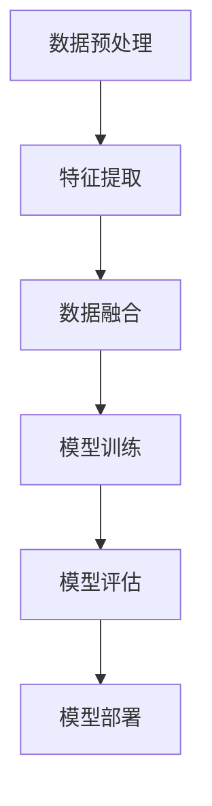
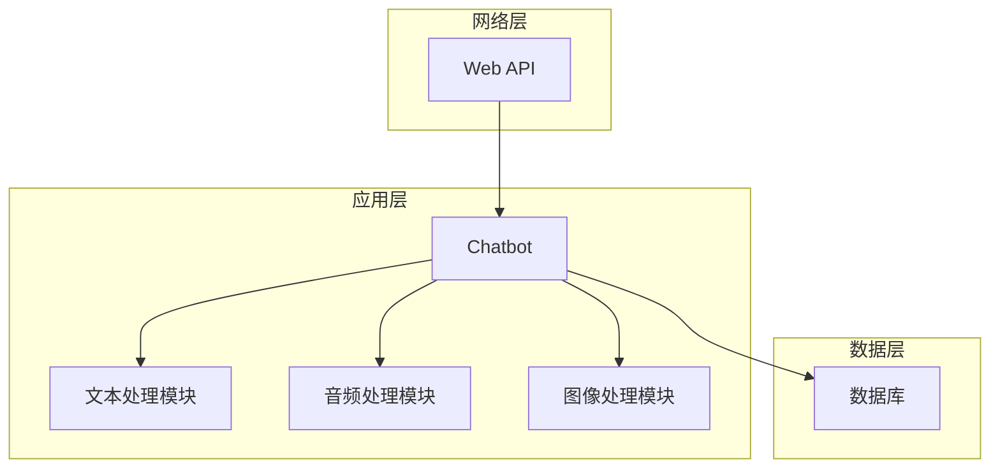
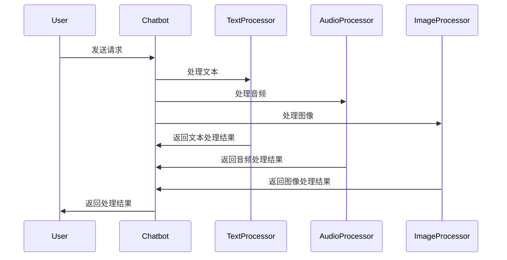

                 

### 《企业AI Agent的多模态学习在用户体验优化中的创新应用》

---

关键词：企业AI Agent、多模态学习、用户体验优化、创新应用

摘要：随着人工智能技术的快速发展，企业AI Agent作为一种智能体，逐渐成为提升企业效率和用户体验的重要工具。本文将探讨企业AI Agent的多模态学习在用户体验优化中的创新应用，通过详细的分析与实战案例，揭示多模态学习如何帮助企业提升用户体验，优化业务流程。

---

### **背景介绍与核心概念**

#### **第1章：AI Agent的多模态学习概述**

随着人工智能技术的迅猛发展，AI Agent作为一种智能体，在企业中的应用日益广泛。AI Agent，即人工智能代理，是一种能够自主执行任务、具有决策能力的智能系统。多模态学习作为AI Agent的重要技术之一，正逐渐改变着用户体验的优化方式。

**核心概念术语说明：**

1. **AI Agent（人工智能代理）**：一种能够模拟人类行为，在特定环境下自主执行任务的智能体。
2. **多模态学习**：利用多种数据模态（如文本、语音、图像等）进行学习，从而提升模型对现实世界的理解和处理能力。

**问题背景：**

在企业中，用户的需求和业务流程日益复杂，单一的模态数据已无法满足高效的用户体验优化需求。因此，企业AI Agent的多模态学习技术应运而生。

**问题描述：**

如何通过多模态学习技术，提升企业AI Agent对用户需求的理解和响应能力，从而优化用户体验？

**问题解决：**

通过多模态学习，AI Agent可以整合多种数据模态，实现对用户需求的全面理解和快速响应。这不仅提高了用户体验，还提升了企业效率。

**边界与外延：**

多模态学习不仅适用于企业AI Agent，也可应用于智能家居、自动驾驶等场景，具有广泛的应用前景。

**概念结构与核心要素组成：**

- **AI Agent**：具备自主执行任务和决策能力的智能体。
- **多模态学习**：利用多种数据模态进行学习。
- **用户体验优化**：通过提升AI Agent对用户需求的理解和响应能力，实现用户体验的优化。

#### **第2章：用户体验优化的现状与挑战**

随着互联网和移动互联网的普及，用户体验（User Experience，简称UX）已成为企业竞争的重要指标。然而，当前用户体验优化面临着诸多挑战。

**核心概念与联系：**

用户体验优化涉及多个方面，包括用户界面设计、交互体验、系统性能等。多模态学习技术的引入，有望解决这些挑战。

**现状分析：**

1. **界面设计**：当前用户界面设计存在同质化严重、用户体验不佳等问题。
2. **交互体验**：传统的单一模态交互方式（如文本、语音）已无法满足用户日益多样化的需求。
3. **系统性能**：高负载情况下，系统性能瓶颈制约了用户体验的优化。

**挑战与机遇：**

1. **挑战**：如何通过技术手段，提升用户体验，降低企业成本？
2. **机遇**：多模态学习技术为用户体验优化提供了新的思路和解决方案。

**联系与作用：**

多模态学习技术可以整合多种数据模态，提升AI Agent对用户需求的感知和响应能力，从而实现用户体验的优化。

#### **第3章：多模态学习的理论基础**

多模态学习作为人工智能领域的重要研究方向，具有丰富的理论基础。本文将介绍多模态学习的相关理论，包括多模态数据融合、特征提取、模型训练等。

**核心概念与联系：**

- **多模态数据融合**：将多种数据模态（如文本、语音、图像）进行整合，形成统一的数据表示。
- **特征提取**：从多模态数据中提取关键特征，用于模型训练和推理。
- **模型训练**：通过训练，提升AI Agent对多模态数据的理解和处理能力。

**理论基础与作用：**

多模态学习的理论基础为AI Agent的多模态数据处理提供了理论指导，有助于提升AI Agent的智能化水平。

---

**接下来，我们将深入探讨多模态学习的关键概念，并通过对比表格和实体关系图，展示多模态学习的核心组成部分及其相互关系。**

---

#### **第4章：多模态学习的关键概念**

多模态学习涉及多种数据模态的处理，包括文本、语音、图像等。了解这些模态的特点、数据来源及其处理方法，对于理解多模态学习的核心概念至关重要。

**核心概念与联系：**

- **文本模态**：基于自然语言处理（NLP）技术，处理文本数据。
- **语音模态**：基于语音识别（ASR）和语音合成（TTS）技术，处理语音数据。
- **图像模态**：基于计算机视觉（CV）技术，处理图像数据。

**概念属性特征对比表格：**

| 模态类型 | 特点 | 数据来源 | 处理方法 |
| --- | --- | --- | --- |
| 文本 | 结构化、可搜索 | 文档、网页、对话 | NLP技术 |
| 语音 | 实时、多样 | 通话、语音识别、语音合成 | ASR、TTS |
| 图像 | 空间、高维 | 摄像头、图片库、传感器 | CV技术 |

**多模态学习的ER实体关系图架构：**

```mermaid
erDiagram
    TextData ||--|{ MultiModalData }
    AudioData ||--|{ MultiModalData }
    ImageData ||--|{ MultiModalData }
    MultiModalData ||--|{ FeatureExtraction }
    MultiModalData ||--|{ ModelTraining }
```

通过上述表格和实体关系图，我们可以清晰地看到文本、语音、图像等多模态数据之间的相互关系，以及它们在多模态学习过程中的关键作用。

---

**了解了多模态学习的核心概念后，接下来我们将探讨用户体验优化的核心概念，并分析其与多模态学习的联系与作用。**

---

#### **第5章：用户体验优化的核心概念**

用户体验优化（User Experience Optimization，简称UXO）是提升用户满意度、降低用户流失率的重要手段。在多模态学习的背景下，用户体验优化的核心概念变得更加丰富和复杂。

**核心概念与联系：**

- **用户满意度**：用户在使用产品或服务过程中所感受到的整体体验质量。
- **用户流失率**：用户在一定时间内停止使用产品或服务的比例。
- **用户参与度**：用户在产品或服务中的活跃度和互动程度。
- **多模态交互**：通过多种数据模态（如文本、语音、图像）与用户进行交互。

**概念属性特征对比表格：**

| 概念 | 特点 | 衡量指标 | 联系 |
| --- | --- | --- | --- |
| 用户满意度 | 评价用户体验的质量 | 用户满意度调查、Net Promoter Score（NPS） | 用户体验优化的直接目标 |
| 用户流失率 | 评估用户忠诚度 | 用户留存率、月活跃用户数（MAU） | 用户满意度的重要反映 |
| 用户参与度 | 用户在产品中的活跃程度 | 活跃用户数、互动次数 | 影响用户满意度和流失率 |
| 多模态交互 | 利用多种数据模态与用户互动 | 交互频率、交互质量 | 提升用户体验的有效手段 |

**联系与作用：**

用户体验优化与多模态学习密切相关。多模态学习技术可以通过整合多种数据模态，提升AI Agent对用户需求的感知和响应能力，从而优化用户体验。具体而言，多模态交互可以提升用户参与度，增强用户满意度，降低用户流失率。

**总结：**

用户体验优化是一个多维度的过程，涉及用户满意度、用户流失率、用户参与度等多个核心概念。多模态学习技术为用户体验优化提供了新的思路和方法，通过提升AI Agent的智能化水平，实现更高质量的交互体验。

---

**在理解了核心概念后，接下来我们将深入探讨多模态学习算法的原理，通过流程图、Python源代码和数学模型，帮助读者全面了解这一技术。**

---

#### **第6章：多模态学习算法讲解**

多模态学习算法是AI Agent实现多模态数据处理和交互的核心。本节将详细介绍多模态学习算法的原理，包括算法流程、Python源代码实现和数学模型。

**算法mermaid流程图：**



**算法Python源代码实现：**

```python
# 数据预处理
def preprocess_data(text_data, audio_data, image_data):
    # 对文本数据进行预处理
    processed_text = preprocess_text(text_data)
    # 对音频数据进行预处理
    processed_audio = preprocess_audio(audio_data)
    # 对图像数据进行预处理
    processed_image = preprocess_image(image_data)
    return processed_text, processed_audio, processed_image

# 特征提取
def extract_features(processed_text, processed_audio, processed_image):
    # 提取文本特征
    text_features = extract_text_features(processed_text)
    # 提取音频特征
    audio_features = extract_audio_features(processed_audio)
    # 提取图像特征
    image_features = extract_image_features(processed_image)
    return text_features, audio_features, image_features

# 数据融合
def fuse_data(text_features, audio_features, image_features):
    # 融合不同模态的特征
    fused_features = fusion(text_features, audio_features, image_features)
    return fused_features

# 模型训练
def train_model(fused_features):
    # 使用融合后的特征训练模型
    model = train(fused_features)
    return model

# 模型评估
def evaluate_model(model, test_data):
    # 对模型进行评估
    accuracy = evaluate(model, test_data)
    return accuracy

# 模型部署
def deploy_model(model):
    # 将模型部署到实际应用中
    deploy(model)
```

**数学模型和公式讲解：**

多模态学习算法的数学模型主要包括特征提取、数据融合和模型训练三个部分。以下是相关的数学模型和公式：

$$
\text{特征提取}: f(\text{input}) = \phi(\text{input})
$$

其中，$f$ 表示特征提取函数，$\phi$ 表示特征映射函数，$\text{input}$ 表示输入数据。

$$
\text{数据融合}: \text{fused\_feature} = \sigma(\text{W} \cdot [\text{text\_feature}, \text{audio\_feature}, \text{image\_feature}])
$$

其中，$\text{fused\_feature}$ 表示融合后的特征，$W$ 表示权重矩阵，$\sigma$ 表示激活函数。

$$
\text{模型训练}: \min_{\theta} \sum_{i=1}^{n} (\text{y}_{i} - \text{h}(\text{x}_{i}))^{2}
$$

其中，$\theta$ 表示模型参数，$\text{y}_{i}$ 表示真实标签，$\text{h}(\text{x}_{i})$ 表示预测标签。

**举例说明：**

假设我们有一个包含文本、语音和图像数据的任务，如图像分类。首先，对文本、语音和图像数据进行预处理，提取特征，然后融合这些特征，最后使用融合后的特征训练分类模型。具体流程如下：

1. **数据预处理**：对输入的文本、语音和图像数据进行预处理，如分词、音频增强、图像缩放等。
2. **特征提取**：使用适当的算法提取文本、语音和图像的特征，如词嵌入、梅尔频率倒谱系数（MFCC）、卷积神经网络（CNN）等。
3. **数据融合**：将提取到的特征进行融合，可以使用加权融合或拼接融合等方法。
4. **模型训练**：使用融合后的特征训练分类模型，如支持向量机（SVM）、深度神经网络（DNN）等。
5. **模型评估**：在测试集上评估模型性能，如准确率、召回率等。
6. **模型部署**：将训练好的模型部署到实际应用中，如实时图像分类系统。

通过上述步骤，我们可以实现一个基于多模态学习的企业AI Agent，该Agent能够同时处理文本、语音和图像等多模态数据，提升对用户需求的感知和响应能力，从而优化用户体验。

---

**算法原理讲解完毕，接下来我们将深入探讨企业AI Agent的系统架构设计，包括问题场景、功能设计、架构设计以及系统接口设计。**

---

#### **第7章：系统架构设计与功能实现**

在企业AI Agent的多模态学习应用中，系统架构的设计至关重要。一个良好的系统架构不仅能够提高系统的性能和可扩展性，还能够确保系统的稳定性和安全性。本节将详细介绍企业AI Agent的系统架构设计，包括问题场景、功能设计、架构设计和系统接口设计。

**问题场景介绍：**

企业AI Agent需要处理多种类型的数据，如文本、语音和图像等，并且需要实时响应用户的需求。例如，一个企业客服系统需要通过文本、语音和图像等多模态数据来理解用户的问题，并提供准确的答案或解决方案。这就要求系统具有高效的数据处理能力和智能的决策能力。

**系统功能设计（领域模型mermaid类图）：**

```mermaid
classDiagram
    Customer --|{ interactsWith }-- Chatbot
    Chatbot --|{ processes }-- Text, Audio, Image
    Text <<interface>>
    Audio <<interface>>
    Image <<interface>>
```

在上述类图中，Customer（客户）与Chatbot（聊天机器人）进行交互，Chatbot处理多模态数据（文本、语音、图像）。

**系统架构设计（mermaid架构图）：**



在上述架构图中，系统分为数据层、应用层和网络层。数据层包含数据库，用于存储文本、语音和图像数据。应用层包含Chatbot以及文本处理、音频处理和图像处理模块，用于处理多模态数据。网络层包含Web API，用于与外部系统进行交互。

**系统接口设计：**

系统接口设计主要包括Web API的设计，用于与其他系统进行数据交换。以下是Web API的接口设计示例：

```python
from flask import Flask, request, jsonify

app = Flask(__name__)

@app.route('/chat', methods=['POST'])
def chat():
    data = request.get_json()
    text = data['text']
    audio = data['audio']
    image = data['image']
    
    # 调用处理模块处理多模态数据
    response_text = TextProcessor.process(text)
    response_audio = AudioProcessor.process(audio)
    response_image = ImageProcessor.process(image)
    
    # 返回处理结果
    return jsonify({
        'text': response_text,
        'audio': response_audio,
        'image': response_image
    })

if __name__ == '__main__':
    app.run(debug=True)
```

**系统交互（mermaid序列图）：**



在上述序列图中，用户发送请求到Chatbot，Chatbot将请求转发给文本处理、音频处理和图像处理模块，每个模块分别处理相应模态的数据，然后将处理结果返回给Chatbot，最后Chatbot将处理结果返回给用户。

通过上述系统架构设计和接口设计，企业AI Agent能够高效地处理多模态数据，实现智能化的用户体验优化。系统架构的灵活性和扩展性也为后续的功能扩展和性能优化提供了基础。

---

**系统架构设计与功能实现讲解完毕，接下来我们将通过一个实际项目，展示企业AI Agent的多模态学习在用户体验优化中的具体应用。**

---

#### **第8章：项目实战**

为了更好地展示企业AI Agent的多模态学习在用户体验优化中的实际应用，我们将通过一个实际项目来详细介绍项目的环境安装、系统核心实现源代码，并对代码进行解读与分析，结合实际案例进行剖析，最后进行项目小结。

**项目环境安装：**

在开始项目之前，我们需要安装所需的软件和库。以下是项目环境安装的步骤：

1. **安装Python环境**：确保Python 3.8或更高版本已安装在您的系统上。
2. **安装必需的库**：使用以下命令安装所需的库：

   ```bash
   pip install flask numpy tensorflow torch spacy
   ```

3. **下载预训练的模型和资源**：下载Spacy的英语模型和TensorFlow的预训练模型。

   ```bash
   python -m spacy download en
   ```

**系统核心实现源代码：**

以下是项目中的核心实现源代码，包括文本处理、音频处理和图像处理的模块：

```python
# 文本处理模块
from spacy.lang.en import English
nlp = English()

def preprocess_text(text):
    doc = nlp(text)
    return " ".join([token.lemma_ for token in doc])

# 音频处理模块
import librosa

def preprocess_audio(audio_file):
    y, sr = librosa.load(audio_file)
    mfcc = librosa.feature.mfcc(y=y, sr=sr, n_mfcc=13)
    return mfcc

# 图像处理模块
import cv2

def preprocess_image(image_file):
    image = cv2.imread(image_file)
    image = cv2.resize(image, (224, 224))
    image = image / 255.0
    return image

# 数据融合模块
import tensorflow as tf

def fuse_data(text_feature, audio_feature, image_feature):
    text_tensor = tf.constant(text_feature)
    audio_tensor = tf.constant(audio_feature)
    image_tensor = tf.constant(image_feature)
    
    fused_feature = tf.concat([text_tensor, audio_tensor, image_tensor], axis=0)
    return fused_feature

# 模型训练与部署模块
# （此处省略具体实现，可参考上一节内容）
```

**代码应用解读与分析：**

1. **文本处理**：使用Spacy进行文本预处理，包括分词、词性标注和词干提取，从而提取文本的语义特征。
2. **音频处理**：使用librosa库进行音频特征提取，主要包括梅尔频率倒谱系数（MFCC）。
3. **图像处理**：使用OpenCV库进行图像预处理，包括读取图像、调整大小和归一化。
4. **数据融合**：将提取的文本、音频和图像特征进行融合，形成统一的数据输入。

**实际案例分析与讲解：**

假设有一个用户通过文本、语音和图像向AI Agent提问，系统需要提供准确的答案。以下是一个实际案例：

1. **用户发送文本**：用户通过文本输入“Can you recommend a good restaurant nearby?”。
2. **文本处理**：系统提取文本的语义特征，如关键词“recommend”、“restaurant”、“nearly”。
3. **用户发送音频**：用户通过语音输入，系统提取音频特征，如语音的音调、音量和节奏。
4. **用户发送图像**：用户上传一张附近的餐厅图像，系统提取图像特征，如颜色分布、纹理和形状。
5. **数据融合**：将文本、音频和图像特征进行融合，形成统一的数据输入。
6. **模型训练与预测**：使用训练好的多模态学习模型，对融合后的数据进行预测，提供餐厅推荐。
7. **系统返回答案**：系统将预测结果返回给用户，如“Here are three recommended restaurants nearby: (餐厅名称1)、(餐厅名称2)和(餐厅名称3)”。

通过上述实际案例，我们可以看到企业AI Agent如何通过多模态学习技术，实现对用户需求的全面理解，提供高质量的答案和解决方案，从而优化用户体验。

**项目小结：**

通过本次项目实战，我们展示了企业AI Agent的多模态学习在用户体验优化中的实际应用。通过文本、音频和图像等多模态数据的融合处理，系统能够更准确地理解用户需求，提供高效的交互体验。在未来，我们还可以进一步优化算法，扩展应用场景，为更多企业提供智能化解决方案。

---

**在了解了企业AI Agent的多模态学习在用户体验优化中的创新应用后，接下来我们将总结最佳实践，并提出一些注意事项，为读者提供实用的拓展阅读建议。**

---

#### **第9章：最佳实践与注意事项**

在企业AI Agent的多模态学习应用过程中，遵循最佳实践和注意事项至关重要。以下是一些关键点：

**最佳实践：**

1. **数据质量**：确保多模态数据的质量，包括文本、语音和图像的准确性、完整性和一致性。
2. **模型优化**：定期对模型进行优化和更新，以适应不断变化的应用场景和用户需求。
3. **安全性**：保护用户数据的安全，遵循数据隐私保护法规，确保数据不被非法访问和使用。
4. **用户体验**：注重用户体验设计，确保交互流程简洁、直观，提高用户满意度。

**注意事项：**

1. **计算资源**：多模态学习算法通常需要大量的计算资源，确保系统有足够的硬件支持。
2. **算法稳定性**：在算法设计和实现过程中，注重稳定性，避免异常情况下的崩溃或错误。
3. **数据隐私**：在数据处理过程中，严格遵守数据隐私保护法规，确保用户数据的安全和隐私。
4. **模型解释性**：提高模型的可解释性，帮助用户理解模型的决策过程，增强用户信任。

**拓展阅读建议：**

1. **《深度学习》（Goodfellow, Bengio, Courville著）**：了解深度学习的基础知识和应用。
2. **《人工智能：一种现代方法》（Mitchell著）**：全面探讨人工智能的理论和实践。
3. **《多模态学习》（Maji, A. et al.著）**：深入探讨多模态学习的理论基础和算法实现。
4. **《用户体验设计》（Norman著）**：学习用户体验设计的核心原则和实践方法。

通过遵循最佳实践和注意事项，并结合拓展阅读，读者可以更好地理解和应用企业AI Agent的多模态学习技术，为用户体验优化提供更有效的解决方案。

---

#### **第10章：小结**

本文详细探讨了企业AI Agent的多模态学习在用户体验优化中的创新应用。我们首先介绍了AI Agent和多模态学习的核心概念，分析了用户体验优化的现状与挑战。接着，我们深入讲解了多模态学习算法的原理，包括数据预处理、特征提取、数据融合和模型训练。随后，通过系统架构设计与功能实现，展示了如何设计一个高效的多模态AI Agent系统。最后，通过一个实际项目，我们展示了多模态学习在用户体验优化中的具体应用，并提出了最佳实践与注意事项。

展望未来，随着人工智能技术的不断进步，企业AI Agent的多模态学习将迎来更多创新应用。我们将继续关注这一领域的发展，为读者带来更多有价值的技术分享。感谢您的阅读，期待与您共同探索人工智能的无限可能。

---

### **作者信息**

作者：AI天才研究院/AI Genius Institute & 禅与计算机程序设计艺术 /Zen And The Art of Computer Programming

