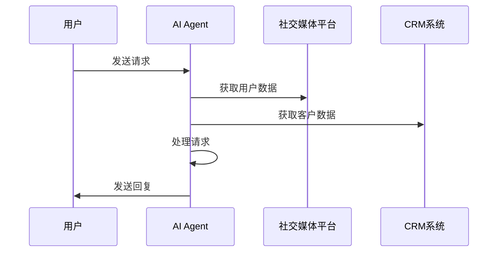

                 

# 企业AI Agent的多渠道集成：统一客户服务体验

> 关键词：企业AI Agent，多渠道集成，客户服务体验，人工智能

> 摘要：随着企业对客户服务需求的不断增长，AI Agent成为了一种高效解决方案。本文将探讨企业AI Agent的多渠道集成，旨在提供一种统一且高效的客户服务体验。我们将从背景介绍、核心概念、技术原理、集成实现、架构设计、项目实战以及最佳实践等方面进行深入分析。

## 引言与背景

### 1.1 书籍目的与读者对象

在当今数字化时代，企业对客户服务的需求日益增加。传统的客户服务方式难以满足日益复杂的客户需求，而人工智能（AI）技术的发展为这一问题提供了新的解决方案。本文旨在探讨企业AI Agent的多渠道集成，帮助企业在数字化转型的浪潮中实现高效、统一的客户服务体验。

本文的目标读者包括：

1. 企业IT经理、项目经理
2. 人工智能和大数据领域的工程师
3. 对AI Agent和客户服务集成感兴趣的学者和研究人员

### 1.2 企业AI Agent的现状

AI Agent，也称为虚拟助手或聊天机器人，是一种能够与用户进行自然语言交互的人工智能系统。随着技术的进步，企业AI Agent在各个行业中的应用越来越广泛。例如，客服、销售、客户支持等场景中，AI Agent能够提供快速、准确的响应，提高客户满意度，降低企业运营成本。

### 1.3 多渠道集成的意义与挑战

多渠道集成是指将企业的AI Agent整合到各种不同的通信渠道中，如电话、邮件、社交媒体、即时通讯应用等。这种集成能够提供无缝的客户服务体验，使客户能够通过他们喜欢的渠道与AI Agent进行互动。然而，多渠道集成也面临一些挑战：

1. **技术复杂性**：集成不同渠道的技术平台和协议可能存在差异，需要协调和解决。
2. **用户体验**：确保在不同渠道上提供一致的体验，避免用户体验的割裂。
3. **数据整合**：不同渠道的数据整合和处理需要考虑隐私和安全性。

## 核心概念与架构

### 2.1 企业AI Agent的定义与特点

#### 2.1.1 AI Agent的概念

AI Agent是一种基于人工智能技术的虚拟实体，能够模拟人类思维和行为，与用户进行交互。它通常基于机器学习算法，通过大量的数据训练，能够理解和生成自然语言，实现智能对话。

#### 2.1.2 企业AI Agent的架构

企业AI Agent通常由以下几个关键组件组成：

1. **自然语言处理（NLP）引擎**：负责处理用户输入的自然语言，包括语音识别、语义理解和情感分析等。
2. **知识库**：存储与业务相关的知识，包括产品信息、常见问题和解决方案等。
3. **对话管理模块**：负责管理对话流程，根据用户输入和上下文生成合适的回复。
4. **多渠道集成模块**：负责将AI Agent集成到各种通信渠道中，如电话、邮件、社交媒体等。

### 2.2 多渠道集成的核心概念

#### 2.2.1 多渠道整合

多渠道整合是指将企业的AI Agent整合到多个通信渠道中，提供统一的客户服务体验。这包括：

1. **多渠道接入**：使AI Agent能够通过多种通信渠道接收用户请求，如电话、邮件、社交媒体等。
2. **渠道互通**：实现不同渠道之间的数据和信息共享，确保客户在不同渠道上的交互能够无缝衔接。

#### 2.2.2 客户服务体验统一化

客户服务体验统一化是指无论客户通过哪个渠道与AI Agent互动，都能够获得一致、高效的响应和服务。这包括：

1. **统一的界面和交互风格**：确保不同渠道上的用户体验保持一致。
2. **一致的响应速度和准确性**：无论客户通过哪个渠道提问，AI Agent都能够快速、准确地提供回答。
3. **跨渠道数据整合**：将客户在不同渠道上的交互数据整合，为AI Agent提供更全面的信息，以提供更个性化的服务。

## AI Agent技术原理

### 3.1 AI Agent的基础技术

#### 3.1.1 机器学习与深度学习

机器学习（ML）和深度学习（DL）是AI Agent的核心技术。机器学习是一种通过数据训练模型，使模型能够对未知数据进行预测或分类的方法。深度学习则是一种基于人工神经网络的机器学习方法，通过多层神经网络模型，实现对复杂数据的高效处理和识别。

#### 3.1.2 自然语言处理

自然语言处理（NLP）是AI Agent实现自然语言交互的关键技术。NLP包括语音识别、语义理解、情感分析、文本生成等多个方面，使得AI Agent能够理解用户的自然语言输入，并生成自然语言回复。

### 3.2 AI Agent的工作流程

#### 3.2.1 情感识别与理解

情感识别与理解是AI Agent与用户互动的第一步。通过分析用户的语音或文本输入，AI Agent能够识别用户的情感状态，如愤怒、喜悦、疑惑等，从而调整对话策略，提供更合适的回应。

#### 3.2.2 决策与行动

在理解用户情感后，AI Agent会根据预设的规则和算法，生成合适的回复或行动。这可能包括提供解决方案、引导用户到相关页面、转移给人工客服等。

## 多渠道集成实现

### 4.1 社交媒体集成

#### 4.1.1 社交媒体渠道概述

社交媒体渠道包括微信、QQ、微博、Facebook、Twitter等，是企业与客户互动的重要平台。通过集成AI Agent到这些平台，企业能够更便捷地与客户沟通，提供即时、高效的客户服务。

#### 4.1.2 集成方法与实现

社交媒体集成的实现通常包括以下几个步骤：

1. **接入API**：获取社交媒体平台的API接口，以实现数据的读取和写入。
2. **认证与授权**：通过OAuth等认证机制，确保AI Agent能够安全地访问社交媒体平台。
3. **数据同步**：将社交媒体平台上的用户数据同步到AI Agent的知识库中，以便进行智能交互。
4. **多渠道消息处理**：实现AI Agent能够处理来自不同社交媒体平台的消息，并生成统一的回复。

### 4.2 客户关系管理系统集成

#### 4.2.1 CRM系统概述

客户关系管理（CRM）系统是企业管理和维护客户关系的重要工具。通过集成AI Agent到CRM系统，企业能够更好地了解客户需求，提供个性化的服务。

#### 4.2.2 集成策略与方案

CRM系统集成的策略和方案包括：

1. **API集成**：通过CRM系统的API接口，实现AI Agent与CRM系统的数据交互。
2. **数据映射**：将AI Agent的知识库与CRM系统的客户数据映射，以便进行精准的个性化服务。
3. **流程自动化**：将AI Agent集成到CRM系统的业务流程中，如自动回复、自动预约等，提高效率。
4. **智能分析**：利用AI Agent的智能分析能力，为CRM系统提供更深入的客户洞察，优化客户管理策略。

## 架构设计与系统实现

### 5.1 系统架构设计

#### 5.1.1 系统需求分析

系统需求分析包括对客户服务场景的分析、AI Agent的功能需求、多渠道集成的需求等。

#### 5.1.2 系统架构设计

系统架构设计包括以下几个关键模块：

1. **前端界面**：提供用户与AI Agent交互的界面。
2. **后端服务**：包括NLP引擎、知识库、对话管理模块等。
3. **多渠道接入**：包括社交媒体接入模块、CRM系统接入模块等。
4. **数据存储**：包括用户数据、对话记录、知识库数据等。

### 5.2 系统接口设计

#### 5.2.1 接口规范

系统接口设计需要遵循一定的规范，如RESTful API规范、GraphQL规范等。

#### 5.2.2 接口实现

接口实现包括API的定义、数据传输格式、权限控制等。

### 5.3 系统交互

#### 5.3.1 系统交互流程

系统交互流程包括用户请求发送、AI Agent处理、回复生成和发送等步骤。

#### 5.3.2 系统交互序列图

使用Mermaid序列图展示系统交互流程，如下所示：

## 项目实战

### 6.1 项目环境搭建

#### 6.1.1 开发环境配置

开发环境配置包括Python环境、NLP库（如NLTK、spaCy）的安装等。

#### 6.1.2 数据集准备

数据集准备包括收集客户服务场景的对话数据、标签数据等。

### 6.2 系统核心实现

#### 6.2.1 数据预处理

数据预处理包括数据清洗、分词、实体识别等。

#### 6.2.2 模型训练与部署

模型训练与部署包括选择合适的模型（如BERT、GPT）、训练模型、评估模型性能和部署模型。

### 6.3 代码解读与分析

代码解读与分析包括对关键代码段的分析、参数调优等。

### 6.4 实际案例分析与详细讲解

实际案例分析与详细讲解包括对实际应用场景的案例进行分析和解读。

### 6.5 项目小结

项目小结包括对项目成果的总结、经验教训和改进方向。

## 最佳实践与总结

### 7.1 多渠道集成最佳实践

多渠道集成最佳实践包括接口设计、数据同步、用户体验优化等方面的建议。

### 7.2 项目案例分析与总结

项目案例分析与总结包括对成功案例和失败案例的深入分析，以及从中吸取的经验教训。

### 7.3 注意事项与未来展望

注意事项与未来展望包括系统安全性、隐私保护、持续优化等方面的内容。

## 结语

作者：AI天才研究院/AI Genius Institute & 禅与计算机程序设计艺术 /Zen And The Art of Computer Programming

本文从企业AI Agent的多渠道集成入手，探讨了其核心概念、技术原理、实现方法和架构设计，并通过项目实战展示了其实际应用。通过本文的介绍，希望能够为企业提供一套完整的AI Agent多渠道集成的解决方案，助力企业提升客户服务体验，实现数字化转型。未来，随着人工智能技术的不断进步，企业AI Agent的多渠道集成将发挥更大的作用，为企业和客户带来更多的价值。

