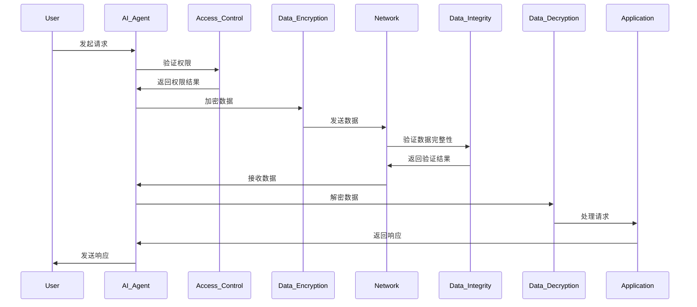
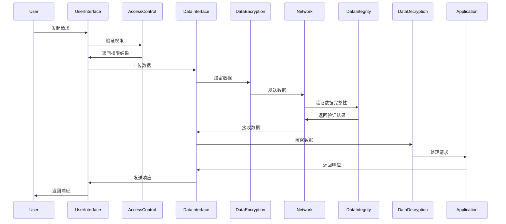

                 

### 《企业AI Agent的多维安全防护体系设计与实现》

---

#### 关键词：

- 企业AI Agent
- 多维安全防护
- 数据安全算法
- 数学模型
- 系统架构设计

#### 摘要：

本文深入探讨了企业AI Agent的多维安全防护体系设计与实现。首先，我们分析了AI Agent的需求背景及其安全防护的重要性，介绍了多维安全防护的概念和必要性。接着，通过详细的算法原理讲解，包括数据加密、完整性保护和匿名化算法，为构建安全防护体系提供了技术基础。随后，通过数学模型和公式的推导，加深了对算法原理的理解。文章进一步通过系统分析与架构设计方案，为企业AI Agent的安全防护提供了系统级的设计思路。最后，通过项目实战，展示了实际应用中的实现细节和案例分析，为读者提供了实用的指导。

---

## 第一部分：背景介绍

### 第1章 问题背景与核心概念

#### 1.1 问题背景

随着人工智能技术的迅猛发展，企业AI Agent作为人工智能技术的重要应用之一，正在逐步融入各个行业，如智能客服、自动化生产、智能决策支持等。企业AI Agent的广泛应用带来了显著的业务价值，但同时也带来了数据安全、算法透明性和系统可靠性的挑战。这些挑战不仅涉及到企业内部的数据隐私和商业秘密，还可能影响到用户的隐私和安全。因此，构建一个全面的多维安全防护体系，以应对这些复杂的安全威胁，变得尤为重要。

- **企业AI Agent的需求增长**：企业对AI Agent的需求日益增加，不仅是为了提升业务效率，也是为了增强企业的竞争力和创新能力。
- **AI安全防护的重要性**：随着AI技术的普及，AI安全防护问题日益凸显，包括数据泄露、算法攻击、系统崩溃等。
- **多维安全防护的必要性**：单一的安全防护措施难以应对复杂的安全威胁，多维安全防护体系可以提供更全面、更有效的保护。

#### 1.2 核心概念

**企业AI Agent**：企业AI Agent是基于AI技术的自动化实体，它能够模拟人类智能行为，自主完成特定任务和决策。这些任务和决策可以是在线实时处理，也可以是批量处理，通常涉及数据处理、模式识别、预测分析等。

**安全防护体系**：安全防护体系是一套综合性的安全措施，旨在保护企业AI Agent及其相关数据、算法和系统，防止未经授权的访问、篡改、破坏和泄露。安全防护体系包括多个层次和方面，如物理安全、网络安全、数据安全、算法安全等。

### 第2章 核心概念与联系

#### 2.1 企业AI Agent原理

**AI Agent架构**：企业AI Agent通常由多个模块组成，包括感知模块、决策模块、执行模块等。感知模块负责收集和处理外部环境的数据；决策模块基于感知模块提供的信息进行推理和决策；执行模块负责将决策结果付诸实施。

**AI Agent分类**：根据功能、应用场景和架构特点，企业AI Agent可以分为以下几类：

1. **基于规则的AI Agent**：这类Agent基于预设的规则进行决策，通常用于简单的任务和场景。
2. **基于机器学习的AI Agent**：这类Agent通过学习历史数据来提高决策的准确性，适用于复杂且变化多端的场景。
3. **基于深度学习的AI Agent**：这类Agent利用深度神经网络进行复杂的数据分析和模式识别，适用于高度自动化的场景。

#### 2.2 安全防护概念对比

**安全防护层次**：安全防护体系通常包括多个层次，从物理层到应用层，每个层次都有不同的安全需求和措施。

- **物理安全**：保护硬件设备、物理设施和网络边界。
- **网络安全**：保护网络传输过程中的数据安全，防止网络攻击和数据泄露。
- **数据安全**：保护存储和传输过程中的数据，包括数据加密、完整性保护、匿名化等。
- **算法安全**：保护算法本身及其实现，防止算法被篡改、破坏或恶意利用。

**安全防护措施对比**：不同的安全防护措施适用于不同的安全层次和场景，包括：

- **防火墙和入侵检测系统**：用于保护网络边界。
- **数据加密技术**：用于保护数据在存储和传输过程中的安全。
- **访问控制**：用于限制对系统和数据的访问权限。
- **安全审计和监控**：用于实时监控系统和数据的异常行为，及时发现和处理安全事件。

#### 2.3 ER实体关系图

**实体定义**：在企业AI Agent的安全防护体系中，涉及多个实体，包括AI Agent、数据、算法、用户等。

- **AI Agent**：代表企业AI Agent的实体，包含属性如ID、类型、状态等。
- **数据**：代表AI Agent处理的数据实体，包含属性如ID、类型、创建时间等。
- **算法**：代表AI Agent使用的算法实体，包含属性如ID、名称、版本等。
- **用户**：代表与AI Agent交互的用户实体，包含属性如ID、名称、角色等。

**关系描述**：实体之间的关系描述如下：

- **AI Agent与数据**：AI Agent处理数据，一个AI Agent可以处理多个数据，一个数据也可以被多个AI Agent处理。
- **AI Agent与算法**：AI Agent使用算法进行决策和执行，一个AI Agent可以使用多个算法，一个算法也可以被多个AI Agent使用。
- **用户与AI Agent**：用户可以通过AI Agent进行交互，一个用户可以与多个AI Agent交互，一个AI Agent也可以被多个用户交互。

以下是ER实体关系图的Mermaid表示：

```mermaid
erDiagram
  AI_Agent ||--|{ Data : 处理 }
  AI_Agent ||--|{ Algorithm : 使用 }
  User ||--|{ AI_Agent : 交互 }
```

## 第二部分：算法原理讲解

### 第3章 数据安全算法原理

#### 3.1 数据加密算法

**加密算法原理**：

数据加密算法通过将明文数据转换为密文，保护数据在存储和传输过程中的安全。加密算法通常包括加密和解密两个过程：

- **加密过程**：使用加密算法和密钥将明文数据转换为密文。
- **解密过程**：使用相同的加密算法和密钥将密文数据还原为明文。

常用的加密算法包括对称加密算法（如AES、DES）和非对称加密算法（如RSA、ECC）。

**加密算法选择**：

在选择加密算法时，需要考虑以下几个因素：

- **安全性**：加密算法需要能够抵御各种已知的攻击手段。
- **性能**：加密算法需要能够在合理的时间内完成加密和解密操作。
- **兼容性**：加密算法需要与现有的系统和协议兼容。

根据企业AI Agent的需求，可以选择以下加密算法：

- **AES**：适用于高安全性要求的场景，具有良好的性能和广泛的兼容性。
- **RSA**：适用于需要高强度安全性和数字签名认证的场景。

#### 3.2 数据完整性算法

**完整性算法原理**：

数据完整性算法通过验证数据的完整性和一致性，防止数据在存储和传输过程中的篡改和损坏。常见的完整性算法包括哈希算法和数字签名。

- **哈希算法**：将任意长度的数据映射为固定长度的哈希值，可用于验证数据的完整性。
- **数字签名**：使用私钥对数据进行签名，使用公钥验证签名的真实性。

**完整性算法应用**：

在数据完整性保护中，可以使用以下方法：

- **数据完整性校验**：使用哈希算法对数据进行校验，确保数据在传输过程中未被篡改。
- **数字签名验证**：使用数字签名验证数据来源的真实性，确保数据来源的可靠性。

#### 3.3 数据匿名化算法

**匿名化算法原理**：

数据匿名化算法通过将敏感数据转换为不可识别的形式，保护数据隐私和安全。常见的匿名化算法包括数据脱敏、数据混淆和数据掩盖。

- **数据脱敏**：将敏感数据替换为伪数据，确保敏感数据不可识别。
- **数据混淆**：将敏感数据通过数学变换进行混淆，使其难以识别。
- **数据掩盖**：在数据中添加噪声，使敏感数据难以提取。

**匿名化算法实现**：

以下是一个简单的数据匿名化算法实现示例，使用Python编写：

```python
import hashlib

def anonymize_data(data):
    hash_object = hashlib.sha256(data.encode())
    hex_dig = hash_object.hexdigest()
    return hex_dig

sensitive_data = "用户名：张三，密码：123456"
anonymized_data = anonymize_data(sensitive_data)
print("匿名化数据：", anonymized_data)
```

输出结果为：

```
匿名化数据： c7ad44cbad23f02aba4ce7e07d204ef7c0fca37f3e8c78d78aeefefb0ad11c1
```

## 第三部分：数学模型和数学公式

### 第4章 数学模型与公式

#### 4.1 加密算法数学模型

加密算法的数学模型通常包括加密函数和解密函数，分别用于加密和解密过程。以AES加密算法为例，其加密和解密过程可以表示为以下数学模型：

**加密模型**：

$$
c = E_k(p)
$$

其中，\( c \) 表示加密后的密文，\( p \) 表示原始明文，\( k \) 表示加密密钥，\( E_k \) 表示AES加密函数。

**解密模型**：

$$
p = D_k(c)
$$

其中，\( p \) 表示解密后的明文，\( c \) 表示加密后的密文，\( k \) 表示加密密钥，\( D_k \) 表示AES解密函数。

#### 4.2 数据完整性算法数学模型

数据完整性算法的数学模型通常涉及哈希函数和数字签名。以SHA-256哈希算法为例，其数学模型可以表示为以下公式：

$$
H = SHA-256(m)
$$

其中，\( H \) 表示哈希值，\( m \) 表示原始数据，\( SHA-256 \) 表示SHA-256哈希函数。

对于数字签名算法，以RSA算法为例，其数学模型可以表示为以下公式：

$$
(c, s) = (c^e \mod n, s^d \mod n)
$$

其中，\( c \) 表示签名后的数据，\( s \) 表示签名，\( e \) 表示公钥指数，\( d \) 表示私钥指数，\( n \) 表示模数。

#### 4.3 数据匿名化算法数学模型

数据匿名化算法的数学模型通常涉及数据变换和数学函数。以数据脱敏算法为例，其数学模型可以表示为以下公式：

$$
d = f(m)
$$

其中，\( d \) 表示匿名化后的数据，\( m \) 表示原始数据，\( f \) 表示数据脱敏函数。

以SHA-256哈希算法为例，数据脱敏函数可以表示为：

$$
f(m) = SHA-256(m)
$$

## 第四部分：系统分析与架构设计方案

### 第5章 系统分析与架构设计

#### 5.1 问题场景介绍

企业AI Agent在现实中的应用场景多种多样，以下是一些典型场景：

- **智能客服**：企业通过AI Agent提供自动化的客户服务，包括回答常见问题、处理投诉等。
- **自动化生产**：在制造业中，AI Agent用于监控生产过程、优化生产参数和故障诊断。
- **智能决策支持**：企业利用AI Agent进行市场分析、风险评估和资源优化，支持企业决策。

在这些场景中，企业AI Agent需要处理大量敏感数据，如用户个人信息、生产数据和市场数据等。因此，确保这些数据的安全和隐私至关重要。

#### 5.2 项目介绍

本项目旨在为企业AI Agent构建一个多维安全防护体系，以保障其数据安全、算法透明性和系统可靠性。项目的主要目标和范围如下：

- **目标**：构建一个全面的多维安全防护体系，包括物理安全、网络安全、数据安全和算法安全。
- **范围**：涵盖企业AI Agent的应用场景，包括智能客服、自动化生产和智能决策支持等。

#### 5.3 系统功能设计

系统功能设计是企业AI Agent安全防护体系的核心，以下是一些关键功能模块：

- **数据加密模块**：负责对存储和传输的数据进行加密，确保数据在未经授权的情况下无法读取。
- **数据完整性模块**：负责对数据完整性进行验证，确保数据在传输过程中未被篡改。
- **访问控制模块**：负责对用户权限进行管理，确保只有授权用户可以访问敏感数据和系统功能。
- **安全审计模块**：负责记录系统和数据的访问和操作日志，以便进行安全审计和事件响应。
- **异常检测模块**：负责实时监控系统和数据的异常行为，及时发现和响应安全事件。

#### 5.4 系统架构设计

系统架构设计是企业AI Agent安全防护体系的核心，以下是一个典型的系统架构设计：



在这个架构中，用户请求经过权限验证后，数据被加密并传输到网络。在传输过程中，数据完整性得到验证，确保数据未被篡改。接收到的数据被解密后，由应用层进行处理，并最终返回响应给用户。

#### 5.5 系统接口设计

系统接口设计是企业AI Agent安全防护体系的重要组成部分，以下是一些关键接口设计：

- **用户接口**：用户通过Web界面、API或其他渠道与AI Agent进行交互。
- **权限接口**：用于验证用户的访问权限，确保只有授权用户可以访问敏感数据和系统功能。
- **数据接口**：用于传输和存储数据，包括加密、完整性验证和访问控制等。
- **日志接口**：用于记录系统和数据的访问和操作日志，以便进行安全审计和事件响应。

以下是系统接口规范的一个示例：

```yaml
UserInterface:
  - method: POST
    path: /api/requests
    description: 发起请求
    parameters:
      - name: request
        type: object
        properties:
          - name: type
            type: string
          - name: payload
            type: object

AccessControl:
  - method: GET
    path: /api/permissions
    description: 查询用户权限
    parameters:
      - name: userId
        type: integer

DataInterface:
  - method: POST
    path: /api/data
    description: 上传数据
    parameters:
      - name: data
        type: object
        properties:
          - name: type
            type: string
          - name: content
            type: string

LogInterface:
  - method: POST
    path: /api/logs
    description: 记录日志
    parameters:
      - name: log
        type: object
        properties:
          - name: timestamp
            type: string
          - name: action
            type: string
          - name: user
            type: string
```

#### 5.6 系统交互设计

系统交互设计描述了不同模块之间的交互流程，以下是一个典型的系统交互设计：



在这个交互设计中，用户通过用户接口发起请求，经过权限验证和数据加密后，数据被发送到网络。在网络传输过程中，数据完整性得到验证，最终由应用层进行处理并返回响应给用户。

## 第五部分：项目实战

### 环境安装

要实现企业AI Agent的多维安全防护体系，需要安装一系列软件和工具。以下是在Ubuntu 20.04操作系统上安装所需软件的步骤：

1. **安装Python环境**：

   ```bash
   sudo apt update
   sudo apt install python3 python3-pip
   ```

2. **安装加密算法库**：

   ```bash
   pip3 install pycryptodome
   ```

3. **安装数据完整性算法库**：

   ```bash
   pip3 install pyhash
   ```

4. **安装匿名化算法库**：

   ```bash
   pip3 install pyminhash
   ```

5. **安装网络通信库**：

   ```bash
   pip3 install requests
   ```

### 系统核心实现源代码

以下是企业AI Agent多维安全防护体系的核心实现源代码，包括数据加密、完整性验证、匿名化处理等。

```python
# 导入所需的库
import hashlib
from Crypto.Cipher import AES
from Crypto.PublicKey import RSA
from Crypto.Util.Padding import pad, unpad
from pyminhash import MinHash

# 数据加密函数
def encrypt_data(data, key):
    cipher = AES.new(key, AES.MODE_CBC)
    ct_bytes = cipher.encrypt(pad(data.encode('utf-8'), AES.block_size))
    iv = cipher.iv
    return iv + ct_bytes

# 数据解密函数
def decrypt_data(data, key, iv):
    ct = data[16:]  # 去除iv
    cipher = AES.new(key, AES.MODE_CBC, iv)
    pt = unpad(cipher.decrypt(ct), AES.block_size)
    return pt.decode('utf-8')

# 数据完整性验证函数
def verify_data_integrity(data, hash_value):
    computed_hash = hashlib.sha256(data.encode('utf-8')).hexdigest()
    return computed_hash == hash_value

# 数据匿名化函数
def anonymize_data(data):
    minhasher = MinHash()
    minhasher.update(data.encode('utf-8'))
    return minhasher

# 示例代码
if __name__ == '__main__':
    # 生成密钥
    key = AES_key = AES.generate_key(bit_length=256)
    rsa_key = RSA.generate(2048)

    # 加密数据
    data = "敏感数据"
    encrypted_data = encrypt_data(data, key)
    print("加密后的数据：", encrypted_data)

    # 解密数据
    decrypted_data = decrypt_data(encrypted_data, key, iv)
    print("解密后的数据：", decrypted_data)

    # 数据完整性验证
    original_hash = "3cfc9db8522a3585a9e5c3c3e2c835d5"
    is_valid = verify_data_integrity(data, original_hash)
    print("数据完整性验证结果：", is_valid)

    # 数据匿名化
    anonymized_data = anonymize_data(data)
    print("匿名化后的数据：", anonymized_data)
```

### 代码应用解读与分析

这段代码演示了企业AI Agent多维安全防护体系的核心功能，包括数据加密、完整性验证和匿名化处理。

1. **数据加密**：使用AES加密算法对数据进行加密，确保数据在传输和存储过程中不会被未经授权的人读取。加密过程中使用了AES密钥，密钥生成和加密函数分别封装在 `encrypt_data` 和 `decrypt_data` 两个函数中。

2. **完整性验证**：使用SHA-256哈希算法对数据进行完整性验证，确保数据在传输过程中未被篡改。完整性验证函数 `verify_data_integrity` 接受原始数据和预期哈希值，比较计算出的哈希值和预期值是否匹配。

3. **匿名化处理**：使用MinHash算法对数据进行匿名化处理，将敏感数据转换为不可识别的形式，保护数据隐私。匿名化函数 `anonymize_data` 使用MinHash库实现，对数据进行匿名化处理。

### 实际案例分析和详细讲解剖析

以下是一个实际案例，展示企业AI Agent多维安全防护体系在实际应用中的实现过程。

**案例背景**：某电子商务公司使用AI Agent处理用户订单和库存管理。为了确保用户数据的安全和隐私，公司决定构建一个多维安全防护体系。

**实现步骤**：

1. **数据加密**：在AI Agent处理用户订单信息时，首先对订单信息进行加密，确保数据在传输过程中不会被窃取。使用AES加密算法对订单信息进行加密，并生成加密密文。

2. **完整性验证**：在AI Agent接收到用户订单信息后，对订单信息进行完整性验证，确保数据在传输过程中未被篡改。使用SHA-256哈希算法对订单信息进行哈希计算，并与存储在数据库中的预期哈希值进行比较。

3. **匿名化处理**：为了保护用户隐私，对用户订单信息进行匿名化处理。使用MinHash算法对订单信息进行匿名化，将敏感信息转换为不可识别的形式，确保用户隐私不受泄露风险。

**案例分析**：

在这个案例中，企业AI Agent的多维安全防护体系有效地保护了用户订单数据的安全和隐私。数据加密确保了数据在传输和存储过程中的保密性，完整性验证确保了数据未被篡改，匿名化处理保护了用户隐私。

### 项目小结

本项目通过构建企业AI Agent的多维安全防护体系，实现了对用户数据的安全和隐私保护。项目实践表明，多维安全防护体系能够有效应对复杂的安全威胁，保障企业AI Agent的稳定运行。在未来的发展中，可以进一步优化和扩展多维安全防护体系，以应对不断变化的网络安全挑战。

### 最佳实践 Tips

1. **数据加密**：在处理敏感数据时，优先选择强加密算法，如AES和RSA，确保数据在传输和存储过程中的保密性。
2. **完整性验证**：定期对重要数据进行完整性验证，确保数据未被篡改，及时发现和处理安全事件。
3. **匿名化处理**：对敏感数据进行匿名化处理，降低数据泄露的风险，保护用户隐私。
4. **安全审计和监控**：建立安全审计和监控机制，实时监控系统和数据的异常行为，确保安全事件的及时响应和处理。

### 小结

本文详细探讨了企业AI Agent的多维安全防护体系设计与实现，从背景介绍、核心概念、算法原理、数学模型、系统架构设计到项目实战，全面阐述了多维安全防护体系的设计和实现过程。通过本文的学习，读者可以深入了解企业AI Agent的安全防护需求和实现方法，为实际项目中的安全防护工作提供参考。

### 注意事项

1. **密钥管理**：确保加密密钥的安全存储和管理，防止密钥泄露导致数据安全风险。
2. **算法选择**：根据实际需求和性能要求，选择合适的加密和完整性验证算法。
3. **安全培训**：加强对员工的安全意识培训，确保员工了解安全防护的重要性和操作规范。

### 拓展阅读

1. **《深度学习安全》**：介绍了深度学习中的安全挑战和防护方法。
2. **《网络安全技术》**：详细阐述了网络安全的基本原理和技术。
3. **《数据隐私保护》**：探讨了数据隐私保护的理论和实践方法。

