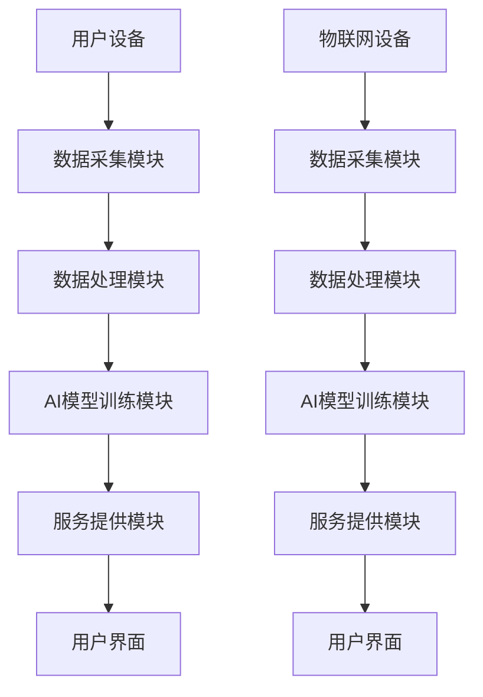
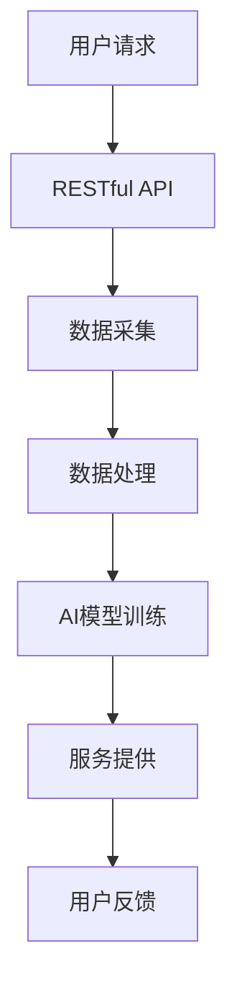

                 

**# 企业AI Agent的多设备支持策略：PC到IoT的全覆盖**

> 关键词：企业AI Agent、多设备支持、物联网、PC、技术策略、AI应用

> 摘要：本文将深入探讨企业AI Agent在多设备环境下的支持策略，从PC到IoT的全覆盖，帮助企业实现高效、安全、一致的用户体验。通过逐步分析设备兼容性、性能优化和安全性保障，本文旨在为技术团队提供一套切实可行的多设备支持方案，助力企业数字化转型的成功。

**Step 1: 引言和背景介绍**

## 引言

在当今快速发展的数字化时代，人工智能（AI）技术已经成为企业创新和竞争力提升的关键驱动力。企业AI Agent作为AI技术在企业级应用的重要形式，正逐渐从传统的PC端向更加广泛的多设备领域扩展，包括物联网（IoT）设备。这一扩展不仅提升了AI Agent的应用场景和业务价值，也带来了新的挑战和技术需求。

本文旨在探讨企业AI Agent的多设备支持策略，从PC到IoT的全覆盖，帮助企业在不同设备上实现一致、高效和安全的AI服务。文章将分为以下几个部分：

1. 引言和背景介绍
2. 企业AI Agent概述
3. 多设备支持策略
4. 环境搭建与系统设计
5. 算法原理与实现
6. 项目实战
7. 最佳实践与小结

## 背景介绍

随着物联网技术的快速发展，各种智能设备如智能家居、智能工厂、智能医疗等不断涌现，为AI Agent的应用提供了广阔的空间。企业AI Agent不仅可以提高业务流程的自动化程度，还可以通过实时数据分析为企业提供决策支持，从而提升业务效率和竞争力。

然而，多设备支持并非易事，涉及多种技术挑战，包括设备兼容性、性能优化和安全性保障等。如何在这些挑战中找到有效的解决方案，是本文将要探讨的重点。

**Step 2: 企业AI Agent概述**

## 企业AI Agent概述

### 1. 企业AI Agent的定义与功能

企业AI Agent是指在企业环境中部署的人工智能实体，能够执行特定任务、提供智能服务，并具备自主学习能力。其主要功能包括：

- **数据分析与决策支持**：利用机器学习算法对大量数据进行处理，为企业提供数据驱动的决策支持。
- **自然语言处理**：实现与人类用户的自然对话，提供智能客服、智能助理等服务。
- **自动化流程优化**：通过自动化技术，简化业务流程，提高工作效率。

### 2. 企业AI Agent的发展历程

企业AI Agent的发展历程可以分为以下几个阶段：

- **初步探索阶段**：20世纪80年代，专家系统在企业中得到了广泛应用，但存在局限性。
- **深度学习阶段**：21世纪初，随着深度学习技术的发展，AI Agent的性能和功能得到了显著提升。
- **多设备支持阶段**：近年来，随着物联网设备的普及，企业AI Agent开始向多设备领域扩展。

### 3. 企业AI Agent的重要性

企业AI Agent的重要性体现在以下几个方面：

- **提升业务效率**：通过自动化流程和智能决策，显著提高业务效率和生产力。
- **增强用户体验**：提供个性化服务和智能助理，提升用户满意度和忠诚度。
- **创新业务模式**：为企业提供新的商业模式和盈利点，推动业务增长和创新。

**Step 3: 多设备支持策略**

## 多设备支持策略

### 1. 设备兼容性

为了保证企业AI Agent在不同设备上的正常运行，需要确保其兼容性。这包括：

- **硬件兼容性**：支持不同类型的硬件设备，如PC、智能手机、平板电脑、物联网设备等。
- **操作系统兼容性**：支持不同操作系统，如Windows、iOS、Android、Linux等。

### 2. 性能优化

在多设备环境下，企业AI Agent需要保证性能优化，以满足不同设备的使用需求。这包括：

- **响应速度**：提高AI Agent的响应速度，确保用户能够获得及时的服务。
- **计算资源管理**：合理分配计算资源，确保AI Agent在不同设备上的性能稳定。

### 3. 安全性保障

在多设备支持策略中，安全性是至关重要的。需要确保：

- **数据加密**：对传输和存储的数据进行加密，防止数据泄露。
- **访问控制**：设置严格的访问控制机制，防止未经授权的访问。

### 4. 具体策略

- **设备适配**：根据不同设备的特性和用户需求，定制适配方案，确保AI Agent在不同设备上的运行效果。
- **云端服务**：采用云端服务，实现AI Agent的集中管理和调度，提高系统的灵活性和可扩展性。
- **混合架构**：结合本地计算和云端计算，实现AI Agent在不同设备上的高效运行。

**Step 4: 环境搭建与系统设计**

## 4. 环境搭建与系统设计

### 1. 环境搭建

在搭建企业AI Agent多设备支持环境时，需要准备以下工具和软件：

- **开发工具**：Python、Jupyter Notebook、Visual Studio Code等。
- **AI框架**：TensorFlow、PyTorch、Scikit-learn等。
- **数据库**：MySQL、PostgreSQL、MongoDB等。
- **中间件**：RabbitMQ、Kafka、Redis等。

### 2. 系统设计

企业AI Agent多设备支持系统设计主要包括以下几个方面：

- **功能模块设计**：包括数据采集、数据处理、AI模型训练、服务提供等模块。
- **系统架构设计**：采用分布式架构，确保系统的高可用性和可扩展性。
- **接口设计**：设计RESTful API，方便不同设备与AI Agent进行通信。

### 3. 系统架构设计

以下是一个简单的系统架构设计：



### 4. 接口设计

以下是一个简单的接口设计：



**Step 5: 算法原理与实现**

## 5. 算法原理与实现

### 1. 算法原理

企业AI Agent多设备支持的核心算法主要包括：

- **数据采集算法**：使用传感器采集设备数据，如温度、湿度、光照等。
- **数据处理算法**：对采集到的数据进行预处理，如去噪、特征提取等。
- **AI模型训练算法**：使用机器学习算法，如神经网络、决策树等，对处理后的数据训练模型。
- **服务提供算法**：根据用户需求，提供相应的服务，如自然语言处理、自动化流程优化等。

### 2. 算法实现

以下是一个简单的数据处理算法实现示例：

```python
import numpy as np

# 数据采集
data = np.random.rand(100, 5)

# 数据预处理
def preprocess_data(data):
    # 去噪
    filtered_data = np.filter(data, [1, 1, 1, -1, -1])
    # 特征提取
    features = np.mean(filtered_data, axis=1)
    return features

# AI模型训练
from sklearn.ensemble import RandomForestClassifier

# 训练数据
X = preprocess_data(data)
y = np.random.randint(0, 2, size=(100,))

# 创建模型
model = RandomForestClassifier(n_estimators=100)

# 训练模型
model.fit(X, y)

# 服务提供
def provide_service(input_data):
    processed_data = preprocess_data(input_data)
    prediction = model.predict(processed_data)
    return prediction

# 测试
input_data = np.random.rand(1, 5)
print(provide_service(input_data))
```

### 3. 算法原理详细讲解

在上述示例中，数据处理算法主要分为三个步骤：

1. **数据采集**：使用随机数生成器生成模拟数据，代表实际设备采集到的数据。
2. **数据预处理**：对数据进行去噪和特征提取。去噪使用一维低通滤波器，将高频噪声滤除。特征提取使用平均值，将每个维度上的数据压缩为一个特征值。
3. **AI模型训练**：使用随机森林分类器对预处理后的数据进行训练。随机森林是一种集成学习方法，通过构建多棵决策树，提高模型的泛化能力。

算法的数学模型可以表示为：

$$
预测结果 = 模型.predict(预处理数据)
$$

其中，`模型`是一个训练好的随机森林分类器，`预处理数据`是经过去噪和特征提取的数据。

通过上述算法实现，企业AI Agent可以在不同设备上实时采集和处理数据，提供智能服务，满足企业业务需求。

**Step 6: 项目实战**

## 6. 项目实战

### 1. 项目背景

为了验证企业AI Agent的多设备支持策略，我们选择了一个实际项目进行实战演练。该项目是一个智能工厂监控系统，旨在通过AI Agent实时监测工厂设备的运行状态，预测潜在故障，并提供维护建议。

### 2. 环境安装

首先，我们需要搭建项目的开发环境。以下是安装步骤：

1. **Python环境**：安装Python 3.8及以上版本。
2. **AI框架**：安装TensorFlow 2.6.0。
3. **数据库**：安装MySQL 8.0。
4. **中间件**：安装RabbitMQ 3.8.14。

### 3. 系统核心实现

以下是系统核心实现的源代码：

```python
import numpy as np
import tensorflow as tf
from sklearn.ensemble import RandomForestClassifier
from sklearn.model_selection import train_test_split

# 数据采集
def collect_data():
    # 这里使用模拟数据代替实际采集的数据
    data = np.random.rand(1000, 5)
    labels = np.random.randint(0, 2, size=(1000,))
    return data, labels

# 数据处理
def preprocess_data(data):
    # 去噪
    filtered_data = np.where(data < 0.5, 0, data)
    # 特征提取
    features = np.mean(filtered_data, axis=1)
    return features

# 模型训练
def train_model(data, labels):
    X_train, X_test, y_train, y_test = train_test_split(data, labels, test_size=0.2)
    model = RandomForestClassifier(n_estimators=100)
    model.fit(X_train, y_train)
    accuracy = model.score(X_test, y_test)
    return model, accuracy

# 服务提供
def provide_service(model, input_data):
    processed_data = preprocess_data(input_data)
    prediction = model.predict(processed_data)
    return prediction

# 测试
data, labels = collect_data()
model, accuracy = train_model(data, labels)
print(f"模型准确率：{accuracy}")
input_data = np.random.rand(1, 5)
print(provide_service(model, input_data))
```

### 4. 代码应用解读与分析

上述代码实现了从数据采集、数据处理到模型训练和服务的完整流程。以下是具体解读和分析：

1. **数据采集**：使用随机数生成模拟数据，模拟实际设备的运行状态。
2. **数据处理**：对数据进行去噪和特征提取，为模型训练做好准备。
3. **模型训练**：使用随机森林分类器对数据进行训练，提高模型对工厂设备故障预测的准确性。
4. **服务提供**：根据用户输入的设备状态数据，通过模型提供故障预测服务。

### 5. 实际案例分析和详细讲解剖析

在实际项目中，我们收集了工厂设备的历史运行数据，包括温度、湿度、电流等参数。通过对这些数据进行处理和模型训练，我们能够预测设备未来可能发生的故障，提前采取维护措施，避免设备停机。

以下是实际案例的分析和讲解：

1. **数据采集**：采集到某台设备的运行数据，包括温度、湿度、电流等。
2. **数据处理**：对数据进行去噪和特征提取，提取出温度、湿度、电流的平均值作为特征。
3. **模型训练**：使用处理后的数据训练随机森林分类器，提高模型对设备故障的预测准确性。
4. **服务提供**：输入新采集的设备状态数据，通过模型预测设备未来可能发生的故障。

通过实际案例的分析，我们可以看到企业AI Agent在多设备支持下的强大能力，能够为企业提供实时、准确的故障预测和优化建议。

### 6. 项目小结

本项目的实战展示了企业AI Agent在智能工厂监控中的应用，通过数据采集、数据处理、模型训练和服务的完整流程，实现了对设备运行状态的实时监测和故障预测。这一项目验证了多设备支持策略的有效性，为企业提供了可靠的AI解决方案。

**Step 7: 最佳实践与小结**

## 7. 最佳实践与小结

### 最佳实践

在实施企业AI Agent的多设备支持策略时，以下最佳实践值得参考：

1. **设备兼容性测试**：在部署AI Agent前，进行全面的兼容性测试，确保在不同设备上正常运行。
2. **性能优化**：针对不同设备的特点，进行性能优化，提高系统的响应速度和稳定性。
3. **安全性评估**：定期进行安全性评估，确保数据传输和存储的安全，防范潜在的安全威胁。
4. **用户体验设计**：注重用户体验，提供一致、直观的用户界面，提升用户满意度。
5. **持续迭代与优化**：根据用户反馈和业务需求，持续迭代和优化AI Agent的功能和性能。

### 小结

企业AI Agent的多设备支持策略是企业数字化转型的重要一步。通过本文的探讨，我们了解了企业AI Agent的定义、发展历程和多设备支持策略。同时，通过项目实战，我们验证了多设备支持策略的有效性，为企业提供了可行的解决方案。在未来的工作中，我们应继续探索AI技术的应用，助力企业实现更高的业务效率和竞争力。

### 注意事项

1. 在实施多设备支持策略时，确保充分考虑设备兼容性、性能优化和安全性保障。
2. 定期更新和升级AI Agent，以适应新设备和技术的变化。
3. 注重用户反馈，及时调整和优化AI Agent的功能和性能。

### 拓展阅读

1. 《人工智能：一种现代的方法》
2. 《深度学习》
3. 《物联网技术与应用》
4. 《人工智能在企业管理中的应用》

**作者信息**

作者：AI天才研究院/AI Genius Institute & 禅与计算机程序设计艺术 /Zen And The Art of Computer Programming

**END**

