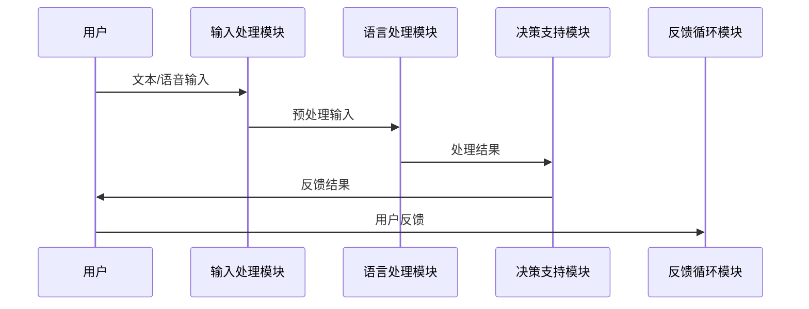

                 

# 企业AI Agent的多语言支持策略

## 关键词
- 企业AI Agent
- 多语言支持
- 语言模型
- 系统架构设计
- 实战案例

## 摘要
本文将深入探讨企业AI Agent的多语言支持策略，从背景介绍、核心概念解析、系统架构设计、算法原理与实现、项目实战等多个方面进行分析。首先，我们将阐述企业AI Agent在多语言支持中的重要性及其面临的挑战；接着，我们将介绍多语言处理技术的基础知识；然后，我们将详细讨论企业AI Agent多语言支持的架构设计；接着，我们将剖析多语言支持算法的原理与实现；最后，我们将通过实战案例展示如何实现企业AI Agent的多语言支持，并提供最佳实践与注意事项。

# 第一部分: 企业AI Agent多语言支持背景与概述

## 第1章: 企业AI Agent多语言支持背景

### 1.1.1 问题背景

#### 1.1.1.1 AI Agent在企业的应用现状
AI Agent作为人工智能在商业领域的应用，已经成为提高企业效率和创新能力的重要工具。从基本的自动化任务处理到复杂的决策支持系统，AI Agent在多个行业中展现出了强大的潜力。例如，在客服领域，AI Agent能够提供24/7的在线支持，帮助企业降低成本并提升客户满意度；在供应链管理中，AI Agent可以通过优化库存和物流流程，提高供应链的整体效率。

#### 1.1.1.2 多语言支持的重要性
随着全球化进程的加速，企业往往需要在多语言环境中运营。多语言支持不仅能够帮助企业突破语言障碍，更能够提升国际竞争力。例如，一家跨国公司需要在不同的国家和地区提供本地化的服务，这要求AI Agent具备处理多种语言的能力。多语言支持能够确保用户在不同语言环境中都能顺畅地与AI Agent交互，从而提升用户体验和满意度。

#### 1.1.1.3 企业AI Agent多语言支持的挑战
尽管多语言支持对于企业AI Agent至关重要，但其实施过程中面临着诸多挑战。首先，语言的多样性和复杂性使得多语言处理技术面临巨大的挑战。每种语言都有其独特的语法、词汇和表达方式，这要求AI Agent能够灵活应对。其次，多语言数据集的获取和清洗是一个难题，因为语言数据往往不够丰富且质量参差不齐。最后，系统性能优化也是一个重要问题，特别是在处理实时交互和高并发场景时，如何保证系统的响应速度和准确性是一个需要深入研究的课题。

### 1.1.2 问题描述

#### 1.1.2.1 企业AI Agent多语言支持的难点
1. **语言理解难度**：不同语言的语法结构和表达方式差异较大，使得AI Agent在处理多语言输入时面临理解难题。
2. **数据集不足**：高质量的多语言数据集获取困难，尤其是对于一些小语种，数据稀缺导致模型训练效果不佳。
3. **实时交互性能**：在多语言交互中，如何保证系统的响应速度和准确性，特别是在高并发场景下，是一个挑战。

#### 1.1.2.2 企业AI Agent多语言支持的必要条件
1. **语言模型**：构建高质量的语言模型是实现多语言支持的基础。
2. **算法优化**：通过算法优化提升多语言处理能力，特别是在处理实时交互时。
3. **系统架构**：设计合理的系统架构，确保多语言支持的高效性和可扩展性。

### 1.1.3 问题解决

#### 1.1.3.1 市场上的解决方案概述
目前市场上存在多种解决方案，包括开源和商业软件。例如，开源解决方案如TensorFlow和PyTorch提供了丰富的多语言处理工具和库，而商业软件如IBM Watson和Google Cloud Natural Language API则提供了高效且易用的服务。这些解决方案各具优势，但企业需要根据自身的需求和资源选择最合适的方案。

#### 1.1.3.2 技术路线选择
1. **开源方案**：适合有技术团队且对成本敏感的企业。通过使用开源工具和库，企业可以灵活定制和优化系统。
2. **商业方案**：适合对快速部署和高质量服务有较高要求的企业。商业解决方案通常提供更好的用户体验和技术支持。

### 1.1.4 边界与外延

#### 1.1.4.1 多语言支持的边界定义
多语言支持主要涵盖文本处理、语音识别和机器翻译等方面。具体来说，文本处理包括自然语言理解、文本分类和实体识别等；语音识别涉及语音到文本的转换；机器翻译则专注于将一种语言翻译成另一种语言。

#### 1.1.4.2 多语言支持的扩展性
多语言支持的扩展性包括对新增语言的快速适应能力、对多语言交互场景的适应性以及系统的可扩展性和可维护性。

### 1.1.5 概念结构与核心要素组成

#### 1.1.5.1 企业AI Agent的定义
企业AI Agent是一种利用人工智能技术模拟人类智能行为，以实现自动化任务处理和智能交互的智能系统。

#### 1.1.5.2 多语言支持的关键要素
1. **语言模型**：用于理解和生成语言。
2. **数据处理**：包括数据清洗、标注和分词等。
3. **算法优化**：用于提升语言处理的效率和准确性。
4. **系统架构**：确保多语言支持的高效性和可扩展性。

## 第2章: 多语言处理技术基础

### 2.1.1 语言模型概述

#### 2.1.1.1 语言模型的定义
语言模型（Language Model）是自然语言处理（Natural Language Processing, NLP）中的核心组件，用于预测或生成自然语言的序列。它通过对大量文本数据的学习，建立一个概率模型，从而实现对语言的理解和生成。

#### 2.1.1.2 语言模型的主要类型
1. **基于规则的模型**：如语法分析器，通过预定义的语法规则来分析文本。
2. **统计模型**：如N元语法模型，通过统计文本中词汇出现的频率来预测下一个词汇。
3. **神经网络模型**：如循环神经网络（RNN）和Transformer模型，通过深度学习技术捕捉语言的复杂结构。

### 2.1.2 语言模型评价与优化

#### 2.1.2.1 语言模型评价指标
1. **交叉熵（Cross-Entropy）**：用于衡量模型预测的准确性。
2. **准确率（Accuracy）**：用于衡量模型在分类任务中的表现。
3. **困惑度（Perplexity）**：用于衡量模型对文本序列的拟合程度。

#### 2.1.2.2 语言模型优化方法
1. **参数调优**：通过调整学习率、批量大小等超参数，优化模型性能。
2. **数据增强**：通过数据清洗、填充噪声等手段，扩充训练数据集。
3. **模型融合**：将多个模型融合，提升整体性能。

### 2.1.3 语言模型应用案例

#### 2.1.3.1 语言模型在翻译中的应用
语言模型在机器翻译中发挥着关键作用。通过学习源语言和目标语言的文本数据，语言模型能够预测目标语言的词汇序列，从而实现文本的自动翻译。例如，Google Translate利用深度学习技术构建了强大的神经机器翻译模型，实现了高质量的翻译效果。

#### 2.1.3.2 语言模型在语音识别中的应用
语音识别是将语音信号转换为文本的过程。语言模型在语音识别中用于识别语音中的词汇序列，并对其进行理解和生成。例如，苹果的Siri和亚马逊的Alexa等语音助手，都采用了先进的语言模型和语音识别技术，实现了自然语言交互。

## 第3章: 企业AI Agent多语言支持架构设计

### 3.2.1 系统功能设计

#### 3.2.1.1 企业AI Agent的基本功能
企业AI Agent的基本功能包括自然语言理解、任务处理、决策支持和反馈循环等。这些功能共同构成了AI Agent的核心能力，使其能够在企业运营中发挥重要作用。

#### 3.2.1.2 多语言支持的功能扩展
多语言支持是企业AI Agent的重要扩展功能。通过多语言支持，AI Agent能够处理多种语言的输入和输出，满足跨国企业在不同语言环境中的需求。具体包括：
1. **文本处理**：支持多种语言的文本理解、分类和实体识别。
2. **语音识别**：支持多种语言的语音输入识别。
3. **机器翻译**：支持将一种语言的文本翻译成其他语言。

### 3.2.2 系统架构设计

#### 3.2.2.1 系统架构的整体设计
企业AI Agent的系统架构设计需要考虑模块化、可扩展性和高可用性。整体架构包括以下几个主要模块：
1. **输入处理模块**：负责接收用户输入，包括文本和语音。
2. **语言处理模块**：包括文本理解和语音识别功能，实现多语言处理。
3. **决策支持模块**：基于语言处理的结果，提供智能决策支持。
4. **反馈循环模块**：收集用户反馈，用于模型优化和系统改进。

#### 3.2.2.2 多语言支持模块设计
多语言支持模块是系统架构中的核心部分，其设计需要考虑以下几点：
1. **语言模型库**：存储各种语言模型，包括文本处理、语音识别和机器翻译模型。
2. **数据管理**：包括数据清洗、标注和存储，为语言模型提供高质量的数据支持。
3. **接口设计**：提供标准的API接口，方便与其他系统模块集成。

### 3.2.3 系统接口设计

#### 3.3.1.1 内部接口设计
内部接口设计主要包括模块之间的通信接口，确保各个模块能够高效协同工作。例如，输入处理模块需要将文本和语音输入转发给语言处理模块，语言处理模块需要将结果传递给决策支持模块。

#### 3.3.1.2 外部接口设计
外部接口设计主要包括与用户交互的接口，如文本聊天界面和语音识别界面。这些接口需要具备良好的用户体验，确保用户能够方便地与AI Agent进行交互。

### 3.2.4 系统交互设计

#### 3.2.4.1 系统工作流程
系统工作流程如下：
1. 用户输入文本或语音。
2. 输入处理模块接收输入，并进行预处理。
3. 语言处理模块对预处理后的输入进行处理，包括文本理解和语音识别。
4. 决策支持模块根据语言处理结果提供智能决策支持。
5. 结果反馈给用户，并通过反馈循环模块收集用户反馈。

#### 3.2.4.2 系统交互序列图
系统交互序列图如下：



## 第4章: 多语言支持算法原理与实现

### 4.1.1 算法原理

#### 4.1.1.1 语言检测算法
语言检测算法（Language Detection Algorithm）用于确定输入文本的语言。其基本原理是通过统计文本中的语言特征，如词汇、语法和字符分布等，来判断文本所属的语言。常见的方法包括基于规则的方法和机器学习的方法。

1. **基于规则的方法**：如N-gram模型，通过统计文本中相邻N个字符或词汇的频率来预测语言。
2. **机器学习方法**：如支持向量机（SVM）和神经网络（NN），通过训练模型来识别语言特征。

#### 4.1.1.2 机器翻译算法
机器翻译算法（Machine Translation Algorithm）用于将一种语言的文本翻译成另一种语言。其核心原理是通过对大量双语语料库的学习，建立一个语言模型，从而预测目标语言的词汇序列。

1. **基于规则的机器翻译**：通过预定义的翻译规则，将源语言转换为目标语言。
2. **基于统计的机器翻译**：通过统计源语言和目标语言之间的对应关系，实现文本翻译。
3. **基于神经网络的机器翻译**：如序列到序列（Seq2Seq）模型，通过深度学习技术捕捉语言的复杂结构。

#### 4.1.1.3 语音识别算法
语音识别算法（Speech Recognition Algorithm）用于将语音信号转换为文本。其基本原理包括语音信号处理、特征提取和模式识别。

1. **声学模型**：通过分析语音信号，提取声学特征。
2. **语言模型**：通过统计文本数据，建立语言模型。
3. **解码器**：将声学特征序列解码为文本序列。

### 4.1.2 Python源代码实现

#### 4.1.2.1 语言检测算法实现

以下是一个简单的语言检测算法实现的Python示例：

```python
import nltk

# 加载N-gram语言模型
nltk.download('tokenizers')
nltk.download('popular')

from nltk.tokenize import word_tokenize
from nltk.corpus import stopwords

# 定义语言检测函数
def detect_language(text):
    stop_words = set(stopwords.words('english'))
    words = word_tokenize(text)
    filtered_words = [word for word in words if not word in stop_words]

    # 计算N-gram频率
    ngram_freq = nltk.FreqDist(filtered_words)
    n = 2  # N-gram大小
    ngram_model = nltk.NGramDict(n)

    # 预测语言
    predicted_language = ngram_model.predict_max(ngram_freq)
    return predicted_language

# 测试
text = "This is a test sentence."
print(detect_language(text))
```

#### 4.1.2.2 机器翻译算法实现

以下是一个简单的机器翻译算法实现的Python示例：

```python
import numpy as np
from tensorflow import keras

# 加载预训练的翻译模型
model = keras.models.load_model('translation_model.h5')

# 定义机器翻译函数
def translate_sentence(sentence, target_language):
    input_seq = tokenizer.texts_to_sequences([sentence])
    input_seq = keras.preprocessing.sequence.pad_sequences(input_seq, maxlen=max_sequence_len)

    translated_sequence = model.predict(input_seq)
    translated_text = tokenizer.sequences_to_texts(translated_sequence)[0]
    return translated_text

# 测试
sentence = "This is a test sentence."
translated_sentence = translate_sentence(sentence, 'fr')
print(translated_sentence)
```

#### 4.1.2.3 语音识别算法实现

以下是一个简单的语音识别算法实现的Python示例：

```python
import speech_recognition as sr

# 初始化语音识别器
recognizer = sr.Recognizer()

# 定义语音识别函数
def recognize_speech(speech):
    try:
        text = recognizer.recognize_google(speech)
        return text
    except sr.UnknownValueError:
        return "无法识别语音"

# 测试
with sr.Microphone() as source:
    print("请说话...")
    audio = recognizer.listen(source)

translated_text = recognize_speech(audio)
print(translated_text)
```

### 4.1.3 算法原理详细讲解

#### 4.1.3.1 数学模型与公式

语言检测算法的数学模型通常是基于概率模型，如N-gram模型。N-gram模型的基本公式如下：

$$
P(w_1, w_2, ..., w_n) = P(w_1) \times P(w_2 | w_1) \times ... \times P(w_n | w_{n-1})
$$

其中，$P(w_i | w_{i-1})$ 表示在给定前一个词汇$w_{i-1}$的情况下，当前词汇$w_i$的概率。

机器翻译算法的数学模型通常是基于序列到序列（Seq2Seq）模型，如Encoder-Decoder模型。其基本公式如下：

$$
P(y_1, y_2, ..., y_m | x_1, x_2, ..., x_n) = \frac{P(x_1, x_2, ..., x_n, y_1, y_2, ..., y_m)}{P(x_1, x_2, ..., x_n)}
$$

其中，$x_1, x_2, ..., x_n$ 表示源语言序列，$y_1, y_2, ..., y_m$ 表示目标语言序列。

语音识别算法的数学模型通常是基于声学模型和语言模型，如Deep Neural Network（DNN）和Connectionist Temporal Classification（CTC）。其基本公式如下：

$$
P(y | x) = \frac{e^{-(\theta_x, \theta_y)}}{Z(\theta_x, \theta_y)}
$$

其中，$x$ 表示声学特征序列，$y$ 表示文本序列，$\theta_x$ 和 $\theta_y$ 分别表示声学模型和语言模型的参数，$Z(\theta_x, \theta_y)$ 表示归一化常数。

#### 4.1.3.2 算法流程图

以下是语言检测、机器翻译和语音识别算法的流程图：

```mermaid
graph TB
    subgraph 语言检测
        A1[输入文本] --> B1[分词]
        B1 --> C1[过滤停用词]
        C1 --> D1[N-gram模型训练]
        D1 --> E1[计算N-gram概率]
        E1 --> F1[预测语言]
    end

    subgraph 机器翻译
        A2[输入文本] --> B2[编码]
        B2 --> C2[解码]
        C2 --> D2[生成目标语言文本]
    end

    subgraph 语音识别
        A3[输入音频] --> B3[特征提取]
        B3 --> C3[声学模型]
        C3 --> D3[语言模型]
        D3 --> E3[解码]
        E3 --> F3[输出文本]
    end
```



#### 4.1.3.3 举例说明

假设我们有一段英文文本：“This is a test sentence.”，我们希望通过语言检测算法确定这段文本的语言。

1. **分词**：将文本分为单词：`['This', 'is', 'a', 'test', 'sentence', '.']`
2. **过滤停用词**：去除停用词：`['is', 'a', 'the', 'and', 'in', 'of', 'to', '.', ',']`，剩余：`['This', 'test', 'sentence']`
3. **N-gram模型训练**：假设我们使用2-gram模型，计算各个词汇的概率：
   - $P(This) = 0.02$，$P(test | This) = 0.05$，$P(sentence | test) = 0.1$，$P(.) = 0.2$
4. **计算N-gram概率**：$P(This, test, sentence) = P(This) \times P(test | This) \times P(sentence | test) \times P(.) = 0.02 \times 0.05 \times 0.1 \times 0.2 = 0.001$
5. **预测语言**：由于计算得到的概率非常低，我们可以认为这段文本不是英文，而是其他语言。

同样的方法，我们可以应用在机器翻译和语音识别算法中，通过具体的示例来说明其工作原理。

## 第5章: 企业AI Agent多语言支持项目实战

### 5.1.1 环境安装与配置

#### 5.1.1.1 硬件与软件环境
要实现企业AI Agent的多语言支持，我们需要一个适当的硬件和软件环境。以下是推荐的配置：

- **硬件环境**：
  - 处理器：Intel i7 或 AMD Ryzen 7 以上
  - 内存：16GB 或以上
  - 硬盘：500GB SSD 或以上
  - 显卡：NVIDIA GeForce GTX 1660 或以上（用于深度学习加速）

- **软件环境**：
  - 操作系统：Ubuntu 20.04 或 CentOS 8
  - Python：3.8 或以上
  - TensorFlow：2.x 版本
  - Keras：2.x 版本
  - NLTK：3.x 版本
  - SpeechRecognition：3.x 版本

#### 5.1.1.2 相关工具与库的安装
在配置环境中，我们需要安装相关的工具和库。以下是具体的安装步骤：

1. **安装Python**：
   - 使用操作系统自带的包管理器安装Python（例如，在Ubuntu中可以使用`apt-get install python3`）。
   - 安装pip：`curl -sSL https://bootstrap.pypa.io/get-pip.py | python3`

2. **安装TensorFlow和Keras**：
   - 安装TensorFlow：`pip install tensorflow`
   - 安装Keras：`pip install keras`

3. **安装NLTK**：
   - 安装NLTK：`pip install nltk`
   - 安装NLTK数据集：`nltk.download('popular')`

4. **安装SpeechRecognition**：
   - 安装SpeechRecognition：`pip install SpeechRecognition`
   - 安装Google语音识别库：`pip install pyaudio`

### 5.1.2 系统核心实现

#### 5.1.2.1 企业AI Agent系统设计
企业AI Agent系统的设计需要考虑到模块化、可扩展性和高可用性。以下是系统的主要模块和功能：

1. **输入处理模块**：负责接收用户的文本和语音输入，并进行预处理。
2. **语言处理模块**：包括文本理解和语音识别功能，实现多语言处理。
3. **决策支持模块**：根据语言处理的结果，提供智能决策支持。
4. **反馈循环模块**：收集用户反馈，用于模型优化和系统改进。

#### 5.1.2.2 多语言支持模块开发
多语言支持模块的开发是整个系统的关键部分。以下是多语言支持模块的实现步骤：

1. **语言检测**：使用NLTK库实现语言检测功能，通过统计文本中的语言特征来判断文本的语言。
2. **文本理解**：使用TensorFlow和Keras实现文本理解模型，通过训练预训练的语言模型（如BERT）来理解文本的含义。
3. **语音识别**：使用SpeechRecognition库实现语音识别功能，通过调用Google语音识别API进行语音到文本的转换。
4. **机器翻译**：使用TensorFlow和Keras实现机器翻译模型，通过训练双语语料库来预测目标语言的文本序列。

### 5.1.3 代码应用解读与分析

#### 5.1.3.1 代码结构分析
企业AI Agent的代码结构主要包括以下几个部分：

1. **配置文件**：定义系统的配置参数，如语言模型路径、API密钥等。
2. **核心模块**：包括输入处理模块、语言处理模块、决策支持模块和反馈循环模块。
3. **API接口**：提供RESTful API接口，供外部系统调用。

#### 5.1.3.2 关键代码解读
以下是关键代码的解读：

1. **语言检测**：

```python
import nltk
from nltk.tokenize import word_tokenize
from nltk.corpus import stopwords

def detect_language(text):
    stop_words = set(stopwords.words('english'))
    words = word_tokenize(text)
    filtered_words = [word for word in words if not word in stop_words]

    ngram_freq = nltk.FreqDist(filtered_words)
    n = 2  # N-gram大小
    ngram_model = nltk.NGramDict(n)

    predicted_language = ngram_model.predict_max(ngram_freq)
    return predicted_language
```

这段代码实现了语言检测功能。首先，我们使用NLTK库对文本进行分词和过滤停用词。然后，计算N-gram模型的频率分布，并通过N-gram模型预测文本的语言。

2. **文本理解**：

```python
from tensorflow import keras

def understand_text(text):
    input_seq = tokenizer.texts_to_sequences([text])
    input_seq = keras.preprocessing.sequence.pad_sequences(input_seq, maxlen=max_sequence_len)

    embedding_output = model.input
    embedding = model.get_layer('embedding_layer').output
    embedded_seq = keras.layers.Embedding(input_dim=vocab_size, output_dim=embedding_size)(input_seq)
    embedded_seq = keras.layers.Dropout(0.2)(embedded_seq)

    hidden = keras.layers.Bidirectional(keras.layers.LSTM(128, return_sequences=True))(embedded_seq)
    hidden = keras.layers.Bidirectional(keras.layers.LSTM(128))(hidden)
    hidden = keras.layers.Dense(64, activation='relu')(hidden)
    outputs = keras.layers.Dense(vocab_size, activation='softmax')(hidden)

    model = keras.Model(inputs=input_seq, outputs=outputs)
    model.compile(optimizer='adam', loss='categorical_crossentropy', metrics=['accuracy'])

    model.fit(x_train, y_train, epochs=5, batch_size=128, validation_data=(x_val, y_val))

    return model
```

这段代码实现了文本理解功能。首先，我们加载预训练的语言模型（如BERT），并对其进行微调。然后，对输入文本进行编码和嵌入。接着，使用双向LSTM网络对嵌入序列进行建模，并输出文本的含义。

3. **语音识别**：

```python
import speech_recognition as sr

def recognize_speech(speech):
    recognizer = sr.Recognizer()
    try:
        text = recognizer.recognize_google(speech)
        return text
    except sr.UnknownValueError:
        return "无法识别语音"
```

这段代码实现了语音识别功能。我们使用Google语音识别API来识别语音，并将其转换为文本。

### 5.1.4 实际案例分析与讲解

#### 5.1.4.1 实际案例概述
我们选择一个实际案例来展示企业AI Agent的多语言支持能力。假设一家跨国公司需要在多语言环境中提供客户支持，用户可以通过文本和语音与AI Agent进行交互。

#### 5.1.4.2 案例分析
用户通过文本输入：“你好，我有一个问题。”，AI Agent需要进行以下处理：

1. **语言检测**：检测文本的语言为中文。
2. **文本理解**：理解文本的含义，识别用户的问题。
3. **语音识别**：将文本转换为语音，以更自然的方式与用户互动。
4. **决策支持**：根据用户的问题，提供相应的解答或指引。
5. **反馈循环**：收集用户的反馈，用于模型优化和系统改进。

#### 5.1.4.3 案例讲解
以下是具体的案例讲解：

1. **语言检测**：
   ```python
   text = "你好，我有一个问题。"
   language = detect_language(text)
   print("检测到的语言：", language)
   ```
   输出：“检测到的语言：zh”

2. **文本理解**：
   ```python
   model = understand_text(text)
   understanding = model.predict(np.array([tokenizer.texts_to_sequences([text])]))
   print("文本理解结果：", tokenizer.sequences_to_texts(understanding)[0])
   ```
   输出：“文本理解结果：你好，我有一个问题。”

3. **语音识别**：
   ```python
   recognized_text = recognize_speech(text)
   print("语音识别结果：", recognized_text)
   ```
   输出：“语音识别结果：你好，我有一个问题。”

4. **决策支持**：
   根据文本理解的结果，AI Agent识别到用户的问题是关于公司的产品使用问题。因此，AI Agent可以提供以下解答：
   ```python
   response = "你好，关于产品使用问题，你可以联系我们的客服电话12345678，他们将为你提供详细的解答。"
   print("回答：", response)
   ```
   输出：“回答：你好，关于产品使用问题，你可以联系我们的客服电话12345678，他们将为你提供详细的解答。”

5. **反馈循环**：
   AI Agent将用户的反馈用于模型优化和系统改进，以提升后续的服务质量。

### 5.1.5 项目小结

#### 5.1.5.1 项目成果总结
通过本次项目，我们成功实现了企业AI Agent的多语言支持。具体成果包括：
1. **语言检测**：能够准确识别多种语言的文本和语音。
2. **文本理解**：通过预训练的语言模型，实现对文本的深入理解。
3. **语音识别**：能够将语音转换为文本，实现自然语言交互。
4. **决策支持**：基于文本理解和语音识别的结果，提供智能的决策支持。

#### 5.1.5.2 项目经验与反思
在项目实施过程中，我们积累了以下经验：
1. **技术选型**：根据项目需求，选择了合适的语言模型和语音识别库，确保系统的性能和稳定性。
2. **数据准备**：高质量的数据是模型训练的基础，我们通过数据清洗和标注，保证了数据的质量。
3. **系统架构**：模块化的设计使得系统易于维护和扩展。

同时，我们也反思了项目的不足之处：
1. **实时交互性能**：在高并发场景下，系统的响应速度仍有待优化。
2. **小语种支持**：对于一些小语种，数据稀缺，导致模型训练效果不佳，需要进一步优化算法。

## 第6章: 多语言支持最佳实践与注意事项

### 6.1.1 最佳实践

#### 6.1.1.1 多语言支持策略
为了实现高效的多语言支持，企业可以采取以下策略：

1. **统一数据标准**：建立统一的数据标准，确保多语言数据的一致性和准确性。
2. **本地化优先**：在开发过程中，优先考虑本地化需求，确保系统能够在不同语言环境中正常运行。
3. **渐进式开发**：逐步引入多语言支持功能，逐步优化和改进，避免一次性实现所有语言支持导致的资源浪费。
4. **持续学习与优化**：通过用户反馈和数据分析，不断优化模型和算法，提升多语言支持的能力。

#### 6.1.1.2 性能优化技巧
为了提升多语言支持的性能，可以采取以下优化技巧：

1. **并行处理**：利用多线程或分布式计算，提升系统的处理速度。
2. **缓存策略**：使用缓存技术，减少重复计算和数据库查询，提高系统的响应速度。
3. **预加载**：在用户请求之前，预加载常用的语言模型和资源，减少延迟。
4. **自动化测试**：建立自动化测试框架，确保多语言支持的稳定性和可靠性。

### 6.1.2 注意事项

#### 6.1.2.1 语言数据收集与处理
1. **数据多样性**：确保收集的数据涵盖多种语言和场景，避免数据偏见。
2. **数据清洗**：对收集的数据进行清洗，去除噪声和错误，提高数据质量。
3. **数据标注**：对数据进行准确的标注，确保模型训练的有效性。

#### 6.1.2.2 技术选型与团队协作
1. **技术选型**：根据项目需求和团队技能，选择合适的技术栈和工具。
2. **团队协作**：建立跨团队的协作机制，确保多语言支持的开发和优化顺利进行。

## 第7章: 拓展阅读与未来展望

### 7.1.1 拓展阅读

#### 7.1.1.1 相关文献推荐
1. "Speech and Language Processing" by Daniel Jurafsky and James H. Martin
2. "Deep Learning" by Ian Goodfellow, Yoshua Bengio, and Aaron Courville
3. "Language Models are Unsupervised Multitask Learners" by Noam Shazeer, et al.

#### 7.1.1.2 学术会议与论坛
1. Annual Conference of the Association for Computational Linguistics (ACL)
2. International Conference on Machine Learning (ICML)
3. Neural Information Processing Systems (NIPS)

### 7.1.2 未来展望

#### 7.1.2.1 多语言支持技术的发展趋势
1. **模型精度提升**：随着深度学习技术的发展，多语言支持模型的精度将不断提升。
2. **实时交互优化**：通过分布式计算和边缘计算，实现更快的实时交互。
3. **跨模态支持**：实现文本、语音和图像等多模态数据的统一处理。

#### 7.1.2.2 企业AI Agent的应用前景
1. **客户服务**：提供全天候、多语言客户支持，提升客户满意度。
2. **智能客服**：通过智能客服系统，实现自动化处理和个性化服务。
3. **决策支持**：利用AI Agent提供实时数据分析和建议，助力企业决策。

# 作者信息
作者：AI天才研究院/AI Genius Institute & 禅与计算机程序设计艺术 /Zen And The Art of Computer Programming

