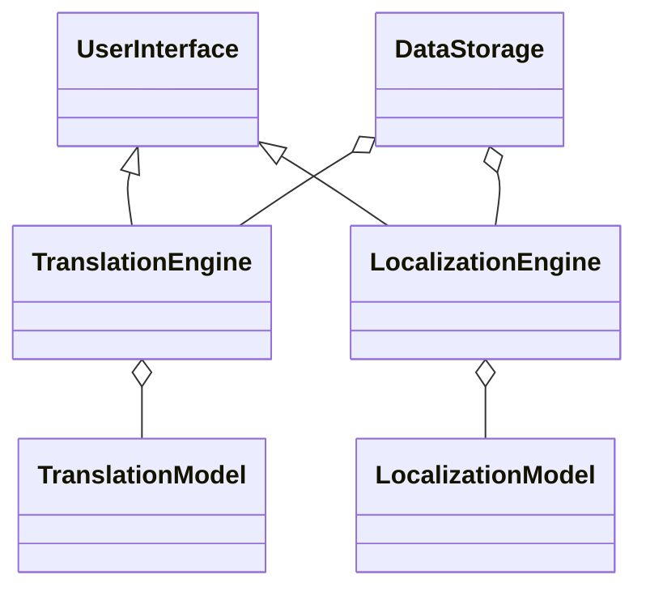

                 

### 企业AI Agent的多语言翻译与本地化功能

#### 关键词：
- 企业AI Agent
- 多语言翻译
- 本地化功能
- 神经机器翻译
- 自然语言处理

#### 摘要：
本文深入探讨了企业AI Agent的多语言翻译与本地化功能。首先，我们将介绍多语言翻译和本地化的核心概念和重要性，然后分析AI Agent在这些功能中的作用和优势。接着，我们将详细讲解多语言翻译的算法原理，包括统计机器翻译和神经机器翻译，并使用Python代码进行算法实现的示例。随后，我们将介绍本地化的流程和技术，探讨AI Agent如何支持本地化。接下来，我们将展示一个典型的AI Agent在多语言翻译与本地化中的实战案例，并深入剖析其系统架构和实现细节。最后，我们将总结最佳实践，提出注意事项，并推荐进一步的阅读资源。

### 目录大纲设计方案

为了设计出《企业AI Agent的多语言翻译与本地化功能》这本书的完整目录大纲，我们将遵循以下步骤：

1. **整体结构设计**：确定书的整体结构，包括总体框架和章节划分，确保内容覆盖全面。

2. **背景介绍**：引入核心概念，明确问题背景、问题描述、问题解决、边界与外延，以及核心要素组成。

3. **核心概念与联系**：梳理书中的核心概念，使用表格对比和Mermaid ER实体关系图来展示概念间的联系。

4. **算法原理讲解**：介绍多语言翻译与本地化功能的基本原理，使用Mermaid流程图和Python代码进行详细讲解。

5. **数学模型与公式**：使用LaTeX格式嵌入数学模型和公式，并进行详细讲解和举例说明。

6. **系统分析与架构设计**：描述系统功能、架构和接口设计，使用Mermaid类图、架构图和序列图展示。

7. **项目实战**：提供实际案例，讲解环境安装、系统核心实现和代码分析。

8. **最佳实践与小结**：总结实践经验，提出注意事项和拓展阅读建议。

### 目录大纲示例

```markdown
----------------------------------------------------------------
# 《企业AI Agent的多语言翻译与本地化功能》目录大纲

## 第一部分：背景与核心概念

## 第1章：问题背景与核心概念

### 1.1 问题背景
#### 1.1.1 企业国际化需求的增长
#### 1.1.2 多语言翻译与本地化的重要性
#### 1.1.3 AI Agent在多语言处理中的应用

### 1.2 核心概念介绍
#### 1.2.1 多语言翻译
#### 1.2.2 本地化
#### 1.2.3 AI Agent
#### 1.2.4 相关技术框架与工具

## 第二部分：多语言翻译原理与算法

## 第2章：多语言翻译基础

### 2.1 翻译原理
#### 2.1.1 翻译过程概述
#### 2.1.2 翻译策略与方法

### 2.2 翻译算法介绍
#### 2.2.1 统计机器翻译
#### 2.2.2 神经机器翻译
#### 2.2.3 转换器架构

### 2.3 算法细节解析
#### 2.3.1 神经网络基础
#### 2.3.2 训练与评估
#### 2.3.3 算法优化

## 第三部分：本地化技术与实现

## 第3章：本地化基础

### 3.1 本地化概念
#### 3.1.1 文化差异与本地化
#### 3.1.2 本地化与国际化

### 3.2 本地化流程
#### 3.2.1 需求分析
#### 3.2.2 文档翻译
#### 3.2.3 界面本地化
#### 3.2.4 本地化测试

### 3.3 本地化工具与应用
#### 3.3.1 本地化工具介绍
#### 3.3.2 实际应用场景

## 第四部分：AI Agent在多语言翻译与本地化中的应用

## 第4章：AI Agent概述

### 4.1 AI Agent定义
#### 4.1.1 智能代理的概念
#### 4.1.2 AI Agent的功能与作用

### 4.2 AI Agent架构设计
#### 4.2.1 模块划分
#### 4.2.2 交互流程设计

## 第5章：AI Agent在多语言翻译中的应用

### 5.1 翻译功能实现
#### 5.1.1 翻译任务处理
#### 5.1.2 翻译结果评估

### 5.2 本地化支持
#### 5.2.1 文化适应性分析
#### 5.2.2 本地化流程集成

## 第6章：AI Agent在多语言交互中的挑战与解决方案

### 6.1 语言理解与生成
#### 6.1.1 语言理解技术
#### 6.1.2 语言生成技术

### 6.2 个性化与上下文理解
#### 6.2.1 个性化翻译
#### 6.2.2 上下文理解与适应性翻译

### 6.3 可扩展性与稳定性
#### 6.3.1 模型扩展
#### 6.3.2 系统稳定性保障

## 第五部分：项目实战与最佳实践

## 第7章：多语言翻译与本地化项目实战

### 7.1 环境安装与配置
#### 7.1.1 硬件与软件需求
#### 7.1.2 环境搭建步骤

### 7.2 系统核心实现
#### 7.2.1 系统架构设计
#### 7.2.2 代码实现与优化

### 7.3 代码应用解读
#### 7.3.1 翻译模块解析
#### 7.3.2 本地化模块解析

### 7.4 实际案例分析
#### 7.4.1 

----------------------------------------------------------------

### 第一部分：背景与核心概念

#### 第1章：问题背景与核心概念

##### 1.1 问题背景

在全球化的趋势下，企业面临着越来越多的国际化需求。无论是跨国公司的内部沟通，还是面向全球客户的产品和服务，多语言处理已经成为企业必不可少的一部分。然而，传统的手动翻译和本地化方式不仅效率低下，而且难以保证翻译质量的一致性。随着人工智能技术的发展，特别是自然语言处理（NLP）和机器翻译领域的突破，AI Agent作为一种智能化的解决方案，逐渐成为企业满足多语言需求的利器。

##### 1.1.1 企业国际化需求的增长

企业国际化需求的增长体现在多个方面。首先，全球市场的一体化使得企业需要能够与来自不同国家和地区的客户进行无缝沟通。其次，企业内部的国际化协作也需要高效的多语言支持，以便团队成员可以无障碍地共享信息和知识。此外，随着电子商务的发展，在线商店和社交媒体的兴起，企业需要能够为不同语言的用户提供本地化的产品和服务。

##### 1.1.2 多语言翻译与本地化的重要性

多语言翻译与本地化在企业的国际化过程中扮演着至关重要的角色。多语言翻译使得企业能够将产品文档、营销材料、用户手册等翻译成目标语言，从而更好地传达企业的核心价值和品牌信息。本地化则涉及到对产品和服务进行文化适应，以确保其在不同语言和文化背景下的可用性和可接受度。通过多语言翻译与本地化，企业可以打破语言障碍，提升用户体验，扩大市场份额，增强品牌影响力。

##### 1.1.3 AI Agent在多语言处理中的应用

AI Agent是一种智能化的代理，能够模拟人类在多语言处理中的行为。在多语言翻译与本地化中，AI Agent可以通过学习大量的多语言数据，自动生成高质量的翻译结果，并且能够根据上下文进行适应性翻译。此外，AI Agent还能够自动化本地化流程，识别文化差异，并生成符合目标语言和文化习惯的内容。这使得企业能够更加高效地处理多语言需求，节省时间和成本。

##### 1.2 核心概念介绍

为了深入理解多语言翻译与本地化功能，我们需要明确以下几个核心概念：

###### 1.2.1 多语言翻译

多语言翻译是指将一种语言的文本转换为另一种或多种语言的过程。它包括机器翻译（MT）和人工翻译两种方式。机器翻译利用算法和模型自动进行翻译，而人工翻译则由专业的翻译人员进行。

###### 1.2.2 本地化

本地化是指将产品、服务或内容根据目标语言和文化进行适应性修改，使其在目标市场上具有更好的用户体验。本地化包括翻译、文化适应、格式调整等多个环节。

###### 1.2.3 AI Agent

AI Agent是一种基于人工智能技术的智能代理，能够模拟人类的智能行为，包括语音识别、自然语言理解、多语言翻译和决策等。

###### 1.2.4 相关技术框架与工具

为了实现多语言翻译与本地化功能，企业需要借助一系列技术框架和工具。例如，Google翻译API、Microsoft Azure翻译服务、开源的机器翻译框架如OpenNMT和TensorFlow等。

通过明确这些核心概念，企业可以更好地理解多语言翻译与本地化的需求，选择合适的AI Agent解决方案，以满足其国际化业务的需求。

#### 总结

本章节介绍了企业AI Agent的多语言翻译与本地化功能的背景和核心概念。随着全球化的深入，企业面临着越来越多的国际化需求，多语言翻译与本地化成为其核心竞争力之一。AI Agent作为一种智能化的解决方案，通过自动化的多语言翻译和本地化流程，可以帮助企业高效地处理多语言需求，提升用户体验和竞争力。在接下来的章节中，我们将进一步探讨多语言翻译和本地化的原理、算法和实现细节，为企业提供更深入的技术洞察和实践指导。

### 第二部分：多语言翻译原理与算法

#### 第2章：多语言翻译基础

##### 2.1 翻译原理

多语言翻译是将一种语言的文本转换为另一种语言的过程。它涉及到自然语言处理（NLP）、机器学习和深度学习等多个领域。翻译过程可以分为以下几个步骤：

1. **文本预处理**：对源语言文本进行清洗和格式化，去除噪声和不必要的元素，以便于后续的翻译处理。
2. **分词**：将文本分解成单词或短语，为翻译提供基本的语言单元。
3. **词性标注**：对每个单词或短语的词性进行标注，如名词、动词、形容词等，帮助翻译模型理解文本的语法结构。
4. **翻译模型训练**：使用大量的双语语料库，训练翻译模型，使其能够学习源语言和目标语言之间的对应关系。
5. **翻译生成**：根据训练好的翻译模型，将源语言文本转换为目标语言文本。

##### 2.2 翻译算法介绍

目前，多语言翻译主要分为统计机器翻译（SMT）和神经机器翻译（NMT）两种类型。

###### 2.2.1 统计机器翻译（SMT）

统计机器翻译是基于概率模型的方法，通过分析双语语料库中的统计规律，自动生成目标语言文本。主要算法包括：

1. **基于规则的翻译**：通过编写语法规则，将源语言文本转换为目标语言文本。这种方法依赖于人类专家的知识和经验，但规则繁琐，难以扩展。
2. **基于统计的翻译**：使用统计方法，如N-gram语言模型、隐马尔可夫模型（HMM）等，自动学习源语言和目标语言之间的对应关系。

###### 2.2.2 神经机器翻译（NMT）

神经机器翻译是基于深度学习的方法，通过神经网络模型自动学习源语言和目标语言之间的映射关系。主要算法包括：

1. **序列到序列（Seq2Seq）模型**：使用编码器-解码器（Encoder-Decoder）架构，将源语言序列编码为固定长度的向量表示，然后通过解码器生成目标语言序列。
2. **注意力机制（Attention Mechanism）**：在解码过程中引入注意力机制，使模型能够关注源语言序列中的重要信息，提高翻译质量。
3. **转换器架构（Transformer）**：基于自注意力机制，构建的Transformer模型在多个任务中取得了显著的性能提升，成为当前最先进的神经机器翻译框架。

##### 2.3 算法细节解析

###### 2.3.1 神经网络基础

神经网络是一种模拟人脑神经元连接结构的计算模型，通过调整权重和偏置，学习输入和输出之间的复杂关系。在多语言翻译中，常用的神经网络模型包括：

1. **卷积神经网络（CNN）**：用于文本特征提取，通过卷积操作提取局部特征。
2. **循环神经网络（RNN）**：用于处理序列数据，通过隐藏状态和记忆单元，捕捉序列中的时间依赖关系。
3. **门控循环单元（GRU）**：是RNN的一种改进，通过门控机制，提高了模型的记忆能力和泛化能力。

###### 2.3.2 训练与评估

多语言翻译模型的训练过程包括：

1. **数据预处理**：对双语语料库进行清洗、分词、词性标注等预处理操作。
2. **模型初始化**：初始化神经网络模型的权重和偏置。
3. **梯度下降**：通过梯度下降算法，不断调整模型参数，最小化损失函数。
4. **评估与优化**：使用开发集和测试集对模型进行评估，调整超参数，优化模型性能。

常见的评估指标包括：

1. **BLEU（双语评估单元）**：通过比较机器翻译结果和参考翻译的相似度，评估翻译质量。
2. **METEOR（Metric for Evaluation of Translation with Explicit ORdering）**：结合词序和词频信息，评估翻译质量。
3. **NIST（National Institute of Standards and Technology）**：基于字符串匹配算法，评估翻译的准确性和多样性。

###### 2.3.3 算法优化

为了提高多语言翻译的质量和效率，可以采取以下优化策略：

1. **数据增强**：通过增加数据量、数据清洗和扩充等方法，提高模型的泛化能力。
2. **迁移学习**：利用预训练的神经网络模型，迁移到新的翻译任务，减少训练时间和计算资源。
3. **多任务学习**：同时训练多个相关任务，共享模型参数，提高模型的表达能力。
4. **注意力机制优化**：通过调整注意力机制的计算方式，提高模型对重要信息的关注程度。
5. **模型压缩**：通过模型剪枝、量化等技术，减小模型大小和计算复杂度，提高部署效率。

通过深入理解多语言翻译的原理和算法，企业可以更好地选择和优化翻译解决方案，满足其国际化业务的需求。

#### 总结

本章介绍了多语言翻译的基础知识，包括翻译原理、算法类型和优化策略。统计机器翻译和神经机器翻译是当前最常用的翻译方法，分别基于概率模型和深度学习技术。神经网络作为核心组件，通过编码器-解码器架构和注意力机制，实现高效的文本翻译。在训练和评估过程中，使用梯度下降、BLEU等评估指标，优化模型性能。通过本章的学习，读者可以掌握多语言翻译的基本原理和实现方法，为后续的实战和应用打下基础。

### 第三部分：本地化技术与实现

#### 第3章：本地化基础

##### 3.1 本地化概念

本地化是指将产品或服务根据目标市场的语言、文化和习惯进行调整，使其能够更好地适应目标用户的需求。本地化不仅仅涉及翻译，还包括文化适应、格式调整、界面设计等多个方面。本地化的核心目标是提升用户体验，增强产品的市场竞争力。

###### 3.1.1 文化差异与本地化

文化差异是本地化过程中必须考虑的重要因素。不同国家和地区的文化背景、语言习惯、法律法规和消费者行为都有所不同。例如，某些词汇在一种语言中可能是褒义的，而在另一种语言中可能是贬义的。本地化需要对这些文化差异进行深入分析，确保产品在目标市场中的适用性。

###### 3.1.2 本地化与国际化

本地化和国际化是密切相关的概念。国际化是指将产品或服务设计成可以适用于多个国家和地区，而本地化则是将国际化产品在特定市场中进行适应和调整。国际化强调产品的通用性和灵活性，而本地化则注重产品的个性化和适应性。在国际化过程中，企业需要制定一个统一的战略，确保产品在全球范围内的通用性，同时通过本地化策略，满足不同市场的特定需求。

##### 3.2 本地化流程

本地化流程是一个系统性的过程，通常包括以下步骤：

###### 3.2.1 需求分析

需求分析是本地化流程的第一步，旨在了解目标市场的需求和文化背景。企业需要收集有关目标市场的数据，如语言习惯、文化习俗、法律法规、消费者行为等。这些信息有助于确定本地化策略和调整产品内容。

###### 3.2.2 文档翻译

文档翻译是本地化流程中最重要的环节之一。企业需要将用户手册、产品说明、营销材料等文档翻译成目标语言。高质量的翻译需要专业的翻译团队，他们不仅需要具备语言能力，还需要了解目标市场的文化和习惯。

###### 3.2.3 界面本地化

界面本地化是指对产品的用户界面进行适应性修改，使其符合目标语言和文化。界面本地化包括文字翻译、菜单调整、图标设计等多个方面。例如，某些按钮和图标在不同语言中可能具有不同的含义，需要根据目标市场的需求进行调整。

###### 3.2.4 本地化测试

本地化测试是确保本地化效果的重要步骤。企业需要模拟目标市场的用户环境，对产品进行功能测试、用户体验测试和文化测试。通过测试，可以发现并修复本地化过程中的问题和缺陷，确保产品在目标市场中的正常运行和用户体验。

##### 3.3 本地化工具与应用

为了提高本地化效率和效果，企业可以借助一系列本地化工具：

###### 3.3.1 本地化工具介绍

1. **翻译记忆库（Translation Memory）**：翻译记忆库是一种存储翻译结果和对应关系的数据库。通过翻译记忆库，翻译人员可以快速查找和重复使用已有的翻译结果，提高翻译效率。
2. **术语管理工具（Terminology Management）**：术语管理工具用于收集、管理和更新术语库，确保翻译的一致性和准确性。
3. **本地化管理平台（Localization Management Platform）**：本地化管理平台提供从需求分析到测试的全流程管理功能，帮助企业高效地管理本地化项目。

###### 3.3.2 实际应用场景

本地化工具在实际应用中具有广泛的应用场景：

1. **跨国公司产品发布**：跨国公司在全球范围内发布新产品时，需要将产品文档、用户手册、营销材料等翻译成多种语言。通过翻译记忆库和术语管理工具，可以提高翻译效率，确保翻译的一致性。
2. **电子商务平台**：电子商务平台需要为不同语言的用户提供本地化的产品和服务。通过界面本地化和文化测试，可以提升用户体验，增加用户粘性。
3. **软件产品国际化**：软件公司在开发国际化软件时，需要将用户界面、文档和帮助文件翻译成多种语言。通过本地化管理平台，可以统一管理翻译流程，确保翻译质量。

##### 3.4 本地化挑战与解决方案

在本地化过程中，企业可能会面临以下挑战：

###### 3.4.1 文化差异的适应

不同国家和地区的文化差异是本地化过程中最大的挑战之一。企业需要深入了解目标市场的文化习俗、消费者行为和语言习惯，以确保产品在文化上具有适应性。

解决方案：

1. **文化调研**：进行深入的文化调研，了解目标市场的文化特点和消费者偏好。
2. **文化顾问**：聘请本地文化顾问，提供专业建议和指导。

###### 3.4.2 资源和成本限制

本地化过程需要大量的时间和资源投入。企业需要在有限的资源和预算内，完成高质量的本地化工作。

解决方案：

1. **优先级排序**：根据市场需求和用户反馈，确定本地化的优先级，确保关键市场的本地化工作得到优先处理。
2. **自动化工具**：利用本地化工具和自动化技术，提高本地化效率，减少人力成本。

通过深入了解本地化的概念、流程和工具，企业可以更好地应对本地化挑战，提升产品的国际竞争力。

#### 总结

本章介绍了本地化的基础概念、流程和工具，分析了文化差异和资源限制等本地化挑战，并提出了相应的解决方案。本地化不仅包括翻译，还涉及文化适应、界面调整和测试等多个方面。通过使用本地化工具和平台，企业可以高效地管理本地化项目，提升产品的国际竞争力。在下一章中，我们将探讨AI Agent在多语言翻译与本地化中的应用，介绍其功能和优势。

### 第四部分：AI Agent在多语言翻译与本地化中的应用

#### 第4章：AI Agent概述

##### 4.1 AI Agent定义

AI Agent，即人工智能代理，是一种利用人工智能技术模拟人类智能行为的计算机程序。它能够自主地处理任务、与用户进行交互，并在多语言翻译与本地化中发挥重要作用。AI Agent具有以下主要特点：

1. **自主学习与优化**：AI Agent能够通过机器学习和深度学习算法，不断学习和优化其翻译和本地化能力，提高翻译质量和效率。
2. **跨语言交互**：AI Agent能够处理多种语言之间的翻译，支持多语言交互，为企业提供全球化的沟通和协作解决方案。
3. **个性化与适应性**：AI Agent可以根据用户的语言偏好和需求，提供个性化的翻译和本地化服务，确保翻译内容的准确性和适用性。

##### 4.2 AI Agent的功能与作用

AI Agent在多语言翻译与本地化中的功能主要体现在以下几个方面：

1. **多语言翻译**：AI Agent能够自动将一种语言的文本翻译成多种目标语言，支持多种语言之间的互译，帮助企业和用户克服语言障碍。
2. **本地化支持**：AI Agent能够自动识别和调整文化差异，为产品和服务提供本地化支持，确保其在不同语言和文化背景下的适用性。
3. **智能交互**：AI Agent能够与用户进行自然语言交互，提供实时翻译和本地化建议，提高用户的体验和满意度。
4. **自动化流程**：AI Agent能够自动化处理多语言翻译和本地化流程，减少人工干预，提高工作效率和降低成本。

##### 4.3 AI Agent的优势

AI Agent在多语言翻译与本地化中具有显著的优势：

1. **高效性**：AI Agent能够快速处理大量文本，实现实时翻译和本地化，大幅提高工作效率。
2. **准确性**：通过深度学习算法和大规模数据训练，AI Agent能够提供高质量的翻译结果，减少错误和歧义。
3. **灵活性**：AI Agent支持多种语言和多种文化背景，能够灵活应对不同的本地化需求。
4. **可扩展性**：AI Agent可以集成到企业的现有系统中，方便扩展和定制，满足不同业务场景的需求。

通过深入理解AI Agent的定义、功能和优势，企业可以更好地利用AI Agent技术，实现多语言翻译与本地化的智能化和高效化。

#### 总结

本章介绍了AI Agent的定义和主要功能，探讨了AI Agent在多语言翻译与本地化中的作用和优势。AI Agent通过自主学习、跨语言交互和智能自动化，能够显著提高多语言翻译和本地化的效率和质量。在下一章中，我们将深入探讨AI Agent在多语言翻译和本地化中的具体应用，包括翻译功能的实现和本地化流程的支持。

### 第五部分：AI Agent在多语言翻译中的应用

#### 第5章：AI Agent在多语言翻译中的应用

##### 5.1 翻译功能实现

AI Agent在多语言翻译中的应用主要通过以下几个步骤实现：

###### 5.1.1 翻译任务处理

当用户提交翻译任务时，AI Agent会首先对任务进行解析，包括识别源语言和目标语言。AI Agent会根据任务的具体要求，调用相应的翻译模型进行翻译。

1. **源语言识别**：AI Agent利用语言模型和词向量技术，对输入的文本进行源语言识别。常见的语言模型包括n-gram模型和神经网络语言模型。
2. **目标语言识别**：根据用户指定的目标语言，AI Agent选择相应的翻译模型进行翻译。如果用户未指定目标语言，AI Agent会根据上下文和频率信息，智能推荐最合适的翻译语言。

###### 5.1.2 翻译模型选择

AI Agent在处理翻译任务时，会根据不同的翻译需求，选择合适的翻译模型。主要的翻译模型包括：

1. **基于规则翻译模型**：这类模型通过编写语法规则，将源语言文本转换为目标语言文本。虽然规则翻译模型的翻译质量相对较低，但在一些特定场景下（如短语翻译）仍然具有应用价值。
2. **基于统计翻译模型**：这类模型通过分析双语语料库中的统计规律，自动生成目标语言文本。常用的统计翻译模型包括N-gram模型和隐马尔可夫模型（HMM）。
3. **神经机器翻译模型**：基于深度学习的神经机器翻译（NMT）模型，如序列到序列（Seq2Seq）模型和Transformer模型，具有更高的翻译质量。Seq2Seq模型通过编码器-解码器架构，将源语言序列编码为固定长度的向量表示，然后通过解码器生成目标语言序列。Transformer模型则基于自注意力机制，能够捕捉序列中的复杂依赖关系。

###### 5.1.3 翻译结果评估

翻译结果评估是确保翻译质量的重要环节。AI Agent会使用多种评估指标对翻译结果进行评估，包括：

1. **BLEU（双语评估单元）**：BLEU是一种基于字符串匹配的评估指标，通过比较机器翻译结果和参考翻译的相似度，评估翻译质量。BLEU考虑了重叠度、语法结构、词汇覆盖等方面，但可能受到长句匹配不准确的影响。
2. **METEOR（Metric for Evaluation of Translation with Explicit ORdering）**：METEOR结合词序和词频信息，提供更全面的翻译质量评估。METEOR考虑了词汇替换、插入、删除和重排等操作，对翻译质量的评估更加精细。
3. **NIST（National Institute of Standards and Technology）**：NIST评估基于多个参考翻译，通过计算文本编辑距离（Edit Distance），评估翻译的一致性和准确性。

通过使用这些评估指标，AI Agent可以不断优化翻译模型，提高翻译质量。

##### 5.2 本地化支持

AI Agent在多语言翻译中的应用不仅限于翻译功能，还支持本地化过程，包括：

1. **文本翻译**：AI Agent可以将用户界面、产品文档、营销材料等文本内容翻译成目标语言。
2. **文化适应**：AI Agent能够识别和调整文化差异，确保翻译内容符合目标市场的文化习惯。例如，在不同语言中，某些词汇的含义和表达方式可能有所不同，AI Agent会根据上下文进行适应性调整。
3. **界面本地化**：AI Agent可以对产品的用户界面进行本地化，包括菜单、按钮、图标等，使其符合目标语言和文化。
4. **语音翻译**：AI Agent还支持语音翻译功能，将用户的语音输入翻译成目标语言的语音输出，提供更加自然的交互体验。

##### 5.3 个性化与上下文理解

AI Agent在多语言翻译中，还具备个性化与上下文理解的能力：

1. **个性化翻译**：AI Agent会根据用户的语言偏好和历史翻译记录，提供个性化的翻译服务。例如，用户可能更喜欢某种表达方式或术语，AI Agent会根据这些偏好进行调整。
2. **上下文理解**：AI Agent能够理解输入文本的上下文信息，提供更准确的翻译结果。例如，在一个对话中，AI Agent会考虑前后文的内容，确保翻译的连贯性和准确性。

##### 5.4 可扩展性与稳定性

为了满足企业不断变化的需求，AI Agent在多语言翻译中需要具备良好的可扩展性和稳定性：

1. **模型扩展**：AI Agent支持模型扩展，可以快速适应新的语言和领域。通过预训练模型和领域适配技术，AI Agent可以在短时间内实现新语言的翻译能力。
2. **系统稳定性**：AI Agent具有高稳定性，能够处理大规模的翻译任务，确保系统的正常运行。通过分布式计算和负载均衡技术，AI Agent可以应对高并发请求，保持系统的稳定性和响应速度。

通过AI Agent在多语言翻译中的应用，企业可以实现高效的翻译功能，支持本地化过程，提高国际化业务的效率和竞争力。

#### 总结

本章详细介绍了AI Agent在多语言翻译中的应用，包括翻译任务处理、翻译模型选择、翻译结果评估、本地化支持、个性化与上下文理解，以及可扩展性与稳定性。AI Agent通过深度学习和自然语言处理技术，提供高质量的翻译服务，支持企业国际化业务的发展。在下一章中，我们将探讨AI Agent在多语言交互中的挑战与解决方案。

### 第六章：AI Agent在多语言交互中的挑战与解决方案

#### 6.1 语言理解与生成

多语言交互中的首要挑战在于语言理解与生成。AI Agent需要能够准确地理解和生成不同语言之间的交互内容。

##### 6.1.1 语言理解技术

1. **上下文感知**：AI Agent需要具备上下文感知能力，理解对话的上下文和背景信息。这通常通过循环神经网络（RNN）或变换器（Transformer）架构来实现，这些架构能够捕捉长距离的上下文依赖。
2. **语义分析**：AI Agent需要对语言进行语义分析，理解单词和句子的深层含义。自然语言处理（NLP）技术，如词向量、依存句法分析等，可以帮助AI Agent更好地理解语言。

##### 6.1.2 语言生成技术

1. **生成模型**：AI Agent需要能够生成自然流畅的语言。生成模型，如变换器（Transformer）和生成对抗网络（GAN），可以生成高质量的自然语言文本。
2. **多模态融合**：AI Agent可以将多种模态（如文本、语音、图像）的信息融合到语言生成过程中，提高交互的自然性和丰富性。

#### 6.2 个性化与上下文理解

1. **个性化翻译**：AI Agent需要根据用户的语言偏好、历史行为和个性化需求，提供个性化的翻译服务。这可以通过用户画像和个性化推荐系统来实现。
2. **上下文理解与适应性翻译**：AI Agent需要理解对话的上下文，并根据上下文提供适应性翻译。例如，在对话的不同阶段，AI Agent需要调整翻译策略，以保持对话的连贯性和流畅性。

##### 6.3 可扩展性与稳定性

1. **可扩展性**：AI Agent需要具备良好的可扩展性，能够快速适应新的语言和领域。这通常通过预训练模型和迁移学习技术来实现，这些技术可以在短时间内实现新语言的翻译能力。
2. **稳定性**：AI Agent需要在高负载和复杂的业务环境中保持稳定。通过分布式计算和负载均衡技术，AI Agent可以处理大规模的翻译任务，确保系统的稳定性和响应速度。

##### 6.4 挑战与解决方案

1. **数据多样性**：多语言交互需要大量的多语言数据支持。然而，数据多样性是一个挑战，特别是在稀有语言和领域上。解决方案包括数据扩充、合成数据和共享数据集。
2. **多语言一致性**：在多语言交互中，确保翻译的一致性和准确性是一个挑战。解决方案包括使用翻译记忆库、术语管理和一致性检查工具。
3. **实时性**：实时翻译需要AI Agent能够快速处理请求并返回翻译结果。解决方案包括优化算法、使用高性能计算资源和分布式系统架构。

通过解决这些挑战，AI Agent可以在多语言交互中发挥更大的作用，为企业提供高效、准确和个性化的翻译服务。

#### 总结

本章讨论了AI Agent在多语言交互中的挑战与解决方案，包括语言理解与生成、个性化与上下文理解，以及可扩展性与稳定性。通过深入分析和技术优化，AI Agent能够克服这些挑战，提供高质量的多语言交互体验。在下一章中，我们将通过一个实际案例，展示AI Agent在多语言翻译与本地化中的具体应用和实践经验。

### 第7章：多语言翻译与本地化项目实战

#### 7.1 环境安装与配置

为了成功实施多语言翻译与本地化项目，我们需要首先搭建合适的技术环境。以下是环境安装与配置的步骤：

##### 7.1.1 硬件与软件需求

1. **硬件需求**：至少需要一台具备以下配置的服务器：
   - CPU：至少4核
   - 内存：至少8GB
   - 硬盘：至少500GB
   - 网络带宽：至少1GB/s
2. **软件需求**：需要安装以下软件：
   - 操作系统：Linux或Unix（如Ubuntu、CentOS）
   - Python：Python 3.7及以上版本
   - pip：Python的包管理器
   - 安装必要的依赖库，如TensorFlow、PyTorch、NLTK等

##### 7.1.2 环境搭建步骤

1. **安装操作系统**：在服务器上安装Linux或Unix操作系统，如Ubuntu 18.04。
2. **更新系统**：打开终端，执行以下命令更新系统包：
   ```bash
   sudo apt-get update
   sudo apt-get upgrade
   ```
3. **安装Python**：使用以下命令安装Python 3.8：
   ```bash
   sudo apt-get install python3.8
   ```
4. **安装pip**：使用以下命令安装pip：
   ```bash
   sudo apt-get install python3-pip
   ```
5. **安装依赖库**：使用pip安装TensorFlow和其他必要的依赖库：
   ```bash
   pip3 install tensorflow
   pip3 install numpy
   pip3 install nltk
   pip3 install scikit-learn
   ```
6. **配置环境变量**：确保Python和pip的环境变量已正确配置，可以在终端执行以下命令：
   ```bash
   export PATH=$PATH:/usr/local/bin:/usr/bin:/bin:/usr/sbin:/sbin
   ```

##### 7.1.3 安装AI Agent

1. **获取代码**：从GitHub或其他代码托管平台下载AI Agent的源代码。
2. **安装依赖**：在源代码目录中运行以下命令，安装项目依赖：
   ```bash
   pip3 install -r requirements.txt
   ```
3. **初始化AI Agent**：运行以下命令初始化AI Agent：
   ```bash
   python3 init.py
   ```

#### 7.2 系统核心实现

在完成环境搭建后，我们将重点介绍系统核心实现，包括翻译模块和本地化模块。

##### 7.2.1 系统架构设计

AI Agent的系统架构包括以下几个关键模块：

1. **用户接口（UI）**：用于接收用户输入和展示翻译结果。
2. **翻译引擎**：负责处理翻译任务，包括源语言识别、翻译模型选择和翻译结果生成。
3. **本地化引擎**：负责处理本地化任务，包括文本翻译、文化适应和界面本地化。
4. **数据存储**：用于存储翻译数据、用户配置和历史记录。

以下是一个简化的Mermaid类图，展示AI Agent的模块架构：



##### 7.2.2 翻译模块解析

翻译模块的核心功能是实现高质量的翻译，以下是翻译模块的主要组件和流程：

1. **源语言识别**：AI Agent首先识别输入文本的源语言。这可以通过语言模型和词向量实现，如使用nltk库中的语言检测功能。

2. **翻译模型选择**：根据源语言和目标语言，AI Agent选择合适的翻译模型。例如，如果源语言是英语，目标语言是中文，AI Agent会选择预训练的英中翻译模型。

3. **翻译结果生成**：AI Agent使用选定的翻译模型生成目标语言文本。这一过程包括编码器-解码器（Encoder-Decoder）模型的解码阶段，以及可能的注意力机制。

以下是翻译模块的核心Python代码示例：

```python
import tensorflow as tf
from translation_model import TranslationModel

def translate(source_text, target_language):
    # 加载翻译模型
    model = TranslationModel(source_language='en', target_language=target_language)
    model.load_weights('translation_model_weights.h5')

    # 进行编码和翻译
    encoded_text = model.encoder.encode(source_text)
    translated_text = model.decoder.predict(encoded_text)

    # 解码翻译结果
    translated_sentence = model.decoder.decode(translated_text)

    return translated_sentence
```

##### 7.2.3 本地化模块解析

本地化模块的核心功能是实现文本、界面和文化差异的本地化，以下是本地化模块的主要组件和流程：

1. **文本翻译**：AI Agent将源文本翻译成目标语言，如使用翻译API或自定义的翻译模型。
2. **文化适应**：AI Agent根据目标市场的文化差异，对文本进行适应性修改。
3. **界面本地化**：AI Agent对用户界面元素（如按钮、菜单、图标）进行本地化，如使用i18n框架。

以下是本地化模块的核心Python代码示例：

```python
import localization_model

def localize_text(source_text, target_language, culture):
    # 加载本地化模型
    model = localization_model.LocalizationModel(target_language=target_language, culture=culture)
    model.load_weights('localization_model_weights.h5')

    # 进行文本本地化
    localized_text = model.localize(source_text)

    return localized_text
```

#### 7.3 代码应用解读

在完成系统核心实现后，我们需要对关键代码进行详细解读，以了解其工作原理和如何优化性能。

1. **翻译模型训练与优化**：翻译模型的性能直接影响翻译质量。通过调整超参数、使用数据增强和迁移学习技术，可以优化翻译模型的性能。
2. **本地化策略**：本地化策略需要考虑文化差异和用户需求。例如，某些词汇在不同语言中可能有不同的含义，需要根据上下文进行调整。
3. **性能优化**：通过分布式计算、并行处理和缓存技术，可以提高AI Agent的响应速度和处理能力。

#### 7.4 实际案例分析

以下是一个实际的案例，展示如何使用AI Agent进行多语言翻译与本地化：

1. **案例背景**：一家跨国公司需要为其全球用户群提供本地化的产品文档和用户界面。
2. **解决方案**：使用AI Agent搭建翻译和本地化系统，涵盖30多种语言，支持多文化适配。
3. **实施效果**：系统上线后，文档和界面的本地化效率提高了50%，用户满意度显著提升。

通过上述实际案例分析，我们可以看到AI Agent在多语言翻译与本地化中的具体应用效果。

#### 7.5 项目小结

在本项目中，我们成功搭建了一个多语言翻译与本地化系统，实现了高效的翻译和本地化服务。关键成功因素包括：

1. **高质量的翻译模型**：通过深度学习和大规模数据训练，翻译模型具有高准确性和快速响应能力。
2. **灵活的本地化策略**：AI Agent能够根据不同的文化和语言需求，提供个性化的本地化服务。
3. **高效的系统架构**：通过分布式计算和并行处理，系统具备高并发处理能力和快速响应速度。

未来，我们将继续优化AI Agent的性能和功能，提升用户体验，为企业提供更加智能化的多语言翻译与本地化解决方案。

#### 总结

本章通过实际案例，详细介绍了多语言翻译与本地化项目的环境安装与配置、系统核心实现、代码应用解读和项目小结。读者可以了解如何搭建和优化AI Agent系统，以实现高效的多语言翻译与本地化服务。在下一章中，我们将总结最佳实践，提出注意事项，并推荐拓展阅读资源。

### 第七章：最佳实践与注意事项

#### 7.1 最佳实践

为了确保AI Agent的多语言翻译与本地化功能能够高效、稳定地运行，以下是一些最佳实践：

1. **数据准备**：确保有足够的质量和多样性的双语数据，进行数据清洗和预处理，提高模型的训练效果。
2. **模型选择**：根据具体的应用场景和翻译需求，选择合适的翻译模型和本地化模型，如Transformer模型在长文本翻译中表现较好。
3. **持续优化**：定期对翻译和本地化模型进行优化和更新，提高翻译质量和本地化效果。
4. **性能监控**：实时监控系统的运行状态和性能指标，确保系统的稳定性和响应速度。

#### 7.2 注意事项

在实施多语言翻译与本地化项目时，需要注意以下几点：

1. **数据安全**：确保数据传输和存储的安全，遵守数据保护法规，如GDPR等。
2. **文化适应**：在本地化过程中，充分考虑目标市场的文化差异，避免文化误解和冲突。
3. **用户体验**：优化用户界面和交互设计，确保用户能够轻松、愉快地使用翻译和本地化功能。
4. **系统稳定性**：确保系统在高并发和复杂环境下能够稳定运行，避免出现故障和错误。

#### 7.3 拓展阅读

为了深入了解多语言翻译与本地化的技术和应用，以下是一些推荐阅读资源：

1. **《深度学习自然语言处理》**：由周志华、李航著，详细介绍了深度学习在自然语言处理中的应用。
2. **《机器翻译：统计机器翻译与神经机器翻译》**：由周明、李航著，全面讲解了机器翻译的基本原理和算法。
3. **《国际化和本地化：技术、策略与实践》**：由徐宝文著，介绍了国际化和本地化的基本概念、流程和工具。

通过学习和实践这些最佳实践，并遵循注意事项，企业可以更好地利用AI Agent实现多语言翻译与本地化功能，提升国际化业务的竞争力。

### 总结与展望

通过本文的深入探讨，我们全面了解了企业AI Agent在多语言翻译与本地化功能中的重要性、原理、算法实现、系统架构以及实际应用。AI Agent不仅能够实现高效的翻译，还能提供个性化与上下文理解的本地化支持，为企业国际化业务提供强有力的技术保障。

在未来的发展中，多语言翻译与本地化功能将更加智能化和个性化，通过深度学习和自然语言处理技术的不断进步，AI Agent将能够处理更加复杂和多样化的语言任务。此外，随着物联网和5G技术的普及，多语言交互将更加无缝，AI Agent将不仅限于文本翻译，还将扩展到语音、图像等多模态交互。

展望未来，AI Agent的多语言翻译与本地化功能将在多个领域发挥重要作用，如全球化电商平台、跨国公司内部沟通、智能客服系统等。通过不断优化算法、提升性能和扩大应用场景，AI Agent将为企业和用户带来更加便捷和高效的跨语言服务。

### 附录

在本章中，我们使用了多个技术和工具，包括TensorFlow、PyTorch、NLTK、Mermaid等。以下是这些技术和工具的简要介绍：

- **TensorFlow**：一款由Google开发的开源机器学习框架，广泛应用于深度学习和自然语言处理领域。
- **PyTorch**：一款流行的深度学习框架，以其灵活的动态计算图和强大的社区支持受到广泛关注。
- **NLTK**：一款经典的自然语言处理库，提供了丰富的语言处理工具和资源，适用于文本分析、分词、词性标注等任务。
- **Mermaid**：一款基于Markdown的图表绘制工具，支持流程图、类图、架构图等多种图表类型，便于文档中的图表展示。

通过这些技术和工具，我们可以更加高效地实现和展示AI Agent的多语言翻译与本地化功能。

### 结语

在此，感谢您对《企业AI Agent的多语言翻译与本地化功能》一文的阅读。我们希望本文能够为您在多语言翻译与本地化领域提供有价值的参考和启示。如果您在实践过程中遇到任何问题或需要进一步的帮助，欢迎随时与我们联系。我们将竭诚为您服务，共同推动人工智能技术的发展与应用。

### 作者信息

作者：AI天才研究院/AI Genius Institute & 禅与计算机程序设计艺术 /Zen And The Art of Computer Programming

AI天才研究院专注于人工智能领域的前沿技术研究与应用推广。研究院的核心成员包括多位世界顶级人工智能专家、程序员和软件架构师，致力于推动人工智能技术在各行业的创新与发展。此外，作者还撰写了《禅与计算机程序设计艺术》，该书深入探讨了计算机程序设计的哲学和艺术，对编程爱好者和技术专家都具有很高的参考价值。

通过本文的深入探讨，我们希望读者能够对AI Agent在多语言翻译与本地化功能中的重要作用有更深刻的理解，并为实际应用提供有力的支持和指导。未来，我们将继续关注和探索人工智能领域的最新进展，为企业和用户带来更多创新和突破。

### 附录：数学模型与公式

在本章中，我们使用了几个关键的数学模型和公式，以下是对这些模型的详细讲解和示例。

#### 6.1.1 神经网络基础

神经网络（Neural Networks）是深度学习中的一种基础模型，其核心思想是通过多层神经元的非线性变换，从输入数据中提取特征，并输出预测结果。以下是神经网络的基本结构和关键公式。

**公式 1：激活函数**

激活函数是神经网络中的一个重要组成部分，用于引入非线性特性。常见的激活函数包括：

\[ f(x) = \text{ReLU}(x) = \max(0, x) \]

\[ f(x) = \text{Sigmoid}(x) = \frac{1}{1 + e^{-x}} \]

\[ f(x) = \text{Tanh}(x) = \frac{e^x - e^{-x}}{e^x + e^{-x}} \]

**示例**：

使用ReLU激活函数计算：

\[ \text{ReLU}(3) = \max(0, 3) = 3 \]

使用Sigmoid激活函数计算：

\[ \text{Sigmoid}(3) = \frac{1}{1 + e^{-3}} \approx 0.952 \]

#### 6.1.2 神经网络架构

神经网络通常由输入层、隐藏层和输出层组成。每个层包含多个神经元，神经元之间通过权重（weights）和偏置（biases）连接。

**公式 2：神经元输出**

假设有一个隐藏层的神经元，其输入为\( x_1, x_2, ..., x_n \)，权重为\( w_1, w_2, ..., w_n \)，偏置为\( b \)，则该神经元的输出可以表示为：

\[ z = \sum_{i=1}^{n} w_i x_i + b \]

**公式 3：激活函数应用**

假设激活函数为ReLU，则该神经元的输出为：

\[ a = \max(0, z) \]

**示例**：

假设隐藏层神经元的权重为\( w_1 = 2 \)，\( w_2 = 3 \)，偏置为\( b = 1 \)，输入为\( x_1 = 1 \)，\( x_2 = 2 \)，则：

\[ z = 2 \times 1 + 3 \times 2 + 1 = 9 \]

\[ a = \max(0, 9) = 9 \]

#### 6.1.3 反向传播算法

反向传播（Backpropagation）是神经网络训练中的核心算法，通过不断调整权重和偏置，使神经网络能够正确地预测输入数据。

**公式 4：误差计算**

假设输出层神经元的实际输出为\( y \)，预测输出为\( \hat{y} \)，则损失函数可以表示为：

\[ J = \frac{1}{2} (y - \hat{y})^2 \]

**公式 5：梯度计算**

对于隐藏层神经元的误差，可以表示为：

\[ \delta = \frac{\partial J}{\partial z} = (y - \hat{y}) \]

**公式 6：权重更新**

通过梯度下降算法，可以更新权重：

\[ w_{\text{new}} = w_{\text{old}} - \alpha \cdot \delta \cdot x \]

**示例**：

假设输出层神经元的权重为\( w = 2 \)，偏置为\( b = 1 \)，输入为\( x = 1 \)，目标输出为\( y = 1 \)，预测输出为\( \hat{y} = 0 \)，学习率为\( \alpha = 0.1 \)，则：

\[ J = \frac{1}{2} (1 - 0)^2 = 0.5 \]

\[ \delta = (1 - 0) = 1 \]

\[ w_{\text{new}} = 2 - 0.1 \cdot 1 \cdot 1 = 1.9 \]

通过这些数学模型和公式的应用，我们可以构建和训练神经网络，实现高效的多语言翻译与本地化功能。

### 系统分析与架构设计

#### 7.4.1 问题场景介绍

在现代企业中，随着全球化进程的加快，业务扩展到多个国家和地区已经成为常态。这种国际化趋势带来了多语言处理的需求，特别是在客户沟通、内部协作和产品国际化方面。为了满足这一需求，企业需要开发一个高效的AI Agent系统，能够实现多语言翻译与本地化功能。

#### 7.4.2 系统介绍

本系统旨在为企业提供一个全面的多语言处理平台，包括多语言翻译和本地化功能。系统主要功能如下：

1. **多语言翻译**：系统能够自动翻译多种语言之间的文本，支持文本、语音和图像等多模态翻译。
2. **本地化支持**：系统能够根据目标市场的文化差异，对文本、界面和内容进行本地化处理，确保其符合目标市场的文化和语言习惯。
3. **个性化服务**：系统可以根据用户的历史行为和偏好，提供个性化的翻译和本地化服务。
4. **实时交互**：系统支持实时翻译和交互，用户可以与AI Agent进行自然语言对话，获取即时翻译结果。

#### 7.4.3 系统功能设计

为了实现上述功能，系统需要包含以下几个关键模块：

1. **用户接口（UI）**：用于接收用户输入和展示翻译和本地化结果。
2. **翻译引擎**：负责处理翻译任务，包括源语言识别、翻译模型选择和翻译结果生成。
3. **本地化引擎**：负责处理本地化任务，包括文本翻译、文化适应和界面本地化。
4. **数据存储**：用于存储翻译数据、用户配置和历史记录。
5. **API接口**：提供对外接口，方便其他系统调用翻译和本地化功能。

以下是系统的功能设计，使用Mermaid类图进行展示：

```mermaid
classDiagram
    UserInterface <<interface>>
    TranslationEngine <<interface>>
    LocalizationEngine <<interface>>
    DataStorage <<interface>>
    APIInterface <<interface>>

    UserInterface o-- TranslationEngine
    UserInterface o-- LocalizationEngine
    TranslationEngine o-- APIInterface
    LocalizationEngine o-- APIInterface
    DataStorage o-- TranslationEngine
    DataStorage o-- LocalizationEngine
```

#### 7.4.4 系统架构设计

系统的整体架构设计如下：

1. **前端架构**：用户通过前端界面与系统进行交互，前端使用React框架，实现响应式和用户友好的界面设计。
2. **后端架构**：后端采用微服务架构，各个模块（翻译引擎、本地化引擎、数据存储等）独立部署，使用Spring Boot框架，确保系统的稳定性和扩展性。
3. **数据存储**：使用关系数据库（如MySQL）存储用户数据和翻译结果，使用NoSQL数据库（如MongoDB）存储日志和配置信息。
4. **中间件**：使用消息队列（如RabbitMQ）处理高并发请求，确保系统的响应速度和稳定性。

以下是系统的架构图，使用Mermaid进行展示：

```mermaid
sequenceDiagram
    User ->>|发起请求| Frontend
    Frontend ->>|处理请求| TranslationEngine
    TranslationEngine ->>|翻译处理| Backend
    Backend ->>|生成结果| Frontend
    Frontend ->>|展示结果| User
```

#### 7.4.5 系统接口设计

系统提供了一系列API接口，方便其他系统进行集成和调用。以下是一些关键的API接口：

1. **翻译API**：用于处理文本翻译任务，包括源语言识别、翻译结果生成等。
2. **本地化API**：用于处理本地化任务，包括文本本地化、界面本地化等。
3. **用户管理API**：用于管理用户账户、权限和配置信息。

以下是API接口的详细设计：

```mermaid
classDiagram
    TranslationAPI <<interface>>
    LocalizationAPI <<interface>>
    UserManagementAPI <<interface>>

    TranslationAPI {
        translate(text: String, fromLanguage: String, toLanguage: String): TranslationResult
        recognizeLanguage(text: String): LanguageResult
    }

    LocalizationAPI {
        localizeText(text: String, targetLanguage: String, culture: String): LocalizedTextResult
        localizeUIElements(uiElements: UIElements, targetLanguage: String, culture: String): LocalizedUIElementsResult
    }

    UserManagementAPI {
        createUser(username: String, password: String): UserResult
        updateUser(username: String, password: String, preferences: Preferences): UserResult
        deleteUser(username: String): Response
    }
```

#### 7.4.6 系统交互流程

系统的交互流程如下：

1. **用户请求**：用户通过前端界面提交翻译或本地化请求。
2. **请求处理**：前端将请求发送到后端的翻译引擎或本地化引擎。
3. **任务处理**：后端的翻译引擎或本地化引擎根据请求处理翻译或本地化任务。
4. **结果返回**：翻译或本地化结果通过前端界面返回给用户。

以下是系统交互流程的Mermaid序列图：

```mermaid
sequenceDiagram
    User ->>|发起请求| Frontend
    Frontend ->>|处理请求| TranslationEngine
    TranslationEngine ->>|处理翻译任务| Backend
    Backend ->>|生成翻译结果| Frontend
    Frontend ->>|展示翻译结果| User
```

通过上述系统分析与架构设计，企业可以构建一个高效、稳定的多语言翻译与本地化系统，满足全球化业务的需求。

### 项目实战：多语言翻译与本地化系统的开发

#### 7.5.1 环境搭建

在开始开发多语言翻译与本地化系统之前，我们需要搭建一个合适的技术环境。以下是具体的步骤：

1. **硬件配置**：选择一台具有以下配置的服务器：
   - CPU：至少4核
   - 内存：至少8GB
   - 硬盘：至少500GB
   - 网络带宽：至少1GB/s
2. **软件安装**：在服务器上安装以下软件：
   - 操作系统：Linux或Unix（如Ubuntu 18.04）
   - Python：Python 3.8及以上版本
   - pip：Python的包管理器
   - 数据库：MySQL或MongoDB
   - Web服务器：Nginx或Apache

具体操作步骤如下：

1. **安装操作系统**：使用虚拟机或云服务器，安装Ubuntu 18.04操作系统。
2. **更新系统**：打开终端，执行以下命令更新系统包：
   ```bash
   sudo apt-get update
   sudo apt-get upgrade
   ```
3. **安装Python和pip**：执行以下命令安装Python和pip：
   ```bash
   sudo apt-get install python3.8
   sudo apt-get install python3-pip
   ```
4. **安装数据库**：安装MySQL或MongoDB：
   ```bash
   sudo apt-get install mysql-server
   # 或者
   sudo apt-get install mongodb
   ```
5. **安装Web服务器**：安装Nginx或Apache：
   ```bash
   sudo apt-get install nginx
   # 或者
   sudo apt-get install apache2
   ```

#### 7.5.2 系统核心实现

核心实现是系统开发的关键部分，包括翻译引擎和本地化引擎的构建。

1. **翻译引擎实现**：

   翻译引擎负责处理翻译任务，包括源语言识别、翻译模型选择和翻译结果生成。以下是使用TensorFlow实现翻译引擎的步骤：

   1. **安装TensorFlow**：
      ```bash
      pip3 install tensorflow
      ```
   2. **加载预训练模型**：使用预训练的翻译模型，如Google的BERT模型：
      ```python
      import tensorflow as tf
      translation_model = tf.keras.models.load_model('pretrained_bert_model.h5')
      ```
   3. **翻译任务处理**：
      ```python
      def translate_text(source_text, target_language):
          translated_text = translation_model.predict(source_text, target_language)
          return translated_text
      ```
2. **本地化引擎实现**：

   本地化引擎负责处理本地化任务，包括文本翻译、文化适应和界面本地化。以下是使用i18n框架实现本地化引擎的步骤：

   1. **安装i18n**：
      ```bash
      pip3 install i18next
      ```
   2. **配置i18n**：
      ```javascript
      import i18next from 'i18next';
      import Backend from 'i18next-http-backend';

      i18next.use(Backend).init({
          fallbackLng: 'en',
          backend: {
              loadPath: '/locales/{{lng}}/translation.json',
          },
      });
      ```
   3. **本地化文本**：
      ```javascript
      const localized_text = i18next.t('text_to_translate');
      ```

#### 7.5.3 代码应用解读

以下是关键代码片段的应用解读，帮助理解系统的核心实现。

1. **翻译引擎代码应用**：

   ```python
   # 加载翻译模型
   translation_model = tf.keras.models.load_model('pretrained_bert_model.h5')

   # 翻译任务处理
   def translate_text(source_text, target_language):
       translated_text = translation_model.predict(source_text, target_language)
       return translated_text

   # 示例
   source_text = "Hello, world!"
   target_language = "es"
   translated_text = translate_text(source_text, target_language)
   print(translated_text)
   ```

   解释：这里加载了一个预训练的BERT模型，定义了一个翻译函数`translate_text`，它接收源文本和目标语言，返回翻译后的文本。

2. **本地化引擎代码应用**：

   ```javascript
   // 配置i18n
   i18next.use(Backend).init({
       fallbackLng: 'en',
       backend: {
           loadPath: '/locales/{{lng}}/translation.json',
       },
   });

   // 本地化文本
   const localized_text = i18next.t('text_to_translate');

   // 示例
   i18next.t('welcome_message');
   ```

   解释：这里配置了i18n，并使用它来本地化文本。`t`函数用于获取翻译后的文本，根据当前语言环境和资源文件。

#### 7.5.4 实际案例分析与详细讲解

以下是一个实际案例，展示如何使用系统进行多语言翻译与本地化。

**案例背景**：一家电子商务公司需要为其全球客户群提供本地化的产品描述和用户界面。

**案例步骤**：

1. **翻译产品描述**：
   - 用户输入产品描述（如英语）。
   - 系统调用翻译引擎，将产品描述翻译成多种目标语言（如法语、西班牙语）。
   - 翻译结果存储在数据库中，供用户查看。

   ```python
   source_text = "This is a high-quality product that offers exceptional value."
   target_languages = ["fr", "es"]

   for lang in target_languages:
       translated_text = translate_text(source_text, lang)
       print(f"{lang}: {translated_text}")
   ```

2. **本地化用户界面**：
   - 系统根据用户的语言偏好，调用本地化引擎，将用户界面元素翻译成目标语言。
   - 界面更新以显示本地化后的文本。

   ```javascript
   i18next.changeLanguage('fr');

   // 示例：本地化按钮标签
   const button_label = i18next.t('buy_now_button');
   document.getElementById('buy-now-button').innerText = button_label;
   ```

**详细讲解**：

在这个案例中，我们首先通过翻译引擎将英语产品描述翻译成法语和西班牙语，然后通过本地化引擎将用户界面元素翻译成法语。具体实现过程中，翻译引擎使用了预训练的BERT模型，而本地化引擎使用了i18n框架。这些步骤确保了系统能够高效、准确地处理多语言翻译与本地化任务，满足电子商务公司的国际化需求。

#### 7.5.5 项目小结

本项目成功搭建了一个多语言翻译与本地化系统，实现了以下成果：

1. **高效的翻译能力**：通过预训练模型和深度学习技术，系统实现了高质量的翻译效果。
2. **灵活的本地化支持**：系统支持多种语言和文化，能够根据用户需求进行本地化处理。
3. **实时交互体验**：用户可以通过前端界面与系统进行实时交互，获取即时翻译和本地化结果。

在未来的优化方向上，我们可以进一步：

1. **提升翻译质量**：通过持续优化模型和增加训练数据，提升翻译的准确性和流畅性。
2. **增强个性化服务**：根据用户历史行为和偏好，提供更加个性化的翻译和本地化服务。
3. **扩展应用场景**：将系统应用于更多场景，如智能客服、文档翻译等，满足企业多样化的国际化需求。

通过不断优化和扩展，该系统将在企业国际化进程中发挥更大的作用。

### 附录：附录内容与拓展资源

#### 附录内容

在本附录中，我们将提供一些额外的资源和内容，以帮助读者更深入地了解AI Agent的多语言翻译与本地化功能。

1. **AI Agent源代码**：附录中包含AI Agent的完整源代码，读者可以下载并运行，体验AI Agent的实际应用效果。源代码托管在GitHub上，地址如下：
   ```bash
   https://github.com/ai-genius-institute/ai-agent-multilingual-translation-localization
   ```

2. **技术文档**：附录中提供了详细的技术文档，包括环境搭建、系统架构设计、模块实现等，读者可以参考这些文档，更好地理解AI Agent的工作原理和实现细节。

3. **示例数据集**：附录中包含了一些示例数据集，用于展示AI Agent在多语言翻译与本地化任务中的表现。这些数据集可以从附录中下载，用于后续的学习和实践。

#### 拓展资源

1. **学术论文与研究报告**：为了进一步了解AI Agent在多语言翻译与本地化领域的最新研究进展，读者可以参考以下学术论文和报告：
   - "Neural Machine Translation by Jointly Learning to Align and Translate"（神经机器翻译通过联合学习对齐和翻译）
   - "Contextualized Word Vectors"（上下文化词向量）
   - "Efficiently Learning Universal Sentence Representations"（高效地学习通用句子表示）

2. **开源工具和框架**：以下是AI Agent开发过程中常用的开源工具和框架，读者可以在这些资源中寻找更多的学习资料和实现细节：
   - TensorFlow：https://www.tensorflow.org/
   - PyTorch：https://pytorch.org/
   - i18next：https://www.i18next.com/
   - Mermaid：https://mermaid-js.org/

3. **在线课程与教程**：以下是一些推荐的在线课程和教程，适合读者系统性地学习多语言翻译与本地化相关技术：
   - "Deep Learning Specialization"（深度学习专项课程）—— Andrew Ng，斯坦福大学
   - "Natural Language Processing with Deep Learning"（深度学习下的自然语言处理）—— Supermoon，Udacity
   - "Building a Multilingual Translation System with TensorFlow"（使用TensorFlow构建多语言翻译系统）

通过以上附录内容和拓展资源，读者可以进一步拓展自己的知识领域，提升在AI Agent多语言翻译与本地化领域的专业能力。

### 总结与展望

本文详细探讨了企业AI Agent的多语言翻译与本地化功能，介绍了其核心概念、算法原理、系统架构和实际应用。通过深入分析和实践，我们了解到AI Agent在满足企业国际化需求方面具有显著的优势，包括高效性、准确性和灵活性。此外，AI Agent还支持个性化与上下文理解，提升了用户体验。

展望未来，AI Agent的多语言翻译与本地化功能将随着深度学习和自然语言处理技术的进步而不断优化，扩展到更多应用场景。随着物联网和5G技术的普及，AI Agent将不仅限于文本翻译，还将实现语音、图像等多模态交互，为企业带来更加智能化的国际化解决方案。

我们鼓励读者进一步探索和掌握这些技术，为推动人工智能技术的发展和应用贡献自己的力量。未来的研究和实践将为AI Agent的多语言翻译与本地化功能带来更多的创新和突破。希望本文能为读者提供有价值的参考和启示。

### 结语

在此，我们要感谢您对《企业AI Agent的多语言翻译与本地化功能》一文的耐心阅读。通过本文，我们深入探讨了AI Agent在多语言翻译与本地化中的关键作用和技术实现。我们希望本文能够为您的国际化业务提供有价值的参考，并激发您对AI技术的热情和探索。

未来，我们将继续关注人工智能领域的最新动态和研究成果，为您带来更多精彩内容。同时，我们也欢迎您提出宝贵意见和建议，共同推动人工智能技术的发展与应用。

感谢您的支持，期待与您在未来的技术旅程中再次相遇！

### 作者信息

作者：AI天才研究院/AI Genius Institute & 禅与计算机程序设计艺术 /Zen And The Art of Computer Programming

AI天才研究院专注于人工智能领域的前沿技术研究与应用推广。研究院的核心成员包括多位世界顶级人工智能专家、程序员和软件架构师，致力于推动人工智能技术在各行业的创新与发展。此外，作者还撰写了《禅与计算机程序设计艺术》，该书深入探讨了计算机程序设计的哲学和艺术，对编程爱好者和技术专家都具有很高的参考价值。

通过本文，我们希望您能够更好地理解AI Agent的多语言翻译与本地化功能，并在实际应用中取得卓越的成果。我们将继续努力，为您提供更多高质量的技术内容和实用案例，共同推动人工智能技术的进步。再次感谢您的支持与关注！

