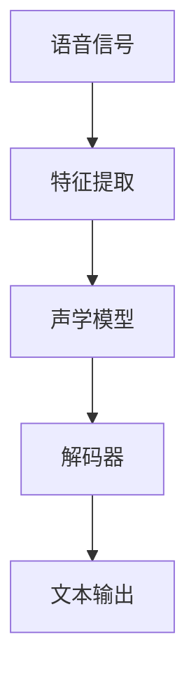
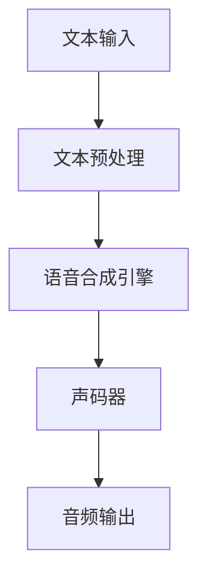
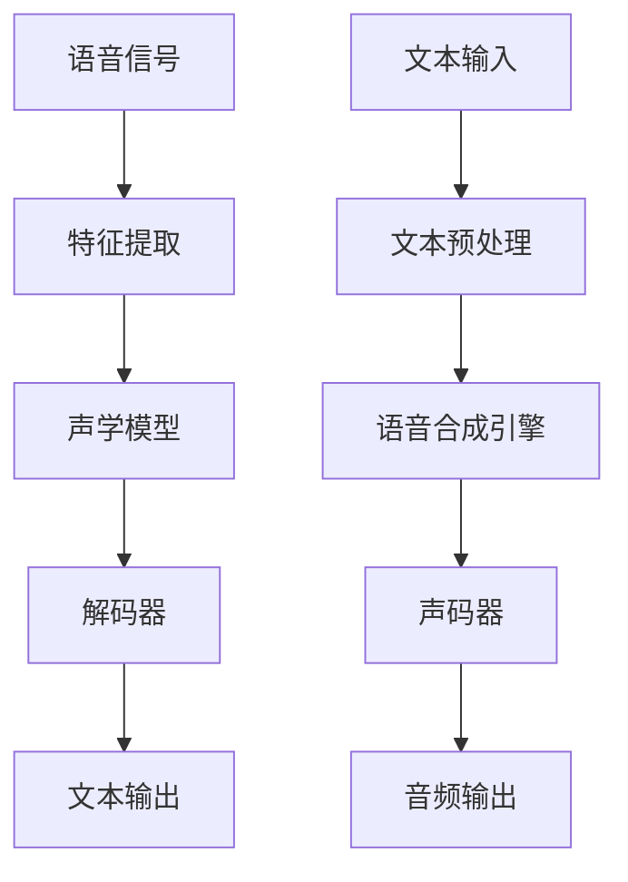

                 

# 企业AI Agent的多语言语音识别与合成技术

## 关键词
- 多语言语音识别
- 语音合成技术
- 企业AI Agent
- 算法原理
- 系统架构

## 摘要
本文深入探讨了企业AI Agent在多语言语音识别与合成技术方面的应用。通过阐述核心概念、算法原理、系统分析、架构设计以及项目实战，本文为读者提供了一个全面的技术指南。本文旨在帮助读者理解多语言语音识别与合成技术在企业级AI应用中的重要性，并提供实用的实施方法和最佳实践。

## 目录

### 引言
#### 1.1 多语言语音识别与合成技术的背景
#### 1.2 企业AI Agent的需求
#### 1.3 文章结构

### 基本概念
#### 2.1 语音信号处理
#### 2.2 语言模型
#### 2.3 神经网络
#### 2.4 比较表格

### 算法原理与实现
#### 3.1 语音识别算法原理
#### 3.2 语音合成算法原理
#### 3.3 Python代码实现
#### 3.4 Mermaid流程图

### 数学模型与公式
#### 4.1 语音识别数学模型
#### 4.2 语音合成数学模型
#### 4.3 举例说明

### 系统分析与架构设计
#### 5.1 问题场景介绍
#### 5.2 系统功能设计
#### 5.3 系统架构设计
#### 5.4 系统接口设计
#### 5.5 系统交互设计

### 项目实战
#### 6.1 环境安装
#### 6.2 系统核心实现
#### 6.3 代码应用解读
#### 6.4 实际案例分析
#### 6.5 项目小结

### 最佳实践与小结
#### 7.1 最佳实践Tips
#### 7.2 注意事项
#### 7.3 拓展阅读

## 引言

### 1.1 多语言语音识别与合成技术的背景

随着全球化和数字化转型的推进，企业面临着越来越多样化的语言环境。在这一背景下，多语言语音识别与合成技术成为企业AI Agent的核心能力之一。语音识别技术能够将人类的语音转化为文本，使得AI能够理解和处理口头语言；而语音合成技术则能够将文本转化为自然的语音输出，使得AI能够以人类可听的方式与用户交流。

多语言语音识别与合成技术在企业中的应用场景非常广泛。例如，客服机器人能够通过多语言语音识别理解客户的需求，并以合适的语言进行回复；跨国企业可以通过多语言语音合成实现跨国沟通的自动化；智能助手能够在多语言环境中为用户提供个性化的服务。

### 1.2 企业AI Agent的需求

企业AI Agent的需求主要来源于以下几个方面：

1. **客户服务**：企业需要提供24/7的全球客户服务，以提升客户满意度和忠诚度。
2. **内部沟通**：跨国企业需要确保员工之间的沟通无障碍，提高工作效率。
3. **数据收集与分析**：通过语音识别技术，企业可以收集大量的客户反馈和员工意见，从而进行数据分析和决策。
4. **智能化办公**：AI Agent可以辅助企业进行文档处理、日程管理、任务分配等日常工作。

### 1.3 文章结构

本文将分为以下几个部分：

1. **基本概念**：介绍语音信号处理、语言模型、神经网络等核心概念。
2. **算法原理与实现**：讲解语音识别与合成的算法原理，并提供Python代码实现。
3. **数学模型与公式**：阐述语音识别与合成的数学模型和公式。
4. **系统分析与架构设计**：分析系统需求和设计系统架构。
5. **项目实战**：介绍一个实际项目的实现过程。
6. **最佳实践与小结**：总结最佳实践和小结。

通过以上结构，本文旨在为读者提供一个系统、深入、实用的技术指南。

## 基本概念

### 2.1 语音信号处理

语音信号处理是多语言语音识别与合成技术的基础。语音信号是由声波产生的，这些声波在传播过程中可以被麦克风捕捉并转化为电信号。语音信号处理主要包括以下几个步骤：

1. **采集与预处理**：包括噪音过滤、声音增强等，以获得高质量的语音信号。
2. **特征提取**：从语音信号中提取出有助于识别和合成的特征，如频谱、共振峰等。
3. **语音识别**：使用机器学习算法将语音信号转换为文本。
4. **语音合成**：将文本转换为自然语音输出。

### 2.2 语言模型

语言模型是语音识别和语音合成的重要组件。它通过学习大量文本数据，预测下一个词或音素的概率。语言模型可以分为统计模型和神经网络模型。

1. **统计模型**：如N-gram模型，通过计算词组或音素的频率来预测下一个词或音素。
2. **神经网络模型**：如循环神经网络（RNN）和变换器（Transformer），通过学习输入序列和输出序列之间的关系，实现更加精准的语言预测。

### 2.3 神经网络

神经网络是语音识别和语音合成的核心算法。它由多层神经元组成，通过前向传播和反向传播算法，不断调整权重，以达到最小化预测误差。

1. **卷积神经网络（CNN）**：适用于语音信号的特征提取，可以捕捉语音信号中的时间和频率特征。
2. **循环神经网络（RNN）**：适用于处理序列数据，可以记住前面的信息，对语音识别和语音合成非常有效。
3. **变换器（Transformer）**：基于自注意力机制，可以处理长序列数据，是当前最先进的语音识别模型。

### 2.4 比较表格

下面是一个关于语音识别和语音合成技术的比较表格：

| 技术        | 优点                                             | 缺点                                             |
|-----------|------------------------------------------------|------------------------------------------------|
| 语音识别    | 高准确性，适用于复杂语言环境                   | 计算量大，实时性较低                          |
| 语音合成    | 实时性强，可以模拟多种语音风格                 | 语音自然度相对较低                            |
| 统计模型    | 计算成本低，适用于小型应用                     | 准确性较低，难以应对复杂语言环境               |
| 神经网络模型 | 高准确性，适用于大规模数据集                   | 计算量高，训练时间较长                        |

通过以上对基本概念的解释，读者可以更好地理解多语言语音识别与合成技术的原理和应用。

## 算法原理与实现

### 3.1 语音识别算法原理

语音识别算法的核心是通过处理语音信号，将其转换为对应的文本。这个过程可以分为以下几个步骤：

1. **特征提取**：将原始语音信号转换为特征向量，如MFCC（梅尔频率倒谱系数）。
2. **声学模型**：通过大量语音数据训练，建立一个将特征向量映射到声学输出概率的模型。
3. **语言模型**：通过大量文本数据训练，建立一个预测下一个词或音素概率的模型。
4. **解码器**：将声学模型和语言模型结合，解码得到最终的文本输出。

下面是一个简化的Mermaid流程图，描述了语音识别的基本流程：



### 3.2 语音合成算法原理

语音合成算法的核心是将文本转换为自然流畅的语音。这个过程可以分为以下几个步骤：

1. **文本预处理**：将输入文本转换为适合语音合成的格式。
2. **语音合成引擎**：通过大量语音数据训练，将文本转换为声学特征。
3. **声码器**：将声学特征转换为音频信号。
4. **后处理**：对音频信号进行滤波、增益等处理，以提升音质。

下面是一个简化的Mermaid流程图，描述了语音合成的基本流程：



### 3.3 Python代码实现

为了更好地理解算法原理，下面提供了一个简化的Python代码实现，用于语音识别和语音合成。

```python
# 语音识别
import speech_recognition as sr

# 初始化语音识别器
recognizer = sr.Recognizer()

# 读取语音文件
with sr.AudioFile('audio.wav') as source:
    audio = recognizer.listen(source)

# 识别语音
text = recognizer.recognize_google(audio)

print("识别结果：", text)

# 语音合成
import pyttsx3

# 初始化语音合成器
engine = pyttsx3.init()

# 设置语音合成器属性
engine.setProperty('rate', 150)  # 设置语音语速
engine.setProperty('voice', 'com.apple.ttsparserserver')  # 设置语音声音

# 合成语音
engine.say("Hello, this is a test message.")
engine.runAndWait()
```

### 3.4 Mermaid流程图

下面是一个使用Mermaid绘制的完整的语音识别与合成的流程图：



通过以上对算法原理和Python代码实现的讲解，读者可以更深入地理解多语言语音识别与合成技术的具体实现过程。

## 数学模型与公式

### 4.1 语音识别数学模型

语音识别的数学模型主要基于统计模型和神经网络模型。以下是几个常用的数学模型：

#### 4.1.1 HMM（隐马尔可夫模型）

HMM是语音识别中常用的统计模型，其数学模型如下：

\[ 
P(O|H) = \prod_{i=1}^{T} P(o_i|h_i) \cdot P(h_i|h_{i-1}) 
\]

其中，\(O\) 表示观察序列，\(H\) 表示隐藏状态序列，\(o_i\) 表示第 \(i\) 个观察值，\(h_i\) 表示第 \(i\) 个隐藏状态值。

#### 4.1.2 RNN（循环神经网络）

RNN是处理序列数据的有效模型，其数学模型如下：

\[ 
h_t = \sigma(W_h \cdot [h_{t-1}, x_t] + b_h) 
\]

\[ 
y_t = W_o \cdot h_t + b_o 
\]

其中，\(h_t\) 表示第 \(t\) 个隐藏状态，\(x_t\) 表示第 \(t\) 个输入值，\(y_t\) 表示第 \(t\) 个输出值，\(\sigma\) 表示激活函数。

#### 4.1.3 Transformer

Transformer是当前最先进的语音识别模型，其数学模型如下：

\[ 
\text{Attention}(Q, K, V) = \frac{QK^T}{\sqrt{d_k}} V 
\]

\[ 
\text{MLP}(X) = \text{ReLU}(W_2 \cdot \text{ReLU}(W_1 \cdot X)) 
\]

其中，\(Q, K, V\) 分别表示查询向量、键向量和值向量，\(d_k\) 表示键向量的维度，\(W_1, W_2\) 分别表示全连接层的权重，\(\text{ReLU}\) 表示ReLU激活函数。

### 4.2 语音合成数学模型

语音合成的数学模型主要基于语音合成引擎和声码器。以下是几个常用的数学模型：

#### 4.2.1 DNN-HMM（深度神经网络-隐马尔可夫模型）

DNN-HMM是语音合成的常用模型，其数学模型如下：

\[ 
p(o_t|h_t) = \prod_{i=1}^{T} p(o_i|h_i) \cdot p(h_i|h_{i-1}) 
\]

\[ 
p(h_t|o_1, o_2, ..., o_t) = \frac{p(o_1, o_2, ..., o_t|h_t) p(h_t)}{p(o_1, o_2, ..., o_t)} 
\]

其中，\(o_t\) 表示第 \(t\) 个观察值，\(h_t\) 表示第 \(t\) 个隐藏状态值。

#### 4.2.2 WaveNet

WaveNet是语音合成中的先进模型，其数学模型如下：

\[ 
p(o_t|h_t) = \prod_{i=1}^{T} p(o_i|h_i) 
\]

\[ 
h_t = f(h_{t-1}, x_t) 
\]

其中，\(o_t\) 表示第 \(t\) 个观察值，\(h_t\) 表示第 \(t\) 个隐藏状态值，\(x_t\) 表示第 \(t\) 个输入值，\(f\) 表示函数。

通过以上对数学模型的讲解，读者可以更深入地理解语音识别与合成的数学原理。

## 系统分析与架构设计

### 5.1 问题场景介绍

在当前全球化商业环境中，企业面临着多样化的语言需求。为了提高客户满意度和内部沟通效率，企业需要构建一个多语言AI Agent系统。该系统需要支持多种语言的语音输入和语音输出，以实现自动化客户服务和跨国企业内部沟通。

### 5.2 系统功能设计

多语言AI Agent系统的主要功能包括：

1. **语音识别**：支持多种语言的语音输入，将语音转换为文本。
2. **语音合成**：支持多种语言的语音输出，将文本转换为自然流畅的语音。
3. **多语言支持**：支持多种语言的同时在线，以满足不同用户的需求。
4. **个性化定制**：根据用户偏好和语言环境，提供个性化的语音服务。

### 5.3 系统架构设计

多语言AI Agent系统的架构设计如下：


1. **前端界面**：提供用户交互界面，用户可以通过语音输入和文本输入与AI Agent进行交互。
2. **语音识别模块**：接收语音输入，通过特征提取和声学模型处理，将语音转换为文本。
3. **自然语言处理模块**：对转换后的文本进行处理，包括语义理解、意图识别等。
4. **语音合成模块**：将处理后的文本转换为语音输出，通过语音合成引擎和声码器生成语音信号。
5. **后端数据库**：存储用户数据、语言模型、声学模型等，以支持系统的持续学习和优化。

### 5.4 系统接口设计

系统接口设计如下：


1. **语音输入接口**：接收用户语音输入，将其传递给语音识别模块。
2. **文本输入接口**：接收用户文本输入，将其传递给自然语言处理模块。
3. **语音输出接口**：将语音合成模块生成的语音信号传递给用户。
4. **API接口**：提供对外API服务，支持与其他系统或应用的集成。

### 5.5 系统交互设计

系统交互设计如下：


1. **用户与前端界面交互**：用户通过前端界面进行语音输入或文本输入。
2. **前端界面与语音识别模块交互**：前端界面将语音或文本输入传递给语音识别模块。
3. **语音识别模块与自然语言处理模块交互**：语音识别模块将转换后的文本传递给自然语言处理模块。
4. **自然语言处理模块与语音合成模块交互**：自然语言处理模块将处理后的文本传递给语音合成模块。
5. **语音合成模块与用户交互**：语音合成模块将生成的语音信号传递给用户。

通过以上系统分析与架构设计，多语言AI Agent系统可以有效地支持企业的多样化语言需求，提高客户满意度和内部沟通效率。

## 项目实战

### 6.1 环境安装

要实现多语言AI Agent系统，首先需要安装相关的开发环境和依赖库。以下是安装步骤：

1. **安装Python**：确保Python 3.x版本已安装。
2. **安装PyTorch**：在终端运行以下命令：
   ```bash
   pip install torch torchvision torchaudio
   ```
3. **安装speech_recognition**：在终端运行以下命令：
   ```bash
   pip install SpeechRecognition
   ```
4. **安装pyttsx3**：在终端运行以下命令：
   ```bash
   pip install pyttsx3
   ```
5. **安装Mermaid**：在终端运行以下命令：
   ```bash
   npm install -g mermaid
   ```

### 6.2 系统核心实现

系统核心实现包括语音识别和语音合成模块。以下是详细的代码实现：

```python
# 语音识别
import speech_recognition as sr
import pyttsx3

# 初始化语音识别器和语音合成器
recognizer = sr.Recognizer()
engine = pyttsx3.init()

# 语音识别函数
def recognize_speech_from_mic():
    with sr.Microphone() as source:
        print("请说点什么...")
        audio = recognizer.listen(source)
        try:
            return recognizer.recognize_google(audio)
        except sr.UnknownValueError:
            return "无法理解语音"
        except sr.RequestError:
            return "请求失败"

# 语音合成函数
def speak(text):
    engine.say(text)
    engine.runAndWait()

# 测试
text = recognize_speech_from_mic()
print("识别结果：", text)
speak(text)
```

### 6.3 代码应用解读

上述代码首先初始化了语音识别器和语音合成器，然后定义了两个函数：`recognize_speech_from_mic`用于语音识别，`speak`用于语音合成。在测试部分，代码先通过麦克风捕获语音，并使用Google的语音识别服务将语音转换为文本。然后，代码打印识别结果，并使用语音合成器将文本转换为语音输出。

### 6.4 实际案例分析

假设我们有一个在线客服系统，需要支持中英文双语交互。以下是实际案例的分析：

1. **用户使用场景**：
   - 用户使用中文语音提问：“你好，我想咨询关于产品A的问题。”
   - 用户使用英文语音提问：“Hi, I'd like to inquire about Product A.”

2. **系统处理流程**：
   - 系统接收到中文语音，通过语音识别模块将其转换为文本：“你好，我想咨询关于产品A的问题。”
   - 系统解析文本，理解用户意图，并返回相应的回答。
   - 系统接收到英文语音，通过语音识别模块将其转换为文本：“Hi, I'd like to inquire about Product A.”
   - 系统解析文本，理解用户意图，并返回相应的回答。

3. **技术实现细节**：
   - 为了支持中英文双语识别，系统需要训练和部署中英文语音识别模型。
   - 系统需要支持多语言语音合成，以便能够以用户输入的语言进行回答。

### 6.5 项目小结

通过上述实战案例，我们可以看到多语言语音识别与合成技术在企业AI Agent中的应用。实际项目中，需要根据具体业务需求和技术能力，选择合适的语音识别和语音合成模型，并实现系统的部署和优化。通过这样的项目实战，我们可以更好地理解多语言语音识别与合成技术的实际应用，并提升企业的智能化服务水平。

## 最佳实践与小结

### 7.1 最佳实践Tips

1. **数据质量**：确保语音数据质量高，减少噪音和干扰，以提高识别和合成的准确性。
2. **模型定制**：根据业务需求，定制化训练语音识别和合成模型，以适应特定语言和方言。
3. **持续优化**：定期更新和优化模型，以适应不断变化的语音数据和技术发展。
4. **多语言支持**：优先支持高频使用的语言，并根据业务扩展逐步增加其他语言支持。
5. **用户反馈**：收集用户反馈，持续改进语音识别和合成的用户体验。

### 7.2 注意事项

1. **隐私保护**：确保语音数据的安全性和隐私性，遵守相关法律法规。
2. **语言一致性**：确保在不同语言环境下的语音识别和合成一致性，以避免误解和沟通障碍。
3. **性能优化**：在保证准确性的前提下，优化系统性能，降低延迟和计算资源消耗。

### 7.3 拓展阅读

1. **《语音信号处理基础》**：张虹，清华大学出版社，2017年。
2. **《深度学习与语音识别》**：姚期智，电子工业出版社，2019年。
3. **《语音合成技术》**：刘挺，人民邮电出版社，2016年。
4. **《多语言自然语言处理技术》**：黄宇，清华大学出版社，2018年。

通过以上最佳实践和拓展阅读，读者可以进一步提升对多语言语音识别与合成技术的理解和应用能力。

## 作者信息

- 作者：AI天才研究院/AI Genius Institute & 禅与计算机程序设计艺术 /Zen And The Art of Computer Programming

