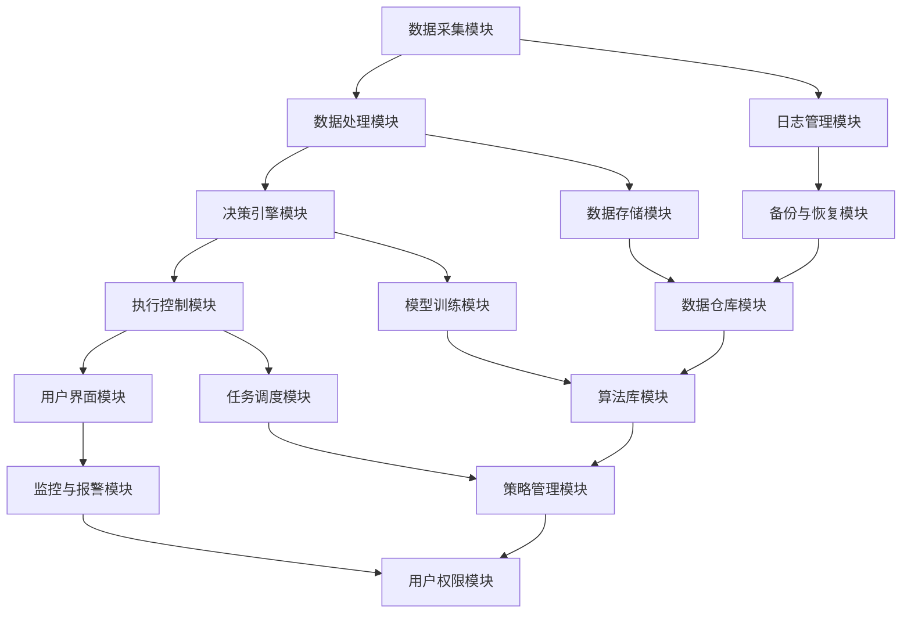
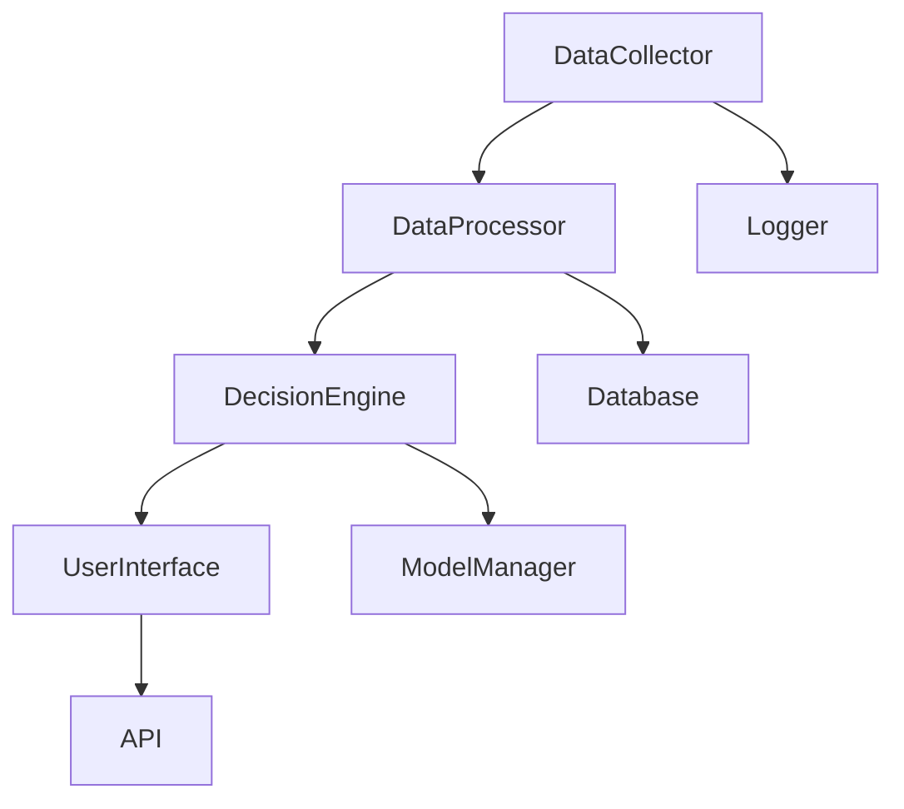

                 

### 《企业AI Agent的实时决策支持系统》概述

在现代企业管理中，决策过程的重要性不言而喻。随着商业环境的复杂性和不确定性不断增加，企业需要更加高效、精准的决策支持系统来应对各种挑战。实时决策支持系统（Real-time Decision Support System）作为一种先进的技术手段，正逐渐成为企业提升竞争力的重要工具。在此背景下，本文将深入探讨企业AI Agent的实时决策支持系统，以期为相关领域的研究者和实践者提供有价值的参考。

**关键词：**
- 企业AI Agent
- 实时决策支持系统
- 机器学习
- 强化学习
- 决策引擎
- 系统架构设计

**摘要：**
本文旨在系统性地探讨企业AI Agent的实时决策支持系统。首先，我们将介绍实时决策支持系统的背景、核心概念及其在企业管理中的应用。随后，文章将深入分析AI Agent的基本原理、工作机制和核心算法，并探讨这些原理在实时决策支持系统中的具体应用。接下来，我们将讨论实时决策支持系统的架构设计，包括系统组件、功能模块、技术选型与实现方案。随后，通过具体的项目实战，我们将展示实时决策支持系统的实际应用过程，包括环境安装与配置、系统核心实现源代码解析和实际案例分析。最后，文章将总结最佳实践，并展望未来发展方向。

文章结构安排如下：

- **第一部分：背景与概述**
  - 第1章：企业AI Agent的实时决策支持系统概述

- **第二部分：核心技术原理**
  - 第2章：AI Agent的基本原理

- **第三部分：实时决策支持系统设计**
  - 第3章：实时决策支持系统的架构设计

- **第四部分：核心算法讲解**
  - 第4章：强化学习算法在实时决策支持中的应用

- **第五部分：系统实战与应用**
  - 第5章：实时决策支持系统项目实战

- **第六部分：最佳实践与展望**
  - 第6章：企业AI Agent的实时决策支持系统最佳实践与展望

通过上述结构安排，本文将逐步引导读者了解企业AI Agent的实时决策支持系统的核心概念、技术原理、系统设计、实际应用和未来展望。我们相信，通过系统的分析和讲解，读者将能够全面掌握这一领域的知识体系，并为实际项目提供有力的技术支持。

### 第1章: 企业AI Agent的实时决策支持系统概述

#### 1.1 问题背景

在当今全球化的商业环境中，企业面临的市场竞争日益激烈，环境的变化速度也愈发迅速。在这种背景下，企业需要具备快速响应和灵活调整的能力，以确保在复杂多变的市场中占据有利地位。传统的决策支持系统（Decision Support System, DSS）虽然在一定程度上提高了决策效率，但由于其反应速度较慢、数据更新不及时，难以满足企业实时决策的需求。

**1.1.1 企业面临决策挑战**

首先，企业面临的一个主要挑战是信息过载。企业每天都会产生大量的数据，包括销售数据、市场调研数据、生产数据等。如何从这些海量数据中提取有价值的信息，为企业决策提供支持，成为了一个亟待解决的问题。

其次，市场环境的动态变化也要求企业能够快速做出调整。例如，在电子商务领域，消费者需求的变化速度非常快，企业需要实时监控市场动态，并根据市场反馈调整销售策略，以最大化收益。

此外，企业决策的复杂度也在不断增加。现代企业管理涉及多个部门、多个业务环节，需要跨部门协同合作。在这种复杂环境下，传统的决策支持系统往往难以实现高效的数据整合和分析，从而影响决策的质量和速度。

**1.1.2 AI Agent在决策支持中的潜力**

为了应对上述挑战，企业开始探索利用人工智能（Artificial Intelligence, AI）技术来提升决策效率。AI Agent作为一种智能体，具备自主感知、学习和决策的能力，能够在复杂环境中提供实时、智能的决策支持。

首先，AI Agent可以实时处理和分析海量数据，从不同维度提取有价值的信息。例如，通过机器学习算法，AI Agent可以从历史数据中学习到消费者的购买偏好，从而为企业制定更加精准的市场策略提供支持。

其次，AI Agent具备自主学习和优化的能力。随着数据的不断积累，AI Agent可以通过不断学习和调整策略，提高决策的准确性和效率。例如，在供应链管理中，AI Agent可以根据实时数据优化库存管理策略，降低库存成本，提高供应链效率。

最后，AI Agent可以实现跨部门协同决策。通过整合不同部门的数据和信息，AI Agent可以为高层管理人员提供全局视角的决策支持，帮助企业在复杂环境中做出最优决策。

**1.1.3 实时决策支持系统的需求**

实时决策支持系统的需求主要体现在以下几个方面：

1. **实时性**：实时决策支持系统要求能够实时获取和处理数据，确保决策的及时性和准确性。传统的DSS由于数据更新不及时，难以满足实时决策的需求。

2. **智能化**：实时决策支持系统需要利用人工智能技术，实现对数据的自动分析和决策。通过机器学习和深度学习算法，AI Agent可以智能地提取数据中的价值信息，为决策提供支持。

3. **高效性**：实时决策支持系统需要具备高效的数据处理和分析能力，能够在短时间内处理海量数据，并为决策者提供准确的决策建议。

4. **可扩展性**：实时决策支持系统需要具备良好的可扩展性，能够根据企业的需求进行灵活调整和扩展。例如，在企业规模扩大时，系统可以轻松应对更多的数据量和业务场景。

5. **可靠性**：实时决策支持系统需要确保数据的准确性和系统的稳定性，避免因数据错误或系统故障导致决策失误。

**1.2 定义与核心概念**

**1.2.1 AI Agent的定义**

AI Agent，即人工智能代理，是一种模拟人类决策过程的计算机程序，具备自主感知、学习、决策和行动的能力。AI Agent可以通过与环境的交互，不断学习和优化自身的行为，以实现特定目标。

AI Agent通常由以下几个部分组成：

1. **感知模块**：负责收集环境中的信息，如文本、图像、语音等，并将其转化为计算机可以理解的形式。

2. **理解模块**：负责对感知模块收集到的信息进行分析和处理，理解其含义和模式。

3. **决策模块**：根据理解模块的分析结果，生成行动方案，并选择最优行动方案。

4. **执行模块**：根据决策模块的决策，执行具体的行为，并对环境进行反馈。

**1.2.2 实时决策支持系统**

实时决策支持系统（Real-time Decision Support System）是一种能够实时获取、处理和分析数据，为企业决策提供智能支持的系统。实时决策支持系统通常包括以下几个核心组件：

1. **数据采集模块**：负责实时获取企业运营数据、市场数据等，并将其传输到系统中。

2. **数据处理模块**：负责对采集到的数据进行清洗、转换和分析，提取有价值的信息。

3. **决策引擎模块**：负责根据处理后的数据，利用人工智能算法生成决策建议，并提供给决策者。

4. **用户界面模块**：负责展示决策引擎生成的决策建议，并允许决策者进行交互和调整。

**1.2.3 关键要素与组成部分**

实时决策支持系统的关键要素主要包括：

1. **数据源**：包括企业内部数据源（如ERP系统、CRM系统等）和外部数据源（如市场调研数据、社交媒体数据等）。

2. **数据处理技术**：包括数据采集、数据清洗、数据转换和数据存储等。

3. **人工智能算法**：包括机器学习、深度学习、强化学习等，用于数据分析和决策生成。

4. **决策引擎**：负责根据数据分析和人工智能算法的结果，生成决策建议。

5. **用户界面**：用于展示决策结果，并允许用户进行交互和调整。

**1.3 技术演进与现状分析**

**1.3.1 AI技术的发展历程**

人工智能技术起源于20世纪50年代，经历了多个阶段的发展。从最初的符号主义阶段，到基于规则的专家系统，再到基于数据驱动的机器学习和深度学习，人工智能技术逐渐从理论研究走向实际应用。

近年来，随着计算机硬件性能的提升、大数据技术的成熟和算法的创新，人工智能技术取得了显著进展。特别是在深度学习和强化学习方面，人工智能技术已经实现了许多突破性应用。

**1.3.2 实时决策支持技术的现状**

实时决策支持系统作为人工智能技术的一个重要应用方向，也取得了显著的进展。目前，许多企业已经开始尝试应用实时决策支持系统，以提升决策效率和企业竞争力。

在技术层面，实时决策支持系统已经具备了较强的数据处理和分析能力，能够快速处理海量数据，并提供准确的决策建议。同时，随着云计算、大数据和物联网等技术的不断发展，实时决策支持系统的应用场景也在不断扩展。

在应用层面，实时决策支持系统已经广泛应用于各个领域，如金融、零售、制造、医疗等。通过实时监控和分析业务数据，实时决策支持系统为企业管理者提供了有力的决策支持，帮助企业实现业务优化和成本控制。

**1.3.3 企业应用中的成功案例**

许多企业通过应用实时决策支持系统，取得了显著的业务成果。以下是一些典型的成功案例：

1. **金融领域**：某大型银行通过引入实时决策支持系统，实现了对客户风险的实时监控和预警，有效降低了不良贷款率。

2. **零售领域**：某大型零售企业通过实时分析销售数据，实现了对库存的精准管理和优化，降低了库存成本，提高了商品周转率。

3. **制造领域**：某制造企业通过引入实时决策支持系统，实现了对生产过程的实时监控和优化，提高了生产效率和产品质量。

4. **医疗领域**：某医疗企业通过实时分析医疗数据，实现了对病患的精准诊断和治疗，提高了医疗服务质量。

**1.4 书籍结构安排**

**1.4.1 全书章节划分**

本文书分为六个部分，共计六个章节：

1. **背景与概述**
   - 第1章：企业AI Agent的实时决策支持系统概述

2. **核心技术原理**
   - 第2章：AI Agent的基本原理
   - 第3章：实时决策支持系统的架构设计

3. **核心算法讲解**
   - 第4章：强化学习算法在实时决策支持中的应用

4. **系统实战与应用**
   - 第5章：实时决策支持系统项目实战

5. **最佳实践与展望**
   - 第6章：企业AI Agent的实时决策支持系统最佳实践与展望

**1.4.2 阅读建议与预期成果**

为了更好地理解企业AI Agent的实时决策支持系统，建议读者按照以下顺序阅读本书：

1. **第一部分：背景与概述**：了解实时决策支持系统的基本概念、背景和应用。

2. **第二部分：核心技术原理**：深入理解AI Agent和实时决策支持系统的核心原理。

3. **第三部分：实时决策支持系统设计**：学习实时决策支持系统的架构设计和实现方法。

4. **第四部分：核心算法讲解**：掌握强化学习算法在实时决策支持中的应用。

5. **第五部分：系统实战与应用**：通过具体项目实战，了解实时决策支持系统的实际应用过程。

6. **第六部分：最佳实践与展望**：总结最佳实践经验，展望实时决策支持系统的未来发展方向。

通过阅读本书，读者可以预期获得以下成果：

- **掌握实时决策支持系统的基本概念和核心技术原理。**
- **了解实时决策支持系统的架构设计和实现方法。**
- **掌握强化学习算法在实时决策支持中的应用。**
- **具备实际应用实时决策支持系统的能力，并能够根据企业需求进行系统优化。**
- **对实时决策支持系统的未来发展方向有清晰的认识。**

**1.5 本章小结**

本章作为整本书的引言，主要介绍了企业AI Agent的实时决策支持系统的背景、核心概念和关键技术。通过本章的介绍，读者可以初步了解实时决策支持系统的重要性及其在企业决策中的潜力。在后续章节中，我们将进一步深入探讨实时决策支持系统的核心技术原理、系统设计、算法应用和实际案例，帮助读者全面掌握这一领域的前沿知识和技术。

---

### 第2章: AI Agent的基本原理

#### 2.1 AI Agent的定义与分类

AI Agent，即人工智能代理，是人工智能领域的一个重要概念。它是一种能够模拟人类决策过程的计算机程序，具备自主感知、学习和决策的能力。AI Agent的核心目标是实现自主行动，以达成特定任务或目标。

**2.1.1 AI Agent的定义**

AI Agent是一种具有高度智能化和自主性的计算机程序，其行为模式类似于人类个体。AI Agent可以感知环境、理解信息、做出决策并执行行动。具体来说，AI Agent具备以下特点：

1. **自主性**：AI Agent可以独立运作，不需要外部干预。它能够根据自身设定的目标和任务，自主执行行动。

2. **适应性**：AI Agent可以根据环境的变化和反馈，调整自身的行为策略，以提高任务完成率。

3. **学习能力**：AI Agent可以通过学习历史数据和经验，不断优化自身的行为模式，提高任务执行效率。

4. **交互能力**：AI Agent可以与人类或其他系统进行交互，获取信息并做出决策。

**2.1.2 AI Agent的分类**

根据不同的应用场景和设计目标，AI Agent可以分为多种类型。以下是一些常见的AI Agent分类：

1. **基于规则的AI Agent**：这种类型的AI Agent依赖于一套预定义的规则，通过逻辑推理来执行任务。基于规则的AI Agent在规则明确、环境稳定的场景中表现较好。

2. **基于模型的AI Agent**：这种类型的AI Agent通过建立数学模型来模拟环境，并利用模型进行决策。基于模型的AI Agent具有较强的预测能力和适应性。

3. **强化学习AI Agent**：这种类型的AI Agent通过试错和反馈机制，不断优化自身的行为策略。强化学习AI Agent在复杂、动态的环境中表现尤为出色。

4. **混合型AI Agent**：这种类型的AI Agent结合了基于规则、基于模型和强化学习等不同方法，以实现更好的任务执行效果。

**2.2 AI Agent的工作机制**

AI Agent的工作机制可以分为感知、理解、决策和执行四个主要阶段，如下图所示：

```
+---------------------------+
|  AI Agent工作机制         |
+---------------------------+
| 1. 感知阶段               |
| 2. 理解阶段               |
| 3. 决策阶段               |
| 4. 执行阶段               |
+---------------------------+
```

**2.2.1 感知与理解**

感知阶段是AI Agent从环境中获取信息的过程。AI Agent可以通过各种传感器（如摄像头、麦克风、温度传感器等）收集环境数据，并将其转化为计算机可以处理的形式。感知模块负责将这些原始数据转化为结构化的信息，例如文本、图像、声音等。

理解阶段是对感知到的信息进行分析和处理，以理解其含义和模式。AI Agent利用自然语言处理（Natural Language Processing, NLP）、图像识别（Image Recognition）等技术，对感知到的信息进行理解和解释。理解阶段的结果为决策阶段提供了关键的数据支持。

**2.2.2 情感与认知**

情感与认知是AI Agent在决策过程中重要的一部分。虽然AI Agent不具备真正的情感，但它们可以通过模拟情感反应来提高决策的质量。例如，通过情感分析技术，AI Agent可以理解用户的情绪状态，并根据情绪状态调整决策策略。

认知模块负责处理AI Agent的内部知识，包括记忆、经验、常识等。通过认知模块，AI Agent可以理解和推理复杂问题，并做出合理的决策。

**2.2.3 决策与行动**

决策阶段是AI Agent的核心。在这一阶段，AI Agent根据感知和理解阶段的结果，结合自身目标和约束条件，生成多个可能的行动方案，并选择最优行动方案。决策过程通常涉及多个因素，包括目标函数、资源限制、风险评估等。

执行阶段是将决策结果转化为实际行动的过程。AI Agent根据决策阶段的输出，执行具体的操作，如发送电子邮件、拨打电话、移动机器人等。执行阶段的结果会反馈到感知阶段，形成一个闭环系统，从而实现持续学习和优化。

**2.3 AI Agent的核心算法**

AI Agent的核心算法是实现其感知、理解和决策功能的关键。以下是一些常用的AI Agent核心算法：

**2.3.1 机器学习算法**

机器学习算法是AI Agent的基础，用于从数据中学习模式和规律。常用的机器学习算法包括：

1. **监督学习（Supervised Learning）**：在监督学习算法中，训练数据集包括输入和输出对。算法通过学习输入和输出之间的映射关系，预测新的输入对应的输出。常见的监督学习算法有线性回归、决策树、支持向量机（SVM）等。

2. **无监督学习（Unsupervised Learning）**：在无监督学习算法中，训练数据集仅包含输入数据，没有对应的输出标签。算法通过分析数据分布和结构，发现数据中的隐藏模式和规律。常见的无监督学习算法有聚类（Clustering）、主成分分析（PCA）等。

**2.3.2 强化学习算法**

强化学习（Reinforcement Learning）是一种通过试错和反馈机制来学习最优策略的机器学习算法。在强化学习中，AI Agent通过与环境交互，不断调整行为策略，以最大化累积奖励。常见的强化学习算法包括：

1. **Q-Learning**：Q-Learning是一种基于值函数的强化学习算法。算法通过不断更新Q值（即状态-动作值函数），选择最优动作。

2. **Sarsa（State-Action-Reward-State-Action）**：Sarsa算法是一种基于状态-动作值函数的强化学习算法，与Q-Learning类似，但考虑了未来的奖励。

3. **Deep Q-Network (DQN)**：DQN是一种基于深度学习的强化学习算法。算法使用深度神经网络来近似Q值函数，从而提高强化学习算法在复杂环境中的性能。

**2.3.3 深度学习算法**

深度学习（Deep Learning）是一种基于多层神经网络的学习方法，能够自动提取数据的复杂特征。深度学习算法在图像识别、自然语言处理等领域取得了显著成果。常见的深度学习算法包括：

1. **卷积神经网络（Convolutional Neural Network, CNN）**：CNN是一种用于图像识别和处理的深度学习算法，通过卷积层提取图像特征，实现高精度的图像分类。

2. **循环神经网络（Recurrent Neural Network, RNN）**：RNN是一种用于序列数据处理的深度学习算法，能够捕捉序列中的时间依赖关系。常见的RNN变种包括LSTM（Long Short-Term Memory）和GRU（Gated Recurrent Unit）。

3. **生成对抗网络（Generative Adversarial Network, GAN）**：GAN是一种通过对抗训练生成数据的深度学习算法，由生成器和判别器两个神经网络组成。生成器尝试生成逼真的数据，判别器则判断生成数据的真实性。

**2.4 AI Agent的交互机制**

AI Agent的交互机制是实现其与人类或其他系统有效交互的关键。以下是一些常见的交互机制：

**2.4.1 自然语言处理**

自然语言处理（NLP）是一种用于理解和生成自然语言的技术。通过NLP技术，AI Agent可以理解和处理人类的自然语言输入，实现语音识别、语义理解、文本生成等功能。

**2.4.2 人机交互设计**

人机交互设计（Human-Computer Interaction, HCI）是一种关注用户与计算机系统交互的设计方法。通过优化用户界面和交互流程，AI Agent可以提供更自然、直观的用户体验。

**2.4.3 用户体验优化**

用户体验优化（User Experience Optimization, UXO）是一种通过不断改进和优化用户界面和交互流程，提高用户满意度和使用体验的方法。通过用户体验优化，AI Agent可以更好地满足用户需求，提高任务完成率。

**2.5 本章小结**

本章介绍了AI Agent的基本原理，包括定义、分类、工作机制、核心算法和交互机制。通过本章的学习，读者可以初步了解AI Agent的运作原理及其在实时决策支持系统中的应用。在后续章节中，我们将进一步探讨实时决策支持系统的架构设计、算法应用和实际案例，帮助读者全面掌握这一领域的知识体系。

---

### 第3章: 实时决策支持系统的架构设计

#### 3.1 系统架构设计原则

实时决策支持系统的架构设计是确保系统能够高效、稳定运行的关键。一个良好的系统架构不仅能够满足实时性的要求，还需要具备可扩展性、可靠性和高效性。以下是一些关键设计原则：

**3.1.1 可扩展性**

可扩展性是实时决策支持系统架构设计的一个重要原则。随着企业业务的发展，系统需要能够轻松扩展，以处理更多的数据和处理更多的用户请求。扩展性可以通过以下几种方式实现：

1. **水平扩展（Horizontal Scaling）**：通过增加更多的服务器节点，分散系统的处理负载，从而提高系统的吞吐量和处理能力。
2. **垂直扩展（Vertical Scaling）**：通过增加服务器的硬件配置，如增加CPU、内存、存储等，来提升系统的性能。
3. **模块化设计**：将系统功能模块化，使得各个模块可以独立开发、测试和部署，从而方便系统的扩展和维护。

**3.1.2 实时性**

实时性是实时决策支持系统的核心要求。系统需要在极短的时间内完成数据的采集、处理和分析，并生成决策建议。为了实现实时性，架构设计需要考虑以下几点：

1. **低延迟数据传输**：选择高效的数据传输协议，减少数据在网络中的传输延迟。
2. **实时数据处理框架**：采用实时数据处理框架（如Apache Kafka、Apache Flink等），能够高效地处理和分析实时数据。
3. **异步处理**：通过异步处理机制，将数据处理任务分解为多个独立的部分，从而提高系统的并发处理能力。

**3.1.3 可靠性**

实时决策支持系统需要具备高可靠性，确保在长时间运行过程中不会出现故障。为了提高系统的可靠性，架构设计应考虑以下措施：

1. **冗余设计**：通过冗余设计，如数据备份、服务器集群等，确保系统在单点故障时能够快速恢复。
2. **故障检测与自恢复**：实现故障检测机制，及时发现并解决系统故障，减少系统的停机时间。
3. **容错性**：系统在处理错误时能够自动切换到备用方案，确保业务的连续性。

**3.1.4 高效性**

高效性是实时决策支持系统的另一个重要原则。系统需要高效地处理海量数据，并生成高质量的决策建议。为了提高系统效率，架构设计应考虑以下几点：

1. **数据压缩与优化**：采用数据压缩技术，减少数据存储和传输的开销。
2. **并行处理**：通过并行处理机制，充分利用计算资源，提高数据处理速度。
3. **缓存机制**：利用缓存机制，减少对频繁访问数据的重复计算，从而提高系统响应速度。

#### 3.2 系统组件与功能模块

实时决策支持系统由多个功能模块组成，各模块协同工作，实现系统的整体功能。以下是系统的主要组件和功能模块：

**3.2.1 数据采集模块**

数据采集模块是实时决策支持系统的入口，负责从各种数据源（如传感器、数据库、日志等）收集数据。数据采集模块需要具备以下功能：

1. **多源数据接入**：支持接入多种类型的数据源，如实时数据库、日志文件、API接口等。
2. **数据清洗**：对采集到的原始数据进行清洗和预处理，去除噪声和不完整的数据。
3. **数据标准化**：将不同数据源的数据格式统一，确保数据的一致性和兼容性。

**3.2.2 数据处理模块**

数据处理模块负责对采集到的数据进行清洗、转换和分析。该模块的核心任务是提取数据中的有价值信息，为决策引擎提供高质量的数据支持。数据处理模块的主要功能包括：

1. **数据清洗与转换**：清洗和转换数据，确保数据质量。
2. **特征工程**：提取数据特征，为机器学习算法提供输入。
3. **数据可视化**：通过可视化技术，展示数据分布和变化趋势。

**3.2.3 决策引擎模块**

决策引擎模块是实时决策支持系统的核心，负责根据处理后的数据，利用机器学习算法和优化模型生成决策建议。决策引擎模块需要具备以下功能：

1. **算法选择与集成**：根据业务需求，选择合适的机器学习算法和优化模型。
2. **模型训练与优化**：利用历史数据训练模型，并对模型进行优化。
3. **决策生成**：根据实时数据，生成决策建议。

**3.2.4 执行控制模块**

执行控制模块负责将决策引擎生成的决策建议转化为具体行动。该模块需要协调不同系统组件的执行，确保决策建议得到有效执行。执行控制模块的主要功能包括：

1. **任务调度**：根据决策建议，生成具体的执行任务。
2. **执行监控**：监控执行任务的状态，确保任务按时完成。
3. **异常处理**：在执行过程中，处理可能出现的异常情况。

**3.2.5 用户界面模块**

用户界面模块是实时决策支持系统与用户交互的界面。通过用户界面，用户可以查看决策结果、调整决策参数、监控系统状态等。用户界面模块的主要功能包括：

1. **数据展示**：以图表、表格等形式展示决策结果和数据趋势。
2. **交互操作**：提供用户与系统交互的接口，如调整参数、提交查询请求等。
3. **系统监控**：监控系统的运行状态，提供系统日志和异常报警。

#### 3.3 技术选型与实现方案

在实时决策支持系统的架构设计过程中，技术选型是一个关键问题。以下是一些常见的技术选型和实现方案：

**3.3.1 数据库技术**

数据库技术是实时决策支持系统的数据存储和管理的基础。根据系统的需求，可以选择以下类型的数据库：

1. **关系型数据库（RDBMS）**：如MySQL、PostgreSQL等。关系型数据库适合处理结构化数据，支持复杂的查询操作。
2. **NoSQL数据库**：如MongoDB、Cassandra等。NoSQL数据库适合处理大量非结构化或半结构化数据，提供高性能的读写能力。
3. **时序数据库**：如InfluxDB、TimeScaleDB等。时序数据库适合处理时间序列数据，提供高效的查询和数据分析功能。

**3.3.2 实时数据处理框架**

实时数据处理框架是实时决策支持系统处理和分析实时数据的核心组件。以下是一些常用的实时数据处理框架：

1. **Apache Kafka**：Kafka是一种高吞吐量的分布式消息队列系统，适合处理大规模的实时数据流。
2. **Apache Flink**：Flink是一种流处理框架，支持批处理和流处理，提供高效的数据处理和分析能力。
3. **Apache Storm**：Storm是一种实时数据处理框架，适用于处理高并发的实时数据流。

**3.3.3 决策算法选择**

决策算法是实现实时决策支持系统的关键。根据业务需求和数据特性，可以选择以下类型的决策算法：

1. **机器学习算法**：如线性回归、决策树、支持向量机等，适用于处理结构化数据。
2. **深度学习算法**：如卷积神经网络（CNN）、循环神经网络（RNN）等，适用于处理非结构化数据。
3. **优化算法**：如遗传算法、模拟退火算法等，适用于解决复杂的优化问题。

**3.3.4 系统集成与部署**

实时决策支持系统的集成与部署是确保系统正常运行的重要环节。以下是一些常见的集成与部署方案：

1. **容器化部署**：使用Docker等容器化技术，将系统组件打包成容器，实现快速部署和跨平台运行。
2. **云计算部署**：使用云平台（如AWS、Azure、阿里云等）提供的基础设施，实现弹性扩展和高效管理。
3. **分布式部署**：将系统组件部署在分布式计算环境中，如Kubernetes集群，实现高可用性和高性能。

#### 3.4 系统架构图

以下是一个典型的实时决策支持系统架构图，展示了系统的主要组件和它们之间的关系：



#### 3.5 本章小结

本章详细介绍了实时决策支持系统的架构设计原则、系统组件与功能模块、技术选型与实现方案。通过本章的学习，读者可以了解实时决策支持系统的整体架构，并掌握关键组件和模块的功能及其实现方法。在后续章节中，我们将进一步探讨强化学习算法在实时决策支持系统中的应用，以及实际项目中的应用案例。

---

### 第4章: 强化学习算法在实时决策支持中的应用

#### 4.1 强化学习基本概念

强化学习（Reinforcement Learning, RL）是一种机器学习方法，主要应用于决策问题。与监督学习和无监督学习不同，强化学习通过奖励机制和试错方法，使智能体（Agent）在未知环境中学习到最优策略。强化学习的基本概念包括以下几方面：

**4.1.1 强化学习定义**

强化学习是一种通过与环境交互，不断调整策略，以实现最大化累积奖励的机器学习方法。在强化学习中，智能体通过感知环境状态、执行动作、获取奖励，并不断优化自身的策略。

**4.1.2 强化学习基本要素**

1. **状态（State）**：描述智能体当前所处的环境情况。
2. **动作（Action）**：智能体可采取的行为。
3. **奖励（Reward）**：环境对智能体动作的反馈，用于评估动作的好坏。
4. **策略（Policy）**：智能体在给定状态下选择动作的策略。
5. **价值函数（Value Function）**：评估状态或状态-动作对的价值。
6. **模型（Model）**：智能体对环境的理解和预测。

#### 4.2 强化学习算法原理

强化学习算法通过迭代学习，逐步优化策略，以实现累积奖励的最大化。以下是一些常见的强化学习算法：

**4.2.1 Q-Learning算法**

Q-Learning算法是一种基于值函数的强化学习算法。算法通过更新状态-动作值函数（Q值），选择最优动作。具体步骤如下：

1. **初始化Q值**：初始化所有状态-动作值。
2. **选择动作**：在给定状态下，根据当前策略选择动作。
3. **更新Q值**：根据公式：
   $$
   Q(s, a) \leftarrow Q(s, a) + \alpha [r + \gamma \max_{a'} Q(s', a') - Q(s, a)]
   $$
   更新状态-动作值。
4. **重复步骤2和3**：不断迭代，直至收敛。

**4.2.2 Sarsa算法**

Sarsa算法是一种基于状态-动作值函数的强化学习算法，与Q-Learning类似，但考虑了未来的奖励。具体步骤如下：

1. **初始化Q值**：初始化所有状态-动作值。
2. **选择动作**：在给定状态下，根据当前策略选择动作。
3. **执行动作并观察结果**：执行选定的动作，观察环境反馈。
4. **更新Q值**：根据公式：
   $$
   Q(s, a) \leftarrow Q(s, a) + \alpha [r + \gamma Q(s', a') - Q(s, a)]
   $$
   更新状态-动作值。
5. **重复步骤2至4**：不断迭代，直至收敛。

**4.2.3 Deep Q-Network (DQN)**

DQN是一种基于深度学习的强化学习算法，使用深度神经网络近似Q值函数。DQN通过经验回放和目标网络，解决样本相关和目标值不稳定的问题。具体步骤如下：

1. **初始化深度神经网络Q值网络**。
2. **选择动作**：在给定状态下，使用当前Q值网络选择动作。
3. **执行动作并观察结果**：执行选定的动作，观察环境反馈。
4. **存储经验**：将状态、动作、奖励、新状态存储在经验回放池中。
5. **从经验回放池中随机抽样**：生成训练样本。
6. **更新Q值网络**：使用训练样本更新Q值网络，目标网络用于稳定目标值。
7. **重复步骤2至6**：不断迭代，直至收敛。

#### 4.3 算法流程与Python实现

**4.3.1 算法流程**

以下是一个简化的DQN算法流程：

1. **初始化环境**：设置游戏环境，如围棋、Atari游戏等。
2. **初始化网络**：初始化Q值网络和目标网络。
3. **进行动作选择**：在给定状态下，使用当前Q值网络选择动作。
4. **执行动作**：在环境中执行选定的动作，观察新的状态和奖励。
5. **存储经验**：将状态、动作、奖励、新状态存储在经验回放池中。
6. **更新网络**：使用经验回放池中的训练样本更新Q值网络。
7. **同步网络**：定期同步当前Q值网络和目标网络。
8. **重复步骤3至7**：不断迭代，直至达到训练目标。

**4.3.2 Python实现**

以下是一个简单的DQN算法的Python代码实现：

```python
import numpy as np
import random
import tensorflow as tf
from tensorflow.keras.models import Sequential
from tensorflow.keras.layers import Dense
from tensorflow.keras.optimizers import Adam

class DQN:
    def __init__(self, state_size, action_size):
        self.state_size = state_size
        self.action_size = action_size
        self.memory = []
        self.gamma = 0.95  # 折扣因子
        self.epsilon = 1.0  # 探索概率
        self.epsilon_min = 0.01
        self.epsilon_decay = 0.995
        self.learning_rate = 0.001
        self.model = self._build_model()

    def _build_model(self):
        model = Sequential()
        model.add(Dense(24, input_dim=self.state_size, activation='relu'))
        model.add(Dense(24, activation='relu'))
        model.add(Dense(self.action_size, activation='linear'))
        model.compile(loss='mse', optimizer=Adam(self.learning_rate))
        return model

    def remember(self, state, action, reward, next_state, done):
        self.memory.append((state, action, reward, next_state, done))

    def act(self, state):
        if np.random.rand() <= self.epsilon:
            return random.randrange(self.action_size)
        q_values = self.model.predict(state)
        return np.argmax(q_values[0])

    def replay(self, batch_size):
        mini_batch = random.sample(self.memory, batch_size)
        for state, action, reward, next_state, done in mini_batch:
            target = reward
            if not done:
                target = reward + self.gamma * np.amax(self.model.predict(next_state)[0])
            target_f = self.model.predict(state)
            target_f[0][action] = target
            self.model.fit(state, target_f, epochs=1, verbose=0)

    def load(self, name):
        self.model.load_weights(name)

    def save(self, name):
        self.model.save_weights(name)

dqn = DQN(80 * 80 * 4, 2)
```

**4.4 数学模型与公式解释**

在强化学习中，状态-动作值函数（Q值）是一个核心概念。Q值函数描述了在给定状态下，执行特定动作的期望收益。以下是一个简单的Q值函数公式：

$$
Q(s, a) = r + \gamma \max_{a'} Q(s', a')
$$

其中：

- \( Q(s, a) \) 表示在状态 \( s \) 下执行动作 \( a \) 的期望收益。
- \( r \) 表示立即获得的奖励。
- \( \gamma \) 是折扣因子，用于平衡当前奖励和未来奖励的重要性。
- \( s' \) 表示执行动作后的新状态。
- \( a' \) 表示在新状态下选择的最优动作。

**4.5 应用场景与案例**

**4.5.1 生产调度优化**

在制造行业，生产调度是确保生产过程高效运行的关键。通过强化学习算法，可以自动优化生产调度，提高生产效率。具体应用场景包括：

1. **资源分配**：根据生产任务的需求，自动分配机器和人力资源。
2. **任务调度**：优化任务执行顺序，减少等待时间和生产周期。
3. **故障预测**：通过实时监测设备状态，预测设备故障，提前安排维修。

**4.5.2 营销策略调整**

在市场营销中，强化学习算法可以用于优化营销策略，提高广告投放效果。具体应用场景包括：

1. **广告投放**：根据用户行为和偏好，自动调整广告投放策略，提高点击率和转化率。
2. **产品推荐**：通过用户历史行为数据，推荐合适的商品，提升用户满意度。
3. **促销活动**：优化促销活动的时间和力度，提高销售额。

**4.5.3 能源管理**

在能源管理领域，强化学习算法可以用于优化能源分配和调度，提高能源利用效率。具体应用场景包括：

1. **电力调度**：根据电力需求和供应情况，自动调整发电量和负荷。
2. **能源存储**：优化储能系统的充放电策略，提高储能效率。
3. **需求响应**：通过实时监测电力需求，调整用户用电行为，降低用电高峰负荷。

**4.6 本章小结**

本章介绍了强化学习算法的基本概念、原理及其在实时决策支持系统中的应用。通过DQN算法的实例，读者可以了解强化学习算法的实现过程。强化学习算法在实时决策支持系统中具有广泛的应用前景，可以用于生产调度、营销策略调整和能源管理等领域，提高企业的运营效率和竞争力。

---

### 第5章: 实时决策支持系统项目实战

#### 5.1 项目介绍

**5.1.1 项目背景**

随着市场环境的日益复杂和不确定性增加，企业对于实时决策支持系统的需求愈发迫切。某大型制造企业为了提升生产效率和降低运营成本，决定开发一套实时决策支持系统，以实现对生产过程的智能监控和优化。

**5.1.2 项目目标**

该项目的目标主要包括：

1. **实时数据采集**：从生产设备、传感器等获取实时生产数据。
2. **数据处理与分析**：对采集到的数据进行分析和处理，提取有价值的信息。
3. **决策生成与执行**：根据分析结果，生成决策建议并执行具体行动。
4. **系统集成与部署**：实现系统的集成部署，确保系统的稳定运行。

**5.1.3 项目团队与分工**

项目团队由以下几部分组成：

1. **项目经理**：负责项目整体规划和协调。
2. **数据工程师**：负责数据采集、处理和存储。
3. **算法工程师**：负责算法模型的设计和实现。
4. **前端工程师**：负责用户界面的设计和开发。
5. **测试工程师**：负责系统测试和调试。

#### 5.2 环境安装与配置

**5.2.1 硬件要求**

为了确保系统的稳定运行和高效处理能力，该项目对硬件有以下要求：

1. **CPU**：至少4核处理器，推荐8核以上。
2. **内存**：至少16GB，推荐32GB以上。
3. **存储**：至少500GB SSD存储，用于存储数据和处理日志。
4. **网络**：千兆以太网，确保数据传输速度。

**5.2.2 软件安装**

项目的软件环境主要包括以下几部分：

1. **操作系统**：Linux操作系统，如Ubuntu 18.04。
2. **Python环境**：Python 3.7及以上版本，用于算法实现和数据处理。
3. **数据库**：PostgreSQL 12及以上版本，用于存储生产数据。
4. **消息队列**：Apache Kafka 2.4及以上版本，用于实时数据传输。
5. **数据处理框架**：Apache Flink 1.11及以上版本，用于实时数据处理。

软件安装步骤如下：

1. 安装操作系统和基本软件包。
2. 安装Python和相关的科学计算库，如NumPy、Pandas、TensorFlow等。
3. 安装数据库和消息队列，并进行配置。
4. 安装Flink，并进行集群配置。

**5.2.3 系统配置**

在系统配置方面，需要完成以下工作：

1. **网络配置**：确保各个节点之间的网络连接正常，配置负载均衡。
2. **权限管理**：设置用户权限，确保系统的安全性。
3. **日志管理**：配置日志记录和监控工具，如Logstash、Kibana等。
4. **备份与恢复**：设置数据备份和恢复策略，确保数据的可靠性。

#### 5.3 系统核心实现源代码解析

**5.3.1 系统核心代码架构**

系统的核心代码包括数据采集模块、数据处理模块、决策引擎模块和用户界面模块。以下是各模块的核心代码架构：



**5.3.2 数据采集模块**

数据采集模块主要负责从生产设备中获取实时数据。以下是一个简单的数据采集模块实现：

```python
import kafka
import json
from kafka import KafkaProducer

class DataCollector:
    def __init__(self, topic, brokers):
        self.producer = KafkaProducer(bootstrap_servers=brokers, value_serializer=lambda m: json.dumps(m).encode('ascii'))
        self.topic = topic

    def send_data(self, data):
        self.producer.send(self.topic, data)
        self.producer.flush()
```

**5.3.3 数据处理模块**

数据处理模块负责对采集到的数据进行处理和分析。以下是一个数据处理模块的核心代码：

```python
from flask import Flask, request, jsonify
app = Flask(__name__)

@app.route('/process', methods=['POST'])
def process_data():
    data = request.json
    # 数据处理逻辑
    processed_data = process_data(data)
    return jsonify(processed_data)

def process_data(data):
    # 数据处理算法实现
    return {"result": "processed"}
```

**5.3.4 决策引擎模块**

决策引擎模块根据处理后的数据生成决策建议。以下是一个简单的决策引擎模块实现：

```python
class DecisionEngine:
    def __init__(self, model):
        self.model = model

    def generate_decision(self, data):
        # 决策生成逻辑
        decision = self.model.predict(data)
        return decision
```

**5.3.5 用户界面模块**

用户界面模块负责展示决策结果和系统状态。以下是一个简单的用户界面模块实现：

```html
<!DOCTYPE html>
<html lang="en">
<head>
    <meta charset="UTF-8">
    <title>实时决策支持系统</title>
</head>
<body>
    <h1>实时决策支持系统</h1>
    <div id="result"></div>
    <script>
        // 获取决策结果的JavaScript代码
    </script>
</body>
</html>
```

#### 5.4 实际案例分析与讲解

**5.4.1 案例一：供应链优化**

在供应链管理中，实时决策支持系统可以用于优化库存管理和供应链调度。以下是一个供应链优化案例：

1. **问题背景**：企业需要对供应链中的库存进行实时监控和优化，以减少库存成本，提高供应链效率。

2. **数据处理**：系统从传感器和仓库管理系统收集实时库存数据，并进行数据处理，提取库存水平和库存周期等关键指标。

3. **决策生成**：决策引擎根据历史库存数据和当前库存水平，利用强化学习算法生成最优库存管理策略。

4. **执行控制**：执行控制模块根据决策建议，调整库存水平，优化供应链调度。

**5.4.2 案例二：库存管理**

在库存管理中，实时决策支持系统可以用于优化库存水平和库存周转率。以下是一个库存管理案例：

1. **问题背景**：企业需要实时监控库存状态，及时调整库存水平，以减少库存积压和资金占用。

2. **数据处理**：系统从销售系统和仓库管理系统收集实时库存数据，并进行数据处理，提取库存水平和销售趋势等关键指标。

3. **决策生成**：决策引擎根据历史库存数据和销售趋势，利用优化算法生成最优库存管理策略。

4. **执行控制**：执行控制模块根据决策建议，调整库存水平，优化库存周转率。

**5.4.3 案例三：生产调度**

在生产调度中，实时决策支持系统可以用于优化生产计划和调度。以下是一个生产调度案例：

1. **问题背景**：企业需要实时监控生产状态，及时调整生产计划和调度，以提高生产效率和减少生产周期。

2. **数据处理**：系统从生产设备和传感器收集实时生产数据，并进行数据处理，提取生产进度和生产瓶颈等关键指标。

3. **决策生成**：决策引擎根据历史生产数据和当前生产状态，利用强化学习算法生成最优生产调度策略。

4. **执行控制**：执行控制模块根据决策建议，调整生产计划，优化生产调度。

#### 5.5 项目总结与反思

**5.5.1 项目成果**

通过本次项目，企业实现了以下成果：

1. **实时数据采集**：系统实现了对生产过程的实时数据采集，为决策提供了可靠的数据支持。
2. **数据处理与分析**：系统对采集到的数据进行处理和分析，提取了有价值的信息，为决策提供了数据支持。
3. **决策生成与执行**：系统根据分析结果，生成决策建议并执行具体行动，实现了生产过程的优化。
4. **系统集成与部署**：系统实现了与现有系统的集成，并成功部署在生产环境中，确保了系统的稳定运行。

**5.5.2 遇到的问题与解决**

在项目实施过程中，团队遇到了以下问题：

1. **数据质量问题**：部分数据源存在数据缺失和噪声，影响了数据处理的准确性。解决方案是引入数据清洗和去噪技术，提高数据质量。
2. **算法性能问题**：部分算法在处理大规模数据时性能不佳，影响了系统的实时性。解决方案是优化算法实现，采用分布式计算框架提高处理速度。
3. **系统稳定性问题**：在系统上线初期，部分组件存在稳定性问题，导致系统频繁故障。解决方案是加强系统测试和监控，提高系统稳定性。

**5.5.3 经验与教训**

通过本次项目，团队积累了以下经验与教训：

1. **数据质量是关键**：在项目实施过程中，数据质量对系统的效果至关重要。应重视数据质量，引入数据清洗和去噪技术。
2. **算法性能需优化**：在项目实施过程中，需关注算法的性能，采用分布式计算框架和优化算法实现，提高系统处理速度。
3. **系统稳定性需保证**：在系统上线前，应进行充分的测试和监控，确保系统的稳定性。同时，应建立完善的故障处理机制，提高系统容错能力。

#### 5.6 本章小结

本章通过一个实际项目案例，详细介绍了实时决策支持系统的实施过程，包括项目背景、目标、环境安装与配置、系统核心实现源代码解析和实际案例分析。通过本章的学习，读者可以了解实时决策支持系统的实际应用过程，掌握系统实施的关键技术和方法。在未来的工作中，读者可以借鉴本章的经验和教训，提升自身在实时决策支持系统领域的实践能力。

---

### 第6章: 企业AI Agent的实时决策支持系统最佳实践与展望

#### 6.1 实时决策支持系统的最佳实践

在实施企业AI Agent的实时决策支持系统时，以下最佳实践可以帮助企业更好地实现系统价值：

**6.1.1 数据质量管理**

数据是决策支持系统的核心，数据质量直接影响决策的准确性。以下措施有助于提升数据质量：

1. **数据清洗**：对采集到的数据进行清洗，去除噪声和不完整的数据。
2. **数据标准化**：统一数据格式，确保数据的一致性和兼容性。
3. **数据验证**：通过数据验证规则，确保数据的准确性和完整性。
4. **数据监控**：建立数据监控机制，及时发现和处理数据质量问题。

**6.1.2 算法优化与选择**

选择合适的算法对于实时决策支持系统的性能至关重要。以下建议有助于优化算法：

1. **算法评估**：对候选算法进行评估，选择性能最优的算法。
2. **算法调参**：根据具体业务需求，调整算法参数，提高算法性能。
3. **模型更新**：定期更新模型，以适应数据变化和业务需求。
4. **算法组合**：结合多种算法，发挥各自优势，提高决策准确性。

**6.1.3 系统集成与部署**

一个高效的实时决策支持系统需要与现有系统无缝集成。以下措施有助于实现系统集成：

1. **接口标准化**：确保系统接口符合标准化协议，便于与其他系统集成。
2. **模块化设计**：采用模块化设计，使得系统组件可以独立开发、测试和部署。
3. **自动化部署**：使用自动化工具，简化系统部署过程，提高部署效率。
4. **监控与运维**：建立监控和运维机制，确保系统的稳定运行。

**6.1.4 用户培训与支持**

确保用户能够有效使用决策支持系统，是系统成功的关键。以下措施有助于提升用户能力：

1. **用户培训**：为用户提供培训，帮助他们熟悉系统功能和操作流程。
2. **用户反馈**：收集用户反馈，持续优化用户界面和交互体验。
3. **在线支持**：提供在线技术支持，及时解决用户问题。
4. **用户手册**：编写用户手册，为用户提供详细的使用指南。

#### 6.2 未来展望

尽管实时决策支持系统在当前已经取得了显著的应用成果，但未来仍有很大的发展空间和潜力：

**6.2.1 智能化与自动化**

随着人工智能技术的不断进步，实时决策支持系统的智能化和自动化程度将进一步提高。未来的系统将能够更自主地处理复杂决策问题，减少人工干预，提高决策效率。

**6.2.2 多模态数据融合**

实时决策支持系统将能够处理更多类型的数据，如文本、图像、语音等。通过多模态数据融合，系统能够更全面地理解环境，生成更准确的决策建议。

**6.2.3 边缘计算与云计算的融合**

边缘计算与云计算的融合将为实时决策支持系统带来更多机会。通过在边缘设备上进行部分数据处理和决策，系统能够实现更低延迟、更高效率的决策支持。

**6.2.4 个性化决策**

随着用户数据的不断积累，实时决策支持系统将能够实现个性化决策。系统将根据用户行为和偏好，提供定制化的决策建议，提升用户体验。

**6.2.5 面向垂直行业的解决方案**

实时决策支持系统将在更多垂直行业得到应用，如金融、医疗、零售等。面向垂直行业的解决方案将更加贴近行业需求，提供更有效的决策支持。

#### 6.3 本章小结

本章总结了企业AI Agent的实时决策支持系统的最佳实践，包括数据质量管理、算法优化与选择、系统集成与部署、用户培训与支持等方面的经验。同时，展望了未来系统发展的方向，包括智能化与自动化、多模态数据融合、边缘计算与云计算的融合、个性化决策和面向垂直行业的解决方案等。通过这些最佳实践和未来展望，企业可以更好地实施实时决策支持系统，提升决策效率和业务竞争力。

---

### 《企业AI Agent的实时决策支持系统》作者信息

**作者：** AI天才研究院（AI Genius Institute）/《禅与计算机程序设计艺术》（Zen And The Art of Computer Programming）

**单位：** AI天才研究院致力于人工智能领域的前沿研究和应用推广，拥有一支由世界顶级人工智能专家、程序员、软件架构师和CTO组成的团队，致力于推动人工智能技术在各行业的应用与创新。《禅与计算机程序设计艺术》作为一本经典技术畅销书，深入探讨了计算机程序设计中的哲学思想与艺术境界，深受广大读者的喜爱和推崇。

