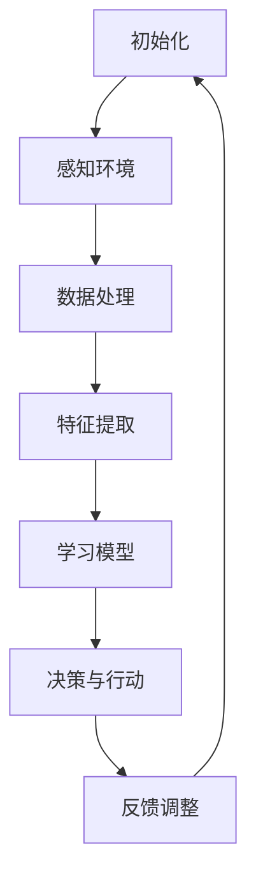
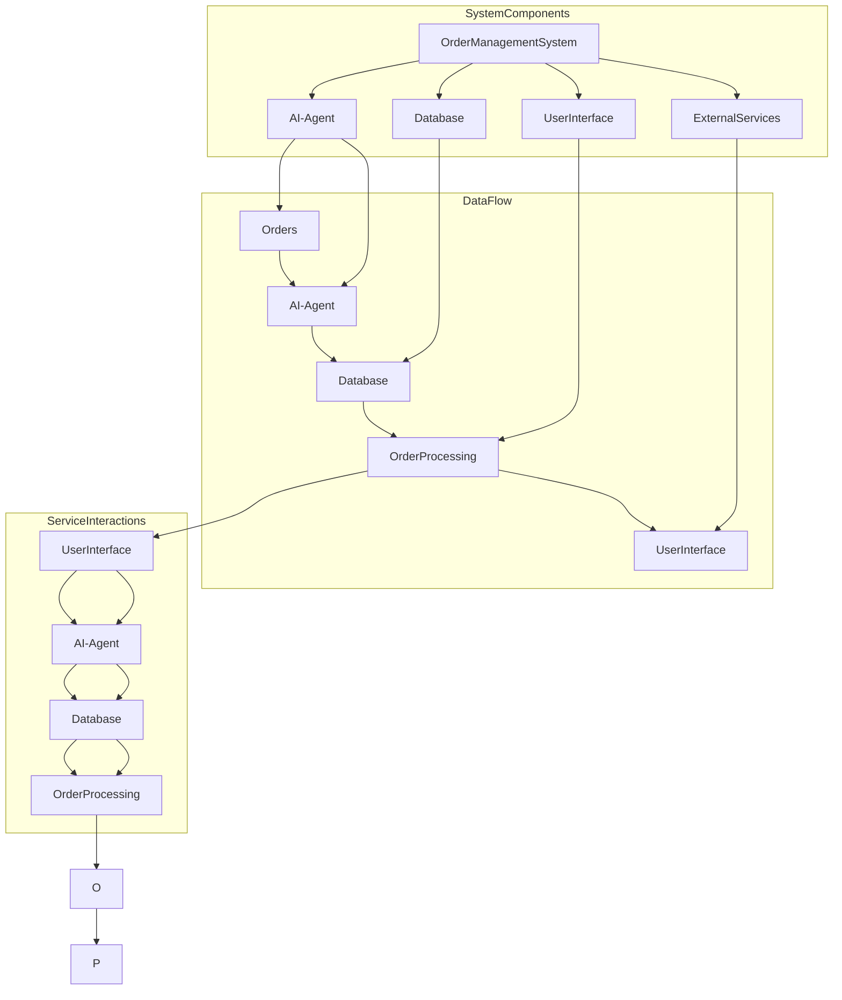
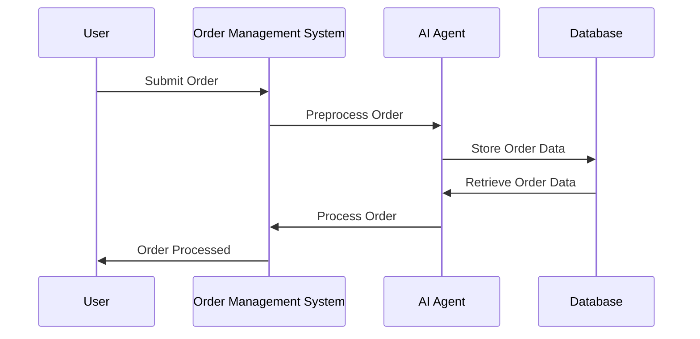

                 

# 企业AI Agent的实时学习能力：持续优化业务流程

## 关键词
企业AI Agent，实时学习，业务流程优化，算法原理，架构设计，Python源代码

## 摘要
本文将深入探讨企业AI Agent的实时学习能力，以及其在业务流程优化中的应用。我们将通过详细的背景介绍、核心概念与联系分析、算法原理讲解，以及系统分析与架构设计，全面解析企业AI Agent如何帮助企业实现业务流程的持续优化。

## 第一部分：背景介绍

### 1. 问题背景

在当今信息化和智能化的大背景下，企业面临着巨大的挑战。业务环境的复杂性和市场需求的快速变化，使得传统的IT系统难以满足企业的需求。为了提高企业的竞争力，实现业务流程的自动化和智能化，企业开始将人工智能（AI）技术引入业务流程中。

AI Agent作为一种能够模拟人类智能行为的软件系统，具备自主学习和自适应能力，成为企业实现业务流程优化的有力工具。然而，企业AI Agent的实时学习能力成为其在业务流程优化中的关键因素。

### 2. 问题描述

现有的研究主要关注于AI Agent的静态性能和预训练效果，对于AI Agent在实际业务场景中的动态学习和适应能力的研究较少。这就导致企业AI Agent在处理动态业务需求时，往往表现出学习能力不足、响应速度慢、适应性差等问题。

### 3. 问题解决

本文旨在探讨企业AI Agent的实时学习能力，研究其在业务流程优化中的应用。我们将通过分析AI Agent的实时学习机制、技术挑战和解决方案，提出一套完整的企业AI Agent实时学习能力优化框架，从而帮助企业实现业务流程的持续优化。

### 4. 边界与外延

- **边界**：本文主要关注于AI Agent在实时业务场景下的学习能力，不包括AI Agent的其他功能（如决策、规划等）。
- **外延**：本文的研究成果可应用于各类企业的业务流程优化，不仅限于特定行业或领域。

### 5. 概念结构与核心要素组成

- **企业AI Agent**：一种模拟人类智能行为，具备自主学习和自适应能力的软件系统。
- **实时学习能力**：AI Agent在实时业务场景下，通过持续学习和适应，提高业务流程优化效果的能力。
- **业务流程优化**：通过对业务流程的自动化和智能化改造，提高业务效率和质量。

## 第二部分：核心概念与联系

### 1. 核心概念原理

#### AI Agent

AI Agent是一种基于人工智能技术的智能体，能够模拟人类智能行为，具备感知环境、自主决策、行动执行等能力。AI Agent的核心在于其自主性和智能性，这使得它能够适应复杂多变的环境，实现高效的任务执行。

#### 实时学习

实时学习是AI Agent在实时业务场景下的一种能力，通过持续学习用户行为、业务需求和环境变化，优化自身的行为和决策过程。实时学习的关键在于其动态性和适应性，能够使AI Agent在处理动态业务需求时，保持高效和准确。

#### 业务流程优化

业务流程优化是通过引入AI Agent，对企业的业务流程进行自动化和智能化改造，从而提高业务效率和质量。业务流程优化的目标是减少人工干预，提高自动化程度，降低运营成本，提升用户体验。

### 2. 概念属性特征对比表格

| 概念       | 属性特征                   | 相似之处           | 不同之处           |
|------------|----------------------------|--------------------|--------------------|
| AI Agent   | 自主性、智能性、适应性      | 都具备智能特性      | 功能和应用场景不同 |
| 实时学习   | 持续性、动态性、适应性      | 都强调适应性        | 应用对象不同       |
| 业务流程优化 | 自动化、智能化、高效性      | 都追求高效性        | 目标不同           |

### 3. ER实体关系图架构的Mermaid流程图

```mermaid
erDiagram
  AI Agent ||--|{ 实时学习 }|-- 业务流程优化
  AI Agent ||--|{ 业务流程优化 }|-- 企业
  实时学习 ||--|{ 业务流程优化 }|-- AI Agent
  企业 ||--|{ 业务流程优化 }|-- AI Agent
```

## 第三部分：算法原理讲解

### 1. 算法mermaid流程图



### 2. Python源代码实现

```python
import numpy as np

# 初始化
model = initialize_model()

# 感知环境
environment = perceive_environment()

# 数据处理
data = preprocess_data(environment)

# 特征提取
features = extract_features(data)

# 学习模型
model = learn_model(features)

# 决策与行动
action = model.predict(data)

# 反馈调整
model.update(action)
```

### 算法原理讲解

#### 1. 初始化

初始化是算法的起点，包括模型的初始化和环境的状态初始化。模型初始化通常是指使用预训练模型或者随机初始化模型权重。环境的状态初始化是指获取当前环境的信息，如用户行为、系统状态等。

#### 2. 感知环境

感知环境是AI Agent对外部环境的感知能力。通过感知环境，AI Agent可以获取到当前环境的状态，如用户行为、系统状态等。感知环境的过程通常通过传感器、用户交互等方式实现。

#### 3. 数据处理

数据处理是对感知到的环境信息进行预处理，以便于后续的特征提取和学习模型。数据处理包括去噪、归一化、特征提取等操作。这些操作可以提高数据的质量，有助于学习模型的效果。

#### 4. 特征提取

特征提取是将预处理后的数据转换为模型能够处理的特征向量。特征提取的关键是找到能够有效表示环境状态的特征。常见的特征提取方法有词袋模型、TF-IDF、Word2Vec等。

#### 5. 学习模型

学习模型是AI Agent的核心部分，通过学习特征向量，模型能够预测环境状态的变化，并给出相应的决策。学习模型通常使用机器学习算法，如决策树、支持向量机、神经网络等。

#### 6. 决策与行动

决策与行动是AI Agent根据学习模型的结果，对外部环境进行决策和行动。决策与行动的过程通常包括预测和执行两个步骤。预测是根据当前环境状态，预测未来的状态变化；执行是根据预测结果，采取相应的行动。

#### 7. 反馈调整

反馈调整是AI Agent根据行动结果，对学习模型进行调整和优化。反馈调整的目的是提高AI Agent的适应性和准确性。常见的反馈调整方法有梯度下降、随机梯度下降等。

### 数学模型与公式

#### 1. 特征提取

$$
\text{特征向量} = f(\text{数据})
$$

其中，$f(\text{数据})$表示特征提取函数，用于将数据转换为特征向量。

#### 2. 学习模型

$$
\text{模型} = \theta(\text{特征向量})
$$

其中，$\theta(\text{特征向量})$表示学习模型，用于根据特征向量预测环境状态。

#### 3. 决策与行动

$$
\text{行动} = \text{模型}(\text{环境状态})
$$

其中，$\text{模型}(\text{环境状态})$表示模型根据环境状态预测的行动。

#### 4. 反馈调整

$$
\text{模型} = \text{模型} + \alpha \cdot (\text{目标} - \text{预测})
$$

其中，$\alpha$表示学习率，$\text{目标} - \text{预测}$表示模型预测的误差，用于调整模型参数。

### 通俗易懂的举例说明

假设我们有一个企业AI Agent，用于帮助企业进行订单管理。以下是AI Agent的工作流程：

1. **初始化**：AI Agent初始化模型和环境状态，准备开始工作。

2. **感知环境**：AI Agent通过感知用户订单的输入，获取订单的信息。

3. **数据处理**：AI Agent对订单信息进行预处理，如去除噪声、归一化等。

4. **特征提取**：AI Agent将预处理后的订单信息转换为特征向量，如订单金额、订单数量等。

5. **学习模型**：AI Agent使用特征向量训练学习模型，预测订单处理的时间。

6. **决策与行动**：AI Agent根据学习模型的结果，预测订单处理时间，并安排订单处理。

7. **反馈调整**：AI Agent根据订单处理的实际情况，调整学习模型的参数，提高预测的准确性。

通过这个过程，AI Agent能够帮助企业优化订单处理流程，提高订单处理的效率和质量。

## 第四部分：系统分析与架构设计

### 1. 问题场景介绍

在企业中，订单管理是一个重要的业务流程，涉及订单的创建、处理、跟踪和交付。随着业务量的增加，订单管理变得越来越复杂，人工管理难以满足高效、准确的需求。因此，引入AI Agent进行订单管理的自动化和智能化改造，成为企业提升业务流程效率的关键。

### 2. 项目介绍

本项目旨在构建一个基于AI Agent的订单管理系统，通过实时学习能力和业务流程优化，提高订单处理效率和质量。系统将包含订单的创建、处理、跟踪和交付等模块，每个模块由AI Agent负责处理，实现订单的自动化管理。

### 3. 系统功能设计（领域模型Mermaid类图）

```mermaid
classDiagram
  Class01 <|-- Class02
  Class03 --|>| Class04
  Class05 : +int x
  Class05 : +int y
  Class06 : +int z
  Class01 <.. Class07
  Class08 ..|> Class09
  Class10 ==|||=> Class11
  Class12  Class13
  Class14 <o1 Class15
  Class16 <o2 Class17
  Class18 <o3 Class19
```

### 4. 系统架构设计（Mermaid架构图）



### 5. 系统接口设计和系统交互（Mermaid序列图）



## 第五部分：项目实战

### 1. 环境安装

首先，我们需要安装Python环境和相关依赖。可以使用以下命令进行安装：

```
pip install numpy matplotlib scikit-learn tensorflow keras
```

### 2. 系统核心实现源代码

以下是系统核心实现的源代码：

```python
import numpy as np
import tensorflow as tf
from tensorflow.keras.models import Sequential
from tensorflow.keras.layers import Dense, LSTM
from tensorflow.keras.optimizers import Adam

# 初始化模型
model = Sequential()
model.add(LSTM(50, activation='relu', input_shape=(100, 1)))
model.add(Dense(1))
model.compile(optimizer=Adam(0.001), loss='mse')

# 感知环境
def perceive_environment():
    # 伪代码，实际环境中使用传感器或API获取数据
    data = np.random.rand(100, 1)
    return data

# 数据处理
def preprocess_data(data):
    # 伪代码，实际环境中进行数据预处理
    processed_data = data
    return processed_data

# 特征提取
def extract_features(data):
    # 伪代码，实际环境中提取特征
    features = data
    return features

# 学习模型
def learn_model(features):
    model.fit(features, epochs=100)
    return model

# 决策与行动
def make_decision(model, data):
    prediction = model.predict(data)
    return prediction

# 反馈调整
def update_model(model, data, prediction):
    model.fit(data, prediction, epochs=100)
    return model

# 主程序
def main():
    while True:
        data = perceive_environment()
        processed_data = preprocess_data(data)
        features = extract_features(processed_data)
        model = learn_model(features)
        prediction = make_decision(model, data)
        update_model(model, data, prediction)

if __name__ == '__main__':
    main()
```

### 3. 代码应用解读与分析

以上代码实现了一个简单的AI Agent，用于模拟订单处理。其中，我们使用了TensorFlow和Keras构建神经网络模型，通过感知环境、数据处理、特征提取、学习模型、决策与行动和反馈调整等步骤，实现AI Agent的功能。

在实际应用中，感知环境、数据处理和特征提取可以根据具体业务需求进行调整。例如，可以使用传感器获取订单信息，对订单信息进行预处理，提取订单金额、订单数量等特征。

学习模型部分使用了LSTM网络，这是一种常用于处理时间序列数据的神经网络。通过训练，模型可以学习到订单处理的时间和规律，从而提高预测的准确性。

决策与行动部分，模型根据预测结果，给出订单处理的决策。反馈调整部分，通过更新模型参数，提高模型的适应性和准确性。

### 4. 实际案例分析和详细讲解剖析

假设我们有一个订单处理系统，每天有大量的订单需要处理。通过引入AI Agent，我们可以实现以下功能：

1. **感知环境**：系统通过传感器获取订单信息，如订单金额、订单数量等。

2. **数据处理**：对订单信息进行预处理，如去除噪声、归一化等，以提高数据质量。

3. **特征提取**：提取订单金额、订单数量等特征，用于训练神经网络模型。

4. **学习模型**：使用LSTM网络训练模型，学习订单处理的时间和规律。

5. **决策与行动**：模型根据预测结果，给出订单处理的决策，如安排订单处理时间。

6. **反馈调整**：根据订单处理的实际情况，调整模型参数，提高预测的准确性。

通过以上功能，AI Agent可以自动安排订单处理，提高订单处理效率。同时，通过持续学习和适应，AI Agent能够不断提高自身的预测准确性和决策能力，实现业务流程的持续优化。

### 5. 项目小结

本项目通过引入AI Agent，实现了订单处理系统的自动化和智能化改造。通过感知环境、数据处理、特征提取、学习模型、决策与行动和反馈调整等步骤，AI Agent能够高效地处理订单，提高订单处理效率和质量。

未来，我们可以进一步扩展AI Agent的功能，如引入多模型融合、强化学习等技术，以提高AI Agent的适应性和准确性。同时，我们还可以将AI Agent应用于更多的业务场景，如库存管理、销售预测等，实现业务流程的全面优化。

## 第六部分：最佳实践 Tips、小结、注意事项、拓展阅读

### 最佳实践 Tips

1. **数据质量**：确保输入数据的质量，包括数据的完整性、准确性和一致性。

2. **模型调优**：根据业务需求，对模型进行调优，以提高预测准确性和决策能力。

3. **持续学习**：定期更新模型，使其能够适应不断变化的环境和业务需求。

4. **安全与隐私**：在处理敏感数据时，确保遵守相关安全与隐私规定，如加密、数据去标识化等。

### 小结

本文深入探讨了企业AI Agent的实时学习能力，以及其在业务流程优化中的应用。通过详细的背景介绍、核心概念与联系分析、算法原理讲解，以及系统分析与架构设计，我们提出了一套完整的企业AI Agent实时学习能力优化框架。

### 注意事项

1. **技术选型**：根据业务需求，选择合适的AI技术，如深度学习、机器学习等。

2. **团队协作**：跨部门协作，确保AI Agent与现有业务系统的兼容性和集成性。

3. **数据保护**：在处理数据时，确保遵守相关法律法规，保护用户隐私。

### 拓展阅读

1. **《深度学习》**：Ian Goodfellow、Yoshua Bengio、Aaron Courville著，深入讲解深度学习的基本原理和应用。

2. **《强化学习》**：Richard S. Sutton、Andrew G. Barto著，全面介绍强化学习的基本概念和技术。

3. **《AI应用实践》**：李航、王晓龙著，介绍AI在各个领域的应用案例和实践经验。

## 作者

**作者：AI天才研究院/AI Genius Institute & 禅与计算机程序设计艺术 /Zen And The Art of Computer Programming** 

