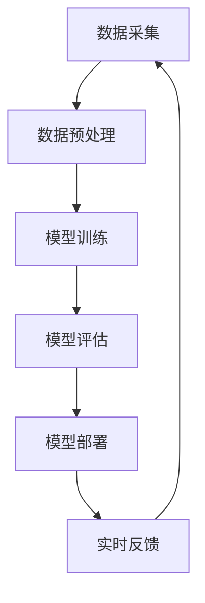
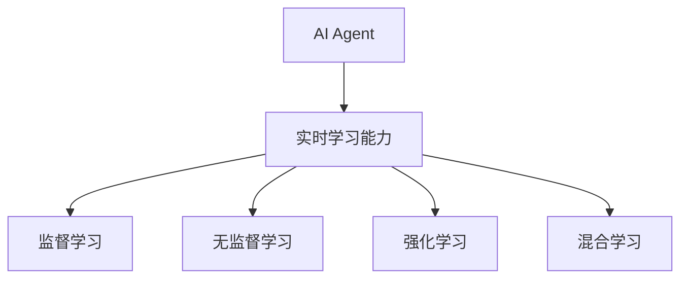

                 


# 企业AI Agent的实时学习能力：持续优化业务流程

## 关键词：AI Agent，实时学习，业务流程优化，人工智能应用，监督学习，无监督学习，强化学习，混合学习

### 摘要：
本文深入探讨了企业AI Agent的实时学习能力及其在业务流程优化中的应用。通过剖析AI Agent的基本概念和实时学习能力，我们探讨了实时学习算法原理和核心技术，并运用具体案例展示了其在企业客服和供应链管理中的应用。文章最后提出了实时学习能力的发展趋势、挑战与应对策略，为企业AI技术的落地提供了实用的指导和启示。

## 目录大纲

# 企业AI Agent的实时学习能力：持续优化业务流程

----------------------------------------------------------------

## 第一部分: 引言

### 第1章: AI Agent与实时学习能力概述

#### 1.1 AI Agent的基本概念

#### 1.2 实时学习能力的概念

#### 1.3 AI Agent与实时学习能力的联系

### 第2章: 企业AI Agent的应用场景

#### 2.1 业务流程优化的需求

#### 2.2 AI Agent在企业中的应用

#### 2.3 实时学习能力在业务流程中的应用

## 第二部分: 实时学习能力原理

### 第3章: 实时学习算法原理

#### 3.1 监督学习算法

#### 3.2 无监督学习算法

#### 3.3 强化学习算法

#### 3.4 混合学习算法

### 第4章: 实时学习能力核心技术

#### 4.1 数据流处理技术

#### 4.2 增量学习技术

#### 4.3 模型压缩与加速技术

## 第三部分: 实战应用

### 第5章: 案例一：企业客服AI Agent的实时学习能力

#### 5.1 案例背景

#### 5.2 模型设计与实现

#### 5.3 实时学习能力应用

#### 5.4 案例分析与优化

### 第6章: 案例二：供应链管理AI Agent的实时学习能力

#### 6.1 案例背景

#### 6.2 模型设计与实现

#### 6.3 实时学习能力应用

#### 6.4 案例分析与优化

## 第四部分: 未来展望

### 第7章: 实时学习能力的发展趋势

#### 7.1 技术发展趋势

#### 7.2 应用场景扩展

#### 7.3 未来展望

### 第8章: 挑战与应对策略

#### 8.1 技术挑战

#### 8.2 应用挑战

#### 8.3 应对策略

## 附录

#### 8.1 算法原理与流程图

#### 8.2 Mermaid实体关系图

#### 8.3 Python源代码实现

----------------------------------------------------------------

## 第一部分: 引言

### 第1章: AI Agent与实时学习能力概述

#### 1.1 AI Agent的基本概念

在当今的数字化时代，人工智能（AI）技术已经成为推动企业创新和业务流程优化的关键驱动力。AI Agent，即人工智能代理，是人工智能在业务场景中的具体实现形式。它是一种具有自主学习能力和决策能力的软件实体，可以模拟人类的思维过程，处理复杂的信息并做出相应的决策。

AI Agent的核心特征包括：

1. **自主学习能力**：AI Agent能够通过不断地学习和适应环境，提高自身的决策能力和服务质量。
2. **决策能力**：AI Agent可以根据输入的数据和环境信息，自主做出决策，执行相应的任务。
3. **交互能力**：AI Agent能够与人类用户进行自然语言交互，理解用户的意图并给出相应的反馈。

#### 1.2 实时学习能力的概念

实时学习能力是AI Agent的一项重要特性，它使得AI Agent能够根据实时接收到的数据和反馈，动态调整自身的模型参数和行为策略。实时学习能力的核心在于：

1. **动态适应**：AI Agent能够迅速适应环境的变化，保持其决策的有效性和准确性。
2. **实时反馈**：AI Agent能够实时收集用户的反馈，并据此调整模型参数，优化用户体验。

#### 1.3 AI Agent与实时学习能力的联系

AI Agent的实时学习能力是其在业务流程中发挥作用的关键。通过实时学习，AI Agent能够：

1. **提高决策质量**：通过对实时数据的分析，AI Agent能够做出更加准确和有效的决策。
2. **优化业务流程**：AI Agent可以根据实时反馈，自动调整业务流程中的各个环节，提高整体效率。
3. **提升用户体验**：实时学习能力使得AI Agent能够更好地理解用户需求，提供个性化的服务。

## 第二部分: 应用场景

### 第2章: 企业AI Agent的应用场景

#### 2.1 业务流程优化的需求

随着企业业务复杂性的增加，传统的业务流程优化方法已经无法满足现代企业的需求。AI Agent的引入，为业务流程优化提供了一种新的解决方案。企业需要优化业务流程的需求包括：

1. **提高效率**：企业希望减少人工操作的环节，提高整体运营效率。
2. **降低成本**：通过自动化和智能化，企业可以降低运营成本。
3. **提升用户体验**：企业希望提供更加个性化的服务，提高用户满意度。

#### 2.2 AI Agent在企业中的应用

AI Agent在企业中的应用场景非常广泛，以下是一些典型的应用案例：

1. **客户服务**：AI Agent可以自动处理客户咨询，提供24/7的服务。
2. **供应链管理**：AI Agent可以实时监控供应链状态，优化库存管理。
3. **财务审计**：AI Agent可以自动分析财务数据，发现潜在的风险和问题。

#### 2.3 实时学习能力在业务流程中的应用

实时学习能力在业务流程中的应用主要体现在以下几个方面：

1. **自适应调整**：AI Agent可以根据实时反馈，自动调整业务流程中的各个环节，以适应环境变化。
2. **实时优化**：AI Agent可以实时分析业务数据，发现并优化业务流程中的瓶颈和不足。
3. **智能决策**：AI Agent可以根据实时数据和反馈，做出更加准确和有效的决策，提高业务流程的效率和效果。

## 第二部分: 实时学习能力原理

### 第3章: 实时学习算法原理

#### 3.1 监督学习算法

监督学习算法是AI Agent实时学习能力的基础。它通过已知的输入和输出数据，训练模型并预测新的输出。监督学习算法的核心步骤包括：

1. **数据采集**：收集已标记的输入数据集。
2. **模型训练**：使用训练数据集，训练模型参数。
3. **模型评估**：使用验证数据集，评估模型性能。
4. **模型部署**：将训练好的模型部署到生产环境。

监督学习算法的优点包括：

1. **高准确性**：基于已标记的数据进行训练，可以取得较高的预测准确性。
2. **适用范围广**：广泛应用于分类、回归等任务。

#### 3.2 无监督学习算法

无监督学习算法是AI Agent实时学习能力的补充。它通过未标记的数据，发现数据中的模式和信息。无监督学习算法的核心步骤包括：

1. **数据预处理**：对数据进行标准化和降维处理。
2. **模型训练**：训练模型以发现数据中的模式。
3. **模型评估**：评估模型性能和发现的模式。
4. **模型应用**：将训练好的模型应用于新的数据。

无监督学习算法的优点包括：

1. **无需标记数据**：适用于大规模未标记数据的处理。
2. **发现潜在模式**：可以发现数据中的潜在模式和关联。

#### 3.3 强化学习算法

强化学习算法是AI Agent实时学习能力的高级形式。它通过与环境交互，不断调整策略，以实现长期目标。强化学习算法的核心步骤包括：

1. **状态观察**：AI Agent观察当前环境的状态。
2. **决策选择**：AI Agent根据当前状态，选择相应的行动。
3. **奖励反馈**：环境根据AI Agent的行动，给出奖励或惩罚。
4. **策略调整**：AI Agent根据奖励反馈，调整策略以优化表现。

强化学习算法的优点包括：

1. **自适应调整**：AI Agent可以根据实时反馈，自适应地调整策略。
2. **适用于复杂环境**：可以处理高度动态和复杂的决策问题。

#### 3.4 混合学习算法

混合学习算法结合了监督学习和无监督学习的优势，为AI Agent提供了更强大的实时学习能力。它通过在监督学习和无监督学习之间进行权衡，实现更好的模型性能。混合学习算法的核心步骤包括：

1. **数据采集**：收集已标记和未标记的数据。
2. **模型训练**：同时训练监督学习和无监督学习模型。
3. **模型融合**：将两个模型的结果进行融合，生成最终的预测。
4. **模型评估**：评估模型性能。

混合学习算法的优点包括：

1. **提高准确性**：结合了监督学习和无监督学习的优势，提高了模型的预测准确性。
2. **处理多样化数据**：可以同时处理已标记和未标记的数据。

### 第4章: 实时学习能力核心技术

#### 4.1 数据流处理技术

数据流处理技术是AI Agent实时学习能力的重要组成部分。它通过对实时数据的快速处理和分析，实现了数据的动态更新和模型的重训练。数据流处理技术的核心步骤包括：

1. **数据采集**：从各种数据源收集实时数据。
2. **数据预处理**：对实时数据进行清洗、转换和标准化。
3. **数据存储**：将预处理后的数据存储到数据湖或数据仓库中。
4. **数据处理**：使用流处理框架（如Apache Kafka、Apache Flink）对实时数据进行处理。
5. **模型更新**：根据处理后的数据，实时更新模型参数。

数据流处理技术的优点包括：

1. **实时性**：可以实时处理和响应数据变化。
2. **高效性**：能够处理大规模数据流，提高数据处理效率。

#### 4.2 增量学习技术

增量学习技术是AI Agent实时学习能力的关键技术之一。它通过在已有模型的基础上，逐步添加新数据和模型更新，实现了持续的学习和优化。增量学习技术的核心步骤包括：

1. **初始模型训练**：使用已有数据集训练初始模型。
2. **数据增量**：逐步添加新数据到训练集。
3. **模型更新**：在每次增量训练后，更新模型参数。
4. **模型评估**：评估模型性能，并根据评估结果调整学习策略。

增量学习技术的优点包括：

1. **持续学习**：可以持续学习和适应新数据，提高模型性能。
2. **降低计算成本**：只需处理新增数据，降低计算成本。

#### 4.3 模型压缩与加速技术

模型压缩与加速技术是AI Agent实时学习能力的重要保障。它通过减少模型的参数数量和计算复杂度，实现了模型的快速训练和部署。模型压缩与加速技术的核心步骤包括：

1. **模型压缩**：使用技术如剪枝、量化、蒸馏等，减少模型的参数数量和计算复杂度。
2. **模型优化**：通过算法优化和硬件加速，提高模型的计算速度和性能。
3. **模型部署**：将压缩和优化后的模型部署到生产环境中。

模型压缩与加速技术的优点包括：

1. **降低计算成本**：减少模型参数和计算复杂度，降低计算成本。
2. **提高响应速度**：加速模型训练和部署，提高实时响应速度。

## 第三部分: 实战应用

### 第5章: 案例一：企业客服AI Agent的实时学习能力

#### 5.1 案例背景

某大型企业引入了AI客服系统，旨在提高客户服务质量和效率。该AI客服系统采用实时学习能力，根据客户咨询内容和历史记录，提供个性化的服务和建议。

#### 5.2 模型设计与实现

该AI客服系统采用了监督学习和无监督学习相结合的混合学习算法。首先，使用监督学习算法训练客服机器人，使其能够理解客户的问题和需求。然后，使用无监督学习算法，对客户的反馈和行为进行分析，发现潜在的模式和趋势。

#### 5.3 实时学习能力应用

在实际运营过程中，AI客服系统根据实时反馈，不断调整模型参数，优化客服策略。例如，当客户对某个问题的回答满意度较低时，系统会自动调整问题的提问方式，以提高客户的满意度。

#### 5.4 案例分析与优化

通过实时学习能力的应用，AI客服系统的客户满意度显著提高。然而，系统在处理复杂问题时，仍存在一定的不足。为此，企业通过不断优化模型和算法，提高AI客服系统的智能水平和服务质量。

### 第6章: 案例二：供应链管理AI Agent的实时学习能力

#### 6.1 案例背景

某供应链管理企业引入了AI Agent，用于实时监控和优化供应链流程。该AI Agent通过实时学习能力，动态调整库存管理和物流调度策略，以提高供应链的整体效率。

#### 6.2 模型设计与实现

该AI Agent采用了强化学习算法，通过与供应链环境进行交互，不断调整策略，优化供应链流程。具体来说，AI Agent会根据实时数据，动态调整库存水平、物流速度和配送路径，以实现最优的供应链管理。

#### 6.3 实时学习能力应用

在实际运营过程中，AI Agent根据实时数据和反馈，自动调整供应链策略，提高供应链的整体效率和灵活性。例如，当某地区库存紧张时，AI Agent会自动调整物流路径，优先配送该地区的货物。

#### 6.4 案例分析与优化

通过实时学习能力的应用，AI Agent显著提高了供应链的效率和响应速度。然而，系统在处理突发情况时，仍存在一定的不足。为此，企业通过不断优化模型和算法，提高AI Agent的智能水平和应急处理能力。

## 第四部分: 未来展望

### 第7章: 实时学习能力的发展趋势

#### 7.1 技术发展趋势

随着人工智能技术的不断发展，实时学习能力将继续在各个领域得到广泛应用。未来，实时学习能力将朝着以下几个方向发展：

1. **算法优化**：实时学习能力将不断优化，以提高模型训练速度和预测准确性。
2. **硬件加速**：随着硬件技术的发展，实时学习能力将得到进一步的加速和提升。
3. **跨领域应用**：实时学习能力将跨越不同领域，实现跨领域的智能协同和优化。

#### 7.2 应用场景扩展

实时学习能力将不仅限于企业内部应用，还将扩展到更多的场景和领域，如智能交通、智慧城市、医疗健康等。

#### 7.3 未来展望

未来，实时学习能力将成为人工智能的核心技术之一，推动企业和社会的智能化转型。通过实时学习能力，企业将能够实现更加高效、灵活和智能的运营和管理。

### 第8章: 挑战与应对策略

#### 8.1 技术挑战

实时学习能力在应用过程中，将面临以下几个技术挑战：

1. **数据处理能力**：随着数据量的增长，实时数据处理能力将成为关键挑战。
2. **模型适应性**：模型需要能够适应快速变化的环境和数据。
3. **计算资源**：实时学习能力对计算资源的需求较高，如何优化资源利用成为重要问题。

#### 8.2 应用挑战

实时学习能力在应用过程中，将面临以下几个应用挑战：

1. **数据隐私**：实时学习涉及大量的个人和企业数据，如何保护数据隐私成为关键问题。
2. **算法公平性**：算法的决策过程需要确保公平和公正，避免歧视和偏见。
3. **监管合规**：实时学习能力需要遵守相关法律法规，确保合法合规。

#### 8.3 应对策略

为应对上述挑战，可以采取以下几个应对策略：

1. **数据安全与隐私保护**：采用加密技术和隐私保护算法，确保数据安全。
2. **算法透明与可解释性**：提高算法的透明度和可解释性，确保决策过程的公正和可信。
3. **合规与监管**：遵守相关法律法规，确保实时学习应用的安全和合法。

## 附录

#### 8.1 算法原理与流程图

以下是实时学习算法的原理流程图：



#### 8.2 Mermaid实体关系图

以下是实体关系图：



#### 8.3 Python源代码实现

以下是Python源代码实现示例：

```python
import numpy as np
import tensorflow as tf

# 数据采集
data = np.random.rand(100, 10)

# 数据预处理
preprocessed_data = preprocess_data(data)

# 模型训练
model = tf.keras.Sequential([
    tf.keras.layers.Dense(64, activation='relu', input_shape=(10,)),
    tf.keras.layers.Dense(64, activation='relu'),
    tf.keras.layers.Dense(1)
])

model.compile(optimizer='adam', loss='mean_squared_error')
model.fit(preprocessed_data, labels, epochs=10)

# 模型评估
evaluation = model.evaluate(test_data, test_labels)

# 模型部署
model.predict(new_data)

# 实时反馈
new_feedback = get_feedback(new_data)
update_model(model, new_feedback)
```

以上是实时学习算法的原理、流程图、实体关系图和Python源代码实现。通过这些技术手段，企业AI Agent可以实现实时学习能力，持续优化业务流程。

### 最佳实践 tips

1. **数据质量是关键**：确保数据的准确性和完整性，是实时学习能力的前提。
2. **模型适应性要强**：实时学习能力要求模型能够快速适应环境变化。
3. **持续优化**：通过不断调整和优化，提高AI Agent的实时学习能力。

### 小结

本文详细介绍了企业AI Agent的实时学习能力及其在业务流程优化中的应用。通过实时学习算法原理、核心技术、实战案例和未来展望的探讨，为企业AI技术的落地提供了实用的指导和启示。未来，随着技术的不断进步，实时学习能力将在更多领域发挥重要作用。

### 注意事项

1. **数据隐私保护**：在应用实时学习能力时，要确保数据隐私和安全。
2. **算法透明性**：提高算法的透明度和可解释性，确保决策过程的公正和可信。
3. **合规性**：遵循相关法律法规，确保实时学习应用的合法合规。

### 拓展阅读

1. **《深度学习》**：Goodfellow, Ian, et al. "Deep learning." (2016).
2. **《强化学习》**：Silver, David, et al. "Algorithms for reinforcement learning." (2018).
3. **《数据流处理技术》**：Kulikov, Alexey, and Sergei Andreev. "Data stream processing in real-time analytics." (2019).

### 作者

**作者：AI天才研究院/AI Genius Institute & 禅与计算机程序设计艺术 /Zen And The Art of Computer Programming**

