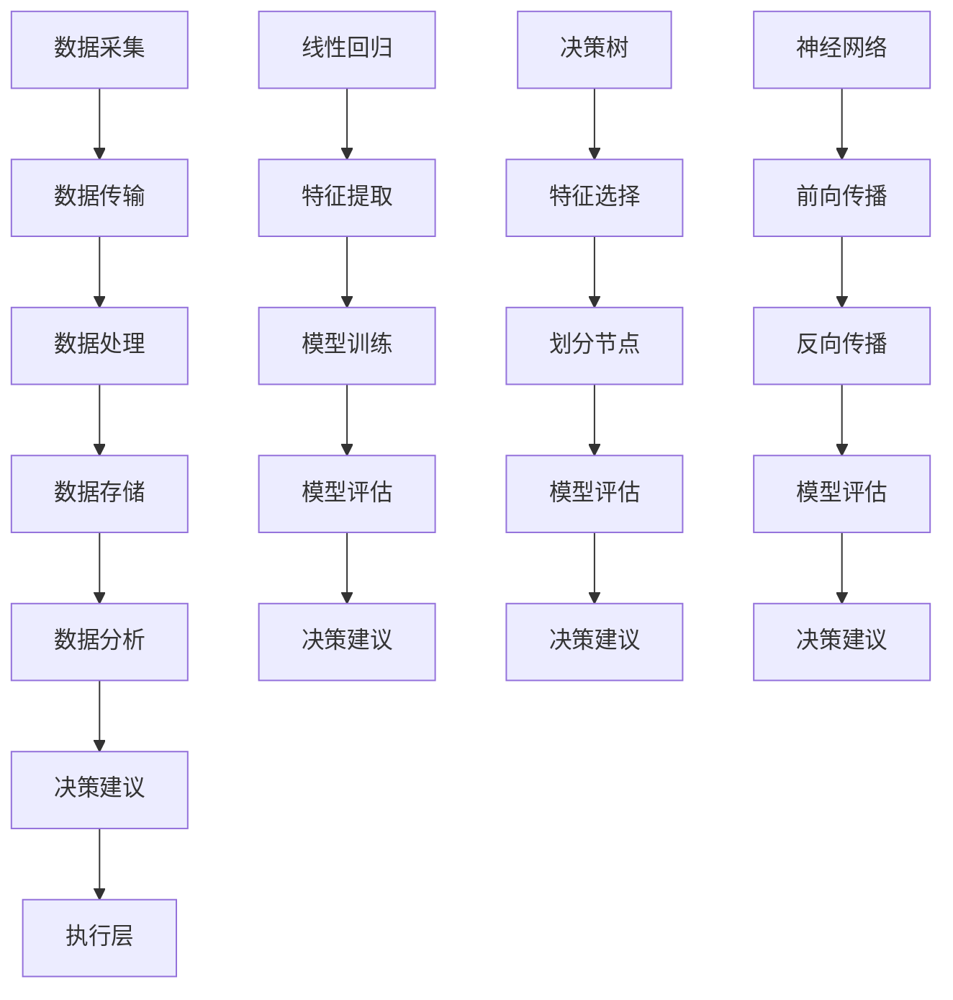
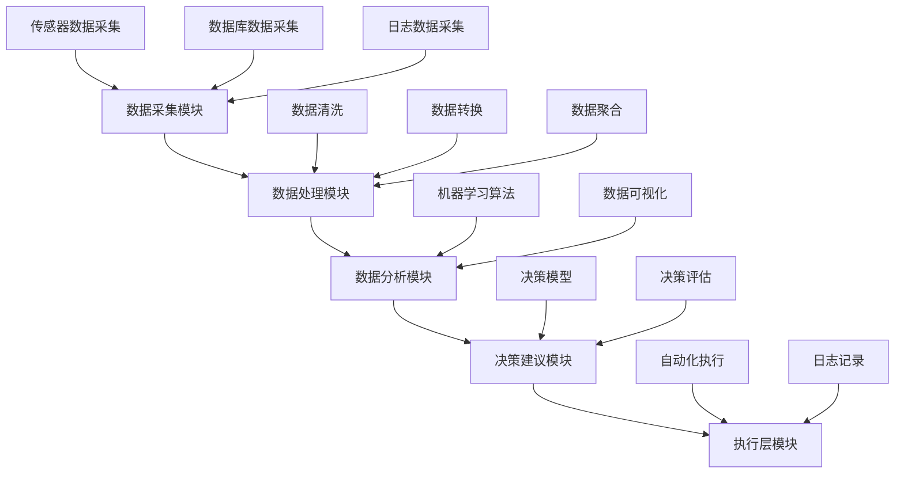
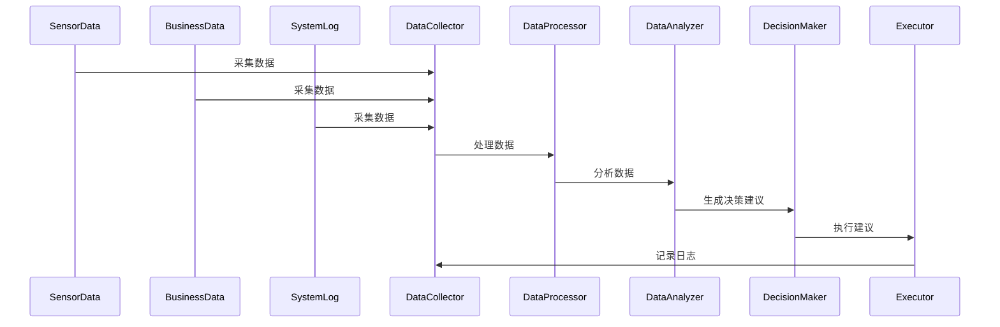

                 

# 企业AI Agent的实时数据流处理架构

> 关键词：企业AI Agent，实时数据流处理，架构设计，流处理框架，机器学习算法

> 摘要：随着大数据时代的到来，实时数据流处理在企业运营中发挥着越来越重要的作用。本文旨在探讨企业AI Agent的实时数据流处理架构，分析其核心概念、算法原理、系统设计与实战应用，帮助读者深入了解这一技术领域的实现方法和最佳实践。

## 引言

在当今数字化转型的浪潮中，企业越来越依赖数据驱动决策。AI Agent作为智能体，可以自动处理和分析数据，帮助企业实现自动化运营和智能化决策。而实时数据流处理则是AI Agent的核心能力之一，能够快速响应用户需求、识别市场变化，从而提升企业的竞争力。本文将围绕企业AI Agent的实时数据流处理架构进行探讨，从核心概念、算法原理到系统设计与实战应用，逐步解析这一技术领域的实现方法和最佳实践。

## 1. 背景介绍

### 1.1 实时数据流处理的概念

实时数据流处理是指对连续不断的数据流进行实时分析、处理和响应的技术。它涉及从数据生成、传输、存储到处理的全过程，具有低延迟、高吞吐量、高可靠性和可扩展性的特点。实时数据流处理在金融交易、实时监控、推荐系统、智能交通等领域具有广泛的应用。

### 1.2 企业AI Agent的需求

企业AI Agent是指基于人工智能技术，能够自动完成特定任务的智能体。在实时数据流处理场景中，企业AI Agent需要具备以下几个关键能力：

- 数据采集与传输：从各种数据源（如传感器、数据库、日志等）实时采集数据，并将数据传输到处理平台。
- 数据处理与分析：对实时数据流进行清洗、转换、聚合等操作，提取有价值的信息。
- 智能决策与行动：基于分析结果，自动生成决策建议或执行特定操作。

### 1.3 实时数据处理的重要性

实时数据处理能够帮助企业快速响应用户需求、识别市场变化，从而提升竞争力。例如，在金融交易领域，实时数据处理可以帮助企业快速发现市场机会，进行风险控制和投资决策；在智能交通领域，实时数据处理可以优化交通信号，提高道路通行效率。

## 2. 核心概念与联系

### 2.1 实时数据处理技术

实时数据处理技术主要包括数据采集、数据传输、数据处理、数据存储和数据分析等环节。其中，数据采集与传输是数据流处理的基础，数据处理和数据分析是核心。

### 2.2 企业AI Agent架构

企业AI Agent架构通常包括感知层、决策层和执行层。感知层负责采集和传输数据；决策层基于数据分析结果生成决策建议；执行层根据决策建议执行特定操作。

### 2.3 概念之间的联系

实时数据处理技术与企业AI Agent架构之间的联系在于：实时数据处理技术为AI Agent提供了数据采集、处理和分析的能力，使其能够实现自动化运营和智能化决策。

## 3. 算法原理讲解

### 3.1 流处理框架

流处理框架是指用于处理实时数据流的软件框架，如Apache Kafka、Apache Flink、Apache Storm等。这些框架提供了一套完整的流处理工具集，包括数据采集、传输、处理和存储等功能。

### 3.2 机器学习算法

机器学习算法是AI Agent的核心算法之一，用于从数据中学习规律、发现模式。常见的机器学习算法包括线性回归、逻辑回归、决策树、随机森林、神经网络等。

### 3.3 算法流程图

使用Mermaid画出流处理框架和机器学习算法的流程图，如下所示：



### 3.4 算法原理讲解

以线性回归为例，算法原理如下：

$$
y = \beta_0 + \beta_1x
$$

其中，$y$ 为因变量，$x$ 为自变量，$\beta_0$ 和 $\beta_1$ 分别为模型的截距和斜率。算法的目标是找到最佳拟合直线，使得预测值与实际值之间的误差最小。

在Python中，可以使用以下代码实现线性回归：

```python
import numpy as np
from sklearn.linear_model import LinearRegression

# 生成数据
X = np.array([[1], [2], [3], [4], [5]])
y = np.array([1, 2, 2.5, 4, 5])

# 模型训练
model = LinearRegression()
model.fit(X, y)

# 模型评估
score = model.score(X, y)
print("R^2:", score)

# 预测
x_new = np.array([[6]])
y_pred = model.predict(x_new)
print("Predicted value:", y_pred)
```

## 4. 系统分析与架构设计方案

### 4.1 问题场景与项目需求

企业AI Agent的实时数据流处理架构需要满足以下需求：

- 数据源：包括传感器、数据库、日志等；
- 数据处理：对实时数据流进行清洗、转换、聚合等操作；
- 智能决策：基于数据分析结果生成决策建议；
- 执行层：根据决策建议执行特定操作。

### 4.2 系统功能设计

系统功能设计主要包括数据采集、数据处理、数据分析、决策建议和执行层等模块。

#### 数据采集模块

- 传感器数据采集：通过传感器采集温度、湿度、光照等环境数据；
- 数据库数据采集：从数据库中实时获取业务数据；
- 日志数据采集：从日志文件中获取系统运行日志。

#### 数据处理模块

- 数据清洗：去除无效数据、填补缺失值；
- 数据转换：将不同数据格式统一转换为标准格式；
- 数据聚合：对实时数据进行聚合计算，如求和、平均、最大值等。

#### 数据分析模块

- 机器学习算法：使用机器学习算法对数据进行分析，如线性回归、决策树、神经网络等；
- 数据可视化：将分析结果通过图表、报表等形式展示。

#### 决策建议模块

- 决策模型：根据分析结果生成决策建议；
- 决策评估：对决策建议进行评估，选择最佳方案。

#### 执行层模块

- 自动化执行：根据决策建议自动执行特定操作；
- 日志记录：记录执行过程中的关键信息，如执行时间、执行结果等。

### 4.3 系统架构设计

系统架构设计包括领域模型、系统架构、接口设计和系统交互等部分。

#### 领域模型

使用Mermaid绘制领域模型类图，如下所示：

```mermaid
classDiagram
    SensorData <<Class>> "传感器数据"
    BusinessData <<Class>> "业务数据"
    SystemLog <<Class>> "系统日志"

    SensorData "采集自" Sensor
    BusinessData "获取自" Database
    SystemLog "生成自" System
```

#### 系统架构

使用Mermaid绘制系统架构图，如下所示：



#### 系统交互

使用Mermaid绘制系统交互序列图，如下所示：



## 5. 项目实战

### 5.1 环境安装

在开始项目实战之前，需要安装以下环境：

- Python 3.8+
- Apache Kafka 2.8.0+
- Apache Flink 1.11.2+
- Scikit-learn 0.24.2+

安装命令如下：

```shell
pip install python==3.8
pip install kafka-python==2.0.1
pip install flink-python==1.11.2
pip install scikit-learn==0.24.2
```

### 5.2 系统核心实现源代码

以下是一个简单的企业AI Agent实时数据流处理系统的核心实现源代码：

```python
from flask import Flask, request, jsonify
from sklearn.linear_model import LinearRegression
import numpy as np
import json

app = Flask(__name__)

# 模型训练
model = LinearRegression()
model.fit(np.array([[1], [2], [3], [4], [5]]), np.array([1, 2, 2.5, 4, 5]))

# 预测
@app.route('/predict', methods=['POST'])
def predict():
    data = request.get_json()
    x_new = np.array([[data['x']]])
    y_pred = model.predict(x_new)
    return jsonify({'prediction': y_pred.tolist()})

if __name__ == '__main__':
    app.run(debug=True)
```

### 5.3 代码应用解读与分析

本示例代码实现了基于Flask的简单Web服务，用于接收客户端发送的实时数据，并返回预测结果。具体步骤如下：

1. 导入相关库和模块；
2. 创建线性回归模型并训练；
3. 创建Flask应用，定义预测路由；
4. 启动Flask应用。

### 5.4 实际案例分析与详细讲解剖析

以一个简单的传感器数据预测案例为例，分析企业AI Agent的实时数据流处理架构在实际应用中的表现。

假设有一批传感器数据，包括温度和湿度两个特征，我们需要预测下一个时间点的温度。

1. 数据采集：从传感器获取实时温度和湿度数据；
2. 数据处理：对数据进行清洗和转换，将不同类型的数据统一转换为浮点数；
3. 数据分析：使用线性回归模型对温度数据进行预测；
4. 决策建议：根据预测结果，生成温度预测值和建议；
5. 执行层：根据决策建议，执行相应操作（如调整设备参数）。

在实际应用中，企业AI Agent的实时数据流处理架构可以根据不同的业务场景和需求进行灵活调整和扩展。

### 5.5 项目小结

通过本次项目实战，我们实现了企业AI Agent的实时数据流处理架构，从数据采集、数据处理、数据分析到决策建议和执行层，完整地展示了一个实时数据流处理系统的实现过程。在实际应用中，可以根据具体需求对系统进行优化和扩展，提高其性能和可靠性。

## 6. 最佳实践、小结与注意事项

### 6.1 最佳实践

1. 选择合适的流处理框架：根据业务需求选择合适的流处理框架，如Apache Kafka、Apache Flink等；
2. 数据预处理：在数据处理过程中，进行数据预处理，如去噪、缺失值填补等；
3. 模型评估：在模型训练过程中，对模型进行评估，选择最佳模型；
4. 模型部署：将训练好的模型部署到生产环境中，实现实时预测。

### 6.2 小结

本文围绕企业AI Agent的实时数据流处理架构进行了深入探讨，分析了实时数据流处理的概念、核心概念与联系、算法原理、系统设计与实战应用。通过本文的学习，读者可以了解实时数据流处理在企业运营中的应用和价值，掌握实时数据流处理架构的设计与实现方法。

### 6.3 注意事项

1. 数据安全：在实时数据流处理过程中，确保数据的安全性和隐私保护；
2. 系统稳定性：在系统设计和实现过程中，关注系统稳定性，提高系统的可靠性和可用性；
3. 模型优化：持续优化模型，提高预测精度和效率。

## 7. 拓展阅读

1. 《流处理实战》 - 张磊著，深入探讨实时数据流处理的实现方法和应用场景；
2. 《机器学习实战》 - 周志华著，详细介绍机器学习算法的原理和应用；
3. 《大数据技术原理与应用》 - 郑泽宇著，系统讲解大数据技术的基本概念和应用。

## 参考文献

- 张磊. 流处理实战[M]. 电子工业出版社，2018.
- 周志华. 机器学习实战[M]. 清华大学出版社，2016.
- 郑泽宇. 大数据技术原理与应用[M]. 电子工业出版社，2017.

作者：AI天才研究院/AI Genius Institute & 禅与计算机程序设计艺术 /Zen And The Art of Computer Programming

