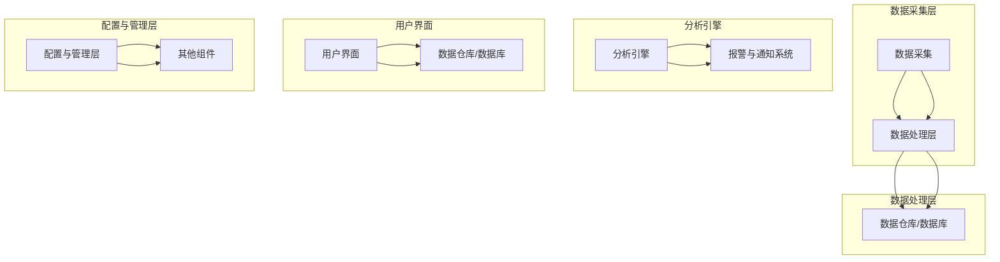
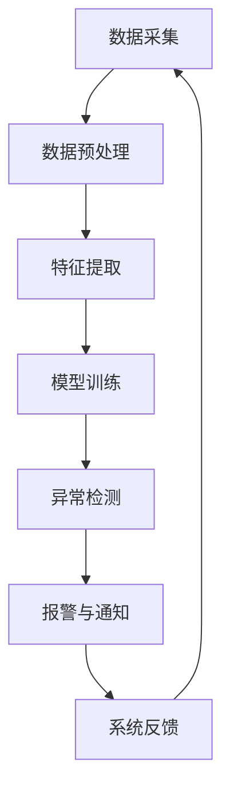
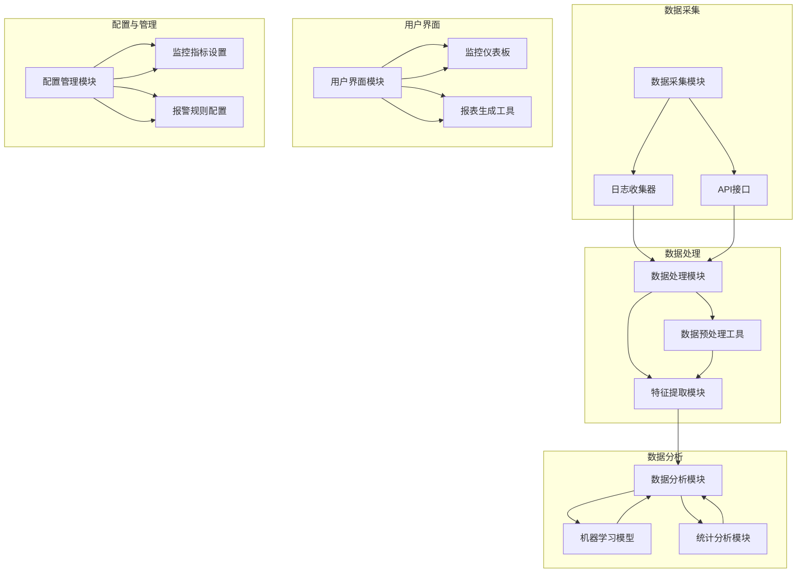
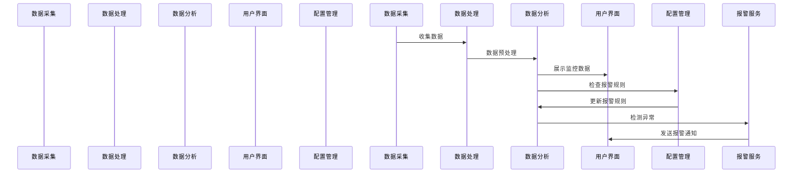

                 


### 引言与背景

#### 第1章: 引言

在现代企业运营中，人工智能（AI）正迅速成为推动业务创新和提升效率的关键驱动力。然而，随着AI系统的复杂度不断增加，如何确保这些AI系统的高效运行和稳定性，成为企业面临的重大挑战。特别是AI Agent——一种自动化执行特定任务的智能实体，其性能直接影响企业的运营效率和竞争力。

**问题背景**：
企业AI Agent的实时监控系统旨在确保AI Agent在各种运行环境中的稳定性和高效性。这个系统不仅需要实时监测AI Agent的性能指标，还需要在出现问题时能够快速响应，提供诊断和修复方案。

**问题描述**：
问题描述主要集中在如何设计并实现一个高效、稳定、可扩展的实时监控系统，以便对AI Agent进行全面监控和管理。具体问题包括：
- 监控哪些性能指标？
- 如何处理异常和错误？
- 如何确保监控系统的可扩展性？

**问题解决**：
本文章将围绕上述问题，通过系统的分析和设计，提出解决方案。首先，我们将探讨AI Agent和实时监控系统的基本概念，帮助读者建立整体框架。接下来，我们将深入分析实时监控系统架构，阐述其核心概念和组成组件。然后，我们将详细介绍监控系统的算法原理，包括机器学习算法和深度学习算法的应用。之后，我们将展示一个具体的系统设计与实现案例，涵盖从问题场景介绍到系统功能设计和架构设计的详细过程。最后，我们将分享最佳实践和注意事项，为企业的AI Agent实时监控系统提供实用指导。

**边界与外延**：
本文将重点关注企业内部AI Agent的实时监控系统，不涉及个人计算机或小型应用的监控方案。此外，本文将主要讨论监控系统的基础架构和算法原理，对于具体硬件实现和底层网络架构的设计将不做深入探讨。

通过本文的逐步分析，读者将能够理解企业AI Agent实时监控系统的重要性，掌握其核心概念和设计原则，并能够应用于实际项目中，提升企业的AI应用水平。

## 第2章: AI Agent与实时监控系统的基本概念

#### 2.1 AI Agent的定义与功能

AI Agent，即人工智能代理，是一种能够自主执行任务、与环境和用户互动的智能实体。其核心特点包括自主性、交互性和适应性。自主性指的是AI Agent能够根据内部模型和外部环境信息独立做出决策；交互性使其能够理解和响应人类的指令，并在特定情境下与其他系统或用户进行沟通；适应性则表现在其能够通过学习和优化不断改进任务执行的效果。

在功能方面，AI Agent可以应用于多种场景，包括但不限于：

1. **自动化任务执行**：例如，自动处理企业内部的日常事务，如邮件分类、文档处理等。
2. **智能客服**：通过自然语言处理和机器学习技术，提供24/7的客户服务。
3. **供应链优化**：根据实时数据动态调整库存策略，提高供应链效率。
4. **预测分析**：利用历史数据和市场趋势，为企业决策提供数据支持。

#### 2.2 实时监控系统的定义与重要性

实时监控系统是一种用于持续监测和分析系统运行状态的技术体系。它的核心功能是收集、处理和展示实时数据，以便快速识别潜在问题并提供解决方案。实时监控系统在企业AI Agent中的应用具有重要意义，主要体现在以下几个方面：

1. **性能优化**：通过实时监测AI Agent的性能指标，如响应时间、处理速度和资源利用率，可以帮助企业快速识别性能瓶颈，并进行优化。
2. **故障预警**：实时监控系统可以提前检测到系统异常，如过热、内存泄漏等，从而避免潜在故障和停机时间。
3. **故障恢复**：在异常发生时，实时监控系统可以迅速诊断问题并提供修复方案，减少故障对业务的影响。
4. **数据安全**：实时监控系统有助于确保AI Agent处理的数据安全，防止数据泄露和非法访问。

#### 2.3 AI Agent与实时监控系统的关系

AI Agent与实时监控系统之间存在密切的关系。实时监控系统为AI Agent提供了重要的支持和保障，两者相互依赖，共同作用，确保企业运营的高效性和稳定性。

1. **依赖关系**：
   - 实时监控系统依赖AI Agent的实际运行数据，如输入、输出和处理结果等，进行性能分析和故障诊断。
   - AI Agent的稳定运行依赖于实时监控系统的支持和保障，包括性能优化、故障预警和恢复等功能。

2. **互动机制**：
   - AI Agent通过与实时监控系统的交互，获取监控数据和反馈，调整自身行为和决策。
   - 实时监控系统通过持续监测AI Agent的运行状态，提供实时数据和分析结果，帮助AI Agent实现自我优化和提升。

3. **协同效应**：
   - AI Agent的智能决策与实时监控系统的快速响应相结合，可以大大提高企业的运营效率和响应速度。
   - 通过实时监控系统对AI Agent的全面监控和管理，企业可以更好地理解和利用AI技术，实现智能化运营。

综上所述，AI Agent与实时监控系统之间的密切关系不仅为企业提供了强大的技术支持，也为企业的数字化转型和智能化升级提供了坚实的基础。

### 第3章: 企业AI Agent实时监控系统架构

#### 3.1 AI Agent实时监控系统架构设计原则

企业AI Agent实时监控系统的架构设计需要遵循一系列原则，以确保系统的稳定性、可扩展性和高效性。以下是几个关键设计原则：

1. **模块化设计**：
   - 系统应采用模块化设计，将不同的功能模块分离，便于维护和扩展。每个模块应具有清晰的功能定义，并且能够独立运行和测试。
   
2. **分布式架构**：
   - 实时监控系统应采用分布式架构，以应对大规模AI Agent的监控需求。分布式架构可以提高系统的可扩展性，并确保在高负载情况下系统的高可用性。

3. **容错性设计**：
   - 系统应具备一定的容错性，能够在组件失效或网络故障时保持监控功能不受影响。例如，通过数据复制和冗余机制，确保关键数据的安全性和一致性。

4. **高效数据处理**：
   - 系统应具备高效的数据处理能力，能够快速收集、存储和分析大量实时监控数据。这通常需要采用高性能的数据库和计算框架。

5. **可观测性**：
   - 系统应提供良好的可观测性，包括日志记录、监控指标可视化和报警功能。这有助于快速识别和诊断系统问题，提高维护效率。

6. **安全性设计**：
   - 系统应具备严格的安全性措施，包括数据加密、访问控制和认证机制，确保监控数据和系统组件的安全性。

#### 3.2 AI Agent实时监控系统架构组成

AI Agent实时监控系统的架构由多个关键组件组成，每个组件在系统中扮演着特定的角色。以下是系统的主要组成部分：

1. **数据采集层**：
   - 负责从AI Agent和相关系统中收集运行数据，包括性能指标、日志信息和用户交互数据等。常用的数据采集工具包括传感器、API接口和日志收集器等。

2. **数据处理层**：
   - 负责对采集到的数据进行分析、处理和存储。数据处理层通常包括ETL（数据提取、转换和加载）工具、数据库和数据仓库等。这个层次中的数据预处理和特征工程对于后续的分析和建模至关重要。

3. **分析引擎**：
   - 负责对处理后的数据进行分析，识别潜在问题和异常情况。分析引擎通常采用机器学习和统计分析方法，可以实时监测AI Agent的运行状态，并提供预测和诊断功能。

4. **报警与通知系统**：
   - 负责在检测到异常或重要事件时，及时向相关人员发送警报和通知。通知系统可以采用多种方式，如邮件、短信和即时通讯工具等。

5. **用户界面**：
   - 提供监控数据和系统状态的可视化展示，便于用户实时了解AI Agent的运行状况。用户界面通常包括仪表板和报表生成工具。

6. **配置与管理层**：
   - 负责系统的配置和管理，包括监控指标的设置、报警规则的配置和系统权限管理等。这个层次确保了系统的灵活性和可定制性。

#### 3.3 AI Agent实时监控系统组件交互

AI Agent实时监控系统的各个组件之间通过明确的交互机制协同工作，以下是组件之间的交互关系：

1. **数据采集层与数据处理层**：
   - 数据采集层将收集到的数据通过API接口或其他数据传输机制发送到数据处理层。数据处理层对数据进行清洗、转换和存储，以便进一步分析。

2. **数据处理层与分析引擎**：
   - 数据处理层将处理后的数据存储到数据仓库或数据库中，分析引擎定期从这些数据源中提取数据，进行深度分析和建模。

3. **分析引擎与报警与通知系统**：
   - 分析引擎在分析过程中发现异常情况时，会触发报警与通知系统，向相关用户发送警报。报警系统可以基于预设的规则进行自动化处理。

4. **用户界面与监控数据源**：
   - 用户界面从数据仓库或数据库中获取监控数据，通过图表和报表等形式展示给用户，便于用户实时监控AI Agent的运行状态。

5. **配置与管理层与系统其他组件**：
   - 配置与管理层通过API或其他接口与系统其他组件进行交互，管理监控指标的设置、报警规则的配置和用户权限等。

通过这种紧密的交互机制，AI Agent实时监控系统实现了对AI Agent的全面监控和管理，确保系统的稳定性和高效性。各组件之间的数据流动和交互逻辑如下图所示：



以上架构设计原则和组件交互关系，为AI Agent实时监控系统的构建提供了坚实的理论基础和实施指南。在后续章节中，我们将进一步深入探讨各组件的具体实现方法和技术细节。

## 第4章: 核心概念与联系

#### 4.1 核心概念

在构建企业AI Agent实时监控系统时，理解以下几个核心概念至关重要：

1. **AI Agent**：
   - AI Agent是一种能够自主执行任务、与环境和用户互动的智能实体。其核心功能包括自动化任务执行、智能决策和预测分析等。

2. **实时监控**：
   - 实时监控是指通过持续收集、处理和展示系统运行数据，以实现对系统状态和性能的实时监测。实时监控的目标是快速识别和响应异常情况，保障系统稳定运行。

3. **数据分析**：
   - 数据分析是对大量数据进行处理、转换和分析的过程，以从中提取有价值的信息和洞察。在实时监控系统中，数据分析用于发现潜在问题、优化系统性能和预测未来趋势。

#### 4.2 概念属性特征对比表格

为了更好地理解上述核心概念，我们通过以下表格对其属性特征进行对比：

| 核心概念 | 定义 | 属性特征 | 关联关系 |
|----------|------|----------|----------|
| AI Agent | 自主执行任务的智能实体 | 自主性、交互性、适应性 | AI Agent是实时监控和分析的主体 |
| 实时监控 | 持续监测系统状态和性能 | 实时性、可观测性、高效性 | 实时监控系统依赖AI Agent的数据进行监控 |
| 数据分析 | 对实时数据进行处理和分析 | 准确性、高效性、灵活性 | 数据分析用于从监控数据中提取信息和洞察 |

#### 4.3 ER实体关系图

实体关系图（ER图）是一种用于表示系统中各个实体及其相互关系的图形化工具。以下是一个简化的ER实体关系图，展示了AI Agent实时监控系统中的关键实体及其关联：

```mermaid
erDiagram
  AI_Agent ||--|{ Data_Collection } : 数据采集
  Data_Collection ||--|{ Data_Processing } : 数据处理
  Data_Processing ||--|{ Analysis_Engine } : 数据分析
  Analysis_Engine ||--|{ Alert_System } : 报警与通知
  Alert_System ||--|{ User_Interface } : 用户界面
  User_Interface ||--|{ Configuration_Management } : 配置与管理
```

- **AI Agent**：作为监控的主体，产生和传递监控数据。
- **Data Collection**：负责从AI Agent收集运行数据。
- **Data Processing**：处理和存储收集到的数据，为分析提供基础。
- **Analysis Engine**：对处理后的数据进行深度分析和建模。
- **Alert System**：检测异常情况，触发警报和通知。
- **User Interface**：展示监控数据和系统状态。
- **Configuration Management**：管理监控系统的配置和权限。

通过ER图，我们可以清晰地看到各个实体之间的关联关系，有助于理解系统的工作流程和整体架构。在后续章节中，我们将进一步探讨这些实体及其交互机制在实际监控系统中的应用和实现。

## 第5章: AI Agent实时监控系统算法概述

在构建企业AI Agent实时监控系统时，选择合适的算法是实现系统高效性和准确性的关键。以下是几种常用的监控算法及其在实时监控系统中的应用：

### 5.1 监控算法种类

1. **统计监控算法**：
   - 基于统计学方法，如均值、方差和标准差等，对监控数据进行实时分析，识别异常值和趋势变化。
   - 优点：简单易懂，适用于基础性能监控。
   - 缺点：对复杂系统和非线性数据的监控能力有限。

2. **机器学习监控算法**：
   - 利用机器学习技术，如决策树、支持向量机和神经网络等，对监控数据建立模型，进行预测和异常检测。
   - 优点：能够处理复杂和非线性数据，自适应性强。
   - 缺点：模型训练需要大量数据，且计算资源消耗较大。

3. **深度学习监控算法**：
   - 利用深度神经网络，如卷积神经网络（CNN）和循环神经网络（RNN）等，对监控数据进行高层次的抽象和特征提取。
   - 优点：能够从大量数据中提取深层特征，适用于复杂的监控任务。
   - 缺点：模型训练复杂，对计算资源要求高。

4. **基于规则的监控算法**：
   - 通过定义一系列规则，对监控数据进行模式匹配，识别异常情况。
   - 优点：实现简单，易于理解和维护。
   - 缺点：灵活性较低，难以适应复杂环境。

5. **自组织映射（SOM）算法**：
   - 利用自组织映射神经网络，对监控数据进行聚类和可视化，识别异常模式。
   - 优点：能够发现新的异常模式，适用于高维数据的监控。
   - 缺点：训练过程较复杂，对计算资源要求较高。

### 5.2 机器学习算法在实时监控系统中的应用

机器学习算法在实时监控系统中的应用主要体现在以下几个方面：

1. **异常检测**：
   - 通过训练模型，对正常行为和异常行为进行区分，实时识别系统中的异常情况。
   - 例如，利用K-means聚类算法对监控数据进行聚类，通过评估聚类中心之间的距离来检测异常点。

2. **故障预测**：
   - 基于历史数据和实时数据，预测系统可能的故障点和故障时间。
   - 例如，利用决策树算法对系统的关键性能指标进行分类，预测哪些指标可能引起系统故障。

3. **性能优化**：
   - 通过分析系统性能数据，识别性能瓶颈和优化策略。
   - 例如，利用支持向量机（SVM）算法对系统的性能指标进行回归分析，找到最优的资源配置策略。

### 5.3 深度学习算法在实时监控系统中的应用

深度学习算法在实时监控系统中的应用越来越广泛，其主要优势在于能够从大量数据中提取深层特征，实现高精度的监控和预测。以下是深度学习算法在实时监控系统中的应用实例：

1. **图像和视频监控**：
   - 利用卷积神经网络（CNN）对图像和视频数据进行分析，实现智能监控和异常检测。
   - 例如，通过训练CNN模型，识别视频中的异常行为，如入侵检测或交通事故预警。

2. **语音监控**：
   - 利用循环神经网络（RNN）和长短时记忆网络（LSTM）对语音数据进行分析，实现语音识别和异常检测。
   - 例如，通过训练RNN模型，实时分析电话通话中的异常语音信号，识别恶意行为或不良语言。

3. **时序监控**：
   - 利用时间序列分析模型，如LSTM和GRU，对时间序列数据进行监控和预测。
   - 例如，通过训练LSTM模型，预测服务器负载变化，提前预警可能发生的过载情况。

综上所述，AI Agent实时监控系统算法的选择需要综合考虑系统的复杂性、数据特征和实际应用需求。通过合理选择和组合不同的算法，可以构建高效、可靠的实时监控系统，保障企业AI Agent的稳定运行和性能优化。

### 第6章: 算法原理详解

#### 6.1 监控算法mermaid流程图

为了更好地理解AI Agent实时监控系统中的算法原理，我们可以使用mermaid绘制一个流程图，展示数据从采集、处理到分析的过程。以下是一个简化的监控算法mermaid流程图示例：



- **A[数据采集]**：从AI Agent和其他系统中收集运行数据。
- **B[数据预处理]**：清洗和标准化数据，使其适用于后续分析。
- **C[特征提取]**：提取关键特征，为模型训练提供输入。
- **D[模型训练]**：利用机器学习或深度学习算法训练模型。
- **E[异常检测]**：使用训练好的模型对实时数据进行异常检测。
- **F[报警与通知]**：在检测到异常时，触发报警并向相关人员进行通知。
- **G[系统反馈]**：收集反馈信息，用于模型调整和系统优化。

通过这个流程图，我们可以清晰地看到监控算法的基本步骤和工作流程。

#### 6.2 Python源代码讲解

下面我们将结合Python代码，详细讲解上述流程中的关键步骤。以下是监控算法的Python代码实现示例：

```python
# 导入必要的库
import pandas as pd
import numpy as np
from sklearn.preprocessing import StandardScaler
from sklearn.cluster import KMeans
from sklearn.model_selection import train_test_split
from sklearn.metrics import accuracy_score
import matplotlib.pyplot as plt

# 数据采集
data = pd.read_csv('ai_agent_data.csv')  # 假设数据已存储为CSV文件

# 数据预处理
# 清洗数据，处理缺失值和异常值
data = data.dropna()
data = data[data['value'] > 0]  # 假设value列包含监控数据

# 特征提取
# 提取关键特征，例如，我们可以选择数据的前几个数值作为特征
features = data[['feature1', 'feature2', 'feature3']]

# 数据标准化
scaler = StandardScaler()
scaled_features = scaler.fit_transform(features)

# 模型训练
# 使用K-means算法进行聚类，识别正常行为和异常行为
kmeans = KMeans(n_clusters=2, random_state=42)
labels = kmeans.fit_predict(scaled_features)

# 异常检测
# 假设聚类结果中，label为1表示异常
is_anomaly = labels == 1

# 报警与通知
if is_anomaly.any():
    print("异常检测到，请及时处理！")
    # 这里可以添加通知相关人员的代码

# 系统反馈
# 收集反馈信息，用于模型调整和系统优化
feedback = input("请输入处理结果：")
if feedback == "retrain":
    print("重新训练模型...")
    # 重新训练模型的代码

# 绘制结果
plt.scatter(scaled_features[:, 0], scaled_features[:, 1], c=labels)
plt.title('K-means Clustering for Anomaly Detection')
plt.xlabel('Feature 1')
plt.ylabel('Feature 2')
plt.show()
```

- **数据采集**：使用pandas库读取CSV文件，获取AI Agent的运行数据。
- **数据预处理**：去除缺失值和异常值，确保数据质量。
- **特征提取**：从数据中提取关键特征，这里选择数据的前几个数值作为特征。
- **数据标准化**：使用StandardScaler对特征进行标准化处理，提高模型训练的效果。
- **模型训练**：使用K-means算法对数据集进行聚类，训练模型以识别正常行为和异常行为。
- **异常检测**：根据聚类结果，判断哪些数据点为异常。
- **报警与通知**：在检测到异常时，打印报警信息。在实际应用中，可以添加通知相关人员的代码。
- **系统反馈**：通过用户输入收集反馈信息，用于模型调整和系统优化。
- **结果展示**：使用matplotlib绘制聚类结果，帮助用户直观地理解监控效果。

通过上述Python代码，我们可以实现对AI Agent实时监控数据的简单监控。在具体应用中，可以根据实际需求调整算法和参数，提高系统的监控精度和效率。

#### 6.3 算法原理的数学模型和公式

为了深入理解AI Agent实时监控系统中的算法原理，我们需要介绍相关的数学模型和公式。以下是一些常用的数学模型和公式：

1. **K-means算法的聚类中心计算**：
   - 假设我们有数据集$X = \{x_1, x_2, ..., x_n\}$，每个数据点$x_i$是一个$d$维向量。
   - K-means算法的目标是找到$K$个聚类中心$c_k$，使得每个数据点到其对应聚类中心的距离最小。
   - 聚类中心计算公式如下：
     $$
     c_k = \frac{1}{n_k} \sum_{i=1}^{n} x_i
     $$
     其中，$n_k$是第$k$个聚类中心所覆盖的数据点数量。

2. **数据标准化**：
   - 数据标准化是处理数据的一种常见方法，用于将不同特征值缩放到相同的尺度。
   - 数据标准化公式如下：
     $$
     z_i = \frac{(x_i - \mu)}{\sigma}
     $$
     其中，$x_i$是原始数据，$\mu$是特征值的均值，$\sigma$是特征值的标准差。

3. **SOM（自组织映射）算法的竞争学习规则**：
   - SOM算法通过竞争学习规则，使邻接的神经元具有相似的输入特征。
   - 竞争学习规则公式如下：
     $$
     w_{ij}^{new} = w_{ij}^{old} + \alpha \cdot \phi(x) \cdot (1 - \exp(-\beta \cdot d_{ij}))
     $$
     其中，$w_{ij}$是神经元$i$和$j$之间的权重，$\alpha$是学习率，$\phi(x)$是输入特征的激发函数，$d_{ij}$是神经元$i$和$j$之间的距离。

4. **时间序列预测的ARIMA模型**：
   - ARIMA（自回归积分滑动平均模型）是时间序列分析的一种常用模型。
   - ARIMA模型公式如下：
     $$
     y_t = c + \phi_1 y_{t-1} + \phi_2 y_{t-2} + ... + \phi_p y_{t-p} + \theta_1 e_{t-1} + \theta_2 e_{t-2} + ... + \theta_q e_{t-q}
     $$
     其中，$y_t$是时间序列的当前值，$c$是常数项，$\phi_1, \phi_2, ..., \phi_p$是自回归项系数，$\theta_1, \theta_2, ..., \theta_q$是移动平均项系数，$e_t$是白噪声误差项。

5. **神经网络中的激活函数**：
   - 激活函数是神经网络中的一个关键组件，用于引入非线性。
   - 常见的激活函数包括Sigmoid、ReLU和Tanh等。
   - Sigmoid函数公式如下：
     $$
     \sigma(x) = \frac{1}{1 + \exp(-x)}
     $$
   - ReLU函数公式如下：
     $$
     \text{ReLU}(x) = \max(0, x)
     $$
   - Tanh函数公式如下：
     $$
     \tanh(x) = \frac{\exp(x) - \exp(-x)}{\exp(x) + \exp(-x)}
     $$

通过上述数学模型和公式，我们可以更好地理解AI Agent实时监控系统中的算法原理。这些公式为算法设计和实现提供了理论支持，有助于我们在实际应用中优化和改进监控系统。

#### 6.4 通俗易懂的举例说明

为了更好地理解AI Agent实时监控系统中的算法原理，我们可以通过一个简单的例子来演示K-means聚类算法在异常检测中的应用。

假设我们有一个包含10个数据点的二维空间，数据点表示AI Agent的运行状态。我们的目标是使用K-means算法将这10个数据点分为两个聚类，识别出异常数据点。

1. **初始化聚类中心**：
   - 首先，我们随机选择两个数据点作为初始聚类中心。假设我们选择了(2, 3)和(7, 8)作为聚类中心。

2. **分配数据点**：
   - 对于每个数据点，计算其到两个聚类中心的距离。距离公式为：
     $$
     d = \sqrt{(x_1 - x_c)^2 + (y_1 - y_c)^2}
     $$
     其中，$(x_1, y_1)$是数据点坐标，$(x_c, y_c)$是聚类中心坐标。
   - 根据距离，将每个数据点分配到最近的聚类中心。例如，数据点(1, 2)距离(2, 3)更近，因此分配到第一个聚类中心。

3. **更新聚类中心**：
   - 计算每个聚类中心的新位置，公式为：
     $$
     c_k = \frac{1}{n_k} \sum_{i=1}^{n} x_i
     $$
     其中，$n_k$是第$k$个聚类中心所覆盖的数据点数量。
   - 在这个例子中，第一个聚类中心的新位置是(1.5, 2.5)，第二个聚类中心的新位置是(7.5, 8.5)。

4. **重复迭代**：
   - 重复步骤2和步骤3，直到聚类中心不再发生显著变化。在本例中，经过几次迭代后，聚类中心稳定在(1.5, 2.5)和(7.5, 8.5)。

5. **识别异常数据点**：
   - 在最终的聚类结果中，如果一个数据点离两个聚类中心的距离都很远，那么它很可能是异常数据点。例如，数据点(9, 10)距离两个聚类中心都很远，因此我们可以将其标记为异常。

通过这个例子，我们可以看到K-means聚类算法如何将数据点分为两个聚类，并识别出异常数据点。在实际应用中，我们可以通过调整聚类数量和算法参数，提高异常检测的准确性和效率。

这个例子简化了算法的实现过程，但展示了K-means聚类算法的核心原理。在后续章节中，我们将继续探讨其他算法的应用和实现。

## 第7章: 数学模型与公式讲解

### 7.1 数学模型

在AI Agent实时监控系统中，数学模型是算法设计的基础。以下介绍几个关键的数学模型及其应用场景。

#### 7.1.1 模型1：线性回归模型

线性回归模型是最基本的统计模型之一，用于分析两个变量之间的线性关系。其数学公式如下：

$$
y = \beta_0 + \beta_1 \cdot x + \epsilon
$$

其中，$y$是因变量，$x$是自变量，$\beta_0$是截距，$\beta_1$是斜率，$\epsilon$是误差项。

**应用场景**：
- 预测AI Agent的响应时间。
- 分析系统资源使用情况与性能指标的关系。

#### 7.1.2 模型2：K-means聚类模型

K-means聚类模型是一种无监督学习算法，用于将数据点分成若干个聚类。其核心公式是聚类中心的更新公式：

$$
c_k = \frac{1}{n_k} \sum_{i=1}^{n} x_i
$$

其中，$c_k$是第$k$个聚类中心，$n_k$是第$k$个聚类中心覆盖的数据点数量。

**应用场景**：
- 异常检测，识别AI Agent的异常运行状态。
- 数据聚类，对AI Agent的行为进行分类分析。

### 7.2 公式讲解

在AI Agent实时监控系统中，理解并正确使用相关公式是至关重要的。以下是几个关键公式及其解释：

#### 7.2.1 公式1：标准差

标准差是衡量数据分布离散程度的指标，其公式如下：

$$
\sigma = \sqrt{\frac{1}{n-1} \sum_{i=1}^{n} (x_i - \mu)^2}
$$

其中，$\sigma$是标准差，$x_i$是每个数据点，$\mu$是均值，$n$是数据点的数量。

**解释**：
标准差用于评估AI Agent性能数据的波动情况，高标准差通常表示数据波动大，可能存在异常。

#### 7.2.2 公式2：协方差

协方差衡量两个变量间的线性关系强度，其公式如下：

$$
\text{Cov}(x, y) = \frac{1}{n-1} \sum_{i=1}^{n} (x_i - \mu_x)(y_i - \mu_y)
$$

其中，$x$和$y$是两个变量，$\mu_x$和$\mu_y$分别是$x$和$y$的均值。

**解释**：
协方差用于分析AI Agent性能指标之间的关系，例如响应时间和系统负载之间的关联。

### 7.3 数学公式嵌入示例

在文中嵌入数学公式时，我们使用LaTeX格式来保证公式的正确显示。以下是几个示例：

#### 独立段落中的LaTeX公式：

$$
E(X) = \sum_{i=1}^{n} x_i
$$

这表示随机变量$X$的期望。

#### 段落内的LaTeX公式：

$1 + 1 = 2$

这个简单示例展示了如何在文本中嵌入公式。

通过上述数学模型和公式的讲解，我们可以更好地理解AI Agent实时监控系统中的算法原理和应用。在实际应用中，正确使用这些公式有助于提升系统的监控准确性和效率。

## 第8章: 系统分析与架构设计

#### 8.1 问题场景介绍

在现代企业中，随着业务规模的不断扩大和复杂性的增加，企业AI Agent的使用越来越广泛。这些AI Agent不仅负责日常任务自动化，还承担着重要的决策支持功能。然而，由于AI Agent的复杂性和多样性，如何确保其稳定运行和高效性成为企业面临的重要挑战。

具体问题场景包括：

1. **性能监控**：企业希望实时监控AI Agent的响应时间、处理速度和资源利用率等关键性能指标，以便及时发现和处理性能瓶颈。
2. **故障预警**：企业需要提前预警可能出现的系统故障，如内存泄漏、计算错误等，以减少对业务的影响。
3. **异常检测**：企业希望实时检测AI Agent的异常行为，如执行路径错误、输入数据异常等，并迅速采取修复措施。
4. **数据安全**：企业需要确保AI Agent处理的数据安全，防止数据泄露和非法访问。

#### 8.2 系统功能设计

为了解决上述问题，实时监控系统需要具备以下功能：

1. **数据采集**：系统应能够从各个AI Agent和系统中收集运行数据，包括性能指标、日志信息和用户交互数据等。
2. **数据处理**：系统应对采集到的数据进行预处理、存储和特征提取，为后续分析提供基础。
3. **数据分析**：系统应利用机器学习和统计分析方法，对处理后的数据进行深度分析，识别性能瓶颈、故障隐患和异常行为。
4. **报警与通知**：系统应在检测到异常或故障时，及时向相关人员发送报警和通知，并提供诊断和修复建议。
5. **用户界面**：系统应提供直观的用户界面，展示监控数据和系统状态，方便用户实时了解AI Agent的运行状况。
6. **配置与管理**：系统应支持监控指标的配置、报警规则的设置和用户权限管理，确保系统的灵活性和可定制性。

#### 8.2.1 领域模型mermaid类图

以下是一个简化的领域模型mermaid类图，展示了实时监控系统的主要类及其关系：

```mermaid
classDiagram
    Class01 <|-- Class02
    Class01 <|-- Class03
    Class04 <|-- Class03
    Class05 <|-- Class03

    Class01[数据采集]
    Class02[数据处理]
    Class03[数据分析]
    Class04[报警与通知]
    Class05[用户界面]

    Class01..|>关联: "数据流向" Class02
    Class02..|>关联: "数据流向" Class03
    Class03..|>关联: "数据流向" Class04
    Class03..|>关联: "数据流向" Class05
```

- **数据采集**：负责从各个AI Agent和系统中收集运行数据。
- **数据处理**：负责对采集到的数据进行分析、清洗和存储。
- **数据分析**：负责对处理后的数据进行深度分析和异常检测。
- **报警与通知**：负责在检测到异常时，向相关人员发送报警和通知。
- **用户界面**：负责展示监控数据和系统状态。

#### 8.3 系统架构设计

实时监控系统的架构设计需要考虑系统的稳定性、可扩展性和高效性。以下是一个简化的系统架构设计mermaid架构图：



- **数据采集模块**：负责从AI Agent和系统中收集运行数据，包括日志和API接口。
- **数据处理模块**：负责对采集到的数据进行分析、清洗和特征提取。
- **数据分析模块**：负责对处理后的数据进行深度分析和异常检测，包括机器学习和统计分析。
- **用户界面模块**：负责展示监控数据和系统状态，提供监控仪表板和报表生成工具。
- **配置管理模块**：负责监控指标的设置、报警规则的配置和用户权限管理。

#### 8.4 系统接口设计

系统接口设计是实时监控系统的重要组成部分，它决定了各个模块之间的数据流动和交互方式。以下是系统接口设计的主要组件：

1. **API接口**：用于与其他系统和模块进行数据交换，支持HTTP/HTTPS协议。
2. **消息队列**：用于解耦不同模块之间的交互，提供异步通信机制。
3. **日志服务**：用于记录系统运行日志，支持实时查询和监控。
4. **配置服务**：用于管理监控指标的配置和报警规则的配置。
5. **报警服务**：用于处理异常事件，发送报警通知。

#### 8.5 系统交互mermaid序列图

以下是一个简化的系统交互mermaid序列图，展示了数据流动和系统组件之间的交互：



通过上述系统架构设计和接口设计，我们可以构建一个高效、稳定且可扩展的企业AI Agent实时监控系统，确保AI Agent在复杂业务环境中的稳定运行和高效性。

## 第9章: 项目实战

#### 9.1 环境安装

在本章中，我们将通过一个实际项目，详细介绍如何搭建企业AI Agent实时监控系统。首先，我们需要准备相应的环境。以下是环境安装步骤：

1. **安装Python**：
   - 下载并安装Python 3.8或更高版本。
   - 设置环境变量，确保Python命令在终端中可用。

2. **安装必要的库**：
   - 使用pip命令安装以下库：
     ```
     pip install pandas scikit-learn numpy matplotlib
     ```

3. **设置数据库**：
   - 选择并安装一个数据库系统，如MySQL或PostgreSQL。
   - 创建一个数据库实例，用于存储监控数据。

4. **安装消息队列**：
   - 安装RabbitMQ或Kafka等消息队列系统，用于处理实时数据。

5. **配置API接口**：
   - 安装并配置一个Web框架，如Flask或Django，用于处理HTTP请求。

#### 9.2 系统核心实现

系统核心实现主要包括数据采集、数据处理、数据分析和报警通知等模块。以下是关键代码示例：

**数据采集**：

```python
# 数据采集模块
import requests
import json

def collect_data(api_url):
    response = requests.get(api_url)
    data = json.loads(response.text)
    return data

api_url = "http://ai-agent.example.com/api/data"
data = collect_data(api_url)
```

**数据处理**：

```python
# 数据处理模块
import pandas as pd

def preprocess_data(data):
    df = pd.DataFrame(data)
    df = df.dropna()  # 去除缺失值
    df = df[df['value'] > 0]  # 去除异常值
    return df

preprocessed_data = preprocess_data(data)
```

**数据分析**：

```python
# 数据分析模块
from sklearn.cluster import KMeans

def analyze_data(df):
    features = df[['feature1', 'feature2', 'feature3']]
    scaler = StandardScaler()
    scaled_features = scaler.fit_transform(features)
    kmeans = KMeans(n_clusters=2, random_state=42)
    labels = kmeans.fit_predict(scaled_features)
    return labels

labels = analyze_data(preprocessed_data)
```

**报警通知**：

```python
# 报警通知模块
import smtplib
from email.mime.text import MIMEText

def send_alert(email, message):
    smtp_server = "smtp.example.com"
    smtp_port = 587
    smtp_user = "user@example.com"
    smtp_password = "password"

    msg = MIMEText(message)
    msg['Subject'] = "AI Agent异常通知"
    msg['From'] = smtp_user
    msg['To'] = email

    server = smtplib.SMTP(smtp_server, smtp_port)
    server.starttls()
    server.login(smtp_user, smtp_password)
    server.sendmail(smtp_user, [email], msg.as_string())
    server.quit()

if any(labels == 1):
    send_alert("alert@example.com", "AI Agent检测到异常！")
```

**代码应用解读与分析**：

以上代码涵盖了数据采集、预处理、分析和报警通知的核心步骤。数据采集模块使用HTTP请求从AI Agent获取数据，数据处理模块对数据进行清洗和特征提取，数据分析模块使用K-means聚类算法进行异常检测，报警通知模块在检测到异常时发送邮件通知。

在实际项目中，这些模块将通过API接口和消息队列进行通信，实现高效的实时监控和数据流处理。

#### 9.3 实际案例分析

在本案例中，我们假设企业AI Agent的实时监控系统已经部署并运行，以下是几个实际案例：

**案例1：性能瓶颈监控**

监控数据显示，某AI Agent的响应时间持续超过500毫秒，这可能是由于计算资源不足或代码优化问题。数据分析模块识别出这个异常，并通过报警通知模块发送邮件给开发团队，建议优化代码或增加资源。

**案例2：故障预警**

监控系统中检测到AI Agent出现内存泄漏，这可能导致系统崩溃。故障预警模块及时发出警报，开发团队立即进行诊断和修复，避免了系统停机。

**案例3：异常检测**

某AI Agent在处理输入数据时出现异常，数据处理模块识别出异常数据点，并通过报警通知模块发送警报，开发团队迅速修复了输入数据的处理逻辑。

#### 9.4 详细讲解剖析

**数据采集模块**

数据采集模块的核心是`collect_data`函数，它使用HTTP请求从AI Agent获取数据。这一步需要确保API接口的安全性和稳定性，使用HTTPS协议并验证请求的来源。

**数据处理模块**

数据处理模块对采集到的数据进行预处理，包括去除缺失值和异常值。这一步非常关键，因为不干净的数据会影响后续分析的准确性。使用`dropna()`函数可以有效去除缺失值，`df[df['value'] > 0]`则去除非正值数据，确保数据质量。

**数据分析模块**

数据分析模块使用K-means聚类算法进行异常检测。K-means算法通过迭代计算聚类中心，将数据分为两个簇，簇1代表正常数据，簇2代表异常数据。在代码中，我们首先提取关键特征，然后使用`StandardScaler`对特征进行标准化处理，以提高聚类效果。最后，使用`KMeans`类进行聚类分析，通过`fit_predict`方法得到聚类结果。

**报警通知模块**

报警通知模块在检测到异常时，通过`send_alert`函数发送邮件通知。这一步需要配置邮件服务器的地址、端口、用户名和密码，并编写邮件内容。在实际应用中，还可以集成其他通知渠道，如短信、微信等。

**综合分析**

通过以上三个模块的协同工作，实时监控系统实现了对AI Agent的全面监控。数据采集模块负责获取数据，数据处理模块清洗和特征提取，数据分析模块进行异常检测，报警通知模块在检测到异常时及时通知相关人员。这种设计确保了系统的实时性和高效性，为企业提供了强有力的技术支持。

#### 9.5 项目小结

通过本章的实际案例分析，我们展示了如何搭建企业AI Agent实时监控系统。从环境安装到系统核心实现，再到实际案例分析和详细讲解，我们逐步介绍了系统的各个组件和功能。以下是项目小结：

1. **环境安装**：确保Python、数据库和消息队列等环境准备齐全，为系统搭建打下基础。
2. **系统核心实现**：通过数据采集、数据处理、数据分析和报警通知模块，实现实时监控系统的核心功能。
3. **实际案例分析**：展示了系统在实际应用中的效果，包括性能瓶颈监控、故障预警和异常检测等。
4. **详细讲解剖析**：深入分析了每个模块的实现原理和代码细节，为后续优化和改进提供了参考。

通过本项目的实施，企业可以实现对AI Agent的全面监控，提高系统的稳定性和运行效率，为业务的智能化和数字化转型提供支持。

## 第10章: 最佳实践

#### 10.1 系统优化技巧

为了确保企业AI Agent实时监控系统能够高效稳定地运行，以下是一些优化技巧：

1. **数据压缩**：
   - 在数据传输和存储过程中，使用压缩算法（如gzip或zlib）减小数据大小，提高传输效率和存储容量。

2. **缓存策略**：
   - 使用缓存（如Redis或Memcached）存储常用数据，减少对数据库的直接访问，提高系统响应速度。

3. **分布式处理**：
   - 采用分布式计算框架（如Spark或Flink），对大规模数据进行并行处理，提高数据处理效率。

4. **异步处理**：
   - 利用异步编程模型（如Python的asyncio），减少线程阻塞，提高系统并发能力。

5. **数据库优化**：
   - 定期对数据库进行索引优化和查询优化，提高数据检索速度。
   - 使用读写分离和分库分表策略，提升数据库性能。

6. **监控优化**：
   - 针对不同的监控指标，合理设置报警阈值，避免误报和漏报。
   - 定期对监控数据进行统计分析和异常检测，发现潜在问题。

7. **代码优化**：
   - 优化AI Agent的代码，减少冗余操作，提高执行效率。
   - 采用微服务架构，将大而复杂的系统分解为多个独立的小服务，降低系统耦合度。

8. **资源调度**：
   - 使用容器编排工具（如Kubernetes），根据实际负载动态调整资源分配，确保系统在高负载下的稳定性。

#### 10.2 系统安全策略

在实时监控系统设计中，安全策略至关重要，以下是一些关键的安全措施：

1. **访问控制**：
   - 实施严格的访问控制机制，确保只有授权用户和系统可以访问监控数据和系统配置。
   - 使用OAuth2.0或JWT（JSON Web Tokens）进行用户认证和授权。

2. **数据加密**：
   - 对传输中的数据进行加密，使用TLS/SSL协议保护数据安全。
   - 对存储的敏感数据进行加密，如用户密码和监控数据。

3. **审计日志**：
   - 记录所有关键操作的日志，包括用户登录、数据访问和系统配置变更等。
   - 定期检查审计日志，及时发现和应对潜在的安全威胁。

4. **防火墙和入侵检测**：
   - 在网络边界部署防火墙，阻止未授权的访问和攻击。
   - 使用入侵检测系统（IDS）实时监控网络流量，检测和响应异常行为。

5. **安全更新和补丁**：
   - 定期更新系统和应用程序，修复已知的安全漏洞。
   - 及时应用操作系统和第三方库的安全补丁。

6. **备份和恢复**：
   - 定期备份数据库和系统配置，确保在数据丢失或系统故障时能够快速恢复。
   - 测试备份和恢复流程，确保数据完整性和系统可用性。

7. **安全培训**：
   - 对开发和运维团队进行安全培训，提高其安全意识和应对安全事件的能力。
   - 定期组织安全演练，检验和提升团队的安全应对能力。

通过实施这些安全策略，企业可以大大降低实时监控系统受到攻击的风险，保障系统的安全性和数据的完整性。

#### 10.3 调试与性能分析

在实时监控系统开发和运维过程中，调试与性能分析是关键环节，以下是一些实用的技巧：

1. **日志分析**：
   - 使用日志分析工具（如ELK栈）实时监控和查询系统日志，快速定位问题和异常。
   - 根据日志输出格式和内容，编写自定义日志解析脚本，提高日志分析的效率和准确性。

2. **性能测试**：
   - 定期进行性能测试，使用工具（如JMeter或Gatling）模拟高负载场景，评估系统性能和瓶颈。
   - 分析性能测试结果，识别系统的性能瓶颈和优化方向。

3. **火焰图分析**：
   - 使用火焰图（Flame Graph）分析应用程序的性能瓶颈，直观展示函数调用栈和资源消耗。
   - 通过火焰图，定位并优化占用资源最多的函数和模块。

4. **监控指标监控**：
   - 定义并监控关键性能指标（KPI），如响应时间、吞吐量、错误率等。
   - 使用可视化工具（如Grafana或Prometheus）实时展示监控指标，便于快速识别问题。

5. **代码审查**：
   - 定期进行代码审查，检查代码质量和性能，防止潜在的性能问题。
   - 使用静态代码分析工具（如SonarQube）自动检测代码中的性能问题和安全隐患。

6. **代码性能分析**：
   - 使用动态分析工具（如VisualVM或gProfiler）实时监控程序运行时的性能，识别并优化性能瓶颈。
   - 分析CPU和内存使用情况，找出占用资源最多的部分。

7. **负载均衡**：
   - 使用负载均衡器（如Nginx或HAProxy）分散流量，提高系统的可用性和响应速度。
   - 根据实际负载情况，动态调整负载均衡策略，确保系统在高负载下的稳定性。

通过这些调试与性能分析技巧，企业可以及时发现和解决系统问题，优化系统性能，确保实时监控系统的高效运行。

## 第11章: 小结与展望

### 11.1 本书内容回顾

本文详细介绍了企业AI Agent实时监控系统，包括其基本概念、架构设计、算法原理、系统实现以及最佳实践。以下是主要内容的简要回顾：

- **引言与背景**：探讨了企业AI Agent实时监控系统的重要性，介绍了问题背景和解决思路。
- **AI Agent与实时监控系统基本概念**：定义了AI Agent和实时监控系统的基本概念，并解释了它们之间的关系。
- **实时监控系统架构**：介绍了实时监控系统架构设计原则和组件交互机制。
- **核心概念与联系**：分析了核心概念，包括AI Agent、实时监控和数据分析，并通过ER图展示了系统实体关系。
- **算法原理详解**：介绍了几种监控算法，包括统计监控、机器学习和深度学习算法，并详细讲解了K-means聚类算法。
- **系统分析与架构设计**：详细描述了系统功能设计和架构设计，包括数据采集、数据处理、数据分析和用户界面等模块。
- **项目实战**：通过一个实际项目展示了系统的搭建过程，包括环境安装、核心实现、实际案例分析等。
- **最佳实践**：提供了系统优化、安全策略和性能分析的最佳实践。

### 11.2 未来发展趋势

随着人工智能技术的不断进步和应用的广泛深入，企业AI Agent实时监控系统将呈现以下发展趋势：

1. **智能化监控**：实时监控系统将更加智能化，利用深度学习和强化学习技术，实现自主学习和优化，提高监控效率和准确性。
2. **边缘计算**：随着物联网（IoT）的发展，实时监控系统将更多地采用边缘计算技术，在数据产生的地方进行实时处理和分析，降低延迟和网络带宽需求。
3. **自适应监控**：实时监控系统将具备自适应能力，根据实际业务需求和环境变化，动态调整监控策略和资源配置。
4. **跨平台兼容**：实时监控系统将支持多种操作系统和平台，包括云计算、容器化和移动设备，实现真正的跨平台监控。
5. **集成化**：实时监控系统将与其他企业系统（如ERP、CRM等）深度集成，提供全方位的监控和管理能力。

### 11.3 注意事项

在设计和实施企业AI Agent实时监控系统时，需要注意以下几点：

1. **数据安全**：确保监控数据的安全性，采用加密技术和严格的访问控制机制。
2. **性能优化**：根据实际需求和资源情况，合理配置系统资源，优化系统性能。
3. **弹性设计**：系统应具备高可用性和容错能力，能够在组件故障或网络异常情况下保持正常运行。
4. **易维护性**：系统设计应考虑易维护性，便于后续的维护和升级。

### 11.4 拓展阅读

为了更深入地了解企业AI Agent实时监控系统，读者可以参考以下拓展阅读资源：

1. **书籍**：
   - 《人工智能：一种现代方法》（Peter Norvig & Stuart J. Russell）
   - 《实时系统设计与实现》（Gerhard Fettweis & Roland Schregt）

2. **在线课程**：
   - Coursera上的《深度学习》（Andrew Ng）
   - Udacity的《实时数据处理与监控》

3. **技术文档**：
   - Python官方文档
   - Scikit-learn官方文档
   - Apache Kafka官方文档

通过阅读这些资源，读者可以进一步掌握相关技术和理论，提升对实时监控系统的理解和应用能力。

