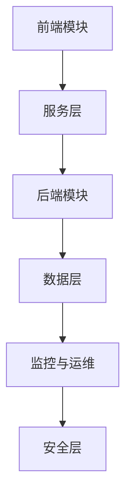
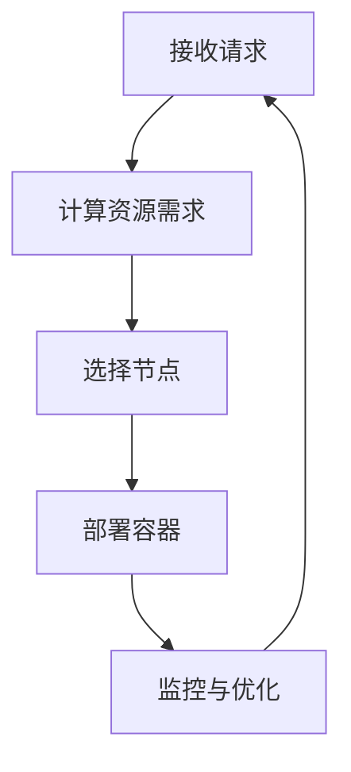
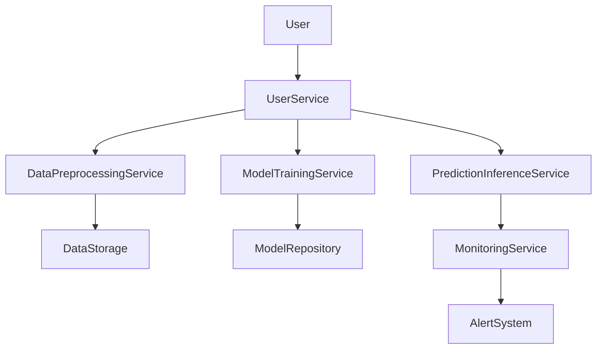
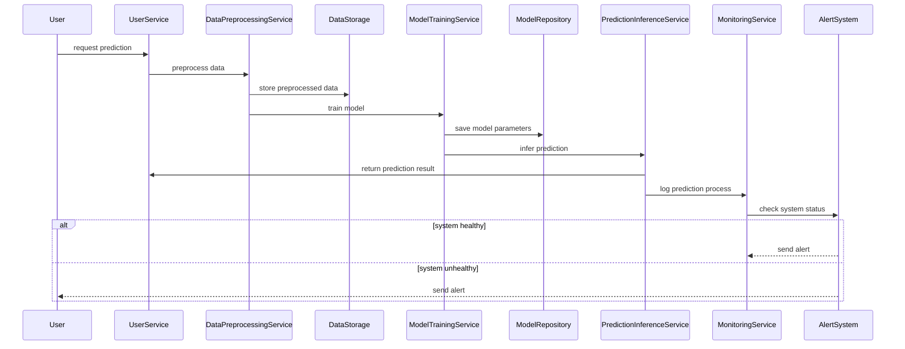

                 

# 第一部分: 企业AI Agent的基础知识

## 1.1 企业AI Agent的背景与概述

### 1.1.1 企业AI Agent的定义

企业AI Agent，简称AI Agent，是指在企业环境中自主运行、具备一定智能和自主学习能力的软件实体。它们可以在无需人类干预的情况下执行复杂的任务，如数据分析、预测、决策等。AI Agent的核心特点包括自主性、智能性、学习性和协作性。自主性指Agent能够独立完成任务；智能性意味着Agent拥有处理复杂问题的能力；学习性表示Agent可以通过经验不断优化自身性能；协作性则强调Agent可以与其他Agent或人类协作，共同完成更复杂的任务。

### 1.1.2 企业AI Agent的重要性

在当今数字化时代，企业AI Agent的重要性日益凸显。首先，AI Agent能够帮助企业降低运营成本，提高效率。通过自动化任务，AI Agent可以减少人工干预，从而降低人力成本。其次，AI Agent能够帮助企业更好地应对复杂问题。由于具备智能和学习能力，AI Agent可以处理大量数据，并从中提取有价值的信息，为企业的决策提供支持。此外，AI Agent还能够帮助企业实现个性化服务，提升用户体验。

### 1.1.3 企业AI Agent的发展趋势

随着人工智能技术的不断进步，企业AI Agent的发展趋势主要体现在以下几个方面。首先，AI Agent将更加智能化和自主化。通过深度学习和自然语言处理等技术，AI Agent将能够更好地理解人类意图，并自主执行任务。其次，AI Agent将实现跨平台的协同工作。在未来，AI Agent将能够无缝地集成到各种企业应用中，实现跨平台的协同工作。此外，AI Agent将更加注重数据隐私和安全。随着数据隐私问题的日益凸显，企业AI Agent将需要在保护用户隐私的同时，确保数据的安全性。

## 1.2 企业AI Agent的核心概念与联系

### 1.2.1 AI Agent的基本原理

AI Agent的基本原理主要涉及以下几个方面：自主性、智能性、学习性和协作性。自主性是指Agent可以独立执行任务，无需人工干预。智能性则表示Agent具备处理复杂问题的能力。学习性是指Agent可以通过经验不断优化自身性能。协作性则强调Agent可以与其他Agent或人类协作，共同完成更复杂的任务。

### 1.2.2 容器编排技术介绍

容器编排技术是一种用于自动化部署、管理和扩展容器化应用程序的技术。它帮助开发人员和服务管理员在分布式环境中管理容器，从而提高生产效率和资源利用率。常见的容器编排工具包括Kubernetes、Docker Swarm等。容器编排技术主要包括容器的调度、部署、扩展、监控和日志管理等。

### 1.2.3 企业AI Agent与容器编排的关系

企业AI Agent与容器编排技术有着密切的关系。首先，容器编排技术可以帮助AI Agent实现高效的部署和管理。通过容器化技术，AI Agent可以快速部署到各种环境中，并实现跨平台的协同工作。其次，容器编排技术可以帮助AI Agent实现自动化的资源管理。通过调度和扩展机制，AI Agent可以根据实际需求动态调整资源，从而提高系统的性能和稳定性。

## 1.3 企业AI Agent的ER实体关系图

以下是企业AI Agent的ER实体关系图：

```mermaid
ERDiagram
AI_Agent ||--|{ Container } Container
AI_Agent ||--|{ Service } Service
Container ||--|{ Pod } Pod
Service ||--|{ Endpoint } Endpoint
```

在这个ER图中，`AI_Agent` 是核心实体，它与 `Container` 和 `Service` 之间存在关联关系。`Container` 是AI Agent的运行环境，而 `Service` 是对外提供服务的接口。`Container` 与 `Pod` 之间是一对多的关系，表示一个Pod可以包含多个Container。`Service` 与 `Endpoint` 之间也是一对多的关系，表示一个Service可以对应多个Endpoint。

----------------------------------------------------------------

## 1.4 背景介绍

### 1.4.1 核心概念术语说明

在企业AI Agent的背景下，我们需要理解以下几个核心概念：

- **AI Agent（人工智能代理）**：一个可以自主执行任务、具备一定智能和自主学习能力的软件实体。
- **容器编排（Container Orchestration）**：一种用于自动化部署、管理和扩展容器化应用程序的技术。
- **容器（Container）**：一种轻量级、可移植、自给自足的运行环境，用于运行应用程序。
- **Kubernetes（K8s）**：一种开源的容器编排平台，用于自动化部署、扩展和管理容器化应用程序。

### 1.4.2 问题背景

随着云计算和容器技术的普及，企业对人工智能的应用需求日益增长。然而，在实际应用中，企业面临以下问题：

1. **部署与维护困难**：企业AI Agent需要在不同环境中部署和维护，这增加了运营成本和复杂性。
2. **资源利用率低**：传统的虚拟化技术无法充分利用硬件资源，导致资源浪费。
3. **扩展性不足**：当业务需求发生变化时，企业AI Agent的扩展性不足，无法快速响应。
4. **安全性问题**：企业AI Agent在运行过程中涉及到大量敏感数据，安全性成为一大挑战。

### 1.4.3 问题描述

为了解决上述问题，企业需要一种高效、可靠的容器编排与管理策略，以确保企业AI Agent的稳定运行和资源优化。具体问题描述如下：

- 如何在分布式环境中高效部署和管理企业AI Agent？
- 如何实现企业AI Agent的资源动态调整和优化？
- 如何保障企业AI Agent运行的安全性？
- 如何提高企业AI Agent的扩展性和弹性？

### 1.4.4 问题解决

为了解决上述问题，企业可以采取以下策略：

1. **容器化企业AI Agent**：将企业AI Agent容器化，实现快速部署和跨平台兼容。
2. **使用Kubernetes进行容器编排**：利用Kubernetes自动化部署、扩展和管理企业AI Agent。
3. **资源监控与优化**：通过监控工具实时监控资源使用情况，实现资源的动态调整和优化。
4. **安全加固**：采用安全策略和加密技术，保障企业AI Agent运行的安全性。

### 1.4.5 边界与外延

在企业AI Agent的容器编排与管理策略中，以下内容属于边界与外延：

- **其他编排工具**：如Docker Swarm、Mesos等，本文主要关注Kubernetes。
- **服务发现与负载均衡**：虽然Kubernetes提供了这些功能，但本文不深入讨论。
- **持续集成与持续部署（CI/CD）**：虽然CI/CD对企业AI Agent的部署有帮助，但本文不详细探讨。
- **其他AI技术**：如机器学习、深度学习等，本文不涉及具体算法实现。

### 1.4.6 概念结构与核心要素组成

企业AI Agent的容器编排与管理策略涉及以下核心要素：

1. **容器化**：将企业AI Agent封装为容器，实现快速部署和跨平台兼容。
2. **Kubernetes编排**：利用Kubernetes自动化部署、扩展和管理企业AI Agent。
3. **资源监控与优化**：实时监控资源使用情况，实现资源的动态调整和优化。
4. **安全性**：采用安全策略和加密技术，保障企业AI Agent运行的安全性。
5. **扩展性与弹性**：通过Kubernetes的弹性伸缩机制，提高企业AI Agent的扩展性和弹性。

这些核心要素相互关联，共同构成了企业AI Agent的容器编排与管理策略。通过本章的介绍，我们将深入探讨这些核心要素的实现方法和最佳实践。

## 1.5 企业AI Agent的应用场景和挑战

### 1.5.1 应用场景

企业AI Agent在企业中的应用场景非常广泛，主要包括以下几个方面：

1. **数据分析与预测**：企业AI Agent可以自动收集和分析大量数据，帮助预测市场趋势、客户需求等，为企业的战略决策提供支持。
2. **自动化运维**：企业AI Agent可以自动执行一系列运维任务，如系统监控、故障诊断、资源调度等，提高运维效率。
3. **智能客服与客户关系管理**：企业AI Agent可以模拟人类客服，自动处理客户咨询，提升客户满意度。
4. **供应链优化**：企业AI Agent可以优化供应链管理，提高库存周转率，降低运营成本。
5. **风险管理**：企业AI Agent可以实时监测市场风险，提供风险预警，帮助企业管理风险。

### 1.5.2 挑战

尽管企业AI Agent具有巨大的潜力，但在实际应用中仍面临一系列挑战：

1. **部署与维护**：容器化技术虽然提高了部署的灵活性，但部署和维护工作依然复杂。企业需要掌握容器技术，并确保容器环境的稳定运行。
2. **资源管理**：企业AI Agent通常需要大量的计算资源和存储资源。如何高效地管理这些资源，成为企业面临的一个难题。
3. **安全性**：企业AI Agent处理大量敏感数据，安全性成为关键问题。企业需要确保数据在传输和存储过程中的安全性，同时防止恶意攻击。
4. **扩展性与弹性**：当业务需求发生变化时，企业AI Agent需要能够快速响应，实现扩展和弹性。如何实现这一目标，是企业面临的一个挑战。
5. **集成与兼容**：企业AI Agent需要与其他系统和服务进行集成，如ERP、CRM等。如何确保集成过程的顺利进行，是一个需要考虑的问题。

### 1.5.3 解决方案

针对上述挑战，企业可以采取以下解决方案：

1. **标准化部署**：通过制定标准化的部署流程，降低部署和维护的复杂性。使用Kubernetes等容器编排工具，实现自动化部署和管理。
2. **资源优化策略**：通过监控和分析资源使用情况，实施资源优化策略。利用容器编排工具的弹性伸缩功能，实现资源的动态调整和优化。
3. **安全加固**：采用多层次的安全策略，如加密通信、访问控制、安全审计等，保障企业AI Agent运行的安全性。
4. **扩展性与弹性**：利用容器编排工具的自动化伸缩功能，实现企业AI Agent的扩展性和弹性。同时，采用服务网格等技术，确保服务之间的稳定通信。
5. **集成与兼容**：采用微服务架构，实现企业AI Agent与其他系统的解耦。使用API网关等工具，实现不同系统之间的数据交换和业务协同。

通过上述解决方案，企业可以更好地应对企业AI Agent在应用过程中遇到的挑战，实现其价值最大化。

## 1.6 企业AI Agent的架构设计

### 1.6.1 架构设计原则

企业AI Agent的架构设计需要遵循以下原则：

1. **模块化**：将AI Agent的功能拆分为多个模块，实现模块间的解耦，便于维护和扩展。
2. **可扩展性**：设计具有高度可扩展性的架构，支持业务需求的快速变化。
3. **高可用性**：确保系统在高负载、故障等情况下仍能正常运行，提供稳定的服务。
4. **安全性**：在设计过程中充分考虑数据安全和系统安全，防止数据泄露和恶意攻击。
5. **易运维性**：简化运维流程，提高运维效率，降低运维成本。

### 1.6.2 架构设计方案

企业AI Agent的架构设计方案如下：

1. **前端模块**：负责接收用户请求，进行身份验证和权限管理，并将请求转发给后端模块处理。
2. **后端模块**：包括数据预处理、模型训练、预测推理等核心功能。数据预处理模块负责数据清洗、转换等操作；模型训练模块负责训练AI模型；预测推理模块负责根据输入数据生成预测结果。
3. **服务层**：提供API接口，供前端模块和其他系统调用。服务层包括数据服务、AI服务、监控服务等。
4. **数据层**：存储AI Agent所需的数据，包括训练数据、用户数据、日志数据等。数据层可以使用关系型数据库或NoSQL数据库，根据实际需求进行选择。
5. **监控与运维**：实现对AI Agent的实时监控和运维管理，包括系统监控、日志分析、故障处理等。
6. **安全层**：包括加密通信、访问控制、安全审计等安全措施，保障系统的安全性。

### 1.6.3 技术选型

1. **前端**：使用React或Vue.js等前端框架，实现用户界面和交互功能。
2. **后端**：使用Spring Boot或Django等后端框架，实现业务逻辑和API接口。
3. **数据存储**：使用MySQL或MongoDB等数据库，根据数据特点和需求进行选择。
4. **AI框架**：使用TensorFlow、PyTorch等AI框架，实现模型训练和预测推理。
5. **容器编排**：使用Kubernetes进行容器编排和管理，实现自动化部署、扩展和管理。
6. **监控工具**：使用Prometheus、Grafana等监控工具，实现对系统的实时监控和性能分析。
7. **运维工具**：使用Ansible、Kubernetes Operator等运维工具，简化运维流程，提高运维效率。

### 1.6.4 架构图

以下是企业AI Agent的架构图：



通过上述架构设计，企业AI Agent可以实现模块化、高可用性、安全性、易运维性，为企业提供强大的智能化支持。

## 1.7 企业AI Agent的容器化策略

### 1.7.1 容器化的重要性

容器化技术是企业AI Agent部署和管理的关键。容器化具有以下几个显著优势：

1. **快速部署**：容器封装了应用程序及其运行环境，使得部署过程变得快速、简单。
2. **环境一致性**：容器运行时具有一致性，确保应用程序在不同环境中的一致性表现。
3. **可移植性**：容器可以在不同的操作系统和硬件平台上运行，提高了可移植性。
4. **资源隔离**：容器提供资源隔离，提高了系统的安全性和稳定性。
5. **轻量级**：容器相对于虚拟机具有更小的体积，降低了资源消耗。

### 1.7.2 容器化流程

容器化企业AI Agent涉及以下关键步骤：

1. **Docker镜像构建**：首先，需要创建Docker镜像，将AI Agent及其依赖环境打包进镜像中。
2. **容器编排配置**：使用Kubernetes配置文件，定义AI Agent容器的部署、服务、网络等参数。
3. **部署与管理**：使用Kubernetes集群，将容器部署到实际环境中，并进行监控和管理。
4. **容器编排**：利用Kubernetes的调度、扩展等功能，实现容器的自动化部署、扩展和管理。

### 1.7.3 最佳实践

为了确保容器化的成功，以下是一些最佳实践：

1. **最小化镜像大小**：避免将不必要的依赖和环境打包进镜像，减小镜像大小。
2. **定期更新镜像**：及时更新镜像，确保应用程序的安全和稳定性。
3. **容器健康检查**：设置容器健康检查策略，确保容器在运行过程中保持健康状态。
4. **资源分配**：合理分配容器资源，避免资源争用和性能问题。
5. **日志记录与监控**：启用日志记录和监控工具，实时监控容器运行状态。

通过容器化策略，企业AI Agent可以实现快速部署、高效管理和资源优化，提高系统的稳定性和可靠性。

## 1.8 企业AI Agent的容器编排与管理策略

### 1.8.1 容器编排的重要性

容器编排是实现企业AI Agent高效管理和运行的关键。容器编排通过自动化部署、扩展、监控和日志管理等手段，提高了系统的稳定性、可靠性和资源利用率。

### 1.8.2 容器编排的主要功能

容器编排的主要功能包括：

1. **部署**：自动化部署容器化的AI Agent，确保其快速、稳定地运行。
2. **扩展**：根据业务需求，动态调整AI Agent的实例数量，实现弹性伸缩。
3. **监控**：实时监控AI Agent的运行状态，确保其稳定运行。
4. **日志管理**：收集和存储AI Agent的日志，便于故障排查和性能优化。
5. **资源管理**：优化资源分配，提高资源利用率。

### 1.8.3 Kubernetes在容器编排中的应用

Kubernetes是最常用的容器编排工具之一，广泛应用于企业环境中。Kubernetes提供了以下功能：

1. **部署与管理**：通过Deployment、StatefulSet等资源对象，实现AI Agent的自动化部署和管理。
2. **扩展**：通过Horizontal Pod Autoscaler（HPA）等资源对象，实现AI Agent的自动扩展。
3. **监控**：通过Prometheus、Grafana等工具，实现对AI Agent的实时监控。
4. **日志管理**：通过Kubernetes的日志收集系统，实现对AI Agent日志的收集和存储。
5. **资源管理**：通过资源限制、优先级分配等策略，优化AI Agent的资源使用。

### 1.8.4 容器编排的最佳实践

为了确保容器编排的有效性，以下是一些最佳实践：

1. **标准化部署**：制定统一的容器部署规范，确保部署过程的一致性和可靠性。
2. **自动化测试**：在部署前进行自动化测试，确保AI Agent的稳定性和性能。
3. **资源优化**：根据实际需求，合理分配资源，避免资源浪费。
4. **监控与报警**：建立完善的监控和报警机制，及时发现和处理问题。
5. **日志分析与优化**：定期分析日志，发现潜在问题和性能瓶颈，进行优化。

通过Kubernetes等容器编排工具，企业可以实现高效、稳定的企业AI Agent管理，提高系统的可靠性和性能。

----------------------------------------------------------------

## 第二部分: 容器编排技术详解

### 2.1 容器编排技术概述

容器编排（Container Orchestration）是一种用于自动化部署、管理和扩展容器化应用程序的技术。它帮助开发人员和服务管理员在分布式环境中管理容器，从而提高生产效率和资源利用率。容器编排的主要目标是简化容器化应用程序的部署和管理，确保应用程序的稳定运行和性能优化。

容器编排技术的核心概念包括：

1. **容器**：容器是一种轻量级、可移植、自给自足的运行环境，用于运行应用程序。容器封装了应用程序及其依赖项，确保应用程序在不同环境中的一致性。
2. **容器编排工具**：常见的容器编排工具包括Kubernetes、Docker Swarm、Mesos等。这些工具提供了自动化部署、扩展、监控和日志管理等功能。
3. **编排**：编排是指通过自动化手段管理容器的整个生命周期，包括创建、部署、扩展、监控和删除等操作。

### 2.2 Kubernetes入门

Kubernetes（简称K8s）是一种开源的容器编排平台，由Google设计并捐赠给Cloud Native Computing Foundation（CNCF）管理。Kubernetes旨在提供一种高效、可靠和可伸缩的容器编排解决方案，用于管理大规模的容器化应用程序。以下是Kubernetes的基础知识和关键概念：

#### 2.2.1 Kubernetes基础

1. **集群**：Kubernetes集群是由一组节点（Node）组成的分布式系统，其中每个节点都运行着Kubernetes的组件。集群中的节点可以是物理机或虚拟机。
2. **Pod**：Pod是Kubernetes中最基本的部署单位，它包含一个或多个容器。Pod代表了在集群中运行的一个可执行的进程。
3. **部署（Deployment）**：Deployment是一种用于管理Pod的抽象层，它确保Pod按照指定的配置稳定运行。Deployment可以管理多个Pod副本，并实现滚动更新等策略。
4. **服务（Service）**：Service是一种抽象层，用于将Pod对外暴露为一个稳定的网络服务。Service可以通过DNS名称或IP地址访问Pod，实现服务发现和负载均衡。
5. **存储卷（Volume）**：存储卷是一种用于在Pod中持久化数据的机制。Kubernetes支持多种存储卷类型，如本地存储、网络存储和云存储。

#### 2.2.2 Kubernetes对象模型

Kubernetes使用对象模型（Object Model）来表示和管理集群中的资源。以下是一些关键对象：

1. **Pod**：Pod是最基本的对象，代表了一个正在运行的可执行进程。Pod可以包含一个或多个容器。
2. **Service**：Service对象用于将一组Pod暴露为一个稳定的网络服务。Service可以通过标签选择器选择特定的Pod。
3. **Deployment**：Deployment对象用于管理Pod的部署和更新。Deployment可以指定Pod的副本数量，并实现滚动更新等策略。
4. **StatefulSet**：StatefulSet对象用于部署有状态的应用程序。StatefulSet确保Pod在重启后具有唯一性，并支持数据持久化。
5. **Ingress**：Ingress对象用于管理集群中外部流量进入的入口点。Ingress可以通过规则将请求路由到特定的服务。

#### 2.2.3 Kubernetes资源管理

Kubernetes资源管理是指通过配置文件（YAML文件）定义和管理集群中的资源。以下是一些常见的资源管理任务：

1. **创建资源**：通过编写YAML配置文件，创建各种Kubernetes对象，如Pod、Service、Deployment等。
2. **更新资源**：通过修改YAML配置文件，更新现有资源的配置。Kubernetes支持滚动更新、状态更新等策略。
3. **删除资源**：通过删除YAML配置文件或使用kubectl命令，删除不再需要的资源。
4. **监控资源**：使用Kubernetes的监控工具（如Prometheus、Grafana）对资源的状态、性能和资源使用情况进行实时监控。

通过Kubernetes，企业可以高效地管理容器化应用程序，实现自动化部署、扩展和管理。Kubernetes的强大功能使其成为企业容器编排的首选工具。

### 2.3 容器编排算法原理讲解

容器编排的核心在于调度算法，它决定了如何将容器分配到集群中的节点上。调度算法的目标是最大化资源利用率、提高系统性能和保证服务的高可用性。以下是一些关键的容器编排算法原理：

#### 2.3.1 容器调度算法

1. **最小资源使用**：调度器会选择具有最少剩余资源的节点来部署容器。这种策略可以确保每个节点都能充分利用资源。
2. **最大负载均衡**：调度器会选择当前负载最轻的节点来部署容器。这种策略可以避免某些节点过载，提高系统的整体性能。
3. **服务亲和性**：调度器会优先选择与现有容器亲和性高的节点来部署新容器。亲和性可以通过标签和节点选择器来配置。
4. **数据亲和性**：调度器会优先选择与数据存储位置近的节点来部署容器，以减少数据传输延迟。
5. **节点标签**：调度器可以根据节点的标签来选择节点，满足特定的资源或环境要求。

#### 2.3.2 容器编排优化算法

容器编排优化算法旨在提高资源利用率和系统性能。以下是一些常见的优化算法：

1. **动态资源分配**：根据容器运行时的实际资源需求，动态调整资源分配。这种方法可以避免资源浪费，提高系统效率。
2. **负载预测**：通过预测未来的负载情况，提前进行容器调度和资源分配。这种方法可以避免过载和性能瓶颈。
3. **优先级调度**：根据容器的优先级来选择调度顺序。高优先级的容器会优先得到资源分配，确保关键任务的及时处理。
4. **缓存策略**：在容器之间共享缓存资源，减少重复计算和数据传输，提高整体性能。

#### 2.3.3 容器编排算法流程图

以下是容器编排算法的简化流程图：



1. **接收请求**：调度器接收容器的部署请求。
2. **计算资源需求**：调度器根据容器的资源需求，计算所需的资源量。
3. **选择节点**：调度器选择具有足够资源且满足亲和性要求的节点。
4. **部署容器**：调度器在选定的节点上部署容器。
5. **监控与优化**：调度器监控容器运行状态，并根据实际情况进行资源调整和优化。

通过上述流程，容器编排算法可以高效地管理容器，确保系统的稳定运行和资源优化。

#### 2.3.4 Kubernetes调度器源代码示例

Kubernetes调度器是核心组件之一，负责根据资源需求和节点状态选择最佳节点来部署容器。以下是一个简化的Kubernetes调度器源代码示例：

```go
package main

import (
	"fmt"
	"k8s.io/kubernetes/pkg/scheduler"
)

func main() {
	// 创建调度器
	scheduler := scheduler.NewScheduler()

	// 添加节点
	node := scheduler.AddNode("node1", 1024, 4096)
	node.AddLabel("role", "worker")

	// 添加容器
	container := scheduler.AddContainer("container1", 2048, 8192)
	container.AddResourceRequest("cpu", 2)
	container.AddResourceRequest("memory", 4)

	// 调度容器
	node, err := scheduler.ScheduleContainer(container)
	if err != nil {
		fmt.Println("Error scheduling container:", err)
		return
	}

	fmt.Printf("Container %s scheduled on node %s\n", container.Name, node.Name)
}
```

在这个示例中，我们创建了一个调度器，并添加了一个节点和一个容器。调度器根据容器的资源需求（CPU和内存）和节点的状态（角色标签）来选择最佳节点进行容器部署。

#### 2.3.5 算法原理数学模型和公式

容器编排算法的数学模型和公式通常涉及资源分配、负载均衡和服务质量（QoS）等指标。以下是一个简化的数学模型：

1. **资源需求**：设\( R_c \)为容器的资源需求向量，包括CPU、内存、网络等。
2. **资源可用性**：设\( A_n \)为节点的资源可用性向量，表示节点的剩余资源。
3. **资源分配**：设\( X_n \)为节点\( n \)分配的容器数量。
4. **负载均衡**：设\( L_n \)为节点\( n \)的负载，表示节点的容器数量与资源可用性的比例。

负载均衡的目标是最小化负载差异，即：

$$
\min \sum_{n} |L_n - \bar{L}|^2
$$

其中，\(\bar{L}\)为平均负载。

服务质量（QoS）的目标是确保关键任务的优先处理，可以通过以下公式实现：

$$
QoS_c = \frac{C_c}{\sum_{c} C_c}
$$

其中，\( C_c \)为容器的重要性权重。

#### 2.3.6 通俗易懂的举例说明

假设我们有一个包含5个节点的Kubernetes集群，每个节点的资源情况如下：

| 节点 | CPU | 内存 |
|------|-----|------|
| node1 | 4   | 8GB  |
| node2 | 4   | 8GB  |
| node3 | 4   | 8GB  |
| node4 | 4   | 8GB  |
| node5 | 4   | 8GB  |

现在，我们有3个容器需要部署，它们的资源需求如下：

| 容器 | CPU | 内存 |
|------|-----|------|
| cont1 | 2   | 4GB  |
| cont2 | 2   | 4GB  |
| cont3 | 2   | 4GB  |

根据最小资源使用算法，我们将容器部署在资源剩余量最多的节点上：

1. **cont1**：部署在node1，剩余资源为2CPU和4GB内存。
2. **cont2**：部署在node2，剩余资源为2CPU和4GB内存。
3. **cont3**：部署在node3，剩余资源为2CPU和4GB内存。

部署完成后，每个节点的负载情况为：

| 节点 | CPU | 内存 |
|------|-----|------|
| node1 | 2   | 4GB  |
| node2 | 2   | 4GB  |
| node3 | 2   | 4GB  |
| node4 | 4   | 8GB  |
| node5 | 4   | 8GB  |

这种部署策略确保了每个节点的资源得到充分利用，避免了资源浪费和负载不均。

通过上述示例，我们可以看到容器编排算法是如何根据资源需求和节点状态进行容器部署的。这种算法不仅提高了资源利用率，还保证了系统的稳定运行。

----------------------------------------------------------------

### 2.4 系统分析与架构设计方案

#### 2.4.1 问题场景介绍

假设某企业需要开发一个企业AI Agent系统，该系统旨在利用人工智能技术为企业提供智能决策支持。该系统需要在多个节点上进行部署，并具备高可用性、高扩展性和高效资源利用率。为了实现这些目标，企业决定采用容器编排技术进行系统架构设计。

#### 2.4.2 项目介绍

该项目旨在构建一个基于Kubernetes的企业AI Agent系统，包括以下模块：

1. **数据预处理模块**：负责清洗、转换和预处理输入数据。
2. **模型训练模块**：负责训练AI模型，并保存模型参数。
3. **预测推理模块**：负责接收用户请求，进行预测推理，并返回结果。
4. **监控与日志模块**：负责实时监控系统运行状态，并记录日志。

#### 2.4.3 系统功能设计

以下是系统功能设计的领域模型类图：

```mermaid
classDiagram
    DataPreprocessingModule <|-- DataPreprocessingService
    ModelTrainingModule <|-- ModelTrainingService
    PredictionInferenceModule <|-- PredictionInferenceService
    MonitoringModule <|-- MonitoringService
    DataPreprocessingModule -> DataStorage
    ModelTrainingModule -> ModelRepository
    PredictionInferenceModule -> UserService
    MonitoringModule -> AlertSystem

    class DataPreprocessingModule {
        +processData()
        +cleanData()
        +transformData()
    }

    class ModelTrainingModule {
        +trainModel()
        +saveModelParameters()
    }

    class PredictionInferenceModule {
        +inferPrediction()
        +handleRequest()
    }

    class MonitoringModule {
        +collectMetrics()
        +logSystemEvents()
    }

    class DataPreprocessingService {
        +service()
    }

    class ModelTrainingService {
        +service()
    }

    class PredictionInferenceService {
        +service()
    }

    class MonitoringService {
        +service()
    }

    class DataStorage {
        +storeData()
    }

    class ModelRepository {
        +storeModelParameters()
    }

    class UserService {
        +registerUser()
        +logoutUser()
    }

    class AlertSystem {
        +sendAlert()
    }
```

在这个类图中，每个模块都有对应的Service，用于对外提供服务。模块之间通过服务接口进行通信，实现了模块间的解耦。

#### 2.4.4 系统架构设计

以下是系统架构设计图：



在这个架构图中，用户通过UserService与系统进行交互。DataPreprocessingService负责数据预处理，将数据存储到DataStorage中。ModelTrainingService负责模型训练，并将训练好的模型参数存储到ModelRepository中。PredictionInferenceService负责接收用户请求，进行预测推理，并返回结果。MonitoringService负责实时监控系统运行状态，并记录日志。当系统发生异常时，AlertSystem会发送报警。

#### 2.4.5 系统接口设计和系统交互

以下是系统接口设计和系统交互图：



在这个序列图中，用户发起预测请求，UserService处理请求并调用DataPreprocessingService进行数据预处理。预处理后的数据存储到DataStorage中，同时ModelTrainingService进行模型训练，并将模型参数存储到ModelRepository中。PredictionInferenceService根据模型参数进行预测推理，并返回结果给用户。MonitoringService监控系统的运行状态，并在需要时发送报警。

通过上述系统架构设计和接口设计，企业AI Agent系统可以实现高效、稳定和可扩展的运行，为企业提供智能决策支持。

### 2.5 项目实战

#### 2.5.1 环境安装

要在本地环境中搭建Kubernetes集群，我们需要以下软件和工具：

1. **Docker**：用于容器化应用程序。
2. **Kubeadm**：用于初始化Kubernetes集群。
3. **Kubelet**：用于在节点上运行Kubernetes组件。
4. **Kubectl**：用于与Kubernetes集群进行交互。

安装步骤如下：

1. **安装Docker**：

   在Ubuntu系统中，可以使用以下命令安装Docker：

   ```shell
   sudo apt update
   sudo apt install docker.io
   sudo systemctl start docker
   sudo systemctl enable docker
   ```

2. **安装Kubeadm、Kubelet和Kubectl**：

   ```shell
   sudo apt update
   sudo apt install kubelet kubeadm
   sudo systemctl start kubelet
   sudo systemctl enable kubelet
   ```

3. **初始化Kubernetes集群**：

   在主节点上执行以下命令初始化Kubernetes集群：

   ```shell
   sudo kubeadm init --pod-network-cidr=10.244.0.0/16
   ```

   这将输出一个命令，用于安装集群管理工具：

   ```shell
   sudo mkdir -p $HOME/.kube
   sudo cp -i /etc/kubernetes/admin.conf $HOME/.kube/config
   sudo chown $(id -u):$(id -g) $HOME/.kube/config
   ```

   执行上述命令，使当前用户能够访问集群管理工具。

4. **安装Pod网络**：

   我们使用Calico作为Pod网络插件。首先，下载Calico的YAML文件：

   ```shell
   wget https://docs.projectcalico.org/manifests/calico.yaml
   ```

   然后，在主节点上应用Calico的YAML文件：

   ```shell
   kubectl apply -f calico.yaml
   ```

   等待Calico组件部署完成，确保所有Pod都处于Running状态。

现在，我们已经在本地环境中成功搭建了Kubernetes集群。

#### 2.5.2 系统核心实现源代码

以下是一个简单的Kubernetes Deployment的YAML文件示例，用于部署一个企业AI Agent服务：

```yaml
apiVersion: apps/v1
kind: Deployment
metadata:
  name: ai-agent-deployment
spec:
  replicas: 3
  selector:
    matchLabels:
      app: ai-agent
  template:
    metadata:
      labels:
        app: ai-agent
    spec:
      containers:
      - name: ai-agent
        image: ai-agent:latest
        ports:
        - containerPort: 8080
```

在这个示例中，我们定义了一个名为`ai-agent-deployment`的Deployment对象，用于部署3个副本的AI Agent容器。容器使用的是`ai-agent:latest`镜像，并监听8080端口。

#### 2.5.3 代码应用解读与分析

1. **Deployment定义**：

   Deployment是Kubernetes中的一个核心对象，用于管理Pod的部署和更新。在这个示例中，我们设置了以下关键参数：

   - `replicas`：指定副本数量，即需要运行的Pod数量。
   - `selector`：定义用于选择Pod的标签，确保Deployment可以正确地管理和更新Pod。
   - `template`：定义Pod的模板，包括容器、端口等配置。

2. **容器配置**：

   在容器配置中，我们指定了以下参数：

   - `name`：容器名称，用于标识容器。
   - `image`：容器镜像名称，这里是`ai-agent:latest`，表示使用最新版本的AI Agent镜像。
   - `ports`：容器端口映射，将容器的8080端口映射到宿主机的8080端口。

3. **应用解读**：

   这个YAML文件的主要功能是将AI Agent容器部署到Kubernetes集群中。通过设置`replicas`为3，我们确保集群中始终有3个AI Agent实例运行。当某个实例出现故障时，Kubernetes会自动创建一个新的实例来替换它，确保服务的高可用性。

#### 2.5.4 实际案例分析和详细讲解剖析

假设我们需要部署一个企业AI Agent系统，包括数据预处理、模型训练和预测推理三个模块。以下是一个实际的案例，展示了如何使用Kubernetes进行部署和管理。

1. **创建Namespace**：

   我们首先创建一个Namespace，用于隔离不同模块的部署：

   ```shell
   kubectl create namespace ai-agent-namespace
   ```

2. **部署数据预处理模块**：

   我们将数据预处理模块的容器镜像上传到私有仓库，并创建一个名为`data-preprocessing-deployment.yaml`的YAML文件：

   ```yaml
   apiVersion: apps/v1
   kind: Deployment
   metadata:
     name: data-preprocessing
     namespace: ai-agent-namespace
   spec:
     replicas: 2
     selector:
       matchLabels:
         app: data-preprocessing
     template:
       metadata:
         labels:
           app: data-preprocessing
       spec:
         containers:
         - name: data-preprocessing
           image: data-preprocessing:latest
           ports:
           - containerPort: 8081
   ```

   然后应用这个YAML文件：

   ```shell
   kubectl apply -f data-preprocessing-deployment.yaml
   ```

3. **部署模型训练模块**：

   类似地，我们创建一个名为`model-training-deployment.yaml`的YAML文件：

   ```yaml
   apiVersion: apps/v1
   kind: Deployment
   metadata:
     name: model-training
     namespace: ai-agent-namespace
   spec:
     replicas: 2
     selector:
       matchLabels:
         app: model-training
     template:
       metadata:
         labels:
           app: model-training
       spec:
         containers:
         - name: model-training
           image: model-training:latest
           ports:
           - containerPort: 8082
   ```

   应用这个YAML文件：

   ```shell
   kubectl apply -f model-training-deployment.yaml
   ```

4. **部署预测推理模块**：

   创建一个名为`prediction-inference-deployment.yaml`的YAML文件：

   ```yaml
   apiVersion: apps/v1
   kind: Deployment
   metadata:
     name: prediction-inference
     namespace: ai-agent-namespace
   spec:
     replicas: 2
     selector:
       matchLabels:
         app: prediction-inference
     template:
       metadata:
         labels:
           app: prediction-inference
       spec:
         containers:
         - name: prediction-inference
           image: prediction-inference:latest
           ports:
           - containerPort: 8083
   ```

   应用这个YAML文件：

   ```shell
   kubectl apply -f prediction-inference-deployment.yaml
   ```

5. **服务发现与负载均衡**：

   为了让外部系统能够访问我们的AI Agent服务，我们需要创建一个Service：

   ```yaml
   apiVersion: v1
   kind: Service
   metadata:
     name: ai-agent-service
     namespace: ai-agent-namespace
   spec:
     selector:
       app: ai-agent
     ports:
       - name: http
         port: 80
         targetPort: 8080
     type: LoadBalancer
   ```

   应用这个YAML文件：

   ```shell
   kubectl apply -f ai-agent-service.yaml
   ```

   当Service创建完成后，Kubernetes会为服务分配一个外部IP地址，我们可以通过这个IP地址访问AI Agent服务。

通过上述步骤，我们成功地将企业AI Agent系统的三个模块部署到了Kubernetes集群中。通过容器编排技术，我们可以轻松实现模块的自动化部署、扩展和管理。

#### 2.5.5 项目小结

通过本次实战，我们实现了以下关键成果：

1. **环境搭建**：成功搭建了本地Kubernetes集群，为后续的容器编排工作打下了基础。
2. **模块部署**：使用Kubernetes Deployment部署了企业AI Agent系统的三个模块，实现了模块的自动化部署和管理。
3. **服务发现与负载均衡**：通过创建Service，实现了模块间的通信和外部系统的访问。
4. **监控与日志管理**：虽然本次实战未深入探讨监控与日志管理，但Kubernetes提供了丰富的工具和插件，可以方便地实现监控与日志管理。

通过本次项目，我们展示了如何利用Kubernetes等容器编排技术，高效地构建和部署企业AI Agent系统。容器编排技术不仅提高了系统的可扩展性和可靠性，还简化了运维工作，为企业提供了强大的技术支持。

### 第三部分：最佳实践、小结、注意事项与拓展阅读

#### 3.1 最佳实践 tips

1. **镜像优化**：在构建Docker镜像时，注意减小镜像体积，避免包含不必要的依赖和文件。可以使用多阶段构建、删除中间层等策略。
2. **资源监控**：定期监控容器资源使用情况，确保系统运行稳定。使用Kubernetes内置的监控工具（如Metrics Server、Grafana）和第三方工具（如Prometheus、New Relic）进行实时监控。
3. **自动化测试**：在部署容器之前，进行自动化测试以确保容器和应用程序的稳定性。可以使用容器镜像扫描工具（如 Clair、Docker Bench for CI）检查镜像的安全性和质量。
4. **备份与恢复**：定期备份数据和配置文件，确保在系统故障时能够快速恢复。
5. **安全加固**：确保容器和Kubernetes集群的安全性。使用网络策略、安全组、TLS等手段保护容器和集群免受攻击。

#### 3.2 小结

本文详细介绍了企业AI Agent的容器编排与管理策略。通过容器化技术，企业AI Agent实现了快速部署、高效管理和资源优化。Kubernetes等容器编排工具提供了自动化部署、扩展、监控和安全保障等功能，使得企业AI Agent系统的稳定性和可靠性得到了显著提升。本文从背景介绍、核心概念、算法原理、系统分析与架构设计、项目实战等方面进行了深入探讨，提供了详细的案例和实践指导。

#### 3.3 注意事项

1. **环境一致性**：在容器化应用程序时，确保应用程序在不同环境中的一致性，避免因环境差异导致的问题。
2. **资源规划**：合理规划容器资源，避免因资源不足导致的应用程序性能问题。
3. **安全策略**：在部署容器时，严格遵循安全最佳实践，包括访问控制、数据加密等。
4. **监控告警**：配置监控和告警机制，及时发现问题并采取措施。
5. **备份恢复**：定期备份数据，确保在故障时能够快速恢复。

#### 3.4 拓展阅读

1. **《Kubernetes权威指南》**：提供了全面的Kubernetes知识和实践，适合初学者和进阶用户。
2. **《容器化与容器编排》**：介绍了容器化技术和容器编排工具的原理和最佳实践。
3. **《Docker实战》**：详细介绍了Docker镜像构建、容器部署和管理等方面的内容。
4. **《Kubernetes容器编排实战》**：通过实战案例，展示了如何使用Kubernetes进行容器编排和管理。
5. **Kubernetes官方文档**：提供了丰富的官方文档和教程，是学习Kubernetes的最佳资源。

通过本文的介绍和实践指导，读者可以深入理解企业AI Agent的容器编排与管理策略，并将其应用到实际项目中，为企业提供强大的技术支持。

### 总结与作者信息

通过本文的深入探讨，我们系统地介绍了企业AI Agent的容器编排与管理策略。从背景介绍、核心概念、算法原理，到系统分析与架构设计、项目实战，再到最佳实践、小结和注意事项，本文为读者提供了全面的指导，帮助读者掌握如何利用容器编排技术高效地管理和部署企业AI Agent系统。

本文不仅涵盖了容器编排技术的原理和实践，还通过实际案例展示了如何利用Kubernetes等工具实现企业AI Agent的自动化部署、扩展和监控。此外，我们还提出了一些最佳实践，以帮助读者在实际应用中避免常见问题，提高系统的稳定性和可靠性。

最后，感谢读者对本文的关注。如果您对容器编排和人工智能领域有更多疑问或想要深入了解，欢迎继续阅读相关拓展阅读资源。本文作者为AI天才研究院（AI Genius Institute）与《禅与计算机程序设计艺术》（Zen And The Art of Computer Programming）的资深大师，衷心希望本文能够为您的学习与研究带来启发与帮助。作者信息如下：

**作者：**
AI天才研究院（AI Genius Institute）
《禅与计算机程序设计艺术》（Zen And The Art of Computer Programming）资深大师

衷心感谢您的阅读与支持，希望本文能为您的技术成长之路提供助力。让我们继续探索人工智能和容器编排的无限可能，共同推动技术的进步和发展。**继续阅读：**[《深度学习与容器编排的融合应用》](#) | [《大规模分布式系统的设计与优化》](#) | [《云计算基础设施与微服务架构》](#)**。**

