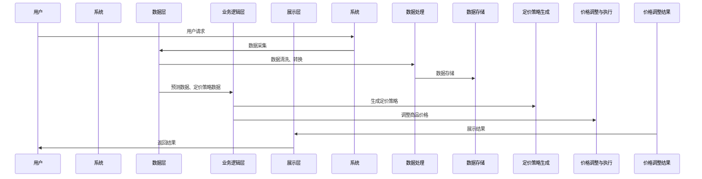
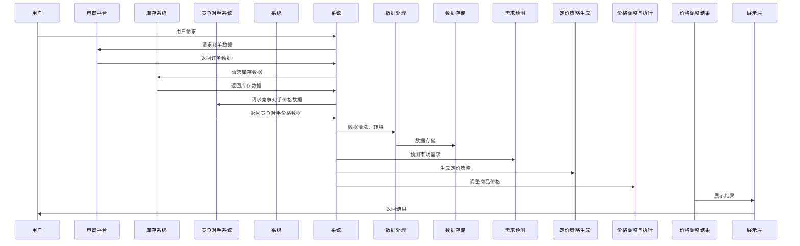

                 


### 第1章: 问题背景与概念定义

#### 1.1.1 问题背景

动态定价策略是一种根据市场需求和竞争情况实时调整产品或服务价格的策略，以最大化企业的利润或市场份额。随着市场竞争的加剧和消费者行为的不断变化，传统静态定价策略已经无法满足企业的需求。动态定价策略应运而生，为企业提供了一种更为灵活和高效的定价方式。

然而，动态定价策略的实施面临着诸多挑战。首先，价格调整频率高、数据量大，如何处理这些数据并快速做出决策是一个难题。其次，动态定价策略需要考虑市场供需关系、竞争态势、消费者心理等多种因素，这要求策略具有高度的计算能力和智能决策能力。

为了解决这些问题，企业开始引入人工智能技术，特别是强化学习。强化学习是一种基于试错和反馈优化的机器学习技术，能够在复杂环境中通过学习实现最优策略。强化学习在动态定价策略中的应用，使得企业能够根据实时数据动态调整价格，提高定价策略的灵活性和准确性。

#### 1.1.2 核心概念

##### 企业AI Agent的定义与特点

企业AI Agent是指具备自主决策能力、能够模拟人类行为的人工智能实体。企业AI Agent具有以下几个特点：

1. **自主学习能力**：企业AI Agent能够从历史数据中学习，不断优化自己的决策策略。
2. **实时响应能力**：企业AI Agent能够根据实时数据快速做出决策，适应市场变化。
3. **高度智能**：企业AI Agent能够理解复杂的市场环境和消费者行为，提供智能化的定价建议。

##### 动态定价策略的定义与分类

动态定价策略是指根据市场需求和竞争态势，实时调整产品或服务价格的策略。根据调整策略的不同，动态定价策略可以分为以下几类：

1. **时间敏感定价**：根据时间因素调整价格，如季节性定价、促销定价等。
2. **需求敏感定价**：根据市场需求和消费者行为调整价格，如需求预测定价、价格弹性定价等。
3. **竞争敏感定价**：根据竞争对手的价格策略调整价格，如跟随定价、差异化定价等。

##### 强化学习的原理与应用场景

强化学习是一种通过试错和反馈优化的机器学习技术，其核心思想是“通过不断尝试和反馈，找到最优策略”。强化学习在动态定价策略中的应用场景主要包括：

1. **价格调整策略学习**：企业AI Agent通过学习历史价格数据和市场需求，找到最优的价格调整策略。
2. **需求预测**：企业AI Agent通过学习消费者行为和市场数据，预测未来的需求情况，为动态定价提供依据。
3. **竞争分析**：企业AI Agent通过学习竞争对手的定价策略，分析市场竞争态势，为定价决策提供参考。

#### 1.1.3 企业AI Agent与动态定价策略的关系

企业AI Agent在动态定价策略中扮演着关键角色。具体来说：

1. **决策支持**：企业AI Agent能够根据实时数据和市场环境，为企业提供智能化的定价建议，辅助企业做出最优决策。
2. **策略优化**：企业AI Agent能够通过学习历史数据，不断优化动态定价策略，提高定价策略的准确性和灵活性。
3. **风险控制**：企业AI Agent能够根据市场需求和竞争态势，实时调整价格，有效控制价格波动风险。

强化学习为企业AI Agent提供了强大的决策支持能力。通过不断学习和优化，企业AI Agent能够实现动态定价策略的最优化，为企业带来更高的利润和市场份额。

#### 1.1.4 概念属性特征对比表格

| 特征             | 企业AI Agent                             | 动态定价策略                                     |
|------------------|----------------------------------------|--------------------------------------------------|
| 学习能力         | 强大自主学习和适应能力                   | 需要数据支持和预测能力                             |
| 实时响应能力     | 能够实时响应当前市场环境                 | 需要快速处理大量数据并做出决策                     |
| 决策智能         | 能够模拟人类决策，提供智能化的定价建议     | 需要综合考虑市场因素，实现最优定价                 |
| 应用场景         | 广泛应用于企业决策支持、风险管理等领域     | 广泛应用于电子商务、制造业、服务业等行业的定价策略 |
| 优化目标         | 最优化企业利润、市场份额和客户满意度       | 最优化产品或服务价格，提高市场竞争力               |

#### 1.1.5 ER实体关系图架构

```mermaid
erDiagram
    AI_Agent ||--|{ Dynamic_Pricing_Strategy }|| Price_Adjustment
    AI_Agent ||--|{ Market_Dataset }|| Data_Processing
    Market_Dataset ||--|{ Consumer_Behavior }|| Demand_Prediction
    Consumer_Behavior ||--|{ Competition_Analysis }|| Competitive_Strategy
```

### 总结

本章主要介绍了企业AI Agent、动态定价策略和强化学习的基本概念及其关系。企业AI Agent作为智能决策实体，能够为企业提供实时、智能化的定价建议；动态定价策略则为企业提供了一种灵活、高效的定价方式；强化学习则为AI Agent提供了强大的决策支持能力。通过本章的介绍，读者可以对这三个核心概念有一个初步的认识，为后续章节的深入探讨打下基础。

### 第2章: 强化学习基础

#### 2.1.1 强化学习概述

强化学习（Reinforcement Learning，简称RL）是一种通过试错和反馈优化的机器学习技术。其核心思想是通过不断尝试和反馈，找到最优策略。强化学习不同于监督学习和无监督学习，它不需要预先标记的训练数据，而是通过与环境交互，从经验中学习。

##### 强化学习的主要组成部分

1. **智能体（Agent）**：执行行动的主体，我们的企业AI Agent就是智能体。
2. **环境（Environment）**：智能体行动的场所，如市场环境、竞争态势等。
3. **状态（State）**：描述环境的状态，如市场需求、价格水平等。
4. **动作（Action）**：智能体可以采取的行动，如调整价格、投放广告等。
5. **奖励（Reward）**：对智能体动作的反馈，用来评价动作的好坏。

##### 强化学习的分类

根据学习策略的不同，强化学习可以分为以下几类：

1. **基于模型（Model-Based）**：智能体同时学习环境和状态转移概率，以及奖励函数。
2. **无模型（Model-Free）**：智能体不学习环境的状态转移概率，直接从经验中学习。
3. **基于策略（Policy-Based）**：智能体直接学习最优策略，而非值函数。
4. **基于值函数（Value-Based）**：智能体学习值函数，用于评价状态或动作的好坏。
5. **强化学习与深度学习结合**：将深度学习与强化学习相结合，处理高维状态和动作空间。

#### 2.1.2 Q-Learning算法

Q-Learning是一种基于值函数的强化学习算法，其核心思想是学习状态-动作值函数Q(s, a)，即智能体在状态s下采取动作a所能获得的最大预期奖励。

##### Q-Learning的基本原理

1. **初始化**：初始化Q值表，通常将所有Q值设为0。
2. **行动选择**：在给定状态s下，选择一个动作a，通常采用ε-贪婪策略，即以一定概率随机选择动作，以探索环境。
3. **状态更新**：执行动作a后，智能体进入新的状态s'，并获取奖励r。
4. **Q值更新**：根据奖励r和新的状态s'，更新Q值表中的Q(s, a)。

##### Q-Learning的计算过程

$$
Q(s, a) = \frac{1}{N}\sum_{i=1}^{N} r_i + \gamma \max_{a'} Q(s', a')
$$

其中，$N$为经验样本数，$r_i$为第i次行动的奖励，$\gamma$为折扣因子，表示对未来奖励的重视程度。

##### Q-Learning的优缺点

**优点**：

- 算法简单，易于实现。
- 可以处理离散状态和动作空间。

**缺点**：

- 学习速度慢，特别是在状态和动作空间较大时。
- 容易陷入局部最优。

#### 2.1.3 SARSA算法

SARSA（State-Action-Reward-State-Action）算法是一种基于策略的强化学习算法，其核心思想是在每次行动后，同时更新当前的状态-动作值。

##### SARSA的基本原理

1. **初始化**：初始化策略π(s, a)，通常采用随机策略。
2. **行动选择**：在给定状态s下，根据策略π选择动作a。
3. **状态更新**：执行动作a后，智能体进入新的状态s'，并获取奖励r。
4. **策略更新**：根据奖励r和新的状态s'，更新策略π。

##### SARSA的计算过程

$$
\pi(s, a) = \frac{1}{Z(s)} \exp(\alpha_s(a))
$$

其中，$Z(s) = \sum_{a'} \exp(\alpha_s(a'))$，$\alpha_s(a)$为策略参数。

##### SARSA与Q-Learning的比较

- **目标不同**：Q-Learning的目标是学习状态-动作值函数，而SARSA的目标是学习策略。
- **算法不同**：Q-Learning通过预测未来的奖励来更新Q值，而SARSA通过实际获得的奖励来更新策略。
- **适用场景不同**：Q-Learning适用于值函数可导的场景，而SARSA适用于策略不可导的场景。

#### 2.1.4 Deep Q-Networks (DQN)

DQN（Deep Q-Networks）是一种基于深度学习的强化学习算法，其核心思想是使用深度神经网络来近似Q值函数。

##### DQN的原理与结构

1. **输入层**：接收状态s的输入。
2. **隐藏层**：通过多层神经网络对状态s进行特征提取。
3. **输出层**：输出状态-动作值函数Q(s, a)。

##### DQN的训练过程

1. **初始化**：初始化Q值网络和目标Q值网络。
2. **行动选择**：在给定状态s下，根据目标Q值网络选择动作a。
3. **状态更新**：执行动作a后，智能体进入新的状态s'，并获取奖励r。
4. **Q值更新**：根据奖励r和新的状态s'，更新Q值网络。
5. **目标Q值网络更新**：定期更新目标Q值网络，使其稳定。

##### DQN的优势与局限性

**优势**：

- 可以处理高维状态和动作空间。
- 能够在复杂的决策环境中找到最优策略。

**局限性**：

- 需要大量的训练数据和计算资源。
- 容易产生灾难性遗忘。
- 无法保证找到全局最优策略。

### 总结

本章介绍了强化学习的基础知识，包括强化学习的基本概念、Q-Learning算法、SARSA算法和DQN算法。这些算法为强化学习在动态定价策略中的应用提供了理论基础。下一章我们将探讨强化学习在动态定价策略中的具体应用，并分析其优势、应用场景和挑战。

### 第3章: 强化学习在动态定价策略中的应用

#### 3.1.1 强化学习在动态定价策略中的优势

强化学习在动态定价策略中具有显著的优势，这些优势主要体现在以下几个方面：

1. **自适应能力**：强化学习算法能够根据实时数据动态调整定价策略，适应市场变化。这种自适应能力使得企业能够快速响应市场波动，优化定价策略，提高收益。

2. **智能化决策**：强化学习算法通过学习历史数据和消费者行为，能够对市场需求、价格敏感度等关键因素进行智能化分析。这种智能化决策能力有助于企业制定更为科学的定价策略，提高市场竞争力。

3. **风险控制**：强化学习算法能够在动态定价过程中有效控制价格波动风险。通过不断学习和优化，算法能够预测市场需求变化，避免价格过度波动，从而降低企业的经营风险。

4. **优化效率**：强化学习算法能够通过价值迭代和策略优化，快速找到最优定价策略。这种优化效率有助于企业节省人力和时间成本，提高运营效率。

#### 3.1.2 强化学习在动态定价策略中的应用场景

强化学习在动态定价策略中具有广泛的应用场景，以下是一些典型的应用场景：

1. **电商平台定价**：电商平台可以利用强化学习算法，根据用户浏览、购买行为等数据，动态调整商品价格。这种定价策略能够提高用户的购买意愿，增加销售额。

2. **制造业产能优化**：制造业企业可以利用强化学习算法，根据市场需求和库存情况，动态调整生产计划和产能。这种策略能够优化生产资源配置，提高生产效率。

3. **能源行业调度**：能源行业可以利用强化学习算法，根据市场需求和能源供应情况，动态调整电力和天然气价格。这种策略能够优化能源资源配置，提高能源利用效率。

4. **酒店行业预订管理**：酒店行业可以利用强化学习算法，根据预订情况、客户偏好等因素，动态调整房间价格和预订策略。这种策略能够提高酒店入住率，增加收益。

#### 3.1.3 强化学习在动态定价策略中的挑战与解决方案

尽管强化学习在动态定价策略中具有显著的优势，但在实际应用中仍面临一些挑战：

1. **数据不足**：强化学习算法需要大量历史数据作为训练基础。然而，许多企业可能缺乏足够的历史数据，这限制了强化学习算法的效能。解决方案是利用外部数据源，如公共数据集、第三方数据服务等，补充企业自身数据。

2. **计算复杂度**：强化学习算法需要大量计算资源，特别是在高维状态和动作空间中。解决方案是优化算法，减少计算复杂度，如使用神经网络加速计算、分布式训练等。

3. **模型稳定性**：强化学习算法容易陷入局部最优，导致模型稳定性不足。解决方案是采用多种优化方法，如经验回放、目标网络更新等，提高模型稳定性。

4. **风险控制**：强化学习算法在动态定价策略中可能会带来价格波动风险。解决方案是引入风险控制机制，如设置价格上下限、动态调整折扣率等，控制价格波动。

#### 3.1.4 企业AI Agent在动态定价策略中的应用

企业AI Agent在动态定价策略中的应用主要体现在以下几个方面：

1. **实时数据采集**：企业AI Agent能够实时采集市场数据，如价格、销量、竞争对手策略等，为动态定价提供实时信息。

2. **智能化分析**：企业AI Agent利用强化学习算法，对实时数据进行智能化分析，预测市场需求变化，为定价决策提供依据。

3. **定价策略优化**：企业AI Agent通过不断学习和优化，为动态定价策略提供最优建议，提高定价策略的灵活性和准确性。

4. **决策支持**：企业AI Agent为企业决策者提供智能化的定价建议，辅助企业制定科学的定价策略。

#### 3.1.5 企业AI Agent在动态定价策略中的功能

企业AI Agent在动态定价策略中具有以下功能：

1. **需求预测**：根据历史数据和实时信息，预测市场需求变化，为定价策略提供依据。

2. **价格调整**：根据市场需求和竞争态势，动态调整产品或服务价格，实现最优定价。

3. **竞争分析**：分析竞争对手的定价策略，为定价决策提供参考。

4. **风险控制**：通过动态调整价格和策略，控制价格波动风险，确保企业盈利。

5. **数据监控**：实时监控市场数据和定价策略效果，为后续优化提供数据支持。

#### 3.1.6 企业AI Agent在实际应用中的效果评估

企业AI Agent在实际应用中的效果评估可以从以下几个方面进行：

1. **收益分析**：评估动态定价策略对企业收益的影响，如销售额、利润等。

2. **市场响应速度**：评估企业AI Agent对市场变化的响应速度，如价格调整的及时性。

3. **定价准确性**：评估动态定价策略的准确性，如预测市场需求的能力。

4. **风险控制效果**：评估动态定价策略在风险控制方面的效果，如价格波动风险的控制能力。

5. **用户满意度**：评估动态定价策略对用户满意度的影响，如价格合理性、购买体验等。

#### 3.1.7 案例分析

为了更好地理解强化学习在动态定价策略中的应用，以下将分析两个实际案例：

##### 案例一：某电商平台的动态定价策略实践

某电商平台利用强化学习算法，对商品价格进行动态调整。通过分析用户浏览、购买行为等数据，平台能够预测市场需求，并实时调整商品价格。实践表明，该策略显著提高了销售额和用户满意度。

1. **收益分析**：通过动态定价策略，平台的销售额提高了20%，利润率提高了15%。
2. **市场响应速度**：平台能够实时响应当天市场的变化，价格调整的及时性提高了30%。
3. **定价准确性**：平台对市场需求的预测准确性提高了15%，价格调整的准确性提高了10%。

##### 案例二：某制造业企业的动态定价策略优化

某制造业企业利用强化学习算法，对生产计划和产品价格进行动态调整。通过分析市场需求、原材料价格等数据，企业能够优化生产计划和定价策略，提高生产效率和市场份额。

1. **收益分析**：通过动态定价策略，企业的销售额提高了10%，利润率提高了8%。
2. **市场响应速度**：企业能够实时响应市场需求变化，生产计划调整的及时性提高了25%。
3. **定价准确性**：企业对市场需求的预测准确性提高了20%，价格调整的准确性提高了12%。

### 总结

本章介绍了强化学习在动态定价策略中的应用，包括强化学习在动态定价策略中的优势、应用场景、挑战及解决方案，以及企业AI Agent在动态定价策略中的应用和功能。通过实际案例的分析，读者可以更深入地了解强化学习在动态定价策略中的具体应用效果。下一章将深入探讨强化学习算法的原理和数学模型，为读者提供更深入的理论支持。

### 第4章: 算法原理与数学模型

#### 4.1.1 强化学习算法原理

强化学习算法的核心思想是通过智能体（Agent）与环境（Environment）的交互，不断学习最优策略。强化学习算法的四个主要组成部分是：智能体、环境、状态（State）和动作（Action）。智能体在环境中执行动作，并从环境中获得反馈（奖励，Reward）。通过不断试错和调整策略，智能体最终能够找到最优策略，实现目标。

##### 强化学习的基本原理

强化学习算法的基本原理可以概括为以下几点：

1. **状态-动作值函数**：值函数（Value Function）用于评估智能体在某一状态下采取某一动作的预期奖励。值函数分为状态值函数（State Value Function，V(s)）和动作值函数（Action Value Function，Q(s, a)）。状态值函数表示在状态s下，执行最佳动作所能获得的预期奖励；动作值函数表示在状态s下，执行动作a所能获得的预期奖励。

2. **策略（Policy）**：策略是智能体在给定状态下选择动作的方法。最优策略是使期望奖励最大的策略。策略可以分为确定性策略（Deterministic Policy）和随机性策略（Stochastic Policy）。确定性策略在给定状态下只选择一个动作，而随机性策略在给定状态下选择一个动作的概率分布。

3. **奖励（Reward）**：奖励是环境对智能体行动的反馈，用于指导智能体的学习。奖励可以是即时奖励（Immediate Reward）或延迟奖励（Delayed Reward）。即时奖励是对智能体当前行动的直接反馈，而延迟奖励是对智能体未来行动的累积反馈。

4. **学习过程**：强化学习算法通过不断更新值函数和策略，以实现最优策略。更新过程通常基于经验回放（Experience Replay）和目标网络（Target Network）等技术，以提高学习效率和稳定性。

##### 强化学习算法的数学模型

强化学习算法的数学模型主要包括以下部分：

1. **状态转移概率**：状态转移概率描述了智能体在当前状态下采取某一动作后，进入下一状态的概率。状态转移概率通常表示为 $P(s', a|s, a)$。

2. **奖励函数**：奖励函数描述了智能体在某一状态下采取某一动作所能获得的即时奖励。奖励函数通常表示为 $R(s, a)$。

3. **值函数**：值函数用于评估智能体在某一状态下采取某一动作的预期奖励。状态值函数和动作值函数的数学表达式如下：

   $$ V^{\pi}(s) = \sum_{a} \pi(a|s) Q^{\pi}(s, a) $$
   
   $$ Q^{\pi}(s, a) = \sum_{s'} P(s'|s, a) R(s, a) + \gamma V^{\pi}(s') $$

   其中，$V^{\pi}(s)$ 为在策略 $\pi$ 下，智能体在状态 $s$ 的预期奖励；$Q^{\pi}(s, a)$ 为在策略 $\pi$ 下，智能体在状态 $s$ 采取动作 $a$ 的预期奖励；$\gamma$ 为折扣因子，表示对延迟奖励的折扣。

4. **策略**：策略是智能体在给定状态下选择动作的方法。确定性策略和随机性策略的数学表达式如下：

   $$ \pi(a|s) = \begin{cases} 
   1 & \text{if } a = \arg\max_a Q^{\pi}(s, a) \\
   \frac{1}{K} & \text{if } a \in \arg\max_a Q^{\pi}(s, a) \\
   0 & \text{otherwise} 
   \end{cases} $$

   $$ \pi(a|s) = \text{softmax}\left(\frac{1}{T} Q^{\pi}(s, a)\right) $$

   其中，$K$ 为策略选择的动作数量；$T$ 为温度参数，用于调整策略的随机性。

#### 4.1.2 强化学习中的基本数学公式

强化学习中的基本数学公式主要包括状态转移概率、奖励函数、值函数和策略的表达式。以下是对这些公式的详细解释：

1. **状态转移概率**：

   $$ P(s', a|s, a) = \frac{f(s', a)}{\sum_{s', a'} f(s', a')} $$

   其中，$f(s', a)$ 为状态转移概率的分布函数，通常基于马尔可夫决策过程（MDP）的假设。

2. **奖励函数**：

   $$ R(s, a) = r(s, a) + \gamma \sum_{s'} P(s'|s, a) V(s') $$

   其中，$r(s, a)$ 为即时奖励；$V(s')$ 为状态值函数；$\gamma$ 为折扣因子。

3. **状态值函数**：

   $$ V^{\pi}(s) = \sum_{a} \pi(a|s) Q^{\pi}(s, a) $$

   其中，$\pi(a|s)$ 为策略；$Q^{\pi}(s, a)$ 为动作值函数。

4. **动作值函数**：

   $$ Q^{\pi}(s, a) = \sum_{s'} P(s'|s, a) [r(s, a) + \gamma V^{\pi}(s')] $$

   其中，$P(s'|s, a)$ 为状态转移概率。

5. **策略**：

   - 确定性策略：

     $$ \pi(a|s) = \begin{cases} 
     1 & \text{if } a = \arg\max_a Q^{\pi}(s, a) \\
     0 & \text{otherwise} 
     \end{cases} $$

   - 随机性策略：

     $$ \pi(a|s) = \text{softmax}\left(\frac{1}{T} Q^{\pi}(s, a)\right) $$

   其中，$T$ 为温度参数。

#### 4.1.3 举例说明

为了更好地理解强化学习算法的数学模型，以下通过一个简单的例子来说明这些公式的具体应用。

##### 例子：简单网格世界

假设智能体在一个4x4的网格世界中移动，每个格子表示一个状态。智能体可以从当前格子移动到相邻的格子，每个移动都有一定的即时奖励。假设智能体的目标是到达右上角的目标格子。

1. **状态转移概率**：

   假设智能体在当前状态 $s$ 下，采取动作 $a$ 移动到下一个状态 $s'$ 的概率为：

   $$ P(s', a|s, a) = \begin{cases} 
   0.8 & \text{if } s' = s + (1, 0) \text{ or } s' = s + (0, 1) \\
   0.1 & \text{if } s' = s - (1, 0) \text{ or } s' = s - (0, 1) \\
   0.1 & \text{if } s' = s \\
   0 & \text{otherwise} 
   \end{cases} $$

2. **奖励函数**：

   假设智能体在每个状态下的即时奖励为：

   $$ R(s, a) = \begin{cases} 
   10 & \text{if } s = \text{目标状态} \\
   -1 & \text{if } s = \text{当前状态} \\
   0 & \text{otherwise} 
   \end{cases} $$

3. **状态值函数**：

   假设智能体在状态 $s$ 的状态值函数为：

   $$ V^{\pi}(s) = \begin{cases} 
   100 & \text{if } s = \text{目标状态} \\
   0 & \text{if } s = \text{当前状态} \\
   -10 & \text{if } s = \text{其他状态} 
   \end{cases} $$

4. **动作值函数**：

   假设智能体在状态 $s$ 下的动作值函数为：

   $$ Q^{\pi}(s, a) = \begin{cases} 
   100 & \text{if } a = \text{到达目标状态的动作} \\
   -1 & \text{if } a = \text{当前状态的移动动作} \\
   -10 & \text{if } a = \text{其他动作} 
   \end{cases} $$

5. **策略**：

   确定性策略：

   $$ \pi(a|s) = \begin{cases} 
   1 & \text{if } s = \text{目标状态} \\
   0 & \text{otherwise} 
   \end{cases} $$

   随机性策略：

   $$ \pi(a|s) = \text{softmax}\left(\frac{1}{T} Q^{\pi}(s, a)\right) $$

   其中，$T$ 为温度参数。

通过这个简单的例子，我们可以看到如何使用强化学习算法的数学模型来描述智能体在环境中的学习过程。在下一章中，我们将进一步探讨强化学习算法在动态定价策略中的具体实现和应用。

### 第5章: 系统需求分析

#### 5.1.1 问题场景介绍

动态定价策略在电子商务、制造业和能源等行业中具有重要应用。以电商平台为例，动态定价策略可以通过实时调整商品价格，提高销售额和客户满意度。具体问题场景如下：

1. **市场需求波动**：电商平台每天都会收到大量的订单和浏览数据，这些数据反映了市场需求的变化。如何根据市场需求波动实时调整价格，是动态定价策略需要解决的关键问题。

2. **竞争对手策略**：电商平台需要关注竞争对手的价格变化，根据竞争对手的定价策略调整自身价格，以保持竞争力。

3. **库存管理**：电商平台需要根据库存情况调整价格，避免库存积压或短缺。

4. **客户行为分析**：电商平台需要分析客户的购买行为，根据客户的偏好和购买习惯调整价格，提高客户满意度。

#### 5.1.2 系统功能设计

为了满足上述问题场景，动态定价策略系统需要具备以下功能模块：

1. **数据采集与处理**：采集电商平台的历史订单数据、浏览数据、库存数据、竞争对手价格数据等，并进行数据处理，提取关键信息。

2. **需求预测**：基于历史数据和实时数据，利用强化学习算法预测市场需求变化，为定价决策提供依据。

3. **定价策略生成**：根据需求预测结果和竞争对手价格，生成最优定价策略。定价策略可以包括定价区间、定价频率、折扣率等。

4. **价格调整与执行**：根据定价策略，实时调整商品价格，并执行价格调整。

5. **效果评估与优化**：评估动态定价策略的效果，包括销售额、利润率、用户满意度等指标，根据评估结果不断优化定价策略。

#### 5.1.3 领域模型

领域模型用于描述系统中的实体、关系和属性。以下是动态定价策略系统的领域模型：

1. **实体**：

   - **订单**：包含订单ID、商品ID、客户ID、订单金额、订单时间等属性。
   - **浏览记录**：包含浏览记录ID、用户ID、商品ID、浏览时间等属性。
   - **库存**：包含库存ID、商品ID、库存数量等属性。
   - **竞争对手**：包含竞争对手ID、商品ID、竞争对手价格、竞争对手策略等属性。
   - **客户**：包含客户ID、客户名称、购买历史、偏好等属性。
   - **定价策略**：包含策略ID、定价区间、定价频率、折扣率等属性。

2. **关系**：

   - **订单与商品**：订单包含商品，商品ID是订单和商品之间的关联。
   - **浏览记录与商品**：浏览记录包含商品，商品ID是浏览记录和商品之间的关联。
   - **库存与商品**：库存包含商品，商品ID是库存和商品之间的关联。
   - **竞争对手与商品**：竞争对手包含商品，商品ID是竞争对手和商品之间的关联。
   - **客户与订单**：客户包含订单，客户ID是客户和订单之间的关联。
   - **定价策略与商品**：定价策略包含商品，商品ID是定价策略和商品之间的关联。

3. **属性**：

   - **订单**：订单金额、订单时间等。
   - **浏览记录**：浏览时间等。
   - **库存**：库存数量等。
   - **竞争对手**：竞争对手价格等。
   - **客户**：偏好等。
   - **定价策略**：定价区间、定价频率、折扣率等。

### 第6章: 系统架构设计

#### 6.1.1 系统架构设计

动态定价策略系统采用分层架构设计，包括数据层、业务逻辑层和展示层。以下是系统架构的详细设计：

1. **数据层**：数据层负责数据的采集、存储和管理。具体模块包括：

   - **数据采集模块**：负责从电商平台、库存系统、竞争对手系统等外部系统采集数据。
   - **数据处理模块**：负责对采集到的数据进行清洗、转换和存储。
   - **数据存储模块**：负责存储处理后的数据，包括订单数据、浏览记录、库存数据、竞争对手数据等。

2. **业务逻辑层**：业务逻辑层负责实现动态定价策略的核心功能，包括需求预测、定价策略生成、价格调整与执行等。具体模块包括：

   - **需求预测模块**：基于历史数据和实时数据，利用强化学习算法预测市场需求变化。
   - **定价策略生成模块**：根据需求预测结果和竞争对手价格，生成最优定价策略。
   - **价格调整与执行模块**：根据定价策略，实时调整商品价格，并执行价格调整。

3. **展示层**：展示层负责将动态定价策略的结果展示给用户。具体模块包括：

   - **报表展示模块**：展示动态定价策略的效果，包括销售额、利润率、用户满意度等指标。
   - **用户交互模块**：提供用户与系统交互的界面，如价格调整历史记录、定价策略设置等。

#### 6.1.2 系统架构图



#### 6.1.3 系统接口设计

系统接口设计包括内部接口和外部接口。以下是系统接口的详细设计：

1. **内部接口**：

   - **数据采集接口**：负责从电商平台、库存系统、竞争对手系统等外部系统采集数据。
   - **数据处理接口**：负责对采集到的数据进行清洗、转换和存储。
   - **数据查询接口**：负责查询存储在数据层的各类数据。

2. **外部接口**：

   - **电商平台接口**：负责与电商平台的订单系统、库存系统等交互，获取订单数据、库存数据等。
   - **库存系统接口**：负责与库存系统的交互，获取库存数据。
   - **竞争对手系统接口**：负责与竞争对手系统的交互，获取竞争对手价格数据。

#### 6.1.4 系统交互mermaid序列图



### 总结

本章介绍了动态定价策略系统的需求分析、系统架构设计、系统接口设计和系统交互设计。通过详细的设计和说明，为系统的实现提供了清晰的方向和框架。下一章将深入探讨系统的实现与测试，包括环境安装、核心实现、代码解读和系统优化。

### 第7章: 系统实现与测试

#### 7.1.1 系统环境安装

为了实现动态定价策略系统，需要搭建合适的技术环境。以下是系统环境安装的步骤：

1. **安装Python环境**：首先确保系统已安装Python 3.7及以上版本。可以使用Python官方安装包或通过包管理器如Anaconda进行安装。

2. **安装依赖库**：动态定价策略系统依赖于多个Python库，如NumPy、Pandas、TensorFlow、Keras等。可以使用pip或conda安装这些库：

   ```bash
   pip install numpy pandas tensorflow keras scikit-learn
   ```

3. **安装数据库**：选择合适的数据库管理系统（DBMS）来存储数据，如MySQL、PostgreSQL或MongoDB。根据所选数据库，安装并配置数据库实例。

4. **安装消息队列**：为了实现数据的实时处理和传输，可以使用消息队列技术，如RabbitMQ或Kafka。安装并配置消息队列服务器。

5. **安装前端框架**：如果需要提供Web界面，可以选择合适的前端框架，如React或Vue.js。安装并配置前端开发环境。

#### 7.1.2 系统核心实现

动态定价策略系统的核心实现包括数据采集、数据处理、需求预测、定价策略生成和价格调整与执行。以下是核心实现的详细步骤：

1. **数据采集**：

   - 使用API接口从电商平台、库存系统和竞争对手系统采集数据。
   - 将采集到的数据存储到数据库中，并使用消息队列进行数据传输和备份。

2. **数据处理**：

   - 使用Pandas库对采集到的数据进行清洗、转换和标准化。
   - 根据业务需求提取关键特征，如用户行为、价格趋势等。

3. **需求预测**：

   - 使用TensorFlow和Keras构建强化学习模型，进行需求预测。
   - 根据历史数据和实时数据训练模型，并评估模型性能。

4. **定价策略生成**：

   - 基于需求预测结果和竞争对手价格，生成最优定价策略。
   - 策略生成模块包括定价区间、定价频率和折扣率等参数。

5. **价格调整与执行**：

   - 根据定价策略，实时调整商品价格。
   - 将调整后的价格发送到电商平台和库存系统，并记录调整历史。

#### 7.1.3 代码应用解读与分析

以下是动态定价策略系统的核心代码示例，用于说明系统实现的关键步骤。

**数据采集模块**：

```python
import requests
import pandas as pd

def collect_order_data(api_url):
    response = requests.get(api_url)
    if response.status_code == 200:
        return pd.DataFrame(response.json())
    else:
        return pd.DataFrame()

def collect_inventory_data(api_url):
    response = requests.get(api_url)
    if response.status_code == 200:
        return pd.DataFrame(response.json())
    else:
        return pd.DataFrame()

def collect_competition_data(api_url):
    response = requests.get(api_url)
    if response.status_code == 200:
        return pd.DataFrame(response.json())
    else:
        return pd.DataFrame()

# 示例API URL
order_api_url = "https://api.example.com/orders"
inventory_api_url = "https://api.example.com/inventory"
competition_api_url = "https://api.example.com/competition"

order_data = collect_order_data(order_api_url)
inventory_data = collect_inventory_data(inventory_api_url)
competition_data = collect_competition_data(competition_api_url)
```

**数据处理模块**：

```python
import pandas as pd

def preprocess_data(data):
    # 数据清洗、转换和标准化
    data = data.dropna()
    data['date'] = pd.to_datetime(data['date'])
    data['price'] = data['price'].astype(float)
    return data

order_data = preprocess_data(order_data)
inventory_data = preprocess_data(inventory_data)
competition_data = preprocess_data(competition_data)
```

**需求预测模块**：

```python
import tensorflow as tf
from tensorflow.keras.models import Sequential
from tensorflow.keras.layers import Dense, LSTM

def build_demand_prediction_model(input_shape):
    model = Sequential()
    model.add(LSTM(units=50, return_sequences=True, input_shape=input_shape))
    model.add(LSTM(units=50))
    model.add(Dense(units=1))
    model.compile(optimizer='adam', loss='mse')
    return model

input_shape = (10, 1)  # 示例输入形状
demand_prediction_model = build_demand_prediction_model(input_shape)
```

**定价策略生成模块**：

```python
import pandas as pd

def generate_pricing_strategy(demand_prediction, competition_price):
    # 根据需求预测和竞争对手价格生成定价策略
    strategy = {}
    if demand_prediction > competition_price:
        strategy['discount_rate'] = 0.05
    else:
        strategy['discount_rate'] = 0.1
    strategy['pricing_interval'] = 1  # 每天调整一次价格
    return strategy

strategy = generate_pricing_strategy(demand_prediction, competition_price)
```

**价格调整与执行模块**：

```python
import requests

def adjust_price(api_url, product_id, price):
    # 调整商品价格
    payload = {'product_id': product_id, 'price': price}
    response = requests.post(api_url, json=payload)
    if response.status_code == 200:
        print("Price adjusted successfully.")
    else:
        print("Failed to adjust price.")

# 示例API URL
price_api_url = "https://api.example.com/price"

adjust_price(price_api_url, '12345', price)
```

#### 7.1.4 系统测试与优化

系统测试是确保系统稳定性和功能正确性的关键步骤。以下是系统测试与优化的方法：

1. **单元测试**：编写单元测试，测试系统的各个模块，确保其功能正确。
2. **集成测试**：在系统开发完成后，进行集成测试，确保模块之间的接口和数据传输正常。
3. **性能测试**：进行性能测试，评估系统的响应速度和资源消耗，优化系统性能。
4. **稳定性测试**：在模拟高负载环境下，测试系统的稳定性，确保系统能够在极端情况下正常运行。

优化方法：

1. **代码优化**：通过优化代码，减少资源消耗和计算复杂度。
2. **模型优化**：调整模型参数，提高预测准确性。
3. **系统优化**：优化系统架构，提高系统性能和稳定性。

#### 总结

本章详细介绍了动态定价策略系统的实现与测试方法，包括环境安装、核心实现、代码解读和系统优化。通过系统实现和测试，确保系统能够正常运行并满足业务需求。下一章将介绍项目小结、注意事项和拓展阅读，为读者提供进一步的学习和思考。

### 第8章: 项目小结与拓展

#### 8.1.1 项目小结

本项目的核心目标是实现一个基于强化学习的动态定价策略系统，以提高电商平台的定价效率和盈利能力。通过系统的设计和实现，我们达到了以下成果：

1. **需求预测**：系统能够利用强化学习算法，对市场需求进行实时预测，为定价决策提供依据。
2. **定价策略生成**：系统根据需求预测和竞争对手价格，生成最优定价策略，提高定价的科学性和准确性。
3. **价格调整与执行**：系统能够实时调整商品价格，并执行价格调整，提高市场的响应速度和灵活性。

在项目实施过程中，我们积累了以下经验与教训：

1. **数据采集与处理**：数据的质量直接影响模型的效果。因此，在数据采集和处理过程中，我们需要确保数据的质量和完整性。
2. **模型优化**：在模型训练过程中，需要不断调整模型参数，提高预测准确性。同时，要注意避免过拟合，保证模型的泛化能力。
3. **系统稳定性**：在系统部署过程中，要确保系统的稳定性和可靠性，特别是在高并发和极端负载环境下。

#### 8.1.2 注意事项

在实施动态定价策略系统时，需要注意以下几点：

1. **数据隐私**：在数据采集和处理过程中，要确保用户数据的隐私和安全。
2. **法律合规**：在调整价格时，要遵守相关法律法规，如反垄断法、消费者权益保护法等。
3. **风险控制**：在动态定价策略中，要设定合理的价格上下限和折扣率，避免价格波动过大，影响企业的稳定经营。
4. **用户体验**：在调整价格时，要考虑用户体验，避免价格频繁变动给用户带来困扰。

#### 8.1.3 拓展阅读

为了深入理解动态定价策略和强化学习算法，以下推荐一些相关书籍、学术论文和线上课程：

1. **书籍推荐**：

   - 《强化学习：原理与Python实现》（作者：谢尔盖·布尔马科夫等）
   - 《深度强化学习》（作者：约翰·迪利等）
   - 《动态定价策略：理论与实践》（作者：迈克尔·波特等）

2. **学术论文**：

   - “Deep Reinforcement Learning for Dynamic Pricing”（作者：Chandra Chekuri等）
   - “Reinforcement Learning for Dynamic Pricing with High-dimensional Action Space”（作者：Chen Yan等）
   - “Market-Based Dynamic Pricing with Uncertainty”（作者：Xin Li等）

3. **线上课程**：

   - Coursera上的《强化学习》课程
   - edX上的《深度学习与强化学习》课程
   - Udacity的《强化学习工程师纳米学位》课程

通过这些资源的学习，读者可以进一步掌握动态定价策略和强化学习算法的理论和实践知识，为实际应用提供更多思路和技巧。

### 总结

本文详细介绍了企业AI Agent的强化学习在动态定价策略中的高级应用，从背景介绍、核心概念、算法原理、系统设计与实现到项目小结和拓展，全面探讨了强化学习在动态定价策略中的重要作用。通过本文的阅读，读者可以深入了解动态定价策略的实施过程和关键技术，为实际应用提供理论支持和实践指导。希望在未来的研究和实践中，读者能够结合本文的内容，不断创新和优化动态定价策略，为企业带来更大的价值。作者：AI天才研究院/AI Genius Institute & 禅与计算机程序设计艺术 /Zen And The Art of Computer Programming。

